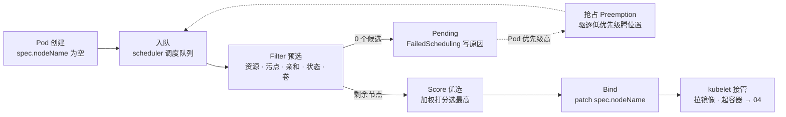
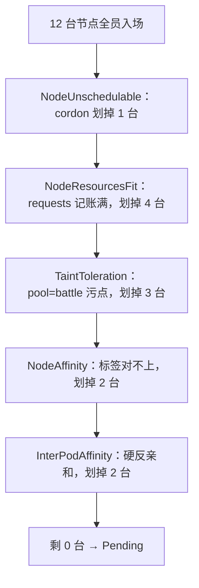
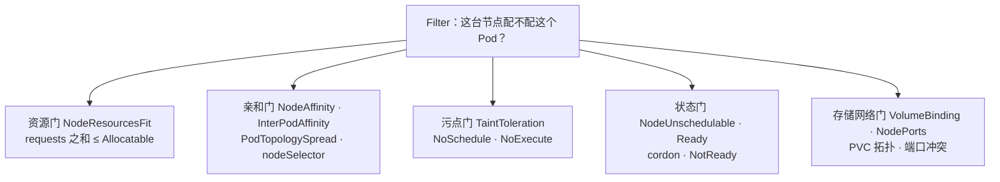
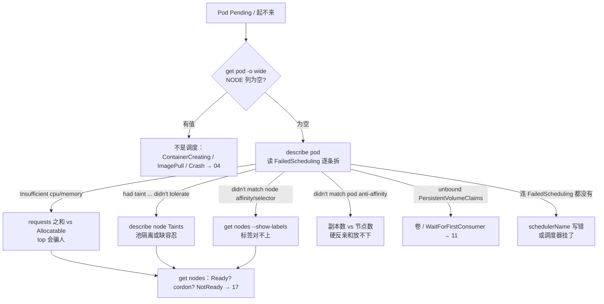

# 调度机制

> 大家好。上一章讲完控制器怎么滚发布；这一章讲**一个新 Pod 怎么落到某台机器上**——以及 Pending 时第一刀该砍哪。
> 开讲之前，先带大家回到一个开服扩容现场：网关从 3 副本扩到 10，第 4～10 个 Pod 全 Pending。有人要去调 Score 插件权重，有人准备重启调度器——可 Events 里一行 `didn't match pod anti-affinity` 写得清清楚楚：硬反亲和要求每副本独占一台节点，集群只有 3 台。
> 这一章讲完，你会知道当时那两个人错在哪——Pending 为什么几乎从不怪 Score，以及为什么重启调度器救不了硬反亲和。
> **本章回答的问题**：一个 Pod 从 Pending 到绑定节点的一生——入队、过滤、打分、绑定，每一步卡在哪、怎么一刀定责。
> **本章不讲**：容器起不来、探针、QoS → [04](../04-Pod生命周期/)；PDB 与 drain 细节 → [05](../05-工作负载控制器/) 和 [17](../17-节点运行时与升级/)；HPA 顶满与 ClusterAutoscaler → [07](../07-弹性伸缩/)；PVC 与 WaitForFirstConsumer → [11](../11-存储/)。

**标记**：🎯重点 · 🔥难点 · ⭐常考 · 🔧实操

**怎么听这场分享**：第一节是调度主图；二到六节顺着入队 → 过滤 → 抢占 → 打分 → 绑定往下走；第七节定责。Pending 几乎全卡在第三节的 Filter——那一节最厚，慢慢听。

---

## 一、一张图：一个 Pod 的调度之旅

> 🎯 **一句话**：调度是一次性流水线——入队、过滤、打分、绑定；Pending 99% 卡在「过滤」。



**读图**：从左往右读，麻烦只有两处——`NODE 列为空`查左半边（Filter 分支，含抢占虚线），`NODE 有值但没起来`查 Bind 之后的右半边。Score 分支永远不会产出 Pending；抢占虚线是 Filter 失败时的最后手段，不是必经之路。

本章三个游戏场景都挂在这张图上：**开服扩容网关全 Pending**——卡在 Filter 某道门（第三节拆）；**战斗服要独占整机**——污点门槛 + 标签门槛的落地（第三节）；**GPU 节点被普通业务抢**——先靠污点隔离，再靠优先级兜底（第三、四节）。

口诀先记一句：⭐ **Pending 只怪 Filter，不怪 Score**——开篇那两位要调权重、重启调度器的，就是把这句反着记了。好，咱们从入队讲起。

本节对应练习题 Q1。

---

## 二、入队：kube-scheduler 接单

> 🎯 **一句话**：调度器只接 `spec.nodeName` 为空的 Pod，且每个 Pod 只调度一次。

大家想想：调度器挂了，正在打本的玩家会掉线吗？很多人会答「会」——错了，答案在本节末尾。

kube-scheduler 是控制面组件（静态 Pod，→01），生产里跑多副本、靠 **leader-elect** 选主：只有 leader 真正调度，其余副本热备，leader 挂了秒级切换——所以「调度器挂」一般只影响新 Pod 的调度速度，很少彻底停摆。它 watch API Server：哪个 Pod 还没写 `spec.nodeName`，就把它拉进内部调度队列，等着跑一遍调度算法。

调度是**一次性**的：每个 Pod 创建时走一遍完整流程，定了节点就不再回头（后果第六节讲）。队列分三层：active（等着调度）、backoff（失败退避中）、unschedulable（暂时放不下）；失败的 Pod 进 unschedulable，退避到期或等到集群事件（节点状态变化、别的 Pod 删除）再唤醒重试——所以 Pending Pod 的 Events 会不断追加新的 FailedScheduling，那是它在重试，不是「卡死」。

现在的调度器是一套叫**调度框架（Scheduling Framework）**的插件化骨架——整条流水线都是**扩展点（extension point）**，插件挂上去生效。扩展点按固定顺序排：QueueSort（队列排序）→ PreFilter（预处理）→ Filter → PostFilter（过滤失败后的兜底，**抢占挂在这**）→ PreScore → Score → Reserve（占位记账）→ Permit（准入暂停）→ PreBind / Bind / PostBind（绑定）。面试追问通常就考这条链，以及「Filter/Score 是其中两个扩展点、抢占在 PostFilter」。

`spec.schedulerName` 默认是 `default-scheduler`。多调度器并存时写错名字，就没人接单——永远 Pending，而且 Events 里**连 FailedScheduling 都没有**（压根没有调度器看它）。这个配置错误比想象中常见：

```bash
kubectl get pod stuck-pod -n prod -o jsonpath='{.spec.schedulerName}'
# my-scheduler            # ← 集群里没有叫这个名字的调度器，永远 Pending
```

> 🔍 **现场**：怀疑调度器本身死了（控制面故障），先确认它还活着：

```bash
kubectl -n kube-system get pods -l component=kube-scheduler
# kube-scheduler-master-01   1/1   Running   ...    # ← 不在 Running 先救控制面（→01）
```

> 📝 **面试**：「Scheduler 挂了业务会挂吗？」——不会。已运行的 Pod 早已写好 nodeName，kubelet 照常跑容器、流量不受影响；但新 Pod、HPA 扩出来的副本、重建的实例会一直 Pending。调度器挂掉影响的是「生不出新的」，不是「已有的会死」。⭐ 这是面试高频错答：把「生不出新的」说成「已有的会死」。

入队接单清楚了。真正让 Pod Pending 的，是下一节的一道道门槛。

本节对应练习题 Q1、Q12、Q13。

---

## 三、过滤（Filter 预选）：候选一个个被划掉

> 🎯 **一句话**：Filter 一道道门槛全不过，候选为 0 才 Pending；每道门槛的淘汰原因都写在 Events 里。

开篇那批网关 Pending——咱们带着问题听：Events 里那一行到底在说哪道门没过？先看这道工序的官方插件名，后文逐个拆：
**NodeResourcesFit**（资源记账）· **NodeAffinity**（节点标签亲和）· **InterPodAffinity**（Pod 间亲和/反亲和）· **TaintToleration**（污点与容忍）· **NodeUnschedulable**（cordon）· **VolumeBinding**（卷拓扑）。插件之间是 **AND**：全部通过才算幸存，任何一道不过就划掉。反过来读一个 Pod 的 spec，每个和调度有关的字段也都挂在某道门上：

```yaml
# 一个网关 Pod 的 spec：字段 → 门槛 对照
spec:
  schedulerName: default-scheduler        # 入队：谁来接单（第二节，写错没人接）
  priorityClassName: prod-high            # 抢占：有多重要（第四节）
  resources:
    requests: { cpu: 500m, memory: 1Gi }  # 资源门：按这个记账，不是 limits
  nodeSelector: { pool: lobby }           # 标签门：一行版
  affinity:
    podAntiAffinity: { ... }              # 亲和门：不想和谁同桌
  topologySpreadConstraints: [ ... ]      # 亲和门：打散，硬 DoNotSchedule / 软 ScheduleAnyway
  tolerations: [ ... ]                    # 污点门：能开哪些门
```

走一遍真实数字的过滤漏斗：



**读图**：倒着读这张图——Events 的 `0/12 nodes are available: 4 Insufficient cpu, 3 node(s) had taint ...` 就是每道门槛划掉的数量写成一行，从数量最大的门槛查起。同一台节点可能同时撞几道门槛，计数会重叠，以 Events 原文为准。

### 资源门槛：requests 记账，limits 不参与 🔥⭐

> 🎯 **一句话**：调度看 requests 记账，不看瞬时 top；账满 ≠ 机器满。

大家先别急着看命令——问自己一句：`top` 显示 CPU 只用了 11%，为什么还报 `Insufficient cpu`？很多人会答「机器其实满了」——错了。答案是**账本满了，不是瞬时满了**。

> 💡 **打个比方**：酒店订房按**预订间数**（requests）算满不满，不看**实际住了几个人**（top）。预订全满，新客就进不来，哪怕大部分房间其实空着。

三个概念内联定义：**requests** = Pod 声明「至少要这么多」的资源，是调度记账和 QoS 分级的依据；**limits** = 运行时的资源上限；**Allocatable** = 节点能拿出来给调度的总量，`Allocatable = Capacity − kube-reserved − system-reserved − 驱逐阈值预留`（Capacity 是机器规格；两个 reserved 对应 kubelet 的 `--kube-reserved` / `--system-reserved`，即 KubeletConfiguration 里的 kubeReserved/systemReserved，给系统和 kubelet 留的）。调度条件一句话：`节点已分配 requests 之和 + 新 Pod requests ≤ Allocatable`。

```bash
kubectl describe node node-lobby-01 | grep -A9 -E "^Capacity|^Allocatable"
# Capacity:
#   cpu:      8                    # ← 机器规格
#   memory:   32Gi
# Allocatable:
#   cpu:      7800m                # ← 真正可调度：减去预留后的量
#   memory:   28Gi
```

> 🔍 **现场**：最经典的误判——`top` 很闲，Pod 却 `Insufficient cpu`：

```bash
kubectl top node node-lobby-01
# NAME            CPU(cores)   CPU%   MEMORY(bytes)   MEMORY%
# node-lobby-01   890m         11%    8192Mi          28%      # ← 瞬时使用很闲

kubectl describe node node-lobby-01 | grep -A6 "Allocated resources"
# Allocated resources:
# (Total limits may be over 100 percent, i.e., overcommitted.)   # ← limits 之和超 100% 是常态，不是事故
#   Resource   Requests       Limits
#   cpu        7600m (97%)    12400m (158%)   # ← 记账已 97%，新 Pod 要 500m 塞不下
#   memory     24Gi (85%)     40Gi (142%)
```

| 对比 | **requests** | **limits** |
|------|--------------|------------|
| 生效阶段 | 调度时记账 | 运行时上限 |
| 超了的后果 | 超了就调不进（Insufficient） | CPU throttle 限速不杀；内存超了 OOMKill（→04） |
| 不写 | 按 0 计：哪都能塞，超卖 | 默认不限 |
| 在哪看 | describe node 的 Allocated | top / 容器监控 |

> ⚠️ **别混**：把 limits 调大不会让调度更容易——调度只认 requests；反过来调小 requests 也防不住运行时 OOM。两者各管一段。

不写 requests 的后果链：调度按 0 计 → 所有节点都塞得进 → 超卖；节点真吃紧时，kubelet 按 QoS 排序驱逐，BestEffort 最先死（→04）；HPA 算利用率也要拿 requests 当分母，没写就 unknown、扩不动（→07）。生产核心服用 Guaranteed（requests = limits）。

治理分两支：单个 Pod requests 明显虚高 → 按实测 P95 调低，或参考 VPA 建议；整池 Allocatable 被吃满（HPA 顶满）→ 加节点 / ClusterAutoscaler（→07）。**不要**为了「能调度进去」把 requests 写成 0。requests 怎么定才不虚：拿监控里的实测 P95 加一档余量，CPU 和内存分开算（两者瓶颈往往不同源），上线后按 VPA 建议定期回看——拍脑袋填的数，要么虚高浪费整机，要么虚低等着被驱逐。

### 标签门槛：nodeSelector 与节点亲和

> 🎯 **一句话**：都看节点标签；nodeSelector 是最简单的 AND 匹配，nodeAffinity 分硬软。

**nodeSelector** 是一行版：Pod 带 `nodeSelector: {pool: lobby}`，只考虑打了该标签的节点，多个键值取 AND。简单分池够用。

```yaml
spec:
  nodeSelector:
    pool: lobby      # ← 节点必须带此标签，多键取 AND
```

**nodeAffinity（节点亲和）**是高级版，两个长名字内联定义：

- **requiredDuringSchedulingIgnoredDuringExecution** = 硬约束：「调度期间必须满足」（在 Filter 生效，不满足就划掉该节点）+「运行期间忽略」（跑起来之后节点标签变了也不搬家）。
- **preferredDuringSchedulingIgnoredDuringExecution** = 软约束：尽量满足，不满足也能调度，进 Score 加权（权重 1–100，第五节）。

战斗服绑机型的标准玩法就在这道门槛：required 亲和 `pool=battle` + `disk=ssd`；若用本地 SSD，还要配 WaitForFirstConsumer 的存储模式（→11），否则卷先绑到错的节点/可用区，Pod 反过来一直等卷。

> 🔍 **现场**：节点池标签是亲和的地基：

```bash
kubectl label nodes node-lobby-01 pool=lobby zone=az-a
kubectl label nodes node-battle-03 pool=battle zone=az-a disk=local-ssd
kubectl get nodes --show-labels | grep battle
# node-battle-03  Ready  ...  disk=local-ssd,pool=battle,zone=az-a   # ← 键少而稳定
```

标签设计的纪律：**键要少而稳**（pool / zone / disk 这类够用），不要每搞一次活动就发明新标签——亲和规则、节点池脚本、容量统计全挂在这套标签上，改一个键的语义等于让所有存量调度规则失效。

> ⚠️ **别混**：nodeSelector/nodeAffinity 看的是**节点自己的标签**；Pod 亲和（下一小节）看的是**节点上已经跑着哪些 Pod**——数据源完全不同。

### 亲和门槛：Pod 亲和/反亲和与 topologySpread 🔥⭐

> 🎯 **一句话**：Pod 亲和看「邻居」；硬反亲和要求节点数 ≥ 副本数，少一个，最后一个就永远 Pending。

> 💡 **打个比方**：硬反亲和像**「同一桌不能坐两个同名玩家」**——只有 2 张桌却来了 3 人，第 3 个只能站门口（Pending）；软反亲和是「尽量分开坐，坐不下也凑合」。

**podAffinity**（想和谁一起，如缓存贴着业务部署）/ **podAntiAffinity**（不想和谁一起，如网关副本打散到不同节点）。**topologyKey** 决定「一起/分开」按什么粒度：`kubernetes.io/hostname` 是不同节点，`topology.kubernetes.io/zone` 是不同可用区。

网关打散的标准写法：

```yaml
affinity:
  podAntiAffinity:
    requiredDuringSchedulingIgnoredDuringExecution:
      - labelSelector:
          matchLabels: { app: gateway }
        topologyKey: kubernetes.io/hostname      # ← 每台节点最多一个网关副本
```

经典事故：网关 3 副本，硬 podAntiAffinity 打在 hostname 上，集群只有 2 台 Ready 节点——第 3 个永远 Pending：

```text
0/2 nodes are available: 2 node(s) didn't match pod anti-affinity rules.
# ← 两台节点上都已有同名 Pod，硬反亲和放不下
```

无状态服务更推荐 **topologySpreadConstraints**（打散约束）：**maxSkew** = 任意两个拓扑域之间允许的最大 Pod 数量差（maxSkew=1 即基本均匀）；`whenUnsatisfiable` 两档——**DoNotSchedule**（硬，和硬反亲和一样会卡 Pending）/ **ScheduleAnyway**（软，进 Score）。不打散导致全堆一台，单点宕机就是「全区大厅没了」级别的事故；但节点库存有限时要用软约束保上线，不要硬约束保打散。

> ⚠️ **别混**：硬反亲和 / DoNotSchedule 在开服扩副本前先算「节点数 ≥ 副本数」；节点不够时，第 N 个副本永远 Pending——那不是调度器坏了。

### 污点门槛：taints 与 tolerations 🔥⭐🔧

> 🎯 **一句话**：污点打在节点上拒人，容忍挂在 Pod 上开门；只有 NoExecute 会赶走已在跑的 Pod。

口诀先钉死：⭐ **NoSchedule 拦新客，NoExecute 赶老客；PreferNoSchedule 只是软劝**。很多人把 NoSchedule 说成「会把已有 Pod 赶走」——那是高频错答。

> 💡 **打个比方**：污点是门口**「VIP 厅，谢绝散客」**的牌子，容忍是**邀请函**。NoSchedule 只拦新客；NoExecute 还会把厅里没邀请函的老客请出去。

污点（taint）打在节点上（`kubectl taint`），容忍（toleration）写在 Pod spec 里。三档 **effect**，官方名：

| Effect | 新 Pod（无容忍） | 已有 Pod（无容忍） |
|--------|------------------|--------------------|
| **NoSchedule** | 不调度进来 | 不受影响 |
| **PreferNoSchedule** | 尽量不来（软，进 Score） | 不受影响 |
| **NoExecute** | 不调度进来 | **驱逐**（可用 tolerationSeconds 延缓） |

容忍的匹配两种写法：**operator Equal**（key/value/effect 全对上）/ **operator Exists**（只匹配 key，值任意；key 留空 = 容忍一切）。NoExecute 还能配 `tolerationSeconds`——已跑着的 Pod 最多再忍多久才被驱逐。

```yaml
tolerations:
  - key: pool
    operator: Equal
    value: battle
    effect: NoSchedule
```

NoExecute 配 `tolerationSeconds` 的典型场景，是给业务对「节点失联」留缓冲：

```yaml
tolerations:
  - key: node.kubernetes.io/unreachable
    operator: Exists
    effect: NoExecute
    tolerationSeconds: 600        # ← 节点失联先忍 10 分钟再被驱逐（默认 300s）
```

> 🔍 **现场**：分池隔离是节点池的基本功：

```bash
kubectl taint nodes node-battle-03 pool=battle:NoSchedule     # 打污点
kubectl taint nodes node-battle-03 pool=battle:NoSchedule-    # 末尾 - 号 = 去掉
kubectl taint nodes node-gpu-01 pool=gpu:NoSchedule           # GPU 池同理
kubectl describe node node-battle-03 | grep Taints
# Taints:  pool=battle:NoSchedule       # ← 没容忍的新 Pod 进不来
```

独占战斗池 / GPU 池 = 池污点 + 对应容忍，别无他法。口头约定「别把大厅调到战斗机上」没用——HPA 扩容只认资源记账，不认口头；没有污点，大厅副本迟早铺到战斗机上抢 CPU。GPU 节点被普通业务占了也一样：打 `pool=gpu:NoSchedule`，训练任务加容忍，普通业务自然进不来。

两条红线：CNI / kube-proxy / 监控这类 DaemonSet 要用 `Exists`（不写 key）容忍所有污点，否则节点上连网络插件都跑不起来；业务 Pod 反过来**不要**容忍控制面污点（`node-role.kubernetes.io/control-plane:NoSchedule`），否则业务 Pod 会上 master。

给池子选 effect 时别手重：**误打 NoExecute 会把节点上没容忍的存量 Pod 立刻驱逐**——战斗节点池打错档，等于亲手赶走战斗服，比打 NoSchedule 狠得多。首次隔离存量池子的标准动作是先 NoSchedule 挡新的、存量通过滚动逐步替换，确认无感后再评估要不要升级档位。

节点 NotReady 是 NoExecute 最大的出场：节点控制器会给 NotReady 节点打 `node.kubernetes.io/not-ready:NoExecute` 污点，不容忍的 Pod 默认 **300s** 后被驱逐。这是控制面主动出手，和 drain 不是一条路——drain 是自愿驱逐、尊重 PDB（→05、17）；NotReady 驱逐 PDB 拦不住，游戏服被赶等于非自愿中断，先救节点（→17）。

### 状态与存储门槛（简短）

- **cordon**：`kubectl cordon` 把节点 `spec.unschedulable=true`，NodeUnschedulable 门槛直接划掉——只挡新 Pod，已有的不受影响；`get nodes` 的 STATUS 显示 `Ready,SchedulingDisabled`。只 cordon 不 drain，战斗服还在跑。drain 是另一回事（→17）。
- **VolumeBinding**：PVC 没绑定 → Events 写 `unbound PersistentVolumeClaims`；StorageClass 的 `volumeBindingMode: WaitForFirstConsumer` 表示卷等 Pod 定落点再绑（Immediate 则是先绑卷），等待期里卷和 Pod 互相等，要连起来看（→11）。
- **NodePorts**：宿主机端口 / NodePort 冲突也会在 Filter 被划掉，游戏场景少见。

### 读 FailedScheduling：按条拆 🔧⭐

> 🔍 **现场**：Pending 的第一现场永远是 `describe pod` 的最后几行。

```bash
kubectl describe pod hall-x -n prod | tail -8
# Events:
#   Type     Reason            Age  From               Message
#   Warning  FailedScheduling  3m   default-scheduler  0/12 nodes are available:
#     4 Insufficient cpu,                                    # ← 4 台 requests 记账满（资源门槛）
#     3 node(s) had taint {pool: battle}, ...                # ← 3 台有污点没容忍（污点门槛）
#     2 node(s) didn't match Pod's node affinity/selector,   # ← 2 台标签对不上（标签门槛）
#     2 node(s) didn't match pod anti-affinity rules,        # ← 2 台已有同名 Pod（亲和门槛）
#     1 node(s) had untolerated taint {node.kubernetes.io/unreachable}  # ← 1 台宕机
```

按分号逐条拆，每条对应上面一道门槛；计数可能重叠（同一台节点同时撞几道）。批量扫全集群的 Pending：

```bash
kubectl get events -n prod --field-selector reason=FailedScheduling --sort-by=.lastTimestamp
# LAST SEEN   TYPE      REASON             OBJECT            MESSAGE
# 6m          Warning   FailedScheduling   pod/gateway-7d4b  0/12 nodes are available: 4 Insufficient cpu ...
# 2m          Warning   FailedScheduling   pod/gateway-7d4b  0/12 nodes are available: 4 Insufficient cpu ...   # ← 同一 Pod 反复出现：队列退避重试，不是新故障
# 90s         Warning   FailedScheduling   pod/battle-3      0/12 nodes are available: 3 node(s) had taint ...
```

> 🔍 **现场**：同一 Pod 反复出现且计数不变，是重试的正常样子；要警惕的是**计数在变**——Insufficient 的台数忽多忽少，说明账本在动（有 Pod 在进出），先看一分钟再定型。

### 收束：Filter 的五道门



**读图**：Pending 必是五道门之一没过——① 资源满（记账不是瞬时）② 亲和/反亲和不满足（硬约束）③ 污点没容忍 ④ 节点不 Ready 或被 cordon ⑤ 卷/端口不合适。五个字背下来：**资源、亲和、污点、状态、存储**；Events 的每一条分号就是各门的报告。

> ⚠️ **别混**：Filter 通过只决定「此刻能放进去」，不保证之后一直安稳——节点故障、运行时驱逐、OOM 都是后面的事（→04、17）。另外记住主图那句话：Pending 只在 Filter 为 0 时发生，永远别赖 Score。

> 📝 **面试**：「Pending 怎么查？」——先 `describe pod` 读 Events 的 FailedScheduling；0/N 是 Filter 的结论清单，按分号拆开对到五道门：Insufficient 查记账、taint 查容忍、affinity 查标签、unbound PVC 查存储。**不要**先去调 Score 权重、重启调度器。

五道门口诀：⭐ **资源、亲和、污点、状态、存储**——Events 每个分号就是一门的报告。Filter 全过不了还有最后一招：抢占。

本节对应练习题 Q2、Q3、Q4、Q5、Q6、Q11。

---

## 四、没候选了：优先级与抢占

> 🎯 **一句话**：Filter 零候选后，高优先级 Pod 还有最后一招——驱逐低优先级腾位置，这就是抢占（Preemption）。

大家想想：节点紧的时候，能不能给战斗服标低优先级「让出资源」？听完这一节你就知道为什么绝对不能。

**PriorityClass** 是集群级对象，`value` 是整数，越大越重要。Pod 创建时，准入控制器把 `spec.priorityClassName` 落成 `spec.priority`，调度时拿它比大小。系统内置两个高优：**system-node-critical**（2000001000）、**system-cluster-critical**（2000000000）；业务自建，如 prod-high / batch-low：

```bash
kubectl get priorityclass
# NAME                    VALUE         GLOBAL-DEFAULT   AGE
# system-node-critical    2000001000    false            120d
# system-cluster-critical 2000000000    false            120d
# prod-high               1000000       false            120d   # ← 在线业务
# batch-low               100           false            120d   # ← 离线批处理，节点紧时先被挤
```

两张补充语义：**globalDefault=true** 的 PriorityClass 给所有没写 priorityClassName 的 Pod 兜底（全集群只能有一个；不建则默认优先级 0）；**`preemptionPolicy: Never`** 让这个类只参与排序、永远不发起抢占——给「重要但别抢别人」的服务用。

抢占发生在 Filter 零候选之后的 PostFilter 扩展点：调度器寻找「驱逐哪些低优先级 Pod 之后，这个节点就能放下我」，被驱逐的那些叫 **victim（牺牲者）**。流程：优雅删除 victim → Pending Pod 标记 `nominatingNodeName` 占位 → 等 victim 真正退出 → 重新调度上来。victim 的 Events 里会多一条 `Preempted by <ns>/<pod>`：

```bash
kubectl describe pod batch-job-9 -n batch | tail -4
# Events:
#   Warning  Preempted  default-scheduler  Preempted by prod/gateway-7d4b9c on node node-lobby-02   # ← victim 视角：被谁抢、在哪台
```

抢占不是瞬时动作，有三处不确定：victim 优雅退出要时间（战斗服这类长连接更慢）；victim 退出可能被 PDB 拦，抢占会换节点甚至放弃；等待期间集群状态又在变，重试时会重新评估——所以看到 `nominatingNodeName` 也不等于「马上成功」。值班看到有 Pod 突然没了，先翻它的 Events 有没有 Preempted，再下「节点故障」的结论。

> 💡 **打个比方**：抢占是**「VIP 来了，把普通票观众请出去」**——但「请出去」也是优雅终止、不是秒杀，还可能被 PDB 拦。

游戏运维的立场：

- **批处理/离线给低 PriorityClass 是对的**：节点紧时先挤掉它们，这正是混部的意义。
- **在线战斗服不要标低优先级「让出资源」**：那等于节点一紧先杀对局，比 Pending 严重得多。
- **GPU 节点被普通业务占**：先做池污点隔离（三节污点门槛），优先级是保险不是替代。
- **不要靠抢占当容量规划**：victim 是优雅删除但仍是中断，且 PDB 可能拦抢占；关键业务扩容要靠容量，不是靠挤别人。

> ⚠️ **别混**：抢占 = 驱逐正在跑的 Pod，属于自愿中断的亲戚（与 drain 同类，→17）。开抢占前先想清楚谁会是 victim：战斗服、单副本有状态服务必须排除在低优先级之外，或有 PDB 保底。

口诀：⭐ **批处理低优先级可以挤，战斗服绝不能低**——抢占是保险，不是容量规划。Filter 过了、有候选了，下一节才谈「去哪更好」。

本节对应练习题 Q7。

---

## 五、打分（Score 优选）：在剩下的里挑一个

> 🎯 **一句话**：Score 只给剩余候选排名选最高；打分失败不会 Pending——调权重救 Pending 是误诊。

回到开篇：有人想调 Score 权重救 Pending。大家想想——Score 这一步会不会产出 Pending？答案是永远不会。

每个打分插件给每台幸存节点打 **0–100 分**，乘以该插件的**权重**求和，选总分最高的节点。常见插件的官方名：

- **LeastAllocated**：节点 requests 记账用得越少分越高——默认倾向，Pod 摊得均匀。
- **MostAllocated**：反过来，装箱（bin-packing），先用满几台、省出整机给大 Pod。
- **BalancedAllocation**：CPU 与内存的记账用量越接近分越高，避免「CPU 满、内存闲」。
- **ImageLocality**：节点上已有这个镜像加分，省拉取时间。
- 加上所有软约束的分：preferred 的节点亲和、preferred 的 Pod 亲和、ScheduleAnyway 的打散——**软约束全部在 Score 阶段生效**，权重 1–100。

场景举例：战斗池开 **MostAllocated** 装箱——先把几台战斗机用满、留出整机，下一批要整机的服才有地方落；代价是用满的几台没缓冲，节点一抖动就是连环压力。所以装箱只用在「明确要留整机」的池子，默认池仍是 LeastAllocated 摊匀。

> 🔍 **现场**：分布不均先确认，再谈权重：

```bash
kubectl get pod -n prod -l app=gateway -o wide
# gateway-a   ...   node-lobby-01
# gateway-b   ...   node-lobby-01        # ← 三个副本全堆一台：分布问题，查软约束/Score 倾向
# gateway-c   ...   node-lobby-01
```

想知道某个 Pod 到底怎么被打分的，调度器日志开到 `--v=10` 能看到各扩展点的候选与分数明细——值班很少用，但「Score 怎么验证」只有这一条路。

插件权重在 KubeSchedulerConfiguration 里配，值班很少动这一层。「调度不均」才归 Score 管——加打散/软反亲和；「调度不进去」不归它管。

> ⚠️ **别混**：**Filter vs Score**——Filter 决定「能不能去」（不过 → Pending），Score 决定「去哪更好」（总能选出一个）。旧名追问要接得住：Filter 旧名 **predicate（预选）**，Score 旧名 **priority（优选）**，最后 Bind 写 nodeName。

> 📝 **面试**：「调度不均和调度不进去怎么区分？」——不进去查 Filter：Events 按条拆；不均查 Score 倾向与软约束：`get pod -o wide` 看分布，加 topologySpread 或软反亲和。不要答反，更不要用调权重去救 Pending。⭐ 口诀：**不进去查 Filter，不均查 Score**。

挑好节点了。下一站：把名字写进 spec——注意，写完还不等于起来。

本节对应练习题 Q1。

---

## 六、绑定：写上 nodeName 不等于起来了

> 🎯 **一句话**：Bind 只是把 spec.nodeName 写成赢家节点；容器还没影，接下来归 kubelet。

Score 选出赢家，调度器向 API Server 发 Bind 请求：把 Pod 的 `spec.nodeName` patch 成那台节点。此刻 Pod「已绑定」，但**节点上还没有任何东西跑起来**——目标节点的 kubelet 看到 spec.nodeName 是自己，才开始调 CRI 拉镜像、起容器、维护探针，全是后话（→04）。

Bind 在调度框架里是**异步**的：调度器发完 Bind 请求就回头处理队列里的下一个，不等容器起来——所以「调度吞吐」和「Pod 启动时长」是两个指标：前者卡看调度器，后者卡看节点。

所以「调度成功 ≠ Running」：`get pod -o wide` 里 NODE 列有值之后，卡在 ContainerCreating / ImagePullBackOff / CrashLoopBackOff，责任已经移交给 kubelet、镜像和应用——重启调度器毫无意义。

> ⚠️ **别混**：**调度成功 ≠ Running**。Bind 只写一个字段；NODE 列有值但没起来 → 查 kubelet/CRI/镜像（→04），不是调度问题。

调度器对每个 Pod **只在创建时做一次**。跑起来之后，改节点标签、改亲和规则都不会触发搬家——这就是 IgnoredDuringExecution 的字面意思。要搬家，走滚动更新或驱逐（→05）；战斗服、正在对局的实例，**不要**为了调度强删。

为什么设计成一次性？调度依赖的是**那一刻的集群快照**，持续回头重排每个 Pod 的成本极高，而搬家本身就是中断——K8s 的选择是「创建时认真挑，之后不打扰」，再平衡交给专门的组件按需做。追问「调度器为什么不持续优化布局」，答这一句就够。

那「新节点空着、老节点堆满」谁来管？调度器不回头——它只接新 Pod。**Descheduler** 就是干这个的：它是**再平衡器，不是第二套调度器**，按策略（如 LowNodeUtilization）驱逐一部分运行中的 Pod，让它们被调度器重新调度。

```bash
kubectl get pod -n prod -l app=hall -o wide
# NAME      READY  STATUS   AGE   NODE
# hall-a    1/1    Running  2m    node-new-07    # ← AGE 从 30d 突变到分钟级：Descheduler 或 drain 动过
```

```bash
kubectl get events -n prod --field-selector reason=Killing | grep hall
# 4m   Normal   Killing   pod/hall-b   Stopping container hall   # ← 老节点 Killing、新节点冒出新 Pod：被驱逐重调度过
```

Descheduler 的驱逐是自愿中断：PDB 拦得住（和拦 drain 一样）；生产必须限定 namespace/label 范围，StatefulSet 和战斗服要排除——否则「再平衡」等于把正在对局的玩家踢下线。

> 📝 **面试**：「Descheduler 和 Scheduler 的区别？」——调度器只在 Pod 创建时调度一次，之后不回头；Descheduler 是事后再平衡器，驱逐运行中的 Pod 触发重新调度，它尊重 PDB，有状态和战斗类业务必须排除在策略外。

口诀：⭐ **调度成功 ≠ Running；Descheduler 是再平衡，不是第二套调度器**。主线走完了，收作战定责——开篇那个现场的正确解法。

本节对应练习题 Q8、Q9、Q10。

---

## 七、作战：Pending 定责

> 🎯 **一句话**：Pending 第一刀永远是 describe pod 读 Events；按条定型再动手，不调权重、不重启调度器。 ⭐



**读图**：第一刀先问「NODE 列空不空」——有值说明调度已完成，本章到此为止，剩下是 04 的活。为空才进左分支，按五道门的报告句对号入座；最后都要汇到节点状态检查，别漏 NotReady 和 cordon 这两个可能。

第二刀是节点面——五道门的报告读完，还要看节点本身：

```bash
kubectl get nodes -o wide
# NAME            STATUS     VERSION   INTERNAL-IP
# node-lobby-01   Ready      v1.28.3   10.0.1.11
# node-battle-03  Ready      v1.28.3   10.0.1.31      # ← Ready：门槛问题，按条查
# node-lobby-07   NotReady   v1.28.3   10.0.1.17      # ← NotReady：先救节点（→17）
```

| 现象 | 先做 | 别做 |
|------|------|------|
| 一批全 Pending | describe Events，按 0/N 拆 | 调 Score 权重、重启调度器 |
| Insufficient + top 很闲 | 看 Allocated 的 requests 之和 | 看 top 低就说「机器还有余量」 |
| 第 N 副本 Pending + 反亲和 | 算节点数 ≥ 副本；改 preferred / spread | 硬扛硬反亲和 |
| 大厅铺进战斗机 | 战斗池打 NoSchedule，大厅不容忍 | 靠口头约定 |
| GPU 节点被普通业务占 | GPU 池污点 + 训练任务容忍 | 只给训练任务开抢占 |
| NODE 有值但不起来 | 查 kubelet / CRI / 镜像 → 04 | 怀疑调度器 |
| 战斗服被抢占 | 战斗 PriorityClass 调高、批处理调低 | 让战斗服低优先级「让资源」 |
| Pod 被驱逐 + 节点 NotReady | 救节点 → 17，别指望 PDB 拦 | cordon 了事 |

**定完责还差一步：把修复动作映射到责任方**——记账满 → 容量问题，走扩容预案（07）；污点/容忍/标签配错 → 配置问题，修 spec 并给扩容模板补 CI 校验；节点 NotReady → 节点问题（17）。同一道门被反复撞开，说明缺的是治理，不是再排一次障。

**60 秒剧本** 🔧：

```text
① 0–10s   kubectl get pod -n prod -o wide          确认 Pending 且 NODE 为空；NODE 有值 → 04
② 10–30s  kubectl describe pod {pod} -n prod       Events 读 FailedScheduling，逐条记下计数
③ 30–45s  按条定型：Insufficient → describe node Allocated
                    taint → describe node Taints · affinity → get nodes --show-labels
④ 45–60s  出手：整池满 → 加节点/CA（07）；单个虚高 → 降 request
                    污点/亲和 → 修池配置；节点挂 → 17；不调权重、不强删战斗服
```

现在再看开篇那两个人——调 Score 权重、重启调度器——你知道该怎么拦住他们了：先 `describe` 读 Events，按五道门对号入座。收口。

本节对应练习题 Q11、Q14。

---

## 八、收口

### 命令速查 🔧

```bash
kubectl describe pod {pod} -n {ns}                          # Events 第一现场
kubectl get events -n {ns} --field-selector reason=FailedScheduling
kubectl describe node <n> | grep -A12 Allocatable           # 可调度总量
kubectl describe node <n> | grep -A8 "Allocated resources"  # requests 记账用了多少
kubectl describe node <n> | grep Taints                     # 谁在拒人
kubectl get nodes -o wide --show-labels                     # Ready / 标签总览
kubectl get nodes | grep -v " Ready"                        # 谁 NotReady
kubectl taint nodes <n> k=v:NoSchedule                      # 打污点；末尾 - 号去掉
kubectl get priorityclass                                   # 谁能抢占谁
kubectl get pod -n {ns} -o wide                             # 是否堆在一台 / AGE 突变
kubectl get pods -A --field-selector=status.phase=Pending   # 全集群 Pending 一把抓
```

### 面试锚点

遮住右列自问自答，卡壳的行回去重读对应小节——能讲出来才算会，看着答案点头不算。

| 问 | 30 秒答 |
|----|---------|
| 调度分哪几个阶段？ | Filter 预选划掉候选，0 候选 → Pending；Score 优选只挑最高分；Bind 写 nodeName。旧名 predicate / priority。 |
| 调度框架有哪些扩展点？ | QueueSort→PreFilter→Filter→PostFilter→PreScore→Score→Reserve→Permit→PreBind/Bind/PostBind；Filter/Score 是其中两个，抢占挂 PostFilter。 |
| 调度失败的 Pod 去哪了？ | 进 unschedulable 队列：退避到期或被集群事件唤醒重试，Events 不断追加 FailedScheduling——那是重试，不是卡死。 |
| Scheduler 挂了业务会挂吗？ | 已有不受影响：nodeName 早写好，kubelet 照跑；新 Pod、扩容出来的全 Pending。 |
| 调度成功 = 容器起来了？ | 不。Bind 只写 spec.nodeName，拉镜像起容器是 kubelet + CRI 的事（→04）。 |
| top 很闲为什么 Insufficient？ | 调度看 requests 记账不看瞬时用量；记账之和 ≥ Allocatable 就卡，看 describe node 的 Allocated。 |
| request vs limit？ | requests 管调度记账与 QoS/HPA 分母；limits 管运行时上限——CPU 超了 throttle，内存超了 OOMKill。 |
| Allocatable 是什么？ | Capacity − kube/system 预留 − 驱逐阈值预留；调度拿它和 requests 之和比。 |
| required vs preferred？ | required 硬约束在 Filter，不满足就 Pending；preferred 软约束在 Score 加权（1–100）；都是 IgnoredDuringExecution，跑起来不搬家。 |
| 硬反亲和 3 副本 2 节点？ | 第 3 个永远 Pending；要么节点数 ≥ 副本，要么改 preferred / topologySpread。 |
| topologySpreadConstraints？ | 均匀打散约束：maxSkew 是域间最大差，DoNotSchedule 硬 / ScheduleAnyway 软。 |
| 污点三档？ | NoSchedule 拦新；PreferNoSchedule 尽量避开；NoExecute 拦新 + 驱逐已有的（可用 tolerationSeconds 延缓）。 |
| 独占池怎么做？ | 池打 NoSchedule 污点 + 业务挂容忍；口头约定挡不住 HPA。 |
| NotReady 节点上的 Pod 为什么被赶？ | 节点控制器打 not-ready:NoExecute 污点，不容忍默认 300s 驱逐；和 drain 不是一条路，PDB 拦不住。 |
| 抢占什么时候触发？ | Filter 零候选 + Pod 优先级高：驱逐低优先级 victim 腾位置；别拿它当容量规划。 |
| 战斗服能标低优先级吗？ | 不能，节点一紧先杀对局；批处理低才对，战斗用高优。 |
| 改亲和老 Pod 会搬吗？ | 不会，IgnoredDuringExecution；搬家靠滚动/驱逐。Descheduler 是再平衡，尊重 PDB。 |
| cordon 和 drain？ | cordon 只挡新 Pod（Filter 划掉），已有不动；drain 驱逐已有、尊重 PDB（→17）。 |

### 易错一句话对照

- Score 失败会 Pending → 只有 Filter 为 0 才 Pending
- 调度成功 = 容器起来了 → 只写了 nodeName，kubelet 才起容器
- top 闲就是有余量 → 调度看 requests 之和 vs Allocatable
- 不写 requests 没关系 → 按 0 计超卖，压力时 BestEffort 先被驱逐，HPA 还算不了
- limits 写大能多占调度额度 → 调度只认 requests
- 改亲和老 Pod 会搬 → IgnoredDuringExecution，搬家靠滚动/驱逐
- NoSchedule 会赶已有 Pod → 只有 NoExecute 赶
- 容忍写得越多越保险 → 业务容忍控制面污点 = 业务上 master
- 口头约定保住战斗池 → HPA 只认记账，靠污点
- 战斗服低优先级让资源 → 节点一紧先杀对局
- 抢占是容量规划 → victim 仍是中断，PDB 还可能拦
- Descheduler 是第二套调度器 → 它是再平衡，驱逐运行中 Pod
- cordon 会杀 Pod → 只挡新的，战斗服照跑
- Pending 就调 Score 权重 → 先 Events 拆 Filter 条目
- 0/N 是一个原因 → 按分号拆，每条一个计数，AND 叠加
- 重启调度器能让调度变快 → 调度是事件驱动 + 队列重试，重启只丢进度
- 每搞活动发明新标签 → 标签键少而稳，改一个键全池调度规则失效
- cordon 的节点是坏了 → cordon 是人为挡新 Pod，节点自己还 Ready

### 数字墙

> Filter 旧名 **predicate** · Score 旧名 **priority** · 打分 **0–100** × 权重 · preferred 权重 **1–100** · 污点 **3** 档效果 · not-ready/unreachable 默认容忍 **300s** · system-cluster-critical **2000000000** · system-node-critical **2000001000** · Filter 五道门：**资源、亲和、污点、状态、存储** · Allocatable = Capacity − **3** 份预留 · 硬反亲和要节点数 **≥** 副本 · Bind 只写 **1** 个字段：spec.nodeName · 调度框架 **11** 个扩展点（抢占挂 PostFilter）

---

## 合上书

合上书自检（题号对齐练习题）：

- [ ] **默画一节主图**：入队 → Filter → Score → Bind，Pending 只在 Filter 零候选发生；抢占是 Filter 失败的虚线分支；Bind 之后归 kubelet。（Q1）
- [ ] **口述入队**：调度器接什么单、调度框架扩展点是什么、Scheduler 挂了的后果、schedulerName 写错的 Pending 长什么样。（Q1、Q12、Q13）
- [ ] **口述资源记账**：为什么 top 很闲还 Insufficient、Allocatable 公式、requests vs limits 分工、不写 requests 的后果链。（Q3）
- [ ] **默画 Filter 五道门**：资源、亲和、污点、状态、存储；Events 的 0/N 怎么按分号拆。（Q2、Q11）
- [ ] **口述亲和**：nodeSelector / nodeAffinity / Pod 亲和的数据源区别；两个长名字 required/preferred 各在哪一阶段；硬反亲和 3 副本 2 节点的结果；maxSkew 是什么。（Q5、Q6）
- [ ] **口述污点**：三档效果各管什么、哪档才会赶已有 Pod；独占战斗池怎么做；口头约定为什么没用；系统组件容忍与业务红线。（Q4）
- [ ] **口述抢占**：什么时候触发、谁是 victim、战斗服为什么不能低优先级。（Q7）
- [ ] **口述绑定**：Bind 干了什么；为什么调度成功 ≠ Running；改亲和为什么不搬家；Descheduler 是什么、不是什么。（Q8、Q9）
- [ ] **定责**：60 秒剧本走一遍；Events 里四条常见句子各查什么、各治哪。（Q11、Q14）
- [ ] **口述三条驱逐路**：cordon / drain / NotReady 驱逐各是谁发起、已有 Pod 会怎样、PDB 拦不拦。（Q10）

十条都能不看稿讲下来，这一章就过了。终极测试：拦住开篇那两个误操作——调 Score 权重、重启调度器。下一章：[07 弹性伸缩](../07-弹性伸缩/)。相关：[04 Pod 生命周期](../04-Pod生命周期/) · [17 节点运行时与升级](../17-节点运行时与升级/) · [18 典型故障剧本](../18-典型故障剧本/)。
