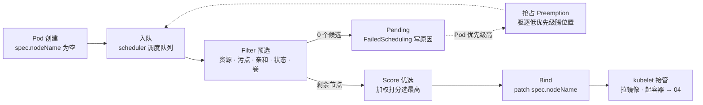
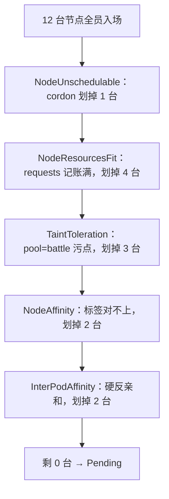
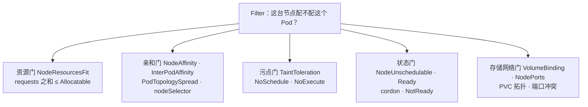
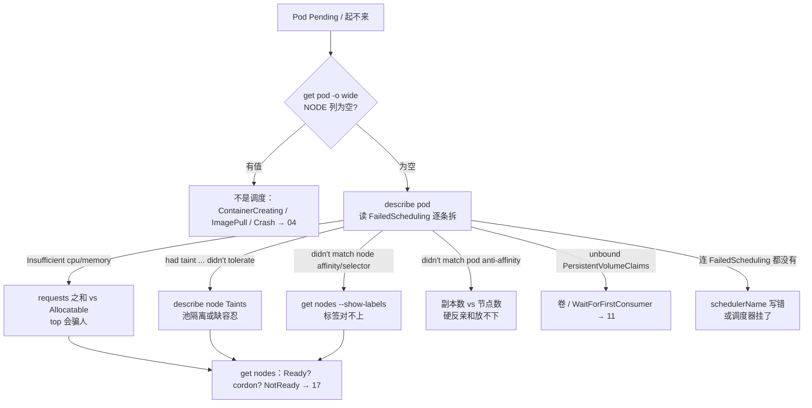

# 调度机制

> 网关从 3 副本扩到 10，第 4～10 个全 Pending。有人要调 Score 权重，有人准备重启调度器——Events 里一行 `didn't match pod anti-affinity` 写得明明白白：硬反亲和要求每副本独占一台，集群只有 3 台。
> **本章回答**：一个 Pod 从 Pending 到绑定节点——入队、过滤、打分、绑定，每步卡在哪、怎么一刀定责。
> **不讲**：容器起不来、探针、QoS → [04](../04-Pod生命周期/)；PDB 与 drain → [05](../05-工作负载控制器/) · [17](../17-节点运行时与升级/)；HPA / ClusterAutoscaler → [07](../07-弹性伸缩/)；PVC / WaitForFirstConsumer → [11](../11-存储/)。

**标记**：🎯重点 · 🔥难点 · ⭐常考 · 🔧实操
---

## 一、一张图：一个 Pod 的调度之旅

> 🎯 **一句话**：调度是一次性流水线——入队、过滤、打分、绑定；Pending 99% 卡在「过滤」。



- 📖 **读图**
  - 🛤️ 主线「入队 → Filter → Score → Bind」；`NODE` 列空查左半边 Filter（含抢占虚线），`NODE` 有值但没起来查 Bind 之后（→04）
  - ⚔️ Score **永远不产出 Pending**；抢占是 Filter 失败后的虚线兜底，不是必经之路

- 🎮 **三个场景挂图上**
  - 开服扩容网关全 Pending → Filter 某道门（第三节）
  - 战斗服独占整机 → 污点 + 标签门槛（第三节）
  - GPU 被普通业务抢 → 先污点隔离，再优先级兜底（第三、四节）

- ⭐ **口诀**：Pending 只怪 Filter，不怪 Score——开篇两位要调权重、重启调度器，就是把这句反着记了

本节对应练习题 Q1。

---

## 二、入队：kube-scheduler 接单

> 🎯 **一句话**：调度器只接 `spec.nodeName` 为空的 Pod，且每个 Pod 只调度一次。

- 🏭 **kube-scheduler** = 控制面组件（静态 Pod →01），生产多副本靠 **leader-elect** 选主：只有 leader 真正调度
  - 挂了一般只拖慢**新** Pod，很少彻底停摆
  - watch API Server：谁还没写 `spec.nodeName`，就拉进内部队列

- 🔁 **一次性**：创建时走完一遍就定节点，之后不回头（后果第六节）
  - 队列三层：active（等调度）· backoff（失败退避）· unschedulable（暂时放不下）
  - 失败进 unschedulable；退避到期或集群事件（节点变化、Pod 删除）再唤醒——Events 不断追加 FailedScheduling = **重试**，不是卡死

### 🔌 调度框架：插件挂扩展点 ⭐

- **Scheduling Framework** = 插件化骨架；整条流水线是固定顺序的**扩展点（extension point）**：

```text
QueueSort → PreFilter → Filter → PostFilter（抢占挂这）
→ PreScore → Score → Reserve → Permit
→ PreBind / Bind / PostBind
```

- 面试追问通常考这条链 +「Filter/Score 是其中两个、抢占在 PostFilter」

### 📛 schedulerName 写错：连 FailedScheduling 都没有 🔧

- `spec.schedulerName` 默认 `default-scheduler`
- 写错名字 → 没人接单 → 永远 Pending，且 Events **没有** FailedScheduling

```bash
kubectl get pod stuck-pod -n prod -o jsonpath='{.spec.schedulerName}'
# my-scheduler            # ← 集群里没有这个调度器，永远 Pending
```

> 🔍 **现场**：怀疑调度器本身死了，先确认还活着：

```bash
kubectl -n kube-system get pods -l component=kube-scheduler
# kube-scheduler-master-01   1/1   Running   ...    # ← 不在 Running 先救控制面（→01）
```

#### ❓ 调度器挂了，正在打本的玩家会掉线吗？

- ❌ **不会**：已运行 Pod 的 `nodeName` 早写好，kubelet 照跑，流量不受影响
- ✅ **会受影响的是**：新 Pod、HPA 扩出来的副本、重建实例 → 一直 Pending
- 📝 高频错答：把「生不出新的」说成「已有的会死」

> 📝 **面试**：「Scheduler 挂了业务会挂吗？」——不会。已有不受影响；新的、扩容的全 Pending。⭐

入队清楚了。真正让 Pod Pending 的，是下一节的一道道门槛。

本节对应练习题 Q1、Q12、Q13。

---

## 三、过滤（Filter 预选）：候选一个个被划掉

> 🎯 **一句话**：Filter 一道道门槛全不过，候选为 0 才 Pending；每道门槛的淘汰原因都写在 Events 里。

- 官方插件名（AND：全部通过才幸存）：
  - **NodeResourcesFit** · **NodeAffinity** · **InterPodAffinity** · **TaintToleration** · **NodeUnschedulable** · **VolumeBinding**
- 反过来读 Pod spec，每个调度相关字段都挂在某道门上：

```yaml
# 字段 → 门槛 对照
spec:
  schedulerName: default-scheduler        # 入队：谁来接单（第二节）
  priorityClassName: prod-high            # 抢占：有多重要（第四节）
  resources:
    requests: { cpu: 500m, memory: 1Gi }  # 资源门：按这个记账，不是 limits
  nodeSelector: { pool: lobby }           # 标签门：一行版
  affinity:
    podAntiAffinity: { ... }              # 亲和门：不想和谁同桌
  topologySpreadConstraints: [ ... ]      # 亲和门：硬 DoNotSchedule / 软 ScheduleAnyway
  tolerations: [ ... ]                    # 污点门：能开哪些门
```



- 📖 **读图**
  - 倒着读：Events 的 `0/12 nodes are available: 4 Insufficient cpu, 3 node(s) had taint ...` = 每道门槛划掉的数量写成一行
  - 同一台可同时撞几道门，计数会重叠——以 Events 原文为准，从数量最大的门槛查起

### 📊 资源门槛：requests 记账，limits 不参与 🔥⭐

> 🎯 **一句话**：调度看 requests 记账，不看瞬时 top；账满 ≠ 机器满。

> 💡 **打个比方**：酒店订房按**预订间数**（requests）算满不满，不看**实际住了几个人**（top）。预订全满，新客就进不来，哪怕房间其实空着。

- 内联定义：
  - **requests** = 声明「至少要这么多」，调度记账 + QoS 依据
  - **limits** = 运行时上限
  - **Allocatable** = 能拿出来给调度的总量：`Capacity − kube-reserved − system-reserved − 驱逐阈值预留`
- 调度条件：`节点已分配 requests 之和 + 新 Pod requests ≤ Allocatable`

```bash
kubectl describe node node-lobby-01 | grep -A9 -E "^Capacity|^Allocatable"
# Capacity:
#   cpu:      8                    # ← 机器规格
# Allocatable:
#   cpu:      7800m                # ← 真正可调度：减去预留后
```

> 🔍 **现场**：`top` 很闲却 `Insufficient cpu`——最经典误判：

```bash
kubectl top node node-lobby-01
# NAME            CPU(cores)   CPU%
# node-lobby-01   890m         11%      # ← 瞬时很闲

kubectl describe node node-lobby-01 | grep -A6 "Allocated resources"
# Allocated resources:
# (Total limits may be over 100 percent, i.e., overcommitted.)   # ← limits 超 100% 是常态
#   Resource   Requests       Limits
#   cpu        7600m (97%)    12400m (158%)   # ← 记账 97%，新 Pod 要 500m 塞不下
```

| 对比 | **requests** | **limits** |
|------|--------------|------------|
| 生效阶段 | 调度时记账 | 运行时上限 |
| 超了 | Insufficient，调不进 | CPU throttle；内存 OOMKill（→04） |
| 不写 | 按 0 计 → 超卖 | 默认不限 |
| 在哪看 | describe node Allocated | top / 容器监控 |

#### ❓ 为什么 top 很闲还会 Insufficient cpu？

- 🧠 调度比的是**账本**（requests 之和 vs Allocatable），不是**瞬时用量**（top）
- 📈 账本满了新客进不来——哪怕 CPU% 只有 11%
- ❌ 把 limits 调大**不会**让调度更容易；调小 requests 也防不住运行时 OOM

> ⚠️ **别混**：requests 管「能不能进」；limits 管「进去后天花板」——各管一段。

- 不写 requests 的后果链：按 0 计 → 超卖 → 压力时 BestEffort 先死（→04）→ HPA 分母 unknown、扩不动（→07）
- 治理：单个虚高 → 按 P95 调低 / 看 VPA；整池吃满 → 加节点 / CA（→07）。**不要**为了「能调度进去」把 requests 写成 0

### 🏷️ 标签门槛：nodeSelector 与节点亲和

> 🎯 **一句话**：都看节点标签；nodeSelector 是最简单的 AND 匹配，nodeAffinity 分硬软。

- **nodeSelector** = 一行版：`pool: lobby`，多键取 AND

```yaml
spec:
  nodeSelector:
    pool: lobby      # ← 节点必须带此标签
```

- **nodeAffinity**：
  - **requiredDuringSchedulingIgnoredDuringExecution** = 硬：「调度必须满足」在 Filter；「跑起来后标签变了也不搬家」
  - **preferredDuringSchedulingIgnoredDuringExecution** = 软：尽量满足，进 Score 加权（1–100，第五节）

- 战斗服绑机型：required 亲和 `pool=battle` + `disk=ssd`；本地 SSD 还要配 WaitForFirstConsumer（→11）

> 🔍 **现场**：节点池标签是亲和的地基：

```bash
kubectl label nodes node-lobby-01 pool=lobby zone=az-a
kubectl label nodes node-battle-03 pool=battle zone=az-a disk=local-ssd
kubectl get nodes --show-labels | grep battle
# node-battle-03  Ready  ...  disk=local-ssd,pool=battle,zone=az-a
```

- 🏷️ **纪律**：键要少而稳（pool / zone / disk）；别每搞活动发明新标签——改一个键的语义 = 存量调度规则全失效

> ⚠️ **别混**：nodeSelector/nodeAffinity 看**节点自己的标签**；Pod 亲和（下一小节）看**节点上已经跑着哪些 Pod**——数据源完全不同。

### 👯 亲和门槛：Pod 亲和/反亲和与 topologySpread 🔥⭐

> 🎯 **一句话**：Pod 亲和看「邻居」；硬反亲和要求节点数 ≥ 副本数，少一个，最后一个就永远 Pending。

> 💡 **打个比方**：硬反亲和像「同一桌不能坐两个同名玩家」——只有 2 张桌却来了 3 人，第 3 个只能站门口（Pending）；软反亲和是「尽量分开，坐不下也凑合」。

- **podAffinity** / **podAntiAffinity**：想和不想和谁同拓扑
- **topologyKey**：`kubernetes.io/hostname` = 不同节点；`topology.kubernetes.io/zone` = 不同可用区

```yaml
affinity:
  podAntiAffinity:
    requiredDuringSchedulingIgnoredDuringExecution:
      - labelSelector:
          matchLabels: { app: gateway }
        topologyKey: kubernetes.io/hostname      # ← 每台最多一个网关副本
```

```text
0/2 nodes are available: 2 node(s) didn't match pod anti-affinity rules.
# ← 两台都已有同名 Pod，硬反亲和放不下
```

#### ❓ 为什么硬反亲和 3 副本 2 节点，第 3 个永远 Pending？

- 硬约束在 Filter：每台 hostname 最多一个同 label Pod → 需要 **节点数 ≥ 副本数**
- 不是调度器坏了——库存不够硬约束就过不了
- ✅ 节点不够时改 **preferred** 或 **topologySpread** 的 `ScheduleAnyway`

- 无状态更推荐 **topologySpreadConstraints**：
  - **maxSkew** = 任意两拓扑域间允许的最大 Pod 数量差（=1 即基本均匀）
  - `whenUnsatisfiable`：**DoNotSchedule**（硬，会 Pending）/ **ScheduleAnyway**（软，进 Score）

> ⚠️ **别混**：开服扩副本前先算「节点数 ≥ 副本」；节点不够硬扛硬反亲和，第 N 个永远 Pending。

### 🚪 污点门槛：taints 与 tolerations 🔥⭐🔧

> 🎯 **一句话**：污点打在节点上拒人，容忍挂在 Pod 上开门；只有 NoExecute 会赶走已在跑的 Pod。

- ⭐ **口诀**：NoSchedule 拦新客，NoExecute 赶老客；PreferNoSchedule 只是软劝

> 💡 **打个比方**：污点是门口「VIP 厅，谢绝散客」的牌子，容忍是邀请函。NoSchedule 只拦新客；NoExecute 还会把厅里没邀请函的老客请出去。

| Effect | 新 Pod（无容忍） | 已有 Pod（无容忍） |
|--------|------------------|--------------------|
| **NoSchedule** | 不调度进来 | 不受影响 |
| **PreferNoSchedule** | 尽量不来（软，进 Score） | 不受影响 |
| **NoExecute** | 不调度进来 | **驱逐**（可用 tolerationSeconds 延缓） |

#### ❓ NoSchedule 会把已有 Pod 赶走吗？

- ❌ **不会**——只有 **NoExecute** 赶已有的
- ✅ 首次隔离存量池：先 NoSchedule 挡新的，存量滚动替换；误打 NoExecute = 亲手赶走战斗服

- 容忍匹配：**Equal**（key/value/effect 全对）/ **Exists**（只匹配 key；key 空 = 容忍一切）

```yaml
tolerations:
  - key: pool
    operator: Equal
    value: battle
    effect: NoSchedule
```

```yaml
tolerations:
  - key: node.kubernetes.io/unreachable
    operator: Exists
    effect: NoExecute
    tolerationSeconds: 600        # ← 失联先忍 10 分钟（默认 300s）
```

> 🔍 **现场**：分池隔离是节点池基本功：

```bash
kubectl taint nodes node-battle-03 pool=battle:NoSchedule     # 打污点
kubectl taint nodes node-battle-03 pool=battle:NoSchedule-    # 末尾 - = 去掉
kubectl taint nodes node-gpu-01 pool=gpu:NoSchedule
kubectl describe node node-battle-03 | grep Taints
# Taints:  pool=battle:NoSchedule       # ← 没容忍的新 Pod 进不来
```

- 独占战斗池 / GPU 池 = 池污点 + 对应容忍；口头约定挡不住 HPA
- 红线：
  - DaemonSet（CNI / kube-proxy / 监控）用 `Exists`（不写 key）容忍所有污点
  - 业务 Pod **不要**容忍控制面污点，否则会上 master

- 节点 NotReady：节点控制器打 `node.kubernetes.io/not-ready:NoExecute`，不容忍默认 **300s** 驱逐
  - 这是控制面主动出手，和 drain 不是一条路——drain 尊重 PDB（→05、17）；NotReady 驱逐 PDB 拦不住

### 📦 状态与存储门槛（简短）

- **cordon**：`spec.unschedulable=true`，NodeUnschedulable 划掉——只挡新 Pod；STATUS 显示 `Ready,SchedulingDisabled`
- **VolumeBinding**：PVC 未绑定 → `unbound PersistentVolumeClaims`；`WaitForFirstConsumer` = 等 Pod 落点再绑卷（→11）
- **NodePorts**：宿主机端口冲突也会在 Filter 被划掉（游戏场景少见）

### 🔧 读 FailedScheduling：按条拆 🔧⭐

> 🔍 **现场**：Pending 第一现场永远是 `describe pod` 的最后几行。

```bash
kubectl describe pod hall-x -n prod | tail -8
# Events:
#   Warning  FailedScheduling  3m   default-scheduler  0/12 nodes are available:
#     4 Insufficient cpu,                                    # ← 资源门槛
#     3 node(s) had taint {pool: battle}, ...                # ← 污点门槛
#     2 node(s) didn't match Pod's node affinity/selector,   # ← 标签门槛
#     2 node(s) didn't match pod anti-affinity rules,        # ← 亲和门槛
#     1 node(s) had untolerated taint {node.kubernetes.io/unreachable}
```

```bash
kubectl get events -n prod --field-selector reason=FailedScheduling --sort-by=.lastTimestamp
# 同一 Pod 反复出现：队列退避重试，不是新故障
# 计数在变：账本在动，先看一分钟再定型
```

### 收束：Filter 的五道门



- 📖 **读图**
  - Pending 必是五道门之一没过——背下来：**资源、亲和、污点、状态、存储**
  - Events 每个分号 = 一门的报告；Filter 通过只决定「此刻能放」，不保证之后安稳（→04、17）

> ⚠️ **别混**：Pending 只在 Filter 为 0 时发生，永远别赖 Score。

> 📝 **面试**：「Pending 怎么查？」——`describe pod` 读 FailedScheduling；0/N 按分号对到五道门。**不要**先调 Score 权重、重启调度器。

Filter 全过不了还有最后一招：抢占。

本节对应练习题 Q2、Q3、Q4、Q5、Q6、Q11。

---

## 四、没候选了：优先级与抢占

> 🎯 **一句话**：Filter 零候选后，高优先级 Pod 还有最后一招——驱逐低优先级腾位置，这就是抢占（Preemption）。

- **PriorityClass** = 集群级对象，`value` 越大越重要；准入控制器把 `priorityClassName` 落成 `spec.priority`
- 系统内置：**system-node-critical**（2000001000）、**system-cluster-critical**（2000000000）

```bash
kubectl get priorityclass
# NAME                    VALUE         GLOBAL-DEFAULT
# system-node-critical    2000001000    false
# system-cluster-critical 2000000000    false
# prod-high               1000000       false            # ← 在线业务
# batch-low               100           false            # ← 离线批处理，节点紧时先被挤
```

- **globalDefault=true**：给没写 priorityClassName 的 Pod 兜底（全集群只能一个；不建则默认 0）
- **`preemptionPolicy: Never`**：只参与排序、永不发起抢占

- 抢占挂在 **PostFilter**：找「驱逐哪些低优先级后就能放下我」——被驱逐的叫 **victim**
  - 流程：优雅删 victim → 标 `nominatingNodeName` → 等退出 → 重新调度
  - victim Events：`Preempted by <ns>/<pod>`

```bash
kubectl describe pod batch-job-9 -n batch | tail -4
# Warning  Preempted  default-scheduler  Preempted by prod/gateway-7d4b9c on node node-lobby-02
```

> 💡 **打个比方**：VIP 来了，把普通票观众请出去——「请出去」也是优雅终止，还可能被 PDB 拦。

#### ❓ 抢占能不能当容量规划？战斗服能标低优先级吗？

- ❌ **不能当容量规划**：victim 仍是中断；PDB 可能拦抢占；`nominatingNodeName` ≠ 马上成功
- ❌ **战斗服绝不能低优先级**：节点一紧先杀对局，比 Pending 严重得多
- ✅ 批处理/离线给低 PriorityClass 是对的；GPU 被占先做池污点，优先级是保险不是替代

> ⚠️ **别混**：抢占 = 驱逐正在跑的 Pod，属于自愿中断的亲戚（与 drain 同类，→17）。开抢占前先想清谁会是 victim。

- ⭐ **口诀**：批处理低优先级可以挤，战斗服绝不能低——抢占是保险，不是容量规划

本节对应练习题 Q7。

---

## 五、打分（Score 优选）：在剩下的里挑一个

> 🎯 **一句话**：Score 只给剩余候选排名选最高；打分失败不会 Pending——调权重救 Pending 是误诊。

#### ❓ Score 这一步会不会产出 Pending？

- ❌ **永远不会**——有候选就总能选出一个最高分；0 候选早在 Filter 就 Pending 了
- ✅ 「调度不进去」查 Filter；「调度不均」才查 Score / 软约束

- 每个插件打 **0–100**，× 权重求和，选总分最高：
  - **LeastAllocated**：用得越少分越高（默认摊匀）
  - **MostAllocated**：装箱，先用满几台省出整机
  - **BalancedAllocation**：CPU/内存记账用量越接近分越高
  - **ImageLocality**：已有镜像加分
  - 软约束（preferred 亲和、ScheduleAnyway 打散）**全部在 Score 生效**，权重 1–100

- 战斗池可开 MostAllocated 装箱留整机；默认池仍 LeastAllocated——装箱只用在「明确要留整机」的池

> 🔍 **现场**：分布不均先确认，再谈权重：

```bash
kubectl get pod -n prod -l app=gateway -o wide
# gateway-a/b/c 全在 node-lobby-01   # ← 分布问题，查软约束/Score 倾向
```

- 验证打分：调度器 `--v=10` 看扩展点明细——值班很少用；权重在 KubeSchedulerConfiguration，值班很少动

> ⚠️ **别混**：**Filter vs Score**——Filter 决定「能不能去」（不过 → Pending），Score 决定「去哪更好」。旧名：Filter = **predicate（预选）**，Score = **priority（优选）**。

> 📝 **面试**：「调度不均和调度不进去怎么区分？」——不进去查 Filter 拆 Events；不均查 Score / 软约束看 `get pod -o wide`。口诀：**不进去查 Filter，不均查 Score**。⭐

本节对应练习题 Q1。

---

## 六、绑定：写上 nodeName 不等于起来了

> 🎯 **一句话**：Bind 只是把 `spec.nodeName` 写成赢家节点；容器还没影，接下来归 kubelet。

- Score 选出赢家 → 调度器向 API Server 发 Bind → patch `spec.nodeName`
- 此刻「已绑定」，节点上还**什么都没跑**——kubelet 看到是自己才拉镜像、起容器（→04）
- Bind **异步**：发完就回头处理下一个——「调度吞吐」≠「Pod 启动时长」

#### ❓ 为什么调度成功 ≠ Running？改亲和老 Pod 会搬吗？

- Bind 只写 **1** 个字段；`NODE` 有值但卡在 ContainerCreating / ImagePullBackOff / CrashLoop → 查 kubelet/CRI/镜像（→04），重启调度器无意义
- **IgnoredDuringExecution**：改标签/亲和**不触发搬家**——要搬家走滚动或驱逐（→05）；战斗服不要为调度强删
- 设计原因：调度依赖那一刻快照，持续重排成本极高且搬家即中断——「创建时认真挑，之后不打扰」

> ⚠️ **别混**：调度成功 ≠ Running。NODE 有值但没起来 → 不是调度问题。

### ⚖️ Descheduler：再平衡，不是第二套调度器

- 调度器不回头；**Descheduler** 按策略（如 LowNodeUtilization）驱逐一部分运行中 Pod，让它们被重新调度

```bash
kubectl get pod -n prod -l app=hall -o wide
# hall-a  ...  AGE 2m  node-new-07    # ← AGE 从 30d 突变：Descheduler 或 drain 动过

kubectl get events -n prod --field-selector reason=Killing | grep hall
# Killing  pod/hall-b   # ← 老节点 Killing、新节点冒新 Pod：被驱逐重调度过
```

#### ❓ Descheduler 是第二套调度器吗？

- ❌ **不是**：它是事后再平衡器——驱逐触发重新调度，自己不写 nodeName
- ✅ 尊重 PDB；生产必须限定 namespace/label，StatefulSet 和战斗服要排除

> 📝 **面试**：「Descheduler 和 Scheduler 的区别？」——调度器创建时调度一次；Descheduler 事后驱逐触发重调度，尊重 PDB，有状态/战斗类必须排除。

- ⭐ **口诀**：调度成功 ≠ Running；Descheduler 是再平衡，不是第二套调度器

本节对应练习题 Q8、Q9、Q10。

---

## 七、作战：Pending 定责

> 🎯 **一句话**：Pending 第一刀永远是 describe pod 读 Events；按条定型再动手，不调权重、不重启调度器。⭐



- 📖 **读图**
  - 第一刀：`NODE` 空不空——有值说明调度已完成，本章到此为止
  - 为空才按五道门对号入座；最后都汇到节点状态（NotReady / cordon）

```bash
kubectl get nodes -o wide
# node-lobby-01   Ready
# node-lobby-07   NotReady      # ← 先救节点（→17）
```

| 现象 | 先做 | 别做 |
|------|------|------|
| 一批全 Pending | describe Events，按 0/N 拆 | 调 Score 权重、重启调度器 |
| Insufficient + top 很闲 | 看 Allocated 的 requests 之和 | 看 top 低就说「还有余量」 |
| 第 N 副本 Pending + 反亲和 | 算节点数 ≥ 副本；改 preferred / spread | 硬扛硬反亲和 |
| 大厅铺进战斗机 | 战斗池 NoSchedule，大厅不容忍 | 靠口头约定 |
| GPU 被普通业务占 | GPU 池污点 + 训练任务容忍 | 只给训练开抢占 |
| NODE 有值但不起来 | 查 kubelet / CRI / 镜像 → 04 | 怀疑调度器 |
| 战斗服被抢占 | 战斗 PriorityClass 调高、批处理调低 | 让战斗服低优先级「让资源」 |
| Pod 被驱逐 + 节点 NotReady | 救节点 → 17，别指望 PDB 拦 | 只 cordon 了事 |

- 修复映射责任方：记账满 → 扩容（07）；污点/标签配错 → 修 spec + CI 校验；NotReady → 节点（17）

**60 秒剧本** 🔧：

```text
① 0–10s   kubectl get pod -n prod -o wide          Pending 且 NODE 为空；有值 → 04
② 10–30s  kubectl describe pod {pod} -n prod       Events 读 FailedScheduling，逐条记计数
③ 30–45s  按条定型：Insufficient → Allocated；taint → Taints；affinity → --show-labels
④ 45–60s  出手：整池满 → 加节点/CA（07）；污点/亲和 → 修池配置；节点挂 → 17
                    不调权重、不强删战斗服
```

本节对应练习题 Q11、Q14。

---

## 八、收口

### 命令速查 🔧

```bash
kubectl describe pod {pod} -n {ns}                          # Events 第一现场
kubectl get events -n {ns} --field-selector reason=FailedScheduling
kubectl describe node <n> | grep -A12 Allocatable           # 可调度总量
kubectl describe node <n> | grep -A8 "Allocated resources"  # requests 记账
kubectl describe node <n> | grep Taints                     # 谁在拒人
kubectl get nodes -o wide --show-labels                     # Ready / 标签总览
kubectl get nodes | grep -v " Ready"                        # 谁 NotReady
kubectl taint nodes <n> k=v:NoSchedule                      # 打污点；末尾 - 去掉
kubectl get priorityclass                                   # 谁能抢占谁
kubectl get pod -n {ns} -o wide                             # 是否堆一台 / AGE 突变
kubectl get pods -A --field-selector=status.phase=Pending   # 全集群 Pending
```

### 面试锚点

| 问 | 30 秒答 |
|----|---------|
| 调度分哪几个阶段？ | Filter 预选划掉候选，0 候选 → Pending；Score 优选只挑最高分；Bind 写 nodeName。旧名 predicate / priority。 |
| 调度框架有哪些扩展点？ | QueueSort→PreFilter→Filter→PostFilter→PreScore→Score→Reserve→Permit→PreBind/Bind/PostBind；抢占挂 PostFilter。 |
| 调度失败的 Pod 去哪了？ | 进 unschedulable：退避到期或被事件唤醒重试，Events 不断追加 FailedScheduling——是重试不是卡死。 |
| Scheduler 挂了业务会挂吗？ | 已有不受影响；新 Pod、扩容出来的全 Pending。 |
| 调度成功 = 容器起来了？ | 不。Bind 只写 nodeName，拉镜像起容器是 kubelet + CRI（→04）。 |
| top 很闲为什么 Insufficient？ | 调度看 requests 记账不看瞬时；看 describe node 的 Allocated。 |
| request vs limit？ | requests 管调度与 QoS/HPA 分母；limits 管运行时——CPU throttle，内存 OOMKill。 |
| Allocatable 是什么？ | Capacity − kube/system 预留 − 驱逐阈值预留。 |
| required vs preferred？ | required 硬约束在 Filter；preferred 软约束在 Score；都是 IgnoredDuringExecution。 |
| 硬反亲和 3 副本 2 节点？ | 第 3 个永远 Pending；节点数 ≥ 副本，或改 preferred / topologySpread。 |
| topologySpreadConstraints？ | maxSkew 是域间最大差；DoNotSchedule 硬 / ScheduleAnyway 软。 |
| 污点三档？ | NoSchedule 拦新；PreferNoSchedule 尽量避开；NoExecute 拦新 + 驱逐已有。 |
| 独占池怎么做？ | 池打 NoSchedule + 业务挂容忍；口头约定挡不住 HPA。 |
| NotReady 节点上 Pod 为什么被赶？ | 节点控制器打 not-ready:NoExecute，默认 300s；PDB 拦不住。 |
| 抢占什么时候触发？ | Filter 零候选 + 优先级高：驱逐低优先级 victim；别当容量规划。 |
| 战斗服能标低优先级吗？ | 不能；批处理低才对，战斗用高优。 |
| 改亲和老 Pod 会搬吗？ | 不会；搬家靠滚动/驱逐。Descheduler 是再平衡，尊重 PDB。 |
| cordon 和 drain？ | cordon 只挡新；drain 驱逐已有、尊重 PDB（→17）。 |

### 易错一句话对照

- Score 失败会 Pending → 只有 Filter 为 0 才 Pending
- 调度成功 = 容器起来了 → 只写了 nodeName，kubelet 才起容器
- top 闲就是有余量 → 调度看 requests 之和 vs Allocatable
- 不写 requests 没关系 → 按 0 计超卖，BestEffort 先死，HPA 算不了
- limits 写大能多占调度额度 → 调度只认 requests
- 改亲和老 Pod 会搬 → IgnoredDuringExecution，搬家靠滚动/驱逐
- NoSchedule 会赶已有 Pod → 只有 NoExecute 赶
- 容忍写得越多越保险 → 业务容忍控制面污点 = 业务上 master
- 口头约定保住战斗池 → HPA 只认记账，靠污点
- 战斗服低优先级让资源 → 节点一紧先杀对局
- 抢占是容量规划 → victim 仍是中断，PDB 还可能拦
- Descheduler 是第二套调度器 → 它是再平衡，驱逐运行中 Pod
- cordon 会杀 Pod → 只挡新的
- Pending 就调 Score 权重 → 先 Events 拆 Filter 条目
- 0/N 是一个原因 → 按分号拆，每条一个计数，AND 叠加
- 重启调度器能让调度变快 → 事件驱动 + 队列重试，重启只丢进度
- 每搞活动发明新标签 → 键少而稳，改一个键全池规则失效
- cordon 的节点是坏了 → 人为挡新 Pod，节点自己还 Ready

### 数字墙

> Filter 旧名 **predicate** · Score 旧名 **priority** · 打分 **0–100** × 权重 · preferred 权重 **1–100** · 污点 **3** 档效果 · not-ready/unreachable 默认容忍 **300s** · system-cluster-critical **2000000000** · system-node-critical **2000001000** · Filter 五道门：**资源、亲和、污点、状态、存储** · Allocatable = Capacity − **3** 份预留 · 硬反亲和要节点数 **≥** 副本 · Bind 只写 **1** 个字段：spec.nodeName · 调度框架 **11** 个扩展点（抢占挂 PostFilter）

---

## 合上书

- [ ] **默画一节主图**：入队 → Filter → Score → Bind，Pending 只在 Filter 零候选；抢占是虚线分支；Bind 之后归 kubelet。（Q1）
- [ ] **口述入队**：接什么单、扩展点链、Scheduler 挂了的后果、schedulerName 写错的 Pending 长什么样。（Q1、Q12、Q13）
- [ ] **口述资源记账**：为什么 top 很闲还 Insufficient、Allocatable 公式、requests vs limits、不写 requests 的后果链。（Q3）
- [ ] **默画 Filter 五道门**：资源、亲和、污点、状态、存储；0/N 怎么按分号拆。（Q2、Q11）
- [ ] **口述亲和**：nodeSelector / nodeAffinity / Pod 亲和的数据源区别；required/preferred 各在哪阶段；硬反亲和 3 副本 2 节点；maxSkew。（Q5、Q6）
- [ ] **口述污点**：三档效果、哪档赶已有；独占战斗池怎么做；系统组件容忍与业务红线。（Q4）
- [ ] **口述抢占**：何时触发、谁是 victim、战斗服为什么不能低优先级。（Q7）
- [ ] **口述绑定**：Bind 干了什么；调度成功 ≠ Running；改亲和为什么不搬家；Descheduler 是什么、不是什么。（Q8、Q9）
- [ ] **定责**：60 秒剧本；Events 四条常见句子各查什么。（Q11、Q14）
- [ ] **口述三条驱逐路**：cordon / drain / NotReady 驱逐各是谁发起、已有 Pod 会怎样、PDB 拦不拦。（Q10）

十条都能不看稿讲下来，这一章就过了。终极测试：拦住开篇那两个误操作——调 Score 权重、重启调度器。下一章：[07 弹性伸缩](../07-弹性伸缩/)。相关：[04 Pod 生命周期](../04-Pod生命周期/) · [17 节点运行时与升级](../17-节点运行时与升级/) · [18 典型故障剧本](../18-典型故障剧本/)。
