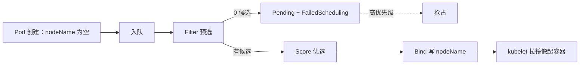
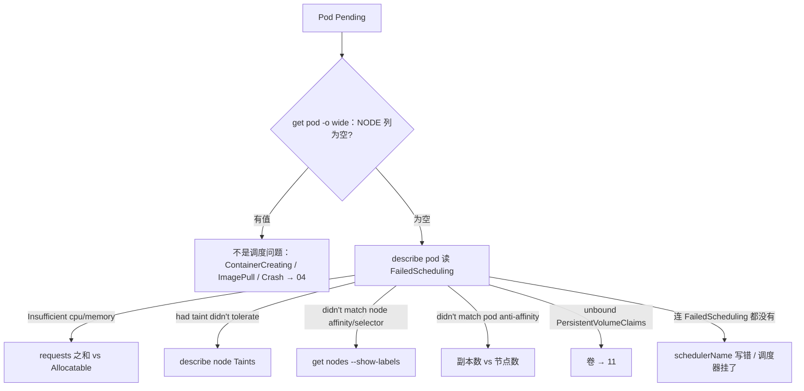
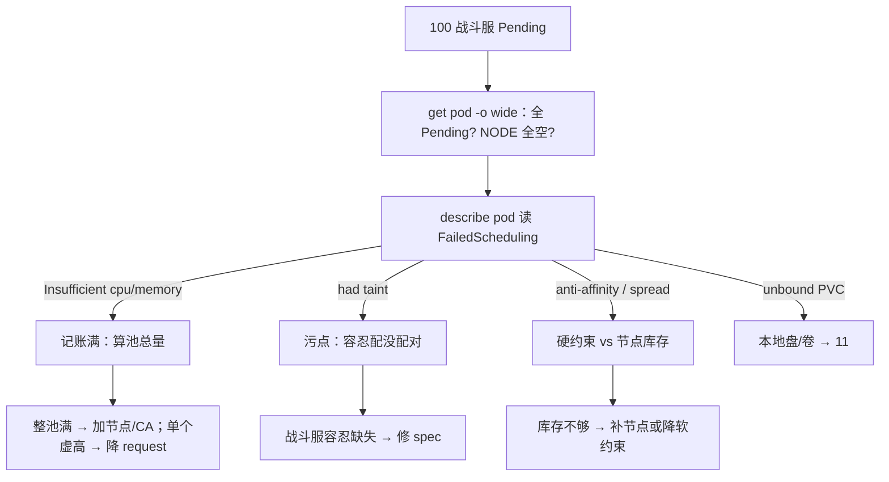

# 06｜调度机制 · 练习题

先合上知识点，对着 **一节的主图** 把「一个 Pod 的调度之旅」（入队 → 过滤 → 打分 → 绑定，Pending 卡在哪一步、过滤失败还有什么分支）口述一遍，再来做题。

| 标记 | 含义 |
|------|------|
| **核心** | 不懂，整章没建立起来 |
| **必会** | 值班和面试都要能讲 |
| **常用** | 线上会反复碰到 |
| **常考** | 白板和追问的高频口径 |

## 本题目录

- [Q1 调度分几个阶段？Scheduler 挂了业务会挂吗？](#q1)
- [Q2 Pod 一直 Pending，你怎么查？](#q2)
- [Q3 资源记账：requests、limits、Allocatable](#q3)
- [Q4 污点三档效果与独占战斗池](#q4)
- [Q5 nodeSelector、节点亲和与战斗服绑机型](#q5)
- [Q6 Pod 反亲和与 topologySpreadConstraints](#q6)
- [Q7 PriorityClass 与抢占](#q7)
- [Q8 Bind 与「调度成功 ≠ Running」](#q8)
- [Q9 Descheduler 和 Scheduler 的区别](#q9)
- [Q10 改亲和不搬家：cordon、drain、NotReady 三条路](#q10)
- [Q11 开服扩容一批全 Pending：综合作战](#q11)
- [Q12 自定义调度器与 schedulerName](#q12)
- [Q13 调度器挂了会怎样](#q13)
- [Q14 60 秒 Pending 剧本](#q14)
- [合上书](#合上书)

---

## Q1

**★★★★★｜「讲讲 K8s 的调度流程？如果 Scheduler 挂了，已经在跑的游戏服会挂吗？」**

**覆盖**：核心 · 必会 · 常考 ｜ **对应**：知识点 [一、一张图：一个 Pod 的调度之旅](知识点.md)、[二、入队：kube-scheduler 接单](知识点.md)

### 场景

开场题。有人把 Pending 和 CrashLoopBackOff 搅在一起讲，说「调度器挂了所有 Pod 都会被重启」；追问「容器到底是谁拉起来的」又卡壳。

### 完整解答

> 🎯 **一句话**：调度是一次性流水线——入队、过滤、打分、绑定；只有过滤零候选才 Pending；调度器挂了只影响新的。



四步拆开：**入队**——kube-scheduler watch API Server，只接 `spec.nodeName` 为空的 Pod，拉进调度队列；**Filter（预选，旧名 predicate）**——一道道门槛划掉候选节点（资源记账、亲和、污点、节点状态、卷），划到 0 个才 Pending，Events 写 `0/N nodes are available: ...`；**Score（优选，旧名 priority）**——给剩下的候选加权打分选最高，这一步永远不会产出 Pending；**Bind**——把赢家的节点名 patch 进 `spec.nodeName`，调度到此结束，拉镜像、起容器是目标节点 kubelet + CRI 的事（→04）。

调度器挂掉的影响面：**已有的不受影响**——nodeName 早已写好，kubelet 照常跑容器、流量不断；**新的全卡住**——新 Pod、HPA 扩出来的副本、重建的实例一直 Pending。调度框架（Scheduling Framework）里这些阶段都是扩展点，插件挂上去生效，抢占是 PostFilter 扩展点的戏。

> ⚠️ **别混**：调度成功 ≠ 容器起来了——Bind 只写一个字段；也别以为调度失败会被丢弃：失败的 Pod 进 unschedulable 队列，等集群事件唤醒重试，所以 Pending Pod 的 Events 会不断追加 FailedScheduling。

> 📝 **面试**：「Filter 和 Score 谁会导致 Pending？」——只有 Filter。Score 只在幸存者里挑最高分，总能选出一个；所以「调 Score 权重救 Pending」是误诊。

### 再追问

- **`spec.schedulerName` 写错会怎样？**——没有调度器接单，永远 Pending，而且 Events 里连 FailedScheduling 都没有。不要答「会报错重启」，它只是安静地没人管。
- **谁负责把容器跑起来？**——目标节点 kubelet 调 CRI。不要答「调度器启动容器」，这是这道题的埋点。

---

## Q2

**★★★★★｜「线上一个 Pod 一直 Pending，你怎么查？」**

**覆盖**：核心 · 必会 · 常用 · 常考 ｜ **对应**：知识点 [七、作战：Pending 定责](知识点.md)

### 场景

开服扩容后网关第 4 个副本 Pending 二十分钟。有人建议重启调度器，有人准备调打分权重——都还没看过 Events。

### 完整解答

> 🎯 **一句话**：第一刀永远是 describe pod 读 FailedScheduling，按分号逐条拆，每条对到一道过滤门槛。



```bash
kubectl get pod gateway-xyz -n prod -o wide
# NAME          READY   STATUS    NODE
# gateway-xyz   0/1     Pending   <none>          # ← NODE 为空才是调度问题

kubectl describe pod gateway-xyz -n prod | tail -6
# Warning  FailedScheduling  default-scheduler  0/12 nodes are available:
#   8 Insufficient cpu,                           # ← 8 台记账满，先查这条（数量最大）
#   3 node(s) had taint {pool: battle}, ...       # ← 3 台战斗池，正常拒
#   1 node(s) didn't match pod anti-affinity ...  # ← 1 台已有同名副本
```

读法：`0/12 nodes are available` 是 Filter 的总结论；分号后面每条是一个计数，对应五道门之一（资源、亲和、污点、状态、存储）。**从数量最大的条目查起**；同一台节点可能同时撞几道门，计数会重叠，以原文为准。批量扫用 `kubectl get events -n prod --field-selector reason=FailedScheduling`。

定型之后才动手：Insufficient → `describe node` 看 Allocated 记账，决定加节点还是降 request；taint → 确认池隔离是否符合预期；亲和 → 算节点数和副本数；unbound PVC → 去 [11](../11-存储/)。

> ⚠️ **别混**：NODE 列有值但没起来（ContainerCreating / ImagePullBackOff），责任已经移交 kubelet，不是调度问题——不要重启调度器。

> 📝 **面试**：口径背「先 get -o wide 分界，再 describe 拆条目，按条定型，不调权重不重启」。

### 再追问

- **为什么 0/N 里几个计数加起来超过 N？**——一台节点可以同时命中多个原因（既记账满又有污点），计数重叠。不要把它们当成互斥分桶。
- **连 FailedScheduling 都没有的 Pending 是什么？**——要么 `schedulerName` 写错没人接单，要么调度器本身挂了。不要先怀疑业务 YAML。

---

## Q3

**★★★★☆｜「top 看节点 CPU 才 10%，为什么新 Pod 还是 Insufficient cpu？request 和 limit 到底谁管调度？」**

**覆盖**：核心 · 必会 · 常用 ｜ **对应**：知识点 [三、过滤（Filter 预选）：候选一个个被划掉](知识点.md)

### 场景

扩容战斗服一直 Pending，运维盯着 `kubectl top` 说「机器明明很闲」，准备去查调度器 bug。

### 完整解答

> 🎯 **一句话**：调度看 requests 记账，不看瞬时 top；记账之和 ≥ Allocatable 就调不进。

三个量的分工：**requests** 是 Pod 声明的最低需求，调度记账、QoS 分级、HPA 利用率分母都拿它；**limits** 是运行时上限，CPU 超了 throttle（限速不杀）、内存超了 OOMKill（→04）；**Allocatable** = Capacity − kube-reserved − system-reserved − 驱逐阈值预留，是节点能拿出来给调度的总量。调度条件：`节点已分配 requests 之和 + 新 Pod requests ≤ Allocatable`。

```bash
kubectl top node node-lobby-01
# node-lobby-01   890m   11%   8192Mi   28%     # ← 瞬时使用：很闲

kubectl describe node node-lobby-01 | grep -A6 "Allocated resources"
#   cpu     7600m (97%)   12400m (158%)         # ← 记账：97% 满，新 Pod 要 500m 塞不下
#   memory  24Gi (85%)    40Gi (142%)
```

所以「机器闲但调不进」不是 bug：之前一批 Pod 的 requests 把账本占满了，实际负载没跟上。治理分两支：单个 Pod 虚高 → 按实测 P95 降 request（或参考 VPA）；整池账满 → 加节点 / ClusterAutoscaler（→07）。

不写 requests 的后果链必须会讲：调度按 0 计 → 超卖 → 节点真吃紧时 kubelet 按 QoS 驱逐、BestEffort 先死；HPA 没分母算不了利用率、扩不动。生产核心服用 Guaranteed（requests = limits）。

> ⚠️ **别混**：调大 limits 不会让调度更容易（调度只认 requests）；调小 requests 也防不住运行时 OOM。两者各管一段。

> 📝 **面试**：「top 闲为什么 Insufficient」是高频题，答「记账不看瞬时」+ Allocatable 公式 + describe node Allocated 验证命令，三件套齐全。

### 再追问

- **该加节点还是降 request？**——看是整池满还是单个虚高：HPA 顶满、全池记账 90%+ → 加节点/开 CA；单服务 request 远超实测 P95 → 降 request。不要一刀切「加机器」。
- **能不能把 requests 写成 0 让它先调度进去？**——不要。那等于放弃记账保护，超卖后节点压力一来，最先被驱逐的就是这些没声明的。

---

## Q4

**★★★★★｜「讲讲污点（taint）和容忍（toleration）。怎么做一台只跑战斗服的独占节点？」**

**覆盖**：核心 · 必会 · 常考 ｜ **对应**：知识点 [三、过滤（Filter 预选）：候选一个个被划掉](知识点.md)

### 场景

战斗服被大厅副本抢 CPU，团队决定「口头约定大厅不调到战斗机上」。一周后开服扩容，大厅铺满战斗池。

### 完整解答

> 🎯 **一句话**：污点打在节点上拒人，容忍挂在 Pod 上开门；独占池 = 池污点 + 对应容忍，别无他法。

三档效果（官方名）：

| Effect | 新 Pod（无容忍） | 已有 Pod（无容忍） |
|--------|------------------|--------------------|
| **NoSchedule** | 不调度进来 | 不受影响 |
| **PreferNoSchedule** | 尽量不来（软，进 Score） | 不受影响 |
| **NoExecute** | 不调度进来 | **驱逐**（可用 tolerationSeconds 延缓） |

只有 NoExecute 会赶走已经在跑的 Pod——这是追问点。容忍两种写法：`operator: Equal`（key/value/effect 全对）和 `operator: Exists`（只匹配 key；key 留空容忍一切）。

```bash
kubectl taint nodes node-battle-03 pool=battle:NoSchedule     # 打污点
kubectl taint nodes node-battle-03 pool=battle:NoSchedule-    # 末尾 - 号去掉
kubectl describe node node-battle-03 | grep Taints
# Taints:  pool=battle:NoSchedule      # ← 没容忍的新 Pod 进不来
```

战斗服 Deployment 挂对应容忍（`key: pool, operator: Equal, value: battle, effect: NoSchedule`），大厅不挂——隔离由调度器强制执行。口头约定挡不住 HPA：扩容只认资源记账，不认口头。

> ⚠️ **别混**：NoSchedule 不赶已有 Pod，只有 NoExecute 赶；所以「打个 NoSchedule 把大厅从战斗机上赶走」是错的，得靠驱逐或滚动。

两条红线：CNI/kube-proxy/监控这类 DaemonSet 要用 `Exists` 容忍所有污点，否则节点连网络插件都起不来；业务 Pod 不要容忍控制面污点（`node-role.kubernetes.io/control-plane:NoSchedule`），否则业务上 master。

> 📝 **面试**：独占池答案 = 「节点打池污点 NoSchedule + 业务挂容忍 + 口头约定不算数」，三句齐全；能补「GPU 池同理」加分。

### 再追问

- **节点 NotReady 后，上面的 Pod 为什么过几分钟自己被驱逐了？**——节点控制器打 `node.kubernetes.io/not-ready:NoExecute` 污点，不容忍的 Pod 默认 300s 驱逐。这条和 drain 不是一条路：drain 是自愿驱逐、尊重 PDB；NotReady 驱逐 PDB 拦不住。先救节点（→17），不要先纠结 Pod。
- **怎么去掉污点？**——同一条命令末尾加 `-`。不要用 `kubectl edit node` 手删，容易改坏别的字段。

---

## Q5

**★★★★☆｜「nodeSelector、节点亲和、Pod 亲和有什么区别？战斗服怎么绑定指定机型？」**

**覆盖**：必会 · 常用 ｜ **对应**：知识点 [三、过滤（Filter 预选）：候选一个个被划掉](知识点.md)

### 场景

战斗服要用本地 SSD 的高配机型，有人写了 nodeSelector 就上线，结果卷绑到了另一个可用区的节点，Pod 一直 ContainerCreating。

### 完整解答

> 🎯 **一句话**：三者都影响落点，但数据源不同——前两者看节点标签，Pod 亲和看节点上已有哪些 Pod。

**nodeSelector** 最简单：Pod 带一组键值，节点必须全有（AND），适合简单分池。**nodeAffinity** 是高级版，分硬软：`requiredDuringSchedulingIgnoredDuringExecution`（硬，在 Filter 生效，不满足就划掉节点）、`preferredDuringSchedulingIgnoredDuringExecution`（软，进 Score 加权，权重 1–100）。名字里 `IgnoredDuringExecution` 的意思是：跑起来之后标签变了也不搬家。**podAffinity / podAntiAffinity** 看的不是节点自身标签，而是**节点上已经跑着哪些 Pod**（按标签 + topologyKey 判定同域/异域）。

战斗服绑机型的标准姿势：

```yaml
affinity:
  nodeAffinity:
    requiredDuringSchedulingIgnoredDuringExecution:
      nodeSelectorTerms:
        - matchExpressions:
            - key: pool
              operator: In
              values: [battle]
            - key: disk
              operator: In
              values: [local-ssd]
```

配套两件事：① 机型池打污点隔离（Q4），防普通业务占机型；② 本地盘卷用 `WaitForFirstConsumer`（→11），让卷等 Pod 定落点再绑，否则卷先绑到错节点/错可用区，Pod 反过来一直等卷。

> ⚠️ **别混**：`required` 硬约束不满足会 Pending，`preferred` 软约束不满足也能调度、只是分低；答「亲和不满足就报错」前先想清楚是哪种。

> 📝 **面试**：区分口径一句话——「nodeSelector/nodeAffinity 看节点标签，Pod 亲和看邻居」；绑机型 = required 亲和 + 池污点 + WaitForFirstConsumer 三件套。

### 再追问

- **为什么不用 nodeSelector 做机型绑定？**——它只有 AND 等值匹配，表达不了 In/NotIn、硬软分层；小场景能用，但池一多就失控。不要在一个集群里两套写法混用。
- **preferred 亲和的权重写多少？**——1–100，和别的打分插件权重一起做加权。不要为了「更软」写成 0，那等于没写。

---

## Q6

**★★★★☆｜「网关 3 副本配了硬反亲和，扩容到第 3 个就 Pending，为什么？topologySpreadConstraints 是什么？」**

**覆盖**：必会 · 常用 · 常考 ｜ **对应**：知识点 [三、过滤（Filter 预选）：候选一个个被划掉](知识点.md)

### 场景

网关配了硬 podAntiAffinity（topologyKey: hostname），测试环境 2 节点没问题，生产开服前演练扩 3 副本，第 3 个死活 Pending。有人怀疑调度器卡死，准备重启。

### 完整解答

> 🎯 **一句话**：硬反亲和要求节点数 ≥ 副本数；2 节点放 3 个「互不同桌」的副本，第 3 个必然 Pending——不是调度器坏了。

```text
0/2 nodes are available: 2 node(s) didn't match pod anti-affinity rules.
# ← 两台节点都已有同名 Pod，硬反亲和无处可放
```

podAntiAffinity 看「节点上已有哪些 Pod」，`topologyKey` 定粒度：`kubernetes.io/hostname` 是节点级、`topology.kubernetes.io/zone` 是可用区级。硬反亲和（required）是 Filter 门槛，放不下就是 0 候选；软反亲和（preferred）进 Score，放不下也凑合。

无状态服务更推荐 **topologySpreadConstraints**：`maxSkew` = 任意两个拓扑域之间允许的最大 Pod 数量差（1 即基本均匀），`whenUnsatisfiable` 两档——**DoNotSchedule**（硬，和硬反亲和一样会卡）/ **ScheduleAnyway**（软，进 Score）。它比反亲和多一个「均匀」语义：反亲和只管「不同桌」，spread 还管「每桌人数差不多」。

治理：要么节点数 ≥ 副本数，要么把硬约束降为 preferred + spread ScheduleAnyway。节点库存有限时用软约束保上线——不打散最坏是单点宕机「全区大厅没了」，但硬约束卡死是副本直接起不来，两害相权先保副本数。

> ⚠️ **别混**：DoNotSchedule 和硬反亲和一样会卡 Pending，别以为「名字不带 required 就是软的」；软的那档叫 ScheduleAnyway。

> 📝 **面试**：「3 副本 2 节点第 3 个 Pending」直接答「硬约束放不下，算库存或降软」，再补 spread 的 maxSkew 语义。

### 再追问

- **开服前怎么避免这类事故？**——预案里算机型库存：硬约束（硬反亲和 / DoNotSchedule）的副本数必须 ≤ 对应拓扑域的节点数；扩副本前先 `get nodes` 核对。不要等 Pending 了再发现。
- **全堆一台节点和打散过度，哪个更糟？**——对无状态网关，全堆一台更糟（单点即团灭）；但打散约束用硬档可能卡上线。所以默认软 + maxSkew=1，不要用硬档赌库存。

---

## Q7

**★★★★☆｜「讲讲 PriorityClass 和抢占。批处理任务和在线游戏服混部，你怎么设计？」**

**覆盖**：必会 · 常考 ｜ **对应**：知识点 [四、没候选了：优先级与抢占](知识点.md)

### 场景

为了省钱把离线批处理混部进游戏集群，有人提议「把战斗服标成低优先级，让批处理先跑」；还有人的训练任务抢占了在线网关，被叫停。

### 完整解答

> 🎯 **一句话**：PriorityClass 定谁重要，抢占是 Filter 零候选后高优先级驱逐低优先级腾位置——混部让批处理低，绝不能让战斗服低。

**PriorityClass** 是集群级对象，`value` 越大越重要；Pod 写 `spec.priorityClassName`，准入控制器落成 `spec.priority`。系统内置 `system-node-critical`（2000001000）、`system-cluster-critical`（2000000000），业务自建如 prod-high / batch-low。

**抢占（Preemption）**发生在 Filter 零候选之后的 PostFilter 扩展点：调度器找「驱逐哪些低优先级 Pod 后能放下我」，那些叫 **victim**；流程是优雅删除 victim → Pending Pod 标 `nominatingNodeName` 占位 → victim 退出后重新调度。victim 的 Events 里会出现 `Preempted by <ns>/<pod>`。

混部设计的正确姿势：批处理/离线给低 PriorityClass（节点紧时先挤它们，这正是混部的意义）；在线战斗服、网关给高优；关键池再加污点隔离兜底。三条红线：① **战斗服不要标低优先级「让资源」**——节点一紧先杀对局，比 Pending 严重得多；② **不要靠抢占当容量规划**——victim 是优雅删除但仍是中断，且 PDB 可能拦抢占；③ **训练任务抢占在线网关**这类事故，先查池污点隔离做没做，隔离是第一道闸，优先级只是保险。

```bash
kubectl get priorityclass
# prod-high     1000000    false   ...    # ← 在线业务
# batch-low     100        false   ...    # ← 批处理，先被挤
```

> ⚠️ **别混**：抢占驱逐的是**正在跑的** Pod（自愿中断的亲戚，和 drain 同类）；开抢占前先想清楚谁会是 victim，战斗服和单副本有状态服务必须有 PDB 或不在低优池。

> 📝 **面试**：「抢占什么时候触发？」——Filter 零候选 + 本 Pod 优先级更高；追问「victim 怎么退」答优雅删除、可能被 PDB 拦。

### 再追问

- **怎么确认一次驱逐是不是抢占干的？**——看被驱逐 Pod 的 Events 有没有 `Preempted by ...`，再看发起方是不是长期 Pending 的高优 Pod。不要看到 Pod 没了就怀疑节点故障。
- **PDB 能完全挡住抢占吗？**——调度器会尽量尊重 PDB，但不保证：抢占逻辑在必要时仍可能违反。不要拿 PDB 当抢占的绝对保险，关键服务靠容量和高优先级。

---

## Q8

**★★★☆☆｜「调度成功是不是就意味着容器跑起来了？NODE 列有值但一直 ContainerCreating 归谁管？」**

**覆盖**：必会 · 常用 ｜ **对应**：知识点 [六、绑定：写上 nodeName 不等于起来了](知识点.md)

### 场景

值班看到一批网关「调度完成」但全卡 ContainerCreating，有人去重启 kube-scheduler，折腾半小时没用——问题在节点 CRI 拉镜像超时。

### 完整解答

> 🎯 **一句话**：Bind 只是把 spec.nodeName 写成赢家节点；容器还没影，之后归 kubelet。

调度的最后一步 Bind，就是调度器向 API Server 发请求、把 `spec.nodeName` patch 成选中的节点——**节点上还没有任何东西跑起来**。目标节点的 kubelet 看到 nodeName 是自己，才开始调 CRI 拉镜像、起容器、挂探针（→04）。所以责任分界一句话：**NODE 列为空查调度，NODE 列有值查节点**。

```bash
kubectl get pod -n prod -o wide | grep gateway
# gateway-a   0/1   ContainerCreating   5m   node-03   # ← NODE 有值：调度已完成，查节点侧
# gateway-b   0/1   Pending             5m   <none>    # ← NODE 为空：调度没完成，查 Filter
```

NODE 有值之后的卡点清单：ContainerCreating（卷挂载、网络插件、CRI）、ImagePullBackOff（镜像拉不下来/私钥问题）、CrashLoopBackOff（应用自己挂）——全在 [04](../04-Pod生命周期/) 和节点侧（→17），重启调度器没有任何意义。

> ⚠️ **别混**：「调度成功」和「Running」之间隔着拉镜像、起容器、探针通过一整段；把它们当同义词是这道题的埋点。

> 📝 **面试**：先答「Bind 只写 nodeName」，再给分界口诀「NODE 空查调度、有值查节点」。

### 再追问

- **调度器会为卡住的 Pod 换个节点重试吗？**——不会。调度只在创建时做一次（IgnoredDuringExecution），NODE 定了就定了；换节点要靠删 Pod 重建或驱逐。不要答「会自动重新调度」。
- **为什么不建议手动删 Pod 催它？**——Deployment 会补副本没错，但卡点（镜像仓库挂了、节点磁盘满）没解决，新 Pod 照样卡；先查 Events 定位卡点再决定。

---

## Q9

**★★★☆☆｜「新加了一批节点，老节点还是满的、新节点全空。调度器为什么不管？Descheduler 是什么？」**

**覆盖**：常用 · 常考 ｜ **对应**：知识点 [六、绑定：写上 nodeName 不等于起来了](知识点.md)

### 场景

ClusterAutoscaler 扩了 10 台新节点缓解压力，一周后发现新节点基本空载、老节点记账还是 90%+。有人问「是不是调度器坏了」。

### 完整解答

> 🎯 **一句话**：调度器只在 Pod 创建时调度一次，不回头搬家；再平衡是 Descheduler 的活，它是驱逐者不是第二套调度器。

调度是「一次性」的：Pod 绑定后，哪怕出现更空的节点，调度器也不会动它——它只接新 Pod。想让老节点的负载挪到新节点，必须有人把老节点上的 Pod **驱逐**，让它们以「新 Pod」身份重新走一遍调度。**Descheduler** 就是干这个的组件：按策略（如 LowNodeUtilization：把高负载节点上的 Pod 赶去低负载节点）定期扫描、发起驱逐。

```bash
kubectl get pod -n prod -l app=hall -o wide
# hall-a   1/1   Running   2m   node-new-07    # ← AGE 从 30d 突变到分钟级：被驱逐重调度过
```

生产的三条纪律：① Descheduler 的驱逐是**自愿中断**，PDB 拦得住——这和 drain 一样，别奇怪「为什么它没把某服务赶走」；② 必须限定策略范围，**排除 StatefulSet 和战斗服**，否则再平衡等于把对局中的玩家踢下线；③ 它常和 CA 配合：驱逐让负载聚拢，CA 才能缩掉空节点省钱。

> ⚠️ **别混**：Descheduler 不是第二套调度器——它只负责「赶」，赶完之后走的还是同一套调度流程。

> 📝 **面试**：「新节点空老节点满」答「调度不回头 + Descheduler 驱逐再平衡 + PDB/排除战斗服」。

### 再追问

- **为什么我的战斗服没被 Descheduler 挪走？**——要么被策略排除（应该的），要么被 PDB 拦住（自愿中断受保护）。不要为了让它「生效」去删战斗服的 PDB。
- **Descheduler 驱逐和节点 NotReady 驱逐是一回事吗？**——不是：前者是策略性自愿中断（尊重 PDB），后者是节点控制器打 NoExecute 污点的非自愿驱逐（PDB 拦不住，→17）。

---

## Q10

**★★★★☆｜「改了亲和规则，已经在跑的旧副本会搬家吗？cordon、drain、节点 NotReady 这三条路分别会发生什么？」**

**覆盖**：必会 · 常用 · 常考 ｜ **对应**：知识点 [六、绑定：写上 nodeName 不等于起来了](知识点.md)、[三、过滤（Filter 预选）：候选一个个被划掉](知识点.md)

### 场景

给大厅加了新的反亲和规则想让它打散，改完发现旧副本纹丝不动，有人准备直接 `kubectl delete pod` 一个个强删——里面还有正在对局的玩家。

### 完整解答

> 🎯 **一句话**：调度只在创建时做一次，IgnoredDuringExecution——改规则不搬家；搬家靠滚动或驱逐，三条路各有各的脾气。

**为什么不搬**：亲和规则只在调度那一刻参与决策；Pod 跑起来后，改规则、改节点标签都不触发重新调度。要搬家只能让 Pod 重建：滚动更新（`kubectl rollout restart`）或驱逐——战斗服必须先做好对局交接，**不要强删**。

三条路对比：

| 路径 | 谁发起 | 已有 Pod 会怎样 | PDB |
|------|--------|-----------------|-----|
| **cordon** | 人 | 不动，只挡新 Pod（Filter 划掉，节点标 SchedulingDisabled） | 不涉及 |
| **drain** | 人 | 优雅驱逐（SIGTERM），尊重 PDB（→17） | **拦** |
| **节点 NotReady** | 节点控制器 | 打 not-ready:NoExecute 污点，不容忍默认 300s 驱逐（→17） | **拦不住** |

```bash
kubectl cordon node-battle-03
# node-battle-03 cordoned                     # ← 只挡新的，上面的战斗服照跑

kubectl get nodes
# node-battle-03   Ready,SchedulingDisabled   ...   # ← Ready 但不再接新 Pod
```

值班分界：只想让节点「不再接客」（先观察）→ cordon；要腾空节点做维护 → drain（PDB 会拦单副本服务，先评估）；节点自己挂了 → 那是 NotReady 驱逐，PDB 保护不了，先救节点。

> ⚠️ **别混**：cordon 不杀任何 Pod——「cordon 会把战斗服赶走」是错的；drain 和 NotReady 驱逐虽然都赶人，但一个自愿一个非自愿，PDB 待遇不同。

> 📝 **面试**：「改亲和老 Pod 会搬吗」答不会 + IgnoredDuringExecution；追问三条路，用上面表格的顺序讲。

### 再追问

- **drain 卡住不动是为什么？**——多半是 PDB 拦住（单副本服务 minAvailable=1），或有 local storage 没加对应参数（→17）。不要直接 `--force` 硬删，先确认里面有没有对局中的玩家。
- **节点 NotReady 驱逐能不能用 PDB 挡？**——不能，那是非自愿中断路径。要保战斗服，靠副本冗余和快速重建，不要指望 PDB 兜底。

---

## Q11

**★★★★★｜「开服扩容，100 个战斗服实例一批全 Pending，你的一分钟排查流程是什么？」**

**覆盖**：核心 · 必会 · 常用 · 常考 ｜ **对应**：知识点 [七、作战：Pending 定责](知识点.md)

### 场景

开服当天，运营催上线。战斗服 StatefulSet 扩 100 副本全 Pending，群里已经有人喊「重启调度器」「把 Score 权重调一下」「先把大厅删几个腾位置」。

### 完整解答

> 🎯 **一句话**：先定界（是不是一批、NODE 是否全空），再拆 Events 条目按条定型，最后才出手——全程不动调度器、不强删任何在跑的服务。



一分钟剧本：

```text
0–10s   kubectl get pod -n prod -o wide | grep battle | head   确认是不是全 Pending、NODE 全空
10–30s  kubectl describe pod battle-0 -n prod | tail           读 FailedScheduling，逐条拆计数
30–45s  按条定型：Insufficient → describe node 看 Allocated
                  taint → describe node Taints · 亲和 → get nodes 数库存
45–60s  出手：整池记账满 → 走开服预案加节点（07）
                  容忍/标签配错 → 修 spec 重建 · 库存不够 → 补机器或降软
```

战斗服场景的三个专属检查点：① 本地盘卷是否 WaitForFirstConsumer（→11），别被 `unbound PVC` 带偏成存储故障；② 硬反亲和 / spread DoNotSchedule 的副本数和机型库存对没对上；③ 池污点容忍是否在扩容用的新 spec 里漏配（用老模板起的常见事故）。

同时压住群里的三个误操作：重启调度器（没用，调度是事件驱动重试）；调 Score 权重（Pending 是 Filter 的事）；删大厅腾位置（战斗服被池污点挡着，大厅腾了也进不来——除非根本没做池隔离，那先补污点）。

> ⚠️ **别混**：一批全 Pending 不等于「集群挂了」——九成是同一份 spec 撞了同一道门，找到那道门就全解了。

> 📝 **面试**：这道题考的是流程纪律：先定界、再拆条目、按条定型、对症下药，并且说得出「不做什么」。

### 再追问

- **如果发现是整池容量不够，开服当天来不及加物理机怎么办？**——按预案走：先补能用的节点/开 CA（→07），同时评估能否临时把软约束降级、或延迟非核心服务扩容保战斗服。不要现场删在线业务「腾资源」。
- **复盘之后要沉淀什么？**——开服预案里加两件事：扩副本前先算硬约束库存；战斗服 spec 加 CI 校验（容忍、PriorityClass、WaitForFirstConsumer 三件套）。不要把这次的排查过程只留在聊天记录里。

---

## Q12

**★★★☆☆｜schedulerName 写错或上了自定义调度器，Pending 怎么认？**

**覆盖**：常用 · 常考 ｜ **对应**：知识点 [三、过滤（Filter 预选）](知识点.md)

### 场景

战斗池 Pod spec 写了 `schedulerName: battle-scheduler`，但集群里只有 default-scheduler。

### 完整解答

> 🎯 **一句话**：Events 没有 FailedScheduling = 没人接单；`kubectl get deploy -n kube-system kube-scheduler` 与自定义 scheduler Pod。

```bash
kubectl describe pod battle-0 -n prod | sed -n '/Events/,$p'
# 若完全无 FailedScheduling → 查 schedulerName
kubectl get pods -n kube-system -l component=kube-scheduler
```

> ⚠️ **别混**：资源不够会有 FailedScheduling；**schedulerName 错**是 Events 空白 Pending。

### 再追问

第二个调度器要和 default 并存吗？——可以；每个 Pod 显式选 schedulerName，**不要**以为写了就自动有进程。

---

## Q13

**★★★★☆｜kube-scheduler 挂了，已在跑的 Pod 和新建 Pod 各怎样？**

**覆盖**：必会 · 常考 ｜ **对应**：知识点 [二、入队：kube-scheduler 接单](知识点.md)

### 场景

kube-system 里 scheduler CrashLoop，新开服扩 100 副本全 Pending，老战斗服还在打。

### 完整解答

> 🎯 **一句话**：调度器挂 = 新 Pod 永不 Bind；**存量 Pod 继续跑**，已 Bound 的不受影响。

```text
scheduler 挂：新 Pod Pending（无 NODE）
scheduler 慢：Pending 变长，不是 NotReady
节点 NotReady：已调度 Pod 可能被驱逐（04、17）
```

> 📝 **面试**：和 API 挂对比——API 挂变更全停；scheduler 挂只挡新调度。

### 再追问

能靠重启 scheduler 解决 Pending 吗？——若根因是资源/污点，重启调度器**没用**；先 describe Events（Q2）。

---

## Q14

**★★★★★｜开服 100 副本 Pending，一分钟剧本再练一遍**

**覆盖**：核心 · 必会 ｜ **对应**：知识点 [七、作战：Pending 定责](知识点.md)

### 场景

与 Q11 同场景，但要求口述 0–60s 每步命令，且不准动调度器权重。

### 完整解答

> 🎯 **一句话**：describe Events 逐条拆 → Insufficient / taint / affinity / PVC → 出手加节点或修 spec。

```text
0–10s   get pod -o wide | grep Pending | wc -l
10–30s  describe 任一定本 Pod，抄 FailedScheduling 原文
30–45s  按条：记账→node；污点→容忍；反亲和→节点数；PVC→11
45–60s  战斗池专属：本地盘 WFFC、池污点、硬 spread
```

> ⚠️ **别混**：**不要**调 scheduler 打分权重当救火——那是优选阶段，Filter 都没过调了白调。

### 再追问

100 个全 Pending 但 Events 写 `0/80 nodes available: 80 Insufficient memory`，算调度还是容量？——容量/记账；开服预案加节点或降 request（07）。

---

## 合上书

- [ ] **默画一节主图**：入队 → Filter → Score → Bind，Pending 只在 Filter 零候选发生；抢占是 Filter 失败的虚线分支；Bind 之后归 kubelet（Q1）。
- [ ] **口述入队**：调度器接什么单、调度框架扩展点、Scheduler 挂了的后果、schedulerName 写错的 Pending 长什么样（Q1、Q2）。
- [ ] **口述资源记账**：为什么 top 很闲还 Insufficient、Allocatable 公式、requests vs limits 分工、不写 requests 的后果链（Q3）。
- [ ] **默画 Filter 五道门**：资源、亲和、污点、状态、存储；Events 的 0/N 怎么按分号拆、从哪条查起（Q2、Q11）。
- [ ] **口述亲和**：三个亲和机制的数据源区别；required/preferred 各在哪一阶段；硬反亲和 3 副本 2 节点的结果；maxSkew 是什么（Q5、Q6）。
- [ ] **口述污点**：三档效果各管什么、哪档才赶已有 Pod；独占战斗池怎么做；口头约定为什么没用；系统组件容忍与业务红线（Q4）。
- [ ] **口述抢占**：什么时候触发、谁是 victim、战斗服为什么不能低优先级、PDB 拦不拦得住（Q7）。
- [ ] **口述绑定**：Bind 干了什么；为什么调度成功 ≠ Running；改亲和为什么不搬家；Descheduler 是什么、不是什么（Q8、Q9）。
- [ ] **定责**：60 秒剧本走一遍；Events 四条常见句子各查什么、各治哪；说出三个「不要做」的误操作（Q2、Q11）。
- [ ] **口述三条驱逐路**：cordon、drain、NotReady 各自谁发起、已有 Pod 怎样、PDB 拦不拦（Q10）。
