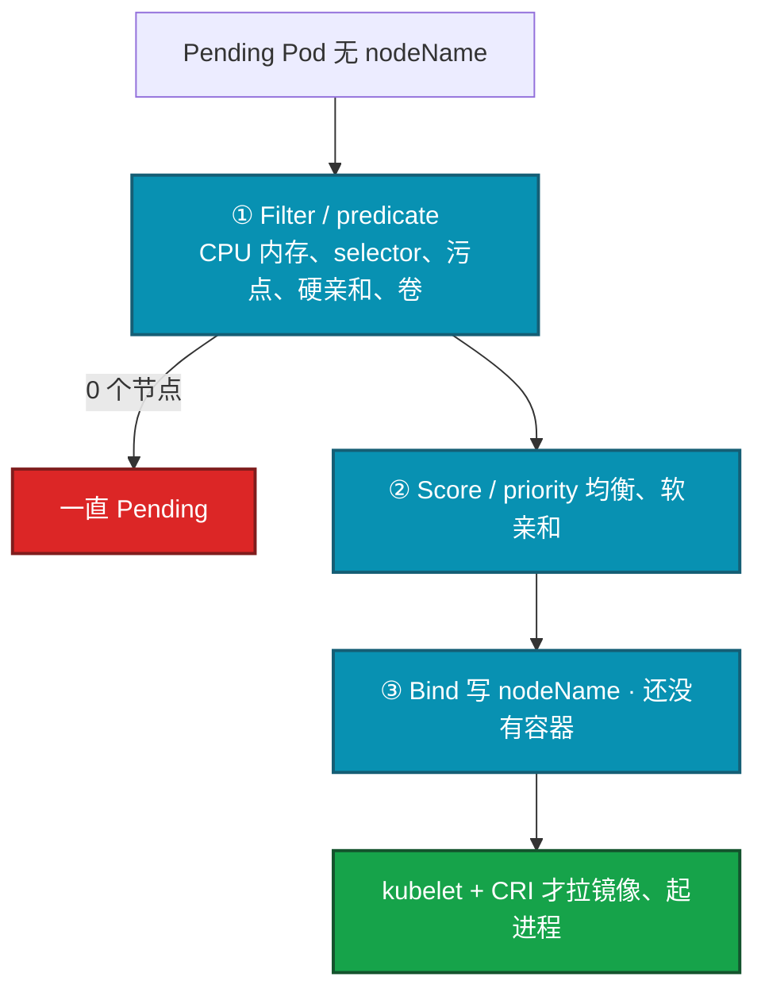
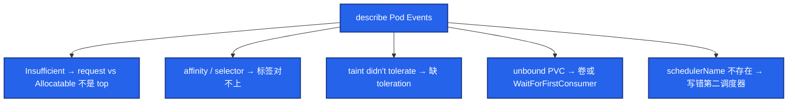
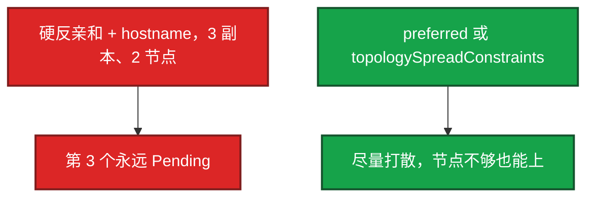
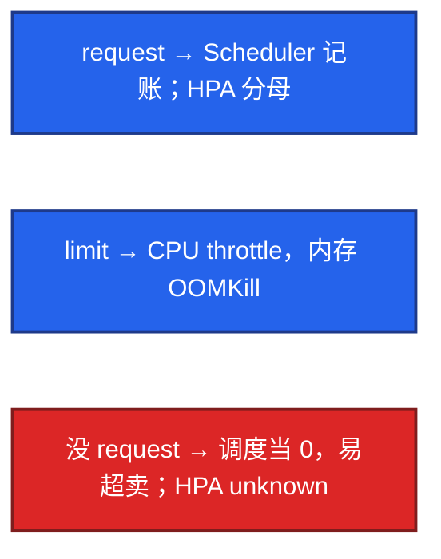
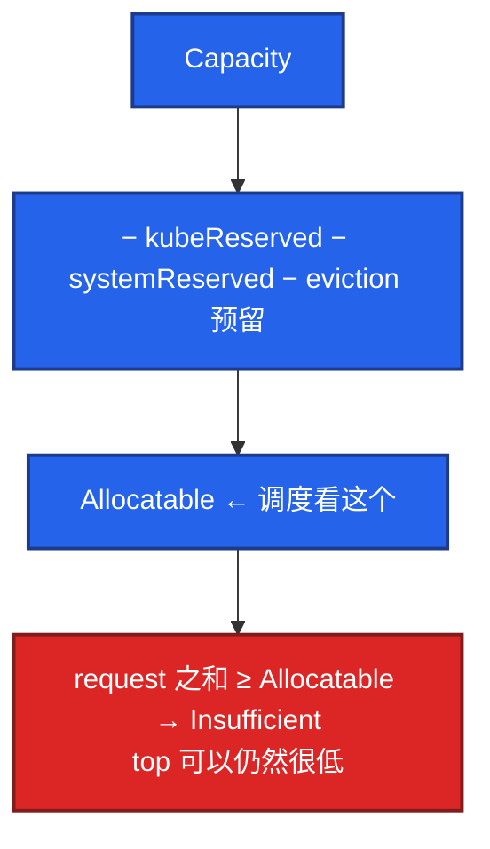
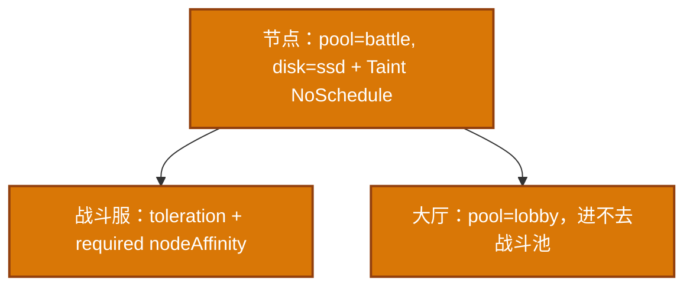
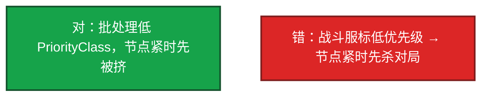

# 06｜调度机制 · 练习题

先对照 [知识点](知识点.md) **本章主线** 自己口述，再对答案。每题标了覆盖范围：

| 标记 | 含义 |
|------|------|
| **核心** | 不懂整章就没建立起来 |
| **必会** | 值班和面试都要能讲 |
| **常用** | 线上会反复碰到 |
| **常考** | 白板和追问的高频口径 |

## 本题目录

- [Q1 两阶段 / Scheduler 挂了](#q1)
- [Q2 Pending 怎么查](#q2)
- [Q3 污点与容忍](#q3)
- [Q4 required vs preferred](#q4)
- [Q5 request / limit](#q5)
- [Q6 Allocatable vs top](#q6)
- [Q7 游戏服绑机型](#q7)
- [Q8 优先级与抢占](#q8)
- [Q9 Descheduler](#q9)
- [Q10 改亲和不搬家 / NoExecute](#q10)
- [合上书](#合上书)

---

## Q1

**★★★★★｜调度两阶段？Scheduler 挂了已有 Pod 怎样？谁把容器拉起来？**

**覆盖**：核心 · 必会 · 常考
**对应**：知识点 §3.1 Filter 与 Score

### 场景

开场就问：「Scheduler 失败了游戏服还在吗？调度成功为什么容器还没起来？」有人把 Pending 和 CrashLoop 混在一起。

### 完整解答

**一句话**：Scheduler 只写 `nodeName`；过滤失败才 Pending，打分只在剩余节点里选一个。

Scheduler 只给没有 nodeName 的 Pod 选节点。过滤去掉不够的，打分在剩下的里面选一个，写下 `spec.nodeName`。

Scheduler 挂了：已有 Pod 继续跑，新 Pod Pending。流量还在（对齐 01）。它不管镜像和探针。

### 再追问

- 过滤和打分哪个导致 Pending？——过滤（predicate）。打分（priority）只是在剩余节点里选。没有候选才 Pending。

---

## Q2

**★★★★★｜Pod 一直 Pending 怎么查？**

**覆盖**：核心 · 必会 · 常用
**对应**：知识点 §7 生产排障 · §6 命令

### 场景

`kubectl apply` 之后一直 Pending。有人说调度坏了。Events 写着 `0/12 nodes are available: 8 Insufficient cpu, 4 node(s) had taint`。

### 完整解答

**一句话**：Pending 先看 `describe` Events：Insufficient / 污点 / 亲和 / PVC，不是先换调度器。

Pending 不是「K8s 坏了」，是条件不满足。`describe` 看 Events 第一现场，再对节点 Ready / Allocatable / 污点。

多条件叠加时 Events 会写 `0/N nodes are available: x insufficient, y taint...`，按条拆。PVC WaitForFirstConsumer 看起来像互相等，看 SC 的 bindingMode。节点 cordon 了也不会接新 Pod。不要去调 Score 权重。

### 再追问

- 谁把容器拉起来？——kubelet + CRI。调度成功只表示「这个节点被选中」。ContainerCreating 就不是调度的锅。

---

## Q3

**★★★★★｜污点和容忍？NoExecute 会怎样？独占战斗服池怎么做？**

**覆盖**：核心 · 必会 · 常考
**对应**：知识点 §3.3 污点与容忍

### 场景

大厅 HPA 一扩，Pod 打到战斗服的高配机上，战斗被抢 CPU。有人靠「别往这调」的口头约定。

### 完整解答

**一句话**：独占池靠 NoSchedule + 容忍；NoExecute 还会赶已有不容忍的 Pod。

Taint 在节点上拒人；Toleration 在 Pod 上开门。

GPU/独占池用 NoSchedule + 对应容忍。大厅/匹配一套污点，战斗服一套，GPU 再一套。HPA 扩大厅就不会占战斗机。控制面默认污点，业务不要容忍上去。CNI/kube-proxy 必须容忍所有，否则节点没网络。

节点 NotReady 控制面会打 NoExecute 类污点（16）。DaemonSet 通常 `Exists`。

### 再追问

- 改了节点标签，已经跑着的 Pod 会搬家吗？——nodeAffinity 名字里是 IgnoredDuringExecution：不会自动搬家。要搬家靠驱逐或滚动。NoExecute 除外。游戏服不要为了搬家强删正在打的 Pod。

---

## Q4

**★★★★★｜required 和 preferred 差在哪？硬反亲和的坑？**

**覆盖**：核心 · 必会 · 常考
**对应**：知识点 §3.2 亲和与 spread

### 场景

网关 3 副本，硬 podAntiAffinity 打到 hostname。集群只有 2 个 Ready 节点。第三个永远 Pending。有人说调度坏了。

### 完整解答

**一句话**：required 不满足就 Pending；preferred 尽量满足，节点不够也能上。

required 不满足就 Pending（Filter / predicate 阶段候选为 0）。preferred 尽量满足，不满足也能上。

无状态优先 spread，硬 anti-affinity 留给「必须不同节点」的双副本，并且保证节点数 ≥ 副本。`kubectl get pod -o wide` 看是不是全落同一台——没打散时单点宕机就是全区大厅没了。

### 再追问

- IgnoredDuringExecution 是什么意思？——跑起来后改标签，不会自动搬家。要搬家靠驱逐或滚动。

---

## Q5

**★★★★☆｜request / limit 和调度、OOM 的关系？为什么必须写 request？**

**覆盖**：必会 · 常用 · 常考
**对应**：知识点 §3.4 request 与 limit

### 场景

没写 request。节点看起来空，一紧一批 BestEffort 被 Evict。HPA 也算不了 CPU 利用率。

### 完整解答

**一句话**：调度只看 request 和 Allocatable；没写 request 调度当 0，HPA 也算不了利用率。

调度只看 request 和 Allocatable。CPU limit 超了限速；内存 limit 超了 OOMKill。

没 request 容易超卖，节点一紧 Evict BestEffort。生产核心服 Guaranteed（request=limit）。不要为了「能调度进去」把 request 写 0。

### 再追问

- 节点 CPU 使用率很低，为什么还 Insufficient cpu？——记账的是 **request 之和**，不是瞬时 usage。大家都写 2C request、实际用 10%，Allocatable 仍满。治理：按实测调 request，或用 VPA 建议值。见 Q6。

---

## Q6

**★★★★☆｜为什么节点 top 很低还 Insufficient？Allocatable 是什么？**

**覆盖**：必会 · 常用
**对应**：知识点 §3.4 · §5 核心配置

### 场景

`kubectl top node` CPU 20%。新 Pod Insufficient cpu。大家都把 request 写成 2 核「留余量」。

### 完整解答

**一句话**：节点 top 低仍 Insufficient，因为记账的是 request 之和，不是瞬时 usage。

Scheduler 看 Allocatable 和 request 之和，不看 top。

治理：按实测 P95 调 request。不要拍脑袋 4C8G，也不要写 0。VPA 给建议可以，和生产 HPA 同时改规格要小心（07）。

### 再追问

- 加节点还是降 request？——HPA 已经顶满、整池 Allocatable 不够 → 加节点 / CA。单个 Pod request 明显虚高 → 降 request。先分清是「这一个太大」还是「池子满了」。

---

## Q7

**★★★★☆｜游戏逻辑服要绑特定机型怎么做？和 Web 抢池子怎么办？**

**覆盖**：必会 · 常用
**对应**：知识点 §3.2 节点池

### 场景

战斗服要本地 SSD 和固定机型。大厅 HPA 一扩占满这些节点，战斗服开始 Pending。

### 完整解答

**一句话**：战斗服专用池靠标签 + 污点；大厅 HPA 不应和战斗服抢同一池。

节点标签 + required nodeAffinity，或专用污点 + 容忍。本地盘还要卷拓扑（WaitForFirstConsumer，11）。

不要和 Web HPA 抢同一池。标签少而稳：`pool=lobby|battle|infra`。绑死的代价：没有同类节点就 Pending，开服预案要算机型库存。口头约定没用。

### 再追问

- 已经 Running 的战斗服，改 affinity 会迁走吗？——不会。改的是下一轮调度。要搬家靠驱逐或滚动——对局里等于踢人，先停匹配（04、05）。

---

## Q8

**★★★★☆｜优先级与抢占？游戏服能标低优先级吗？**

**覆盖**：必会 · 常考
**对应**：知识点 §3.5 优先级与抢占

### 场景

批处理离线任务和战斗服混部。节点一紧，战斗服 Pending，批处理还占着。有人给战斗服标低优先级「让出资源」。

### 完整解答

**一句话**：低 PriorityClass 会被挤掉；在线战斗服不要标成可抢占。

低优先级 Pod 可被挤掉给高优先级。生产少给在线业务开抢占。

抢占是自愿中断的亲戚：会删正在跑的 Pod。PDB 拦不拦取决于实现和策略，不要靠抢当容量规划。游戏逻辑服不要标成可杀。

### 再追问

- Pending 是不是该上第二调度器？——先 Events。99% 是资源/污点/亲和/PVC。`schedulerName` 写错会 Pending，Events 很直白。简历没写现场不必展开自定义调度器。

---

## Q9

**★★★☆☆｜Descheduler 是什么？和 Scheduler 差在哪？会赶走战斗服吗？**

**覆盖**：必会 · 常用
**对应**：知识点 §3.6 Descheduler

### 场景

扩了 10 台新节点，Pod 还堆在老节点。有人要装 Descheduler 全集群均衡。

### 完整解答

**一句话**：Descheduler 是创建后再平衡，不是第二套 Scheduler；战斗服要排除策略。

Scheduler 只在 Pod **创建时**调度一次，之后不管。Descheduler 是再平衡器：按策略驱逐已运行的 Pod，让 Scheduler 重新调度。

会驱逐正在跑的 Pod。生产必须限定 namespace/label，STS/战斗服排除。PDB 能拦住，和拦 drain 一样。常见用法：配合 CA，新节点加入后跑一轮。现场 Pending 先 Events，不是先上再平衡。

### 再追问

- PDB 能拦住 Descheduler 吗？——能。都是自愿中断。所以单副本战斗服 minAvailable=1 时，Descheduler 也赶不走——这是保护。

---

## Q10

**★★★☆☆｜affinity 改了为什么老 Pod 还在原节点？drain 和 NoExecute 关系？**

**覆盖**：必会 · 常考
**对应**：知识点 §3.2 · §3.3

### 场景

给网关加了反亲和，老 Pod 还堆在一台。另一边节点 NotReady，Pod 开始被赶。

### 完整解答

**一句话**：改 affinity 不会自动搬家已 Running 的 Pod；NotReady 驱逐不是 drain 那条路。

亲和/选择器改的是 **下一轮调度**。已 Running 的要滚动或驱逐才搬家。这是 IgnoredDuringExecution 的字面意思。

节点 NotReady 时控制面会打 NoExecute 类污点，不容忍的会被赶（16）。这和 drain（自愿、尊重 PDB）不是同一条路：NotReady 驱逐是控制面认为节点已经不能干活。游戏服被赶等于非自愿中断，PDB 挡不住 NotReady 那条。先救 kubelet（对齐 01）。

### 再追问

- cordon 的节点为什么新 Pod 也不去？——cordon = SchedulingDisabled，Filter 阶段就去掉。已有 Pod 还在，直到 drain 或自己被删。只 cordon 不 drain，战斗服进程还在跑。

---

## 合上书

- [ ] 能画出 Filter/predicate → Score/priority → Bind，并说明只有过滤失败才 Pending
- [ ] 能按 Events 拆 Insufficient / 污点 / 亲和 / PVC，不先换调度器
- [ ] 能说出污点三档、独占池靠污点；硬反亲和要算节点数
- [ ] 能说明调度看 request/Allocatable 不看 top；没 request 调度当 0
- [ ] 能给战斗服分池，不标低优先级，不为调度强删对局
- [ ] 能区分 Scheduler 创建时一次 vs Descheduler 再平衡；PDB 拦自愿中断
