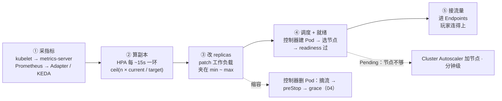
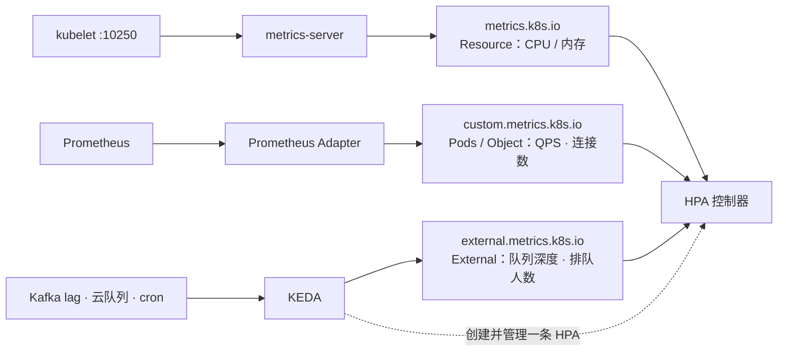
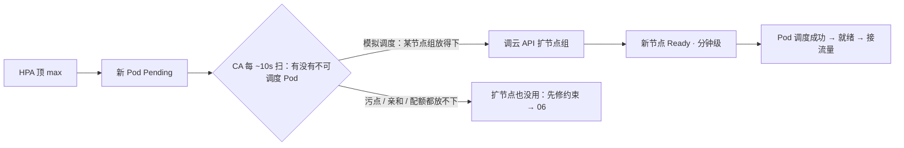
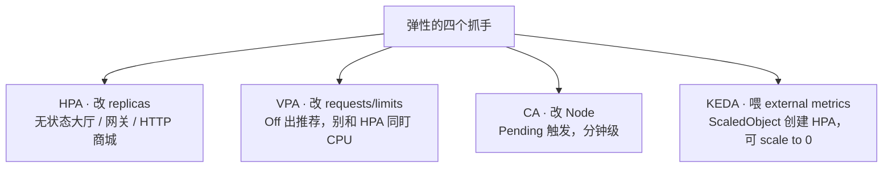
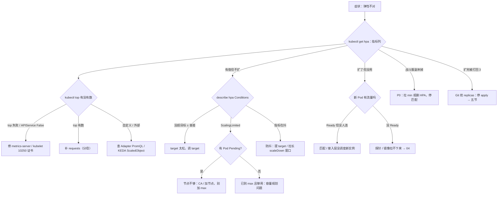

# 弹性伸缩

> 活动开服大厅 CPU 90%，HPA 指标栏却是 `<unknown>`——有人喊「加大 maxReplicas」；另一边战斗服被挂了 70% CPU 的 HPA，低峰一缩，正在打仗的进程被删，玩家掉线。
> **本章回答**：一次扩容决策的一生——指标从哪来、副本怎么算、replicas 怎么被改、Pod 怎么调度就绪——以及这条链在哪一环会卡住、为什么它救不了有状态游戏服。
> **不讲**：探针、preStop、grace → [04](../04-Pod生命周期/)；控制器建删 Pod、PDB 数字 → [05](../05-工作负载控制器/)；Pending 与 Filter/Score → [06](../06-调度机制/)；APIService 内部 → [03](../03-API-Server/)；本地盘 → [11](../11-存储/)；声明式与 Git 纪律 → [01](../01-集群架构/)；PromQL → [09-02](../../09-可观测性与SRE方法论/02-Prometheus与PromQL/)。

**标记**：🎯重点 · 🔥难点 · ⭐常考 · 🔧实操

---

## 一、一张图：一次扩容决策的一生

> 🎯 **一句话**：HPA 只干半件事——读指标、算副本、改一个数字；数字变成容量，还要走调度、就绪、接流量三段。



- 📖 **读图**
  - 🛤️ 从左往右：①②是 HPA 地盘，③只写一个字段，④⑤归调度器和就绪探针——**HPA 不是 Scheduler，也不加节点**
  - 🩺 定责先问「卡在哪一段」：`<unknown>`→①；有指标不扩→②；扩了 Pending→④；Ready 了没人连→⑤
  - ↩️ 虚线：缩容先摘流再删进程；节点不够救场的是 CA，不是再调 HPA

- 🎭 **三个角色，全章不变**
  - **HPA**：算副本，patch 工作负载的 `spec.replicas`
  - **工作负载控制器**（Deployment / StatefulSet，[05](../05-工作负载控制器/)）：按 replicas 建/删 Pod——**真正删进程的是它**
  - **指标供应方**（metrics-server / Prometheus Adapter / KEDA）：登记 Metrics API；HPA 只消费，不生产

> 💡 **打个比方**：HPA 像餐厅经理看排队决定开几个窗口——他只喊「加两个窗口」，服务员入职（调度）、上岗（就绪）归别人；他不改每人端多少菜（VPA），也不租新店面（CA）。

- ⭐ **口诀**：HPA 只改一个数字，不加节点、不起容器——开篇喊加大 max 的，若卡在指标链，加多少都没用

本节对应练习题 Q1、Q6。

---

## 二、采指标：Metrics API 三条路

> 🎯 **一句话**：HPA 从不直连 kubelet 和 Prometheus，只读三条 Metrics API——谁把指标登记进来，HPA 才消费谁。

开篇大厅 unknown——加大 maxReplicas 不会让指标突然出现。先顺着三条路找断点。

- **HPA（Horizontal Pod Autoscaler）** = kube-controller-manager 里的控制器，每 ~15s 一轮读指标
- 指标从哪来，取决于谁向 API Server 注册了对应的 **APIService**（聚合接口挂进 API 的机制，[03](../03-API-Server/)）

### 📡 三条路各管什么 ⭐

- **资源指标（Resource）**，API 组 `metrics.k8s.io`
  - 每个 Pod 的 CPU / 内存用量
  - 链路：kubelet 采集 → **metrics-server**（集群级聚合，`kubectl top` 数据源）→ HPA
  - 「按 CPU 利用率扩」的全部来源
- **自定义指标（custom metrics）**，API 组 `custom.metrics.k8s.io`
  - 能挂到 Pod 上的业务指标：每 Pod QPS、连接数、房间数
  - 链路：Prometheus → **Prometheus Adapter**（PromQL 结果翻译成 Metrics API）
- **外部指标（external metrics）**，API 组 `external.metrics.k8s.io`
  - 不挂在某个 Pod 上、甚至在集群外：Kafka lag、云队列、大厅排队人数
  - 通常由 KEDA 或 Adapter 提供



- 📖 **读图**
  - 左三类数据源 → 中三条 API → 右一个消费者
  - 任一条没登记好，HPA 就是 `<unknown>`——unknown 永远先查中间这层，不是改 max

- 🎮 **游戏服为什么常要自定义/外部**：网关长连接，CPU 20% 时连接可能已打满——只盯 CPU 会「该扩不扩、该缩乱缩」。大厅更贴排队人数 / 登录 QPS；匹配/回放 worker 更贴队列深度

### 🚚 KEDA：指标搬运工 + HPA 管理员

- **KEDA（Kubernetes Event-Driven Autoscaling）** 不是另一套伸缩器
  - 你写 **ScaledObject**（CRD：盯哪个事件源、目标值多少）→ scaler 把读数变成 external metrics → **创建并管理一条真正的 HPA**
  - 公式不变，只换 current 来源
  - 支持 **scale to 0**（HPA 的 minReplicas 不能写 0；KEDA 靠自己的逻辑收到 0，来事件再拉起）——空闲队列消费者、回放任务省资源
  - ⚠️ scale to 0 也是删 Pod——有对局的战斗服照样不能碰（六节）

#### ❓ 为什么不让 HPA 直读 Prometheus？

- ✅ Metrics API 是聚合层解耦：一个消费者对接任意多家供应方
- 🔐 权限走 APIService 背后的 RBAC，HPA 不用拿 Prometheus 地址和凭据
- 🔄 哪天换监控栈，也不用动 HPA 对象本身

> ⚠️ **别混**：**metrics-server 挂了 ≠ API Server 挂了**。只影响 `kubectl top` 和资源类 HPA，业务对象读写正常——别上报「控制面挂了」（[03](../03-API-Server/)）。反过来，`top` 正常也不代表 custom/external 能读。

> 🔍 **现场**：HPA 显示 unknown，三连确认指标链路哪段断了。

```bash
kubectl top pods -n hall
# error: Metrics API not available        # ← 连 top 都失败：资源指标整条断

kubectl get apiservice v1beta1.metrics.k8s.io
# NAME                     SERVICE                       AVAILABLE
# v1beta1.metrics.k8s.io   kube-system/metrics-server    False   # ← False = 没接上

kubectl get --raw "/apis/custom.metrics.k8s.io/v1beta1" | head
# 404 / 空列表 = Adapter 没登记或 PromQL 对不上    # ← 自定义查这条

kubectl get apiservice | grep metrics
# v1beta1.metrics.k8s.io           .../metrics-server                  True   # ← 资源
# v1beta1.custom.metrics.k8s.io    .../custom-metrics-adapter          True   # ← 自定义
# v1beta1.external.metrics.k8s.io  .../keda-operator-metrics-apiserver True   # ← 外部
```

### 🔧 安装与验收（自建常缺）

- **metrics-server**：验收 = APIService Available=True **且** `top` 出数；进程在跑不算数。自身要多副本——单副本挂了，所有资源 HPA 同时瞎。常见坑：kubelet **10250** 证书没配对 → 修证书，不是重启 API
- **Prometheus Adapter**：验「HPA 能读到 custom.metrics」；**PromQL 写错也是 unknown**——查询问题，不是公式坏了。别用高基数指标打爆 Metrics API
- **KEDA**：`kubectl get scaledobject` Ready=True，且底下能 `get hpa` 看到它建的那条
- **CA / Karpenter**：等真有「扩了会 Pending」的节点组再装；验收看「造超配请求能否等到新节点」，确认节点组余量与云账号开机器权限

> 📝 **面试**：HPA 指标三条 API——资源 `metrics.k8s.io`（metrics-server←kubelet）、自定义 `custom.metrics.k8s.io`（Adapter）、外部 `external.metrics.k8s.io`（KEDA/Adapter）；只消费不采集，哪条断了都是 `<unknown>`。

本节对应练习题 Q2、Q3。

---

## 三、算副本：HPA 公式与多指标

> 🎯 **一句话**：期望副本 = ceil(当前副本 × 当前指标 / 目标指标)；多指标各算一遍取 max，利用率的分母是 request。

### 🧮 白板公式 ⭐

```text
期望副本 = ceil( 当前副本 × 当前指标值 / 目标指标值 )

例：3 副本，CPU 平均利用率 90%，目标 60%
    ceil( 3 × 90 / 60 ) = ceil(4.5) = 5      # ← 下一环 HPA 把 replicas patch 到 5
```

#### ❓ 为什么多指标取 max，不是平均？

- ❌ **取平均**：CPU 说 5、QPS 说 7 → 平均得 6——紧张的那条信号被稀释，**该扩不扩**
- ✅ **取 max**：听更忙的那个 → 扩到 7
- ⭐ 高频错答就是「取平均」

### 📋 autoscaling/v2 五种 metric 类型 ⭐

- **Resource / ContainerResource**：CPU、内存；前者按 Pod 整体，后者指定容器
  - 目标写法是**利用率** `target.averageUtilization`（分母是 request）
  - v1 时代叫 `targetCPUUtilizationPercentage`——字段名换了两代，机制没变
- **Pods**：全体 Pod 上某自定义指标的**平均值**（如每 Pod QPS）；目标是 `averageValue`，不是百分比
- **Object**：某个集群对象上的指标（如 Ingress 每秒请求数）
- **External**：集群外信号（队列深度）——KEDA 走这条

```yaml
- type: External                          # ← 外部：回放队列深度
  external:
    metric: {name: replay_queue_depth}
    target: {type: AverageValue, averageValue: "500"}   # ← 每副本分摊 500 条
```

```yaml
- type: Pods                              # ← 自定义：每 Pod QPS
  pods:
    metric: {name: http_qps}
    target: {type: AverageValue, averageValue: "1000"}
```

```text
resource cpu on pods  (as a percentage of request):  90% / 60%   # ← 利用率：带百分号
"http_qps" on pods:                                1464 / 1k      # ← 平均值：裸数
```

> 💡 **打个比方**：利用率分母是 request，像「实际用电 ÷ 报装容量」。报装写 1 度（request=1m），实际用 100 度，表上 10000%——HPA 以为要扩到天上去。所以 request 必须接近真实用量：写 1m 既骗调度器（超卖爆节点），又让 HPA 乱跳。🔥

#### ❓ 为什么没写 requests 是 unknown，不是按 0 算？

- ➗ 利用率公式分母是 **request**，不是 limit，更不是瞬时用量
- ❌ 分母不能是 0——HPA 直接认怂报 `<unknown>`（最高频 unknown 根因）
- ✅ 补上合理 requests，ScalingActive 才会 True

### ⏱️ 容差与节奏

- **容差（tolerance）约 ±10%**：current 落在 target ±10% 内就不动（63% vs 60% → 比例 1.05，不扩）——防毛刺来回扩缩
- **同步周期约 15s**：每 ~15s 读一次、算一次——「流量瞬间打满」必然慢一拍（四节）

> 🔍 **现场**：`describe hpa` 是这一环的 X 光。⭐

```bash
kubectl describe hpa hall-hpa -n hall
```

```text
Metrics:                                               ( current / target )
  resource cpu on pods  (as a percentage of request):  90% / 60%   # ← 当前 / 目标
Min replicas:                                          3
Max replicas:                                          40
Deployment pods:       3 current / 5 desired           # ← 公式算出 5，等控制器建
Conditions:
  AbleToScale     True    ReadyForNewScale             # ← 能算、能 patch
  ScalingActive   True    ValidMetricFound             # ← 指标读得到；False = unknown
  ScalingLimited  False   DesiredWithinRange           # ← True = 撞上 min 或 max
Events:
  Normal  SuccessfulRescale  ...  New size: 5; reason: cpu resource utilization above target
```

- 🔑 **三个 Conditions**
  - AbleToScale：算得出、改得动（目标工作负载不存在会 False）
  - ScalingActive：指标读得到（False = unknown，回二节）
  - ScalingLimited：到没到 min/max（True 且 Pod Pending = 节点不够，去五节）

> ⚠️ **别混**：「不扩」两种对策完全不同——**unknown**（ScalingActive=False）修 metrics-server / requests / Adapter，加大 max 没用；**没超目标**（比例在容差内）是 target 太松，调 target。

- target 怎么定：资源类常见 **60～70%**；太紧（50% 以下）副本狂抖（四节）。网关、长连接**别只用 CPU**——换连接数 / QPS / 排队（二节）

> 📝 **面试**：「公式 `ceil(n × current / target)`；多指标取 max；利用率分母是 request，没写就 unknown；容差约 10%，同步约 15s。」

- ⭐ **口诀**：多指标取 max；利用率分母是 request；unknown 别加 max

本节对应练习题 Q1、Q3。

---

## 四、防抖：behavior、冷却与扩快缩慢

> 🎯 **一句话**：扩快缩慢——扩容等不起，缩容要等摘流、等下一波可能回来的流量。

容差（三节）只吸小毛刺；更大防抖靠 **behavior**（autoscaling/v2 控制扩缩速率的字段）。

### ⚙️ 生产配置骨架 ⭐

```yaml
apiVersion: autoscaling/v2
kind: HorizontalPodAutoscaler
metadata:
  name: hall-hpa
  namespace: hall
spec:
  scaleTargetRef:
    apiVersion: apps/v1
    kind: Deployment
    name: hall
  minReplicas: 4
  maxReplicas: 40
  metrics:
  - type: Resource
    resource:
      name: cpu
      target:
        type: Utilization
        averageUtilization: 60
  behavior:
    scaleUp:
      stabilizationWindowSeconds: 0   # ← 扩：不等，立刻生效
      policies:
      - type: Percent
        value: 100                     # ← 每 60s 最多翻倍
        periodSeconds: 60
      selectPolicy: Max
    scaleDown:
      stabilizationWindowSeconds: 300 # ← 缩：回看 300s 推荐，取最大
      policies:
      - type: Percent
        value: 10                      # ← 每 60s 最多缩 10%
        periodSeconds: 60
```

- 🔑 **读法**
  - `policies`：每一小段（periodSeconds）最多变多少——`Percent` 比例、`Pods` 绝对个数；`selectPolicy: Max` 取放宽的
  - `stabilizationWindowSeconds`：稳定窗口（语义见下 ❓）

- **不写 behavior 时的官方默认**（不是「无约束」）：
  - scaleUp：窗口 0；每 60s 可翻倍或 +4 个 Pod（取大）
  - scaleDown：窗口 **300s**；policy 本身可 100%/60s，靠窗口防抖
  - 很多狂抖恰恰来自手写 behavior 时把窗口改得比默认还短

| 对比 | **scaleUp** | **scaleDown** |
|------|-------------|---------------|
| 窗口 | 0，要扩立刻扩 | ≥300s，回看取最大推荐 |
| 节奏 | 允许短时翻倍 | 每分钟最多缩一小截（如 10%） |
| 改错会怎样 | 进服瞬间来不及 | 快缩 → 摘流不干净 → 502（[04](../04-Pod生命周期/)、[08](../08-Service与kube-proxy/)） |

#### ❓ 为什么稳定窗口不是「缩容前干等 300 秒」？

> 💡 **打个比方**：不是电梯「计时 300 秒再关」，是「**回头看最近 300 秒里所有推荐，取最高的那个执行**」——像防夹：有人刚伸手就不关。🔥

- ❌ 错答：「等 300 秒再缩」
- ✅ 正答：回看窗口内推荐取**最大**——流量掉下去又弹回来，窗口内曾有「要 20 个」的推荐，就绝不缩到 20 以下
- 🛡️ 缩容慢不只为省钱，是给**摘流**留时间：HPA 减副本 → 控制器删 Pod → readiness 摘出 Endpoints → preStop / SIGTERM / grace（[04](../04-Pod生命周期/)）

- **抖动（oscillation）怎么治**：副本在两值间来回跳，先找三处
  - ① target 太紧 → 提高
  - ② scaleDown 窗口太短 → 拉长
  - ③ Adapter PromQL 只算瞬时值 → 改用 `rate` 算 1～2 分钟均值
  - 三招都是「让信号更钝感」，**不要**靠频繁手动 scale 去压

### 🚀 开服不能等 15 秒环 🔧⭐

活动开服是阶跃流量：HPA「指标涨 → 15s 一环 → 建 Pod → 拉镜像 → 调度 → 就绪」分钟级才补齐，**一定迟到**。预案是提前把 min 拉到峰值的 **1.2～1.5 倍**：

```bash
kubectl patch hpa hall-hpa -n hall -p '{"spec":{"minReplicas":24}}'
kubectl get hpa hall-hpa -n hall
# NAME       REFERENCE         TARGETS     MINPODS   MAXPODS   REPLICAS
# hall-hpa   Deployment/hall   22%/60%     24        40        24         # ← 已顶到 min
```

- 配套四件事：
  - **镜像预热**（新节点提前拉好）
  - **确认节点够**（不够先开 CA，五节）
  - **min ≥ PDB minAvailable**（否则 drain 赶不走，[05](../05-工作负载控制器/)）
  - **活动后把 min 降回去**（不然长期烧钱）
- 底线：无状态 **min ≥ 2**——min=1 还开自动缩，一次抖动就是单副本裸奔

- **min / max 怎么定**
  - min = 最坏情况下的保底容量
  - max 对着节点池能供给的上限定——顶到 max 时全是 Pending，监控上看还像「扩容成功」
  - 定完用一次真实压测走通：指标涨 → 扩到 max → 节点跟得上

> 📝 **面试**：「扩快缩慢：scaleUp 窗口 0，scaleDown 默认 300s 回看取最大——防回弹雪崩、给摘流留时间。开服不靠 15s 环，预案提 min 到峰值 1.2–1.5 倍，配镜像预热和节点预留。」

- ⭐ **口诀**：扩快缩慢；开服靠提 min，不靠 15s 环

本节对应练习题 Q4、Q5。

---

## 五、落地：改 replicas、调度、就绪与节点层

> 🎯 **一句话**：HPA 只写一个数字，数字变成容量要过控制器、调度器、就绪探针三关；节点不够时轮到 CA。

### 🛤️ patch 之后发生什么

HPA patch 了 `spec.replicas`，后面一步都管不了：

1. 工作负载控制器看到期望与现状的差 → 建/删 Pod（[05](../05-工作负载控制器/)）
2. 调度器为新 Pod 选节点（[06](../06-调度机制/)）
3. kubelet 拉镜像、起容器 → **readiness 过了才进 Endpoints**，Service 才转流量（[08](../08-Service与kube-proxy/)）
4. 缩容反着走：删 Pod 仍要摘流、preStop、grace（[04](../04-Pod生命周期/)）

#### ❓ 为什么 PDB 拦不住 HPA 缩容？

- PDB 拦的是 drain / 节点驱逐这类**自愿中断**
- HPA 直接改期望值，控制器删 Pod **不走 PDB 这条路**
- ⭐ 口诀：**PDB 拦 drain，不拦 HPA**——想保护战斗服别指望 PDB，答案是不挂自动缩（六节）

### 📝 谁还在写 replicas：Git 会抢 ⭐

`spec.replicas` 是多方都想写的字段。活动期 HPA 把 hall 扩到 20，YAML 里还写着 `replicas: 3`——一次无关配置发布 `kubectl apply`，声明式对齐当场打回 3：

```bash
kubectl get deploy hall -n hall -o jsonpath='{.spec.replicas}{"\n"}'
# 20                      # ← HPA 扩的
kubectl apply -f hall-deploy.yaml      # YAML 里 replicas: 3
kubectl get deploy hall -n hall -o jsonpath='{.spec.replicas}{"\n"}'
# 3                       # ← 被 apply 打回去了
```

- 发生了什么：apply 把仓库/本地 YAML 里的 `spec.replicas` 写回工作负载
- 若团队把 YAML 放 Git、用同步工具自动 apply（叫 **GitOps**，如 Argo CD，[23](../23-GitOps-ArgoCD与Tekton/)）——仓库仍是 `replicas: 3` 时，下一次同步同样打回 3
- 修法三条：
  - YAML 干脆**不写 replicas**（apply 不碰该字段）
  - server-side apply 让 HPA 当该字段的 FieldManager
  - GitOps 给同步工具配 `ignoreDifferences` 忽略 replicas
- 应急 `kubectl scale` 可以，但**当天补 Git**，否则下次同步把热修覆盖掉（[01](../01-集群架构/)）

### 🏗️ 扩到 max 仍 Pending：轮到节点层 🔍

> 🔍 **现场**：HPA 已到 max，新 Pod 全 Pending——先确认这不是「再加 max」能救的。

```bash
kubectl describe hpa hall-hpa -n hall | grep -i limited
# ScalingLimited  True  ...  desired replica count is more than the maximum
kubectl get po -n hall | grep Pending
kubectl describe po hall-xxx -n hall | grep -A3 Events
# Warning  FailedScheduling  0/12 nodes are available: 12 Insufficient cpu.  # ← Allocatable 不够
```

#### ❓ 为什么顶 max 仍 Pending 不能再加大 max？

- 要的是**更多节点**，不是更大的 max——再调 maxReplicas 只会多造 Pending
- 出手的是 **Cluster Autoscaler（CA）**：盯不可调度 Pod → 模拟「塞进哪个节点组」→ 调云厂商 API 扩节点组 → 新节点注册，整条**分钟级**
- 缩容侧：CA 每 ~10s 扫；利用率低于阈值且「没人需要」**持续 10 分钟**才排空（尊重 PDB）；加完节点后还有 ~10 分钟冷却不许缩——和 HPA 防抖一个思路，慢一个量级

- 🔥 **分钟级花在哪**：开机 → kubelet 注册 → 调度 → 首次拉镜像。前三步固定开销；镜像预热可压最后一步。节点组模板配错（规格太小），CA 会「看着着急但不动」
- 缩容保护：尊重 PDB、本地盘 Pod、`cluster-autoscaler.kubernetes.io/safe-to-evict=false`



- 📖 **读图**
  - 入口永远是「有 Pending 且是资源不够」
  - 右路：模拟调度过不去（硬反亲和、污点、PVC）→ CA 加机器也白加——先回 [06](../06-调度机制/)
  - 有状态 + 本地盘：新节点来了旧盘也挂不过去（[11](../11-存储/)）

- **Karpenter**：AWS 原生节点层，不走固定节点组，按 Pod 需求直接开机器；阿里云环境主流仍是 CA。面试知分工即可

### 📏 VPA：改规格的那一位

- **VPA（Vertical Pod Autoscaler）** 不改数量，改单个 Pod 的 **requests/limits**
  - Recommender 算推荐；Updater 重建应用；Admission 创建时注入
  - 模式：**Off** 只出推荐；**Initial** 创建时注入；**Auto** 重建存量——有重启代价，要配 PDB

```bash
kubectl describe vpa hall-vpa -n hall | grep -A6 Recommendation
# Recommendation:
#     Container Name: hall
#     Target:    587m (cpu) / 1171Mi (mem)    # ← 拿来人工调 request
#     Lower Bound: 300m / 600Mi
#     Upper Bound: 1200m / 2400Mi
```

#### ❓ 为什么 VPA 和 HPA 不能同时盯 CPU？

- VPA 把 request 调大 → 利用率分母变大 → HPA 觉得不忙要缩 → 缩完更挤 → **对着振荡**
- ✅ 生产主流：**HPA + 人手调 request**；VPA 开 **Off** 只出推荐
- ✅ 唯一能安全配：HPA 用自定义指标、VPA 管 CPU——别在同一个信号上闭环

### 收束：弹性四件套，各改什么

> 🎯 一句话收拢：HPA 改副本、VPA 改规格、CA 改节点、KEDA 喂指标——公式从头到尾没变过。



- 📖 **读图**
  - 四层：副本 → 规格 → 节点 → 信号源；只有 KEDA 不亲自伸缩——换的是公式里 current 的来源
  - 值班问「该动哪个」：指标不对动信号源；副本不对动 HPA；Pending 动节点层

> ⚠️ **别混**：**弹性不保证容量**——扩出副本 ≠ 有人连（匹配不调度、连接不迁移，新 Pod 是空壳，六节）；加了节点 ≠ 能调度（污点/亲和/盘）。「数字变大了」和「容量变大了」是两件事。

> 📝 **面试**：四件套按「改什么」分组——HPA 副本、VPA 规格、CA 节点、KEDA 只喂指标；同盯一个信号会打架；数字变大 ≠ 容量变大。

- ⭐ **口诀**：HPA 改副本、VPA 改规格、CA 改节点、KEDA 喂指标

本节对应练习题 Q6、Q7、Q8、Q11。

---

## 六、边界：为什么弹性救不了有状态游戏服

> 🎯 **一句话**：HPA 的全部前提是「副本可互换、杀谁都行、状态在外面」——战斗服一条都不满足。⭐

开篇好心人给战斗服挂 70% CPU HPA——低峰 CPU 低，算法会缩；缩的是正在打仗的进程。

> 💡 **打个比方**：大厅像连锁快餐——关一家店客人去隔壁就行；战斗服像单机棋牌桌——玩家都坐在桌上，按「哪家店人少」随机关店，等于连桌子一起掀了。

### 🧱 HPA 的三个假设 vs 战斗服现实

| 对比 | HPA 的假设 | 战斗 / 房间服的现实 |
|------|-----------|---------------------|
| 状态在哪 | 在外面（DB / 缓存），副本无状态 | **状态在内存**：对局、房间、玩家快照都在进程里 |
| 杀谁 | 杀谁都一样，随机选 | 随机杀 = **踢掉正在打的玩家**，新进程接不回旧会话 |
| 扩容效果 | 新副本立刻分担负载 | 新副本不会自动分走已有房间；连接不迁过来，**扩了也是空壳** |

#### ❓ 为什么战斗服不能挂 CPU 自动缩？

- **状态在内存**：缩容 = 控制器删 Pod，对局跟着没——没有「先把这桌打完」的机制
- **连接不迁移**：长连接挂在具体进程上；新副本接不到旧连接，缩掉旧副本连接只能断——平滑迁移要业务自己做（断线重连 + 会话恢复）
- **扩容 ≠ 容量**：新 Pod 起来是空的——匹配不派房间、接入层不分连接，一个玩家都没有；缩容也得先让实例自然打空
- 🚫 **KEDA scale to 0 救不了**——收的也是 Pod，只是收得更狠

- ✅ **所以**：大厅 / 网关 / HTTP 商城无状态 → HPA 合理（配慢缩 + PDB）；战斗 / 房间 / 有对局逻辑服 → **不要挂自动缩的 HPA**
- 长期方案在业务层：扩容按 CCU 预案活动前手动加实例（[07-03](../../07-游戏运维专题/03-活动高峰与压测/)）；缩容只缩 **CCU=0 的空实例**（业务判空，不是看 CPU）；或先把对局状态外置再谈水平弹性

- **追问：非要挂弹性？** 信号换成业务量（CCU / 房间数），且**只敢扩、缩必须过业务闸门**：业务确认某实例 CCU=0、标记「可回收」，才允许缩——把「杀谁」从 K8s 拿回业务手里。即便如此，缩的也只是确认空掉的壳，不是「按利用率缩」。

> 🔍 **现场**：告警「战斗 shard 副本从 8 掉到 2」，先确认是谁干的。

```bash
kubectl get hpa -n game
kubectl describe hpa battle-hpa -n game | tail -5
# Normal  SuccessfulRescale  ...  New size: 2; reason: cpu resource utilization below target
# ← 是 HPA 按 CPU 缩的：低峰没打架，CPU 当然低
```

- 止血（展开在七节）：**立刻拉 min 回预案值或删掉这个 HPA** → 停匹配 → 当故障广播 → 保住还活着的进程，**不要重启它们**

> 📝 **面试**：「战斗服不能挂 CPU HPA 自动缩：状态在内存、连接不迁移、扩容≠容量。PDB 也挡不住。被缩光第一刀是拉 min 或删 HPA，不是等算法自己扩回来。」

- ⭐ **口诀**：战斗服不挂自动缩；被缩光先删 HPA / 拉 min，不停匹配

本节对应练习题 Q9、Q10、Q12。

---

## 七、作战：定责

> 🎯 **一句话**：先问三句——指标读到了吗？算对了吗？落地那几关（调度 / 节点 / 流量）过了吗？

对应主图：`<unknown>`→①；不扩/乱扩→②③；Pending→④；没人连→⑤。



- 📖 **读图**
  - 第一刀永远看 `get hpa` 指标列：`<unknown>`→左树；有值不扩→中树；扩了没用→右树
  - 战斗服副本掉、打回 3 是两条急症，不进常规分支

### 现象 · 先做 · 别做

| 现象 | 先做 | 别做 |
|------|------|------|
| 指标 `<unknown>` | top / APIService / requests 三连 | 先加大 max |
| 有指标但不扩 | Conditions：target / Limited / 窗口 | 先重启 API Server |
| 副本狂抖 | 提 target、拉长 scaleDown 窗口、查 VPA | 再开一个 VPA Auto 一起盯 CPU |
| 顶 max 仍 Pending | CA / 加节点 / 查污点亲和 | 继续调大 max |
| 扩完又缩回 3 | 停 apply；YAML 别写死 replicas | 以为 PDB 能挡 apply |
| 战斗服被缩光 | **拉 min 或删 HPA**，停匹配，保活进程 | 等 15s 环；重启还活着的 |
| 新 Pod 没人连 | 查匹配 / 接入层是否调度新实例 | 继续加副本 |
| 网关 CPU 低但不扩 | 换连接数 / QPS / 排队指标 | 继续降 CPU target |

- **告警分级**：战斗服副本非预期下降 = **P0**；`<unknown>` 和 ScalingLimited+Pending = P1；副本狂抖 = P2

### 60 秒剧本 🔧

> 🔍 **现场**：接到「弹性不对」报障，60 秒走完这条线再动手。

```text
① 0–10s   kubectl get hpa -n {ns}                # 指标列：<unknown>？CURRENT/DESIRED 差多少？
② 10–30s  kubectl describe hpa {name} -n {ns}    # Conditions 三个 + Events 最后一句原因
③ 30–45s  分叉：unknown → top + apiservice + requests；不扩 → target/Limited/窗口；
          Pending → kubectl describe po 看 FailedScheduling 原因
④ 45–60s  定第一刀：修 metrics-server / 补 requests / 调 target / 开 CA；
          战斗服被缩 → 立刻 patch min 或 delete hpa，同时停匹配
```

开篇两个人——加大 max 救 unknown、给战斗服挂 CPU HPA——现在该怎么拦住，你清楚了。

本节对应练习题 Q13、Q14。

---

## 八、收口

### 命令速查 🔧

```bash
kubectl get hpa -A                                        # 总览；指标列 <unknown> 一眼可见
kubectl describe hpa {name} -n {ns}                       # 公式输入、Conditions、Events
kubectl get apiservice v1beta1.metrics.k8s.io             # Available=True 才算指标链路通
kubectl top pods -n {ns}                                  # 没数 = 资源 HPA 算不了
kubectl get --raw "/apis/custom.metrics.k8s.io/v1beta1"   # 自定义指标登记了没
kubectl get scaledobject -A                               # KEDA：Ready？trigger 对不对
kubectl get deploy <n> -n {ns} -o jsonpath='{.spec.replicas}{"\n"}'  # replicas 被谁写了
kubectl get deploy <n> -n {ns} -o jsonpath='{range .metadata.managedFields[*]}{.manager}{"\n"}{end}'
kubectl patch hpa {name} -n {ns} -p '{"spec":{"minReplicas":N}}'     # 开服提 min / 止血
kubectl scale deploy/<n> --replicas=N -n {ns}             # 应急扩；当天补 Git
kubectl logs -n kube-system deploy/cluster-autoscaler | tail          # CA 有没有动作
kubectl describe vpa {name} -n {ns} | grep -A6 Recommendation         # VPA Off 推荐
```

### 面试锚点

| 问 | 30 秒答 |
|----|---------|
| HPA 怎么算副本？ | `期望 = ceil(当前副本 × 当前指标 / 目标)`；多指标取 max；夹在 min~max；容差 ±10%，~15s 一环。 |
| 五种 metric 类型？ | Resource/ContainerResource 看利用率（分母 request），Pods/Object/External 看平均值；字段写法不同。 |
| 为什么必须有 requests？ | 利用率分母是 request；没写就 unknown；写 1m 会显示上万百分比乱扩。 |
| 指标从哪来？ | 三条 Metrics API：资源 / 自定义 / 外部；HPA 只消费。 |
| unknown 怎么查？ | `top` + APIService 查 metrics-server，requests 查分母，Adapter 查 PromQL；不是加 max。 |
| behavior 怎么配？ | 扩快缩慢：scaleUp 窗口 0；scaleDown 默认 300s 回看取最大 + 每分钟限速。 |
| 稳定窗口是什么语义？ | 不是延迟执行，是回看窗口内推荐取最高——防回弹被缩没。 |
| 开服怎么扩？ | 预案把 min 提到峰值 1.2–1.5 倍 + 镜像预热 + 节点预留；不靠 15s 环。 |
| HPA / VPA / CA / KEDA？ | 副本 / 规格 / 节点 / 信号源；KEDA 不换公式；VPA 和 HPA 别同盯 CPU。 |
| 扩到 max 仍 Pending？ | 节点 Allocatable 不够，上 CA 或加节点；加 max 只多造 Pending。 |
| CA 怎么工作？ | 扫不可调度 Pod → 模拟调度 → 扩节点组，分钟级；缩看 10 分钟无人用 + 冷却。 |
| VPA 模式怎么选？ | Off 只出推荐、Auto 重建应用；别和 HPA 同盯 CPU。 |
| KEDA 是什么？ | 事件源 → external metrics → 创建并管理 HPA；可 scale to 0；公式不变。 |
| 战斗服能自动缩吗？ | 不能：状态在内存、连接不迁移、扩容≠容量；缩容随机杀 Pod = 踢人。 |
| PDB 能挡 HPA 吗？ | 挡不住：PDB 拦 drain，HPA 直接改 replicas。 |
| 扩出的新 Pod 没人连？ | 扩容≠容量：匹配/接入层没调度新实例；先查业务分派。 |
| Git 和 HPA 抢 replicas？ | apply 写死 replicas 会打回扩容；YAML 不写该字段或 ignoreDifferences；应急 scale 当天补 Git。 |
| metrics-server 挂了影响？ | top 和资源 HPA 瞎，业务对象读写正常——不是控制面挂。 |

### 易错一句话对照

- HPA 改的是 request → 只改 replicas，改规格是 VPA
- 没写 requests 也能算利用率 → 分母是 request，没写就 unknown
- 多指标取平均 → 各算一遍取 **max**
- 开服可以等 15s 环自动补齐 → 预案提 min 到峰值 1.2–1.5 倍
- 稳定窗口是「缩容前等 300 秒」→ 是回看 300s 推荐取最大
- 战斗服挂 CPU HPA 低峰自动缩省钱 → 缩容即踢人
- PDB 能禁止 HPA 缩战斗服 → PDB 拦 drain，不拦改 replicas
- KEDA 换了一套伸缩公式 → 只喂 external metrics，公式不变
- KEDA scale to 0 可以收战斗服 → 收的也是 Pod，对局照样没
- 扩到 max 仍 Pending 再加大 max → 加节点 / CA
- VPA + HPA 同时盯 CPU 更稳 → 规格和副本对着振荡
- Git 写死 `replicas: 3` 没关系 → 一次 apply 把扩容打回去
- 应急 scale 完就算修好了 → 当天补 Git，否则下次同步覆盖
- metrics-server 挂了 = API 挂了 → 业务对象仍可读写
- Karpenter 是阿里云默认 → AWS 原生；阿里云主流是 CA
- 扩出 Pod 就是容量涨了 → 没人连就是空壳，先查匹配/接入层
- maxReplicas 写 1000 更保险 → 要按节点池供给定，否则顶 max 时全是 Pending
- Pods 型指标的目标也是百分比 → 是 AverageValue 裸数，利用率只有 Resource 型

### 数字墙

> 同步周期 **~15s** · 容差 **±10%** · 公式 **ceil(n × current / target)** · scaleDown 稳定窗口默认 **300s** · 开服 min **1.2–1.5×** 峰值 · 无状态 **min ≥ 2** · 资源 target 常见 **60–70%** · CA 扫描 **~10s** · CA 缩容需闲置 **10min**、加节点后冷却 **~10min** · request=1m 实际 100m → 利用率 **10000%**

---

## 合上书

- [ ] **默画一张图**：采指标 → 算副本 → 改 replicas → 调度+就绪 → 接流量；标出缩容分支（摘流再删）和 CA 分支（Pending 才触发）。（Q1、Q6）
- [ ] **口述采指标**：三条 Metrics API 各由谁提供、游戏服为什么不能只盯 CPU；unknown 三连查什么。（Q2、Q3）
- [ ] **默写公式**：`期望 = ceil(n × current / target)`；多指标取 max；为什么必须有 requests；1m 的 request 会显示多少。（Q1）
- [ ] **口述 Conditions**：AbleToScale / ScalingActive / ScalingLimited 各管哪段，「不扩」的两种原因怎么分。（Q3）
- [ ] **口述防抖**：扩快缩慢怎么配、稳定窗口真实语义（回看取最大）、快缩为什么会 502、狂抖治哪三处。（Q4）
- [ ] **口述开服**：为什么不能等 15s 环、min 提到几倍、配套四件事。（Q5）
- [ ] **默画四件套**：HPA 改副本、VPA 改规格、CA 改节点、KEDA 喂指标；VPA 和 HPA 为什么打架；顶 max 仍 Pending 归谁管。（Q6、Q7、Q8）
- [ ] **口述边界**：HPA 三个假设、战斗服为什么一条都不满足、战斗服该怎么扩缩。（Q9、Q10、Q12）
- [ ] **口述 Git 抢 replicas**：apply 打回 3 的机制、三种修法、应急 scale 之后当天干什么。（Q11）
- [ ] **定责**：unknown / 不扩 / 狂抖 / 顶 max Pending / 扩了没人连 / 战斗服被缩光——各走决策树哪条、第一刀是什么。（Q3、Q4、Q6、Q10、Q12、Q14）

十条都能不看稿讲下来，这一章就过了。终极测试：拦住开篇那两个误操作——加大 max 救 unknown、给战斗服挂 CPU 自动缩。下一章：[08 Service 与 kube-proxy](../08-Service与kube-proxy/)——VIP 怎么转到 Pod、摘流的规则什么时候更新。地基：[05](../05-工作负载控制器/) · [06](../06-调度机制/)。
