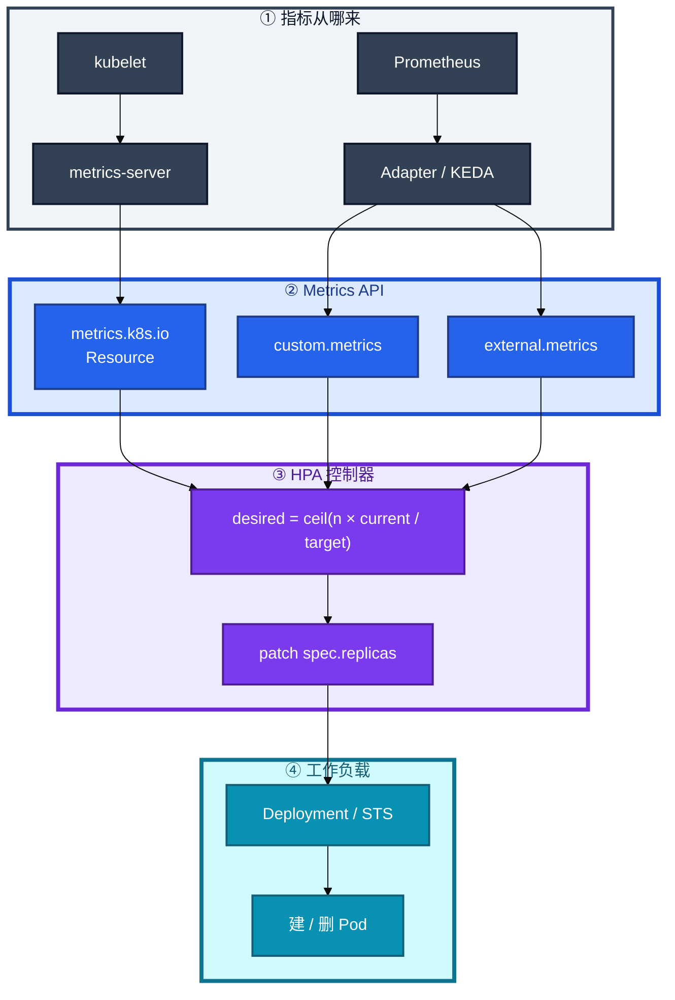
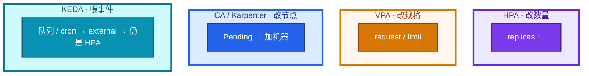
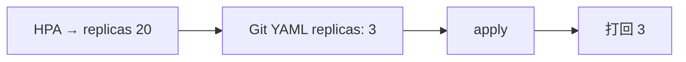
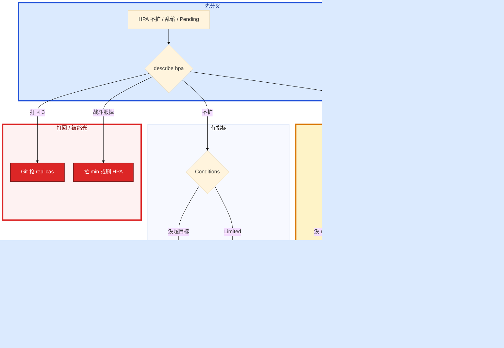

# 弹性伸缩


活动高峰，大厅 CPU 90%，HPA 指标却是 `<unknown>`。群里有人要把 max 加大，另有人给战斗服也挂了一个 70% CPU 的 HPA。低峰一缩，正在打仗的进程被删——玩家掉线，匹配还在往里塞人。

先别动手。这一章后半全是你会动手的：**怎么看 Conditions、怎么提 min、怎么止血被缩光的战斗服、Git 抢 replicas 怎么补。** 前面的公式和指标，是为了让你动手时不选错 Scaler。

**本章主线（HPA 就按这三步）：**

1. **公式**：`ceil(n × current / target)`；多指标各算一遍取 max；分母是 request。
2. **unknown**：先 top / APIService / requests，不要先加大 max。
3. **战斗服**：不要挂自动缩；被缩光立刻拉 min 或删 HPA。

**读完你能：** 白板上写出 desired 公式；HPA unknown 能判断缺 requests 还是 metrics-server；会配扩快缩慢、开服预案、KEDA 喂队列；战斗服知道为什么不能自动缩。

## 本章目录

- [1. 基本概念](#1-基本概念)
- [2. 架构图](#2-架构图)
- [3. 原理](#3-原理)
- [4. 安装部署](#4-安装部署)
- [5. 核心配置](#5-核心配置)
- [6. 命令与操作](#6-命令与操作)
- [7. 生产排障](#7-生产排障)
- [8. 必会 · 常考](#8-必会--常考)
- [合上书](#合上书问自己)

**本章不讲：** 探针、删 Pod、grace → [04 Pod 生命周期](../04-Pod生命周期/)；控制器改副本、PDB 数字 → [05 工作负载](../05-工作负载控制器/)；Pending / Allocatable → [06 调度机制](../06-调度机制/)；APIService 细节 → [03 API Server](../03-API-Server/)；卷跟不跟节点走 → [11 存储](../11-存储/)；声明式补 Git → [01 集群架构](../01-集群架构/)。

---

## 1. 基本概念

HPA（Horizontal Pod Autoscaler）读指标、算副本、**patch 工作负载的 `spec.replicas`**。它假设副本可互换、杀谁都行、状态在外面。必须有 **`resources.requests`**，利用率分母才不是零。

**值班里怎么认现象**：

| 监控/工单说的 | 技术含义 | 第一刀 |
|---------------|----------|--------|
| HPA 指标 `<unknown>` | metrics-server 或没 requests | `top` + APIService + requests |
| CPU 90% 但不扩 | 没超 target / Limited / 窗口 | `describe hpa` Conditions |
| 扩到 max 仍 Pending | 节点不够 | CA / 加节点，不是再加 max |
| 副本从 20 突然变 3 | Git YAML 抢 replicas | 停 apply；补 Git |
| 战斗服副本掉 | 错误 HPA 在缩 | **立刻拉 min 或删 HPA** |

它不是 Scheduler，也不加 Node。扩出来的 Pod 仍走 04 创建、06 调度；缩容 = 控制器删 Pod，走 04 的 SIGTERM。

| 在 HPA 里 | 不在 HPA 里 |
|-----------|-------------|
| 改 Deployment / STS / 部分 CR 的 replicas | 改 request/limit（那是 VPA） |
| 读 Metrics API，约每 15s 同步 | 加云主机（那是 CA / Karpenter） |
| 夹在 minReplicas ~ maxReplicas | 迁玩家、认房间、保对局 |

三个角色不要混：

| 角色 | 干什么 |
|------|--------|
| **HPA** | 算副本并 patch replicas |
| **工作负载控制器** | 按 replicas 建/删 Pod（05） |
| **metrics-server / Adapter / KEDA** | 把指标登记成 Metrics API，HPA 只消费 |

例：3 副本，CPU 90%，目标 60% → `ceil(3×90/60)=5`。

**打个比方**：HPA 像餐厅经理看排队长度决定开几个窗口——它只加减服务员数量，不管每个服务员吃多少（VPA），也不管要不要租新店面（CA）。

> **记住**：HPA 只改 replicas。没 requests 就算不了利用率。顶满仍 Pending 是节点不够。战斗服默认不要挂自动缩。

---

## 2. 架构图

后面安装、命令、排障都对着这张图。



**读图三句话：**

1. **HPA 不直连 kubelet**——资源走 metrics-server；自定义/外部走 Adapter 或 KEDA。
2. **公式不变**——KEDA 只换 current 从哪来，不换 `ceil(n × current / target)`。
3. **真正删进程的是控制器**——PDB 拦 drain，**拦不住 HPA 改 replicas**。

三种「看起来都叫弹性」：



生产主流：**HPA + 人手调 request**。VPA 和 HPA 同时盯 CPU 容易打架。节点不够是 CA，不是再调 HPA max。

---

## 3. 原理

### 3.1 公式：多指标、容差

**一句话：** desired = ceil(当前副本 × 当前值 / 目标)；多指标取 max。

**打个比方**：像开出租车——3 辆车、载客率 90%、目标 60%，需要 `ceil(3×90/60)=5` 辆。CPU 和 QPS 两个指标各算一遍，**听更忙的那个**（取 max），不是取平均。

**现场走一遍**（3 副本 CPU 90%，目标 60%，算 desired）：

1. 看 HPA 当前状态：

```bash
kubectl describe hpa hall-hpa -n hall
```

2. 屏幕 Events / Status：

```text
Metrics:  ( current / target )
          resource cpu on pods:  90% / 60%
Min replicas:  3
Max replicas:  40
Deployment pods:  3 current / 3 desired
```

3. 手算：`ceil(3 × 90 / 60) = ceil(4.5) = 5`——下一环 HPA 会把 replicas patch 到 5（若不在容差内）。

4. 若同时配了 CPU 60% 和 custom QPS，两个 desired 各算，**取较大值**。

5. 容差约 **10%**：current 在 target ±10% 内可能不动，防抖。

**输出解读：**

| Conditions | True 表示 | False 常见原因 |
|------------|-----------|----------------|
| AbleToScale | 能算、能 patch | 目标 workload 不存在 |
| ScalingActive | 指标可读 | `<unknown>`、Adapter 挂 |
| ScalingLimited | 已到 min/max | 顶 max 仍 Pending → 加节点 |

```
desired = ceil(当前副本 × 当前值 / 目标值)
```

**面试怎么说**：「HPA 公式是 ceil(n×current/target)，多指标各算一遍取 max，不是平均。分母是 request，没写 requests 就会 unknown。」

> **记住**：多指标取 max。容差约 10%。同步约 15s 一环。

### 3.2 三类指标：CPU 不是万能

**一句话：** 资源 HPA 分母是 request；没写 requests 就会 unknown。

**打个比方**：利用率像「实际用电 / 报装容量」——报装写 1m（request=1m），实际用 100m，表上显示 10000%，HPA 以为要扩到天上。

**现场走一遍**（HPA unknown，有人要先加大 max）：

1. 值班四连：

```bash
kubectl describe hpa hall-hpa -n hall | grep -A5 Conditions
kubectl top pods -n hall
kubectl get apiservice v1beta1.metrics.k8s.io
kubectl get deploy hall -n hall -o jsonpath='{.spec.template.spec.containers[0].resources}{"\n"}'
```

2. `describe` 常见：

```text
Warning  FailedGetResourceMetric  ...  unable to get metric cpu: ... no metrics known for pod
Conditions: ScalingActive  False  ...  failed to get cpu utilization: missing request for cpu
```

3. **缺 requests** → 补 request 接近真实用量，unknown 消失。

4. 若 `top` 也失败：

```text
error: Metrics API not available
```

5. 查 APIService：

```text
NAME                     SERVICE                      AVAILABLE
v1beta1.metrics.k8s.io   kube-system/metrics-server   False
```

→ 修 metrics-server / kubelet **10250** 证书，不是加大 max。

**输出解读：**

| 类型 | API | 来源 | 典型场景 |
|------|-----|------|----------|
| Resource | `metrics.k8s.io` | metrics-server ← kubelet | CPU / 内存利用率 |
| Pods / Object | `custom.metrics.k8s.io` | Prometheus Adapter | QPS、连接数 |
| External | `external.metrics.k8s.io` | KEDA / Adapter | 队列深度、集群外 |

网关 CPU 20% 但连接已满——只看 CPU 会误缩。游戏大厅用排队人数 / 登录 QPS 更贴。

metrics-server 挂了：**业务对象仍可读写**，别说成 API 挂了（03）。

**面试怎么说**：「unknown 先看 requests 和 top。资源 HPA 分母是 request，不是 limit。网关长连接场景别只盯 CPU，用 custom/external 指标。」

> **记住**：没 top 就别指望资源 HPA。Adapter 高基数别打爆 API。

### 3.3 behavior：扩快缩慢

**一句话：** 扩快缩慢，给 IPVS 摘流时间；开服靠预案提 min。

**打个比方**：扩产能像加开收银台——顾客来了立刻加；缩产能像减员——得等当前客人结完账（摘流），不能瞬间关一半窗口。

**现场走一遍**（开服 1 分钟进服，HPA 还在 15s 环里算）：

1. 活动前检查：

```bash
kubectl get hpa hall-hpa -n hall -o yaml | grep -A20 behavior
kubectl get deploy hall -n hall
```

2. 若 min=3、max=40，进服瞬间 CPU 飙但镜像还在拉、Pod Pending——15s 环来不及。

3. **预案**：活动前把 min 提到峰值 **1.2–1.5 倍**：

```bash
kubectl patch hpa hall-hpa -n hall -p '{"spec":{"minReplicas":24}}'
```

4. 确认镜像预热、节点够、PDB 兼容（min ≥ PDB minAvailable）。

5. 活动后再降 min，避免长期高成本。

**输出解读：**

```yaml
behavior:
  scaleUp:
    stabilizationWindowSeconds: 0
    policies:
    - { type: Percent, value: 100, periodSeconds: 60 }
    selectPolicy: Max
  scaleDown:
    stabilizationWindowSeconds: 300
    policies:
    - { type: Percent, value: 10, periodSeconds: 60 }
```

| 方向 | 生产意图 | 改错会怎样 |
|------|----------|------------|
| scaleUp 窗口 0 | 要扩立刻扩 | 进服瞬间来不及 |
| scaleDown ≥300s | 防抖 + 摘流 | 快缩 → 502（04、08） |

HPA 减副本仍走 readiness 摘流、preStop、grace（04）。

**面试怎么说**：「扩快缩慢。开服不能等 15s 环，要提前把 min 拉到峰值 1.2–1.5 倍。scaleDown 窗口常见 300s， partly 为了给 IPVS 摘流。」

> **记住**：开服靠预案提 min；缩容慢是为摘流和防雪崩。

### 3.4 HPA / VPA / CA / KEDA 各改什么

**一句话：** HPA 改副本、VPA 改规格、CA 加节点、KEDA 只喂外部指标。

**打个比方**：HPA 加减服务员；VPA 换更大托盘（request）；CA 租新店面；KEDA 把外卖平台排队数告诉经理——经理还是 HPA，公式不变。

**现场走一遍**（扩到 max 仍 Pending）：

1. 确认 HPA 已 Limited：

```bash
kubectl describe hpa hall-hpa -n hall | grep -i limited
kubectl get po -n hall | grep Pending
kubectl describe po -n hall <pending-pod> | grep -A3 Events
```

2. Events 常见：

```text
Warning  FailedScheduling  ...  0/12 nodes are available: 12 Insufficient cpu
```

3. 结论：**节点不够**——开 CA / 加节点 / 扩 ASG，不是 `maxReplicas: 100`。

4. 若同时开了 VPA Auto + HPA CPU：VPA 改 request → 利用率分母变 → 副本对着抖——主流 **HPA + 人手调 request**。

**输出解读：**

| 组件 | 改什么 | 生产怎么用 |
|------|--------|------------|
| **HPA** | replicas | 无状态大厅 / 网关 / HTTP 商城 |
| **VPA** | request / limit | 和 HPA 同时盯 CPU 易振荡 |
| **CA** | Node | Pending 触发 ASG，分钟级 |
| **Karpenter** | Node | AWS 原生；阿里云为主用 CA |
| **KEDA** | 喂 external | ScaledObject 创建 HPA；可 scale to 0 |

KEDA 路径：事件 → ScaledObject → external.metrics → HPA 公式不变 → Deployment。

有状态 + 本地盘，新节点来了旧盘过不去，CA 解决不了（11）。

**面试怎么说**：「扩到 max 仍 Pending 是加节点不是加 max。KEDA 不换公式，只喂 external metrics。VPA 和 HPA 同时盯 CPU 会打架。」

> **记住**：KEDA 喂指标不换公式。CA 解决 Pending，HPA 解决不了绑盘。

### 3.5 HPA 解决不了有状态游戏服什么

**一句话：** HPA 假设副本可杀可换；战斗服缩容即踢人。

**打个比方**：大厅像连锁快餐，关一家换一家；战斗服像单机棋牌——玩家在桌上，HPA 随机关店等于掀桌子。

**现场走一遍**（低峰战斗服被 HPA 缩光）：

1. 告警：战斗 shard 副本从 8 掉到 2。

```bash
kubectl get hpa -n game
kubectl describe hpa battle-hpa -n game
kubectl get deploy -n game battle -o wide
```

2. Events：`SuccessfulRescale ... New size: 2`——HPA 按 CPU 缩了。

3. **立刻止血**：

```bash
kubectl patch hpa battle-hpa -n game -p '{"spec":{"minReplicas":8}}'
# 或 kubectl delete hpa battle-hpa -n game
```

4. 停匹配、广播故障、保住还没被删的进程——**不要重启还活着的**（对齐 01/04）。

5. 事后：战斗服去掉自动缩；扩按 CCU 预案手动加实例。

**输出解读：**

| HPA 能做 | 对战斗 / 房间服做不到 |
|----------|----------------------|
| 按 CPU 加副本 | 新副本不会自动分走已有房间 |
| 按 CPU 减副本 | **随机杀 Pod** = 踢正在打的玩家 |
| 和 PDB 一起 | PDB 只拦 drain；**不拦 HPA 改 replicas** |

接入层、大厅、HTTP 商城：HPA 合理，缩容要慢，配 PDB。有状态逻辑服：不要 HPA 自动缩。KEDA scale to 0 仍是删 Pod。

**面试怎么说**：「战斗服不要挂 CPU HPA 自动缩，缩容随机杀 Pod 等于踢人。PDB 挡不住 HPA。被缩光第一刀是拉 min 或删 HPA，不是等 15s 环。」

> **记住**：HPA 假设副本可杀可换。PDB 不是禁止 HPA 缩战斗服的开关。

### 3.6 replicas 和 YAML 会抢

**一句话：** HPA 和 Git YAML 抢同一个 replicas 字段。

**打个比方**：HPA 把餐厅扩到 20 桌，流水线 apply 里还写着 3 桌——下次部署把 17 桌直接收掉。

**现场走一遍**（活动 HPA 扩到 20，流水线 apply 打回 3）：

1. 活动前 HPA 把 hall 扩到 20：

```bash
kubectl get deploy hall -n hall -o jsonpath='{.spec.replicas}{"\n"}'
# 20
```

2. 有人用 Git 里 `replicas: 3` 的 YAML apply：

```bash
kubectl apply -f hall-deploy.yaml
kubectl get deploy hall -n hall -o jsonpath='{.spec.replicas}{"\n"}'
# 3
```

3. 容量当场被打回去，玩家堵登录——PDB **挡不住** apply。

4. 修法：YAML 不写死 replicas，或 SSA 让 HPA 当 FieldManager；应急 `kubectl scale` **当天补 Git**（01）。

**输出解读：**



| 场景 | 谁赢 | 后果 |
|------|------|------|
| HPA patch | 控制器字段 | 正常扩缩 |
| Git apply 写死 | 声明式对齐 | 容量被打回 |
| 应急 scale 不补 Git | 下次发布覆盖 | 热修丢失 |

**面试怎么说**：「HPA 和 YAML 抢 replicas。活动 apply 写死的 replicas 会把扩容打回去。应急 scale 当天要补 Git 或让 HPA 管该字段。」

> **记住**：HPA 和 YAML 会抢 replicas；应急 scale 当天补 Git。

---

## 4. 安装部署

### 4.1 metrics-server 是资源 HPA 的前提

自建集群要单独装 metrics-server。托管 ACK / EKS 通常已有，仍要验收。

| 项 | 选 | 不选 |
|----|----|------|
| 资源 HPA | metrics-server + 每容器 requests | 没 top 就挂 CPU HPA |
| kubelet | 10250 证书让 metrics-server 拉到 | 证书错了先重启 API |
| 副本 | metrics-server 自己 HA | 单副本当指标=控制面挂 |

验收：

```bash
kubectl get apiservice v1beta1.metrics.k8s.io
kubectl top nodes
kubectl top pods -A | head
```

进程在不算数，APIService 必须 **Available=True** 且 top 出数。

### 4.2 Adapter / KEDA / CA

| 组件 | 何时装 | 验收 |
|------|--------|------|
| Prometheus Adapter | QPS / 连接等 custom metrics | HPA 能读到 custom.metrics |
| KEDA | 队列 / cron / 排队人数 | ScaledObject Ready，底下有 HPA |
| Cluster Autoscaler | HPA 顶满仍 Pending | Pending 后节点组加机器 |
| Karpenter | AWS 替代 CA | 按 Pod 需求出节点 |

不要业务 Worker 上跑 metrics-server。Adapter PromQL 对不上 = unknown，不是公式坏了。

---

## 5. 核心配置

HPA min 还得 **≥ PDB minAvailable**（05）。无状态 **min≥2**，min=1 还开 HPA 缩 = 一次抖动单副本裸奔。

| 参数 | 默认 / 常见 | 生产怎么用 | 改错会怎样 |
|------|-------------|------------|------------|
| `minReplicas` | 1 | 无状态 ≥2，≥ PDB | 和 PDB 打架 |
| `maxReplicas` | — | 容量规划 + 告警 | 打满节点/下游 |
| `targetCPUUtilizationPercentage` | 60～70 | 网关别只 CPU | 长连接误缩 |
| 容差 | ~10% | 狂抖提高 target 或窗口 | 来回扩缩 |
| `scaleDown` 窗口 | **≥300s** | 防雪崩、摘流 | 快缩 → 502 |
| requests | 必写 | 分母接近真实 | 1m 骗调度，HPA 乱跳 |
| KEDA minReplicaCount | 可 0 | 战斗服不要 0 | 收掉打仗进程 |

```yaml
apiVersion: autoscaling/v2
kind: HorizontalPodAutoscaler
metadata:
  name: hall-hpa
  namespace: hall
spec:
  scaleTargetRef:
    apiVersion: apps/v1
    kind: Deployment
    name: hall
  minReplicas: 4
  maxReplicas: 40
  metrics:
  - type: Resource
    resource:
      name: cpu
      target:
        type: Utilization
        averageUtilization: 60
  behavior:
    scaleDown:
      stabilizationWindowSeconds: 300
```

> **记住**：无状态 min≥2 且和 PDB 兼容。战斗服开关是「不要挂 HPA」。

---

## 6. 命令与操作

### 6.1 命令速查

```bash
kubectl get hpa -A
kubectl describe hpa <name> -n <ns>
kubectl get apiservice v1beta1.metrics.k8s.io
kubectl top pods -n <ns>
kubectl get --raw /apis/metrics.k8s.io/v1beta1/nodes | head
kubectl get scaledobject -A
kubectl get deploy <name> -n <ns> -o jsonpath='{.spec.replicas}{"\n"}'
```

| 目的 | 命令 | 看什么 |
|------|------|--------|
| HPA 状态 | `describe hpa` | unknown、Conditions |
| 资源指标 | `top pods` | 没数 = 算不了 |
| APIService | `get apiservice ...` | True 才算装上 |
| 自定义 | `get --raw .../custom.metrics.k8s.io/...` | Adapter |
| 外部 | `get --raw .../external.metrics.k8s.io/...` | KEDA |
| 应急扩 | `scale deploy/hall --replicas=20` | 当天补 Git |

### 6.2 典型操作

**开服提 min**：按预案 min = 峰值 × 1.2–1.5；确认镜像预热、节点够；活动后降 min。

**修 unknown**：① 补 requests → ② 修 metrics-server/10250 → ③ Adapter/KEDA → ④ 有指标不扩看 target/Limited/窗口。

**战斗服被缩光**：立刻拉 min 或删 HPA → 停匹配 → 广播 → 保住还活着的进程 → 事后去自动缩。

**指标告警参考：**

| 信号 | 阈值 / 现象 | 级别 |
|------|-------------|------|
| ScalingLimited + Pending | 节点不够 | P1 |
| `<unknown>` | metrics-server / requests | P1 |
| 战斗服 replicas 非预期降 | 错误 HPA | **P0** |
| 副本狂抖 | target 太紧或窗口太短 | P2 |

---

## 7. 生产排障

三问：进程还在不在？HPA 在读指标吗？Pending 是算出来的还是节点不够？



现场顺序：

```bash
kubectl describe hpa <name> -n <ns>
kubectl get apiservice v1beta1.metrics.k8s.io
kubectl top pods -n <ns>
kubectl get deploy <name> -n <ns> -o jsonpath='{.spec.replicas}{"\n"}'
```

| 现象 | 先做什么 | 不要做什么 |
|------|----------|------------|
| FailedGetResourceMetric / unknown | 修 metrics-server；补 requests | 先加大 max |
| 不扩 | Conditions；target / Limited / 窗口 | 先重启 API |
| 狂抖 | 提高 target，加长 scaleDown | 同时 VPA Auto |
| max 仍 Pending | CA / 加节点 | 再调 max |
| 扩完又缩回 3 | 停 apply；YAML 别抢 replicas | 以为 PDB 能挡 apply |
| 战斗服被缩光 | **拉 min 或删 HPA**，停匹配 | 等算法、重启还活着的 |
| 网关 CPU 低不扩 | 换 QPS / 连接 / 排队 | 继续降 CPU 目标 |

---

## 8. 必会 · 常考

| 说法 | 对错 | 口径 |
|------|:----:|------|
| HPA 改的是 request | 错 | 只改 replicas |
| 没写 requests 也能算 CPU 利用率 | 错 | 分母是 request |
| 多指标取平均 | 错 | 各算一遍取 **max** |
| 开服可以等 15s 环自动补齐 | 错 | 预案提 min 1.2–1.5 倍 |
| 战斗服挂 CPU HPA 低峰自动缩 | 错 | 缩容即踢人 |
| PDB 能禁止 HPA 缩战斗服 | 错 | PDB 拦 drain，不拦改 replicas |
| KEDA 换了一套公式 | 错 | 只喂 external metrics |
| KEDA scale to 0 可以收战斗服 | 错 | 仍是删 Pod |
| 扩到 max 仍 Pending 再加大 max | 错 | 加节点 / CA |
| VPA + HPA 同时盯 CPU 更稳 | 错 | 规格和副本对着抖 |
| Git 写死 replicas: 3 没关系 | 错 | apply 会把扩容打回去 |
| metrics-server 挂了 = API 挂了 | 错 | 业务对象仍可读写 |
| Karpenter 是阿里云默认 | 错 | AWS 原生；阿里云为主用 CA |
| 应急 scale 不用补 Git | 错 | 当天补，否则下次覆盖 |

数字：同步约 **15s**；容差约 **10%**；开服 min **1.2–1.5×** 峰值；scaleDown 窗口常见 **300s**；无状态 min **≥2**；公式 `ceil(n × current / target)`。

易混：unknown vs 没超目标；HPA 顶满 vs 节点不够；PDB vs HPA；CA vs HPA；KEDA vs 换公式；VPA vs HPA；Git apply vs 自愿中断。

---

## 合上书，问自己

1. desired 公式怎么写？多指标听谁的？为什么必须有 requests？
2. 资源 / 自定义 / 外部指标各走哪条 API？unknown 先看谁？
3. 为什么扩快缩慢？开服为什么不能等 15s 环？
4. HPA / VPA / CA / KEDA 各改什么？为什么不要一起盯 CPU？
5. 战斗服能不能自动缩？PDB 挡得住吗？被缩光第一刀？
6. HPA 扩到 20，流水线再 apply `replicas: 3` 会怎样？

六题都能口述，这一章就过了。下一章把 Service 和 kube-proxy 剖开：VIP 怎么转到 Pod，proxy 挂了长连接还在不在。
