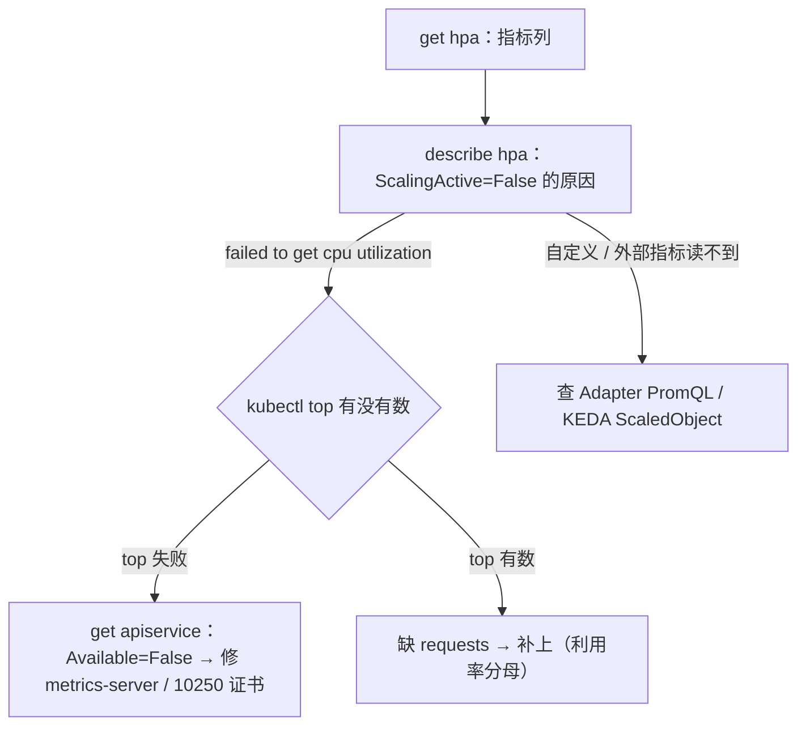

# 07｜弹性伸缩 · 练习题

先合上知识点，对着**一节的主图**把「一次扩容决策的一生」口述一遍——采指标 → 算副本 → 改 replicas → 调度+就绪 → 接流量，缩容和 CA 两条分支挂在哪——再来做题。

| 标记 | 含义 |
|------|------|
| **核心** | 不懂整章就没建立起来 |
| **必会** | 值班和面试都要能讲 |
| **常用** | 线上会反复碰到 |
| **常考** | 白板和追问的高频口径 |

## 本题目录

- [Q1 HPA 怎么算副本数？为什么必须写 requests？多指标听谁的？](#q1)
- [Q2 HPA 的指标从哪来？三条 Metrics API 各是谁提供的？](#q2)
- [Q3 HPA 不动，指标显示 `<unknown>`，你怎么查？](#q3)
- [Q4 behavior 为什么要扩快缩慢？副本来回抖怎么治？](#q4)
- [Q5 明晚开服流量翻倍，靠 HPA 自己扩行不行？](#q5)
- [Q6 HPA 已经扩到 max 了，Pod 还是 Pending，什么问题？](#q6)
- [Q7 HPA、VPA、CA、KEDA 有什么区别？VPA 和 HPA 一起盯 CPU 会更稳吗？](#q7)
- [Q8 KEDA 是干什么的？战斗服能用它 scale to 0 省钱吗？](#q8)
- [Q9 HPA 解决不了有状态游戏服的什么问题？](#q9)
- [Q10 活动凌晨战斗服被缩到 0，玩家全掉线，你第一刀做什么？](#q10)
- [Q11 HPA 扩到 20，第二天发布完副本变回 3，发生了什么？](#q11)
- [Q12 HPA 扩出来的新 Pod 没人连，为什么？](#q12)
- [Q13 CA 与节点池联动](#q13)
- [Q14 60 秒 HPA 定责](#q14)
- [合上书](#合上书)

---

## Q1

**★★★★★｜HPA 怎么算副本数？为什么必须写 requests？多指标听谁的？**

**覆盖**：核心 · 必会 · 常考 ｜ **对应**：知识点 [三、算副本：HPA 公式与多指标](知识点.md)

### 场景

面试白板上直接问公式；线上则是副本数「算出来不对劲」——有人以为多指标会取平均，把 QPS 配了个很紧的目标，结果副本数总比预期多。

### 完整解答

> 🎯 **一句话**：期望副本 = ceil(当前副本 × 当前指标 / 目标指标)，多指标各算一遍取 max，利用率分母是 request。

```text
期望副本 = ceil( 当前副本 × 当前指标值 / 目标指标值 )

例：3 副本，CPU 平均利用率 90%，目标 60%
    ceil( 3 × 90 / 60 ) = ceil(4.5) = 5
```

**为什么必须写 requests**：利用率类指标的分母是 `resources.requests`，不是 limit，也不是实际用量——没写 requests，利用率算不出来，HPA 直接 `<unknown>`；这是 unknown 最高频的根因。反过来，request 写成 1m 而实际用 100m，表上显示 10000%，HPA 会疯狂扩到 max——request 必须接近真实用量，写 1m 既骗调度器（超卖爆节点）又让 HPA 乱跳。

**多指标取 max 不取平均**：配了 CPU 60% + 每 Pod QPS 1000，就各算一遍，CPU 说 5 个、QPS 说 7 个，取 7——听最忙的那个信号。取平均会让宽松指标稀释紧张指标，该扩不扩。

还有两个配套机制：**容差约 ±10%**（current 落在 target ±10% 内不动，防毛刺），**同步周期约 15s**（每 ~15s 读一次指标算一环）。最后结果还要夹在 minReplicas ~ maxReplicas 之间。

> 📝 **面试**：「公式是 `ceil(n × current / target)`；多指标各算一遍取 max；分母是 request，没写就 unknown、写 1m 就显示上万百分比乱扩；容差 10%、周期 15s，结果夹在 min~max。」

### 再追问

1. **「算出 5，为什么副本数一直停在 3？」** —— 看 `describe hpa` 的 Conditions 和 behavior：可能是 scaleUp policy 限速（每分钟最多翻倍）、可能 ScalingLimited（撞 max）、可能 patch 被别的写入方打回（Git，见 Q11）。不要先重启 kube-controller-manager。
2. **「target 定多少合适？」** —— 资源类常见 60～70%，留突发余量；定太紧（50% 以下）副本会狂抖。网关、长连接服务不要只用 CPU，换连接数 / QPS / 排队。不要照抄别家的 50%。

---

## Q2

**★★★★☆｜HPA 的指标从哪来？三条 Metrics API 各是谁提供的？**

**覆盖**：必会 · 常考 ｜ **对应**：知识点 [二、采指标：Metrics API 三条路](知识点.md)

### 场景

面试官问「你说按 CPU 扩，那 CPU 这个数 HPA 是从哪读到的？」答「直接读 kubelet」就暴露了；线上则是自定义指标配完不生效，不知道该查 Prometheus 还是查 HPA。

### 完整解答

> 🎯 **一句话**：HPA 从不直连数据源，只读三条 Metrics API——metrics-server、Prometheus Adapter、KEDA 各自登记，HPA 只消费。

三条路：

| 对比 | **来源链路** | **在 HPA 里的身份** |
|------|--------------|---------------------|
| 资源指标 `metrics.k8s.io` | kubelet → **metrics-server** 聚合 | Resource：CPU / 内存（利用率分母是 request） |
| 自定义指标 `custom.metrics.k8s.io` | Prometheus → **Prometheus Adapter** | Pods / Object：每 Pod 的 QPS、连接数 |
| 外部指标 `external.metrics.k8s.io` | 事件源（Kafka lag、队列）→ **KEDA** / Adapter | External：排队人数、队列深度 |

HPA 是 kube-controller-manager 里的控制器，每 ~15s 一轮向这三条 API 要数。链路任何一段断（metrics-server 挂、Adapter PromQL 写错、KEDA ScaledObject 没 Ready），HPA 侧表现都是 `<unknown>`。

**游戏服为什么要后两条**：网关是长连接，CPU 20% 时连接可能已经打满——只盯 CPU 会该扩不扩。大厅更贴的信号是排队人数、登录 QPS；worker 更贴的是队列深度。

> ⚠️ **别混**：metrics-server 挂了 ≠ API Server 挂了——只影响 `kubectl top` 和资源类 HPA，业务对象读写正常，别上报成「控制面挂了」。

> 📝 **面试**：「三条 Metrics API：资源走 metrics-server（数据来自每节点 kubelet），自定义走 Prometheus Adapter，外部走 KEDA；HPA 只消费不采集，哪条断了都是 unknown。」

### 再追问

1. **「metrics-server 怎么验收？」** —— 看 `kubectl get apiservice v1beta1.metrics.k8s.io` 的 Available=True，且 `kubectl top` 出数；进程在跑不算数。自建集群常见坑是 kubelet **10250** 证书，修证书不是重启 API。不要部署单副本、更不要放业务 Worker 上。
2. **「Adapter 装好了，HPA 还是 unknown？」** —— PromQL 写错或指标名对不上，表现同样是 unknown；先 `kubectl get --raw "/apis/custom.metrics.k8s.io/v1beta1"` 看指标有没有登记。不要用高基数指标（每玩家一条线）打爆 Metrics API。

---

## Q3

**★★★★★｜HPA 不动，指标显示 `<unknown>`，你怎么查？**

**覆盖**：核心 · 必会 · 常考 ｜ **对应**：知识点 [二、采指标：Metrics API 三条路](知识点.md)、[七、作战：定责](知识点.md)

### 场景

活动期大厅该扩不扩，`kubectl get hpa` 指标列是 `<unknown>`；群里有人喊「把 maxReplicas 加大」「重启一下 API Server」。

### 完整解答

> 🎯 **一句话**：unknown 是指标链路断了，不是公式问题——先 describe 看 Conditions 和 Events 定哪条 API，再顺着链路修。



**读图**：入口永远是 `describe hpa`——Events 里那句原因决定往哪走。资源指标走左树（top → apiservice → requests），自定义 / 外部指标走右树（Adapter / KEDA）。

```bash
kubectl describe hpa hall-hpa -n hall | tail -8
# Warning  FailedGetResourceMetric  failed to get cpu utilization: missing request for cpu
# ← 这句就是根因：容器没写 cpu request，利用率分母不存在
kubectl top pods -n hall
# error: Metrics API not available    # ← 若 top 也失败：整条资源指标链路断
kubectl get apiservice v1beta1.metrics.k8s.io
# v1beta1.metrics.k8s.io   kube-system/metrics-server   False   # ← False = metrics-server 没接上
```

三种修法对应三种根因：**补 requests**（最高频）；**修 metrics-server**（证书、部署、副本数）；**修 Adapter 查询**（PromQL / 指标名）。修完等一个同步周期（~15s），ScalingActive 变 True 即恢复。

> ⚠️ **别混**：「不扩」有两种——unknown（链路断，修指标）和「没超目标」（链路好、比例在容差内，调 target）。对策完全不同，加大 max 两种都救不了。

### 再追问

1. **「修好之后要不要重启 HPA / 控制器？」** —— 不用。HPA 是控制循环，指标通了下一环自己恢复；重启反而丢状态。不要顺手重启 kube-controller-manager。
2. **「如果这个 HPA 同时配了 CPU 和自定义，只有自定义 unknown 呢？」** —— CPU 还能算，HPA 会按 CPU 继续工作但 Events 报警；等于失去一条信号，别当没事，按上面右树修。不要因为它还在扩就放着不管。

---

## Q4

**★★★★☆｜behavior 为什么要扩快缩慢？副本来回抖怎么治？**

**覆盖**：必会 · 常用 ｜ **对应**：知识点 [四、防抖：behavior、冷却与扩快缩慢](知识点.md)

### 场景

网关在高峰边缘来回扩缩：5 分钟从 8 扩到 16、过 10 分钟缩回 8、下一波又扩——镜像反复拉、连接反复迁，有人提议「把 HPA 关了，改手动管」。

### 完整解答

> 🎯 **一句话**：扩快缩慢——扩容等不起，缩容要等摘流、等下一波可能回来的流量；抖动靠容差、窗口、限速三层吸收。

**为什么扩快**：流量是阶跃的，进服瞬间等不起；scaleUp 默认窗口 0，允许每分钟翻倍或 +4 个（取大）。**为什么缩慢**：一是流量可能马上回来（缩没了就是雪崩），二是缩容要先摘流——readiness 摘出 Endpoints、IPVS/iptables 规则更新、preStop、grace 都要时间，快缩直接 502。

```yaml
behavior:
  scaleDown:
    stabilizationWindowSeconds: 300   # ← 回看 300s 内所有推荐，取最大的执行
    policies:
    - type: Percent
      value: 10                        # ← 每 60s 最多缩 10%
      periodSeconds: 60
```

**稳定窗口的语义**是追问重点：不是「缩容前干等 300 秒」，是「回头看最近 300 秒里所有推荐，取最高的那个」——窗口内曾有过「要 16 个」的推荐，就绝不缩到 16 以下。配合 policies 限速（每分钟最多缩一小截），缩容变成平滑下行而不是跳崖。

**狂抖三查**：① target 定太紧（50% 以下）→ 提高；② scaleDown 窗口太短 → 拉长到 ≥300s；③ Adapter 的 PromQL 只算瞬时值 → 改 `rate` 算 1～2 分钟均值。三招都是让信号更钝感。

> ⚠️ **别混**：容差（±10% 不动）管小毛刺，behavior 管大幅变化的速率——两个机制别混着讲。不要靠频繁手动 `kubectl scale` 去压抖动，那是在和算法打架。

> 📝 **面试**：「扩快缩慢：scaleUp 窗口 0，scaleDown 默认 300s 回看取最大 + 每分钟限速；一是防流量回弹雪崩，二是给摘流留时间，快缩会 502。」

### 再追问

1. **「听说有个 cooldown 参数？」** —— v1 时代的 `--horizontal-pod-autoscaler-downscale-stabilization` 现在就是 behavior.scaleDown.stabilizationWindowSeconds，不是两个东西；CA 侧另有节点级冷却（加完节点 ~10min 不许缩）。不要回答「HPA 没有冷却」——有，叫稳定窗口。
2. **「policies 里 Percent 和 Pods 同时写，听谁的？」** —— `selectPolicy: Max` 取放宽的那个（官方默认），也可以 Min 取严的。不要只写一条然后奇怪限速没生效——先确认 selectPolicy。

---

## Q5

**★★★★☆｜明晚开服流量翻倍，靠 HPA 自己扩行不行？**

**覆盖**：必会 · 常用 ｜ **对应**：知识点 [四、防抖：behavior、冷却与扩快缩慢](知识点.md)

### 场景

活动开服前评审，有人说「反正配了 HPA，CPU 一高自己会扩」；运维只把 maxReplicas 调到 100 就下班了。

### 完整解答

> 🎯 **一句话**：不行——开服是阶跃流量，15s 环 + 建 Pod + 拉镜像 + 就绪是分钟级，必然迟到；预案是提前把 min 拉到峰值的 1.2–1.5 倍。

HPA 的链条：指标涨 → 下一环（~15s）算出目标 → patch → 控制器建 Pod → 拉镜像、调度、就绪 → 接流量。进服瞬间一分钟几万人，这条链分钟级才补齐，前面的人全堵在登录。

```bash
kubectl patch hpa hall-hpa -n hall -p '{"spec":{"minReplicas":24}}'
kubectl get hpa hall-hpa -n hall
# NAME       REFERENCE         TARGETS     MINPODS   MAXPODS   REPLICAS   AGE
# hall-hpa   Deployment/hall   22%/60%     24        40        24         30d  # ← REPLICAS 已顶到 min
```

配套四件事：**镜像预热**（新节点提前拉好，省掉最慢一环）；**确认节点够**（不够先让 CA 扩或手动加节点）；**min ≥ PDB minAvailable**（否则将来 drain 永远赶不走旧 Pod）；**活动结束把 min 降回去**（不然长期烧钱）。另有条底线：无状态服务 **min ≥ 2**——min=1 还开自动缩，一次抖动就是单副本裸奔。

### 再追问

1. **「活动结束忘降 min 会怎样？」** —— 长期按峰值烧钱，且「利用率一直很低」会误导容量判断。把提 / 降 min 做成同一个 runbook 的两步。不要靠「下次有人会发现」。
2. **「那 HPA 在开服里干什么？」** —— 兜底：预案没算准时它负责把超出部分补上，活动中的自然波峰也归它。预案管「确定要来的」，HPA 管「没算到的」。不要反过来——让 15s 环去扛确定的阶跃。

---

## Q6

**★★★★☆｜HPA 已经扩到 max 了，Pod 还是 Pending，什么问题？**

**覆盖**：必会 · 常考 ｜ **对应**：知识点 [五、落地：改 replicas、调度、就绪与节点层](知识点.md)

### 场景

`get hpa` 显示 REPLICAS 已顶 max，有人喊「把 maxReplicas 调到 200」；调完多出来的全是 Pending。

### 完整解答

> 🎯 **一句话**：HPA 只写数字不加节点——顶 max 仍 Pending 是节点 Allocatable 不够，要上 CA 或加节点，不是加 max。

```bash
kubectl describe hpa hall-hpa -n hall | grep -i limited
# ScalingLimited  True  ...  the desired replica count is more than the maximum replica count
kubectl get po -n hall | grep Pending
kubectl describe po hall-xxx -n hall | grep -A3 Events
# Warning  FailedScheduling  0/12 nodes are available: 12 Insufficient cpu.  # ← 节点资源不够
```

**CA（Cluster Autoscaler，集群自动伸缩器）怎么救**：盯着不可调度的 Pod → 模拟「塞进哪个节点组能行」→ 调云厂商 API 扩节点组（ASG / ESS 伸缩组）→ 新节点启动、注册、可调度，整条链路**分钟级**。反方向：CA 每 ~10s 扫一轮，利用率低于阈值（默认 50%）且持续 10 分钟没人用的节点，先排空（尊重 PDB）再删；加完节点后还有 ~10 分钟冷却不许缩——和 HPA 的防抖一个思路，只是慢一个量级。

**两个「加了也没用」的分支**：模拟调度过不去的（硬反亲和、污点没人容忍、PVC 绑不上），CA 加机器也白加，先修约束；有状态 + 本地盘的，新节点来了旧盘挂不过去，CA 解决不了。

**CA vs Karpenter**：Karpenter 是 AWS 原生的节点层方案，不走固定节点组、按 Pod 需求直接开机器，更快更灵活；阿里云环境主流仍是 CA。

> ⚠️ **别混**：HPA 的 max 是「最多想要几个副本」，不是容量上限；节点不够时再大的 max 只是多造 Pending。不要回答「调大 max 解决 Pending」。

### 再追问

1. **「怎么确认 CA 真的在工作？」** —— `kubectl logs -n kube-system deploy/cluster-autoscaler | tail`，找 Scale-up 行；没有动作就查它认不认这个节点组（有没有扩容权限、节点组最大实例数配没配）。不要只盯节点数看。
2. **「不想等分钟级怎么办？」** —— 节点预留（常驻缓冲节点组）或开服前手动扩节点组；弹性本来就是拿时间换钱。不要指望 HPA 加速——它根本不管节点。

---

## Q7

**★★★★☆｜HPA、VPA、CA、KEDA 有什么区别？VPA 和 HPA 一起盯 CPU 会更稳吗？**

**覆盖**：必会 · 常考 ｜ **对应**：知识点 [五、落地：改 replicas、调度、就绪与节点层](知识点.md)

### 场景

面试官问「你们弹性伸缩怎么做的」，答「装了 HPA」太单薄；有人给大厅同时开了 VPA Auto 和 CPU HPA，说「双重保险」，结果副本数忽大忽小。

### 完整解答

> 🎯 **一句话**：四个抓手各管一层——HPA 改副本、VPA 改规格、CA 改节点、KEDA 只喂指标；VPA 和 HPA 同盯一个信号会打架，不是双保险。

- **HPA**：改工作负载的 `spec.replicas`，无状态服务（大厅、网关、HTTP 商城）的主力。
- **VPA**：改单个 Pod 的 **requests/limits**——Recommender 算推荐、Updater 重建 Pod 应用（Auto 模式）、Admission Controller 在创建时注入。生产主流是开 **Off** 模式只出推荐，当人工调 request 的参考。
- **CA**：改节点——Pending 触发、分钟级（见 Q6）。
- **KEDA**：不改任何东西，把事件源读数喂成 external metrics，创建并管理一条 HPA——公式不变（见 Q8）。

**为什么打架**：VPA Auto 把 request 调大 → 利用率分母变大 → HPA 觉得不忙要缩 → 缩完更挤 → VPA 再调 → 两者对着振荡。所以生产主流是 **HPA + 人手调 request**（VPA Off 出推荐）。VPA 唯一能安全配 HPA 的情形：HPA 用自定义指标、VPA 管 CPU——别在同一个信号上闭环。

> 📝 **面试**：「按『改什么』分组：HPA 改副本、VPA 改规格、CA 改节点、KEDA 喂指标不换公式；两个边界——同盯一个信号会打架（VPA vs HPA），数字变大不等于容量变大。」

### 再追问

1. **「VPA 的 Auto 模式怎么生效？」** —— 重建 Pod（新版本的 in-place 更新要看版本），有重启代价、要配 PDB 控节奏。不要让 VPA Auto 直接上核心服务——先 Off 跑两周看推荐。
2. **「小团队只上一个，选谁？」** —— HPA：收益最大、依赖最少（只要 metrics-server）。不要一上来就 KEDA + VPA + CA 全家桶——每多一个组件多一条 unknown 链路。

---

## Q8

**★★★★☆｜KEDA 是干什么的？战斗服能用它 scale to 0 省钱吗？**

**覆盖**：常考 ｜ **对应**：知识点 [二、采指标：Metrics API 三条路](知识点.md)、[六、边界：为什么弹性救不了有状态游戏服](知识点.md)

### 场景

回放任务队列空闲时想省资源，有人说「上 KEDA 吧，能缩到 0」；另一人想顺手给战斗服也配上：「没对局就缩到 0，多省」。

### 完整解答

> 🎯 **一句话**：KEDA 是指标搬运工 + HPA 管理员——把事件源变成 external metrics、替你管 HPA；它能 scale to 0，但收的也是 Pod，战斗服照样不能用。

机制：写一个 **ScaledObject**（KEDA 的 CRD：声明盯哪个事件源、目标值多少），KEDA 的 scaler 把 Kafka lag、队列深度、cron、云队列的读数登记成 `external.metrics.k8s.io`，再**创建并管理一条真正的 HPA**。公式还是 `ceil(n × current / target)`——KEDA 只换了 current 的来源。

```bash
kubectl get scaledobject -A
# NAME          SCALETARGETKIND            SCALETARGETNAME   MIN   MAX   TRIGGERS   READY
# replay-so     apps/v1.Deployment         replay-worker     0     20    kafka      True   # ← MIN 可以是 0
kubectl get hpa -n replay
# replay-so-hpa   Deployment/replay-worker   0/5(k)   0   20   0   3d   # ← 底下这条 HPA 是 KEDA 建的
```

**scale to 0 的边界**：HPA 的 minReplicas 不能写 0，KEDA 靠自己的逻辑把副本收到 0、来事件再拉起——对无状态的队列消费者、回放任务是省钱利器。但 **0 也是把 Pod 删了**：有对局的战斗服，缩到 0 = 整服玩家蒸发，所以战斗服连 `minReplicaCount: 0` 都不许配。

> ⚠️ **别混**：KEDA 没有发明新的伸缩公式，也不是绕过 HPA——它站在 HPA 前面喂指标。面试说「KEDA 改变了伸缩算法」是错的。

### 再追问

1. **「ScaledObject 建了，HPA 没出现？」** —— 查 `kubectl get scaledobject` 的 Ready 和 Events：scaler 连不上事件源（Kafka 地址、鉴权）就不会建下游。不要手动去建 HPA——KEDA 会把它当野孩子删掉。
2. **「scale to 0 后第一条消息会怎样？」** —— 冷启动：拉镜像 + 起容器 + 连接事件源，秒到分钟级延迟。对延迟敏感的业务把 `minReplicaCount` 设 1。不要默认 0 然后奇怪「第一条消息总是慢」。

---

## Q9

**★★★★★｜HPA 解决不了有状态游戏服的什么问题？**

**覆盖**：核心 · 必会 · 常考 ｜ **对应**：知识点 [六、边界：为什么弹性救不了有状态游戏服](知识点.md)

### 场景

面试官追问「你说战斗服不能挂 HPA，到底解决不了什么？」；线上版本是：有人给战斗服挂了 70% 的 CPU HPA，低峰一缩，正在打仗的玩家全掉线。

### 完整解答

> 🎯 **一句话**：HPA 的前提是「副本可互换、杀谁都行、状态在外面」——战斗服状态在内存、连接不迁移、扩容不等于容量，一条都不满足。

| 对比 | HPA 的假设 | 战斗 / 房间服的现实 |
|------|-----------|---------------------|
| 状态在哪 | 在外面（DB/缓存），副本无状态 | 状态在内存：对局、房间、玩家快照都在进程里 |
| 杀谁 | 杀谁都一样，随机选 | 随机杀 = 踢掉正在打的玩家，新进程接不回旧会话 |
| 扩容效果 | 新副本立刻分担负载 | 新副本不分走已有房间；连接不迁过来，扩了也是空壳 |

三条现实展开：

- **状态在内存**：缩容 = 控制器删 Pod，Pod 里的对局跟着没。K8s 不知道、也不关心哪个 Pod 有对局，随机选一个杀。
- **连接迁移**：玩家的长连接挂在具体进程上。扩出的新副本接不到旧连接；缩掉旧副本，连接只能断。「平滑迁移」要靠业务自己做（断线重连 + 会话恢复），不是 HPA 的能力。
- **扩容 ≠ 容量**：新 Pod 起来是空的——匹配不往里派房间、接入层不往它分连接，它就一个玩家都没有。扩出来没人连（见 Q12），容量并没有涨。

**PDB 也救不了**：PDB 拦的是 drain / 驱逐这类「自愿中断」，拦不住 HPA 直接改 replicas——控制器删 Pod 不走 PDB 这条路。

**战斗服该怎么扩缩**：扩容按 CCU 预案在活动前手动加实例；缩容只缩 **CCU=0 的空实例**（业务自己判空，不是看 CPU）；长期方案是把对局状态外置（落 Redis/DB + 断线重连），再谈水平弹性。大厅、网关、HTTP 商城这些无状态的才适合 HPA + 慢缩 + PDB。

> 📝 **面试**：「战斗服不能挂 CPU HPA 自动缩：状态在内存、连接不迁移、扩容不等于容量，缩容随机杀 Pod 等于踢人；PDB 也挡不住。第一刀是拉 min 或删 HPA，不是等算法自己扩回来。」

### 再追问

1. **「加了 PDB minAvailable 总行了吧？」** —— 不行（上面讲过）：PDB 挡的是节点运维的自愿中断，不是 HPA 的 replicas 变更。不要拿 PDB 当「禁止缩容」的开关。
2. **「那 KEDA 按队列缩、信号『更聪明』，行吗？」** —— 信号聪明不等于删 Pod 温柔：只要缩容动作还是删有对局的进程，一样踢人。聪明信号留给无状态消费者（Q8）。

---

## Q10

**★★★★☆｜活动凌晨战斗服被缩到 0，玩家全掉线，你第一刀做什么？**

**覆盖**：必会 · 常用 ｜ **对应**：知识点 [七、作战：定责](知识点.md)、[六、边界：为什么弹性救不了有状态游戏服](知识点.md)

### 场景

凌晨告警「战斗 shard 副本从 8 掉到 2，还在掉」，玩家投诉掉线；有人准备「重启一下战斗服」，有人开始查网络。

### 完整解答

> 🎯 **一句话**：第一刀是止血——立刻把 min 拉回预案值或直接删掉这个 HPA，然后停匹配，保住还活着的进程。

```bash
kubectl get hpa -n game
kubectl describe hpa battle-hpa -n game | tail -5
# Normal  SuccessfulRescale  ...  New size: 2; reason: cpu resource utilization below target
# ← 确认是 HPA 按 CPU 缩的：凌晨没打架，CPU 当然低
kubectl patch hpa battle-hpa -n game -p '{"spec":{"minReplicas":8}}'   # ← 止血第一刀
# 或者更狠：kubectl delete hpa battle-hpa -n game
```

止血之后的顺序：**停匹配**（别让新玩家进正在沉的船）→ **当故障广播** → **保住还活着的进程，不要重启它们**（重启 = 把还活着的对局也杀了）→ 等流量自然恢复。事后复盘：战斗服去掉自动缩，改按 CCU 预案（Q9）。

> ⚠️ **别混**：两个「不要」——不要等 15s 环自己扩回来（算法不知道这是事故）；不要重启还活着的实例（那是仅存的对局）。告警分级：战斗服副本非预期下降 = P0。

### 再追问

1. **「谁该收到这个告警？」** —— 战斗服副本非预期下降要直达游戏 SRE 的 P0 通道，不能混在普通 HPA 事件里；`SuccessfulRescale` 对有状态服务本身就是可疑事件。不要只在 unknown 上配告警——这次指标一切正常。
2. **「怎么防止下个月又有人给战斗服挂 HPA？」** —— 准入层面挡：有状态服务的命名空间 / 标签加校验（准入 webhook 或评审清单），禁止创建自动缩的 HPA。不要靠「群里说过了」。

---

## Q11

**★★★★★｜HPA 扩到 20，第二天发布完副本变回 3，发生了什么？**

**覆盖**：核心 · 必会 ｜ **对应**：知识点 [五、落地：改 replicas、调度、就绪与节点层](知识点.md)

### 场景

活动期 hall 被 HPA 扩到 20，第二天一次无关配置发布后，登录开始排队——`get deploy` 发现 replicas 是 3。有人怀疑「HPA 坏了」。

### 完整解答

> 🎯 **一句话**：是声明式对齐在抢字段——Git 里 YAML 写死 `replicas: 3`，一次 `kubectl apply` 就把 HPA 扩的 20 打回去了。

`spec.replicas` 是个多方都想写的字段：HPA 在写、Git apply 在写、应急 `kubectl scale` 也在写。apply 的语义是「把现状对齐到我给的清单」，清单里写了 3，就覆盖成 3——**PDB 挡不住 apply**（它根本不拦 replicas 变更）。

```bash
kubectl get deploy hall -n hall -o jsonpath='{.spec.replicas}{"\n"}'
# 20                       # ← HPA 扩的
kubectl apply -f hall-deploy.yaml     # YAML 里 replicas: 3
kubectl get deploy hall -n hall -o jsonpath='{.spec.replicas}{"\n"}'
# 3                        # ← 被打回去了
```

**三种修法**：① YAML 干脆**不写 replicas**（apply 不碰这个字段）；② 用 server-side apply，让 HPA 当该字段的 FieldManager；③ GitOps 场景给 ArgoCD 配 `ignoreDifferences` 忽略 replicas。

**纪律**：应急 `kubectl scale` 可以，但**当天补 Git**，否则下次同步把热修覆盖掉。

> ⚠️ **别混**：这不是 HPA 坏，也不是「K8s 自动回滚」——是声明式对齐的正常语义。排查时先看 `get deploy` 的 managedFields 里谁最后写的，再骂人。

### 再追问

1. **「YAML 不写 replicas，第一次部署怎么办？」** —— 首次部署可以写，之后从清单里移除。不要每次发布前手动改 YAML 去对齐现状——迟早忘。
2. **「为什么不让 HPA 连 Deployment 一起管？」** —— HPA 只被授权写 replicas 这一个字段，这正是它的安全边界；要是它能改镜像改资源，误杀面就大了。不要为了「方便」给 HPA 加权限。

---

## Q12

**★★★★☆｜HPA 扩出来的新 Pod 没人连，为什么？**

**覆盖**：必会 · 常考 ｜ **对应**：知识点 [六、边界：为什么弹性救不了有状态游戏服](知识点.md)、[七、作战：定责](知识点.md)

### 场景

接入层告警「老实例连接打满」，`get hpa` 显示已经扩了 10 个新副本、全部 Ready——但监控上新实例连接数是 0，有人喊「继续加副本」。

### 完整解答

> 🎯 **一句话**：扩容 ≠ 容量——副本就绪只是「能接客」，接不接客由匹配 / 接入层决定；没人调度过来，新 Pod 就是空壳。

按主图分段排查：

```bash
kubectl get po -n game -o wide | grep Running     # 新 Pod Ready 了吗
kubectl get endpoints battle -n game              # 进 Endpoints 了吗
# 都正常但连接还是 0：
# → 匹配服还在往老实例派房间 / 接入层连接不迁移
```

三种情况分层：① 没 Ready（探针 / 镜像拉不下来）→ 回生命周期查；② Ready 但没进 Endpoints → Service / Endpoints 问题；③ 都正常但没人连 → **业务分派问题**：匹配服的房间分配、接入层的连接路由不知道新实例存在，或只认启动时注册的列表。第三种最常见——K8s 的弹性只保证「有空位」，不保证「客人过来坐」。

**对策**：推动匹配 / 接入层感知实例变化（watch Endpoints、按实例连接数做负载均衡），而不是继续加副本——加再多空壳，老实例照样打满。长连接场景还要考虑增量分流：老实例打满时，新连接优先给新实例。

> ⚠️ **别混**：「HPA 没生效」和「扩了没用」是两种故障——前者副本数没变，后者副本数变了容量没变。前者查指标链路，后者查业务分派。不要混着报「弹性伸缩有问题」。

### 再追问

1. **「新实例要不要主动去『抢』老连接？」** —— 谨慎：连接迁移要业务协议支持（断线重连 + 会话恢复），强行切会把玩家踢重连。优先做增量分流，存量等自然轮换。不要为了「均衡」把在线玩家全踢一遍。
2. **「怎么在告警里区分这两种故障？」** —— 两条独立告警：「HPA 期望副本 ≠ 实际副本持续 5 分钟」（弹性链路）；「实例间连接方差过大」（分派失衡）。不要只用一条「副本数异常」糊弄。

---

## Q13

**★★★★☆｜HPA 顶到 max 仍 Pending，CA 为什么没加节点？**

**覆盖**：必会 · 常用 ｜ **对应**：知识点 [五、落地：改 replicas、调度、就绪与节点层](知识点.md)

### 场景

大厅 HPA 20/20，新 Pod 全 Pending，Cluster Autoscaler 日志 `unschedulable pods don't trigger scale-up`。

### 完整解答

> 🎯 **一句话**：CA 只帮「调度得了但放不下」的 Pod；污点/反亲和/资源 request 虚高会导致 **不触发** scale-up。

```bash
kubectl logs -n kube-system -l app=cluster-autoscaler --tail=50
kubectl describe pod <pending> | grep -A3 FailedScheduling
```

| CA 不动原因 | 修什么 |
|-------------|--------|
| max node 到顶 | 提上限或开服预案 |
| request 大于单节点 allocatable | 降 request 或换机型 |
| 硬反亲和占满 | 加节点或改 spread |
| 非标准 taint 无容忍 | 修容忍或节点池 |

链 [06](../06-调度机制/)：CA 不是 HPA 的备胎，解决不了调度规则本身。

### 再追问

战斗服能用 HPA 吗？——无状态网关可以；有状态对局中的逻辑服**不要**靠 HPA 缩容（Q8、Q9）。

---

## Q14

**★★★★★｜活动夜 HPA 抖、缩到 0、扩了没人连，60 秒定责**

**覆盖**：核心 · 必会 ｜ **对应**：知识点 [七、作战：定责](知识点.md)

### 场景

三张单：副本 3↔20 来回；凌晨战斗服 replicas=0；HPA 扩到 15 但 EP 只有 2。

### 完整解答

> 🎯 **一句话**：抖→behavior/minReplicas；缩 0→minReplicas+活动冻结；EP 少→readiness/滚动未就绪。

```bash
kubectl get hpa -n prod
kubectl describe hpa battle -n prod
kubectl get ep -n prod battle-svc
```

> ⚠️ **别混**：metrics `<unknown>` 先修 metrics-server（Q3），**不要**先改 maxReplicas。

### 再追问

VPA 和 HPA 同时盯 CPU 会更稳吗？——**不会**，可能打架；VPA 改 request 触发驱逐（Q7）。

---

## 合上书

（逐条对齐知识点「合上书」）

- [ ] **默画主图**：采指标 → 算副本 → 改 replicas → 调度+就绪 → 接流量；标出缩容分支（摘流再删）和 CA 分支（Pending 才触发）。——Q1/Q6
- [ ] **口述采指标**：三条 Metrics API 各由谁提供、游戏服为什么不能只盯 CPU；unknown 三连查什么。——Q2/Q3
- [ ] **默写公式**：`期望 = ceil(n × current / target)`；多指标取 max；为什么必须有 requests；1m 的 request 会显示多少。——Q1
- [ ] **口述 Conditions**：AbleToScale / ScalingActive / ScalingLimited 各管哪段，「不扩」的两种原因怎么分。——Q3
- [ ] **口述防抖**：扩快缩慢怎么配、稳定窗口的真实语义（回看取最大）、快缩为什么 502、狂抖治哪三处。——Q4
- [ ] **口述开服**：为什么不能等 15s 环、min 提到几倍、配套四件事。——Q5
- [ ] **默画四件套**：HPA 改副本、VPA 改规格、CA 改节点、KEDA 喂指标；VPA 和 HPA 为什么打架；顶 max 仍 Pending 归谁管。——Q6/Q7
- [ ] **口述边界**：HPA 的三个假设、战斗服为什么一条都不满足、战斗服该怎么扩缩。——Q9/Q12
- [ ] **口述 Git 抢 replicas**：apply 打回 3 的机制、三种修法、应急 scale 之后当天干什么。——Q11
- [ ] **定责**：unknown / 不扩 / 狂抖 / 顶 max Pending / 扩了没人连 / 战斗服被缩光——各走决策树哪条、第一刀是什么。——Q3/Q4/Q6/Q10/Q12
