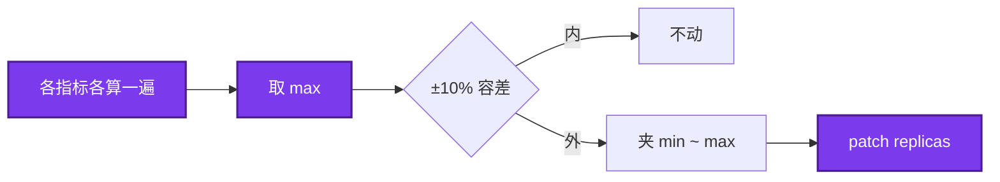
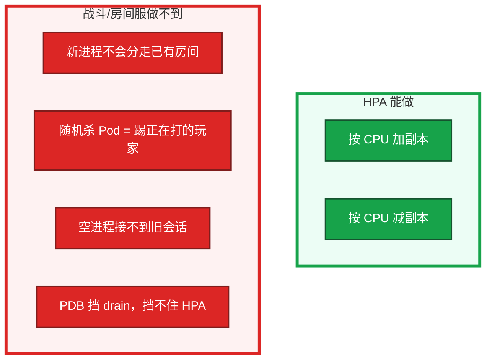
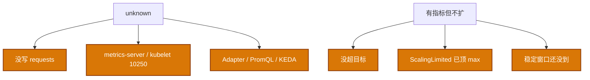

# 07｜弹性伸缩 · 练习题

先对照 [知识点](知识点.md) **本章主线** 自己口述，再对答案。每题标了覆盖范围：

| 标记 | 含义 |
|------|------|
| **核心** | 不懂整章就没建立起来 |
| **必会** | 值班和面试都要能讲 |
| **常用** | 线上会反复碰到 |
| **常考** | 白板和追问的高频口径 |

## 本题目录

- [Q1 公式、requests、多指标](#q1)
- [Q2 战斗服能不能挂 HPA](#q2)
- [Q3 Git 抢 replicas](#q3)
- [Q4 unknown 怎么查](#q4)
- [Q5 扩到 max 仍 Pending](#q5)
- [Q6 behavior / 开服](#q6)
- [Q7 HPA VPA PDB](#q7)
- [Q8 指标 API / Adapter](#q8)
- [Q9 KEDA](#q9)
- [Q10 战斗服被缩光](#q10)
- [合上书](#合上书)

---

## Q1

**★★★★★｜HPA 怎么算副本？为什么要 requests？多指标听谁的？**

**覆盖**：核心 · 必会 · 常考
**对应**：知识点 §3.1 公式

### 场景

白板：「3 副本 CPU 90%、目标 60%，要扩几个？」有人口算成加 1 个。另一边没写 request，HPA 一直 unknown。

### 完整解答

**一句话**：`desired = ceil(当前副本 × 当前指标 / 目标)`；多指标取 max，分母必须是 request。

```
desired = ceil(当前副本 × 当前指标 / 目标)
3 × 90 / 60 → ceil(4.5) = 5
```



资源利用率分母是 **request**，没写就算不了。约 15s 同步一次。ScalingLimited 表示撞上 min/max。

### 再追问

- CPU 70% 和 QPS 哪个说了算？——谁算出的副本多听谁。这是「取 max」，不是两个 HPA 打架。
- 公式会因为上了 KEDA 而变吗？——不会。只换 current 从哪来。

---

## Q2

**★★★★★｜HPA 解决不了有状态游戏服什么问题？**

**覆盖**：核心 · 必会 · 常考
**对应**：知识点 §3.5 有状态游戏服

### 场景

战斗服挂了 CPU 70% 的 HPA。低峰自动缩，正在打的局被删 Pod。值班说「弹性生效了」。

### 完整解答

**一句话**：HPA 缩容就是删 Pod；战斗/房间服内存有对局时，HPA 的「可互换」假设不成立。

HPA 按指标改 replicas，**缩容就是删 Pod**，不管里面有没有对局；扩出来的副本也不会把老玩家迁过去。状态在内存里时，HPA 的假设（可互换）不成立。



大厅 / 网关可以。房间服要用开服规划、匹配认实例、空服才下线。活动高峰先预案扩，别等 CPU 再涨。

### 再追问

- 那战斗服怎么弹性？——加「空闲实例」接新房间；缩只缩 CCU=0 的；或状态外置后再谈水平扩。这是业务 + 匹配，不是贴一个 HPA YAML。
- PDB 能禁止 HPA 缩战斗服吗？——不能。要直接不要挂 HPA。

---

## Q3

**★★★★★｜HPA 把 replicas 改到 20，流水线再 apply YAML 会怎样？**

**覆盖**：核心 · 必会 · 常考
**对应**：知识点 §3.6 replicas 与 YAML

### 场景

活动中 HPA 扩到 20。Git 里还写着 `replicas: 3`。发了一次无关的配置变更，副本被打回 3，登录排队爆了。

### 完整解答

**一句话**：声明式 apply 可能把 HPA 扩过的 replicas 打回 YAML 里的值。

HPA 和 Git 抢同一个字段。声明式会对齐 YAML 里的期望：


YAML 不要把 replicas 当唯一真相，或用 SSA FieldManager 让 HPA 管这个字段。应急 `kubectl scale` 可以，当天补回 Git（01）。PDB 挡不住 apply。

### 再追问

- 声明式是不是不能 kubectl scale？——能，那是止血。24 小时内让仓库和集群一致，否则下次同步把热修覆盖掉。和 01 同一条纪律。

---

## Q4

**★★★★★｜HPA 不生效怎么查？unknown 先看谁？**

**覆盖**：核心 · 必会 · 常用
**对应**：知识点 §7 生产排障 · §4.1

### 场景

HPA 一直不扩。`describe` 里指标 `<unknown>`。有人准备把 max 加大。

### 完整解答

**一句话**：HPA unknown 先看 requests、metrics-server APIService 和 `kubectl top`。

先 `describe hpa`：unknown 指标、ScalingActive=False、Limited。再查 metrics-server APIService、Pod requests、`kubectl top`。



max 再大，unknown 也不会扩。自建集群 metrics-server 常缺 kubelet 证书。metrics-server 挂了业务 API 仍可写，别说成控制面挂了（03）。

### 再追问

- 只拿 CPU 做网关 HPA 有什么坑？——长连接、等待后端时 CPU 不高、连接已满。应该用连接数 / QPS / 队列。游戏网关 CCU 涨、CPU 还闲着，HPA 不扩，玩家进不去。

---

## Q5

**★★★★☆｜扩到 max 还 Pending 怎么办？CA 和 Karpenter 差在哪？**

**覆盖**：必会 · 常用 · 常考
**对应**：知识点 §3.4 CA

### 场景

HPA 已经 50/50。新 Pod Pending Insufficient cpu。有人继续调 HPA max。

### 完整解答

**一句话**：扩到 max 仍 Pending = 节点 Allocatable 不够，要 CA 或加节点，不是继续调 HPA max。

节点资源不够。HPA 已经尽力。加机器或 Cluster Autoscaler。再调 HPA 只是多造 Pending。


先分清是「要更多 Pod」还是「要更多 Node」。有状态 + 本地盘：新节点也挂不上旧卷（11）。

CA 看 Pending 调云 ASG，机型固定、链路分钟级。Karpenter 按 Pod 需求直接要机器，AWS 原生、更快。阿里云为主用 CA。绑盘两者都解决不了。

### 再追问

- ASG 配额满了还调 HPA？——不要。看云配额、机型、污点，不是 max。

---

## Q6

**★★★★☆｜behavior 为什么扩快缩慢？开服怎么办？**

**覆盖**：必会 · 常用
**对应**：知识点 §3.3 behavior

### 场景

流量一掉 HPA 立刻腰斩，下一波进来镜像还在拉，502。开服也等 HPA，进服一分钟补不齐。

### 完整解答

**一句话**：扩快缩慢防雪崩；开服靠预案提 min，不要等 15s 环在进服瞬间猜。

流量来要立刻有容量；刚缩完又来一波会雪崩。缩太快，IPVS 还没摘干净也会 502（08）。

- scaleUp：窗口 0，允许短时翻倍
- scaleDown：300s 稳定窗口 + 每分钟最多 10%
- 开服：人为把 min 提到峰值 1.2–1.5 倍，不要让 15s 环在进服瞬间猜；活动后再降 min

HPA 减副本走优雅退出：控制器删 Pod，仍要 readiness 摘流、preStop、grace（04）。behavior 慢缩也是给摘流留时间，不只是省钱。

### 再追问

- 只靠 15s 环能在进服 1 分钟内补齐镜像 + 调度吗？——不能。一定迟到。

---

## Q7

**★★★★☆｜HPA 和 VPA、PDB 怎么配合？**

**覆盖**：必会 · 常考
**对应**：知识点 §3.4 HPA / VPA / PDB

### 场景

同时开了 HPA 和 VPA，副本和规格一起抖。另一边给战斗服配了 PDB，以为能挡住 HPA 缩容。

### 完整解答

**一句话**：PDB 拦 drain，不拦 HPA patch replicas；`minReplicas` 应 ≥ PDB `minAvailable`。

VPA 改规格，HPA 改数量，一起盯 CPU 易振荡。生产常用 HPA + 固定 request。VPA `Auto` / `Recreate` 会为了改规格删 Pod。

```
PDB：拦 drain / 自愿驱逐
HPA：直接 patch replicas，控制器删 Pod → PDB 不管这条

要配合的是数字：HPA minReplicas ≥ PDB minAvailable
否则 drain 永远赶不走（05）
```

PDB 不能当「禁止 HPA 缩战斗服」的开关。生产无状态 min≥2。min=1 再缩就是单副本裸奔。

### 再追问

- VPA Off 模式呢？——只出推荐，不改运行中的 Pod，可以当调 request 的参考，不和 HPA 当场打架。

---

## Q8

**★★★★☆｜metrics-server 和 Prometheus Adapter 谁提供什么？**

**覆盖**：必会 · 常用
**对应**：知识点 §4.1 · §4.2 指标 API

### 场景

`kubectl top` 失败。自定义 QPS 指标的 HPA 也 unknown。有人只重启了 API Server。

### 完整解答

**一句话**：metrics-server 提供 CPU/内存；自定义指标走 Adapter/KEDA 的 external/custom API。

| 组件 | 提供 | API |
|------|------|-----|
| metrics-server | CPU / 内存，`kubectl top` | `metrics.k8s.io` |
| Prometheus Adapter | Prom 指标登记成 custom / external | `custom.metrics` / `external.metrics` |
| KEDA | 事件源 → external | `external.metrics`（再交给 HPA） |

两者都是 APIService；挂了 HPA 显示 unknown。不要让 Adapter 高基数指标把 API 打爆（03）。修 metrics-server / Adapter，不要先重启 API。业务对象读写不受 `top` 失败影响。自定义指标公式不变。

### 再追问

- 自建集群 top 和资源 HPA 一起哑火，先看哪？——APIService + kubelet 10250 证书。

---

## Q9

**★★★★☆｜KEDA 和 HPA 有什么区别？战斗服上 KEDA 就能自动缩了吗？**

**覆盖**：必会 · 常用 · 常考
**对应**：知识点 §4.2 KEDA

### 场景

匹配 worker 看 CPU 不扩，Kafka lag 已经很高。有人听说 KEDA 能 scale to 0，想给战斗服也挂上。

### 完整解答

**一句话**：KEDA 把事件源喂给 HPA，公式不变；战斗服内存对局仍不能靠 scale to 0。

KEDA 不是替代 HPA，而是把 Kafka lag、Redis 长度、cron 等通过 external metrics 喂给 HPA。你定义 ScaledObject，KEDA 创建并管理 HPA。公式不变。还可以把 min 收到 0，空闲省资源，来事件再 0→1。

游戏：匹配 worker 按排队 / lag 扩、开服前 cron 预热、回放消费者按队列深度——这些比 CPU 准。无状态 Web 按 CPU 就够的，普通 HPA 即可。

**战斗服内存对局：KEDA 一样解决不了。** 缩容仍是删 Pod。不要用 scale to 0 把还在打仗的进程收掉。

### 再追问

- ScaledObject 和 HPA 什么关系？——你管 ScaledObject；底下仍能 `get hpa`。卡住查 Scaler / PromQL，不是换公式。

---

## Q10

**★★★★☆｜活动中战斗服被 HPA 缩光，现场第一刀？**

**覆盖**：必会 · 常用 · 常考
**对应**：知识点 §7 生产排障

### 场景

低峰 HPA 把逻辑服缩掉一半，对局全断。群里要「再扩回来等算法」。有人还想重启剩下的 Pod。

### 完整解答

**一句话**：被 HPA 缩光：立刻拉 min 或删 HPA，停匹配，不要重启还活着的进程。

立刻把 HPA min 拉回预案值，或直接删掉这个 HPA，停匹配，当故障广播。不要等 15s 环，也不要重启还活着的进程。


对齐 01 / 02：已运行长连接优先保住；先停错误的自动动作，再补容量。事后：战斗服去掉自动缩；大厅 / 网关保留 HPA + 慢缩 + Git 别抢 replicas。

扩回来的新副本接不回旧玩家。旧会话在被删的进程内存里。

### 再追问

- 运维能不能假设「扩回来就恢复」？——不能。能救的是还没被删的服，以及断线重连 / 状态落库的研发能力。

---

## 合上书

- [ ] 能写出 `ceil(n × current / target)`，多指标取 max，必须有 requests
- [ ] 能说出资源 / 自定义 / 外部三条 API，unknown 先看 top 和 APIService
- [ ] 能配扩快缩慢，开服靠预案提 min，不靠 15s 环
- [ ] 能分清 HPA / VPA / CA / KEDA 各改什么，战斗服不能自动缩
- [ ] 能处理 Git 抢 replicas，应急 scale 当天补 Git
- [ ] 能把被缩光当成 P0：拉 min / 删 HPA，停匹配，不重启还活着的进程
