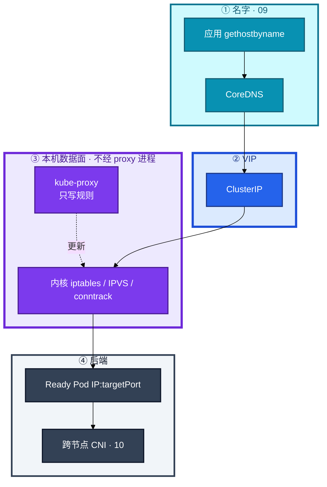
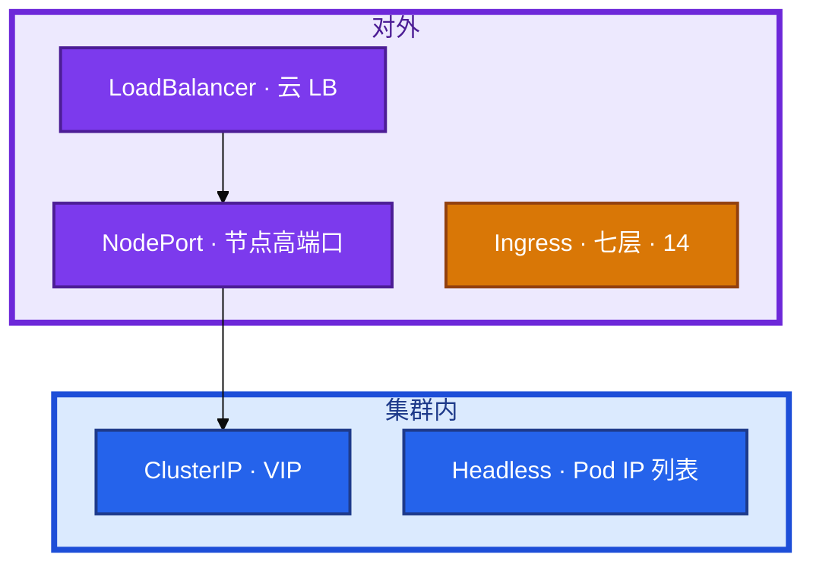
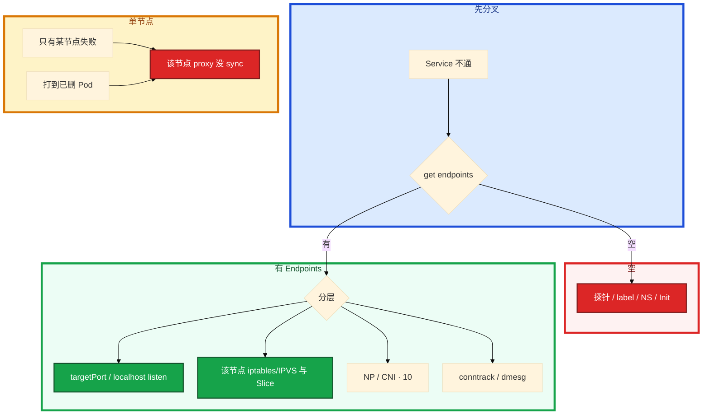

# Service 与 kube-proxy


活动高峰，大厅 Service 建好了，玩家从网关打 ClusterIP 却 connection refused。`kubectl get endpoints` 是空的。群里有人要重启 kube-proxy，另有人要把每个服务开一个云 LB；某节点 proxy 挂了之后，有人准备重启该节点上的战斗服——那会主动拆掉还活着的长连接。

**本章主线（Service 不通就按这三步）：**

1. **Endpoints**：空就不转发——先对 label 与 readiness，不是先重启 proxy。
2. **数据面**：包走内核 iptables/IPVS，**不经过** kube-proxy 进程。
3. **proxy 挂了**：存量长连接往往还在；先拉 proxy，别杀游戏进程。

**读完你能：** 白板上画出 VIP 怎么转到 Pod；四种类型 + Ingress 边界能一口选；空 Endpoints 先对 label 和探针；proxy 挂了能拆存量长连接和新登录；iptables 和 IPVS 的规模差异能讲清。

## 本章目录

- [1. 基本概念](#1-基本概念)
- [2. 架构图](#2-架构图)
- [3. 原理](#3-原理)
- [4. 安装部署](#4-安装部署)
- [5. 核心配置](#5-核心配置)
- [6. 命令与操作](#6-命令与操作)
- [7. 生产排障](#7-生产排障)
- [8. 必会 · 常考](#8-必会--常考)
- [合上书](#合上书问自己)

**本章不讲：** DNS / ndots → [09 CoreDNS](../09-CoreDNS/)；CNI、NetworkPolicy → [10 CNI](../10-CNI与网络策略/)；Ingress / 南北向七层 → [14 Ingress](../14-Ingress与流量管理/)；Cilium 替换 kube-proxy → [23](../23-eBPF与Cilium/)；探针、优雅退出时序 → [04 Pod生命周期](../04-Pod生命周期/)；Label vs Annotation、组件挂了总影响面 → [01 集群架构](../01-集群架构/)。

---

## 1. 基本概念

Service 声明「怎么找到这组 Pod」。kube-proxy 是每节点 DaemonSet，把 Service / EndpointSlice **翻译成本机 iptables 或 IPVS**。数据包 **不经过 kube-proxy 用户态**——像酒店前台只维护房间名单，客人进门走的是大堂通道（内核），不是前台窗口。

**值班里怎么认现象**（先听报错，再对表）：

| 玩家/业务说的 | 技术含义 | 你的第一刀 |
|--------------|----------|------------|
| 「大厅连不上逻辑服」 | 可能是空 Endpoints、targetPort 错、NP 拦 | `get endpoints` |
| 「只有某个节点登录失败」 | 该节点 proxy 没 sync | 对比该节点 ipvs/iptables |
| 「滚动时打到旧 Pod」 | readiness 没摘 + preStop 太短 | describe Pod 探针 |
| 「间歇性超时」 | conntrack 满 | `nf_conntrack_count/max` |

| 术语 | 值班里什么时候碰到 | 定义 |
|------|-------------------|------|
| ClusterIP | 集群内互访 | VIP，ping 通 ≠ 有后端 |
| port / targetPort | 连上了但端口不对 | Service 端口 vs 容器 listen 端口 |
| Endpoints / EndpointSlice | `get ep` 为空 | Ready 且 selector 命中的 Pod 名单 |
| kube-proxy | 某节点新建连接失败 | 只写规则，不经手数据包 |

| 在 Service / kube-proxy 里 | 不在这里 |
|---------------------------|----------|
| ClusterIP / NodePort / LB / Headless / ExternalName | Ingress 对象、七层 path（14） |
| EndpointSlice = Ready 且 selector 命中的 Pod | Pod IP 由谁分配（10 CNI） |
| 本机内核 DNAT / IPVS | 名字怎么解析（09） |

三个角色不要混：

| 角色 | 干什么 |
|------|--------|
| **Service** | 名单：selector、port、类型 |
| **kube-proxy** | 把名单写成内核规则，**不经手数据包** |
| **Endpoints / EndpointSlice** | Ready 后端列表；空 = 不转发 |

`sessionAffinity: ClientIP` 四层粘滞（默认超时 **10800s**），滚动时还可能把人粘在旧 Pod 上。游戏长连接通常自己绑房间，不靠这个。

游戏：客户端不直打 ClusterIP；走网关 / LB。集群内大厅→逻辑服用 ClusterIP 或 Headless（看是否要指定进程）。

> **记住**：Service 是名单，转发规则在节点内核；有 VIP 不等于有后端。userspace 模式已废弃。

---

## 2. 架构图

后面 Endpoints、iptables、proxy 挂了，都对着这张图说话。



**读图三句话：**

1. **没有箭头从数据包指向 kube-proxy 进程**——包走内核，proxy 只维护名单。
2. **DNS 给 VIP，proxy 给 DNAT，CNI 给跨节点**——三层各管一段，别跳层。
3. **conntrack 保证同连接回同一后端**——游戏长连接靠这张表，不是靠 sessionAffinity。

四种类型先选「谁来访问」，再选有没有 VIP：



Ingress **不是** Service 类型。它要 Ingress Controller，通常前面再挂 **一个** 云 LB。ExternalName 是 CNAME 到集群外，**不经 kube-proxy**。

---

## 3. 原理

**本节 5 块：** 3.1 类型边界 · 3.2 Endpoints · 3.3 iptables/IPVS · 3.4 proxy 挂了 · 3.5 摘流

### 3.1 四种类型与 Ingress 边界

**一句话：** 对内 ClusterIP，有状态直连 Headless，对外 HTTP 收敛 Ingress + 一个 LB。

**打个比方：** ClusterIP 像公司内部分机——打 8001 前台帮你转；Headless 像直接拨到某工位分机号；NodePort 像把分机映射成大楼门牌号；LoadBalancer 像电信给你一条 400 热线；Ingress 是带路由规则的总机，不是第五种分机类型。

**现场走一遍**（大厅要访问逻辑服，先选对类型）：

1. 查看现有 Service：

```bash
kubectl get svc -n game
kubectl get svc logic-svc -n game -o wide
```

2. 屏幕出现：

```text
NAME        TYPE        CLUSTER-IP      EXTERNAL-IP   PORT(S)   AGE
logic-svc   ClusterIP   10.96.100.55    <none>        8080/TCP  3d
hall-svc    LoadBalancer 10.96.200.11   203.0.113.8   80:31234/TCP  7d
mysql       ClusterIP   None            <none>        3306/TCP  30d
```

3. **说明什么**：`logic-svc` 是 ClusterIP，集群内用 `logic-svc.game.svc.cluster.local` → VIP `10.96.100.55`；`mysql` 的 `CLUSTER-IP` 是 `None` = Headless；`hall-svc` 底下仍是 NodePort + ClusterIP，云给了 EXTERNAL-IP。

4. 验证 Headless 的 DNS 行为：

```bash
kubectl run tmp --image=busybox:1.36 -it --rm -- \
  nslookup mysql.game.svc.cluster.local
```

5. 输出解读见下。下一步：若要对指定 ordinal 连 STS，必须用 Headless，ClusterIP 会随机打到不同 Pod。

**输出解读**（Headless nslookup 典型）：

```text
Server:    10.96.0.10
Address:   10.96.0.10:53

Name:      mysql.game.svc.cluster.local
Address 1: 10.244.1.15 mysql-0.mysql.game.svc.cluster.local
Address 2: 10.244.2.22 mysql-1.mysql.game.svc.cluster.local
```

| 行 | 含义 |
|----|------|
| `Server: 10.96.0.10` | 问的是 kube-dns VIP（09） |
| 两条 Address | Headless **没有 VIP**，A 记录是 **Ready Pod IP 列表** |
| `mysql-0.mysql...` | STS 专用：`pod.svc.ns.svc.cluster.local` |

| 类型 | 谁来访问 | DNS | 还经过 kube-proxy？ |
|------|----------|-----|---------------------|
| ClusterIP | 集群内 | `svc.ns.svc.cluster.local` → VIP | 是 |
| NodePort | 节点IP:port | 仍有 ClusterIP | 是；默认端口段 **30000–32767** |
| LoadBalancer | 外网 / 云 LB | 云厂商给 hostname | 是；底下仍是 NodePort + ClusterIP |
| Headless | 直连 Pod | A 记录是 **Pod IP 列表** | 几乎不管负载均衡 |
| ExternalName | CNAME 到集群外 | 外部名 | 否 |
| Ingress（14） | HTTP/HTTPS path/host | 通常一个入口 LB | Controller 再打到后端 Service |

LoadBalancer 配额用尽时 Service 一直 Pending，看起来像「K8s 坏了」，其实是云 controller 没拿到 LB。NodePort 每个服务占端口，安全组难收；游戏客户端直连 NodePort 会把节点 IP 暴露给玩家。

> **别混**：Ingress 不是第五种 Service；Headless 的 `CLUSTER-IP: None` 不是「没有 Service」。

**面试怎么说**：「对内 ClusterIP，STS 用 Headless 拿 Pod IP，对外 HTTP 收敛到 Ingress 一个 LB，不要每个微服务一个云 LB。ExternalName 是 CNAME，不经 kube-proxy。」

### 3.2 Endpoints：空就不转发

**一句话：** Endpoints 空就不转发——名单由 EndpointSlice 控制器按 selector + Ready 填。

**打个比方：** Service 是餐厅订座表，Endpoints 是今天实际能接待的桌号。订座电话（VIP）能打通，但桌上没人（空 Endpoints），客人还是进不去。

**现场走一遍**（大厅报 logic-svc 不通）：

1. 先看有没有后端：

```bash
kubectl get endpoints,endpointslice -n game logic-svc
kubectl get pods -n game --show-labels | grep logic
```

2. 屏幕出现：

```text
NAME        ENDPOINTS   AGE
logic-svc   <none>      2h

NAME                                   ENDPOINTS   AGE
logic-svc-abc12                        (empty)     2h

NAME                          READY   STATUS    LABELS
logic-7f8b9c-xxx              0/1     Running   app=logic,version=v2
logic-6d5e4f-yyy              1/1     Running   app=logics   # 注意多了一个 s
```

3. **说明什么**：Endpoints 空；label 是 `app=logics` 而 Service selector 多半是 `app=logic`——**一个字母**就全空。

4. 确认 selector：

```bash
kubectl get svc logic-svc -n game -o jsonpath='{.spec.selector}{"\n"}'
kubectl describe pod logic-7f8b9c-xxx -n game | grep -A5 "Conditions:"
```

5. 若 Ready=False，看探针：

```text
Conditions:
  Type              Status
  Ready             False
  ...
  Warning  Unhealthy  Readiness probe failed: HTTP probe failed with statuscode: 503
```

**输出解读**：

| 现象 | 定责 | 修法 |
|------|------|------|
| `ENDPOINTS <none>` + label 对不上 | selector 写错 / 打在 annotation 上 | 改 label 或 selector |
| Pod Running 但 Ready=False | readiness 失败 | 修探针 / 依赖 / 慢启动（04） |
| Init 未完成 | 不进名单 | 等 Init 或修镜像 |
| Namespace 搞错 | 看错 NS 的 ep | 对 NS |

有 Endpoints 仍不通：targetPort、容器没 listen、NetworkPolicy、kube-proxy 规则、CNI。先在 Pod 内 `curl localhost:8080`，再从另一 Pod 打 ClusterIP。**不要第一刀重启 kube-proxy**。

EndpointSlice 是 Endpoints 的分片，避免超大对象。kube-proxy 默认 watch Slice。旧控制器只写 Endpoints 时，新 proxy 可能看不到，属版本 / 兼容问题。

> **记住**：空 Endpoints 先对 label 和探针，不要先重启 proxy；Running 不等于进了名单。

**面试怎么说**：「Service 不通我第一刀 `get endpoints`，空就对 label 和 readiness，不会先重启 kube-proxy。selector 只看 label，不看 annotation。」

### 3.3 iptables vs IPVS

**一句话：** iptables 链表 O(n)；IPVS 哈希 O(1)；包都走内核不走 proxy 进程。

**打个比方：** iptables 像门卫按名单从上到下挨个核对——名单上千人，每个新客都要扫一遍；IPVS 像闸机刷脸——O(1) 哈希，增量更新。

**现场走一遍**（大集群 Service 上千，节点 CPU 被 kube-proxy 打满）：

1. 看当前模式：

```bash
kubectl get cm kube-proxy -n kube-system -o yaml | grep -E 'mode|strictARP'
```

2. 屏幕出现：

```text
    mode: "iptables"
```

3. 在该节点看规则规模：

```bash
iptables-save | grep -c KUBE-
ipvsadm -Ln 2>/dev/null | head -5
```

4. 典型 iptables 输出片段：

```text
*nat
-A KUBE-SERVICES -d 10.96.100.55/32 -p tcp -m tcp --dport 8080 -j KUBE-SVC-XXXX
-A KUBE-SVC-XXXX -m statistic --mode random --probability 0.50000000000 -j KUBE-SEP-AAA
-A KUBE-SVC-XXXX -m statistic --mode random --probability 1.00000000000 -j KUBE-SEP-BBB
-A KUBE-SEP-AAA -p tcp -j DNAT --to-destination 10.244.1.15:8080
```

5. 若切 IPVS，先查模块：

```bash
lsmod | grep ip_vs
```

**输出解读**：

| 字段 / 现象 | 含义 |
|-------------|------|
| `KUBE-SERVICES` | 入口链，匹配 VIP:port |
| `statistic --mode random` | iptables 随机 DNAT 到后端 |
| `DNAT --to-destination 10.244.1.15:8080` | VIP 转到 Pod IP:targetPort |
| `grep -c KUBE-` 上万 | 更新规则整表刷新，CPU 高 |
| `ipvsadm` 无输出 | 还没切 IPVS 或模块未加载 |

| | iptables | IPVS |
|--|----------|------|
| 查找 | 链表 O(n) | 哈希 O(1) |
| 更新 | 常整表刷新 | 增量 |
| 规模 | Service 少时够用 | **上千就该评估切换** |
| 前提 | 默认可用 | 节点要 `ip_vs` 内核模块 |
| 算法 | statistic 随机 DNAT | rr 默认；长连接可看 **lc** |
| 可见 | `iptables-save \| grep <VIP>` | `ipvsadm -Ln`；dummy 口 `kube-ipvs0` |

切 IPVS：改 ConfigMap `mode: ipvs` → 滚动 kube-proxy DS → 逐节点 `ipvsadm -Ln`。部分节点 ARP 异常时开 `ipvs.strictARP`。较新版本还有 nftables 模式，本章答到「包仍走内核、规则谁写」即可。

给 proxy 加 CPU 填不满数据面——包根本不进用户态。

> **记住**：包走内核不走 proxy 进程；大集群用 IPVS（O(1)），iptables 链表 O(n)。

**面试怎么说**：「kube-proxy 只写规则，数据包走 iptables 或 IPVS。Service 上千 iptables 更新 O(n) 会打满 CPU，该切 IPVS。切失败先看 `lsmod | grep ip_vs`。」

### 3.4 kube-proxy 挂了：长连接还在吗

**一句话：** proxy 挂了规则已在内核，存量长连接往往还在。

**打个比方：** 前台员工下班了（kube-proxy 进程挂了），但大堂闸机里已经录好的当日通行证（conntrack + 内核规则）还能用；新来的人（新连接）或换了房间名单（Endpoints 变了）就进不去了。

**现场走一遍**（某节点 proxy Pod CrashLoop，战斗服长连接还在，新登录失败）：

1. 看该节点 proxy 状态：

```bash
kubectl -n kube-system get po -o wide -l k8s-app=kube-proxy | grep node-battle-03
kubectl -n kube-system logs kube-proxy-xxxxx --tail=30
```

2. 屏幕出现：

```text
NAME               READY   STATUS             RESTARTS   NODE
kube-proxy-7k2m9   0/1     CrashLoopBackOff   12         node-battle-03
```

3. 对比 EndpointSlice 与本机规则（在 node-battle-03 上）：

```bash
kubectl get endpointslice -n game -l kubernetes.io/service-name=logic-svc -o yaml | grep -A2 addresses
ipvsadm -Ln | grep 10.96.100.55
# 或 iptables-save | grep 10.96.100.55
```

4. 若 Slice 里已有新 Pod IP `10.244.3.99`，但 ipvsadm 里没有这条后端 → **规则没 sync**。

5. **止血**：拉起该节点 kube-proxy DS Pod，等 Running 后再测新连接。**不要先重启游戏进程**。

**输出解读**：

```text
TCP  10.96.100.55:8080 rr
  -> 10.244.1.15:8080    Masq 1  0  0
  -> 10.244.2.22:8080    Masq 1  0  0
```

| 行 | 含义 |
|----|------|
| `10.96.100.55:8080` | Service VIP:port |
| `rr` | 轮询算法（IPVS 默认） |
| `10.244.1.15:8080` | 当前内核里的后端；若 Pod 已删但还在 → 打到已删 Pod |

| proxy 状态 | 存量长连接 | 新连接 / 滚动后 |
|------------|-----------|----------------|
| 进程挂了，规则还在 | **往往还能走** | 可能失败 |
| Endpoints 已变，规则未更新 | 旧连接可能还在 | 打到已删 Pod |
| 全节点 proxy 正常 | 正常 | 正常 |

Cilium eBPF 模式不靠 kube-proxy 写 iptables。挂的是 Cilium agent 时，影响面类似「规则不更新」。见 23。

> **记住**：proxy 挂了存量长连接往往还在；新连接和滚动后的新 Pod 会出问题。先拉 proxy，别杀游戏进程。

**面试怎么说**：「kube-proxy 进程挂了不等于立刻断光——规则已在内核，conntrack 还在。新连接和 Endpoints 变更后可能打到旧 Pod。先拉 proxy，不要重启还活着的长连接业务。」

### 3.5 摘流与长连接

**一句话：** 摘流靠 readiness + preStop，Service 对象自己不会等容器感觉好了。

**打个比方：** 餐厅要打烊，得先把订座系统里桌号撤掉（readiness fail），再等最后一桌客人吃完（preStop 等待）；你不能指望「餐厅招牌还在」就自动拒新客。

**现场走一遍**（滚动更新时新连接打到 Terminating Pod）：

1. 看滚动状态：

```bash
kubectl rollout status deploy/logic -n game
kubectl get po -n game -l app=logic -o wide
kubectl get endpoints logic-svc -n game -w
```

2. 屏幕出现（典型事故窗口）：

```text
logic-aaa   1/1   Running       10.244.1.15   node-01
logic-bbb   1/1   Terminating   10.244.1.15   node-01   # 旧 Pod 还在 Terminating
logic-ccc   1/1   Running       10.244.2.30   node-02   # 新 Pod 已 Ready

ENDPOINTS   10.244.2.30:8080   # 旧 IP 已摘
```

3. 但若 readiness 没先 fail，Endpoints 里可能短暂还有 `10.244.1.15`，新连接仍打到正在退出的 Pod。

4. 查 conntrack（节点上）：

```bash
cat /proc/sys/net/netfilter/nf_conntrack_count
cat /proc/sys/net/netfilter/nf_conntrack_max
dmesg | tail -5 | grep conntrack
```

5. 若出现 `nf_conntrack: table full, dropping packet` → 间歇超时，不是 Endpoints 空。

**输出解读**：

| 数字 / 日志 | 含义 |
|-------------|------|
| count/max > **80%** | 该告警，CCU 高时常见 |
| 默认 max **65536** | 游戏网关 CCU 高往往不够 |
| `table full, dropping packet` | 新建连接随机失败，像 Service 抖 |
| sessionAffinity **10800s** | 滚动时还可能粘旧 Pod |

`maxUnavailable=0` 保证的是副本数量，不保证数据面已经摘干净（05）。

**面试怎么说**：「摘流靠 readiness 先从 Endpoints 摘掉，preStop 给 graceful 时间。Service 不会等容器感觉好了。conntrack 满会间歇超时，和空 Endpoints 是两回事。」

---

## 4. 安装部署

kube-proxy 是 kubeadm 默认的 DaemonSet，`kube-system` ConfigMap `kube-proxy`。托管集群同样有一份，只是你不一定改得了 mode。

| 项 | 选 | 不选 |
|----|----|------|
| 模式 | 规模大用 **IPVS** | 万级 Service 死守 iptables |
| 验收 | `ipvsadm` / `iptables-save` 能看到 VIP | 只看 proxy Pod Running |
| Cilium 替换 | 知道影响面仍是「规则不更新」（23） | 以为上了网格就不用答本章 |

**现场验收**（新集群或切模式后）：

```bash
kubectl -n kube-system get ds kube-proxy
kubectl get cm kube-proxy -n kube-system -o yaml | grep mode
# 任选节点 SSH：
ipvsadm -Ln | head -20
iptables-save | grep KUBE-SERVICES | head -5
```

切 IPVS：节点内核模块 → 改 CM `mode: ipvs` → 滚动 DS → 逐节点 `ipvsadm -Ln`。不要活动中全集群一起切。

## 5. 核心配置

长连接滚动必须 readiness + 优雅退出，否则 IPVS 还把新连接打到正在 TERM 的 Pod。游戏网关若要真实玩家 IP 做风控，入口用 NLB + `externalTrafficPolicy: Local`。

| 项 | 选 | 不选 |
|----|----|------|
| 对内 | ClusterIP | 每个服务一个云 LB |
| 对外 HTTP | Ingress + 一个 LB（14） | 纯 NodePort 裸奔生产 |
| 有状态直连 | Headless | 用 ClusterIP 当「连指定 ordinal」 |
| 模式 | 规模大用 IPVS | 万级死守 iptables |
| 长连接 | 关注 conntrack max、TIMEOUT | 默认 65k 扛游戏 CCU |
| 滚动 | readiness 决定进不进 Endpoints | 以为 Service 会等容器「感觉好了」 |
| sessionAffinity | 游戏房间自己绑 | 当会话保持银弹，滚动粘旧 Pod |

**externalTrafficPolicy**：

| | Cluster | Local |
|--|---------|-------|
| 源 IP | 变成节点 IP | **保留真实客户端 IP** |
| 转发 | 可跨节点 | 只打本节点 Pod |
| 空节点 | 仍可能接到 | **丢包**；要外部健康检查摘掉，或每节点都有副本 |

`internalTrafficPolicy: Local` 减少跨节点东西向跳，适合同节点 sidecar 密集的场景，副本不够会断。

**externalTrafficPolicy** 和 **internalTrafficPolicy** 都作用在 kube-proxy 写规则的那一层，不作用在 Ingress Controller 自己的七层反代上。七层入口要真实 IP，看 Ingress / NLB 的 Proxy Protocol 或 `X-Forwarded-For`（14）。

```yaml
# 示意：保留客户端 IP 的 LoadBalancer
apiVersion: v1
kind: Service
metadata:
  name: hall-gateway
spec:
  type: LoadBalancer
  externalTrafficPolicy: Local
  selector:
    app: hall-gateway
  ports:
  - port: 443
    targetPort: 8443
```

> **记住**：Local 保源 IP 但空节点丢包；Cluster 会 SNAT 成节点 IP。

---

## 6. 命令与操作

### 6.1 命令速查

```bash
kubectl get svc,ep,endpointslice -n <ns>
kubectl get pods --show-labels -n <ns>
kubectl get cm kube-proxy -n kube-system -o yaml | grep mode
kubectl logs -n kube-system -l k8s-app=kube-proxy --tail=50
```

| 目的 | 命令 | 看什么 | 正常 / 异常 |
|------|------|--------|-------------|
| 有没有后端 | `get endpoints,endpointslice -n <ns> <svc>` | 空就不转发 | `<none>` = 异常 |
| 对 selector | `get pods --show-labels` | 别对 annotation | label 差一个字母就空 |
| 探针 | `describe pod` | Ready False、失败次数 | Unhealthy = readiness |
| iptables 规则 | `iptables-save \| grep <ClusterIP>` | 该节点有没有 VIP | 无输出 = 规则没 sync |
| IPVS 规则 | `ipvsadm -Ln \| grep <ClusterIP>` | dummy `kube-ipvs0` | 无后端 = sync 问题 |
| 切 IPVS 失败 | `lsmod \| grep ip_vs` | 模块没加载 | 空 = 要 modprobe |
| conntrack | `cat /proc/sys/net/netfilter/nf_conntrack_{count,max}` | >80% 告警 | table full 在 dmesg |
| proxy 是否在 | `get po -o wide -l k8s-app=kube-proxy` | 按节点看 | CrashLoop = 该节点风险 |

值班先跑：`get ep` → `describe pod` 探针 / label → 该节点 `ipvsadm`/`iptables` → conntrack。

### 6.2 空 Endpoints SOP

```bash
kubectl get ep,endpointslice -n game logic-svc
kubectl get svc logic-svc -n game -o jsonpath='{.spec.selector}{"\n"}'
kubectl get pods -n game --show-labels
kubectl describe pod -n game -l app=logic | grep -A8 Conditions
```

修的是 Pod / 探针 / 标签，不是 proxy。

### 6.3 切 IPVS SOP

```bash
lsmod | grep ip_vs || sudo modprobe ip_vs ip_vs_rr ip_vs_wrr ip_vs_sh
kubectl -n kube-system edit cm kube-proxy   # mode: ipvs
kubectl -n kube-system rollout restart ds/kube-proxy
kubectl -n kube-system rollout status ds/kube-proxy
# 逐节点：
ipvsadm -Ln
```

算法 rr 默认，长连接可看 lc。

### 6.4 conntrack 满止血

```bash
cat /proc/sys/net/netfilter/nf_conntrack_count
cat /proc/sys/net/netfilter/nf_conntrack_max
dmesg | grep conntrack
sysctl -w net.netfilter.nf_conntrack_max=262144
```

调高 max，查短连接泄漏，监控 count/max。**>80% 告警**。TIMEOUT 按游戏长连接空闲时间调，不要只加 max 不治理泄漏。

---

## 7. 生产排障

分层：DNS（09）/ Endpoints / proxy 规则 / CNI ping / 端口 listen。不要一层猜。`get` 可以 `exec` 不行是 API→kubelet（03），不是这条 Service 路径。



| 现象 | 先做什么 | 不要做什么 |
|------|----------|------------|
| Service 不通 | `get endpoints` 是否空 | 第一刀重启 proxy |
| 空 | describe Pod 探针；对 label/selector | 改 kube-proxy mode |
| 有 Endpoints 仍不通 | targetPort、Pod 内 curl localhost | 一层猜到 CNI |
| 间歇超时 | conntrack；dmesg table full | 当 Endpoints 空去改 selector |
| 打到已删 Pod | 该节点 proxy 是否 sync | 先重启游戏进程 |
| 部分节点不通 | 对比该节点规则与 Slice | 当全集群 CNI 坏了 |
| 切 IPVS 失败 | `lsmod \| grep ip_vs` | 给 proxy 加 CPU 没用 |
| proxy 进程没了 | 拉起 proxy | 重启逻辑服 |
| LB EXTERNAL-IP Pending | 云配额 / cloud controller | 当 K8s 坏了 |
| Local 丢登录包 | 空节点没被外部摘掉 | 再加 NodePort |

---

## 8. 必会 · 常考

| 说法 | 对错 | 口径 |
|------|:----:|------|
| 数据包经过 kube-proxy 用户态 | 错 | 只写规则，包走内核 |
| ClusterIP 能 ping 通就有后端 | 错 | 空 Endpoints 仍可能有 VIP |
| Running 一定进 Endpoints | 错 | 要 Ready 且 selector 命中 |
| selector 写在 annotation 上也行 | 错 | 只看 label |
| Ingress 是第五种 Service | 错 | 七层对象，要 Controller（14） |
| 每个服务一个云 LB 更稳 | 错 | HTTP 收敛到 Ingress |
| Headless 也回 VIP | 错 | A 记录是 Pod IP 列表 |
| 用 ClusterIP 连 mysql-0 | 错 | STS 用 Headless |
| 大集群继续用 iptables 就行 | 错 | 上千评估 IPVS |
| proxy 挂了长连接立刻全断 | 错 | 存量往往还在；新连接会出问题 |
| proxy 挂了先重启战斗服 | 错 | 先拉 proxy |
| Service 对象会等容器感觉好了 | 错 | 摘流靠 readiness |
| Local 一定更好 | 错 | 空节点丢包，要外部摘空节点 |
| conntrack 满 = Endpoints 空 | 错 | 内核跟踪表满，名单可能还在 |
| Cilium 替换后不用答影响面 | 错 | agent 挂了仍是规则不更新 |

数字：NodePort **30000–32767**；sessionAffinity 默认 **10800s**；conntrack 默认常 **65536**；告警 **>80%**。

易混：空 Endpoints vs conntrack 满；iptables vs IPVS；Cluster vs Local；ClusterIP vs Headless DNS；proxy 挂了 vs CNI 跨节点；Service 类型 vs Ingress。

---

## 合上书，问自己

1. 从 Pod A 访问 `http://web:80` 完整路径？包走不走 proxy 进程？
2. 四种类型 + Ingress 怎么选？Headless 的 A 记录是什么？
3. Endpoints 空的四条原因？有 Endpoints 仍不通先看哪？
4. iptables 和 IPVS 差在哪？切 IPVS 失败先看什么？
5. kube-proxy 挂了，存量长连接和新登录各怎样？为什么不能重启战斗服？
6. Local 保什么、丢什么？conntrack 满是什么现象？

六题都能口述，这一章就过了。下一章把名字解析剖开：ndots 怎样把一次外网查询放大成四次。
