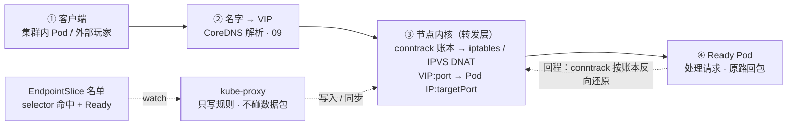
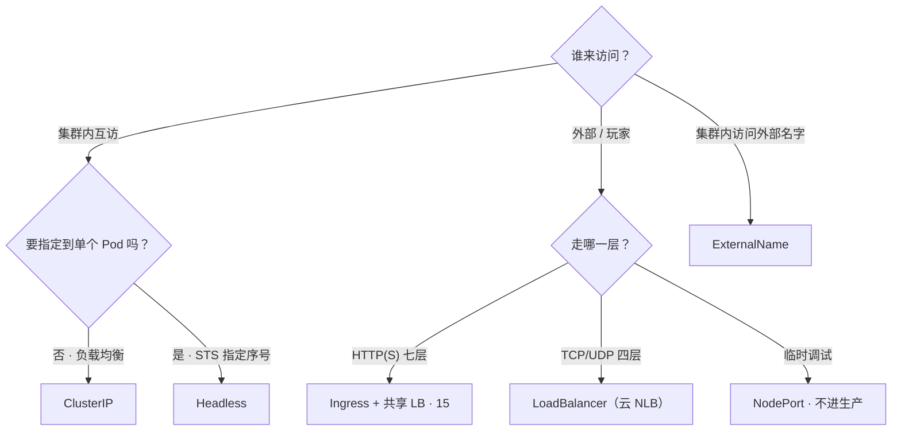
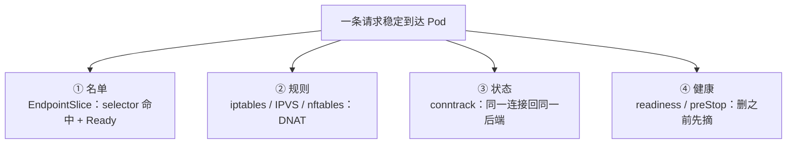
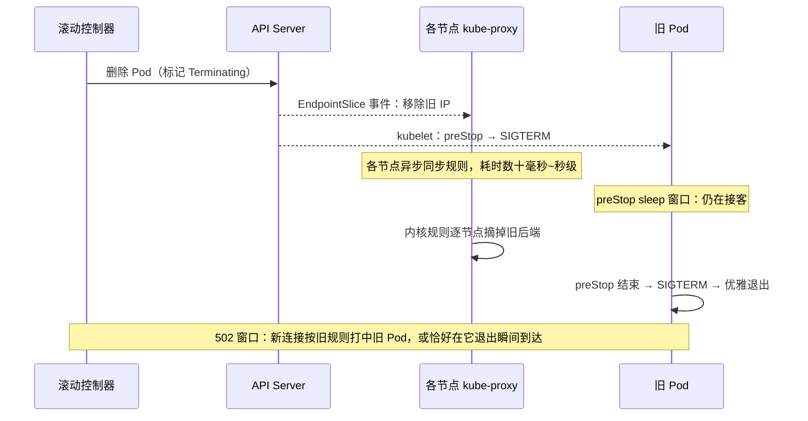
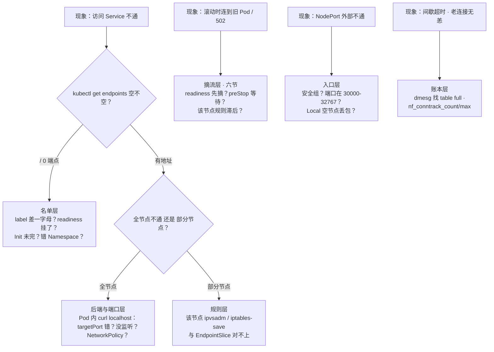

# Service 与 kube-proxy

> 大家好。上一章讲完副本怎么弹性；这一章讲**流量怎么打进那些副本**——以及 Endpoints 空了为什么重启 kube-proxy 没用。
> 开讲之前，先带大家回到两个现场：活动高峰，玩家登录全掉线——`kubectl get endpoints` 一看是空的，群里有人喊「重启 kube-proxy」，有人主张「给每个服务单独开个 LoadBalancer」；另一头滚动发布中，新分区玩家连进了即将退出的旧 Pod，有人已经准备重启网关。
> 这一章讲完，你会知道这三个人各自错在哪——空名单第一刀为什么是对 label，滚动 502 为什么靠 readiness + preStop，以及 kube-proxy 挂了为什么先拉 proxy 不杀业务。
> **本章回答的问题**：一次访问 Service 的请求的一生——名字从哪来、名单从哪来、内核怎么转发、规则谁来写、发布时何时摘流；卡在哪一段，一眼定责。
> **本章不讲**：DNS 解析、ndots → [09](../09-CoreDNS/)；Pod IP 分配、NetworkPolicy → [10](../10-CNI与网络策略/)；七层入口 Ingress → [15](../15-Ingress与流量管理/)；conntrack 深机制 → [01-17](../../01-基础底座/17-iptables与conntrack/)；探针与优雅退出时序 → [04](../04-Pod生命周期/)。

**标记**：🎯重点 · 🔥难点 · ⭐常考 · 🔧实操

**怎么听这场分享**：第一节是请求主图；二到六节顺着选门 → 立名单 → 内核转发 → 写规则 → 摘流；第七节定责。口诀先埋一句：⭐ **kube-proxy 挂了——旧通新不通**。

---

## 一、一张图：一次访问 Service 的请求的一生

> 🎯 **一句话**：请求只走四段——名字、名单、内核规则、后端；卡住必在其中一段。



**读图**：

- 主轴线从左到右就是一条请求：先问名字（CoreDNS 把 `svc.ns.svc.cluster.local` 解析成 VIP），内核拿 VIP 匹配规则做 DNAT，落到某个 Ready Pod；回程按 conntrack 条目还原，客户端全程以为自己只在跟 VIP 说话。
- **数据包的路径上没有指向 kube-proxy 的箭头**——它在后台 watch API、往内核写规则；名单（EndpointSlice）由 EndpointSlice 控制器填，它只是搬运工。排障工具各照一段：`kubectl get endpoints` 照名单，`iptables-save` / `ipvsadm -Ln` 照规则，`nf_conntrack_count` 照账本。

图里三个名词先立住，后面每节展开：

- **Service**：声明式对象，说清三件事——`selector` 选哪组 Pod、`port`/`targetPort` 开哪几个口、`type` 决定谁能访问。它给的入口叫 **VIP（虚拟 IP）**：不绑任何真实网卡（iptables 模式下），只存在于内核规则里。
- **Endpoints / EndpointSlice**：Service 背后的后端名单，只有「选中且 Ready」的 `Pod IP:targetPort` 才进得来。名单空 = 没人可转发。
- **kube-proxy**：每个节点一个的 **DaemonSet**（每节点固定跑一个副本的控制器），watch Service 和 EndpointSlice 的变化，把它翻译成本机内核里的转发规则。**它不转发数据包**。

> 💡 **打个比方**：kube-proxy 是酒店前台——只维护住客名单、贴房间指引（写规则），客人（数据包）走的是大门（内核），从不经过前台窗口。前台员工短暂下班，已入住的客人照常起居；但新客人会按旧指引走错房。

> ⚠️ **别混**：Service 是名单声明，kube-proxy 是规则写入者，内核里的 iptables/IPVS 才是数据面。「重启 kube-proxy」只对「规则写入者」这一层有用；名单为空或后端挂了，重启一百遍也没用。

口诀：⭐ **包不进 kube-proxy；名单空先查 selector，别重启 proxy**。好，先选型。

本节对应练习题 Q1、Q3。

---

## 二、选门：五种 Service

> 🎯 **一句话**：先问「谁来访问」，再问「要不要指定到单个 Pod」。

### 五兄弟各管一摊 ⭐

选型之前先分清两个端口：**`port`** 是 Service 自己的端口（客户端拨的号），**`targetPort`** 是容器真正监听的端口（DNAT 最终落点）。两者不一致的现象是「连得上但拒接/超时」，高频翻车点。

**ClusterIP**：默认类型，分配一个只在内核规则里存在的 VIP，仅集群内可达。Pod 间互访、大厅调逻辑服，用它。DNS 返回 VIP。

**NodePort**：在 ClusterIP 之上，让**每个节点**都监听同一个高端口（默认 `--service-node-port-range` 为 **30000-32767**），外部打任意 `节点IP:NodePort` 即入。注意它在没有该后端 Pod 的节点上也照样监听。

**LoadBalancer**：在云厂商上自动创建一个外部负载均衡（NLB/CLB），`EXTERNAL-IP` 就是它；底下仍是 NodePort + ClusterIP 一层层垫起来的。**`EXTERNAL-IP` 一直 `<pending>` = 云控制器没建出 LB**（配额、权限、地域不支持），不是「K8s 坏了」，`kubectl describe svc` 看 Events 就有答案。

**ExternalName**：CoreDNS 直接返回一条 **CNAME** 指向集群外域名，没有 VIP、没有端口、不经任何内核转发——纯粹的名字别名，方向是「集群内访问外部名字」（如把 `db.external.com` 伪装成集群内服务名）。

**Headless（无头）**：`spec.clusterIP: None`，不分配 VIP，DNS 的 A 记录直接是**全部 Ready Pod 的 IP 列表**，客户端自己挑。StatefulSet 的标配：`pod序号.svc名.命名空间.svc.cluster.local` 可以直连**指定序号**的 Pod（如 `mysql-0`）——要连指定 ordinal 必须 Headless，对着 ClusterIP 连 `mysql-0` 是错的。

> 🔍 **现场**：Headless 的 DNS 长什么样。

```bash
nslookup mysql-sts.game.svc.cluster.local
# Name:    mysql-sts.game.svc.cluster.local
# Address: 10.244.1.31
# Address: 10.244.2.45            # ← A 记录是 Ready Pod 的 IP 列表，没有 VIP
nslookup mysql-0.mysql-sts.game.svc.cluster.local
# Address: 10.244.1.31            # ← 指定序号直连：主从、开合服按 ordinal 寻址全靠它
```

**Ingress 不是第六种**：Ingress / Gateway API 是七层路由对象，需要 Ingress Controller 才生效，通常前面挂一个共享 LB——它和 Service 不是一个层面的东西 → [15](../15-Ingress与流量管理/)。

| 类型 | 谁来访问 | DNS 返回 | 转发经过节点内核规则 |
|------|----------|----------|----------------------|
| ClusterIP | 集群内 | VIP | 是（DNAT） |
| NodePort | 外部，打 `节点IP:高端口` | 仍有 VIP | 是 |
| LoadBalancer | 外部，打云 LB | 云 LB 地址 | 是（LB → NodePort → DNAT） |
| Headless | 集群内直连 Pod | Pod IP 列表 | 基本绕过（直连 Pod IP） |
| ExternalName | 集群内访问外部名字 | CNAME | 否（纯 DNS） |

> 🔍 **现场**：`get svc -o wide` 一屏认全类型。

```bash
kubectl get svc -n game -o wide
NAME        TYPE           CLUSTER-IP      EXTERNAL-IP    PORT(S)          AGE
logic-svc   ClusterIP      10.96.100.55    <none>         8080/TCP         3d
gate-nlb    LoadBalancer   10.96.200.11    203.0.113.8    7001:31234/TCP   7d
mysql-sts   ClusterIP      None            <none>         3306/TCP         30d
battle-np   NodePort       10.96.88.20     <none>         7002:30702/TCP   2d
ext-db      ExternalName   <none>          <none>         <unset>          30d
# ← CLUSTER-IP 为 None = Headless；EXTERNAL-IP <pending> = 云 LB 还没建出来
# ← PORT(S) 7001:31234 = 服务端口:NodePort；ExternalName 没有 VIP 也没有端口
```

### NodePort 的坑 ⭐

NodePort 是「最便宜的外部入口」，也是生产事故的常客：

- **一个服务占一个端口**，全集群共用 30000-32767 这 ~2700 个口，服务多了自动分配会撞上手动占用的端口。
- **安全组必须对整个范围开口子**，暴露面大且难收敛；玩家客户端直连 NodePort = 把节点 IP 直接暴露给客户端，节点扩缩容后玩家手里的地址全作废。
- **`externalTrafficPolicy: Cluster`（默认）时可能跨节点二跳**：流量落在没有后端 Pod 的节点上，会被二次 DNAT 转走并 SNAT，真实源 IP 丢失、多一跳延迟。

正确姿势：生产对外用 LoadBalancer/Ingress 收敛；NodePort 只用于临时调试，不留生产。

```bash
kubectl get svc -A -o wide | grep NodePort
# battle-svc   NodePort   10.96.88.20   <none>   7002:30702/TCP   # ← 上线前扫一遍，防端口撞车
```

### 选型一图流



**读图**：入口只问两个问题——谁访问、要不要指定后端。外部流量别按服务开 LB：HTTP 全部收敛到一个 Ingress + 一个 LB，四层用少量 NLB，账单和安全组都可控。

### externalTrafficPolicy：要不要真实源 IP ⭐

**externalTrafficPolicy** 决定外部流量进 NodePort/LoadBalancer 后怎么处理源地址，游戏网关做风控、按地域分流时必问：

| 维度 | Cluster（默认） | Local |
|------|----------------|-------|
| 源 IP | SNAT 成节点 IP，真实玩家 IP 丢失 | 保留真实客户端 IP |
| 分发 | 可跨节点二次 DNAT | 只发给本节点上的 Pod |
| 没有后端 Pod 的节点 | 照常接收、二跳转发 | **直接丢包**（黑洞） |

选 Local 的代价：必须靠外部健康检查把「没有后端 Pod 的节点」从 LB 摘掉，或保证每节点都有副本，否则玩家落到空节点就是无声丢包。**internalTrafficPolicy: Local** 是同款思路的集群内版本：只把流量发给本节点 Pod，省一跳东西向流量，代价是副本不足时直接不通。两者都作用在 kube-proxy 写规则这一层，管不到 Ingress Controller 的七层反代；七层入口要真实玩家 IP 靠 Proxy Protocol / X-Forwarded-For → [15](../15-Ingress与流量管理/)。

```yaml
apiVersion: v1
kind: Service
metadata:
  name: gate-nlb          # 云厂商特定行为（内网/规格/带宽）走 metadata.annotations，各家不同
spec:
  type: LoadBalancer
  externalTrafficPolicy: Local   # ← 保真实源 IP；空节点必须由云 LB 健康检查摘掉
  selector:
    app: gate
  ports:
    - port: 7001
      targetPort: 7001           # ← 四层游戏端口直通；port 与 targetPort 写错就是「连得上但拒接」
```

> ⚠️ **别混**：Ingress 不是第五种 Service 类型，它需要 Controller 才生效；Headless 的 `CLUSTER-IP: None` 不等于「没有 Service」——它照样有 selector、有 Endpoints、有 DNS 记录。

> 📝 **面试**：选型口径——集群内互访用 ClusterIP；StatefulSet 要 Pod IP、连指定序号用 Headless；对外 HTTP 收敛到一个 Ingress + 一个 LB，别每服务一个云 LB（账单 + 配额 + 管理成本）；客户端永远不直打 ClusterIP/NodePort，走网关。

选型口诀：⭐ **对内 ClusterIP，有状态 Headless，对外收敛 Ingress/LB，NodePort 只调试**。开篇那位喊「每服务一个 LB」的，就是没记这句。名单从哪来？下一节。

本节对应练习题 Q1、Q9、Q10、Q11。

---

## 三、立名单：Endpoints 与 EndpointSlice

> 🎯 **一句话**：名单空就不转发；名单由「selector 命中 + Ready」填。

开篇那个空 Endpoints——大家想想：重启 kube-proxy 会往名单里填人吗？不会。名单不是它填的。

### 名单怎么填

Service 的 `spec.selector` 匹配 Pod 的 **label**（只看 label，不看 annotation）；被匹配且 **Ready**（readiness 探针通过、Init 容器跑完）的 Pod，其 `IP:targetPort` 由 EndpointSlice 控制器写进名单。kube-proxy 默认 watch 的是 **EndpointSlice**——它是 Endpoints 的分片版：每片默认最多 **100** 个端点，避免大服务一个巨型对象把 etcd 和 watch 打爆。

兼容性一句话：老控制器可能只写 Endpoints 不写 Slice，新 kube-proxy 只看 Slice——升级过渡期「Endpoints 有、Slice 空」的错配真出过事故，排障时两个都看。旧对象 Endpoints 至今仍在维护（聚合视图），监控和值班习惯看的往往还是它。

名单为空时为什么是「一律不通」：iptables 模式下 kube-proxy 会给这个 VIP 写一条直接跳 `KUBE-MARK-DROP` 的规则——新连接在内核就被丢掉，所以现象是整齐划一的拒绝/超时，**不会**有「时通时不通」（时通时不通要往账本层想，见七节）。

### 名单为空：先对 label 和探针 ⭐

**名单空 = 所有新连接被拒/被丢**，跟内核规则、CNI 都没关系。四个原因按命中率排：

1. **selector 对不上**：label 差一个字母、大小写写错，或把 selector 写进了 annotation；
2. **Pod Running 但 Ready=False**：readiness 探针没过（依赖没起来、启动慢）→ [04](../04-Pod生命周期/)；
3. **Init 容器没跑完**：主容器还没启动；
4. **查错了 Namespace**。

> 🔍 **现场**：三步定位空名单。

```bash
kubectl get ep,endpointslice -n game
NAME                     ENDPOINTS   AGE
endpoints/logic-svc      <none>      2h     # ← <none> = 名单空，新连接全拒
NAME                         ADDRESSTYPE   PORTS   ENDPOINTS   AGE
endpointslice/logic-svc-x2   IPv4          8080    0           2h     # ← Slice 也是 0，互相印证
kubectl get endpointslice -n game -l kubernetes.io/service-name=logic-svc
# ↑ 大服务 Slice 有很多片，按这个 label 才能捞全   # ←

kubectl get pods -n game --show-labels
NAME               READY   STATUS    LABELS
logic-7f8b9c-x1    1/1     Running   app=logic,tier=backend
logic-6d5e4f-y2    0/1     Running   app=logics,tier=backend   # ← 多了个 s，selector 永远命不中

kubectl describe pod logic-6d5e4f-y2 -n game | grep -A5 Conditions
  Ready            False            # ← Running ≠ Ready：探针没过，不进名单
# 再看 Events 里的 Readiness probe failed 找探针失败原因
```

> ⚠️ **别混**：Running ≠ 进名单——进名单的条件是「被 selector 选中 **且** Ready」。第一反应永远是核对 label 与就绪状态，**不要先重启 kube-proxy**：名单不是它填的。

### 名单不空还不通

名单有地址但仍连不上，按顺序查：**`targetPort` 写错**（容器监听 8080，Service 指向 9090）→ 容器没监听该端口 → NetworkPolicy 拦截（→ [10](../10-CNI与网络策略/)）→ 个别节点规则没同步（见五节）→ CNI 跨节点不通。定位刀法：**先在 Pod 内 `curl 127.0.0.1:targetPort`** 确认应用本身活着，再从另一个 Pod 打 ClusterIP——两段一通一断，问题就在中间的内核规则或网络层。

> 📝 **面试**：「访问 Service 不通你第一步做什么？」——`kubectl get endpoints`。为空就核对 label（逐字符）、readiness、Init、Namespace 四件事；不为空再往下查 targetPort 和规则。绝不上来就动 kube-proxy。

口诀：⭐ **Running ≠ 进名单；进名单 = selector 命中 + Ready**。名单有了，包怎么走到 Pod？

本节对应练习题 Q2。

---

## 四、内核转发：DNAT、conntrack、粘性

> 🎯 **一句话**：包不进 kube-proxy；内核 DNAT 改一次目的地，conntrack 保证同一连接总回同一后端。

### 规则长什么样：KUBE-SERVICES → SVC → SEP 🔥🔍

**DNAT（Destination NAT）** = 改数据包的目的地址。iptables 模式下，kube-proxy 在 nat 表写了一条三层链：

```bash
iptables-save | grep 10.96.100.55
-A KUBE-SERVICES -d 10.96.100.55/32 -p tcp --dport 8080 -j KUBE-SVC-X7QZ
-A KUBE-SVC-X7QZ -m statistic --mode random --probability 0.50000 -j KUBE-SEP-AAA
-A KUBE-SVC-X7QZ -j KUBE-SEP-BBB
-A KUBE-SEP-AAA -p tcp -j DNAT --to-destination 10.244.1.15:8080
-A KUBE-SEP-BBB -p tcp -j DNAT --to-destination 10.244.2.22:8080
# ← 入口链：命中 VIP:8080 就跳进该服务的 SVC 链
# ← SVC 链：两个后端用级联概率做随机——第一条 50% 中 AAA，不中落第二条 100% 中 BBB
# ← SEP 链：最终动作，把目的地改成 Pod IP:targetPort
```

N 个后端就是 `1/N、1/(N-1)、…、1.0` 的概率级联，数学上均匀（三后端即 `1/3 → 1/2 → 1.0`：第一条 1/3 命中，不中落第二条再掷 1/2，剩 1/3 落到第三条的 100%）。**每个新连接独立掷一次骰子**——Service 的「负载均衡」全部机制就是这条无状态的随机链，没有权重、没有健康打分，健康全靠名单（三节）兜着。也正因为各级概率互相耦合，端点一变整条 SVC 链就得重写——这是五节「全量重写」的根因。

### 回程与存量：conntrack 给每张连接发存根 🔥⭐

> 💡 **打个比方**：第一个包经过随机选路、DNAT 之后，conntrack 给这条连接发了一张**存根**（条目，记下 DNAT 后的真实目的地）。后续包和回程包拿着存根直接走，不再重新抽后端——行李永远回到同一个房间。

这解释了三件游戏运维天天碰到的事：

1. **回程自动对称**：Pod 的回包按存根反向还原源地址，客户端全程只看见 VIP，不需要任何回程规则；
2. **摘除后端不断存量**：滚动发布把旧 Pod 从名单里摘掉，只影响**新连接**——已建立的长连接按存根继续打旧 Pod，直到旧 Pod 真正退出。战斗连接不因 Endpoints 变化而断，靠的就是这张表，不是 sessionAffinity；
3. **表满则新连接随机失败**：conntrack 表（默认上限常见 65536，按内存浮动）打满时新建连接失败、老连接无恙，现象是间歇超时——识别方法见七节，机制细节 → [01-17](../../01-基础底座/17-iptables与conntrack/)。

> 🔍 **现场**：存根是可以直接看见的。

```bash
conntrack -L -p tcp --dport 8080 2>/dev/null | head -2
# tcp 6 431997 ESTABLISHED src=10.244.3.9 dst=10.96.100.55 sport=53211 dport=8080 \
#     src=10.244.1.15 dst=10.244.3.9 sport=8080 dport=53211 [ASSURED]
# ← 去程 dst 是 VIP，回程方向写着真实 Pod IP 10.244.1.15——存根记下的就是 DNAT 后的目的地
# ← 这条连接此后永远回 10.244.1.15，哪怕名单里已经没它了（直到 Pod 真退出）
```

### IPVS 视角 🔍

IPVS 模式下同样的事长这样——内核哈希表直接查，VIP 挂在 `kube-ipvs0` 虚拟网卡上：

```bash
ipvsadm -Ln | grep -A3 10.96.100.55
TCP  10.96.100.55:8080 rr                     # ← 虚拟服务，默认调度算法轮询 rr
  -> 10.244.1.15:8080      Masq  1  0  0      # ← 真实后端，Masq = 回程要伪装还原
  -> 10.244.2.22:8080      Masq  1  0  0
```

连接状态照样记在 conntrack（IPVS 依赖 `nf_conntrack`），「存根」逻辑与 iptables 模式完全一致——换模式不换存根。

### sessionAffinity：新连接粘性 ⭐

`sessionAffinity: ClientIP` 让**同一源 IP 的新连接**粘到同一后端，默认超时 **10800s**（3 小时）。它是四层粘性，作用在规则层。游戏里基本不用：长连接本来就靠 conntrack 绑定后端，房间归属由业务自己绑；滚动发布时粘性反而把玩家粘在即将退出的旧 Pod 上。

> ⚠️ **别混**：sessionAffinity 管「**新连接**抽哪个后端」（粘性），conntrack 管「**已有连接**回哪个后端」（状态）。长连接稳不稳靠后者；前者只在连接新建时生效，滚动时是帮倒忙。

最后一块拼图：**SNAT**。跨节点转发时，为了让回程路径对称，内核在 POSTROUTING 把源地址 MASQUERADE 成节点 IP——这就是 NodePort + Cluster 策略拿不到真实源 IP 的根因（二节 Local 是它的解药）。一个推论：Pod 访问的 Service 后端**包含它自己**时（hairpin），同样会先 DNAT 再 MASQUERADE，所以 Pod 里看到的源地址不是自己——`127.0.0.1` 和 ClusterIP 两条路的行为因此可能不同，自测时别只测一条。

口诀：⭐ **长连接靠 conntrack，粘性滚动时帮倒忙**。规则谁写进内核？下一节。

本节对应练习题 Q3、Q7、Q12。

---

## 五、写规则的人：kube-proxy 三种模式

> 🎯 **一句话**：三种模式的包都不出内核；差别只在规则怎么存、更新多快。

大家想想：kube-proxy 进程挂了，正在打本的长连接会断吗？很多人答「会」——错了。口诀就是开头那句：⭐ **旧通新不通**。

**kube-proxy** 是 kube-system 下每节点一个的 DaemonSet，watch Service 和 EndpointSlice，把变化翻译成内核规则，配置在 ConfigMap `kube-proxy`（`mode` 字段）。历史上还有个 **userspace** 模式——数据包真的进过 kube-proxy 进程做转发，性能差，早已废弃，面试提一句即可。**数据面慢，给 kube-proxy 加 CPU/内存是没用的——包根本不经过它**；要改的是规则的组织方式（模式）和账本（conntrack 上限）。

### 三种模式怎么选 ⭐🔥

| 维度 | iptables | IPVS | nftables |
|------|----------|------|----------|
| 查找结构 | 链式顺序匹配，O(n) | 哈希表，O(1) | 集合（set），O(1) |
| 端点变更 | **全量重写** KUBE-* 规则 | 增量增删后端 | 只更新集合元素 |
| 适合规模 | 中小集群 | 数千 Service 的大集群 | 同 IPVS，且不依赖 ip_vs 模块 |
| 前置条件 | 无（默认） | `ip_vs` 系列内核模块 | 较新版本（1.31 试用、1.33 成熟） |
| 观察命令 | `iptables-save` | `ipvsadm -Ln` / `kube-ipvs0` | `nft list ruleset` |
| 负载均衡 | statistic 概率随机 | 可选算法：rr 默认 / lc / sh 等 | 同 iptables 概率随机 |

> 💡 **打个比方**：iptables 是逐条翻名册找人（O(n)），名册一改整本重印；IPVS 是人脸识别（哈希，O(1)），来一个人只补一条档案；nftables 换成电子名单，改一个人只动一行。三种情况下客人（数据包）都走同一扇大门（内核），从不经过管理员（kube-proxy 进程）。

iptables 模式的痛点就两条：**每包顺序匹配**、**每次端点变化全表重写**（`iptables-restore` 整刷，重写本身是原子的，不会半新半旧）。kube-proxy 有 `minSyncPeriod` 之类的参数给写入频率限速，但限速救不了「每次写都是全量」。Service 上几千时，一次滚动会触发 kube-proxy CPU 飙升、规则更新变慢——滚动竞态窗口（六节）被放大。

IPVS 模式注意三点：依赖 `ip_vs`、`ip_vs_rr`、`ip_vs_wrr`、`ip_vs_sh` 模块（`lsmod` 先查，没加载就切等于没切）；调度算法默认 **rr**，长连接业务可评估 **lc**（最少连接），但游戏的房间负载天然不均，换算法救不了分布；MetalLB 等 ARP 场景要把 `strictARP: true` 一起打开。**nftables** 模式的卖点是更新成本与 Service 总数脱钩、不依赖 ip_vs 模块；面试口径统一为「三种模式的包都不出内核、不进 kube-proxy 进程，区别只在规则怎么存、怎么更新」。

### 切 IPVS 的 SOP 🔧

```bash
lsmod | grep -E 'ip_vs|nf_conntrack'
# 没有 ip_vs 先加载，否则切了模式规则也建不起来：
modprobe ip_vs ip_vs_rr ip_vs_wrr ip_vs_sh

kubectl -n kube-system edit cm kube-proxy     # mode: "ipvs"；MetalLB 场景同时设 strictARP: true
kubectl -n kube-system rollout restart ds kube-proxy
kubectl -n kube-system rollout status ds kube-proxy

ipvsadm -Ln | head -5                          # 每台节点验证
# 能看到 TCP <VIP>:port rr 即成功；空白 = 模块没加载或该节点没重启到   # ←
```

活动期不要全集群一把切——先在低峰、从非关键节点池灰度。

### kube-proxy 挂了会怎样 ⭐🔥

回到前台比方：前台下班了，门和房间指引还在。规则在**每个节点的内核里**，不依赖进程存活：

| kube-proxy 状态 | 存量长连接 | 新连接 / 滚动之后 |
|----------------|-----------|-------------------|
| 进程挂了，内核规则还在 | 基本照旧（conntrack 在） | 新后端进不来；摘除的后端规则还留着 |
| 名单变了但规则没同步 | 继续打旧 Pod | 新连接可能打中已删除的 Pod |
| 正常 | 正常 | 正常 |

> 🔍 **现场**：怀疑某节点规则滞后，三步定案。

```bash
kubectl get pods -n kube-system -l k8s-app=kube-proxy -o wide
# 看哪台节点没有/在 CrashLoop；被调度器挤掉的也要补回来   # ←
kubectl logs -n kube-system <kube-proxy-pod> --tail=30
# 同步报错、watch 断连都在这   # ←
# 登问题节点：
ipvsadm -Ln | grep -A5 <VIP>          # 后端列表和 EndpointSlice 比——旧了就是它
```

所以处理顺序是：**先把 kube-proxy 拉起来，别动游戏进程**——重启业务进程会主动掐断本来还活着的长连接，把「局部规则滞后」升级成「全员掉线」。用 Cilium eBPF 替换 kube-proxy 的集群，agent 挂掉的影响面与「规则不更新」同类 → [25](../25-eBPF与Cilium/)；各组件挂掉的业务影响面总表 → [01](../01-集群架构/)。

> 📝 **面试**：「kube-proxy 挂了对存量连接有什么影响？」——存量长连接基本不受影响（规则在内核、conntrack 在），受影响的是新连接和滚动后的规则同步；处置是先拉起 kube-proxy，不要重启业务进程。

### 收束：Service 凭什么「稳定可达」 🎯⭐



**读图**：四件套各管一段——名单（三节）决定「有没有人可发」，规则（四、五节）决定「怎么发过去」，账本（四节）决定「回程和存量不乱」，健康（六节）决定「删之前先摘干净」。前三件在数据面，第四件在发布流程里——**Service 稳定可达是四个系统的合谋，不是 Service 对象一个人的功劳**。

> ⚠️ **别混**：四件套不保证——应用层可用性（Pod 活着但服务降级，那是探针和 SLO 的事）、真实源 IP（见 externalTrafficPolicy）、七层路由（→ [15](../15-Ingress与流量管理/)）。

> 📝 **面试**：记忆分组「名单—规则—状态—健康」，被问「Service 怎么保证流量打到健康后端」按这四段讲，顺带指出 Service 对象本身不做健康检查。

口诀再钉一次：⭐ **kube-proxy 挂了——旧通新不通；先拉 proxy，别杀业务**。开篇滚动 502 那位——摘流怎么跟发布赛跑，下一节。

本节对应练习题 Q4、Q5、Q8、Q13。

---

## 六、摘流：与发布的赛跑

> 🎯 **一句话**：Service 不会自己摘流；摘流靠 readiness 先失败、preStop 等规则跟上。

大家想想：`maxUnavailable=0` 是不是就等于滚动无感？很多人答「是」——⭐ 高频错答。它只管副本数，管不了各节点内核规则是否已摘干净。

### 竞态窗口：删 Pod 那一刻发生了什么 🔥

滚动发布删除旧 Pod 的瞬间，两条并行的时间线在赛跑：



**读图**：两条线同时起跑——名单摘除是瞬时的，但「每个节点的内核规则都更新完」是异步且耗时的；preStop 的睡眠就是人为给规则同步争取的时间。窗口内新连接会按旧规则打中正在退出的 Pod：玩家视角是「发版后登录失败/战斗中断」，服务端日志是 502 / connection reset。

> 💡 **打个比方**：关店要先从订座平台下架（readiness 失败 → 摘出名单），再等最后一桌吃完（preStop 等待），而不是喊一声「打烊」就关灯（直接 SIGTERM）——喊完就关灯，已经走到门口的客人会撞门。

### 正确的摘流三件套

1. **readiness 探针反映真实可服务能力**（不是「进程活着」）：先摘流再退出，时序细节 → [04](../04-Pod生命周期/)；
2. **`preStop: sleep 5-15s`**：给所有节点的规则同步争取时间；
3. **`terminationGracePeriodSeconds` 足够长**：覆盖存档、断连通知、房间移交。

```yaml
spec:
  template:
    spec:
      terminationGracePeriodSeconds: 60        # ← 从 preStop 开始算，要罩住收尾全程
      containers:
        - name: logic
          readinessProbe:                      # ← 反映「真能接客」；它先失败，Pod 才先摘
            tcpSocket: { port: 8080 }
            periodSeconds: 2
            failureThreshold: 2
          lifecycle:
            preStop:
              exec:
                command: ["sh", "-c", "sleep 10"]   # ← 拿 10s 换各节点规则同步
```

注意两个顺序：**先摘流、再收尾**——如果 readiness 直到收到 SIGTERM 才失败，三件套就白配了；`terminationGracePeriodSeconds` 是从 preStop 开始计的，sleep 10s 会吃掉其中 10s，存档脚本要剩下够用的余量。

> ⚠️ **别混**：`maxUnavailable=0` 只保证副本数不掉，**不保证数据面摘干净**——它管的是控制器数 Pod 个数，管不了每个节点内核规则的同步进度 → [05](../05-工作负载控制器/)。

### 长连接与外部 LB 的额外延迟

Service 摘流摘的是「新连接的去向」，**对已建立的 TCP 连接无能为力**——游戏战斗长连接要靠业务主动断开/迁移，或等对端自然结束（四节的存根决定了它们会继续打旧 Pod 直到其退出）。对外暴露的服务还多一层延迟：云 LB 的健康检查摘除是按检查间隔计的，比集群内规则同步慢一个量级，所以网关类服务的摘流窗口要按外部 LB 的节奏留余量。滚动参数与发布策略 → [05](../05-工作负载控制器/)，灰度口径 → [16](../16-灰度与回滚/)。

> 🔍 **现场**：滚动时盯两件事。

```bash
kubectl get ep logic-svc -n game -w
# 旧 IP 从名单消失 ≠ 各节点规则已跟上——中间那段就是竞态窗口   # ←
kubectl get pods -n game -l app=logic -o wide
# Terminating 与新 Pod 并存的几十秒 = 玩家可能打到旧 Pod 的窗口   # ←
kubectl get events -n game --field-selector reason=Killing --sort-by=.lastTimestamp | tail -3
# Killing pod/logic-old：Stopping container logic   # ← Killing 的时间点 = preStop 跑完之后
# 删 Pod 和 Killing 之间隔没隔出等待，一眼看出 preStop 是否生效   # ←
```

> 📝 **面试**：「滚动更新怎么避免打到旧 Pod？」——readiness 探针先失败把旧 Pod 摘出名单，preStop 睡 5-15s 等内核规则同步，grace period 留够收尾；Service 对象本身不等容器，maxUnavailable=0 也不保证数据面摘干净；存量长连接靠业务自己断。

口诀：⭐ **摘流三件套 = readiness 先失败 + preStop 等规则 + grace 收尾**。主线走完，收作战定责。

本节对应练习题 Q6。

---

## 七、作战：定责

> 🎯 **一句话**：第一动作永远是 get endpoints；空查名单，不空逐层，单点查该节点规则。

### 决策树 🔥



**读图**：从现象进，不从组件进。「全节点不通」往名单和后端找，「部分节点不通」往该节点的规则找——这两个现象已经把责任劈成两半。更多现象级剧本（Pending/CrashLoop/网络不通）→ [18](../18-典型故障剧本/)。

### 现象 · 先做 · 别做 ⭐

| 现象 | 先做 | 别做 |
|------|------|------|
| Service 连接被拒 | `get endpoints` 看空不空 | 上来就重启 kube-proxy |
| Endpoints 为空 | 对 label（逐字符）/ 探针 / NS / Init | 改 kube-proxy 模式「试试」 |
| 名单有地址仍不通 | Pod 内 `curl localhost:targetPort` | 一路猜到 CNI |
| 部分节点不通 | 该节点 `ipvsadm -Ln` 对 Slice | 当成全集群故障回滚发布 |
| 滚动连到旧 Pod | readiness + preStop（六节） | 重启战斗服 |
| 间歇超时、老连接无恙 | `nf_conntrack_count/max` + `dmesg` | 当成 Endpoints 为空处理 |
| NodePort 外部不通 | 安全组 / 端口范围 / Local 空节点 | 再开几个 NodePort 碰运气 |
| `EXTERNAL-IP` Pending | `describe svc` 看 Events、查云配额 | 当成「K8s 坏了」 |
| 名字解析不了、直连 IP 却通 | 查 CoreDNS / ndots → [09](../09-CoreDNS/) | 动 Service 名单 |
| `kubectl get` 行、`exec` 不行 | 走 API → kubelet 路径查 → [03](../03-API-Server/) | 在这条路上查 Service |

> ⚠️ **别混**：**Endpoints 为空**（名单没人，新连接**一律**失败）与 **conntrack 表满**（后端都在，账本满了新连接**间歇**失败、`dmesg` 有 `nf_conntrack: table full, dropping packet`）——一个查名单，一个查账本，处方完全不同。

### 60 秒剧本 🔧

- **0-10s**：问清范围——全量/部分节点/间歇？同时 `kubectl get ep <svc> -n <ns>`。
- **10-30s**：名单空 → `get pods --show-labels` 对 selector，`describe pod` 看 Conditions/探针事件；名单不空 → 进一个 Pod `curl 127.0.0.1:targetPort`，再从别的 Pod 打 ClusterIP。
- **30-45s**：部分节点 → 登该节点 `ipvsadm -Ln`（或 `iptables-save | grep <VIP>`）与 Slice 比对；间歇超时 → `cat /proc/sys/net/netfilter/nf_conntrack_count,max`、`dmesg | grep -i conntrack`。
- **45-60s**：定责下处方——名单层修 Pod/探针，规则层拉 kube-proxy（别杀业务），账本层 `sysctl -w net.netfilter.nf_conntrack_max=262144` 止血后查泄漏、调 TIMEOUT，入口层修安全组/健康检查。

现在再看开篇三个人——重启 kube-proxy、每服务一个 LB、重启网关救滚动 502——你知道该怎么拦住他们了。收口。

本节对应练习题 Q14。

---

## 八、收口

### 命令速查 🔧

```bash
kubectl get svc,ep,endpointslice -n {ns}                        # 类型 + 名单一屏
kubectl get pods -n {ns} --show-labels                          # 对 label 差一字母
kubectl describe pod {pod} -n {ns}                              # Ready False 看探针事件
kubectl get cm kube-proxy -n kube-system -o yaml | grep -i mode # 当前转发模式
kubectl logs -n kube-system -l k8s-app=kube-proxy --tail=50     # 同步报错
iptables-save | grep <VIP>                                      # iptables 模式规则
ipvsadm -Ln | grep <VIP>                                        # IPVS 模式规则
lsmod | grep ip_vs                                              # IPVS 前置模块
cat /proc/sys/net/netfilter/nf_conntrack_count /proc/sys/net/netfilter/nf_conntrack_max
dmesg | grep -i conntrack                                       # table full 实锤
```

### 面试锚点

遮住右列自问自答，卡壳的行回去重读对应小节——能讲出来才算会，看着答案点头不算。

| 问 | 30 秒答 |
|----|---------|
| Service 类型怎么选？ | 集群内 ClusterIP；STS 直连指定序号 Headless；对外 HTTP 收敛 Ingress + 一个 LB、四层 NLB；NodePort 不进生产，别每服务一个云 LB。 |
| kube-proxy 是干嘛的？包经过它吗？ | 每节点 DaemonSet，watch Service/EndpointSlice 写内核转发规则；包走 iptables/IPVS/nftables，不进 proxy 进程。 |
| Endpoints 从哪来？为空第一步？ | EndpointSlice 控制器按「selector 命中 + Ready」填；为空先对 label 逐字符、readiness、Init、Namespace，不先重启 proxy。 |
| EndpointSlice 和 Endpoints？ | Slice 是 Endpoints 的分片（每片 100 端点），避免大对象写放大；kube-proxy 默认 watch Slice；兼容期两个都查。 |
| ClusterIP 怎么转发？ | 内核 nat：KUBE-SERVICES 命中 VIP → SVC 链概率随机 → SEP 链 DNAT 到 Pod:targetPort；回程靠 conntrack 还原。 |
| 为什么滚动不断存量连接？ | 已有连接按 conntrack 条目走，不重新抽后端；名单变化只影响新连接，直到旧 Pod 真退出。 |
| iptables 和 IPVS 区别？ | iptables 顺序匹配 O(n)、变更全量重写；IPVS 哈希 O(1)、增量更新；数千 Service 评估切换；切不动先查 `lsmod` 有没有 ip_vs。 |
| nftables 模式是什么？ | 新模式用集合存后端映射，更新只改集合元素、成本与规模脱钩，不依赖 ip_vs；包同样不出内核。 |
| kube-proxy 挂了会怎样？ | 规则在内核：存量长连接基本照旧，新连接与滚动后的同步失效；先拉 proxy，别重启业务进程。 |
| sessionAffinity 呢？ | ClientIP 四层粘性、默认 10800s，只管新连接选路；存量连接稳定靠 conntrack；滚动时粘旧 Pod 帮倒忙，游戏房间自己绑。 |
| externalTrafficPolicy 区别？ | Cluster 默认、SNAT、可跨节点；Local 保真实源 IP、只发本节点、空节点丢包，需外部摘除或每节点副本。 |
| 滚动怎么不打到旧 Pod？ | readiness 先摘、preStop 睡 5-15s 等规则同步、grace 留够收尾；Service 不等容器，maxUnavailable=0 也不保证。 |
| conntrack 满的现象？ | `dmesg` table full，新连接随机失败、老连接无恙；调大 max 止血、查泄漏、按长连接空闲调 TIMEOUT，>80% 告警。 |
| NodePort 有什么坑？ | 30000-32767 一服务一口；安全组难收敛；暴露节点 IP 给玩家；Cluster 策略二跳 SNAT 丢源 IP。 |
| ping ClusterIP 说明什么？ | 什么都不说明：IPVS 模式 VIP 挂 kube-ipvs0，内核自己回 ping；查健康用 get ep + 业务探针。 |
| Pod 访问包含自己的 Service？ | DNAT + MASQUERADE（hairpin）：源地址被伪装，看到的不是自己的 IP；自测要分别测 127.0.0.1 与 ClusterIP 两条路。 |

### 易错一句话对照

- 数据包经过 kube-proxy 用户态 → 它只写规则，包走内核
- ClusterIP ping 得通说明后端在 → ping 说明不了，IPVS 下内核自己回
- Running 的 Pod 一定进 Endpoints → 要「被选中 + Ready」双条件
- selector 写在 annotation 也行 → 只认 label
- Ingress 是第五种 Service → 七层路由对象，需要 Controller（15）
- 每服务一个云 LB 更稳 → HTTP 收敛 Ingress + 一个 LB
- Headless 也返回 VIP → A 记录是 Pod IP 列表
- 连 mysql-0 用 ClusterIP → 连指定序号必须 Headless
- 大集群 iptables 模式够用 → 数千 Service 评估 IPVS/nftables
- kube-proxy 挂了立刻全断 → 存量基本照旧，新连接才失效
- proxy 挂了先重启游戏服 → 先拉 proxy，别主动掐长连接
- Service 对象会等容器准备好 → 摘流靠 readiness + preStop
- sessionAffinity 保证长连接稳定 → 长连接靠 conntrack，粘性滚动时帮倒忙
- Local 一定比 Cluster 好 → 空节点丢包，要外部摘除或每节点副本
- conntrack 满 = Endpoints 为空 → 账本满是间歇失败，名单空是一律失败
- `maxUnavailable=0` 滚动就无感 → 只保副本数，数据面摘除有窗口
- Pod 打自己的 Service 和打 127.0.0.1 等价 → hairpin 会 MASQUERADE 源地址，两条路要分开测

### 数字墙

> NodePort 默认端口范围 **30000-32767** · sessionAffinity 默认超时 **10800s**（3h）· EndpointSlice 每片默认 **100** 个端点 · conntrack 上限常见 **65536**，**>80%** 就该告警 · preStop 建议 **5-15s** · 两后端随机概率 **0.5 / 1.0** 级联 · IPVS 默认算法 **rr** · userspace 模式已废弃

---

## 合上书

合上书自检（题号对齐练习题）：

- [ ] **默画**一节主图：一次请求的一生（名字 → VIP → 内核 DNAT → Pod，回程 conntrack），标出 kube-proxy 只写规则的虚线，说出每个排障工具照哪一段。（Q3）
- [ ] 口述选门：五种 Service 各自用途；为什么生产不留 NodePort；LB Pending 查什么；为什么 STS 连指定序号必须 Headless。（Q1、Q9、Q10、Q11）
- [ ] 口述名单：Endpoints 从哪来；为空四原因；名单不空还不通再查什么；为什么第一动作不是重启 kube-proxy。（Q2）
- [ ] **默画**内核转发：`KUBE-SERVICES → SVC（概率）→ SEP（DNAT）` 三层；为什么回程和存量连接总回同一后端；sessionAffinity 管什么、不管什么。（Q3、Q7、Q12）
- [ ] 口述三模式：iptables / IPVS / nftables 的查找与更新差异；切 IPVS 失败先查什么（`lsmod`）。（Q4）
- [ ] 口述 proxy 挂了：存量长连接与新连接分别怎样；为什么先拉 proxy、不重启游戏进程。（Q5、Q8）
- [ ] **默画**六节时序：删 Pod 瞬间的两条并行线；竞态窗口为什么会 502；摘流三件套各自挡什么。（Q6）
- [ ] 口述定责：第一动作；名单空与 conntrack 满的现象区别；单节点不通与全节点不通怎么劈。（Q7、Q8、Q14）
- [ ] 口述数字：30000-32767、10800s、100/片、65536 与 80%、preStop 5-15s。（Q10、Q12）

九条都能不看稿讲下来，这一章就过了。终极测试：拦住开篇那三个误操作。下一章：[09](../09-CoreDNS/) —— 名字是怎么变成 VIP 的。
