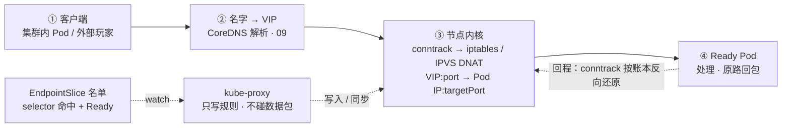
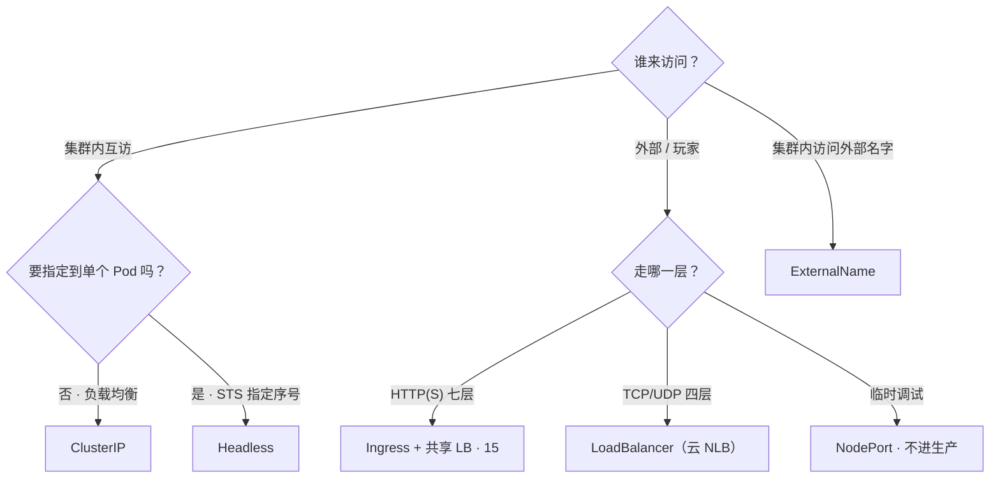
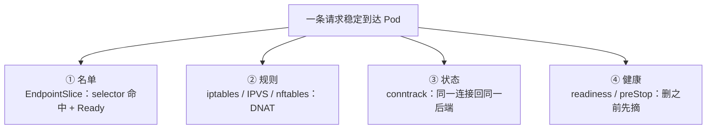
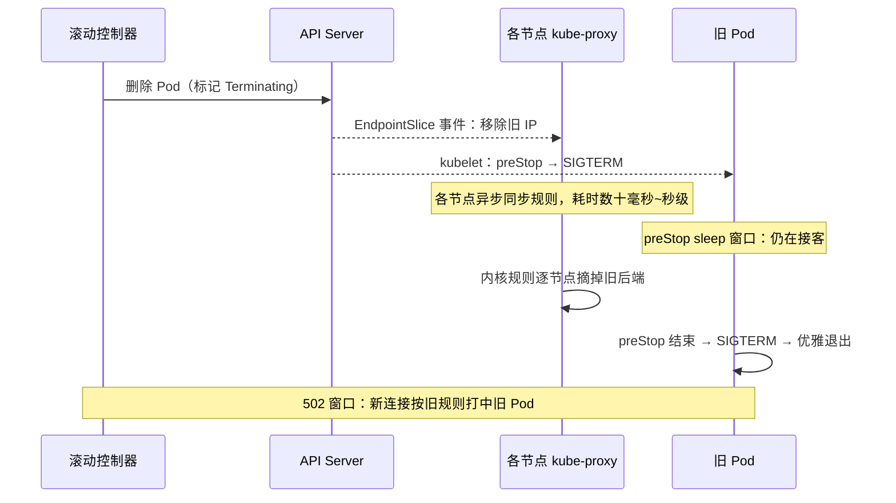
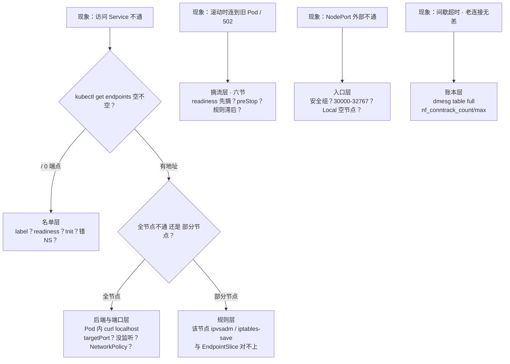

# Service 与 kube-proxy

> 活动高峰登录全掉——`kubectl get endpoints` 是空的，群里喊「重启 kube-proxy」；另一头滚动中新分区打进即将退出的旧 Pod，有人准备重启网关；还有人主张「每个服务单独开个 LoadBalancer」。
> **本章回答**：一次访问 Service 的请求的一生——选门、立名单、内核转发、谁写规则、发布时何时摘流；卡在哪一段，一眼定责。
> **不讲**：DNS / ndots → [09](../09-CoreDNS/)；Pod IP / NetworkPolicy → [10](../10-CNI与网络策略/)；七层 Ingress → [15](../15-Ingress与流量管理/)；conntrack 深机制 → [01-17](../../01-基础底座/17-iptables与conntrack/)；探针与优雅退出时序 → [04](../04-Pod生命周期/)。

**标记**：🎯重点 · 🔥难点 · ⭐常考 · 🔧实操

---

## 一、一张图：一次访问 Service 的请求的一生

> 🎯 **一句话**：请求只走四段——名字、名单、内核规则、后端；卡住必在其中一段。口诀先钉：⭐ **kube-proxy 挂了——旧通新不通**。



- 📖 **读图**
  - 🛤️ 主线：名字 → VIP → 内核 DNAT → Ready Pod；回程靠 conntrack 还原，客户端全程以为在跟 VIP 说话
  - 🚫 **没有**指向 kube-proxy 的实线——它在后台 watch、往内核写规则。排障各照一段：`get endpoints` 照名单，`iptables-save` / `ipvsadm -Ln` 照规则，`nf_conntrack_count` 照账本

- 🔑 **三个名词**（后面每节展开）
  - **Service**：声明式对象——`selector` 选哪组 Pod、`port`/`targetPort` 开哪口、`type` 决定谁能访问。入口叫 **VIP**：不绑真实网卡（iptables 模式），只活在内核规则里
  - **Endpoints / EndpointSlice**：后端名单，只有「选中且 Ready」的 `Pod IP:targetPort` 才进得来。名单空 = 没人可转发
  - **kube-proxy**：每节点一个 **DaemonSet**，watch Service / EndpointSlice，翻译成本机转发规则。**它不转发数据包**

> 💡 **打个比方**：kube-proxy 是酒店前台——只维护住客名单、贴房间指引（写规则）；客人（数据包）走大门（内核），从不经过前台窗口。前台短暂下班，已入住的客人照常起居；新客人会按旧指引走错房。

> ⚠️ **别混**：Service 是名单声明，kube-proxy 是规则写入者，iptables/IPVS 才是数据面。「重启 kube-proxy」只救「写入者」；名单为空或后端挂了，重启一百遍也没用。

口诀：⭐ **包不进 kube-proxy；名单空先查 selector，别重启 proxy**。

本节对应练习题 Q1、Q3。

---

## 二、选门：五种 Service

> 🎯 **一句话**：先问「谁来访问」，再问「要不要指定到单个 Pod」。

### 🚪 五兄弟各管一摊 ⭐

选型前先分清两个端口：

- **`port`** = Service 自己的口（客户端拨的号）
- **`targetPort`** = 容器真正监听的口（DNAT 落点）
- 🔥 两者写错 → 「连得上但拒接/超时」——高频翻车

- 🏷️ **ClusterIP**：默认；VIP 只在内核规则里，仅集群内可达。大厅调逻辑服用它；DNS 返回 VIP
- 🏷️ **NodePort**：在 ClusterIP 之上，**每个节点**监听同一高端口（默认 **30000-32767**）；外部打任意 `节点IP:NodePort`。没有后端 Pod 的节点也照样监听
- 🏷️ **LoadBalancer**：云厂商建外部 LB，`EXTERNAL-IP` 就是它；底下仍是 NodePort + ClusterIP。**`<pending>` = 云控制器没建出 LB**（配额/权限/地域），不是「K8s 坏了」——`describe svc` 看 Events
- 🏷️ **ExternalName**：CoreDNS 返回 **CNAME** 指集群外域名；无 VIP、无端口、不经内核转发——纯名字别名
- 🏷️ **Headless**（`clusterIP: None`）：不分配 VIP，DNS A 记录 = **全部 Ready Pod IP**；StatefulSet 标配——`pod序号.svc.ns.svc.cluster.local` 直连指定序号

#### ❓ 为什么连 mysql-0 必须 Headless？

- ❌ 对着 ClusterIP 连「mysql-0」——VIP 只做负载均衡，**不认 ordinal**
- ✅ Headless 的 A 记录是 Pod IP 列表；`mysql-0.mysql-sts...` 才是指定序号直连（主从、开合服寻址全靠它）
- 🔍 **现场**

```bash
nslookup mysql-sts.game.svc.cluster.local
# Address: 10.244.1.31
# Address: 10.244.2.45            # ← A 记录是 Ready Pod IP，没有 VIP
nslookup mysql-0.mysql-sts.game.svc.cluster.local
# Address: 10.244.1.31            # ← 指定序号直连
```

**Ingress 不是第六种**：七层路由对象，要 Ingress Controller 才生效 → [15](../15-Ingress与流量管理/)。

| 类型 | 谁来访问 | DNS 返回 | 经节点内核规则 |
|------|----------|----------|----------------|
| ClusterIP | 集群内 | VIP | 是（DNAT） |
| NodePort | 外部 `节点IP:高端口` | 仍有 VIP | 是 |
| LoadBalancer | 外部云 LB | 云 LB 地址 | 是（LB → NodePort → DNAT） |
| Headless | 集群内直连 Pod | Pod IP 列表 | 基本绕过 |
| ExternalName | 集群内访问外部名 | CNAME | 否 |

> 🔍 **现场**：`get svc -o wide` 一屏认全类型。

```bash
kubectl get svc -n game -o wide
NAME        TYPE           CLUSTER-IP      EXTERNAL-IP    PORT(S)          AGE
logic-svc   ClusterIP      10.96.100.55    <none>         8080/TCP         3d
gate-nlb    LoadBalancer   10.96.200.11    203.0.113.8    7001:31234/TCP   7d
mysql-sts   ClusterIP      None            <none>         3306/TCP         30d
battle-np   NodePort       10.96.88.20     <none>         7002:30702/TCP   2d
ext-db      ExternalName   <none>          <none>         <unset>          30d
# ← CLUSTER-IP None = Headless；EXTERNAL-IP <pending> = 云 LB 未建出
# ← PORT(S) 7001:31234 = 服务端口:NodePort
```

### 🕳️ NodePort 的坑 ⭐

- 🔢 一服务占一口，全集群共用 ~2700 口——自动分配会撞手动占用
- 🛡️ 安全组要对整段开口；客户端直连 NodePort = 暴露节点 IP，扩缩容后地址作废
- 🔀 `externalTrafficPolicy: Cluster`（默认）可能跨节点二跳：二次 DNAT + SNAT → 丢真实源 IP、多一跳延迟

正确姿势：对外用 LoadBalancer / Ingress 收敛；NodePort 只临时调试。

```bash
kubectl get svc -A -o wide | grep NodePort
# battle-svc   NodePort   10.96.88.20   <none>   7002:30702/TCP   # ← 上线前扫一遍
```

### 🗺️ 选型一图流



- 📖 **读图**
  - 入口只问两件事：谁访问、要不要指定后端
  - 外部别按服务开 LB：HTTP 收敛到一个 Ingress + 一个 LB；四层用少量 NLB

### 📍 externalTrafficPolicy：要不要真实源 IP ⭐

游戏网关做风控、按地域分流时必问：

| 维度 | Cluster（默认） | Local |
|------|----------------|-------|
| 源 IP | SNAT 成节点 IP，真实玩家 IP 丢失 | 保留真实客户端 IP |
| 分发 | 可跨节点二次 DNAT | 只发给本节点 Pod |
| 空节点（无后端 Pod） | 照常接收、二跳转发 | **直接丢包**（黑洞） |

#### ❓ 为什么不永远开 Local？

- ✅ Local 保真实源 IP——风控/地域分流要它
- 💀 代价：落到「没有后端 Pod 的节点」= **无声丢包**；必须靠外部健康检查摘空节点，或保证每节点都有副本
- 🧩 **internalTrafficPolicy: Local** 是同款思路的集群内版：只发本节点 Pod，省一跳；副本不足时直接不通
- ⚠️ 两者都作用在 kube-proxy 写规则层，管不到 Ingress 七层反代；七层要真实玩家 IP 靠 Proxy Protocol / X-Forwarded-For → [15](../15-Ingress与流量管理/)

```yaml
apiVersion: v1
kind: Service
metadata:
  name: gate-nlb
spec:
  type: LoadBalancer
  externalTrafficPolicy: Local   # ← 保真实源 IP；空节点须由云 LB 健康检查摘掉
  selector:
    app: gate
  ports:
    - port: 7001
      targetPort: 7001           # ← port ≠ targetPort =「连得上但拒接」
```

> ⚠️ **别混**：Ingress 不是第五种 Service；Headless 的 `CLUSTER-IP: None` ≠「没有 Service」——照样有 selector、Endpoints、DNS。

> 📝 **面试**：对内 ClusterIP；STS 指定序号用 Headless；对外 HTTP 收敛 Ingress + 一个 LB，别每服务一个云 LB；客户端永不直打 ClusterIP/NodePort。

口诀：⭐ **对内 ClusterIP，有状态 Headless，对外收敛 Ingress/LB，NodePort 只调试**。

本节对应练习题 Q1、Q9、Q10、Q11。

---

## 三、立名单：Endpoints 与 EndpointSlice

> 🎯 **一句话**：名单空就不转发；名单由「selector 命中 + Ready」填——不是 kube-proxy 填的。

### 📋 名单怎么填

- Service 的 `spec.selector` 只匹配 Pod **label**（不认 annotation）
- 被匹配且 **Ready**（readiness 过、Init 完）的 Pod，其 `IP:targetPort` 由 EndpointSlice 控制器写入
- kube-proxy 默认 watch **EndpointSlice**（Endpoints 的分片版，每片默认最多 **100** 端点，避免大对象打爆 etcd / watch）
- 兼容期：老控制器可能只写 Endpoints、新 proxy 只看 Slice——「Endpoints 有、Slice 空」真出过事故，**两个都看**

#### ❓ 为什么名单空要「一律不通」，不是时通时不通？

- iptables 模式下 kube-proxy 给空 VIP 写一条直接跳 `KUBE-MARK-DROP` 的规则——新连接在内核就被丢掉
- 现象是整齐划一的拒绝/超时
- 「时通时不通」要往账本层想（七节 conntrack 满），别和名单空混

### 🚨 名单为空：先对 label 和探针 ⭐

四个原因按命中率：

1. **selector 对不上**：差一个字母、大小写、或把 selector 写进 annotation
2. **Pod Running 但 Ready=False**：readiness 没过 → [04](../04-Pod生命周期/)
3. **Init 没跑完**：主容器还没启动
4. **查错了 Namespace**

> 🔍 **现场**：三步定位空名单。

```bash
kubectl get ep,endpointslice -n game
# endpoints/logic-svc      <none>      # ← 名单空，新连接全拒
# endpointslice/...        ENDPOINTS 0 # ← Slice 印证

kubectl get pods -n game --show-labels
# logic-7f8b9c-x1    1/1     Running   app=logic
# logic-6d5e4f-y2    0/1     Running   app=logics   # ← 多了个 s

kubectl describe pod logic-6d5e4f-y2 -n game | grep -A5 Conditions
# Ready            False            # ← Running ≠ Ready
```

> ⚠️ **别混**：Running ≠ 进名单——条件是「被 selector 选中 **且** Ready」。第一反应永远是对 label / 就绪，**不要先重启 kube-proxy**。

### 🔌 名单不空还不通

按序查：

- `targetPort` 写错（容器听 8080，Service 指 9090）
- 容器没监听该端口
- NetworkPolicy 拦截 → [10](../10-CNI与网络策略/)
- 个别节点规则没同步（五节）
- CNI 跨节点不通

刀法：先在 Pod 内 `curl 127.0.0.1:targetPort`，再从另一 Pod 打 ClusterIP——两段一通一断，问题在中间。

> 📝 **面试**：「访问 Service 不通第一步？」——`get endpoints`。空 → 对 label / readiness / Init / NS；不空再查 targetPort 与规则。绝不上来动 kube-proxy。

口诀：⭐ **Running ≠ 进名单；进名单 = selector 命中 + Ready**。

本节对应练习题 Q2。

---

## 四、内核转发：DNAT、conntrack、粘性

> 🎯 **一句话**：包不进 kube-proxy；内核 DNAT 改一次目的地，conntrack 保证同一连接总回同一后端。

### 🔗 规则长什么样：KUBE-SERVICES → SVC → SEP 🔥🔍

**DNAT** = 改目的地址。iptables 模式下 kube-proxy 在 nat 表写三层链：

```bash
iptables-save | grep 10.96.100.55
-A KUBE-SERVICES -d 10.96.100.55/32 -p tcp --dport 8080 -j KUBE-SVC-X7QZ
-A KUBE-SVC-X7QZ -m statistic --mode random --probability 0.50000 -j KUBE-SEP-AAA
-A KUBE-SVC-X7QZ -j KUBE-SEP-BBB
-A KUBE-SEP-AAA -p tcp -j DNAT --to-destination 10.244.1.15:8080
-A KUBE-SEP-BBB -p tcp -j DNAT --to-destination 10.244.2.22:8080
# ← 入口：命中 VIP:8080 → SVC 链
# ← SVC：级联概率随机（两后端 0.5 / 1.0）
# ← SEP：DNAT 到 Pod IP:targetPort
```

- N 个后端 = `1/N、1/(N-1)、…、1.0` 级联，数学上均匀（三后端：`1/3 → 1/2 → 1.0`）
- **每个新连接独立掷一次**——Service「负载均衡」就是这条无状态随机链：无权重、无健康打分，健康全靠名单（三节）
- 端点一变整条 SVC 链就得重写——五节「全量重写」的根因

### 🧾 回程与存量：conntrack 存根 🔥⭐

> 💡 **打个比方**：第一个包随机选路、DNAT 之后，conntrack 发一张**存根**（记下真实目的地）。后续包和回程拿着存根走，不再重新抽后端。

这解释三件日常事：

1. **回程自动对称**：Pod 回包按存根反向还原，客户端只看见 VIP
2. **摘除后端不断存量**：滚动把旧 Pod 从名单摘掉只影响**新连接**——已建立长连接按存根继续打旧 Pod，直到旧 Pod 真退出
3. **表满则新连接随机失败**：默认上限常见 65536；间歇超时、老连接无恙——识别见七节 → [01-17](../../01-基础底座/17-iptables与conntrack/)

> 🔍 **现场**：存根可以直接看见。

```bash
conntrack -L -p tcp --dport 8080 2>/dev/null | head -2
# tcp ... ESTABLISHED src=10.244.3.9 dst=10.96.100.55 sport=53211 dport=8080 \
#     src=10.244.1.15 dst=10.244.3.9 sport=8080 dport=53211 [ASSURED]
# ← 去程 dst 是 VIP；回程方向写着真实 Pod 10.244.1.15
# ← 此后永远回这台，哪怕名单里已经没它了（直到 Pod 真退出）
```

### ⚡ IPVS 视角 🔍

```bash
ipvsadm -Ln | grep -A3 10.96.100.55
TCP  10.96.100.55:8080 rr                     # ← 虚拟服务，默认 rr
  -> 10.244.1.15:8080      Masq  1  0  0      # ← Masq = 回程要伪装还原
  -> 10.244.2.22:8080      Masq  1  0  0
```

- VIP 挂在 `kube-ipvs0`；连接状态照样记在 conntrack——**换模式不换存根**

### 🧲 sessionAffinity：新连接粘性 ⭐

`sessionAffinity: ClientIP` 让**同一源 IP 的新连接**粘同一后端，默认超时 **10800s**（3h）。

#### ❓ 为什么长连接稳不稳不靠 sessionAffinity？

- 🧾 **conntrack**：管「**已有连接**回哪个后端」——战斗长连接靠它
- 🧲 **sessionAffinity**：管「**新连接**抽哪个后端」——四层粘性，只在新建时生效
- 🎮 游戏里基本不用：房间归属由业务自己绑；滚动时粘性反而把玩家粘在即将退出的旧 Pod 上

> ⚠️ **别混**：sessionAffinity ≠ 长连接稳定；滚动时粘性是帮倒忙。

最后一块：**SNAT**。跨节点转发时 POSTROUTING 把源地址 MASQUERADE 成节点 IP——NodePort + Cluster 丢真实源 IP 的根因（二节 Local 是解药）。推论：Pod 访问的 Service 后端**包含它自己**时（hairpin）也会 DNAT + MASQUERADE——看到的源地址不是自己；自测要分别测 `127.0.0.1` 与 ClusterIP。

口诀：⭐ **长连接靠 conntrack，粘性滚动时帮倒忙**。

本节对应练习题 Q3、Q7、Q12。

---

## 五、写规则的人：kube-proxy 三种模式

> 🎯 **一句话**：三种模式的包都不出内核；差别只在规则怎么存、更新多快。

### 🛠️ 三种模式怎么选 ⭐🔥

kube-proxy 是 kube-system 下每节点一个 DaemonSet，watch Service / EndpointSlice，写内核规则（ConfigMap `kube-proxy` 的 `mode`）。历史上还有 **userspace**——包真进过 proxy 进程，早已废弃。**数据面慢，给 proxy 加 CPU/内存没用——包不经过它**。

| 维度 | iptables | IPVS | nftables |
|------|----------|------|----------|
| 查找 | 链式顺序，O(n) | 哈希，O(1) | 集合，O(1) |
| 端点变更 | **全量重写** KUBE-* | 增量增删后端 | 只更新集合元素 |
| 适合规模 | 中小集群 | 数千 Service | 同 IPVS，不依赖 ip_vs |
| 前置 | 无（默认） | `ip_vs` 系列模块 | 较新版本（1.31 试用、1.33 成熟） |
| 观察 | `iptables-save` | `ipvsadm -Ln` / `kube-ipvs0` | `nft list ruleset` |
| 负载均衡 | statistic 概率随机 | rr 默认 / lc / sh 等 | 同 iptables 概率 |

> 💡 **打个比方**：iptables = 逐条翻名册（O(n)），名册一改整本重印；IPVS = 人脸识别哈希（O(1)），来一人只补一条；nftables = 电子名单，改一人动一行。三种情况下客人（包）都走同一扇门（内核）。

#### ❓ 为什么 iptables 端点一变就要全量重写？

- SVC 链的级联概率互相耦合（四节）——少一个后端，整条概率链都要重算
- `iptables-restore` 整刷是原子的（不会半新半旧），但成本随规则数涨
- `minSyncPeriod` 只能限写入频率，救不了「每次写都是全量」——数千 Service 滚动时 proxy CPU 飙升、规则更新变慢，六节竞态窗口被放大

IPVS 注意：

- 依赖 `ip_vs` / `ip_vs_rr` / `ip_vs_wrr` / `ip_vs_sh`（`lsmod` 先查）
- 默认 **rr**；长连接可评估 **lc**，但游戏房间负载天然不均，换算法救不了分布
- MetalLB 等 ARP 场景要开 `strictARP: true`
- **nftables** 卖点：更新成本与 Service 总数脱钩、不依赖 ip_vs；面试口径统一「包都不出内核，区别只在存法和更新」

### 🔧 切 IPVS 的 SOP 🔧

```bash
lsmod | grep -E 'ip_vs|nf_conntrack'
modprobe ip_vs ip_vs_rr ip_vs_wrr ip_vs_sh   # 没有模块先加载

kubectl -n kube-system edit cm kube-proxy     # mode: "ipvs"；MetalLB 加 strictARP: true
kubectl -n kube-system rollout restart ds kube-proxy
kubectl -n kube-system rollout status ds kube-proxy

ipvsadm -Ln | head -5
# 能看到 TCP <VIP>:port rr 即成功；空白 = 模块没加载或该节点没重启到
```

活动期不要全集群一把切——先低峰、从非关键节点池灰度。

### 💀 kube-proxy 挂了会怎样 ⭐🔥

#### ❓ 为什么「旧通新不通」？

- 规则在**每个节点的内核里**，不依赖进程存活
- 进程挂了：存量长连接靠内核规则 + conntrack **基本照旧**；新后端进不来、已摘除的规则还留着
- 名单变了但规则没同步：继续打旧 Pod；新连接可能打中已删除的 Pod

| kube-proxy 状态 | 存量长连接 | 新连接 / 滚动之后 |
|----------------|-----------|-------------------|
| 进程挂了，规则还在 | 基本照旧 | 新后端进不来；摘除规则还留着 |
| 名单变了规则未同步 | 继续打旧 Pod | 可能打中已删 Pod |
| 正常 | 正常 | 正常 |

> 🔍 **现场**：怀疑某节点规则滞后。

```bash
kubectl get pods -n kube-system -l k8s-app=kube-proxy -o wide
# 哪台没有 / CrashLoop；被挤掉的也要补回来
kubectl logs -n kube-system <kube-proxy-pod> --tail=30
# 同步报错、watch 断连
ipvsadm -Ln | grep -A5 <VIP>          # 后端列表和 EndpointSlice 比——旧了就是它
```

处置顺序：**先拉起 kube-proxy，别动游戏进程**——重启业务会主动掐断本来还活着的长连接。用 Cilium eBPF 替换的集群，agent 挂掉同类「规则不更新」→ [25](../25-eBPF与Cilium/)；组件挂掉总影响面 → [01](../01-集群架构/)。

> 📝 **面试**：「kube-proxy 挂了对存量连接？」——存量基本不受影响（规则在内核、conntrack 在）；受影响的是新连接和滚动后同步；先拉 proxy，不重启业务。

### 收束：Service 凭什么「稳定可达」 🎯⭐



- 📖 **读图**
  - 四件套：名单（有没有人）→ 规则（怎么发）→ 账本（回程/存量不乱）→ 健康（删之前先摘）
  - **稳定可达是四个系统的合谋**，不是 Service 对象一个人的功劳

> ⚠️ **别混**：四件套不保证——应用层可用性（活着但降级）、真实源 IP（externalTrafficPolicy）、七层路由（→ [15](../15-Ingress与流量管理/)）。

> 📝 **面试**：记忆分组「名单—规则—状态—健康」；被问「怎么保证打到健康后端」按四段讲，顺带指出 Service 本身不做健康检查。

口诀：⭐ **kube-proxy 挂了——旧通新不通；先拉 proxy，别杀业务**。

本节对应练习题 Q4、Q5、Q8、Q13。

---

## 六、摘流：与发布的赛跑

> 🎯 **一句话**：Service 不会自己摘流；摘流靠 readiness 先失败、preStop 等规则跟上。

### 🏁 竞态窗口：删 Pod 那一刻 🔥



- 📖 **读图**
  - 两条线同时起跑：名单摘除瞬时；「每个节点规则都更新完」异步且耗时
  - preStop 睡眠 = 人为给规则同步争取时间；窗口内新连接会打中正在退出的 Pod → 玩家侧登录失败/战斗中断，服务端 502 / reset

> 💡 **打个比方**：关店先从订座平台下架（readiness 失败 → 摘出名单），再等最后一桌吃完（preStop），而不是喊一声「打烊」就关灯——已经走到门口的客人会撞门。

#### ❓ 为什么 maxUnavailable=0 不等于滚动无感？

- `maxUnavailable=0` 只管**副本数不掉**——控制器数 Pod 个数
- 它管不了各节点内核规则是否已摘干净 → [05](../05-工作负载控制器/)
- 数据面仍有竞态窗口；不配 readiness + preStop，照样 502

### ✅ 正确的摘流三件套

1. **readiness 反映真实可服务能力**（不是「进程活着」）：先摘流再退出 → [04](../04-Pod生命周期/)
2. **`preStop: sleep 5-15s`**：给所有节点规则同步争取时间
3. **`terminationGracePeriodSeconds` 足够长**：覆盖存档、断连通知、房间移交

```yaml
spec:
  template:
    spec:
      terminationGracePeriodSeconds: 60
      containers:
        - name: logic
          readinessProbe:
            tcpSocket: { port: 8080 }
            periodSeconds: 2
            failureThreshold: 2
          lifecycle:
            preStop:
              exec:
                command: ["sh", "-c", "sleep 10"]   # ← 换各节点规则同步
```

- 顺序必须 **先摘流、再收尾**——readiness 直到 SIGTERM 才失败 = 三件套白配
- grace 从 preStop 起算；sleep 10s 吃掉其中 10s，存档脚本要留余量

### 🔌 长连接与外部 LB 的额外延迟

- Service 摘流只管「新连接去向」，**对已建立 TCP 无能为力**——战斗长连接靠业务主动断/迁，或等对端自然结束（四节存根）
- 对外服务还多一层：云 LB 健康检查摘除按检查间隔计，比集群内规则同步慢一个量级——网关类要按外部 LB 节奏留余量
- 滚动参数 → [05](../05-工作负载控制器/)；灰度 → [16](../16-灰度与回滚/)

> 🔍 **现场**：滚动时盯两件事。

```bash
kubectl get ep logic-svc -n game -w
# 旧 IP 从名单消失 ≠ 各节点规则已跟上——中间就是竞态窗口
kubectl get pods -n game -l app=logic -o wide
# Terminating 与新 Pod 并存的几十秒 = 可能打到旧 Pod 的窗口
kubectl get events -n game --field-selector reason=Killing --sort-by=.lastTimestamp | tail -3
# 删 Pod 与 Killing 之间隔没隔出等待 → preStop 是否生效一眼可见
```

> 📝 **面试**：「滚动怎么避免打到旧 Pod？」——readiness 先摘、preStop 5-15s 等规则、grace 留够收尾；Service 不等容器；maxUnavailable=0 不保证数据面；存量长连接靠业务自己断。

口诀：⭐ **摘流三件套 = readiness 先失败 + preStop 等规则 + grace 收尾**。

本节对应练习题 Q6。

---

## 七、作战：定责

> 🎯 **一句话**：第一动作永远是 get endpoints；空查名单，不空逐层，单点查该节点规则。

### 🌳 决策树 🔥



- 📖 **读图**
  - 从现象进，不从组件进
  - 「全节点不通」→ 名单/后端；「部分节点不通」→ 该节点规则——责任已劈成两半。更多剧本 → [18](../18-典型故障剧本/)

### 现象 · 先做 · 别做 ⭐

| 现象 | 先做 | 别做 |
|------|------|------|
| Service 连接被拒 | `get endpoints` 看空不空 | 上来就重启 kube-proxy |
| Endpoints 为空 | 对 label / 探针 / NS / Init | 改 kube-proxy 模式「试试」 |
| 名单有地址仍不通 | Pod 内 `curl localhost:targetPort` | 一路猜到 CNI |
| 部分节点不通 | 该节点 `ipvsadm -Ln` 对 Slice | 当成全集群故障回滚 |
| 滚动连到旧 Pod | readiness + preStop（六节） | 重启战斗服 |
| 间歇超时、老连接无恙 | `nf_conntrack_count/max` + `dmesg` | 当成 Endpoints 为空 |
| NodePort 外部不通 | 安全组 / 端口范围 / Local 空节点 | 再开几个 NodePort |
| `EXTERNAL-IP` Pending | `describe svc` Events、查云配额 | 当成「K8s 坏了」 |
| 名字解析不了、直连 IP 通 | CoreDNS / ndots → [09](../09-CoreDNS/) | 动 Service 名单 |
| `kubectl get` 行、`exec` 不行 | API → kubelet 路径 → [03](../03-API-Server/) | 在这条路上查 Service |

> ⚠️ **别混**：**Endpoints 为空**（新连接**一律**失败）与 **conntrack 表满**（后端都在，新连接**间歇**失败、`dmesg` 有 `nf_conntrack: table full`）——一个查名单，一个查账本。

### 60 秒剧本 🔧

- **0-10s**：问清范围——全量/部分节点/间歇？同时 `kubectl get ep <svc> -n <ns>`
- **10-30s**：名单空 → `get pods --show-labels` 对 selector，`describe pod` 看 Conditions；名单不空 → Pod 内 `curl 127.0.0.1:targetPort`，再从别的 Pod 打 ClusterIP
- **30-45s**：部分节点 → 登该节点 `ipvsadm -Ln`（或 `iptables-save | grep <VIP>`）对 Slice；间歇 → `nf_conntrack_count/max`、`dmesg | grep -i conntrack`
- **45-60s**：定责——名单层修 Pod/探针；规则层拉 kube-proxy（别杀业务）；账本层调大 max 止血后查泄漏；入口层修安全组/健康检查

开篇三个人——重启 kube-proxy、每服务一个 LB、重启网关救滚动 502——该怎么拦住，你已经知道了。

本节对应练习题 Q14。

---

## 八、收口

### 命令速查 🔧

```bash
kubectl get svc,ep,endpointslice -n {ns}                        # 类型 + 名单一屏
kubectl get pods -n {ns} --show-labels                          # 对 label 差一字母
kubectl describe pod {pod} -n {ns}                              # Ready False 看探针事件
kubectl get cm kube-proxy -n kube-system -o yaml | grep -i mode # 当前转发模式
kubectl logs -n kube-system -l k8s-app=kube-proxy --tail=50     # 同步报错
iptables-save | grep <VIP>                                      # iptables 模式规则
ipvsadm -Ln | grep <VIP>                                        # IPVS 模式规则
lsmod | grep ip_vs                                              # IPVS 前置模块
cat /proc/sys/net/netfilter/nf_conntrack_count /proc/sys/net/netfilter/nf_conntrack_max
dmesg | grep -i conntrack                                       # table full 实锤
```

### 面试锚点

| 问 | 30 秒答 |
|----|---------|
| Service 类型怎么选？ | 对内 ClusterIP；STS 指定序号 Headless；对外 HTTP 收敛 Ingress + 一个 LB、四层 NLB；NodePort 不进生产。 |
| kube-proxy 是干嘛的？包经过它吗？ | 每节点 DaemonSet，watch 写内核规则；包走 iptables/IPVS/nftables，不进 proxy 进程。 |
| Endpoints 从哪来？为空第一步？ | EndpointSlice 控制器按「selector + Ready」填；为空先对 label / readiness / Init / NS，不先重启 proxy。 |
| EndpointSlice 和 Endpoints？ | Slice 是分片（每片 100）；kube-proxy 默认 watch Slice；兼容期两个都查。 |
| ClusterIP 怎么转发？ | KUBE-SERVICES → SVC 概率随机 → SEP DNAT；回程靠 conntrack。 |
| 为什么滚动不断存量连接？ | 已有连接按 conntrack 走，不重新抽后端；名单变化只影响新连接。 |
| iptables 和 IPVS？ | iptables O(n)+全量重写；IPVS O(1)+增量；数千 Service 评估切换；先查 `lsmod`。 |
| nftables 模式？ | 集合存后端，更新只改元素；包同样不出内核。 |
| kube-proxy 挂了？ | 存量基本照旧；新连接与滚动同步失效；先拉 proxy，别重启业务。 |
| sessionAffinity？ | ClientIP 四层粘性、默认 10800s，只管新连接；存量靠 conntrack；滚动时帮倒忙。 |
| externalTrafficPolicy？ | Cluster 默认 SNAT 可跨节点；Local 保源 IP、只发本节点、空节点丢包。 |
| 滚动怎么不打到旧 Pod？ | readiness 先摘 + preStop 5-15s + grace；maxUnavailable=0 不保证数据面。 |
| conntrack 满？ | `dmesg` table full；新连接随机失败、老连接无恙；调大 max、查泄漏、>80% 告警。 |
| NodePort 坑？ | 30000-32767 一服务一口；安全组难收敛；暴露节点 IP；Cluster 策略二跳丢源 IP。 |
| ping ClusterIP？ | 什么都不说明：IPVS 下内核自己回 ping；查健康用 get ep + 业务探针。 |
| Pod 访问包含自己的 Service？ | hairpin：DNAT + MASQUERADE，源地址被伪装；自测要分测 127.0.0.1 与 ClusterIP。 |

### 易错一句话对照

- 数据包经过 kube-proxy 用户态 → 它只写规则，包走内核
- ClusterIP ping 得通说明后端在 → ping 说明不了，IPVS 下内核自己回
- Running 的 Pod 一定进 Endpoints → 要「被选中 + Ready」双条件
- selector 写在 annotation 也行 → 只认 label
- Ingress 是第五种 Service → 七层路由对象，需要 Controller（15）
- 每服务一个云 LB 更稳 → HTTP 收敛 Ingress + 一个 LB
- Headless 也返回 VIP → A 记录是 Pod IP 列表
- 连 mysql-0 用 ClusterIP → 连指定序号必须 Headless
- 大集群 iptables 模式够用 → 数千 Service 评估 IPVS/nftables
- kube-proxy 挂了立刻全断 → 存量基本照旧，新连接才失效
- proxy 挂了先重启游戏服 → 先拉 proxy，别主动掐长连接
- Service 对象会等容器准备好 → 摘流靠 readiness + preStop
- sessionAffinity 保证长连接稳定 → 长连接靠 conntrack，粘性滚动时帮倒忙
- Local 一定比 Cluster 好 → 空节点丢包，要外部摘除或每节点副本
- conntrack 满 = Endpoints 为空 → 账本满是间歇失败，名单空是一律失败
- `maxUnavailable=0` 滚动就无感 → 只保副本数，数据面摘除有窗口
- Pod 打自己的 Service 和打 127.0.0.1 等价 → hairpin 会 MASQUERADE 源地址，两条路要分开测

### 数字墙

> NodePort 默认端口范围 **30000-32767** · sessionAffinity 默认超时 **10800s**（3h）· EndpointSlice 每片默认 **100** 个端点 · conntrack 上限常见 **65536**，**>80%** 就该告警 · preStop 建议 **5-15s** · 两后端随机概率 **0.5 / 1.0** 级联 · IPVS 默认算法 **rr** · userspace 模式已废弃

---

## 合上书

- [ ] **默画**一节主图：一次请求的一生（名字 → VIP → 内核 DNAT → Pod，回程 conntrack），标出 kube-proxy 只写规则的虚线，说出每个排障工具照哪一段。（Q3）
- [ ] 口述选门：五种 Service 各自用途；为什么生产不留 NodePort；LB Pending 查什么；为什么 STS 连指定序号必须 Headless。（Q1、Q9、Q10、Q11）
- [ ] 口述名单：Endpoints 从哪来；为空四原因；名单不空还不通再查什么；为什么第一动作不是重启 kube-proxy。（Q2）
- [ ] **默画**内核转发：`KUBE-SERVICES → SVC（概率）→ SEP（DNAT）` 三层；为什么回程和存量总回同一后端；sessionAffinity 管什么、不管什么。（Q3、Q7、Q12）
- [ ] 口述三模式：iptables / IPVS / nftables 的查找与更新差异；切 IPVS 失败先查什么（`lsmod`）。（Q4）
- [ ] 口述 proxy 挂了：存量与新连接分别怎样；为什么先拉 proxy、不重启游戏进程。（Q5、Q8）
- [ ] **默画**六节时序：删 Pod 瞬间的两条并行线；竞态窗口为什么会 502；摘流三件套各自挡什么。（Q6）
- [ ] 口述定责：第一动作；名单空与 conntrack 满的现象区别；单节点不通与全节点不通怎么劈。（Q7、Q8、Q14）
- [ ] 口述数字：30000-32767、10800s、100/片、65536 与 80%、preStop 5-15s。（Q10、Q12）

九条都能不看稿讲下来，这一章就过了。终极测试：拦住开篇那三个误操作。下一章：[09](../09-CoreDNS/) —— 名字是怎么变成 VIP 的。
