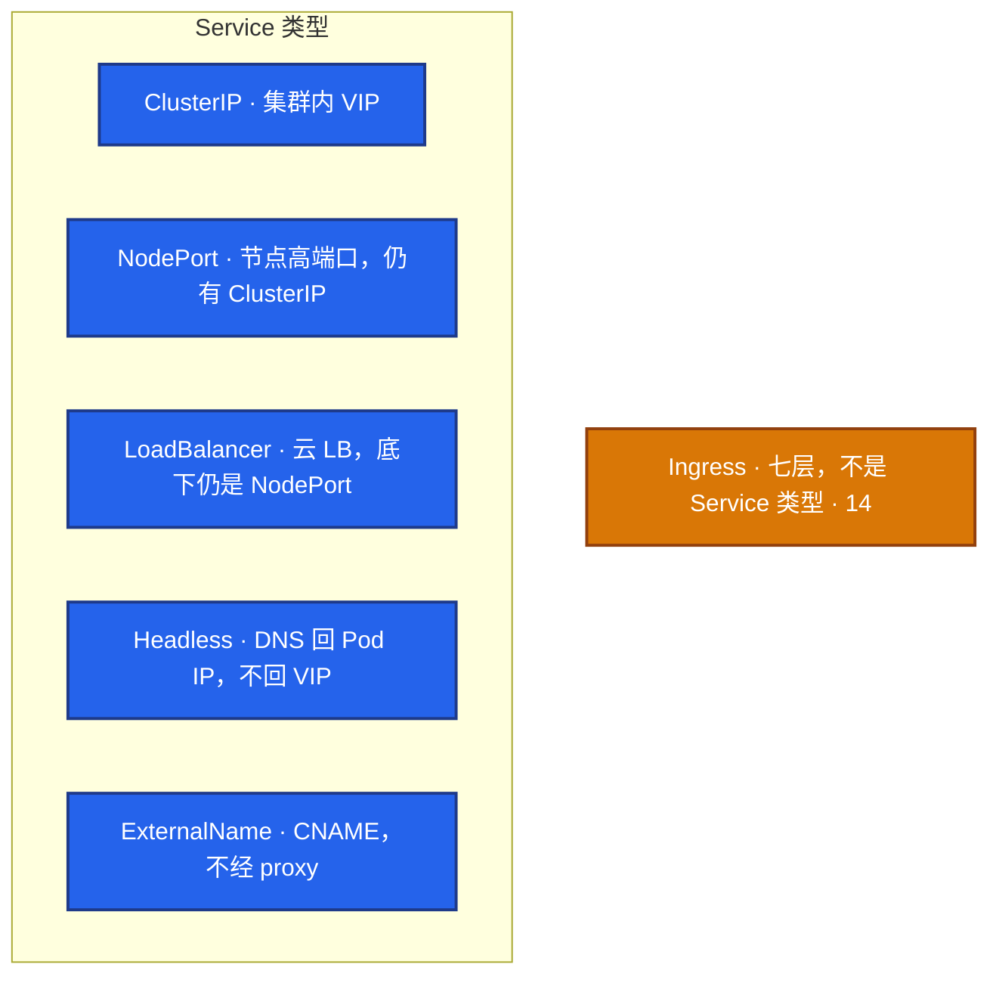
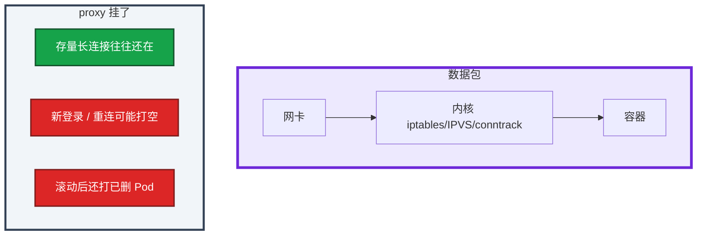

# 08｜Service 与 kube-proxy · 练习题

先对照 [知识点](知识点.md) **本章主线** 自己口述，再对答案。每题标了覆盖范围：

| 标记 | 含义 |
|------|------|
| **核心** | 不懂整章就没建立起来 |
| **必会** | 值班和面试都要能讲 |
| **常用** | 线上会反复碰到 |
| **常考** | 白板和追问的高频口径 |

## 本题目录

- [Q1 四种类型与 Ingress 边界](#q1)
- [Q2 Endpoints 为空](#q2)
- [Q3 iptables vs IPVS](#q3)
- [Q4 proxy 挂了长连接](#q4)
- [Q5 访问路径分层](#q5)
- [Q6 conntrack](#q6)
- [Q7 滚动打到旧 Pod](#q7)
- [Q8 部分节点不通](#q8)
- [Q9 EndpointSlice / Local](#q9)
- [Q10 还要不要 kube-proxy](#q10)
- [合上书](#合上书)

---

## Q1

**★★★★★｜四种 Service 各自干什么？和 Ingress 边界在哪？**

**覆盖**：核心 · 必会 · 常考
**对应**：知识点 §3.1 四种类型

### 场景

要给大厅、战斗 ordinal、对外部活动页、临时调试各选一种。有人给每个服务开一个云 LB。另一边用 ClusterIP 去连 `mysql-0`。

### 完整解答

**一句话**：ClusterIP 给 VIP；Headless 给 Pod IP 列表；Ingress 是七层入口，不是 Service 类型。



ClusterIP：`svc.ns.svc.cluster.local` → VIP。Headless：A 记录是 **Pod IP 列表**；STS 还有 `pod.svc.ns.svc...`。生产对外 HTTP 用 Ingress 收敛 LB，不给每个服务开一个 LB。LoadBalancer 配额用尽会一直 Pending。

游戏：集群内可互换用 ClusterIP；要直连指定进程用 Headless。客户端走网关，不把节点 IP 用 NodePort 暴露给玩家——节点扩缩全员改地址。

### 再追问

- 游戏逻辑服用哪种？——可互换 ClusterIP；指定房间服用 Headless。
- Ingress 算第四种 Service 吗？——不算。要 Controller，通常前面一个云 LB。

---

## Q2

**★★★★★｜Service 建好了，Endpoints 为空，怎么查？**

**覆盖**：核心 · 必会 · 常考
**对应**：知识点 §3.2 Endpoints

### 场景

`kubectl apply` 了 Service。Endpoints 一直空。YAML 里 annotation 写了 `app=logic`。有人要重启 kube-proxy。

### 完整解答

**一句话**：Endpoints 空就不转发——先对 selector、Ready 和 Label，不要第一刀重启 kube-proxy。

空就不转发。先对 selector 和 Ready，不要第一刀重启 proxy。

```
Service selector: app=logic
  · Pod labels 命中且 Ready → 进 Endpoints
  · 写在 annotation 上 → 空（01）
  · Running 但 readiness 失败 → 空（04）
  · Init 没完 / 错 NS → 空
```

`get ep,pod --show-labels`。修的是 Pod / 探针 / 标签。Running 但不在 Endpoints = 没 Ready。

### 再追问

- 有 Endpoints 仍不通呢？——targetPort、容器没 listen、NetworkPolicy、kube-proxy 规则、CNI。先 Pod 内 `curl localhost`，再从另一 Pod 打 ClusterIP。分层，不要一层猜。

---

## Q3

**★★★★★｜kube-proxy 做什么？iptables 和 IPVS 怎么选？包走不走 proxy 进程？**

**覆盖**：核心 · 必会 · 常考
**对应**：知识点 §3.3 iptables vs IPVS

### 场景

Service 上千，iptables 更新时节点抖动。有人以为流量都进 kube-proxy 用户态，准备给 proxy 加 CPU。

### 完整解答

**一句话**：kube-proxy 只写内核规则，数据包不进 proxy 进程；上千 Service 评估切 IPVS。

每节点 DaemonSet，把 Service / EndpointSlice 变成本机转发规则。**包不进 proxy 进程。**

| | iptables | IPVS |
|--|----------|------|
| 查找 | 链表 O(n) | 哈希 O(1) |
| 更新 | 常整表刷新 | 增量 |
| 规模 | 少时够用 | 上千评估切换 |
| 前提 | 默认有 | `ip_vs` 模块 |
| 算法 | statistic 随机 | rr 默认，长连接可看 lc |

切 IPVS 改 ConfigMap 后重启 DS。`iptables-save` / `ipvsadm -Ln` 核对。切完仍是 iptables 先 `lsmod | grep ip_vs`。userspace 已废弃。给 proxy 加 CPU 填不满数据面。

### 再追问

- proxy 挂了已有连接？——conntrack 里的可能还在；规则不再更新。见 Q4。
- ARP 异常？——IPVS 可开 `strictARP`。

---

## Q4

**★★★★★｜kube-proxy 挂了，已经在线的玩家长连接会怎样？新登录呢？**

**覆盖**：核心 · 必会 · 常考
**对应**：知识点 §3.4 kube-proxy 挂了

### 场景

某节点 kube-proxy 进程没了。战斗服还在，登录开始有人进不去。群里要重启该节点上的逻辑服。

### 完整解答

**一句话**：proxy 挂了：存量长连接往往还在，新连接和滚动后的规则更新会出问题。

数据包不经过 kube-proxy 用户态。它只负责 **更新** 本机转发规则（对齐 01 Q10）：



止血：拉起该节点 kube-proxy，核对 EndpointSlice 和本机规则。不要先重启游戏进程——那会主动拆掉还活着的长连接。

### 再追问

- Cilium 替换 kube-proxy 的节点呢？——eBPF 模式不靠 kube-proxy 写 iptables。挂的是 Cilium agent 时，影响面类似「规则不更新」。见 23。本章答到：数据面规则还在，控制 / agent 挂了不等于立刻断光。

---

## Q5

**★★★★☆｜从 Pod A 访问 `http://web:80` 的完整路径？卡在哪怎么分层？**

**覆盖**：必会 · 常用
**对应**：知识点 §6 命令 · §7 排障

### 场景

A 访问 web Service 不通。有人从 CoreDNS 查到 CNI 一次猜完。

### 完整解答

**一句话**：访问 Service 路径：DNS → ClusterIP → 内核 DNAT → Pod；分层查不要一次猜完。

```
resolv.conf → CoreDNS 得 ClusterIP     （09）
        → 本机 DNAT 到某 Ready Pod IP:targetPort
        → 跨节点走 CNI                             （10）
        → 回程反向 NAT；conntrack 保同一后端
```

不通时分层：DNS / Endpoints 是否空 / proxy 规则 / CNI ping / 端口 listen。`get` 可以 `exec` 不行是 API→kubelet（03），不是这条 Service 路径。

targetPort 和 containerPort 不一致：DNAT 到错误端口。Endpoints 可能仍有 IP。Pod 内 localhost 通、打 Service 不通，优先对端口。

### 再追问

- ping 通 ClusterIP 算通吗？——不算。VIP 在内核，不等于有后端、不等于 targetPort 在听。

---

## Q6

**★★★★☆｜conntrack 满是什么现象？游戏网关为什么容易踩？**

**覆盖**：必会 · 常用
**对应**：知识点 §7 生产排障

### 场景

网关间歇性超时、新建连接失败。CPU 不高。dmesg 有 `nf_conntrack: table full`。默认表大小 65536，CCU 已经更高。

### 完整解答

**一句话**：conntrack 表满：新建连接失败，存量长连接可能还在——治理泄漏并调 max/TIMEOUT。

conntrack 表满：新连接建不上或偶发超时，存量长连接可能还在。游戏网关 CCU 高、短连接泄漏，默认 65k 不够。

监控 `nf_conntrack_count / max`，**>80% 告警**。调高 max，查短连接泄漏（没关掉的 HTTP、健康检查打爆）。这和「Service 没 Endpoints」不同：Endpoints 有，只是内核跟踪表满了。

TIMEOUT 也要看：默认空闲过短会砍长连接；过长表更容易满。游戏长连接按实际空闲时间调，不要只加 max 不治理泄漏。

### 再追问

- 只加 max 不调 TIMEOUT 行吗？——表还会满。泄漏和空闲超时要一起治。

---

## Q7

**★★★★☆｜为什么滚动时会打到正在退出的 Pod？**

**覆盖**：必会 · 常用
**对应**：知识点 §3.5 摘流

### 场景

滚动一堆 502。旧 Pod 已 Terminating，IPVS 还把新连接打过去。没有 preStop，应用收到 TERM 立刻退出。

### 完整解答

**一句话**：滚动打到旧 Pod 是因为 Endpoints 摘除和规则更新有延迟，要靠 readiness + preStop。

Endpoints 摘除和 IPVS/iptables 更新有延迟；应用立刻退出，路上的包打空连接。

对：readiness 失败先摘 Endpoints；preStop 等几秒让规则和 LB 摘干净（04）；grace 够长。

错：无 readiness + 立刻退出；sessionAffinity 把人粘在旧 Pod。

长连接要业务主动断或等自然结束。摘流靠 readiness，不是靠 ClusterIP。`maxUnavailable=0` 保证副本数量，不保证数据面已经摘干净（05）。

### 再追问

- 游戏房间长连接怎么摘？——业务主动踢下线或等自然结束，不要指望 Service 对象替你断 TCP。

---

## Q8

**★★★★☆｜部分节点访问同一 Service 失败？打到已删 Pod？**

**覆盖**：必会 · 常用
**对应**：知识点 §7 生产排障

### 场景

只有 node-a 上的客户端访问 web 失败。其他节点正常。另一边滚动后还打到已经没了的 Pod IP。

### 完整解答

**一句话**：单节点访问失败：该节点 kube-proxy 规则与 EndpointSlice 不一致，先拉 proxy。

规则是每节点一份。该节点 kube-proxy 异常或没 sync，只影响打到这台节点内核的流量。

对比该节点 `ipvsadm`/`iptables` 与 EndpointSlice。拉起 / 重启该节点 kube-proxy（先别杀业务）。同节点 Pod 互访对照：通则不像 CNI 跨节点（10）。

打到已删 Pod：Endpoints 已变，这台 proxy 还拿着旧规则。和 Q4 同一类：规则不更新。

### 再追问

- CNI 和 proxy 怎么区分？——同节点互访通、跨节点失败 → 偏 CNI。所有节点都空 Endpoints → 偏 selector/探针。单节点规则和 Slice 不一致 → 偏该节点 proxy。

---

## Q9

**★★★★☆｜EndpointSlice 和 Endpoints？externalTrafficPolicy Local 要注意什么？**

**覆盖**：必会 · 常用 · 常考
**对应**：知识点 §3.2 EndpointSlice · §5 配置

### 场景

排障只看了 Endpoints 对象。kube-proxy 已经改 watch Slice。另一边为了风控开了 `externalTrafficPolicy: Local`，没有本地后端的节点开始丢登录包。

### 完整解答

**一句话**：kube-proxy 默认 watch EndpointSlice；`externalTrafficPolicy: Local` 空节点会丢包。

kube-proxy 默认 watch Slice，分片避免超大 Endpoints 对象。排障两者都看。旧控制器只写 Endpoints 时，新 proxy 可能看不到，属版本 / 兼容问题。

| | Cluster | Local |
|--|---------|-------|
| 源 IP | 变成节点 IP | 保留真实客户端 IP |
| 转发 | 可跨节点 | 只打本节点 Pod |
| 空节点 | 仍可能接到 | **丢包** |

游戏要真实玩家 IP 做风控：入口 NLB + Local，并保证空节点被外部摘掉，或每节点都有副本。`internalTrafficPolicy: Local` 减少东西向跨节点，副本不够会断。

LoadBalancer 一直 Pending：云 controller 建外部 LB 失败，常见配额用尽。查云厂商事件和 Service status。

### 再追问

- NodePort 默认端口段？——30000–32767。不要给每个服务开一个再拿给玩家。

---

## Q10

**★★★★☆｜还要不要 kube-proxy？和网格 / Cilium 什么关系？**

**覆盖**：必会 · 常考
**对应**：知识点 §3.3 · §3.4

### 场景

有人说「上了网格就没有 kube-proxy 了」。另一边 Cilium 开了 eBPF 替换。要不要还能答 Q4。

### 完整解答

**一句话**：没替换方案仍靠 kube-proxy；Cilium/eBPF 替换后 agent 挂了影响面仍是规则不更新。

没上替换方案就还靠 kube-proxy 写 iptables/IPVS。Sidecar 网格可以绕过 ClusterIP 直连 Pod，那是另一条数据面，细节不在本章默写 CR。Cilium eBPF 可替换 kube-proxy：agent 挂了，影响面仍是「规则不更新」，和 Q4 同一句话。见 23。

本章必会不换成「网格清单」：四种类型、空 Endpoints、iptables vs IPVS、proxy 挂了对长连接 / 新连接的拆分。

替换了 kube-proxy，01 的影响面题还要答：改的是谁写规则，不是「数据面进程立刻死」。已有转发和 conntrack 仍在内核 / eBPF 里。

### 再追问

- 给 kube-proxy 加 CPU 能让转发更快吗？——不能。包不进用户态。慢在规则规模（该切 IPVS）或 conntrack，不在 proxy 进程算力。

---

## 合上书

- [ ] 能画出 VIP → 内核 DNAT → Pod，并说明包不进 proxy 进程
- [ ] 能选 ClusterIP / NodePort / LB / Headless，并能说出 Ingress 不是 Service 类型
- [ ] 能把空 Endpoints 对到 label / 探针 / NS，不先重启 proxy
- [ ] 能对比 iptables O(n) 与 IPVS O(1)，切 IPVS 先看模块
- [ ] 能拆 proxy 挂了：存量长连接还在、新连接会出问题，先拉 proxy
- [ ] 能处理 conntrack 满、Local 空节点丢包、滚动打到旧 Pod
