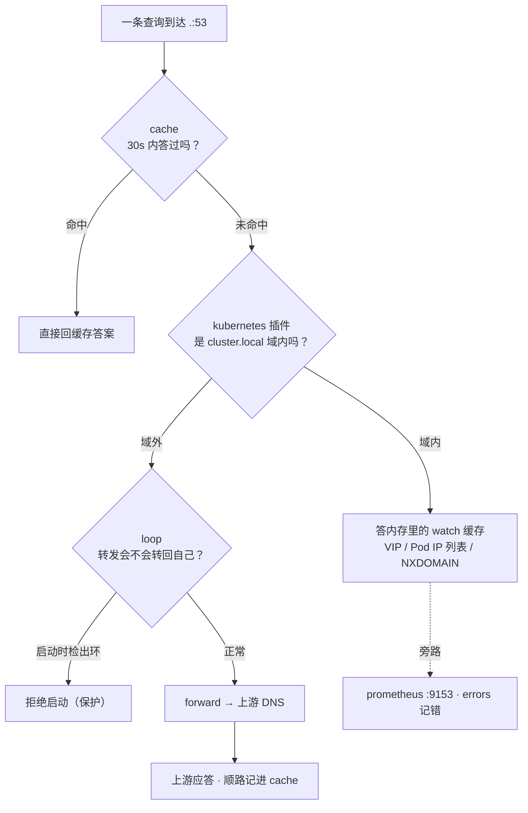
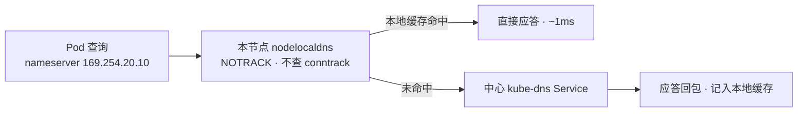
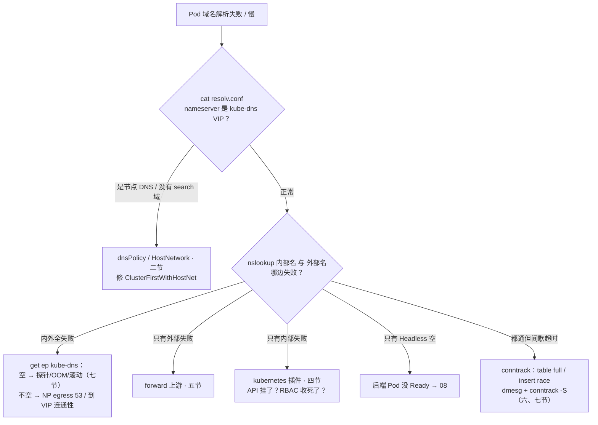

# CoreDNS

> 大厅登录 P99 从 80ms 跳到 2s，报错全是「业务域名解析超时」；值班看 CoreDNS CPU 飙满，第一反应加 10 个副本——越加越慢；群里又有人喊「重启逻辑服」，一重启，全场域名解析抖成一片。
> **本章回答**：一次 `svc.cluster.local` 解析的一生——resolv.conf 从哪来、查询怎么到 CoreDNS、Corefile 插件链怎么答、外部域名怎么出门；NodeLocal 为什么必要；挂了/慢了的影响面，扩缩容与监控怎么做。
> **不讲**：VIP 怎么转到 Pod、iptables vs IPVS → [08](../08-Service与kube-proxy/)；Pod IP、NetworkPolicy 写法 → [10](../10-CNI与网络策略/)；公网权威 DNS / CDN → [01-15](../../01-基础底座/15-DNS与CDN/)；conntrack 深机制 → [01-17](../../01-基础底座/17-iptables与conntrack/)；Cilium 替 kube-proxy 后的 DNS → [25](../25-eBPF与Cilium/)。

**标记**：🎯重点 · 🔥难点 · ⭐常考 · 🔧实操

---

## 一、一张图：一次解析的一生

> 🎯 **一句话**：一次查询过四关——resolv.conf 问谁、VIP 上路、插件链分工、答案出门；排障先问卡在哪一关。


- 📖 **读图**
  - 🛤️ 主线：① 进 → ② resolv.conf 决定「问谁、怎么补全」→ ③ VIP → ④ 插件链按**域**分工
  - 🔀 NodeLocal 是可选捷径，未命中仍回中心；值班三件工具各照一段：`cat resolv.conf` 照 ②，`get ep` 照 ③，日志 / `:9153` 照 ④

口诀先埋：⭐ **名挂、IP 通 = DNS 指纹；加副本治不了 ndots 垃圾**。

本节对应练习题 Q1。

---

## 二、出生：Pod 里的 resolv.conf 从哪来

> 🎯 **一句话**：`/etc/resolv.conf` 是 **kubelet 创建 Pod 时写进去的**，不是镜像自带——三个字段各有来头。

**resolv.conf** = 应用的「查号簿」：**问谁**（nameserver）、**短名怎么补全**（search）、**几个点才算全名**（ndots）。

```bash
kubectl exec hall-pod-xxx -n game -- cat /etc/resolv.conf
```

```text
nameserver 10.96.0.10                                    # ← kube-dns Service ClusterIP（kubelet --cluster-dns）
search game.svc.cluster.local svc.cluster.local cluster.local   # ← 三截 search（按 Pod ns 拼）
options ndots:5                                          # ← 默认 5：少于 5 个点先走 search
```

- 🪪 **三个字段的出生证**
  - **nameserver** ← kubelet `--cluster-dns`，指向 kube-dns Service ClusterIP
  - **search** ← `--cluster-domain`（默认 `cluster.local`）+ Pod namespace，固定三截：`<ns>.svc.<domain>`、`svc.<domain>`、`<domain>`
  - **ndots** ← kubelet 默认写 `ndots:5`

- 📐 **ndots 规则**：点数 **< ndots** → 先把 search 域**逐个**拼上去试，全失败才按原名；点数 **≥ ndots** → 先按原名，失败再试 search

> 💡 **打个比方**：公司内线「自动补全部门」——你说「找小王」，总机按「你所在部门 → 全公司」逐截试（search）。默认「头衔不超过 5 段一律先当内部员工」，外部客户 `api.pay.com`（才 2 段）也被先查三遍内部分机表——这就是五节的放大坑。

#### ❓ 为什么默认是 ndots:5？

- ✅ **集群内优先**：短名 `battle-svc`（0 点）、`battle-svc.game`（1 点）都 < 5，先走 search 才能补成 FQDN
- 💸 **代价**：外网域名通常 2~3 个点，也被卷进 search——本章最高频事故源（五节）
- 🔧 **逐 Pod 补丁**：`dnsConfig.options: ndots:2` 只改这一个工作负载，不是集群默认

### 📮 dnsPolicy 与 dnsConfig：谁能改写出生证 ⭐

| 策略 | 谁用 | 效果 |
|------|------|------|
| `ClusterFirst`（默认） | 普通 Pod | nameserver = kube-dns VIP |
| `ClusterFirstWithHostNet` | `hostNetwork: true` 还想用集群 DNS | **必须显式写**，否则继承节点 DNS |
| `Default` | 想跟节点走 | 继承节点 resolv.conf，集群短名解析不了 |
| `None` | 完全自定义 | 一切看 `dnsConfig`，漏写 nameserver 直接没 DNS |

- 🕳️ **两个高频坑**
  - **hostNetwork**：默认 `ClusterFirst` 也**不走集群 DNS**——kubelet 对 hostNetwork 继承节点配置，resolv.conf 里是节点 DNS，没有 `*.svc.cluster.local`。**看起来像 CoreDNS 挂了，查询根本没打到 kube-dns**。修法：`dnsPolicy: ClusterFirstWithHostNet`
  - **`dnsPolicy: None` 自己写 8.8.8.8**：集群短名立刻全废，还绕开 CoreDNS 容量与监控

```yaml
dnsConfig:
  options:
  - name: ndots
    value: "2"        # ← 只对这一个 Deployment 生效，治外网域名放大（五节）
```

> ⚠️ **别混**：resolv.conf 决定「**问谁、怎么补全**」（客户端，每 Pod 可不同），CoreDNS 决定「**怎么回答**」（服务端，全集群一份）。HostNetwork 短名全废是前者——查询压根没到 CoreDNS，去重启 CoreDNS 白忙。

> 🔍 **现场**：任何「这个 Pod 解析怪怪的」，第一刀永远是进 Pod 看出生证。

```bash
kubectl exec battle-pod-xxx -n game -- cat /etc/resolv.conf
# nameserver 10.0.0.2        ← 不是 10.96.0.10：节点 DNS，查 dnsPolicy / hostNetwork
# search ec2.internal        ← 没有 *.svc.cluster.local：集群短名必废
```

- 🧨 **改 `--cluster-domain` 不是无成本开关**：同时写进每个 Pod 的 search 和 kubernetes 插件 zone；硬编码 `*.svc.cluster.local` 的探针/脚本/网格要审计；旧 SAN 证书会校验失败；**已运行 Pod 的 search 还是旧的**（要滚动重建）——滚动窗口里短名时好时坏。生产默认别动 `cluster.local`。

本节对应练习题 Q2。

---

## 三、出门：kube-dns Service 与 kube-proxy

> 🎯 **一句话**：查询到 CoreDNS 中间隔着一个 Service——**VIP 有没有后端（Endpoints）**，是名字生死的第一道闸。

- 🎭 **三个角色**
  - **resolv.conf**：问谁、search、ndots（二节）
  - **kube-dns Service**：常见 ClusterIP `10.96.0.10` + 53 端口——全体 Pod 的「名字服务门牌」
  - **CoreDNS**：`kube-system` Deployment（默认 2 副本），真正干活的进程

- 📜 **为什么 Service 叫 kube-dns 而进程叫 CoreDNS？** 历史兼容：最早由 kube-dns 组件实现，1.11 起默认换 CoreDNS，Service 名沿用。排障靠 label `k8s-app=kube-dns` 找 Pod。

#### ❓ 为什么 Running ≠ 查询有后端？

- 🚪 kube-proxy 只把 **Ready** 的 Pod 写进 kube-dns Endpoints
- ☠️ 探针失败、OOM、滚动太猛 → Endpoints 摘空：VIP 还在、规则还在，打到 `10.96.0.10:53` 的包**没有接收者** → **全集群名字一起死**
- 🔗 与 [08](../08-Service与kube-proxy/) 业务 Service readiness 失败同源

- 📡 **路上主要是 UDP**：DNS 一问一答报文小；响应 >512B 截断才回退 TCP。节点上 53/UDP 比 53/TCP 更要命。Service 开三个端口：`dns` 53/UDP、`dns-tcp` 53/TCP、`metrics` 9153——NP 放行时三个一起放，优先级 UDP > TCP

> ⚠️ **别混**：上 NetworkPolicy 第一天最高频事故就是 DNS——default-deny 切了 Pod **egress** 到 `kube-system:53` 的 UDP，现象「名挂、IP 仍通」。放行写在 **egress**（解析是 Pod 主动往外问）；只放 Ingress 没用。策略细节 → [10](../10-CNI与网络策略/)。

> 🔍 **现场**：全集群名字失败，第一刀永远是看后端名单。

```bash
kubectl -n kube-system get ep kube-dns
# ENDPOINTS
# 10.244.1.5:53,10.244.2.8:53   ← 健康：两个 CoreDNS Pod 在册
# <none>                        ← P0：VIP 没后端，全集群名字已死
```

口诀：⭐ **Running ≠ 有后端；全集群名字死先看 kube-dns Endpoints**。

本节对应练习题 Q3、Q13。

---

## 四、应答：Corefile 插件链

> 🎯 **一句话**：CoreDNS 是「插件链服务器」——**Corefile** 声明监听哪个域；域内 kubernetes 答，域外 forward 出门，cache 记账，loop 防转晕。

**Corefile** = ConfigMap `kube-system/coredns`。kubeadm 默认长相：

```text
.:53 {                                        # ← server 块：「.」匹配所有域名，监听 53
    errors
    health {
       lameduck 5s                            # ← 摘流后再撑 5s，滚动不抖
    }
    ready                                     # ← readiness :8181，决定进不进 Endpoints
    kubernetes cluster.local in-addr.arpa ip6.arpa {
       pods insecure
       fallthrough in-addr.arpa ip6.arpa      # ← 只有反解查不到才放行下一个插件
       ttl 30
    }
    prometheus :9153
    forward . /etc/resolv.conf {              # ← 域外转上游：节点 resolv.conf 里的 DNS
      max_concurrent 1000
    }
    cache 30
    loop                                      # ← 发现「转发给自己」就拒起
    reload
    loadbalance                               # ← 轮转 A 记录顺序
}
```

内网域再加一块（**StubDomain**）：

```text
company.internal:53 {
    errors
    cache 30
    forward . 10.0.0.53                       # ← 直达内网 DNS，别绕公网一圈
}
```

### 🔗 执行顺序：编译期定死，不是书写顺序 🔥⭐

#### ❓ 为什么 Corefile 里改顺序没用？

- 🔒 插件执行顺序由源码 `plugin.cfg` **编译期固定**，书写顺序不影响
- 📍 关键位置：`cache` 在 kubernetes / forward **之前**（内外应答都会缓存）；`loop` **紧挨** forward 前（专职拦「转发给自己」）
- 🔁 **loop**：启动时给自己发测试查询；若被 forward 转一圈又回来（典型：节点 resolv.conf 的 nameserver 就是 kube-dns VIP），**直接拒绝启动** → CrashLoopBackOff。这是保护，别删 loop——去改上游

### 🧠 kubernetes 插件：内部名答案从哪来 🔥⭐

#### ❓ 为什么答内部名不每次查 etcd？

- 👀 启动后用 ServiceAccount **watch API Server**，把 Service / EndpointSlice 维护在**内存**；查询直接答内存
- ⛓️ **API Server 挂了**：旧答案还能撑（记录 TTL 默认 30s），**新建 Service / 刚扩的后端**查不到
- 🚫 **RBAC 收太死**：进程 Running，**管内名全变 NXDOMAIN**——别只盯 53 端口

| 对比 | ClusterIP Service | Headless（`clusterIP: None`） |
|------|-------------------|-------------------------------|
| A 记录 | **一条 = VIP**，后续 kube-proxy 转发（[08](../08-Service与kube-proxy/)） | **多条 = 每个 Ready Pod IP**，客户端自选 |
| 典型 | 无状态（大厅调战斗） | Kafka / etcd / StatefulSet |
| 空了先查谁 | kube-dns Endpoints（本节） | **后端 Pod 是否 Ready**（08），别先骂 CoreDNS |

- 🏷️ StatefulSet 专属：`mysql-0.mysql.game.svc.cluster.local` → 固定那一个 Pod
- 🛑 **zone 内无此名 = NXDOMAIN**，不会漏给上游——`fallthrough` 只对反解 zone 开放。这正是五节放大坑的机制基础：`api.pay.com.game.svc.cluster.local` 落在 `cluster.local`，直接 NXDOMAIN
- 📎 **Pod A 记录**：`10-244-1-15.game.pod.cluster.local`（`pods insecure` = 不做身份校验也答）；游戏几乎不用，面试会问 zone 里同时住 svc 与 pod 记录

### ⏱️ cache：30 秒的记忆

`cache 30` 按名字记 30s（以记录自身 TTL 为上限）。代价：TTL 拉长让切换变钝——Headless 换后端后旧 IP 还活着。**别把 cache 拉到几分钟当容量方案**。

> 🔍 **现场**：怀疑「应用拿到旧答案」，用 dig 直打 CoreDNS 看 TTL。

```bash
kubectl run netshoot --image=nicolaka/netshoot -it --rm -- sh
dig @10.96.0.10 mysql.game.svc.cluster.local +noall +answer
# mysql.game.svc.cluster.local.  27  IN  A  10.244.1.15   # ← TTL 剩 27s：来自 cache
# mysql.game.svc.cluster.local.  27  IN  A  10.244.2.22   # ← 两条 A = Headless
```

### 🧩 收束：一次查询凭什么被答出来



- 📖 **读图**
  - 🛤️ 先过 cache → 域内 kubernetes 用内存答（**不依赖每次访问 API**）→ 域外经 loop 后 forward
  - 📊 prometheus / errors 是旁路记账，不在应答路径上

**可背清单（四句）**：

1. **内部名不出 CoreDNS**——kubernetes 答 API watch 缓存，不逐次查 etcd
2. **外部名必出 CoreDNS**——forward 转上游，默认 `/etc/resolv.conf`
3. **cache 在两者前面**——内外都缓存 30s，拉长挡故障切换
4. **loop 只在启动时出手**——转发给自己 = 拒起，是保护不是故障

> ⚠️ **别混**：「插件链能答」≠「什么名字都能答」。域内没记录 = NXDOMAIN；域外对不对看上游；Corefile 改完还要确认生效（八节）。

> 📝 **面试**：问「CoreDNS 内部结构」，按「**域内 / 域外 / 缓存 / 自保护**」四组：kubernetes 管内名（watch API）、forward 送外名、cache 30s、loop 防环。补一句「执行顺序编译期固定，与书写无关」。

口诀：⭐ **域内 kubernetes / 域外 forward / cache 30s / loop 防环；顺序与书写无关**。

本节对应练习题 Q4、Q5、Q6。

---

## 五、出门：外部域名与 ndots 放大坑

> 🎯 **一句话**：外网域名本身一次就能答，是 **ndots:5 + 三截 search** 让它先白查三遍集群域——一次放大成四次。⭐🔥

外网正常链路很短：`api.pay.com` 不在 `cluster.local` → cache 未命中 → forward 转上游。问题在**客户端出门之前**：`api.pay.com` 只有 2 个点 < 5，glibc 先拿三截 search 逐个试：


- 📖 **读图**
  - ①~③ 白查全部由 kubernetes 回 NXDOMAIN（都落在 `cluster.local`）
  - ④ 才轮到 forward；公式：`(search 域数 + 1) × 地址族数` → 默认 **4** 次；双栈 A+AAAA 再 **×2 = 8**

> 💡 **打个比方**：寄快递写「api.pay.com」没写「国际件」，分拣员先按本市、本省、全国三本地址簿各翻一遍——业务只寄一件，邮局干了四件的活。连接池每建连都解析一次，开服瞬间几倍活全砸 CoreDNS。

#### ❓ 为什么加副本治不了 ndots 垃圾？

- 🗑️ 扩副本 = 用更多 CPU **答同一批 NXDOMAIN**——垃圾查询一个没少
- ✅ **治本**：配置写绝对名 `api.pay.com.`（末尾点 = FQDN，跳过 search）；或 Pod `dnsConfig.options: ndots:2`（外网 2 点 ≥ 2 跳过 search；短名 0/1 点仍走 search）
- 🩹 **治标**：扩副本 + NodeLocal——扛得住 QPS，但放大倍数一分没减

> 🔍 **现场**：支付/账号类外部域名慢、CoreDNS CPU 高，先在业务 Pod 看查询链。

```bash
kubectl exec hall-pod-xxx -n game -- nslookup api.pay.com
# ** server can't find api.pay.com.game.svc.cluster.local: NXDOMAIN   # ← 白查 1
# ** server can't find api.pay.com.svc.cluster.local: NXDOMAIN        # ← 白查 2
# ** server can't find api.pay.com.cluster.local: NXDOMAIN            # ← 白查 3
# Name:      api.pay.com
# Address:   203.0.113.50                                             # ← 第 4 次才是真的

kubectl logs -n kube-system -l k8s-app=kube-dns --tail=200 | grep -c NXDOMAIN
# 176   # ← NXDOMAIN 占比极高 = 垃圾在烧 CPU
```

回检：日志里 `*.cluster.local` 的 NXDOMAIN 明显下降。

> ⚠️ **别混**：NodeLocal **不能替代改 ndots**——垃圾缓存在节点后**仍是垃圾**，只是不再跨节点打中心。六节展开。

> 📝 **面试**：「ndots:5 下 `api.pay.com` 先 NXDOMAIN 三遍集群域，共 4 次，双栈再翻倍。治本 FQDN 加点或 ndots:2；扩副本和 NodeLocal 只是治标。」

口诀：⭐ **治本改 ndots/FQDN，扩副本和 NodeLocal 只是治标**。

本节对应练习题 Q7。

---

## 六、本地化：NodeLocal DNSCache 为什么必要

> 🎯 **一句话**：跨节点 UDP 查中心又慢又脆——把缓存和监听搬到每个节点，查询不出网卡、不查 conntrack。

- 💥 **两个痛点**
  1. **路径脆**：默认查询跨节点打中心 VIP，经 kube-proxy + **conntrack**。高 QPS 打满表（`table full`）；更阴的是 **conntrack UDP insert race**——glibc/musl 把 A 和 AAAA **并行**发出，共用同一五元组，并发插表撞车，一条丢包 → 干等 `timeout`（glibc 默认 5s）——「解析偶发慢 5 秒」，CoreDNS 日志却一切正常
  2. **中心忙**：全集群挤一份 Deployment，扩容永远追业务

> 💡 **打个比方**：小区一道门岗，登记簿一次写一行——两个快递员拿**同一收件地址**同时挤窗口（A/AAAA 共用五元组），其中一个包裹被扔出门外，只能等 5 分钟再送。NodeLocal = 每栋楼自己的收发室，包裹不过门岗。

**NodeLocal DNSCache**（进程 **nodelocaldns**，本质每节点一份 CoreDNS）DaemonSet 监听 **169.254.20.10**（链路本地，与任何 Pod/Service 网段不冲突）：

- 🏠 **本地缓存**：命中不出网卡；未命中才转中心 kube-dns
- 🚫 **iptables NOTRACK**：发往 169.254.20.10:53 不查连接表——表满与 insert race 一起根除
- 📉 **降中心 QPS**：热查询留在节点



- 📖 **读图**
  - 命中就地返回：无跨节点、无 conntrack；未命中才走老路
  - 装后 resolv.conf 的 nameserver 变成 `169.254.20.10`（kubelet `--cluster-dns` 调整）——别当成陌生地址

#### ❓ 为什么 NodeLocal 不能替代改 ndots？

- 🎯 它治的是「**路径脆 + 热查询多**」，不是「查询总量垃圾」
- 🗑️ ndots 放大后的白查照样发生，只是被节点缓存——**放大倍数一分没减**
- 🧱 中心 CoreDNS 仍要 ≥2 副本守冷查询；NodeLocal ≠ 替代品 ≠ 扩容

缓解清单也放这：`single-request-reopen`（A/AAAA 改两 socket 串行，**只有 glibc 认，musl 忽略**）、NodeLocal NOTRACK、应用改用 TCP DNS——三者里只有 NodeLocal 顺带做本地缓存。

> 🔍 **现场**：NodeLocal 坏节点 = 那台节点上的 Pod 失去捷径。

```bash
kubectl -n kube-system get ds nodelocaldns
# DESIRED   READY
# 3         3        # ← READY < DESIRED：缺的那台节点上，Pod 失去本地捷径
```

> 📝 **面试**：「NodeLocal 以 DaemonSet 在每节点听 169.254.20.10，本地缓存命中不出网卡，NOTRACK 绕 conntrack——治跨节点超时、表满、insert race；ndots 垃圾不会因此变少。」

口诀：⭐ **NodeLocal 治路径脆与热查询，不治 ndots 垃圾**。

本节对应练习题 Q9、Q10。

---

## 七、生死：CoreDNS 挂了/慢了的影响面

> 🎯 **一句话**：CoreDNS 挂 = **名字断、已知 IP 还通**——已建立长连接照常跑，第一反应绝不是重启业务。⭐

#### ❓ 为什么挂了别先重启逻辑服？

- ✅ DNS 只翻译名字→IP；**答案曾经给出的 IP 还有效**
  - 已解析、拿着 IP 直连 → 不受影响
  - 已建立长连接（大厅↔战斗、连接池）→ 照常收发
  - **新连接还要解析名字** → 失败（开服互找、客户端重建、定时重连）
- ☠️ 重启逻辑服 = 拆掉还活着的长连接 → 「名字断」扩大成「名字断 + 连接断」

- 💀 **三种具体死法**
  1. **Endpoints 摘空**（最高频）：探针失败 / OOM / `maxUnavailable` 太大 → 进程 Running、VIP 无后端（三节）
  2. **控制面连带**：kubernetes 插件靠 watch API——API 挂了，旧缓存撑过 TTL 后新 Service/后端全废。DNS 症状是**果**，别在 CoreDNS 上找因
  3. **有人整批重启**：滚动窗口抖；没有 PDB 一把全重启 = 自造全集群名字故障。**高峰期永远别整批重启**

- 🐢 **慢了**：glibc 默认 `timeout:5 attempts:2`。CoreDNS P99 抬升 → 应用侧每次建连凭空多 5 秒，监控像「业务卡死」。签名：**CoreDNS P99 20ms、应用超时 2s**——差的是 search 次数 × RTT + 重试，加副本填不平，去五节修 ndots 或查 conntrack

> 🔍 **现场**：只探 TCP :53 不够——进程活着、插件卡死（连不上 API），端口照样通。认 `health`（:8080）和 `ready`（:8181），同 API `/readyz` 那一课（[03](../03-API-Server/)）。

> ⚠️ **别混**：**CoreDNS 挂了 ≠ 网络挂了**。CNI / kube-proxy / conntrack 完好，`ping IP` 照通；「名挂、IP 通」= DNS 指纹（NP 切 53 也是）。

口诀：⭐ **名挂、IP 通 = DNS；别先重启业务**。

本节对应练习题 Q1、Q8。

---

## 八、供养：扩缩容与监控

> 🎯 **一句话**：CoreDNS「打满」先分四层——垃圾查询、有效 QPS、conntrack、Endpoints 摘空——只有第二层才配扩容。🔥⭐

| 你看到的 | 是哪一层 | 第一刀 |
|----------|----------|--------|
| CPU 高，日志大量 `*.cluster.local` NXDOMAIN | **垃圾查询**（ndots，五节） | 改 FQDN / ndots:2，**不是加副本** |
| QPS 真高、NXDOMAIN 占比低 | **有效查询**（开服/扩容/短连接） | 扩副本 + HPA + NodeLocal |
| 偶发失败 + 5s 超时，dmesg 有 table full | **conntrack**（六节） | 调大 `nf_conntrack_max` + NodeLocal |
| Running 但 `get ep` 是 `<none>` | **Endpoints 摘空** | 查探针 / OOM / 滚动（七节） |

> 🔍 **现场** 🔧：分诊三板斧。

```bash
kubectl top pod -n kube-system -l k8s-app=kube-dns
# coredns-7d8f9b-aaa   890m   45Mi   # ← 两副本逼近 limit：先分垃圾还是有效

kubectl logs -n kube-system -l k8s-app=kube-dns --tail=200 | grep -c NXDOMAIN
# 176   # ← 200 行里 176 条 NXDOMAIN：垃圾主导

dmesg -T | grep -i conntrack | tail -1
# nf_conntrack: table full, dropping packet   # ← UDP DNS 先挨刀

conntrack -S | grep insert_failed
# insert_failed=4182   # ← 一直在涨：A/AAAA insert race（六节）
```

- 📐 **扩缩容标准姿势**
  - **底线**：副本 **≥2** + **podAntiAffinity** + requests/limits + **PDB**（`maxUnavailable: 1`）——探针失败或滚动太猛 = Endpoints 摘空 = 全集群名字死
  - **顺序**：先修 ndots 掐垃圾，再谈扩容
  - **HPA**：按**有效 QPS**（`coredns_dns_requests_total`），别按 CPU 给垃圾自动供血
  - **大规模**：优先 NodeLocal 把热查询留节点，比无限堆中心副本便宜

- 📊 **监控盯 `:9153`**：`requests_total`（按 zone 拆）、NXDOMAIN 占比（>50% 基本 ndots）、duration P99、cache 命中率、`panics_total`、`forward_requests_total`（偏高且外网慢 → 先怀疑上游）

- 🛠️ **改 Corefile**：有 `reload` 也**别默认已生效**——热加载有延迟，监听地址变更不热生效。标准：`kubectl -n kube-system rollout restart deploy/coredns`，PDB 在位、`maxUnavailable` 要小。limits 压太低 → CPU throttle = 整体变慢而不报错，比打满更难认

口诀：⭐ **打满四层：垃圾 / 有效 QPS / conntrack / Endpoints——只有第二层才配扩容**。

本节对应练习题 Q11、Q12。

---

## 九、作战：定责

> 🎯 **一句话**：「解析失败」先问范围——全断看 Endpoints，偏科看插件链，间歇看 conntrack。



- 📖 **读图**
  - 第一刀 resolv.conf——排除「查询根本没到 CoreDNS」
  - 内/外各打一发，切到插件链某一段；间歇超时单独走 conntrack

**现象 · 先做 · 别做**：

| 现象 | 先做 | 别做 |
|------|------|------|
| 集群名、外网名全失败 | CoreDNS Ready、Endpoints、NP egress 53 | 重启逻辑服 |
| 只有外网失败/慢 | 验 forward 上游、查 ndots 放大 | 先加 10 个副本 |
| Headless 没 A 记录 | 后端 Pod 是否 Ready（08） | 骂 CoreDNS 丢了答案 |
| 某 NS 短名失败 | resolv.conf search、dnsPolicy | 当全集群 DNS 挂了 |
| 间歇失败 + 5s 超时 | conntrack insert race / 表满，NodeLocal | 只盯 CoreDNS CPU |
| 应用超时 2s、CoreDNS P99 20ms | 查 search 次数与上游 RTT | 加副本填这段时间 |
| 名挂、IP 通，刚上 NP | egress 放行 kube-system:53（10） | 以为 CoreDNS 被策略杀了 |
| 改完 Corefile 没生效 | `rollout restart` + 看日志确认 | 反复 apply ConfigMap 干等 |
| 高峰想重启 CoreDNS | PDB + 单副本轮转，先扩再滚 | 一把全重启 |
| 有人改了 cluster domain | 审计硬编码后缀/证书 SAN，全量滚动 | 当无成本开关 |

**60 秒剧本** 🔧：

```text
① 0–10s   kubectl -n kube-system get ep kube-dns
          <none> = P0，立刻看 Ready / OOM / 探针
② 10–30s  进报障 Pod：cat /etc/resolv.conf
          + nslookup kubernetes.default（内）与一个外网域名（外）
③ 30–45s  日志 NXDOMAIN 占比、:9153 的 QPS 与 P99
          dmesg | grep conntrack；conntrack -S 看 insert_failed
④ 45–60s  定责：ndots → 改配置；上游慢 → 验 forward；Endpoints 空 → 探针/PDB；
          insert race → NodeLocal。先别重启任何还活着的东西。
```

本节对应练习题 Q14。

---

## 十、收口

> 🎯 **一句话**：命令、锚点、易错、数字——四件套是合上书要带走的东西。

### 命令速查 🔧

```bash
kubectl -n kube-system get ep kube-dns                 # ← <none> = 全集群名字死
kubectl exec {pod} -- cat /etc/resolv.conf             # ← nameserver / search / ndots
kubectl exec {pod} -- nslookup kubernetes.default      # ← 管内
kubectl exec {pod} -- nslookup api.pay.com             # ← 管外；顺路看白查几遍
kubectl run netshoot --image=nicolaka/netshoot -it --rm -- \
  dig @10.96.0.10 battle-svc.game.svc.cluster.local +short
kubectl logs -n kube-system -l k8s-app=kube-dns --tail=200 | grep -c NXDOMAIN
kubectl top pod -n kube-system -l k8s-app=kube-dns
dmesg -T | grep -i conntrack; conntrack -S
kubectl -n kube-system rollout restart deploy/coredns && \
  kubectl -n kube-system rollout status deploy/coredns
```

### 面试锚点

| 问 | 30 秒答 |
|----|---------|
| 集群内一次解析怎么走？ | resolv.conf（kubelet 写）→ kube-dns VIP → 插件链：内部名 kubernetes 答内存，外部名 forward 出门。 |
| CoreDNS 挂了，业务会怎样？ | 名字断、已知 IP 还通、长连接照常；新连接要解析才炸。别重启逻辑服，先看 Endpoints。 |
| resolv.conf 从哪来？ | kubelet 写：nameserver=VIP、search=三截、ndots:5；dnsPolicy/dnsConfig 可改。 |
| ndots:5 为什么放大？ | 点数 <5 先逐截 search：外网短名 3 白查 +1 真查 =4，双栈 ×2。治本：FQDN 加点或 ndots:2。 |
| Corefile 插件各管什么？ | kubernetes 管内名（watch API）、forward 送外名、cache 30s、loop 防转发给自己。 |
| 插件顺序按书写？ | 不是，编译期固定；cache 在 kubernetes/forward 前，loop 紧贴 forward 前。 |
| ClusterIP vs Headless？ | 一条 VIP vs 一串 Ready Pod IP；STS 还有 pod 专属记录。 |
| NodeLocal 为什么必要？ | 节点缓存 + 169.254.20.10 + NOTRACK：治跨节点超时、表满、insert race；不治 ndots。 |
| conntrack insert race？ | A/AAAA 并行共用五元组，插表撞车丢一条 → 等满 5s；single-request-reopen / NodeLocal 治。 |
| Endpoints 空会怎样？ | VIP 没后端，全集群名字死；Running ≠ 在册。 |
| kubernetes 插件依赖？ | watch API + RBAC；API 挂撑缓存，RBAC 死 → 管内 NXDOMAIN。 |
| DNS 打满怎么扩？ | 先修 ndots 再扩；≥2 + 反亲和 + PDB；HPA 按有效 QPS；大头用 NodeLocal。 |
| 监控看什么？ | :9153：requests、P99、cache 命中、NXDOMAIN 占比、panics。 |
| cache 拉长当容量？ | 不行：切换变钝，挡不住 ndots。 |
| HostNetwork 短名全废？ | 默认继承节点 DNS，要显式 `ClusterFirstWithHostNet`。 |
| 上 NP 后 DNS 挂？ | egress 没放行 kube-system:53；名挂、IP 通是指纹。 |
| 改 cluster domain 代价？ | 硬编码后缀、SAN、存量 Pod search 全要审计 + 全量滚动。 |
| single-request-reopen？ | A/AAAA 改两 socket 串行；只 glibc 认，musl 忽略。 |
| 内部名要查 etcd？ | 不查。watch API 维护内存；API 挂撑 TTL，新建 Service 才查不到。 |

### 易错一句话对照

- CoreDNS 挂了 = 网络挂了 → 名字断而已，已知 IP 与长连接还在
- 外网域名慢先加副本 → 先看 NXDOMAIN 占比，ndots 治本、扩容治标
- NodeLocal 能替代改 ndots → 垃圾缓存后仍是垃圾，放大一分没减
- 进程 Running = 服务可用 → Endpoints 在册才算；RBAC / API 也决定能不能答
- 插件执行顺序 = Corefile 书写顺序 → 编译期固定
- Headless 也回一条 VIP → 回一串 Ready Pod IP，客户端自选
- HostNetwork 默认走集群 DNS → 要显式 `ClusterFirstWithHostNet`
- apply ConfigMap 就等于生效 → 要 `rollout restart` 并确认
- 探活只看 TCP :53 → 插件卡死端口照样通，认 ready/health 端点
- 上 NP 放行入站就行 → 解析是 **egress** :53
- cache 拉到 5 分钟当容量 → 切换变钝，还挡不住放大
- 改 cluster domain 无成本 → 硬编码 / SAN / 存量 search 一起炸
- kubernetes 插件每次查 etcd → watch API 维护内存，不逐次查
- single-request-reopen 各平台通用 → 只 glibc 认，musl 忽略
- CoreDNS 扩副本能让查询变快 → 垃圾不因副本变少，先治 ndots

### 数字墙

> kube-dns VIP 常见 **10.96.0.10** · 端口 **53**（UDP 主、TCP 兜底）· ndots 默认 **5** · search 默认 **3** 截 · 一次外网短名 A 查询 **4** 次（3 白查 + 1 真查），双栈 **×2** · cache / k8s ttl 默认 **30s** · NodeLocal 监听 **169.254.20.10** · health **:8080** / ready **:8181** / 指标 **:9153** · glibc 默认 **timeout:5 attempts:2** · 副本 **≥2** + PDB

---

## 合上书

1. **默画一节主图**：resolv.conf → kube-dns VIP → 插件链（内 kubernetes / 外 forward）→ 答案，NodeLocal 捷径画在哪。（Q1）
2. **口述出生**：resolv.conf 谁写、三字段来源、ndots:5 用意与副作用。（Q2）
3. **口述出门**：为什么叫 kube-dns、Endpoints 摘空会怎样、查询走 UDP 为什么更要命。（Q3、Q13）
4. **默画插件链收束图**：cache / kubernetes / loop / forward 位置与分工；说清顺序为何与书写无关。（Q4、Q5、Q6）
5. **口述外域与放大**：`api.pay.com` 放大成几次、公式、两个治本修法。（Q7）
6. **口述本地化**：NodeLocal 治什么（表满 / insert race / 热查询）、不治什么（ndots）、凭什么地址听。（Q9、Q10）
7. **口述生死**：挂了哪些断哪些不断、为什么别重启逻辑服、慢了为何表现为 5 秒级超时。（Q1、Q8）
8. **口述供养**：打满四层签名、HPA 为何按有效 QPS、监控关键指标。（Q11、Q12）
9. **定责**：全断 / 偏科 / 间歇超时，各走决策树哪条、第一刀敲什么。（Q8、Q14）

九条都能不看稿讲下来，这一章就过了。终极测试：拦住开篇那两个误操作——加副本治 ndots、重启逻辑服。下一章：[10 CNI与网络策略](../10-CNI与网络策略/)。
