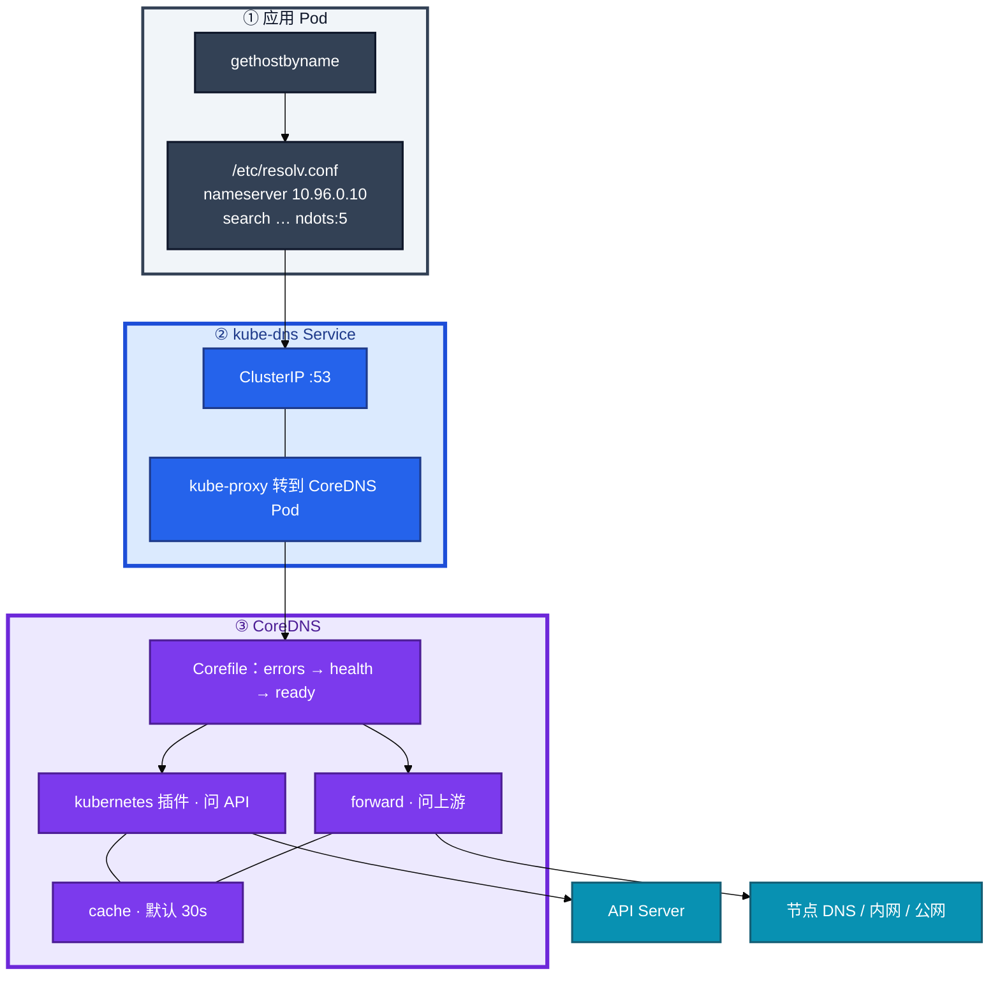
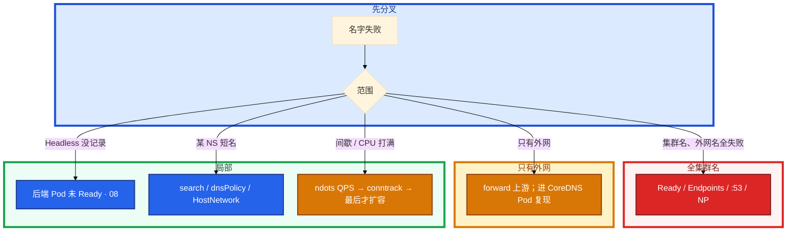

# CoreDNS


活动中 kube-system 里 CoreDNS 全部 NotReady。群里有人说「网络挂了，重启逻辑服」。大厅到战斗服一直用的是 Service 短名；另一边支付 SDK 用 `api.pay.com`，大厅一扩容 CoreDNS CPU 打满，IP 直连支付网关却是通的——名字断了，路还在。

**本章主线（名字失败就按这三步）：**

1. **分层**：全集群名死先看 kube-dns Endpoints；只有外网失败查 forward 上游。
2. **ndots**：外网短名先白查集群域——加点或降 ndots，别先加 10 个副本。
3. **留连接**：名字断了已知 IP 还通；不要先重启逻辑服。

**读完你能：** 白板上画出应用 → resolv.conf → CoreDNS → VIP；ndots:5 能算出一次外网查询放大成几次；全集群名死先看 Endpoints；DNS 打满能分垃圾查询、有效 QPS、conntrack。

## 本章目录

- [1. 基本概念](#1-基本概念)
- [2. 架构图](#2-架构图)
- [3. 原理](#3-原理)
- [4. 安装部署](#4-安装部署)
- [5. 核心配置](#5-核心配置)
- [6. 命令与操作](#6-命令与操作)
- [7. 生产排障](#7-生产排障)
- [8. 必会 · 常考](#8-必会--常考)
- [合上书](#合上书问自己)

**本章不讲：** 公网 DNS / CDN → [01-15 DNS与CDN](../../01-基础底座/15-DNS与CDN/)；VIP 怎么转到 Pod → [08 Service](../08-Service与kube-proxy/)；Pod 之间三层 → [10 CNI](../10-CNI与网络策略/)；上 NP 后 DNS 挂的策略写法 → 10，本章只要求知道要放行 53；Cilium 替 kube-proxy 后的 DNS → [23](../23-eBPF与Cilium/)。

---

## 1. 基本概念

集群 DNS 不是「应用自己随便问 8.8.8.8」。kubelet 给每个 Pod 写好 `/etc/resolv.conf`，nameserver 指向 **kube-dns** 这个 Service（常见 ClusterIP `10.96.0.10`）。后面才是 CoreDNS 进程。

CoreDNS 通常是 `kube-system` 里的 Deployment，Service 名仍叫 `kube-dns`（历史兼容）。挂了：**名字互访全断，已经知道的 IP 还通**——和「网络挂了」不是一回事。

**值班里怎么认现象**：

| 业务说的 | 技术含义 | 第一刀 |
|----------|----------|--------|
| 「集群内服务名解析失败」 | kube-dns Endpoints 空或 CoreDNS 挂 | `get ep -n kube-system kube-dns` |
| 「只有外网域名慢/失败」 | forward 上游或 ndots 放大 | 应用 resolv.conf + `nslookup` 外网名 |
| 「Headless 找不到新 Pod」 | 后端未 Ready 或 cache TTL | `get ep` + `dig` 看 TTL |
| 「HostNetwork 服短名全废」 | 继承了节点 DNS | 看 dnsPolicy |

| 在 CoreDNS 里 | 不在 CoreDNS 里 |
|---------------|-----------------|
| 把名字翻译成 ClusterIP 或 Headless Pod IP | 把 VIP DNAT 到 Pod（08） |
| kubernetes 插件问 API；forward 问上游 | Pod 之间三层怎么走（10） |
| resolv.conf 的 nameserver / search / ndots | 公网权威 DNS / CDN（02-10） |

三个角色不要混：

| 角色 | 干什么 |
|------|--------|
| **resolv.conf** | 应用问谁、search 怎么补、ndots 几 |
| **kube-dns Service** | VIP，kube-proxy 转到 CoreDNS Pod |
| **CoreDNS** | kubernetes 管内名，forward 管外名，cache 默认 30s |

CoreDNS 自己也是普通 Deployment：探针失败 → kube-dns Endpoints 空 → **全集群名字一起死**。kubernetes 插件依赖 API Server：控制面挂了，**已经缓存的答案还能撑 TTL，新名字 / 过期后再查会失败**。

CoreDNS 问 API 走的是 ServiceAccount，RBAC 被收太死会出现「CoreDNS Running、管内名 NXDOMAIN」。排障不要只看 53 端口。

> **记住**：名字断了先看 kube-dns 有没有后端，不要先怪 CNI。DNS 给名字，kube-proxy 给 VIP 转发，CNI 给 Pod IP。

---

## 2. 架构图

后面 ndots、打满、HostNetwork，都对着这张图说话。



**读图三句话：**

1. **CoreDNS 挂了，已经知道的 ClusterIP / Pod IP 还能通**——新连接如果还要解析名字 → 失败。
2. **改 Corefile 之后要 rollout CoreDNS**，只 apply CM 进程不会自动重载所有插件状态。
3. **kube-dns Endpoints 空 = 全集群名死**——Running ≠ 进 Service；只探 TCP :53 不够。

---

## 3. 原理

**本节 4 块：** 3.1 名字 · 3.2 ndots · 3.3 打满 · 3.4 dnsPolicy

### 3.1 名字长什么样、谁回答

**一句话：** 集群内短名靠 search 补全；跨 NS 必须写全称。

**打个比方：** 公司内打电话说「找小王」靠分机表自动补全部门（search 域）；跨部门必须报全名「支付部小王」。

**现场走一遍**（大厅 Pod 要访问战斗服）：

1. 看 resolv.conf：

```bash
kubectl exec -it hall-pod-xxx -n game -- cat /etc/resolv.conf
```

2. 屏幕出现：

```text
nameserver 10.96.0.10
search game.svc.cluster.local svc.cluster.local cluster.local
options ndots:5
```

3. 短名解析：

```bash
kubectl exec -it hall-pod-xxx -n game -- nslookup battle-svc
kubectl exec -it hall-pod-xxx -n game -- nslookup battle-svc.battle.svc.cluster.local
```

4. 跨 NS 必须用全称（上面第二条）。

5. 对比 ClusterIP 和 Headless：

```bash
kubectl exec -it hall-pod-xxx -n game -- nslookup web-svc.game.svc.cluster.local
kubectl exec -it hall-pod-xxx -n game -- nslookup mysql.game.svc.cluster.local
```

**输出解读**（ClusterIP vs Headless）：

```text
# ClusterIP Service
Name:   web-svc.game.svc.cluster.local
Address: 10.96.50.100

# Headless Service (CLUSTER-IP: None)
Name:   mysql.game.svc.cluster.local
Address: 10.244.1.15
Address: 10.244.2.22
```

| 行 | 含义 |
|----|------|
| 一条 Address = VIP | ClusterIP，再交给 kube-proxy（08） |
| 多条 Address = Pod IP | Headless，客户端自己选后端 |
| STS | 还有 `mysql-0.mysql.game.svc.cluster.local` |

Headless 没记录，先看后端 Pod 是不是 Ready，不是先骂 CoreDNS。Kafka / STS 找 ordinal 必须 Headless。

cache 默认 **30s**。Headless 刚扩出来的 Pod，应用还可能解析到旧列表。排障 `dig` 看 TTL。

> **记住**：短名靠 search；跨 NS 写全称；Headless 空先看后端 Ready。

**面试怎么说**：「同 NS 短名靠 search 补全；跨 NS 写 `svc.ns.svc.cluster.local`。ClusterIP 回 VIP，Headless 回 Pod IP 列表。」

### 3.2 ndots：外网首包慢、查询被放大

**一句话：** ndots:5 让外网短名先白查三遍集群域，一次查询放大成四次。

**打个比方：** 寄快递写「api.pay.com」没写「国际件」，分拣员先按本市、本省、全国地址簿各查一遍，最后才按真实地址发——业务只查一次，邮局干了四次。

**现场走一遍**（活动前支付 SDK 用 `api.pay.com`，CoreDNS CPU 打满）：

1. 在业务 Pod 里抓 resolv.conf：

```bash
kubectl exec -it hall-pod-xxx -n game -- cat /etc/resolv.conf
kubectl exec -it hall-pod-xxx -n game -- nslookup api.pay.com
```

2. 在 CoreDNS 侧看日志（NXDOMAIN 占比）：

```bash
kubectl logs -n kube-system -l k8s-app=kube-dns --tail=100 | grep NXDOMAIN
```

3. 用 dig 精确看查询链（在 debug Pod 里）：

```bash
kubectl run dig-tmp --image=busybox:1.36 -it --rm -- sh -c \
  'nslookup api.pay.com 2>&1; echo "---"; nslookup api.pay.com.game.svc.cluster.local 2>&1'
```

4. 屏幕典型输出：

```text
Server:    10.96.0.10
** server can't find api.pay.com.game.svc.cluster.local: NXDOMAIN
** server can't find api.pay.com.svc.cluster.local: NXDOMAIN
** server can't find api.pay.com.cluster.local: NXDOMAIN
Name:      api.pay.com
Address:   203.0.113.50
```

5. **说明什么**：`api.pay.com` 只有 2 个点 < ndots:5，glibc 先拿 search 域拼三遍，第 4 次才是真查询。

**输出解读**：


| 修法 | 怎么做 |
|------|--------|
| 治本 1 | 代码 / 配置用绝对名：`api.pay.com.`（末尾那个点） |
| 治本 2 | Pod `dnsConfig.options: ndots:2` |
| 治标 | 扩 CoreDNS + 反亲和 + NodeLocal DNSCache |

一次 `gethostbyname("api.pay.com")` 在 ndots=5 下可变成 **4 次**查询。连接池 + 短 TTL 会把 CoreDNS 打成「活动没开始、DNS 先告警」。

NodeLocal DNSCache **不能替代改 ndots**：垃圾查询缓存之后仍是垃圾，只是打到本机。

> **记住**：外网短名先白查三遍集群域；加点或降 ndots，别先加副本。

**面试怎么说**：「ndots:5 下 `api.pay.com` 会先 NXDOMAIN 三次集群域，共 4 次查询。治本用 FQDN 末尾加点或 Pod 设 ndots:2，扩副本只是治标。」

### 3.3 DNS 打满：不只是 CoreDNS CPU

**一句话：** DNS 打满要先分垃圾查询、有效 QPS、conntrack、Endpoints 被摘空。

**打个比方：** 前台电话占线，得先分清是骚扰电话（ndots 垃圾 NXDOMAIN）还是真客户太多（有效 QPS），还是总机线路满了（conntrack），还是前台员工都病假了（Endpoints 空）。

**现场走一遍**（CoreDNS CPU 90%，活动还没正式开始）：

1. 看 CoreDNS 和后端：

```bash
kubectl top pod -n kube-system -l k8s-app=kube-dns
kubectl get ep -n kube-system kube-dns
kubectl logs -n kube-system -l k8s-app=kube-dns --tail=200 | grep -c NXDOMAIN
```

2. 屏幕出现：

```text
NAME                       CPU(cores)   MEMORY(bytes)
coredns-7d8f9b-aaa         890m         45Mi
coredns-7d8f9b-bbb         920m         48Mi

ENDPOINTS   10.244.1.5:53,10.244.2.8:53

# 日志统计 NXDOMAIN 占比 > 70%
```

3. 查 conntrack（节点上）：

```bash
cat /proc/sys/net/netfilter/nf_conntrack_count
dmesg | grep conntrack
```

4. 若 `table full` 同时出现 → DNS UDP 短会话也打满 conntrack。

5. **决策**：NXDOMAIN 占比高 → 先改 ndots；有效 QPS 高 → 扩副本 + NodeLocal；Endpoints 空 → 修探针。

**输出解读**：

| 你看到的 | 是哪一层 | 第一刀 |
|----------|----------|--------|
| CPU 高，大量 `*.cluster.local` NXDOMAIN | 垃圾查询 | ndots / FQDN |
| QPS 真高、NXDOMAIN 不多 | 有效查询 | 扩副本 + HPA + NodeLocal |
| 偶发失败，P99 20ms，dmesg table full | conntrack | 调高 max + 查泄漏 |
| kube-dns Endpoints 空 | 探针摘空 | describe CoreDNS Pod |

应用侧超时 2s、CoreDNS P99 20ms，瓶颈在 search 次数或上游，不是「再加副本」。

HPA 按有效 QPS 才有意义。否则 HPA 在扩垃圾查询。

> **记住**：先分垃圾查询、有效 QPS、conntrack、Endpoints 被摘空，再决定加不加副本。

**面试怎么说**：「DNS 打满我不先加 10 个副本。先看 NXDOMAIN 占比——高就是 ndots 垃圾，改 FQDN 或 ndots:2；有效 QPS 高才扩。还要看 conntrack 和 kube-dns Endpoints。」

### 3.4 dnsPolicy 与 HostNetwork

**一句话：** HostNetwork 默认继承节点 DNS，要 ClusterFirstWithHostNet 才能用集群 DNS。

**打个比方：** 员工自带手机（HostNetwork）默认用自己流量卡（节点 DNS），想打公司内部分机必须改成「公司报销模式」（ClusterFirstWithHostNet）。

**现场走一遍**（HostNetwork 战斗服短名 `battle-svc` 全废）：

1. 看 Pod 的 dnsPolicy：

```bash
kubectl get pod battle-pod-xxx -n game -o jsonpath='{.spec.dnsPolicy}{"\n"}{.spec.hostNetwork}{"\n"}'
kubectl exec -it battle-pod-xxx -n game -- cat /etc/resolv.conf
```

2. 屏幕出现：

```text
ClusterFirst
true

nameserver 10.0.0.2
search ec2.internal
```

3. **说明什么**：`hostNetwork: true` 且 dnsPolicy 是默认继承的 `ClusterFirst` 行为异常——实际 resolv.conf 已是 **节点 DNS** `10.0.0.2`，不是 `10.96.0.10`。集群短名 `battle-svc` 解析不了。

4. 修法：改 spec：

```yaml
hostNetwork: true
dnsPolicy: ClusterFirstWithHostNet
```

5. 滚动后 resolv.conf 应出现 `nameserver 10.96.0.10` 和 cluster search 域。

**输出解读**：

| 策略 | 谁用 | 效果 |
|------|------|------|
| `ClusterFirst` | 默认 Pod | 用集群 DNS |
| `ClusterFirstWithHostNet` | HostNetwork 还想用集群 DNS | **必须显式设** |
| `Default` | 跟节点走 | 短名 `webapp-svc` 解析不了 |
| `None` | 完全自定义 | 必须配 `dnsConfig` |

`dnsPolicy=None` 自己写 8.8.8.8：集群短名会废。生产要自定义就写完整 dnsConfig。

NetworkPolicy 默认拒出站时，**必须放行 kube-system:53**（UDP，很多环境 TCP 53 也要）。上 NP 第一天最高频事故，细节在 10。

IPv6 / 双栈：A 和 AAAA 都可能返回。应用只连 IPv4 却先拿 AAAA，会多一次失败超时。

> **记住**：HostNetwork 忘了 ClusterFirstWithHostNet，短名全废，不是 CoreDNS 挂了。

**面试怎么说**：「HostNetwork Pod 默认继承节点 DNS，集群短名会挂。要用 `ClusterFirstWithHostNet`。上 NP 必须 egress 放行 kube-system:53，不是 Ingress 入站。」

---

## 4. 安装部署

kubeadm 默认装 CoreDNS Deployment + kube-dns Service。托管同样有，副本和 Corefile 仍要你盯。

| 项 | 选 | 不选 |
|----|----|------|
| 副本 | **≥2** + 反亲和 + requests/limits + PDB | 单副本入口 |
| 上游 | 内网可靠 DNS；公司域 StubDomain | 只写 8.8.8.8 还要求 SLA |
| 验收 | 应用 Pod 里 `nslookup kubernetes.default` | 只看 CoreDNS Running |

**现场验收**：

```bash
kubectl get deploy,svc,ep -n kube-system -l k8s-app=kube-dns
kubectl run tmp --image=busybox:1.36 -it --rm -- nslookup kubernetes.default
kubectl exec -n kube-system deploy/coredns -- nslookup google.com
```

第二条验管内（kubernetes 插件 + API）；第三条验管外（forward 上游）。

公司域 `company.internal` 用 StubDomain / 单独 server 块转到内网 DNS，不要让公司域先出公网再绕回来。

---

## 5. 核心配置

| 项 | 选 | 不选 |
|----|----|------|
| 外部名 | FQDN 末尾 `.` 或降 ndots:2 | 短名打外网 |
| 规模 | 先修 ndots；HPA 按有效 QPS；NodeLocal | 一个 2 副本扛全集群垃圾查询 |
| cache | 默认 30s 通常够 | 几分钟 TTL 挡故障切换 |
| Corefile | 改完 **rollout** | 只 apply CM 以为重载了 |
| NP | 上策略先放行 53 | 只放行 Ingress 入站 |
| cluster domain | 保持 `cluster.local` | 为了好听改成 `game.local` |

Corefile 只动有证据的块。顺序大致是 errors → health → ready → kubernetes → forward → cache。

```yaml
# kube-system ConfigMap coredns · 示意
.:53 {
    errors
    health :8080
    ready
    kubernetes cluster.local in-addr.arpa ip6.arpa {
       pods insecure
       fallthrough in-addr.arpa ip6.arpa
    }
    cache 30
    forward . /etc/resolv.conf
}
company.internal:53 {
    errors
    cache 30
    forward . 10.0.0.53
}
```

```yaml
# Pod dnsConfig 示意：降 ndots
dnsConfig:
  options:
  - name: ndots
    value: "2"
```

search 域默认三截：`<ns>.svc.cluster.local`、`svc.cluster.local`、`cluster.local`。这就是 ndots:5 下外网短名白查三遍的来源。不要再往 search 里塞一串业务域。

> **记住**：改 Corefile 后 rollout Deployment。cache 拉长挡不住 ndots 放大，只会让 Headless 切流变钝。

---

## 6. 命令与操作

### 6.1 命令速查

```bash
kubectl get deploy,svc,ep -n kube-system -l k8s-app=kube-dns
kubectl exec -it <app> -- cat /etc/resolv.conf
kubectl exec -it <app> -- nslookup kubernetes.default
kubectl exec -it <app> -- nslookup api.example.com
kubectl logs -n kube-system -l k8s-app=kube-dns --tail=50
```

| 目的 | 命令 | 看什么 | 正常 / 异常 |
|------|------|--------|-------------|
| 有没有后端 | `get ep -n kube-system kube-dns` | 空 = 全集群名死 | `<none>` = P0 |
| resolv.conf | `cat /etc/resolv.conf` | nameserver / ndots | 节点 DNS = HostNetwork 问题 |
| 管内 | `nslookup kubernetes.default` | kubernetes 插件 + API | NXDOMAIN = API/RBAC |
| 管外 | `nslookup api.example.com` | forward 上游 | 超时 = 上游 |
| TTL | `dig +norecurse @10.96.0.10 <name>` | cache 是否过期 | 不要只信应用侧一次失败 |
| 日志 | CoreDNS logs | NXDOMAIN 占比 | 高 = ndots 垃圾 |

值班先跑：Endpoints → 应用 resolv.conf → 管内 / 管外各一条 nslookup。

### 6.2 修 ndots SOP

1. 配置改成绝对名 `api.pay.com.`。
2. 大厅 / SDK Pod `dnsConfig.options: ndots:2`。
3. 看 CoreDNS 上 `*.cluster.local` NXDOMAIN 是否下降。

### 6.3 改 Corefile 后 rollout

```bash
kubectl -n kube-system rollout restart deploy/coredns
kubectl -n kube-system rollout status deploy/coredns
```

StubDomain 改完必须滚动。PDB 在，maxUnavailable 要小，避免自己把名字入口拆了。

### 6.4 NodeLocal DNSCache

把命中留在节点，降低中心 QPS 和超时。常见形态：节点上 DaemonSet，应用 resolv.conf 指 `169.254.20.10` 或 `127.0.0.1:53`，未命中再打中心 CoreDNS。

它治「有效查询太多、跨节点 UDP 超时」。它不治 ndots 垃圾——缓存之后仍是垃圾。上完回头看 NXDOMAIN 占比，该降 ndots 还是要降。

### 6.5 护 CoreDNS 的 PDB

探针失败 = kube-dns Endpoints 变空 = 全集群不能解析。和业务 Deploy 一样，单副本或滚动时 maxUnavailable 过大，就是自己把名字入口拆了。

---

## 7. 生产排障

大厅报「解析失败」。不要一上来重启 CoreDNS，按失败范围分层。



| 现象 | 先做什么 | 不要做什么 |
|------|----------|------------|
| 集群名、外网名全失败 | CoreDNS Ready、Endpoints、到 :53、NP 放行 53 | 重启逻辑服 |
| 只有外网失败 | forward 上游；进 CoreDNS Pod 里复现 | 先加 10 个副本 |
| Headless 没 A 记录 | 后端 Pod 未 Ready（08） | 骂 CoreDNS 丢了答案 |
| 某 NS 短名失败 | search、dnsPolicy、HostNetwork | 当全集群 DNS 挂了 |
| 间歇失败 | ndots QPS、conntrack | 只看 CoreDNS CPU |
| 应用超时 2s、P99 20ms | search 次数或上游 RTT | 加副本填这段时间 |
| 刚上 NP 名挂 IP 通 | egress 放行 53（10） | 以为 CoreDNS 被策略杀掉 |
| 改了 cluster domain | 硬编码后缀、证书 SAN、滚动 Pod | 当无成本开关 |

**真实现象举例**：支付 SDK 用 `api.pay.com`，活动扩容 CoreDNS CPU 打满、登录 P99 从 80ms 跳到 2s，IP 直连支付网关通——改 FQDN 加点 + ndots:2，QPS 掉大半，不是加 10 副本。

> **记住**：名字失败按范围分层，不要无脑重启 CoreDNS。

---

## 8. 必会 · 常考

| 说法 | 对错 | 口径 |
|------|:----:|------|
| CoreDNS 挂了 = 网络挂了，要重启逻辑服 | 错 | 名字断，已知 IP 还通；长连接通常还在 |
| kube-dns Endpoints 空但进程 Running 就没事 | 错 | Running ≠ 进 Service，全集群名死 |
| 只探 TCP :53 够当健康检查 | 错 | 插件卡住 TCP 仍通 |
| ndots:5 下 `api.pay.com` 只查一次 | 错 | 先白查 3 次集群域，共 4 次 |
| 先加 10 个 CoreDNS 副本治外网慢 | 错 | ndots 治本，扩副本治标 |
| NodeLocal 能替代改 ndots | 错 | 垃圾查询缓存之后仍是垃圾 |
| Headless 也回一条 VIP | 错 | 多条 Pod IP |
| HostNetwork 默认走集群 DNS | 错 | 要 ClusterFirstWithHostNet |
| cache 拉到 5 分钟能当容量方案 | 错 | Headless / 故障切换变钝 |
| 上 NP 只放行 Ingress 入站，DNS 会好 | 错 | 解析是 egress :53 |
| 自定义 cluster domain 无成本 | 错 | 探针、SAN、已有 Pod search 一起炸 |
| kubernetes 插件不依赖 API | 错 | 管内名问 API；RBAC 太死会 NXDOMAIN |

数字：常见 kube-dns VIP **10.96.0.10**；ndots 默认 **5**；一次外网短名 → **4** 次查询；cache 默认 **30s**；副本 **≥2**。

易混：名挂 vs IP 通；垃圾查询 vs 有效 QPS；Endpoints 空 vs 上游挂；HostNetwork 继承节点 DNS vs CoreDNS 挂了；NP egress vs Ingress 入站。

---

## 合上书，问自己

1. 一次集群内查询怎么走？CoreDNS 挂了，已经打上的长连接还在吗？
2. ClusterIP 和 Headless 的 A 记录差在哪？
3. ndots:5 让 `api.pay.com` 放大成几次？怎么修？NodeLocal 能替代吗？
4. DNS 打满四层怎么分？应用超时 2s、P99 20ms 还加副本吗？
5. HostNetwork 短名全废是哪条 dnsPolicy？上 NP 为什么先放行 53？
6. kube-dns Endpoints 空但进程还在，会发生什么？改 Corefile 要不要 rollout？

六题都能口述，这一章就过了。下一章把 Pod IP 和 NetworkPolicy 剖开：sandbox 失败时业务还没起，上 NP 先放行 53。
