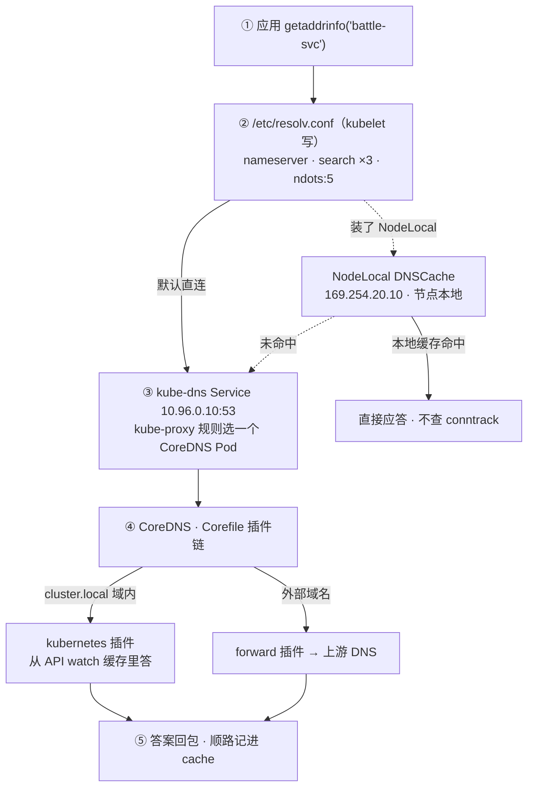
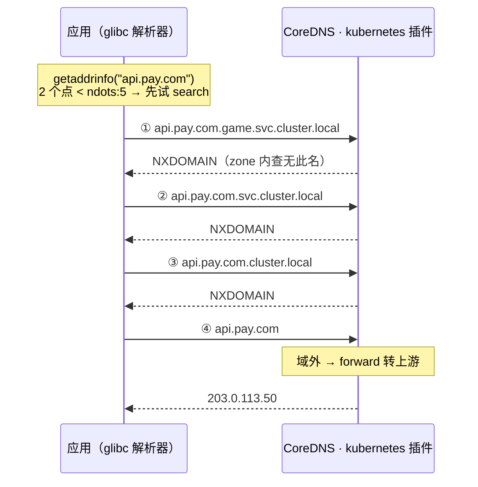
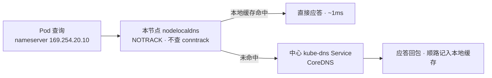
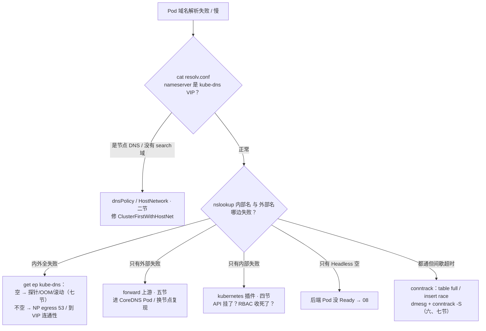

# CoreDNS

> 大家好。上一章讲完 VIP 怎么转到 Pod；这一章讲**名字怎么变成 VIP**——以及 CoreDNS CPU 飙满时为什么加副本越加越慢。
> 开讲之前，先带大家回到一个开服现场：大厅登录 P99 从 80ms 跳到 2s，报错全是「业务域名解析超时」；值班看 CoreDNS CPU 飙满，第一反应是加 10 个副本——越加越慢；群里又有人喊「重启逻辑服」，一重启，全场域名解析抖成一片。
> 这一章讲完，你会知道这两个人各自错在哪——ndots 垃圾查询为什么扩副本治不了，以及 CoreDNS 挂了为什么第一刀绝不是重启业务。
> **本章回答的问题**：一次 `svc.cluster.local` 解析的一生——resolv.conf 从哪来、查询怎么到 CoreDNS、Corefile 插件链怎么答、外部域名怎么出门；NodeLocal DNSCache 为什么必要；CoreDNS 挂了/慢了的影响面，扩缩容与监控怎么做。
> **本章不讲**：VIP 怎么转到 Pod、iptables vs IPVS → [08](../08-Service与kube-proxy/)；Pod IP 从哪来、NetworkPolicy 写法 → [10](../10-CNI与网络策略/)；公网权威 DNS / CDN → [01-15](../../01-基础底座/15-DNS与CDN/)；conntrack 深机制 → [01-17](../../01-基础底座/17-iptables与conntrack/)；Cilium 替 kube-proxy 后的 DNS → [25](../25-eBPF与Cilium/)。

**标记**：🎯重点 · 🔥难点 · ⭐常考 · 🔧实操

**怎么听这场分享**：第一节是解析主图；二到四节顺着出生 → VIP → 插件链；五、六节讲 ndots 放大坑和 NodeLocal——开篇「越加越慢」的根在这儿；七、八节讲生死与供养；第九节定责。

---

## 一、一张图：一次解析的一生

> 🎯 **一句话**：一次查询要过四关——resolv.conf 决定问谁、VIP 上路、插件链分工、答案出门；排障先问卡在哪一关。



**读图**：从 ① 进——先看 ② 的 resolv.conf 决定「问谁、怎么补全」；NodeLocal 是可选的节点本地捷径，未命中仍回中心；插件链按**域**分工，内部名问 kubernetes 插件、外部名走 forward 出门。值班三件工具各照一段：进 Pod 看 resolv.conf 照 ②，`kubectl get ep` 照 ③，日志和 `:9153` 指标照 ④。

口诀先埋：⭐ **名挂、IP 通 = DNS 指纹；加副本治不了 ndots 垃圾**。好，从查号簿出生讲起。

本节对应练习题 Q1。

---

## 二、出生：Pod 里的 resolv.conf 从哪来

> 🎯 **一句话**：`/etc/resolv.conf` 是 **kubelet 在创建 Pod 时写进去的**，不是镜像自带的——三个字段各有来头。

**resolv.conf** = 应用的「查号簿」，告诉解析器三件事：**问谁**（nameserver）、**短名怎么补全**（search）、**几个点才算全名**（ndots）。进任意业务 Pod 看一眼：

```bash
kubectl exec hall-pod-xxx -n game -- cat /etc/resolv.conf
```

```text
nameserver 10.96.0.10                                    # ← kube-dns Service 的 ClusterIP（kubelet --cluster-dns）
search game.svc.cluster.local svc.cluster.local cluster.local   # ← 三截 search 域（按 Pod 所在 ns 拼）
options ndots:5                                          # ← 默认 5：少于 5 个点的名字先走 search 补全
```

三个字段的出生证：

- **nameserver** ← kubelet 启动参数 `--cluster-dns`，指向 kube-dns Service 的 ClusterIP。
- **search** ← `--cluster-domain`（默认 `cluster.local`）+ Pod 的 namespace，固定拼出三截：`<ns>.svc.<domain>`、`svc.<domain>`、`<domain>`。
- **ndots** ← kubelet 默认写 `ndots:5`。

**ndots（no-dots threshold）** 的规则：名字里的点数 **< ndots**，先把 search 域**逐个**拼上去试，全失败才按原名查；点数 **≥ ndots**，先按原名查，失败再试 search。

> 💡 **打个比方**：公司内线电话簿有「自动补全部门」功能——你说「找小王」，总机按「你所在部门 → 全公司」逐截补全试一遍（search）。默认规则是「头衔不超过 5 段的人一律先当内部员工找」，结果外部客户 `api.pay.com`（才 2 段）也被当成内部员工，先查三遍内部分机表——这就是五节的放大坑。

**为什么默认是 5？** 为了**集群内优先**：集群里最常用的短名（`battle-svc` 0 个点、`battle-svc.game` 1 个点）都小于 5，先走 search 才能被补全成 FQDN。代价是外网域名（通常 2~3 个点）也被卷进 search——这个副作用就是本章最高频的事故源。

### dnsPolicy 与 dnsConfig：谁能改写出生证 ⭐

不是所有 Pod 都拿同一份 resolv.conf，**dnsPolicy** 决定模板：

| 策略 | 谁用 | 效果 |
|------|------|------|
| `ClusterFirst`（默认） | 普通 Pod | 走集群 DNS：nameserver 是 kube-dns VIP |
| `ClusterFirstWithHostNet` | `hostNetwork: true` 还想用集群 DNS | **必须显式写**，否则继承节点 DNS |
| `Default` | 想跟节点走的 | 继承节点 resolv.conf，集群短名解析不了 |
| `None` | 完全自定义 | 一切看 `dnsConfig`，漏写 nameserver 直接没 DNS |

两个高频坑：

- **hostNetwork 的 Pod**：dnsPolicy 是默认 `ClusterFirst` 也**不走集群 DNS**——kubelet 对 hostNetwork Pod 的默认行为是继承节点配置，resolv.conf 里是节点 DNS（如 `10.0.0.2`），没有 cluster search 域，短名 `battle-svc` 全废。**看起来像 CoreDNS 挂了，其实查询根本没打到 kube-dns**。修法：`dnsPolicy: ClusterFirstWithHostNet`。
- **dnsPolicy: None 自己写 8.8.8.8**：集群短名立刻全废，还绕开了你对 CoreDNS 的容量与监控。要自定义就写完整 `dnsConfig`（nameserver + search + options 一起给）。

**dnsConfig** 是补丁不是重写：在 dnsPolicy 生成的基础上**合并覆盖**，最常用的就是降 ndots：

```yaml
dnsConfig:
  options:
  - name: ndots
    value: "2"        # ← 只对这一个 Deployment 生效，治外网域名放大（五节）
```

除了 ndots，dnsConfig 还能补 nameservers 和 search 域（比如把 `company.internal` 直接写进 search）——记住它是**逐 Pod 的补丁**，不是集群默认值，推广要靠逐个改工作负载。

> ⚠️ **别混**：resolv.conf 决定「**问谁、怎么补全**」（客户端侧，每个 Pod 可以不一样），CoreDNS 决定「**怎么回答**」（服务端侧，全集群一份）。HostNetwork 短名全废是前者出了错——查询压根没到 CoreDNS，去重启 CoreDNS 白忙。

> 🔍 **现场**：任何「这个 Pod 解析怪怪的」，第一刀永远是进 Pod 看出生证。

```bash
kubectl exec battle-pod-xxx -n game -- cat /etc/resolv.conf
# nameserver 10.0.0.2        ← 不是 10.96.0.10：这是节点 DNS，查 dnsPolicy / hostNetwork
# search ec2.internal        ← 没有 *.svc.cluster.local：集群短名必废
```

**改 cluster domain 是无成本开关吗？** 不是。`--cluster-domain` 同时写进每个 Pod 的 search 和 kubernetes 插件的 zone，改它意味着：所有硬编码 `*.svc.cluster.local` 的探针/脚本/服务网格配置要审计、写了旧域名 SAN 的证书会校验失败、**已运行的 Pod 的 search 还是旧的**（要滚动重建才更新）——滚动窗口里同一条短名时好时坏，像「DNS 抖」。生产默认不要动 `cluster.local`。

查号簿写好了。查询怎么到 CoreDNS？中间隔着一个 Service。

本节对应练习题 Q2。

---

## 三、出门：kube-dns Service 与 kube-proxy

> 🎯 **一句话**：查询从 Pod 到 CoreDNS 中间隔着一个 Service——**VIP 有没有后端（Endpoints）**，是名字生死的第一道闸。

大家想想：CoreDNS Pod 显示 Running，全集群名字却挂了——可能吗？可能。Running ≠ 在 Endpoints 里。

三个角色先立住，后面全章都挂在这条链上：

- **resolv.conf**：应用问谁、search 怎么补、ndots 几（二节）。
- **kube-dns Service**：一个 ClusterIP（常见 `10.96.0.10`，service CIDR 里靠前的一位）+ 53 端口，是全体 Pod 的「名字服务门牌」。
- **CoreDNS**：`kube-system` 里的 Deployment（默认 2 副本），真正干活的进程。

**为什么 Service 叫 kube-dns 而进程叫 CoreDNS？** 历史兼容：集群 DNS 最早由 kube-dns 组件实现，1.11 起默认换成 CoreDNS，但 Service 名沿用 `kube-dns` 不改名，免得全生态的配置一起改。排障时靠 `k8s-app=kube-dns` 这个 label 找 CoreDNS Pod。

> ⚠️ **别混**：`kubectl get pod -n kube-system` 看到 CoreDNS **Running ≠ 查询有后端**。kube-proxy 只把 **Ready** 的 Pod 写进 kube-dns 的 Endpoints；探针失败、OOM、滚动太猛都会把 Endpoints 摘空——VIP 还在，规则还在，但打到 `10.96.0.10:53` 的每个包都没有接收者，**全集群名字一起死**。这条机制和 [08](../08-Service与kube-proxy/) 里业务 Service 的 readiness 失败完全同源。

**查询在路上走的是 UDP**：DNS 一问一答报文小，UDP 免握手；响应超过 512 字节被截断时才回退 TCP。所以节点上 53/UDP 的畅通比 53/TCP 更要命——NetworkPolicy、conntrack 的问题也几乎都出在 UDP 这条路上（六、七节）。这个 Service 开着三个端口：`dns` 53/UDP、`dns-tcp` 53/TCP、`metrics` 9153——NP 放行时三个一起放，优先级 UDP > TCP。

> ⚠️ **别混**：上 NetworkPolicy 第一天的最高频事故就是 DNS——default-deny 把 Pod **出站**到 `kube-system:53` 的 UDP 切了，现象是「名挂、IP 仍通」。放行要写在 **egress**（解析是 Pod 主动往外问），只放行 Ingress 入站没用；很多环境 TCP 53 也要一起放。策略写法细节 → [10](../10-CNI与网络策略/)。

> 🔍 **现场**：全集群名字失败，第一刀永远是看后端名单。

```bash
kubectl -n kube-system get ep kube-dns
# ENDPOINTS
# 10.244.1.5:53,10.244.2.8:53   ← 健康：两个 CoreDNS Pod 在册
# <none>                        ← P0：VIP 没后端，全集群名字已死
```

口诀：⭐ **Running ≠ 有后端；全集群名字死先看 kube-dns Endpoints**。包打到 CoreDNS 了，插件链怎么答？

本节对应练习题 Q3、Q13。

---

## 四、应答：Corefile 插件链

> 🎯 **一句话**：CoreDNS 是「插件链服务器」——**Corefile** 声明监听哪个域，域内由 kubernetes 插件答，域外由 forward 送出门，cache 顺手记账，loop 防自己转晕。

**Corefile** = CoreDNS 的配置文件，存在 ConfigMap `kube-system/coredns` 里。kubeadm 的默认长相：

```text
.:53 {                                        # ← server 块：「.」匹配所有域名，监听 53 端口
    errors                                    # ← 错误写日志
    health {
       lameduck 5s                            # ← 优雅退出：摘流后再撑 5s，滚动不抖
    }
    ready                                     # ← readiness 端点 :8181，决定进不进 Endpoints
    kubernetes cluster.local in-addr.arpa ip6.arpa {   # ← kubernetes 插件管的 zone
       pods insecure
       fallthrough in-addr.arpa ip6.arpa      # ← 只有反解查不到时才放行给下一个插件
       ttl 30
    }
    prometheus :9153                          # ← 指标出口（八节监控）
    forward . /etc/resolv.conf {              # ← 域外查询转给上游：节点 resolv.conf 里的 DNS
      max_concurrent 1000
    }
    cache 30                                  # ← 应答缓存 30s，内外都记
    loop                                      # ← 启动自检：发现「转发给自己」就拒起
    reload                                    # ← 监视 Corefile 变化热加载
    loadbalance                               # ← 轮转 A 记录顺序，避免客户端总连第一个
}
```

想接公司内网域，再加一个 server 块（**StubDomain**，把特定域钉给指定上游）：

```text
company.internal:53 {
    errors
    cache 30
    forward . 10.0.0.53                       # ← 内网域直达内网 DNS，别绕公网一圈再回来
}
```

### 执行顺序：编译期定死，不是书写顺序 🔥⭐

**插件的执行顺序是编译期固定的**（CoreDNS 源码里的 `plugin.cfg` 顺序），Corefile 里写成什么顺序都不影响执行。大致链条：`errors → health → ready → … → cache → … → kubernetes → … → loop → forward`。两个关键位置记住：

- **cache 在 kubernetes 和 forward 之前**——所以内部名和外部名的应答都会被它缓存；
- **loop 紧挨在 forward 前面**——专职拦截「转发给自己」。

**loop（环路检测）** 干什么：CoreDNS 启动时给自己发一条测试查询，如果这条查询被 forward 转了一圈又回到自己，说明配置成了环（典型成因：节点的 `/etc/resolv.conf` 里 nameserver 写的就是 kube-dns VIP，`forward . /etc/resolv.conf` 等于转给自己）——loop 发现后**直接拒绝启动**，Pod 表现为 CrashLoopBackOff。这是保护，不是故障：去改上游配置，别删 loop。

### kubernetes 插件：内部名的答案从哪来 🔥⭐

**kubernetes 插件**只回答 `cluster.local`（及反解）这个 zone 里的问题。它的答案**不是每次查 etcd**：启动后用 ServiceAccount **watch API Server**，把 Service / EndpointSlice 的状态维护在内存里，查询直接答内存。于是有两条依赖链：

- **API Server 挂了**：内存里的旧答案还能撑（记录 TTL 默认 30s），**新建的 Service、刚扩出来的后端**查不到；
- **RBAC 收太死**：CoreDNS 的 ServiceAccount 没权限 watch——进程 Running，**管内名全变 NXDOMAIN**。排障不要只盯 53 端口。

同一个 zone 里，不同 Service 类型答案完全不同：

| 对比 | ClusterIP Service | Headless Service（`clusterIP: None`） |
|------|-------------------|----------------------------------------|
| A 记录 | **一条 = VIP**，后续交给 kube-proxy 转发（[08](../08-Service与kube-proxy/)） | **多条 = 每个 Ready Pod 的 IP**，客户端自己挑后端 |
| 典型用户 | 无状态服务（大厅调战斗） | Kafka / etcd / StatefulSet——客户端必须认「是哪一个实例」 |
| 空了先查谁 | kube-dns Endpoints（本节） | **后端 Pod 是否 Ready**（08），不是先骂 CoreDNS |

StatefulSet 还多一条专属记录：`mysql-0.mysql.game.svc.cluster.local` → 固定指向那一个 Pod，Kafka/数据库找 ordinal 全靠它，这也是它们必须用 Headless 的原因。

**zone 内查无此名 = 直接 NXDOMAIN**，不会漏给上游——注意上面 `fallthrough` 只对 `in-addr.arpa ip6.arpa` 两个**反解** zone 开放。这条规则正是五节放大坑的机制基础：`api.pay.com.game.svc.cluster.local` 落在 `cluster.local` zone 里，kubernetes 插件干脆利落地回 NXDOMAIN，客户端只好拿下一个 search 域再来一遍。

**还有一类记录容易被忽略**：**Pod A 记录**——`10-244-1-15.game.pod.cluster.local` 指向该 Pod 的 IP（Corefile 里 `pods insecure` 即「不做身份校验也给答」）。游戏场景几乎没人用它，但面试会问：`cluster.local` 这个 zone 里同时住着 svc 记录和 pod 记录。

### cache 插件：30 秒的记忆

`cache 30` 把应答按名字记 30 秒（以记录自身 TTL 为上限）：重复查询不出 CoreDNS，API 和上游都少挨打。代价对称——**TTL 拉长会让切换变钝**：Headless 后端换了、故障摘流了，缓存里的旧 IP 还活着，客户端继续连死掉的实例。默认 30s 对多数游戏场景刚好；**不要把 cache 拉到几分钟当容量方案**。

> 🔍 **现场**：怀疑「应用拿到的是旧答案」，用 dig 直接打 CoreDNS 看 TTL，别只信应用侧一次失败。

```bash
kubectl run netshoot --image=nicolaka/netshoot -it --rm -- sh
dig @10.96.0.10 mysql.game.svc.cluster.local +noall +answer
# mysql.game.svc.cluster.local.  27  IN  A  10.244.1.15   # ← TTL 还剩 27s：这条答案来自 cache
# mysql.game.svc.cluster.local.  27  IN  A  10.244.2.22   # ← 两条 A = Headless，客户端自选后端
```

### 收束：一次查询凭什么被答出来

把本节的零件收成一张图——**一条查询进 `.:53` 之后**：


**读图**：从「一条查询」进——先过 cache（所以重复查询便宜），域内由 kubernetes 插件用内存答（所以**不依赖每次访问 API**），域外经 loop 体检后由 forward 出门。prometheus/errors 是旁路记账，不在应答路径上。

**可背清单（四句）**：

1. **内部名不出 CoreDNS**——kubernetes 插件答 API watch 缓存，不逐次查 etcd；
2. **外部名必出 CoreDNS**——forward 转上游，`/etc/resolv.conf` 是默认上游；
3. **cache 在两者前面**——内外应答都缓存 30s，拉长挡故障切换；
4. **loop 只在启动时出手**——转发给自己 = 拒起，是保护不是故障。

> ⚠️ **别混**：「插件链能答」≠「什么名字都能答」。域内没记录 = NXDOMAIN（不会漏给上游）；域外答得对不对取决于上游；Corefile 改完还要确认生效（八节）。

> 📝 **面试**：问「CoreDNS 内部结构」，按「**域内 / 域外 / 缓存 / 自保护**」四组讲：kubernetes 管内名（watch API）、forward 送外名、cache 30s、loop 防环。补一句「执行顺序编译期固定，与 Corefile 书写顺序无关」，直接高一档。

口诀：⭐ **域内 kubernetes / 域外 forward / cache 30s / loop 防环；顺序与书写无关**。开篇「越加越慢」——根在外部短名的放大坑。

本节对应练习题 Q4、Q5、Q6。

---

## 五、出门：外部域名解析与 ndots 放大坑

> 🎯 **一句话**：外网域名本身一次就能答，是 **ndots:5 + 三截 search** 让它先白查三遍集群域——一次查询放大成四次。⭐🔥

大家先算一笔账：`api.pay.com` 只有 2 个点，ndots 默认 5——它会先查几次集群域？很多人答「1 次」——错了，是 3 次白查 + 1 次真查。

外网域名的正常链路很短：`api.pay.com` 不在 `cluster.local` zone → cache 未命中 → forward 把查询转给上游（节点 resolv.conf 里的 DNS，通常是 VPC/内网 DNS）→ 应答回包。问题不在这条链，而在**客户端出门之前**——二节的 ndots 规则：`api.pay.com` 只有 2 个点 < 5，glibc 先拿三截 search 域逐个拼接试查：



**读图**：①~③ 三次白查全部由 kubernetes 插件回 NXDOMAIN（它们都落在 `cluster.local` zone 里，见四节），第 ④ 次才轮到 forward 出门。**放大倍数有公式**：`(search 域数 + 1) × 地址族数`——默认 3 截 search、只查 A 是 **4 次**；解析器若同时查 A + AAAA（双栈，glibc 按 AF_UNSPEC 会都查），还要 **×2 = 8 次**。

> 💡 **打个比方**：寄快递写「api.pay.com」没写「国际件」，分拣员先按本市、本省、全国三本地址簿各翻一遍，最后才按真实地址发——业务只寄一件，邮局干了四件的活。连接池每建一条新连接都解析一次，开服/活动扩容瞬间，这几倍的活全砸在 CoreDNS 头上。

> 🔍 **现场**：支付/账号类外部域名慢、CoreDNS CPU 高，先在业务 Pod 里看查询链。

```bash
kubectl exec hall-pod-xxx -n game -- nslookup api.pay.com
# Server:    10.96.0.10
# ** server can't find api.pay.com.game.svc.cluster.local: NXDOMAIN   # ← 白查 1
# ** server can't find api.pay.com.svc.cluster.local: NXDOMAIN        # ← 白查 2
# ** server can't find api.pay.com.cluster.local: NXDOMAIN            # ← 白查 3
# Name:      api.pay.com
# Address:   203.0.113.50                                             # ← 第 4 次才是真的
```

```bash
kubectl logs -n kube-system -l k8s-app=kube-dns --tail=200 | grep -c NXDOMAIN
# 176   # ← NXDOMAIN 占比极高 = 垃圾查询在烧 CPU（配合八节的四层分诊）
```

**修法按治本到治标**：

1. **配置写绝对名**：`api.pay.com.`——末尾那个点表示「已是 FQDN」，直接跳过 search，1 次查询；
2. **给 Pod 降 ndots**：`dnsConfig.options: ndots:2`（二节）——外部域名 2 个点 ≥ 2，跳过 search；集群内短名不受影响（0、1 个点照样走 search）；
3. **治标**：扩 CoreDNS 副本 + NodeLocal DNSCache——能扛住放大后的 QPS，但**垃圾查询一个没少**。

修完的回检标准：CoreDNS 日志里 `*.cluster.local` 的 NXDOMAIN 明显下降。

> ⚠️ **别混**：NodeLocal DNSCache **不能替代改 ndots**——垃圾查询被缓存在节点之后**仍是垃圾查询**，只是不再跨节点、不再打中心；放大倍数一分没减。六节展开。

> 📝 **面试**：「ndots:5 下 `api.pay.com` 会先 NXDOMAIN 三遍集群域，共 4 次查询，双栈再翻倍。治本用 FQDN 末尾加点或 Pod 设 ndots:2，扩副本和 NodeLocal 只是治标。」——这段能原话背下来就是满分口径。

口诀：⭐ **治本改 ndots/FQDN，扩副本和 NodeLocal 只是治标**。治标也有用——下一节讲 NodeLocal 治什么、不治什么。

本节对应练习题 Q7。

---

## 六、本地化：NodeLocal DNSCache 为什么必要

> 🎯 **一句话**：跨节点 UDP 查中心 CoreDNS 又慢又脆——把缓存和监听搬到每个节点，查询不出网卡、不查 conntrack。

**两个痛点催生了它**：

1. **路径脆**：默认每个 Pod 的查询都要跨节点打到中心 VIP，路上经过 kube-proxy 规则和 **conntrack**（内核的连接记账表，每个 UDP 会话都要插一条）。高 QPS 下 conntrack 表会被打满（`table full`）；更阴的是 **conntrack UDP insert race**——glibc/musl 解析器把 A 和 AAAA 两条查询**并行**发出，两条包共用同一个源 socket（同一五元组），几乎同时到达时**并发插入 conntrack 表会撞车，只有一条能插入成功，另一条直接被丢**。丢包的那条查询只能干等 `timeout`（glibc 默认 5s）后重试——表现为「解析偶发慢 5 秒」，CoreDNS 日志里却一切正常。
2. **中心忙**：全集群查询挤一份 Deployment，扩容永远追着业务跑。

> 💡 **打个比方**：小区只有一道门岗，登记簿一次只能写一行——两个快递员拿着**同一个收件地址**同时挤到窗口（A 和 AAAA 共用五元组），门岗刚写完一行，第二行和第一行打架，其中一个包裹被扔出门外，只能等 5 分钟（timeout）再送一次。NodeLocal 相当于给每栋楼装了自己的收发室，包裹根本不用过门岗。

**NodeLocal DNSCache**（进程名 **nodelocaldns**，本质是每个节点上一份 CoreDNS）以 DaemonSet 跑在每台节点，监听 **169.254.20.10**——这是 IANA 保留的**链路本地地址段**（169.254.0.0/16），只在本网段有效、和任何 Pod/Service 网段都不冲突，每个节点上都是同一个地址。它顺手做了三件事：

- **本地缓存**：命中的查询不出网卡，亚毫秒级返回；未命中才转中心 kube-dns Service；
- **iptables NOTRACK**：发往 169.254.20.10:53 的包被规则标记为不查连接表——**conntrack 表满和 insert race 两个病一起根除**；
- **降中心 QPS**：重复查询被节点吃掉，中心 CoreDNS 只收冷查询。



**读图**：查询先进本节点的 nodelocaldns——命中就地返回，这条路上没有跨节点、没有 conntrack；未命中才走老路去中心。装了它之后，Pod 的 resolv.conf 里 nameserver 会变成 `169.254.20.10`（kubelet 的 `--cluster-dns` 相应调整）——排障时看到这个名字别当成陌生地址。

> ⚠️ **别混**：NodeLocal ≠「CoreDNS 的替代品」也 ≠「扩容」——它是**节点缓存 + 本地捷径**，中心 CoreDNS 仍要 ≥2 副本守着冷查询；它也不治 ndots 放大（五节的别混）。**它治的是「路径脆 + 热查询多」，不是「查询总量垃圾」。**

缓解手段的完整清单也放这：`single-request-reopen`（resolv.conf options，让 A/AAAA 改用两个 socket 串行发，**只有 glibc 认，musl 会忽略**）、NodeLocal 的 NOTRACK、应用改用 TCP DNS。三者里只有 NodeLocal 同时顺带做了本地缓存。

> 🔍 **现场**：NodeLocal 自己也会有坏节点——它挂了，那台节点上的 Pod 就失去了捷径。

```bash
kubectl -n kube-system get ds nodelocaldns
# DESIRED   READY
# 3         3        # ← READY < DESIRED：缺的那台节点上，Pod 失去了本地捷径
```

> 📝 **面试**：「NodeLocal DNSCache 以 DaemonSet 在每节点监听链路本地地址 169.254.20.10，本地缓存命中的查询不出网卡，iptables NOTRACK 绕过 conntrack——同时解决跨节点 UDP 超时、conntrack 表满和 A/AAAA 并行查询的 insert race；但 ndots 垃圾查询不会因此变少，该改配置还得改。」

口诀：⭐ **NodeLocal 治路径脆与热查询，不治 ndots 垃圾**。那 CoreDNS 真挂了会怎样？开篇喊重启逻辑服的那位听好了。

本节对应练习题 Q9、Q10。

---

## 七、生死：CoreDNS 挂了/慢了的影响面

> 🎯 **一句话**：CoreDNS 挂 = **名字断、已知 IP 还通**——已建立的长连接照常跑，所以第一反应绝不是重启业务。⭐

**挂了会发生什么**：DNS 只做一件事——把名字翻译成 IP。翻译停了，但**答案曾经给出的 IP 还有效**：

- 已解析过、拿着 IP 直连的客户端 → 不受影响；
- 已经建立的长连接（大厅↔战斗、连接池）→ 照常收发，跟 DNS 无关；
- **新连接如果还要解析名字** → 失败。游戏里最典型：开服/滚服时新实例互找、客户端重建连接、定时任务重连——这些才炸。

所以「CoreDNS 全部 NotReady」的正确动作是修 CoreDNS 本身，**不是重启逻辑服**——重启只会把还活着的长连接一起拆掉，把「名字断」扩大成「名字断 + 连接断」双重故障。

**「挂了」的三种具体死法**：

1. **Endpoints 被摘空**（最高频）：ready 探针失败、OOM、滚动时 maxUnavailable 太大 → `kubectl get pod` 看进程还 Running，VIP 却已无后端 → **全集群名字一起死**（三节）。
2. **控制面连带**：kubernetes 插件靠 watch API Server（四节）——API 挂了，旧缓存撑过记录 TTL 后，新 Service / 新后端全部解析失败。控制面故障时 DNS 症状是**果**，别在 CoreDNS 上找因。
3. **有人重启 CoreDNS**：滚动重启期间旧实例退出、新实例未 Ready 的窗口里，查询会抖；没有 PDB 又一把重启全部副本，等于自造一次全集群名字故障。**高峰期永远不要整批重启。**

**慢了会发生什么**：glibc 默认 `timeout:5 attempts:2`——一次查询等 5 秒没回音算失败，再重试。于是 CoreDNS 只要 P99 抬升（CPU 打满、conntrack 丢包重试、上游慢），应用侧看到的就是**每次建连凭空多 5 秒**，业务线程堆在 getaddrinfo 上，监控上像「业务卡死」，其实瓶颈在名字。辨别签名：**CoreDNS 侧 P99 20ms、应用侧超时 2s**——中间差的就是 search 次数 × 单次往返 + 重试等待，加副本填不平这段时间，要去五节修 ndots 或查 conntrack。

> 🔍 **现场**：「健康」要用对探针。只探 **TCP :53 通不通是不够的**——进程活着、插件卡死（连不上 API、死锁），TCP 端口照样接连接。认 `health`（:8080）和 `ready`（:8181）端点，跟 API Server 要用 `/readyz` 而不是端口探活是同一课（[03](../03-API-Server/)）。

> ⚠️ **别混**：**CoreDNS 挂了 ≠ 网络挂了**。网络层（CNI、kube-proxy 规则、conntrack）完好，`ping IP` 照通；现象只有「名字」这一层消失。反过来说，「名挂、IP 通」这个组合本身就是 DNS 问题的指纹（NP 切 53 也是这个指纹，三节）。

口诀：⭐ **名挂、IP 通 = DNS；别先重启业务**。打满了怎么扩？先分四层。

本节对应练习题 Q1、Q8。

---

## 八、供养：扩缩容与监控

> 🎯 **一句话**：CoreDNS「打满」先分四层——垃圾查询、有效 QPS、conntrack、Endpoints 被摘空——只有第二层才配扩容。🔥⭐

开篇那位加 10 个副本越加越慢——大家想想：如果 80% 查询都是 NXDOMAIN 垃圾，扩副本在干什么？在用更多 CPU 答垃圾。

**四层分诊**，各看各的签名：

| 你看到的 | 是哪一层 | 第一刀 |
|----------|----------|--------|
| CPU 高，日志大量 `*.cluster.local` NXDOMAIN | **垃圾查询**（ndots 放大，五节） | 改 FQDN 加点 / ndots:2，**不是加副本** |
| QPS 真高、NXDOMAIN 占比低 | **有效查询**（开服/扩容/短连接） | 扩副本 + HPA + NodeLocal |
| 偶发失败 + 5s 超时，dmesg 有 table full | **conntrack**（表满 / insert race，六节） | 调大 `nf_conntrack_max` + 上 NodeLocal |
| CoreDNS Running 但 `get ep` 是 `<none>` | **Endpoints 被摘空** | 查探针 / OOM / 滚动配置（七节） |

> 🔍 **现场** 🔧：分诊三板斧。

```bash
kubectl top pod -n kube-system -l k8s-app=kube-dns
# coredns-7d8f9b-aaa   890m   45Mi   # ← 两副本都逼近 limit：先分是垃圾还是有效查询

kubectl logs -n kube-system -l k8s-app=kube-dns --tail=200 | grep -c NXDOMAIN
# 176   # ← 200 行里 176 条 NXDOMAIN：垃圾查询主导

dmesg -T | grep -i conntrack | tail -1
# nf_conntrack: table full, dropping packet   # ← conntrack 表满，UDP DNS 先挨刀

conntrack -S | grep insert_failed
# insert_failed=4182   # ← 一直在涨：A/AAAA insert race 实锤（六节）
```

**扩缩容的标准姿势**：

- **底线**：副本 **≥2** + **podAntiAffinity**（两副本不同节点）+ requests/limits + **PDB**（`maxUnavailable: 1`）。PDB 对 CoreDNS 是保命符：探针失败或滚动太猛 = Endpoints 摘空 = 全集群名字死（三、七节）。
- **顺序**：先修 ndots（把垃圾流量掐掉），再谈扩容——否则扩出来的副本全在答垃圾查询。
- **HPA**：该挂，但指标要用**有效 QPS**（经 prometheus-adapter 引 `coredns_dns_requests_total`），或至少先确认 CPU 不是垃圾烧出来的。按 CPU 直接挂 HPA，等于给垃圾查询自动供血。
- **大规模**：有效 QPS 真压到中心扛不住，优先上 NodeLocal DNSCache 把热查询留在节点（六节），比无限堆中心副本便宜。

**监控**：CoreDNS 自带 `prometheus` 插件，`:9153` 出指标。值班和告警盯这五条：

```text
sum(rate(coredns_dns_requests_total[5m]))
    # ← 总 QPS；再按 zone 标签拆开，看 cluster.local 域是不是被垃圾顶起来的
sum(rate(coredns_dns_responses_total{rcode="NXDOMAIN"}[5m]))
  / sum(rate(coredns_dns_responses_total[5m]))
    # ← NXDOMAIN 占比：>50% 基本就是 ndots 垃圾（五节）
histogram_quantile(0.99,
  sum(rate(coredns_dns_request_duration_seconds_bucket[5m])) by (le))
    # ← 解析 P99：抬升先于业务超时出现
sum(rate(coredns_cache_hits_total[5m]))
  / sum(rate(coredns_cache_hits_total[5m]) + rate(coredns_cache_misses_total[5m]))
    # ← 缓存命中率：骤降说明查询模式变了或缓存被冲刷
sum(coredns_panics_total)
    # ← 非 0 即告警：CoreDNS 自己崩过
sum(rate(coredns_forward_requests_total[5m]))
    # ← 出门到上游的量：偏高且外网解析慢时，先怀疑上游 DNS 而不是 CoreDNS
```

**改配置的安全姿势**：Corefile 改动（哪怕 ConfigMap 里有 `reload` 插件热加载）都**别默认它已生效**——热加载有延迟，监听地址这类变更根本不热生效。标准动作是 `kubectl -n kube-system rollout restart deploy/coredns`，且 PDB 在位、`maxUnavailable` 要小，别自己把名字入口拆了。

容量参数还有一条常被忽略：requests 按有效 QPS 实测给，**limits 压太低会触发 CPU throttle——表现为解析整体变慢而不是报错**，比打满更难认。

口诀：⭐ **打满四层：垃圾 / 有效 QPS / conntrack / Endpoints——只有第二层才配扩容**。收作战定责。

本节对应练习题 Q11、Q12。

---

## 九、作战：定责

> 🎯 **一句话**：「解析失败」先问范围——全断看 Endpoints，偏科看插件链，间歇看 conntrack。



**读图**：第一刀先看 resolv.conf——排除「查询根本没到 CoreDNS」（二节那种）；再用内部名/外部名各打一发，把故障切到插件链的某一段（四节的分工就是分诊表）；间歇性超时单独走 conntrack 分支。每条分支的现象都是真的，按现象对号入座。

**现象 · 先做 · 别做**：

| 现象 | 先做 | 别做 |
|------|------|------|
| 集群名、外网名全失败 | CoreDNS Ready、Endpoints、NP egress 53 | 重启逻辑服 |
| 只有外网失败/慢 | 验 forward 上游、查 ndots 放大 | 先加 10 个副本 |
| Headless 没 A 记录 | 后端 Pod 是否 Ready（08） | 骂 CoreDNS 丢了答案 |
| 某 NS 短名失败 | resolv.conf search、dnsPolicy | 当全集群 DNS 挂了 |
| 间歇失败 + 5s 超时 | conntrack insert race / 表满，NodeLocal | 只盯 CoreDNS CPU |
| 应用超时 2s、CoreDNS P99 20ms | 查 search 次数（ndots）与上游 RTT | 加副本填这段时间 |
| 名挂、IP 通，刚上 NP | egress 放行 kube-system:53（10） | 以为 CoreDNS 被策略杀了 |
| 改完 Corefile 没生效 | `rollout restart` + 看日志确认 | 反复 apply ConfigMap 干等 |
| 高峰想重启 CoreDNS | PDB + 单副本轮转，先扩容再滚 | 一把全重启 |
| 有人改了 cluster domain | 审计硬编码后缀/证书 SAN，全量滚动 | 当无成本开关 |

**60 秒剧本** 🔧：

```text
① 0–10s   定范围：kubectl -n kube-system get ep kube-dns
          <none> = P0，立刻看 CoreDNS Pod 的 Ready / OOM / 探针
② 10–30s  进报障 Pod：cat /etc/resolv.conf（二节）
          + nslookup kubernetes.default（内）与一个外网域名（外），定「内坏 / 外坏 / 全坏」
③ 30–45s  CoreDNS 侧：日志 NXDOMAIN 占比、:9153 的 QPS 与 P99（八节）
          节点 dmesg | grep conntrack，conntrack -S 看 insert_failed
④ 45–60s  定责：ndots 垃圾 → 改配置；上游慢 → 验 forward；Endpoints 空 → 探针 / PDB；
          insert race → 上 NodeLocal。先别重启任何还活着的东西。
```

现在再看开篇两个人——加 10 个副本、重启逻辑服——你知道该怎么拦住他们了。收口。

本节对应练习题 Q14。

---

## 十、收口

> 🎯 **一句话**：命令、锚点、易错、数字——四件套是合上书要带走的东西。

### 命令速查 🔧

```bash
# 名字生死第一刀：后端在不在
kubectl -n kube-system get ep kube-dns                 # ← <none> = 全集群名字死
# 查出生证
kubectl exec {pod} -- cat /etc/resolv.conf             # ← nameserver / search / ndots
# 验管内 / 管外
kubectl exec {pod} -- nslookup kubernetes.default      # ← 管内：kubernetes 插件 + API + RBAC
kubectl exec {pod} -- nslookup api.pay.com             # ← 管外：forward 上游；顺路看 search 白查几遍
# dig 直打，绕开 search 补全
kubectl run netshoot --image=nicolaka/netshoot -it --rm -- \
  dig @10.96.0.10 battle-svc.game.svc.cluster.local +short
# 垃圾占比 / 指标 / 节点侧
kubectl logs -n kube-system -l k8s-app=kube-dns --tail=200 | grep -c NXDOMAIN
kubectl top pod -n kube-system -l k8s-app=kube-dns
dmesg -T | grep -i conntrack; conntrack -S             # ← table full / insert_failed 在涨吗
# Corefile 改完，滚动确认生效
kubectl -n kube-system rollout restart deploy/coredns && kubectl -n kube-system rollout status deploy/coredns
```

### 面试锚点

遮住右列自问自答，卡壳的行回去重读对应小节——能讲出来才算会，看着答案点头不算。

| 问 | 30 秒答 |
|----|---------|
| 集群内一次解析怎么走？ | resolv.conf（kubelet 写）→ kube-dns VIP → CoreDNS 插件链：内部名 kubernetes 插件答内存缓存，外部名 forward 出门。 |
| CoreDNS 挂了，业务会怎样？ | 名字断、已知 IP 还通、长连接照常；新连接要解析名字才炸。别重启逻辑服，先看 kube-dns Endpoints。 |
| resolv.conf 从哪来？ | kubelet 创建 Pod 时写：nameserver=kube-dns VIP、search=三截域、ndots:5；dnsPolicy/dnsConfig 可改。 |
| ndots:5 为什么放大？ | 点数小于 5 先逐截 search 试：外网短名白查 3 遍 + 真查 1 遍 = 4 次，双栈 ×2。治本：FQDN 加点或 ndots:2。 |
| Corefile 插件各管什么？ | kubernetes 管内名（watch API）、forward 送外名、cache 记 30s、loop 防转发给自己。 |
| 插件顺序按书写顺序？ | 不是，编译期固定；cache 在 kubernetes/forward 之前，loop 紧贴 forward 前。 |
| ClusterIP 和 Headless 答案？ | 一条 VIP vs 一串 Ready Pod IP；STS 还有 pod 专属记录，Kafka 靠它认实例。 |
| NodeLocal DNSCache 为什么必要？ | 节点本地缓存 + 169.254.20.10 监听 + NOTRACK 绕 conntrack：治跨节点超时、表满、insert race；不治 ndots 垃圾。 |
| conntrack insert race 是什么？ | A/AAAA 并行共用一个五元组，并发插表撞车丢一条 → 等满 5s 重试；single-request-reopen / NodeLocal 治。 |
| Endpoints 空会怎样？ | VIP 规则没后端，全集群名字一起死；Running ≠ 在册，看 `get ep`。 |
| kubernetes 插件依赖什么？ | watch API Server + RBAC；API 挂撑缓存，RBAC 死 → 管内名 NXDOMAIN。 |
| DNS 打满怎么扩？ | 先修 ndots 再扩容；≥2 副本 + 反亲和 + PDB；HPA 按有效 QPS；大头用 NodeLocal。 |
| 监控看什么？ | :9153：requests_total、duration P99、cache 命中率、NXDOMAIN 占比、panics。 |
| cache 拉长当容量方案？ | 不行：Headless/故障切换变钝，且挡不住 ndots 放大。 |
| HostNetwork 短名全废？ | 默认继承节点 DNS，要显式 `ClusterFirstWithHostNet`。 |
| 上 NP 后 DNS 挂？ | egress 没放行 kube-system:53（UDP，常加 TCP）；名挂、IP 通是指纹。 |
| 改 cluster domain 的代价？ | 硬编码后缀、证书 SAN、存量 Pod search 全要审计 + 全量滚动，生产别动。 |
| single-request-reopen 是什么？ | resolv.conf options，让 A/AAAA 改用两个 socket 串行发，治 conntrack insert race；只 glibc 认，musl 忽略。 |
| CoreDNS 答内部名要查 etcd？ | 不查。kubernetes 插件 watch API Server 维护内存缓存，查询答内存；API 挂了撑缓存 TTL，新建 Service 才查不到。 |

### 易错一句话对照

- CoreDNS 挂了 = 网络挂了 → 名字断而已，已知 IP 与长连接还在
- 外网域名慢先加副本 → 先看 NXDOMAIN 占比，ndots 治本、扩容治标
- NodeLocal 能替代改 ndots → 垃圾查询缓存后仍是垃圾，放大一分没减
- 进程 Running = 服务可用 → Endpoints 在册才算；RBAC / API 也决定能不能答
- 插件执行顺序 = Corefile 书写顺序 → 编译期固定
- Headless 也回一条 VIP → 回一串 Ready Pod IP，客户端自选
- HostNetwork 默认走集群 DNS → 要显式 `ClusterFirstWithHostNet`
- apply ConfigMap 就等于生效 → 要 `rollout restart` 并确认
- 探活只看 TCP :53 → 插件卡死端口照样通，认 ready/health 端点
- 上 NP 放行入站就行 → 解析是 **egress** :53
- cache 拉到 5 分钟当容量方案 → 切换变钝，还挡不住放大
- 改 cluster domain 无成本 → 硬编码 / SAN / 存量 search 一起炸
- kubernetes 插件每次查 etcd → watch API 维护内存缓存，不逐次查
- single-request-reopen 各平台通用 → 只 glibc 认，musl 忽略
- CoreDNS 扩副本能让查询变快 → 垃圾查询不因副本变少，先治 ndots

### 数字墙

> kube-dns VIP 常见 **10.96.0.10** · 端口 **53**（UDP 主、TCP 兜底）· ndots 默认 **5** · search 默认 **3** 截 · 一次外网短名 A 查询 **4** 次（3 白查 + 1 真查），双栈 **×2** · cache / k8s ttl 默认 **30s** · NodeLocal 监听 **169.254.20.10** · health **:8080** / ready **:8181** / 指标 **:9153** · glibc 默认 **timeout:5 attempts:2** · 副本 **≥2** + PDB

---

## 合上书

合上书自检（题号对齐练习题）：

1. **默画一节主图**：resolv.conf → kube-dns VIP → 插件链（内问 kubernetes / 外走 forward）→ 答案，NodeLocal 这条捷径画在哪。（Q1）
2. **口述出生**：resolv.conf 谁写的、三个字段各从哪来、ndots 默认 5 的用意与副作用。（Q2）
3. **口述出门**：Service 为什么叫 kube-dns、Endpoints 摘空会发生什么、查询走 UDP 为什么更要命。（Q3、Q13）
4. **默画插件链收束图**：cache / kubernetes / loop / forward 的位置与分工，背出四句清单；说清插件顺序为什么与书写无关。（Q4、Q5、Q6）
5. **口述外域与放大**：`api.pay.com` 在 ndots:5 下放大成几次、公式是什么、两个治本修法。（Q7）
6. **口述本地化**：NodeLocal DNSCache 治什么（表满 / insert race / 热查询）、不治什么（ndots 垃圾）、凭什么地址监听。（Q9、Q10）
7. **口述生死**：CoreDNS 挂了哪些会断哪些不断、为什么别重启逻辑服、慢了为什么表现为 5 秒级超时。（Q1、Q8）
8. **口述供养**：打满四层各看什么签名、HPA 为什么要按有效 QPS、监控五条指标。（Q11、Q12）
9. **定责**：全断 / 偏科（内坏、外坏、Headless 空）/ 间歇超时，各走决策树哪条分支、第一刀敲什么。（Q8、Q14）

九条都能不看稿讲下来，这一章就过了。终极测试：拦住开篇那两个误操作——加副本治 ndots、重启逻辑服。下一章：[10 CNI与网络策略](../10-CNI与网络策略/)——Pod IP 从哪来，以及为什么上 NP 第一天要先放行 53。
