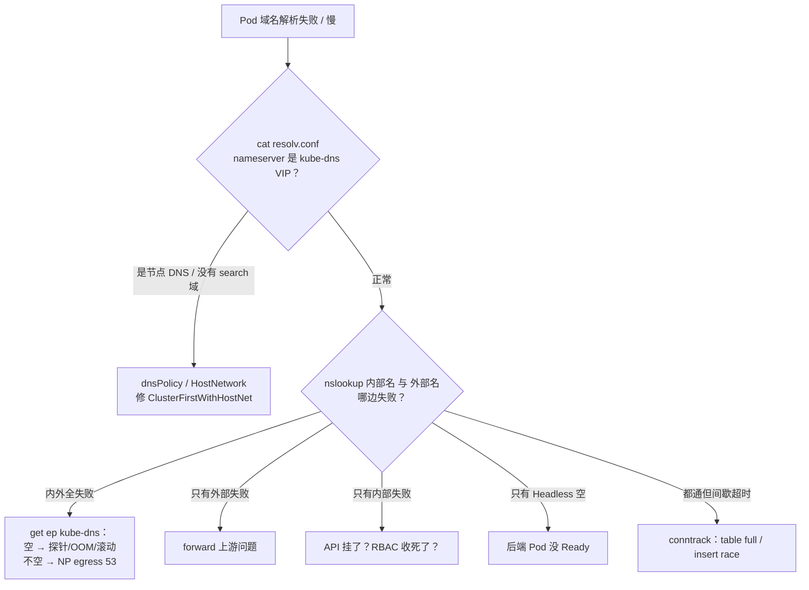
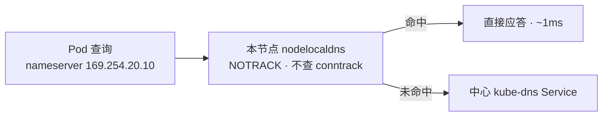

# 09｜CoreDNS · 练习题

先合上知识点，对着 **一节的主图** 把「一次解析的一生」口述一遍，再来做题。

| 标记 | 含义 |
|------|------|
| **核心** | 不懂整章就没建立起来 |
| **必会** | 值班和面试都要能讲 |
| **常用** | 线上会反复碰到 |
| **常考** | 白板和追问的高频口径 |

## 本题目录

- [Q1 一次解析的完整链路](#q1)
- [Q2 resolv.conf 从哪来](#q2)
- [Q3 Running 但全集群名字死](#q3)
- [Q4 Corefile 插件分工](#q4)
- [Q5 插件顺序与 loop](#q5)
- [Q6 ClusterIP vs Headless](#q6)
- [Q7 ndots 放大](#q7)
- [Q8 解析失败怎么定责](#q8)
- [Q9 NodeLocal DNSCache](#q9)
- [Q10 偶发 5 秒超时](#q10)
- [Q11 CoreDNS 打满怎么办](#q11)
- [Q12 监控与配置变更](#q12)
- [Q13 上 NP 第一天 DNS 挂](#q13)
- [Q14 60 秒 DNS 定责](#q14)
- [合上书](#合上书)

---

## Q1

**★★★★★｜「从一个 Pod 解析 svc.cluster.local 开始，把整条链路讲一遍。如果 CoreDNS 全挂了，业务会怎样？」**

**覆盖**：核心 · 必会 · 常考 ｜ **对应**：知识点 [一、一张图：一次解析的一生](知识点.md)、[七、生死：CoreDNS 挂了/慢了的影响面](知识点.md)

### 场景

开服秒进高峰，`kube-system` 里 CoreDNS 全部 NotReady，群里有人说「网络挂了，重启逻辑服」。大厅到战斗一直用 Service 短名，支付走 `api.pay.com`——名字断了，IP 直连支付网关却是通的。

### 完整解答

> 🎯 **一句话**：链路四关——resolv.conf → kube-dns VIP → 插件链 → 应答；挂了的只是「名字」，已知 IP 与长连接照常。

**链路**：

1. **出生**：kubelet 创建 Pod 时写 `/etc/resolv.conf`——`nameserver` 是 kube-dns Service 的 ClusterIP（常见 `10.96.0.10`），`search` 三截（`<ns>.svc.cluster.local svc.cluster.local cluster.local`），`ndots:5`。
2. **上路**：glibc 按规则补全名字后，向 `10.96.0.10:53` 发 **UDP** 查询；kube-proxy 规则选中一个 Ready 的 CoreDNS Pod。
3. **应答**：`battle-svc.game.svc.cluster.local` 落在 `cluster.local` zone，**kubernetes 插件**从 watch API 的内存缓存里答出 VIP；外部域名则由 **forward** 转给上游。应答顺路记进 `cache 30`。
4. **影响面**：DNS 只翻译名字。CoreDNS 全挂时——已解析出的 IP 仍有效，**长连接照常收发**；只有「还要解析名字的新连接」失败。所以正确动作是修 CoreDNS，**不是重启逻辑服**——重启等于把幸存的长连接也拆了。

```bash
kubectl -n kube-system get ep kube-dns
# ENDPOINTS
# <none>     # ← 全集群名字已死：先修 CoreDNS，别碰业务
```

> ⚠️ **别混**：CoreDNS 挂了 ≠ 网络挂了——CNI、kube-proxy 规则都在，`ping IP` 照通。「名挂、IP 通」本身就是 DNS 问题的指纹。

> 📝 **面试**：「resolv.conf 由 kubelet 写，查询走 UDP 到 kube-dns VIP，插件链按域分工——内部名 kubernetes 插件答内存缓存，外部名 forward 出门。CoreDNS 挂 = 名字断，已知 IP 和长连接不受影响，所以别先重启业务。」

### 再追问

- **只有外网域名失败、内部名正常，查哪一段？** 查 forward 的上游（节点 resolv.conf 指向的 DNS）——进 CoreDNS Pod 或换节点复现；**不要**顺手重启 CoreDNS，内部链路是好的。
- **全部 NotReady，第一动作是加副本吗？** 不是。先看**为什么** NotReady（ready 探针、OOM、资源不足）——原因不解决，加进来的副本一样被摘出 Endpoints。

---

## Q2

**★★★★☆｜「Pod 里的 /etc/resolv.conf 是谁写的？为什么 hostNetwork 的 Pod 解析不了集群短名？」**

**覆盖**：必会 · 常考 ｜ **对应**：知识点 [二、出生：Pod 里的 resolv.conf 从哪来](知识点.md)

### 场景

开发把网关 Pod 改成 `hostNetwork: true` 后，`battle-svc` 解析全挂。他怀疑 CoreDNS 坏了，准备重启 CoreDNS「试试」。

### 完整解答

> 🎯 **一句话**：resolv.conf 是 **kubelet 创建 Pod 时写的**；hostNetwork Pod 默认继承节点 DNS，查询根本没打到 kube-dns。

三个字段各有来头：`nameserver` ← kubelet `--cluster-dns`（kube-dns VIP）；`search` ← `--cluster-domain` + namespace 拼出三截；`ndots` ← 默认 5。**dnsPolicy** 决定模板：默认 `ClusterFirst` 走集群 DNS；`Default` 继承节点；`None` 全看 `dnsConfig`；而 **hostNetwork Pod 即使 dnsPolicy 是默认的 `ClusterFirst` 也继承节点配置**——必须显式写 `ClusterFirstWithHostNet`。

```bash
kubectl exec gateway-pod-xxx -n game -- cat /etc/resolv.conf
# nameserver 10.0.0.2      # ← 节点 DNS，不是 10.96.0.10：查询没进集群
# search ec2.internal      # ← 没有 *.svc.cluster.local：短名必废
```

修法：`dnsPolicy: ClusterFirstWithHostNet`。去重启 CoreDNS 是白忙——服务端一切正常，错在客户端的出生证。

> ⚠️ **别混**：resolv.conf 管「问谁、怎么补全」（客户端侧，逐 Pod 可不同），CoreDNS 管「怎么回答」（服务端侧，全集群一份）。

### 再追问

- **`dnsPolicy: None` 有什么坑？** 一切以 `dnsConfig` 为准，漏写 nameserver 直接没 DNS；只写个 `8.8.8.8` 则集群短名全废还绕开了监控。**不要**拿 None 当「换个公共 DNS」的捷径。
- **有人想把 cluster domain 从 cluster.local 改掉，成本是什么？** 硬编码 `*.svc.cluster.local` 的探针/脚本要审计、证书 SAN 会失败、**存量 Pod 的 search 还是旧域**要全量滚动——滚动窗口里短名时好时坏。**不要**当无成本开关，生产默认不动。

---

## Q3

**★★★★★｜「kubectl get pod 显示 CoreDNS 是 Running，为什么全集群名字解析还是失败了？」**

**覆盖**：核心 · 必会 ｜ **对应**：知识点 [三、出门：kube-dns Service 与 kube-proxy](知识点.md)

### 场景

值班看到 `kube-system` 里两个 CoreDNS Pod 都 Running，判断「DNS 进程没毛病」，准备让业务自查代码。

### 完整解答

> 🎯 **一句话**：**Running ≠ 在 Endpoints 里**——VIP 没有后端，全集群名字一起死。

kube-proxy 只把 **Ready** 的 Pod 写进 kube-dns Service 的 Endpoints。三种情况会让进程活着但被摘出去：ready 探针失败、OOM 边缘、滚动更新 `maxUnavailable` 太大。此时 VIP `10.96.0.10` 还在、iptables 规则还在，但每个打到 53 的包都没有接收者。

```bash
kubectl -n kube-system get ep kube-dns
# ENDPOINTS
# <none>     # ← P0：Running 的进程一个没进后端名单

kubectl -n kube-system describe pod -l k8s-app=kube-dns | grep -A3 -i readiness
# Readiness probe failed: ...   # ← 常见死因之一；另查 OOMKilled / limits
```

还有半个坑：**探活只探 TCP :53 是不够的**。进程活着但插件卡死（连不上 API、死锁）时，TCP 端口照样接连接。认 `health`（:8080）和 `ready`（:8181）端点。

> ⚠️ **别混**：「进程活着」和「Service 有后端」是两件事——前者看 `get pod`，后者看 `get ep`，排障看后者。

### 再追问

- **Endpoints 正常、内外网名字全断，下一步查哪？** 查 Pod 到 VIP 的路：NetworkPolicy egress 是否放行 `kube-system:53`（UDP 优先，TCP 也加）；**不要**继续盯 CoreDNS 进程。
- **滚动重启 CoreDNS 怎么不出事？** PDB（`maxUnavailable: 1`）+ 小步滚动，高峰别整批；**不要**一把 `rollout restart` 又同时把两副本都逼到未 Ready。

---

## Q4

**★★★★☆｜「Corefile 里 kubernetes、forward、cache、loop 各干什么？kubernetes 插件的答案从哪来？」**

**覆盖**：必会 · 常考 ｜ **对应**：知识点 [四、应答：Corefile 插件链](知识点.md)

### 场景

新人编辑 `kube-system/coredns` ConfigMap，把插件块的书写顺序调了调，认为「这样执行顺序就变了」；又把 `forward . /etc/resolv.conf` 注释掉想「省一跳」。

### 完整解答

> 🎯 **一句话**：内部名归 kubernetes、外部名 forward 送出门、cache 记账 30s、loop 防转给自己——答案来自 watch API 的内存，不是每次查 etcd。

- **kubernetes 插件**：只管 `cluster.local`（与反解区）。启动后用 ServiceAccount **watch API Server**，把 Service / EndpointSlice 维护在内存，查询直接答内存。于是两条依赖链：**API 挂** → 旧缓存撑过 TTL（默认 30s），新 Service / 新后端查不到；**RBAC 收太死** → 进程 Running、管内名全 NXDOMAIN。zone 内查无此名 = 直接 NXDOMAIN（`fallthrough` 只对反解区开放）。
- **forward**：域外查询转上游，`/etc/resolv.conf` 是默认上游——注释掉它，所有外网域名解析直接死。
- **cache 30**：内外应答都缓存 30s，重复查询不出进程。
- **loop**：启动自检，发现转发给自己就拒绝启动（保护，不是故障）。

> 📝 **面试**：按「域内 / 域外 / 缓存 / 自保护」四组背——kubernetes 管内名（watch API）、forward 送外名、cache 30s、loop 防环；补一句「执行顺序编译期固定」，高一档。

### 再追问

- **CoreDNS Running，但集群内域名全变 NXDOMAIN、外网正常，查什么？** 查 kubernetes 插件的两条依赖：与 API Server 的连通性、ServiceAccount 的 **RBAC**；**不要**只在 53 端口抓包，抓到的只会是一排正常的 NXDOMAIN 应答。
- **Corefile 里多了一段 `company.internal:53 { forward . 10.0.0.53 }`，是什么？** StubDomain——把公司内网域钉给指定内网 DNS，不绕公网；改这类配置同样要走 rollout（见 Q12）。

---

## Q5

**★★★☆☆｜「CoreDNS 插件的执行顺序是 Corefile 里的书写顺序吗？loop 插件是干什么的？」**

**覆盖**：常考 ｜ **对应**：知识点 [四、应答：Corefile 插件链](知识点.md)

### 场景

CoreDNS Pod 一直 CrashLoopBackOff，日志里 loop 报了转发环路。有人提议把 `loop` 从 Corefile 里删掉「就不报了」。

### 完整解答

> 🎯 **一句话**：执行顺序**编译期固定**（`plugin.cfg`），与书写顺序无关；loop 检出「转发给自己」就拒起——删掉它等于拆保护。

大致链条：`errors → health → ready → … → cache → … → kubernetes → … → loop → forward`。两个关键位置：**cache 在 kubernetes 和 forward 之前**（内外应答都被缓存）；**loop 紧贴 forward 之前**（专职拦截环路）。

**典型成环场景**：节点 `/etc/resolv.conf` 的 nameserver 写的是 kube-dns VIP，而 Corefile 是 `forward . /etc/resolv.conf`——forward 把查询转给自己。loop 在启动时用一条测试查询发现这件事，**直接拒绝启动**，表现为 CrashLoopBackOff。正确修法是改上游配置（节点 DNS 或 forward 目标），**不要**删 loop。

### 再追问

- **为什么 cache 要排在 kubernetes 之前？** 这样内部名和外部名的应答都能被缓存，重复查询不出进程；**不要**把「书写顺序靠前」当成「先执行」的理由去解释它。
- **怎么确认集群里 CoreDNS 的插件顺序？** `coredns -plugins` 列出编译进来的顺序；**不要**拿 Corefile 的书写顺序当执行顺序背书。

---

## Q6

**★★★★☆｜「ClusterIP Service 和 Headless Service 的 DNS 解析有什么区别？Kafka 是怎么找到 mysql-0 的？」**

**覆盖**：常考 · 必会 ｜ **对应**：知识点 [四、应答：Corefile 插件链](知识点.md)

### 场景

Kafka 客户端报连不上 broker。值班在业务 Pod 里 `nslookup kafka-svc` 得到一个 VIP，说「解析正常」，准备把锅甩给网络组。

### 完整解答

> 🎯 **一句话**：ClusterIP 答**一条 VIP**，Headless 答**一串 Ready Pod IP**——Kafka/STS 靠的是后者和 pod 专属记录。

| 对比 | ClusterIP | Headless（`clusterIP: None`） |
|------|-----------|-------------------------------|
| A 记录 | 一条 = VIP，后续交给 kube-proxy | 多条 = 每个 **Ready** Pod 的 IP |
| 典型用户 | 无状态服务 | Kafka / etcd / StatefulSet |
| 空了先查谁 | kube-dns Endpoints | 后端 Pod 是否 Ready |

StatefulSet 另有专属记录：`mysql-0.mysql.game.svc.cluster.local` 固定指向那一个 Pod——Kafka、数据库找 ordinal 全靠它，这也是它们必须 Headless 的原因。

```bash
dig @10.96.0.10 kafka.game.svc.cluster.local +short
# 10.244.1.15   # ← Headless：每个 Ready broker 一条 A，客户端自选
# 10.244.2.22
```

**Headless 解析为空时，先查后端 Pod 是否 Ready**（readiness 是 [08](../08-Service与kube-proxy/) 的事），不是先骂 CoreDNS 丢了答案。

### 再追问

- **为什么 StatefulSet 必须配 Headless？** 客户端要认「连的是哪一个实例」（broker-0 还是 broker-1），VIP 轮转给不了这个语义；**不要**给有状态集群套 ClusterIP。
- **Headless 会把流量导给挂掉的实例吗？** 不会——只有 Ready 的 Pod IP 进答案；所以「拿到死 IP」更可能是应用侧**缓存了旧答案**（cache/客户端 TTL），先验当前 dig 结果。

---

## Q7

**★★★★★｜「为什么解析一个外网域名会先 NXDOMAIN 好几次？ndots:5 会把一次查询放大成几次？」**

**覆盖**：核心 · 必会 · 常考 ｜ **对应**：知识点 [五、出门：外部域名解析与 ndots 放大坑](知识点.md)

### 场景

开服高峰，支付域 `api.pay.com` 解析超时，CoreDNS CPU 打满。值班第一反应：扩 10 个副本。

### 完整解答

> 🎯 **一句话**：`api.pay.com` 只有 2 个点 < ndots:5，先把三截 search 域各白查一遍——**4 次查询**（3 次 NXDOMAIN + 1 次真查），双栈再 ×2。

glibc 的补全顺序：点数 < ndots → 逐截拼 search 试。`api.pay.com.game.svc.cluster.local`、`api.pay.com.svc.cluster.local`、`api.pay.com.cluster.local` 都落在 `cluster.local` zone，kubernetes 插件各回一次 NXDOMAIN；第四次 `api.pay.com` 才由 forward 转上游。**公式**：`(search 域数 + 1) × 地址族数`——默认 3 截、只查 A = 4 次；glibc 同时查 A + AAAA 则 ×2 = 8 次。连接池每建一新连接解析一次，放大量全砸在 CoreDNS 头上。

```bash
kubectl exec hall-pod-xxx -n game -- nslookup api.pay.com
# ** server can't find api.pay.com.game.svc.cluster.local: NXDOMAIN   # ← 白查 1
# ** server can't find api.pay.com.svc.cluster.local: NXDOMAIN        # ← 白查 2
# ** server can't find api.pay.com.cluster.local: NXDOMAIN            # ← 白查 3
# Address:   203.0.113.50                                             # ← 第 4 次才是真的
```

**修法按治本到治标**：① 配置写 `api.pay.com.`（末尾加点，跳过 search）；② Pod 加 `dnsConfig` 降 `ndots:2`（外部名跳过，集群短名不受影响）；③ 扩副本 + NodeLocal 只是扛住放大后的 QPS，垃圾一个没少。

> ⚠️ **别混**：先加副本是最常见的误操作——垃圾查询占比不降，扩多少副本都在答垃圾。

> 📝 **面试**：「2 个点小于 ndots:5，先 NXDOMAIN 三遍集群域，共 4 次查询，双栈翻倍。治本：FQDN 末尾加点或 Pod 设 ndots:2；扩容和 NodeLocal 只是治标。」

### 再追问

- **改成 ndots:2 会不会伤集群内短名？** 不会——`battle-svc`（0 点）、`battle-svc.game`（1 点）都 < 2，照样走 search 补全；**不要**为了外网域名把 search 域删掉。
- **怎么验证修复生效？** CoreDNS 日志 / `:9153` 里 `*.cluster.local` 的 NXDOMAIN 占比明显下降；**不要**只看 CPU 一次回落就结案。

---

## Q8

**★★★★☆｜「业务报『域名解析失败』，你怎么一层层定位？」**

**覆盖**：必会 · 常考 ｜ **对应**：知识点 [九、作战：定责](知识点.md)

### 场景

三个业务同时报障：有的说内部域名解析不了，有的说外网域名，有的说全断。值班想发一个统一通告「DNS 故障，等待修复」。

### 完整解答

> 🎯 **一句话**：先问范围——**全断看 Endpoints，偏科看插件链，间歇看 conntrack**。



**读图**：第一刀先看出生证，排除「查询根本没到 CoreDNS」（hostNetwork / dnsPolicy）；再用内部名、外部名各打一发，把故障切到插件链的某一段；间歇超时单独走 conntrack 分支。三种现象三个修法，**不要**用一个动作覆盖所有报障。

**60 秒剧本**：0–10s `get ep kube-dns`（`<none>` = P0）；10–30s 进报障 Pod 看 resolv.conf + 内外各 `nslookup` 一发；30–45s 看 CoreDNS 日志 NXDOMAIN 占比、`:9153` 指标、节点 `dmesg | grep conntrack`；45–60s 定责——垃圾改配置、上游验 forward、Endpoints 空查探针/PDB、insert race 上 NodeLocal。

### 再追问

- **一切解析都通，但间歇超时 5 秒，查什么？** 查节点侧：`conntrack -S` 的 `insert_failed`、`dmesg` 的 `table full`（A/AAAA insert race，见 Q10）；**不要**重启 CoreDNS——重启制造新的抖动窗口。
- **只有某一个 namespace 的短名失败呢？** 看该 Pod 的 search 域和 dnsPolicy/dnsConfig 是否被改过；**不要**当全集群 DNS 故障处理。

---

## Q9

**★★★★☆｜「NodeLocal DNSCache 解决什么问题？它能替代改 ndots 吗？」**

**覆盖**：必会 · 常考 ｜ **对应**：知识点 [六、本地化：NodeLocal DNSCache 为什么必要](知识点.md)

### 场景

扩容后 CoreDNS CPU 降下来了，但业务仍偶发「解析慢」。有人提议再扩一倍副本；另一人说「上个 NodeLocal 就全解决了，ndots 不用改」。

### 完整解答

> 🎯 **一句话**：它把缓存和监听搬到节点——治**跨节点 UDP 脆、conntrack 表满、insert race**；但**不治 ndots 垃圾**。

**NodeLocal DNSCache**（进程 **nodelocaldns**）以 DaemonSet 跑在每节点，监听 **169.254.20.10**（链路本地地址段 169.254.0.0/16，不与任何 Pod/Service 网段冲突）。三件事：本地缓存命中的查询不出网卡；发往该地址的包被 **iptables NOTRACK** 标记为不查连接表——conntrack 表满和 A/AAAA 并发插表撞车（insert race）一起根除；中心 CoreDNS 只收冷查询，QPS 大降。



**读图**：命中就地返回，路上没有跨节点、没有 conntrack；未命中才走老路去中心。

它**不能替代改 ndots**：垃圾查询缓存在节点之后仍是垃圾查询，放大倍数一分没减；它也**不是扩容的替代**——中心 CoreDNS 仍要 ≥2 副本守冷查询。

> 📝 **面试**：「DaemonSet 每节点监听 169.254.20.10，本地缓存 + NOTRACK 绕 conntrack，解决跨节点 UDP 超时、表满、insert race；ndots 垃圾查询不会因此变少，该改配置还得改。」

### 再追问

- **装了 NodeLocal 后，Pod 的 resolv.conf 有什么变化？** nameserver 变成 `169.254.20.10`——排障看到它别当陌生地址；**不要**按「有人篡改了 DNS 配置」处理。
- **某节点的 nodelocaldns 进程崩了会怎样？** DaemonSet 拉起前的窗口里，该节点 Pod 发往 169.254.20.10 的查询会丢——要盯 DaemonSet 的存活，**不要**以为「反正有中心兜底」就放任不管。

---

## Q10

**★★★☆☆｜「解析偶发超时 5 秒然后自己好了，CoreDNS 日志却很干净——可能发生了什么？」**

**覆盖**：常考 · 必会 ｜ **对应**：知识点 [六、本地化：NodeLocal DNSCache 为什么必要](知识点.md)、[七、生死：CoreDNS 挂了/慢了的影响面](知识点.md)

### 场景

业务报「偶发解析超时」，值班看 CoreDNS 的 QPS、P99、错误率全绿，判定「DNS 没问题，业务自己查代码」。

### 完整解答

> 🎯 **一句话**：大概率是 **conntrack UDP insert race**——A/AAAA 并行查询共用五元组，并发插表撞车丢一条，等满 5s 重试。

glibc/musl 解析器默认把 A 和 AAAA **并行**发出，两条包共用同一个源 socket（同一五元组）。几乎同时到达节点时，并发往 conntrack 表里插入会冲突：**只有一条插入成功，另一条被丢**。丢的那条查询收不到应答，等到 `timeout`（glibc 默认 5s）才重试——现象就是「偶发慢 5 秒」，而 CoreDNS 侧只看到一条正常查询，日志自然干净。表满（`nf_conntrack: table full`）是同一族的另一个病。

```bash
conntrack -S | grep insert_failed
# insert_failed=4182    # ← 一直涨：insert race 实锤
dmesg -T | grep -i conntrack
# nf_conntrack: table full, dropping packet   # ← 表满：调大 nf_conntrack_max
```

**治法**：上 NodeLocal DNSCache（NOTRACK 直接绕开，顺带本地缓存）；或 `options single-request-reopen`（A/AAAA 改两个 socket 串行——**只有 glibc 认，musl 忽略**）；或应用改 TCP DNS。

> ⚠️ **别混**：CoreDNS 日志干净 ≠ 链路干净——丢包发生在节点内核，不在 CoreDNS 进程里。

### 再追问

- **为什么加了 `single-request-reopen` 有的服务还是超时？** 看基础镜像：Alpine 这类 musl 系不认 options——**不要**假设 resolv.conf 选项全解析器通用，先确认 libc。
- **怎么区分是表满还是 insert race？** `dmesg` 有 `table full` = 表满（调 `nf_conntrack_max`）；只有 `insert_failed` 涨 = race；两者都可被 NodeLocal 一并解决。

---

## Q11

**★★★★★｜「CoreDNS CPU 打满，除了加副本你还能做什么？」**

**覆盖**：核心 · 必会 · 常考 ｜ **对应**：知识点 [八、供养：扩缩容与监控](知识点.md)

### 场景

活动期间 CoreDNS CPU 90%+，值班把副本从 2 扩到 12，CPU 还是高；正准备扩到 20。

### 完整解答

> 🎯 **一句话**：「打满」先分四层——垃圾查询、有效 QPS、conntrack、Endpoints 摘空——**只有第二层才配扩容**。

| 你看到的 | 是哪一层 | 第一刀 |
|----------|----------|--------|
| CPU 高 + 大量 `*.cluster.local` NXDOMAIN | 垃圾查询（ndots 放大） | 改 FQDN 加点 / ndots:2，**不是加副本** |
| QPS 真高、NXDOMAIN 占比低 | 有效查询 | 扩副本 + HPA + NodeLocal |
| 偶发失败 + 5s 超时、table full | conntrack | 调大 `nf_conntrack_max` + NodeLocal |
| Running 但 `get ep` = `<none>` | Endpoints 摘空 | 探针 / OOM / 滚动配置 |

```bash
kubectl logs -n kube-system -l k8s-app=kube-dns --tail=200 | grep -c NXDOMAIN
# 176   # ← 垃圾主导：扩到 20 个副本也是在答垃圾
```

**顺序**：先修 ndots 掐掉垃圾流量，再谈扩容。扩容的底线配置：副本 **≥2** + **podAntiAffinity**（不同节点）+ requests/limits + **PDB**（`maxUnavailable: 1`）。**HPA** 要挂**有效 QPS**（`coredns_dns_requests_total`），按 CPU 挂等于给垃圾查询自动供血。有效 QPS 真大时，优先上 NodeLocal 把热查询留在节点，比无限堆中心副本便宜。

> ⚠️ **别混**：副本数不是容量问题的万能解——四层里三层加副本无效甚至有害。

> 📝 **面试**：「先分垃圾还是有效查询：看 NXDOMAIN 占比。垃圾 → 治 ndots；有效 → ≥2 副本 + 反亲和 + PDB，HPA 按有效 QPS，大头用 NodeLocal。」

### 再追问

- **为什么不能直接按 CPU 挂 HPA？** 垃圾查询同样烧 CPU，HPA 会自动把副本喂给垃圾——先修 ndots，指标换有效 QPS；**不要**在垃圾流量上谈弹性。
- **PDB 对 CoreDNS 的意义是什么？** 滚动/探针失败时保证不会把 Endpoints 摘空——摘空 = 全集群名字死；**不要**为了「滚动快」把 maxUnavailable 设成副本总数。

---

## Q12

**★★★☆☆｜「CoreDNS 你们监控哪些指标？有人想把 cache 改成 300 秒降压，可行吗？」**

**覆盖**：常考 ｜ **对应**：知识点 [八、供养：扩缩容与监控](知识点.md)

### 场景

为了压低 CoreDNS QPS，有人把 `cache 30` 改成 `cache 300`，apply 了 ConfigMap 就准备下班；监控面板上只有 CPU 和内存两条曲线。

### 完整解答

> 🎯 **一句话**：盯 `:9153` 五条指标——QPS、NXDOMAIN 占比、P99、缓存命中率、panics；**cache 拉长不是容量方案**。

**五条指标**（prometheus 插件，`:9153`）：

```text
sum(rate(coredns_dns_requests_total[5m]))                    # ← 总 QPS，按 zone 拆开看
NXDOMAIN / 总应答（coredns_dns_responses_total{rcode}）        # ← >50% 基本是 ndots 垃圾
histogram_quantile(0.99, ...request_duration_seconds_bucket) # ← P99：先于业务超时抬升
coredns_cache_hits_total / (hits + misses)                   # ← 命中率骤降 = 查询模式变了
coredns_panics_total                                         # ← 非 0 即告警
```

**cache 改 300s 的问题**：Headless 后端切换、故障摘流后，旧 IP 会在缓存里多活 4 分半，客户端继续连死实例——**切换变钝**；而且它挡不住 ndots 放大（白查照样发生，只是白查也被缓存）。默认 30s 对多数游戏场景刚好。

**改 Corefile 的安全姿势**：`reload` 插件的热加载有延迟、监听类变更不热生效——标准动作是 `kubectl -n kube-system rollout restart deploy/coredns` + `rollout status` 确认，且 PDB 在位。**不要** apply 完 ConfigMap 就当已生效。

### 再追问

- **只有 CPU/内存监控会漏掉什么？** 漏掉「慢而活着」：P99 抬升、NXDOMAIN 垃圾、panics 都发生在 CPU 打满之前；**不要**拿资源指标当 DNS 健康度。
- **StubDomain（company.internal）也在这个 ConfigMap 里改吗？** 是——加一个独立 server 块 forward 给内网 DNS；同样要 rollout 确认，**不要**假设改完即生效。

---

## Q13

**★★★★☆｜「昨天上了默认拒绝的 NetworkPolicy，今天全业务报域名解析失败——怎么回事？」**

**覆盖**：必会 · 常考 ｜ **对应**：知识点 [三、出门：kube-dns Service 与 kube-proxy](知识点.md)

### 场景

安全团队昨晚应用 default-deny 策略，今早全业务报解析失败。值班看 CoreDNS 一切健康，怀疑业务代码同时坏了。

### 完整解答

> 🎯 **一句话**：Pod **出站**到 `kube-system:53` 的 UDP 被切了——名挂、IP 通，是 NP 挡 DNS 的指纹。

解析是 Pod **主动往外问**，流量方向是 egress；default-deny 没给 53 开口子，查询出不了 namespace。只放行 Ingress（入站）没用——那是挡别人进来，不是放自己出去。修法：给业务命名空间加 egress 放行到 `kube-system` 的 **53/UDP**（TCP 也一起放，防大包截断回退）：

```yaml
egress:
- to:
  - namespaceSelector:
      matchLabels:
        kubernetes.io/metadata.name: kube-system
  ports:
  - { port: 53, protocol: UDP }
  - { port: 53, protocol: TCP }
```

验证指纹：`ping <对端IP>` 通、`nslookup` 挂——网络层完好，只有名字这层死。策略写法与 default-deny 的完整姿势 → [10](../10-CNI与网络策略/)。

> ⚠️ **别混**：「名挂、IP 通」这个组合指向 53 端口被挡或 DNS 本身，**不是**「网络全断」——别把 CNI 也拖进来陪查。

### 再追问

- **怎么快速区分是 NP 还是 CoreDNS 的问题？** 从报障 Pod `dig @<CoreDNS Pod IP>`：打 Pod IP 通、打 VIP 不通 = 策略/规则层的事；**不要**看到解析失败就重启 CoreDNS。
- **为什么只放 UDP 53 可能不够？** 响应超 512 字节会截断回退 TCP——UDP+TCP 一起放；**不要**等截断事故出现再补。

---

## Q14

**★★★★★｜全集群解析失败、偶发 5s、只有某 NS 挂，60 秒怎么查？**

**覆盖**：核心 · 必会 ｜ **对应**：知识点 [八、解析失败怎么定责](知识点.md)

### 场景

开服后 `redis.prod` 全挂；偶发 5s 超时；上了 NP 第一天只有 `payment` NS 解析失败。

### 完整解答

> 🎯 **一句话**：全挂→CoreDNS/上游；5s→ndots/IPv6；单 NS→NP egress 53；先 `dig` 再改 Corefile。

```bash
kubectl run -it --rm dbg --image=busybox --restart=Never -- nslookup kubernetes.default
kubectl logs -n kube-system -l k8s-app=kube-dns --tail=30
kubectl get netpol -n payment
```

> ⚠️ **别混**：IP 通名字挂 → DNS 链（本章）；名字通连不上 → Service/CNI（08、10）。

### 再追问

NodeLocal DNSCache 解决什么？——降低 CoreDNS 抖动和 conntrack 压力；不是替代上游故障（Q9）。

---

## 合上书

- [ ] **默画一节主图**：resolv.conf → kube-dns VIP → 插件链（内问 kubernetes / 外走 forward）→ 答案，NodeLocal 这条捷径画在哪。
- [ ] **口述出生**：resolv.conf 谁写的、三个字段各从哪来、ndots 默认 5 的用意与副作用（Q2）。
- [ ] **口述出门**：Service 为什么叫 kube-dns、Endpoints 摘空会发生什么、查询走 UDP 为什么更要命（Q1、Q3、Q13）。
- [ ] **默画插件链收束图**：cache / kubernetes / loop / forward 的位置与分工，背出四句清单；说清插件顺序为什么与书写无关（Q4、Q5）。
- [ ] **口述外域与放大**：`api.pay.com` 在 ndots:5 下放大成几次、公式是什么、两个治本修法（Q7）。
- [ ] **口述本地化**：NodeLocal DNSCache 治什么（表满 / insert race / 热查询）、不治什么（ndots 垃圾）、凭什么地址监听（Q9、Q10）。
- [ ] **口述生死**：CoreDNS 挂了哪些会断哪些不断、为什么别重启逻辑服、慢了为什么表现为 5 秒级超时（Q1、Q10）。
- [ ] **口述供养**：打满四层各看什么签名、HPA 为什么要按有效 QPS、监控五条指标（Q11、Q12）。
- [ ] **定责**：全断 / 偏科（内坏、外坏、Headless 空）/ 间歇超时，各走决策树哪条分支、第一刀敲什么（Q8）。
