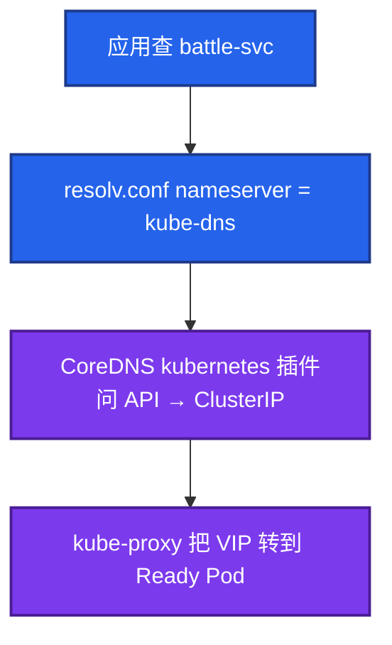

# 09｜CoreDNS · 练习题

先对照 [知识点](知识点.md) **本章主线** 自己口述，再对答案。每题标了覆盖范围：

| 标记 | 含义 |
|------|------|
| **核心** | 不懂整章就没建立起来 |
| **必会** | 值班和面试都要能讲 |
| **常用** | 线上会反复碰到 |
| **常考** | 白板和追问的高频口径 |

## 本题目录

- [Q1 解析链 / CoreDNS 挂了](#q1)
- [Q2 ndots 放大](#q2)
- [Q3 分层查](#q3)
- [Q4 CPU 打满](#q4)
- [Q5 ClusterIP vs Headless](#q5)
- [Q6 上 NP DNS 挂](#q6)
- [Q7 dnsPolicy / HostNetwork](#q7)
- [Q8 HPA / cache TTL](#q8)
- [Q9 Endpoints 空](#q9)
- [Q10 改 cluster domain](#q10)
- [合上书](#合上书)

---

## Q1

**★★★★★｜集群内 DNS 怎么走？CoreDNS 挂了，游戏服还能通吗？**

**覆盖**：核心 · 必会 · 常考
**对应**：知识点 §3.1 名字与解析链

### 场景

活动中 kube-system 里 CoreDNS 全部 NotReady。群里有人说「网络挂了，重启逻辑服」。大厅到战斗服一直用的是 Service 短名。

### 完整解答

**一句话**：CoreDNS 管名字翻译；Service 和内核规则还在时，已知 IP 通常还能通。



1. 同 NS 可写短名；跨 NS 写 `battle-svc.battle.svc.cluster.local`。
2. CoreDNS 负责 **翻译名字**。Service 对象还在、节点上 iptables/IPVS 还在，已经知道的 ClusterIP / Pod IP **还能通**。
3. 新连接如果还要解析名字 → 失败。已经用 IP 打上的长连接通常还在。
4. 不要为了「做点什么」去重启还活着的逻辑服。

DNS 给 VIP（或 Headless 的 Pod IP）；kube-proxy 把 VIP 变成后端 Pod。一个管名，一个管转发（08）。

### 再追问

- 控制面挂了管内名还能解析吗？——已缓存的能撑 TTL；新名字 / 过期后再查会失败。kubernetes 插件问 API。

---

## Q2

**★★★★★｜ndots:5 为什么让外网变慢？一次查询会放大成几次？怎么修？**

**覆盖**：核心 · 必会 · 常考
**对应**：知识点 §3.2 ndots

### 场景

支付 SDK 配置了 `api.pay.com`。大厅扩容后登录 P99 变差，CoreDNS CPU 打满。直连支付网关 IP 是通的。有人要再加 10 个 CoreDNS 副本。

### 完整解答

**一句话**：ndots:5 把外网短名放大成多次 cluster.local 查询——修 FQDN/ndots，不是先狂扩副本。

少于 5 个点先拼 search，外网短名会白查集群域：

```
应用一次 gethostbyname("api.pay.com")     2 个点 < 5

① api.pay.com.<ns>.svc.cluster.local     NXDOMAIN
② api.pay.com.svc.cluster.local
③ api.pay.com.cluster.local
④ api.pay.com                            才是真查询

= 1 次应用查询 → 4 次 DNS；连接池每个新连接再来一遍
```

这是查询放大，不是链路带宽不够。Java / 游戏 SDK 扫支付、账号最中招。

修，按治本到治标：① 配置改成 `api.pay.com.` ② Pod `ndots:2` ③ 再不够：扩 CoreDNS + 反亲和，或 NodeLocal DNSCache。修完应看到 `*.cluster.local` NXDOMAIN 下降。先加副本是在扩无效查询。

### 再追问

- NodeLocal DNS 能替代改 ndots 吗？——不能。垃圾查询缓存之后仍是垃圾，只是打到本机。ndots 治本，NodeLocal 治标。

---

## Q3

**★★★★★｜DNS 失败怎么分层查？不要一上来重启 CoreDNS。**

**覆盖**：核心 · 必会 · 常用
**对应**：知识点 §7 生产排障 · §6 命令

### 场景

「解析失败」工单。有的说全集群，有的说只有支付域名，有的说某个 NS。值班准备 rollout CoreDNS。

### 完整解答

**一句话**：DNS 失败先分层：全集群名 / 只有外网 / Headless 空 / 某 NS 短名。

| 现象 | 先看 |
|------|------|
| 集群名、外网名全失败 | CoreDNS Ready、Endpoints、到 :53 的网络 / NP |
| 只有外网失败 | forward 上游；进 CoreDNS Pod 里复现 |
| Headless 没 A 记录 | 后端 Pod 未 Ready（08） |
| 某 NS 短名失败 | search 域、dnsPolicy（HostNetwork 忘了 ClusterFirstWithHostNet） |
| 间歇失败 | ndots QPS、conntrack、cache TTL |

```bash
kubectl -n kube-system get deploy,ep -l k8s-app=kube-dns
kubectl exec -it <app> -- cat /etc/resolv.conf
kubectl exec -it <app> -- nslookup kubernetes.default
kubectl logs -n kube-system -l k8s-app=kube-dns --tail=50
```

应用超时 2s，CoreDNS P99 只有 20ms：瓶颈在 search 次数或上游 RTT，加副本填不满这段时间。

### 再追问

- 为什么不要只信应用侧一次失败？——用 `dig +norecurse` 打 CoreDNS 并看 TTL，分清是 resolver、search 还是上游。

---

## Q4

**★★★★★｜CoreDNS CPU 打满、偶发解析失败，一定是副本不够吗？**

**覆盖**：核心 · 必会 · 常用
**对应**：知识点 §3.3 DNS 打满 · §7 排障

### 场景

Grafana 上 CoreDNS CPU 90%，节点 dmesg 偶发 conntrack table full。业务 QPS 没明显上涨。HPA 已经把 CoreDNS 扩到 8 副本，失败率还在。

### 完整解答

**一句话**：CPU 打满可能是 ndots 垃圾查询、有效 QPS 或 conntrack，不一定是副本不够。

打满有四层，不要只看 Deployment replicas：

1. ndots 垃圾查询（`*.cluster.local` NXDOMAIN 占比高）→ 改 FQDN / ndots，不是继续扩。
2. UDP 短会话打满节点 conntrack → `nf_conntrack_count` 和 CoreDNS QPS 一起看，表现为 **偶发** 失败。
3. 有效查询真多 → 这才该扩 / NodeLocal / HPA。
4. ready 探针失败 → Endpoints 空 → 全集群名死。

HPA 按有效 QPS 才有意义。CoreDNS 要反亲和、limit 防 OOM、PDB。cache 默认 30s 通常够；不要用超长 TTL 当扩容替代。

### 再追问

- 为什么 PDB 对 CoreDNS 特别重要？——探针失败 = kube-dns Endpoints 变空 = 全集群不能解析。单副本或 maxUnavailable 过大，就是自己把名字入口拆了。

---

## Q5

**★★★★☆｜ClusterIP 和 Headless 的 A 记录差在哪？Kafka / STS 为什么用 Headless？**

**覆盖**：必会 · 常用 · 常考
**对应**：知识点 §3.1 ClusterIP vs Headless

### 场景

有人给 Kafka 建了普通 ClusterIP，客户端连上 VIP 被随机打到不同 broker，组元数据全乱。

### 完整解答

**一句话**：ClusterIP 回 VIP；Headless 回各 Ready Pod IP——Kafka/STS 客户端要认实例。

- ClusterIP：一条 A 记录 = VIP，kube-proxy 再把包分到后端。
- Headless：多条 A 记录 = 各 Ready Pod IP。STS 额外：`mysql-0.mysql.ns.svc.cluster.local` → 固定这一条。

要 kube-proxy 负载均衡（无状态 HTTP）用 ClusterIP。客户端必须认「哪一个实例」用 Headless。Headless 没记录先看后端 Ready，不是 CoreDNS 丢了答案。

cache 默认 30s。刚扩出来的 Pod，应用还可能解析到旧列表。不要把 TTL 拉到几分钟还指望秒级发现新副本。

### 再追问

- 玩家最终打的是 VIP 还是某个 Pod IP？——ClusterIP 场景打 VIP（08）。Headless 才是客户端自己选 Pod IP。

---

## Q6

**★★★★☆｜刚上 NetworkPolicy，全集群 DNS 挂了？**

**覆盖**：必会 · 常用 · 常考
**对应**：知识点 §3.4 dnsPolicy · §7 排障

### 场景

给 battle NS 加了 default-deny。下一分钟所有短名解析失败，IP ping 还通。有人说 CoreDNS 被策略杀掉了。

### 完整解答

**一句话**：上 NetworkPolicy 必须先放行 egress UDP/53，否则名挂、IP 仍通。

egress 默认拒绝后，Pod 出站 UDP/53 到 kube-system 也被切了。CoreDNS 进程可能还好好的。

```
battle Pod --UDP/53--> kube-dns 10.96.0.10
                         x  NP egress 没放行 → 解析全失败
ping Pod IP 仍通（不走 53）
```

上 NP 必须先放行 DNS（UDP 53，很多环境 TCP 53 也要），再收其它。Ingress 放行不够——查 DNS 是 **出站**。这是上 NP 第一天事故，见 10。本章答到「名挂、IP 通、先补 53」即可。

### 再追问

- 只放行 Ingress Controller 的入站，DNS 会好吗？——不会。解析是 Pod 主动问 kube-dns，走 egress。

---

## Q7

**★★★★☆｜dnsPolicy 有哪几种？HostNetwork 游戏服短名全废是哪一种？**

**覆盖**：必会 · 常用
**对应**：知识点 §3.4 dnsPolicy

### 场景

战斗服用 hostNetwork 降延迟。短名 `redis-svc` 全失败，节点上 `nslookup` 却能走公司 DNS。

### 完整解答

**一句话**：HostNetwork 默认不走集群 DNS，必须 `ClusterFirstWithHostNet` 才能解析短名。

| 策略 | 效果 |
|------|------|
| ClusterFirst | 默认，用集群 DNS |
| ClusterFirstWithHostNet | HostNetwork 仍用集群 DNS |
| Default | 继承节点 DNS |
| None | 全看 dnsConfig |

HostNetwork 默认不走 ClusterFirst。忘了 `ClusterFirstWithHostNet`，resolv.conf 指向节点 DNS，集群 search 域没有，短名全废。看起来像 CoreDNS 挂了，其实查询根本没打到 kube-dns。

`dnsPolicy=None` 自己写 8.8.8.8：集群短名会废，且绕过你对 CoreDNS 的 SLA。生产要自定义就写完整 dnsConfig，不要漏 nameserver。

### 再追问

- 进 Pod 一眼怎么确认？——`cat /etc/resolv.conf`，nameserver 是不是 `10.96.0.10`。

---

## Q8

**★★★★☆｜CoreDNS 该不该挂 HPA？cache 30s 要不要改长？**

**覆盖**：必会 · 常用
**对应**：知识点 §3.3 · §5 配置

### 场景

有人把 CoreDNS cache TTL 改成 5 分钟「减少查询」，同时挂了按 CPU 的 HPA。活动中切了一次 Headless 后端，客户端 5 分钟连旧 IP。

### 完整解答

**一句话**：先修 ndots 再挂 HPA；cache TTL 拉长会让 Headless 切换变钝，挡不住 ndots 放大。

该挂 HPA，但顺序是：先修 ndots → 再按有效 QPS/CPU 扩。否则 HPA 在扩垃圾查询。

- 短 TTL：切换快，CoreDNS 更忙
- 默认 30s：多数服务可接受
- 拉到几分钟：Headless / 故障切换变钝，挡不住 ndots 放大

反亲和、requests/limits、PDB 和 HPA 一起做。不要用超长缓存当容量方案。StubDomain：`company.internal` 转到内网 DNS，其余走默认 forward。改 Corefile 后 rollout Deployment。不要让公司域先出公网再绕回来。

### 再追问

- 改 Corefile 只 apply ConfigMap 够吗？——不够。要 rollout，进程不会自动重载所有插件状态。

---

## Q9

**★★★★☆｜kube-dns Endpoints 空了，但 CoreDNS 进程还在，会发生什么？**

**覆盖**：必会 · 常用 · 常考
**对应**：知识点 §7 生产排障 · §3.1

### 场景

ready 探针失败，Endpoints 被摘空。`kubectl get pod -n kube-system` 还能看到 CoreDNS Running。

### 完整解答

**一句话**：CoreDNS Running 但 Endpoints 空 = 全集群名字一起死，机制同业务 readiness 失败。

Running ≠ 进 Service。kube-proxy 没有后端，打到 10.96.0.10 的查询全部失败。**全集群名字一起死**，和业务 Deploy readiness 失败导致 Endpoints 空是同一条机制（08）。

止血：看探针为什么失败（配置、上游、OOM），不要先重启业务。护 CoreDNS 用 PDB，滚动时 maxUnavailable 要小。

只探 TCP :53 不够。进程在、插件卡住、kubernetes 插件连不上 API，TCP 仍通。用 ready/health 探针，和 API Server 要用 `/readyz` 是同一类教训（03）。

### 再追问

- RBAC 把 CoreDNS 的 SA 收太死会怎样？——Running、管内名 NXDOMAIN。排障不要只看 53 端口。

---

## Q10

**★★★★☆｜生产改了 cluster domain，哪些东西会一起炸？**

**覆盖**：常用 · 常考
**对应**：知识点 §5 核心配置

### 场景

有人觉得 `cluster.local` 不好听，改成 `game.local`。下一轮发布，证书校验和一批探活脚本全失败。

### 完整解答

**一句话**：改 cluster domain 是一次全集群配置审计 + 滚动，生产默认不要动。

自定义 cluster domain 能做，但不是无成本：

1. 所有硬编码 `*.svc.cluster.local` 的探针、脚本、Mesh 配置要改。
2. 证书 SAN 写了旧域名会校验失败。
3. 已跑着的 Pod 的 resolv.conf search 还是旧的，要滚动才会更新。

加分能讲到「改 domain = 一次全集群滚动 + 配置审计」，生产默认不要动。

IPv6 双栈：A / AAAA 都可能返回。应用只连 IPv4 却先拿到 AAAA，会多一次失败超时。深水不是本章。

### 再追问

- 新 Pod 的 search 是新的、旧 Pod 还是旧的，会怎样？——同一条短名在滚动窗口里表现不一致，像「DNS 抖」。

---

## 合上书

- [ ] 能画出应用 → resolv.conf → kube-dns → CoreDNS kubernetes / forward
- [ ] 能说出 CoreDNS 挂了：名字断、已知 IP 还通，不要重启逻辑服
- [ ] 能算出 ndots:5 把外网短名放大成 4 次，并按加点 → 降 ndots → NodeLocal 修
- [ ] 能按范围分层查：全集群名 / 只有外网 / Headless 空 / 某 NS 短名
- [ ] 能分打满四层：垃圾查询、有效 QPS、conntrack、Endpoints 被摘空
- [ ] 能讲 HostNetwork 要 ClusterFirstWithHostNet；上 NP 先放行 egress 53
