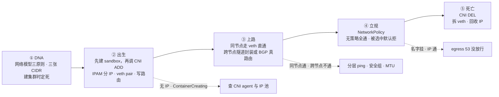
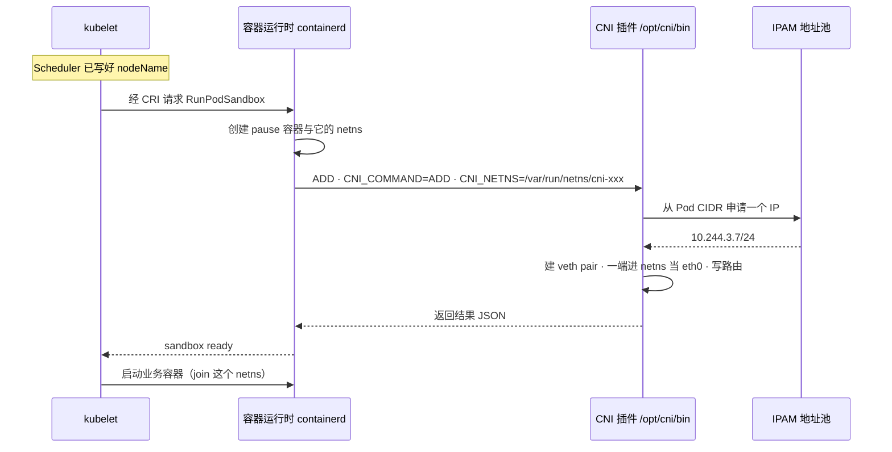
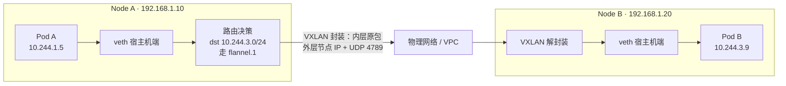
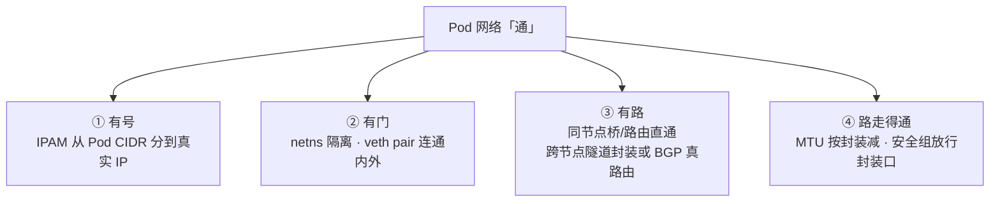
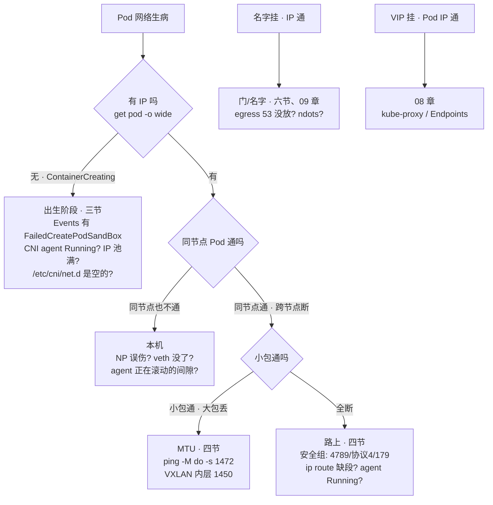

# CNI 与网络策略

> 大家好。上一章讲完名字怎么变成 VIP；这一章讲**Pod 自己那张网怎么生出来、怎么走路、怎么立规矩**——以及 sandbox 失败时为什么翻应用日志没用。
> 开讲之前，先带大家回到两个现场：战斗服扩容，新节点上的 Pod 全部卡在 ContainerCreating，Events 里刷着 `FailedCreatePodSandBox`，有人翻了半小时应用镜像日志——业务容器根本还没启动；另一边有人给 pay 命名空间上了 default-deny，全集群 `nslookup` 秒挂、ping IP 却通，有人已经在准备重启 CoreDNS。
> 这一章讲完，你会知道这两个人各自错在哪——没 IP 为什么第一刀永远是 CNI/IP 池，以及名字挂、IP 通为什么先补 egress 53、别动 CoreDNS。
> **本章回答的问题**：一个 Pod 网络的一生——CNI 在 Pod 生命周期的哪一步被调、做了哪几件事，Flannel/Calico/Cilium 各修什么路，三张网段（Pod CIDR/Service CIDR/Node CIDR）各归谁管，NetworkPolicy 怎么放行与拦截；网络出问题时按生命周期定责。
> **本章不讲**：Service VIP 与 kube-proxy → [08](../08-Service与kube-proxy/)；CoreDNS 解析与 ndots → [09](../09-CoreDNS/)；Ingress 南北向七层 → [15](../15-Ingress与流量管理/)；Cilium eBPF 深机制、Hubble、替代 kube-proxy → [25](../25-eBPF与Cilium/)；抓包与 PMTUD 深排障 → [01-16](../../01-基础底座/16-网络排障与抓包/)。

**标记**：🎯重点 · 🔥难点 · ⭐常考 · 🔧实操

**怎么听这场分享**：第一节是 Pod 网络主图；二到七节顺着 DNA → 出生 → 上路 → 选路 → 立规 → 死亡；第八节定责。口诀先埋一句：⭐ **没 IP 查出生，有 IP 查路，路通查门**。

---

## 一、一张图：一个 Pod 网络的一生

> 🎯 **一句话**：Pod 的网络有出生也有死亡，出事先问卡在哪个阶段。

咱们先不急着背 Flannel 版本号。学网络最怕一上来抠插件名，抠完还是不会排障。先看图，把「卡在哪一段、第一刀敲哪」装进脑子里：



**读图**：

- 主干是 Pod 网络的生命周期：地址规划在建集群时就定好（DNA），Pod 创建时搭好网络（出生），包开始跑起来（上路），策略门终生放行与拦截（立规），Pod 删除时一切回收（死亡）。后面每节讲一个阶段。
- 三条虚线是值班最常见的三种现象，各对应一个阶段：没 IP 查出生，有 IP 不通查路，名字挂查门。先定位阶段再抠机制，不要一上来就翻应用日志。

口诀：⭐ **没 IP 查出生，有 IP 查路，路通查门**。好，先把基因定死。

本节对应练习题 Q1、Q7、Q5（三条虚线各一道）。

---

## 二、DNA：网络模型三原则与三张网

> 🎯 **一句话**：三原则定形态，三张网定地址，规划错一步后面全乱。

建集群第一天就把地址规划写进同一张表——后面全章的「通不通」都建立在这张表上。

### 三原则

K8s 网络模型不是 NAT 迷宫，就是三句话：

1. **每个 Pod 一个 IP**。真正持网的是 **pause 容器**——每个 Pod 第一个被创建的容器，它独占一个 **netns（network namespace，网络命名空间）**：一套独立的网络栈，有自己的网卡、路由表、iptables；业务容器只是 `join` 进这个 netns，共享同一个 eth0 和 IP。
2. **Pod 到 Pod 通信不过 NAT**。对端看到的就是真实 Pod IP。正因为 IP 是真的，抓包才看得懂、conntrack 才跟得住、NetworkPolicy 才匹配得到——NAT 迷宫里策略只能写在节点上，东西向根本拦不住。
3. **节点上的 agent 能到达所有 Pod**。kubelet、CNI、探针都要能摸到每个 Pod，这句话保证它们够得着。

**Namespace 不是安全边界。** 跨 NS 的 L3 默认就通：`hall`、`battle`、`pay` 三个命名空间的 Pod 互相能 ping。隔离要叠加 **NetworkPolicy + RBAC + 配额**；合规要硬墙就拆集群或独立节点池，单建一个 NS 没有任何意义 → [01](../01-集群架构/)。

### 四角色各管一段

- **CNI（Container Network Interface，容器网络接口）**：CNCF 定义的「给容器配网络」标准接口，管 Pod IP 和跨节点连通（并可选地执行 NetworkPolicy）——本章主角。
- **kube-proxy**：VIP → Pod 的转发规则，管 Service 流量 → [08](../08-Service与kube-proxy/)。
- **CoreDNS**：名字 → IP → [09](../09-CoreDNS/)。
- **NetworkPolicy**：L3/L4 防火墙声明（IP/端口/协议），不管 HTTP 路径；执不执行得看 CNI（六节）。

> ⚠️ **别混**：**Pod IP 由 CNI 的 IPAM 分配，VIP 由 apiserver 从 Service CIDR 分配**——两种号是两套人马发的。面试说「Pod IP 是 kube-proxy 发的」直接出局。

### 三张网：Pod CIDR、Service CIDR、Node CIDR ⭐🔥

大家想想：Pod IP 和 Service VIP 是同一个人发的号吗？很多人答「都是 kube-proxy」——⭐ 高频错答。两套号、两套人马。集群里有三段互不重叠的地址，各有各的主人：

- **Pod CIDR**（kubeadm 的 `--pod-network-cidr`，controller-manager 的 `--cluster-cidr`）：所有 Pod IP 的来源，常用 **/16**（可切 256 个节点段，每节点一段 /24，段大小由 `--node-cidr-mask-size` 定，默认 24）。具体谁分：kube-controller-manager 的 Node IPAM controller 按节点切片，Calico 等 CNI 则用自己的 IPPool 接管。
- **Service CIDR**（apiserver 的 `--service-cluster-ip-range`）：VIP 池，常用 `10.96.0.0/12`。建 Service 时 apiserver 从池里取号，转发由 kube-proxy 负责 → [08](../08-Service与kube-proxy/)。
- **Node CIDR**：节点自身网卡所在网段，就是 `kubectl get nodes` 看到的 INTERNAL-IP；VXLAN 封装的外层源地址就是它。

三段重叠 = 路由错乱，现象是「某些 IP 莫名其妙不通」，一眼看不出来。建集群第一天就要把三段写在同一张规划表里。

> 🔍 **现场**：三张网各用一条命令看。

```bash
kubectl get nodes -o wide
# INTERNAL-IP 一列就是 Node CIDR：192.168.1.10 …
ps -ef | grep kube-apiserver | grep -o 'service-cluster-ip-range=[^ ]*'
# service-cluster-ip-range=10.96.0.0/12            # ← Service CIDR
kubectl get ippool -o wide                          # Calico；其他 CNI 看对应池对象
# NAME            CIDR            SELECTOR
# default-ipv4    10.244.0.0/16   all()             # ← Pod CIDR
```

kubeadm 的 `--pod-network-cidr` 必须和 CNI 清单里的 CIDR 一致。要改得重建集群或一次性迁池，**存量 Pod 不会自动迁移**；别拿 /24 当全集群 Pod CIDR，几十个节点就耗尽。

### 特殊成员：hostNetwork

`hostNetwork: true` 的 Pod 不走 CNI——直接用节点的 netns，Pod IP 就是节点 IP。代价：占节点端口（和 NodePort、Ingress 冲突）、绕过 CNI/NP 模型（排障按裸机算）、`dnsPolicy` 要改成 `ClusterFirstWithHostNet` 否则短域名解析全挂 → [09](../09-CoreDNS/)、PSS baseline 默认禁用 → [13](../13-RBAC与安全/)。**能不用就不用，别拿它当降延迟银弹。**

口诀：⭐ **三张网各归其主；NS 不是墙，隔离靠 NP+RBAC**。基因定好了，Pod 出生时谁来接线？

本节对应练习题 Q1、Q3、Q12、Q13。

---

## 三、出生：CNI ADD 的几个动作

> 🎯 **一句话**：先建 sandbox 再调 CNI ADD；FailedCreatePodSandBox 时业务还没启动。

开篇那位翻了半小时应用日志——大家想想：sandbox 都还没建好，业务容器启动了吗？没有。所以翻应用日志等于对着空房间喊话。

### CNI 在生命周期的哪一步被调 🔥⭐

**CNI 是规范不是程序**：运行时按环境变量调用 `/opt/cni/bin` 下的插件二进制，配置读自 `/etc/cni/net.d`，插件干完活就退出。三个动词：**ADD**（给 Pod 配网络）、**DEL**（回收）、**VERSION**（能力协商）。🔥「规范」这词第一次见可能有点懵——意思是：**CNI 本身不跑着一个常驻进程给你配网**，它只是一份「怎么调插件」的约定；真正干活的是 `/opt/cni/bin` 里那些二进制，用完就退。



**读图**：两个时间点要记死——① CNI 在 **sandbox 建好之后、业务容器启动之前** 被调，所以 sandbox 失败时业务容器还没启动，翻应用日志没有任何意义；② Scheduler 只决定「坐哪个节点」（nodeName），发的是座位不是号码，**Pod IP 由 CNI 里的 IPAM（IP Address Management，IP 分配模块）分配**，既不归 Scheduler 也不归 kube-proxy。

关键环境变量：`CNI_COMMAND=ADD` 说干什么，`CNI_NETNS` 说操作哪个 netns，`CNI_IFNAME=eth0` 说 Pod 里的网卡叫什么。

### ADD 干了四件事 🔥

1. **IPAM 分 IP**：从 Pod CIDR 里本节点的段取一个号，登记占用；
2. **建 veth pair**：**veth pair** = 一对虚拟网卡，一端发什么另一端就收到什么，像一根穿墙的网线把两个 netns 连起来；
3. **一端进 Pod netns**：改名 `eth0`，配 IP 和默认路由；另一端留在宿主机——Flannel 接在网桥 `cni0` 上，Calico 路由模式直接起名 `caliXXX` 挂到主机路由；
4. **写路由**：跨节点「这段地址去哪个节点」——走隧道还是 BGP，见第四节。

> 💡 **打个比方**：netns 是一间隔音房，veth pair 是穿墙的对讲线——一头在房间里（eth0），一头在走廊（宿主机），对外说话全靠这根线。

> 🔍 **现场**：从里到外验证 ADD 的成果。

```bash
# Pod 里：先拿 sandbox ID，找到 pause 进程，nsenter 进它的 netns
crictl pods --name gate-old -q
# e8f01a2b...                                        # ← sandbox ID
crictl inspectp e8f01a2b... | jq '.info.pid'
# 18233                                              # ← pause 进程 PID，netns 归它持有
nsenter -t 18233 -n ip -br addr
# eth0  UP  10.244.3.9/24                            # ← Pod IP 被 CNI ADD 配在 eth0 上
nsenter -t 18233 -n ip route
# default via 169.254.1.1 dev eth0                   # ← Calico 用链路本地地址当虚拟网关

# 宿主机上：veth 的另一头
ip -br link | grep cali
# cali9f2e1ab  UP                                    # ← 那个 Pod veth 的宿主机端
```

### 出生卡住：FailedCreatePodSandBox ⭐🔧

出生期最常见的故障就是这个 Event。**业务容器还没启动**，第一反应永远不是翻应用日志、也不是怀疑调度——Pod 都已经坐到节点上了。

> 🔍 **现场**：三步定位。

```bash
kubectl get pod battle-new-xxx -n game -o wide
# STATUS ContainerCreating · IP 列 <none>            # ← 没 IP = sandbox 没建好
kubectl describe pod battle-new-xxx -n game | tail -8
# Warning  FailedCreatePodSandBox  kubelet  networkPlugin cni failed to set up pod
#   "battle-new-xxx": IPAM allocation failed: no IP addresses available
#                                                    # ← IPAM 分不出号，本节点段用光了
# 节点上：
ls /etc/cni/net.d /opt/cni/bin
# 10-calico.conflist  calico-kubeconfig              # ← 配置与二进制都得在；目录空 = CNI 没装
journalctl -u kubelet --since "5 min ago" | grep -i cni
```

按报错定责三方向：`IPAM allocation failed / no IP addresses available` = IP 池耗尽（扩池、清泄漏、调小 maxPods）；`Failed to find network plugin` = CNI 没装或二进制丢失（**新节点经典剧本**：DaemonSet 没容忍新节点污点、CNI 清单没 apply，全节点新 Pod 一起卡）；`no route to host` = 节点路由或磁盘问题。IP 池 **>80%** 就要告警，别等耗尽。

> 📝 **面试**：「Pod IP 是创建 sandbox 时由 CNI 的 IPAM 分配的，不归 kube-proxy。FailedCreatePodSandBox 时业务容器还没启动，先看 CNI 日志和 IP 池，别怪调度，也别翻应用日志。」

kubeadm 装完的集群**没有默认 CNI**，必须自己 apply；验收标准是**跨节点能 ping 通 Pod IP**，不是 CNI 的 DaemonSet Running 就完事：

```bash
kubectl run ping-a --image=busybox:1.36 -n game   -- sleep 3600
kubectl run ping-b --image=busybox:1.36 -n battle -- sleep 3600
kubectl exec ping-a -n game -- ping -c 3 <ping-b 的 Pod IP>   # ← 跨 NS 跨节点通才算真通
```

> ⚠️ **别混**：sandbox 失败 vs 镜像拉取失败——前者**没有 IP**、业务没启动；后者**有 IP**、卡在 PullImage/ImagePullBackOff，两种病别当一种治。

口诀：⭐ **FailedCreatePodSandBox = 业务还没启动；先查 CNI/IP 池，别翻应用日志**。有了 IP，包怎么走出节点？

本节对应练习题 Q2、Q11。

---

## 四、上路：跨节点的三条路

> 🎯 **一句话**：同节点走 veth 直通；跨节点要么封装，要么真路由。

出生过了，包开始跑。排障第一刀永远是分层 ping——同节点通、跨节点不通，才轮得到路上的问题。

### 同节点：不出节点

两 Pod 同节点时，包从一个 veth 出来，经网桥（Flannel 的 `cni0`）或宿主机路由（Calico）进到另一个 veth，不封装、不减 MTU。所以排障第一刀永远是**分层 ping**：同节点通、跨节点不通 = 路上的问题；同节点都不通 = 本机的问题（veth、NP 误伤、agent 滚动间隙）。

### 跨节点路一：Overlay 封装 🔥

> 💡 **打个比方**：Pod 的包是「信」，物理网络只认节点的门牌号（节点 IP）。Overlay 先套一层信封（外层头）再寄，信封上写收发双方**节点**的地址；对端节点拆了信封，把里面原封不动的信交给目标 Pod。VXLAN 就是这种信封，用 UDP 运输。



**读图**：封装就两点——原始 IP 包整个塞进 UDP 包，外层源/目的是两个节点的 IP；所以**安全组必须放行 UDP 4789**（IPIP 模式则是 IP 协议号 4），漏放的症状统一是「同节点通、跨节点全不通」。封装要吃 50 字节（UDP 8 + 外层 IP 20 + 外层以太网 14 + VXLAN 8），这就引出 MTU 问题。

Flannel 的 **Host-GW** 模式是例外：节点直接把「这段地址去哪个节点」写成路由，不封装不减损——但要求节点二层直连；云 VPC 一般不保证二层，所以常常被迫退回 VXLAN。

### 跨节点路二：Underlay 真路由（BGP）🔥

Calico 的默认玩法：不封装，每个节点用 **BGP（Border Gateway Protocol，边界网关协议）**——路由器之间交换路由的协议——把「我这有这些 Pod CIDR 段」宣告给物理交换机或邻居节点，物理网络直接认 Pod IP，包像普通 IP 包一样被路由。

> 💡 **打个比方**：Overlay 是「信封中转」，BGP Underlay 是让大楼总机房直接认识每层每间房号——不用套信封，速度最快，但要求总机房配合（网络团队或云厂商支持 BGP）。

性能比封装好（无封装解封装开销、MTU 不减），代价是依赖物理网络：自建机房要网络团队配合，云上要看 VPC 支不支持 BGP——不支持时 Calico 退回 IPIP（协议号 4）或 VXLAN（UDP 4789）封装模式。BGP 走 **TCP 179**，安全组同样要放行。

| 对比 | Overlay（Flannel VXLAN / Calico IPIP·VXLAN） | Underlay（Calico BGP） |
|------|----------------------------------------------|------------------------|
| 做法 | 外层套节点 IP，隧道运输 | 物理网络直接路由 Pod CIDR |
| 性能 | 有封装开销，MTU 要减 | 更好，无封装 |
| 依赖 | 几乎不改物理网络 | 需要网络团队 / 云支持 BGP |
| 安全组要放 | UDP 4789 / 协议 4 | TCP 179 |

### MTU：大包的事 🔥⭐

大家想想：ping 通、TCP 握手也过，业务大帧却超时——第一反应该查应用端口吗？很多人答「是」——⭐ 高频错答。先怀疑 MTU。

Overlay 的 50 字节信封要吃内层的额度：物理 MTU 1500，Pod 里就只能发 **1450**。CNI 通常会把 Pod eth0 的 MTU 配对，但只要有一环配成 1500，大包就会卡死在隧道口：DF 位置着、不能分片、直接丢弃。

现象很有辨识度：**小包通、大包丢**——ping 和握手都过（小包），一上业务数据（大包）就超时；TCP 表现为莫名其妙的超时、反复重传同一个大段，很容易被误诊成应用端口问题。如果连「需要分片」的 ICMP 都被安全组拦了，就是 PMTUD 黑洞 → [01-16](../../01-基础底座/16-网络排障与抓包/)。

> 🔍 **现场**：一个大包探针定案。

```bash
kubectl exec gate-old-yyy -- ping -c 2 10.244.5.7            # 小包：通
kubectl exec gate-old-yyy -- ping -M do -s 1472 -c 2 10.244.5.7
# ping: sendmsg: Message too long    # ← 1472+28=1500，超出隧道内层 MTU，DF 大包被丢
nsenter -t <pause-pid> -n ip link show eth0 | grep -o 'mtu [0-9]*'
# mtu 1500                             # ← Pod MTU 没按 Overlay 减，就是病根
```

修法：把 CNI 配置的 MTU 降到 1450（VXLAN）或 1480（IPIP），重建受影响的 Pod；别拿「应用端口坏了」治大包丢。

### 路上的其他因素

- **安全组**：装 CNI 当天就要放行封装口——VXLAN **UDP 4789**、IPIP **协议 4**、BGP **TCP 179**。
- **CNI agent 是 DaemonSet**：calico-node / kube-flannel-ds / cilium 每节点一个，「部分节点不通」先看那台节点的 agent 是不是 Running。
- **跨 AZ 长连接**：跨 AZ 的 Overlay 每个包多一层封装，P99 会抖；战斗服和 Redis 尽量同 AZ（调度拓扑 → [06](../06-调度机制/)），别让每个战斗包都钻隧道跨可用区。

> 🔍 **现场**：分层 ping 与路由核对。

```bash
kubectl exec hall-pod-aaa -- ping -c 2 10.244.1.20    # 同节点 Pod
# 0% packet loss                                       # ← 同节点通
kubectl exec hall-pod-aaa -- ping -c 2 10.244.3.30    # 跨节点 Pod
# 100% packet loss                                     # ← 跨节点断，路上的问题
# 节点上看路由：
ip route | grep -E '10.244|cali|flannel'
# 10.244.1.0/24 via 192.168.1.11 dev eth0 proto bird    # ← Calico：BGP 学来的
# 10.244.0.0/24 via 192.168.1.11 dev flannel.1 onlink   # ← Flannel：走隧道
# 缺某一段的路由 = 对端节点 agent 或 BGP 会话的问题
```

### 收束：Pod 网络凭什么「通」 🎯⭐



**读图**：四件少一件——①没号是出生阶段（FailedCreatePodSandBox），②门坏是本机 veth/netns 问题，③没路是隧道/BGP/安全组，④路通但大车（大包）过不去是 MTU。排障顺序也按 ①→④：先看有没有 IP，再分层 ping，最后探大包。

> ⚠️ **别混**：**「连通」≠「被允许」≠「能解析」**——四件套只管三层可达，NetworkPolicy 仍可能拦（六节），DNS 仍可能挂名（[09](../09-CoreDNS/)）。ping 通只说明路通，不说明门开、名字能解。

> 📝 **面试**：按「号—门—路—通」四组记；被问「Pod 跨节点不通怎么排」就沿 ①→④ 走，顺序不能乱。

口诀：⭐ **小包通大包丢 = MTU；安全组三口 4789 / 协议4 / 179**。路修好了，选哪家施工队？

本节对应练习题 Q7、Q8、Q14。

---

## 五、选路：Flannel、Calico、Cilium

> 🎯 **一句话**：生产必选带 NetworkPolicy 的 CNI；裸 Flannel 上 NP 是空转。

大家想想：NP 的 YAML apply 成功了，包却照通——是策略写松了吗？未必。先问一句：CNI 认不认这张告示牌？

一句话记住分工：**Flannel 只修路（连通），Calico 和 Cilium 还派交警（NetworkPolicy）**——NP 的 YAML 能 apply，不代表交警上岗，在裸 Flannel 上贴策略等于立了块没人执行的告示牌。

| 对比 | Flannel | Calico | Cilium |
|------|---------|--------|--------|
| 跨节点方式 | VXLAN / Host-GW | BGP / IPIP / VXLAN | eBPF 数据面（可配隧道） |
| NetworkPolicy | **默认不支持** | 完整支持 | 支持，且能做到 L7 |
| 数据面 | 内核路由 / 网桥 | 内核路由 + iptables（NP） | **eBPF**，可替代 kube-proxy |
| 适合 | 简单小集群 | 生产常用 | 要可观测/高性能再上 |

**Flannel**：组件最少、上手最快，跨节点默认 VXLAN，二层通可切 Host-GW。没有 NP——生产要策略要么用 **Canal**（Flannel 的路 + Calico 的交警）过渡，要么直接换。

**Calico**：生产常用，三种数据面按网络条件选——BGP 纯路由（网络能学 Pod CIDR，性能最好）、IPIP（云上做不了 BGP 时，协议号 4 封装）、VXLAN（跨三层，UDP 4789 封装）。节点上的 agent 叫 **Felix**，负责写路由、把 NP 落到内核；「部分节点不通」或「NP 不生效」先看那台节点的 calico-node 是否 Running。

> 🔍 **现场**：Calico 状态一眼看。

```bash
calicoctl node status
# Peer IP address   Peer AS number   State          Info
# 192.168.1.11      64512            Established    # ← BGP 会话正常
# 192.168.1.12      64512            Connect        # ← 还在建，该节点跨节点可疑
calicoctl get ippool -o wide
# NAME             CIDR             NAT
# default-ipv4     10.244.0.0/16    true            # ← Pod CIDR 与 --pod-network-cidr 必须一致
```

**Cilium**：数据面换成 **eBPF（内核里跑的沙箱小程序）**，策略和转发绕开 iptables，还能替代 kube-proxy，外加 Hubble 看流量。本章只需要答到：**会选、知道它比 Flannel 多了策略和可观测**；eBPF 机制、Hubble、kube-proxy 替代细节 → [25](../25-eBPF与Cilium/)。

> ⚠️ **别混**：**NP「能 apply」≠「生效」**——apiserver 什么 NP 都肯存，执不执行看 CNI。上了还通的三个原因：CNI 不支持（裸 Flannel）、selector 没匹配到任何 Pod、被另一条 NP 并集放行了。

> 📝 **面试**：「生产选 Calico 或 Cilium，因为必须要 NetworkPolicy。裸 Flannel 的 NP YAML 能 apply 但不执行，得上要么换 Canal 要么换 CNI。Cilium 的 Hubble 和替代 kube-proxy 是 25 章的内容。」

口诀：⭐ **能 apply ≠ 生效；裸 Flannel 上 NP 是空转**。交警上岗了，门禁怎么立？

本节对应练习题 Q4。

---

## 六、立规：NetworkPolicy

> 🎯 **一句话**：无策略全通；被选中该方向默认拒；多条并集。

开篇那位上了 default-deny、全集群名字挂——大家想想：ping VIP 还通，是 CoreDNS 死了吗？不是。路没坏，是出站门被关了。

**NetworkPolicy** 是 K8s 的 L3/L4 防火墙声明：作用于哪些 Pod（selector）、管哪个方向（ingress 入站 / egress 出站）、放行谁（from/to）。它只是**声明**，执行靠 CNI（五节）。

> 💡 **打个比方**：没 NP 时大楼没有门禁，每层随便串；某个工位一旦被任何一条 NP 选中，那个方向的门立刻变成「默认锁」，只有名单上的人能进——**选中是收紧，不是放行**。

### 默认行为：五种状态 ⭐🔥

很多人会答「没有 NetworkPolicy 就是默认拒」——错了。⭐ 这是面试必考、也是高频错答：

| 状态 | 行为 |
|------|------|
| NS 里没有任何 NP | **全放行**，跨 NS 也通 |
| Pod 被某条 ingress 规则选中 | **入站默认拒**，只放行写明的 from |
| Pod 被某条 egress 规则选中 | **出站默认拒**，只放行写明的 to |
| 多条 NP 选中同一 Pod | **并集**，任一条放行即通过 |
| CNI 不执行 | YAML 能 apply，**不生效** |

三个易错点：「拒绝」从来不用显式写，**选中即拒**；方向相互独立，被 ingress 策略选中不影响 egress；多条 NP 永远取并集，**没有交集**——想「叠一条例外减掉」是做不到的。口诀：⭐ **无策略全通；选中默认拒；多条并集不交集**。

> ⚠️ **别混**：**K8s 的 `Namespace` ≠ netns**——前者是 API 层的资源分组（管理边界），后者是内核的网络隔离（每个 Pod 一个）。NP 作用于 netns 上的流量，不认 Namespace 这堵「想象中的墙」。

### 三种选择器：放行谁 ⭐

`from` / `to` 里三种对端声明，可叠加：

- **podSelector**：按标签选 Pod，默认范围是**与 NP 同 NS**；
- **namespaceSelector**：按命名空间标签选中整个 NS 的所有 Pod——跨 NS 的流量只能靠它写；K8s 1.21+ 每个 NS 自带标签 `kubernetes.io/metadata.name`；
- **ipBlock**：任意 CIDR——集群外的地址只能靠它，可用 `except` 挖洞。

三者都只管 IP/端口/协议（L3/L4），不管 HTTP 路径和域名；L7 策略是 Cilium 的事 → [25](../25-eBPF与Cilium/)。

### 例子：默认拒 + 精确放行 🔧

pay 命名空间：只准 hall 和 Ingress 进，出站只准 DNS 和支付网关公网段：

```yaml
apiVersion: networking.k8s.io/v1
kind: NetworkPolicy
metadata:
  name: pay-default-deny
  namespace: pay
spec:
  podSelector: {}                     # ← 空选择器 = 本 NS 全部 Pod
  policyTypes: [Ingress, Egress]      # ← 显式写两个方向，别赌实现默认
  ingress:
  - from:
    - namespaceSelector:
        matchLabels: { kubernetes.io/metadata.name: hall }
    - namespaceSelector:
        matchLabels: { kubernetes.io/metadata.name: ingress-nginx }
  egress:
  - to:
    - namespaceSelector:
        matchLabels: { kubernetes.io/metadata.name: kube-system }
    ports:
    - { protocol: UDP, port: 53 }     # ← 先放 DNS，没它全集群名字挂
    - { protocol: TCP, port: 53 }
  - to:
    - ipBlock: { cidr: 203.0.113.0/24 }
    ports:
    - { protocol: TCP, port: 443 }    # ← 支付网关，没它出站支付挂
```

纯默认拒（两个方向全拦、一条不放）就是 `podSelector: {}` + `policyTypes: [Ingress, Egress]` 且不写 ingress/egress。漏写 `policyTypes` 时按规范从规则推断（有 ingress 规则管 ingress、有 egress 规则管 egress），但显式写永远不会错。

### 上线顺序：一步都不能省 ⭐

1. 确认 CNI 支持 NP（Calico / Cilium，不是裸 Flannel）；
2. 核心 NS 先上默认拒入站；
3. **先放行 DNS 53**——没这步就是「NP 一上全集群名字挂」；
4. 放行 Ingress Controller / 网关；
5. 再放后端 → DB 等东西向，别忘了出站的公网 CIDR（支付回调）。

> 🔍 **现场**：pay 上了 default-deny，全集群 DNS 挂、ping IP 却通——典型「忘了放 53」。

```bash
kubectl exec pay-pod-xxx -n pay -- ping -c 2 10.96.0.10
# 0% packet loss                     # ← 到 kube-dns VIP 的三层是通的，路没坏
kubectl exec pay-pod-xxx -n pay -- nslookup kubernetes.default
# nslookup: write to '10.96.0.10': connection timed out
#                                    # ← UDP/TCP 53 出站被默认拒，是门被关了
kubectl get netpol -n pay
# pay-default-deny   <none>   3m     # ← <none> = podSelector: {} 选中了全部
```

止血：补一条 egress 53；或改/删该 NP——**NP 改动即时生效，不需要滚动业务 Pod**，误上 deny-all 的回滚以秒计（生产走审批）。

### NP 误伤与不生效

「一条 NetworkPolicy 把网关到战斗服的流量切了」是常见误伤：`kubectl describe netpol` 看 selector 是否误圈了战斗服、from 里有没有网关所在 NS，改策略或回滚，即时生效。「上了却不生效」的三个原因见五节别混。

> 📝 **面试**：「没有 NetworkPolicy 时东西向默认全通。Pod 被 NP 选中，该方向默认拒。多条 NP 是并集不是交集。上 NP 第一天必须先放行 kube-system:53 的 egress。改动即时生效，不用滚动。」

口诀再钉一次：⭐ **名字挂、IP 通 = 先补 egress 53，别重启 CoreDNS**。门立好了，Pod 走了谁来收尾？

本节对应练习题 Q5、Q6、Q10。

---

## 七、死亡：CNI DEL 与 IP 回收

> 🎯 **一句话**：DEL 拆 veth 收回 IP；agent 挂了，只有新 Pod 遭殃。

大家想想：calico-node CrashLoop，那台节点上的战斗服还活着——要不要重启战斗服「恢复一下」？很多人答「要」——错了。口诀跟 kube-proxy 挂了同款：⭐ **先拉 agent，别杀业务**。

Pod 删除（优雅期结束后）运行时调 CNI **DEL**：netns 销毁，veth pair 随之消失（宿主机端自动不见），IPAM 把 IP 标记回收、给下一个 Pod 用。DEL 平时悄无声息；DEL 失败（插件崩溃、节点掉电）IP 就还不回来，叫 **IP 泄漏**——池子占用只涨不跌，最后新 Pod 分不到号。所以 IP 池 >80% 告警必须配，Calico 有 IPAM 对账机制会清理泄漏。

### CNI agent 挂了，谁受影响 ⭐🔥

CNI 是 DaemonSet，agent（calico-node / flannel / cilium）只在**出生**（ADD）和**死亡**（DEL）时干活；包上路之后不经过 agent——veth 和路由在内核里，隧道是内核模块。

| agent 状态 | 存量 Pod | 新建 / 删除 Pod |
|-----------|---------|----------------|
| agent 挂 | 流量基本不受影响（内核态留存） | ADD 失败 ContainerCreating；DEL 可能失败漏 IP |
| agent 正常 | 正常 | 正常 |

两个细节：① BGP 模式的 agent 还攥着 BIRD 进程，agent 挂 = BGP 会话断，物理交换机撤掉该节点网段的路由，**跨节点到这台节点的流量可能断**——这是「存量不受影响」的例外，同节点流量照常；② 处理顺序和 kube-proxy 挂了（[08](../08-Service与kube-proxy/)）同款：**先拉起 agent，别重启业务进程**——重启游戏进程会主动杀掉本来还活着的长连接，把「局部 agent 故障」升级成「全员掉线」。CNI DaemonSet 滚动同理：`maxUnavailable` 要小，一把滚全节点 = 人为制造跨节点黑洞窗口。

> 📝 **面试**：「CNI agent 挂只影响新 Pod 的创建和删除回收，存量 Pod 的 veth 和路由在内核里基本不受影响；例外是 BGP 模式会话断会撤路由。处理是先拉起 agent，不要重启业务。」

口诀：⭐ **agent 挂了——存量基本通，新建和删除遭殃（BGP 例外）**。主线走完，收作战定责。

本节对应练习题 Q9。

---

## 八、作战：定责

> 🎯 **一句话**：先问卡在生命周期哪一段——没 IP 查出生，有 IP 查路，路通查门。

现在再看开篇两个人——翻应用日志、重启 CoreDNS——你知道该怎么拦住他们了。决策树就是开头那张主图的「查坏版」。

### 决策树 🔥



**读图**：三个入口先分流——「没 IP」永远轮不到路上的问题；「有 IP 不通」先用分层 ping 分同节点/跨节点，两种现象各领一半责任；「名字挂 IP 通」不是三层问题，别去抓三层的药。分支上写的都是值班真实现象，对号入座。

### 现象 · 先做 · 别做 ⭐

| 现象 | 先做 | 别做 |
|------|------|------|
| FailedCreatePodSandBox | CNI 日志、IPAM 池、节点磁盘 | 翻应用日志、怪调度 |
| 刚上 NP 全断 | 补 egress 53 和必要 from；确认 CNI 执行 | 认定 CoreDNS 死了去重启 |
| 只有大包丢 | `ping -M do -s 1472` 坐实 MTU | 当成应用端口坏了 |
| 同节点通跨节点断 | 安全组 4789/4/179、ip route、agent | 从业务端口开始抓包 |
| 部分节点不通 | 那台节点 CNI agent 是否 Running | 一次性滚动所有 agent |
| NP 后对外支付挂 | 看 egress 是否放了支付 CIDR | 回去 09 章重启 CoreDNS |
| YAML 上了包照通 | 查 CNI 支持、选择器匹配、并集放行 | 再叠一条 deny |
| 单节点 sandbox 总失败 | 该节点段耗尽 / IP 泄漏 | 改全集群 CIDR 指望自动迁 |
| agent 挂了 | 拉起 agent，看新 Pod 是否恢复 | 重启业务进程 |

### 60 秒剧本 🔧

```text
① 0-10s   有 IP 吗：kubectl get pod -o wide；没 IP → describe pod 看 Events
② 10-30s  没 IP → 出生阶段：agent Running? /etc/cni/net.d 在不在? IP 池满没满?
          有 IP 不通 → exec 分层 ping：同节点一个、跨节点一个
③ 30-45s  同节点通跨节点断 → 安全组与 ip route；小包通大包断 → MTU 探针
          名字挂 IP 通 → get netpol 看 egress 53
④ 45-60s  定责：出生查 CNI/IP 池 · 路上查隧道/MTU · 门改 NP 秒级生效
          不滚业务 Pod，不靠重启 CoreDNS 和 CNI「试试」
```

终极测试：拦住开篇那两个误操作——sandbox 失败不翻应用日志，名字挂不重启 CoreDNS。收口。

本节对应练习题 Q7、Q5、Q10（三入口各一道）。

---

## 九、收口

### 命令速查 🔧

```bash
kubectl get pod -o wide                       # 第一刀：有没有 IP
kubectl describe pod {pod}                    # Events：FailedCreatePodSandBox?
ls /etc/cni/net.d /opt/cni/bin                # CNI 配置与二进制在不在
kubectl get netpol -A                         # 所有 NP；POD-SELECTOR 为 <none> = 全选中
kubectl get ippool -o wide                    # Calico IP 池；>80% 告警
calicoctl node status                         # BGP 会话 Established?
ip route | grep -E 'cali|flannel'             # 跨节点路由缺没缺段
ping -M do -s 1472 <跨节点 Pod IP>            # MTU 大包探针
crictl pods / crictl inspectp {id}            # 看 sandbox 与 netns（配合 nsenter）
```

### 面试锚点

遮住右列自问自答，卡壳的行回去重读对应小节——能讲出来才算会，看着答案点头不算。

| 问 | 30 秒答 |
|----|---------|
| K8s 网络模型是什么 | 三原则：每 Pod 一 IP（pause 持 netns）、Pod 互通不过 NAT、节点 agent 可达所有 Pod；IP 真实才谈得上抓包、conntrack、NP |
| Pod IP 谁分 | CNI 的 IPAM 在 sandbox 创建时分；不是 kube-proxy、不是 Scheduler，Scheduler 只定 nodeName |
| CNI 哪一步被调 | sandbox 建好后、业务容器启动前：运行时建 pause 和 netns，调 /opt/cni/bin 插件的 ADD |
| ADD 干了什么 | 四件事：IPAM 分 IP、建 veth pair、一端进 Pod netns 当 eth0、一端挂宿主机，写路由 |
| 三张网谁管 | Pod CIDR 归 CNI IPAM（controller-manager 按节点切段）、Service CIDR 归 apiserver、Node CIDR 归物理网络；三段不能重叠 |
| FailedCreatePodSandBox 查什么 | 业务还没启动，别翻应用日志：CNI agent、/etc/cni/net.d、IP 池、节点磁盘；IPAM allocation failed = 池耗尽 |
| 同节点怎么通 | veth pair 经网桥/路由，不出节点、不封装 |
| 跨节点怎么通 | Overlay 套节点 IP 封装（VXLAN UDP 4789 / IPIP 协议 4）；Underlay 用 BGP 宣告 Pod CIDR 直路由 |
| Flannel/Calico/Cilium 怎么选 | Flannel 简单但无 NP；Calico BGP/IPIP/VXLAN + 全 NP，生产常用；Cilium eBPF 数据面 + L7 + Hubble，深水区 → 25 |
| 裸 Flannel 支持 NP 吗 | 不执行，YAML 能 apply 但空转；要过渡上 Canal，否则换 |
| NP 默认行为 | 无策略全通；被选中该方向默认拒、只放行写明的；多条并集 |
| 三种选择器 | podSelector 同 NS、namespaceSelector 跨 NS、ipBlock 任意 CIDR 可 except；只管 L3/L4 |
| 为什么先放 53 | 解析走 egress 到 kube-system:53，默认拒不放行，全集群名字挂、IP 还通 |
| 改 NP 要滚动吗 | 即时生效不用滚；误上 deny-all 回滚以秒计 |
| NP 上了还通 | 三原因：CNI 不执行（裸 Flannel）、选择器没匹配、被并集放行 |
| CNI agent 挂了影响谁 | 存量 Pod 基本不受影响（内核态留存），只影响新建和删除；例外是 BGP 会话断撤路由 |
| 小包通大包丢 | MTU 不匹配：Overlay 按封装减（VXLAN 1450），`ping -M do -s 1472` 复现 |
| hostNetwork 代价 | 占节点端口、绕开 CNI 与部分 NP、dnsPolicy 要改 ClusterFirstWithHostNet、PSS baseline 禁 |
| Namespace 是安全边界吗 | 不是，跨 NS L3 默认通；隔离靠 NP+RBAC+配额，硬墙拆集群 |
| IP 池耗尽怎么办 | 扩池、清泄漏、调小 maxPods；>80% 告警；存量不自动迁 |

### 易错一句话对照

- 「Pod 互通要走 NAT」→ 三原则不过 NAT，对端看到真实 Pod IP
- 「Pod IP 是 kube-proxy 发的」→ CNI 的 IPAM 在 sandbox 时分；kube-proxy 只管 VIP
- 「sandbox 失败先看应用日志」→ 业务容器还没启动，先查 CNI 和 IP 池
- 「独立 Namespace 就是安全边界」→ 跨 NS L3 默认通，隔离靠 NP+RBAC
- 「纯 Flannel 上 NP 生效」→ YAML 能 apply，不执行
- 「没有 NP 就是默认拒」→ 无策略全通；被选中才默认拒
- 「多条 NP 取交集」→ 并集，任一放行即通过
- 「上了入站 NP，DNS 自然没事」→ 解析是 egress 到 :53，要单独放行
- 「改 NP 要滚动 Pod」→ 即时生效
- 「VXLAN 用 1500 MTU 没问题」→ 要减封装，通常 1450，小包通大包丢
- 「/24 当全集群 Pod CIDR 够大」→ 几十个节点就耗尽，用 /16
- 「改了 CIDR 存量自动迁」→ 不迁，要一次性规划
- 「CNI agent 挂全集群断网」→ 存量基本不受影响，只影响新 Pod
- 「maxPods 调大就行」→ 不改每节点掩码，段会先耗尽
- 「hostNetwork 完全遵守 CNI 模型」→ 部分失效，还要改 dnsPolicy
- 「在 Ingress 做认证就够了」→ 拦不住东西向横移，靠 NetworkPolicy

### 数字墙

> Pod CIDR 常用 **/16**、每节点一段 **/24** · kubelet 默认 maxPods **110** · IP 池占用 **>80%** 告警 · VXLAN 走 **UDP 4789**、内层 MTU 通常 **1450**（1500−50）· IPIP 是 **协议号 4**（1480）· BGP 走 **TCP 179** · DNS 必放 **53**（UDP/TCP）· kube-dns VIP 常见 **10.96.0.10** · Service CIDR 常用 **10.96.0.0/12** · CNI 配置 **/etc/cni/net.d**、二进制 **/opt/cni/bin**

---

## 合上书

合上书自检（题号对齐练习题）：

1. **默画一节主图**：Pod 网络一生五阶段（DNA → 出生 → 上路 → 立规 → 死亡），每个阶段说出一个值班现象和第一刀。（Q2/Q7/Q5）
2. **口述 DNA**：三原则；Pod/Service/Node 三张 CIDR 各归谁管；为什么 NS 不是安全边界；hostNetwork 的四个代价。（Q1/Q3/Q13/Q12）
3. **口述出生**：CNI 在哪一步被调（sandbox 后、业务前）；ADD 四件事；FailedCreatePodSandBox 的三种定责。（Q2/Q11）
4. **口述上路**：同节点怎么走；Overlay 封装 vs BGP 真路由；安全组三口（4789/协议4/179）；MTU 减多少、大包丢长什么样。（Q7/Q8/Q14）
5. **口述选路**：Flannel/Calico/Cilium 差异；为什么裸 Flannel 的 NP 是空转；Calico 三种数据面。（Q4）
6. **口述立规**：无策略全通/选中默认拒/并集；三种选择器；为什么先放 53；改 NP 要不要滚动。（Q5/Q6/Q10）
7. **口述死亡**：DEL 回收什么；agent 挂了存量与新各怎样；为什么不能重启业务。（Q9）
8. **口述定责**：60 秒剧本；没 IP / 同节点 / 跨节点三个入口；名字挂 IP 通去哪查。（Q7/Q5/Q10）
9. **口述数字**：4789 / 协议4 / 179 / 1450 / 110 / 80%。（Q8/Q11/Q14）

九条都能不看稿讲下来，这一章就过了。终极测试：拦住开篇那两个误操作。下一章：[11](../11-存储/) —— PV/PVC/SC 与丢盘。
