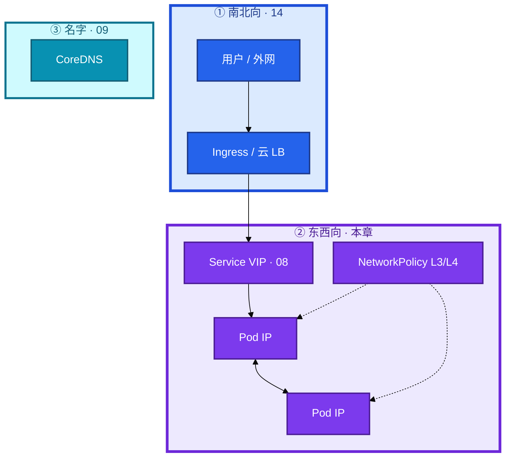
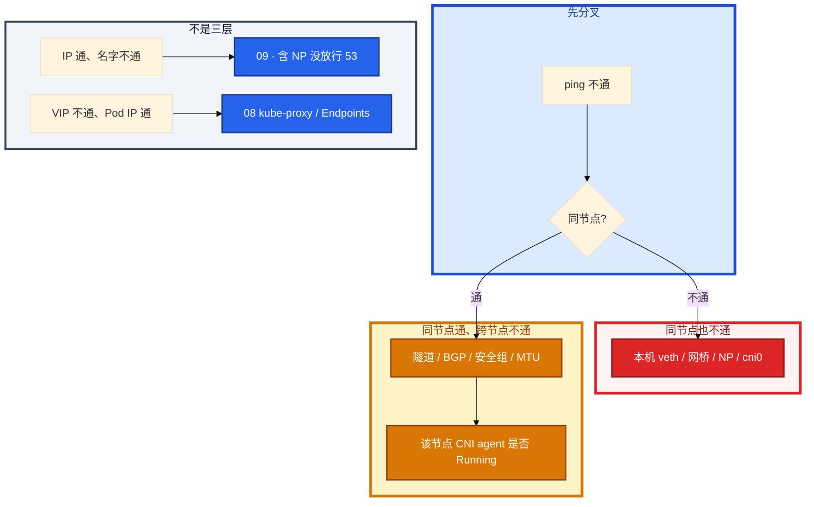

# CNI 与网络策略


新战斗服一直 ContainerCreating，Events 里 `FailedCreatePodSandBox`。应用镜像日志还没有。另一边刚给支付 NS 上了 default-deny，全集群 DNS 挂，IP ping 还通。群里有人开始查应用端口，另有人说「单独一个 NS 就合规了」——NS 不是墙，包默认东西向全通。

**本章主线（网络就按这三步）：**

1. **sandbox**：FailedCreatePodSandBox 时业务还没起——先查 CNI 与 IP 池。
2. **分层 ping**：同节点 vs 跨节点；跨节点不通查隧道/BGP/MTU/安全组。
3. **NP**：无策略全通；被选中后该方向默认拒；上 NP 先放行 53。

**读完你能：** 白板上分层画出名字 / VIP / Pod IP / NP；sandbox 失败知道业务还没起；无 NP 全通、被选中后该方向默认拒；Calico / Cilium / Flannel 能选到本章该停的深度。

## 本章目录

- [1. 基本概念](#1-基本概念)
- [2. 架构图](#2-架构图)
- [3. 原理](#3-原理)
- [4. 安装部署](#4-安装部署)
- [5. 核心配置](#5-核心配置)
- [6. 命令与操作](#6-命令与操作)
- [7. 生产排障](#7-生产排障)
- [8. 必会 · 常考](#8-必会--常考)
- [合上书](#合上书问自己)

**本章不讲：** Service / kube-proxy / Endpoints → [08 Service](../08-Service与kube-proxy/)；CoreDNS、ndots、放行 53 的解析细节 → [09 CoreDNS](../09-CoreDNS/)；Ingress / 南北向七层 → [14 Ingress](../14-Ingress与流量管理/)；Cilium eBPF、Hubble、替 kube-proxy、L7 策略 → [23](../23-eBPF与Cilium/)；调度拓扑、同 AZ → [06 调度机制](../06-调度机制/)；hostNetwork 与 PSS → [13 RBAC与安全](../13-RBAC与安全/)；NS 不是安全边界 → [01 集群架构](../01-集群架构/)、13。

---

## 1. 基本概念

K8s 网络不是 NAT 迷宫。模型是三句话：

1. **每个 Pod 一张 IP**（实际是 pause 持有网络命名空间，业务容器 join 进去）。
2. **Pod 互访无 NAT**——对端看到的是真实 Pod IP，抓包和策略才好做。
3. **节点上的 Agent 能碰到所有 Pod**（kubelet / CNI 自己要管网）。

**Namespace 不是安全边界。** 跨 NS 默认三层能通，有权限的人也能操别的 NS。要隔离必须叠 **RBAC + NetworkPolicy + 配额**；合规上要硬墙，拆集群或独立节点池，不是只建一个 NS。

**值班里怎么认现象**：

| 现象 | 技术含义 | 第一刀 |
|------|----------|--------|
| ContainerCreating 很久 | sandbox / CNI / IP 池 | `describe pod` Events |
| 同节点 ping 通、跨节点不通 | 隧道 / BGP / 安全组 / MTU | 分层 ping |
| 上 NP 后名挂 IP 通 | egress 没放行 53 | `get netpol` + 09 |
| 大包丢小包通 | MTU / PMTUD | `ping -M do -s 1400` |

| 在 CNI / NP 里 | 不在这里 |
|----------------|----------|
| Pod IP、跨节点路由、可选的 L3/L4 策略 | Service VIP → Pod（08） |
| sandbox / IPAM / veth | 名字解析（09） |
| NetworkPolicy 东西向墙 | Ingress 南北向七层（14） |

四个角色不要混：

| 角色 | 干什么 |
|------|--------|
| **CNI** | Pod IP 和跨节点连通（以及可选的 NP 实现） |
| **kube-proxy** | VIP → Pod |
| **CoreDNS** | 名字 → IP |
| **NetworkPolicy** | L3/L4 允不允许发；不管 HTTP path |

对端 IP 真实，conntrack、抓包、NetworkPolicy 才好做。NAT 迷宫里策略只能写节点，拦不住东西向。

> **记住**：CNI 管 Pod 网，proxy 管 VIP，DNS 管名，NP 管允不允许发。NS 不是墙。

---

## 2. 架构图

后面 sandbox、Overlay、NP，都对着这张图说话。



**读图三句话：**

1. **南北向走 Ingress/LB（14），东西向 Pod IP 直连是本章**——VIP 不通先 08，Pod IP 不通先本章。
2. **默认东西向全通**——`ns: hall` ↔ `ns: battle` ↔ `ns: pay` 三层能互 ping，除非 NP 选中。
3. **RBAC 管 API，不管包**——只在 Ingress 做认证拦不住集群内横向。

默认东西向是通的：

```text
ns: hall  <->  ns: battle  <->  ns: pay
```

战斗服和支付放同一集群时，最低配见 01：独立 NS、最小 RBAC、**NetworkPolicy 默认拒绝只放行该放的**、污点 / 独立节点池。

---

## 3. 原理

**本节 4 块：** 3.1 sandbox · 3.2 Overlay · 3.3 选型 · 3.4 NP

### 3.1 Pod IP 从哪来

**一句话：** Pod IP 是 kubelet 调 CNI IPAM 分的，不是 kube-proxy 也不是 Scheduler。

**打个比方：** Scheduler 只决定「这桌客人坐哪张桌子」（nodeName）；真正发号牌（Pod IP）的是 CNI 前台，kube-proxy 只管 VIP 转接，不管发号。

**现场走一遍**（新战斗服 ContainerCreating，Events 报 sandbox 失败）：

1. 看 Pod 状态和 Events：

```bash
kubectl get pod battle-new-xxx -n game -o wide
kubectl describe pod battle-new-xxx -n game | tail -20
```

2. 屏幕出现：

```text
Status:       Pending
IP:
Events:
  Warning  FailedCreatePodSandBox  2m  kubelet  networkPlugin cni failed to set up pod "battle-new-xxx": IPAM allocation failed: no IP addresses available
```

3. **说明什么**：CNI ADD 失败，**业务容器还没起**，翻应用日志没用。也不是 Scheduler 的责任——Pod 已经调度到 node-battle-05。

4. 在该节点查 CNI：

```bash
# SSH 到 node-battle-05
ls /etc/cni/net.d /opt/cni/bin
journalctl -u kubelet --since "5 min ago" | grep -i cni
```

5. 查 IP 池使用率（Calico 示例）：

```bash
kubectl get ippool -o wide 2>/dev/null || echo "看 CNI 文档查池"
```

**输出解读**：

| Events 关键词 | 定责 | 修法 |
|---------------|------|------|
| `IPAM allocation failed` | 该节点 / 池 IP 耗尽 | 扩 ippool、减 maxPods、清泄漏 |
| `Failed to find network plugin "calico"` | CNI 插件缺失 | 重装 / 修 agent |
| `no route to host` | 节点路由 / 磁盘满 | 查路由、磁盘 |
| 无 IP 但 Running | 还没走到这步 | 继续等或查镜像 |


`kubeadm --pod-network-cidr` 必须和 CNI 清单一致。改了要重建或迁池，不能只改 YAML 期望魔法生效。存量 Pod 不会自动迁。

IP 规划：集群 /16 → 256 个 /24 节点池；每节点掩码决定 maxPods。/24 理论 256，去掉网关和网络地址，默认 **110** 通常够。监控 IP 池使用率 **>80%** 告警。

> **记住**：sandbox 失败时业务还没起，先查 CNI 和 IP 池，别翻应用日志。Pod IP 来自 CNI 的 IPAM。

**面试怎么说**：「Pod IP 是 kubelet 调 CNI IPAM 分的，不是 kube-proxy。FailedCreatePodSandBox 时业务容器还没起，先看 CNI 日志和 IP 池，不要怪 Scheduler。」

### 3.2 跨节点：Overlay / Underlay

**一句话：** 同节点通、跨节点不通，先查隧道/BGP/安全组/MTU。

**打个比方：** 同楼层（同节点）走内部走廊（veth）；跨楼层（跨节点）要么坐封装的「内部电梯」（VXLAN/IPIP），要么大楼交换机已经认得各层门牌（BGP Underlay）。

**现场走一遍**（大厅 Pod ping 战斗服：同节点通，跨节点不通）：

1. 拿两个 Pod IP 和所在节点：

```bash
kubectl get po -n game -o wide | grep -E 'hall|battle'
```

2. 屏幕出现：

```text
hall-pod-aaa    10.244.1.10   node-hall-01
battle-pod-bbb  10.244.1.20   node-hall-01    # 同节点
battle-pod-ccc  10.244.3.30   node-battle-03  # 跨节点
```

3. 从 hall-pod 分层 ping：

```bash
kubectl exec hall-pod-aaa -n game -- ping -c 2 10.244.1.20
kubectl exec hall-pod-aaa -n game -- ping -c 2 10.244.3.30
kubectl exec hall-pod-aaa -n game -- ping -M do -s 1400 -c 2 10.244.3.30
```

4. 典型结果：同节点 0% loss；跨节点 100% loss 或大包丢。

5. 在 node-hall-01 和 node-battle-03 上查隧道和安全组：

```bash
# 节点上
ip route | grep 10.244
ping -c 2 10.244.3.30   # 从节点 ping 对端 Pod
```

**输出解读**：

| 现象 | 定责 |
|------|------|
| 同节点通、跨节点不通 | 隧道 / BGP / 云安全组 |
| 小包通、大包丢 | MTU；VXLAN 常见 **1450** |
| 节点能 ping Pod、Pod 互 ping 不通 | NP 或本机 veth |
| 部分节点不通 | 该节点 CNI agent 没 Running |

| | Overlay（Flannel VXLAN / Calico IPIP） | Underlay（Calico BGP） |
|--|----------------------------------------|------------------------|
| 怎么走 | 外层用 Node IP 封装 | 物理网直接路由 Pod CIDR |
| 性能 | 封装 + MTU 要减 | 更好 |
| 运维 | 少改物理网 | 要网络团队 / 云是否支持 BGP |

云上安全组：VXLAN 忘 **UDP 4789**，IPIP 忘 **协议 4**，BGP 忘 **TCP 179**。表现是 **同节点通、跨节点全不通**。

Host-GW（Flannel）：节点二层打通时无封装。云上 VPC 通常不保证，才被迫 VXLAN / IPIP。

游戏长连接：跨 AZ Overlay 每条包多一跳封装，P99 会抖。战斗服和 Redis 尽量同 AZ（06）。

> **记住**：同节点通、跨节点不通，先分层 ping，再查隧道 / BGP / 安全组 / MTU。

**面试怎么说**：「Pod 互访我先分同节点和跨节点。同节点通跨节点不通，查 VXLAN 4789、IPIP 协议 4、BGP 179 和安全组。小包通大包丢先看 MTU 1450。」

### 3.3 Calico / Flannel / Cilium 怎么选

**一句话：** 生产要选带 NetworkPolicy 的 CNI；裸 Flannel 上 NP 是死数据。

**打个比方：** Flannel 像只修公路（连通）；Calico / Cilium 还配交警（NetworkPolicy）。YAML 能 apply 不代表交警上岗——裸 Flannel 上 NP 是空文件。

**现场走一遍**（合规要求上 NP，集群装的是裸 Flannel）：

1. 看 CNI DaemonSet：

```bash
kubectl get ds -n kube-system | grep -E 'flannel|calico|cilium'
kubectl get netpol -A
```

2. 屏幕出现：

```text
kube-flannel-ds-xxx   3/3   Running
# netpol 已 apply 但包仍全通
```

3. 在节点确认：

```bash
ls /etc/cni/net.d/
cat /etc/cni/net.d/* | head -20
```

4. 典型 Flannel 配置只有 `type: flannel`，**没有** Calico Felix / Cilium eBPF 做 NP。

5. **结论**：要策略 → Canal（过渡）或换 Calico / Cilium。新生产直接 Calico / Cilium 更干净。

**输出解读**：

| | Flannel | Calico | Cilium |
|--|---------|--------|--------|
| 跨节点 | VXLAN / Host-GW | BGP / IPIP / VXLAN | eBPF |
| NetworkPolicy | **默认没有** | 有 | 有，还可 L7（23） |
| 适合 | 简单小集群 | 生产常用 | 要可观测 / 替 iptables 再上 |

Calico 三种数据面：

| 模式 | 何时 | 封装 |
|------|------|------|
| BGP / 纯路由 | 网络能学 Pod CIDR | 无 |
| IPIP | 云上不能 BGP | 协议 4，MTU 减 |
| VXLAN | 跨三层 | UDP 4789，MTU 减 |

Felix 是 Calico 节点 agent，管路由和 NP 落地。排障「部分节点不通」看 calico-node / Felix 是否 Running。Cilium 本章答到：能选、知道比 Flannel 多策略和可观测；eBPF 细节在 23。

> **记住**：生产选带 NP 的 CNI。只要策略却装裸 Flannel，apply 了也不生效。

**面试怎么说**：「生产我选 Calico 或 Cilium，因为要 NetworkPolicy。裸 Flannel 上 NP YAML 能 apply 但不生效。Cilium 的 Hubble 和替 kube-proxy 是 23 的内容。」

### 3.4 NetworkPolicy：无策略全通，选中后默认拒

**一句话：** 无 NP 时东西向全通；Pod 被 NP 选中后该方向默认拒。

**打个比方：** 没贴门禁卡（无 NP）时公司各楼层随便走；你的工位被贴了「访客禁入」（Ingress NP 选中）后，默认谁都不让进，除非名单上写了谁可以。

**现场走一遍**（刚给 pay NS 上 default-deny，全集群 DNS 挂，IP ping 还通）：

1. 看策略：

```bash
kubectl get netpol -n pay
kubectl describe netpol pay-default-deny -n pay
```

2. 从 pay Pod 测：

```bash
kubectl exec pay-pod-xxx -n pay -- nslookup kubernetes.default
kubectl exec pay-pod-xxx -n pay -- ping -c 2 10.96.0.10
```

3. 典型现象：ping 10.96.0.10 通（三层到 kube-dns VIP），`nslookup` 失败（UDP/TCP 53 egress 被默拒）。

4. 看策略 egress 是否放了 53：

```yaml
egress:
- to:
  - namespaceSelector:
      matchLabels: { kubernetes.io/metadata.name: kube-system }
  ports:
  - { protocol: UDP, port: 53 }
  - { protocol: TCP, port: 53 }
```

5. **止血**：补 egress 53，或临时删 / 改 NP（生产要审批）。改 NP **即时生效**，不用滚动 Pod。

**输出解读**：

| 状态 | 行为 |
|------|------|
| NS 里没有任何 NP | **全部允许**（跨 NS 也通） |
| Pod 被某 Ingress 规则选中 | **入站默认拒**，只放行写过的 from |
| Pod 被某 Egress 规则选中 | **出站默认拒**，只放行写过的 to |
| 多条 NP | **并集**（一条放行就通） |
| CNI 不支持 | YAML 能 apply，**不生效** |

默认拒示意（先放行 DNS 和本 NS 网关）：

```yaml
apiVersion: networking.k8s.io/v1
kind: NetworkPolicy
metadata:
  name: pay-default-deny
  namespace: pay
spec:
  podSelector: {}
  policyTypes: [Ingress, Egress]
  ingress:
  - from:
    - namespaceSelector:
        matchLabels: { kubernetes.io/metadata.name: hall }
    - namespaceSelector:
        matchLabels: { kubernetes.io/metadata.name: ingress-nginx }
  egress:
  - to:
    - namespaceSelector:
        matchLabels: { kubernetes.io/metadata.name: kube-system }
    ports:
    - { protocol: UDP, port: 53 }
    - { protocol: TCP, port: 53 }
  - to:
    - ipBlock: { cidr: 203.0.113.0/24 }
    ports:
    - { protocol: TCP, port: 443 }
```

`podSelector: {}` 选中该 NS 全部 Pod。漏写 `policyTypes` 时，有的实现只生效 Ingress——不要靠默认。

egress 只放行 DNS 之后，业务访问支付公网会被默拒。排障「上了 NP 外网支付挂了」先看 egress，不是 CoreDNS。

HostPort / hostNetwork：CNI 三原则对这类 Pod **部分失效**。dnsPolicy 要 `ClusterFirstWithHostNet`（09）。PSS baseline 默认禁 hostNetwork（13）。

上了 NP 还通的三种：CNI 不支持、selector 没匹配到、另一条 NP 并集放行了。

> **记住**：无 NP 全通；被选中后该方向默认拒；上 NP 先放行 53。

**面试怎么说**：「无 NetworkPolicy 时东西向默认全通。Pod 被 NP 选中后该方向默认拒绝。多条 NP 是并集不是交集。上 NP 第一天必须先 egress 放行 kube-system:53。」

---

## 4. 安装部署

kubeadm 装完 **没有** 默认 CNI，必须自己 apply 一份。`--pod-network-cidr` 和清单里的 CIDR 必须一致。

| 项 | 选 | 不选 |
|----|----|------|
| 生产 CNI | Calico 或 Cilium | 只要 NP 却装裸 Flannel |
| IP 规划 | /16 Pod CIDR，每节点 /24，对齐 maxPods | /24 当全集群 |
| 验收 | 跨节点 ping Pod IP | 只看 calico-node Running |

**现场验收**：

```bash
kubectl get nodes
kubectl get ds -n kube-system
kubectl run ping-a --image=busybox:1.36 -n game -- sleep 3600
kubectl run ping-b --image=busybox:1.36 -n battle -- sleep 3600
# 等 Running 后：
kubectl get po -n game ping-a -o wide
kubectl get po -n battle ping-b -o wide
kubectl exec ping-a -n game -- ping -c 3 <ping-b Pod IP>
```

云安全组在装 CNI 当天就要放行封装口。CNI 是 DaemonSet：calico-node / flannel / cilium。

---

## 5. 核心配置

| 项 | 选 | 不选 |
|----|----|------|
| NP | 先核心库默认拒，必放行 53 | 以为有 RBAC / 有 NS 就够 |
| MTU | Overlay 按封装减 | 默认 1500 不管隧道 |
| 监控 | IP 池、BGP/隧道、sandbox 失败 | IP 耗尽才发现 |
| CNI 滚动 | DS maxUnavailable 要小 | 一次滚光，短暂跨节点黑洞 |
| HostNetwork | 尽量不用 | 当降延迟银弹 |

落地顺序，一步都不能跳：

1. 确认 CNI 支持 NP（Calico / Cilium，不是裸 Flannel）。
2. 核心 NS 默认拒入站。
3. **先放行 DNS 53**，否则「刚上 NP 全网名字挂」。
4. 放行 Ingress Controller / 网关。
5. 再放行 backend → DB 这类东西向。

> **记住**：生产选带 NP 的 CNI，CIDR 对齐 maxPods，滚动别一次滚光。

---

## 6. 命令与操作

### 6.1 命令速查

```bash
kubectl get pods -o wide
kubectl describe pod <p>
ls /etc/cni/net.d /opt/cni/bin
kubectl exec a -- ping -c 2 <同节点 Pod IP>
kubectl exec a -- ping -c 2 <跨节点 Pod IP>
kubectl get netpol -A
```

| 目的 | 命令 | 看什么 | 正常 / 异常 |
|------|------|--------|-------------|
| IP 和节点 | `get po -o wide` | 有没有 IP、是否同节点 | 无 IP = sandbox 失败 |
| sandbox | `describe pod` Events | FailedCreatePodSandBox | 业务还没起 |
| CNI 文件 | 节点 `/etc/cni/net.d` | 插件在不在 | 空 = CNI 没装 |
| agent | `get ds -n kube-system` | calico-node / cilium | 部分节点不通先看这个 |
| MTU | `ping -M do -s 1400` | 小包通大包丢 | PMTUD 问题 |
| NP | `get netpol -A` | 误加 deny-all | 删策略秒级回滚 |
| 路由 | 节点 `ip route` | Host-GW / BGP 学到的 CIDR | 缺路由 = agent 问题 |

### 6.2 上 NP 顺序 SOP

先 DNS 53，再网关，再 backend→DB。egress 只放行 DNS 后记得补支付 CIDR。改 NP 不要滚动业务 Pod——即时生效。

### 6.3 IP 池耗尽 SOP

该节点 CIDR 用完了或 IP 泄漏。扩 ippool、减少浪费、清泄漏。使用率 **>80%** 告警。改了 CNI YAML 里的 CIDR，存量 Pod **不会**自动迁。

### 6.4 CNI DaemonSet 滚动

agent 重启期间隧道 / eBPF 会空窗，出现短暂跨节点黑洞。maxUnavailable 要小，不要一次滚光。

---

## 7. 生产排障

大厅 ping 战斗服不通。**先分同节点 / 跨节点**，不要一上来抓业务包。



| 现象 | 先做什么 | 不要做什么 |
|------|----------|------------|
| FailedCreatePodSandBox | CNI 日志、IPAM、节点磁盘、CIDR 是否耗尽 | 翻应用日志、怪 Scheduler |
| 上 NP 后全断 | 先确认没放行 DNS / 本应放行的 from；CNI 是否真支持 NP | 以为 CoreDNS 被杀掉 |
| 只有大包丢 | MTU；`ping -M do -s 1400` | 当应用端口坏了 |
| 部分节点 | 该节点 CNI agent 是否 Running | 一次滚光所有 agent |
| 上了 NP 外网支付挂 | egress，不是 CoreDNS | 回到 09 重启 CoreDNS |
| YAML 已 apply 包还全通 | CNI 不支持 / selector 没匹配 / 并集放行 | 再加一条 deny 而不查生效 |
| sandbox 单节点 | 该节点 CIDR / 泄漏 | 把全集群 CIDR 改掉指望魔法迁 |

**真实现象举例**：刚上 pay default-deny，全集群 `nslookup` 挂但 `ping 10.96.0.10` 通——egress 没放 kube-system:53，补一条 UDP/TCP 53 立刻好。

临时验证 NP：在测试 NS 删策略看是否立刻通（生产要审批）。

> **记住**：先 ping IP 分同节点/跨节点，再决定是 CNI、NP 还是 DNS。

---

## 8. 必会 · 常考

| 说法 | 对错 | 口径 |
|------|:----:|------|
| Pod 互访要 NAT | 错 | 三原则：无 NAT，对端 IP 真实 |
| Pod IP 是 kube-proxy 发的 | 错 | CNI IPAM |
| sandbox 失败去看应用日志 | 错 | 业务容器还没起 |
| 单独一个 NS 就是安全边界 | 错 | 跨 NS 默认三层能通 |
| 纯 Flannel 上 NP 会生效 | 错 | YAML 能 apply，不生效 |
| 无 NP 时东西向默认拒 | 错 | 无策略 **全通** |
| 被 Ingress 规则选中后入站仍全通 | 错 | 该方向默认拒 |
| 多条 NP 取交集 | 错 | **并集** |
| 上 NP 只放行 Ingress 入站，DNS 会好 | 错 | 解析是 egress :53 |
| 改 NP 要滚动业务 Pod | 错 | 即时生效 |
| Cilium 的 Hubble 必须在本章背完 | 错 | 深水在 23 |
| VXLAN 用 MTU 1500 没问题 | 错 | 要减封装；小包通大包丢 |
| /24 当全集群 CIDR 够用 | 错 | 几十节点就会耗尽 |
| 改 CIDR YAML 存量自动迁 | 错 | 一次迁移，不是魔法 |
| 只在 Ingress 做认证够挡横向 | 错 | 东西向靠 NP |
| hostNetwork 仍完全服从三原则 | 错 | 部分失效，能不用就不用 |

数字：每节点默认 maxPods 常见 **110**；IP 池告警 **>80%**；VXLAN **UDP 4789**；IPIP **协议 4**；BGP **TCP 179**；VXLAN MTU 常见 **1450**。

易混：同节点 vs 跨节点；NP 不生效 vs 没放行 53；egress 支付挂 vs CoreDNS；VIP 不通 vs Pod IP 不通；Flannel 无 NP vs Calico 有 NP。

---

## 合上书，问自己

1. 三原则是哪三句？CNI / proxy / DNS / NP 怎么分工？NS 是墙吗？
2. Pod IP 谁分配？FailedCreatePodSandBox 时业务起了没？
3. Overlay 和 Underlay 差在哪？同节点通跨节点不通先 ping 哪三层？
4. Flannel / Calico / Cilium 谁有 NP？本章对 Cilium 答到哪？
5. 无 NP 默认怎样？被选中后呢？上线顺序为什么先放行 53？
6. 改 NP 要不要滚动？egress 只放行 DNS 后支付公网为什么挂？

六题都能口述，这一章就过了。下一章把盘剖开：PVC 一直 Pending 不一定是故障，Delete 删申请会毁云盘。
