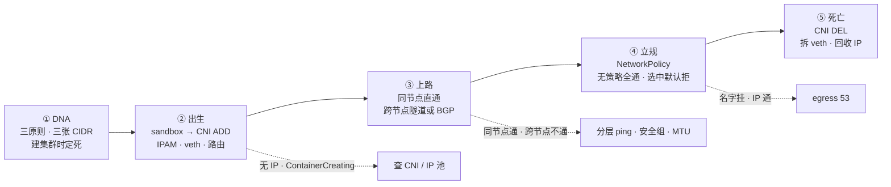
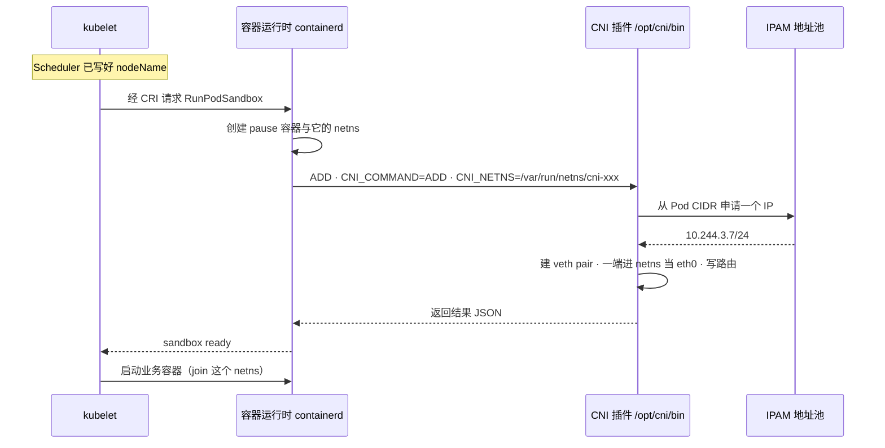
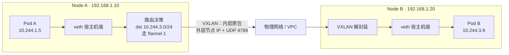
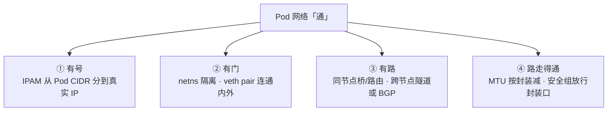
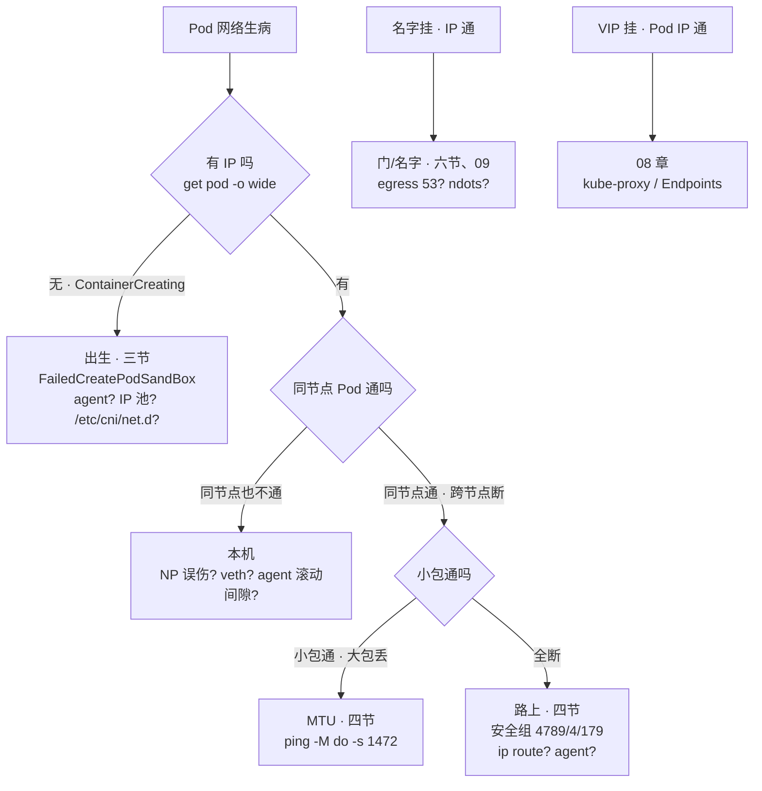

# CNI 与网络策略

> 战斗服扩容，新节点 Pod 全卡 `ContainerCreating`，Events 刷 `FailedCreatePodSandBox`——有人翻了半小时应用镜像日志；另一边 pay 上了 default-deny，全集群 `nslookup` 秒挂、ping IP 却通——有人已经在重启 CoreDNS。
> **本章回答**：一个 Pod 网络的一生——CNI 何时被调、Flannel/Calico/Cilium 各修什么路、三张 CIDR 谁管、NetworkPolicy 怎么放行与拦截；按生命周期定责。
> **不讲**：Service VIP / kube-proxy → [08](../08-Service与kube-proxy/)；CoreDNS / ndots → [09](../09-CoreDNS/)；Ingress 南北向 → [15](../15-Ingress与流量管理/)；Cilium eBPF / Hubble → [25](../25-eBPF与Cilium/)；抓包与 PMTUD → [01-16](../../01-基础底座/16-网络排障与抓包/)。

**标记**：🎯重点 · 🔥难点 · ⭐常考 · 🔧实操

---

## 一、一张图：一个 Pod 网络的一生

> 🎯 **一句话**：Pod 的网络有出生也有死亡，出事先问卡在哪个阶段。



- 📖 **读图**
  - 🛤️ 主干五阶段：DNA → 出生 → 上路 → 立规 → 死亡；后面每节挂一个阶段
  - 🚨 三条虚线 = 值班三象：没 IP 查出生，有 IP 不通查路，名字挂查门——先定位阶段再抠机制

口诀：⭐ **没 IP 查出生，有 IP 查路，路通查门**。（练习题 Q1、Q7、Q5）

---

## 二、DNA：网络模型三原则与三张网

> 🎯 **一句话**：三原则定形态，三张网定地址，规划错一步后面全乱。

### 🧬 三原则

K8s 网络模型不是 NAT 迷宫，就是三句话：

1. **每个 Pod 一个 IP**。真正持网的是 **pause 容器**——每个 Pod 第一个被创建的容器，它独占一个 **netns（network namespace）**：一套独立网络栈（网卡、路由、iptables）；业务容器只是 `join` 进这个 netns，共享同一个 eth0 和 IP。
2. **Pod 到 Pod 通信不过 NAT**。对端看到的就是真实 Pod IP——抓包才看得懂、conntrack 才跟得住、NetworkPolicy 才匹配得到。
3. **节点上的 agent 能到达所有 Pod**。kubelet、CNI、探针都要够得着。

#### ❓ 为什么 Namespace 不是安全边界？

- ❌ **单独建一个 NS**：跨 NS 的 L3 **默认就通**——`hall` / `battle` / `pay` 互相能 ping
- ✅ **隔离要叠墙**：NetworkPolicy + RBAC + 配额；合规要硬墙就拆集群或独立节点池 → [01](../01-集群架构/)
- 🧱 **K8s Namespace ≠ netns**：前者是 API 资源分组，后者是内核网络隔离（每个 Pod 一个）

### 🎭 四角色各管一段

- **CNI（Container Network Interface）**：CNCF「给容器配网络」标准接口——管 Pod IP、跨节点连通（并可选地执行 NP）——本章主角
- **kube-proxy**：VIP → Pod → [08](../08-Service与kube-proxy/)
- **CoreDNS**：名字 → IP → [09](../09-CoreDNS/)
- **NetworkPolicy**：L3/L4 防火墙声明（IP/端口/协议），不管 HTTP 路径；执不执行看 CNI（五、六节）

> ⚠️ **别混**：**Pod IP 由 CNI 的 IPAM 分配，VIP 由 apiserver 从 Service CIDR 分配**——两套号、两套人马。面试说「Pod IP 是 kube-proxy 发的」直接出局。

### 🗺️ 三张网：Pod / Service / Node CIDR ⭐🔥

- **Pod CIDR**（kubeadm `--pod-network-cidr`，controller-manager `--cluster-cidr`）：所有 Pod IP 来源，常用 **/16**（可切 256 个节点段，每节点一段 /24，掩码由 `--node-cidr-mask-size` 定，默认 24）。谁分：Node IPAM controller 按节点切片，或 Calico 等用自己的 IPPool 接管
- **Service CIDR**（apiserver `--service-cluster-ip-range`）：VIP 池，常用 `10.96.0.0/12`；建 Service 时 apiserver 取号，转发归 kube-proxy → [08](../08-Service与kube-proxy/)
- **Node CIDR**：节点网卡段 = `kubectl get nodes` 的 INTERNAL-IP；VXLAN 外层源地址就是它

三段重叠 = 路由错乱，「某些 IP 莫名不通」。kubeadm 的 `--pod-network-cidr` 必须和 CNI 清单一致；要改得重建或一次性迁池，**存量 Pod 不会自动迁移**。别拿 /24 当全集群 Pod CIDR。

> 🔍 **现场**：三张网各看一眼。

```bash
kubectl get nodes -o wide
# INTERNAL-IP 一列就是 Node CIDR：192.168.1.10 …
ps -ef | grep kube-apiserver | grep -o 'service-cluster-ip-range=[^ ]*'
# service-cluster-ip-range=10.96.0.0/12            # ← Service CIDR
kubectl get ippool -o wide                          # Calico；其他 CNI 看对应池对象
# default-ipv4    10.244.0.0/16   all()             # ← Pod CIDR
```

### 🏠 特殊成员：hostNetwork

`hostNetwork: true` 不走 CNI——直接用节点 netns，Pod IP = 节点 IP。

- 代价：占节点端口（和 NodePort / Ingress 冲突）、绕过 CNI/NP 模型、`dnsPolicy` 要改 `ClusterFirstWithHostNet` 否则短域名全挂 → [09](../09-CoreDNS/)、PSS baseline 默认禁 → [13](../13-RBAC与安全/)
- **能不用就不用**，别当降延迟银弹

口诀：⭐ **三张网各归其主；NS 不是墙，隔离靠 NP+RBAC**。（练习题 Q1、Q3、Q12、Q13）

---

## 三、出生：CNI ADD 的几个动作

> 🎯 **一句话**：先建 sandbox 再调 CNI ADD；FailedCreatePodSandBox 时业务还没启动。

### ⏱️ CNI 在生命周期的哪一步被调 🔥⭐

**CNI 是规范不是程序**：运行时按环境变量调 `/opt/cni/bin` 下的插件，配置读自 `/etc/cni/net.d`，干完就退出。三个动词：**ADD** / **DEL** / **VERSION**。



- 📖 **读图**
  - ⏳ 两个时间点：① CNI 在 **sandbox 之后、业务容器之前**；sandbox 失败时业务还没启动——翻应用日志 = 对着空房间喊
  - 🎫 Scheduler 只写 `nodeName`（座位），**Pod IP 由 CNI 里的 IPAM（IP Address Management）发号**——既不归 Scheduler 也不归 kube-proxy

关键环境变量：`CNI_COMMAND=ADD`、`CNI_NETNS`、`CNI_IFNAME=eth0`。

#### ❓ 为什么不是 Scheduler 发 Pod IP？

- ❌ **调度器发号**：Scheduler 只决定「坐哪个节点」，看不到本节点 IP 池占用、也不持 netns
- ✅ **IPAM 在 ADD 时发号**：知道本节点段、能登记占用、能配到 eth0——号跟座位在不同人手里

### 🔌 ADD 干了四件事 🔥

1. **IPAM 分 IP**：从本节点段取号、登记占用
2. **建 veth pair**：**veth pair** = 一对虚拟网卡，一端发什么另一端就收到——像穿墙网线连两个 netns
3. **一端进 Pod netns**：改名 `eth0`，配 IP / 默认路由；另一端留宿主机——Flannel 接 `cni0`，Calico 路由模式挂 `caliXXX`
4. **写路由**：跨节点「这段去哪个节点」——隧道或 BGP，见第四节

> 💡 **打个比方**：netns 是隔音房，veth pair 是穿墙对讲线——一头在房间（eth0），一头在走廊（宿主机）。

> 🔍 **现场**：从里到外验 ADD。

```bash
crictl pods --name gate-old -q
# e8f01a2b...                                        # ← sandbox ID
crictl inspectp e8f01a2b... | jq '.info.pid'
# 18233                                              # ← pause PID，netns 归它
nsenter -t 18233 -n ip -br addr
# eth0  UP  10.244.3.9/24                            # ← ADD 配上的 Pod IP
nsenter -t 18233 -n ip route
# default via 169.254.1.1 dev eth0                   # ← Calico 链路本地虚拟网关
ip -br link | grep cali
# cali9f2e1ab  UP                                    # ← veth 宿主机端
```

### 🚨 出生卡住：FailedCreatePodSandBox ⭐🔧

> 🔍 **现场**：三步定位。

```bash
kubectl get pod battle-new-xxx -n game -o wide
# STATUS ContainerCreating · IP <none>               # ← 没 IP = sandbox 没建好
kubectl describe pod battle-new-xxx -n game | tail -8
# Warning  FailedCreatePodSandBox  … IPAM allocation failed: no IP addresses available
#                                                    # ← 本节点段用光了
ls /etc/cni/net.d /opt/cni/bin
# 10-calico.conflist  calico-kubeconfig              # ← 目录空 = CNI 没装
journalctl -u kubelet --since "5 min ago" | grep -i cni
```

按报错定责：

- `IPAM allocation failed` = 池耗尽（扩池、清泄漏、调小 maxPods）
- `Failed to find network plugin` = CNI 没装 / 二进制丢——**新节点经典**：DaemonSet 不容忍污点、清单没 apply
- `no route to host` = 节点路由或磁盘

IP 池 **>80%** 就要告警。kubeadm 装完**没有默认 CNI**，必须自己 apply；验收标准是**跨节点能 ping Pod IP**，不是 DaemonSet Running 就完事：

```bash
kubectl run ping-a --image=busybox:1.36 -n game   -- sleep 3600
kubectl run ping-b --image=busybox:1.36 -n battle -- sleep 3600
kubectl exec ping-a -n game -- ping -c 3 <ping-b 的 Pod IP>   # ← 跨 NS 跨节点通才算真通
```

> ⚠️ **别混**：sandbox 失败 vs 镜像拉取失败——前者**没有 IP**、业务没启动；后者**有 IP**、卡在 PullImage / ImagePullBackOff。

> 📝 **面试**：「Pod IP 是 sandbox 时由 CNI 的 IPAM 分配的，不归 kube-proxy。FailedCreatePodSandBox 时业务还没启动，先看 CNI 日志和 IP 池，别怪调度，也别翻应用日志。」

口诀：⭐ **FailedCreatePodSandBox = 业务还没启动；先查 CNI/IP 池**。（练习题 Q2、Q11）

---

## 四、上路：跨节点的三条路

> 🎯 **一句话**：同节点走 veth 直通；跨节点要么封装，要么真路由。

### 🏠 同节点：不出节点

两 Pod 同节点：包从一个 veth 出来，经网桥（Flannel `cni0`）或宿主机路由（Calico）进另一个 veth——不封装、不减 MTU。

- 排障第一刀永远是**分层 ping**：同节点通、跨节点不通 = 路上；同节点也不通 = 本机（veth / NP 误伤 / agent 滚动间隙）

### 📦 跨节点路一：Overlay 封装 🔥

> 💡 **打个比方**：Pod 的包是「信」，物理网络只认节点门牌。Overlay 先套信封（外层头），信封上写收发**节点**地址；对端拆信封，把原信交给目标 Pod。VXLAN 就是这种信封，用 UDP 运输。



- 📖 **读图**
  - ✉️ 原始 IP 包整个塞进 UDP；外层源/目的是两个**节点** IP → 安全组必须放行 **UDP 4789**（IPIP 则是协议号 4）
  - 📉 封装吃约 50 字节 → 引出 MTU；漏放安全组的统一症状：「同节点通、跨节点全不通」

Flannel **Host-GW** 是例外：直接写「这段去哪个节点」的路由，不封装——但要求节点二层直连；云 VPC 常不保证，被迫退回 VXLAN。

### 🛤️ 跨节点路二：Underlay 真路由（BGP）🔥

Calico 默认玩法：不封装，每个节点用 **BGP（Border Gateway Protocol）** 把「我有这些 Pod CIDR 段」宣告给交换机或邻居——物理网络直接认 Pod IP。

> 💡 **打个比方**：Overlay 是「信封中转」；BGP Underlay 是让总机房直接认识每层每间房号——不用套信封，但要总机房配合。

| 对比 | Overlay（Flannel VXLAN / Calico IPIP·VXLAN） | Underlay（Calico BGP） |
|------|----------------------------------------------|------------------------|
| 做法 | 外层套节点 IP，隧道运输 | 物理网络直接路由 Pod CIDR |
| 性能 | 有封装开销，MTU 要减 | 更好，无封装 |
| 依赖 | 几乎不改物理网络 | 需要网络团队 / 云支持 BGP |
| 安全组 | UDP 4789 / 协议 4 | TCP 179 |

云上做不了 BGP 时 Calico 退回 IPIP（协议 4）或 VXLAN（UDP 4789）。

#### ❓ 为什么不全上 BGP？

- ✅ **BGP 更快**：无封装、MTU 不减
- 🛑 **代价是依赖物理网络**：自建要网络团队配合，云要 VPC 支持 BGP——不支持就只能封装退路
- 🔒 安全组照样要放：**TCP 179**

### 📏 MTU：大包的事 🔥⭐

Overlay 的 50 字节信封要吃内层额度：物理 MTU 1500，Pod 里只能发 **1450**。一环配成 1500，大包就卡在隧道口（DF 置位、不能分片、直接丢）。

- 现象：**小包通、大包丢**——ping / 握手过，业务大帧超时；易被误诊成应用端口问题
- ICMP 需要分片却被安全组拦 = PMTUD 黑洞 → [01-16](../../01-基础底座/16-网络排障与抓包/)

> 🔍 **现场**：一个大包探针定案。

```bash
kubectl exec gate-old-yyy -- ping -c 2 10.244.5.7            # 小包：通
kubectl exec gate-old-yyy -- ping -M do -s 1472 -c 2 10.244.5.7
# ping: sendmsg: Message too long    # ← 1472+28=1500，超出隧道内层 MTU
nsenter -t <pause-pid> -n ip link show eth0 | grep -o 'mtu [0-9]*'
# mtu 1500                             # ← Pod MTU 没按 Overlay 减
```

修法：CNI MTU 降到 1450（VXLAN）或 1480（IPIP），重建受影响 Pod。

### 🔧 路上的其他因素

- **安全组当天放行**：VXLAN **UDP 4789**、IPIP **协议 4**、BGP **TCP 179**
- **CNI agent 是 DaemonSet**：calico-node / kube-flannel-ds / cilium——「部分节点不通」先看那台 agent 是否 Running
- **跨 AZ 长连接**：Overlay 每包多一层；战斗服和 Redis 尽量同 AZ → [06](../06-调度机制/)

> 🔍 **现场**：分层 ping 与路由核对。

```bash
kubectl exec hall-pod-aaa -- ping -c 2 10.244.1.20    # 同节点
# 0% packet loss                                       # ← 同节点通
kubectl exec hall-pod-aaa -- ping -c 2 10.244.3.30    # 跨节点
# 100% packet loss                                     # ← 跨节点断
ip route | grep -E '10.244|cali|flannel'
# 10.244.1.0/24 via 192.168.1.11 dev eth0 proto bird    # ← Calico BGP
# 10.244.0.0/24 via 192.168.1.11 dev flannel.1 onlink   # ← Flannel 隧道
# 缺某一段 = 对端 agent 或 BGP 会话问题
```

### 🧩 收束：Pod 网络凭什么「通」 🎯⭐



- 📖 **读图**：①没号→出生；②门坏→本机 veth/netns；③没路→隧道/BGP/安全组；④大车过不去→MTU。排障顺序 ①→④。

> ⚠️ **别混**：**「连通」≠「被允许」≠「能解析」**——四件套只管三层可达；NP 仍可能拦（六节），DNS 仍可能挂名（[09](../09-CoreDNS/)）。

> 📝 **面试**：按「号—门—路—通」四组记；跨节点不通沿 ①→④，顺序不能乱。

口诀：⭐ **小包通大包丢 = MTU；安全组三口 4789 / 协议4 / 179**。（练习题 Q7、Q8、Q14）

---

## 五、选路：Flannel、Calico、Cilium

> 🎯 **一句话**：生产必选带 NetworkPolicy 的 CNI；裸 Flannel 上 NP 是空转。

| 对比 | Flannel | Calico | Cilium |
|------|---------|--------|--------|
| 跨节点 | VXLAN / Host-GW | BGP / IPIP / VXLAN | eBPF 数据面（可配隧道） |
| NetworkPolicy | **默认不支持** | 完整支持 | 支持，且能到 L7 |
| 数据面 | 内核路由 / 网桥 | 内核路由 + iptables（NP） | **eBPF**，可替代 kube-proxy |
| 适合 | 简单小集群 | 生产常用 | 要可观测/高性能再上 |

- **Flannel**：组件最少；无 NP——生产要策略用 **Canal**（Flannel 路 + Calico 交警）过渡，或直接换
- **Calico**：生产常用。三种数据面——BGP（网络能学 Pod CIDR）、IPIP（云上做不了 BGP）、VXLAN（跨三层）。节点 agent **Felix** 写路由、把 NP 落到内核；「部分节点不通 / NP 不生效」先看 calico-node
- **Cilium**：eBPF 数据面，策略/转发绕开 iptables，可替代 kube-proxy，外加 Hubble。本章答到「会选、比 Flannel 多策略和可观测」即可 → [25](../25-eBPF与Cilium/)

#### ❓ 为什么 YAML apply 成功了包还通？

- 📜 apiserver **什么 NP 都肯存**——存 ≠ 执行
- 🚫 **裸 Flannel**：交警没上岗，告示牌空转
- 🎯 **selector 没匹配**到任何 Pod；或被**另一条 NP 并集**放行了

> 🔍 **现场**：Calico 状态一眼看。

```bash
calicoctl node status
# 192.168.1.11      64512            Established    # ← BGP 正常
# 192.168.1.12      64512            Connect        # ← 还在建，跨节点可疑
calicoctl get ippool -o wide
# default-ipv4     10.244.0.0/16    true            # ← 须与 --pod-network-cidr 一致
```

> ⚠️ **别混**：**NP「能 apply」≠「生效」**——执不执行看 CNI。

> 📝 **面试**：「生产选 Calico 或 Cilium，必须要 NetworkPolicy。裸 Flannel 的 NP YAML 能 apply 但不执行。Cilium 深水区 → 25。」

口诀：⭐ **能 apply ≠ 生效；裸 Flannel 上 NP 是空转**。（练习题 Q4）

---

## 六、立规：NetworkPolicy

> 🎯 **一句话**：无策略全通；被选中该方向默认拒；多条并集。

**NetworkPolicy** = K8s 的 L3/L4 防火墙声明：作用于哪些 Pod（selector）、管哪个方向（ingress / egress）、放行谁（from/to）。它只是**声明**，执行靠 CNI（五节）。

> 💡 **打个比方**：没 NP 时大楼没有门禁；某个工位一旦被任何一条 NP 选中，那个方向立刻「默认锁」——**选中是收紧，不是放行**。

### 🚪 默认行为：五种状态 ⭐🔥

| 状态 | 行为 |
|------|------|
| NS 里没有任何 NP | **全放行**，跨 NS 也通 |
| Pod 被某条 ingress 选中 | **入站默认拒**，只放行写明的 from |
| Pod 被某条 egress 选中 | **出站默认拒**，只放行写明的 to |
| 多条 NP 选中同一 Pod | **并集**，任一条放行即通过 |
| CNI 不执行 | YAML 能 apply，**不生效** |

#### ❓ 为什么不是「没有 NP = 默认拒」？

- ❌ 高频错答：没有策略就拒——那是部分防火墙产品的习惯，**不是** K8s
- ✅ K8s：**无策略全通**；只有被选中，该方向才默认拒
- 🔀 方向相互独立：被 ingress 选中不影响 egress
- ➕ 多条永远取**并集**，没有交集——想「叠一条例外减掉」做不到

口诀：⭐ **无策略全通；选中默认拒；多条并集不交集**。

> ⚠️ **别混**：**K8s `Namespace` ≠ netns**——NP 作用于 netns 上的流量，不认 Namespace 这堵「想象中的墙」。

### 🎯 三种选择器：放行谁 ⭐

`from` / `to` 里三种对端，可叠加：

- **podSelector**：按标签选 Pod，默认范围 = **与 NP 同 NS**
- **namespaceSelector**：按 NS 标签选整个 NS——跨 NS 流量靠它；1.21+ 每 NS 自带 `kubernetes.io/metadata.name`
- **ipBlock**：任意 CIDR——集群外只能靠它，可用 `except` 挖洞

三者只管 IP/端口/协议（L3/L4），不管 HTTP 路径和域名；L7 → [25](../25-eBPF与Cilium/)。

### 📝 例子：默认拒 + 精确放行 🔧

pay：只准 hall 和 Ingress 进，出站只准 DNS 和支付网关：

```yaml
apiVersion: networking.k8s.io/v1
kind: NetworkPolicy
metadata:
  name: pay-default-deny
  namespace: pay
spec:
  podSelector: {}                     # ← 空选择器 = 本 NS 全部 Pod
  policyTypes: [Ingress, Egress]      # ← 显式写两方向，别赌实现默认
  ingress:
  - from:
    - namespaceSelector:
        matchLabels: { kubernetes.io/metadata.name: hall }
    - namespaceSelector:
        matchLabels: { kubernetes.io/metadata.name: ingress-nginx }
  egress:
  - to:
    - namespaceSelector:
        matchLabels: { kubernetes.io/metadata.name: kube-system }
    ports:
    - { protocol: UDP, port: 53 }     # ← 先放 DNS
    - { protocol: TCP, port: 53 }
  - to:
    - ipBlock: { cidr: 203.0.113.0/24 }
    ports:
    - { protocol: TCP, port: 443 }    # ← 支付网关
```

纯默认拒 = `podSelector: {}` + `policyTypes: [Ingress, Egress]` 且不写规则。漏写 `policyTypes` 时按规范从规则推断，但显式写永远不会错。

### 📋 上线顺序：一步都不能省 ⭐

1. 确认 CNI 支持 NP（Calico / Cilium，不是裸 Flannel）
2. 核心 NS 先上默认拒入站
3. **先放行 DNS 53**——没这步 =「NP 一上全集群名字挂」
4. 放行 Ingress Controller / 网关
5. 再放后端 → DB；别忘出站公网 CIDR（支付回调）

#### ❓ 为什么先放 53，而不是先查 CoreDNS？

- 🛣️ ping VIP 通 = 三层路没坏
- 🚪 `nslookup` 超时 = **egress 到 :53 被默认拒**——门关了，不是 DNS 死了
- ✅ 止血：补 egress 53；或改/删该 NP——**NP 改动即时生效，不用滚动业务 Pod**

> 🔍 **现场**：pay default-deny 后名字挂、IP 通。

```bash
kubectl exec pay-pod-xxx -n pay -- ping -c 2 10.96.0.10
# 0% packet loss                     # ← 到 kube-dns VIP 三层通
kubectl exec pay-pod-xxx -n pay -- nslookup kubernetes.default
# nslookup: write to '10.96.0.10': connection timed out
#                                    # ← UDP/TCP 53 出站被拒
kubectl get netpol -n pay
# pay-default-deny   <none>   3m     # ← <none> = podSelector: {} 全选中
```

「一条 NP 把网关到战斗服切了」：`kubectl describe netpol` 看 selector / from 是否误圈；改策略即时生效。「上了却不生效」三原因见五节。

> 📝 **面试**：「没有 NP 时东西向默认全通。被选中该方向默认拒。多条并集。上 NP 第一天必须先放行 kube-system:53 的 egress。改动即时生效。」

口诀：⭐ **名字挂、IP 通 = 先补 egress 53，别重启 CoreDNS**。（练习题 Q5、Q6、Q10）

---

## 七、死亡：CNI DEL 与 IP 回收

> 🎯 **一句话**：DEL 拆 veth 收回 IP；agent 挂了，只有新 Pod 遭殃。

Pod 删除（优雅期结束后）运行时调 CNI **DEL**：netns 销毁，veth 随之消失，IPAM 标记回收。DEL 失败（插件崩溃、节点掉电）→ **IP 泄漏**——池子只涨不跌。IP 池 >80% 告警必须配；Calico 有 IPAM 对账清理泄漏。

### 💀 CNI agent 挂了，谁受影响 ⭐🔥

CNI agent（calico-node / flannel / cilium）只在**出生 ADD** 和**死亡 DEL** 干活；包上路后不经过 agent——veth / 路由在内核，隧道是内核模块。

| agent 状态 | 存量 Pod | 新建 / 删除 |
|-----------|---------|------------|
| agent 挂 | 流量基本不受影响（内核态留存） | ADD 失败 ContainerCreating；DEL 可能漏 IP |
| agent 正常 | 正常 | 正常 |

#### ❓ 为什么先拉 agent，别杀业务？

- ✅ 存量长连接还在内核里——杀游戏进程 = 主动掐活着的连接，局部故障升级成全员掉线
- ⚠️ **BGP 例外**：agent 挂 = BIRD 会话断 → 交换机撤该节点段路由 → **跨节点到这台可能断**；同节点照常
- 🔄 DaemonSet 滚动：`maxUnavailable` 要小——一把滚全节点 = 人为跨节点黑洞

> 📝 **面试**：「CNI agent 挂只影响新建和删除回收，存量 veth/路由在内核里基本不受影响；BGP 会话断是例外。先拉 agent，不要重启业务。」

口诀：⭐ **agent 挂了——存量基本通，新建和删除遭殃（BGP 例外）**。（练习题 Q9）

---

## 八、作战：定责

> 🎯 **一句话**：先问卡在生命周期哪一段——没 IP 查出生，有 IP 查路，路通查门。

### 🌳 决策树 🔥



- 📖 **读图**：三个入口先分流——「没 IP」轮不到路上；「有 IP 不通」用分层 ping 分同/跨节点；「名字挂 IP 通」别抓三层的药。

### 现象 · 先做 · 别做 ⭐

| 现象 | 先做 | 别做 |
|------|------|------|
| FailedCreatePodSandBox | CNI 日志、IPAM 池、节点磁盘 | 翻应用日志、怪调度 |
| 刚上 NP 全断 | 补 egress 53 和必要 from；确认 CNI 执行 | 认定 CoreDNS 死了去重启 |
| 只有大包丢 | `ping -M do -s 1472` 坐实 MTU | 当成应用端口坏了 |
| 同节点通跨节点断 | 安全组 4789/4/179、ip route、agent | 从业务端口开始抓包 |
| 部分节点不通 | 那台节点 CNI agent 是否 Running | 一次性滚动所有 agent |
| NP 后对外支付挂 | 看 egress 是否放了支付 CIDR | 回去 09 章重启 CoreDNS |
| YAML 上了包照通 | 查 CNI 支持、选择器匹配、并集放行 | 再叠一条 deny |
| 单节点 sandbox 总失败 | 该节点段耗尽 / IP 泄漏 | 改全集群 CIDR 指望自动迁 |
| agent 挂了 | 拉起 agent，看新 Pod 是否恢复 | 重启业务进程 |

### 60 秒剧本 🔧

```text
① 0-10s   有 IP 吗：kubectl get pod -o wide；没 IP → describe 看 Events
② 10-30s  没 IP → agent Running? /etc/cni/net.d? IP 池?
          有 IP 不通 → exec 分层 ping：同节点一个、跨节点一个
③ 30-45s  同通跨断 → 安全组与 ip route；小通大断 → MTU 探针
          名字挂 IP 通 → get netpol 看 egress 53
④ 45-60s  定责：出生查 CNI/IP 池 · 路上查隧道/MTU · 门改 NP 秒级生效
          不滚业务 Pod，不靠重启 CoreDNS / CNI「试试」
```

拦住开篇两个误操作：sandbox 失败不翻应用日志，名字挂不重启 CoreDNS。（练习题 Q7、Q5、Q10）

---

## 九、收口

### 命令速查 🔧

```bash
kubectl get pod -o wide                       # 第一刀：有没有 IP
kubectl describe pod {pod}                    # Events：FailedCreatePodSandBox?
ls /etc/cni/net.d /opt/cni/bin                # CNI 配置与二进制
kubectl get netpol -A                         # POD-SELECTOR 为 <none> = 全选中
kubectl get ippool -o wide                    # Calico IP 池；>80% 告警
calicoctl node status                         # BGP 会话 Established?
ip route | grep -E 'cali|flannel'             # 跨节点路由缺没缺段
ping -M do -s 1472 <跨节点 Pod IP>            # MTU 大包探针
crictl pods / crictl inspectp {id}            # sandbox 与 netns（配合 nsenter）
```

### 面试锚点

| 问 | 30 秒答 |
|----|---------|
| K8s 网络模型是什么 | 三原则：每 Pod 一 IP（pause 持 netns）、Pod 互通不过 NAT、节点 agent 可达所有 Pod |
| Pod IP 谁分 | CNI 的 IPAM 在 sandbox 时分；不是 kube-proxy、不是 Scheduler |
| CNI 哪一步被调 | sandbox 建好后、业务容器启动前：运行时调 /opt/cni/bin 的 ADD |
| ADD 干了什么 | IPAM 分 IP、建 veth、一端进 Pod netns 当 eth0、写路由 |
| 三张网谁管 | Pod CIDR→CNI IPAM；Service CIDR→apiserver；Node CIDR→物理网络；三段不能重叠 |
| FailedCreatePodSandBox | 业务还没启动：CNI agent、/etc/cni/net.d、IP 池、磁盘；IPAM failed = 池耗尽 |
| 跨节点怎么通 | Overlay 封装（VXLAN 4789 / IPIP 协议 4）或 BGP 真路由（TCP 179） |
| Flannel/Calico/Cilium | Flannel 简单无 NP；Calico 生产常用+全 NP；Cilium eBPF+L7 → 25 |
| NP 默认行为 | 无策略全通；被选中该方向默认拒；多条并集 |
| 为什么先放 53 | 解析走 egress 到 kube-system:53；默认拒不放行则全集群名字挂、IP 还通 |
| 改 NP 要滚动吗 | 即时生效；误上 deny-all 回滚以秒计 |
| CNI agent 挂了 | 存量基本不受影响，只影响新建/删除；BGP 会话断是例外 |
| 小包通大包丢 | MTU：Overlay 通常 1450；`ping -M do -s 1472` 复现 |
| Namespace 是安全边界吗 | 不是；隔离靠 NP+RBAC+配额 |

### 易错一句话对照

- 「Pod 互通要走 NAT」→ 三原则不过 NAT，对端见真实 Pod IP
- 「Pod IP 是 kube-proxy 发的」→ CNI 的 IPAM 在 sandbox 时分
- 「sandbox 失败先看应用日志」→ 业务还没启动，先查 CNI / IP 池
- 「独立 Namespace 就是安全边界」→ 跨 NS L3 默认通
- 「纯 Flannel 上 NP 生效」→ YAML 能 apply，不执行
- 「没有 NP 就是默认拒」→ 无策略全通；被选中才默认拒
- 「多条 NP 取交集」→ 并集，任一放行即通过
- 「上了入站 NP，DNS 自然没事」→ 解析是 egress 到 :53，要单独放行
- 「改 NP 要滚动 Pod」→ 即时生效
- 「VXLAN 用 1500 MTU 没问题」→ 通常 1450，小包通大包丢
- 「/24 当全集群 Pod CIDR」→ 几十节点就耗尽，用 /16
- 「改了 CIDR 存量自动迁」→ 不迁
- 「CNI agent 挂全集群断网」→ 存量基本不受影响（BGP 例外）
- 「maxPods 调大就行」→ 不改每节点掩码，段会先耗尽
- 「hostNetwork 完全遵守 CNI 模型」→ 部分失效，还要改 dnsPolicy

### 数字墙

> Pod CIDR 常用 **/16**、每节点一段 **/24** · kubelet 默认 maxPods **110** · IP 池占用 **>80%** 告警 · VXLAN **UDP 4789**、内层 MTU 通常 **1450**（1500−50）· IPIP **协议号 4**（1480）· BGP **TCP 179** · DNS 必放 **53**（UDP/TCP）· kube-dns VIP 常见 **10.96.0.10** · Service CIDR 常用 **10.96.0.0/12** · CNI 配置 **/etc/cni/net.d**、二进制 **/opt/cni/bin**

---

## 合上书

1. **默画一节主图**：Pod 网络一生五阶段，每个阶段说出一个值班现象和第一刀。（Q2/Q7/Q5）
2. **口述 DNA**：三原则；三张 CIDR 各归谁；为什么 NS 不是安全边界；hostNetwork 代价。（Q1/Q3/Q13/Q12）
3. **口述出生**：CNI 在哪一步被调；ADD 四件事；FailedCreatePodSandBox 三种定责。（Q2/Q11）
4. **口述上路**：同节点怎么走；Overlay vs BGP；安全组三口；MTU 减多少、大包丢长什么样。（Q7/Q8/Q14）
5. **口述选路**：Flannel/Calico/Cilium；为什么裸 Flannel 的 NP 是空转。（Q4）
6. **口述立规**：无策略全通/选中默认拒/并集；三种选择器；为什么先放 53；改 NP 要不要滚动。（Q5/Q6/Q10）
7. **口述死亡**：DEL 回收什么；agent 挂了存量与新各怎样；为什么不能重启业务。（Q9）
8. **口述定责**：60 秒剧本；没 IP / 同节点 / 跨节点三入口；名字挂 IP 通去哪查。（Q7/Q5/Q10）
9. **口述数字**：4789 / 协议4 / 179 / 1450 / 110 / 80%。（Q8/Q11/Q14）

九条都能不看稿讲下来，这一章就过了。下一章：[11](../11-存储/) —— PV/PVC/SC 与丢盘。
