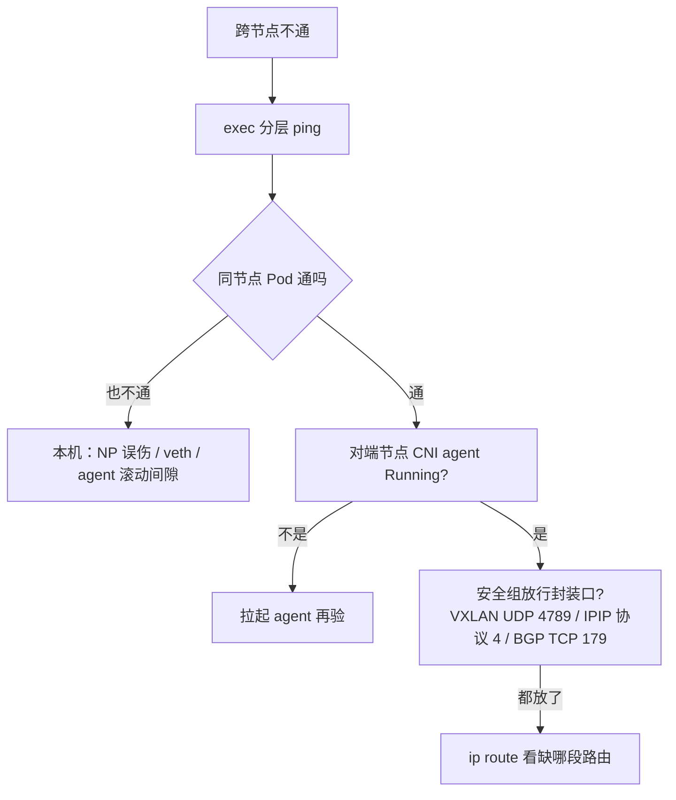

# 10｜CNI 与网络策略 · 练习题

开始做题前：合上知识点，对着**第一节的主图**，把「一个 Pod 网络的一生」口述一遍——DNA → 出生 → 上路 → 立规 → 死亡，每个阶段一个值班现象。讲得出来再做题。

每道题先看场景自己答，再对完整解答。

| 标记 | 含义 |
|------|------|
| **核心** | 不懂整章就没建立起来 |
| **必会** | 值班和面试都要能讲 |
| **常用** | 线上会反复碰到 |
| **常考** | 白板和追问的高频口径 |

题目顺序：Q1～Q3 模型与地址；Q4～Q6 选型与立规；Q7～Q9 上路与死亡；Q10～Q14 专题与边界。

## 本题目录

- [Q1 网络模型三原则与四角色分工](#q1)
- [Q2 CNI 在生命周期的哪一步被调](#q2)
- [Q3 三张网：Pod / Service / Node CIDR](#q3)
- [Q4 Flannel、Calico、Cilium 怎么选](#q4)
- [Q5 NetworkPolicy 默认行为与先放 53](#q5)
- [Q6 写一条 NP：三种选择器](#q6)
- [Q7 跨节点不通：分层排查](#q7)
- [Q8 小包通大包丢：MTU](#q8)
- [Q9 CNI agent 挂了，存量受影响吗](#q9)
- [Q10 egress 只放了 DNS，支付为什么挂](#q10)
- [Q11 IP 池耗尽与 maxPods](#q11)
- [Q12 hostNetwork 的代价](#q12)
- [Q13 东西向与南北向：NS 不是墙](#q13)
- [Q14 Overlay 与 Underlay：Host-GW 还是 VXLAN](#q14)
- [合上书](#合上书)

---

## Q1

**★★★★★｜K8s 网络模型三原则是什么？Pod 互通要不要 NAT？Pod IP 和 VIP 分别谁管？**

**覆盖**：核心 · 必会 · 常考 ｜ **对应**：知识点 [二、DNA：网络模型三原则与三张网](知识点.md)

### 场景

开场就问：「同一个集群里，两个命名空间的 Pod 能直接通吗？Pod IP 是谁分配的？」有人开始背 Flannel 版本号，有人说「VIP 和 Pod IP 都是 kube-proxy 发的」。

先自己试试：不看下面，先口述一遍你的答案，再往下对。

### 完整解答

> 🎯 **一句话**：三原则：每 Pod 一 IP（pause 持 netns）、Pod 间无 NAT、节点 agent 可达所有 Pod；Pod IP 归 CNI，VIP 归 apiserver。

1. **每个 Pod 一个 IP**：真正持网的是 **pause 容器**——第一个创建的容器，独占一个 **netns（网络命名空间）**；业务容器 `join` 进来共享 eth0 和 IP。
2. **Pod 到 Pod 不过 NAT**：对端看到真实 Pod IP。正因为 IP 是真的，抓包看得懂、conntrack 跟得住、NetworkPolicy 匹配得到。
3. **节点上的 agent 能到达所有 Pod**：kubelet、CNI、探针都要够得着。

四角色分工：**CNI** 管 Pod IP 和跨节点连通；**kube-proxy** 管 VIP → Pod 转发 → [08](../08-Service与kube-proxy/)；**CoreDNS** 管名字 → IP → [09](../09-CoreDNS/)；**NetworkPolicy** 管 L3/L4 放行/拦截，执行靠 CNI。

> ⚠️ **别混**：Pod IP 由 CNI 的 IPAM 分配，VIP 由 apiserver 从 Service CIDR 分配——两种号两套人马。

> 📝 **面试**：「K8s 网络模型三句话：每 Pod 一 IP、Pod 间无 NAT、节点可达所有 Pod。无 NAT 才有真实源 IP，抓包和 NP 才成立。Pod IP 是 CNI 分的，VIP 是 apiserver 分的，转发是 kube-proxy 的事。」

### 再追问

- 「为什么坚持不做 NAT，不更省地址吗？」——省地址换来的是策略写不到东西向：NAT 之后源地址失真，NP 和抓包全废。不要为了省几个 IP 把可观测性和策略能力换掉。
- 「两个 NS 的 Pod 能互通，这算安全漏洞吗？」——不算，跨 NS L3 默认通是模型设定；**Namespace 不是安全边界**，隔离要叠 NetworkPolicy + RBAC + 配额，合规硬墙拆集群 → [01](../01-集群架构/)。不要以为建个独立 NS 就合规了。

---

## Q2

**★★★★★｜CNI 是在 Pod 创建的哪一步被调用的？它做了什么？FailedCreatePodSandBox 说明什么？**

**覆盖**：核心 · 必会 · 常考 ｜ **对应**：知识点 [三、出生：CNI ADD 的几个动作](知识点.md)

### 场景

就是开篇翻应用日志那位踩的坑。

战斗服扩容，新节点上一批 Pod 全卡 ContainerCreating，Events 刷着 `FailedCreatePodSandBox`。有人去翻应用镜像日志，有人怀疑调度器坏了。

先自己试试：不看下面，先口述一遍你的答案，再往下对。

### 完整解答

> 🎯 **一句话**：CNI 在 sandbox 建好后、业务容器启动前被调；sandbox 失败 = 业务还没启动。

调用时序：kubelet 经 CRI 请运行时建 **sandbox**（pause 容器 + 它的 netns）→ 运行时按环境变量（`CNI_COMMAND=ADD`、`CNI_NETNS`、`CNI_IFNAME=eth0`）调 `/opt/cni/bin` 下的 CNI 插件，配置来自 `/etc/cni/net.d` → 插件 **ADD** 干四件事：

1. **IPAM 分 IP**：从 Pod CIDR 的本节点段取号；
2. **建 veth pair**：一对虚拟网卡，像穿墙网线连两个 netns；
3. **一端进 Pod netns 当 eth0**，配 IP 和默认路由；另一端在宿主机（Flannel 接网桥 `cni0`，Calico 起名 `caliXXX`）；
4. **写路由**：跨节点这段地址去哪。

之后业务容器才启动并 join 这个 netns。所以 `FailedCreatePodSandBox` 的含义是**网络搭建失败、业务容器还没启动**——翻应用日志没有意义，也不是调度的锅（Pod 已经坐到节点上了）。

```bash
kubectl describe pod battle-new-xxx | tail -5
# Warning  FailedCreatePodSandBox  kubelet  ... IPAM allocation failed: no IP addresses available
#                                                    # ← IP 池耗尽：扩池 / 清泄漏
# 若报 Failed to find network plugin → CNI 没装（新节点经典：DaemonSet 没容忍污点）
```

> 📝 **面试**：「CNI 是规范，运行时在建好 pause 和 netns 之后调插件的 ADD：分 IP、建 veth、配 eth0、写路由。sandbox 失败时业务还没启动，先查 CNI agent、/etc/cni/net.d 和 IP 池。」

### 再追问

- 「`kubectl get pod -o wide` 已经有 IP 了，说明什么？」——说明 sandbox 建好了（出生阶段过了），接下来不通要按同节点/跨节点分层排查，不要再查 CNI 安装。
- 「想看这个 Pod 的 netns 里到底是什么样？」——`crictl pods` 拿 sandbox ID，`crictl inspectp <id>` 看 pause 的 PID，`nsenter -t <pid> -n ip addr` 进去看。不要在宿主机上猜。

---

## Q3

**★★★★☆｜Pod CIDR、Service CIDR、Node CIDR 分别是什么？谁分配、谁使用？重叠了会怎样？**

**覆盖**：核心 · 必会 · 常考 ｜ **对应**：知识点 [二、DNA：网络模型三原则与三张网](知识点.md)

### 场景

这是 Q1 三原则的地址规划版。

新集群规划会，有人把 Pod 网段和办公网段写成了同一段，说「反正一个在内一个在外」；还有人问「Service 的 VIP 是从哪个池子里来的」。

先自己试试：不看下面，先口述一遍你的答案，再往下对。

### 完整解答

> 🎯 **一句话**：三张网各归其主——Pod CIDR 归 CNI IPAM，Service CIDR 归 apiserver，Node CIDR 归物理网络，互不重叠。

- **Pod CIDR**（kubeadm `--pod-network-cidr` / controller-manager `--cluster-cidr`）：所有 Pod IP 的来源，常用 /16；controller-manager 的 Node IPAM controller 按节点切片（`--node-cidr-mask-size` 默认 /24），Calico 等 CNI 用自己的 IPPool 接管。
- **Service CIDR**（apiserver `--service-cluster-ip-range`）：VIP 池，常用 10.96.0.0/12；建 Service 时 apiserver 取号，kube-proxy 负责转发 → [08](../08-Service与kube-proxy/)。
- **Node CIDR**：节点自身网卡网段（INTERNAL-IP）；VXLAN 封装的外层源地址就是它。

三段**重叠 = 路由错乱**，现象是「某些 IP 莫名其妙不通」，一眼看不出来。建集群第一天把三段写进同一张规划表；`--pod-network-cidr` 必须和 CNI 清单一致，改段要重建或一次性迁池，存量不自动迁。

```bash
ps -ef | grep kube-apiserver | grep -o 'service-cluster-ip-range=[^ ]*'
# service-cluster-ip-range=10.96.0.0/12     # ← Service CIDR
kubectl get ippool -o wide                  # ← Pod CIDR（Calico）
kubectl get nodes -o wide                   # ← INTERNAL-IP 就是 Node CIDR
```

### 再追问

- 「每节点那段 /24 是谁切的？」——默认是 kube-controller-manager 的 Node IPAM controller；装了 Calico 这类自带池的 CNI 就由它的 IPPool 管。不要两边都配、互相打架。
- 「Service CIDR 开小了怎么办？」——只能重建集群换 `--service-cluster-ip-range`，VIP 不支持在线扩段；所以规划时宁可给大。不要指望改个配置就生效。

---

## Q4

**★★★★★｜Flannel、Calico、Cilium 怎么选？谁支持 NetworkPolicy？**

**覆盖**：核心 · 必会 · 常考 ｜ **对应**：知识点 [五、选路：Flannel、Calico、Cilium](知识点.md)

### 场景

能 apply ≠ 生效——选路先问交警在不在。

安全合规要求支付命名空间默认拒，集群装的是裸 Flannel。有人把 NP 的 YAML apply 上去，测试发现包照通，于是又叠了一条更严的。

先自己试试：不看下面，先口述一遍你的答案，再往下对。

### 完整解答

> 🎯 **一句话**：生产必选带 NetworkPolicy 的 CNI；裸 Flannel 上 NP 能 apply 但不执行。

| 对比 | Flannel | Calico | Cilium |
|------|---------|--------|--------|
| 跨节点方式 | VXLAN / Host-GW | BGP / IPIP / VXLAN | eBPF 数据面（可配隧道） |
| NetworkPolicy | **默认不支持** | 完整支持 | 支持，且能做 L7 |
| 数据面 | 内核路由 / 网桥 | 内核路由 + iptables | eBPF，可替代 kube-proxy |
| 适合 | 简单小集群 | 生产常用 | 要可观测/高性能再上 |

- **Flannel**：组件最少，无 NP；要策略用 **Canal**（Flannel 的路 + Calico 的交警）过渡或直接换。
- **Calico**：三种数据面——BGP 纯路由（性能最好，要网络支持）、IPIP（协议 4）、VXLAN（UDP 4789）；节点 agent 叫 **Felix**，写路由、落 NP。
- **Cilium**：**eBPF（内核里跑的沙箱小程序）** 数据面，绕开 iptables，能替代 kube-proxy，Hubble 看流量——深水区 → [25](../25-eBPF与Cilium/)。

场景里的病根：裸 Flannel 不执行 NP，叠多少条都是空转。正确动作是换支持 NP 的 CNI（或上 Canal），而不是叠策略。

> 📝 **面试**：「生产选 Calico 或 Cilium，因为要 NetworkPolicy。裸 Flannel 的 NP 是空转。Cilium 的 eBPF 和替代 kube-proxy 我可以单独展开，属于 25 章内容。」

### 再追问

- 「新集群还会推荐 Canal 吗？」——不会，Canal 是历史过渡方案，今天直接上 Calico 或 Cilium。不要在新集群里引入过渡架构。
- 「Calico 在云上做不了 BGP 怎么办？」——退回 IPIP 或 VXLAN 封装，安全组放行协议 4 / UDP 4789。不要硬上 BGP 然后怪云。

---

## Q5

**★★★★★｜NetworkPolicy 的默认行为是什么？为什么上线第一步是放行 53？**

**覆盖**：核心 · 必会 · 常考 ｜ **对应**：知识点 [六、立规：NetworkPolicy](知识点.md)

### 场景

就是开篇 default-deny 那位踩的坑。

有人给 pay 命名空间上了 `podSelector: {}` 的默认拒，三分钟后全集群 `nslookup` 全挂，但 `ping 10.96.0.10` 还通。群里已经有人在准备重启 CoreDNS。

先自己试试：不看下面，先口述一遍你的答案，再往下对。

### 完整解答

> 🎯 **一句话**：无策略全通；被选中该方向默认拒、只放写明的；上默认拒必须先放 DNS 53。

默认行为五种状态：

| 状态 | 行为 |
|------|------|
| NS 里没有任何 NP | 全放行，跨 NS 也通 |
| Pod 被某条 ingress 规则选中 | 入站默认拒，只放写明的 from |
| Pod 被某条 egress 规则选中 | 出站默认拒，只放写明的 to |
| 多条 NP 选中同一 Pod | 并集，任一放行即通过 |
| CNI 不执行 | YAML 能 apply，不生效 |

场景解析：默认拒把 pay Pod 的**出站**全关了——DNS 查询走 egress 到 kube-system 的 53 端口，所以名字挂；而三层路由没动，ping VIP 照通。**先别动 CoreDNS**：

```bash
kubectl exec pay-pod-xxx -- ping -c 2 10.96.0.10        # 通：路没坏
kubectl exec pay-pod-xxx -- nslookup kubernetes.default  # 超时：53 被拒
```

止血两选一：补一条放行 `kube-system` 53（UDP/TCP）的 egress，或改/删该 NP——**NP 改动即时生效，不用滚动业务**。上线顺序：①确认 CNI 支持 → ②核心 NS 默认拒入站 → ③先放 53 → ④放网关/Ingress → ⑤放东西向和出站公网段。

> 📝 **面试**：「K8s 默认是全通的，被 NP 选中才变成该方向默认拒，多条取并集。上默认拒第一天必须先放 kube-system:53，否则全集群解析挂、IP 还通——这个现象要能当场解释。」

### 再追问

- 「改错了，回滚要不要滚动所有 Pod？」——不要，NP 是声明式即时生效，改回策略秒级恢复；不要拿滚动当回滚手段。
- 「只放行入站、不管出站行不行？」——入站和出站相互独立，出站不动就仍是全通；但别以为入站策略保护了数据外泄——外联控制靠 egress。不要只写一半就当完成了加固。

---

## Q6

**★★★★☆｜写一条 NP：只允许网关命名空间访问战斗服的 7001 端口，其余全拒。跨 NS 和集群外地址分别怎么写？**

**覆盖**：必会 · 常用 · 常考 ｜ **对应**：知识点 [六、立规：NetworkPolicy](知识点.md)

### 场景

立规怎么写：三种选择器。

安全整改，有人写了条大范围的 `podSelector` 默认拒，结果把网关到战斗服的流量也切了——战斗服上报连接超时，有人怀疑是战斗服代码问题。

先自己试试：不看下面，先口述一遍你的答案，再往下对。

### 完整解答

> 🎯 **一句话**：三种选择器——podSelector 同 NS、namespaceSelector 跨 NS、ipBlock 任意 CIDR；选中即拒，放行要写全。

三种对端声明（`from`/`to` 里，可叠加）：

- **podSelector**：按标签选 Pod，默认范围与 NP 同 NS；
- **namespaceSelector**：按 NS 标签选中整个命名空间——跨 NS 流量只能靠它；
- **ipBlock**：任意 CIDR——集群外地址只能靠它，可 `except` 挖洞。

题目要的策略：

```yaml
apiVersion: networking.k8s.io/v1
kind: NetworkPolicy
metadata:
  name: battle-allow-gateway
  namespace: battle
spec:
  podSelector:
    matchLabels: { app: battle }        # ← 选中战斗服：入站即默认拒
  policyTypes: [Ingress]
  ingress:
  - from:
    - namespaceSelector:
        matchLabels: { kubernetes.io/metadata.name: ingress-nginx }
    ports:
    - { protocol: TCP, port: 7001 }     # ← 只放网关的 7001
```

误伤排查：`kubectl get netpol -n battle` + `kubectl describe netpol`，看 selector 是否误圈、from 里有没有网关所在 NS——改策略即时生效。注意多条 NP 是**并集**，做不到「叠一条去减掉某条的放行」。

> ⚠️ **别混**：`podSelector: {}` 是选中**本 NS 全部**，不是「不选」；漏写 policyTypes 时行为由规则推断，显式写 `[Ingress, Egress]` 永远不会错。

### 再追问

- 「战斗服要回调集群外的支付平台，怎么写？」——用 `ipBlock` 写对端 CIDR，放 TCP 443；不要为了省事写 `0.0.0.0/0`。
- 「能不能按 HTTP 路径做策略，比如只放行 /login？」——标准 NP 只管 L3/L4 不行；Cilium 能做 L7 → [25](../25-eBPF与Cilium/)。不要硬把七层需求塞进 NP。

---

## Q7

**★★★★☆｜同节点通、跨节点不通，怎么排查？**

**覆盖**：必会 · 常用 · 常考 ｜ **对应**：知识点 [四、上路：跨节点的三条路](知识点.md)

### 场景

主图虚线「同节点通、跨节点不通」。

新集群验收，业务说「服务之间连不上」。有人立刻去抓业务端口的包，有人直接重启了 CNI 的 DaemonSet。

先自己试试：不看下面，先口述一遍你的答案，再往下对。

### 完整解答

> 🎯 **一句话**：先分层定界——同节点对照、跨节点断，再查 agent、安全组、路由。



动作顺序：① `kubectl exec` 分别 ping 同节点和跨节点的 Pod，坐实「跨节点」这个界；② 看对端节点 CNI agent（calico-node / kube-flannel-ds）是否 Running——它是 DaemonSet，「部分节点不通」第一嫌疑就是它；③ 云上看安全组是否放行封装口——症状统一是「同节点通、跨节点全不通」；④ 节点上 `ip route | grep -E 'cali|flannel'`，缺哪段路由就是哪个节点的问题。

```bash
kubectl exec hall-pod-aaa -- ping -c 2 10.244.3.30
# 100% packet loss                                  # ← 跨节点断
ip route | grep 10.244.3
# 10.244.3.0/24 via 192.168.1.12 dev flannel.1 onlink
# 没有这一行 = 对端段的路由没学到
```

> ⚠️ **别混**：如果是 **VIP 不通、Pod IP 直连通**，那是 kube-proxy/Endpoints 的问题 → [08](../08-Service与kube-proxy/)，别在 CNI 上浪费时间。

### 再追问

- 「节点能 ping 通对端 Pod，Pod 之间却不通？」——路没坏，查 NetworkPolicy 是否拦了、或本机 veth/网桥；不要去动物理网络。
- 「重启 CNI DaemonSet 是不是万能药？」——不是，滚动期间有跨节点黑洞窗口，`maxUnavailable` 要小、先定位再动。不要一把滚全节点。

---

## Q8

**★★★★☆｜小包通、大包丢，你首先怀疑什么？怎么验证和修复？**

**覆盖**：必会 · 常用 · 常考 ｜ **对应**：知识点 [四、上路：跨节点的三条路](知识点.md)

### 场景

上路段的大包病：别先查应用端口。

Overlay 上线后，战斗服的大帧同步频繁超时，小心跳和登录（小包）都正常。有人认定是应用端口被防火墙拦了，准备加白名单。

先自己试试：不看下面，先口述一遍你的答案，再往下对。

### 完整解答

> 🎯 **一句话**：首先怀疑 MTU 不匹配——Overlay 封装吃掉 50 字节，内层只能发 1450。

机制：VXLAN 封装要加外层头（UDP 8 + 外层 IP 20 + 以太网 14 + VXLAN 8 = 50），物理 MTU 1500 时 Pod 内层最多 **1450**。任何一环配成 1500，大包（DF 位置着）到隧道口就丢。特征：**握手、ping 这类小包全通，一上数据就超时**，TCP 表现为反复重传同一个大段。

```bash
kubectl exec gate-old-yyy -- ping -c 2 10.244.5.7             # 小包：通
kubectl exec gate-old-yyy -- ping -M do -s 1472 -c 2 10.244.5.7
# ping: sendmsg: Message too long      # ← 1472+28=1500 超内层 MTU，坐实
nsenter -t <pause-pid> -n ip link show eth0 | grep -o 'mtu [0-9]*'
# mtu 1500                              # ← 没按封装减，就是病根
```

修复：把 CNI 的 MTU 设为 1450（VXLAN）或 1480（IPIP），重建受影响 Pod。若「需要分片」的 ICMP 也被安全组拦了，就是 PMTUD 黑洞 → [01-16](../../01-基础底座/16-网络排障与抓包/)。

> 📝 **面试**：「小包通大包丢，第一反应是 MTU：Overlay 要减封装头，VXLAN 通常 1450。用 `ping -M do -s 1472` 复现，看 Pod eth0 的 MTU，改 CNI 配置。」

### 再追问

- 「为什么 TCP 握手能过、数据传不动？」——握手是小包；大包要么被丢（DF）、要么走 PMTUD 协商 MSS，协商失败就卡住。不要看到「连接建立了」就排除网络问题。
- 「IPIP 模式要减多少？」——外层只加 20 字节，内层 1480。不要把 VXLAN 的 1450 套到所有封装上。

---

## Q9

**★★★★★｜calico-node（CNI agent）挂了，存量 Pod 的网络会受影响吗？你怎么办？**

**覆盖**：核心 · 必会 · 常考 ｜ **对应**：知识点 [七、死亡：CNI DEL 与 IP 回收](知识点.md)

### 场景

口诀「先拉 agent，别杀业务」的现场版。

某节点 calico-node CrashLoop，那台节点上的战斗服还活着，但新扩容的 Pod 全卡 ContainerCreating。有人准备滚动重启战斗服「恢复一下」。

先自己试试：不看下面，先口述一遍你的答案，再往下对。

### 完整解答

> 🎯 **一句话**：基本不影响存量——veth 和路由在内核里；只影响新建和删除，先拉起 agent 再说。

CNI agent 只在**出生**（ADD）和**死亡**（DEL）时干活；包上路后走的是内核里的 veth、路由、隧道，不经过 agent。所以：

| agent 状态 | 存量 Pod | 新建 / 删除 Pod |
|-----------|---------|----------------|
| agent 挂 | 流量基本不受影响 | ADD 失败 ContainerCreating；DEL 可能失败、漏 IP |

两个细节：① **BGP 模式例外**——agent 攥着 BIRD，挂了 = BGP 会话断，交换机撤掉该节点网段路由，跨节点进来的流量可能断（同节点照常）；② 处理顺序和 kube-proxy 挂了同款（[08](../08-Service与kube-proxy/)）：**先拉起 agent，绝不重启业务进程**——重启会杀掉本来还活着的长连接，把局部故障升级成全员掉线。

```bash
kubectl -n kube-system get pod -l k8s-app=calico-node -o wide
# NAME                READY  STATUS      NODE
# calico-node-x9k2p   0/1    CrashLoopBackOff  node-battle-05   # ← 只有一台
kubectl -n kube-system logs calico-node-x9k2p --previous | tail   # ← 看挂因，拉起
```

> 📝 **面试**：「CNI agent 挂，存量 Pod 基本不受影响，因为 veth 和路由在内核；受影响的是新 Pod 创建和删除回收。例外是 BGP 模式会话断会撤路由。动作是先拉起 agent，不动业务。」

### 再追问

- 「DEL 失败会留下什么后患？」——IP 泄漏：池子占用只涨不跌，最后新 Pod 分不到号；所以配 >80% 告警，Calico 有 IPAM 对账清理。不要等池子 100% 才发现。
- 「滚动升级 CNI DaemonSet 要注意什么？」——`maxUnavailable` 调小，逐节点滚；一把滚全节点会人为制造跨节点黑洞窗口。不要图快全量滚。

---

## Q10

**★★★★☆｜上了 NP 之后 DNS 正常，但调支付网关超时，为什么？**

**覆盖**：必会 · 常用 ｜ **对应**：知识点 [六、立规：NetworkPolicy](知识点.md)

### 场景

这是 Q5 放行 53 之后的下一刀。

给 pay 上了默认拒，记得放行 53，解析全部正常。第二天发现支付回调失败，有人又去重启 CoreDNS「碰碰运气」。

先自己试试：不看下面，先口述一遍你的答案，再往下对。

### 完整解答

> 🎯 **一句话**：解析通只代表 53 放行成功；访问公网支付网关是另一条 egress，要单独放。

NP 的 egress 是**逐目标**放行的：放行了到 `kube-system:53` 只解决解析，Pod 出集群访问 `203.0.113.0/24:443` 仍被默认拒。补一条：

```yaml
  egress:
  - to:
    - ipBlock: { cidr: 203.0.113.0/24 }   # ← 支付网关公网段
    ports:
    - { protocol: TCP, port: 443 }
```

验证顺序：`nslookup` 通（53 已放）→ `curl -v https://支付域名` 看是连接超时（被拦）还是握手后错误（应用层）→ 对照 `kubectl describe netpol -n pay` 的 egress 列表。改完即时生效，不用滚。

> ⚠️ **别混**：「名字挂、IP 通」查 53；「解析通、HTTPS 挂」查目标 egress 或证书——两个现象两副药，别都丢给 CoreDNS。

### 再追问

- 「支付平台的出口 IP 不固定怎么办？」——向对方要 CIDR 列表写多个 ipBlock；实在不行再考虑固定出网网关（SNAT 出口），不要直接 `0.0.0.0/0` 全放。
- 「怎么快速判断是 NP 拦的还是支付平台挂了？」——从同集群另一个没被选中的 NS 访问同一地址对比；通了就是策略，不通再往外查。不要上来就回滚策略。

---

## Q11

**★★★★☆｜新 Pod 全部 sandbox 失败，老节点正常，怎么查？IP 池怎么规划？**

**覆盖**：必会 · 常用 ｜ **对应**：知识点 [三、出生：CNI ADD 的几个动作](知识点.md)

### 场景

这是 Q2 sandbox 失败的 IP 池特写。

某节点新 Pod 全部 `FailedCreatePodSandBox`，调度明明显示节点还有资源。有人说「调度器坏了」，有人要把 maxPods 从 110 调到 250。

先自己试试：不看下面，先口述一遍你的答案，再往下对。

### 完整解答

> 🎯 **一句话**：调度看 CPU/内存，看不见 CNI 的段；大概率是这个节点的 Pod 段耗尽或泄漏。

「能调度却起不来」的原因：调度器只算 CPU/内存/亲和，**不知道 IP 段还剩几个**。查法：

```bash
kubectl describe pod <卡住的> | grep -A2 FailedCreatePodSandBox
# IPAM allocation failed: no IP addresses available   # ← 本节点段用光
kubectl get ippool -o wide                            # Calico：看池总量与模式
# 核对：泄漏（DEL 失败没回收）还是真用光
```

规划口径：整集群 Pod CIDR 用 **/16**（别用 /24，几十个节点就耗尽），每节点一段 **/24**（约 256 个）；kubelet 默认 maxPods **110** 通常够用——把 maxPods 调到 250 却不改每节点掩码，段会先于 Pod 数耗尽；监控 **>80%** 告警。处理：扩池、对账清泄漏、或给该节点换更大的段；**改了 CIDR 存量不自动迁**，别指望。

> 📝 **面试**：「调度成功但 sandbox 失败，是 IP 段耗尽或泄漏——调度器看不见 CNI 地址池。规划是 /16 集群、/24 每节点、对齐 maxPods 110，>80% 告警。」

### 再追问

- 「DEL 失败导致的泄漏怎么清？」——先修 CNI（拉起/升级），让后续删除能正常回收，再用 Calico 的 IPAM 对账工具清理；不要手工删池子里的记录。
- 「为什么不是所有节点同时爆？」——段是按节点切的，谁的 Pod 周转快谁先耗尽。不要等全集群爆才开始查。

---

## Q12

**★★★☆☆｜hostNetwork 有什么代价？它和 CNI 模型是什么关系？**

**覆盖**：必会 · 常用 ｜ **对应**：知识点 [二、DNA：网络模型三原则与三张网](知识点.md)

### 场景

DNA 段的特例：不走 CNI。

有人为了「降延迟」给战斗服开了 `hostNetwork: true`，结果端口和节点上的 Ingress 冲突、NP 对它失效、Pod 里短域名全解析不了，又准备加一堆特权参数。

先自己试试：不看下面，先口述一遍你的答案，再往下对。

### 完整解答

> 🎯 **一句话**：hostNetwork 直接用节点 netns、不走 CNI——三原则对它部分失效，代价有四。

四个代价：

1. **占节点端口**：和 NodePort、Ingress、别的 hostNetwork Pod 直接冲突；
2. **绕过 CNI/部分 NP 模型**：排障要按裸机思路来，本章的网络分层对它大半不适用；
3. **DNS 默认变了**：`dnsPolicy` 不改 `ClusterFirstWithHostNet`，集群内短域名解析全挂 → [09](../09-CoreDNS/)；
4. **安全收紧**：PSS baseline 默认禁用 → [13](../13-RBAC与安全/)。

正确姿势：延迟问题先查封装方式和同 AZ 调度（见 Q14），hostNetwork 是最后手段且要评审。

> 📝 **面试**：「hostNetwork 的 Pod 直接用节点网络栈，不走 CNI：占节点端口、绕开 NP、dnsPolicy 要改、PSS 默认禁。游戏场景除非有硬延迟需求，否则不用。」

### 再追问

- 「为什么短域名突然解析不了？」——hostNetwork Pod 的默认 dnsPolicy 不走集群 DNS，短域名没有 search 域；要显式 `ClusterFirstWithHostNet`。不要靠加 /etc/hosts 硬顶。
- 「它真能省多少？」——省的是 veth/桥这一跳和封装，通常微秒级；先量化再上。不要拿它当性能银弹。

---

## Q13

**★★★★☆｜支付服和战斗服在同一个集群，只在 Ingress 做认证，够吗？东西向怎么管？**

**覆盖**：必会 · 常考 ｜ **对应**：知识点 [二、DNA：网络模型三原则与三张网](知识点.md)

### 场景

回扣 Q1：NS 不是墙。

评审会上有人说「网关有鉴权，内网不用管」；另一边合规要求支付服独立隔离。有人建议「给支付单独建个 Namespace 就行」。

先自己试试：不看下面，先口述一遍你的答案，再往下对。

### 完整解答

> 🎯 **一句话**：南北向靠 LB/Ingress，东西向靠 NetworkPolicy；NS 不是墙，RBAC 管 API 不管包。

- **南北向**（玩家 → 集群）：LB / Ingress 做认证和七层规则 → [15](../15-Ingress与流量管理/)；
- **东西向**（集群内部互访）：只有 NetworkPolicy 能在三层四层拦——RBAC 管的是 API 请求，管不了 Pod 之间直连的包；
- **Namespace 不是安全边界**：跨 NS 默认 L3 全通，单独建 NS 只是管理分组，不是隔离。

同集群部署支付与战斗的最小配置：独立 NS + 最小 RBAC + **NP 默认拒再精确放行**（支付只收网关、出站只放 DNS 和支付网关段）+ 必要时污点/独立节点池 → [01](../01-集群架构/)。

> 📝 **面试**：「认证只放南北向入口是不够的——集群内东西向默认全通，被攻破一个点就能横移到支付。所以东西向必须靠 NetworkPolicy，再加最小 RBAC 和配额；Namespace 本身不是安全边界。」

### 再追问

- 「配了 RBAC 还需要 NP 吗？」——需要，两者管不同层：RBAC 管谁能调 API，NP 管包能不能到 Pod。不要互相替代。
- 「合规要硬隔离怎么办？」——拆集群或独立节点池，NP 只是软边界。不要跟审计说「NP 等于物理隔离」。

---

## Q14

**★★★★☆｜Overlay 和 Underlay 的区别？Host-GW 和 VXLAN 怎么选？跨 AZ 要注意什么？**

**覆盖**：必会 · 常用 · 常考 ｜ **对应**：知识点 [四、上路：跨节点的三条路](知识点.md)

### 场景

这是 Q7/Q8 路上选型的收束。

自建机房节点二层直连，却装了 VXLAN 模式，跨机战斗状态同步频繁重传；网络团队来看了一眼说「这是 K8s 自己的问题」。

先自己试试：不看下面，先口述一遍你的答案，再往下对。

### 完整解答

> 🎯 **一句话**：Overlay 套信封不挑网络，Underlay 靠 BGP 直路由性能最好；二层通就用 Host-GW，别白付封装税。

| 对比 | Overlay（Flannel VXLAN / Calico IPIP·VXLAN） | Underlay（Calico BGP） |
|------|----------------------------------------------|------------------------|
| 做法 | 外层套节点 IP，隧道运输 | 物理网络直接路由 Pod CIDR |
| 性能 | 有封装开销，MTU 要减 | 更好，无封装 |
| 依赖 | 几乎不改物理网络 | 网络团队 / 云支持 BGP |
| 安全组要放 | UDP 4789 / 协议 4 | TCP 179 |

- **Host-GW**：节点二层直连时，直接把「这段地址去哪个节点」写成路由，不封装不减损——场景里二层通却用 VXLAN，等于白付每包 50 字节的封装税，换 Host-GW 或 BGP。
- **云上的现实**：VPC 一般不保证节点二层直连，Host-GW 做不了，只能 VXLAN/IPIP；云支持 BGP（部分托管集群/专线）才上 Underlay。
- **跨 AZ 长连接**：跨 AZ 每个包多一跳转发和封装，P99 会抖；战斗服与 Redis 尽量同 AZ（调度拓扑 → [06](../06-调度机制/)），别让战斗流量跨可用区钻隧道。

> 📝 **面试**：「选型看物理网络：二层通优先 Host-GW 或 BGP，性能最好；云上一般被迫 VXLAN，记得减 MTU 到 1450、放行 4789。跨 AZ 有封装和转发开销，长连接组件尽量同 AZ。」

### 再追问

- 「为什么云上不直接二层直连？」——多租户 VPC 不保证节点同广播域，Host-GW 的直连假设不成立。不要拿自建机房的结论套云上。
- 「BGP 模式要网络团队做什么？」——接受节点用 TCP 179 建邻居、学习并转发 Pod CIDR；安全组/防火墙放行 179。不要跳过网络团队自己配。

---

## 合上书

逐条对齐知识点的「合上书」（题号已标在知识点侧），能对一条算过一条：

1. **默画主图**：Pod 网络一生五阶段（DNA → 出生 → 上路 → 立规 → 死亡），每阶段一个值班现象和第一刀（Q2/Q7/Q5）。
2. **口述 DNA**：三原则；三张 CIDR 各归谁管；NS 为什么不是安全边界；hostNetwork 的四个代价（Q1/Q3/Q13/Q12）。
3. **口述出生**：CNI 哪一步被调；ADD 四件事；FailedCreatePodSandBox 三种定责（Q2/Q11）。
4. **口述上路**：同节点路径；Overlay vs BGP；安全组三口；MTU 减多少、大包丢的样子（Q7/Q8/Q14）。
5. **口述选路**：Flannel/Calico/Cilium 差异；裸 Flannel 的 NP 为什么空转；Calico 三种数据面（Q4）。
6. **口述立规**：无策略全通/选中默认拒/并集；三种选择器；先放 53；改 NP 不滚动（Q5/Q6/Q10）。
7. **口述死亡**：DEL 回收什么；agent 挂了存量与新各怎样；为什么不重启业务（Q9）。
8. **口述定责**：60 秒剧本；没 IP / 同节点 / 跨节点三入口；名字挂 IP 通去哪查（Q7/Q5/Q10）。
9. **口述数字**：4789 / 协议4 / 179 / 1450 / 110 / 80%（Q8/Q11/Q14）。

九条都能不看稿讲下来，这一章就过了。终极测试：拦住开篇那两个误操作。
