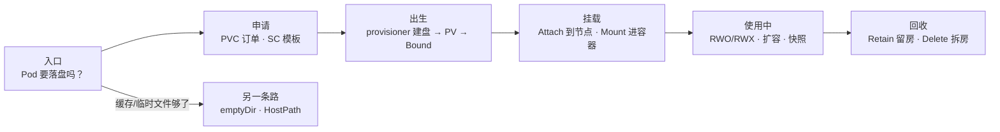
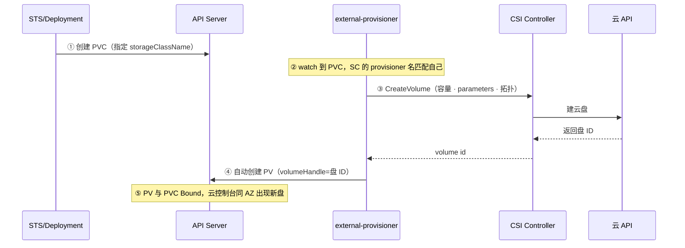
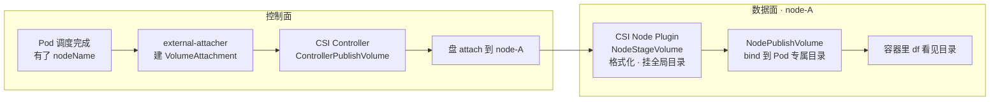
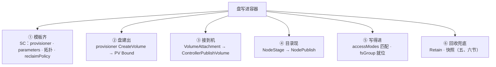
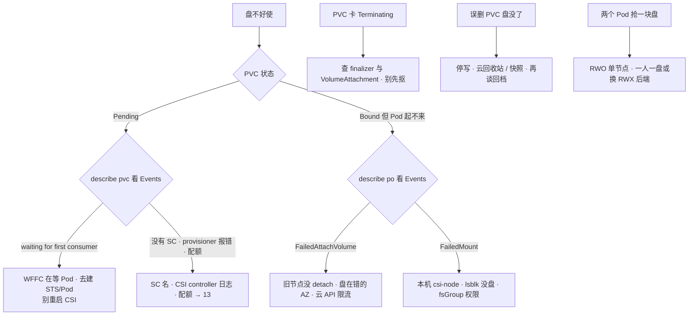

# 存储

> PVC Pending 半小时，有人说 CSI 挂了，准备重启 kube-system 里所有 Pod；同一时刻有人「清理无用 PVC」，生产 SC 是 Delete，云控制台的盘一片片消失；还有人已经抄起 `kubectl patch`，准备把 PVC 的 finalizers 抠掉。
> **本章回答**：一块盘在 K8s 里的一生——谁申请、谁创建、谁挂载、谁扩容、谁回收，每一段坏了怎么一眼定责。
> **不讲**：调度与拓扑 AZ 细节 → [06](../06-调度机制/)；drain 与本地盘节点操作 → [17](../17-节点运行时与升级/)；对象卡 Terminating 的 finalizer 通用机制 → [01](../01-集群架构/)；游戏回档流程与 RPO 运营 → [07-09](../../07-游戏运维专题/09-玩家数据备份与回档/)；配额把 PVC 卡住 → [13](../13-RBAC与安全/)；GitOps 怎么管 YAML → [23](../23-GitOps-ArgoCD与Tekton/)。

**标记**：🎯重点 · 🔥难点 · ⭐常考 · 🔧实操

---

## 一、一张图：一块盘的一生

> 🎯 **一句话**：一块盘五段命——申请、出生、挂载、使用、回收；出了问题先问它卡在哪一段。



**读图**：

- 主线从「Pod 要落盘」进，申请 → 出生 → 挂载 → 使用 → 回收五段串成一条时间线，每节讲一段。排障先定位段：Pending 是出生段的事，ContainerCreating 是挂载段的事，Terminating 和丢盘是回收段的事。
- `kubectl describe pvc` / `describe po` 的 Events 是本章的 X 光机——像 13 章的 `ss -ti`，不换器官，只照「这块盘现在卡在哪一段」。
- 另一条路 emptyDir / HostPath 根本不走 PV/CSI 这条链，随 Pod 或节点生死，命短但简单（七节）。

---

## 二、申请：PV、PVC、StorageClass 三角色

> 🎯 **一句话**：应用只写 PVC 名；PV 是那块真盘，SC 是建盘模板，provisioner 是干活的。⭐

> 💡 **打个比方**：点外卖。**PVC** 是订单——「要 100Gi、单人写、走 cloud-ssd 这家店」；**StorageClass** 是店里的套餐模板——用什么盘型、什么规格、吃完（删 PVC）盘子怎么处理；**PV** 是真正做出来的那份餐；**provisioner（供给器）** 是厨房本身。应用只拿订单号，不碰厨房，也不碰盘子。

**PersistentVolumeClaim（PVC，持久卷声明）** = 应用的盘申请：要多大容量（`resources.requests.storage`）、什么 accessModes（五节）、用哪个 StorageClass。大厅 STS 的 YAML 里只有 `volumes.persistentVolumeClaim.claimName: data-hall-0`，没有云盘 ID——**这是解耦点**：换云厂商、换盘型，业务 YAML 不动，盘的生命周期全交给 CSI。

```yaml
volumes:
- name: data
  persistentVolumeClaim:
    claimName: data-hall-0      # ← 应用只认这个名字，不知道背后是哪块盘
```

**PersistentVolume（PV，持久卷）** = 集群里那块真实的盘。两个来源：管理员手工预建（**静态供给，static provisioning**）或 provisioner 动态建出来（**动态供给，dynamic provisioning**，三节）。phase 三态：Available（待认领）/ Bound（已绑 PVC）/ Released（PVC 删了、盘还在）。

**StorageClass（SC，存储类）** = 动态供给的模板，**不是盘**：

```yaml
apiVersion: storage.k8s.io/v1
kind: StorageClass
metadata:
  name: cloud-ssd-retain
provisioner: diskplugin.csi.example.com   # ← 用哪个 CSI 驱动建盘
reclaimPolicy: Retain                     # ← 删 PVC 后盘怎么办（六节）
volumeBindingMode: WaitForFirstConsumer   # ← 何时绑定、何时建盘（四节）
allowVolumeExpansion: true                # ← 允许 PVC 扩容（五节）
parameters:
  type: cloud_ssd                         # ← 盘型：IOPS/吞吐跟这里走，不跟 PVC 的 Gi
  fstype: ext4
allowedTopologies:                        # ← 只允许在哪些 AZ 建盘
- matchLabelExpressions:
  - key: topology.kubernetes.io/zone
    values: ["cn-hangzhou-a", "cn-hangzhou-b"]
```

`parameters` 是厂商方言：云盘类型、加密、吞吐。**PVC 只声明 Gi**——日志盘和 DB 盘共用一个「便宜 HDD」SC，写满时 IOPS 会教你做人。`volumeMode` 默认 `Filesystem`（文件系统）；`Block` 把裸设备直接递进容器，给要裸盘的库用，绑定时也要和 PV 一致。

**绑定是一对一的**，四项必须全匹配，缺一就永远 Pending：容量（PV ≥ PVC）、accessModes、storageClassName、volumeMode。

> ⚠️ **别混**：**申请不是盘**。PVC Pending 不代表盘坏了，可能还没建；PVC Bound 只代表「盘认到了」，不代表挂上了、更不代表能写（四节收束）。同理 **SC 不是盘**——「我建了 StorageClass 怎么 PVC 还 Pending」，常是消费 Pod 还没出现（四节 WFFC）。

> 🔍 **现场**：日常确认就这两条，phase 比任何日志都诚实。

```bash
kubectl get pvc -n game
# NAME         STATUS    VOLUME      CAPACITY   ACCESS MODES   STORAGECLASS
# mysql-data   Bound     pv-a1b2     100Gi      RWO            cloud-ssd-retain   ← Bound 正常
# replay-log   Pending                                      cloud-ssd-retain   ← Pending 从这里查

kubectl get pv
# NAME     CAPACITY   ACCESS MODES   RECLAIM   STATUS     CLAIM              STORAGECLASS
# pv-a1b2  100Gi      RWO            Retain    Bound      game/mysql-data    cloud-ssd-retain
# pv-c3d4  200Gi      RWO            Retain    Released   game/old-data      ← PVC 没了，盘还在（六节）
```

**静态 PV** 只留给三种场合：机房迁云把已有盘导入、误删后把回收站里的盘重新 import 补救、特殊盘不走 provisioner。手写静态 PV 必须给对 `volumeHandle`（云盘 ID）、accessMode、capacity ≥ PVC，PV 上的 `nodeAffinity` / zone label 还要对上消费 Pod，否则 Bound 了照样 FailedAttach。**日常不要手工堆 PV**——多 AZ 调度和扩容一来，手工 PV 必崩。Released 的 PV 不能直接再绑，清掉 `claimRef` 才能回 Available：

```bash
kubectl patch pv pv-c3d4 -p '{"spec":{"claimRef":null}}'   # ← 静态补救动作，不是日常路径
```

> 📝 **面试**：问「应用为什么只写 PVC 名」，三句：① 应用声明意图（要多大、怎么用），不碰实现；② provisioner 按 SC 模板建盘，自动生成 PV 绑定；③ 换云厂商、换盘型只改 SC，业务 YAML 不动。追问「静态什么时候用」答导入旧盘和误删补救，不是日常。

---

## 三、出生：动态供给

> 🎯 **一句话**：PVC 出现 → provisioner 调 CreateVolume 建真盘 → 自动建 PV 绑定，全程无人。⭐

**供给（provisioning）** = 「把盘按申请造出来」这个过程。动态供给的链条五步，白板上要能画：



**读图**：从 PVC Events 进图——`ProvisioningSucceeded` 说明 ③④ 走完了；卡在哪一步往回找：SC 名写错 / provisioner 没装，PVC 没人认领；CreateVolume 报错，翻 CSI controller 日志和云 API（配额、权限、参数错）。

**CSI（Container Storage Interface，容器存储接口）** 是 K8s 的统一存储插件标准——云厂商实现这套接口，K8s 就能用它的盘。云厂商 CSI 驱动通常是两个形态：**Controller** 是 Deployment（管建盘、删盘、attach 这类全局动作），**Node Plugin** 是 DaemonSet（每个节点一个，管把盘挂进本节点的容器，四节）。伴随的 sidecar 面试能点名即可：external-provisioner（建盘）、external-attacher（挂载票据）、external-resizer（扩容）、external-snapshotter（快照）、node-driver-registrar（节点注册）、livenessprobe（健康探针）。

两种「挂了」影响面完全不同，常考：

- **CSI Controller 挂了**：新盘建不出（PVC Pending）、盘删不掉（Terminating）、新 attach 失败——**已经挂上的盘通常不受影响**，数据面归 Node Plugin 管。
- **某节点 CSI Node Plugin 挂了**：只有调度到这台机器的 Pod 会 FailedMount，别的节点照常；已经挂上的盘不一定立刻掉。

> 🔍 **现场**：PVC Pending 且 Events 报错时，按这个顺序确认。

```bash
kubectl get csidriver
# NAME                           ATTACHREQUIRED
# diskplugin.csi.example.com     true            ← 没列出驱动 = CSI 没装，后面不用查了

kubectl logs -n kube-system -l app=csi-provisioner -c external-provisioner --tail=30
# ← CreateVolume 的报错都在这：配额超了、参数错、权限不足
```

> ⚠️ **别混**：**验收不要只看 CSI Pod Running**。最小闭环：建一个测试 PVC + 消费 Pod，等到 Bound 且容器内 `df` 看见目录，再删干净（Retain 的 SC 记得手动清 PV 和云盘，别拿生产 SC 做实验）。另外 CreateVolume 是**按 PVC 串行**的——CSI controller 副本 ≥2 是高可用，加副本不等于建盘变快。

静态还是动态，一句话：**生产默认动态 SC + CSI**，按需建、少人工，多 AZ 和扩容才撑得住；静态只做旧盘导入和误删补救（二节）。托管集群（ACK / EKS / GKE）通常自带云盘 SC，自建集群要自己装对应 CSI——WFFC 要在 SC 上出生时就写好，不是出事时才在 PVC 上想起（四节）。

---

## 四、挂载：CSI 两段与 WaitForFirstConsumer

> 🎯 **一句话**：Attach 是盘接到节点，Mount 是目录进容器；WFFC 等 Pod 落点再在那个 AZ 建盘。🔥

### 两段：Attach 与 Mount 🔥

> 💡 **打个比方**：**Attach** 像把移动硬盘插到电脑 USB 口——机器级，`lsblk` 里能看到设备；**Mount** 像在桌面上打开硬盘目录——系统级，能进去读写。FailedAttach 是「口没插上或被别人占着」；FailedMount 是「插上了但系统读不出来」（格式、权限）。

**Attach（挂接）** = 把盘接到指定节点，云上对应 attach 操作，反向是 **Detach**；**Mount（挂载）** = 格式化并挂到目录、容器里可见，反向是 **Unmount**。Pod 有了 nodeName（调度完成）挂载才开始，两段各有人管：



**读图**：控制面管「盘到哪台机」（attach），数据面管「目录进容器」（mount）；排障先看 Pod Events 的关键词就知道卡在前半还是后半——`FailedAttachVolume` 是前半，`FailedMount` 是后半。卸载反着走：NodeUnpublish → NodeUnstage → ControllerUnpublish（Detach）。

**VolumeAttachment（挂接票据）** 是 K8s 记录「哪块盘该 attach 到哪台节点」的对象。PVC Terminating、Pod 迁移卡住时，先查它摘没摘。

> ⚠️ **别混**：**FailedAttachVolume 和 FailedMount 不是一种病**（全章只讲这一次，作战节直接引用）。Attach 失败查「盘和旧节点 / AZ / 云 API」——旧节点没 detach 干净、盘在错的 AZ、云侧限流；Mount 失败查「本机」——该节点 csi-node Pod、文件系统格式、fsGroup 权限。把插不上和读不出混着治，方向反了白忙。

RWO 云盘从 node-A 迁到 node-B：**先 detach 再 attach**，中间有一段中断。游戏服切节点要接受这段中断，**不要当零停机**；短时间大量 detach/attach（滚动有状态服务、抢节点）还会打满云厂商 API 配额——Events 里带 cloud provider / CSI timeout，看着像「K8s 挂载坏了」，先看云控制台 attachment 和限流，不要连环强删 Pod。

### WaitForFirstConsumer：为什么要等 ⭐🔥

**volumeBindingMode（卷绑定模式）** 是 SC 上的字段，决定 PVC 何时绑定 PV、何时建盘，两个值：

| 对比 | Immediate | WaitForFirstConsumer（WFFC） |
|------|-----------|------------------------------|
| 建盘时机 | PVC 一建**立刻建盘**，不管 Pod 在哪 | **等 Pod 调度完成**，在 Pod 所在 AZ 建盘 |
| 跨 AZ 下场 | 盘在 A 区、Pod 调去 B 区 → 永远 FailedAttach | 盘和 Pod 同拓扑，不跨区 |
| PVC Pending 时长 | 短 | 长（在等 Pod）——**这是正常，不是故障** |
| 适用 | 盘不在乎拓扑（NFS 之类） | 云盘、本地盘——**生产默认** |

> 💡 **打个比方**：WFFC 是「客人到了再开房」——先知道客人住哪个城市（AZ）再开房；Immediate 是「先开房再等客人」——客人订错了城市，房开了也住不进去（FailedAttach）。云盘不能跨 AZ 搬，这个赌必输。

> 🔍 **现场**：MySQL 的 PVC Pending 半小时，有人说 CSI 挂了准备重启 kube-system——先看 Events 再说话。

```bash
kubectl describe pvc mysql-data -n game | tail -5
# Events:
#   Type    Reason                Message
#   ----    ------                -------
#   Normal  WaitForFirstConsumer  waiting for first consumer to be created before binding
#                                 ← SC 开了 WFFC，在等消费它的 Pod，不是 CSI 挂了
```

没有消费 Pod（STS 还没建，或 Pod 自己因调度问题 Pending），PVC 就跟着 Pending——**去解调度**（[06](../06-调度机制/)），不是重启 provisioner。Pod 一旦 Scheduled 到 cn-hangzhou-b，PVC 很快 Bound，Events 出现 `ProvisioningSucceeded`，云控制台同 AZ 出现新盘。

> 📝 **面试**：「waiting for first consumer 是故障吗」——不是，是 WFFC 在等消费 Pod 定拓扑。云盘跟 AZ，Immediate 会先在 A 区建盘，Pod 调到 B 区永远 FailedAttach，所以生产云盘 SC 一律 WFFC。追问「Pod 自己也 Pending 呢」——那是调度问题（资源 / 污点 / 亲和），不是存储问题。

### 挂载的权限坑

容器进程非 root，卷挂上了却 Permission denied——多半缺 `securityContext.fsGroup`：kubelet 按 fsGroup 把卷的属组改成该 gid，非 root 容器才写得进去。**Events 不一定点名 PVC**，容易查错方向。NFS 类的 `mountOptions`（如 `vers=4.1`）写在 SC 或 PV 上，写错就是 FailedMount——这些是节点挂载问题，不是 provisioner 没建盘。

### 收束：一块盘凭什么写进容器 ⭐

> 🎯 **一句话**：六道关卡挨个过——模板齐、盘建出、接到机、目录现、写得进、回收兜底。



**读图**：①② 是出生段（二、三节），③④ 是挂载段（本节），⑤ 是使用资格（五节），⑥ 是老去保险（六节）。排障就是对链条：Pending 查 ①②，ContainerCreating 查 ③④，Permission denied 查 ⑤。

> ⚠️ **别混**：这条链**不保证**三件事——Bound ≠ 挂得上（③④ 还会失败）；挂得上 ≠ 写得进（⑤ accessModes / fsGroup）；写得进 ≠ 性能够（IOPS / 吞吐跟 SC 参数，不跟 PVC 的 Gi）。

> 📝 **面试**：按「**建、接、挂、写、收**」五字背，每字对一个对象：建看 SC/PV，接看 VolumeAttachment，挂看 csi-node，写看 accessModes / fsGroup，收看 reclaimPolicy。白板画这条链，任何故障点都能挂上去。

---

## 五、使用中：RWO/RWX 与扩容、快照

> 🎯 **一句话**：accessModes 是后端的硬能力，改 YAML 没用；扩容单向，扩完对 df；快照是盘级的。⭐

### accessModes：这块盘谁能挂

**accessModes（访问模式）** 在 PVC 上声明，但**最终由存储后端的能力封顶**——四种：

- **ReadWriteOnce（RWO）**：**单节点**读写，云盘（EBS / 云盘）的典型模式。⭐
- **ReadWriteMany（RWX）**：**多节点**同时挂载读写，要 NFS / EFS / CephFS 这类共享文件系统。
- **ReadOnlyMany（ROX）**：多节点只读，镜像盘、配置盘。
- **ReadWriteOncePod（RWOP，1.22+）**：全集群**只有一个 Pod** 能挂，比 RWO 更严，防双挂。

| 对比 | RWO | RWX |
|------|-----|-----|
| 挂载范围 | **一个节点**读写（同节点多 Pod 可共用） | **多节点**同时读写 |
| 典型后端 | 云盘、本地盘 | NFS / EFS / CephFS |
| 游戏用途 | 一人一盘：DB、战斗记录 | 共享资源、多服同读的回放 |

> ⚠️ **别混**：**RWO 是「单节点」不是「单 Pod」**——同一节点上两个 Pod 可以同时挂同一块 RWO PVC 一起 Running；要「全集群只准一个 Pod 挂」得用 RWOP。另一个高频错：**把 PVC 的 accessModes 改成 RWX，云盘不会变共享**——YAML 声明的是意图，后端不支持就是不支持，改了只会挂不上。

**现场走一遍**（战斗回放 Deployment `replicas: 3`，两个 Pod 一直 Pending）🔍：

```bash
kubectl get po -n game -l app=replay -o wide
# replay-aaa   1/1   Running   node-0    ← 只有它抢到了盘
# replay-bbb   0/1   Pending   <none>
# replay-ccc   0/1   Pending   <none>

kubectl describe po replay-bbb -n game | grep -A3 Events
# Warning  FailedScheduling    0/3 nodes available: 1 node(s) had volume node affinity conflict
# Warning  FailedAttachVolume  Volume is already used by pod(s) replay-aaa
#                              ← 三副本共用一块 RWO 盘，另外两个永远抢不到
```

正确做法二选一：**一人一盘**——改 StatefulSet + `volumeClaimTemplates`，每个 ordinal 一块盘（`data-replay-0/1/2`，六节）；**真共享**——上 NFS / CephFS 等真 RWX 后端，或直接对象存储。战斗回放要多副本同时写一份文件走第二条，**不要幻想改 accessMode**。

PVC 只声明 Gi，**IOPS / 吞吐跟 SC 参数（盘型）绑定**。游戏日志盘和 DB 盘共用一个「便宜 HDD」SC，写满时卡顿、丢帧——定规格先问盘型，不是只填 Gi。

### 扩容：单向，扩完必须对 df 🔧

盘快满了，扩容五步：

```bash
# ① 确认 SC 允许扩容（allowVolumeExpansion）
kubectl get sc cloud-ssd-retain -o jsonpath='{.allowVolumeExpansion}'   # ← 必须是 true

# ② patch PVC 容量（只能大，不能小）
kubectl patch pvc mysql-data -n game --type merge \
  -p '{"spec":{"resources":{"requests":{"storage":"200Gi"}}}}'

# ③④ 等云盘和文件系统长大，进容器验证
kubectl exec mysql-0 -n game -- df -h /var/lib/mysql
# Filesystem   Size   Used  Avail  Use%
# /dev/vdb     99G    88G    11G   89%   ← PVC 已 200Gi 但 df 还是 99G：文件系统没长
```

> ⚠️ **别混**：**PVC capacity ≠ 容器内 df**。patch PVC 只是改了 K8s 对象上的数字，CSI 再把云盘变大（ControllerExpandVolume），文件系统层是另一回事：有的 CSI 会自动 resize，有的要进容器 `resize2fs`（ext4）或 `xfs_growfs`（xfs，且只能在挂载点上做）。只看 PVC capacity 不对 df，应用照样写满。**不能缩容**是常态——要缩只能新盘 + 拷数据。

`volumeMode: Block` 的盘没有文件系统这一层，扩的是裸设备大小，应用自己认。扩容卡住不动，查 external-resizer 日志和 CSI 的 ControllerExpandVolume 调用。`describe pvc` 里若看到 `FileSystemResizePending` condition，就是「云盘已扩、文件系统待扩」的官方提示——别误判成扩容失败再 patch 一次。

### 快照：盘级崩溃一致 🔥

**VolumeSnapshot（卷快照）** 的对象链和三角色一一对应：VolumeSnapshotClass（模板）→ VolumeSnapshot（申请）→ VolumeSnapshotContent（真快照，指向云快照）。

> ⚠️ **别混**：VolumeSnapshot 是**盘级崩溃一致**——相当于那一刻拔电源复制盘，**不是应用一致**。MySQL 要先 FLUSH TABLES WITH READ LOCK 或停写再打快照，否则恢复出来要走崩溃恢复；拿正在写的库的盘快照直接当回档，等于没有备份。

恢复通常不是「原地改正在挂的盘」，而是**新 PVC 的 `dataSource` 指向快照**，长出一块新盘：

```yaml
apiVersion: v1
kind: PersistentVolumeClaim
metadata:
  name: mysql-data-restore
spec:
  dataSource:
    name: mysql-data-snap-20260901    # ← 指向 VolumeSnapshot
    kind: VolumeSnapshot
  accessModes: [ReadWriteOnce]
  resources:
    requests:
      storage: 100Gi
```

游戏回档：先停服或停写 → 打快照/备份 → 再改 dataSource 挂新盘，避免双写。回档流程和 RPO 运营见 [07-09](../../07-游戏运维专题/09-玩家数据备份与回档/)，K8s 在这里只提供挂盘能力。

> 📝 **面试**：扩容答三点——SC `allowVolumeExpansion`、patch 单向只能大、文件系统不一定自动长要对 df；快照答三点——对象三件套对应 SC / PVC / PV、盘级崩溃一致不是应用一致、DB 打快照先停写。

---

## 六、回收：Retain/Delete 与 StatefulSet 的盘债

> 🎯 **一句话**：Delete 删 PVC = 删盘；生产一律 Retain；STS 删了默认留盘。⭐

### reclaimPolicy：删 PVC 后盘怎么办

**reclaimPolicy（回收策略）** 写在 SC 上（动态建出的 PV 继承它），也可以单独 patch 到 PV 上。生产相关只有两个值：

| 对比 | Retain | Delete |
|------|--------|--------|
| 删 PVC 后 | PV 变 **Released**，**盘和数据都还在**，等人处理 | PV 被删，**调 DeleteVolume 把云盘一起删掉** |
| 数据下场 | 在，等人工 | 没了（云回收站里也许还有） |
| 适用 | 生产 DB、回放盘、存档盘 | 演练/测试环境防垃圾 |

Delete 像退租同时拆墙——合同（PVC）撕了，房子（云盘）跟着推平；Retain 像退租但房子还在，得人工过户或拆。「删申请」和「同意毁数据」本来不是一件事，Delete 把它们做成了同一个按键。

> 🔍 **现场**：有人「清理无用 PVC」，生产盘一片片没——先跑这两条再拦手。

```bash
kubectl get sc cloud-ssd-retain -o jsonpath='{.reclaimPolicy}'    # ← Retain 还是 Delete，一句话定生死
kubectl get pv -o custom-columns=NAME:.metadata.name,POLICY:.spec.persistentVolumeReclaimPolicy,STATUS:.status.phase
# pv-a1b2  Retain  Bound       ← PV 对象上写了什么算什么
# pv-e5f6  Delete  Bound       ← 这块的 PVC 不能随手删
```

**误 Delete 复盘三步**（顺序不能乱）：① 停一切写——不要对空盘恢复业务，越写越脏；② 看云控制台回收站 / 快照还在不在；③ 有快照再回档，没有就按 RPO 谈损失。事后把 SC 改成 Retain，并**审计已有 PV**——

> ⚠️ **别混**：**改 SC 不回溯已有 PV**。reclaimPolicy 在 PV 创建那一刻就烙在对象上，事后把 SC 改成 Retain，旧 PV 仍是 Delete；要逐块 `kubectl patch pv <name> -p '{"spec":{"persistentVolumeReclaimPolicy":"Retain"}}'`。演练环境故意用 Delete 防垃圾没问题，生产误用过的要改 SC + patch 存量 PV，两件事。

Released 的 PV 复用：清 `claimRef` 再绑（二节），或删 PV 留云盘、用 volumeHandle 静态导入。

### Terminating：finalizer 在守门 🔥

> 💡 **打个比方**：退房（delete）后前台还挂着「待清洁」（finalizer）——房间在系统里还占着名，得等保洁（CSI）确认卷卸完、云盘删完才销户。

**finalizer（终结器）** 是 K8s 对象上的守门名单：删除请求到来，先打上 deletionTimestamp，对象还在；等所有守门人（finalizers）离开，对象才真正从 etcd 删掉。通用机制见 [01](../01-集群架构/)，PVC 的守门人通常两个：`kubernetes.io/pvc-protection`（确认没有 Pod 还在用）和 CSI external-attacher 的（确认卷已卸、云盘已删）。

```bash
kubectl get pvc mysql-data -n game -o yaml | grep -A4 -E 'deletionTimestamp|finalizers'
# deletionTimestamp: "2026-08-28T06:00:00Z"      ← 删除请求已打戳，在等守门人
# finalizers:
# - kubernetes.io/pvc-protection
# - external-attacher/diskplugin-csi-example-com  ← 等 CSI 卸卷、删云盘

kubectl get volumeattachment
# ← 挂接票据没摘干净：盘还 attach 在某台节点上
kubectl logs -n kube-system -l app=csi-attacher --tail=50
# ← DetachVolume / DeleteVolume 报错：盘在旧节点、云 API 限流、权限不足
```

常见卡点三个：云盘还 attach 在旧节点（去云控制台手动 detach）、云 API 限流、DeleteVolume 权限不足。先查 CSI 日志和云侧，**不要先抠 finalizer**。确认外部资源已清干净、业务允许，才**最后**手抠——手抠等于告诉 API「外部已经清完了」，云盘还在会留孤儿盘，卷还挂着可能脏数据；抠要留变更记录。

Namespace 一直 Terminating 也常是这个：NS 里某个 PVC / 云资源带着 finalizer 卡死。先列出这个 NS 里卡死的资源，不要先删 NS 对象本身。

### StatefulSet 的盘债：volumeClaimTemplates ⭐

**volumeClaimTemplates（卷申请模板）** 是 STS 的「一人一盘」模板：每个 ordinal 一份 `data-<sts>-<ordinal>`，扩容 3→5 会多出两块新 PVC；而这些 PVC **不归 STS 管**，由它们自己：

- **缩容不会自动删高序号 PVC**——5 缩到 2，`data-mysql-2/3/4` 和三块云盘还在；
- **删 STS 也不级联删 PVC**——想「删 STS 清数据」的人会发现 PVC 和盘全在。

两者都是**防误删数据的设计**，副作用是费用——财务问「缩容了为什么还按五块盘付钱」，答案就在这。要释放费用的正确顺序：确认业务不要这块数据 → 显式删 PVC → Retain 的盘再去云控制台删盘。较新版本的 K8s 提供 `persistentVolumeClaimRetentionPolicy`（WhenDeleted / WhenScaled 各配 Retain 或 Delete）来改级联行为，默认仍是保留。

> ⚠️ **别混**：**删了 STS 就以为数据没了**——没有，PVC 还在；反过来**以为盘是泄漏去删 PVC**——那可能是缩容保留的数据。见 STS 的 PVC 先问「是不是故意留的」。

> 📝 **面试**：「生产 ReclaimPolicy 为什么 Retain」——Delete 删 PVC 连云盘一起毁，把删申请和毁数据做成同一个按键；Retain 留 Released 和盘，人有后悔余地。追问「RPO 看什么」——**RPO 不看 PVC Bound**，看快照频率和应用有没有刷盘；Bound 只说明挂上了。

---

## 七、另一条路：emptyDir、HostPath 与游戏服落盘方案

> 🎯 **一句话**：emptyDir 随 Pod 死，HostPath 是节点自己的盘——都不走 PV/CSI 链；战斗服落盘别用网络盘。

**emptyDir**：Pod 创建时生、Pod 删除时灭（数据随之消失）；`drain --delete-emptydir-data` 也会删掉它。用途：临时缓存、同 Pod 内容器间交换文件、sidecar 共享。**不能当游戏存档盘**——Pod 删、节点 drain、滚动重启，数据全没。

**HostPath**：把节点自己文件系统里的一个目录挂进 Pod。用途：采集节点日志（DaemonSet 挂 /var/log）、系统级监控 agent。代价：数据是节点的，**Pod 迁移数据不跟着走**；多个 Pod 写同一路径没有隔离；路径可写容易碰节点关键文件，安全敏感（PSS 见 [13](../13-RBAC与安全/)）。

| 对比 | emptyDir | HostPath |
|------|----------|----------|
| 数据在哪 | 随 Pod 生命周期，删 Pod 即灭 | 节点盘上，Pod 没了还在 |
| 随 Pod 迁移 | 不（新节点重新生成空目录） | 不（数据只在原节点） |
| 典型用途 | 缓存、临时文件、sidecar 共享 | 日志采集、节点 agent |
| 常见误用 | 当存档盘 | 干 PV 的活 |

**本地盘（local PV）** 是第三种：把节点本地磁盘包装成 PV 接口，带调度亲和（nodeAffinity），性能最好但**和节点同生共死**——drain 前必须先迁数据，节点盘坏数据即失（[17](../17-节点运行时与升级/)）。

### 有状态游戏服落盘方案 ⭐

一句话原则：**热状态在内存，冷数据才落盘；盘跟着数据的死法选**。

- **战斗服**：热状态（房间、玩家状态）在内存，落盘的是记录和回放。写**本地盘**（随对局的用 emptyDir，要留痕的用本地 PV）或**单挂云盘**（RWO）；**别用网络盘（RWX NFS）跑战斗服**——一个房间一个进程，天然不需要多写，网络盘只多一层延迟抖动和单点。真怕的是杀进程丢对局，那靠「不杀对局」的发布约束解决（[16](../16-灰度与回滚/)），不是换存储。
- **有状态库**（MySQL、Redis 持久化）：STS + volumeClaimTemplates + RWO 云盘 + WFFC + Retain + 定期快照，一人一盘。
- **日志 / 采集**：HostPath + DaemonSet 采集器，或直接对象存储，不要堆 PV。
- **回放 / 存档大盘**：云盘 + Retain + 快照；要多服同读才上 RWX 或对象存储。

> ⚠️ **别混**：**「战斗服是有状态的，所以必须 RWX NFS」是错的**——状态在内存不在盘，RWX 救不了杀进程。本地盘快但和节点同生共死，云盘能迁移但 attach 有中断，网络盘延迟抖——三种盘三种死法，按数据选。

---

## 八、作战：定责

> 🎯 **一句话**：先问 PVC 什么状态，Events 第一刀；Pending 查出生，Bound 查挂载，Terminating 查回收。

### 定责决策树



**读图**：第一刀切在 PVC phase——Pending 是出生段（二、三节），Bound 但 Pod 起不来是挂载段（四节），Terminating 和丢盘是回收段（六节）。Pending 下两个分支对策完全相反：waiting for first consumer 去建 Pod，provisioner 报错去查 CSI 和 SC。

### 现象 · 先做 · 别做

| 现象 | 先做 | 别做 |
|------|------|------|
| PVC Pending | describe pvc 读 Events | 上来就重启全部 CSI |
| waiting for first consumer | 建消费 Pod | 当故障处理 |
| FailedAttachVolume | 查云控制台 attachment、AZ、限流 | 当零停机切节点 |
| FailedMount | 查本机 csi-node、lsblk、fsGroup | 和 Attach 混为一谈 |
| 删 STS 数据还在 | 预期；要动盘去删 PVC | 当泄漏慌删 |
| PVC 一直 Terminating | 看 finalizer 对应哪个 CSI | 先手抠 finalizer |
| 误 Delete 丢盘 | 停一切写，看云回收站 / 快照 | 对空盘恢复业务 |
| 两个副本抢盘 | RWO + 同一 PVC | 把云盘 SC 改成 RWX |
| 扩完仍写满 | 容器内 df，resize2fs / xfs_growfs | 只看 PVC capacity |

**真实现象举例**：大厅 STS `mysql-0` ContainerCreating，Events `FailedAttachVolume: Volume is already exclusively attached to one node`——旧节点 drain 后云侧 detach 超时，去云控制台看 attachment，等 detach 完成或手动摘，不要连环删 Pod。

**另一例**：有人手抠 finalizer 强删了 PVC，一周后云账单多出几块无主盘——孤儿盘，只能按标签和创建时间挨块认领。抠之前多问一句「外部清干净了吗」，比事后认领便宜得多。

### 60 秒剧本 🔧

> 🔍 **现场**：接到盘的报障，60 秒走完这条线再定责。

```text
① 0–10s  kubectl get pvc,po -n {ns} -o wide   → 卡在哪：Pending / Bound+ContainerCreating / Terminating
② 10–30s describe pvc 和 describe po 读 Events → waiting for first consumer / FailedAttach / FailedMount / provisioner 报错
③ 30–45s 定型：WFFC → 建 Pod · Attach → 云控制台 attachment 和 AZ · Mount → 上节点 lsblk 看 csi-node · Terminating → 查 finalizer
④ 45–60s 定责 + 验证：盯 PVC Bound、Pod Running；别重启 CSI、别抠 finalizer、别删 PVC
```

---

## 九、收口

### 命令速查 🔧

```bash
kubectl get sc,pvc,pv,csidriver,volumeattachment -A     # ← 全局一眼
kubectl describe pvc {name} -n {ns}                     # ← Events 比 get 有用
kubectl get events -n {ns} | grep -iE 'provision|attach|mount'
kubectl logs -n kube-system -l app=csi-provisioner --tail=30   # ← 建盘卡了查它
kubectl get pvc {name} -n {ns} -o jsonpath='{.metadata.finalizers}'   # ← Terminating 先看
kubectl patch pvc {name} -n {ns} --type merge \
  -p '{"spec":{"resources":{"requests":{"storage":"200Gi"}}}}'        # ← 扩容，单向
kubectl exec {pod} -- df -h <挂载点>                    # ← 扩完对 df
kubectl get pv -o custom-columns=NAME:.metadata.name,POLICY:.spec.persistentVolumeReclaimPolicy,STATUS:.status.phase
```

### 面试锚点

| 问 | 30 秒答 |
|----|---------|
| PV / PVC / SC 各干什么？ | PVC 是申请（意图），PV 是那块盘（实体），SC 是动态供给模板；应用只引用 PVC 名。 |
| 动态供给链条？ | provisioner watch PVC → CreateVolume 建盘 → 自动建 PV → Bound；静态用于旧盘导入和误删补救。 |
| waiting for first consumer 是故障？ | 不是，WFFC 等消费 Pod 定拓扑；云盘跟 AZ，Immediate 会跨区 FailedAttach。 |
| Attach vs Mount？ | Attach 把盘接到节点（ControllerPublish / VolumeAttachment），Mount 目录进容器（NodeStage / NodePublish）；FailedAttach 查旧节点 / AZ / 云，FailedMount 查本机。 |
| 三副本挂一块 RWO 盘？ | 只一个 Running；一人一盘用 STS volumeClaimTemplates，或换真 RWX 后端；改 accessMode 没用。 |
| RWO 和 RWOP 区别？ | RWO 单节点（同节点多 Pod 可共用），RWOP 全集群单 Pod，1.22+。 |
| 生产 ReclaimPolicy？ | Retain；Delete 删 PVC 连盘一起毁；RPO 看快照和刷盘，不看 Bound。 |
| 删 STS 盘还在？ | volumeClaimTemplates 的 PVC 不随 STS 级联删，缩容也留高序号盘，防误删；释放费用显式删 PVC。 |
| PVC Terminating？ | finalizer 等 CSI 卸卷、删盘；先查 controller 日志和云 API，手抠是最后手段，有孤儿盘风险。 |
| PVC 扩容？ | SC allowVolumeExpansion，patch 单向只能大；文件系统不一定自动长，对 df、resize2fs / xfs_growfs；不能缩。 |
| VolumeSnapshot 回档？ | 盘级崩溃一致不是应用一致；DB 打快照先停写；恢复是新 PVC 的 dataSource 指快照。 |
| emptyDir vs HostPath？ | emptyDir 随 Pod 死，HostPath 是节点的盘不迁移；都别当存档盘；战斗记录写本地盘或单挂云盘，别用网络盘。 |
| CSI Controller 挂了？ | 新盘建不出、删不掉、新 attach 失败；已挂上的盘通常不受影响（数据面归 Node Plugin）。 |
| local PV 和云盘的区别？ | local PV 性能最好但和节点同生共死，drain 前必须迁数据，节点盘坏数据即失；云盘能跨节点迁移但 attach 有中断（detach→attach）。 |
| fsGroup 解决什么？ | 非 root 容器挂上卷却 Permission denied；kubelet 按 fsGroup 把卷属组改成该 gid，非 root 才写得进去。 |

### 易错一句话对照

- 应用 YAML 写云盘 ID → 只认 PVC 名，CSI 管映射
- SC 就是一块盘 → 是模板，provisioner 按需建盘
- waiting for first consumer 是 CSI 挂了 → WFFC 在等消费 Pod，去建 Pod
- Immediate 建盘更早所以更好 → 云盘跟 AZ，跨区永远 FailedAttach
- RWO 云盘三副本一起写 → 单节点；两人抢只会一个 Running
- 改 accessMode 成 RWX 盘就共享了 → 后端不支持，改了也挂不上
- RWO = 单 Pod 挂载 → 单节点；同节点两 Pod 可共用，RWOP 才是单 Pod
- 生产用 Delete 更省事 → 删 PVC 毁云盘；生产一律 Retain
- 改 SC 成 Retain 存量 PV 就安全了 → 要逐个 patch 已有 PV，不回溯
- 删了 PVC 盘一定没 → 看策略：Retain 盘还在，变 Released
- 删 STS 会级联删 PVC → 默认不删，防误删数据
- 缩容 STS 会释放云盘费用 → 高序号 PVC 还在
- PVC 能缩容 → 单向；要缩只能新盘 + 拷数据
- PVC capacity 就是盘的实际大小 → 扩完要对容器内 df，文件系统可能没长
- VolumeSnapshot 直接当 MySQL 回档 → 盘级崩溃一致，先停写 / flush
- Terminating 先抠 finalizer → 先查 CSI 和云侧；抠了可能留孤儿盘 / 脏数据
- CSI Controller 挂了已挂的盘立刻掉 → Node Plugin 管本机挂载，通常不掉
- 战斗状态放 RWX NFS 就能杀进程 → 热状态在内存，靠发布约束不靠存储
- emptyDir 当存档盘 → 随 Pod 死，drain 也删
- fsGroup 不写也能写卷 → 非 root 容器缺 fsGroup 权限，卷挂上但 Permission denied
- local PV 和云盘一样能跨节点迁移 → 和节点同生共死，节点盘坏数据即失
- 扩容要重启 Pod 才生效 → 云盘和文件系统在线扩，不用重启 Pod
- RWOP 代替 RWO 更安全就行 → 全集群单 Pod，多副本场景会抢不到盘

### 数字墙

> 绑定匹配 **4** 项（容量 / accessModes / storageClassName / volumeMode）· PV **3** 态（Available / Bound / Released）· accessModes **4** 种（RWO / RWX / ROX / RWOP）· CSI 两段（**Controller** 管建、删、attach；**Node** 管挂载）· 挂载 **2** 步（NodeStage → NodePublish）· 生产回收 **1** 选（Retain）· 扩容**单向**不可缩 · RWOP **1.22+** · 快照对象 **3** 件套（Class / Snapshot / Content）· STS 缩容高序号 PVC 自动删 **0** 个 · 改 SC 对已有 PV 回溯 **0**

---

## 合上书

1. **默画一节主图**：申请 → 出生 → 挂载 → 使用 → 回收；另一条路 emptyDir / HostPath 不走 PV/CSI 链；每段的第一刀是 Events。
2. **口述申请**：PVC / PV / SC 三角色各管什么、应用为什么只写 PVC 名、绑定匹配哪四项、静态 PV 什么时候用。
3. **口述出生**：动态供给五步链（provisioner watch → CreateVolume → 建 PV → Bound）；sidecar 能点名；CSI Controller 和 Node Plugin 两种「挂了」影响面差在哪。
4. **默画挂载**：Attach（ControllerPublish / VolumeAttachment）vs Mount（NodeStage / NodePublish）；FailedAttach vs FailedMount 各查哪；WFFC 解决什么、`waiting for first consumer` 为什么不是故障。
5. **默画收束清单**：六道关卡「模板齐、盘建出、接到机、目录现、写得进、回收兜底」各对应哪个对象，这条链不保证哪三件事。
6. **口述使用中**：RWO / RWX / ROX / RWOP 各是什么、改 accessMode 为什么没用；扩容五步与为什么要对 df；VolumeSnapshot 为什么不能直接当 DB 回档。
7. **口述回收**：Retain vs Delete 删 PVC 后各发生什么；误 Delete 复盘三步；改 SC 为什么救不了存量 PV。
8. **口述盘债**：STS volumeClaimTemplates 一人一盘；缩容 / 删除为什么 PVC 还在；释放费用的正确顺序。
9. **口述 Terminating**：finalizer 在等什么；为什么不能先抠；什么情况下才可以抠。
10. **口述另一条路**：emptyDir vs HostPath 定位；战斗服落盘方案（本地盘 / 单挂云盘 / 别用网络盘）；本地盘为什么和节点同生共死。
11. **定责**：决策树 Pending / Bound / Terminating 三大分支各从哪进；60 秒剧本四步各敲什么。

下一章把配置和密钥剖开：[12](../12-配置与密钥/)。调度地基：[06](../06-调度机制/) · 节点操作：[17](../17-节点运行时与升级/)。
