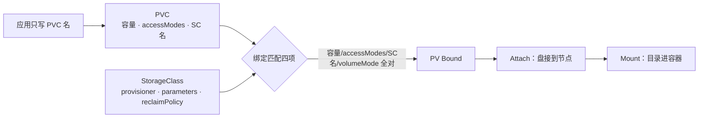

# 11｜存储 · 练习题

先合上知识点，对着 **一节的主图** 把「一块盘的一生」口述一遍——申请 → 出生 → 挂载 → 使用 → 回收，外加另一条路 emptyDir / HostPath——再来做题。

| 标记 | 含义 |
|------|------|
| **核心** | 不懂整章就没建立起来 |
| **必会** | 值班和面试都要能讲 |
| **常用** | 线上会反复碰到 |
| **常考** | 白板和追问的高频口径 |

## 本题目录

- [Q1 PV / PVC / SC / CSI 各干什么](#q1)
- [Q2 动态供给 vs 静态 PV](#q2)
- [Q3 PVC Pending 与 waiting for first consumer](#q3)
- [Q4 FailedAttachVolume 与 FailedMount](#q4)
- [Q5 三副本抢一块 RWO 盘](#q5)
- [Q6 Retain vs Delete 与误删复盘](#q6)
- [Q7 PVC 卡 Terminating 与 finalizer](#q7)
- [Q8 StatefulSet 的盘债](#q8)
- [Q9 PVC 扩容](#q9)
- [Q10 VolumeSnapshot 与回档](#q10)
- [Q11 emptyDir 与 HostPath](#q11)
- [Q12 有状态游戏服落盘方案](#q12)
- [Q13 扩容与快照实战](#q13)
- [Q14 60 秒存储定责](#q14)
- [合上书](#合上书)

---

## Q1

**★★★★★｜PV / PVC / StorageClass / CSI 各干什么？画一下从申请到挂上的全过程。**

**覆盖**：核心 · 必会 · 常考 ｜ **对应**：知识点 [二、申请：PV、PVC、StorageClass 三角色](知识点.md)、[三、出生：动态供给](知识点.md)

### 场景

开场问：「应用 YAML 为什么只写 PVC 名？盘到底是谁建的？」有人把 PV 和 PVC 的职责背反了，还有人以为 StorageClass 就是一块盘。

### 完整解答

> 🎯 **一句话**：PVC 是申请、PV 是盘、SC 是建盘模板；provisioner 建盘，CSI 分两段把盘挂进容器。

**PersistentVolumeClaim（PVC）** 声明意图：要多大容量、什么 accessModes、用哪个 StorageClass；应用只引用它的名字。**PersistentVolume（PV）** 是集群里那块真实的盘。**StorageClass（SC）** 是动态供给的模板：provisioner 是谁、盘什么参数、什么回收策略。**provisioner** 是真正干活的——按 SC 建盘、生成 PV。



**读图**：绑定是一对一的，四项缺一就永远 Pending；Bound 之后还有 Attach / Mount 两段，盘才真正可用。

绑定四要素：容量（PV ≥ PVC）、accessModes、storageClassName、volumeMode。应用不写云盘 ID 是**解耦点**——换云厂商、换盘型只改 SC，业务 YAML 不动。

> ⚠️ **别混**：SC 不是盘，PVC 也不是盘——「申请」和「盘」之间隔着 provisioner 一次 CreateVolume。

### 再追问

- CSI Controller 和 Node Plugin 谁挂了分别怎样？——Controller 挂：新盘建不出（PVC Pending）、删不掉（Terminating）、新 attach 失败，但**已挂上的盘通常不受影响**；某节点 Node Plugin 挂：只有调度到那台的 Pod FailedMount。**不要**把「CSI 全挂了」当成已挂盘掉数据的理由。
- 为什么说绑定是一对一的？——一块 PV 只绑一个 PVC，容量可以多给（100Gi 的 PV 满足 80Gi 的 PVC），但 accessModes / SC 名 / volumeMode 必须全等，**不要**指望「差不多就能绑」。

---

## Q2

**★★★★☆｜动态供给和静态 PV 怎么选？静态什么时候才用？**

**覆盖**：必会 · 常用 ｜ **对应**：知识点 [三、出生：动态供给](知识点.md)

### 场景

机房迁云，有人坚持每块盘手工建 PV「更可控」；另一边新集群里 PVC 一直 Pending，`kubectl get csidriver` 空空如也。

### 完整解答

> 🎯 **一句话**：生产默认动态 SC + CSI；静态 PV 只做旧盘导入和误删补救。

动态供给五步：PVC 出现 → external-provisioner watch 到（SC 的 provisioner 名匹配自己）→ 调 CSI Controller 的 CreateVolume 建云盘 → 自动创建 PV（volumeHandle = 盘 ID）→ PV 与 PVC Bound。按需建、少人工，多 AZ 和扩容才撑得住。

静态只留给三种场合：机房迁云导入已有盘、误删后把回收站里的盘重新 import、特殊盘不走 provisioner。手写静态 PV 必须给对 `volumeHandle`（云盘 ID）、accessMode、capacity ≥ PVC，`nodeAffinity` / zone label 还要对上消费 Pod，否则 Bound 了照样 FailedAttach。**日常不要手工堆 PV**——多 AZ 调度和扩容一来必崩。

验收不要只看 CSI Pod Running：建一个测试 PVC + 消费 Pod，等到 Bound 且容器内 `df` 看见目录，再删干净。托管集群（ACK / EKS / GKE）自带云盘 SC，自建集群要自己装对应 CSI。

```bash
kubectl get csidriver
# NAME                           ATTACHREQUIRED
# diskplugin.csi.example.com     true    ← 列不出驱动 = CSI 没装，先装驱动再查别的
```

### 再追问

- sidecar 能点名几个？——external-provisioner（建盘）、external-attacher（挂载票据）、external-resizer（扩容）、external-snapshotter（快照）、node-driver-registrar、livenessprobe。**不要**六份日志一起翻，按卡点选 sidecar（建盘卡查 provisioner，attach 卡查 attacher）。
- CreateVolume 慢，加 CSI controller 副本有用吗？——副本 ≥2 是高可用，CreateVolume 是按 PVC 串行的，**不要**指望加副本提速。

---

## Q3

**★★★★☆｜PVC 一直 Pending 怎么查？waiting for first consumer 是故障吗？**

**覆盖**：必会 · 常用 · 常考 ｜ **对应**：知识点 [四、挂载：CSI 两段与 WaitForFirstConsumer](知识点.md)

### 场景

MySQL 的 PVC Pending 半小时，Events 写着 `waiting for first consumer`。有人说 CSI 挂了，准备重启 kube-system 里所有 Pod。

### 完整解答

> 🎯 **一句话**：waiting for first consumer 是 WFFC 在等消费 Pod 定拓扑，不是故障；去建 Pod，别重启 CSI。

volumeBindingMode 是 SC 上的字段。**WaitForFirstConsumer（WFFC）**：等 Pod 调度完成，在 Pod 所在 AZ 建盘；**Immediate**：PVC 一建立刻建盘，不管 Pod 在哪。云盘跟 AZ——Immediate 会先在 A 区建盘，Pod 调到 B 区永远 FailedAttach，所以生产云盘 SC 一律 WFFC。

```bash
kubectl describe pvc mysql-data -n game | tail -5
# Events:
#   Normal  WaitForFirstConsumer  waiting for first consumer to be created before binding
#                                 ← 在等消费它的 Pod，不是 CSI 挂了
```

排查顺序：① 有 waiting for first consumer → 去建消费 Pod（或查 Pod 为什么 Pending，那是调度问题，见 [06](../06-调度机制/)）；② 没有这条、报「no SC / provisioner 失败 / 配额」→ 查 SC 名、CSI controller 日志、配额（[13](../13-RBAC与安全/)）。

### 再追问

- Pod 自己也 Pending 呢？——那是调度问题（资源 / 污点 / 亲和），不是存储问题，**不要**去重启 provisioner。
- 用 Immediate 的 NFS SC 有问题吗？——NFS 不在乎拓扑，Immediate 没问题；判断标准是「盘跟不跟位置」，**不要**把 WFFC 当万能正确项背。

---

## Q4

**★★★★☆｜FailedAttachVolume 常见原因有哪些？和 FailedMount 什么区别？游戏服切节点为什么会中断？**

**覆盖**：必会 · 常用 ｜ **对应**：知识点 [四、挂载：CSI 两段与 WaitForFirstConsumer](知识点.md)

### 场景

drain 一个节点后，新 Pod 一直 ContainerCreating，Events 是 `FailedAttachVolume: Volume is already exclusively attached to one node`。有人准备连环删 Pod「让它重试」。

### 完整解答

> 🎯 **一句话**：FailedAttach 是盘没到机（查旧节点 / AZ / 云 API），FailedMount 是到机没挂上（查本机）。

**Attach** 是把盘接到节点（CSI Controller 的 ControllerPublishVolume，记在 VolumeAttachment 票据上）；**Mount** 是目录进容器（节点上 CSI Node Plugin 的 NodeStageVolume → NodePublishVolume）。

- **FailedAttachVolume** 常见原因：盘还 attach 在旧节点（没 detach 干净）、盘在错的 AZ（Immediate 的赌输了）、云厂商 API 限流、DeleteVolume/attach 权限。先去云控制台看 attachment。
- **FailedMount** 常见原因：该节点 csi-node Pod 挂了、文件系统格式问题、`securityContext.fsGroup` 缺失导致 Permission denied、`mountOptions` 写错。上节点 `lsblk` 看盘到没到。

RWO 云盘从 node-A 迁到 node-B 要先 detach 再 attach，**中间有一段中断**。游戏服切节点要接受这段中断，不要当零停机；短时间大量 attach/detach 还会打满云配额，Events 里带 cloud provider / CSI timeout——先看限流，**不要**连环强删 Pod。

### 再追问

- 本地盘呢？——更绑死节点：数据在节点盘上，和节点同生共死，drain 前必须先迁数据（[17](../17-节点运行时与升级/)）。**不要**把本地盘当「能漂移的云盘」用。
- VolumeAttachment 一直不摘怎么办？——先看旧节点和云侧 detach 是否卡住（云控制台手动 detach），**不要**先删 VolumeAttachment 对象或抠 PVC finalizer。

---

## Q5

**★★★★★｜Deployment 三个副本挂一块 RWO 云盘会怎样？RWO 和 RWX 区别？**

**覆盖**：核心 · 必会 · 常考 ｜ **对应**：知识点 [五、使用中：RWO/RWX 与扩容、快照](知识点.md)

### 场景

大厅 Deployment 扩到 3，共用一块云盘。两个副本一直 Pending。有人提议「把 accessMode 改成 RWX 就好了」。

### 完整解答

> 🎯 **一句话**：RWO 单节点读写，三副本抢一块只有一个 Running；改 accessMode 改不了后端能力。

**ReadWriteOnce（RWO）**：单节点读写，云盘典型；**ReadWriteMany（RWX）**：多节点同时挂，要 NFS / EFS / CephFS；**ReadOnlyMany（ROX）**：多节点只读；**ReadWriteOncePod（RWOP，1.22+）**：全集群只准一个 Pod 挂，防双挂。

```bash
kubectl describe po replay-bbb -n game | grep -A3 Events
# Warning  FailedScheduling    0/3 nodes available: 1 node(s) had volume node affinity conflict
# Warning  FailedAttachVolume  Volume is already used by pod(s) replay-aaa
#                              ← 三副本共用一块 RWO 盘，另外两个永远抢不到
```

正确做法二选一：**一人一盘**——改 StatefulSet + `volumeClaimTemplates`（`data-replay-0/1/2`）；**真共享**——上 NFS / CephFS 等真 RWX 后端，或对象存储。

> ⚠️ **别混**：RWO 是「单节点」不是「单 Pod」——同一节点上两个 Pod 可以同时挂同一块 RWO PVC；要「全集群单 Pod」得用 RWOP。**不要**把 PVC 的 accessModes 改成 RWX 幻想云盘变共享——YAML 声明的是意图，后端不支持就是挂不上。

### 再追问

- PVC 只写了 100Gi，IOPS 一定够吗？——不一定。IOPS / 吞吐跟 SC parameters（盘型）绑定，不跟 PVC 的 Gi；日志盘和 DB 盘**不要**共用一个便宜 HDD SC。
- RWOP 下第二个 Pod 调度上来会怎样？——被拒，事件里明确写只允许一个 Pod；这比 RWO「同节点还能双挂」更严，主备防脑裂场景用，**不要**拿它当多副本共享方案。

---

## Q6

**★★★★★｜生产 ReclaimPolicy 为什么用 Retain？误 Delete 怎么复盘？**

**覆盖**：核心 · 必会 · 常考 ｜ **对应**：知识点 [六、回收：Retain/Delete 与 StatefulSet 的盘债](知识点.md)

### 场景

有人清理「无用 PVC」，生产 SC 是 Delete，云控制台的盘一片片消失。群里要求立刻把业务拉起来，有人已经准备对空盘起服务。

### 完整解答

> 🎯 **一句话**：Delete 删 PVC 连盘一起毁；生产一律 Retain，误删先停写再找回收站 / 快照。

**reclaimPolicy** 两个生产值：**Retain**——删 PVC 后 PV 变 Released，盘和数据都还在，等人处理；**Delete**——删 PVC 时调 DeleteVolume 把云盘一起删掉。「删申请」和「同意毁数据」本来不是一件事，Delete 把它们做成了同一个按键。

**误 Delete 复盘三步**（顺序不能乱）：① 停一切写，不要对空盘恢复业务，越写越脏；② 看云控制台回收站 / 快照还在不在；③ 有快照再回档，没有就按 RPO 谈损失。

```bash
kubectl get pv -o custom-columns=NAME:.metadata.name,POLICY:.spec.persistentVolumeReclaimPolicy,STATUS:.status.phase
# pv-a1b2  Retain  Bound       ← PV 对象上写了什么算什么
```

事后把 SC 改成 Retain 并审计存量——**改 SC 不回溯已有 PV**，reclaimPolicy 在 PV 创建时就烙在对象上，旧 PV 要逐个 `kubectl patch pv` 改。Released 的 PV 复用：清 `claimRef` 再绑，或删 PV 留云盘再静态导入。游戏回档流程见 [07-09](../../07-游戏运维专题/09-玩家数据备份与回档/)。

> 📝 **面试**：追问「RPO 看什么」——不看 PVC Bound，看快照频率和应用有没有刷盘；Bound 只说明挂上了。

### 再追问

- 演练环境想用 Delete 防垃圾行不行？——行，但生产误用过的要改 SC + patch 存量 PV 两件事；**不要**只改 SC 就宣布「已整改」。
- Released 的 PV 为什么不能直接再绑？——claimRef 还指着旧 PVC；清掉 `claimRef` 回 Available 才能重新参与绑定，**不要**直接改新 PVC 的名字硬凑。

---

## Q7

**★★★★★｜PVC 一直 Terminating，能不能直接 kubectl patch 把 finalizer 抠掉？**

**覆盖**：核心 · 必会 · 常考 ｜ **对应**：知识点 [六、回收：Retain/Delete 与 StatefulSet 的盘债](知识点.md)、[八、作战：定责](知识点.md)

### 场景

PVC 删了十分钟还在。有人准备 `kubectl patch` 把 finalizers 置空「快点下班」。节点上那块盘可能还挂着。

### 完整解答

> 🎯 **一句话**：Terminating 是 finalizer 在等 CSI 卸卷删盘；先查 CSI 和云侧，手抠是最后手段。

**finalizer** 是对象上的守门名单：删除请求到来先打 deletionTimestamp，等所有 finalizer 离开，对象才真正从 etcd 删掉（通用机制见 [01](../01-集群架构/)）。PVC 的守门人通常两个：`kubernetes.io/pvc-protection`（确认没有 Pod 在用）和 CSI external-attacher 的（确认卷已卸、云盘已删）。

```bash
kubectl get pvc mysql-data -n game -o yaml | grep -A4 -E 'deletionTimestamp|finalizers'
# deletionTimestamp: "2026-08-28T06:00:00Z"      ← 删除请求已打戳
# finalizers:
# - kubernetes.io/pvc-protection
# - external-attacher/diskplugin-csi-example-com  ← 等 CSI 卸卷、删云盘

kubectl get volumeattachment
# ← 挂接票据没摘干净：盘还 attach 在某台节点上
```

常见卡点三个：云盘还 attach 在旧节点、云 API 限流、DeleteVolume 权限不足。先查 csi-attacher 日志和云控制台。确认外部资源已清干净、业务允许，才**最后**手抠——手抠等于告诉 API「外部已经清完了」，云盘还在会留孤儿盘，卷还挂着可能脏数据；抠要留变更记录，**不要**作为第一反应。

### 再追问

- Namespace 一直 Terminating 呢？——往往是 NS 里还有带 finalizer 的 PVC / 云资源；先列出这个 NS 里卡死的资源，**不要**先删 NS 对象本身。
- VolumeAttachment 卡住怎么办？——同一类问题：数据面还没 detach 完，看云控制台 attachment 和 csi-attacher 日志，**不要**先删票据对象赌它自愈。

---

## Q8

**★★★★☆｜删 StatefulSet 为什么盘还在？缩容会释放云盘费用吗？volumeClaimTemplates 是什么？**

**覆盖**：必会 · 常用 ｜ **对应**：知识点 [六、回收：Retain/Delete 与 StatefulSet 的盘债](知识点.md)

### 场景

STS 从 5 缩到 2，财务问为什么云盘还是 5 块。有人把 STS 对象删了想「清数据」，发现 PVC 和盘全在，又想把 PVC 当泄漏删掉。

### 完整解答

> 🎯 **一句话**：volumeClaimTemplates 一人一盘；缩容、删 STS 都不自动删 PVC——防误删，也是盘债的来源。

**volumeClaimTemplates** 是 STS 的「一人一盘」模板：每个 ordinal 一份 `data-<sts>-<ordinal>`。扩容 3→5 会多出两块新 PVC；缩容 5→2 **不会自动删**高序号 PVC（`data-mysql-2/3/4` 和三块云盘还在）；删 STS **也不级联删** PVC。两者都是防误删数据的设计，副作用是费用。

要释放费用的正确顺序：确认业务不要这块数据 → 显式删 PVC → Retain 的盘再去云控制台删盘。较新版本 K8s 提供 `persistentVolumeClaimRetentionPolicy`（WhenDeleted / WhenScaled 各配 Retain 或 Delete）来改级联行为，默认仍是保留。

> ⚠️ **别混**：删了 STS 就以为数据没了——没有，PVC 还在；反过来以为盘是泄漏去删 PVC——那可能是缩容保留的数据。见 STS 的 PVC 先问「是不是故意留的」，**不要**直接动手。

### 再追问

- 为什么不做成「删 STS 级联删 PVC」？——有状态服务删控制器重算是常规操作（升级、重建），级联删盘等于每次重建都毁数据；**不要**因为嫌麻烦就全局打开自动删除。
- 归档盘能放 emptyDir 吗？——不能，Pod 删 / 节点 drain 数据就没了；归档走 Retain 云盘 + 快照或对象存储。

---

## Q9

**★★★★☆｜PVC 怎么扩容？能缩吗？为什么扩完还要进容器对 df？**

**覆盖**：必会 · 常用 ｜ **对应**：知识点 [五、使用中：RWO/RWX 与扩容、快照](知识点.md)

### 场景

DB 盘 90%，有人 patch 完 PVC 就下班了。第二天应用还是写满——PVC 显示 200Gi，容器里 `df` 还是 99G。

### 完整解答

> 🎯 **一句话**：扩容单向只能大；patch PVC 只是改对象数字，文件系统不一定自动长，必须对 df。

扩容五步：① 确认 SC `allowVolumeExpansion: true`；② patch PVC 容量；③ CSI 调 ControllerExpandVolume 把云盘变大；④ 文件系统层——有的 CSI 自动 resize，有的要进容器 `resize2fs`（ext4）或 `xfs_growfs`（xfs，只能在挂载点做）；⑤ 容器内 `df` 验证。

```bash
kubectl exec mysql-0 -n game -- df -h /var/lib/mysql
# /dev/vdb   99G   88G   11G   89%   ← PVC 已 200Gi 但 df 还是 99G：文件系统没长
```

**不能缩容**是常态——要缩只能新盘 + 拷数据。`volumeMode: Block` 的盘没有文件系统层，扩的是裸设备大小，应用自己认。扩容卡住查 external-resizer 日志。

### 再追问

- 为什么不支持缩容？——文件系统缩容要搬数据、风险极高，云厂商普遍不做；想「缩」就新盘 + 同步 + 切换，**不要**在老盘上赌。
- patch 完 capacity 变了、应用还写满，先怀疑谁？——文件系统没长（或长了一半没生效），**不要**怀疑 PVC 没生效就反复 patch。

---

## Q10

**★★★☆☆｜VolumeSnapshot 能直接当 MySQL 回档吗？怎么恢复？**

**覆盖**：必会 · 常考 ｜ **对应**：知识点 [五、使用中：RWO/RWX 与扩容、快照](知识点.md)

### 场景

DBA 拿正在跑的库打了个 VolumeSnapshot，直接挂回去当回档，起来后数据对不上。有人问「快照不是备份吗」。

### 完整解答

> 🎯 **一句话**：快照是盘级崩溃一致不是应用一致；DB 打快照先停写，恢复是新 PVC 的 dataSource 指快照。

对象链和三角色一一对应：VolumeSnapshotClass（模板）→ VolumeSnapshot（申请）→ VolumeSnapshotContent（真快照）。**盘级崩溃一致** = 相当于那一刻拔电源复制盘：文件系统里没刷下去的脏页、数据库的事务状态都不保证。MySQL 要先 `FLUSH TABLES WITH READ LOCK` 或停写再打快照，否则恢复出来要走崩溃恢复，甚至数据对不上。

恢复通常不是原地改正在挂的盘，而是新 PVC 的 `dataSource` 指向快照长出一块新盘；游戏回档要先停服或停写再挂新盘，避免双写。回档流程和 RPO 运营见 [07-09](../../07-游戏运维专题/09-玩家数据备份与回档/)。Velero 这类备份工具的原理仍是快照 + PVC 绑定。

### 再追问

- 应用一致性谁保证？——应用或备份工具（停写 / flush / 数据库备份），CSI 快照只管盘这一层；**不要**指望 CSI 驱动替你 flush 数据库。
- 快照能当长期备份吗？——快照依赖源盘所在云环境，跨地域容灾、合规留存要另做备份链路，**不要**把快照当唯一备份。

---

## Q11

**★★★★☆｜emptyDir 和 HostPath 各是干什么的？战斗状态能不能只活在 emptyDir 上？**

**覆盖**：必会 · 常考 ｜ **对应**：知识点 [七、另一条路：emptyDir、HostPath 与游戏服落盘方案](知识点.md)

### 场景

有人说战斗服是有状态的，把房间状态放 emptyDir「够用」；上线后节点一滚动，对局全丢。另一边的日志采集 DaemonSet 用的是 HostPath。

### 完整解答

> 🎯 **一句话**：emptyDir 随 Pod 死，HostPath 是节点自己的盘；都不走 PV/CSI 链，都别当存档盘。

**emptyDir**：Pod 创建时生、删除时灭；`drain --delete-emptydir-data` 也会删它。用途是临时缓存、同 Pod 内容器交换文件、sidecar 共享。**HostPath**：把节点文件系统的一个目录挂进 Pod，数据是节点的——Pod 迁移数据不跟着走；典型用途是日志采集（DaemonSet 挂 /var/log）、节点 agent。

战斗热状态本来就在**内存**里——进程被杀，emptyDir 和任何盘都救不了；滚动不丢对局靠「不杀对局」的发布约束（[16](../16-灰度与回滚/)），不是换存储。要留痕的战斗记录、回放才落盘：本地盘（随对局生命周期）或单挂云盘。

> ⚠️ **别混**：HostPath 不是「便宜版 PV」——它没有隔离、不迁移、还可能碰节点关键文件（PSS 见 [13](../13-RBAC与安全/)）；**不要**拿它干 PV 的活。

### 再追问

- 节点 drain 时 emptyDir 和 HostPath 数据各怎样？——emptyDir 带 `--delete-emptydir-data` 会删；HostPath 数据留在节点盘上，但 Pod 调度走就够不着了。**不要**假设「数据还在节点上 = 业务还能用」。
- 日志为什么常用 HostPath + DaemonSet 而不是 PVC？——日志是节点的、采集器每节点一个、要读所有 Pod 的落盘路径，PVC 模型对不上；**不要**为了「统一」给采集器也挂 PVC。

---

## Q12

**★★★★☆｜有状态游戏服落盘方案怎么设计？本地盘、云盘、网络盘怎么选？**

**覆盖**：必会 · 常考 ｜ **对应**：知识点 [七、另一条路：emptyDir、HostPath 与游戏服落盘方案](知识点.md)

### 场景

新游戏服选型：战斗服、MySQL、日志采集各要落盘。有人提议「全部上 RWX NFS，有状态嘛」。

### 完整解答

> 🎯 **一句话**：热状态在内存，冷数据才落盘；盘跟着数据的死法选——战斗本地盘 / 单挂云盘，库一人一盘，别用网络盘跑战斗服。

- **战斗服**：热状态在内存，落盘的是记录和回放。写本地盘或单挂云盘（RWO）；**别用网络盘（RWX NFS）跑战斗服**——一个房间一个进程，天然不需要多写，网络盘只多一层延迟抖动和单点。怕杀进程丢对局靠发布约束（[16](../16-灰度与回滚/)）。
- **有状态库**：STS + volumeClaimTemplates + RWO 云盘 + WFFC + Retain + 定期快照，一人一盘。
- **日志 / 采集**：HostPath + DaemonSet，或直接对象存储。
- **回放 / 存档大盘**：云盘 + Retain + 快照；要多服同读才上 RWX 或对象存储。

三种盘三种死法：本地盘快但和节点同生共死（[17](../17-节点运行时与升级/)）；云盘能迁移但 attach 有中断；网络盘延迟抖。**不要**用一套方案打天下。

### 再追问

- 回档盘用什么配置？——Retain + 定期快照，和业务盘分开管理；**不要**用 Delete 的 SC 承载任何「丢了会心痛」的数据。
- 为什么不把战斗状态放 RWX NFS 让多进程共享？——战斗是一房一进程，共享盘只增加争用和延迟；状态一致性靠游戏逻辑和发布约束，**不要**用存储模式掩盖架构问题。

---

## Q13

**★★★★☆｜PVC 扩了 200Gi 但 `df` 还是 100Gi，战斗库盘怎么验收？**

**覆盖**：必会 · 常用 ｜ **对应**：知识点 [五、使用中：RWO/RWX 与扩容、快照](知识点.md)

### 场景

DB StatefulSet PVC 已 patch 200Gi，云盘控制台也 200Gi，容器里 `df` 仍 100Gi。

### 完整解答

> 🎯 **一句话**：控制面扩 PVC ≠ 文件系统自动扩；要看 StorageClass `allowVolumeExpansion` + 文件系统 resize。

```bash
kubectl get pvc data-db-0 -n prod -o jsonpath='{.status.capacity.storage}'
kubectl exec db-0 -n prod -- df -h /var/lib/mysql
# 若块设备大了文件系统没扩：
kubectl exec db-0 -n prod -- resize2fs /dev/xxx   # 视 CSI 而定，很多 CSI 自动
```

> ⚠️ **别混**：VolumeSnapshot **不是** DB 一致回档点——要 quiesce 或应用层备份（Q10）。

### 再追问

战斗服本地 SSD 和云盘 RWO 怎么选？——对局状态要本地低延迟；云盘适合可迁移有状态（知识点七节）。

---

## Q14

**★★★★★｜PVC Pending、FailedMount、Terminating，60 秒决策树**

**覆盖**：核心 · 必会 ｜ **对应**：知识点 [八、作战：定责](知识点.md)

### 场景

开服 STS 起不来；Bound 但 Mount 失败；删 PVC 卡 Terminating。

### 完整解答

> 🎯 **一句话**：Pending→Events+WFFC；Mount→csi-node/fsGroup；Terminating→finalizer/VolumeAttachment。

```bash
kubectl describe pvc,pod -n prod
kubectl get volumeattachment
kubectl logs -n kube-system -l app=csi-node-plugin --tail=20
```

> 📝 **面试**：**不要** Terminating 就先 patch 掉 finalizer——先查是否还有 Pod 占用（Q7）。

### 再追问

Retain 策略下删 PVC 会怎样？——PV 变 Released，数据还在盘上，要人工回收（Q6）。

---

## 合上书

- [ ] **默画主图**（对应知识点合上书 1）：申请 → 出生 → 挂载 → 使用 → 回收，另一条路 emptyDir / HostPath；每段第一刀是 Events。（Q1）
- [ ] **口述申请**（对应知识点合上书 2）：三角色职责、应用只写 PVC 名、绑定四要素、静态 PV 场合。（Q1、Q2）
- [ ] **口述出生**（对应知识点合上书 3）：动态供给五步链、sidecar 点名、Controller 与 Node Plugin 挂了的影响面。（Q2）
- [ ] **默画挂载**（对应知识点合上书 4）：Attach / Mount 两段、FailedAttach vs FailedMount、WFFC 与 waiting for first consumer。（Q3、Q4）
- [ ] **默画收束清单**（对应知识点合上书 5）：六道关卡「模板齐、盘建出、接到机、目录现、写得进、回收兜底」及不保证的三件事。（Q1、Q4）
- [ ] **口述使用中**（对应知识点合上书 6）：RWO / RWX / ROX / RWOP、改 accessMode 没用、扩容对 df、快照崩溃一致。（Q5、Q9、Q10）
- [ ] **口述回收**（对应知识点合上书 7）：Retain vs Delete、误删复盘三步、改 SC 不回溯。（Q6）
- [ ] **口述盘债**（对应知识点合上书 8）：volumeClaimTemplates 一人一盘、缩容 / 删除留盘、释放费用顺序。（Q8）
- [ ] **口述 Terminating**（对应知识点合上书 9）：finalizer 等什么、为什么不能先抠、何时才可抠。（Q7）
- [ ] **口述另一条路**（对应知识点合上书 10）：emptyDir vs HostPath、战斗服落盘方案、本地盘同生共死。（Q11、Q12）
- [ ] **定责**（对应知识点合上书 11）：Pending / Bound / Terminating 三分支入口，60 秒剧本四步。（Q3、Q4、Q7）
