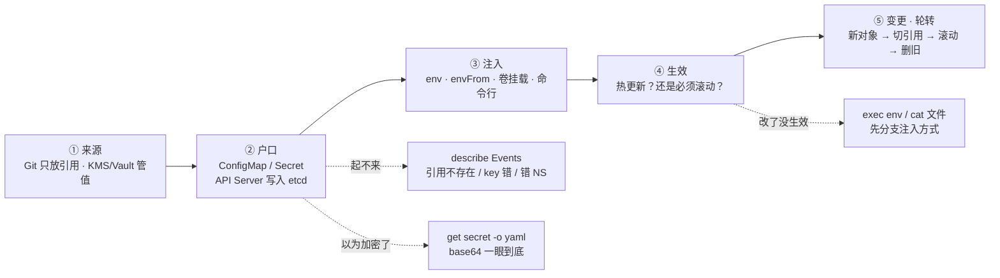
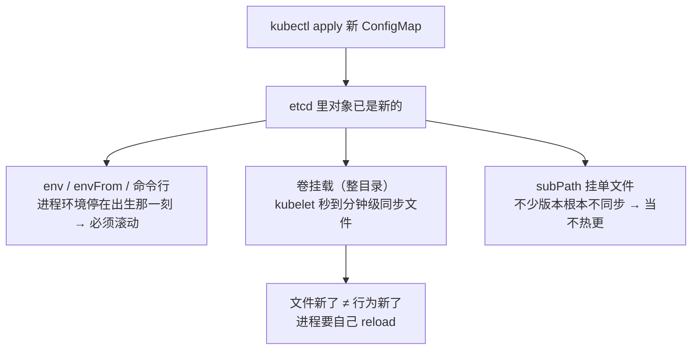
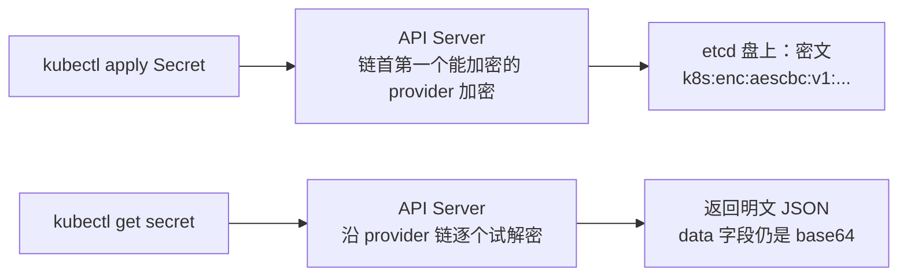
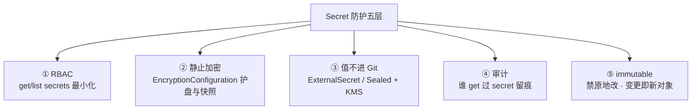
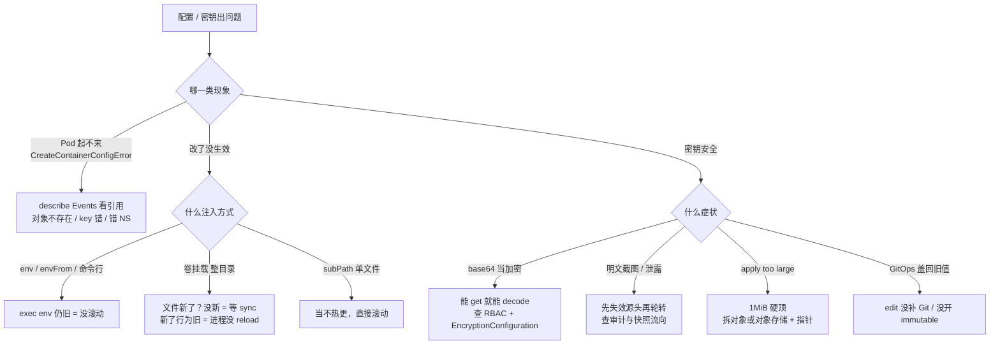

# 配置与密钥

> 运营甩一张 `kubectl get secret -o yaml` 问「这密码是不是加密了」——base64 一串，谁 decode 谁拿到生产库；另一半人改了活动开关 CM 半小时，充值入口还关着，已经在骂 kubelet。
> **本章回答**：一份配置从 Git 到容器进程的一生——出生、注入、生效、Secret 真相、变更轮转、游戏下发；出了问题怎么一眼定责。
> **不讲**：etcd Raft / 直连禁令 → [02](../02-etcd/)；RBAC 收权 / automount / PSS → [13](../13-RBAC与安全/)；证书与 kubeconfig → [14](../14-证书与kubeconfig/)；ImagePullBackOff → [17](../17-节点运行时与升级/)；Helm checksum 模板 → [22](../22-Helm与Kustomize/)；GitOps 同步 → [23](../23-GitOps-ArgoCD与Tekton/)；灰度发布单 → [16](../16-灰度与回滚/)；游戏热更 / 开服流程 → [07-05](../../07-游戏运维专题/05-热更新与版本发布/)、[07-06](../../07-游戏运维专题/06-开服合服/)。

**标记**：🎯重点 · 🔥难点 · ⭐常考 · 🔧实操

---

## 一、一张图：一份配置的一生

> 🎯 **一句话**：配置也有生老病死——来源、户口、注入、生效、变更轮转；出了问题先问「卡在哪一段」。



- 📖 **读图**
  - 🛤️ 主线「来源 → 户口 → 注入 → 生效 → 变更」；二到八节各讲一段
  - 🚨 三条虚线是值班入口：起不来查引用 · 改了没生效先问注入 · 以为加密了直面 base64（练习题 Q1、Q3、Q14）
  - 🔧 `exec` / `describe` / `get` 照的是「这份配置现在卡在哪一段」

口诀：⭐ **起不来查引用；改了没生效问注入；以为加密了先 decode**。

本节对应练习题 Q1、Q3、Q14。

---

## 二、出生：值从哪来、落进哪个对象

> 🎯 **一句话**：非敏感进 ConfigMap、敏感进 Secret；两者都落 etcd，Secret 默认不加密。

- **ConfigMap** = 非敏感配置（开关、地址、版本号）
- **Secret** = 敏感值（密码、证书、token）
- 🔑 **户口一样**：都是 API Server 普通对象，**都写进 etcd**；Secret 多的只是注入时文件权限、以及「默认该被 RBAC 收紧」的定位——**存储默认只是 base64，不是加密**（五节）

### 📮 值从哪来 🎯⭐

- 生产答案几乎总是：**Git 里只放引用，不放值**
  - 明文值放 KMS / Vault / 云密钥服务
  - ExternalSecret 一类控制器在集群里生成 Secret；仓库里只声明「去哪取值」
- ❌ 反面教材
  - 密码写进 YAML 的 `stringData` 推进 Git（base64 与否都是明文密码本）
  - 开服配置直接打进镜像（八节）

- 🧾 **`stringData`**：提交时写明文，API Server 收存照样转成 `data`（base64）进 etcd——「看起来不是密文」≠ 安全，进了 Git = 进密码本

### 🚧 出生三条硬边界 ⭐

- 📏 **单对象 1MiB**（1048576 字节）——对齐 etcd 单请求（[02](../02-etcd/) `--max-request-bytes` 常见 1.5MiB）；整张技能表塞不进来 → 对象存储 + CM 指针（八节）
- 🚪 **跨 Namespace 不能引用**——CM/Secret 是 NS 级；要跨就复制或 ExternalSecret 同源生成多份
- 🏷️ **Secret 类型**：最常用 **Opaque**；`kubernetes.io/tls`（`tls.crt` / `tls.key`）；`kubernetes.io/dockerconfigjson`（imagePullSecrets，三节）。二进制放 `binaryData`，别把 PEM 再 base64 一层塞 Opaque

#### ❓ 为什么跨 NS 改个路径还是不行？

- ❌ 「把 `name` 写成 `other-ns/db-pass`」——**不是路径问题，是对象边界**
- ✅ Pod 只能引用**同 NS** 的 CM/Secret；要共享就复制对象或外部同步
- 这不是 bug，是命名空间隔离的一部分（RBAC 收权见 [13](../13-RBAC与安全/)）

> 🔍 **现场**：先造对象、看一眼长什么样。

```bash
kubectl create configmap game-switch -n game \
  --from-literal=PAYMENT_ENABLED=true \
  --from-literal=ACTIVITY_ID=summer2026
# configmap/game-switch created

kubectl create secret generic db-pass -n game \
  --from-literal=password='Pr0d_MySQL_2026!'
# secret/db-pass created

kubectl get secret db-pass -n game -o yaml
```

```yaml
apiVersion: v1
kind: Secret
metadata:
  name: db-pass
  namespace: game
type: Opaque                            # ← 最常见；另有 tls、dockerconfigjson
data:
  password: UHIwZF9NeVNRTF8yMDI2IQ==    # ← base64 编码，不是密文（五节）
```

> 📝 **面试**：ConfigMap vs Secret——别只答「敏感/不敏感」；补：**都进 etcd、都有 1MiB、都不能跨 NS**；Secret 多的是注入权限控制与 RBAC 收紧定位。

口诀：⭐ **Git 只放引用不放值；stringData 进 Git = 进密码本**。

本节对应练习题 Q1、Q5、Q9。

---

## 三、注入：四条通道进容器

> 🎯 **一句话**：配置进容器有四条通道——env、envFrom、卷挂载、命令行；选哪条，决定了后面热不热更。⭐

**注入（injection）** = 把 CM/Secret 里的值交给容器进程。这是全章岔路口——开篇「改了半小时没生效」病根就在选了 envFrom 却以为会热更。

```yaml
# ① env：单键引用
env:
- name: DB_PASSWORD
  valueFrom:
    secretKeyRef:            # ← Secret 用 secretKeyRef；CM 用 configMapKeyRef
      name: db-pass
      key: password

# ② envFrom：整对象展开，键名即变量名
envFrom:
- configMapRef:
    name: game-switch

# ③ 卷挂载：每个 key 变成目录里一个文件
volumeMounts:
- name: cfg
  mountPath: /etc/game

# ④ 命令行：kubelet 创建容器时用 env 展开 $(VAR)
env:
- name: PAYMENT_ENABLED
  valueFrom:
    configMapKeyRef: { name: game-switch, key: PAYMENT_ENABLED }
args: ["--payment=$(PAYMENT_ENABLED)"]   # ← 本质仍是 env，热更新脾性一样
```

| 方式 | 值进进程的形式 | 热更新 | 典型用途 |
|------|----------------|--------|----------|
| `env` / `envFrom` | 环境变量，创建时写入 | **否**，必须滚动 | 开关、端口、简单键 |
| 卷挂载 | 文件，kubelet 持续同步 | 文件**会变**，进程要 reload | 配置文件、证书 |
| 命令行 `$(VAR)` | 展开进启动参数 | **否**，必须滚动 | 启动参数引用配置 |
| `imagePullSecrets` | 不进业务进程 | — | 只给 kubelet 拉私有镜像 |

> ⚠️ **别混**：`imagePullSecrets`（类型 `kubernetes.io/dockerconfigjson`）给 **kubelet 拉镜像**；业务 env 里的仓库密码给**应用自己用**。ImagePullBackOff 401 先查 Pod 的 imagePullSecrets 与节点运行时（[17](../17-节点运行时与升级/)），别先改业务环境变量。

### 🔐 卷挂载细节：权限与 subPath

- **Secret 卷建议 `defaultMode: 0400`**（属主可读）
  - 要对上容器 `runAsUser` / `fsGroup`——uid 对不上 → Permission denied，Events 不一定点名 Secret
  - 不要为省事改 `0777`（等于密码贴门口）

- **subPath** = 只挂卷内单个文件到容器路径：

```yaml
volumeMounts:
- name: cfg
  mountPath: /etc/game/payment.yaml
  subPath: payment.yaml      # ← 只挂这一个文件
```

  - 应用不用吃整目录，但代价是**热更新基本失效**：不少版本 kubelet 只同步整目录卷，subPath 挂出去的文件**不会跟着变**（四节）→ 默认当「必须滚动」

### 📦 projected 与 SA token

- **projected volume**：CM + Secret + DownwardAPI（Pod 名 / NS / request 等元信息）合成一个目录
- **ServiceAccount Token 也是 projected**：1.24+ 默认 **Bound Token**（绑定 SA、有过期、自动轮换）；老的永不过期 Secret Token 少用
- 不调 API 的业务 Pod：`automountServiceAccountToken: false`（细节 → [13](../13-RBAC与安全/)）

> 📝 **面试**：四条通道按「**值以什么形式进进程**」说：环境变量 / 文件 / 启动参数（本质 env）；再补 imagePullSecrets 不进业务进程。别抢答「卷挂载都会热更」。

口诀：⭐ **env 出生即定死；卷挂载文件会变但进程要 reload；subPath 当不热更**。

本节对应练习题 Q2、Q6、Q7、Q8。

---

## 四、生效：热更新，改了什么时候变

> 🎯 **一句话**：卷挂载的文件会变但进程要 reload；env 出生即定死必须滚动；subPath 当不热更。🔥⭐

**热更新（hot update）** = 改了 CM/Secret 后，不重建 Pod 就让进程用上新值。成不成立**完全由注入方式决定**——本章最高频报障：「我明明 apply 了，为什么没生效」。

> 💡 **打个比方**：env 像出生证上的名字——生出来就定了，改户口得重生（重建 Pod）；卷挂载像办公室公告板——kubelet 会定期换纸，员工（进程）得自己抬头看（reload）。

#### ❓ 为什么 env 永远不热更？

- ❌ 「etcd 已经是新的了，kubelet 怎么还不改环境变量」——**环境变量是创建容器那一刻写进进程的**，之后没有任何机制去改一个已运行进程的环境
- ✅ CM 改了、etcd 早就是新的，老 Pod 进程环境仍停在出生时刻 → **必须滚动出新 Pod**
- 不是 kubelet 坏了，是注入方式的脾性

#### ❓ 为什么「卷挂载会热更新」还不够？

- kubelet 持续 watch 本节点用到的 CM/Secret，对象一变就把卷里文件同步成新内容
- 同步不是瞬间：watch 延迟 + 本地缓存 TTL → 常见**秒到分钟级**（`configMapAndSecretChangeDetectionStrategy` 常见 Cache + TTL）
- 🔥 **文件新了 ≠ 行为新了**：进程要自己 reload；很多应用只在启动时读一次配置——对它们卷挂载同样「不热更」
- subPath 不少版本根本不同步 → 直接当不热更



- 📖 **读图**
  - 🚪 从「apply 成功」进——etcd 新了只走完一半
  - 🛤️ 三条岔路：env → 必须滚动；卷挂载 → 还有「reload」第二跳；subPath → 最短，当不热更

> ⚠️ **别混**：「卷挂载会热更新」只对**文件**成立，对**进程行为**不成立；也别说「凡是 volume 都会热更」——subPath 是例外。

> 🔍 **现场**：运营改了支付开关 CM，半小时充值入口还关着。

```bash
kubectl get deploy payment -n game -o yaml | grep -A3 'envFrom'
# envFrom:
# - configMapRef:
#     name: game-switch          ← env 型：改 CM 不会自动改进程环境

kubectl get cm game-switch -n game -o yaml | grep PAYMENT_ENABLED
#   PAYMENT_ENABLED: "true"      ← CM 已是新的

kubectl exec deploy/payment -n game -- env | grep PAYMENT_ENABLED
#   PAYMENT_ENABLED=false        ← 容器里还是旧的：没滚动

kubectl rollout restart deploy/payment -n game
kubectl rollout status deploy/payment -n game
# deployment "payment" successfully rolled out   ← 新 Pod 全量，再 exec 才是 true
```

- 卷挂载型：apply 后等一轮 sync 再 `cat`；文件已新行为仍旧 → 治进程 reload（信号 / 接口 / 同样滚动）

### 🔄 把「改配置」自动变成「滚 Pod」

- **Helm checksum annotation**：CM 内容校验和写进 Pod template，CM 一变 template 变 → Deployment 自动滚动（模板 → [22](../22-Helm与Kustomize/)）
- **Reloader**：独立控制器，盯带注解的工作负载自动 `rollout restart`
- ⚠️ 自动化是双刃剑：误改也会被推全集群——活动高峰要么冻结 CM 变更，要么 Reloader 只盯非生产

> 📝 **面试**：「改了 ConfigMap 进程没变」——先问注入方式：env/命令行 → `rollout restart`；卷挂载 → 等 sync 再确认 reload；subPath → 当不热更。别说「kubelet 坏了」，别说「凡是卷挂载都会热更」。

口诀：⭐ **改了没生效——先问注入方式，别骂 kubelet**。

本节对应练习题 Q2、Q10。

---

## 五、真相：Secret 不是保险箱

> 🎯 **一句话**：Secret 默认只是 base64；能 get 就能看明文，盘上明文要靠 API Server 的静止加密。🔥⭐

> 💡 **打个比方**：Secret 像把密码写在信封里——信封（base64）不是保险柜，有权限拆信（`get secret`）的人一眼就能读；静止加密才是给金库加锁，但钥匙还在 API Server 手里，拆信照旧。

### 🔓 base64 不是加密 🎯⭐🔥

```bash
kubectl get secret db-pass -n game -o jsonpath='{.data.password}' | base64 -d; echo
# Pr0d_MySQL_2026!        ← 能 get 就能 decode
```

- base64 = 可逆、无密钥、谁都能解的**编码**
- 「密码放 Secret 里所以安全」不成立——谁能看明文有两层：
  - **API 层**：有 get/list secrets 权限的人
  - **盘层**：没开静止加密时，能碰控制面数据目录 / 快照 ≈ 能读所有 Secret

### 🛡️ 第一层：RBAC 少给 get / list secrets

```bash
kubectl auth can-i get secrets -n game --as=system:serviceaccount:game:default
# yes        ← 默认 SA 能读本 NS 全部 Secret？该收
kubectl auth can-i list secrets -n game --as=dev-user
# no
```

- 完整规则 → [13](../13-RBAC与安全/)；本章只钉一句：**对 API 来说，能 get = 能看明文**，与加不加密无关

### 🏦 第二层：静止加密（Encryption at Rest）🔥⭐

> 💡 **打个比方**：API Server 像银行柜台——钱（Secret）进金库（etcd）前先装密封袋；etcd 只管存袋子。加密开关在柜台规章（`--encryption-provider-config`），不在金库大门上。

**EncryptionConfiguration** = kube-apiserver 的加密配置：写 etcd 前加密、从 etcd 读出后解密。etcd TLS 管的是**谁能连 2379**，不管盘上是不是明文。



- 📖 **读图**
  - ✍️ 写路径：链首第一个能加密的 provider 负责新写
  - 🔓 读路径：整条链参与解密（旧 key 要留到存量改写完）
  - 👀 右下角：**开了静止加密，`get secret` 仍能看明文**——API 解密后才给你；挡的是盘 / 快照 / etcdctl 直读，不是 API 视图

```bash
grep encryption-provider-config /etc/kubernetes/manifests/kube-apiserver.yaml
# - --encryption-provider-config=/etc/kubernetes/enc.yaml   ← 每台控制面都要有、路径一致
```

```yaml
apiVersion: apiserver.config.k8s.io/v1
kind: EncryptionConfiguration
resources:
  - resources:
    - secrets
    providers:
    - aescbc:
        keys:
        - name: key2          # ← 新密钥排第一：新写用它
          secret: <base64-32-bytes>
        - name: key1          # ← 旧密钥留下：存量还要靠它解密
          secret: <base64-old>
    - identity: {}            # ← 排最后：兜底尚未加密的旧明文
```

#### ❓ 为什么 identity 不能放第一？新 key 为什么插第一？

- 🔑 **链上第一个能加密的 provider 负责新写** → 新 key 永远插第一
- 📖 **整条链都用来解密** → 旧 key 必须留到存量全部改写完
- ❌ **`identity` 放到第一** = 新写又变明文，等于关掉加密；`identity` 只能链尾兜底
- 🔁 改配置必须**重启所有 API Server**——只改文件不重启，进程还拿着旧链
- provider：`aescbc`（key **32 字节**）/ `aesgcm` / `kms`、`kmsv2`（信封加密）；只需加密 `secrets`，把 Pod 也加密收益小、轮换面更大

> ⚠️ **别混**：
> - **开了静止加密 ≠ get 不到明文**——加密护盘与快照；RBAC 仍要少给 get
> - **etcd TLS ≠ 静止加密**——TLS 管谁能连，不管盘上明文
> - **没开加密时**：`etcdctl` 直读或拿到快照 = 拿到全服密码

```bash
# 维护窗口只读抽查（02 章禁令：生产 etcd 不要 put）
ETCDCTL_API=3 etcdctl get /registry/secrets/game/db-pass --print-value-only | head -c 40
# k8s:enc:aescbc:v1:key2:...      ← 开了加密：密文前缀
# {"apiVersion":"v1","data":...   ← 明文 JSON：没开，或 identity 在第一
```

### 🧱 第三～五层

- ③ **值不进 Git**（ExternalSecret / Sealed Secrets + KMS）
- ④ **审计 `get secret`**——谁在什么时候读过要留痕
- ⑤ **`immutable`**（六节）——禁原地改，变更 = 新对象
- 托管集群（ssh 不进控制面）：问清 Encryption at Rest 是否默认开、key 由谁轮换

### 收束：Secret 到底靠什么护住



- 📖 **读图**
  - ① 挡 API 视图 · ② 挡盘和快照 · ③ 挡仓库历史 · ④ 事后追溯 · ⑤ 让「改」变成「新对象」让审计有抓手
  - 值班说「我们 Secret 很安全」，按这五层逐层问

> ⚠️ **别混**：五层**不保证**「已经泄露的值能收回来」——截图 / Git 历史 / 旧快照一旦流出，必须走七节轮转把旧值**失效**。Vault 只解决第③层，注入、滚动、静止加密仍是本章的事。

> 📝 **面试**：Secret 怎么才算安全——按「**API 挡读、盘挡裸、源头挡漏、事后能查、变更可审**」五组背；最后一定补「默认只是 base64，能 get 就能 decode」。

口诀：⭐ **五层防护；开了加密 get 仍能看；事后开加密救不回旧快照**。

本节对应练习题 Q1、Q11。

---

## 六、变更：改配置就是一次发布

> 🎯 **一句话**：改 ConfigMap 要不要重启，全看注入方式；把每次改配置当一次发布管。⭐

判据就是四节分叉：**env 型必须滚动；卷挂载型文件会变，确认进程能 reload 可不滚；subPath 当不热更，滚**。改配置和发版走同一套纪律：先 diff、再小范围、可回滚。

### 📋 标准动作五步

```text
① Git 改 CM/Secret（或 ExternalSecret 引用）          ← 仓库是唯一事实源
② kubectl diff 预检；确认引用它的工作负载有哪些
③ env 型：rollout restart；volume 型：确认进程 reload
④ exec 核对容器内值与 Git 一致                       ← 验证到进程，不是到对象
⑤ 失败：undo Deploy + 回上一版 CM（两条通道）
```

### 🔒 `immutable`：把「改」变成「发新对象」

- 声明 `immutable: true` 后，`data` 不允许再改——实践里发新名字对象（如 `game-switch-v20260901`）
- 三个好处：误改被 API 拒绝；kubelet 不必 watch 原地变更（大规模减负）；审计上「变更 = 新对象 + 切引用」清晰
- 与七节「只发新对象」轮转纪律天然配套

> ⚠️ **别混**：`immutable` 防的是**篡改与误改**，不是保密——内容照样能 get、能 decode。

### 💸 生产 `kubectl edit` 的债，当天必须还

- 应急 edit 集群里的 Secret 可以止血
- 若 Git 仍是旧值，下一次 GitOps 同步（[23](../23-GitOps-ArgoCD与Tekton/)）会把新密码**盖回旧值**——业务连不上，还以为数据库挂了
- 纪律：应急可以改集群，当天内让仓库与集群一致

### ⏪ 回滚是两条通道

- checksum 在 Pod template 里 → `rollout undo` 会连同**旧的 CM 引用**一起带回
- 只改了 CM、靠进程 reload → 回上一版 CM，并**确认进程真的 reload 回去了**
- 只回其中一个 = 半回滚；发布单要把两条路径写清（→ [16](../16-灰度与回滚/)）

> 📝 **面试**：「改配置怎么不出事故」——仓库唯一事实源、diff 预检、按注入方式决定滚不滚、exec 验证到进程、回滚双通道写进发布单；敏感对象开 immutable。

口诀：⭐ **edit 当天补 Git；回滚双通道（CM + Deploy）**。

本节对应练习题 Q4、Q10。

---

## 七、轮转：换密钥与泄露应急

> 🎯 **一句话**：轮转永远走「新对象→切引用→滚动→删旧」；泄露先让旧值失效，再谈别的。🔥

### 🔑 业务密码轮转四步（顺序不能反）

```text
① 新建 Secret（新密码）
② 改 Deploy / STS 的引用，指向新 Secret
③ 滚动，验证新 Pod 连得上
④ 删旧 Secret
```

#### ❓ 为什么不能原地 edit、为什么不能先删旧？

- ❌ 先删旧或先改源头密码 → 还没滚到的 Pod **拿旧密码打新库**，连接错误一片
- ❌ 日常 `kubectl edit` 原地改 → 不产生新对象，审计断链、回滚无路，还会被 GitOps 盖回（六节）
- ✅ 四步顺序不可反：新对象 → 切引用 → 滚动验证 → 删旧

### 🔐 EncryptionConfiguration 的 key 轮转

口诀：**新 key 插第一 → 重启全部 API → rewrite 存量 → 确认后再撤旧 key**。

```bash
# rewrite 存量：读出再写回，逼每个 Secret 用链首新 provider 重新加密
kubectl get secrets --all-namespaces -o json | kubectl replace -f -
# 维护窗口执行；完了用 etcdctl 抽查已是新前缀
```

- **永远不要先删旧 key**——存量还指着它解密；删早了，一批 Secret 谁都读不出
- 改完配置文件不重启 API Server = 没改

### 🚨 泄露应急：先失效，再轮转，后堵渠

> 💡 **打个比方**：钥匙被人拍照了，换锁（轮转）必须但不够——照片还在外面，得确认「照片打不开门」：旧钥匙作废、门芯换掉、再查照片流向了谁。

以「有人把 `get secret -o yaml` 明文截图发进大群」为例：

```text
① 定范围   哪个 key、谁看过、传到了哪（群 / Git / 快照 / 个人设备）
② 先失效   在源头系统改密码、吊销 token —— 不是先去删 K8s 对象
③ 再轮转   新 Secret → 切引用 → 滚动 → 删旧
④ 查流向   审计日志拉 get/list secrets；etcd 快照是否已带明文流出
⑤ 堵渠道   Git 历史清理、旧快照作废；撤回截图只是补救，别当成已止血
```

- 铁律：**别只轮 K8s 不轮源头**；**别把「删了那条消息」当止血**
- 事后才开静止加密，救不回已经流出的旧快照（五节）
- SA token：1.24+ Bound Token 自带过期与自动轮换；老永不过期 Secret Token 尽快迁移（→ [13](../13-RBAC与安全/)）

> 📝 **面试**：「密码泄露了怎么办」——先失效（源头改密/吊销）→ 再轮转（新对象四步）→ 查审计与快照流向 → 堵渠道；补「事后开加密救不回旧快照」。

口诀：⭐ **轮转四步不可反序；泄露先失效再轮转**。

本节对应练习题 Q4、Q12。

---

## 八、下发：游戏配置怎么进服

> 🎯 **一句话**：开服配置别打进镜像，大表别进 etcd，开关别每秒 apply；热更指针与滚动是两条通道。⭐

### 🎮 三个特色场景

**① 开服：配置跟着服走，不跟着镜像走**

- 每开一服一套配置（开服时间、渠道、初始活动）
- ❌ 开服配置打进镜像 → 改一个参数要构建、推仓库、滚全部同镜像的服
- ✅ 配置是对象不是代码——按服生成 CM/Secret（Helm/Kustomize → [22](../22-Helm与Kustomize/)）；开服流程 → [07-06](../../07-游戏运维专题/06-开服合服/)

**② 大表：1MiB 挡在门口，指针才是正路**

```bash
kubectl apply -f skill-table-cm.yaml
# Error from server (Invalid): configmaps "skill-table" is invalid:
# data: Too long: must have at most 1048576 bytes   ← 单对象 1MiB 硬顶
```

```yaml
data:
  SKILL_TABLE_VERSION: "v20260828"
  SKILL_TABLE_URL: "s3://game-config/skill/v20260828.json"
```

- 表放对象存储，CM 只存版本指针；进程 watch 指针，拉取后安全 reload
- 回滚的是**版本指针**；多版本共存；etcd 不被大对象拖慢（→ [02](../02-etcd/)）

**③ 活动开关：低频、可审计、别拿 etcd 当消息队列**

- 每秒改一次开关 CM = 每秒打 etcd 写 + 推一轮 watch → 控制面毛刺
- 开关变更应是**低频发布动作**：改一次、滚一轮、记一笔
- 活动高峰冻结 CM 变更或只允许白名单 key——checksum/Reloader 会把一次手抖推全集群（四节）

### 📡 两条通道写进同一张发布单

- **热更指针**（改 CM 里版本号，进程 watch 后 reload）与 **Deploy 滚动**（换镜像、重建 Pod）是**两条独立通道**
- 热更成功 ≠ 进程是新镜像；逻辑表结构变了更要按热更方案走
- 发布单写法 → [07-05](../../07-游戏运维专题/05-热更新与版本发布/)、[16](../16-灰度与回滚/)

> 📝 **面试**：游戏配置怎么下发——小配置走 CM/Secret 四种注入；大表走对象存储 + CM 指针；开服配置模板化、不进镜像；开关低频；热更与滚动两条通道同写一张单。

口诀：⭐ **开服配置不进镜像；大表走对象存储 + 指针；开关低频变更**。

本节对应练习题 Q5、Q13。

---

## 九、作战：定责

> 🎯 **一句话**：三类现象三条入口——起不来查引用，改了不生效先分支注入方式，密钥问题先问「谁能看」。



- 📖 **读图**
  - 「起不来」——业务容器还没创建，**别先看应用日志**，Events 写得明白
  - 「改了没生效」——先分支注入方式，三支处方完全不同
  - 「密钥安全」——四个症状各有去向，别混着治

| 现象 | 先做 | 别做 |
|------|------|------|
| CreateContainerConfigError | describe Events；先 apply 配置再发工作负载 | 先看应用日志 |
| env 型改了不生效 | `exec env` 对比 CM，确认后 `rollout restart` | 怪 kubelet 坏了 |
| 卷挂载文件新了行为旧 | 确认进程支持并真的 reload | 说「凡是 volume 都热更」 |
| 0400 后非 root 读不了 | 对上 runAsUser / fsGroup | 改 0777 图省事 |
| 跨 NS 想用别人的 Secret | 复制对象或 ExternalSecret 同源生成 | 改引用路径硬指 |
| apply 报 too large | 拆小对象或对象存储 + 指针 | 抬 etcd 写入硬顶 |
| 明文截图 / 泄露 | 源头失效 → 轮转 → 审计流向 | 撤回消息就当止血 |
| checksum 把坏配置推全集群 | undo Deploy + 回上一版 CM，两条通道都回 | 只回其中一个 |
| 开了加密 get 仍能看 | 正常，API 解密后给你 | 以为没开成功，identity 挪第一 |

### 60 秒剧本 🔧

> 🔍 **现场**：接到「配置没生效 / 起不来」，按这条线走完再下结论。

```text
① 0–10s   kubectl describe pod <p> -n {ns} | sed -n '/Events/,$p'
          ← CreateContainerConfigError？先查引用（对象/key/NS），别碰应用日志
② 10–30s  kubectl get cm <名> -o yaml 与 kubectl exec <p> -- env / cat 文件 对比
          ← 容器里旧 = 注入之后没人动过：没滚动 / 没等 sync / 没 reload
③ 30–45s  分支定责：env 型 → 没滚动；卷挂载 → sync 未到或进程没 reload；subPath → 当不热更
④ 45–60s  rollout restart + rollout status 验证；密钥问题先 auth can-i 收权限，再谈其余
```

本节对应练习题 Q3、Q14。

---

## 十、收口

### 命令速查 🔧

```bash
# 对象长什么样
kubectl get cm <名> -n {ns} -o yaml
kubectl get secret <名> -n {ns} -o yaml              # data 字段是 base64
kubectl get secret <名> -n {ns} -o jsonpath='{.data.password}' | base64 -d
# 进程里是什么（验证到进程，不是到对象）
kubectl exec <p> -n {ns} -- env | grep KEY           # env 型：旧 = 没滚动
kubectl exec <p> -n {ns} -- cat /etc/game/xxx.yaml   # 卷挂载：刚 apply 可能还是旧的
# 起不来第一刀
kubectl describe pod <p> -n {ns} | sed -n '/Events/,$p'   # CreateContainerConfigError 看引用
# 变更与回滚
kubectl rollout restart deploy/{d} -n {ns}           # env 型变更后必做
kubectl rollout status deploy/{d} -n {ns}
kubectl rollout undo deploy/{d} -n {ns}              # checksum 场景会带回旧 CM 引用
# 权限与加密
kubectl auth can-i get secrets -n {ns} --as=<user 或 SA>
grep encryption-provider-config /etc/kubernetes/manifests/kube-apiserver.yaml
ETCDCTL_API=3 etcdctl get /registry/secrets/{ns}/<名> --print-value-only | head -c 40
# rewrite 存量（维护窗口）
kubectl get secrets --all-namespaces -o json | kubectl replace -f -
```

### 面试锚点

| 问 | 30 秒答 |
|----|---------|
| ConfigMap 与 Secret 区别？ | 非敏感/敏感；都进 etcd、都有 1MiB、都不能跨 NS；Secret 多的只是注入权限控制与 RBAC 收紧定位。 |
| Secret 是加密的吗？ | 不是，默认 base64 编码；能 get 就能 decode；静止加密在 API Server 的 EncryptionConfiguration。 |
| 静止加密配在哪？ | kube-apiserver `--encryption-provider-config`，不在 etcd；写前加密、读时解密，每台控制面同一份。 |
| 开了加密 get 还能看？ | 能，API 解密后给你；加密挡的是盘、快照、etcdctl 直读，RBAC 仍要少给 get。 |
| provider 链规则？ | 链首第一个能加密的负责新写；整链解密；新 key 插第一；identity 兜底留最后；改完重启全部 API。 |
| 四种注入？ | env（configMapKeyRef/secretKeyRef）、envFrom（整对象展开）、卷挂载（文件）、命令行 $(VAR)（本质是 env）。 |
| 改 ConfigMap 要重启吗？ | 看注入方式：env/命令行必须滚；卷挂载文件会变但要进程 reload；subPath 当不热更。 |
| 为什么卷挂载文件会变？ | kubelet watch + 缓存 TTL 同步，秒到分钟级；刚 apply 立刻 cat 可能还旧。 |
| subPath 什么坑？ | 只挂单文件，不少版本不随源对象同步，默认当不热更，滚动解决。 |
| immutable 干什么？ | 禁原地改，变更=新对象；防误改、减 kubelet watch、审计清晰；不防读。 |
| 密码轮转顺序？ | 新 Secret → 切引用 → 滚动验证 → 删旧；反序=旧密码打新库；不要原地 edit 当日常。 |
| 生产 edit secret 会怎样？ | 止血可以，当天必须补 Git，否则下次 GitOps 同步盖回旧值。 |
| 泄露应急怎么走？ | 源头失效 → 四步轮转 → 审计与快照查流向 → 堵渠道；撤回消息不算止血。 |
| 为什么有 1MiB？ | etcd 单请求上限；大表放对象存储，CM 存版本指针，回滚的是指针。 |
| 跨 NS 引用 Secret？ | 不行，命名空间边界；复制对象或 ExternalSecret 同源生成。 |
| imagePullSecrets？ | 只给 kubelet 拉私有镜像（dockerconfigjson），不是业务 env 里的仓库密码。 |
| SA token 怎么管？ | 1.24+ Bound Token 有过期自动轮换；永不过期老 token 少用；不调 API 的 Pod 关自动挂载。 |
| 游戏开服配置怎么下发？ | 模板化生成每服 CM/Secret，不进镜像；大表走对象存储；开关低频变更；热更与滚动两条通道同写发布单。 |

### 易错一句话对照

- Secret 进 etcd 默认加密 → 默认明文 JSON，静止加密在 API Server
- base64 就是加密 → 编码；能 get 就能 decode
- etcd TLS 等于静止加密 → TLS 管谁能连 2379；EncryptionConfiguration 管盘上是否明文
- EncryptionConfiguration 配在 etcd.yaml → kube-apiserver `--encryption-provider-config`
- identity 放第一更安全 → 新写又变明文，必须链尾
- 新 key 追加在列表最后 → 链首才负责新写
- 改了配置文件就自动加密 → 必须重启所有 API Server
- 轮换时立刻删旧 key → 存量还要靠旧 key 解密
- env 改 CM 立刻生效 → 必须滚动
- 凡是卷挂载都会热更 → 进程要 reload；subPath 常常不热更
- 跨 NS 改个路径就能引用 → 复制或 ExternalSecret，这是边界
- Git 里放 stringData 图省事 → API 仍存 data；明文进了密码本
- imagePullSecrets 就是业务密码 → 只给 kubelet 拉镜像
- 大表塞进 CM → 1MiB 硬顶；对象存储 + 指针
- 长期 edit secret 不补 Git → 下次同步盖回旧值
- 回滚只回 CM 就够 → env 型要 undo/滚动；两条通道都回
- immutable 等于保密 → 只防篡改，内容照样能 get 能 decode
- 开服配置打进镜像最省事 → 改参数要重构建滚全服；配置是对象不是代码

### 数字墙

> 单对象 **1MiB**（1048576 字节；etcd `--max-request-bytes` 常见 1.5MiB）· kubelet 配置同步常见**秒到分钟**级 · aescbc 密钥 **32 字节** · SA Bound Token 自 **1.24+** 默认 · Secret 卷建议 **0400** · 业务轮转 **4** 步 · 防护 **5** 层 · 注入 **4** 条通道

---

## 合上书

对着第一节主图口述一遍，卡住就回对应小节。开头两个误操作——截图当加密、改了没生效骂 kubelet——现在该能拦住了。

- [ ] **默画主图**：来源 → 户口（CM/Secret → etcd）→ 注入 → 生效 → 变更轮转；三条虚线各对应哪种报障入口。（→ Q1 · Q3 · Q14）
- [ ] **口述出生**：值从哪来（Git 只放引用）、CM vs Secret、都进 etcd、1MiB、跨 NS 不行、三种 Secret 类型、stringData 为什么不能进 Git。（→ Q1 · Q5 · Q9）
- [ ] **口述注入**：四条通道各以什么形式进进程、热更新差异；imagePullSecrets 为什么不算；0400 与 runAsUser 的关系。（→ Q2 · Q6 · Q7 · Q8）
- [ ] **默画热更新分叉图**：apply 之后 env / 卷挂载 / subPath 三条路各停在哪；kubelet 同步为什么是秒到分钟级。（→ Q2 · Q10）
- [ ] **口述真相**：base64 为什么不是加密、谁能看明文（两层）、静止加密配在哪、provider 链三条规则、为什么开了加密 get 仍能看。（→ Q1 · Q11）
- [ ] **默画五层防护图**：RBAC / 静止加密 / 值不进 Git / 审计 / immutable，各挡哪个入口，并说清它不保证什么。（→ Q1 · Q11）
- [ ] **口述变更**：改 CM 要不要重启的判据、immutable 的三个好处、edit 当天补 Git、回滚双通道。（→ Q4 · Q10）
- [ ] **口述轮转与应急**：业务轮转四步及反序代价、加密 key 轮转口诀、泄露五步（先失效再轮转）；为什么事后开加密救不回旧快照。（→ Q4 · Q12）
- [ ] **口述下发**：开服配置不进镜像、大表不进 etcd、开关别每秒 apply、热更指针与滚动两条通道。（→ Q5 · Q13）
- [ ] **定责**：CreateContainerConfigError 先看什么；「改了没生效」怎么按注入方式分支；60 秒剧本四步各敲什么。（→ Q3 · Q14）

十条都能不看稿讲下来，这一章就过了。下一章剖开权限边界：[13](../13-RBAC与安全/)。存储底座：[02](../02-etcd/) · 发布纪律：[16](../16-灰度与回滚/)。
