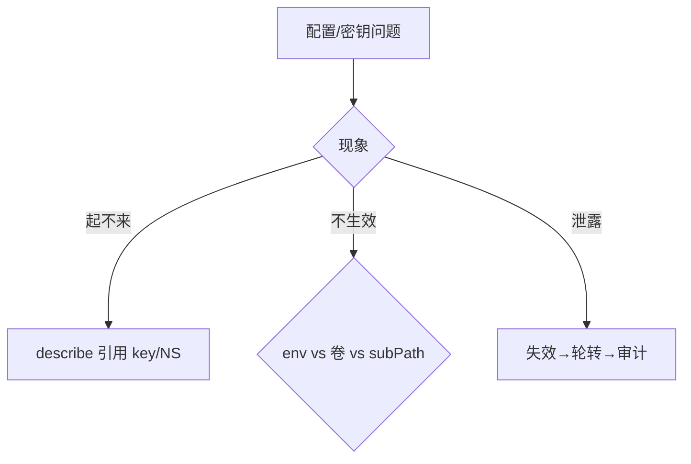

# 12｜配置与密钥 · 练习题

先合上知识点，对着 **一节的主图** 把「一份配置的一生」口述一遍——来源 → 户口（CM/Secret → etcd）→ 注入 → 生效 → 变更轮转，三条虚线是三种报障入口——再来做题。

| 标记 | 含义 |
|------|------|
| **核心** | 不懂整章就没建立起来 |
| **必会** | 值班和面试都要能讲 |
| **常用** | 线上会反复碰到 |
| **常考** | 白板和追问的高频口径 |

## 本题目录

- [Q1 Secret 到底加没加密，生产怎么才算护住了](#q1)
- [Q2 四种注入方式，热更新差异是什么](#q2)
- [Q3 Pod 起不来 CreateContainerConfigError，先看什么](#q3)
- [Q4 数据库密码要轮转，顺序是什么；edit secret 有什么后果](#q4)
- [Q5 ConfigMap 有大小限制吗，活动开关能高频改吗](#q5)
- [Q6 Secret 挂卷权限 0400，非 root 容器读不了怎么办](#q6)
- [Q7 imagePullSecrets 和业务密码是一回事吗](#q7)
- [Q8 projected volume 是什么，SA token 怎么管](#q8)
- [Q9 敏感值能不能放 Git，stringData 呢](#q9)
- [Q10 配置改坏了怎么回滚](#q10)
- [Q11 静止加密怎么开，加密 key 怎么轮转](#q11)
- [Q12 有人把 Secret 明文截图发群里了，怎么办](#q12)
- [Q13 开新服要一套配置，怎么下发](#q13)
- [Q14 60 秒配置定责](#q14)
- [合上书](#合上书)

---

## Q1

**★★★★★｜「你们的 Secret 是加密存储的吗？生产上怎么保证密钥安全？」**

**覆盖**：核心 · 必会 · 常考 ｜ **对应**：知识点 [五、真相：Secret 不是保险箱](知识点.md)

### 场景

新人把数据库密码放进 Secret，在群里说「K8s 加密了，安全」；有人当场 `kubectl get secret -o yaml`，把 base64 一串丢回来问「这不就是密码吗」。值班准备用「我们上了 Vault」一句话把话题盖过去。

### 完整解答

> 🎯 **一句话**：Secret 默认只是 base64 编码；能 get 就能看明文，安全靠五层防护叠加。

base64 是可逆编码、无密钥、谁都能解，不是加密：

```bash
kubectl get secret db-pass -n game -o jsonpath='{.data.password}' | base64 -d; echo
# Pr0d_MySQL_2026!        ← 能 get 就能 decode
```

谁能看明文有两层：**API 层**——有 get/list secrets 权限的人；**盘层**——没开静止加密时，能碰控制面数据目录或 etcd 快照的人（能碰 ≈ 能读所有 Secret）。生产按五层叠：

1. **RBAC** 少给 get / list secrets（[13](../13-RBAC与安全/)）；
2. **静止加密**：EncryptionConfiguration 配在 kube-apiserver（`--encryption-provider-config`），写 etcd 前加密、读时解密，护盘与快照；
3. **值不进 Git**：ExternalSecret / Sealed Secrets + KMS；
4. **审计** get secret 留痕；
5. **immutable** 禁原地改，变更 = 新对象。

> ⚠️ **别混**：开了静止加密 ≠ get 不到明文——API 解密后照样返回明文，加密挡的是盘、快照、etcdctl 直读；「上了 Vault」也只解决第 3 层，注入、滚动、静止加密仍是本章的事。

> 📝 **面试**：按「API 层挡读、盘层挡裸、源头挡漏、事后能查、变更可审」五组背，最后一定补「默认只是 base64，能 get 就能 decode」。

### 再追问

- **追问：etcd 开了 TLS 算不算加密了？** 不算。TLS 管谁能连 2379，EncryptionConfiguration 才管盘上是不是明文；不要拿证书当静止加密的证据。
- **追问：能不能靠把 Secret 藏起来（不给任何人 get）来保证安全？** 可以收紧，但别只靠这一层——控制面被摸、快照流出照样全泄露；五层都要有，且不要试图「删掉所有读权限」，轮转和排障都需要受控的读。

---

## Q2

**★★★★★｜「ConfigMap 注入容器有几种方式？改了之后都会热更新吗？」**

**覆盖**：核心 · 必会 · 常考 ｜ **对应**：知识点 [三、注入：四条通道进容器](知识点.md)、[四、生效：热更新，改了什么时候变](知识点.md)

### 场景

运营改了支付开关 ConfigMap，半小时充值入口还关着。有人建议「再 apply 一次」，有人已经在群里骂 kubelet 坏了；实际上这个 Deployment 用的是 envFrom。

### 完整解答

> 🎯 **一句话**：四条通道——env、envFrom、卷挂载、命令行；env 型必须滚动，卷挂载文件会变但进程要 reload，subPath 当不热更。

| 方式 | 值以什么形式进进程 | 热更新 |
|------|--------------------|--------|
| `env` / `envFrom` | 环境变量，创建时写入 | **否**，必须滚动 |
| 卷挂载 | 文件，kubelet 持续同步 | 文件**会变**，进程要 reload |
| 命令行 `$(VAR)` | 展开进启动参数 | **否**，必须滚动 |
| `imagePullSecrets` | 不进业务进程 | — |

机制：环境变量是**创建容器那一刻**写进进程的，之后没有任何机制去改运行中进程的环境；卷挂载则由节点 kubelet watch CM/Secret，对象变了就同步卷内文件，但同步有秒到分钟级延迟（缓存 TTL），且**文件新了不等于行为新了**——进程要自己 reload。`args` 里的 `$(VAR)` 由 kubelet 创建容器时从 env 展开，本质是 env。subPath 挂单文件，不少版本根本不同步，默认当不热更。

```bash
kubectl get cm game-switch -n game -o yaml | grep PAYMENT_ENABLED
#   PAYMENT_ENABLED: "true"      ← CM 已是新的
kubectl exec deploy/payment -n game -- env | grep PAYMENT_ENABLED
#   PAYMENT_ENABLED=false        ← 容器里还是旧的：没滚动
kubectl rollout restart deploy/payment -n game
# deployment.apps/payment restarted
kubectl rollout status deploy/payment -n game
# deployment "payment" successfully rolled out   ← 新 Pod 全量才是 true
```

> ⚠️ **别混**：「卷挂载会热更新」只对文件成立，对进程行为不成立；也别说「凡是 volume 都会热更」——subPath 是例外。

> 📝 **面试**：排查「改了没生效」先问注入方式，再按三条分支开处方；别说「kubelet 坏了」。

### 再追问

- **追问：有什么办法让改 CM 自动触发滚动？** Helm checksum annotation（CM 内容哈希进 Pod template）或 Reloader。但不要怎么做：不要在活动高峰期放任它们盯生产——误改会被自动推全集群，要么冻结 CM 变更，要么只盯非生产。
- **追问：卷挂载文件变了进程还是旧行为，怎么办？** 先确认应用支持哪种 reload（信号 / 接口 / watch 文件）；不支持就滚动。不要怎么做：不要反复 apply 同一个 CM 碰运气——etcd 里早就是新的，问题在进程不读新文件。

---

## Q3

**★★★★☆｜「Pod 一直起不来，报 CreateContainerConfigError，你怎么排？」**

**覆盖**：核心 · 常考 ｜ **对应**：知识点 [九、作战：定责](知识点.md)、[二、出生：值从哪来、落进哪个对象](知识点.md)

### 场景

新版本上线，Deployment 先发了，配置同事的 ConfigMap 还没 apply，一排 Pod 起不来。有人第一反应是去翻应用日志，日志里什么都没有，越排越乱；还有人想「改一下引用路径」去引另一个 namespace 的 Secret。

### 完整解答

> 🎯 **一句话**：先看 Events 里的引用——对象不存在、key 写错、错 NS；配置先于工作负载发布。

CreateContainerConfigError 发生在**容器创建之前**——kubelet 组装容器时解析 `configMapKeyRef` / `secretKeyRef` / `envFrom` 引用失败，业务进程根本没跑，所以**不要先看应用日志**：

```bash
kubectl describe pod payment-7d9f-x2k4p -n game | sed -n '/Events/,$p'
# Warning  Failed  ... Error: configmap "game-switch" not found      ← 对象不存在
# Warning  Failed  ... key "PAYMENT_ENABELD" not found in configmap  ← key 拼错
```

三类原因：对象不存在（发版顺序反了）、key 写错、**跨了 Namespace**——CM/Secret 是命名空间级对象，Pod 只能引用同 NS 的，「改引用路径指过去」不成立；要跨就复制一份对象，或用 ExternalSecret 从同一外部源在两个 NS 各生成一份。防御动作：先 apply 配置、再发工作负载；发布流水线里把顺序固化。

> ⚠️ **别混**：跨 NS 不是权限问题、不是网络问题，是 API 的对象边界；auth can-i 查出来全绿也一样引用不到。

### 再追问

- **追问：如果对象存在、是 Secret，还会因为什么起不来？** 引用类型写错（把 CM 名写进 secretKeyRef）、类型不匹配（dockerconfigjson 当普通键用）、以及卷权限（0400 对不上 runAsUser 会在运行期报 Permission denied，不是这个错）。不要怎么做：不要靠删了重建 Pod 碰运气，引用不修复，重建一百次都一样。
- **追问：为什么日志里什么都没有？** 因为容器还没创建。不要怎么做：不要去改应用启动脚本里加日志——那是容器跑起来之后的手段。

---

## Q4

**★★★★★｜「生产数据库密码要轮转，步骤是什么？直接 kubectl edit secret 行不行？」**

**覆盖**：核心 · 必会 · 常考 ｜ **对应**：知识点 [七、轮转：换密钥与泄露应急](知识点.md)、[六、变更：改配置就是一次发布](知识点.md)

### 场景

安全要求季度轮转密码。有人图快：数据库侧直接改密码 → `kubectl edit secret` 改成新的 → 等业务自己重连。结果一半 Pod 连不上，且第二天 GitOps 同步后密码又变回了旧值。

### 完整解答

> 🎯 **一句话**：轮转走「新 Secret → 切引用 → 滚动验证 → 删旧」四步；edit 只准当应急止血，当天必须补 Git。

业务密码轮转四步，顺序不能反：

```text
① 新建 Secret（新密码）
② 改 Deploy / STS 的引用，指向新 Secret
③ 滚动，验证新 Pod 连得上
④ 删旧 Secret
```

反序的代价：先在源头改密码或先删旧对象，会有一批还没滚到的 Pod **拿旧密码打新库**，连接错误一片。日常轮转不要原地 edit：不产生新对象，审计断链、回滚无路。应急时 `kubectl edit secret` 是允许的，但若 Git 仍是旧值，下一次 Argo CD / GitOps 同步会**把新密码盖回旧值**（[23](../23-GitOps-ArgoCD与Tekton/)）——纪律是当天内让仓库与集群一致。

> 📝 **面试**：四步 + 反序后果 + 「edit 是止血不是轮转，当天补 Git」；补一句敏感对象建议开 `immutable`，把「改」强制变成「发新对象」。

### 再追问

- **追问：为什么不能用双写/双密码过渡？** 可以做成应用层的新旧兼容窗口，但 K8s 侧仍要走新对象——不要在同一个 Secret 里原地改值假装轮转。不要怎么做：不要删旧 Secret 之前不验证新 Pod 的连接，留一条回滚路。
- **追问：轮转过程中发现 GitOps 已经同步过一次，集群里是新密码、Git 里是旧密码，怎么办？** 立刻把新值（的引用）补进 Git 或暂停该 Application 的 self-heal，先让两边一致再继续滚。不要怎么做：不要继续删旧 Secret——这时任何一步都可能被同步盖回。

---

## Q5

**★★★★☆｜「ConfigMap 有大小限制吗？我们的活动配置很大怎么办？」**

**覆盖**：必会 · 常用 ｜ **对应**：知识点 [八、下发：游戏配置怎么进服](知识点.md)

### 场景

运营要把整张技能表塞进 ConfigMap 下发；还有同事写了个脚本，每秒把活动开关的最新状态 apply 一次，说「这样集群里永远是最新的」。

### 完整解答

> 🎯 **一句话**：单对象 1MiB 硬顶；大表放对象存储、CM 只存版本指针；开关是低频发布动作，不是消息队列。

```bash
kubectl apply -f skill-table-cm.yaml
# Error from server (Invalid): configmaps "skill-table" is invalid:
# data: Too long: must have at most 1048576 bytes   ← 1MiB = 1048576 字节
```

上限来自 etcd 单请求大小（`--max-request-bytes`，常见 1.5MiB，对齐 [02](../02-etcd/)）。正解——表放对象存储，CM 只存指针：

```yaml
data:
  SKILL_TABLE_VERSION: "v20260828"
  SKILL_TABLE_URL: "s3://game-config/skill/v20260828.json"
```

好处：绕开上限；回滚的是**版本指针**而不是整份 YAML；多版本共存；etcd 不被大对象拖慢。「每秒 apply」同样不行——每秒打一次 etcd 写、推一轮 watch，高基数更新把控制面拖出毛刺；活动开关应是低频、可审计的发布动作（改一次、滚一轮、记一笔）。

> ⚠️ **别混**：1MiB 是 API 对象上限，不是「拆成两个 512KiB 的 CM 就能拼回去」——进程要自己合并，多数应用做不到，别绕这个弯。

### 再追问

- **追问：能不能把 etcd 的写入上限调大来绕？** 不要怎么做：抬 `--max-request-bytes` 是把问题转嫁给 etcd（内存、快照、备份全变重），且照样撞 CM 自身的设计预期；指针方案才是正路。
- **追问：指针方案里进程怎么拿到新表？** 进程 watch 挂载文件或 CM 里的版本号，变了就拉取并安全 reload；拉取失败要保留旧表继续服务，不要空配置启动。

---

## Q6

**★★★☆☆｜「Secret 挂载成文件，权限怎么设？非 root 容器读不了怎么办？」**

**覆盖**：必会 · 常用 ｜ **对应**：知识点 [三、注入：四条通道进容器](知识点.md)

### 场景

同事给 Secret 卷设了 `defaultMode: 0400`，上线后容器报 Permission denied 读不到证书；有人提议「改成 0777 最省事」；还有人分不清该改权限还是该改容器用户。

### 完整解答

> 🎯 **一句话**：坚持 0400，把容器的 runAsUser/fsGroup 对上文件属主；不要为了读得上放开权限位。

0400 = 只有属主可读，是 Secret 卷的推荐值。读不了的根因是**容器运行用户与文件属主对不上**：把 Pod 的 `runAsUser` 设成与挂载文件属主一致，或用 `fsGroup` 让卷文件归组可读；改完用 `exec` 验证：

```bash
kubectl exec deploy/tls-app -n game -- ls -ln /etc/tls
# -r-------- 1 10001 10001 ... tls.key   ← 属主 10001，容器也要以 10001 跑
kubectl exec deploy/tls-app -n game -- id
# uid=10001 gid=10001 ...                 ← 对上了才能读
```

注意 Events 不一定点名是 Secret 的问题，应用日志里只会看到 Permission denied；二进制内容用 `binaryData`，别把 PEM 再 base64 一层塞进 Opaque 让应用解两遍。元信息（Pod 名、NS、资源 request）用 DownwardAPI 注入，不必再配一份 CM。

> ⚠️ **别混**：0400 是「防别人读」，不是「防应用自己读」；问题在属主匹配，不在权限位大小。

### 再追问

- **追问：为什么不直接 0777？** 那等于把密码贴在容器门口——同容器、同卷的任何进程都能读。不要怎么做：不要用放宽权限位绕过属主问题，属主对不上才改配置，权限位不动。
- **追问：文件权限对了还是读不了？** 查应用是不是按固定路径/文件名找文件（key 名即文件名）、以及 SELinux/安全上下文。不要怎么做：不要复制一份到 emptyDir 里 chmod——多一个副本多一份泄露面。

---

## Q7

**★★★☆☆｜「imagePullSecrets 是什么？它和业务用的仓库密码是一回事吗？」**

**覆盖**：必会 · 常用 ｜ **对应**：知识点 [三、注入：四条通道进容器](知识点.md)

### 场景

节点拉私有镜像报 401，ImagePullBackOff。有人去改业务 Deployment env 里的「仓库密码」，改了半天没用——镜像根本没到容器那一步。

### 完整解答

> 🎯 **一句话**：imagePullSecrets 只给 kubelet 拉镜像用，不进业务进程；和业务 env 里的密码是两回事。

拉镜像发生在**容器创建之前**，执行者是节点上的 kubelet：它读 Pod 的 `imagePullSecrets`（类型 `kubernetes.io/dockerconfigjson`）拿凭证去仓库拉层。业务容器里的环境变量与此无关——镜像拉不下来，容器压根没起。401 先查：Pod 的 imagePullSecrets 引没引、引的 Secret 类型和内容对不对、节点运行时配置（[17](../17-节点运行时与升级/)）。

> ⚠️ **别混**：名字里都有 secret，但 imagePullSecrets 的消费者是 kubelet，env 注入的消费者是业务进程；排障路径完全不同。

### 再追问

- **追问：dockerconfigjson 里有什么？** 仓库地址、用户名、密码、邮箱的 JSON——同样是 base64 编码，别当加密。不要怎么做：不要把拉镜像凭证和数据库密码放同一个 Secret，权限面会互相污染。
- **追问：每个 Pod 都要写 imagePullSecrets 吗？** 可以在 ServiceAccount 上挂，自动合并。不要怎么做：不要用「全节点 docker login」代替——那是节点状态，不在声明式管理里，节点一换就丢。

---

## Q8

**★★★☆☆｜「projected volume 是什么？ServiceAccount token 是怎么进容器的？」**

**覆盖**：必会 · 常用 ｜ **对应**：知识点 [三、注入：四条通道进容器](知识点.md)

### 场景

审计要求收紧集群内凭证：有人发现每个业务 Pod 都自动挂了一个 SA token，担心泄露后被拿来打 API；同事建议「把 token 的 Secret 删了」，但 Pod 里 token 还在。

### 完整解答

> 🎯 **一句话**：projected volume 把 CM/Secret/DownwardAPI 合成一个卷；SA token 也是 projected 注入，1.24+ 默认是有过期、自动轮换的 Bound Token。

projected volume 能把多个来源（ConfigMap、Secret、DownwardAPI、token）投到**同一个目录**。ServiceAccount Token 就是走这条路进容器的：1.24+ 默认注入 **Bound Token**——绑定特定 SA、有过期时间、由 kubelet 自动轮换，不再依赖一个永不过期的 Secret 对象（所以「删 Secret」对 projected token 无效）。安全动作：不需要调 API 的业务 Pod 关自动挂载（`automountServiceAccountToken: false`，细节 [13](../13-RBAC与安全/)）；还在用老式永不过期 token 的尽快迁移——泄露后无法靠过期自愈。

> ⚠️ **别混**：老式 token 是集群里一个真实的 Secret 对象；Bound Token 是 projected 文件，背后没有可删的 Secret——两种机制的运维动作不一样。

### 再追问

- **追问：为什么 Bound Token 泄露危害更小？** 有过期时间、与 SA 绑定、可随轮换失效；配合最小化 RBAC，窗口和权限都小。不要怎么做：不要靠「没人知道 token 在哪」当安全措施，文件路径是标准约定，攻击者第一个就去读。
- **追问：DownwardAPI 是干什么的？** 把 Pod 自身的元信息（名字、NS、资源 request）注入 env 或文件，打日志标签、自标识用。不要怎么做：不要为这点元信息再维护一份 CM——两处维护必然不一致。

---

## Q9

**★★★★☆｜「Secret 能提交到 Git 吗？stringData 是不是比 data 安全点？」**

**覆盖**：必会 · 常考 ｜ **对应**：知识点 [二、出生：值从哪来、落进哪个对象](知识点.md)

### 场景

同事觉得 `stringData` 是「明文可读、方便 review」，把数据库密码写在 stringData 里提了 PR；review 的人说「反正 K8s 会转成 base64 存的，没事」。

### 完整解答

> 🎯 **一句话**：都不能进 Git——stringData 只是提交方便字段，API 照样转 base64 存；Git 里的是明文密码本。

`stringData` 与 `data` 的区别只在**提交体验**：你写明文，API Server 收存时转成 `data`（base64）落 etcd。所以「stringData 更安全/更不安全」都是伪命题——安全性取决于**值有没有出现在 Git 历史里**，明文进了仓库就等于进了密码本，且历史清理极难。生产做法：Git 里只放「去哪取值」的引用——ExternalSecret（声明从外部密钥管理取）或 Sealed Secrets（加密后的密文对象，只有集群内控制器解得开），真值放 KMS / Vault。

> 📝 **面试**：「Git 里只放引用不放值；stringData 只是提交方便字段； ExternalSecret/Sealed + KMS 管真值」——三句连说。

### 再追问

- **追问：已经提进 Git 了怎么办？** 当作已泄露：源头失效 → 轮转（Q4/Q12 流程）→ 再清 Git 历史。不要怎么做：不要只清历史不轮密码——clone 过的人手里仍是明文。
- **追问：Sealed Secrets 的密文进 Git 安全吗？** 密文只能被特定集群的控制器解开，但仍要防「集群私钥泄露 + 密文在手」的组合，定期轮 Sealed 的加密密钥。不要怎么做：不要跨集群复用同一个 sealed 密文当「通用方案」。

---

## Q10

**★★★★☆｜「改了 ConfigMap 结果业务坏了，怎么回滚？」**

**覆盖**：必会 · 常用 ｜ **对应**：知识点 [六、变更：改配置就是一次发布](知识点.md)

### 场景

新活动配置带着一个拼错的 key，checksum annotation 自动把所有 Pod 滚成了新配置，活动入口报错。有人只 `rollout undo` 了 Deployment，没回 ConfigMap；也有人只回了 ConfigMap，没动 Deployment——两种都只恢复了一半。

### 完整解答

> 🎯 **一句话**：回滚是两条通道——Deployment 的滚动状态和 ConfigMap 的内容，哪个动了回哪个，都动了都回。

```bash
kubectl rollout undo deploy/activity -n game       # 通道一：回 Deployment 滚动状态
# deployment.apps/activity rolled back
kubectl rollout status deploy/activity -n game
# deployment "activity" successfully rolled out    ← 注意：回到的是 template 里的旧引用
kubectl apply -f activity-config-previous.yaml     # 通道二：回 ConfigMap 内容
# configmap/activity-config configured
kubectl exec deploy/activity -n game -- env | grep ACTIVITY_KEY   # ← 验证到进程
```

两条通道的来源不同：checksum 场景里引用写在 Pod template，`rollout undo` 会把**旧的 CM 引用**一起带回；而只改 CM 靠进程 reload 的场景，undo 没用，得回上一版 CM 并**确认进程真的 reload 回去了**。回滚完用 `exec` 验证到进程，不是看对象像不像。防御：变更前 `kubectl diff`；敏感对象开 `immutable` 逼自己走新对象，回滚 = 切回旧对象，天然原子。

> ⚠️ **别混**：热更指针和 Deploy 滚动是两条独立通道，只回其中一个 = 半回滚；发布单上两条回滚路径都要写清（[16](../16-灰度与回滚/)）。

### 再追问

- **追问：为什么建议改配置也走发布单？** 改配置就是一次发布：有 diff、有验证、有回滚路径；活动高峰还要冻结非必要变更。不要怎么做：不要「就改一个字段」跳过 diff——拼错的 key 就是这么进生产的。
- **追问：用了 GitOps 怎么回？** 回 Git 上的上一个版本、同步下去即可，审计天然完整。不要怎么做：不要在集群里手改出「比 Git 新」的状态然后指望 GitOps 帮你回——方向反了，它会把你手改的盖掉。

---

## Q11

**★★★★★｜「etcd 里的 Secret 是明文，怎么开静止加密？密钥本身怎么轮转？」**

**覆盖**：必会 · 常考 ｜ **对应**：知识点 [五、真相：Secret 不是保险箱](知识点.md)

### 场景

合规检查发现 etcd 快照里 Secret 是明文。有人把 EncryptionConfiguration 发到了**一台**控制面、没重启就宣布完成；还有人轮转时直接把旧 key 从列表里删了，一批 Secret 从此读不出来。

### 完整解答

> 🎯 **一句话**：加密配在 kube-apiserver 不在 etcd；开加密五步、轮 key「新 key 第一 → 重启 → rewrite → 再撤旧」。

开启五步：

```text
① 生成 32 字节 key，写 EncryptionConfiguration：aescbc/kms 在前，identity 链尾
② 同一份配置分发到每台控制面，apiserver 加 --encryption-provider-config
③ 滚动重启全部 API Server（一台 ready 再下一台）
④ 维护窗口 rewrite 存量，逼每个 Secret 用链首 provider 重写
⑤ etcdctl 只读抽查：密文前缀 k8s:enc:aescbc:v1:，不再是明文 JSON
```

链的规则：**第一个能加密的 provider 负责新写**（新 key 永远插第一）；**整条链都用来解密**（旧 key 留到存量改写完）；`identity` 是明文兜底，必须链尾——放第一等于新写又变明文，等于关加密；只改文件不重启，进程还拿旧链。rewrite：

```bash
kubectl get secrets --all-namespaces -o json | kubectl replace -f -
# 读出再写回：每个 Secret 用链首新 provider 重新加密（维护窗口执行）
```

key 轮转口诀同构：**新 key 插第一 → 重启全部 API → rewrite 存量 → 确认后再撤旧 key**。托管集群（ssh 不进控制面）则问清 Encryption at Rest 是否默认开、key 谁轮。

> ⚠️ **别混**：开了加密 ≠ get 不到（API 解密后给你）；etcd TLS ≠ 静止加密（TLS 管连接，加密管盘）。

> 📝 **面试**：「配在 kube-apiserver 的 --encryption-provider-config；新 key 第一、identity 最后；改完重启全部 API；轮换先插新再 rewrite 再撤旧」——再加一句「快照已带明文流出，事后开加密救不回那份快照」。

### 再追问

- **追问：只加密 secrets 够吗，要不要把 Pod 也加密？** 默认只加密 secrets；Pod 加密收益小、密钥轮换面更大。不要怎么做：不要为「看起来更全面」扩大 resources 列表。
- **追问：kms/kmsv2 provider 好在哪？** 信封加密：DEK 由 KMS 管，轮 key 不用碰静态文件、不用分发裸密钥。不要怎么做：不要在没有 KMS 运维能力时硬上，先把 aescbc 跑顺。

---

## Q12

**★★★★★｜「有人把 get secret 的明文截图发到大群里了，你作为值班怎么处理？」**

**覆盖**：核心 · 必会 · 常考 ｜ **对应**：知识点 [七、轮转：换密钥与泄露应急](知识点.md)

### 场景

下午三点，大群里有人贴了 `kubectl get secret -o yaml` 的截图@同事问问题，生产库密码明文可见，群里有 200 多人、含外包。有人回复「撤回就行了」，有人准备先去删那个 Secret。

### 完整解答

> 🎯 **一句话**：先让旧值在源头失效，再走四步轮转，查流向、堵渠道；撤回消息不算止血。

```text
① 定范围   哪个 key、谁看过、传到了哪（群 / Git / 快照 / 个人设备）
② 先失效   在源头系统改密码、吊销 token —— 不是先去删 K8s 对象
③ 再轮转   新 Secret → 切引用 → 滚动 → 删旧
④ 查流向   审计日志拉 get/list secrets 记录；etcd 快照是否已带明文流出
⑤ 堵渠道   Git 历史清理、旧快照作废；撤回截图只是补救，别当已止血
```

顺序的理由：删 K8s 对象不改源头密码，群里的截图照样能登数据库——**失效必须从源头做起**。轮转走新对象四步（Q4），期间老连接逐步切走。事后补两道防线：给 secrets 的读权限上审计告警、开/验静止加密；但要记住边界——**事后开加密救不回已经流出的快照和截图**，值离开过边界就按已泄露处理。

> 📝 **面试**：「先失效、再轮转、查审计、堵渠道」四拍 + 「别只轮 K8s 不轮源头」「别把撤回当止血」两句铁律。

### 再追问

- **追问：要不要先把泄密者权限全停了？** 要控制其后续访问，但不要把「定责」放在「止血」前面——先让值失效，再谈责任。不要怎么做：不要为了查清责任拖着不轮转，泄露窗口每多一分钟都是风险。
- **追问：如果泄露的是 SA token 而不是密码呢？** 吊销/轮换对应 SA 的凭证（Bound Token 可等自然过期，紧急时删 SA 或调 RBAC 断其权限），同样查审计。不要怎么做：不要只删聊天记录、不查这个 token 过去都调过什么。

---

## Q13

**★★★★☆｜「新游戏要开 20 个服，每服一套配置，你们怎么下发？」**

**覆盖**：必会 · 常用 ｜ **对应**：知识点 [八、下发：游戏配置怎么进服](知识点.md)

### 场景

开服表（开服时间、渠道参数、初始活动开关）有人直接打进了游戏镜像，结果改一个渠道参数要重新构建镜像、把 20 个服全滚一遍；还有人打算 20 个服共用一个 ConfigMap，靠环境变量区分。

### 完整解答

> 🎯 **一句话**：配置跟着服走不跟着镜像走——模板化生成每服的 CM/Secret；镜像只含程序。

开服配置是**每服不同的运行时数据**，打进镜像等于把「配置变更」绑架成「版本发布」：改一个参数要构建、推仓库、滚全部同镜像的服。正解：用 Helm / Kustomize 模板（[22](../22-Helm与Kustomize/)）从开服表渲染出每服的 ConfigMap/Secret，按服（或每服一个 NS）落对象；镜像保持一份，配置对象各发各的。共用一个 CM 靠环境变量区分也不行——改任何一个服的参数都要碰公共对象，爆炸半径 20 个服。流程上对齐开服合服的完整动作：[07-06](../../07-游戏运维专题/06-开服合服/)。

> ⚠️ **别混**：「同一份镜像 + 不同配置对象」是目标状态；「不同镜像」或「同一份配置对象」都是把配置和代码耦合回去。

### 再追问

- **追问：开服后运营要改某个服的活动开关呢？** 走本章六节的标准变更：改该服的 CM、按注入方式决定滚不滚、验证到进程；配置对象独立，爆炸半径只有一个服。不要怎么做：不要为「统一」把 20 个服的开关合成一个 CM 的 20 个 key——又回到公共对象问题。
- **追问：开服表本身很大（上百个参数 × 20 服）放哪？** 小键进 CM/Secret；大块数据走对象存储 + CM 存版本指针（Q5 的方案），开服 = 指向该服版本的指针。不要怎么做：不要拿「先塞进去再说」去撞 1MiB——apply 报错是小事，etcd 被大对象拖慢是大事。

---

## Q14

**★★★★★｜CreateContainerConfigError、改了不生效、Secret 泄露，60 秒分流**

**覆盖**：核心 · 必会 ｜ **对应**：知识点 [九、作战：定责](知识点.md)

### 场景

三类工单同时来：Pod 起不来；改 CM 行为旧；群里有人贴 base64 Secret。

### 完整解答

> 🎯 **一句话**：起不来→describe 引用；不生效→按注入方式分支；泄露→先失效再轮转。



```bash
kubectl describe pod <p> -n prod | sed -n '/Events/,$p'
kubectl exec <p> -n prod -- cat /etc/game/config.yaml
```

> ⚠️ **别混**：base64 **不是**加密；能 `get secret` 就能 decode（Q1）。

### 再追问

1MiB 技能表怎么下发？——对象存储+指针 CM，或拆多 CM；**不要**硬塞进 etcd（知识点八节）。

---

## 合上书

1. **默画主图**：来源 → 户口（CM/Secret → etcd）→ 注入 → 生效 → 变更轮转；说出三条虚线各对应哪种报障入口（对应知识点合上书 1）。
2. **口述出生**：值从哪来（Git 只放引用）、CM vs Secret、都进 etcd、1MiB、跨 NS 不行、三种 Secret 类型、stringData 为什么不能进 Git（对应 2）。
3. **口述注入**：四条通道各以什么形式进进程、热更新差异；imagePullSecrets 为什么不算；0400 与 runAsUser 的关系（对应 3）。
4. **默画热更新分叉图**：apply 之后 env/卷挂载/subPath 三条路各停在哪；kubelet 同步为什么是秒到分钟级（对应 4）。
5. **口述真相**：base64 为什么不是加密、谁能看明文（两层）、静止加密配在哪、provider 链三条规则、为什么开了加密 get 仍能看（对应 5）。
6. **默画五层防护图**：RBAC / 静止加密 / 值不进 Git / 审计 / immutable 各挡哪个入口，并说清它不保证什么（对应 6）。
7. **口述变更**：改 CM 要不要重启的判据、immutable 的三个好处、edit 当天补 Git、回滚双通道（对应 7）。
8. **口述轮转与应急**：业务轮转四步及反序代价、加密 key 轮转口诀、泄露五步（先失效再轮转）；为什么事后开加密救不回旧快照（对应 8）。
9. **口述下发**：开服配置不进镜像、大表不进 etcd、开关别每秒 apply、热更指针与滚动两条通道（对应 9）。
10. **定责**：CreateContainerConfigError 先看什么；「改了没生效」怎么按注入方式分支；60 秒剧本四步各敲什么（对应 10）。
