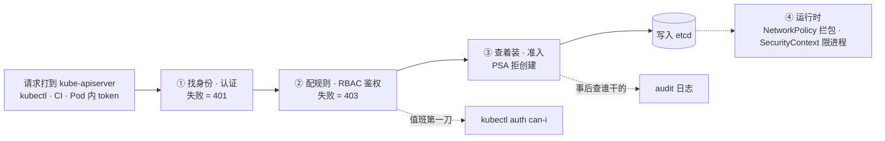
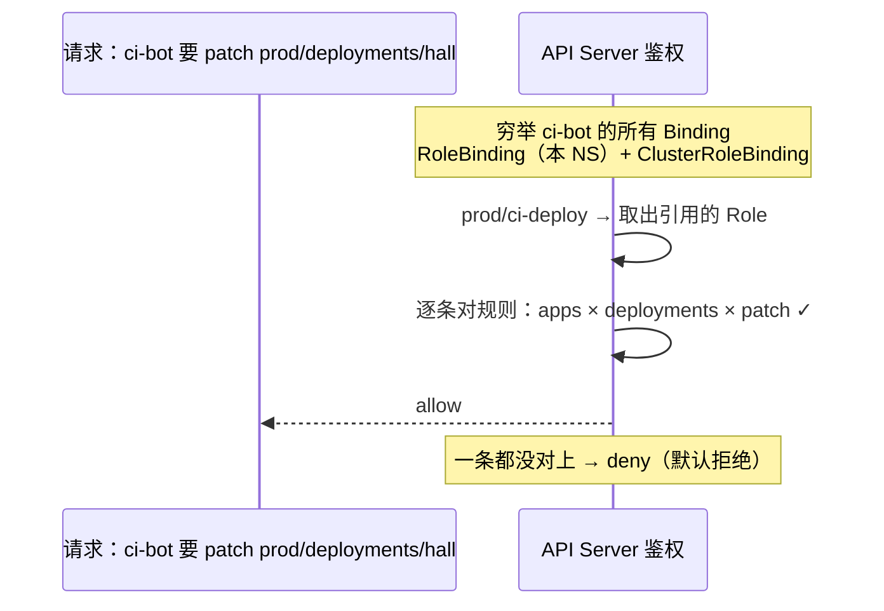
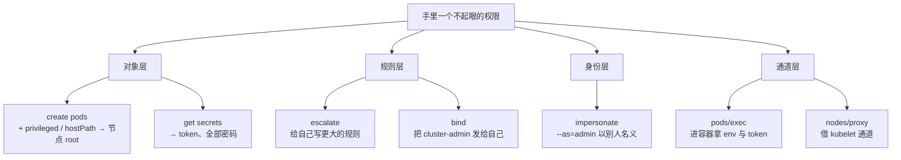
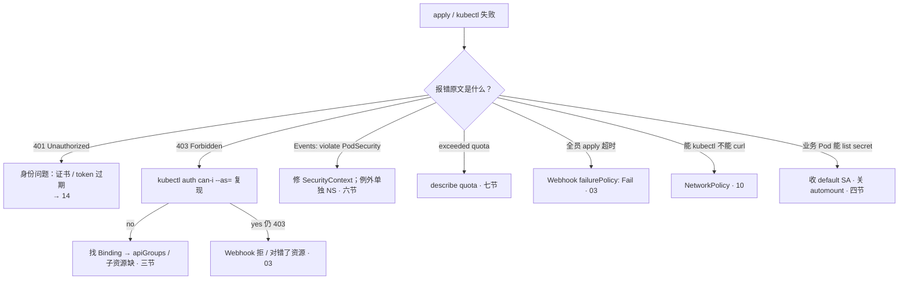

# RBAC 与安全

> 大家好。上一章讲完配置与密钥怎么护；这一章讲**一次权限判定怎么走完一生**——以及为什么「用这份 cluster-admin kubeconfig 止血」是事故。
> 开讲之前，先带大家回到几个现场：发版夜排查，实习生掏出一份 cluster-admin 的 kubeconfig：「用这个，权限大」；安全扫描发现某项目 CI 的 ServiceAccount 能 list 全集群 Secret，没人说得清谁授的；大厅 Pod 被 RCE 之后，对方真的把支付 Secret 读了出来——群里已经有人要给大家都绑上 admin 止血，另一人提议把 prod 的 PSS 改成 privileged 顶过去。手都别动。
> 这一章讲完，你会知道这些人各自错在哪——401 和 403 为什么不是一种病，能建 Pod 为什么等于能拿节点，以及为什么止血永远不是绑 admin。
> **本章回答的问题**：一次权限判定的一生——身份怎么找到、规则怎么匹配、发出去的权限会沿哪些路径换成万能钥匙，以及事后怎么查是谁干的。
> **本章不讲**：请求全链路 / APF / Webhook failurePolicy / 审计组件怎么开 → [03](../03-API-Server/)；证书体系与 kubeconfig 结构 → [14](../14-证书与kubeconfig/)；东西向包与 NetworkPolicy 规则 → [10](../10-CNI与网络策略/)；Secret 静止加密与轮换 → [12](../12-配置与密钥/)；镜像禁 latest、扫描、签名 → [04-03](../../04-工程化与自动化/03-制品与镜像/)；GitOps 谁有权 sync → [23](../23-GitOps-ArgoCD与Tekton/)。

**标记**：🎯重点 · 🔥难点 · ⭐常考 · 🔧实操

**怎么听这场分享**：第一节是判定主图；二到八节顺着找身份 → 配规则 → 发卡 → 提权路径 → 着装 → 分房间 → 审计；第九节定责。口诀先埋一句：⭐ **401 是「我不认识你」，403 是「我认识你，但你不能这么干」**。

---

## 一、一张图：一次权限判定的一生

> 🎯 **一句话**：每个请求都走「找身份 → 配规则 → 允许/拒绝」；权限全靠绑定发出去，绑定全都查得到。

咱们先不急着背 Role 和 ClusterRole 的字段。学权限最怕一上来背四件套，背完还分不清 401 和 403。先看图：



**读图**：

- 主线是一个请求的四站：先找到身份（你是谁），再配规则（你能不能），准入再看要创建的对象长得合不合规，过了才写 etcd；跑起来之后还有运行时一套（NetworkPolicy / SecurityContext）管着。
- 每一站失败长得都不一样：401 是身份问题、403 是规则问题、准入是创建被拒、NP 是包不通——「没权限」不是一种病（二节）。
- 两条虚线是全章值班的两个工具：鉴权有疑，`can-i` 正向复现；要查谁干的，audit 倒查（八九节）。

**判定是无状态的**：每个请求独立查一遍 Binding 判一次，没有缓存——所以删 Binding **立刻生效**、改规则不用重启，这是后面「收权」（四、八节）敢立刻动手的底气。也正因为判定在唯一入口 kube-apiserver 上做，**绕不开、躲不掉**——任何工具想动集群都得过这四站（[03](../03-API-Server/)）。

**鉴权模式可以并存**：`--authorization-mode=Node,RBAC,Webhook` 是逗号列表，**任一允许即过**，没有一票否决——所以外挂 Webhook 鉴权挡不住 RBAC 发宽的权限，只能指望把 RBAC 收干净。kubeadm 控制面默认 `Node,RBAC`：Node 授权器限定 kubelet 只能碰自己节点上的对象，RBAC 管所有人、CI 和 Pod。

口诀：⭐ **401 我不认识你，403 我认识你但不能这么干**。好，先把四种「没权限」劈开。

本节对应练习题 Q1、Q14。

---

## 二、找身份：四种「没权限」

> 🎯 **一句话**：401 问你是谁，403 问你能不能，准入拒创建，NP 拦包。

开篇实习生掏出 admin kubeconfig——大家想想：证书过期和规则没给，报错一样吗？不一样。先把身份这一站讲清。

判定第一步是找到身份，官方叫 **Subject（主体）**，只有三种：

- **User**：真人，走客户端证书或 OIDC 登录（[14](../14-证书与kubeconfig/)）。人不要共享一份永久 kubeconfig——出了事审计上只有一个人的名字，背上全锅。
- **Group**：一组人，常配合 OIDC 的组织结构。
- **ServiceAccount（SA）**：集群内进程的身份，Pod 和 CI 调 API 都用它（四节细讲）。

> 💡 **打个比方**：进公司大楼——刷工牌进门（认证），门禁判你能上几层（鉴权），前台查访客单和着装（准入），进了机房还有闸机（运行时）。工牌刷开了不代表你能进机房，门禁过了也不代表你穿对了。

四道门各管各的，失败码各不相同：**认证**失败是 **401**（证书过期、token 无效，去查身份不是查规则）；**鉴权**失败是 **403**（身份有了，规则没给）；**准入**失败是**创建被拒**，Events 里写明原因，HTTP 码不是 403；**运行时**的 NetworkPolicy 拦的是包，和 kubectl 一点关系没有。

> ⚠️ **别混**：三对高频混淆一次说清。① **RBAC 管 API 动词，NetworkPolicy 管包**——有 cluster-admin 但 NP 默认拒，照样 curl 不到支付 Pod；能 ping 通也不代表能 delete。② **PSA 拒绝不是 403**——它发生在准入层，鉴权早就过了。③ **RBAC / ABAC 在鉴权层，PSA 在准入层**——一道门过了另一道仍可拒。

三种「授权机制」常被说成一种，其实层都不同：

| 对比 | RBAC | ABAC | PSA |
|------|------|------|-----|
| 层 | 鉴权 | 鉴权 | **准入** |
| 载体 | Role / Binding 等 API 对象 | apiserver 旁路的策略文件 | NS 标签 `pod-security.kubernetes.io/*` |
| 变更 | `kubectl apply` 即生效 | 改文件 + 重启 API Server | `kubectl label ns` |
| 审计 | `kubectl get rolebinding` 列得出谁有权 | 文件在 API 外，值班看不见 | Events 写 violate PodSecurity |
| 失败 | 403 | 403 | 创建被拒，不是 403 |
| 生产 | **默认** | 旧集群遗留，**不要新开** | PSP 废弃后的硬墙 |

ABAC 不新开的理由就一条：**没有 Binding 对象**，`kubectl get` 永远列不出「谁有权」，出了事对不上人。

> 🔍 **现场**：两类报错长得完全不同，先看文案再动手。

```bash
kubectl apply -f deploy.yaml -n prod
# Error from server (Forbidden): deployments.apps "hall" is forbidden:
#   User "system:serviceaccount:prod:ci-bot" cannot patch resource
#   "deployments" in API group "apps" in the namespace "prod"   ← 403：RBAC 没发卡
kubectl describe pod hall-xx -n prod | tail -3
# Warning  FailedCreate  ... violate PodSecurity "restricted:latest":
#   allowPrivilegeEscalation != false   ← 准入拒创建：鉴权早过了，着装不合格
kubectl get pods -n prod
# error: You must be logged in to the server (Unauthorized)   ← 401：身份问题，查证书 / token 过期，去 14
```

「能 kubectl 不能 curl」→ RBAC 过了、包被 NP 拦（[10](../10-CNI与网络策略/)）；「能 ping 不能 delete」→ 包通不代表 API 有这张卡。值班先听报错原话，再对号入座，别上来就翻 Role。

口诀再钉一次：⭐ **401 / 403 / 准入拒 / NP 拦包——四种病四副药**。身份找到了，规则怎么配？

本节对应练习题 Q1、Q2、Q10。

---

## 三、配规则：RBAC 四件套

> 🎯 **一句话**：Role 是规则，Binding 才是发卡；绑错范围就是提权。

大家想想：RoleBinding 引用 ClusterRole，权限是全集群生效吗？很多人答「是」——⭐ 高频错答。仍限该 NS。

**RBAC（Role-Based Access Control，基于角色的访问控制）** 只有四个对象，两两分工——**Role 类写「能干什么」，Binding 类管「发给谁」**：

| 对象 | 是什么 | 范围 |
|------|--------|------|
| **Role** | 规则集合（verbs × resources × apiGroups） | 一个 namespace 内 |
| **ClusterRole** | 规则集合；集群级资源（如 Node）只能用 | 全集群（也可被 RoleBinding 引用） |
| **RoleBinding** | 发卡：把某个 Role 发给某个身份 | 只在某一个 NS 内生效 |
| **ClusterRoleBinding** | 发卡：把 ClusterRole 发给某身份 | 全集群 |

> 💡 **打个比方**：Role / ClusterRole 是「门禁卡模板」——列出能开哪些门；Binding 是「把卡发给具体的人」。同一张 ClusterRole 模板，走 RoleBinding 发出去是一层楼的通行证，走 ClusterRoleBinding 发出去是全楼通行证。**模板不决定范围，怎么发才决定范围。**

一条规则长这样，四个字段各是一个坑位：

```yaml
apiVersion: rbac.authorization.k8s.io/v1
kind: Role
metadata: { name: ci-deploy, namespace: prod }
rules:
- apiGroups: ["apps"]              # ← deployments 在 apps 组；写 ""（core 组）就是 403
  resources: ["deployments"]       # ← 子资源另写：pods/log、pods/exec
  verbs: ["get", "list", "patch"]  # ← 动词：要什么给什么，别写 "*"
  resourceNames: ["hall"]          # ← 可选：再收到「这一个」对象，如某个 Secret
```

**规则三坑**，值班天天见：① **apiGroups 对不上**——`deployments` 属于 `apps` 组，规则写在 `""`（core 组）里等于没写，现象是「规则看起来有，apply 还是 403」；② **子资源是独立资源**——`pods` 和 `pods/log`、`pods/exec` 是三个东西，只写 `pods` 能 get 不能打日志；`pods/exec` 这条通道还能被用来提权（五节）；③ **resourceNames 是最细的锁**——能把「可读所有 Secret」收成「只能读这一个」。

**匹配是怎么发生的**：



**读图**：从身份出发穷举它的所有 Binding，取出引用的规则逐条对，**任一命中即允许，全不命中才拒**——RBAC 是**默认拒绝**的，没绑就是没有，不存在「默认放开」。

**内置 ClusterRole** 四个常用：`view`（只读）/ `edit`（可写非权限对象）/ `admin`（NS 内管理）/ `cluster-admin`（`*` × `*` × `*`，万能钥匙）。`admin / edit / view` 靠 **aggregationRule** 聚合而来——规则按标签自动合并，**改一个源 ClusterRole，所有聚合它的一起变**，这是集群级变更，别当成「只影响一个监控 SA」的小事。

**verbs（动词）** 按危险度分三档记：读类 `get / list / watch`；写类 `create / update / patch / delete`；特殊类 `escalate / bind / impersonate`——第三档就是五节的提权钥匙，发卡时看见要停一下。另外两个坑位：Binding 的 **roleRef 建好后不可修改**，换引用只能删了重建；**ClusterRole 才是集群级资源（Node、Namespace）的唯一载体**，Role 写 Node 无效。

**三种典型发卡姿势**，一起记：

```yaml
# ① 给开发 prod 只读：RoleBinding + ClusterRole/view（仍限该 NS）
kind: RoleBinding
metadata: { name: dev-readonly, namespace: prod }
roleRef: { kind: ClusterRole, name: view, apiGroup: rbac.authorization.k8s.io }
subjects: [{ kind: User, name: dev-alice, apiGroup: rbac.authorization.k8s.io }]
---
# ② 给监控读 Node：Node 是集群级资源，只能 ClusterRoleBinding
kind: ClusterRoleBinding
metadata: { name: monitor-nodes }
roleRef: { kind: ClusterRole, name: view, apiGroup: rbac.authorization.k8s.io }
subjects: [{ kind: ServiceAccount, name: monitor, namespace: kube-system }]
```

③ 给 CI 部署权：独立 SA + 本 NS Role，`resourceNames` 锁到指定 Deployment，verbs 不写 `*`。

> ⚠️ **别混**：**RoleBinding 引用 ClusterRole，权限仍限该 NS**——这是「给开发 prod 只读」的标准姿势。反过来，ClusterRoleBinding 只能引用 ClusterRole；若图省事把一个 NS 级 Role 升格成 ClusterRole 再全集群绑出去，范围就放大了——这不是方便，是提权。**cluster-admin 的任何新增绑定都是事故级变更**，定期扫，来历不明当安全事件。

> 🔍 **现场**：查「这张卡谁发的」，就看 Binding 的 roleRef 和 subjects。

```bash
kubectl get rolebinding ci-deploy -n prod -o yaml
# roleRef:
#   apiGroup: rbac.authorization.k8s.io
#   kind: Role            ← 引用的规则模板
#   name: ci-deploy
# subjects:
# - kind: ServiceAccount  ← 卡发给了谁
#   name: ci-bot
#   namespace: prod
```

> 📝 **面试**：问四件套，按「两个写规则、两个管发卡」说：Role / ClusterRole 是规则模板，RoleBinding / ClusterRoleBinding 决定发给谁、发多大范围；再补「RoleBinding 引用 ClusterRole 仍限该 NS」和「默认拒绝、任一命中即过」两句，就是满分口径。

口诀：⭐ **模板不决定范围，怎么发才决定范围；绑错范围就是提权**。卡怎么发给 CI 和 Pod？

本节对应练习题 Q3、Q4。

---

## 四、发卡：ServiceAccount 与最小权限

> 🎯 **一句话**：人走 OIDC，Pod 走 SA；default 零权限，不调 API 别挂 token。

开篇 CI 能 list 全集群 Secret——大家想想：起点往往是半年前有人给 default 绑了个 edit 图省事。口诀：⭐ **default 零权限；CI 禁 cluster-admin；不调 API 关 automount**。

**ServiceAccount（服务账户）** 是 Pod、CI 这类进程在集群里的身份，和 User 的分工一句话：**人走证书 / OIDC，进程走 SA**。SA 是 API 对象，建在某个 NS 里；Pod 通过 `spec.serviceAccountName` 声明用谁，**没写就继承该 NS 的 default SA**。

token 是 SA 打 API 的凭证，有两代，差别是值班必须知道的：

- **1.24 之前**：每个 SA 自动创建一个 **Secret Token**，存在 Secret 里，**永不过期**——泄露就是永久后门，必须手动删 Secret 才失效。
- **1.24+**：默认改用 **Bound Token**（TokenRequest API 签发），**有过期时间、随 Pod 生死**，挂载在 projected volume 里。老式永久 token 只在显式创建 Secret 时才出现，能不用就不用。

🔥「Bound Token」第一次见可能有点懵——意思是：**这张票绑死了某个 SA、某个 Pod，过期就废，Pod 没了票也没了**；不像老式 Secret Token 那张永久工牌，谁捡到都能用到天荒地老。

**最小权限落地六步**，顺序就是优先级：

1. 人走 OIDC / 证书，**不共享任何一份永久 kubeconfig**；
2. CI 用**独立 SA**，只给本 NS 内指定资源的 get / list / patch，verbs 不写 `*`，**禁止 cluster-admin**；
3. 业务 Pod 不调 API 的，一律 `automountServiceAccountToken: false`——**不挂 token，RCE 了也没枪**；
4. 每个 NS 的 **default SA 保持零权限**；
5. 开发默认**不给 get secrets**（Secret 本身不是保险箱，见 [12](../12-配置与密钥/)），确需读某一个，用 `resourceNames` 锁到那一个；
6. **定期扫** `clusterrolebinding` 里的 admin 类绑定，`get secrets`、`create clusterrolebinding` 这类动词进审计告警（八节）。

**两条红线**：CI SA 给 cluster-admin = 「能提交代码的人 = 拥有集群的人」，CI 凭证泄露面被放大到全集群；default SA 绑宽 = 该 NS 所有忘写 `serviceAccountName` 的 Pod 一起继承——「大厅 Pod 被 RCE 后能 list secret」的故事，起点往往是半年前有人给 default 绑了个 edit 图省事。

> ⚠️ **别混**：给 default SA 绑宽权限，**不是**只影响显式用它的 Pod——没写 saName 的 Pod 全部继承。反过来收权也要记得：先删宽 Binding，再给存量工作负载补上 `automountServiceAccountToken: false`。

> 🔍 **现场**：`can-i` 三刀，先复现再定责。

```bash
kubectl auth can-i --list -n prod
# deployments.apps   []   []   [get list patch]   ← 当前身份的「动词 × 资源」全清单
kubectl auth can-i list secrets --as=system:serviceaccount:prod:ci-bot -n prod
# yes   ← CI SA 能 list secrets：事故信号，立刻查谁绑的
kubectl get clusterrolebinding -o wide | grep -iE 'cluster-admin|/admin'
# hall-debug   ClusterRole/admin   Group:dev-intern   ← 来历不明 = 安全事件
```

`--as=` 是值班利器：不用切身份，直接替那个 SA 问「你能不能」。

**经典事故的完整收权现场**——大厅 Pod 被 RCE 后能 list secret，顺着查：

```bash
kubectl get pod hall-7d8f9 -n prod -o jsonpath='{.spec.serviceAccountName}{"\n"}'
# （空行）   ← 没写 saName，继承 default SA
kubectl auth can-i list secrets --as=system:serviceaccount:prod:default -n prod
# yes   ← 坐实：有人给 default 绑过宽权限
kubectl delete rolebinding <误绑的> -n prod        # ← 第一刀：收卡，立刻生效
# 第二刀：不调 API 的工作负载补 automountServiceAccountToken: false
# 第三刀：audit 查这段时间 default 还碰过什么，确认波及面
```

Bound Token 的有效期默认约 1 小时，由 kubelet 在 Pod 内自动轮换——所以 1.24+ 泄露的窗口期是小时级；而老式 Secret Token 一旦泄露就是永久窗口，这是两代处置思路差别的根源。

> 📝 **面试**：问最小权限，按「人、机器、默认面」三组答：人走 OIDC 不共享 kubeconfig；CI 独立 SA、verbs 精确到动词、能收 resourceNames 就收；默认面靠 default SA 零权限 + 不调 API 关 automount。最后补一句「1.24 后 Bound Token 有过期，老的 Secret Token 永不过期，泄露处置完全不同」。

> 🔍 **现场**：SA token 轮换与 kubeconfig 证书提取——值班确认凭证是否已轮换、证书还有多久过期。

```bash
# ① 查 SA 的 token 是新式 Bound Token 还是老式 Secret Token
kubectl get serviceaccount ci-bot -n prod -o jsonpath='{.secrets}'
# []   ← 1.24+ 默认无 Secret Token，走 projected volume 的 Bound Token
# [{"name":"ci-bot-token-abc123"}]   ← 老式永久 Token，泄露要删 Secret + 滚动引用它的工作负载

# ② 提取 kubeconfig 里客户端证书的过期时间
grep client-certificate-data ~/.kube/config | head -1 | awk '{print $2}' | base64 -d | openssl x509 -noout -enddate
# notAfter=Mar 15 06:42:00 2027 GMT   ← 还远；过期=401，先来这查而不是查 Binding

# ③ 确认 Bound Token 轮换：Pod 里 token 的 projected volume
kubectl exec hall-7d8f9 -n prod -- cat /var/run/secrets/kubernetes.io/serviceaccount/token | cut -d. -f2 | base64 -d 2>/dev/null | jq .exp
# 1693569600   ← epoch 秒，算一下就知道多久过期；kubelet 自动轮换，不用手动管

# ④ 删老式 Secret Token 强制失效（泄露处置第二刀）
kubectl delete secret ci-bot-token-abc123 -n prod
# secret "ci-bot-token-abc123" deleted   ← 老式 token 立刻失效；引用它的工作负载要滚动重建
kubectl rollout restart deployment hall -n prod
# deployment.apps/hall restarted   ← 重建后自动挂上新 token
```

口诀：⭐ **不挂 token，RCE 了也没枪**。发卡会了，哪些「小权限」能换成万能钥匙？

本节对应练习题 Q5。

---

## 五、换万能钥匙：提权路径 🔥

> 🎯 **一句话**：能换万能钥匙的不是 admin，是「能建 Pod」「能读 Secret」这类普通权限。

大家想想：只给一个测试 NS 的 `create pods`，是小事吗？很多人答「是」——⭐ 高频错答。节点是共享的，拿下节点就能摸到别的 NS。

鉴权只回答「这个动词 × 这个资源行不行」，不回答「这个动词还能换来什么」。有些权限看着小，兑换链直通 cluster-admin——**面试问「RBAC 怎么提权」，问的就是下面四条路** ⭐。

**① 能建 Pod = 能拿节点** ⭐🔥。有某 NS 的 `create pods`，就能建出这样一个 Pod：

```yaml
spec:
  hostPID: true
  serviceAccountName: pay-admin      # ← 可指定本 NS 任意 SA，借它的 token
  containers:
  - name: x
    image: busybox
    securityContext: { privileged: true }   # ← 容器内 ≈ 宿主机 root
    volumeMounts: [{ name: host, mountPath: /host }]
  volumes:
  - name: host
    hostPath: { path: / }                   # ← 宿主机根目录直接挂进来
```

> 💡 **打个比方**：能建 Pod 等于能往机房派一支「免检施工队」——自带工具（privileged）、能拆任何一面墙（hostPath 挂宿主机目录）、还能戴别人的工牌（指定别的 SA，automount 自动挂上它的 token）。

进去之后 `chroot /host` 就是节点 root；翻 `/etc/kubernetes`、`/var/lib/kubelet` 能拿到 **kubelet 的客户端证书 / kubeconfig**，以 `system:node:<节点名>` 的身份再打回 API。**所以「只给一个测试 NS 的 create pods」不是小事——节点是共享的，拿下节点就能摸到别的 NS 的 Pod 和数据。**

**② 能读 Secret = 能冒充任何人** ⭐。`get/list secrets` 到手：老式 **SA token 就存在 Secret 里**，读到即成为那个身份；全库的 DB 密码、镜像仓库密码、TLS 私钥也都在 Secret 里——支付 NS 的 get secrets 就是支付数据泄露。静止加密管「etcd 里是不是明文」（[12](../12-配置与密钥/)），RBAC 只管「谁有资格读」，两件事都要做。

**③ 规则层自授：escalate / bind** 🔥。这两个是 verbs 里的特殊危险分子：

- **escalate**（作用于 roles / clusterroles）：允许创建、编辑**超出自己权限**的规则——有它就能给自己写一把更大的钥匙，RBAC 的「不能授自己没有的权」检查对它失效。
- **bind**（作用于 rolebindings / clusterrolebindings）：允许创建指向**任意** Role / ClusterRole 的绑定——有它就能把 cluster-admin 发给自己。

所以 `update roles` + escalate ≈ 自己改大权限；`create clusterrolebindings` 本质上就是 bind。审计里见到有人给 Role 加 escalate / bind，按提权事件处理。

**④ 身份冒充与通道：impersonate / exec** ⭐。

- **impersonate**（作用于 users / groups / serviceaccounts）：允许 `kubectl --as=admin --as-group=system:masters`——**以别人的身份发请求**，API 照单全收，审计里记的还是被冒充者，脏水泼到别人身上。
- **pods/exec**：进任意容器——env 注入的 Secret、挂着的 token、业务数据全在里头；还能用容器里那个 Pod 的 SA 接着打 API。
- **nodes/proxy**：借 API Server 直连 kubelet API，等于拿到该节点上所有容器的 exec / logs，绕过普通鉴权粒度。

### 收束：提权路径图 🎯⭐



**读图**：按「能拿到什么」分四层——对象层拿到节点和凭证，规则层拿到改规则的权，身份层拿到别人的身份，通道层拿到进容器的门。**审一个权限，先看它落在哪一层，再看能兑换到什么。**

**可背清单（五句话）**：能建 Pod = 能拿节点；能读 Secret = 能冒充任何人；能 escalate / bind = 能自授提权；能 impersonate = 能以别人签字；能 exec / proxy = 能进任何房间。

> ⚠️ **别混**：最小权限看的**不是范围多小，而是动词能兑换什么**——「限一个 NS 的 create pods」照样拿节点（节点是共享的），「只读」的 view 一旦用 ClusterRoleBinding 发出去就是全集群只读。范围和兑换链，两个维度都要审。

> 📝 **面试**：提权路径按「对象 / 规则 / 身份 / 通道」四层分组背，每层给一个动词和一个后果；收尾补一句「所以审计告警盯 create pods、get secrets、escalate / bind / impersonate、create clusterrolebinding」。

**防住这四条路**，就是把最小权限落到动词上：`create pods` 只给可信身份（人和发布系统，不给业务进程）；`get secrets` 进审计告警、默认不发；escalate / bind / impersonate 除非平台管理员一律不给；`pods/exec` 按跳板机审计留痕。内置的 `view` 角色不含这些动词，所以「只发 view」是安全的起点。

口诀：⭐ **能建 Pod = 能拿节点；能读 Secret = 能冒充任何人**。规则管完了，着装还要过准入。

本节对应练习题 Q6、Q7。

---

## 六、查着装：Pod 安全

> 🎯 **一句话**：RBAC 管谁能建 Pod，PSS 管 Pod 以什么样子被建出来。

开篇那位要把 prod 改成 privileged——大家想想：反外挂要 hostNetwork，就把整个 prod 降级吗？不要。口诀：⭐ **例外单独 NS，不把整个 prod 改 privileged**。

鉴权过了不算完，准入还有一道 **Pod Security Admission（PSA，Pod 安全准入）**——**PSP 已废弃，面试别提 PSP**。PSA 的载体是 **NS 标签**（`pod-security.kubernetes.io/*`），Pod 自己的声明写在 **SecurityContext** 里：门禁挂在 NS 上，衣服穿在自己身上。

**Pod Security Standards（PSS）** 把「着装要求」分三级：

| 级别 | 谁用 | 代表要求 |
|------|------|----------|
| **privileged** | kube-system、需要 host 命名空间的系统组件 | 不设限 |
| **baseline** | 一般业务起步 | 禁特权容器、禁 hostNetwork / hostPID / hostPath |
| **restricted** | 支付 / 核心业务 | 再要求 runAsNonRoot、capabilities 全 drop、seccomp、禁特权提升 |

**三种模式**决定标签怎么生效：`enforce` 违规直接拒创建；`warn` 放行但回警告；`audit` 只记审计日志。**标准节奏是先 warn + audit 观察，修完再 enforce**——一夜 enforce，发版日半个业务集体创建失败。

**restricted 的关键字段**，每个都要能说出管什么：

- `runAsNonRoot: true`——禁止以 root 用户启动，容器逃逸后拿到的不是 0 号用户；
- `capabilities: { drop: ["ALL"] }`——**capabilities（权能）** 把传统 root 特权拆成约 40 个独立开关（如 `CAP_NET_ADMIN` 管网络配置、`CAP_SYS_ADMIN` 近乎万能），全 drop 后按需 add 回来（绑低端口只需 `NET_BIND_SERVICE`）；
- `allowPrivilegeEscalation: false`——内核层禁止 setuid 提权（no_new_privs），sudo 类二进制失效；
- `seccompProfile: { type: RuntimeDefault }`——**seccomp** 系统调用过滤，把能打的系统调用收窄到运行时默认集；
- 不出现 `hostNetwork / hostPID / hostPath`——不共享宿主机命名空间、不挂宿主机目录。

> 💡 **打个比方**：门禁规定「进机房必须穿防静电服」（PSS），你 YAML 里的 SecurityContext 就是身上那件衣服——门禁只管拦没穿对的进门，不替你穿衣服；`privileged: true` 等于穿着电焊服进机房，浑身都是火花。

**游戏场景的例外**：反外挂、引擎 sidecar 常要 `hostNetwork`——正确姿势是**单独开一个 NS 打 privileged 标签 + 书面例外记录**，不是把整个 prod 降成 privileged；临时降级要有审批和回归时间。值班把标签改成 privileged「顶过去」，等于把全楼门禁撤了换一天太平。

> 🔍 **现场**：看一个 NS 的门禁，就一行。

```bash
kubectl get ns --show-labels | grep pod-security
# pay   Active   pod-security.kubernetes.io/enforce=restricted,pod-security.kubernetes.io/warn=restricted
#                                                       ↑ enforce 才拦人；只有 warn/audit 还在观察期
kubectl label ns pay \
  pod-security.kubernetes.io/enforce=restricted \
  pod-security.kubernetes.io/warn=restricted \
  pod-security.kubernetes.io/audit=restricted   # ← 三个标签齐全才是完整门禁
kubectl apply -f priv-test.yaml -n pay   # 拿一个 privileged 测试 Pod 试门
# Error from server (Forbidden): ... violates PodSecurity "restricted": ...   ← enforce 生效
```

> ⚠️ **别混**：**PSS / PSA 是 NS 上的门禁，SecurityContext 是 Pod 上的声明**——过了门禁不代表穿对了（门禁没开的 NS 里什么都放行），写了声明也不代表合规（门禁更严照样拒）。PSA 不会替你填 YAML，工作负载的 SecurityContext 要自己写全。

> 📝 **面试**：问 PSS，先说「PSP 已废，现在是 PSA + 三级标准」，再说三级（privileged / baseline / restricted）三模式（enforce / warn / audit），最后给节奏：先 warn / audit 一周、修镜像、再 enforce，例外单独 NS。

> 🔍 **现场**：PSA 违规排查——从 Events 里捞违反了哪条 restricted 约束，对着修 SecurityContext。

```bash
# ① 看 Pod 创建为什么被 PSA 拒（Events 是第一现场）
kubectl get events -n pay --field-selector reason=FailedCreate --sort-by='.lastTimestamp' | tail -5
# LAST SEEN   REASON         MESSAGE
# 2m          FailedCreate   ... violate PodSecurity "restricted:latest":
#   allowPrivilegeEscalation != false   ← 具体哪条不合规，修 SecurityContext 这一项
# 5m          FailedCreate   ... violate PodSecurity "restricted:latest":
#   runAsNonRoot != true   ← 又一条：容器没声明非 root

# ② 扫全集群哪些 NS 的 PSA 标签不齐（只有 enforce 没有 warn/audit = 观察期没过）
kubectl get ns -o jsonpath='{range .items[*]}{.metadata.name}{"  "}{.metadata.labels}{"\n"}{end}' | grep -E 'pod-security'
# pay  {"pod-security.kubernetes.io/audit":"restricted",...enforce":"restricted",...warn":"restricted"}   ← 三标签齐全
# hall {"pod-security.kubernetes.io/warn":"baseline"}   ← 只有 warn 没有 enforce = 还在观察期

# ③ 临时降级不是改 prod 标签，而是单独建例外 NS
kubectl create ns pay-privileged-exception
kubectl label ns pay-privileged-exception pod-security.kubernetes.io/enforce=privileged
# namespace/pay-privileged-exception labeled   ← 例外隔离，有书面审批记录
```

口诀：⭐ **先 warn/audit 再 enforce；例外单独 NS**。着装过了，多项目怎么分房间？

本节对应练习题 Q8、Q9。

---

## 七、分房间：多项目多环境划分

> 🎯 **一句话**：NS 是账本不是墙；权限、资源、网络三层隔离，一级一级升。

大家想想：给支付单独建个 Namespace 就算合规隔离了吗？很多人答「是」——⭐ 高频错答。NS 不拦包、不拦身份。

游戏团队的常态：三个项目共用一个集群，测试 / 预发 / 正式同集群不同 NS。划分要三层一起做，缺一层就是「看起来分了」：

- **权限分人**：每项目每环境一个 NS，开发只拿本项目的 RoleBinding（view / edit），prod 比 test 严；跨项目访问走审批不走口头。
- **资源分账**：**ResourceQuota** 限 NS 的 CPU / 内存 / PVC / 对象数上限；**LimitRange** 给不写 resources 的容器补默认值——`default` 是 **limit**，`defaultRequest` 是 **request**，写反了调度和 HPA 全失真。
- **流量分路**：网络隔离靠 NetworkPolicy 默认拒（[10](../10-CNI与网络策略/)），和 RBAC 无关。

**Quota 满的现象**很典型：新 Pod 一直 Pending，Events 写 `exceeded quota: pods, requested: pods=201, used: pods=200, limited: pods=200`——这是账本超了，**不是调度器挑不到节点**（[06](../06-调度机制/)），`kubectl describe quota -n <ns>` 一眼看到哪一项顶满。注意 Quota 的 `pods` 计数包含 DaemonSet 占用。

一个三项目的典型划分长这样：`hall-test / hall-prod / pay-test / pay-prod`——项目 × 环境做 NS 矩阵；test 给开发 edit、prod 只给本组 SRE 写 + 其余人 view；pay-* 额外上 NP 默认拒和 restricted。账本和门禁分开配：

```yaml
apiVersion: v1
kind: ResourceQuota
metadata: { name: team-a-quota, namespace: team-a }
spec:
  hard:
    requests.cpu: "40"
    requests.memory: "80Gi"
    persistentvolumeclaims: "20"
    pods: "200"                       # ← DaemonSet 也计入 pods
---
apiVersion: v1
kind: LimitRange
metadata: { name: default-limits, namespace: team-a }
spec:
  limits:
  - type: Container
    default: { cpu: "1", memory: "512Mi" }         # ← default 是 limit
    defaultRequest: { cpu: "100m", memory: "128Mi" }  # ← defaultRequest 是 request，别写反
```

**租户升级路径**，每升一级写清原因，不许跳级：

```text
共享 NS → 独立 NS + ResourceQuota + LimitRange（账本分开）
       → 最小 RBAC + default SA 零权限（身份分开）
       → NetworkPolicy 默认拒（流量分开）
       → 独立节点池 / 污点（性能分开）
       → 拆集群（合规硬墙：数据不共盘、审计分开）
```

> ⚠️ **别混**：**只建一个 pay NS ≠ 合规隔离**——NS 只提供命名和账本，不拦包、不拦身份、不做硬隔离。对手是「敌对租户」时答案永远是拆集群；把「加了个 NS」汇报成「已经隔离了」，是面试和合规审计都会当场露馅的说法。

口诀：⭐ **NS 是账本不是墙；硬隔离拆集群**。分好房间，出事怎么查是谁干的？

本节对应练习题 Q11。

---

## 八、事后查：审计与应急

> 🎯 **一句话**：RBAC 管「干不了」，audit 管「谁干的」；泄露先收卡，再换锁。

开篇要绑 admin 止血那位——大家想想：止血第一刀该是什么？删误授的 Binding，不是发更大的卡。

鉴权判定逐请求发生、判完即忘；**audit（审计）日志**把每个请求记成一行：谁（`user.username` / `user.uid`）、从哪（`sourceIPs`）、对什么（`objectRef`：resource / name / namespace）、干了什么（`verb`）、结果如何（`responseStatus.code`）。审计策略 `--audit-policy-file` 决定哪些请求记到哪一级：**Metadata** 只记元数据、**Request** 连请求体记、**RequestResponse** 连响应体也记——级别越高细节越多、量越大，Secret 和权限类操作值得记全；组件怎么部署 → [03](../03-API-Server/)。

**游戏集群的告警位**，出现即叫人：`get/list secrets`、`create clusterrolebinding / rolebinding`、给 Role 加 `escalate / bind / impersonate`、改 `pod-security` 标签、删审计相关配置本身。

```text
{"requestReceivedTimestamp":"2026-09-01T03:12:44Z","verb":"get",
 "objectRef":{"resource":"secrets","name":"pay-db","namespace":"pay"},
 "user":{"username":"system:serviceaccount:ci:ci-bot"},
 "sourceIPs":["10.0.3.7"],"responseStatus":{"code":200}}
# ← 五要素：时间 / 谁 / 从哪 / 对什么 / 结果；code=200 说明真的读到了
```

**密钥泄露处置四步**，顺序不能乱：

1. **收卡**：删掉误授的 Binding——鉴权逐请求判定，**删了立刻生效**；泄露的是 SA 就删 SA 或吊销其 token。
2. **换锁**：轮换凭证——重签证书 / 重发 token / 改库密码。1.24+ 的 Bound Token 随 Pod 重建自动换掉；**老式 Secret Token 必须删 Secret 并滚动引用它的工作负载**才真正失效。
3. **查账**：audit 拉时间线——何时、哪个 IP、还碰过什么，判断波及面；这条线也是定责依据。
4. **堵漏**：关闭泄露路径——kubeconfig 不进 Git、CI 用临时凭证、不调 API 的 Pod 关 automount、NS 收紧 PSS。

**kubeconfig 进了 Git** 是最常见的剧本：轮换证书、收回 Binding、清 Git 历史三件都要做——但**清历史不能替代轮换**，代码被 clone 过、被 CI 缓存过，泄露就是泄露了，先换锁再扫地。

> ⚠️ **别混**：**删 Binding ≠ token 失效**——收卡收的是「权限判定」，已发出去的凭证（尤其老式永久 token）要单独换锁才死。只删 Binding 就宣布处置完毕，是值班最容易犯的半截动作。

口诀：⭐ **泄露四步：收卡 → 换锁 → 查账 → 堵漏；清 Git 历史不能替代轮换**。主线走完，收作战定责。

本节对应练习题 Q12。

---

## 九、作战：定责

> 🎯 **一句话**：先看报错定哪道门，再查那道的账；别拿绑 admin 当止血。

现在再看开篇那几个人——掏 admin kubeconfig、绑 admin 止血、把 prod 改 privileged——你知道该怎么拦住他们了。



**读图**：第一刀永远是「报错原文属于哪道门」——401 往身份查、403 才轮到 Binding、准入拒绝去对着装、全员超时根本不是权限病。右下那条「能 list secret」不走报错入口，是安全巡检入口，直接进四节收权。

| 现象 | 先做 | 别做 |
|------|------|------|
| CI 403 | `can-i --as=` → Binding → apiGroups / 子资源 | 先改业务 YAML / 绑 admin 顶 |
| 能 get pod 不能 logs | 补 `pods/log` 子资源 | 给 cluster-admin |
| 业务 Pod 能 list secret | 收 default SA 绑定、关 automount | 只叮嘱研发「别被 RCE」 |
| Events violate PodSecurity | 修 SecurityContext；例外单独 NS | 把 prod 标签改 privileged |
| Quota 满、Pod Pending | `describe quota` | 怪调度器 |
| 能 kubectl 不能 curl | 查 NetworkPolicy（[10](../10-CNI与网络策略/)） | 加 RoleBinding |
| 全员 apply 超时 | Webhook Fail（[03](../03-API-Server/)） | 当 RBAC 坏了乱绑 admin |
| 来历不明 cluster-admin | 当安全事件：audit 查来源再收 | 删掉就完事不查 |

活动高峰策略组件挂了：**确认进程还在 → 停止发版 → 按 [03](../03-API-Server/) 救 Webhook**，不要给所有人发临时 cluster-admin——那是把一次故障变成一次安全事故。已经在跑的进程还在，卡的是新的 apply——「进程还在、变更不了」就是写路径被门堵住的标志（三问：进程还在？还能变更？流量还通？）。

**60 秒剧本** 🔧：

```text
① 0–10s  定门：看报错原文——401 / 403 / violate PodSecurity / exceeded quota / 全员超时，抄下原句
② 10–30s 复现：kubectl auth can-i <verb> <resource> --as=<身份> -n {ns}
         can-i no → 缺卡；can-i yes 仍 403 → 对错资源或 Webhook 拒（03）
③ 30–45s 查发卡：get rolebinding,clusterrolebinding -A -o wide | grep <身份>
         再 get rolebinding <名> -o yaml 对 roleRef 与 rules
④ 45–60s 定责：缺规则 → 按最小权限补；误授权 → 删 Binding 立刻生效
         任何情况下不先绑 cluster-admin 止血
```

终极测试：拦住开篇那几个误操作——不掏 admin kubeconfig 止血，不绑 admin，不把 prod 改 privileged。收口。

本节对应练习题 Q13、Q14。

---

## 十、收口

> 🎯 **一句话**：值班卡住先 can-i，面试被问先画一生的主图。

### 命令速查 🔧

```bash
# 我 / 某身份能干什么
kubectl auth can-i --list -n prod
kubectl auth can-i delete pods --as=system:serviceaccount:prod:ci-bot -n prod
# 这张卡谁发的
kubectl get rolebinding,clusterrolebinding -A -o wide | grep <身份>
kubectl get rolebinding ci-deploy -n prod -o yaml     # 对 roleRef 与 subjects
kubectl get clusterrolebinding -o wide | grep -iE 'admin'   # 扫提权，来历不明 = 安全事件
# 规则长什么样
kubectl describe clusterrole view                     # apiGroups / resources / verbs
# 门禁与着装
kubectl get ns --show-labels | grep pod-security      # enforce / warn / audit
# 账本
kubectl describe quota -n team-a                      # 哪一项顶满
```

### 面试锚点

遮住右列自问自答，卡壳的行回去重读对应小节——能讲出来才算会，看着答案点头不算。

| 问 | 30 秒答 |
|----|---------|
| 一次权限判定的一生？ | 找身份（401）→ 配规则（403）→ 准入拒创建 → 运行时 NP；逐请求无状态判定，删 Binding 立刻生效。 |
| RBAC 四件套？ | Role / ClusterRole 写规则，RoleBinding / ClusterRoleBinding 管发卡；RoleBinding 引 ClusterRole 仍限该 NS，ClusterRoleBinding 全集群。 |
| deployments 写 `""` 组为何 403？ | 它在 `apps` 组；apiGroups 必须与资源真实组一致，「规则看起来有」是典型坑。 |
| pods/log 为什么要单独写？ | 子资源是独立资源：pods/log、pods/exec；只写 pods 能 get 不能 logs / exec。 |
| SA 和 User 的区别？ | User 是人（证书 / OIDC），SA 是 Pod / CI 进程；人不共享 kubeconfig，Pod 用独立 SA。 |
| 为什么关 automount？ | 不调 API 的 Pod 不挂 token，被 RCE 也没枪打 API。 |
| CI 为何禁 cluster-admin？ | CI 凭证 = 所有能提交代码的人的权限；独立 SA + 精确 verbs + resourceNames。 |
| 能建 Pod 能拿到什么？ | privileged + hostPath 拿节点 root；还能指定任意 SA 借 token——create pods ≈ 节点管理员。 |
| 能读 Secret 能拿到什么？ | 老式 SA token、DB 密码、TLS 私钥；读到即冒充，支付 NS 的 get secrets 就是泄露事件。 |
| escalate / bind / impersonate？ | 提权三动词：给自己写更大的规则 / 把任意角色发给自己 / `--as` 以别人名义发请求。 |
| RBAC 和 NetworkPolicy 区别？ | RBAC 管 API 动词，NP 管包；能 kubectl 不能 curl 查 NP，反之查 RBAC。 |
| ABAC 为何不新开？ | 策略文件在 API 外，列不出谁有权、改要重启；审计对不上人。 |
| PSA 和 RBAC 什么关系？ | PSA 在准入层管 Pod 长相，失败是创建被拒不是 403；PSP 已废。 |
| PSS 三级？ | privileged / baseline / restricted；enforce / warn / audit 三模式，先 warn / audit 再 enforce。 |
| restricted 要求什么？ | runAsNonRoot、drop ALL capabilities、allowPrivilegeEscalation=false、seccomp RuntimeDefault。 |
| 反外挂要 hostNetwork？ | 单独 NS + privileged 标签 + 书面例外，不把整个 prod 降级。 |
| Quota 满什么现象？ | Pending + exceeded quota，`describe quota`；NS 是账本不是墙，硬隔离拆集群。 |
| 谁干的怎么查？ | audit 五要素：时间 / 谁 / 源 IP / 对象 / 结果；get secrets、create clusterrolebinding 进告警。 |
| 密钥泄露怎么办？ | 收卡（删 Binding / SA）→ 换锁（轮换凭证）→ 查账（audit 时间线）→ 堵漏（进 Git、automount、PSS）。 |
| Bound Token 和 Secret Token 区别？ | 1.24+ Bound Token 有过期、随 Pod 生死；老式 Secret Token 永不过期，泄露处置完全不同。 |
| kubeconfig 证书过期了怎么查？ | `grep client-certificate-data ~/.kube/config \| base64 -d \| openssl x509 -noout -enddate`；过期=401，查身份不查 Binding。 |
| PSA 违规去哪看具体哪条？ | `kubectl get events -n <ns> --field-selector reason=FailedCreate`；Events 写明哪条 restricted 约束不满足。 |
| Node 授权器管什么？ | kubeadm 默认 `Node,RBAC`；Node 限定 kubelet 只碰本节点对象，人、CI、Pod 都走 RBAC。 |
| 审计级别怎么分？ | Metadata 记元数据、Request 连请求体、RequestResponse 连响应体；Secret 类记全，高频只读记 Metadata。 |
| 删 Binding 为什么立刻生效？ | 鉴权逐请求判定、无缓存；但已发出的凭证要单独轮换，收卡和换锁是两件事。 |

### 易错一句话对照

- RBAC 和 NetworkPolicy 管同一件事 → 一个管 API 动词，一个管包
- PSA 拒绝返回 403 → 准入拒创建，不是鉴权失败
- ABAC 更细所以生产该开 → 文件策略看不见 Binding，不要新开
- RoleBinding 引 ClusterRole 就全集群生效 → 仍限该 NS
- 把 NS 级 Role 升格全集群绑只是图方便 → 范围放大，是提权
- `pods` 包含 logs / exec → 子资源单独写
- `deployments` 在 core 组 → `apps` 组
- CI 用 cluster-admin 省事 → 泄露即全集群，用独立 SA
- default SA 绑宽只影响显式用它的 Pod → 没写 saName 的全继承
- 不调 API 也挂着 token → `automountServiceAccountToken: false`
- PSP 还是生产硬墙 → 已废弃，用 PSS / PSA
- 反外挂要 hostNetwork 就把 prod 改 privileged → 单独 NS + 书面例外
- 建了个 pay NS 就算合规隔离 → NS 是账本不是墙
- 禁 latest 是 RBAC 的事 → 准入 / 制品门禁（[04-03](../../04-工程化与自动化/03-制品与镜像/)）
- 改聚合源 ClusterRole 只影响一个监控 SA → 所有聚合方一起变
- Quota 满是调度器挑不到节点 → 账本 exceeded，describe quota
- 删 Binding 要等缓存过期 → 鉴权逐请求判定，立刻生效
- kubeconfig 进 Git，清掉历史就行 → 必须先轮换凭证
- 删了 Binding 等于 token 失效 → 收卡归收卡，凭证要单独轮换
- Bound Token 永不过期 → 1.24+ 有过期、随 Pod 生死；老式 Secret Token 才永不过期
- kubeconfig 证书过期查 Binding → 401 是身份问题，先 `openssl x509 -enddate` 查证书
- PSA 违规只看 Pod 日志 → Events 里写具体哪条 restricted 约束不满足，先 `get events`
- 老式 Secret Token 删了 Binding 就行 → 要删 Secret 本体 + 滚动引用它的工作负载
- 能 ping 通就能 delete → 包通和 API 动词无关，分头查
- Binding 的 roleRef 直接改一下 → roleRef 不可变，删了重建
- 拿到一份 cluster-admin kubeconfig 就用 → 人走 OIDC；来历不明的 admin 绑定先查再用

### 数字墙

> RBAC **4** 个对象 · 判定失败码 **401**（身份）/ **403**（规则）· PSS **3** 级（privileged / baseline / restricted）× **3** 模式（enforce / warn / audit）· **1.24+** 默认 Bound Token 有过期、老 Secret Token **永不过期** · warn / audit 先观察 **1 周**再 enforce · verbs 不写 `*` · `resourceNames` 可锁到 **1** 个对象 · 鉴权**逐请求无状态**，删 Binding 立刻生效 · 提权路径 **4** 层（对象 / 规则 / 身份 / 通道）· 密钥泄露处置 **4** 步

---

## 合上书

合上书自检（题号对齐练习题）：

1. **默画一节的图**：请求 → 找身份 → 配规则 → 允许 / 拒绝 → 准入 → 运行时；每站失败是什么码，`can-i` 和 audit 各照哪一段。（Q1、Q14）
2. **口述四种「没权限」**：401 / 403 / 准入拒创建 / NP 不通各管什么；RBAC / ABAC / PSA 各在哪一层，为什么 ABAC 不新开。（Q1、Q2、Q10）
3. **口述四件套**：谁写规则、谁发卡；RoleBinding 引 ClusterRole 范围在哪；把 Role 升格全集群绑改变了什么。（Q3）
4. **口述规则要素**：apiGroups / resources / verbs / resourceNames / 子资源；deployments 写 `""` 组为什么 403。（Q4）
5. **口述 SA 红线**：default 零权限、CI 禁 cluster-admin、不调 API 关 automount；Bound Token 和 Secret Token 差在哪。（Q5）
6. **默画提权路径图**：能建 Pod = 能拿节点、能读 Secret = 能冒充任何人、escalate / bind 自授、impersonate 以别人签字、exec / proxy 进房间——按对象 / 规则 / 身份 / 通道分组。（Q6、Q7）
7. **口述 PSS 三级三模式**：restricted 要求哪几样；反外挂 hostNetwork 怎么办；为什么先 warn / audit 再 enforce。（Q8、Q9）
8. **口述分房间**：Quota / LimitRange 各管什么、default 和 defaultRequest 谁是 limit；Quota 满什么现象；租户升级五级路径；为什么 NS 是账本不是墙。（Q11）
9. **口述事后查**：audit 记哪五样；密钥泄露四步；为什么清 Git 历史不能替代轮换。（Q12）
10. **定责**：403 三步排查（can-i → Binding → apiGroups / 子资源）；能 kubectl 不能 curl 去哪章；全员超时是什么病；为什么不用绑 admin 止血。（Q13、Q14）

十条都能不看稿讲下来，这一章就过了。终极测试：拦住开篇那几个误操作。下一章：[证书与 kubeconfig](../14-证书与kubeconfig/)——身份这一头从哪来。地基：[03](../03-API-Server/) · [12](../12-配置与密钥/)。
