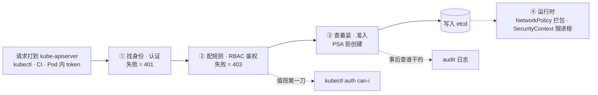
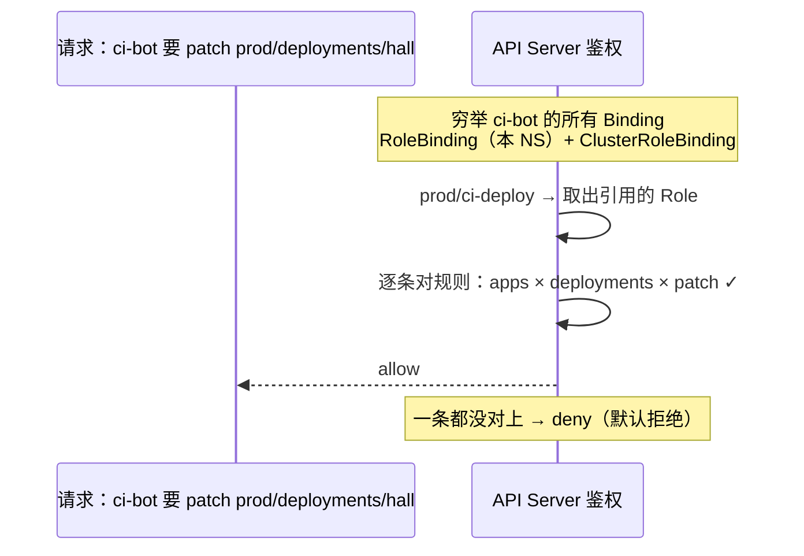
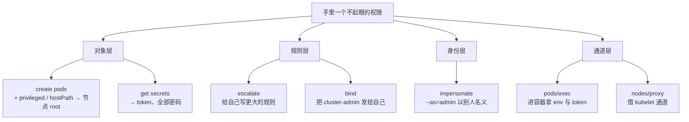
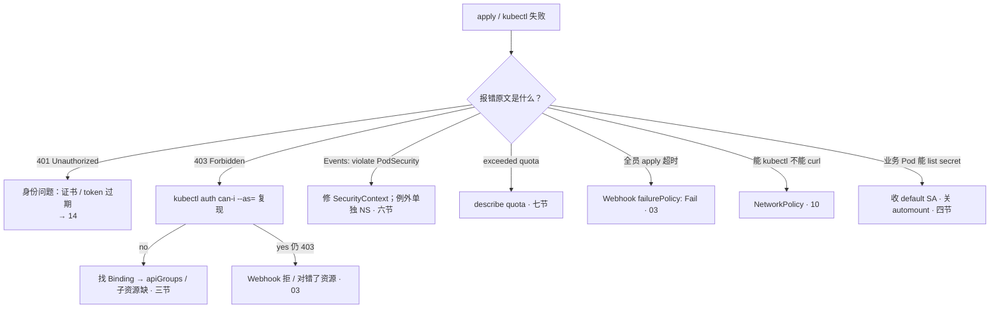

# RBAC 与安全

> 发版夜实习生掏出一份 cluster-admin kubeconfig：「用这个，权限大」；CI 的 SA 能 list 全集群 Secret，没人说得清谁授的；大厅 Pod 被 RCE 后真读出支付 Secret——有人要绑 admin 止血，有人要把 prod 的 PSS 改成 privileged。手都别动。
> **本章回答**：一次权限判定的一生——找身份 → 配规则 → 发卡 → 提权路径 → 着装 → 分房间 → 审计；事后怎么查是谁干的。
> **不讲**：请求全链路 / APF / Webhook failurePolicy → [03](../03-API-Server/)；证书与 kubeconfig → [14](../14-证书与kubeconfig/)；NetworkPolicy → [10](../10-CNI与网络策略/)；Secret 静止加密 → [12](../12-配置与密钥/)；镜像门禁 → [04-03](../../04-工程化与自动化/03-制品与镜像/)；GitOps 谁有权 sync → [23](../23-GitOps-ArgoCD与Tekton/)。

**标记**：🎯重点 · 🔥难点 · ⭐常考 · 🔧实操

---

## 一、一张图：一次权限判定的一生

> 🎯 **一句话**：每个请求都走「找身份 → 配规则 → 允许/拒绝」；权限全靠绑定发出去，绑定全都查得到。



- 📖 **读图**
  - 🛤️ 主线四站：找身份 → 配规则 → 准入 → 写 etcd；跑起来还有 NP / SecurityContext
  - 🚨 失败码各不同：401 身份 · 403 规则 · 准入拒创建 · NP 拦包——「没权限」不是一种病（二节）
  - 🔧 两条虚线：鉴权疑 → `can-i`；查谁干的 → audit（八九节）

- ⚡ **判定无状态**：每个请求独立查 Binding，**无缓存**——删 Binding **立刻生效**；改规则不用重启
- 🚪 **绕不开**：判定在唯一入口 kube-apiserver 上做（[03](../03-API-Server/)）
- 🔗 **鉴权模式可并存**：`--authorization-mode=Node,RBAC,Webhook` 是逗号列表，**任一允许即过**——Webhook 挡不住 RBAC 发宽的卡；kubeadm 默认 `Node,RBAC`（Node 限定 kubelet 只碰本节点对象）

口诀：⭐ **401 我不认识你，403 我认识你但不能这么干**。

本节对应练习题 Q1、Q14。

---

## 二、找身份：四种「没权限」

> 🎯 **一句话**：401 问你是谁，403 问你能不能，准入拒创建，NP 拦包。

判定第一步找到 **Subject（主体）**，只有三种：

- **User**：真人，走客户端证书或 OIDC（[14](../14-证书与kubeconfig/)）——人不共享一份永久 kubeconfig
- **Group**：一组人，常配合 OIDC 组织结构
- **ServiceAccount（SA）**：集群内进程身份，Pod / CI 调 API 用它（四节）

> 💡 **打个比方**：进大楼——刷工牌（认证）、门禁判能上几层（鉴权）、前台查着装（准入）、机房还有闸机（运行时）。工牌开了 ≠ 能进机房。

#### ❓ 为什么 401 和 403 不能混着查？

- 🔑 **认证失败 = 401**：证书过期、token 无效——去查身份，**不是**查 Role
- 🎫 **鉴权失败 = 403**：身份有了，规则没给——才轮到 Binding / apiGroups
- 👕 **准入拒创建**：Events 写明原因，HTTP 码**不是** 403——鉴权早就过了
- 🌐 **NP 拦包**：和 kubectl 无关；能 kubectl 不能 curl → 查 NP（[10](../10-CNI与网络策略/)）

> ⚠️ **别混**：三对一次说清。① **RBAC 管 API 动词，NP 管包**。② **PSA 拒绝不是 403**。③ **RBAC / ABAC 在鉴权层，PSA 在准入层**。

| 对比 | RBAC | ABAC | PSA |
|------|------|------|-----|
| 层 | 鉴权 | 鉴权 | **准入** |
| 载体 | Role / Binding 等 API 对象 | apiserver 旁路策略文件 | NS 标签 `pod-security.kubernetes.io/*` |
| 变更 | `kubectl apply` 即生效 | 改文件 + 重启 API Server | `kubectl label ns` |
| 审计 | `get rolebinding` 列得出谁有权 | 文件在 API 外，看不见 | Events 写 violate PodSecurity |
| 失败 | 403 | 403 | 创建被拒，不是 403 |
| 生产 | **默认** | 旧集群遗留，**不要新开** | PSP 废弃后的硬墙 |

- ❌ **ABAC 不新开**：没有 Binding 对象，`kubectl get` 永远列不出「谁有权」

> 🔍 **现场**：两类报错长得完全不同，先看文案再动手。

```bash
kubectl apply -f deploy.yaml -n prod
# Error from server (Forbidden): deployments.apps "hall" is forbidden:
#   User "system:serviceaccount:prod:ci-bot" cannot patch resource
#   "deployments" in API group "apps" in the namespace "prod"   ← 403：RBAC 没发卡
kubectl describe pod hall-xx -n prod | tail -3
# Warning  FailedCreate  ... violate PodSecurity "restricted:latest":
#   allowPrivilegeEscalation != false   ← 准入拒创建：鉴权早过了
kubectl get pods -n prod
# error: You must be logged in to the server (Unauthorized)   ← 401：查证书 / token，去 14
```

口诀：⭐ **401 / 403 / 准入拒 / NP 拦包——四种病四副药**。

本节对应练习题 Q1、Q2、Q10。

---

## 三、配规则：RBAC 四件套

> 🎯 **一句话**：Role 是规则，Binding 才是发卡；绑错范围就是提权。

**RBAC（Role-Based Access Control）** 四个对象，两两分工——**Role 类写「能干什么」，Binding 类管「发给谁」**：

| 对象 | 是什么 | 范围 |
|------|--------|------|
| **Role** | 规则集合（verbs × resources × apiGroups） | 一个 namespace 内 |
| **ClusterRole** | 规则集合；集群级资源（如 Node）只能用 | 全集群（也可被 RoleBinding 引用） |
| **RoleBinding** | 发卡：把某个 Role 发给某个身份 | 只在某一个 NS 内生效 |
| **ClusterRoleBinding** | 发卡：把 ClusterRole 发给某身份 | 全集群 |

> 💡 **打个比方**：Role / ClusterRole 是「门禁卡模板」；Binding 是「把卡发给具体的人」。同一张 ClusterRole 模板，走 RoleBinding 是一层楼通行证，走 ClusterRoleBinding 是全楼通行证。**模板不决定范围，怎么发才决定范围。**

#### ❓ 为什么 RoleBinding 引用 ClusterRole 仍限该 NS？

- ❌ 高频错答：「引用了 ClusterRole → 全集群生效」
- ✅ **范围由 Binding 种类决定**，不由被引用的 Role 种类决定
  - RoleBinding → 永远只在该 NS
  - ClusterRoleBinding → 全集群（且只能引用 ClusterRole）
- 🎯 给开发 prod 只读的标准姿势：`RoleBinding` + 内置 `ClusterRole/view`——仍限该 NS
- ⚠️ 把 NS 级 Role 升格成 ClusterRole 再全集群绑出去 = **提权**，不是方便

### 📋 一条规则四个坑位

```yaml
apiVersion: rbac.authorization.k8s.io/v1
kind: Role
metadata: { name: ci-deploy, namespace: prod }
rules:
- apiGroups: ["apps"]              # ← deployments 在 apps 组；写 ""（core）= 403
  resources: ["deployments"]       # ← 子资源另写：pods/log、pods/exec
  verbs: ["get", "list", "patch"]  # ← 要什么给什么，别写 "*"
  resourceNames: ["hall"]          # ← 可选：再收到「这一个」对象
```

- 🕳️ **规则三坑**
  - **apiGroups 对不上**：`deployments` ∈ `apps`，写在 `""` 等于没写——「规则看起来有，apply 还是 403」
  - **子资源独立**：`pods` / `pods/log` / `pods/exec` 三个东西；只写 `pods` 能 get 不能打日志
  - **resourceNames**：最细的锁——「可读所有 Secret」收成「只能读这一个」

### 🔎 匹配怎么发生



- 📖 **读图**
  - 从身份穷举 Binding → 取出规则逐条对
  - **任一命中即允许，全不命中才拒**——默认拒绝，没绑就是没有

- 🧰 **内置 ClusterRole**：`view` / `edit` / `admin` / `cluster-admin`（`*` × `*` × `*`）
  - `admin / edit / view` 靠 **aggregationRule** 聚合——改源 ClusterRole，所有聚合方一起变
- 🎚️ **verbs 三档**：读 `get/list/watch` · 写 `create/update/patch/delete` · 特殊 `escalate/bind/impersonate`（五节提权钥匙）
- 🔒 **roleRef 建好后不可改**——换引用只能删了重建；集群级资源（Node、Namespace）只能写在 ClusterRole

```yaml
# ① 开发 prod 只读：RoleBinding + ClusterRole/view（仍限该 NS）
kind: RoleBinding
metadata: { name: dev-readonly, namespace: prod }
roleRef: { kind: ClusterRole, name: view, apiGroup: rbac.authorization.k8s.io }
subjects: [{ kind: User, name: dev-alice, apiGroup: rbac.authorization.k8s.io }]
---
# ② 监控读 Node：只能 ClusterRoleBinding
kind: ClusterRoleBinding
metadata: { name: monitor-nodes }
roleRef: { kind: ClusterRole, name: view, apiGroup: rbac.authorization.k8s.io }
subjects: [{ kind: ServiceAccount, name: monitor, namespace: kube-system }]
```

- ③ CI 部署权：独立 SA + 本 NS Role，`resourceNames` 锁 Deployment，verbs 不写 `*`

> ⚠️ **别混**：**RoleBinding 引用 ClusterRole 仍限该 NS**。**cluster-admin 的任何新增绑定都是事故级变更**，定期扫，来历不明当安全事件。

> 🔍 **现场**：查「这张卡谁发的」，看 Binding 的 roleRef 和 subjects。

```bash
kubectl get rolebinding ci-deploy -n prod -o yaml
# roleRef:
#   kind: Role            ← 引用的规则模板
#   name: ci-deploy
# subjects:
# - kind: ServiceAccount  ← 卡发给了谁
#   name: ci-bot
#   namespace: prod
```

> 📝 **面试**：四件套按「两个写规则、两个管发卡」说；补「RoleBinding 引 ClusterRole 仍限该 NS」和「默认拒绝、任一命中即过」。

口诀：⭐ **模板不决定范围，怎么发才决定范围；绑错范围就是提权**。

本节对应练习题 Q3、Q4。

---

## 四、发卡：ServiceAccount 与最小权限

> 🎯 **一句话**：人走 OIDC，Pod 走 SA；default 零权限，不调 API 别挂 token。

**ServiceAccount** = Pod / CI 在集群里的身份。**人走证书 / OIDC，进程走 SA**。Pod 用 `spec.serviceAccountName`；**没写就继承该 NS 的 default SA**。

### 🎫 两代 token ⭐🔥

- **1.24 之前 · Secret Token**：存在 Secret 里，**永不过期**——泄露 = 永久后门，必须删 Secret 才失效
- **1.24+ · Bound Token**（TokenRequest API）：**有过期、随 Pod 生死**，挂 projected volume；老式永久 token 只在显式建 Secret 时出现

> 💡 **打个比方**：Bound Token = 绑死某个 SA、某个 Pod 的临时票，过期就废；Secret Token = 永久工牌，谁捡到都能用到天荒地老。

#### ❓ 为什么不调 API 的 Pod 必须关 automount？

- 🔫 **挂着 token = RCE 后有枪**：被攻破就能拿 SA 打 API
- ✅ `automountServiceAccountToken: false`——不挂 token，RCE 了也没枪
- ⚠️ **default SA 绑宽 ≠ 只影响显式用它的 Pod**——没写 `saName` 的全部继承

### 📐 最小权限六步

1. 人走 OIDC / 证书，**不共享永久 kubeconfig**
2. CI 用**独立 SA**，本 NS 精确 verbs，**禁止 cluster-admin**
3. 不调 API → `automountServiceAccountToken: false`
4. 每个 NS **default SA 零权限**
5. 开发默认**不给 get secrets**；确需用 `resourceNames` 锁到那一个（[12](../12-配置与密钥/)）
6. **定期扫** admin 类 ClusterRoleBinding；`get secrets` / `create clusterrolebinding` 进审计告警

- 🚨 **两条红线**
  - CI SA = cluster-admin →「能提交代码的人 = 拥有集群的人」
  - default 绑宽 → 忘写 saName 的 Pod 一起继承——大厅 RCE list secret 的起点

> 🔍 **现场**：`can-i` 三刀，先复现再定责。

```bash
kubectl auth can-i --list -n prod
# deployments.apps   []   []   [get list patch]   ← 当前身份动词 × 资源全清单
kubectl auth can-i list secrets --as=system:serviceaccount:prod:ci-bot -n prod
# yes   ← CI 能 list secrets：事故信号
kubectl get clusterrolebinding -o wide | grep -iE 'cluster-admin|/admin'
# hall-debug   ClusterRole/admin   Group:dev-intern   ← 来历不明 = 安全事件
```

**经典收权**：大厅 Pod RCE 后能 list secret——

```bash
kubectl get pod hall-7d8f9 -n prod -o jsonpath='{.spec.serviceAccountName}{"\n"}'
# （空行）   ← 没写 saName，继承 default
kubectl auth can-i list secrets --as=system:serviceaccount:prod:default -n prod
# yes   ← 坐实
kubectl delete rolebinding <误绑的> -n prod        # ← 第一刀：收卡，立刻生效
# 第二刀：不调 API 的工作负载补 automountServiceAccountToken: false
# 第三刀：audit 查 default 还碰过什么
```

```bash
# ① Bound Token vs 老式 Secret Token
kubectl get serviceaccount ci-bot -n prod -o jsonpath='{.secrets}'
# []   ← 1.24+ 默认无 Secret Token
# [{"name":"ci-bot-token-abc123"}]   ← 老式永久 Token

# ② kubeconfig 客户端证书过期（401 先来这，不是查 Binding）
grep client-certificate-data ~/.kube/config | head -1 | awk '{print $2}' | base64 -d | openssl x509 -noout -enddate
# notAfter=Mar 15 06:42:00 2027 GMT

# ③ 泄露处置：删老式 Secret Token + 滚动
kubectl delete secret ci-bot-token-abc123 -n prod
kubectl rollout restart deployment hall -n prod
```

> 📝 **面试**：最小权限按「人、机器、默认面」三组：人走 OIDC；CI 独立 SA + 精确 verbs；default 零权限 + 关 automount。补「1.24+ Bound Token 有过期，老 Secret Token 永不过期」。

口诀：⭐ **不挂 token，RCE 了也没枪**。

本节对应练习题 Q5。

---

## 五、换万能钥匙：提权路径 🔥

> 🎯 **一句话**：能换万能钥匙的不是 admin，是「能建 Pod」「能读 Secret」这类普通权限。

鉴权只答「这个动词 × 资源行不行」，不答「还能换来什么」。**面试问「RBAC 怎么提权」，问的就是下面四条路** ⭐。

#### ❓ 为什么「只给一个测试 NS 的 create pods」不是小事？

- ❌ 高频错答：「限一个 NS，小事」
- ✅ **节点是共享的**——拿下节点就能摸到别的 NS
- 🏗️ 能建 Pod = 能往机房派「免检施工队」

```yaml
spec:
  hostPID: true
  serviceAccountName: pay-admin      # ← 指定本 NS 任意 SA，借它的 token
  containers:
  - name: x
    image: busybox
    securityContext: { privileged: true }   # ← 容器内 ≈ 宿主机 root
    volumeMounts: [{ name: host, mountPath: /host }]
  volumes:
  - name: host
    hostPath: { path: / }                   # ← 宿主机根目录
```

> 💡 **打个比方**：自带工具（privileged）、拆任何墙（hostPath）、戴别人工牌（指定 SA）。`chroot /host` = 节点 root；翻 `/etc/kubernetes` 拿 kubelet 证书，以 `system:node:<名>` 打回 API。

### 🗝️ 四条兑换链 ⭐🔥

- **① 对象层 · 能建 Pod = 能拿节点**：privileged + hostPath → 节点 root；还能借任意 SA token
- **② 对象层 · 能读 Secret = 能冒充任何人**：老式 SA token 在 Secret 里；DB 密码、TLS 私钥也在——支付 NS 的 get secrets = 泄露事件。静止加密管 etcd（[12](../12-配置与密钥/)），RBAC 管谁有资格读
- **③ 规则层 · escalate / bind**
  - **escalate**（roles / clusterroles）：创建超出自己权限的规则——「不能授自己没有的权」对它失效
  - **bind**（rolebindings / clusterrolebindings）：创建指向任意 Role 的绑定——能把 cluster-admin 发给自己
  - `update roles` + escalate ≈ 自己改大；`create clusterrolebindings` 本质就是 bind
- **④ 身份/通道 · impersonate / exec / proxy**
  - **impersonate**：`kubectl --as=admin`——以别人名义发请求，审计记被冒充者
  - **pods/exec**：进容器拿 env / token / 数据
  - **nodes/proxy**：借 API Server 直连 kubelet，拿该节点所有容器的 exec / logs

### 收束：提权路径图 🎯⭐



- 📖 **读图**
  - 四层：对象拿节点/凭证 · 规则改权 · 身份冒充 · 通道进容器
  - **审一个权限，先看落哪层，再看能兑换什么**

- 📝 **可背清单**：能建 Pod = 能拿节点；能读 Secret = 能冒充任何人；escalate / bind = 自授；impersonate = 以别人签字；exec / proxy = 进任何房间

> ⚠️ **别混**：最小权限看的**不是范围多小，而是动词能兑换什么**——「限一个 NS 的 create pods」照样拿节点；`view` 用 ClusterRoleBinding 发出去 = 全集群只读。

> 📝 **面试**：提权按「对象 / 规则 / 身份 / 通道」四层分组；审计盯 `create pods`、`get secrets`、`escalate/bind/impersonate`、`create clusterrolebinding`。

- 🛡️ **防住**：`create pods` 只给可信身份；`get secrets` 进告警、默认不发；escalate / bind / impersonate 除非平台管理员不给；`pods/exec` 按跳板机留痕。内置 `view` 不含这些动词——「只发 view」是安全起点。

口诀：⭐ **能建 Pod = 能拿节点；能读 Secret = 能冒充任何人**。

本节对应练习题 Q6、Q7。

---

## 六、查着装：Pod 安全

> 🎯 **一句话**：RBAC 管谁能建 Pod，PSS 管 Pod 以什么样子被建出来。

鉴权过了不算完——**Pod Security Admission（PSA）**。**PSP 已废弃，面试别提 PSP**。门禁挂在 **NS 标签**上，衣服穿在 **SecurityContext** 里。

### 👕 PSS 三级 × 三模式

| 级别 | 谁用 | 代表要求 |
|------|------|----------|
| **privileged** | kube-system、要 host 命名空间的系统组件 | 不设限 |
| **baseline** | 一般业务起步 | 禁特权容器、禁 hostNetwork / hostPID / hostPath |
| **restricted** | 支付 / 核心业务 | 再要求 runAsNonRoot、drop ALL capabilities、seccomp、禁特权提升 |

- **模式**：`enforce` 拒创建 · `warn` 放行警告 · `audit` 只记日志
- 🎯 **节奏**：先 warn + audit 观察，修完再 enforce——一夜 enforce，发版日半个业务创建失败

#### ❓ 为什么 PSA 拒绝不是 403？

- 🚪 **层不同**：RBAC 在鉴权层；PSA 在**准入层**——鉴权早就过了
- 📄 **现象**：Events 写 `violate PodSecurity "restricted:…"`，HTTP 不是 403
- 👕 **PSS / PSA = NS 门禁，SecurityContext = Pod 声明**——门禁不管替你穿衣服；写了声明门禁更严照样拒

### 🔒 restricted 关键字段

- `runAsNonRoot: true`——禁止 root 启动
- `capabilities: { drop: ["ALL"] }`——**capabilities** 把 root 特权拆成约 40 个开关；全 drop 后按需 add（绑低端口只需 `NET_BIND_SERVICE`）
- `allowPrivilegeEscalation: false`——内核 no_new_privs，sudo 类失效
- `seccompProfile: { type: RuntimeDefault }`——系统调用过滤
- 不出现 `hostNetwork / hostPID / hostPath`

> 💡 **打个比方**：门禁规定「进机房必须穿防静电服」（PSS），YAML 里 SecurityContext 是身上那件衣服——`privileged: true` = 穿着电焊服进机房。

- 🎮 **游戏例外**：反外挂要 hostNetwork → **单独 NS 打 privileged + 书面例外**，不是把整个 prod 降级

> 🔍 **现场**：看门禁就一行；违规从 Events 捞。

```bash
kubectl get ns --show-labels | grep pod-security
# pay   ...enforce=restricted,...warn=restricted   ← enforce 才拦人
kubectl label ns pay \
  pod-security.kubernetes.io/enforce=restricted \
  pod-security.kubernetes.io/warn=restricted \
  pod-security.kubernetes.io/audit=restricted
kubectl get events -n pay --field-selector reason=FailedCreate --sort-by='.lastTimestamp' | tail -5
# ... violate PodSecurity "restricted:latest":
#   allowPrivilegeEscalation != false   ← 修 SecurityContext 这一项
# 例外：单独 NS，不改 prod
kubectl create ns pay-privileged-exception
kubectl label ns pay-privileged-exception pod-security.kubernetes.io/enforce=privileged
```

> 📝 **面试**：PSP 已废 → PSA + 三级（privileged / baseline / restricted）+ 三模式；先 warn / audit 再 enforce；例外单独 NS。

口诀：⭐ **先 warn/audit 再 enforce；例外单独 NS**。

本节对应练习题 Q8、Q9。

---

## 七、分房间：多项目多环境划分

> 🎯 **一句话**：NS 是账本不是墙；权限、资源、网络三层隔离，一级一级升。

#### ❓ 为什么只建一个 pay NS ≠ 合规隔离？

- ❌ 高频错答：「单独建 NS 就算隔离了」
- ✅ **NS 不拦包、不拦身份、不做硬隔离**——只提供命名和账本
- 🧱 对手是「敌对租户」→ 答案永远是**拆集群**

三层一起做，缺一层就是「看起来分了」：

- **权限分人**：每项目每环境一个 NS；开发拿本项目 RoleBinding；prod 比 test 严
- **资源分账**：**ResourceQuota** 限 CPU / 内存 / PVC / 对象数；**LimitRange** 给不写 resources 的容器补默认
  - ⚠️ `default` = **limit**，`defaultRequest` = **request**——写反了调度和 HPA 全失真
- **流量分路**：NetworkPolicy 默认拒（[10](../10-CNI与网络策略/)），和 RBAC 无关

- 📊 **Quota 满**：Pod Pending，Events `exceeded quota: pods, requested: pods=201, used: 200, limited: 200`——**不是调度器挑不到节点**（[06](../06-调度机制/)）；`describe quota` 一眼看到哪项顶满；`pods` 计数含 DaemonSet

```yaml
apiVersion: v1
kind: ResourceQuota
metadata: { name: team-a-quota, namespace: team-a }
spec:
  hard:
    requests.cpu: "40"
    requests.memory: "80Gi"
    persistentvolumeclaims: "20"
    pods: "200"                       # ← DaemonSet 也计入
---
apiVersion: v1
kind: LimitRange
metadata: { name: default-limits, namespace: team-a }
spec:
  limits:
  - type: Container
    default: { cpu: "1", memory: "512Mi" }            # ← limit
    defaultRequest: { cpu: "100m", memory: "128Mi" }  # ← request，别写反
```

- 🪜 **租户升级**（不许跳级）：
  ```text
  共享 NS → 独立 NS + Quota + LimitRange
         → 最小 RBAC + default SA 零权限
         → NetworkPolicy 默认拒
         → 独立节点池 / 污点
         → 拆集群（合规硬墙）
  ```

> ⚠️ **别混**：**只建一个 pay NS ≠ 合规隔离**。把「加了个 NS」汇报成「已经隔离了」，面试和合规都会露馅。

口诀：⭐ **NS 是账本不是墙；硬隔离拆集群**。

本节对应练习题 Q11。

---

## 八、事后查：审计与应急

> 🎯 **一句话**：RBAC 管「干不了」，audit 管「谁干的」；泄露先收卡，再换锁。

**audit（审计）日志**把每个请求记成一行：谁（`user.username`）· 从哪（`sourceIPs`）· 对什么（`objectRef`）· 干了什么（`verb`）· 结果（`responseStatus.code`）。策略 `--audit-policy-file`：**Metadata** / **Request** / **RequestResponse**——Secret 和权限类值得记全；组件部署 → [03](../03-API-Server/)。

- 🚨 **告警位**：`get/list secrets` · `create clusterrolebinding/rolebinding` · 给 Role 加 `escalate/bind/impersonate` · 改 `pod-security` 标签 · 删审计配置本身

```text
{"requestReceivedTimestamp":"2026-09-01T03:12:44Z","verb":"get",
 "objectRef":{"resource":"secrets","name":"pay-db","namespace":"pay"},
 "user":{"username":"system:serviceaccount:ci:ci-bot"},
 "sourceIPs":["10.0.3.7"],"responseStatus":{"code":200}}
# ← 五要素：时间 / 谁 / 从哪 / 对什么 / 结果；code=200 = 真读到了
```

#### ❓ 为什么删 Binding ≠ token 失效？

- 🎫 **收卡** = 删误授 Binding——鉴权逐请求判定，**立刻生效**；但已发出去的凭证还活着
- 🔑 **换锁** = 轮换凭证——重签证书 / 重发 token / 改库密码
  - 1.24+ Bound Token：随 Pod 重建自动换
  - 老式 Secret Token：**必须删 Secret + 滚动引用它的工作负载**
- ❌ 只删 Binding 就宣布处置完毕 = 半截动作

### 🧯 密钥泄露四步（顺序不能乱）

1. **收卡**：删误授 Binding / 吊销 SA token
2. **换锁**：轮换凭证
3. **查账**：audit 拉时间线，判波及面
4. **堵漏**：kubeconfig 不进 Git、CI 临时凭证、关 automount、收紧 PSS

- 📁 **kubeconfig 进了 Git**：轮换证书 + 收回 Binding + 清 Git 历史——**清历史不能替代轮换**（已被 clone / CI 缓存过）

> ⚠️ **别混**：**删 Binding ≠ token 失效**。收卡归收卡，凭证要单独换锁。

口诀：⭐ **泄露四步：收卡 → 换锁 → 查账 → 堵漏；清 Git 历史不能替代轮换**。

本节对应练习题 Q12。

---

## 九、作战：定责

> 🎯 **一句话**：先看报错定哪道门，再查那道的账；别拿绑 admin 当止血。

#### ❓ 为什么止血永远不是绑 cluster-admin？

- ❌ 把一次故障变成一次安全事故——所有人拿到万能钥匙
- ✅ 缺规则 → 按最小权限补；误授权 → **删 Binding 立刻生效**
- 🛑 活动高峰策略组件挂了：确认进程还在 → 停止发版 → 按 [03](../03-API-Server/) 救 Webhook，**不发临时 admin**



- 📖 **读图**
  - 第一刀永远是「报错原文属于哪道门」
  - 右下「能 list secret」是安全巡检入口，直接进四节收权

| 现象 | 先做 | 别做 |
|------|------|------|
| CI 403 | `can-i --as=` → Binding → apiGroups / 子资源 | 先改业务 YAML / 绑 admin |
| 能 get pod 不能 logs | 补 `pods/log` 子资源 | 给 cluster-admin |
| 业务 Pod 能 list secret | 收 default SA、关 automount | 只叮嘱「别被 RCE」 |
| Events violate PodSecurity | 修 SecurityContext；例外单独 NS | 把 prod 改 privileged |
| Quota 满、Pod Pending | `describe quota` | 怪调度器 |
| 能 kubectl 不能 curl | 查 NP（[10](../10-CNI与网络策略/)） | 加 RoleBinding |
| 全员 apply 超时 | Webhook Fail（[03](../03-API-Server/)） | 当 RBAC 坏了乱绑 admin |
| 来历不明 cluster-admin | 当安全事件：audit 查来源再收 | 删掉就完事不查 |

**60 秒剧本** 🔧：

```text
① 0–10s  定门：看报错原文——401 / 403 / violate PodSecurity / exceeded quota / 全员超时
② 10–30s 复现：kubectl auth can-i <verb> <resource> --as=<身份> -n {ns}
         can-i no → 缺卡；can-i yes 仍 403 → 对错资源或 Webhook（03）
③ 30–45s 查发卡：get rolebinding,clusterrolebinding -A -o wide | grep <身份>
④ 45–60s 定责：缺规则 → 最小权限补；误授权 → 删 Binding
         任何情况下不先绑 cluster-admin 止血
```

本节对应练习题 Q13、Q14。

---

## 十、收口

> 🎯 **一句话**：值班卡住先 can-i，面试被问先画一生的主图。

### 命令速查 🔧

```bash
kubectl auth can-i --list -n prod
kubectl auth can-i delete pods --as=system:serviceaccount:prod:ci-bot -n prod
kubectl get rolebinding,clusterrolebinding -A -o wide | grep <身份>
kubectl get rolebinding ci-deploy -n prod -o yaml
kubectl get clusterrolebinding -o wide | grep -iE 'admin'
kubectl describe clusterrole view
kubectl get ns --show-labels | grep pod-security
kubectl describe quota -n team-a
```

### 面试锚点

遮住右列自问自答，卡壳的行回去重读对应小节——能讲出来才算会，看着答案点头不算。

| 问 | 30 秒答 |
|----|---------|
| 一次权限判定的一生？ | 找身份（401）→ 配规则（403）→ 准入拒创建 → 运行时 NP；逐请求无状态，删 Binding 立刻生效。 |
| RBAC 四件套？ | Role / ClusterRole 写规则，RoleBinding / ClusterRoleBinding 管发卡；RoleBinding 引 ClusterRole 仍限该 NS。 |
| deployments 写 `""` 组为何 403？ | 它在 `apps` 组；apiGroups 必须与资源真实组一致。 |
| pods/log 为什么要单独写？ | 子资源独立：pods/log、pods/exec；只写 pods 能 get 不能 logs。 |
| SA 和 User？ | User 是人（证书 / OIDC），SA 是 Pod / CI；人不共享 kubeconfig。 |
| 为什么关 automount？ | 不调 API 的 Pod 不挂 token，被 RCE 也没枪。 |
| CI 为何禁 cluster-admin？ | CI 凭证 = 所有能提交代码的人的权限；独立 SA + 精确 verbs。 |
| 能建 Pod 能拿到什么？ | privileged + hostPath 拿节点 root；还能借任意 SA token。 |
| 能读 Secret 能拿到什么？ | 老式 SA token、DB 密码、TLS 私钥；读到即冒充。 |
| escalate / bind / impersonate？ | 自授更大规则 / 把任意角色发给自己 / `--as` 以别人名义。 |
| RBAC vs NetworkPolicy？ | RBAC 管 API 动词，NP 管包。 |
| ABAC 为何不新开？ | 策略文件在 API 外，列不出谁有权。 |
| PSA 和 RBAC？ | PSA 在准入层管 Pod 长相，失败不是 403；PSP 已废。 |
| PSS 三级？ | privileged / baseline / restricted；enforce / warn / audit；先观察再 enforce。 |
| 反外挂要 hostNetwork？ | 单独 NS + privileged + 书面例外，不降整个 prod。 |
| Quota 满？ | Pending + exceeded quota；NS 是账本不是墙，硬隔离拆集群。 |
| 谁干的怎么查？ | audit 五要素；get secrets、create clusterrolebinding 进告警。 |
| 密钥泄露？ | 收卡 → 换锁 → 查账 → 堵漏；清 Git 不能替代轮换。 |
| Bound vs Secret Token？ | 1.24+ Bound 有过期、随 Pod 生死；老式永久，泄露处置不同。 |
| 删 Binding 为何立刻生效？ | 逐请求无缓存；但凭证要单独轮换。 |

### 易错一句话对照

- RBAC 和 NetworkPolicy 管同一件事 → 一个管 API 动词，一个管包
- PSA 拒绝返回 403 → 准入拒创建，不是鉴权失败
- ABAC 更细所以生产该开 → 文件策略看不见 Binding，不要新开
- RoleBinding 引 ClusterRole 就全集群生效 → 仍限该 NS
- 把 NS 级 Role 升格全集群绑只是图方便 → 范围放大，是提权
- `pods` 包含 logs / exec → 子资源单独写
- `deployments` 在 core 组 → `apps` 组
- CI 用 cluster-admin 省事 → 泄露即全集群，用独立 SA
- default SA 绑宽只影响显式用它的 Pod → 没写 saName 的全继承
- 不调 API 也挂着 token → `automountServiceAccountToken: false`
- PSP 还是生产硬墙 → 已废弃，用 PSS / PSA
- 反外挂要 hostNetwork 就把 prod 改 privileged → 单独 NS + 书面例外
- 建了个 pay NS 就算合规隔离 → NS 是账本不是墙
- 禁 latest 是 RBAC 的事 → 准入 / 制品门禁（[04-03](../../04-工程化与自动化/03-制品与镜像/)）
- 改聚合源 ClusterRole 只影响一个监控 SA → 所有聚合方一起变
- Quota 满是调度器挑不到节点 → 账本 exceeded，describe quota
- 删 Binding 要等缓存过期 → 鉴权逐请求判定，立刻生效
- kubeconfig 进 Git，清掉历史就行 → 必须先轮换凭证
- 删了 Binding 等于 token 失效 → 收卡归收卡，凭证要单独轮换
- Bound Token 永不过期 → 1.24+ 有过期；老式 Secret Token 才永不过期
- kubeconfig 证书过期查 Binding → 401 是身份问题，先查证书
- PSA 违规只看 Pod 日志 → Events 写具体哪条 restricted 约束
- 能 ping 通就能 delete → 包通和 API 动词无关
- Binding 的 roleRef 直接改一下 → roleRef 不可变，删了重建
- 拿到一份 cluster-admin kubeconfig 就用 → 人走 OIDC；来历不明的 admin 先查再用

### 数字墙

> RBAC **4** 个对象 · 失败码 **401** / **403** · PSS **3** 级 × **3** 模式 · **1.24+** Bound Token 有过期、老 Secret Token **永不过期** · warn / audit 先观察 **1 周**再 enforce · verbs 不写 `*` · 鉴权**逐请求无状态** · 提权路径 **4** 层 · 密钥泄露处置 **4** 步

---

## 合上书

1. **默画一节的图**：请求 → 找身份 → 配规则 → 允许/拒绝 → 准入 → 运行时；每站失败码，`can-i` 和 audit 各照哪一段。（Q1、Q14）
2. **口述四种「没权限」**：401 / 403 / 准入拒 / NP；RBAC / ABAC / PSA 各在哪一层，为什么 ABAC 不新开。（Q1、Q2、Q10）
3. **口述四件套**：谁写规则、谁发卡；RoleBinding 引 ClusterRole 范围在哪。（Q3）
4. **口述规则要素**：apiGroups / resources / verbs / resourceNames / 子资源；deployments 写 `""` 为何 403。（Q4）
5. **口述 SA 红线**：default 零权限、CI 禁 cluster-admin、关 automount；Bound vs Secret Token。（Q5）
6. **默画提权路径图**：按对象 / 规则 / 身份 / 通道分组。（Q6、Q7）
7. **口述 PSS**：三级三模式；restricted 要求；反外挂 hostNetwork 怎么办。（Q8、Q9）
8. **口述分房间**：Quota / LimitRange；租户升级路径；为什么 NS 是账本不是墙。（Q11）
9. **口述事后查**：audit 五要素；泄露四步；为何清 Git 不能替代轮换。（Q12）
10. **定责**：403 三步；能 kubectl 不能 curl 去哪章；为什么不绑 admin 止血。（Q13、Q14）

十条都能不看稿讲下来，这一章就过了。下一章：[证书与 kubeconfig](../14-证书与kubeconfig/)。地基：[03](../03-API-Server/) · [12](../12-配置与密钥/)。
