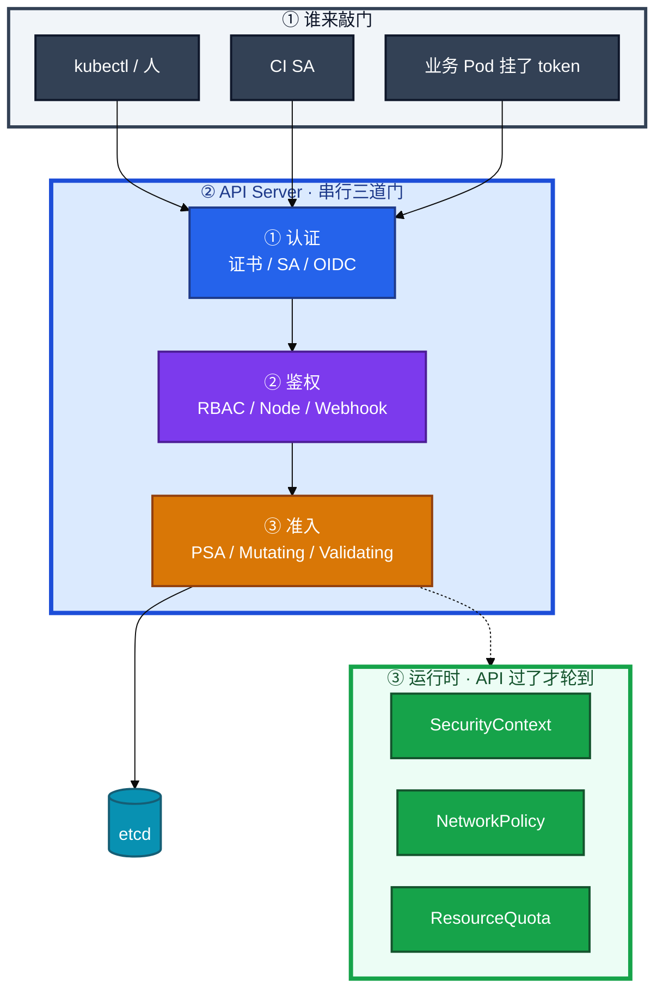
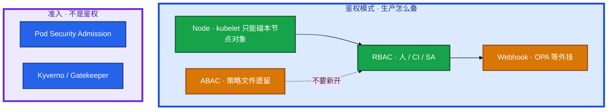
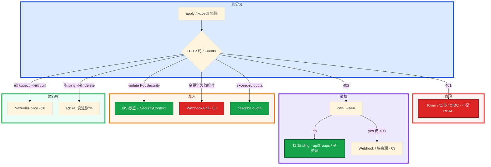

# RBAC 与安全


CI 拿着 `cluster-admin` kubeconfig 到处 apply。支付 NS 里一个没写 `saName` 的大厅 Pod 被 RCE，接着就能 `get secrets`。群里有人要把 prod 的 PSS 改成 privileged 顶过去——先别动手。

**本章主线（排障就按这三步想）：**

1. **分门**：401 认证 / 403 鉴权 / 准入拒创建 / NP 不通 — 不是同一种「没权限」。
2. **发卡**：Role 是规则，Binding 才是发卡；CI 和 default SA 零权限。
3. **收权**：`can-i` → Binding → apiGroups；PSS 先 audit/warn 再 enforce。

**读完你能：** 白板上画出四道门；分清 RBAC / ABAC / PSA；CI 禁止 cluster-admin、default SA 零权限；403 查到 Binding 和 apiGroup；支付 NS 收到 restricted，例外不降全 prod。

## 本章目录

- [1. 基本概念](#1-基本概念)
- [2. 架构图](#2-架构图)
- [3. 原理](#3-原理)
- [4. 安装部署](#4-安装部署)
- [5. 核心配置](#5-核心配置)
- [6. 命令与操作](#6-命令与操作)
- [7. 生产排障](#7-生产排障)
- [8. 必会 · 常考](#8-必会--常考)
- [合上书](#合上书问自己)

**本章不讲：** 认证链、Webhook `failurePolicy`、APF 429、审计怎么开 → [03 API Server](../03-API-Server/)；东西向包、NS 不是墙（包） → [10 CNI](../10-CNI与网络策略/)；Secret get、0400 → [12 配置与密钥](../12-配置与密钥/)；镜像禁 latest、扫描、签名 → [04-03 制品与镜像](../../04-工程化与自动化/03-制品与镜像/)；GitOps 谁有权 sync → [22](../22-GitOps-ArgoCD与Tekton/)。

---

## 1. 基本概念

能进 API ≠ 能发数据包。CI 机器人 apply 大厅、业务 Pod 被打了之后列 Secret、战斗服 ping 支付，走的不是同一道门。

**值班里怎么认现象**（先听报错句，再对表）：

| 玩家/同事说的 | 技术含义 | 你的第一刀 |
|---------------|----------|------------|
| 「kubectl 没权限」 | 可能是 401 / 403 / PSA / NP | 先看 **HTTP 码** 或 Events |
| 「apply 被拒」 | 多半是准入（PSA / Quota / Webhook） | `kubectl describe` Events |
| 「能 kubectl 不能 curl」 | RBAC 过了，包被 NP 拦 | 去第 10 章 |
| 「Pod 能 list secret」 | default SA 或 automount 问题 | `can-i --as=...` |

| 门 | 问的是 | 失败码 / 现象 | 不管什么 |
|----|--------|---------------|----------|
| **认证 Authentication** | 你是谁（证书 / SA / OIDC） | **401** | 你能不能干、YAML 合不合规 |
| **鉴权 Authorization** | 你能不能（RBAC 为主） | **403** | 包能不能到 Pod、Pod 能不能特权 |
| **准入 Admission** | YAML 合不合规、Webhook、**PSA** | 创建被拒，Events 写原因 | 已经在跑的进程 |
| **运行时** | PSS 过了之后的 SC / NetworkPolicy | curl 不通、特权进不了内核 | kubectl 动词 |

三个「授权」不要混：

| 机制 | 哪一层 | 管什么 | 现在还用吗 |
|------|--------|--------|------------|
| **RBAC** | 鉴权 | User / Group / SA × 动词 × 资源 | **生产默认** |
| **ABAC** | 鉴权 | 属性策略文件（user、ns、resource、readonly） | 旧集群遗留；**不要新开** |
| **PSA** | **准入**，不是鉴权 | Pod 声明能不能特权 / hostNetwork / root | **PSP 已废后的硬墙** |

Subject：User / Group / ServiceAccount。人走 OIDC / 证书，不要共享一份永久 kubeconfig。Pod / CI 调 API 用 SA。1.24+ Bound Token 有过期；老的永不过期 Secret Token 少用。

> **记住**：RBAC 不管包，NetworkPolicy 不管 kubectl。有 cluster-admin 但 NP 默认拒，仍然 curl 不到支付 Pod；能 ping 通也不等于能 delete pod。PSA 拒的是创建，不是 403。

**面试怎么说**：「我先分四道门：401 是身份，403 是 RBAC，violate PodSecurity 是准入，curl 不通是 NP——不是一句没权限。」

---

## 2. 架构图

先把整张图钉住。后面发卡、`can-i`、排障都对着这张图说话。



**读图三句话：**

1. **认证失败 401，鉴权失败 403，准入失败是创建被拒**——不是同一种「没权限」。
2. **Webhook `failurePolicy: Fail` 挂掉 = 写路径死**，细节在 03。已经在跑的 Pod 还在；新的 apply / 发版过不了门。
3. **PSA 打在 Namespace 标签上**，SecurityContext 写在 Pod 上。门禁过了，进程声明仍要自己写。

鉴权模式可以并存（`--authorization-mode` 逗号列表，**短路：任一允许即过**）：



---

## 3. 原理

### 3.1 四道门：认证、鉴权、准入、运行时

**一句话：** 401 问你是谁，403 问你能不能，PSA 拒创建，NP 拦包——四道门各管各的。

**打个比方**：进公司大楼——刷工牌（认证）、门禁授权（鉴权）、前台查访客单（准入）、进了楼还要过机房闸机（运行时 NP）。

**现场走一遍**（CI 报 `deployments.apps is forbidden`）：

1. 跳板机复现：

```bash
kubectl auth can-i update deployments --as=system:serviceaccount:prod:ci-bot -n prod
```

2. 屏幕出现：

```text
no
```

3. 查谁给这张卡：

```bash
kubectl get rolebinding,clusterrolebinding -n prod -o wide | grep ci-bot
kubectl describe rolebinding ci-deploy -n prod
```

4. 屏幕出现：

```text
Name:         ci-deploy
Role:
  Kind:  Role
  Name:  ci-deploy
Subjects:
  Kind:  ServiceAccount
  Name:  ci-bot
```

5. 对 Role 规则：

```bash
kubectl describe role ci-deploy -n prod
```

6. 若 rules 里 `apiGroups: [""]` 写了 `deployments`——**deployments 在 `apps` 组**，这就是 403 根因。

**输出解读：**

| 输出 | 含义 | 下一步 |
|------|------|--------|
| `can-i` → `no` | 鉴权层没过 | 找 Binding → Role rules |
| `can-i` → `yes` 仍 403 | 错资源或 Webhook | 对 apiGroup / 子资源；查 03 |
| Events `violate PodSecurity` | 准入 PSA | 改 NS 标签或 SecurityContext |
| 能 kubectl 不能 curl | 运行时 NP | 去第 10 章 |

**面试怎么说**：「403 我先 `can-i --as=` 复现，再查 Binding 和 rules 里的 apiGroups、子资源；PSA 失败不是 403，是创建被拒。」

### 3.2 RBAC / ABAC / PSA：别混成一种「授权」

**一句话：** RBAC 和 ABAC 在鉴权层；PSA 在准入层——一个过了另一个仍可拒。

**打个比方**：RBAC 像工牌能进哪层楼；PSA 像进机房前还要穿防静电服——有楼层权限，不穿服仍进不去。

| | RBAC | ABAC | PSA |
|--|------|------|-----|
| 层 | Authorization | Authorization | **Admission** |
| 载体 | API 对象：Role / Binding | apiserver 旁路 **策略文件** | NS 标签 `pod-security.kubernetes.io/*` |
| 粒度 | 动词 × 资源 × resourceNames | user / group / ns / resource / readonly | privileged / baseline / restricted |
| 变更 | `kubectl apply` Binding | 改文件 + **重启 API Server** | `kubectl label ns` |
| 审计 | `kubectl get rolebinding` 能列出 | 文件外，值班看不见 | Events：violate PodSecurity |
| 失败 | 403 | 403 | 创建被拒，**不是 403** |
| 生产 | **默认** | 遗留；新集群不要开 | **PSP 替代** |

**现场走一遍**（研发说「PSA 报 403」）：

1. 看 Events：

```bash
kubectl describe pod hall-xx -n prod | tail -20
```

2. 典型输出：

```text
Warning  FailedCreate  ...  violate PodSecurity "restricted:latest": allowPrivilegeEscalation != false
```

3. 这不是 403——是**准入拒创建**。改 SecurityContext，不是加 RoleBinding。

**输出解读：** `violate PodSecurity` = PSA；`Forbidden` + HTTP 403 = RBAC。ABAC 没有 Binding 对象，`kubectl get rolebinding` 看不见谁有权。

**面试怎么说**：「PSP 已废，用 PSS。禁 latest 是准入或 05-03，不是 RBAC。ABAC 不要新开——没有 Binding，审计对不上人。」

> **别混**：RBAC 问「这个 SA 能不能 get secrets」；PSA 问「这个 Pod 能不能 privileged」。

### 3.3 RBAC 四件套和 ServiceAccount

**一句话：** Role 是规则，Binding 才是发卡；绑错范围就是提权。

**打个比方**：Role 是空白权限模板，Binding 是往工牌上贴贴纸——贴 ClusterRoleBinding 等于全楼通行证。

| 对象 | 干什么 |
|------|--------|
| **Role** | Namespace 内的规则（动词 × 资源 × apiGroup） |
| **ClusterRole** | 集群范围的规则（也可被 RoleBinding 引用） |
| **RoleBinding** | 在某个 NS 内发卡；引用 ClusterRole 时权限仍限该 NS |
| **ClusterRoleBinding** | 全集群发卡 |

**现场走一遍**（大厅 Pod RCE 后能 list secret）：

1. 看 Pod 用的谁：

```bash
kubectl get pod hall-7d8f9 -n prod -o jsonpath='{.spec.serviceAccountName}{"\n"}'
```

2. 空行 = **default SA**。

3. 查 default 绑了什么：

```bash
kubectl get rolebinding -n prod -o yaml | grep -A5 default
kubectl auth can-i list secrets --as=system:serviceaccount:prod:default -n prod
```

4. 若 `yes`——收权三刀：

```bash
# 删宽 Binding；业务 Pod 关 automount
kubectl delete rolebinding <误绑的> -n prod
# Deployment 加 automountServiceAccountToken: false（不调 API 的 Pod）
```

**输出解读：**

| 字段 | 正常 | 事故信号 |
|------|------|----------|
| `serviceAccountName` 空 | 继承 default | RCE 后打 API |
| `can-i list secrets` → yes | 业务 SA 不该有 | 立刻收 Binding |
| rules 只有 `pods` 无 `pods/log` | 能 get 不能 logs | 补子资源 |

`pods` 不等于 `pods/log`。`deployments` 在 `apps` 组，写在 `""`（core）就是 403。`resourceNames` 可把 Role 收到某一个 Secret。

内置 ClusterRole：`view` / `edit` / `admin` / `cluster-admin`。**cluster-admin 绑定任何新增都是事故级变更。**

**面试怎么说**：「CI 独立 SA，禁止 cluster-admin。default SA 零权限；没写 saName 的全继承 default。RoleBinding 引用 ClusterRole 权限仍限该 NS。」

### 3.4 PSS 与 SecurityContext

**一句话：** PSS 是 NS 门禁，SecurityContext 是 Pod 自己穿衣——门禁过了还要穿对。

**打个比方**：公司规定「机房必须穿防静电服」（PSS restricted）；你 Pod 的 YAML 就是身上那件服（SecurityContext），没穿对门口就拦。

| 级别 | 谁用 |
|------|------|
| privileged | kube-system、需要 hostNetwork 的 agent |
| baseline | 一般业务起步（禁特权、禁 host 命名空间） |
| restricted | 支付 / 核心：non-root、drop ALL、seccomp |

三个模式：`enforce` 拒创建；`warn` / `audit` 先观察再收。

**现场走一遍**（支付 NS 要上 restricted）：

1. 先观察一周：

```bash
kubectl label ns pay \
  pod-security.kubernetes.io/warn=restricted \
  pod-security.kubernetes.io/audit=restricted
```

2. 看 audit 事件有没有违规 Pod。

3. 修镜像：non-root、`drop: [ALL]`、`allowPrivilegeEscalation: false`、seccomp。

4. 工作负载写 SecurityContext，PSS 不替你填 YAML。

5. 再 enforce：

```bash
kubectl label ns pay pod-security.kubernetes.io/enforce=restricted --overwrite
```

6. 试 apply 一个 privileged Pod，Events 应写 `violate PodSecurity`。

**输出解读：** 一夜 `enforce=restricted` 会让半个业务 NS 创建失败——**先 audit/warn 一周**。反外挂 / 引擎 sidecar 要 hostNetwork → **单独 NS + 书面例外**，不要把整个 prod 降成 privileged。

**面试怎么说**：「PSS 三级：privileged / baseline / restricted。支付收到 restricted；反外挂要 hostNetwork 就单独 NS，不降全 prod。」

### 3.5 配额与租户：NS 是账本，不是墙

**一句话：** ResourceQuota 管账本上限；NS 不是安全墙，敌对租户要拆集群。

**打个比方**：NS 像合租公寓的「水电表」——能限用量，挡不住邻居翻窗（没有 NP / 没有硬隔离）。

| 工具 | 作用 |
|------|------|
| ResourceQuota | 限制 NS 的 CPU / 内存 / PVC / 对象数上限 |
| LimitRange | 给容器默认 request/limit，防不写资源 |
| RBAC + NP | 限制人和流量不出该 NS 的「逻辑范围」 |

**现场走一遍**（新 Pod Pending，Events 写 exceeded quota）：

1. 看事件：

```bash
kubectl describe pod new-hall-xx -n team-a | grep -i quota
```

2. 屏幕出现：

```text
Warning  FailedCreate  ...  exceeded quota: pods, requested: pods=201, used: pods=200, limited: pods=200
```

3. 查账本：

```bash
kubectl describe quota team-a-quota -n team-a
```

4. 结论：不是调度器挑不到节点，是 **Quota 满了**。

**输出解读：** `default` 是 limit，`defaultRequest` 是 request，写反了 HPA / 调度失真。Quota 的 `pods` 含 DaemonSet 占用。租户升级：`共享 NS → 独立 NS + 配额 → 独立节点池 / 污点 → 独立集群`，不要跳级。

**面试怎么说**：「只建 pay NS 不等于合规隔离；NS 是账本不是墙。Quota exceeded 先 describe quota，不要怪调度器。」

---

## 4. 安装部署

### 4.1 kubeadm 默认开什么

kubeadm 控制面默认 `--authorization-mode=Node,RBAC`，**不开 ABAC**。PSA 作为准入插件默认启用；真正生效靠 NS 标签，没打标签的 NS 等于没有这道墙。

| 项 | 生产 | 不选 |
|----|------|------|
| 鉴权 | Node,RBAC；外挂再加 Webhook | AlwaysAllow、新开 ABAC |
| PSA | 业务 NS 打标签；系统 privileged | 一夜全集群 enforce=restricted |
| SA | Bound Token（1.24+） | 永不过期 Secret Token 当默认 |
| 审计 | API 审计开 `get secrets` / `create clusterrolebinding` | 只靠 grep Binding |

托管（ACK / EKS）：RBAC 和 PSS 仍是你的。厂商给的 `cluster-admin` kubeconfig 不要进 CI。

### 4.2 最小权限怎么落地

默认没有，全是加出来的：

1. 人走 OIDC，不共享 kubeconfig。
2. CI 独立 SA，只给本 NS 的 get/list/update 指定 Deployment，不给 `*`，禁止 cluster-admin。
3. 业务 Pod 默认 `automountServiceAccountToken: false`。
4. 每个 NS 的 `default` SA 保持 **零权限**。
5. 开发默认不给 get secrets（12）。`resourceNames` 可把 Role 收到某一个 Secret。
6. 定期扫 ClusterRoleBinding；`create clusterrolebinding`、`get secrets` 进审计 / SIEM。

发现来历不明的 cluster-admin Binding，当安全事件：谁绑的、何时、能否立刻收。

---

## 5. 核心配置

只动有证据的项。Binding 写错范围比 YAML 缩进更致命。

| 项 | 生产怎么用 | 改错会怎样 |
|----|------------|------------|
| RoleBinding + ClusterRole | 该 NS 内有效，给开发 view | 改成 ClusterRoleBinding = 全集群 |
| `apiGroups: ["apps"]` | Deployment / ReplicaSet | 写成 `""` → 403，规则「看起来有」 |
| `resources: ["pods/log"]` | 子资源单独写 | 只写 `pods` → 能 get 不能 logs |
| `resourceNames` | CI 只 patch 那个 Deploy | `["*"]` = 本 NS 全开 |
| `automountServiceAccountToken` | 不调 API 的 Pod 关 | 默认挂 token，RCE 后有枪 |
| PSS `enforce` / `warn` / `audit` | 先 warn 再 enforce | 一夜 enforce 半个业务创建失败 |
| LimitRange `default` vs `defaultRequest` | default=limit | 写反 HPA / 调度失真 |
| aggregationRule | 监控只读拼盘 | 改源 Role = 所有引用方一起变 |

PSS 标签：

```bash
kubectl label ns prod \
  pod-security.kubernetes.io/enforce=restricted \
  pod-security.kubernetes.io/warn=restricted \
  pod-security.kubernetes.io/audit=restricted
```

Quota / LimitRange 示意：

```yaml
apiVersion: v1
kind: ResourceQuota
metadata: { name: team-a-quota, namespace: team-a }
spec:
  hard:
    requests.cpu: "40"
    requests.memory: "80Gi"
    persistentvolumeclaims: "20"
    pods: "200"
---
apiVersion: v1
kind: LimitRange
metadata: { name: default-limits, namespace: team-a }
spec:
  limits:
  - type: Container
    default: { cpu: "1", memory: "512Mi" }
    defaultRequest: { cpu: "100m", memory: "128Mi" }
```

> **记住**：RoleBinding 引用 ClusterRole 时权限仍限该 NS。CI 禁止 cluster-admin。Webhook Fail + 不可达 = 全集群创建被堵（03）。

---

## 6. 命令与操作

### 6.1 命令速查

怀疑 CI 权限过大，或 CI 报 403 发不出去。先复现，再找 Binding。

| 目的 | 命令 | 看什么 |
|------|------|--------|
| 当前身份能干什么 | `kubectl auth can-i --list -n prod` | verbs × 资源 |
| 冒充 SA | `kubectl auth can-i delete pods --as=system:serviceaccount:prod:ci-bot -n prod` | yes / no |
| 扫提权 | `kubectl get clusterrolebinding -o wide \| grep -i admin` | 来历不明当安全事件 |
| Binding 列表 | `kubectl get rolebinding,clusterrolebinding -A` | Subject 和 RoleRef |
| Role 规则 | `kubectl describe clusterrole view` | apiGroups / resources / verbs |
| PSS 标签 | `kubectl get ns prod --show-labels` | enforce / warn / audit |
| Quota | `kubectl describe quota -n team-a` | pods / CPU / PVC 是否顶满 |
| 聚合源 | `kubectl get clusterrole -o yaml \| grep aggregationRule` | 改源影响面 |

值班先跑：

```bash
kubectl auth can-i --list -n prod
kubectl auth can-i delete pods --as=system:serviceaccount:prod:ci-bot -n prod
kubectl get clusterrolebinding -o wide | grep -i admin
kubectl get ns --show-labels | grep pod-security
```

`can-i` 是 yes、apply 仍 403：对的是错资源（apiGroup / 子资源），或后面 Webhook 拒（03）。`can-i` 是 yes、curl 支付 Pod 不通：RBAC 过了，包被 NP 拦了（10）。

### 6.2 发卡与收权

给开发 prod 只读：RoleBinding + ClusterRole/`view`，**不要** ClusterRoleBinding。给监控读 Node：ClusterRoleBinding（Node 是集群资源）。CI：独立 SA + Role，`resourceNames` 收到指定 Deployment，verbs 不要 `*`。

收权：删 Binding 立刻生效（鉴权每次请求都查）。token 泄漏：删 SA / 等 Bound Token 过期；老 Secret Token 必须删 Secret 并滚工作负载。kubeconfig 进 Git：轮换、收 Binding、从 Git 历史清。

### 6.3 PSS 从 audit 收到 enforce

1. 标签 `warn` + `audit`，观察一周。
2. 修镜像：non-root、`drop: [ALL]`、`allowPrivilegeEscalation: false`、seccomp。
3. 工作负载写 SecurityContext，PSS 不替你填 YAML。
4. 再 `enforce=restricted`。
5. 反外挂 / 引擎 sidecar：单独 NS + 书面例外，不降全 prod。

apply 被拒：Events 写哪条规则（root、capabilities、hostNetwork）。值班想把标签改成 privileged 顶过去——要审批和回归时间。

### 6.4 Quota / LimitRange 与租户升级

新 Pod Pending，Events 写 `exceeded quota: pods` 或 `requests.cpu`——先 `describe quota`，不是先怪调度器（06）。研发没写 resources、HPA 完全不动：没有 LimitRange 时 request 为 0。

三个游戏项目共用一个集群，租户升级路径：

1. 独立 NS + ResourceQuota + LimitRange（账本）
2. 最小 RBAC，default SA 零权限
3. NetworkPolicy 默认拒
4. 独立节点池 / 污点（性能隔离）
5. 合规要数据不共盘、审计分开 → 拆集群（硬墙）

每升一级写清原因。不要从「加个 NS 名字」直接跳到「已经隔离了」。

---

## 7. 生产排障

三问：进程还在不在？还能不能变更？已有流量还通不通？卡在门上时：**已经在跑的还在；新的 apply 过不了。**



403 排查顺序固定：

1. `kubectl auth can-i ... --as=...` 先复现。
2. 找 RoleBinding / ClusterRoleBinding。
3. 对 rules：apiGroups / resources / verbs / resourceNames。

| 现象 | 先做什么 | 不要做什么 |
|------|----------|------------|
| CI 403 | can-i → Binding → apiGroups | 先改 replicas |
| 能 get pod 不能 logs | 补 `pods/log` | 给 cluster-admin |
| 业务 Pod 能 list secret | 收 default SA、关 automount | 只骂研发「别 RCE」 |
| 写路径全死 | Webhook Fail（03） | 当 RBAC 坏了乱绑 admin |
| PSA 拒绝 | Events + SC；例外单独 NS | 把 prod 改 privileged |
| Quota 满 | describe quota | 怪调度器 |
| 能 kubectl 不能 curl | NP（10） | 加 RoleBinding |
| Kyverno 挂了 Fail | 破窗 / 摘 Webhook（03） | 继续 apply 业务 |

活动高峰策略组件挂了：确认进程还在 → 停止发版 → 按 03 救 Webhook → 不要给所有人临时 cluster-admin。

---

## 8. 必会 · 常考

| 说法 | 对错 | 口径 |
|------|:----:|------|
| RBAC 和 NetworkPolicy 管同一件事 | 错 | API vs 包 |
| PSA 失败返回 403 | 错 | 准入拒创建，不是鉴权 |
| ABAC 比 RBAC 更细所以生产该开 | 错 | 文件策略，看不见 Binding；不要新开 |
| RoleBinding 引用 ClusterRole 权限全集群 | 错 | 仍限该 NS |
| ClusterRoleBinding + 某 NS 的 Role 只是方便 | 错 | 范围放大，提权 |
| `pods` 包含 logs / exec | 错 | 子资源单独写 |
| `deployments` 在 core 组 | 错 | `apps` |
| CI 用 cluster-admin 省事 | 错 | 事故级；独立 SA |
| default SA 绑 edit 只影响显式用它的 Pod | 错 | 没写 saName 的全中 |
| 不调 API 也要挂 token | 错 | `automountServiceAccountToken: false` |
| PSP 还是生产硬墙 | 错 | 已废，用 PSS |
| 反外挂要 hostNetwork 就把 prod 改 privileged | 错 | 单独 NS + 书面例外 |
| 只建 pay NS 就算合规隔离 | 错 | NS 不是墙；硬墙拆集群 |
| 禁 latest 是 RBAC | 错 | 准入 / 05-03 |
| 聚合 ClusterRole 改源只影响一个监控 SA | 错 | 所有引用方一起变 |
| Quota 满了是调度器挑不到节点 | 错 | 账本 exceeded |

数字：Bound Token 1.24+ 有过期；PSS 先 audit/warn **一周**再 enforce；证书/审计扫 Binding 当常规；0400 Secret 对非 root（12）。

易混：401 vs 403 vs PSA 拒 vs NP 不通；RBAC vs ABAC vs PSA；RoleBinding vs ClusterRoleBinding；OOM 权限故事 vs 真 RCE 提权；Webhook Fail vs RBAC 403。

---

## 合上书，问自己

1. 四道门各问什么？失败各是什么码 / 现象？
2. RBAC、ABAC、PSA 各在哪一层？为什么 ABAC 不要新开？
3. RoleBinding 引用 ClusterRole 范围在哪？绑错怎样提权？
4. CI 和 default SA 的红线是什么？为什么关 automount？
5. PSS 三级谁用？反外挂要 hostNetwork 怎么办？
6. 403 三条命令怎么查？能 kubectl 不能 curl 去哪一章？

六题都能口述，这一章就过了。下一章把南北向入口剖开：Ingress 是规则、Controller 是执行者，长连接不要硬塞七层。
