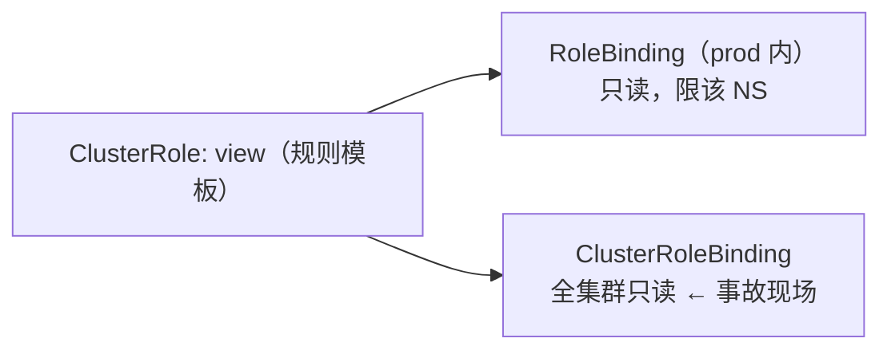
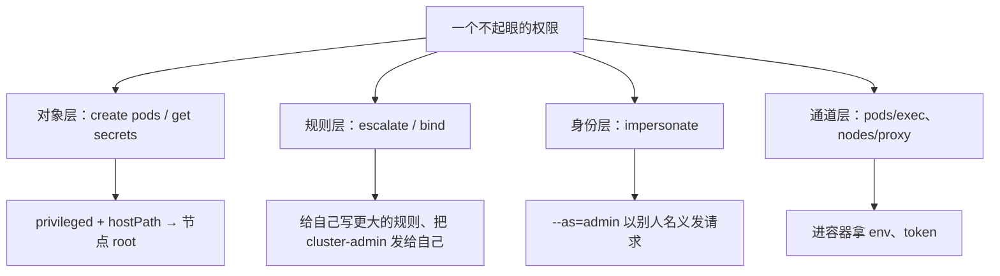
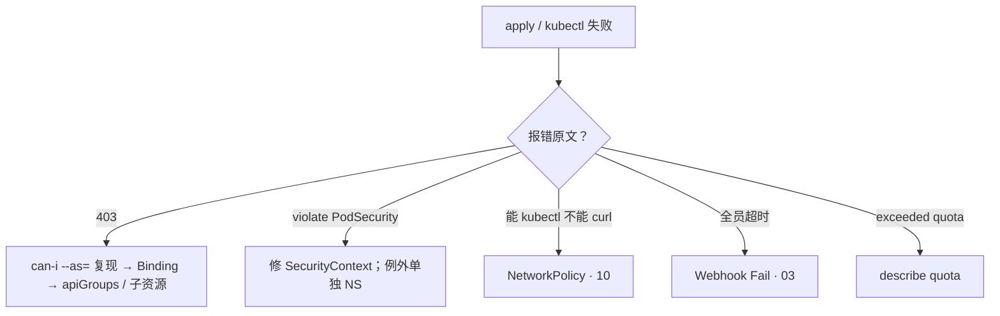

# 13｜RBAC 与安全 · 练习题

先合上知识点，对着 **一节的主图** 把「一次权限判定的一生」口述一遍（找身份 → 配规则 → 允许/拒绝 → 准入 → 运行时，每站失败是什么码），再来做题。

| 标记 | 含义 |
|------|------|
| **核心** | 不懂整章就没建立起来 |
| **必会** | 值班和面试都要能讲 |
| **常用** | 线上会反复碰到 |
| **常考** | 白板和追问的高频口径 |

## 本题目录

- [Q1 四种「没权限」](#q1)
- [Q2 RBAC、ABAC、PSA 是一种东西吗](#q2)
- [Q3 四件套绑错了](#q3)
- [Q4 规则看着有，还是 403](#q4)
- [Q5 CI 的权限怎么给](#q5)
- [Q6 提权路径](#q6)
- [Q7 能读 Secret 有多危险](#q7)
- [Q8 PSS 怎么落地](#q8)
- [Q9 特权容器与 SecurityContext](#q9)
- [Q10 RBAC 和 NetworkPolicy](#q10)
- [Q11 Quota 与租户划分](#q11)
- [Q12 谁干的：审计与泄露处置](#q12)
- [Q13 全员 apply 超时](#q13)
- [Q14 四张工单分流](#q14)
- [合上书](#合上书)

---

## Q1

**★★★★★｜「同事只说『没权限』，你怎么分？四种『没权限』分别是什么？」**

**覆盖**：核心 · 必会 · 常考 ｜ **对应**：知识点 [二、找身份：四种「没权限」](知识点.md)

### 场景

CI 报 403、支付新 Pod 创建被拒、战斗服说「能 ping 通支付但操作不了」——三个报障同时进值班群，有人已经开始写 Role 了。

### 完整解答

> 🎯 **一句话**：401 问你是谁，403 问你能不能，准入拒创建，NP 拦包。

判定的一生是四站：找身份（认证）→ 配规则（鉴权）→ 查着装（准入）→ 运行时。每站失败现象不同：

| 报障 | 门 | 关键特征 |
|------|----|----------|
| CI 403 | 鉴权（RBAC） | `Forbidden: cannot patch resource...` |
| 新 Pod 创建被拒 | 准入（PSA） | Events `violate PodSecurity`，HTTP 码不是 403 |
| 能 ping 不能操作 | 运行时（NP）+ 鉴权 | 包通不代表 API 有卡 |
| token 过期 | 认证 | 401，别去查规则 |

已经在跑的 Pod 还在，卡的是新的 apply——门禁只拦**新的创建**，重建才过门。Webhook Fail 则把写路径整个焊死（[03](../03-API-Server/)）。

> ⚠️ **别混**：RBAC 管 API 动词，NetworkPolicy 管包——有 cluster-admin 但 NP 默认拒，照样 curl 不到支付 Pod。PSA 拒绝不是 403，它发生在准入层。

> 📝 **面试**：「我先分四道门：401 是身份，403 是 RBAC，violate PodSecurity 是准入，curl 不通是 NP——不是一句没权限。」

### 再追问

- 「能 kubectl 不能 curl，该加 RoleBinding 吗？」——不要，那是 NP 的事（[10](../10-CNI与网络策略/)），加 Binding 是无效操作，还放大了权限。
- 「禁 latest 是哪一层的规则？」——准入 / 制品门禁（[04-03](../../04-工程化与自动化/03-制品与镜像/)），不是 RBAC；不要往 Role 里塞。

---

## Q2

**★★★★☆｜「RBAC、ABAC、PSA 都是授权吗？生产怎么选？」**

**覆盖**：核心 · 必会 · 常考 ｜ **对应**：知识点 [二、找身份：四种「没权限」](知识点.md)

### 场景

新集群选型会上，有人说「ABAC 更细，用 ABAC」；有人说「PSP 不是有现成策略吗」；还有人把三者统称「授权插件」。

### 完整解答

> 🎯 **一句话**：RBAC / ABAC 在鉴权层，PSA 在准入层；生产默认 RBAC，ABAC 不新开，PSA 替 PSP。

| 对比 | RBAC | ABAC | PSA |
|------|------|------|-----|
| 层 | 鉴权 | 鉴权 | **准入** |
| 载体 | Role / Binding API 对象 | apiserver 旁路策略文件 | NS 标签 |
| 变更 | `kubectl apply` 即生效 | 改文件 + 重启 API Server | `kubectl label ns` |
| 审计 | 列得出谁有权 | 文件在 API 外，看不见 | Events 写违规 |
| 生产 | 默认 | 不要新开 | PSP 废弃后的硬墙 |

鉴权模式可并存：`--authorization-mode=Node,RBAC,Webhook` 是逗号列表，**任一允许即过**，没有一票否决——kubeadm 默认 `Node,RBAC`，Node 授权器限定 kubelet 只碰自己节点的对象。所以外挂 Webhook 鉴权挡不住 RBAC 发宽的权限，只能把 RBAC 收干净。

> ⚠️ **别混**：PSA 不是鉴权层——它拒的是创建，鉴权早就过了；答「PSA 失败返回 403」当场露馅。

> 📝 **面试**：「PSP 已废，用 PSS / PSA；ABAC 不新开——没有 Binding 对象，审计对不上人；鉴权模式任一允许即过，叠加不补洞。」

### 再追问

- 「公司还在用 PSP，要不要接着讲？」——面试提 PSP 是旧脚本，答「已废弃，迁移到 Pod Security Admission + 三级标准」，不要把 PSP 细节当现状展开。
- 「ABAC 比 RBAC 细，什么时候值得开？」——不值得：策略文件在 API 外，`kubectl` 永远列不出谁有权，出问题对不上人。不要为了「细」牺牲可审计。

---

## Q3

**★★★★★｜「ClusterRoleBinding 和 RoleBinding 有什么区别？绑错了会怎样？」**

**覆盖**：核心 · 必会 · 常考 ｜ **对应**：知识点 [三、配规则：RBAC 四件套](知识点.md)

### 场景

想给开发只读生产一个项目，有人写了个 ClusterRoleBinding 引用 view，说「反正只读没关系」——第二天开发能 list 全集群所有 NS 的 Pod。

### 完整解答

> 🎯 **一句话**：Role 是规则，Binding 才是发卡；绑错范围就是提权。

四件套的分工：Role / ClusterRole 写「能干什么」，RoleBinding / ClusterRoleBinding 管「发给谁、发多大范围」。同一张 ClusterRole 模板，走 RoleBinding 发只在一个 NS 生效，走 ClusterRoleBinding 发就是全集群——**模板不决定范围，怎么发才决定范围**。



**读图**：从模板出发两条发卡路径，范围由发卡方式决定——给开发单项目只读，必须走 RoleBinding + ClusterRole/view；给监控读 Node 这类集群资源才走 ClusterRoleBinding。

三个常考细则：① **RoleBinding 引用 ClusterRole，权限仍限该 NS**（标准姿势）；② ClusterRoleBinding 只能引用 ClusterRole，把 NS 级 Role 升格全集群绑 = 范围放大 = 提权；③ `admin / edit / view` 靠 **aggregationRule** 聚合，改一个源所有聚合方一起变；**cluster-admin 的任何新增绑定都是事故级变更**。

> 📝 **面试**：「两个写规则、两个管发卡；RoleBinding 引 ClusterRole 仍限该 NS；绑错范围不是配置错误，是提权事件。」

### 再追问

- 「CI 只想改某一个 Deployment，怎么锁最细？」——`resourceNames: ["hall"]` 锁到具体对象，而不是给整个资源类型的 `*`；不要图省事直接绑 admin。
- 「怎么发现历史上绑错的？」——定期 `kubectl get clusterrolebinding -o wide | grep -iE 'admin'` 扫，来历不明当安全事件：先 audit 查谁绑的、何时，再收；不要删掉就完事不查。

---

## Q4

**★★★★☆｜「CI 明明绑了权限，为什么还是 403？」**

**覆盖**：必会 · 常用 ｜ **对应**：知识点 [三、配规则：RBAC 四件套](知识点.md)

### 场景

CI 能 get pods 但打不了日志；规则里「明明写了 deployments」，apply 还是 403。有人准备直接给 cluster-admin。

### 完整解答

> 🎯 **一句话**：403 排查固定三步：can-i 复现 → 找 Binding → 对 apiGroups / 子资源 / resourceNames。

```bash
kubectl auth can-i update deployments --as=system:serviceaccount:prod:ci-bot -n prod
# no   ← 复现成功，问题在鉴权层
kubectl get rolebinding -n prod -o wide | grep ci-bot
kubectl describe role ci-deploy -n prod
# rules:
# - apiGroups: [""]          ← deployments 在 apps 组，写 "" 等于没写
#   resources: ["deployments"]
```

两个高频根因：① **apiGroups 写错组**——`deployments` 属于 `apps` 组，写在 `""`（core 组）里就是 403，现象是「规则看起来有」；② **子资源是独立资源**——能 get pods 不能 logs，要单独补 `pods/log`；`pods/exec` 更是提权通道（见 Q6），别顺手加。

> ⚠️ **别混**：`can-i` 是 yes 但 apply 仍 403，不是 RBAC 的锅——对错了资源，或后面 Webhook 拒了（[03](../03-API-Server/)）。

### 再追问

- 「`can-i` 是 yes、curl 支付 Pod 不通，怎么解释？」——RBAC 过了、包被 NetworkPolicy 拦，去 [10](../10-CNI与网络策略/)；不要因此加 RoleBinding。
- 「补日志权限的正确写法？」——`resources: ["pods/log"]` 单独一条规则；不要为省事把整个 `pods` 的动词开成 `*`。

---

## Q5

**★★★★★｜「CI 和业务 Pod 的权限应该怎么设计？最小权限怎么落地？」**

**覆盖**：核心 · 必会 · 常用 ｜ **对应**：知识点 [四、发卡：ServiceAccount 与最小权限](知识点.md)

### 场景

CI 拿着一份集群管理员的 kubeconfig「跑得快」；业务大厅 Pod 没写 `serviceAccountName`，被 RCE 后居然能 list secret——群里有人问「我们不是有 RBAC 吗」。

### 完整解答

> 🎯 **一句话**：人走 OIDC，Pod 走 SA；default 零权限，不调 API 别挂 token。

**Subject 三种**：User（人，走证书 / OIDC）、Group、**ServiceAccount（进程）**。Pod 不写 `serviceAccountName` 就继承该 NS 的 **default SA**——给 default 绑宽 = 所有忘写 saName 的 Pod 一起继承，这就是「大厅 Pod RCE 后能 list secret」的根。

最小权限六步：① 人走 OIDC，不共享永久 kubeconfig；② CI 独立 SA，只给本 NS 指定资源的 get / list / patch，verbs 不写 `*`，**禁 cluster-admin**（CI 凭证 = 所有能提交代码的人的权限）；③ 不调 API 的 Pod `automountServiceAccountToken: false`——不挂 token，RCE 了也没枪；④ default SA 保持零权限；⑤ 开发默认不给 get secrets，确需一个用 `resourceNames` 锁；⑥ 定期扫 admin 类 clusterrolebinding。

```bash
kubectl get pod hall-7d8f9 -n prod -o jsonpath='{.spec.serviceAccountName}{"\n"}'
# （空行）   ← 继承 default SA
kubectl auth can-i list secrets --as=system:serviceaccount:prod:default -n prod
# yes   ← 事故信号：收宽 Binding + 关 automount
```

> 📝 **面试**：「人、机器、默认面三组：人走 OIDC 不共享；CI 独立 SA 精确到动词；默认面靠 default 零权限 + 关 automount。」

### 再追问

- 「token 两代有什么区别？」——1.24 前每 SA 自动建 **Secret Token，永不过期**；1.24+ 默认 **Bound Token**，有过期、随 Pod 生死。泄露处置完全不同，别混。
- 「删掉误绑的 Binding 要等缓存生效吗？」——不要等：鉴权逐请求判定，删了立刻生效；但已发出去的凭证要单独换锁（见 Q12）。

---

## Q6

**★★★★★｜「一个只有 create pods 权限的用户，能做出什么坏事？」**

**覆盖**：核心 · 必会 · 常考 ｜ **对应**：知识点 [五、换万能钥匙：提权路径](知识点.md)

### 场景

安全审计发现某开发在测试 NS 有 `create pods`，组长说「就一个测试命名空间，能怎样」。

### 完整解答

> 🎯 **一句话**：能建 Pod = 能拿节点；鉴权只看动词，不看动词能兑换什么。

有 `create pods` 就能建出特权逃逸的 Pod：`privileged: true` + `hostPath: /` 挂宿主机根目录，`chroot` 进去就是节点 root；还能翻 `/var/lib/kubelet` 拿 kubelet 证书，以 `system:node:<节点名>` 身份打回 API；更能指定本 NS 任意 SA，借它的 token。**节点是共享的**——拿下测试节点就能摸到别的 NS 的数据，「只是测试命名空间」不成立。

提权路径按四层分组背：



**读图**：审一个权限先看落在哪层——对象层拿节点和凭证、规则层自授、身份层冒充、通道层进房间。

> ⚠️ **别混**：最小权限看的不是范围多小，而是**动词能兑换什么**——限一个 NS 的 create pods 照样拿节点。

> 📝 **面试**：「能建 Pod = 能拿节点；能读 Secret = 能冒充任何人；能 escalate / bind = 能自授；能 impersonate = 能以别人签字；能 exec = 能进任何房间。」

### 再追问

- 「escalate 和 bind 分别绕过什么检查？」——escalate 绕过「不能授自己没有的权」（能写超出自身权限的规则）；bind 能创建指向任意角色的绑定（直接给自己发 cluster-admin）。不要给任何人 `update roles` + escalate 的组合「图方便」。
- 「`pods/exec` 为什么也危险？」——进任意容器就能拿 env 注入的 Secret 和 Pod 自己的 token，再用那个身份打 API；审计上它和 create pods 同级盯防。

---

## Q7

**★★★★☆｜「一个 SA 能 list secrets，最坏会发生什么？」**

**覆盖**：必会 · 常考 ｜ **对应**：知识点 [五、换万能钥匙：提权路径](知识点.md)

### 场景

扫描发现某项目 CI 的 SA 能 list 全集群 Secret，负责人说「反正 base64 不是加密，看了也看不懂」；支付项目的同事已经睡不着了。

### 完整解答

> 🎯 **一句话**：能读 Secret = 能冒充任何人；base64 从来不是「看不懂」。

老式 **SA token 就存在 Secret 里**——读到即成为那个身份，直接拿高权限 SA 的 token 打 API；全库的 DB 密码、镜像仓库密码、TLS 私钥也都在 Secret 里，支付 NS 的 get secrets 就是支付数据泄露事件。值班处置：先收 Binding（立刻生效），再轮换已暴露的凭证，同时 audit 拉时间线确认波及面（见 Q12）。

> ⚠️ **别混**：静止加密（etcd 里的明文问题）是 [12](../12-配置与密钥/) 的事，RBAC 只管「谁有资格读」——「我们开了加密」不是给 get secrets 放行的理由。

### 再追问

- 「开发调试就是要读 Secret，怎么办？」——不给 get / list 全量，用 `resourceNames` 锁到具体某一个，并写清期限；不要直接绑 view 以上的角色。
- 「怎么发现有人读过 Secret？」——audit 里 `get/list secrets` 进告警，看 `user.username`、`sourceIPs`、`responseStatus.code`；不要靠事后挨个问人。

---

## Q8

**★★★★★｜「支付要上 restricted，怎么落？反外挂要 hostNetwork 怎么办？」**

**覆盖**：核心 · 必会 · 常考 ｜ **对应**：知识点 [六、查着装：Pod 安全](知识点.md)

### 场景

安全要求支付 NS 上 restricted；反外挂说必须 hostNetwork；有人提议「先把 prod 全改成 privileged 顶过去，下周再改」；值班想直接打 enforce 标签。

### 完整解答

> 🎯 **一句话**：PSP 已废，用 PSS 三级 + PSA；先 warn / audit 观察，修完再 enforce。

三级标准：`privileged`（系统组件）/ `baseline`（禁特权容器、禁 hostNetwork / hostPath）/ `restricted`（再要求 non-root、drop ALL capabilities、seccomp、禁特权提升）。三个模式：`enforce` 拒创建、`warn` 放行回警告、`audit` 只记日志。

落地节奏（顺序不能乱）：

```bash
kubectl label ns pay pod-security.kubernetes.io/warn=restricted \
                     pod-security.kubernetes.io/audit=restricted   # ← 先观察
# 一周：修镜像（non-root、drop ALL、allowPrivilegeEscalation: false、seccomp）
kubectl label ns pay pod-security.kubernetes.io/enforce=restricted --overwrite
kubectl apply -f priv-test.yaml -n pay
# Error from server (Forbidden): ... violates PodSecurity "restricted"   ← 门禁生效
```

反外挂 / 引擎 sidecar 要 hostNetwork：**单独开 NS 打 privileged 标签 + 书面例外**，不把整个 prod 降级；临时降级要有审批和回归时间。

> ⚠️ **别混**：PSS 是 NS 上的门禁，SecurityContext 是 Pod 上的声明——门禁不会替你填 YAML；一夜 enforce，发版日半个业务创建失败。

> 📝 **面试**：「三级三模式、先观察后收口、例外单独 NS——这三句话答完，追问基本都是字段细节。」

### 再追问

- 「warn 和 enforce 能同时开吗？」——能，且建议同时（warn 给回包提示、enforce 拦截）；但不要跳过观察期直接 enforce。
- 「PSA 拒了，报错是 403 吗？」——不是，是创建被拒、Events 写 `violate PodSecurity`；答「403」说明把准入和鉴权混了。

---

## Q9

**★★★★☆｜「privileged 容器能干什么？restricted 下必须写哪些 SecurityContext？」**

**覆盖**：必会 · 常考 ｜ **对应**：知识点 [六、查着装：Pod 安全](知识点.md)

### 场景

排查线上问题，有人给业务 Pod 加了 `privileged: true` 和 `hostPath: /`，说「反正在容器里面，出去不了」。

### 完整解答

> 🎯 **一句话**：privileged ≈ 容器内拿到宿主机全部权能；restricted 四件套必须写全。

`privileged: true` 的容器拿到所有 capabilities 和设备访问——挂载宿主机文件系统、改内核参数都可行，配合 `hostPath: /` 就是节点 root；再叠加 hostNetwork / hostPID，等于没进容器。这不是「出去不了」，是门本来就没锁。

restricted 下的 SecurityContext 必备：

```yaml
securityContext:
  runAsNonRoot: true                          # ← 禁 root 用户
  allowPrivilegeEscalation: false             # ← no_new_privs，禁 setuid 提权
  capabilities: { drop: ["ALL"] }             # ← 全 drop，按需 add（低端口只要 NET_BIND_SERVICE）
  seccompProfile: { type: RuntimeDefault }    # ← 系统调用收窄到运行时默认集
```

**capabilities（权能）** 把传统 root 拆成约 40 个独立开关——`CAP_NET_ADMIN` 管网络、`CAP_SYS_ADMIN` 近乎万能——这就是「最小化」能落到字段级的原因。

### 再追问

- 「为什么要 `allowPrivilegeEscalation: false`？」——禁止进程通过 setuid 二进制获得比父进程更高的权限；不加这条，容器里的 sudo 类程序仍可能提权。不要觉得「没装 sudo 就不用写」。
- 「绑 80 端口需要什么？」——`capabilities: { drop: ["ALL"], add: ["NET_BIND_SERVICE"] }`；不要为此开 privileged，更不要挂宿主机目录。

---

## Q10

**★★★★☆｜「RBAC 已经很严了，还需要 NetworkPolicy 吗？」**

**覆盖**：必会 · 常用 · 常考 ｜ **对应**：知识点 [二、找身份：四种「没权限」](知识点.md)

### 场景

支付 NS 的 RBAC 收到了最严，安全评审仍要求加 NetworkPolicy；另一边有人发现隔壁项目的 Pod 能直连支付 Pod IP。

### 完整解答

> 🎯 **一句话**：RBAC 管 API 动词，NetworkPolicy 管包——两个维度，缺一不可。

被攻破的进程不会再走你的权限：它直接用网络打支付服务。RBAC 只能管「谁能对 API 发什么动词」，管不了 Pod 之间的东西向流量；NP 默认拒 + 白名单才把这条路封上。反过来，有 cluster-admin 但支付 NP 默认拒，`curl` 照样不通——**「能 kubectl 不能 curl」找 NP，「能 curl 不能 delete」找 RBAC**。

> ⚠️ **别混**：NS 只是账本不是墙——建了个 `pay` NS 不等于合规隔离，不拦包、不拦身份；别把「分了 NS」汇报成「已经隔离」。

> 📝 **面试**：「权限分人靠 RBAC，流量分路靠 NP 默认拒，账本分资源靠 Quota——三层各管一段，缺一层就是『看起来隔离了』。」

### 再追问

- 「能 ping 通支付但删不了它的 Pod，是哪一层的问题？」——ping 是包（网络通），删除是 API 动词（RBAC 没卡）；不要试图用加 RoleBinding 来「解决」网络连通性。
- 「所有人都连不上支付，是不是 NP 写错了？」——先查默认拒的例外是否漏了健康检查 / 探针来源；不要先删 NP 止血，删了还要走变更评审补回来。

---

## Q11

**★★★★☆｜「Quota 满了是什么现象？三个项目挤一个集群怎么分？」**

**覆盖**：必会 · 常用 ｜ **对应**：知识点 [七、分房间：多项目多环境划分](知识点.md)

### 场景

新 Pod 一直 Pending，有人怪调度器；隔壁项目没写 resources 把节点吃满；三个游戏项目互相抢 CPU，还有人能扫到彼此的端口。

### 完整解答

> 🎯 **一句话**：Quota 满看 exceeded quota，先 describe quota；隔离分账本、身份、流量、性能、硬墙五级升。

```bash
kubectl describe pod new-hall-xx -n team-a | grep -i quota
# exceeded quota: pods, requested: pods=201, used: pods=200, limited: pods=200
kubectl describe quota -n team-a        # ← 哪一项顶满一目了然
```

这是**账本超了，不是调度器挑不到节点**（[06](../06-调度机制/)）。注意 `default` 是 **limit**、`defaultRequest` 是 **request**——LimitRange 写反了，调度和 HPA 全失真；Quota 的 `pods` 计数含 DaemonSet 占用。

租户升级路径，不许跳级：共享 NS → 独立 NS + ResourceQuota / LimitRange（账本）→ 最小 RBAC + default 零权限（身份）→ NP 默认拒（流量）→ 独立节点池 / 污点（性能）→ 拆集群（合规硬墙：数据不共盘、审计分开）。

### 再追问

- 「研发没写 resources，HPA 完全不动，为什么？」——没有 LimitRange 时 request 为 0，基于利用率的 HPA 算不出目标；给 LimitRange 补 `defaultRequest`，不要直接把 HPA 目标改成绝对值糊过去。
- 「对手是敌对租户，做到哪一级才算隔离？」——拆集群；「独立节点池」挡不住内核级逃逸。不要把「加了个 NS」说成合规隔离，审计当场露馅。

---

## Q12

**★★★★★｜「支付 DB 密码出现在某台开发机上，接下来怎么做？怎么查是谁干的？」**

**覆盖**：必会 · 常考 ｜ **对应**：知识点 [八、事后查：审计与应急](知识点.md)

### 场景

支付 DB 密码在某开发机被发现；群里先吵「谁泄露的」，有人建议「先把 Git 历史清了」；而 CI 的 kubeconfig 半年前也进过仓库。

### 完整解答

> 🎯 **一句话**：先收卡，再换锁，再查账，再堵漏——定责靠 audit，不靠吵架。

**audit 五要素**：谁（`user.username`）、从哪（`sourceIPs`）、对什么（`objectRef`）、干了什么（`verb`）、结果（`responseStatus.code`）。告警位：`get/list secrets`、`create clusterrolebinding`、加 `escalate / bind / impersonate`、改 pod-security 标签。

处置四步（顺序不能乱）：

```text
① 收卡：删误授 Binding（鉴权逐请求判定，立刻生效）；泄露的是 SA 就删 SA / 吊销 token
② 换锁：轮换凭证——重签证书、改库密码；老式 Secret Token 要删 Secret 并滚动工作负载
③ 查账：audit 拉时间线——何时、哪个 IP、还碰过什么
④ 堵漏：kubeconfig 不进 Git、CI 用临时凭证、关 automount、收紧 PSS
```

kubeconfig 进 Git：轮换 + 收 Binding + 清历史三件都做——**清历史不能替代轮换**，先换锁再扫地。

> ⚠️ **别混**：删 Binding ≠ token 失效——收的是「权限判定」，凭证要单独换锁才死；只删 Binding 就宣布处置完毕是半截动作。

> 📝 **面试**：「收卡、换锁、查账、堵漏四步；audit 记五要素；清 Git 历史不能替代轮换。」

### 再追问

- 「老集群还是 1.23，泄露的 SA token 怎么让它失效？」——Bound Token 有过期好说；老式 **Secret Token 永不过期**，必须删对应 Secret 并滚动引用它的工作负载，不要「等它过期」。
- 「审计日志量太大怎么办？」——审计策略按资源分级（Metadata / Request / RequestResponse），Secret 类记全、高频只读记 Metadata；不要干脆关掉审计。

---

## Q13

**★★★★☆｜「活动前夜，所有人 apply 全部超时，包括你修 Kyverno 的那条——怎么办？」**

**覆盖**：必会 · 常用 ｜ **对应**：知识点 [九、作战：定责](知识点.md)

### 场景

Kyverno 挂了，`failurePolicy: Fail`，全集群写路径被堵；群里有人喊「先给大家绑个临时 cluster-admin，活动结束再收」。

### 完整解答

> 🎯 **一句话**：这是写路径全死，不是权限病；救组件，不发万能钥匙。

`failurePolicy: Fail` 的准入 Webhook 不可达 = **所有创建 / 更新被堵**——连修复它自己的 Deployment 也过不了门，比单个业务 403 严重一个量级。处置：**确认进程还在 → 停止发版 → 救 Webhook**（多副本 + PDB，细节在 [03](../03-API-Server/)）；必要时按预案破窗摘除。**不要发临时 cluster-admin**——它解决不了准入堵塞，还把一次故障变成一次安全事故。

> ⚠️ **别混**：「全员超时」和「某人 403」是两种病——前者查写路径上的准入组件，后者才轮到 Binding；别一上来就怀疑 RBAC 坏了乱绑 admin。

### 再追问

- 「活动高峰要不要干脆把 Webhook 关了？」——不要私自关：关掉等于全集群失去这道准入墙，要走审批并约好回归时间；正确姿势是平时就把策略组件做成多副本 + PDB。
- 「禁 latest 标签算 RBAC 还是准入？」——准入 / 制品门禁的事（[04-03](../../04-工程化与自动化/03-制品与镜像/)），不要往 Role 里塞。

---

## Q14

**★★★★★｜「四张工单同时进来，你怎么分流？」**

**覆盖**：必会 · 常用 · 常考 ｜ **对应**：知识点 [九、作战：定责](知识点.md)

### 场景

工单：① CI 403 发不出去；② 支付新 Pod 创建失败；③ 战斗服能 ping 通支付但连不上服务；④ 全组 apply 超时。有人打算按先到顺序处理，还有人准备先给大家绑 admin。

### 完整解答

> 🎯 **一句话**：先看报错定哪道门，再查那道的账；绑 admin 不是止血是投毒。



**读图**：分流依据是报错原文，不是工单先后——① 403 走 can-i 三步；② 准入拒绝对着装；③ 包不通查 NP（[10](../10-CNI与网络策略/)）；④ 全员超时救写路径（[03](../03-API-Server/)）。

**60 秒剧本**：0–10s 抄报错定门；10–30s `can-i --as=` 复现；30–45s `get rolebinding,clusterrolebinding -A | grep <身份>` 查发卡；45–60s 定责——缺规则按最小权限补，误授权删 Binding（立刻生效），**任何情况下不先绑 cluster-admin**。

> 📝 **面试**：「三问收尾：进程还在？还能变更？流量还通？——卡在门上时是『已经在跑的还在，新的 apply 过不了』。」

### 再追问

- 「`can-i` 是 yes 但用户仍 403，你的下一步？」——先确认对的是不是同一资源（apiGroup / 子资源 / resourceNames），再查 Webhook 拒绝日志；不要直接升级成「给他更大权限试试」。
- 「来历不明的 cluster-admin Binding 扫出来了，直接删吗？」——不要只删不查：先 audit 定来源和影响面，按安全事件走；删掉不查等于把证据清了。

---

## 合上书

- [ ] 默画一节的图：请求 → 找身份 → 配规则 → 允许 / 拒绝 → 准入 → 运行时；每站失败是什么码，`can-i` 和 audit 各照哪一段。
- [ ] 口述四种「没权限」：401 / 403 / 准入拒创建 / NP 不通各管什么；RBAC / ABAC / PSA 各在哪一层，为什么 ABAC 不新开。
- [ ] 口述四件套：谁写规则、谁发卡；RoleBinding 引 ClusterRole 范围在哪；把 Role 升格全集群绑改变了什么。
- [ ] 口述规则要素：apiGroups / resources / verbs / resourceNames / 子资源；deployments 写 `""` 组为什么 403。
- [ ] 口述 SA 红线：default 零权限、CI 禁 cluster-admin、不调 API 关 automount；Bound Token 和 Secret Token 差在哪。
- [ ] 默画提权路径图：能建 Pod = 能拿节点、能读 Secret = 能冒充任何人、escalate / bind 自授、impersonate 以别人签字、exec / proxy 进房间——按对象 / 规则 / 身份 / 通道分组。
- [ ] 口述 PSS 三级三模式：restricted 要求哪几样；反外挂 hostNetwork 怎么办；为什么先 warn / audit 再 enforce。
- [ ] 口述分房间：Quota / LimitRange 各管什么、default 和 defaultRequest 谁是 limit；Quota 满什么现象；租户升级五级路径；为什么 NS 是账本不是墙。
- [ ] 口述事后查：audit 记哪五样；密钥泄露四步；为什么清 Git 历史不能替代轮换。
- [ ] 定责：403 三步排查（can-i → Binding → apiGroups / 子资源）；能 kubectl 不能 curl 去哪章；全员超时是什么病；为什么不用绑 admin 止血。
