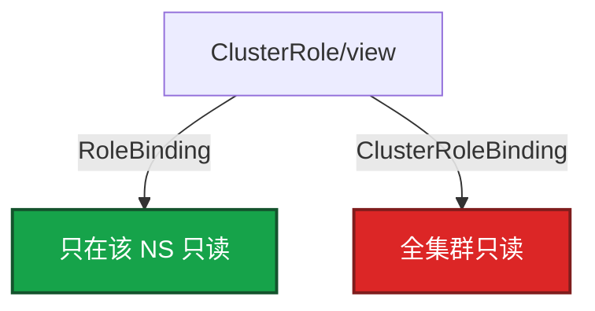

# 13｜RBAC 与安全 · 练习题

先对照 [知识点](知识点.md) **本章主线** 自己口述，再对答案。每题标了覆盖范围：

| 标记 | 含义 |
|------|------|
| **核心** | 不懂整章就没建立起来 |
| **必会** | 值班和面试都要能讲 |
| **常用** | 线上会反复碰到 |
| **常考** | 白板和追问的高频口径 |

## 本题目录

- [Q1 四道门](#q1)
- [Q2 RBAC / ABAC / PSA](#q2)
- [Q3 四件套绑错](#q3)
- [Q4 SA 与最小权限](#q4)
- [Q5 PSS 三级](#q5)
- [Q6 NP vs RBAC](#q6)
- [Q7 Quota / 租户](#q7)
- [Q8 403 与子资源](#q8)
- [Q9 Webhook Fail](#q9)
- [Q10 排障分流](#q10)
- [合上书](#合上书)

---

## Q1

**★★★★★｜四道门各问什么？画架构**

**覆盖**：核心 · 必会 · 常考
**对应**：知识点 §3.1


### 场景

白板：「CI 403、支付 Pod 创建被拒、能 ping 不能 delete，是同一类问题吗？」有人开始背 Role YAML。

### 完整解答

**一句话**：四道门串行：认证 401、鉴权 403、准入拒创建、NP 管包，不是同一种「没权限」。

能进 API ≠ 能发数据包。四道门串行：


| 门 | 失败 |
|----|------|
| 认证 | **401** |
| 鉴权 RBAC | **403** |
| 准入 PSA / Webhook | 创建被拒，不是 403 |
| 运行时 NP | curl 不通 |

已经在跑的 Pod 还在；新的 apply 过不了门。Webhook Fail 焊死写路径（03）。

### 再追问

- RBAC 管不管包？——不管。NP 不管 kubectl。
- 禁 latest 是哪一层？——准入 / 05-03，不是 RBAC。

---

## Q2

**★★★★★｜RBAC、ABAC、PSA 差在哪？为什么不要新开 ABAC？**

**覆盖**：核心 · 必会 · 常考
**对应**：知识点 §3.2


### 场景

有人说「ABAC 按属性更细，生产该开」。另有人把 PSA 拒绝当成 403 去补 RoleBinding。

### 完整解答

**一句话**：RBAC 在鉴权层是生产默认；ABAC 遗留不要新开；PSA 在准入层，失败不是 403。

| | RBAC | ABAC | PSA |
|--|------|------|-----|
| 层 | 鉴权 | 鉴权 | **准入** |
| 载体 | Role / Binding 对象 | 策略文件 + 重启 API | NS 标签 |
| 失败 | 403 | 403 | 创建被拒 |
| 生产 | **默认** | 遗留，不要新开 | PSP 已废后的硬墙 |

ABAC 没有 Binding，`kubectl get` 看不见谁有权。kubeadm 默认 Node,RBAC。Node authorizer 管 kubelet 只碰本节点。Webhook authorizer 与 RBAC 叠加：**任一允许即过**，RBAC 过宽时 Webhook 挡不住。

### 再追问

PSP 还用吗？——废。用 PSS。面试说 PSP 算过期口径。

---

## Q3

**★★★★★｜Role / ClusterRole / 两种 Binding？绑错会怎样？**

**覆盖**：核心 · 必会 · 常考
**对应**：知识点 §3.3


### 场景

给开发 ClusterRole/view，用 ClusterRoleBinding 发下去。第二天他能 list 所有 NS 的 Pod。本意只是 prod 只读。

### 完整解答

**一句话**：Role 是规则，Binding 决定发卡范围；ClusterRoleBinding 会把 ClusterRole 放大到全集群。

Role 是 NS 内规则，ClusterRole 是集群规则。**Binding 决定发卡范围。**



给开发 view 用 RoleBinding + ClusterRole/view。给监控读 Node 用 ClusterRoleBinding。ClusterRoleBinding + 某 NS 的 Role = 范围放大，提权。

### 再追问

- resourceNames？——可收到某一个 Secret 或指定 Deployment。CI 不要 `resources: ["*"]`。
- 聚合 ClusterRole 改了？——aggregationRule 源一变，所有引用方一起变。集群级变更。

---

## Q4

**★★★★★｜SA 和 User？为什么关 automount？default SA 为什么危险？**

**覆盖**：核心 · 必会 · 常用
**对应**：知识点 §3.3 · §4.2


### 场景

CI 用 cluster-admin kubeconfig。业务 Deploy 没写 saName，default SA 被绑了 list secrets。应用被 RCE。

### 完整解答

**一句话**：SA 给 Pod/CI，User 给人；CI 禁 cluster-admin，default SA 零权限，不调 API 关 automount。

SA 给 Pod / CI。User 给人（证书 / OIDC）。人不要共享 kubeconfig。1.24+ Bound Token 有过期；老 Secret Token 少用。

最小权限：按 NS、按资源、按动词加；CI 独立 SA，禁止 cluster-admin；default 零权限；不调 API 关 automount；Secret get 单独批（12）；定期 `grep admin` ClusterRoleBinding。

没写 saName 就用 default。default 绑宽 = 该 NS 所有忘写 SA 的 Pod 都继承。RCE 后用 token 打 API。kubeconfig 进 Git 当安全事件：轮换、收 Binding、清历史。

### 再追问

`kubectl auth can-i --as=system:serviceaccount:prod:ci-bot delete pods -n prod`——值班先复现，再找 Binding。

---

## Q5

**★★★★★｜PSS 三级？反外挂要 hostNetwork 怎么办？**

**覆盖**：核心 · 必会 · 常考
**对应**：知识点 §3.4


### 场景

要上 restricted。反外挂 sidecar 需要 hostNetwork。有人准备把整个 prod 改成 privileged。值班想先改标签顶过去。

### 完整解答

**一句话**：PSS 用 NS 标签分 privileged/baseline/restricted；反外挂 hostNetwork 单独 NS 例外，不降全 prod。

PSP 废弃。PSS 用 NS 标签：privileged / baseline / restricted。enforce 拒创建，warn/audit 先观察。

```
kube-system          privileged
一般业务             baseline → 再收到 restricted
支付 / 核心          restricted（non-root、drop ALL、seccomp）
反外挂例外           单独 NS + 书面例外，不降全 prod
```

先 audit/warn 一周修镜像，再 enforce。工作负载还要写 SecurityContext。临时降级要审批和回归时间。Events 写哪条规则（root、capabilities、hostNetwork）。

### 再追问

warn 和 enforce 同时开？——先观察谁会撞墙，修完再 enforce，避免发布日集体创建失败。

---

## Q6

**★★★★☆｜有 RBAC 还要 NetworkPolicy 吗？403 和 curl 不通怎么分？**

**覆盖**：必会 · 常用 · 常考
**对应**：知识点 §1 · §3.1


### 场景

支付 NS 的 RBAC 很严。安全说可以不上 NP。集群里别的 NS 仍能直连支付 Pod IP。

### 完整解答

**一句话**：RBAC 管 kubectl，NP 管包；有 RBAC 权限不等于能 curl 到 DB Pod。

RBAC 管 API；NP 管包；PSS 管 Pod 声明。有 kubectl 权限 ≠ 能连上 DB Pod。能 ping 通 ≠ 能 delete。支付库必须 NP default-deny（10）。NS 不是安全边界（01）。只建 pay NS 不算合规。

### 再追问

变更全失败，RBAC 都对？——Admission Webhook。Fail + 不可达 = 所有人不能发版（03）。

---

## Q7

**★★★★☆｜ResourceQuota 和 LimitRange？满了什么现象？租户怎么升级？**

**覆盖**：必会 · 常用
**对应**：知识点 §3.5


### 场景

某团队作业不写 resources，把节点打满。另一团队 PVC 建不出来。都怪调度。三个项目后来抢 CPU、互相扫端口。

### 完整解答

**一句话**：Quota 限 NS 总量，LimitRange 填默认 request/limit；NS 是账本不是安全墙。

Quota 限制整个 NS 总量。LimitRange 给容器填默认 request/limit。`default` 是 limit，`defaultRequest` 是 request。满了：创建被拒或 Pending，describe 写 exceeded。Quota 的 pods 含 DaemonSet。这是账本，不是墙。

升级：独立 NS+配额 → 最小 RBAC → NP 默认拒 → 独立节点池 → 硬墙拆集群。每升一级写清原因。

### 再追问

HPA 完全不动？——没 LimitRange 时 request 为 0，调度当不占资源，HPA 没基准。

---

## Q8

**★★★★☆｜403 怎么查？pods/log 为什么单独写？**

**覆盖**：必会 · 常用
**对应**：知识点 §6 · §8


### 场景

能 get pod，不能打日志。Role 里写了 `pods`。另一人 Deploy 403，规则「已经写了」。

### 完整解答

**一句话**：403 用 can-i 复现；子资源 pods/log 单独授权，deployments 在 apps 组。

子资源单独授权：`pods/log`、`pods/exec`。只写 `pods` 不够。`deployments` 在 `apps` 组，写在 core 就是 403。

顺序：can-i 复现 → Binding → apiGroups / resources / verbs / resourceNames。

### 再追问

can-i 是 yes，apply 仍 403？——错资源或 Webhook。can-i yes、curl 不通？——NP（10）。

---

## Q9

**★★★★☆｜Webhook 策略失败为什么比业务故障更致命？**

**覆盖**：必会 · 常用
**对应**：知识点 §8


### 场景

Kyverno 挂了，failurePolicy=Fail。所有人 apply 超时。包括修 Kyverno 自己的 Deploy。

### 完整解答

**一句话**：Webhook failurePolicy=Fail 且不可达时，写路径全堵，比业务 403 更致命。

写路径过准入。Fail + 不可达 = 全集群创建 / 变更被堵，可能连修它的人一起焊死（除非破窗改 Ignore 或从控制面摘 Webhook）。策略组件要多副本 + PDB。本章答到「RBAC 过了还会死在准入」，细节在 03。

活动高峰不要给所有人临时 cluster-admin 顶过去。

### 再追问

禁 latest 是 RBAC 还是准入？——准入。扫描与签名见 05-03。

---

## Q10

**★★★★☆｜给出现象，你先走哪条排障路？**

**覆盖**：必会 · 常用
**对应**：知识点 §8


### 场景

四个工单：① CI 403 ② apply Events 写 PodSecurity ③ 能 kubectl 不能 curl 支付 ④ 全员 apply 超时。

### 完整解答

**一句话**：401 查认证，403 查 Binding，准入拒创建查 PSS，curl 不通查 NP，全员超时查 Webhook。

| # | 走哪条 | 不要做 |
|---|--------|--------|
| ① | can-i → Binding → apiGroups / 子资源 | 先改业务 YAML |
| ② | NS 标签 + SecurityContext；例外单独 NS | 把 prod 改 privileged |
| ③ | NetworkPolicy（10） | 加 RoleBinding |
| ④ | Webhook Fail（03） | 当 RBAC 坏了绑 cluster-admin |

401 先看身份。Quota exceeded 先 describe quota，不是调度器。

### 再追问

三问？——进程还在？能不能变更？流量还通？卡在门上：已跑的还在，新 apply 过不了。

---

## 合上书

- [ ] 能画出四道门，并说出 401 / 403 / PSA / NP 各是什么
- [ ] 能对比 RBAC / ABAC / PSA 在哪一层，为什么 ABAC 不要新开
- [ ] 能说出 RoleBinding 引用 ClusterRole 仍限该 NS；绑错即提权
- [ ] 能落地 CI 禁止 cluster-admin、default 零权限、关 automount
- [ ] 能讲 PSS 三级和例外单独 NS；Quota 是账本、NS 不是墙
- [ ] 能用 can-i 查 403，并知道子资源和 apps 组
- [ ] 能把 Webhook Fail 和 RBAC 403 分开，不把 cluster-admin 当止血
