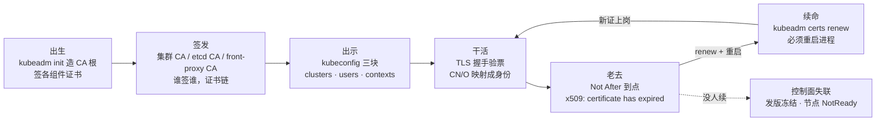
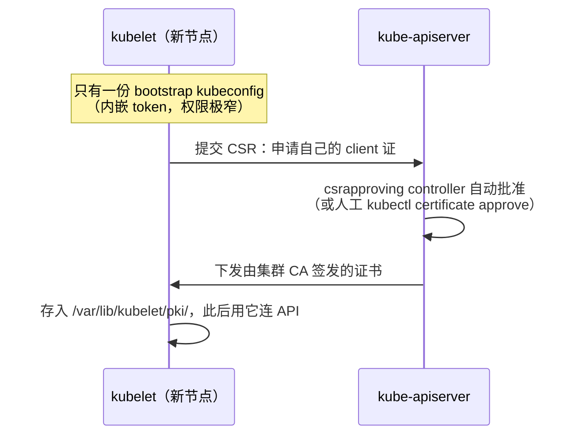
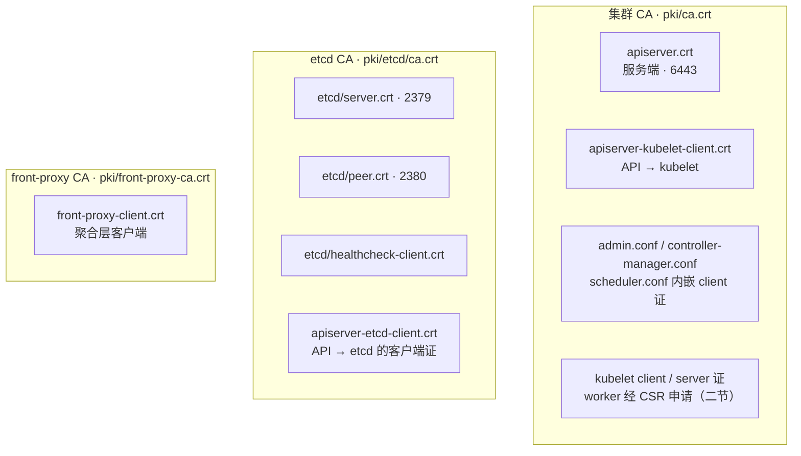
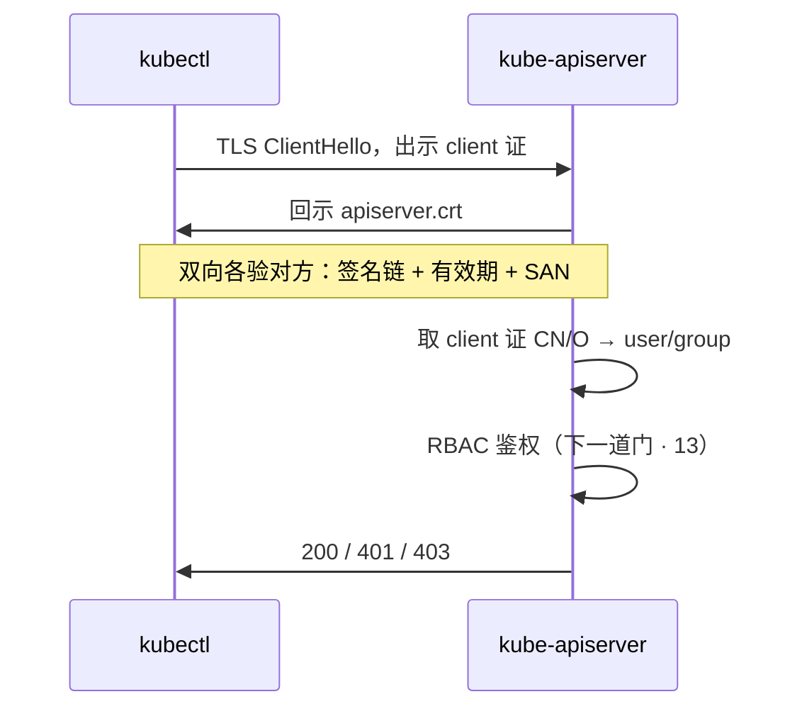
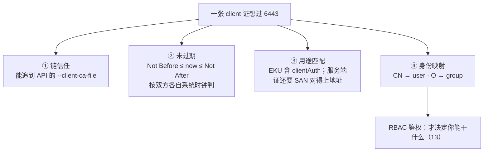
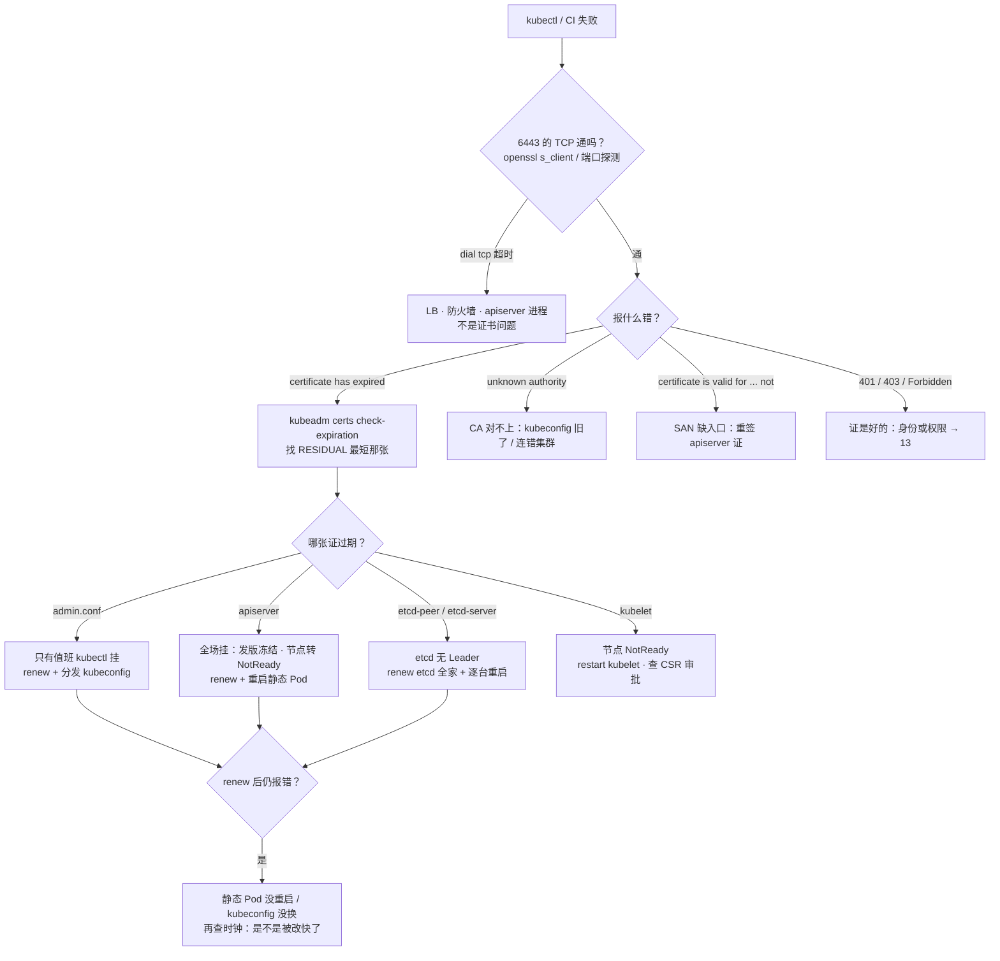

# 证书与 kubeconfig

> 大家好。上一章讲完「你是谁、能不能干」；这一章讲**身份这一头从哪来**——一张证书怎么出生、怎么被出示、怎么过期、怎么续命。
> 开讲之前，先带大家回到一个很多值班同学都经历过的现场：集群跑了一年，凌晨两点发版窗口，`kubectl` 突然全场报 `Unable to connect to the server: x509: certificate has expired`——监控里 API 进程明明还 Running。群里已经有人敲到一半 `kubeadm reset`，还有人出主意「把系统时间往回拨，证书不就又有效了」。手都别动。
> 这一章讲完，你会知道这两个人各自错在哪——过期丢的是信任链不是数据，以及为什么拨时钟是把小事故变成大事故。
> **本章回答的问题**：一张证书的一生——`kubeadm init` 出生 → 谁签谁的证书链 → 装进 kubeconfig 三块 → API 验票干活 → 过期症状 → `kubeadm certs renew` 续命；证书挂了集群里谁跟着挂，值班 60 秒怎么救。
> **本章不讲**：RBAC 规则与 403 排查 → [13](../13-RBAC与安全/)；API 认证链全貌（Token/Webhook/OIDC）→ [03](../03-API-Server/)；etcd Raft 与备份恢复 → [02](../02-etcd/)；TLS 握手机制本身 → [01-14](../../01-基础底座/14-HTTP与TLS/)；时间同步 → [01-32](../../01-基础底座/32-NTP与时间同步/)。

**标记**：🎯重点 · 🔥难点 · ⭐常考 · 🔧实操

**怎么听这场分享**：第一节是「一张证的一生」主图；二到七节顺着出生 → 签发 → 出示 → 验票 → 老去 → 续命往下走；第八节定责——就是开头那个现场的正确解法。口诀先埋一句：⭐ **renew 只换磁盘，不重启等于白续**。

---

## 一、一张图：一张证书的一生

> 🎯 **一句话**：证书和人一样有生老病死——出生（init 签发）、干活（TLS 握手）、老去（过期）、续命（renew）；出了问题先问它卡在哪一段。

咱们先不急着背 `pki/` 目录下那一长串文件名。学证书最怕一上来背文件清单，背完还分不清「admin 过期」和「apiserver 过期」差在哪。先看图：



**读图**：

- 主线从左到右是一条时间线：**出生、签发**两节讲「集群里有哪些证、谁签谁」；**出示、干活**讲「证怎么被拿出来用、API 怎么验」；**老去、续命**讲「过期了什么症状、怎么续」。
- 注意那条虚线：证书到点没人续，**进程不会自己发现**，TLS 握手直接失败——值班接到的报障都从「老去」这个点进来。
- 定责第一问永远是「哪一段」：**连不上 6443**（出示/服务端证）、**连上了但 401/403**（身份与权限，不是本章）、**节点 NotReady**（kubelet 证）。

好，带着这张图出发——先看证书是怎么「出生」的。

本节对应练习题 Q1、Q2。

---

## 二、出生：kubeadm init 与 PKI 树

> 🎯 **一句话**：`kubeadm init` 在控制面造出一棵以 `ca.crt` 为根的 PKI 树；组件证默认 1 年、CA 根 10 年，CA 私钥丢了只能重建集群。

开篇有人要 `kubeadm reset`——大家想想：证书过期和数据损坏，是一种病吗？不是。先把「证书从哪来」讲清。

**PKI（Public Key Infrastructure，公钥基础设施）** 在 kubeadm 集群里就是 `/etc/kubernetes/pki/` 目录下那套 CA 加各角色证书。**CA（Certificate Authority，证书颁发机构）** = 用自己的私钥给别的证书签名的「公章」——被签的证书就「归它担保」；集群里所有组件各自信任对应的那份 `ca.crt`。

> 💡 **打个比方**：CA 是游戏公司的公章——公章在，员工工牌（组件证书）丢多少张都能补办；公章的私钥丢了，全公司工牌当场作废，只能重新刻章、重新发证，等于重建信任体系。

kubeadm 默认生成的核心文件（控制面节点）：

`/etc/kubernetes/pki/` 目录下的核心文件：

| 文件 | 用途 |
|------|------|
| `ca.crt` / `ca.key` | 集群根 CA：签 apiserver、kubelet client、admin 等 |
| `apiserver.crt` / `.key` | API Server 服务端证书（对外 6443） |
| `apiserver-kubelet-client.crt` | API 作为客户端访问 kubelet（logs/exec 走它） |
| `apiserver-etcd-client.crt` | API 连 etcd 的客户端证（由 etcd CA 签，见三节） |
| `front-proxy-ca.crt` / `.key` | 聚合层专用 CA（metrics-server、扩展 API） |
| `front-proxy-client.crt` | 聚合 API 访问 API Server 的客户端证 |
| `etcd/ca.crt` / `ca.key` | etcd 专用 CA（和集群 CA 是两套） |
| `etcd/server.crt` / `.key` | etcd 服务端 2379 |
| `etcd/peer.crt` / `.key` | etcd 成员间 2380 |
| `etcd/healthcheck-client.crt` | etcdctl 健康检查用 |
| `sa.key` / `sa.pub` | ServiceAccount 令牌签名（不是 X.509，但住同一目录） |

> ⚠️ **别混**：`sa.key` 签的是 **JWT 形态的 ServiceAccount Token**，走的是「令牌验签」认证链，和本章的 X.509 客户端证书是两条线，只在 API 认证入口汇合（[03](../03-API-Server/)）。面试被问「K8s 有哪些 CA」，答三套 X.509 CA 之后补这一句，是加分点。

**CA 根 10 年、组件证 1 年**——这就是「集群跑了一年整批证书同时到期」的结构性原因：它们是 init 那天一批签出来的。

> 🔍 **现场**：接手一个集群，第一件事不是 `kubectl get nodes`，而是看证书还剩几天。

```bash
kubeadm certs check-expiration
```

```text
CERTIFICATE                EXPIRES                  RESIDUAL TIME   CERTIFICATE AUTHORITY   EXTERNALLY MANAGED
admin.conf                 2026-09-01T02:10:00Z     23h             ca                      no
apiserver                  2026-09-01T02:10:00Z     23h             ca                      no
apiserver-etcd-client      2026-09-01T02:10:00Z     23h             etcd-ca                 no
apiserver-kubelet-client   2026-09-01T02:10:00Z     23h             ca                      no
controller-manager.conf    2026-09-01T02:10:00Z     23h             ca                      no
etcd-healthcheck-client    2026-09-01T02:10:00Z     23h             etcd-ca                 no
etcd-peer                  2026-09-01T02:10:00Z     23h             etcd-ca                 no
etcd-server                2026-09-01T02:10:00Z     23h             etcd-ca                 no
front-proxy-client         2026-09-01T02:10:00Z     23h             front-proxy-ca          no
scheduler.conf             2026-09-01T02:10:00Z     23h             ca                      no
ca                         2035-08-30T02:10:00Z     9y              ca                      no
# ← 同一批签发 → 同一批到期：整表只剩 23h，就是「跑了一年半夜集体爆炸」的现场
# ← CERTIFICATE AUTHORITY 列就是「谁签的」：apiserver-etcd-client 归 etcd-ca
# ← RESIDUAL TIME < 14d 按 P1 排进变更窗口（七节）；EXTERNALLY MANAGED=yes 的项 kubeadm 不管
```

**SAN（Subject Alternative Name，主体备用名）** = 证书上允许被访问的 DNS/IP 清单。`apiserver.crt` 的 SAN 必须覆盖 API 的所有入口：LB VIP、每台控制面 IP、`kubernetes.default.svc` 等——少一个，从那个地址访问就报 `x509: certificate is valid for ... not ...`（八节）。这份清单写在 `kubeadm-config` 的 `apiServer.certSANs` 里，**装集群时就该写满**，不是事后改 kubeconfig 能救的。⭐

### Worker 入场：TLS bootstrap 🔧

控制面的证是 `kubeadm init` 一次生成的；Worker 上的 kubelet 证书不是——它是 `kubeadm join` 时走 **TLS bootstrap（TLS 引导）** 现场申请的。



**读图**：从 **CSR（Certificate Signing Request，证书签名请求）** 进去、从集群 CA 签发的正式证出来——bootstrap 阶段 kubelet 凭 token 敲门，权限只有「给自己申请证」这一件事；证到手后走 **client cert auth**，和 admin.conf 是同一条进门路。

> 🔍 **现场**：新节点 join 卡住，八成是 CSR 挂着没人批。

```bash
kubectl get csr
# NAME        AGE   SIGNERNAME                                    REQUESTOR                    CONDITION
# csr-x7k2p   6m    kubernetes.io/kube-apiserver-client-kubelet   system:bootstrap:tok-abc12   Pending   # ← 卡在这
kubectl certificate approve csr-x7k2p
# certificatesigningrequest.certificates.k8s.io/csr-x7k2p approved
```

> ⚠️ **别混**：**bootstrap token 过期** 只影响「新节点 join」，不影响已在册节点；**kubelet 证书过期** 影响的是「已在册节点」（症状是 NotReady，六节）。两个都叫「证书相关的过期」，救治对象完全不同。口诀：⭐ **token 管新人入场，kubelet 证管老人报到**。

好，证书出生了。接下来自然会问：这么多证，**谁签谁**？

本节对应练习题 Q1、Q11。

---

## 三、签发：谁签谁（证书链）⭐

> 🎯 **一句话**：三套 CA 各签各的——集群 CA 管人与控制面、etcd CA 只管 etcd、front-proxy CA 只管聚合层；画证书链先画三个根。

很多人会答「全集群就一张 `ca.crt`」——⭐ 这是高频错答。咱们放慢：

**证书链（certificate chain）** = 「这张证是谁签的、那个签名者又是谁签的」一路追到根。K8s 不是一棵大树，是**三棵树并排**：



**读图**：从三个 subgraph 的**根**进——要查哪条链路断了，先找它属于哪个 CA 的地盘。全图只有一个「跨域打工者」：**`apiserver-etcd-client` 挂在 etcd CA 下**——API Server 去敲 etcd 的门，拿的必须是 etcd 家签的证。这也是「拿集群 CA 手工签一张证去连 2379 必然失败」的原因。

三条验证链路各走各的：

- **人/控制器 → API（6443）**：客户端校验 `apiserver.crt` 是不是集群 CA 签的、过没过期；API 反过来校验你的 client 证（**mTLS，双向 TLS**，五节）。
- **API → etcd（2379）**：etcd 只认 etcd CA 签的服务端/客户端证，集群 CA 在这没有面子（[02](../02-etcd/)）。
- **API ↔ kubelet（10250）**：API 拿 `apiserver-kubelet-client`，kubelet 拿自己的 server 证，双向互验。`kubectl logs`、`kubectl exec` 的数据面就是这条链。

三张高频证书放一起对比：

| 对比 | **apiserver.crt** | **apiserver-kubelet-client.crt** | **kubelet client 证** |
|------|-------------------|----------------------------------|------------------------|
| 角色 | API 对外的服务端证 | API 访问 kubelet 的客户端身份 | kubelet 访问 API 的客户端身份 |
| 谁校验它 | 所有连 6443 的客户端 | kubelet | API Server |
| 过期症状 | 全场 6443 访问 TLS 失败 | `kubectl logs`/`exec` 失败 | 节点 NotReady |

**front-proxy-ca** 单独一套，是给 **聚合层（aggregation layer）** 用的：metrics-server、自定义 APIService 这类扩展 API 拿着 `front-proxy-client` 证访问 API Server，API 用启动参数 `--requestheader-client-ca-file=front-proxy-ca.crt` 验这批证，再把原用户身份透传进去（细节 → [03](../03-API-Server/)）。它和集群 CA **不能互相替代**。

控制面组件连 API 也各有一份 kubeconfig（内嵌 client 证，都是集群 CA 签的）：

```text
/etc/kubernetes/controller-manager.conf   ← kube-controller-manager 连 API
/etc/kubernetes/scheduler.conf            ← kube-scheduler 连 API
/etc/kubernetes/admin.conf                ← 人机共用的 break-glass；运维 kubectl 拷的就是它
```

它们的证过期 → 控制器停止写状态、调度器停止分配，但**已在跑的 Pod 不受影响**（影响面总表 → [01](../01-集群架构/)）。

> 📝 **面试**：「K8s 有几套 CA？」答「至少三套：集群 CA（API/kubelet/人）、etcd CA（2379/2380 全家的证，含 apiserver-etcd-client）、front-proxy CA（聚合层）；另有 `sa.key` 签 SA JWT，不是 X.509」。

好，到这儿咱们已经知道「谁签谁」。接下来：证签好了，**人怎么把它拿出来用**？

本节对应练习题 Q2。

---

## 四、出示：kubeconfig 三块与多集群管理

> 🎯 **一句话**：kubeconfig = `clusters`（连哪）+ `users`（你是谁）+ `contexts`（默认组合）；kubectl 只认 `current-context` 指向的那一套。

证书躺在磁盘上还不够——kubectl 得知道「连哪、用谁的身份」。这就是 kubeconfig。

**kubeconfig** 是 YAML 文件，不是单张证书。三个顶层键各管一件事：

```yaml
apiVersion: v1
kind: Config
clusters:                    # ← 连哪：API 地址 + 信任哪张 CA
- name: prod
  cluster:
    server: https://10.0.1.100:6443
    certificate-authority-data: LS0tLS1...   # base64 的 ca.crt
users:                       # ← 你是谁：client 证 + 私钥（或 token / exec 插件）
- name: admin
  user:
    client-certificate-data: LS0tLS1...
    client-key-data: LS0tLS1...
contexts:                    # ← 把 cluster + user + 默认 namespace 绑成一条
- name: prod-admin
  context:
    cluster: prod
    user: admin
    namespace: kube-system
current-context: prod-admin  # ← kubectl 默认就用这条
```

> 💡 **打个比方**：`clusters` 是「大楼地址 + 认准哪家公证处」，`users` 是你的工牌，`contexts` 是「今天去 A 大楼用管理员工牌」这条排班记录——换楼、换牌、换排班，互相独立。

**多集群值班先看清自己在哪**：

> 🔍 **现场**：任何危险命令之前，先确认当前 context。

```bash
kubectl config current-context
# prod-admin
kubectl config get-contexts
# CURRENT   NAME            CLUSTER      AUTHINFO    NAMESPACE
# *         prod-admin      prod         admin       kube-system   # ← 星号在谁身上，默认命令就打谁
#           staging-admin   staging      admin
kubectl config use-context staging-admin    # 切默认
kubectl get pods --context=prod-admin       # 单条命令临时指定，不改默认
kubectl config view --minify --raw          # 只看当前 context 展开后的有效配置
```

多文件管理用环境变量与命令行覆盖，优先级从低到高：

```text
~/.kube/config                ← 默认文件
KUBECONFIG=a.yaml:b.yaml      ← 多文件用 : 拼接（Windows 用 ;），同名条目后者覆盖前者
--kubeconfig /etc/kubernetes/admin.conf   ← 命令行指定，最高
--context                     ← 覆盖 current-context
```

**多环境纪律**（误删 prod 的事故几乎都出在这）：context 命名统一「环境-角色」（`prod-admin`/`staging-admin`）；shell 提示符里显示当前集群（kubectx / prompt 插件）；删除类命令前先 `kubectl config current-context`。舰队式多集群管理是另一个话题 → [26](../26-多集群与联邦/)。

**长期证书的风险** ⭐：`admin.conf` 内嵌的是 `O=system:masters` 的 cluster-admin 证书，**有效期一年且权限封顶**——拷给 CI、提交进 Git 都等于集群裸奔。同理，1.24 之前的 ServiceAccount Token 是**永不过期**的 Secret，泄漏后永久有效；1.24 起默认改为 `TokenRequest` 签发的**短期令牌**（默认 ~1h 过期）。给 CI/系统的正确姿势：**独立 ServiceAccount + 最小 Role + 短期令牌或 OIDC**，永远不发 admin 证（→ [13](../13-RBAC与安全/)）。

> ⚠️ **别混**：**你的 kubeconfig 里的证过期** 只影响「拿这份文件的人」；**`apiserver.crt` 过期** 影响「所有连 6443 的人」。两者的剩余天数常常接近（同一批续的），但症状范围天差地别——六节。

从 kubeconfig 里拆出 PEM 检查（`-data` 字段是 base64）：

```bash
kubectl config view --raw -o jsonpath='{.users[?(@.name=="admin")].user.client-certificate-data}' \
  | base64 -d > /tmp/admin.crt
openssl x509 -in /tmp/admin.crt -noout -subject -dates
# subject=O = system:masters, CN = kubernetes-admin   # ← O 决定它是不是 break-glass
# notAfter=Sep  1 02:10:00 2026 GMT                   # ← 和 check-expiration 的 admin.conf 对得上
```

好，证装进 kubeconfig 了。大家想想：kubectl 一敲，**API 怎么验这张票**？

本节对应练习题 Q3、Q4。

---

## 五、干活：一次验票 ⭐🔥

> 🎯 **一句话**：6443 上先 TLS 握手互验证书，再把客户端证的 CN/O 映射成身份，**然后才轮到 RBAC**——证只管「你是谁」。

🔥 这一节是全章最难的一块，咱们放慢。很多人以为「证书过期所以 403」——⭐ 这是高频错答，因果链先拆开。

API Server 启动参数里与证书相关的核心项（`/etc/kubernetes/manifests/kube-apiserver.yaml` 里可见）：

```text
--tls-cert-file=/etc/kubernetes/pki/apiserver.crt            # 6443 服务端证
--tls-private-key-file=/etc/kubernetes/pki/apiserver.key
--client-ca-file=/etc/kubernetes/pki/ca.crt                  # ← 用它验所有客户端证
--etcd-cafile=/etc/kubernetes/pki/etcd/ca.crt                # ← API 作为客户端连 etcd
--etcd-certfile=/etc/kubernetes/pki/apiserver-etcd-client.crt
--requestheader-client-ca-file=/etc/kubernetes/pki/front-proxy-ca.crt
--requestheader-allowed-names=front-proxy-client
```

**client cert auth（客户端证书认证）** 全程：



**读图**：从「双向互验」进——这不是公网 HTTPS 那种只验服务端的模型，6443/2379/2380/10250 全是 **mTLS（mutual TLS，双向 TLS）**，客户端不出示证书（或 token）握手阶段就失败。出错时先分清是 **服务端证**（你这边验它不过）还是 **客户端证**（它那边验你不过），再看 401/403 是不是已经过了 TLS。

**CN/O 怎么变成身份**：客户端证书的 **CN（Common Name）** 映射为 user，**O（Organization）** 映射为 group。`admin.conf` 的 `O=system:masters` 命中内置超权组，**绕过 RBAC** 等效 cluster-admin——这也是它不能外发的原因。普通用户证则要在 RBAC 里有对应 Binding 才有权（[13](../13-RBAC与安全/)）。

### 收束：一张证凭什么能进门 🎯⭐🔥

TLS 握手放行一张客户端证，要连过四道门——面试问「证书认证怎么做的」，就是这张清单：



**读图**：①②③ 任何一道不过都是 **TLS 层失败**（x509 报错，请求根本到不了 RBAC）；④ 之后才把「证书字段」翻译成「身份」交给下一道门。排障顺序就按 ①→④ 走：先验 CA 对不对，再看过没过期，再看 SAN/用途，最后才谈权限。

**EKU（Extended Key Usage，扩展密钥用途）** = 证书声明的用途：`serverAuth` 还是 `clientAuth`。拿 server 证当 client 证用、拿 etcd 域的证敲 6443，都会在这一道被拒。

> ⚠️ **别混**：**认证（Authentication）** 回答「你是谁」，失败是 401 或 TLS 握手报错；**鉴权（Authorization）** 回答「你能干什么」，失败是 403。**证书过期在 TLS 层就挂，连 403 都到不了**——说「证书过期所以 403」是经典错句。这对易混全章只在此处讲一次。

> 📝 **面试**：四道门按「信不信 → 过没过期 → 用途对不对 → 映射成谁」分组背，最后补一句「过了认证还要过 RBAC——除非 `O=system:masters`」。

> 🔍 **现场**：不依赖 kubectl，直接探 6443 的服务端证。

```bash
openssl s_client -connect 10.0.1.100:6443 -showcerts </dev/null 2>/dev/null \
  | openssl x509 -noout -dates -subject -ext subjectAltName
```

```text
notBefore=Sep  1 02:10:00 2025 GMT
notAfter=Sep  1 02:10:00 2026 GMT          # ← 已过这个点 = apiserver 服务端证过期
subject=CN = kube-apiserver
X509v3 Subject Alternative Name:
    DNS:kubernetes, DNS:kubernetes.default.svc.cluster.local, IP Address:10.96.0.1, IP Address:10.0.1.11
# ← SAN 里没有你正在连的 LB VIP？那报的是 certificate is valid for ... not ...
```

验证「证书和私钥是不是一对」（装错 key 时报 `tls: bad certificate`）：

```bash
openssl x509 -noout -modulus -in apiserver.crt | openssl md5
openssl rsa  -noout -modulus -in apiserver.key  | openssl md5
# 两行 MD5 相同 ← 是一对；不同 = 证钥不配对，TLS 握手必挂
```

看 kubectl 到底卡在哪一步：

```bash
kubectl get nodes -v=6 2>&1 | grep -iE 'certificate|tls|x509'
# x509: certificate has expired                ← 某一侧证书过期（六节对表）
# x509: certificate signed by unknown authority ← CA 对不上：kubeconfig 旧了 / 连错集群
# Forbidden                                    ← TLS 已过，是 RBAC 的事（13），不是本章
```

好，验票四道门走完了。接下来自然会问：证到了 Not After，**集群里谁跟着挂**？

本节对应练习题 Q5、Q10、Q12。

---

## 六、老去：证书过期时集群会怎样 🔥⭐

> 🎯 **一句话**：过期丢的不是数据，是信任链——**谁还活着、谁立刻停**，完全由「哪张证过期」决定。

开篇那个现场——API Running、玩家还在、kubectl 全挂——大家想想：到底是哪张证到期了？对表就清楚。

### 按证对表：谁跟着挂

| 过期的证 | **什么还在** | **什么立刻停** |
|----------|--------------|----------------|
| `admin.conf`（运维证） | API 进程、节点、业务 Pod | 运维的 `kubectl`、用它的 CI 发版 |
| `apiserver.crt`（服务端证） | etcd 数据、容器进程 | **所有** 6443 TLS：kubectl、控制器、kubelet 心跳 |
| `apiserver-etcd-client` | API 进程还在 | 所有写 etcd 的请求；**变更全面停摆** |
| etcd `peer.crt`（2380） | — | etcd 成员互不信任 → **无 Leader** → API 连带不可用 |
| kubelet client 证 | 该节点上的容器 | 节点 **NotReady**，状态停止上报 |
| kubelet server 证（10250） | Pod 照常跑 | `kubectl logs`/`exec`/metrics 失败 |

把第一、二行连起来读，就是开篇那场事故：`apiserver.crt` 到期 → 所有 6443 握手失败 → 控制器失联、节点心跳断，几十秒后节点开始变 NotReady——**但节点上的容器还在跑**，玩家还在线，只是发版、扩缩容、一切变更全部冻结。「玩家还在、kubectl 全挂」先别碰业务，这是控制面的事（总影响面 → [01](../01-集群架构/)）。

### 典型报错对照

```text
x509: certificate has expired                     # ← 某一侧过了 Not After
x509: certificate signed by unknown authority     # ← CA 对不上：kubeconfig 里的 CA 旧了 / 连错集群
x509: certificate is valid for A, not B           # ← SAN 不含你正在访问的地址
tls: bad certificate                              # ← 证钥不配对 / 链不完整
Unable to connect to the server: dial tcp ...     # ← 先别认定是证：LB / 防火墙 / 6443 没监听
```

etcd 侧的签名（peer 证过期时，[02](../02-etcd/)）：etcd 日志刷 `failed to verify certificate: x509: certificate has expired`，`etcdctl endpoint status` 里 **IS LEADER 全 false**、ERRORS 列带 tls 字样。

### 时钟骗局：证书没过期，机器时间错了 🔥

TLS 验证「过没过期」用的是**本机系统时钟**。有人为排障手动改过系统时间、或虚拟机快照恢复后时钟漂移，就会出现诡异的「提前过期」：

- 时钟**调快** → 有效证书被判 `certificate has expired`；
- 时钟**调慢** → 报 `x509: certificate is not yet valid`（还没生效）。

签名很特别：`kubeadm certs check-expiration` 明明显示还剩几百天，握手却说过期；而且**同机房一批机器同时发作**。这时先校时，别急着 renew：

```bash
chronyc sources        # 或 ntpstat；看系统时钟与 NTP 的偏差
# 校时后直接重试握手——证书本身一个字都不用动（→ [01-32](../../01-基础底座/32-NTP与时间同步/)）
```

> ⚠️ **别混**：真实过期是「`check-expiration` 也到点」；时钟骗局是「`check-expiration` 健康、只有握手报错」。对表能分开这两种病，治法南辕北辙。

### CA 私钥丢了：没有续命，只有重建

`ca.key` 是整棵树的根——丢了（或没备份）就**无法再签发任何新证**，`kubeadm certs renew` 也救不了，只能从 `pki` 备份恢复或重建集群。`ca.key` 永远不进 Git、不进镜像，备份按最高密级存放。

好，知道「谁挂了」。接下来：怎么续命——以及为什么有人 renew 完还是 expired。

本节对应练习题 Q6、Q7。

---

## 七、续命：续期与轮转 🔧⭐

> 🎯 **一句话**：`kubeadm certs renew` 只换磁盘上的 pem；进程启动时才加载证书、之后不看文件——**不重启等于白续**。

⭐ 这是面试必考，也是值班头号踩坑。很多人会想：「磁盘上的证换了，进程应该自己发现吧？」——错了。

> 💡 **打个比方**：续签就像给门卫室换了新版花名册——花名册印好放在桌上（renew），但正在岗的门卫手里还攥着旧册子，得换岗（重启进程）新册子才生效。

### 标准动作：renew 三步

```bash
# ① 看过期（每台控制面都要看；最好早进了监控，见「生产节奏」）
kubeadm certs check-expiration

# ② 续签（每台控制面各跑一遍；也可只续单张：kubeadm certs renew apiserver）
kubeadm certs renew all

# ③ 重启进程加载新证——静态 Pod 两种等效手法选一
mv /etc/kubernetes/manifests/kube-apiserver.yaml /tmp/ && sleep 5 \
  && mv /tmp/kube-apiserver.yaml /etc/kubernetes/manifests/     # kubelet 盯着这个目录，自动重建
# 或：crictl pods --name kube-apiserver -q | xargs -r crictl rmp -f
# etcd / controller-manager / scheduler 同理，逐台来（保 quorum）

# ④ 分发新 kubeconfig：admin.conf 变了，笔记本上的 ~/.kube/config 还是旧的
cp /etc/kubernetes/admin.conf ~/.kube/config

# ⑤ 验证
kubectl get nodes
openssl x509 -in /etc/kubernetes/pki/apiserver.crt -noout -dates
```

> ⚠️ **别混**：**renew 之后不重启** = 磁盘是新证、内存是旧证，报错原样不动——这是「续期了还是 expired」的头号原因。谁要重启对号入座：`apiserver`/`controller-manager`/`scheduler`/`etcd` 都是静态 Pod，各重启各的；**kubelet 例外**——它的证书轮转是进程内热加载，`systemctl restart kubelet` 只在救急时用。

续期前备份一份（回滚只能回 pem，回不了 etcd 数据）：

```bash
tar czf /root/pki-backup-$(date +%Y%m%d).tgz /etc/kubernetes/pki /etc/kubernetes/*.conf
```

### 轮转分两层：控制面手动、kubelet 自动

**证书轮转（certificate rotation）** 在集群里是两套机制：

- **控制面**：静态证书没人自动续——人工或定时任务跑 `kubeadm certs renew` + 重启，必须排变更窗口。
- **kubelet**：kubeadm 默认开 `--rotate-certificates=true`，kubelet 在证书剩余约 10%~30% 生命周期时自动提交 CSR 换新证（二节的同一条路），所以在册节点的证**通常不用你管**——除非 CSR 审批链自己出了问题。

> 🔍 **现场**：`check-expiration` 里 `EXTERNALLY MANAGED=yes` 的项（外置 etcd、cert-manager 接管等）kubeadm **不会**帮你续，别对它们盲跑 `renew`。

**手动 openssl 路线**（非 kubeadm 管理、或要定制 SAN 时知道原理即可）：

```bash
openssl genrsa -out apiserver.key 2048
openssl req -new -key apiserver.key -subj "/CN=kube-apiserver" -out apiserver.csr
openssl x509 -req -in apiserver.csr -CA pki/ca.crt -CAkey pki/ca.key \
  -CAcreateserial -days 365 -extfile san.cnf -out apiserver.crt
# ← 三步：造私钥 → 发 CSR → 用 CA 签；san.cnf 里写全 SAN
# ← kubeadm 集群别手搓：改 SAN 用 kubeadm init phase certs apiserver --config=...
```

### 生产节奏：别等 P0 才第一次 renew ⭐

证书续期是**日历事件**，不是告警响应：

```text
T-30d   check-expiration 进周报，确认变更窗口
T-14d   剩余 <14d 触发 P1；通知业务「控制面有短窗口」
T-7d    预发/测试集群完整走一遍 renew + 重启 + 验证
T-0     生产：renew → 逐台重启 apiserver/etcd（保 quorum）→ 分发 kubeconfig
T+1h    验证 CI/CD、controller、scheduler、metrics-server；监控复位
```

多控制面节点：**每台都要 renew**（证书文件各节点本地一份），且静态 Pod **逐台**重启——三台同时 `crictl rmp`，6443 和 etcd quorum 会同一秒闪断，小事故变成大事故。

> 📝 **面试**：「renew 之后 kubectl 还报 expired 怎么办？」答「三步检查：① renew 真的成功了吗（`check-expiration` 再看）② 对应静态 Pod 重启了吗 ③ 本地 kubeconfig 换了吗——只做第一步等于没做」。

好，续命动作会了。回到开篇那个凌晨现场——60 秒怎么定责？

本节对应练习题 Q8、Q9。

---

## 八、作战：定责

> 🎯 **一句话**：先分「连不上 6443」还是「连得上但报错」，再拿 `check-expiration` 逐项缩圈；renew 后仍报错，先怀疑没重启。

群里有人要 `kubeadm reset`、有人要拨时钟——咱们用决策树把他们拦住。

### 决策树 🔥



**读图**：入口先做 **TCP 与 TLS 分层**——相当一部分「证书问题」其实是 LB 探活配错或 6443 根本没监听，别一上来就 `renew`。进了 x509 再按报错词分路；走到右下角「renew 后仍报错」，九成是**忘了重启**或**忘了换 kubeconfig**，小概率是时钟骗局（六节）。

### 现象 · 先做 · 别做

| 现象 | 先做 | 别做 |
|------|------|------|
| 全员 `certificate has expired` | `check-expiration` → `renew all` → 重启 apiserver/etcd 静态 Pod | `kubeadm reset`；重启业务 Pod |
| 只有值班 kubectl 挂 | `renew admin.conf`，分发新 kubeconfig | 当 API 挂了去 restore etcd |
| `kubectl logs`/`exec` 全失败 | 查 `apiserver-kubelet-client` 与 kubelet server 证 | 先改 RBAC |
| 单节点 NotReady + x509 | 该节点 kubelet 日志 / 证书；`systemctl restart kubelet` | 直接 drain 驱逐整个节点 |
| etcd 无 Leader + tls 报错 | renew etcd 全家（peer 优先），逐台重启 | 三台 etcd 一起 reset |
| renew 后仍报 expired | 重启静态 Pod、换 kubeconfig、查时钟 | 反复 renew 不重启 |
| `certificate is valid for ... not` | 把入口加进 `certSANs`，重签 apiserver 证 | 只改 kubeconfig 地址、不动证书 |
| `check-expiration` 健康但握手 expired | 校时（chronyc/NTP） | 盲目 `renew all` |

### 60 秒剧本 🔧

> 🔍 **现场**：凌晨被叫起来，全场 `x509: certificate has expired`，60 秒走完这条线再说话。

```text
① 0–10s   定范围：只有值班挂，还是 CI/控制器全挂？
          openssl s_client -connect <VIP>:6443 … -noout -dates 看服务端证
② 10–30s  SSH 控制面：kubeadm certs check-expiration，圈出 RESIDUAL 最短的
          journalctl -u kubelet / apiserver 日志扫 expired
③ 30–45s  定型：只有 admin → renew conf 就行；
          apiserver/etcd → renew + 安排逐台重启静态 Pod 的窗口
④ 45–60s  kubeadm certs renew <目标> → 重启静态 Pod → kubectl get nodes 验证
          → 分发新 kubeconfig；把 <14d 到期项挂上监控
```

现在再看群里那句「kubeadm reset」和「把时间拨回去」——你知道该怎么拦住他们了：过期是信任链断了不是数据坏了，拨时钟只会让握手更乱。

本节对应练习题 Q13、Q14。

---

## 九、收口

### 命令速查 🔧

```bash
# 过期与续签
kubeadm certs check-expiration                    # 剩余天数一张表
kubeadm certs renew all                           # 整批续；或单张：renew apiserver / etcd-peer …

# 重启让新证生效（静态 Pod 二选一）
mv /etc/kubernetes/manifests/kube-apiserver.yaml /tmp/ && sleep 5 \
  && mv /tmp/kube-apiserver.yaml /etc/kubernetes/manifests/
crictl pods --name kube-apiserver -q | xargs -r crictl rmp -f
systemctl restart kubelet                         # 节点证书救急

# kubeconfig
kubectl config current-context
kubectl config get-contexts
kubectl config use-context {name}
kubectl config view --minify --raw

# openssl 三件套
openssl s_client -connect <API>:6443 </dev/null 2>/dev/null | openssl x509 -noout -dates -subject
openssl x509 -in <file.crt> -noout -dates -subject -issuer
openssl x509 -noout -modulus -in a.crt | openssl md5
openssl rsa  -noout -modulus -in a.key | openssl md5   # 与上行相同 = 证钥配对
```

### 面试锚点

遮住右列自问自答，卡壳的行回去重读对应小节——能讲出来才算会，看着答案点头不算。

| 问 | 30 秒答 |
|----|---------|
| K8s 有几套 CA？ | 集群 CA、etcd CA、front-proxy CA；`sa.key` 签 SA JWT 不是 X.509。 |
| apiserver-etcd-client 谁签的？ | **etcd CA**——API 敲 etcd 的门要拿 etcd 家的证，集群 CA 没面子。 |
| kubeconfig 三块？ | clusters（连哪 + 信哪个 CA）、users（client 证/token）、contexts（绑定 + current-context）。 |
| client cert auth 流程？ | TLS 互验 → 链信任/有效期/用途 → CN/O 映射 user/group → RBAC。 |
| CN 和 O 各映射什么？ | CN → user，O → group；`O=system:masters` 绕过 RBAC。 |
| 认证和鉴权？ | 认证认人（TLS/401），鉴权认权（RBAC/403）；过期在 TLS 层，到不了 403。 |
| admin.conf 过期影响？ | 只杀运维/CI 的 kubectl；API 与业务可能全好。 |
| apiserver.crt 过期影响？ | 所有 6443 访问失败：kubectl、控制器、kubelet 心跳，节点转 NotReady，变更冻结。 |
| etcd peer vs client 证过期？ | peer（2380）：无 Leader、Raft 拆伙；apiserver-etcd-client：readyz 的 etcd 项失败、变更停摆。 |
| kubelet 证过期？ | client 证 → NotReady；server 证 → logs/exec 失败。 |
| 怎么查剩余天数？ | `kubeadm certs check-expiration`；小于 14 天按 P1 进窗口。 |
| renew 后为什么还报错？ | 没重启静态 Pod / 没换 kubeconfig / 时钟被改——renew 只换磁盘。 |
| SAN 是什么？ | 证书允许的 DNS/IP 清单；新加 LB 必须写进 `certSANs` 重签，否则 `valid for ... not`。 |
| CA 私钥丢了？ | 无法续签，只能从备份恢复 `pki` 或重建集群。 |
| 为什么不给 CI 发 admin 证？ | 长期 + 封顶权限；用独立 SA + 最小 Role + 短期令牌/OIDC。 |
| kubelet 证书要人工续吗？ | 一般不用：`rotate-certificates` 默认开，自动走 CSR 换新；只管控制面静态证。 |

### 易错一句话对照

- renew 完就下班 → 必须重启静态 Pod，进程只认启动时加载的证
- kubectl 挂了 = API 挂了 → 可能只是你的 admin.conf 过期
- 证书过期先 restore etcd → 是信任链断了，不是数据坏了
- 拿集群 CA 连 etcd → etcd 只认 etcd CA
- 改访问地址不改证书 → SAN 缺新入口，照样 x509
- 403 = 证过期 → 过期死在 TLS 层，403 是 RBAC 的事
- 把 admin.conf 发给 CI / 进 Git → 独立 SA + 短期令牌
- etcd 出问题三台一起 reset → 逐台重启保 quorum
- 节点 NotReady 先驱逐 → 先查 kubelet 证、restart kubelet
- `check-expiration` 健康就排除证书 → 还有一招「时钟被改快」，看握手与表是否矛盾
- bootstrap token 过期 = 节点全挂 → 只影响新节点 join，在册节点看 kubelet 证
- front-proxy 用集群 CA → 聚合层单独一套
- 续期挑一张续 → 一批签发一批到期，`renew all` + 全部重启

### 数字墙

> 组件证书默认 **1 年** · 集群 CA 默认 **10 年** · 告警线 **小于 14 天** 按 P1 · kubelet 自动轮转约剩 **10%~30%** 寿命时发起 · API **6443** · kubelet **10250** · etcd **2379/2380** · PKI 根 **`/etc/kubernetes/pki/`** · admin 证 **`/etc/kubernetes/admin.conf`** · SA 短期令牌默认 **~1h** · renew 之后必做：**重启静态 Pod**

---

## 合上书

合上书自检（题号对齐练习题）：

1. **默画一节主图**：出生 → 签发 → 出示 → 验票 → 老去 → 续命，每个阶段对应哪类证书、哪个命令。（Q1、Q2）
2. 口述 **三套 CA** 各管什么，外加 `sa.key` 为什么不算 X.509 CA。（Q1）
3. **默画证书链**：每张证书挂在哪个 CA 下——说清 `apiserver-etcd-client` 为什么在 etcd CA 那边。（Q2）
4. 口述 **kubeconfig 三块**（clusters/users/contexts）与 `current-context`；`KUBECONFIG` 多文件怎么合并；多集群纪律与长期凭据风险。（Q3、Q4）
5. 背 **验票四道门**：链信任 → 有效期 → 用途（EKU/SAN）→ CN/O 映射；说清认证 401 与鉴权 403 的分界、`system:masters` 例外。（Q5、Q12）
6. 对表说出 **admin / apiserver / etcd peer / kubelet** 四种过期各自「什么还在、什么停了」。（Q6、Q7、Q8）
7. 解释 **时钟骗局**：`check-expiration` 健康但握手 expired，先校时再说话。（Q6）
8. 背 **renew 三步**：`check-expiration` → `renew all` → **重启静态 Pod + 分发 kubeconfig**；为什么只续不启等于白续。（Q9）
9. **openssl 两条**：`s_client` 看服务端 `notAfter` 与 SAN；`modulus` MD5 验证钥配对。（Q10）
10. 说出 **SAN** 是什么、为什么新增 LB 入口必须重签证书而不是改地址。（Q11）
11. **定责**：活动高峰证书告警不动业务；60 秒剧本；为什么不 reset、不拨时钟。（Q13、Q14）

十一条都能不看稿讲下来，这一章就过了。终极测试：拦住开篇那两个误操作——`kubeadm reset` 和「把时间拨回去」。下一章：[Ingress 与流量管理](../15-Ingress与流量管理/)，业务侧 TLS 证书的另一片战场。地基：[01](../01-集群架构/) · 认证链：[03](../03-API-Server/) · etcd：[02](../02-etcd/) · RBAC：[13](../13-RBAC与安全/) · 多集群：[26](../26-多集群与联邦/)。
