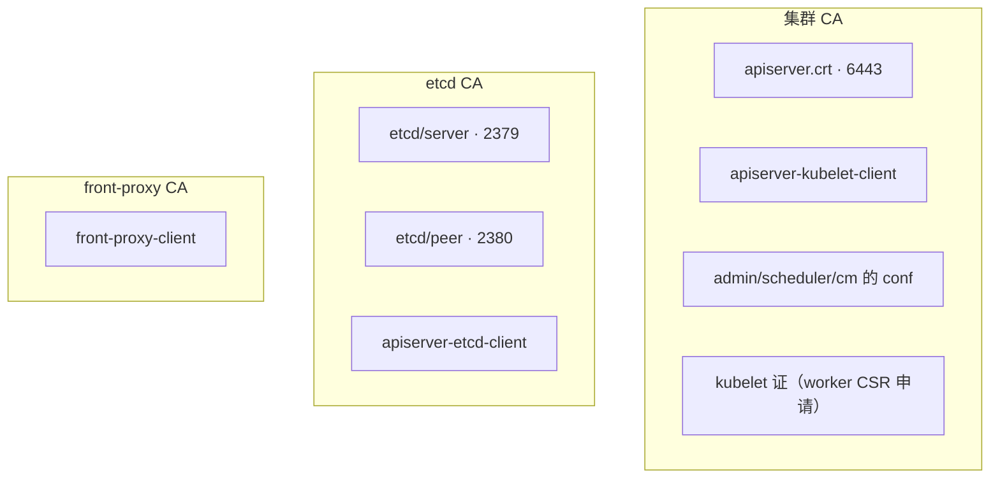
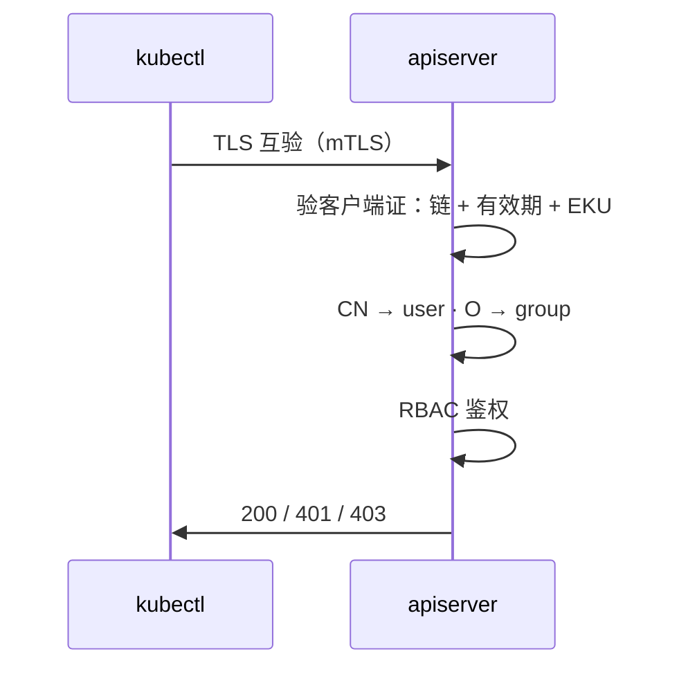

# 14｜证书与 kubeconfig · 练习题

先合上知识点，对着 **一节的主图** 把「一张证书的一生」口述一遍，再来做题。

| 标记 | 含义 |
|------|------|
| **核心** | 不懂整章就没建立起来 |
| **必会** | 值班和面试都要能讲 |
| **常用** | 线上会反复碰到 |
| **常考** | 白板和追问的高频口径 |

## 本题目录

- [Q1 K8s 有几套 CA](#q1)
- [Q2 白板证书链：谁签谁](#q2)
- [Q3 kubeconfig 三块](#q3)
- [Q4 多集群管理与长期凭据风险](#q4)
- [Q5 client cert auth 流程](#q5)
- [Q6 admin 过期 vs apiserver 过期](#q6)
- [Q7 etcd peer vs client 证过期](#q7)
- [Q8 kubelet 证与 NotReady](#q8)
- [Q9 renew 后仍报错](#q9)
- [Q10 openssl 排障](#q10)
- [Q11 SAN 与 LB 接入](#q11)
- [Q12 认证 401 vs 鉴权 403](#q12)
- [Q13 活动高峰证书告警](#q13)
- [Q14 60 秒证书定责](#q14)
- [合上书](#合上书)

---

## Q1

**★★★★★｜Kubernetes 集群里到底有几套 CA？各管什么？**

**覆盖**：核心 · 必会 · 常考 ｜ **对应**：知识点 [二、出生：kubeadm init 与 PKI 树](知识点.md)

### 场景

新人说「所有组件都用 `/etc/kubernetes/pki/ca.crt` 连 etcd」，准备把 etcd 的客户端 CA 改成集群 CA「统一管理」。

### 完整解答

> 🎯 **一句话**：至少 **三套 X.509 CA**——集群 CA、etcd CA、front-proxy CA；另有 **sa.key** 签 SA JWT，不是 X.509。

```text
集群 CA（pki/ca.crt）      → apiserver.crt、apiserver-kubelet-client、
                             admin/controller-manager/scheduler.conf、kubelet 证（经 CSR）
etcd CA（pki/etcd/ca.crt） → etcd server/peer/healthcheck，外加 apiserver-etcd-client
front-proxy CA             → front-proxy-client（聚合层：metrics-server 等）
sa.key                     → ServiceAccount Token（JWT），走另一条认证链
```

> ⚠️ **别混**：拿集群 CA 手工签一张证去连 2379 必失败——etcd 只信 **etcd CA**（链 [02](../02-etcd/)）。「统一管理」成一套 CA 等于把爆炸半径也统一了。

> 📝 **面试**：三套 CA 名 + 各管什么各一句；补「`sa.key` 签 JWT，不是 X.509 CA，但同住 `pki/` 目录」。

### 再追问

**CA 私钥（`ca.key`）丢了怎么办？**——无法再签发任何新证，`renew` 也救不了；只能从备份恢复整个 `pki` 或重建集群。**不要**指望 `kubeadm certs renew` 救场。

---

## Q2

**★★★★★｜白板上画出集群的 PKI 证书链：谁签谁？**

**覆盖**：核心 · 必会 · 常考 ｜ **对应**：知识点 [三、签发：谁签谁（证书链）](知识点.md)

### 场景

终面：「从 `kubeadm init` 开始，把每张证书谁签的画出来，再说 kubectl 用的是哪张证。」

### 完整解答

> 🎯 **一句话**：三个根三棵子树——集群 CA、etcd CA、front-proxy CA 各签各的；`apiserver-etcd-client` 是唯一「跨域打工者」，挂在 etcd CA 下。



**读图**：先画三个根再挂子树；kubectl 出示的是 `admin.conf` 里的 client 证（集群 CA 子树），验证的 `apiserver.crt` 也在同一子树。Worker 的 kubelet 证不是 init 发的，是 join 时走 CSR 由集群 CA 现签。

> 📝 **面试**：画完补两句——「etcd CA 独立是为了信任域隔离；`apiserver-etcd-client` 归 etcd CA 签」。

### 再追问

**为什么 etcd 要单独一套 CA？**——信任域与爆炸半径隔离：集群 CA 泄漏不直接等于能读写 etcd；外置 etcd 场景也天然解耦。**不要把三套 CA 合并「省事」**。

---

## Q3

**★★★★★｜kubeconfig 里 clusters、users、contexts 分别是什么？**

**覆盖**：核心 · 必会 · 常考 ｜ **对应**：知识点 [四、出示：kubeconfig 三块与多集群管理](知识点.md)

### 场景

运维把三套集群的 `admin.conf` 合并成一个文件，但 `kubectl` 总连错环境，删错了 Deployment。

### 完整解答

> 🎯 **一句话**：**clusters** = 连哪（server + 信任哪张 CA）；**users** = 你是谁（client 证/token）；**contexts** = cluster + user + 默认 ns 的绑定；**current-context** 决定默认用哪条。

```bash
kubectl config get-contexts
# CURRENT   NAME            CLUSTER      AUTHINFO    NAMESPACE
# *         prod-admin      prod         admin       kube-system   # ← 星号在谁身上，默认命令就打谁
#           staging-admin   staging      admin
kubectl config use-context staging-admin   # 切默认
kubectl config view --minify --raw         # 只看当前 context 展开后的有效配置
```

> 📝 **面试**：三块 + `current-context` 一句带过；补「多集群用多 context 管理，不要靠手改 server 地址凑合」。

### 再追问

**KUBECONFIG 环境变量怎么合并多文件？**——用 `:` 拼接（Windows 用 `;`），同名条目**后者覆盖前者**；`--kubeconfig` 命令行指定优先级最高。**不要**把 prod/staging 混在一个没有 context 命名规范的裸文件里。

---

## Q4

**★★★★☆｜一台笔记本管 prod/staging/dev，怎么避免误删 prod？顺便说说长期凭据的风险。**

**覆盖**：必会 · 常用 · 常考 ｜ **对应**：知识点 [四、出示：kubeconfig 三块与多集群管理](知识点.md)

### 场景

工程师在 staging 测完忘了切 context，把 prod 的 Deployment 删了；复盘又发现 CI 一直用 `admin.conf`，还提交进了 Git。

### 完整解答

> 🎯 **一句话**：分 context + 提示符显示当前集群 + 危险命令前确认 `current-context`；CI 用独立 SA + 最小 Role + 短期令牌，**永远不发 admin 证**。

```bash
kubectl config current-context                    # 危险命令前先看这一行
kubectl config use-context staging-admin
kubectl config set-context prod-admin --namespace=kube-system   # 限定默认 ns
kubectl get pods --context=prod-admin             # 单条命令临时指定，不改默认
# 可选：kubectx / shell prompt 插件把当前集群打进 PS1
```

**长期凭据的风险**：`admin.conf` = `O=system:masters`，一年有效、权限封顶，泄漏即集群裸奔；1.24 之前的 SA Token 永不过期，泄漏后永久有效（1.24 起默认 `TokenRequest` 短期令牌，~1h）。给 CI 的正确姿势：独立 ServiceAccount + 最小 Role + 短期令牌或 OIDC（链 [13](../13-RBAC与安全/)）。

> ⚠️ **别混**：**不要**把不同环境的 admin.conf 合并成一个 users 块乱命名的文件——误操作不是手滑，是结构没防住。

### 再追问

**admin.conf 已经进了 Git 怎么办？**——按泄漏处理：K8s 默认没有 X.509 吊销表，最稳是轮换（重签证书甚至重建 CA）+ 审计日志查滥用；至少先把它从仓库和 CI 里清掉、换发新证。**不要**只删 Git 记录就完事。

---

## Q5

**★★★★★｜讲讲 API Server 的 client certificate 认证怎么走？和 RBAC 什么关系？**

**覆盖**：核心 · 必会 · 常考 ｜ **对应**：知识点 [五、干活：一次验票](知识点.md)

### 场景

面试官问：「证书认证过了，是不是就能删任意 Pod？」

### 完整解答

> 🎯 **一句话**：先过四道门——链信任 → 未过期 → 用途匹配（EKU/SAN）→ CN/O 映射成 user/group；**然后才轮到 RBAC** 决定你能干什么，除非 `O=system:masters`。



CN/O 是客户端证书字段：`admin.conf` 的 `O=system:masters` 命中内置超权组、绕过 RBAC；普通证必须在 RBAC 里有 Binding。

> ⚠️ **别混**：**认证**（你是谁，401/TLS）在前，**鉴权**（你能干什么，403）在后——链 [13](../13-RBAC与安全/)。

> 📝 **面试**：四道门按「信不信 → 过没过期 → 用途对不对 → 映射成谁」背，结尾补「除非 system:masters」。

### 再追问

**ServiceAccount Token 走哪条路？**——JWT + `sa.key` 验签，同一个认证入口但**不是** X.509 client cert（链 [03](../03-API-Server/)）。

---

## Q6

**★★★★★｜admin.conf 过期和 apiserver.crt 过期，影响一样吗？**

**覆盖**：核心 · 必会 · 常考 ｜ **对应**：知识点 [六、老去：证书过期时集群会怎样](知识点.md)

### 场景

凌晨告警：`kubectl` 全挂，监控显示 API Pod 还 Running，玩家业务正常，有人准备重启战斗服。

### 完整解答

> 🎯 **一句话**：**admin.conf 过期**只杀运维/CI 的 kubectl；**apiserver.crt 过期**让**所有** 6443 TLS 失败（含控制器、kubelet 心跳），变更全面冻结。

| 对比 | admin.conf 过期 | apiserver.crt 过期 |
|------|-----------------|---------------------|
| API 进程 | 正常 | 进程在，但握手全失败 |
| 已运行 Pod | 照常跑 | 照常跑（容器不依赖 6443） |
| 变更/调度 | 用别的证的组件可能还正常 | 全面停摆，节点陆续 NotReady |

```bash
kubeadm certs check-expiration | grep -E 'admin|apiserver'
# ← 看谁的 RESIDUAL 先到 0，定责就定谁
```

> 📝 **面试**：「玩家还在、kubectl 全挂」= 控制面 TLS 问题，先别碰业务（链 [01](../01-集群架构/)）。

### 再追问

**`check-expiration` 显示还剩 200 天，握手却报 expired？**——有人改快了系统时间（或快照恢复后时钟漂移）：TLS 用本机时钟判过期。先 `chronyc sources` 校时，**别急着 renew**；时钟调慢则报 `certificate is not yet valid`。

---

## Q7

**★★★★☆｜etcd peer 证过期和 apiserver-etcd-client 过期，症状怎么分？**

**覆盖**：必会 · 常考 ｜ **对应**：知识点 [六、老去：证书过期时集群会怎样](知识点.md)

### 场景

`kubectl` 超时，`etcdctl endpoint health` 报 TLS 错，`endpoint status` 里 IS LEADER 全 false。

### 完整解答

> 🎯 **一句话**：**peer 证（2380）过期** → 成员互不信任、Raft **无 Leader**；**apiserver-etcd-client 过期** → etcd 自己可能还有 Leader，但 API 的 readyz etcd 项失败、**变更停摆**。

```bash
kubeadm certs renew etcd-peer etcd-server etcd-healthcheck-client apiserver-etcd-client
crictl pods --name etcd -q | xargs -r crictl rmp -f    # 逐台！保 quorum
crictl pods --name kube-apiserver -q | xargs -r crictl rmp -f
```

链 [02](../02-etcd/)：peer 问题先救 quorum——**不要**三台一起 reset。

> 📝 **面试**：peer = 内部拆伙（无 Leader）；client = API 的写路径断（readyz 红）。

### 再追问

**只在一台控制面 renew 行吗？**——不行：证书文件每台本地一份，**每台都要 renew**；且 etcd 要**逐台**重启，三台同时重启 = quorum 和 6443 同一秒闪断。

---

## Q8

**★★★★☆｜节点 NotReady，kubelet 日志里 x509 expired，你怎么救？**

**覆盖**：必会 · 常用 ｜ **对应**：知识点 [七、续命：续期与轮转](知识点.md)

### 场景

发版后一个 AZ 里 20 台 Worker 变 NotReady，apiserver 正常，有人准备批量驱逐。

### 完整解答

> 🎯 **一句话**：查 **kubelet client/server 证**——默认 `--rotate-certificates=true` 会自动走 CSR 换新；救急 `systemctl restart kubelet`，**不要**先 drain。

```bash
journalctl -u kubelet --since "30 min ago" | grep -iE "certificate|x509|expired"
openssl x509 -in /var/lib/kubelet/pki/kubelet-client-current.pem -noout -dates
# notAfter=...   # ← 过了 = kubelet client 证过期 → NotReady
systemctl restart kubelet
kubectl get node {name}   # 等几十秒看回 Ready
```

> ⚠️ **别混**：**不要**先 `kubectl drain`——证过期窗口里调度本来就异常，驱逐只会把 Pod 赶到别的节点上堆着。

### 再追问

**`kubectl logs` 也失败？**——可能 **kubelet server 证**（10250）也过期；同时查 `apiserver-kubelet-client`。**bootstrap token 过期**只影响新节点 join，不影响这些已在册节点——别搞混救治对象。

---

## Q9

**★★★★★｜跑了 kubeadm certs renew 之后 kubectl 仍报 certificate has expired，为什么？**

**覆盖**：核心 · 必会 · 常用 ｜ **对应**：知识点 [七、续命：续期与轮转](知识点.md)

### 场景

On-call 跑了 `kubeadm certs renew all`，没重启任何东西就去睡觉，半小时后又被叫醒。

### 完整解答

> 🎯 **一句话**：renew 只换**磁盘上的 pem**；静态 Pod 进程启动时加载证书、之后不看文件——**必须重启**，还要换新 kubeconfig。

```bash
kubeadm certs check-expiration   # 先确认 renew 真的生效了
crictl pods --name kube-apiserver -q | xargs -r crictl rmp -f
crictl pods --name etcd -q | xargs -r crictl rmp -f     # 逐台，保 quorum
cp /etc/kubernetes/admin.conf ~/.kube/config            # 分发：本地还是旧证也会报 expired
openssl x509 -in /etc/kubernetes/pki/apiserver.crt -noout -dates   # 验证新 notAfter
```

> ⚠️ **别混**：反复 `renew` 不重启 = 磁盘一堆新证、内存全是旧证，报错一个字不变。

> 📝 **面试**：renew 三步——renew → **重启静态 Pod**（apiserver/cm/scheduler/etcd）→ 分发新 kubeconfig；只做第一步等于没做。

### 再追问

**哪些进程要重启？**——`apiserver`/`controller-manager`/`scheduler`/`etcd` 都是静态 Pod，各重启各的；**kubelet 例外**，轮转的证进程内热加载，只有救急才 `systemctl restart kubelet`。

---

## Q10

**★★★★☆｜不用 kubectl，怎么确认 6443 服务端证是否过期？证钥不配对怎么查？**

**覆盖**：常用 · 必会 ｜ **对应**：知识点 [五、干活：一次验票](知识点.md)

### 场景

LB 健康检查失败，开发坚持是「网络问题」；另一台机器换完证书后握手报 `tls: bad certificate`。

### 完整解答

> 🎯 **一句话**：`openssl s_client` 直连 VIP:6443 看 **notAfter** 和 **SAN**；`modulus` MD5 对一对证钥是不是原配。

```bash
openssl s_client -connect 10.0.1.100:6443 -showcerts </dev/null 2>/dev/null \
  | openssl x509 -noout -dates -subject -ext subjectAltName
```

```text
notAfter=Sep  1 02:10:00 2026 GMT    # ← 已过 = apiserver 服务端证过期
subject=CN = kube-apiserver
X509v3 Subject Alternative Name:
    DNS:kubernetes.default.svc.cluster.local, IP Address:10.0.1.11
# ← SAN 里没有正在连的 VIP？那是另一类错：valid for ... not ...
```

```bash
openssl x509 -noout -modulus -in apiserver.crt | openssl md5
openssl rsa  -noout -modulus -in apiserver.key  | openssl md5
# 两行 MD5 须一致 ← 不同 = 装错 key，握手必挂
```

### 再追问

**notAfter 正常但仍失败？**——查**客户端证**（你 kubeconfig 里那张）或 LB 后端各节点证书不一致；还有一招是时钟被改（六节）。**不要**用 `curl -k` 当结论，它只是跳过了服务端校验。

---

## Q11

**★★★☆☆｜新上了 API LB VIP，kubectl 报 certificate is valid for ... not ...**

**覆盖**：常考 ｜ **对应**：知识点 [二、出生：kubeadm init 与 PKI 树](知识点.md)

### 场景

把 `server: https://10.0.1.200:6443`（新 LB）写进 kubeconfig，证书 SAN 里只有各控制面节点 IP。

### 完整解答

> 🎯 **一句话**：**SAN 是证书上允许的 DNS/IP 清单**——新入口必须写进 `apiServer.certSANs` 并**重签 apiserver 证**，只改地址不改证照样挂。

```bash
# kubeadm-config.yaml 的 apiServer.certSANs 加上 VIP 后：
kubeadm init phase certs apiserver --config=/etc/kubernetes/kubeadm-config.yaml
crictl pods --name kube-apiserver -q | xargs -r crictl rmp -f
openssl s_client -connect 10.0.1.200:6443 </dev/null 2>/dev/null \
  | openssl x509 -noout -ext subjectAltName   # ← 确认 VIP 已在新证 SAN 里
```

> 📝 **面试**：SAN = 允许的访问地址清单；「装集群时就写满」比事后重签便宜得多。

### 再追问

**临时 `--insecure-skip-tls-verify` / `-k` 绕过行吗？**——只限本地调试；生产用它等于把门拆了，**不能**当修法。

---

## Q12

**★★★★☆｜用户说「证书过期所以 403 Forbidden」，对吗？**

**覆盖**：必会 · 常考 ｜ **对应**：知识点 [五、干活：一次验票](知识点.md)

### 场景

CI Job 报 `Forbidden`，开发的结论是「证书该续费了」，准备跑 `kubeadm certs renew`。

### 完整解答

> 🎯 **一句话**：不对——**403 是鉴权（RBAC）失败**；证书过期死在 **TLS/x509 层**，通常连 403 都到不了。

```bash
kubectl auth can-i create deployments --as=system:serviceaccount:ci:deployer -n prod
# no   # ← RBAC 缺 Binding，不是 renew 能解决的（链 13）
```

分层记：**握手报错/401** = 认证（证过期、CA 不对、没出示证）；**403** = 认证过了但没权。

> ⚠️ **别混**：renew 救不了 403——除非你 renew 后分发的是**错集群**的 kubeconfig，那是另一回事。

### 再追问

**401 和 403 一句话怎么分？**——401「我不认识你」（认证失败，含 TLS 层）；403「认识你，但你不能干这个」（鉴权失败）。**admin.conf 能绕过 403 吗？**——`system:masters` 绕过 RBAC，普通 CI 证不行，也别为此给 CI 发 admin。

---

## Q13

**★★★★★｜活动高峰收到证书告警，你能重启业务 Pod 吗？**

**覆盖**：核心 · 必会 ｜ **对应**：知识点 [八、作战：定责](知识点.md)

### 场景

公会战期间 P1：`certificate will expire in 3 days`，有人提议 `kubectl rollout restart` 全部战斗服「先预防一下」。

### 完整解答

> 🎯 **一句话**：**不要**——证书过期影响的是**控制面变更能力**，不会立刻杀玩家进程；排维护窗做 renew + 重启静态 Pod，业务 Pod 一个不动。

```bash
kubeadm certs check-expiration
# ← 确认哪张证、还剩几天；<14d 按 P1 排窗口
# 窗口内：renew all → 逐台重启 apiserver/etcd → 验证 → 分发 kubeconfig
```

真到已过期：`renew all` → 重启控制面静态 Pod——**仍然不要**碰业务节点，更**不要** `kubeadm reset`。

> 📝 **面试**：「玩家还在、kubectl 挂」先说清「容器还在跑、冻结的是变更」，这个判断本身就是得分点（链 [01](../01-集群架构/)）。

### 再追问

**3 天告警要不要立刻当场 renew？**——要排**维护窗**做（renew + 重启静态 Pod 有秒级闪断）；高峰当场动手是把可控变更变成赌博。

---

## Q14

**★★★★★｜60 秒：全集群 kubectl 报 x509 expired，值班怎么救？**

**覆盖**：核心 · 必会 · 常用 ｜ **对应**：知识点 [八、作战：定责](知识点.md)

### 场景

On-call 被叫醒，手机全是 `Unable to connect: x509: certificate has expired`，群里已经有人敲了一半 `kubeadm reset`。

### 完整解答

> 🎯 **一句话**：**check-expiration → renew 目标证 → 重启静态 Pod → 验证 → 分发 kubeconfig**；全程不 reset。

```text
0–10s   定范围：只有值班挂，还是 CI/控制器全挂？
        openssl s_client -connect <VIP>:6443 … -noout -dates
10–30s  SSH 控制面：kubeadm certs check-expiration，圈出 RESIDUAL 最短的
30–45s  定型：只有 admin → renew conf + 分发；
        apiserver/etcd → renew + 安排逐台重启静态 Pod
45–60s  重启 → kubectl get nodes 验证 → 分发新 kubeconfig → <14d 项挂监控
```


> 📝 **面试**：两个「不要」抢着说——**不要 `kubeadm reset`**（信任链问题不是数据问题）；**renew 不重启 = 白做**。

### 再追问

**SSH 都进不去怎么办？**——带外 / console 进控制面；若 `check-expiration` 健康但握手仍 expired，怀疑**时钟被改快**（六节），先校时。**不要**对着 LB 反复重试当诊断。

---

## 合上书

- [ ] **默画**一节主图：出生 → 签发 → 出示 → 验票 → 老去 → 续命，每段对应哪类证书、哪个命令。
- [ ] 口述 **三套 CA** 各管什么；`sa.key` 为什么不算 X.509 CA。
- [ ] **默画证书链**：每张证挂哪个 CA——说清 `apiserver-etcd-client` 为什么在 etcd CA 下。
- [ ] **kubeconfig** clusters/users/contexts/current-context；KUBECONFIG 多文件合并规则。
- [ ] 背 **验票四道门** + CN/O 映射；`system:masters` 例外；认证 401 与鉴权 403 的分界（链 13）。
- [ ] 对表说出 **admin / apiserver / etcd peer / kubelet** 四种过期各自「什么还在、什么停了」。
- [ ] **时钟骗局**：`check-expiration` 健康但握手 expired，先校时再说话。
- [ ] 背 **renew 三步**：`check-expiration` → `renew all` → **重启静态 Pod + 分发 kubeconfig**；只续不启 = 白续。
- [ ] **openssl 两条**：`s_client` 看服务端 `notAfter` 与 SAN；`modulus` MD5 验证钥配对。
- [ ] 说出 **SAN** 是什么、为什么新增 LB 入口必须重签证书。
- [ ] 口述 **多集群纪律** 与 **长期凭据风险**：为什么 admin 证不进 CI。
- [ ] 边界：etcd Raft 与备份 → 链 [02](../02-etcd/)；API 认证链全貌 → 链 [03](../03-API-Server/)；RBAC 与 403 → 链 [13](../13-RBAC与安全/)。
