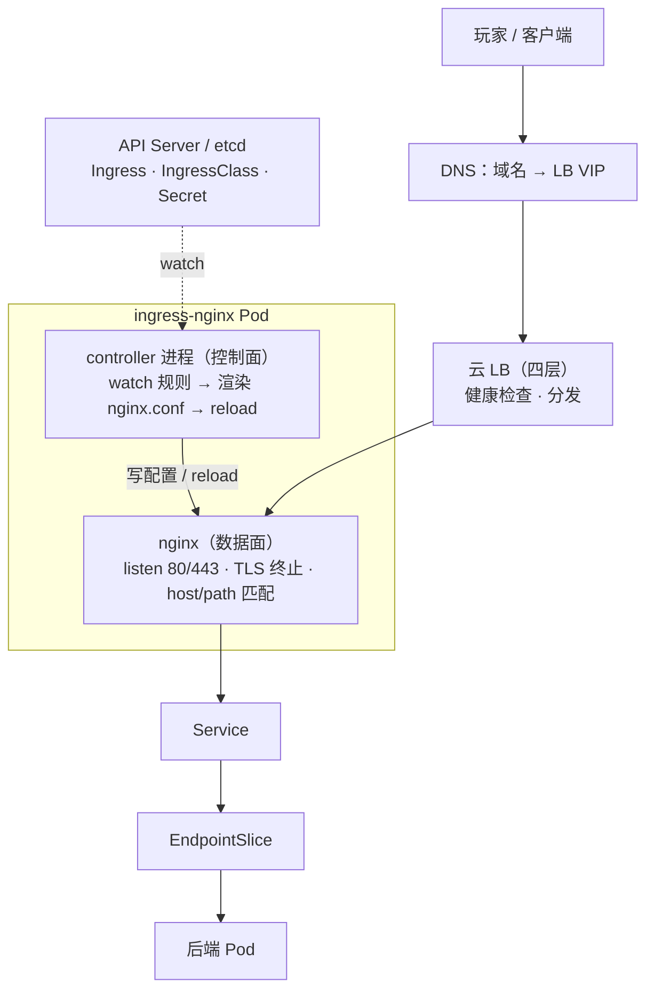
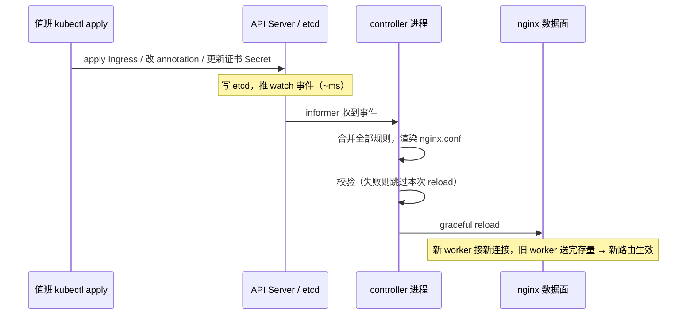
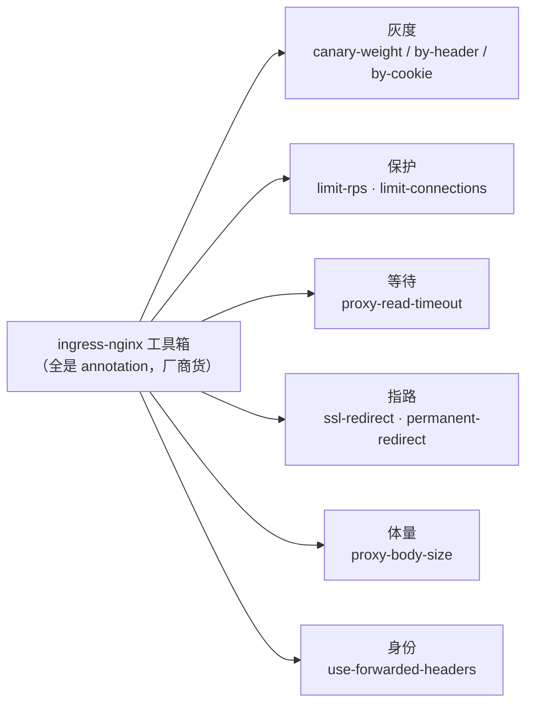
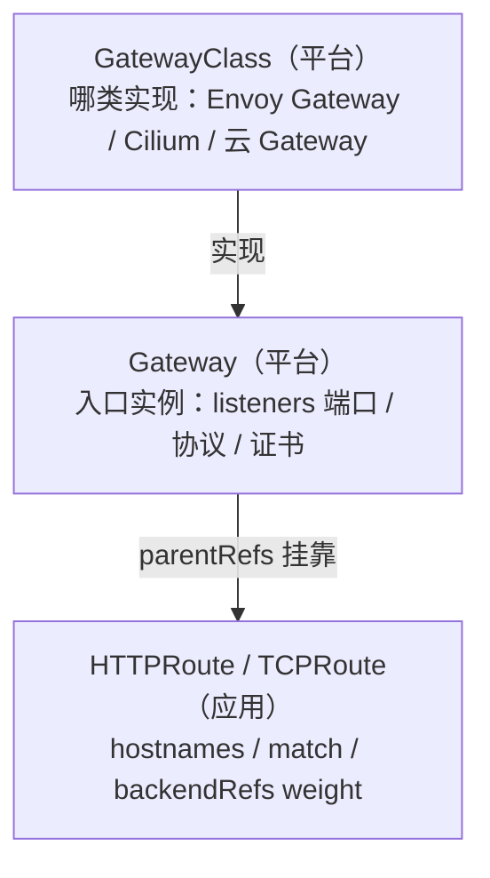
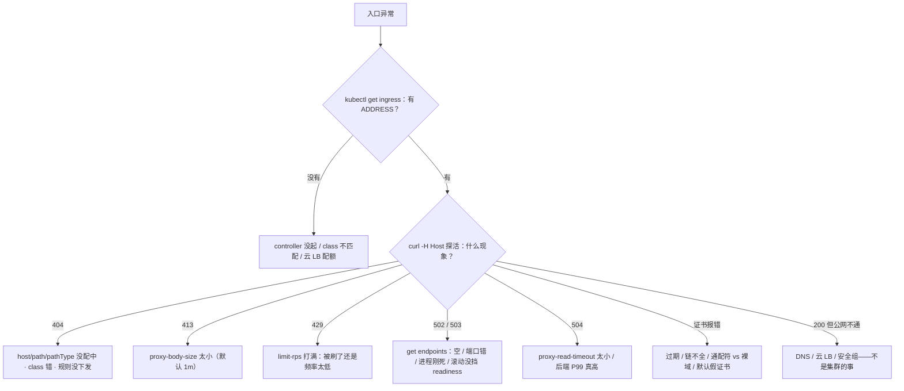

# Ingress 与流量管理

> 凌晨官网、活动页、支付回调挂在同一个 ingress 上——证书过期三天没人告警；有人改条路由注解救场全站 404；还有人提议把所有 ingress-nginx 重启一遍「让它生效」。手都别动。
> **本章回答**：一次外部请求的一生——从 LB 进集群，谁把规则翻译成配置，证书在哪验，每一段会坏在哪。
> **不讲**：Service / Endpoints / kube-proxy → [08](../08-Service与kube-proxy/)；发布期金丝雀推进与回滚 RTO → [16](../16-灰度与回滚/)；TLS 握手与证书链原理 → [01-14](../../01-基础底座/14-HTTP与TLS/)；Mesh sidecar → [24](../24-ServiceMesh-Istio与Envoy/)。

**标记**：🎯重点 · 🔥难点 · ⭐常考 · 🔧实操

---

## 一、一张图：一次外部请求的一生

> 🎯 **一句话**：请求走一条线，规则走另一条线——排障先问坏了哪条。口诀：⭐ **404 查规则，502 查 Endpoints**。



- 📖 **读图**
  - 🛤️ **实线 = 转发线**：玩家包从 DNS → LB → nginx → Service → Pod，每一跳有自己的坏法
  - 📜 **虚线 = 下发线**：规则躺在 etcd 不转发任何一个包；要等 controller watch → 渲染 → reload 才算数
  - 🔀 转发线坏 → 404/5xx；下发线坏 →「规则在、不生效」。重启是全量重同步，更慢还断长连接

本节对应练习题 Q1、Q14。

---

## 二、进门：ingress-nginx 架构

> 🎯 **一句话**：Ingress 是路牌，ingress-nginx 才是司机；司机还分看路的和开车的。

### 🪧 规则不是执行者 ⭐

- **Ingress** = etcd 里的一段 YAML：声明「哪个 host / path 转给哪个 Service」，本身**不听端口、不转发包**
- **Ingress Controller** = 真正 listen 80/443、终止 TLS、转发的反向代理。常见：**ingress-nginx**（注解最多）、云 ALB Ingress、APISIX / Kong
- 🔑 **为什么要这一层**：一个 LB 入口按域名/路径分给几十个 Service，比每服务一个云 LB 便宜；证书和域名收口
- 对比 NodePort：四层、每服务占端口、无 Host/Path 路由，安全组难收口

#### ❓ 为什么 apply 了 Ingress 浏览器还打不开？

- ❌ 「对象在 etcd = 流量该通」——中间隔着 Controller、`ingressClassName`、reload 三件事
- ✅ 没有 Controller，apply 一百条也没有流量效果
- ⚠️ **别混**：Ingress 对象 ≠ ingress-nginx。`kubectl get ingress` 有条目 ≠ 域名能访问

### 🎛️ 控制面与数据面：同一个 Pod，两条命 🔥

> 💡 **打个比方**：controller 是调度室，把路牌翻译成导航；nginx 是司机，只认手里那份导航。调度室失联，司机照样按最后一份开——**存量不断，新路线进不来**。

ingress-nginx Pod 里两个角色：

- **controller 进程**（控制面，Go）：informer watch Ingress / Service / EndpointSlice / Secret → 合并规则 → 模板渲染 nginx.conf → 校验 → reload
- **nginx**（数据面，master + worker）：拿着这份配置干活

#### ❓ 为什么「controller 挂了」不等于全站断流？

分三档说——高频面试 ⭐：

- 🔌 **API Server 不可达 / watch 断**：数据面拿最后一份 nginx.conf 继续转；坏的是**变更能力**（新 Ingress / 证书 / 注解不生效），不是转发能力
- 💀 **controller 进程死、nginx 还活**：同上，配置冻结、入口继续转
- 🪦 **整个 Pod 没了**：这个实例转发也断——靠**副本 ≥2 + PDB** + 云 LB 健康检查摘除

所以「API Server 升级期间入口没事、新路由半天不生效」别急着重启——重启是**全量重新同步**，下发更慢，还掐长连接（七节）。

- 🏗️ **部署形态**
  - 云上常见：Deployment + Service `type=LoadBalancer`
  - 裸金属：DaemonSet + hostNetwork，或 NodePort + 外部 LB；入口节点池与游戏进程池分开，避免抢 80/443
  - 底线：副本 ≥2 + PDB + 反亲和；每条 Ingress **显式**写 `ingressClassName`
  - 超时 / `proxy-body-size` 按上传与后端 P99 设；攻击防护交给云 WAF / APISIX，`proxy-body-size` 只是体量控制
- 🧭 **`externalTrafficPolicy`**：`Local` 保留真实源 IP（风控常要），流量只去有 Pod 的节点；`Cluster` 更均但源 IP 变节点 IP。六节还有 X-Forwarded-For 另一条路

> 🔍 **现场**：新入口上线四项全过才算——「apply 成功」不在验收清单。

```bash
kubectl get pods -n ingress-nginx                          # ← 副本全 Ready
kubectl get ingress hall -n prod                           # ← ADDRESS 有值 = 有人认领
curl -kv -H "Host: hall.example.com" http://<LB-IP>/       # ← 带 Host 探活
openssl s_client -connect hall.example.com:443 -servername hall.example.com </dev/null 2>/dev/null | openssl x509 -noout -dates
```

### 🏷️ IngressClass：谁认领这条规则 ⭐

- **IngressClass** = 「哪个 Controller 认领哪条 Ingress」
- Ingress 写 `spec.ingressClassName: nginx`，controller 名字对上才处理；多 Controller 同集群共存靠它
- 老注解 `kubernetes.io/ingress.class` 已废弃

忘写 `ingressClassName` 的两种死法：

- 有默认 class（注解 `ingressclass.kubernetes.io/is-default-class: "true"`）→ 被**悄悄抢走**
- 没有默认 → **谁都不认**，ADDRESS 列永远空

```bash
kubectl get pods -n ingress-nginx -o wide
# ingress-nginx-controller-7d9b5f6c4-x2k9p   1/1     Running   0   node-3   # ← Ready=1/1

kubectl get ingressclass
# NAME    CONTROLLER             PARAMETERS   AGE
# nginx   k8s.io/ingress-nginx   <none>       90d    # ← CONTROLLER = 实现；看有没有 default
```

> 📝 **面试**：「ingress controller 挂了流量会断吗？」——先拆控制面/数据面：数据面只依赖最后一份 nginx.conf，API 断连或 controller 进程挂只坏**变更能力**；Pod 整个没了才断流量，靠 ≥2 副本 + PDB + LB 健康检查。

本节对应练习题 Q1、Q3。

---

## 三、下发规则：从 kubectl apply 到 nginx reload

> 🎯 **一句话**：一条规则要过 apply → watch → 渲染 → 校验 → reload 五关，卡在哪都是「配置不生效」。

开篇有人要重启全部 ingress-nginx「让它生效」——⭐ 高频错答。先看下发链：



- 📖 **读图**
  - 从 apply 那根箭头进：事件不来（watch 断）、渲染失败、校验不过、reload 没执行——各有卡法
  - 整条链正常 **1~2s**；「改了几分钟还不生效」一定卡在某一关，不是「还在路上」

### 🔄 两个关键机制

- **graceful reload**：master 用新配置起新 worker；旧 worker 不接新连、送完存量后退出 →「改配置不停服」成立，但旧 worker 退出时限到的**长连接会被掐**（七节伏笔）
- **免 reload 边界**：后端 endpoint 变化走内嵌 Lua **动态更新，不 reload**；新增 host/path、改注解、换证书才 reload → 滚后端不刷入口，改路由才会

#### ❓ 为什么一条坏 Ingress 能卡住全站下发？🔥

- 🔥 ingress-nginx 把**所有**认领规则合并成**一份**配置、整体校验后下发
- ❌ 一条写坏的 Ingress → 整份校验失败 → **从此所有规则变更都下不出去**，直到删掉那条坏的
- ✅ **admission webhook 必须开**：坏配置在 `kubectl apply` 被 API Server 挡回，进不了 etcd，全局下发不受牵连
- 生产不开 webhook = 任何有 ingress 写权限的人握着全站入口开关

```bash
kubectl get validatingwebhookconfigurations | grep ingress
# ingress-nginx-admission   5   90d   # ← 没有这一行 = 坏规则能进 etcd
```

#### ❓ 为什么配置不生效不能先重启？

- 重启 = **全量重新同步**（大集群几百条 Ingress 要几十秒）+ 顺手掐长连接
- ✅ 第一刀看 controller 日志，不是怀疑 etcd，更不是重启

> 🔍 **现场**：「配置不生效」看日志。

```bash
kubectl logs -n ingress-nginx deploy/ingress-nginx-controller --tail=50 | grep -iE 'sync|reload|error|warn'
# I0901 10:23:11.52 7 controller.go:162] "Syncing Ingress" ingress="prod/hall"    # ← watch 收到了
# I0901 10:23:11.84 7 controller.go:301] "Backend successfully updated"            # ← 已下发
# E0901 10:24:02.11 7 controller.go:289] "Unexpected error ... template ..."       # ← E/W = 卡住
```

下发慢常见原因：controller 刚重启在全量同步；API Server 限流（[03](../03-API-Server/)）或 watch 抖动；webhook 卡住、Ingress 总量太大。先忍一分钟看日志。

> 🔍 **现场**：终判——进 Pod 看实际渲染的 nginx.conf。

```bash
kubectl exec -n ingress-nginx deploy/ingress-nginx-controller -- nginx -T 2>/dev/null | grep -A5 'server_name hall'
# server_name hall.example.com;        # ← host 在不在
# location /api { proxy_pass http://prod/hall-svc; }   # ← path → backend
# ← 没有这段 = 规则没渲染进来，回下发链

kubectl ingress-nginx ingresses -n prod
# NAMESPACE   INGRESS   CLASS   HOSTS               ADDRESS    TLSCERTIFICATE
# prod        hall      nginx   hall.example.com     10.0.1.50  example-com-tls

kubectl exec -n ingress-nginx deploy/ingress-nginx-controller -- nginx -T 2>/dev/null | grep -iE 'limit_rps|proxy_read_timeout|canary'
# ← grep 不到 = 注解没渲染 = 写错了或 class 不对（注解静默不生效，六节）
```

本节对应练习题 Q2。

---

## 四、匹配：host、path 与后端

> 🎯 **一句话**：先配 host、再配 path、最后按 backend 找 Service；配不中 404，配中了没人 502。

### 🎯 三关匹配 ⭐

请求进了 nginx：

1. **Host 头** → 找到对应 rules
2. **path + pathType** → 找到 backend
3. **Service 名 + 端口** → 必须和 Service port 对上，对不上立刻 502/503

`pathType` 三种：

- `Prefix`：`/api` 吃 `/api`、`/api/x`，按 `/` 分段，**不吃** `/apix`
- `Exact`：精确相等
- `ImplementationSpecific`：交给实现，不可移植，别写

`/` + `Prefix` 吃下所有路径；多条 path 时 nginx **最长前缀优先**——`/api` 与 `/api/v2` 同在，`/api/v2/login` 去后者。

```yaml
spec:
  ingressClassName: nginx                # ← 谁认领（二节）
  rules:
  - host: hall.example.com               # ← 第一关
    http:
      paths:
      - path: /api
        pathType: Prefix                 # ← 第二关
        backend:
          service: { name: api-svc, port: { number: 80 } }   # ← 第三关
      - path: /
        pathType: Prefix
        backend:
          service: { name: web-svc, port: { number: 80 } }
```

- 没命中任何规则 → **default backend**（404 页）
- 没命中任何证书 → 默认假证书（CN=`Kubernetes Ingress Controller Fake Certificate`）→ 浏览器「不可信」

#### ❓ 为什么 404 和 502 第一刀完全相反？

> ⚠️ **别混**：⭐ **404 查规则，502 查 Endpoints**——两个码第一刀方向相反，搞反白忙十分钟。

- 🔴 **404** = 入口问题：host / path / pathType / class 没配中，或规则没下发 → 查 Ingress / 下发日志
- 🟠 **502/503** = 后端问题：规则配中了但后面没人（Endpoints 空、端口错、进程刚死、滚动没挡 readiness）→ 第一刀 `kubectl get endpoints`（[08](../08-Service与kube-proxy/)）

> 🔍 **现场**：一条 Ingress 配没配通，三连看。

```bash
kubectl get ingress -n prod
# NAME   CLASS   HOSTS             ADDRESS     PORTS     AGE
# hall   nginx   hall.example.com  10.0.1.50   80, 443   12d
# pay    nginx   pay.example.com                 80, 443   3m   # ← ADDRESS 空 = 没人认领

kubectl describe ingress hall -n prod
# Address:          10.0.1.50
# Rules:
#   Host             Path  Backends
#   hall.example.com /
#                    hall-svc:80 (10.244.1.12:8080,...)   # ← 有 Pod IP 才叫有后端
#                    <none>                              # ← Endpoints 空 → 502/503
```

带 Host 探活，把 DNS / 云 LB 撇开：

```bash
curl -H "Host: hall.example.com" http://10.0.1.50/ -v -o /dev/null
# < HTTP/1.1 200 OK        # ← 规则、后端都没问题
# < HTTP/1.1 404 Not Found # ← 查 host / path / pathType / class
# 这一步 200 但公网打不开 → 查云 LB / DNS / 安全组，不是集群的锅
```

后端连不上时 controller 日志是原汁原味 nginx error：

```text
2026/09/01 10:25:31 [error] connect() failed (111: Connection refused) while connecting to upstream,
  server: hall.example.com, request: "GET /api/login HTTP/1.1",
  upstream: "http://10.244.1.12:8080/api/login"      # ← Pod 刚死 / 端口没对上
```

> 📝 **面试**：「apply 了 Ingress 却没流量」：Controller 在不在 → `ingressClassName` → ADDRESS → describe 里 Backends 有没有 Pod IP → `curl -H Host`。「502 先加 nginx 副本」是典型错误——先看 Endpoints。

本节对应练习题 Q4、Q12。

---

## 五、证书：TLS 终止与证书管理

> 🎯 **一句话**：TLS 多在入口终止；通配符不配裸域，过期靠监控不靠玩家发现。

### 🔐 三种终止位置

**TLS 终止** = 入口解开 HTTPS、集群内改用 HTTP——解密与证书管理收口在入口。证书在 `kubernetes.io/tls` **Secret**，Ingress 用 `spec.tls`（hosts + secretName）引用；同一入口靠 **SNI**（客户端握手自报域名）决定出示哪张。

- **Controller 终止**（最常见）：客户端 HTTPS → ingress 解密 → 集群内 HTTP
- **透传**：`ssl-passthrough` 按 SNI 把整条 TLS 转给后端——入口看不到明文，做不了七层路由
- **云 LB 终止**：LB 解密后 HTTP 打 Controller；LB→Controller 仍要加密则两边都配证

#### ❓ 为什么 `*.example.com` 打不开 `example.com`？⭐

> 💡 **打个比方**：`*.example.com` 像「所有子部门的工牌」——研发、市场都能刷，唯独刷不开总公司大门（apex 域）。

- ❌ 通配符**不覆盖**裸域；官网常用裸域，少写一个 dnsName =「手机打不开」
- ✅ cert-manager 的 Certificate 要写两条：`*.example.com` **和** `example.com`

**证书链不全**是另一种「手机打不开、curl 却过」：服务端只发叶子没发中间证书，桌面 curl 会补链，手机浏览器严格直接报错。

> 🔍 **现场**：链、有效期、SAN 一次打出。

```bash
openssl s_client -connect hall.example.com:443 -servername hall.example.com -showcerts </dev/null 2>/dev/null | openssl x509 -noout -subject -issuer -dates
# subject=CN = *.example.com
# notAfter=Aug 29 12:00:00 2026 GMT                 # ← 早于今天 = 过期
# -showcerts 链上只有 1 张 = 缺中间证书，手机端必挂
```

### 📅 过期靠告警，不靠玩家

**过期不是故障，过期才被发现才是事故。** 生产用 **cert-manager**：`Certificate` + `Issuer`（常配 Let's Encrypt ACME，HTTP01 / DNS01）→ 到期前约 30 天自动续期 → 写回 Secret → ingress-nginx watch Secret 热加载。

```yaml
apiVersion: cert-manager.io/v1
kind: Certificate
metadata: { name: example-com, namespace: ingress-nginx }
spec:
  secretName: example-com-tls            # ← Ingress spec.tls 引用它
  dnsNames:
  - "*.example.com"
  - "example.com"                        # ← apex 必须单列
  issuerRef: { name: letsencrypt-prod, kind: ClusterIssuer }
```

- 告警：剩余天数 **小于 30 天** P2
- 真过期：先看 `Certificate` status、Secret 是否还被引用、ACME 是否撞限流——**不要先重启 Controller**（续不了证，还全量重同步）

> 🔍 **现场**：SNI 验证——不同域名出不同证。

```bash
openssl s_client -connect 10.0.1.50:443 -servername hall.example.com </dev/null 2>/dev/null | openssl x509 -noout -subject -dates
# subject=CN = *.example.com   # ← 对 hall 有效

openssl s_client -connect 10.0.1.50:443 -servername pay.example.com </dev/null 2>/dev/null | openssl x509 -noout -subject
# subject=CN = Kubernetes Ingress Controller Fake Certificate   # ← spec.tls 没引用到 pay

kubectl get ingress hall -n prod -o jsonpath='{.spec.tls}' | jq .
# [{"hosts":["hall.example.com"],"secretName":"example-com-tls"}]

kubectl get secret example-com-tls -n prod -o jsonpath='{.data.tls\.crt}' | base64 -d | openssl x509 -noout -text | grep -A1 'Subject Alternative Name'
# DNS:*.example.com, DNS:example.com   # ← 两条都写才不漏裸域
```

> 📝 **面试**：TLS 终止在 ingress（或云 LB）；证书在 Secret、`spec.tls` 引用、SNI 选证；通配符要另加 apex；cert-manager 续期 + 剩余天数告警，过期先看 Certificate status。

本节对应练习题 Q7。

---

## 六、调流量：金丝雀、限流、超时、重定向

> 🎯 **一句话**：流量管理全靠 annotation；注解是厂商货，写错不报错、只是不生效。

### 🏷️ 注解的两个硬性质 ⭐

**annotation** = `metadata` 上的自由键值对，如 `nginx.ingress.kubernetes.io/canary-weight`：

- **厂商绑定**：nginx 注解换 Traefik / APISIX 全部失效
- **不被 API Server 校验**：写错不报错，静默不生效（所以三节 webhook 要拦坏结构）

### 🐤 金丝雀 ⭐

`canary: "true"` 把一条**同 host 的独立 Ingress** 标成灰度入口：

| 旋钮 | 作用 |
|------|------|
| `canary-weight` | 按百分比随机分流 |
| `canary-by-header` | 带指定 header 才进新版 |
| `canary-by-cookie` | 按 cookie |

优先级：**header > cookie > weight**。

```yaml
metadata:
  name: hall-canary                       # ← 和主 Ingress 两个对象、同一 host
  annotations:
    nginx.ingress.kubernetes.io/canary: "true"
    nginx.ingress.kubernetes.io/canary-weight: "10"
spec:
  ingressClassName: nginx
  rules:
  - host: hall.example.com
    http:
      paths:
      - path: /
        pathType: Prefix
        backend: { service: { name: hall-v2, port: { number: 80 } } }
```

#### ❓ 为什么副本 1:9 不等于 10% 金丝雀？

> ⚠️ **别混**：金丝雀权重 ≠ 副本比例。Deployment 1:9 经 kube-proxy 轮转 ≠ 10% 流量（长连接下偏差更大）；入口层 weight 才是真比例。

- 真实事故：`canary-weight` 随机抽样 → 同一玩家两次请求可能落不同版本，会话错乱
- 要按**用户维度**灰度 → `canary-by-header`（客户端带玩家标识）
- 有 Argo Rollouts 时由它按指标改权重；发布纪律 → [16](../16-灰度与回滚/)

### 🛡️ 保护旋钮

- **限流**：`limit-rps` / `limit-rpm`、`limit-connections`、`limit-whitelist`；超限默认 **503**，可改 `limit-req-status-code: "429"`
  - 算法：生产常用**令牌桶**（允许突发）；固定窗口整点易突刺；漏桶匀速不适合突发业务
  - 限流挡脚本，不是扩容替代品——开服真洪峰靠扩容 + 队列，别只靠 429 挡合法玩家
  - ⚠️ **别混**：入口 429 ≠ API Server 429（APF，[03](../03-API-Server/)）——看谁返回的
- **超时**：`proxy-read-timeout` / `proxy-send-timeout` 默认 **60s** → 超时回 **504**；504 不能只调超时，后端 P99 真慢要修后端
- **重定向**：`ssl-redirect`（默认开，HTTP→HTTPS **301**）、`permanent-redirect` / `temporal-redirect`
- **body 上限** ⭐：`proxy-body-size` 默认 **1m** → 超限 **413**；GM 上传/头像被拦就是它；大文件应直传对象存储
- **源 IP / XFF**：入口把真实 IP 追加进 **X-Forwarded-For**；`use-forwarded-headers` 与云 LB **成套**配、**只信最外层一跳**——没配对后端看到全是 Controller Pod IP；整条链都信则客户端可伪造。四层另一条路：`externalTrafficPolicy: Local`（二节）

熔断 / 降级 / 重试入口只做一小段：限流防打爆、熔断 Open 期间**不要**继续重试、降级保非核心（排行榜可空/旧缓存，**支付不能降级**）、重试只对幂等（支付 POST 默认不重试）。入口 + SDK 已覆盖大部分，**不必先上 Mesh** → [24](../24-ServiceMesh-Istio与Envoy/)。

### 收束：流量管理工具箱 🎯⭐



- 📖 **读图**
  - 六个抽屉按用途背——**发布**（灰度三旋钮，header > cookie > weight）、**保护**（限流默认 503、超时 60s、body 1m → 事故码 429/503、504、413）、**指路与身份**（重定向、XFF 只信最外层）

> ⚠️ **别混**：工具箱**不保证可移植**——全是 nginx 私货；可移植替身是八节 Gateway API 标准字段。

> 📝 **面试**：「入口层流量管理」按「发布 / 保护 / 指路 / 身份」四组，每组一个注解 + 默认值 + 事故码，收尾「注解不被校验、厂商绑定，生产开 admission webhook」。

本节对应练习题 Q6、Q8、Q9、Q10。

---

## 七、分轨：游戏长连接的四层与七层

> 🎯 **一句话**：HTTP 走七层；战斗长 TCP 走四层——七层的 reload 和 timeout 会掐长连接。

> 💡 **打个比方**：七层像酒店前台拆信（HTTP）——能按名字分拣，每封信都过手；四层像直接拉电话线（TCP）——战斗服要电话线，别硬塞前台。

| 对比 | 七层（Ingress / HTTPRoute） | 四层（NLB / TCPRoute） |
|------|------|------|
| 协议 | HTTP / HTTPS / gRPC / WebSocket | TCP / UDP |
| 能力 | Host/Path、TLS 终止、金丝雀、限流 | 不看 HTTP，只管连接 |
| 长连接坑 | 缓冲、`proxy-read-timeout` 60s、reload 断连 | 无七层这些坑 |
| 游戏谁走 | 官网、活动页、大厅 HTTP、支付回调、GM | 战斗长连接 |

#### ❓ 为什么战斗长连接不能走七层 Ingress？🔥

三个真实死法：

1. 战斗 TCP 过了七层 → 活动期一次配置 **reload**，旧 worker 退出 → **在线全断**
2. `proxy-read-timeout` 默认 60s，会话 30 分钟 → 网关按「读超时」把活人掐了
3. 单副本入口滚动 = 全站长连接清零 → **副本 ≥2 + PDB** 既是可用性，也把 reload 断流面缩到「正在滚的那一个」

> 🔍 **现场**：「发版后长连接全掉」两行定责。

```bash
kubectl logs -n ingress-nginx deploy/ingress-nginx-controller --tail=50 | grep -i reload
# "Configuration changes detected, reloading" ...    # ← 若战斗走七层 = 全断原因
kubectl get configmap -n ingress-nginx ingress-nginx-controller -o yaml | grep -i timeout
# proxy-read-timeout: "60"                           # ← 默认 60s，30 分钟会话必被掐
```

- **WebSocket 例外**：HTTP 升级上来的，可走七层，但读超时要拉到会话长度，并接受 reload 风险
- **四层怎么暴露**：云 NLB + `Service type=LoadBalancer`，或 Gateway API **TCPRoute**（八节）；客户端直连 NodePort 在节点扩缩时全员改地址，不做长期方案

> ⚠️ **别混**：四层和七层是**两条并行的路**，不是同一管道两段——大厅登录走七层、战斗帧同步走四层。「所有流量塞进同一个 ingress」是游戏运维最贵的整洁癖。

本节对应练习题 Q11、Q13。

---

## 八、新路：Gateway API 与 HTTPRoute

> 🎯 **一句话**：Ingress 靠厂商注解补能力；Gateway API 把权重、多协议、角色分离写进标准字段。

**Gateway API** = SIG-Network 下一代入口标准：GatewayClass / Gateway / HTTPRoute / TCPRoute… **HTTPRoute** 管 HTTP：hostnames、match、`backendRefs` 权重、filter——全是**标准字段**。

> 💡 **打个比方**：Ingress 像各品牌充电口不统一——能力靠转接头（注解）；Gateway API 像 USB-C——换实现，线不用重买。



- 📖 **读图**
  - 三层**角色分离**：平台管 GatewayClass / Gateway（端口、证书谁能听）；应用管 HTTPRoute（域名与路由）
  - `parentRefs` 挂靠，**ReferenceGrant** 授权跨命名空间引用后端

| 对比 | Ingress | Gateway API |
|------|---------|-------------|
| 协议 | 基本只有 HTTP/HTTPS | HTTP / TCP / UDP / gRPC / TLS |
| 金丝雀 / 高级路由 | annotation，厂商绑定 | `backendRefs.weight`、match、filter 标准字段 |
| 角色 | 规则与入口混在一条对象 | GatewayClass / Gateway / Route 三层分离 |
| 状态反馈 | 只有 ADDRESS | Accepted / Programmed 等 status |
| 可移植性 | 换实现注解全废 | 换实现基本不改 |

```bash
kubectl get httproute hall -n prod -o yaml | grep -A8 backendRefs
# - name: hall-v1
#   port: 80
#   weight: 90      # ← 主版本 90%
# - name: hall-v2
#   port: 80
#   weight: 10      # ← 金丝雀 10%，标准字段

kubectl get gateway prod-gw -n infra
# NAME      CLASS   ADDRESS      PROGRAMMED   AGE
# prod-gw   cilium  10.0.1.60    True         5d   # ← Programmed=True = 已下发
```

- **落地**：装实现 → 建 GatewayClass → 平台建 Gateway（listener 443 + 证书）→ 应用建 HTTPRoute，`parentRefs` 指向 Gateway；跨 ns 引用要 ReferenceGrant
- **流量镜像**（RequestMirror）：拷一份给影子后端、**响应丢弃**——只验读路径；支付/写库存**不要**镜像。镜像 ≠ 金丝雀
- **选型**：新集群、多团队、要 TCP/gRPC 原生 → Gateway API 优先；存量 nginx 注解稳 → Ingress 留下，**不会立刻淘汰**。已用 Cilium 做入口直接用它实现 Gateway，别再叠 nginx（[25](../25-eBPF与Cilium/)）

> 📝 **面试**：Ingress vs Gateway API 四点——协议面、能力载体（注解→标准字段）、角色（混→三层）、状态（ADDRESS→Accepted/Programmed）；收尾「新集群优先，存量不急迁」。

本节对应练习题 Q5。

---

## 九、作战：定责

> 🎯 **一句话**：先分「没入口」还是「有入口」，有入口看状态码，码定哪一跳。

排障三问：**执行者还在不在**？**还能不能变更**？**已有流量通不通**？



- 📖 **读图**
  - 第一刀永远在 ADDRESS——没有则查认领和 LB；有才 `curl -H Host` 拿码对号入座
  - **分支互斥**：404 查规则、502 查后端、证书查链——不要一把梭「重启 ingress」

| 现象 | 先做 | 别做 |
|------|------|------|
| Ingress 没有 ADDRESS | controller Pod、ingressClassName、云 LB 配额 | 先改业务镜像 |
| 404 | host / path / pathType、class、下发日志 | 重启 controller |
| 413 | proxy-body-size；大文件走对象存储 | 把入口当文件网关 |
| 429 一片 | 看是被刷还是频率低，配验证码 | 直接关限流 |
| 502 / 503 | `get endpoints`；滚动查 readiness（[04](../04-Pod生命周期/)） | 先加 controller 副本 |
| 504 | timeout + 后端 P99 | 只加大 timeout |
| 手机打不开、curl 过 | `openssl s_client -showcerts` 看链 / SAN | 先换 controller |
| 证书过期玩家登不上 | Certificate status、Secret 引用、续期失败原因 | 重启 ingress-nginx |
| 规则在、流量不来 | class 认领 + controller 日志（三节） | 当 Service 坏了 |
| 配置不生效 | 下发链：日志 → webhook → 是否全量同步中 | 立刻重启 |
| 发版时长连接全断 | 查战斗是否误走七层、reload 窗口 | 继续发下一批 |
| 金丝雀 5xx 升 | weight 归零（[16](../16-灰度与回滚/)） | 再观察 10 分钟 |

### 60 秒剧本 🔧

> 🔍 **现场**：接到「入口挂了」，按这条线走。

```text
① 0–10s   kubectl get ingress -A：ADDRESS 在不在、CLASS 对不对——先分「没入口 / 有入口」
② 10–30s  curl -H "Host: <域名>" http://<LB-IP>/ -v：拿状态码，对决策树入座
③ 30–45s  按码下刀：502→get endpoints · 404→查规则/下发日志 · 证书→openssl s_client · 413→body-size
④ 45–60s  controller 日志确认下发链；改完再 curl 验证，别用「应该好了」结案
```

本节对应练习题 Q14。

---

## 十、收口

### 命令速查 🔧

```bash
# 规则与入口
kubectl get ingress,ingressclass,gateway,httproute -A
kubectl describe ingress hall -n prod
# 执行者
kubectl get pods -n ingress-nginx -o wide
kubectl logs -n ingress-nginx deploy/ingress-nginx-controller --tail=50 | grep -iE 'sync|reload|error'
# 后端（502/503 第一刀，→08）
kubectl get endpoints hall-svc -n prod
# 验证
curl -kv -H "Host: hall.example.com" http://<LB-IP>/
openssl s_client -connect hall.example.com:443 -servername hall.example.com </dev/null 2>/dev/null | openssl x509 -noout -subject -issuer -dates
# 证书对象
kubectl get certificate -A
kubectl get secret example-com-tls -n ingress-nginx
# 终判：实际渲染
kubectl exec -n ingress-nginx deploy/ingress-nginx-controller -- nginx -T 2>/dev/null | grep -A5 'server_name'
```

### 面试锚点

| 问 | 30 秒答 |
|----|---------|
| Ingress 和 Controller 什么关系？ | Ingress 是 etcd 规则，Controller 才 listen 80/443；没 Controller 规则是死数据。 |
| controller 挂了流量会断吗？ | 分控制面/数据面：数据面拿最后一份 nginx.conf 继续转；API 断连或控制面进程挂只坏变更能力；Pod 没了才断流量，靠 ≥2 + PDB。 |
| 改了配置不生效？ | 下发链 apply→watch→渲染→校验→reload 共 1~2s；先看日志，别重启——重启是全量重同步更慢。 |
| 一条坏 Ingress 会拖垮谁？ | 合并渲染、整体校验，一条坏能卡住所有下发；开 admission webhook 在 apply 时拦。 |
| IngressClass 是干嘛的？ | 决定哪个 Controller 认领哪条；忘写会被默认 class 抢走或没人认，ADDRESS 为空。 |
| 404 和 502 各先看什么？ | 404 查 host/path/pathType/class；502/503 先 `get endpoints`。 |
| TLS 配在哪？ | 多在 Controller 终止（Secret + spec.tls + SNI）；也可云 LB 终止或 ssl-passthrough。 |
| 通配符匹配裸域吗？ | 不匹配：`*.example.com` ≠ `example.com`，要写两条 dnsNames。 |
| 证书过期怎么办？ | 先看 Certificate status / Secret / 续期失败原因；靠剩余天数告警（<30 天），不靠重启。 |
| 金丝雀怎么做？ | 入口层 weight：nginx 用 canary 注解，Gateway API 用 backendRefs.weight；副本比例不准。 |
| canary-weight vs by-header？ | weight 随机，同玩家可能两版本横跳；按用户维度用 by-header。 |
| 入口怎么限流？ | limit-rps / limit-connections，超限默认 503、可改 429；登录被刷加验证码。 |
| 入口 429 和 API Server 429？ | 前者南北向入口限流，后者控制面 APF，看返回方。 |
| 413？ | proxy-body-size 默认 1m；调大或大文件直传对象存储。 |
| 504 只加大 timeout？ | 不够：还要修后端 P99。 |
| 战斗长连接为什么不走七层？ | 七层有读超时、缓冲、reload 断连；走云 NLB + LoadBalancer 或 TCPRoute。 |
| Ingress 会被淘汰吗？ | 不会立刻：存量稳定不急迁；新集群、多团队、多协议优先 Gateway API。 |
| 注解写错了会报什么错？ | 不报错——静默不生效；看 `nginx -T` 成品才知有没有渲染。 |

### 易错一句话对照

- apply 了 Ingress 就有流量 → 要 Controller 认领 class 并 reload 才生效
- controller 挂了全站必断 → 数据面拿最后一份配置继续转，先坏的是变更能力
- 配置不生效先重启 controller → 先看下发链日志；重启是全量重同步，更慢还断长连接
- 一条坏 Ingress 只影响自己 → 合并校验能卡住全局下发，靠 admission webhook 拦
- 注解写错会报错 → 不被 API 校验，静默不生效，只能看 `nginx -T`
- Ingress 马上会淘汰 → 存量稳定不急迁，Gateway API 是演进不是替换
- nginx canary-weight 是集群标准 → 厂商注解，换实现即废
- 副本 1:9 就是 10% 金丝雀 → kube-proxy 粗；入口权重才准
- 战斗长 TCP 走七层 Ingress → timeout / reload 断流；走 L4
- 单副本 controller 也能扛 reload → 一 reload 长连接全断
- 通配符匹配裸域 → `*.example.com` ≠ `example.com`
- 502 先加 nginx 副本 → 先看 Endpoints
- 504 只加大 timeout → 还要修后端 P99
- 支付可以降级成空响应 → 强一致；排行榜才可以
- 熔断 Open 时继续重试 → 打下游；支付 POST 默认不重试
- 必须上 Istio 才能限流 → 入口 + SDK 已覆盖大部分
- X-Forwarded-For 随便信任 → 与 LB 成套，只信最外层一跳
- 429 一定是 APF → 入口 429 是南北向；API Server 429 才是控制面（03）
- 规则到底生效了没看 etcd → 看 Pod 里 `nginx -T` 渲染出的配置
- SNI 不匹配就出真证书 → 出默认 Fake Certificate
- TLS 规则没配也能 HTTPS → 出假证书；不配 spec.tls 就没有真证书
- 调大 `proxy-body-size` 就能防滥用 → 那是体量控制，防刷是限流和 WAF 的事

### 数字墙

> Controller 副本 **≥2** + PDB · 证书告警 **小于 30 天** · cert-manager 到期前 **~30 天**续期 · `proxy-body-size` 默认 **1m** · `proxy-read-timeout` 默认 **60s** · `canary-weight` **0–100** · 灰度优先级 **header > cookie > weight** · 下发链正常 **1~2s** · 限流超限默认 **503**（可改 429）· `ssl-redirect` **301** · 重试 **1–2** 次 · 金丝雀 5% 已坏**立即归零**

---

## 合上书

对着第一节主图口述一遍，卡住就回对应小节。开头那个现场——重启全部 ingress-nginx、502 先加副本、证书过期靠玩家发现——三个人各自错在哪，现在该能说清了。

- [ ] **默画主图**：玩家 → DNS → LB → ingress-nginx（控制面 watch/渲染/reload、数据面转发）→ Service → Pod；说出转发线与下发线各坏在哪。（→ Q1 · Q14）
- [ ] **口述架构**：Ingress 是规则、ingress-nginx 是执行者；endpoint 免 reload、结构变化才 reload；三档挂掉影响面；为什么「改配置不停服」但长连接会被掐。（→ Q1 · Q2 · Q3）
- [ ] **口述下发链**：apply → watch → 渲染 → 校验 → reload；一条坏规则如何卡住全局、admission webhook 挡在哪；配置不生效的第一刀。（→ Q2）
- [ ] **口述匹配**：host → path → backend；Prefix / Exact；为什么 404 查规则、502 查 Endpoints。（→ Q4 · Q12）
- [ ] **口述证书**：三种终止、SNI、通配符为什么不配裸域、链不全现象、cert-manager 与 30 天告警。（→ Q7）
- [ ] **口述工具箱**：金丝雀三旋钮与优先级、限流/超时/body 三个默认值与事故码、XFF 只信最外层；注解为什么是厂商货。（→ Q6 · Q8 · Q9 · Q10）
- [ ] **口述分轨**：战斗长连接为什么不走七层；四层怎么暴露；副本 ≥2 + PDB 在 reload 场景救的是什么。（→ Q11 · Q13）
- [ ] **口述对比**：Ingress vs Gateway API 四点；什么时候迁、为什么说 Ingress 不会立刻淘汰。（→ Q5）
- [ ] **定责与数字**：无 ADDRESS / 404 / 413 / 429 / 502 / 504 / 证书报错各先看什么；背出数字墙默认值。（→ Q14）

下一章：[灰度与回滚](../16-灰度与回滚/)——权重怎么推进、回滚 RTO、战斗服为什么不能当 Web 滚。地基：[08](../08-Service与kube-proxy/) · 发布纪律：[16](../16-灰度与回滚/)。
