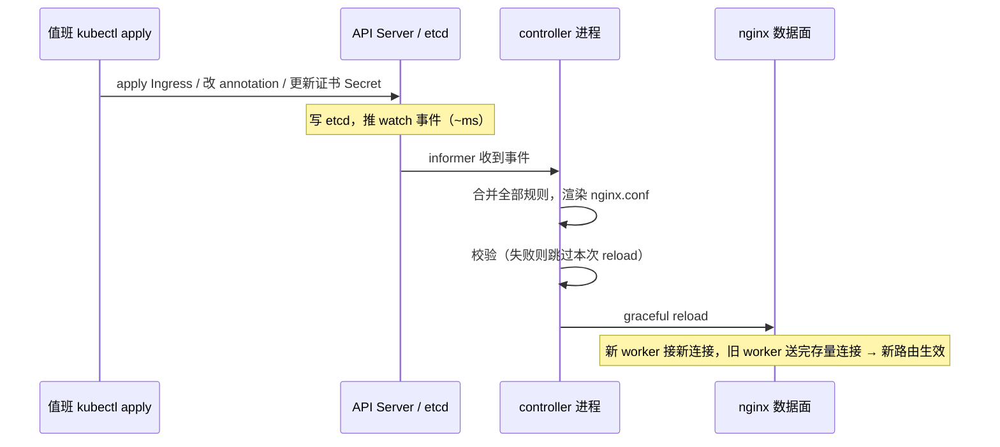
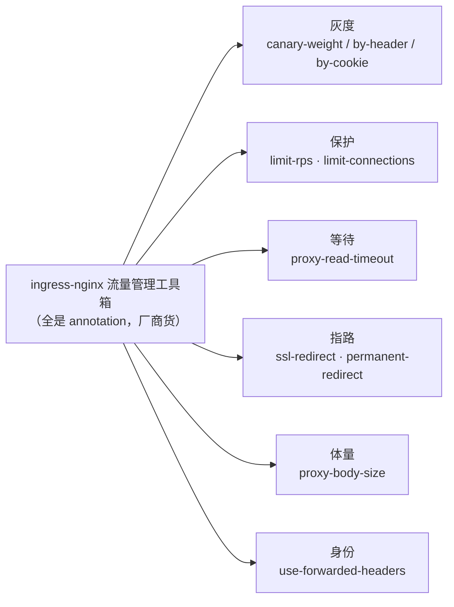
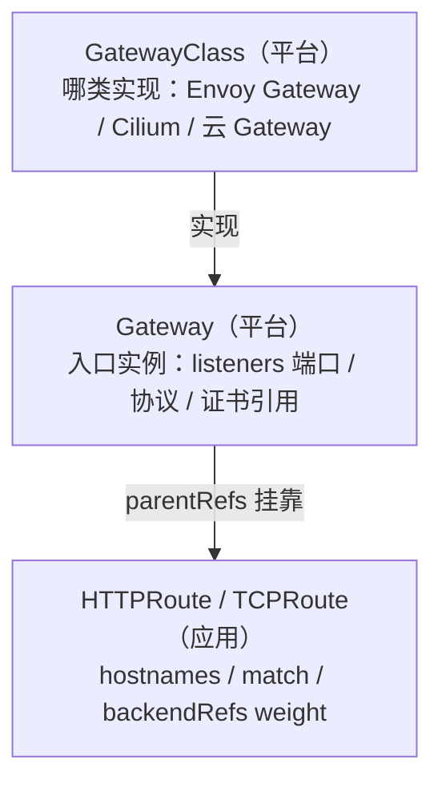

# Ingress 与流量管理

> 大家好。上一章讲完控制面证书；这一章换到**业务侧入口**——一次外部请求怎么进集群、规则怎么下发、证书在哪验、流量怎么调。
> 开讲之前，先带大家回到一个现场：凌晨，官网、活动页、支付回调挂在同一个 ingress 上，玩家突然登不上——证书过期三天没人收到告警；值班想改条路由注解救场，全站 404；这时有人提议把所有 ingress-nginx 重启一遍「让它生效」。手都别动。
> 这一章讲完，你会知道这几个人各自错在哪——重启是全量重同步更慢，404 和 502 不是一种病，以及为什么「etcd 里有 Ingress」不等于「域名能访问」。
> **本章回答的问题**：一次外部请求的一生——从 LB 进集群，谁把规则翻译成配置，证书在哪验，每一段会坏在哪。
> **本章不讲**：Service / Endpoints / kube-proxy → [08](../08-Service与kube-proxy/)；发布期的金丝雀推进与回滚 RTO → [16](../16-灰度与回滚/)；TLS 握手与证书链原理 → [01-14](../../01-基础底座/14-HTTP与TLS/)；Mesh sidecar 治理 → [24](../24-ServiceMesh-Istio与Envoy/)。

**标记**：🎯重点 · 🔥难点 · ⭐常考 · 🔧实操

**怎么听这场分享**：第一节是「一次外部请求的一生」主图——先分清转发线和下发线；二到八节顺着进门 → 下发 → 匹配 → 证书 → 调流量 → 分轨 → Gateway；第九节定责。口诀先埋一句：⭐ **404 查规则，502 查 Endpoints**。

---

## 一、一张图：一次外部请求的一生

> 🎯 **一句话**：请求走一条线，规则走另一条线——排障先问坏了哪条。

咱们先不急着背注解名。学入口最怕一上来背 `nginx.ingress.kubernetes.io/...`，背完还分不清「规则在」和「流量通」。先看图：


**读图**：实线是**转发线**，玩家的请求从 DNS、LB 一路走到后端 Pod，每一跳都有自己的坏法；虚线是**下发线**，规则对象躺在 etcd 里不转发任何一个包，要等 controller watch 到、渲染进 nginx.conf 才算数。转发线坏了是 404/5xx，下发线坏了是「规则在、不生效」。

后面每节就是这条命的一段：进门（二）、规则怎么进来（三）、怎么匹配（四）、证书在哪验（五）、流量怎么调（六）、另一条四层的路（七）、以及下一代入口（八）。好，先从「谁才是执行者」讲起。

本节对应练习题 Q1、Q14。

---

## 二、进门：ingress-nginx 架构

> 🎯 **一句话**：Ingress 是路牌，ingress-nginx 才是司机；司机还分看路的和开车的。

开篇有人 apply 了 Ingress 浏览器打不开——大家想想：对象在 etcd 里，流量就该通吗？不通。先把「规则不是执行者」钉死。

### 规则不是执行者 ⭐

**Ingress** = K8s API 里的一个对象，声明「哪个 host / path 该转给哪个 Service」，本身只是 etcd 里的一段 YAML。**Ingress Controller** = 执行这份规则的反向代理进程，真正 listen 80/443、终止 TLS、转发请求。没有 Controller，apply 一百条 Ingress 也没有流量效果。常见实现：**ingress-nginx**（社区最常用、注解最多）、云厂商 ALB Ingress、APISIX / Kong（限流 WAF 强）。

为什么要这一层：一个 LB 入口按域名 / 路径分发给几十个 Service，比每个 Service 一个云 LB 便宜得多，证书和域名也收口在一处管理。对比 NodePort：那是四层、每服务占一个端口、没有 Host/Path 路由，安全组难收口。

> ⚠️ **别混**：Ingress 对象 ≠ ingress-nginx。对象不会转发一个包；「etcd 里有这条 Ingress」和「这个域名能访问」之间隔着 Controller、ingressClass、reload 三件事。

### 控制面与数据面：同一个 Pod，两条命 🔥

**ingress-nginx** 的 Pod 里住着两个角色：**controller 进程**（控制面，Go 写的，用 informer watch API Server 上的 Ingress / Service / EndpointSlice / Secret，把所有认领的规则合并、套模板渲染成一份 nginx.conf，校验后 reload nginx）和 **nginx**（数据面，master + worker，拿着这份配置干活）。

> 💡 **打个比方**：controller 是调度室，把「路牌」翻译成「导航路线」；nginx 是司机，只认手里那份导航。调度室失联（API Server 断了），司机照样按最后一份导航开——**存量流量不断，但新路线进不来**。

于是「ingress-nginx 挂了」要分三档说，这是高频面试题 ⭐：

- **API Server 不可达 / watch 断开**：数据面拿最后一份 nginx.conf 继续转发，**存量流量不受影响**；代价是新 Ingress、新证书、新注解全都不生效——坏的是**变更能力**，不是转发能力。
- **controller 进程死了但 nginx 还活着**：同上，入口继续转发，配置冻结。
- **整个 Pod 没了**：这个实例的转发也断了，靠**副本 ≥2 + PDB**（PodDisruptionPolicy，保证驱逐时不会全倒）+ 云 LB 健康检查摘除来接住。

所以值班看到「API Server 升级期间入口没出事但新路由半天不生效」，别惊讶，也别急着重启——重启是**全量重新同步**，下发反而更慢，还会顺手掐断长连接（七节）。

**部署形态**：云上最常见 Deployment + Service `type=LoadBalancer`；裸金属用 DaemonSet + hostNetwork 直接听 80/443，或 NodePort + 外部 LB——注意和节点上其它 hostNetwork 游戏进程抢端口，入口节点池与游戏进程池分开。**副本 ≥2 + PDB + 反亲和**是底线；单副本入口一次滚动、一次 reload 就是全站断流。放置上还有三条：每条 Ingress 显式写 `ingressClassName`，不靠默认 class 碰运气；超时与 `proxy-body-size` 按上传大小和后端 P99 设，不用默认值裸奔；真正的攻击防护交给云 WAF 或 APISIX 这类带 WAF 的实现，`proxy-body-size` 只是体量控制，不是安全手段。

**`externalTrafficPolicy`**：ingress 的 LoadBalancer Service 设 `Local` 保留客户端真实源 IP（风控、审计常需要），代价是流量只去有 Pod 的节点、可能不均；`Cluster` 均衡但源 IP 变成节点。六节还会从另一个方向再碰到源 IP 问题（X-Forwarded-For）。

> 🔍 **现场**：新入口上线的验收，四项全过才算，「apply 成功」从来不在验收清单里。

```bash
kubectl get pods -n ingress-nginx                          # ← 副本全 Ready
kubectl get ingress hall -n prod                           # ← ADDRESS 有值 = 有人认领
curl -kv -H "Host: hall.example.com" http://<LB-IP>/       # ← 带 Host 探活，状态码对
openssl s_client -connect hall.example.com:443 -servername hall.example.com </dev/null 2>/dev/null | openssl x509 -noout -dates   # ← 证书链完整、未过期
```

### IngressClass：谁认领这条规则 ⭐

**IngressClass** = 声明「哪个 Controller 实现认领哪条 Ingress」的机制。Ingress 里写 `spec.ingressClassName: nginx`，只有 controller 名字对得上才处理它。集群里可以有多个 IngressClass、多个 Controller 各管各的（测试用 nginx、生产用 APISIX 同集群共存就靠这个）。老式的注解 `kubernetes.io/ingress.class` 已废弃。

忘写 ingressClassName 的两种死法：集群里有标记了默认（IngressClass 上注解 `ingressclass.kubernetes.io/is-default-class: "true"`）的 class，规则被它**悄悄抢走**；没有默认 class，则**谁都不认**，`kubectl get ingress` 的 ADDRESS 列永远空着。

> 🔍 **现场**：入口类报障，先看执行者活着没、认领关系对不对。

```bash
kubectl get pods -n ingress-nginx -o wide
# NAME                                        READY   STATUS    RESTARTS   NODE
# ingress-nginx-controller-7d9b5f6c4-x2k9p   1/1     Running   0          node-3   # ← Ready=1/1 才算活着

kubectl get ingressclass
# NAME    CONTROLLER             PARAMETERS   AGE
# nginx   k8s.io/ingress-nginx   <none>       90d    # ← CONTROLLER 列就是实现；看有没有 default 标记
```

> 📝 **面试**：「ingress controller 挂了流量会断吗？」——先拆控制面/数据面：数据面只依赖最后一份渲染好的 nginx.conf，所以 API Server 断连、controller 进程挂掉时**存量流量继续转发**，坏的是变更能力（新规则/新证书不生效）；只有 Pod 整个没了才断流量，靠副本 ≥2 + PDB + LB 健康检查兜底。

好，知道谁是司机了。接下来：规则怎么从 etcd 跑到 nginx.conf？

本节对应练习题 Q1、Q3。

---

## 三、下发规则：从 kubectl apply 到 nginx reload

> 🎯 **一句话**：一条规则要过 apply → watch → 渲染 → 校验 → reload 五关，卡在哪都是「配置不生效」。

开篇有人要重启全部 ingress-nginx「让它生效」——⭐ 这是高频错答。咱们放慢看下发链：


**读图**：从 apply 那根箭头进去，每一关都有自己的卡法——事件不来（watch 断）、渲染失败（坏规则）、校验不过、reload 没执行。整条链正常只要 1~2 秒，所以「改了配置几分钟还不生效」一定是有某一关卡住了，不是「还在路上」。

**两个关键机制**：

- **graceful reload**：master 用新配置起新 worker，旧 worker 不再接新连接、把存量连接送完后退出。于是「改配置不停服」成立，但**旧 worker 退出时限到的长连接会被掐**——这是七节「七层断长连接」的伏笔。
- **免 reload 与要 reload 的边界**：后端 endpoint 变化走 nginx 内嵌的 Lua 动态更新，**不触发 reload**；新增 host / path、改注解、换证书这类结构性变化才 reload。所以「发版滚后端」不会刷入口，「改一条路由」才会。

**admission webhook 为什么必须开** 🔥：ingress-nginx 是把**所有**认领的规则合并成**一份**配置、整体验证后下发的——一条写坏的 Ingress 会让整份配置校验失败，**从此所有规则变更都下发不出去**，直到把那条坏的删掉。开启它的 validating webhook 后，坏配置在 `kubectl apply` 那一刻就被 API Server 挡回来，进不了 etcd，全局下发链不受牵连。生产不开 webhook，等于让任何有 ingress 写权限的人握着全站入口的开关。

```bash
kubectl get validatingwebhookconfigurations | grep ingress
# ingress-nginx-admission   5   90d   # ← 没有这一行 = 坏规则能进 etcd，随时卡死全局下发
```

> 🔍 **现场**：「配置不生效」第一刀看 controller 日志，不是怀疑 etcd，更不是重启。

```bash
kubectl logs -n ingress-nginx deploy/ingress-nginx-controller --tail=50 | grep -iE 'sync|reload|error|warn'
# I0901 10:23:11.52 7 controller.go:162] "Syncing Ingress" ingress="prod/hall"    # ← watch 收到了这条规则
# I0901 10:23:11.84 7 controller.go:301] "Backend successfully updated"            # ← 渲染+校验通过，已下发
# E0901 10:24:02.11 7 controller.go:289] "Unexpected error ... template ..."       # ← 有 E/W 行 = 下发卡住，往下追这条
```

**下发慢的常见原因**：

- controller 刚重启在**全量同步**——大集群几百条 Ingress 要几十秒；
- API Server 限流（控制面流控见 [03](../03-API-Server/)）或 watch 连接抖动；
- webhook 卡住、集群 Ingress 总量太大。

现象都一样——「新版本路由刚 apply，线上还在 404」，先忍一分钟看日志，再动手。

> 🔍 **现场**：进 controller Pod 内部看实际渲染出的 nginx.conf——这是「规则到底有没有下发」的终判。

```bash
# ① 进 Pod 看 nginx 实际配置（controller 把所有 Ingress 合并渲染后的成品）
kubectl exec -n ingress-nginx deploy/ingress-nginx-controller -- nginx -T 2>/dev/null | grep -A5 'server_name hall'
# server {
#   server_name hall.example.com;        # ← host 在不在配置里
#   location /api {
#     proxy_pass http://prod/hall-svc;    # ← path → backend 对不对
#   }
# }   # ← 没有这段 = 规则没渲染进来，回到下发链查

# ② 用 ingress-nginx 的 kubectl 插件一次性看全（认领的 Ingress / 关联的 Service / Endpoints）
kubectl ingress-nginx ingresses -n prod
# NAMESPACE   INGRESS   CLASS   HOSTS               ADDRESS    TLSCERTIFICATE
# prod        hall      nginx   hall.example.com     10.0.1.50  example-com-tls
# ← 插件版输出更直观，一眼看全 host / class / 证书

# ③ 注解到底被渲染成了什么配置（注解写错不报错，只能看成品）
kubectl exec -n ingress-nginx deploy/ingress-nginx-controller -- nginx -T 2>/dev/null | grep -iE 'limit_rps|proxy_read_timeout|canary'
# limit_req_zone $binary_remote_addr zone=...:10m rate=100r/s;   # ← limit-rps 生效了
# proxy_read_timeout 60s;                                         # ← 超时注解在不在
# ← grep 不到 = 注解没渲染 = 写错了或 class 不对
```

好，下发链清楚了。规则进了 nginx.conf，接下来：**host/path 怎么匹配**？

本节对应练习题 Q2。

---

## 四、匹配：host、path 与后端

> 🎯 **一句话**：先配 host、再配 path、最后按 backend 找 Service；配不中 404，配中了没人 502。

请求进了 nginx，匹配顺序是：**Host 头**找到对应 rules → 按 **path + pathType** 找到 backend → 转给 Service。**pathType** 三种：`Prefix`（`/api` 吃 `/api` 和 `/api/x`，按 `/` 分段匹配，**不吃** `/apix`）、`Exact`（精确相等）、`ImplementationSpecific`（交给实现，不可移植，别写）。`/` 加 `Prefix` 吃下所有路径；多条 path 时 nginx 按**最长前缀优先**匹配——`/api` 和 `/api/v2` 同在，`/api/v2/login` 去后者。

**backend** 写 Service 名 + 端口（名字或端口号），必须和 Service 的 port 对上，对不上立刻 502/503。一条典型规则长这样：

```yaml
spec:
  ingressClassName: nginx                # ← 谁认领（二节）
  rules:
  - host: hall.example.com               # ← 第一关：Host 头
    http:
      paths:
      - path: /api
        pathType: Prefix                 # ← 第二关：path + pathType
        backend:
          service: { name: api-svc, port: { number: 80 } }   # ← 第三关：端口必须对上
      - path: /
        pathType: Prefix
        backend:
          service: { name: web-svc, port: { number: 80 } }
```

没被任何规则命中的请求落到 ingress-nginx 的 **default backend**（一个 404 页面）；没被任何证书命中的 SNI 拿到默认假证书（CN=Kubernetes Ingress Controller Fake Certificate），浏览器报「不可信」——所以 404 和证书报错都可能来自「根本没匹配上」。

> ⚠️ **别混**：**404 是入口的问题**——规则没配中（host/path/pathType/class），查 Ingress；**502/503 是后端的问题**——规则配中了但后面没人（Endpoints 空、端口错、进程刚死、滚动没挡 readiness），第一刀 `kubectl get endpoints`（[08](../08-Service与kube-proxy/)）。两个码的第一刀完全相反，搞反方向白忙十分钟。

> 🔍 **现场**：一条 Ingress 到底配没配通，三连看。

```bash
kubectl get ingress -n prod
# NAME   CLASS   HOSTS             ADDRESS     PORTS     AGE
# hall   nginx   hall.example.com  10.0.1.50   80, 443   12d
# pay    nginx   pay.example.com                 80, 443   3m   # ← ADDRESS 空 = 没人认领这条规则

kubectl describe ingress hall -n prod
# Address:          10.0.1.50                                    # ← 空 = controller / class 问题（二节）
# Ingress Class:    nginx
# Rules:
#   Host             Path  Backends
#   hall.example.com /
#                    hall-svc:80 (10.244.1.12:8080,10.244.2.8:8080)   # ← 有 Pod IP 才叫有后端
#                    <none>                                        # ← 出现这个 = Endpoints 空 → 502/503
```

再用**带 Host 的探活**把 DNS 和云 LB 撇开，直接捅入口：

```bash
curl -H "Host: hall.example.com" http://10.0.1.50/ -v -o /dev/null
# < HTTP/1.1 200 OK        # ← 这一步通 = 规则、后端都没问题
# < HTTP/1.1 404 Not Found # ← 查 host / path / pathType / class
# 这一步 200 但公网打不开 → 查云 LB / DNS / 安全组，不是集群的锅
```

后端连不上时，controller 日志里是原汁原味的 nginx error：

```text
2026/09/01 10:25:31 [error] connect() failed (111: Connection refused) while connecting to upstream,
  server: hall.example.com, request: "GET /api/login HTTP/1.1",
  upstream: "http://10.244.1.12:8080/api/login"      # ← 后端拒连：Pod 刚死 / 端口没对上
```

> 📝 **面试**：「apply 了 Ingress 却没流量」按链说：Controller 在不在 → `ingressClassName` 认没认 → ADDRESS 有没有 → describe 里 Backends 有没有 Pod IP → `curl -H Host` 探入口。「502 先加 nginx 副本」是典型错误——先看 Endpoints。

口诀再钉一次：⭐ **404 查规则，502 查 Endpoints**。好，匹配会了——证书呢？开篇那个「过期三天没人告警」就在下一节。

本节对应练习题 Q4、Q12。

---

## 五、证书：TLS 终止与证书管理

> 🎯 **一句话**：TLS 多在入口终止；通配符不配裸域，过期靠监控不靠玩家发现。

上一章讲控制面证书；这一节是**业务侧**那张证——玩家浏览器看到的那张。

**TLS 终止（TLS termination）** = 在入口处解开 HTTPS、集群内改用 HTTP 转发——解密开销和证书管理都收口在入口。证书放在 `kubernetes.io/tls` 类型的 **Secret** 里，Ingress 用 `spec.tls`（hosts + secretName）引用；同一个入口靠 **SNI**（Server Name Indication，客户端握手时自报要访问的域名）决定出示哪张证书。三种终止位置：

- **Controller 终止**（最常见）：客户端 HTTPS → ingress 解密 → 集群内 HTTP。
- **透传**：ingress-nginx 的 `ssl-passthrough` 注解，按 SNI 把整条 TLS 直接转给后端——入口看不到明文，做不了七层路由，只在「后端必须自己解密」时用。
- **云 LB 终止**：LB 解密后 HTTP 打给 Controller；若要求 LB→Controller 仍加密，则两边都要配证书。

**通配符不匹配裸域** ⭐：`*.example.com` 只覆盖子域名，**不覆盖** `example.com` 本身。

> 💡 **打个比方**：`*.example.com` 像「所有子部门的工牌」——研发、市场都能刷，唯独刷不开总公司大门（apex 域）。官网常用裸域，于是「手机打不开、查了半天是少写了一个 dnsName」。cert-manager 的 Certificate 要写两条：`*.example.com` 和 `example.com`。

**证书链不全**是另一种「手机打不开、curl 却过」：服务端只发了叶子证书没发中间证书，桌面 curl 会自己补链，手机浏览器严格、直接报错。用 `openssl s_client -showcerts` 看链全不全：

> 🔍 **现场**：证书类报障，先把链、有效期、SAN 一次打出来。

```bash
openssl s_client -connect hall.example.com:443 -servername hall.example.com -showcerts </dev/null 2>/dev/null | openssl x509 -noout -subject -issuer -dates
# subject=CN = *.example.com
# issuer=C = US, O = Let's Encrypt, CN = R3
# notAfter=Aug 29 12:00:00 2026 GMT                 # ← 早于今天 = 过期，玩家登不上的元凶
# 另看 -showcerts：链上只有 1 张证书 = 缺中间证书，手机端必挂
```

**过期不是故障，过期才被发现才是事故。** 生产用 **cert-manager**（K8s 上的证书自动化控制器）：`Certificate` 资源 + `Issuer`（常配 Let's Encrypt 的 ACME，HTTP01 / DNS01 验证）→ 到期前约 30 天自动续期 → 写回 Secret → ingress-nginx watch 到 Secret 变化热加载新证书。

```yaml
apiVersion: cert-manager.io/v1
kind: Certificate
metadata: { name: example-com, namespace: ingress-nginx }
spec:
  secretName: example-com-tls            # ← Ingress 的 spec.tls 引用的就是它
  dnsNames:
  - "*.example.com"                      # ← 通配符：子域名
  - "example.com"                        # ← apex 必须单列，漏了就是官网手机打不开
  issuerRef: { name: letsencrypt-prod, kind: ClusterIssuer }
```

要配的是**剩余天数告警**（小于 30 天 P2）；真过期了先看 `Certificate` 的 status 和 Secret 是否还被引用、ACME 是不是撞了限流，**不要先重启 Controller**——重启既不能续证书，还会全量重同步拖慢下发（三节）。

> 📝 **面试**：「证书过期玩家登不上」的口径：TLS 终止在 ingress（或云 LB）；证书在 Secret、spec.tls 引用、SNI 选证书；通配符要另加 apex 的 dnsName；cert-manager 自动续期 + 剩余天数告警，过期先看 Certificate status 再动手。

> 🔍 **现场**：SNI 验证——不同域名出不同证书，用 `-servername` 指定 SNI 分别探。

```bash
# ① SNI 探 A 域名出的是哪张证书
openssl s_client -connect 10.0.1.50:443 -servername hall.example.com </dev/null 2>/dev/null | openssl x509 -noout -subject -dates
# subject=CN = *.example.com
# notAfter=Nov 29 12:00:00 2026 GMT   # ← 这张证书对 hall.example.com 有效

# ② SNI 探 B 域名，出的可能是默认假证书（说明 tls 规则没配中）
openssl s_client -connect 10.0.1.50:443 -servername pay.example.com </dev/null 2>/dev/null | openssl x509 -noout -subject
# subject=CN = Kubernetes Ingress Controller Fake Certificate   # ← 假证书：spec.tls 没引用到 pay 的证书

# ③ 看 ingress 里 tls 段引用了哪个 Secret
kubectl get ingress hall -n prod -o jsonpath='{.spec.tls}' | jq .
# [{"hosts":["hall.example.com"],"secretName":"example-com-tls"}]   # ← 有引用
# []   # ← 空：没配 TLS，HTTPS 出假证书，浏览器报不可信

# ④ 看 Secret 里证书的 SAN 覆盖了哪些域名
kubectl get secret example-com-tls -n prod -o jsonpath='{.data.tls\.crt}' | base64 -d | openssl x509 -noout -text | grep -A1 'Subject Alternative Name'
# X509v3 Subject Alternative Name:
#   DNS:*.example.com, DNS:example.com   # ← 两条都写了才不会漏裸域
```

好，证书管住了。接下来：流量怎么调——金丝雀、限流、超时这些旋钮。

本节对应练习题 Q7。

---

## 六、调流量：金丝雀、限流、超时、重定向

> 🎯 **一句话**：流量管理全靠 annotation；注解是厂商货，写错不报错、只是不生效。

大家想想：注解写错了，API 会报错吗？不会——⭐ 这是高频坑，静默不生效。

**annotation（注解）** = 挂在对象 metadata 上的自由键值对，Ingress 靠它扩展能力，比如 `nginx.ingress.kubernetes.io/canary-weight`。两个硬性质记住：**厂商绑定**——nginx 的注解换到 Traefik / APISIX 全部失效；**不被 API Server 校验**——写错不报错，只是静默不生效（这也是三节 webhook 要拦它们的原因）。

**金丝雀（canary）** ⭐：`canary: "true"` 把一条**同 host 的独立 Ingress** 标成灰度入口，三个旋钮：`canary-weight`（按百分比随机分流）、`canary-by-header`（请求带指定 header 才进新版）、`canary-by-cookie`。优先级 **header > cookie > weight**。

```yaml
metadata:
  name: hall-canary                       # ← 和主 Ingress 是两个对象、同一个 host
  annotations:
    nginx.ingress.kubernetes.io/canary: "true"        # ← 标记为金丝雀入口
    nginx.ingress.kubernetes.io/canary-weight: "10"   # ← 10% 流量打 hall-v2
spec:
  ingressClassName: nginx
  rules:
  - host: hall.example.com
    http:
      paths:
      - path: /
        pathType: Prefix
        backend: { service: { name: hall-v2, port: { number: 80 } } }
```

真实事故：**灰度注解把老玩家打到新版本**——`canary-weight` 是随机抽样，同一玩家两次请求可能落在不同版本，会话状态直接错乱；要按**用户维度**灰度，用 `canary-by-header`（客户端带上玩家标识的 header）。集群里有 Argo Rollouts 时由它按指标自动改权重——入口提供路由能力，发布控制器负责推进，权重推进、观察窗口、5xx 归零那套发布纪律在 [16](../16-灰度与回滚/)。

> ⚠️ **别混**：金丝雀权重 ≠ 副本比例。Deployment 副本 1:9 经过 kube-proxy 的轮转并不等于 10% 流量（长连接下偏差更大），入口层的 weight 才是真比例。

**限流**：`limit-rps` / `limit-rpm`（每秒/每分钟请求数）、`limit-connections`（并发连接）、`limit-whitelist`（白名单 IP 豁免）。超限默认回 **503**，用 `limit-req-status-code: "429"` 改成 429。开服登录被刷：入口 RPS 限流 + 验证码双管齐下。

算法选型常作为追问：**令牌桶**允许突发、生产最常用（攒的令牌可以一次花掉，贴合真实流量）；**固定窗口**简单，但两个窗口交界处瞬间可过两倍阈值，整点有突刺；滑动窗口更平滑；漏桶严格匀速，不适合突发业务。注意限流挡的是脚本，不是扩容的替代品：开服真玩家洪峰、匹配请求暴增，要靠扩容和**队列 + 排队**消化，别只靠 429 把合法玩家挡死。

> ⚠️ **别混**：**入口 429 ≠ API Server 429**。入口 429 是南北向限流（limit-rps 打的，保护后端）；API Server 的 429 是控制面的 APF 流控（[03](../03-API-Server/)）。看是谁返回的，别串。

**超时**：`proxy-read-timeout` / `proxy-send-timeout` 默认 **60s**——后端响应超过 60s，入口先掐断回 504。慢接口要调大，但 504 不能只调超时：后端 P99 真慢，调多大都是把等待拉长。

**重定向**：`ssl-redirect`（默认开，HTTP 请求 301 跳 HTTPS）、`permanent-redirect` / `temporal-redirect`（整条规则跳到指定地址）。老域名换新域名、活动页换入口，用注解做 301，不要写进业务代码。

**body 上限** ⭐：`proxy-body-size` 默认 **1m**，请求体超限直接 **413**。GM 上传资源包、玩家传头像被拦就是它；按业务调大（单条注解或 ConfigMap 全局），大文件本来就该直传对象存储——别把入口撑成文件网关。

**源 IP / X-Forwarded-For**：入口把客户端真实 IP 追加进 **X-Forwarded-For（XFF）** 头传给后端。`use-forwarded-headers` 要和云 LB **成套**配、且**只信最外层一跳**：没配对，后端风控看到的全是 Controller Pod IP（「所有请求来自同一个 IP」）；整条链都信，客户端可以自己伪造。四层另一条路是 `externalTrafficPolicy: Local`（二节），不靠头。

**熔断、降级、重试**入口层只做一小段，口径留全：限流防打爆、熔断防级联（Open 期间**不要**继续重试）、降级保非核心（排行榜可以返回空榜/旧缓存，**支付不能降级**，强一致）、重试只对幂等操作（支付 POST 默认不重试，双发就是资损）。入口 + SDK 已覆盖大部分场景，**不是必须先上 Mesh**；细节 → [24](../24-ServiceMesh-Istio与Envoy/)。

### 收束：流量管理工具箱 🎯⭐



**读图**：六个抽屉按用途分组背——**发布类**（灰度三旋钮，优先级 header > cookie > weight）、**保护类**（限流默认 503、超时默认 60s、body 默认 1m，三个默认值就是三个事故码 429/503、504、413）、**指路与身份**（重定向、XFF 只信最外层）。

> ⚠️ **别混**：这个工具箱**不保证可移植**——全是 nginx 实现的私货，换 Controller 就废；可移植的替身是八节 Gateway API 的标准字段（`backendRefs.weight`、filter）。

> 📝 **面试**：「入口层有哪些流量管理手段」按「发布 / 保护 / 指路 / 身份」四组说，每个报一个注解名 + 一个默认值 + 一个事故码，最后一句「注解不被校验、厂商绑定，所以生产要开 admission webhook」。

好，HTTP 入口的旋钮齐了。游戏还有一条坑：战斗长连接——七层会掐它。

本节对应练习题 Q6、Q8、Q9、Q10。

---

## 七、分轨：游戏长连接的四层与七层

> 🎯 **一句话**：HTTP 走七层；战斗长 TCP 走四层——七层的 reload 和 timeout 会掐长连接。

> 💡 **打个比方**：七层像酒店前台帮你拆信（HTTP）：能按名字分拣，但每封信都要过手；四层像直接拉一根电话线（TCP）——战斗服要电话线，别硬塞前台。

| 对比 | 七层（Ingress / HTTPRoute） | 四层（NLB / TCPRoute） |
|------|------|------|
| 协议 | HTTP / HTTPS / gRPC / WebSocket | TCP / UDP |
| 能力 | Host/Path 路由、TLS 终止、金丝雀、限流 | 不看 HTTP，只管连接 |
| 对长连接的坑 | 缓冲、`proxy-read-timeout` 60s、reload 断连 | 无七层这些坑 |
| 游戏里谁走 | 官网、活动页、大厅 HTTP、支付回调、GM | 战斗长连接 |

三个真实的死法 🔥：① 战斗 TCP 过了七层，活动期一次配置 **reload**，旧 worker 退出，**在线全断**；② `proxy-read-timeout` 默认 60s，会话 30 分钟——网关按「读超时」把活人掐了；③ 单副本入口滚动升级 = 全站长连接清零。**副本 ≥2 + PDB** 既是可用性，也是把 reload 的断流面缩到「正在滚的那一个实例」。

> 🔍 **现场**：「发版后长连接全掉」，两行命令定是不是入口干的。

```bash
kubectl logs -n ingress-nginx deploy/ingress-nginx-controller --tail=50 | grep -i reload
# "Configuration changes detected, reloading" ...    # ← 发生过 reload：战斗流量若走七层就是全断原因
kubectl get configmap -n ingress-nginx ingress-nginx-controller -o yaml | grep -i timeout
# proxy-read-timeout: "60"                           # ← 默认 60s，30 分钟的会话必被掐
```

**WebSocket 是例外**：它是 HTTP 升级上来的，可以走七层，但要把读超时拉到会话长度，并接受 reload 风险——活动页的实时推送常栽在这。

**四层怎么暴露**：云 NLB + `Service type=LoadBalancer`，或 Gateway API 的 **TCPRoute**（八节），不靠 ingress-nginx 的 stream 配置硬凑。客户端直连 NodePort 会在节点扩缩时全员改地址，不做长期方案。

> ⚠️ **别混**：四层和七层不是同一条管道的两段，是**两条并行的路**——大厅登录走七层、战斗帧同步走四层，入口层规划时先分轨再谈配置。「把所有流量塞进同一个 ingress 统一管理」是游戏运维最贵的整洁癖。

好，分轨清楚了。注解是厂商货——有没有标准替代？Gateway API。

本节对应练习题 Q11、Q13。

---

## 八、新路：Gateway API 与 HTTPRoute

> 🎯 **一句话**：Ingress 靠厂商注解补能力；Gateway API 把权重、多协议、角色分离写进标准字段。

**Gateway API** = K8s SIG-Network 推出的下一代入口标准，用一组资源（GatewayClass / Gateway / HTTPRoute / TCPRoute…）替代 Ingress 的表达力。**HTTPRoute** 是其中管 HTTP 路由的资源：hostnames、match 规则（path / header / query）、`backendRefs` 权重、filter（重定向、镜像）全是**标准字段**。

> 💡 **打个比方**：Ingress 像各品牌手机充电口不统一——能力全靠转接头（注解）；Gateway API 像 USB-C——换一个实现，线不用重买。



**读图**：三层是**角色分离**——平台团队管 GatewayClass 和 Gateway（端口、证书谁能听），应用团队只管 HTTPRoute（自己的域名和路由），靠 `parentRefs` 挂靠、靠 **ReferenceGrant** 授权跨命名空间引用后端。Ingress 时代规则和基础设施混在一条对象里、谁都能改全局入口，这正是要解决的问题。

| 对比 | Ingress | Gateway API |
|------|---------|-------------|
| 协议 | 基本只有 HTTP/HTTPS | HTTP / TCP / UDP / gRPC / TLS |
| 金丝雀 / 高级路由 | annotation，厂商绑定、不被校验 | `backendRefs.weight`、match、filter 标准字段 |
| 角色 | 规则与入口混在一条对象 | GatewayClass / Gateway / Route 三层分离 |
| 状态反馈 | 只有 ADDRESS | Accepted / Programmed 等 status 条件 |
| 可移植性 | 换实现注解全废 | 换实现基本不改 |

```bash
kubectl get httproute hall -n prod -o yaml | grep -A8 backendRefs
# backendRefs:
# - name: hall-v1
#   port: 80
#   weight: 90      # ← 主版本 90%
# - name: hall-v2
#   port: 80
#   weight: 10      # ← 金丝雀 10%，标准字段，换实现照样认
```

状态反馈也升级了——不再只有一个 ADDRESS 列：

```bash
kubectl get gateway prod-gw -n infra
# NAME      CLASS   ADDRESS      PROGRAMMED   AGE
# prod-gw   cilium  10.0.1.60    True         5d   # ← Programmed=True = 实现已把配置下发完；False 就去查实现侧
```

**落地步骤**：装实现（Envoy Gateway / Cilium / 云 Gateway）→ 建 GatewayClass → 平台建 Gateway（listener 443 + 证书引用）→ 应用建 HTTPRoute，`parentRefs` 指向那个 Gateway。跨命名空间引用后端要 **ReferenceGrant** 显式授权。

**流量镜像（RequestMirror filter）**：把一份请求拷给影子后端，**响应直接丢弃**——只适合验证读路径；支付、写库存**不要**镜像，会双写。镜像不是金丝雀，金丝雀才是真实用户流量。

**选型**：新集群、多团队共享网关、要 TCP / gRPC 原生路由 → Gateway API 优先；存量 nginx 注解跑得稳、没有换实现计划 → Ingress 留下，**它不会立刻淘汰**，迁移是演进不是抢救。已用 Cilium 做入口的，直接用它实现 Gateway，别再叠一层 nginx（[25](../25-eBPF与Cilium/)）。

> 📝 **面试**：「Ingress 和 Gateway API 的区别」答四点：协议面（只 HTTP → 多协议）、能力载体（厂商注解 → 标准字段）、角色（混在一起 → 平台/应用三层分离）、状态（ADDRESS → Accepted/Programmed）；收尾说「新集群优先，存量不急迁」。

好，入口全家桶齐了。回到开篇那个凌晨——60 秒怎么定责？

本节对应练习题 Q5。

---

## 九、作战：定责

> 🎯 **一句话**：先分「没入口」还是「有入口」，有入口看状态码，码定哪一跳。

群里有人要重启全部 ingress-nginx——咱们用决策树把他们拦住。

排障三问：**执行者还在不在**（controller Pod Ready、nginx 活着）？**还能不能变更**（新规则下发得了吗，三节链路）？**已有流量通不通**（转发线哪一跳坏）？


**读图**：第一刀永远在 ADDRESS——没有 ADDRESS，后面全白搭，查认领和 LB（二节）；有 ADDRESS 才轮到 `curl -H Host` 拿状态码对号入座。**分支互斥**：404 查规则、502 查后端、证书错查链，不要一把梭「重启 ingress」。

| 现象 | 先做 | 别做 |
|------|------|------|
| Ingress 没有 ADDRESS | controller Pod、ingressClassName、云 LB 配额 | 先改业务镜像 |
| 404 | host / path / pathType、class、下发日志 | 重启 controller |
| 413 | proxy-body-size；大文件走对象存储 | 把入口当文件网关 |
| 429 一片 | 看是被刷还是阈值低，配验证码 | 直接关限流 |
| 502 / 503 | `get endpoints`；滚动查 readiness（[04](../04-Pod生命周期/)） | 先加 controller 副本 |
| 504 | timeout + 后端 P99 | 只加大 timeout |
| 手机打不开、curl 过 | `openssl s_client -showcerts` 看链 / SAN | 先换 controller |
| 证书过期玩家登不上 | Certificate status、Secret 引用、续期失败原因 | 重启 ingress-nginx |
| 规则在、流量不来 | class 认领 + controller 日志（三节） | 当 Service 坏了 |
| 配置不生效 | 下发链三步：日志 → webhook → 全量同步中 | 立刻重启 |
| 发版时长连接全断 | 查战斗是否误走七层、reload 窗口 | 继续发下一批 |
| 金丝雀 5xx 升 | weight 归零（[16](../16-灰度与回滚/)） | 再观察 10 分钟 |

> 🔍 **60 秒剧本** 🔧：接到「入口挂了」报障，按这条线走。

```text
① 0–10s   kubectl get ingress -A：ADDRESS 在不在、CLASS 对不对——先分「没入口 / 有入口」
② 10–30s  curl -H "Host: <域名>" http://<LB-IP>/ -v：拿状态码，对决策树入座
③ 30–45s  按码下刀：502→get endpoints · 404→查规则/下发日志 · 证书→openssl s_client · 413→body-size
④ 45–60s  controller 日志确认下发链（三节）；改完再 curl 验证，别用「应该好了」结案
```

现在再看群里那句「把所有 ingress-nginx 重启一遍」——你知道该怎么拦住他了：先看下发链日志，重启是全量重同步，更慢还断长连接。

本节对应练习题 Q14。

---

## 十、收口

> 🎯 **一句话**：值班的弹药库——命令、锚点、易错、数字。

### 命令速查 🔧

```bash
# 规则与入口
kubectl get ingress,ingressclass,gateway,httproute -A        # ADDRESS / CLASS 两列
kubectl describe ingress hall -n prod                        # Address / Backends / TLS / Events
# 执行者
kubectl get pods -n ingress-nginx -o wide                    # Ready / RESTARTS
kubectl logs -n ingress-nginx deploy/ingress-nginx-controller --tail=50 | grep -iE 'sync|reload|error'
# 后端（502/503 第一刀，→08）
kubectl get endpoints hall-svc -n prod
# 验证
curl -kv -H "Host: hall.example.com" http://<LB-IP>/         # 绕 DNS 探入口
openssl s_client -connect hall.example.com:443 -servername hall.example.com </dev/null 2>/dev/null | openssl x509 -noout -subject -issuer -dates
# 证书对象
kubectl get certificate -A                                   # READY / RENEWAL 时间
kubectl get secret example-com-tls -n ingress-nginx          # 证书 Secret 是否还在、被谁引用
```

### 面试锚点

遮住右列自问自答，卡壳的行回去重读对应小节——能讲出来才算会，看着答案点头不算。

| 问 | 30 秒答 |
|----|---------|
| Ingress 和 Controller 什么关系？ | Ingress 是 etcd 里的规则，Controller 才 listen 80/443 转发；没 Controller 规则是死数据。 |
| ingress controller 挂了流量会断吗？ | 分控制面/数据面：数据面拿最后一份 nginx.conf 继续转发，API Server 断连或控制面进程挂只坏变更能力；Pod 整个没了才断流量，靠 ≥2 副本 + PDB。 |
| 改了配置不生效？ | 下发链 apply→watch→渲染→校验→reload 共 1~2s；先看 controller 日志，别重启——重启是全量重同步更慢。 |
| 一条坏 Ingress 会拖垮谁？ | 合并渲染、整体校验，一条坏规则能卡住所有下发；所以开 admission webhook 在 apply 时拦。 |
| IngressClass 是干嘛的？ | 决定哪个 Controller 认领哪条 Ingress；忘写会被默认 class 抢走或没人认，ADDRESS 为空。 |
| 404 和 502 各先看什么？ | 404 查 host/path/pathType/class（规则没配中）；502/503 先 `get endpoints`（配中了没人）。 |
| TLS 配在哪？ | 多在 Controller 终止（Secret + spec.tls + SNI 选证书）；也可云 LB 终止或 ssl-passthrough 透传。 |
| 通配符匹配裸域吗？ | 不匹配：`*.example.com` ≠ `example.com`，cert-manager 要写两条 dnsNames。 |
| 证书过期怎么办？ | 先看 Certificate status / Secret 引用 / 续期失败原因；靠剩余天数告警（小于 30 天），不靠重启。 |
| 金丝雀怎么做？ | 入口层 weight：nginx 用 canary 注解（厂商货），Gateway API 用 backendRefs.weight（标准）；副本比例不准。 |
| canary-weight 和 by-header 什么区别？ | weight 随机抽样，同玩家可能两个版本反复横跳；按用户维度灰度用 by-header。 |
| 入口怎么限流？ | limit-rps / limit-connections，超限默认 503、可改 429；登录被刷加验证码，别只靠 429。 |
| 入口 429 和 API Server 429？ | 前者是南北向入口限流，后者是控制面 APF，看返回方是谁。 |
| 413？ | proxy-body-size 默认 1m；调大或大文件直传对象存储，别把入口当文件网关。 |
| 504 只加大 timeout？ | 不够：超时只是把等待拉长，后端 P99 真慢要修后端。 |
| 战斗长连接为什么不走七层？ | 七层有读超时、缓冲、reload 断连；战斗走云 NLB + LoadBalancer Service 或 TCPRoute。 |
| Ingress 会被淘汰吗？ | 不会立刻：存量稳定不急迁；新集群、多团队、多协议优先 Gateway API。 |
| 为什么不给每个 Service 一个 LB？ | 贵、证书域名散；一个入口按 host/path 分发，证书收口。NodePort 是四层、占端口、无路由。 |
| 怎么看 nginx 实际渲染的配置？ | `kubectl exec deploy/ingress-nginx-controller -n ingress-nginx -- nginx -T`；grep host/path/注解确认规则有没有渲染进去。 |
| 怎么验 SNI 出的是哪张证书？ | `openssl s_client -connect <IP>:443 -servername <域名>`，看 subject 是真证书还是 Fake Certificate。 |
| 注解写错了会报什么错？ | 不报错——注解不被 API Server 校验，静默不生效；看 `nginx -T` 成品才知有没有渲染进去。 |

### 易错一句话对照

- apply 了 Ingress 就有流量 → 要 Controller 认领 class 并 reload 才生效
- controller 挂了全站必断 → 数据面拿最后一份配置继续转，先坏的是变更能力
- 配置不生效先重启 controller → 先看下发链日志；重启是全量重同步，更慢还断长连接
- 一条坏 Ingress 只影响自己 → 合并校验能卡住全局下发，靠 admission webhook 拦
- 注解写错会报错 → 不被 API 校验，静默不生效
- Ingress 马上会淘汰 → 存量稳定不急迁，Gateway API 是演进不是替换
- nginx canary-weight 是集群标准 → 厂商注解，换实现即废
- 副本 1:9 就是 10% 金丝雀 → kube-proxy 粗；入口权重才准
- 战斗长 TCP 走七层 Ingress → timeout / reload 断流；走 L4
- 单副本 controller 也能扛 reload → 一 reload 长连接全断
- 通配符匹配裸域 → `*.example.com` ≠ `example.com`
- 502 先加 nginx 副本 → 先看 Endpoints
- 504 只加大 timeout → 还要修后端 P99
- 支付可以降级成空响应 → 强一致；排行榜才可以
- 熔断 Open 时继续重试 → 打下游；支付 POST 默认不重试
- 必须上 Istio 才能限流 → 入口 + SDK 已覆盖大部分
- X-Forwarded-For 随便信任 → 与 LB 成套，只信最外层一跳
- 429 一定是 APF → 入口 429 是南北向；API Server 429 才是控制面（03）
- 注解写错了会报错 → 不被 API 校验，静默不生效，只能看 `nginx -T` 成品
- 规则到底生效了没看 etcd → 看 controller Pod 里 `nginx -T` 渲染出的配置
- SNI 不匹配就出真证书 → 出默认 Fake Certificate，浏览器报不可信
- TLS 规则没配也能 HTTPS → 出假证书；不配 spec.tls 就没有真证书
- 调大 `proxy-body-size` 就能防滥用 → 那是体量控制，防刷防攻击是限流和 WAF 的事

### 数字墙

> Controller 副本 **≥2** + PDB · 证书告警 **小于 30 天** · cert-manager 到期前 **~30 天**续期 · `proxy-body-size` 默认 **1m** · `proxy-read-timeout` 默认 **60s** · `canary-weight` **0–100** · 灰度优先级 **header > cookie > weight** · 下发链正常 **1~2s** · 限流超限默认 **503**（可改 429）· `ssl-redirect` **301** · 重试 **1–2** 次 · 金丝雀 5% 已坏**立即归零**

---

## 合上书

合上书自检（题号对齐练习题）：

1. **默画一张图**：玩家 → DNS → LB → ingress-nginx（控制面 watch/渲染/reload、数据面转发）→ Service → Pod，规则在虚线的下发线上。（Q1、Q14）
2. **口述架构**：Ingress 是规则、ingress-nginx 是执行者；endpoint 变化免 reload、结构变化才 reload；为什么「改配置不停服」但长连接会被掐。（Q1）
3. **口述挂掉的影响面**：API Server 断连 / controller 进程死 / Pod 整个没了，三档影响各是什么；为什么说先坏的是变更能力。（Q2）
4. **口述下发链**：apply → watch → 渲染 → 校验 → reload；一条坏规则如何卡住全局、admission webhook 挡在哪；配置不生效的第一刀。（Q2）
5. **口述匹配**：host → path → backend；Prefix / Exact 的区别；404 查规则、502/503 查 Endpoints 各是为什么。（Q4、Q12）
6. **口述证书**：TLS 三种终止位置、SNI 怎么选证书、通配符为什么不配裸域、链不全的现象、cert-manager 续期与 30 天告警。（Q7）
7. **口述工具箱**：金丝雀三旋钮与优先级、限流/超时/body 的三个默认值与三个事故码、重定向、XFF 只信最外层；注解为什么是厂商货。（Q6、Q8、Q9、Q10）
8. **口述对比**：Ingress vs Gateway API 四点差异；什么时候迁、为什么说 Ingress 不会立刻淘汰。（Q5）
9. **口述分轨**：战斗长连接为什么不走七层；四层怎么暴露；副本 ≥2 + PDB 在 reload 场景下救的是什么。（Q11、Q13）
10. **定责与数字**：无 ADDRESS / 404 / 413 / 429 / 502 / 504 / 证书报错各先看什么；背出数字墙里的默认值。（Q3、Q14）

十条都能不看稿讲下来，这一章就过了。终极测试：拦住开篇那几个误操作——重启全部 ingress-nginx、502 先加副本、证书过期靠玩家发现。下一章：[灰度与回滚](../16-灰度与回滚/)——权重怎么推进、回滚 RTO、战斗服为什么不能当 Web 滚。地基：[08](../08-Service与kube-proxy/) · 发布纪律：[16](../16-灰度与回滚/)。
