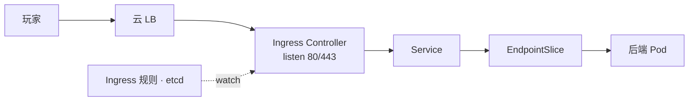
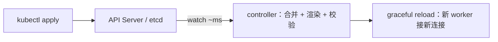
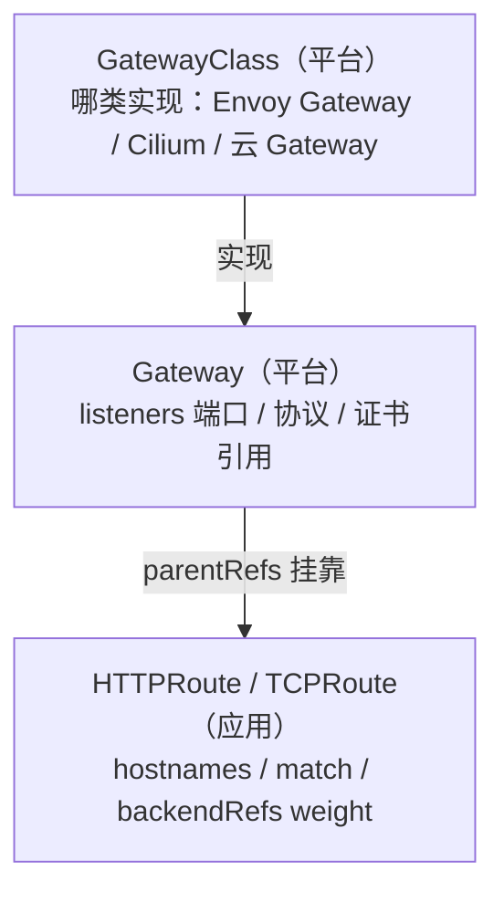
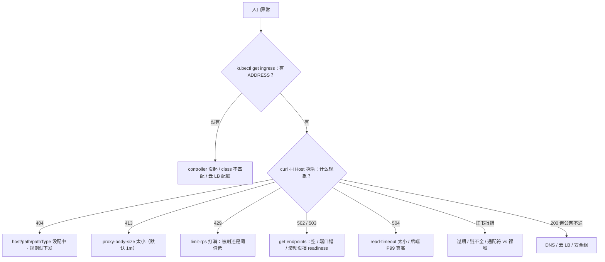

# 15｜Ingress 与流量管理 · 练习题

先合上知识点，对着 **一节的主图** 把「一次外部请求的一生」口述一遍——转发线和下发线各走哪几跳、各会坏在哪——再来做题。

| 标记 | 含义 |
|------|------|
| **核心** | 不懂整章就没建立起来 |
| **必会** | 值班和面试都要能讲 |
| **常用** | 线上会反复碰到 |
| **常考** | 白板和追问的高频口径 |

## 本题目录

- [Q1 规则与执行者](#q1)
- [Q2 controller 挂了与下发链](#q2)
- [Q3 无 ADDRESS 与 IngressClass](#q3)
- [Q4 路由匹配与 404](#q4)
- [Q5 Ingress vs Gateway API](#q5)
- [Q6 金丝雀权重](#q6)
- [Q7 TLS 与证书](#q7)
- [Q8 413、504 与重定向](#q8)
- [Q9 限流熔断降级](#q9)
- [Q10 令牌桶与登录刷](#q10)
- [Q11 长连接与 L4](#q11)
- [Q12 502 / 503 / 504](#q12)
- [Q13 转发头 X-Forwarded-For](#q13)
- [Q14 60 秒剧本](#q14)
- [合上书](#合上书)

---

## Q1

**★★★★★｜Ingress、Ingress Controller、Service 什么关系？为什么不每个服务一个 LB？**

**覆盖**：核心 · 必会 · 常考 ｜ **对应**：知识点 [二、进门：ingress-nginx 架构](知识点.md)

### 场景

apply 了 Ingress，浏览器打不开。etcd 里对象明明在，有人断定「Service 坏了」，准备去重启后端。

### 完整解答

> 🎯 **一句话**：Ingress 是 etcd 里的规则，Controller 才是执行者；没 Controller，规则不转一个包。

**Ingress** 是 K8s API 里的对象，声明「哪个 host / path 转给哪个 Service」，本身只是 etcd 里的一段 YAML。**Ingress Controller**（ingress-nginx、云 ALB Ingress、APISIX / Kong）才是真正 listen 80/443、终止 TLS、转发请求的反向代理。请求的完整链路是：



**读图**：实线是转发线，虚线是下发线——对象不会转发一个包，「etcd 里有 Ingress」和「域名能访问」之间隔着 Controller、ingressClass、reload 三件事。

为什么收口在一个入口：一个 LB 按域名 / 路径分发给几十个 Service，比每个 Service 一个云 LB 便宜，证书和域名也集中管理。NodePort 是四层、每服务占一个端口、没有 Host/Path 路由，安全组难收口，不做对外方案。

> 📝 **面试**：「Ingress 对象不转发包，Controller 才 listen 80/443。入口 502 我先查 Endpoints，不是先加 nginx 副本。」

### 再追问

**「apply 了 Ingress 却没流量，你怎么排？」**——按链走：Controller Pod 在不在 → `ingressClassName` 认没认 → `kubectl get ingress` 有没有 ADDRESS → describe 里 Backends 有没有 Pod IP → `curl -H Host` 探入口。**不要**直接动后端，也不要先看业务代码。

---

## Q2

**★★★★★｜ingress controller 挂了，入口流量会断吗？改条路由注解为什么半天不生效？**

**覆盖**：核心 · 必会 · 常考 ｜ **对应**：知识点 [三、下发规则：从 kubectl apply 到 nginx reload](知识点.md)

### 场景

API Server 做升级维护，期间有人改了条 Ingress 注解救场，十几分钟没生效，他准备把所有 ingress-nginx Pod 重启一遍「让它生效」。

### 完整解答

> 🎯 **一句话**：数据面拿最后一份配置继续转发，先坏的是变更能力；重启是全量重同步，更慢。

ingress-nginx 的 Pod 里住着两个角色：**controller 进程**（控制面，watch API Server，合并规则、渲染 nginx.conf、reload）和 **nginx**（数据面，拿配置转发）。于是「挂了」要分三档：

- **API Server 断连 / watch 断**：数据面用最后一份 nginx.conf 继续转发，**存量流量不断**；新规则、新证书、新注解全不生效。
- **controller 进程死、nginx 活着**：同上，配置冻结。
- **Pod 整个没了**：该实例转发也断，靠副本 ≥2 + PDB + LB 健康检查接住。

下发链正常 1~2 秒：



**读图**：每一关都有卡法——事件不来、渲染失败、校验不过。其中**一条坏 Ingress 会卡住全局**：所有规则合并成一份配置整体验证，一条写坏，全部变更下发不出去，所以要开 ingress-nginx 的 **admission webhook**，让坏配置在 apply 时就挡在 API Server 门外。

配置不生效的第一刀是看 controller 日志，不是重启：

```bash
kubectl logs -n ingress-nginx deploy/ingress-nginx-controller --tail=50 | grep -iE 'sync|reload|error|warn'
# E0902 10:24:02.11 7 controller.go:289] "Unexpected error ... template ..."   # ← 有 E 行 = 下发卡住，追这条
```

> ⚠️ **别混**：重启 ≠ 生效。重启触发**全量重新同步**（大集群几十秒），还会顺手掐断长连接；先看日志定位卡点，才是快的路。

### 再追问

**「发版滚后端会触发入口 reload 吗？」**——不会：endpoint 变化走 nginx 内嵌 Lua 动态更新，免 reload；新增 host/path、改注解、换证书这类结构变化才 reload。**不要**把「后端滚动期的抖动」算到入口配置头上。

---

## Q3

**★★★★☆｜Ingress 一直没有 ADDRESS 是怎么回事？多个 Controller 怎么共存？**

**覆盖**：必会 · 常用 ｜ **对应**：知识点 [二、进门：ingress-nginx 架构](知识点.md)

### 场景

测试集群用 nginx、生产用 APISIX 同集群。新同学建了条 Ingress 忘写 ingressClassName，规则在、流量不来，他准备去重启业务后端。

### 完整解答

> 🎯 **一句话**：无 ADDRESS 查认领与 LB；多 Controller 靠 ingressClassName 各认各的。

ADDRESS 为空说明**没有任何 Controller 认领这条规则**，三查：

```bash
kubectl get pods -n ingress-nginx -o wide      # ← Controller 在不在、Ready 几份
kubectl get ingressclass                        # ← 有没有 class、有没有 default 标记
kubectl get svc -n ingress-nginx                # ← LoadBalancer 有没有分到外网 IP（配额）
```

**IngressClass** 决定哪个 Controller 认领哪条 Ingress：Ingress 写 `spec.ingressClassName: nginx`，名字对上才处理。忘写的两种死法：集群有默认 class（IngressClass 标了 `ingressclass.kubernetes.io/is-default-class: "true"`）→ 规则被**悄悄抢走**；没有默认 → **谁都不认**。老注解 `kubernetes.io/ingress.class` 已废弃，别再写。

多 Controller 共存就是每个 Controller 对应一个 IngressClass，每条 Ingress 显式写 class；Gateway API 场景则用不同 Gateway 实例，更不靠 class hack。

> 📝 **面试**：「无 ADDRESS 三查：Controller 活着没、class 认没认、云 LB 配额建没建出来。别先怀疑业务。」

### 再追问

**「验收一条 Ingress 配通了，只看 etcd 里有对象算吗？」**——不算：要 ADDRESS 有值 + `curl -H Host` 探活 200 + 证书链完整。**不要**拿「apply 成功」当验收。

---

## Q4

**★★★★☆｜同样的域名，/api 能通、/apix 也打到了后端？404 到底是谁的问题？**

**覆盖**：必会 · 常用 ｜ **对应**：知识点 [四、匹配：host、path 与后端](知识点.md)

### 场景

大厅 `/api` 正常，有人把 `/apix` 的请求也指到了 API 后端，怀疑 path 写错了；另一个域名整站 404，有人说是后端挂了要重启。

### 完整解答

> 🎯 **一句话**：匹配顺序 host → path → backend；404 查规则，502 才查后端。

请求进 nginx 后：**Host 头**找 rules → **path + pathType** 找 backend → 转给 Service。pathType 三种：`Prefix` 按 `/` 分段匹配，`/api` 吃 `/api` 和 `/api/x`，**不吃** `/apix`（那是另一段）；`Exact` 精确相等；`ImplementationSpecific` 不可移植，别写。`/` + Prefix 吃下所有路径；多条 path 按**最长前缀优先**。

backend 的 Service 名 + 端口必须对上，对不上立刻 502/503；没被任何规则命中的请求落 default backend（404 页），没被任何证书命中的 SNI 拿默认假证书（Kubernetes Ingress Controller Fake Certificate）——404 和证书报错都可能来自「根本没匹配上」。

> ⚠️ **别混**：**404 是入口的问题**（规则没配中，查 Ingress）；**502/503 是后端的问题**（配中了没人，第一刀 `kubectl get endpoints`）。第一刀方向相反，搞反白忙十分钟。

```bash
kubectl describe ingress hall -n prod
# Rules:
#   Host             Path  Backends
#   hall.example.com /
#                    hall-svc:80 (10.244.1.12:8080,10.244.2.8:8080)   # ← 有 Pod IP 才叫有后端
#                    <none>                                        # ← 出现这个 = Endpoints 空 → 502/503
```

### 再追问

**「怎么把 DNS 和云 LB 撇开，只验入口？」**——`curl -H "Host: hall.example.com" http://<LB-IP>/`：200 说明规则后端都没问题，公网不通就查 DNS / 云 LB / 安全组。**不要**在入口侧乱改规则救 DNS 的锅。

---

## Q5

**★★★★★｜Ingress 有什么局限？Gateway API 三层怎么解决？要不要立刻迁移？**

**覆盖**：核心 · 必会 · 常考 ｜ **对应**：知识点 [八、新路：Gateway API 与 HTTPRoute](知识点.md)

### 场景

nginx 的 canary-weight 注解在测试集群换成 Traefik 全失效；应用团队写的 Ingress 把平台的入口路径盖了，平台组想收回权限。

### 完整解答

> 🎯 **一句话**：Ingress 靠厂商注解补能力；Gateway API 把权重、多协议、角色分离写进标准字段。

Ingress 的局限：基本只管 HTTP；金丝雀 / header 路由 / TCP 全靠 annotation，厂商绑定且不被 API 校验；规则和基础设施混在一条对象里，谁都能改全局入口。

Gateway API 三层各司其职：



**读图**：平台管 GatewayClass / Gateway（端口、证书谁能听），应用只管自己的 Route，靠 `parentRefs` 挂靠、靠 **ReferenceGrant** 授权跨命名空间引用后端——上面场景里「应用盖平台路径」的问题就从权限模型上消失了。金丝雀也升级成标准字段：

```bash
kubectl get httproute hall -n prod -o yaml | grep -A8 backendRefs
# backendRefs:
# - name: hall-v1
#   weight: 90      # ← 主版本
# - name: hall-v2
#   weight: 10      # ← 金丝雀，标准字段，换实现照样认
```

选型：新集群、多团队共享网关、要 TCP/gRPC 原生路由 → Gateway API 优先；存量 nginx 注解跑得稳 → Ingress 留下，**它不会立刻淘汰**，迁移是演进不是抢救。

> 📝 **面试**：「区别答四点：协议面、能力载体（注解 → 标准字段）、角色分离、状态反馈（ADDRESS → Accepted/Programmed）。新集群优先，存量不急迁。」

### 再追问

**「流量镜像能代替金丝雀吗？」**——不能：RequestMirror 拷一份请求给影子后端、**响应丢弃**，只适合验读路径；支付、写库存不要镜像，会双写。金丝雀才是真实用户流量。**不要**拿镜像流量当灰度指标。

---

## Q6

**★★★★★｜金丝雀怎么切 10% 流量？副本 1:9 行不行？错误率爆了怎么办？**

**覆盖**：核心 · 必会 · 常考 ｜ **对应**：知识点 [六、调流量：金丝雀、限流、超时、重定向](知识点.md)

### 场景

大厅要灰度新版本，有人把新 Deployment 副本调成旧的 1/9 说「这就是 10%」；灰度开了一小时，老玩家登录状态反复错乱；这时 5xx 已超阈，有人说「再观察 10 分钟」。

### 完整解答

> 🎯 **一句话**：入口层 weight 才是真比例；副本比例不准；5% 已坏立即归零。

nginx 的做法是一条**同 host 的独立 Ingress** 加 canary 注解：

```yaml
metadata:
  name: hall-canary
  annotations:
    nginx.ingress.kubernetes.io/canary: "true"        # ← 标记为金丝雀入口
    nginx.ingress.kubernetes.io/canary-weight: "10"   # ← 10% 流量打 hall-v2
```

三个旋钮：`canary-weight`（百分比随机分流）、`canary-by-header`、`canary-by-cookie`，优先级 **header > cookie > weight**。Gateway API 用 `backendRefs.weight`（标准字段，见 Q5）。

**副本比例为什么不行**：流量比例由入口决定，不由副本数决定；kube-proxy 轮转 + 长连接下，1:9 偏差很大，根本谈不上 10%。

**老玩家错乱的根因**：`canary-weight` 是**随机抽样**，同一玩家两次请求可能落不同版本，会话状态直接打架——按用户维度灰度要用 `canary-by-header`（客户端带玩家标识的 header），不要靠 weight。

**5xx 超阈**：weight 归零或摘掉 canary backend，秒级生效，不必等观察窗口跑完；观察窗口看错误率、P99、登录成功率，不只看 Pod Ready。推进与回滚的完整纪律在 [16](../16-灰度与回滚/)。

> ⚠️ **别混**：金丝雀权重 ≠ 副本比例；`canary: "true"` 这条 Ingress 和主 Ingress 是**两个对象、同一个 host**，不是改主 Ingress 加注解。

### 再追问

**「这套注解能带到 APISIX 集群吗？」**——不能：注解是厂商货，换实现即废；可移植的替身是 Gateway API 的 `backendRefs.weight`。**不要**在架构评审里承诺「注解可以平移」。

---

## Q7

**★★★★☆｜TLS 配在哪一层？通配符证书能匹配裸域吗？手机打不开、curl 却过是什么现象？**

**覆盖**：必会 · 常用 · 常考 ｜ **对应**：知识点 [五、证书：TLS 终止与证书管理](知识点.md)

### 场景

官网用 `*.example.com` 证书，裸域 `example.com` 手机浏览器报错、桌面 curl 却正常；值班查了半天网络，准备换 Controller。

### 完整解答

> 🎯 **一句话**：TLS 多在入口终止；通配符不配裸域；手机报错先看证书链。

**TLS 终止** = 在入口解开 HTTPS、集群内走 HTTP，解密和证书管理收口在入口。三种终止位置：**Controller 终止**（最常见，Secret `kubernetes.io/tls` + `spec.tls`，靠 **SNI** 选证书）、**透传**（`ssl-passthrough`，按 SNI 直转后端，做不了七层路由）、**云 LB 终止**（若要求 LB→Controller 仍加密，两边都要证书）。

两个经典坑：

1. **通配符不匹配裸域**：`*.example.com` 只覆盖子域名，**不覆盖** `example.com`。cert-manager 的 Certificate 要写两条 dnsNames。
2. **证书链不全**：只发了叶子证书没发中间证书，桌面 curl 会自己补链，手机浏览器严格、直接报错。

```bash
openssl s_client -connect example.com:443 -servername example.com -showcerts </dev/null 2>/dev/null | openssl x509 -noout -subject -issuer -dates
# notAfter=Aug 29 12:00:00 2026 GMT     # ← 早于今天 = 过期
# -showcerts 链上只有 1 张证书            # ← 缺中间证书，手机端必挂
```

**过期管理**：cert-manager（Certificate + Issuer，ACME HTTP01/DNS01）到期前约 30 天自动续期写回 Secret，ingress-nginx watch 到热加载；配**剩余天数 小于 30 天告警**。真过期先看 Certificate status 和 Secret 引用、ACME 有没有撞限流，**不要先重启 Controller**——重启不续证书，还拖慢下发。

> 📝 **面试**：「证书过期玩家登不上：TLS 终止在 ingress，Secret + spec.tls + SNI；通配符另加 apex dnsName；cert-manager 续期 + 30 天告警，过期先看 status 再动手。」

### 再追问

**「云 LB 终止 TLS 时 Controller 还要证书吗？」**——集群内通常是 HTTP，不需要；若要求 LB→Controller 这段仍加密，则两边都要配。**不要**为了「看起来安全」盲目全链路加密，先算证书管理的账。

---

## Q8

**★★★☆☆｜玩家上传头像 413、慢接口 504、老域名要跳新域名——分别动哪个注解？**

**覆盖**：常用 ｜ **对应**：知识点 [六、调流量：金丝雀、限流、超时、重定向](知识点.md)

### 场景

GM 上传资源包入口 413，有人要把入口当文件中转站调大上限到 1G；一个统计接口稳定跑 90 秒被入口掐成 504，有人只打算加大超时。

### 完整解答

> 🎯 **一句话**：413 调 `proxy-body-size`（默认 1m），504 调超时但必须查后端，重定向用注解别写进代码。

- **413**：`proxy-body-size` 默认 **1m**，超限直接 413。按业务调大（单条注解或 ConfigMap 全局），但大文件本来就该直传对象存储——别把入口撑成文件网关，更别无脑 1G。
- **504**：`proxy-read-timeout` / `proxy-send-timeout` 默认 **60s**，后端响应超时入口先掐。调大超时只是把等待拉长，后端 P99 真慢要修后端；两件事一起做。
- **重定向**：`ssl-redirect`（默认开，HTTP 301 跳 HTTPS）、`permanent-redirect` / `temporal-redirect`（整条规则跳到指定地址）。老域名换新域名、活动页换入口，用注解做 301。

这三个注解和限流、金丝雀一样都是**厂商货、不被 API 校验**——写错不报错，只是静默不生效，所以改完必须用 curl 验证，不能看 apply 成功就当生效。

### 再追问

**「长会话的 WebSocket 走七层，读超时怎么配？」**——拉到会话长度，并接受 reload 风险；战斗长 TCP 则直接不走七层（见 Q11）。**不要**用默认 60s 硬扛 30 分钟的会话。

---

## Q9

**★★★★☆｜限流、熔断、降级、重试、隔离各解决什么？支付能降级吗？**

**覆盖**：必会 · 常用 ｜ **对应**：知识点 [六、调流量：金丝雀、限流、超时、重定向](知识点.md)

### 场景

排行榜服务挂了把登录也拖死；另一边默认重试策略把支付 POST 打了两次，对账出现双扣。

### 完整解答

> 🎯 **一句话**：限流防打爆、熔断防级联、降级保非核心；支付不能降级、不能乱重试。

五个模式互补：限流防下游被打爆（入口 `limit-rps`，超限默认 503、可改 429）；熔断防级联（连续失败 → Open 一段时间，**Open 期间不要继续重试**，那是打下游）；降级保核心路径（排行榜可返回空榜 / 旧缓存，**支付不能降级**，强一致）；重试只对幂等操作（支付 POST 默认不重试，双发就是资损）；隔离让故障不扩散（连接池 / Bulkhead）。

入口 + SDK（Sentinel / Resilience4j）+ 业务开关已覆盖大部分场景，**不是必须先上 Mesh**；Mesh 是增强不是前提，细节在 [24](../24-ServiceMesh-Istio与Envoy/)。

> ⚠️ **别混**：**入口 429 ≠ API Server 429**。入口 429 是南北向限流打的，保护后端；API Server 的 429 是控制面 APF 流控（[03](../03-API-Server/)）。看是谁返回的，别串。

### 再追问

**「匹配服活动期流量暴增，限流够吗？」**——不够：入口 429 只能挡刷，合法玩家洪峰要靠**队列 + 排队**消化，别只靠 429 把真玩家挡死。**不要**把限流当扩容的替代品。

---

## Q10

**★★★☆☆｜开服登录被刷，怎么限？令牌桶和固定窗口怎么选？**

**覆盖**：常用 · 常考 ｜ **对应**：知识点 [六、调流量：金丝雀、限流、超时、重定向](知识点.md)

### 场景

开服当天登录接口被脚本刷爆，有人上了固定窗口限流，整点边界一波突刺把后端打穿。

### 完整解答

> 🎯 **一句话**：登录防刷用入口限流 + 验证码；令牌桶允许突发，固定窗口有整点突刺。

算法选型：**令牌桶**允许突发、生产常用（攒的令牌可以一次性花掉，贴合真实流量）；**固定窗口**实现简单但整点边界有突刺（两个窗口交界处瞬间可过两倍阈值）；滑动窗口更平滑；漏桶严格匀速、不适合突发业务。

游戏登录被刷的组合拳：入口 `limit-rps` 限流 + 客户端验证码 + 按用户维度限频；分布式限流可用 Redis + Lua。注意区分攻击与洪峰——开服真玩家洪峰靠扩容和排队，限流只挡脚本。

### 再追问

**「429 告警一片，第一步做什么？」**——先看是入口 429（查是被刷还是阈值太低，配白名单 `limit-whitelist`）还是控制面 429（见 [03](../03-API-Server/)）。**不要**先关限流，关了等于把后端交出去。

---

## Q11

**★★★★★｜游戏长连接为什么不走七层 Ingress？四层怎么暴露？**

**覆盖**：核心 · 必会 · 常考 ｜ **对应**：知识点 [七、分轨：游戏长连接的四层与七层](知识点.md)

### 场景

战斗 TCP 被塞进了 ingress-nginx，活动期改一条路由触发 reload，在线玩家全断；有人建议「加副本就好了」。

### 完整解答

> 🎯 **一句话**：七层的 reload 和 timeout 会掐长连接；战斗长 TCP 走四层。

七层（Ingress / HTTPRoute）对长连接有三个坑：① **reload**：graceful reload 旧 worker 退出，存量长连接到时被掐——战斗全程在线，一次配置变更就是全员掉线；② **读超时**：`proxy-read-timeout` 默认 60s，会话 30 分钟，网关按「读超时」把活人掐了；③ 缓冲、七层解析对裸 TCP 无意义。

四层怎么暴露：云 NLB + `Service type=LoadBalancer`，或 Gateway API 的 **TCPRoute**；`externalTrafficPolicy: Local` 可保真实源 IP。客户端直连 NodePort 会在节点扩缩时全员改地址，不做长期方案。

**WebSocket 是例外**：HTTP 升级上来的，可以走七层，但读超时要拉到会话长度并接受 reload 风险。**副本 ≥2 + PDB** 不能消除 reload 断连，只能把断流面缩到「正在滚的那一个实例」——单副本入口一 reload 就是全站长连接清零。

> ⚠️ **别混**：四层和七层是**两条并行的路**，不是同一条管道的两段。大厅登录走七层、战斗帧同步走四层，先分轨再谈配置。

### 再追问

**「Gateway API 的 TCPRoute 算四层方案吗？」**——算，这是 Gateway 相对 Ingress 的协议面扩展，不必靠 nginx stream 硬凑。**不要**为了「统一管理」把所有流量塞回七层。

---

## Q12

**★★★★★｜502 / 503 / 504 怎么分？发版时反复 502 先看什么？**

**覆盖**：核心 · 必会 · 常用 ｜ **对应**：知识点 [九、作战：定责](知识点.md)

### 场景

滚动大厅时入口 502 一片，有人调大 Controller 超时，有人加 controller 副本，Endpoints 其实一度是空的。

### 完整解答

> 🎯 **一句话**：502/503 是后端没人，先看 Endpoints；504 是等超时，超时和后端 P99 一起查。

| 码 | 含义 | 第一刀 |
|----|------|--------|
| 502 | 后端立刻失败：Endpoints 空、端口错、进程刚死 | `kubectl get endpoints` |
| 503 | 无可用后端，或入口自身限流 / reload 失败 | Endpoints + controller 日志 |
| 504 | 等后端超时 | `proxy-read-timeout` + 后端 P99 |

滚动期 502 的经典根因是 readiness 没挡住或优雅退出太短，Pod 还在接流量就被杀——回 [04](../04-Pod生命周期/) 查探针与优雅退出，不是加 nginx 副本能救的。504 只加大 timeout 也不够：后端真慢，调多大都是把等待拉长。

```bash
kubectl get endpoints hall-svc -n prod
# NAME       ENDPOINTS                     AGE
# hall-svc   <none>                        12d   # ← 空 = 502/503 的根，先查 Pod 就绪
# hall-svc   10.244.1.12:8080,10.244.2.8:8080    # ← 有 IP 才叫有后端
```

### 再追问

**「404、413、无 ADDRESS 呢？」**——404 查 host/path/pathType/class；413 查 `proxy-body-size`；无 ADDRESS 查 Controller / class / 云 LB。三个方向各不相同，**不要**一把梭「重启 ingress」。

---

## Q13

**★★★☆☆｜风控说所有请求来自同一个 IP，那个 IP 是 Controller Pod——怎么回事？**

**覆盖**：常用 ｜ **对应**：知识点 [六、调流量：金丝雀、限流、超时、重定向](知识点.md)

### 场景

风控系统把所有玩家请求看成同一个来源，准备封号；那个 IP 一查是 ingress-nginx 的 Pod IP。

### 完整解答

> 🎯 **一句话**：X-Forwarded-For 没配对；只信最外层一跳，和云 LB 成套。

入口转发时会把客户端真实 IP 追加进 **X-Forwarded-For（XFF）** 头。两类错法：

1. **没配对**：`use-forwarded-headers` 没开或和云 LB 没成套，后端拿到的源地址全是 Controller Pod IP——风控、审计、按地域分流全部失真。
2. **全信任**：整条 XFF 链都信，客户端可以在请求头里自己插值伪造来源。

正确姿势：和云 LB 成套配置、**只信最外层一跳**（离入口最近的那一跳追加的值）。四层另一条路是 `externalTrafficPolicy: Local` 直接保真实源 IP（代价是流量只去有 Pod 的节点），不靠头。

### 再追问

**「保源 IP 一定要用 XFF 吗？」**——不一定：四层暴露 + `externalTrafficPolicy: Local` 就能拿到真实源 IP；七层才需要头。**不要**为了保源 IP 把战斗长连接塞回七层。

---

## Q14

**★★★★☆｜「入口挂了！」——给你 60 秒，怎么定责？**

**覆盖**：必会 · 常考 ｜ **对应**：知识点 [九、作战：定责](知识点.md)

### 场景

凌晨两点，客服群炸了「玩家全进不去」，值班新人准备先把所有 ingress-nginx 和业务后端一起重启。

### 完整解答

> 🎯 **一句话**：先分「没入口 / 有入口」，再按状态码下刀，全程不重启。



**读图**：第一刀永远在 ADDRESS，没有它后面全白搭；有 ADDRESS 才轮到状态码对号入座，分支互斥。

**60 秒剧本** 🔧：

```text
① 0–10s   kubectl get ingress -A：ADDRESS 在不在、CLASS 对不对
② 10–30s  curl -H "Host: <域名>" http://<LB-IP>/ -v：拿状态码，对决策树入座
③ 30–45s  按码下刀：502→get endpoints · 404→查规则/下发日志 · 证书→openssl s_client · 413→body-size
④ 45–60s  controller 日志确认下发链；改完再 curl 验证，别用「应该好了」结案
```

> 📝 **面试**：「先分没入口 / 有入口，再按状态码定责；404 查规则、502 查后端、证书查链；全程不重启——重启是全量重同步，更慢还断长连接。」

### 再追问

**「如果定位到是证书过期，下一步做什么？」**——看 Certificate status、Secret 是否仍被引用、续期失败原因（ACME 限流？），补告警（小于 30 天）。**不要**重启 ingress-nginx，它不续证书。

---

## 合上书

- [ ] 能**默画**主图：玩家 → DNS → LB → ingress-nginx（控制面 / 数据面）→ Service → Pod，说出转发线与下发线各坏在哪（Q1、Q14）
- [ ] 能口述三档影响面：API Server 断连 / controller 死 / Pod 没了，为什么说先坏的是变更能力；配置不生效的第一刀（Q2）
- [ ] 能说出 IngressClass 认领机制、无 ADDRESS 三查、多 Controller 共存（Q3）
- [ ] 能口述匹配顺序与 404 vs 502 的第一刀方向（Q4、Q12）
- [ ] 能对比 Ingress 与 Gateway API 四点、说清三层角色与「不急迁」（Q5）
- [ ] 能口述金丝雀三旋钮与优先级、副本比例为什么不准、5% 已坏立即归零（Q6）
- [ ] 能讲 TLS 三种终止、通配符不配裸域、链不全现象、30 天告警（Q7）
- [ ] 能报出限流 / 超时 / body 三个默认值与对应事故码，重定向怎么做（Q8、Q10）
- [ ] 能讲限流熔断降级的边界：支付不降级、不乱重试、入口 429 ≠ APF 429（Q9）
- [ ] 能口述战斗长连接为什么不走七层、四层怎么暴露、副本 ≥2 + PDB 救的是什么（Q11、Q13、Q14）
