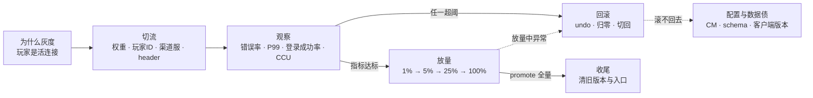
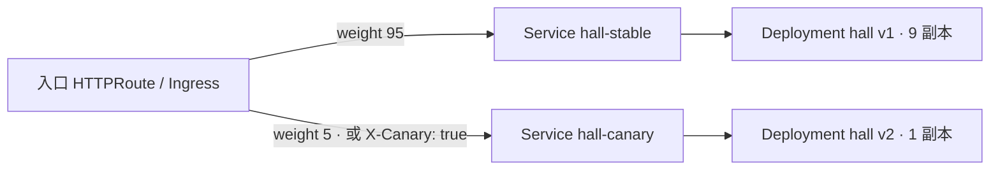
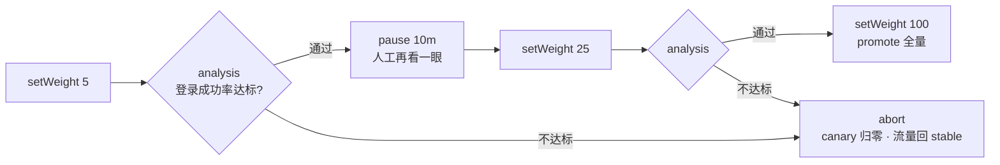
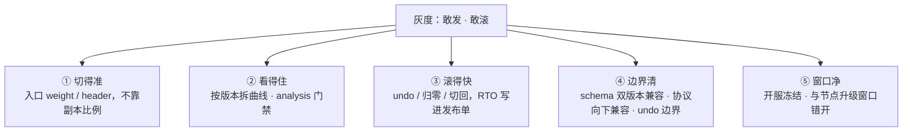
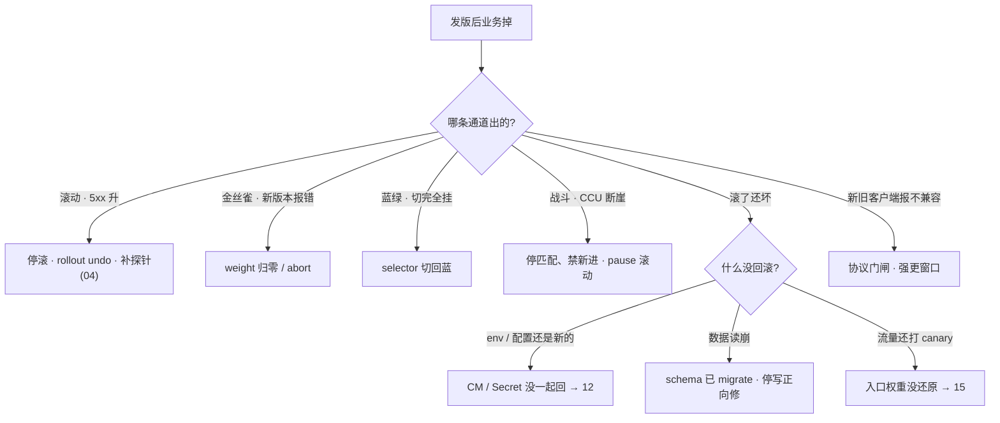

# 灰度与回滚

> 大家好。上一章讲完入口怎么切流量；这一章讲**一次灰度的一生**——切给谁、看什么、怎么放、坏了怎么滚，以及战斗服为什么不能当 Web 滚。
> 开讲之前，先带大家回到活动当天的现场：新版本灰度 5%，Grafana 上错误率开始爬坡，群里有人说「再观察 10 分钟」；战斗 Deployment 跟着同一套 `set image` 在滚，对局还在内存里，CCU 断崖；道具表已经 migrate 过了，有人伸手就要 `rollout undo`——这三步全是错的。手都别动。
> 这一章讲完，你会知道这三个人各自错在哪——观察窗口不是拖延、战斗服不能按 Web 滚、undo 滚不回 schema。
> **本章回答的问题**：一次灰度的一生——游戏为什么必须灰度、流量怎么切、观察什么、怎么放量、坏了怎么滚，以及战斗服、协议、客户端这三个游戏特例。
> **本章不讲**：探针、preStop、优雅退出 → [04](../04-Pod生命周期/)；Deployment 滚动字段与 PDB → [05](../05-工作负载控制器/)；HPA → [07](../07-弹性伸缩/)；Ingress / Gateway weight 的实现 → [15](../15-Ingress与流量管理/)；ConfigMap 不热更 → [12](../12-配置与密钥/)；热更与开服合服运营 → [07-05](../../07-游戏运维专题/05-热更新与版本发布/)、[07-06](../../07-游戏运维专题/06-开服合服/)；节点 drain → [17](../17-节点运行时与升级/)；GitOps 流水线 → [23](../23-GitOps-ArgoCD与Tekton/)。

**标记**：🎯重点 · 🔥难点 · ⭐常考 · 🔧实操

**怎么听这场分享**：第一节是「一次灰度的一生」主图；二到七节顺着为什么 → 切流 → 观察 → 放量 → 回滚 → 游戏特例；第八节定责。口诀先埋一句：⭐ **选灰度方式，就是在选回滚方式**。

---

## 一、一张图：一次灰度的一生

> 🎯 **一句话**：一次灰度走「切流 → 观察 → 放量 → 全量」四段，任何一段异常都拐进回滚；出了问题先问「卡在哪一段」。

咱们先不急着背 Argo Rollouts 的 YAML。学灰度最怕一上来背 steps，背完还是会在活动高峰全量。先看图：



**读图**：

- 主线从左到右是一次灰度的时间线：先决定「切给谁」，再看指标决定「继续还是拐回去」，每个节点对应一节。
- 回滚不是主线的失败分支，而是**常驻出口**——观察和放量的每一步旁边都站着它，所以回滚方式要在发版前就选好（六节）。
- 最下面那条虚线是最贵的坑：代码滚回去了，配置和数据没跟着回（六节「滚不回去怎么办」）。

好，带着这张图出发——先问为什么游戏必须灰度。

本节对应练习题 Q1。

---

## 二、为什么灰度：玩家是活连接

> 🎯 **一句话**：Web 可以一刀切，游戏不行——玩家是挂在进程上的活连接，发版必须先管爆炸半径。

开篇有人要对战斗服 `set image` 全滚——大家想想：玩家还在对局里，进程一换会怎样？

> 💡 **打个比方**：全量发布像高峰期把全城红绿灯一次性换掉，坏了全城瘫痪；灰度是先换一个路口，看两天车流，再换下一个。游戏玩家是已经在路上的车，没法让他们先全下线再换灯。
一刀切对游戏有三个致命后果：① 玩家是**活连接**——长连接挂在具体进程上，一刀切替换 = 全体掉线，重连洪峰同一秒砸向网关和登录服，可能直接打穿容量；② 状态在内存——对局、房间、匹配结果都在进程内存里，进程死状态就没了，Web 那种「请求重试到另一台」对战斗服不存在；③ 协议有两端——客户端在玩家手里，服务端升级带不动客户端，协议不兼容时全量 = 逼全体玩家同时更新。所以灰度的本质是**爆炸半径（blast radius，坏了会波及多大范围）管理**，不是「部署姿势偏好」。

切流方式就四种，选型先钉死在这张表上：

| 方式 | 怎么切 | 回滚 | 代价 |
|------|--------|------|------|
| **滚动 Rolling** | 同一 Deployment 逐步换副本 | `rollout undo`，分钟级 | 省资源；切换期新旧混跑 |
| **蓝绿 Blue-Green** | 两套齐活，切 Service / Ingress selector | selector 切回，**秒级** | 双倍副本；schema 必须双版本兼容 |
| **金丝雀 Canary** | 入口按权重或 header 先切小比例 | 权重归零 / abort | 要观察窗口与指标门禁 |
| **流量镜像 Mirror** | 拷一份请求到影子，**响应丢弃** | 停镜像即可 | 不验证真实用户；写路径双写 |

**滚动（rolling update）**是默认路径：同一个 Deployment 里先起新副本、再杀旧副本，资源最省，代价是切换过程中新旧版本混跑，回滚靠 `rollout undo`（六节）。**蓝绿（blue-green）**是两套完整环境并行，蓝的接流量、绿的待命，像两条平行高架，车全在一条上跑——切流是改指示牌，不是一辆辆挪车；改一下 Service selector 流量整体切过去，回切同一条命令、秒级——最贵也回得最快。**金丝雀（canary，canary release）**是本章主角：先切一小撮流量试错，指标达标再逐步放量。**流量镜像（mirror）**用入口的 RequestMirror 把一份请求拷给影子 Deployment，影子的响应直接丢弃、用户全程无感——像后厨拿同样的订单偷偷练手，顾客只吃老店出的菜；适合预验证「新版本扛不扛得住读流量」，影子不挂正式 Service；影子没有真实会话状态时，对战斗服做镜像没有意义。顺序上常先镜像压读、再金丝雀上真实流量。

> ⚠️ **别混**：**镜像 ≠ 金丝雀**。镜像的响应被丢弃，用户永远吃旧版本的返回，验证不了真实用户路径；金丝雀是真玩家流量，会真出错也真挨骂。更危险的是镜像写路径——支付、发货被拷到影子等于**双写**，出了问题与切流无关，只能数据修复。

**选型一口回**：要秒级回切且有预算 → 蓝绿；资源紧、要小流量验证 → 金丝雀；默认省资源 → 滚动；只想看新版本扛不扛读、不碰用户 → 镜像（只读路径）。四种之外还有一个 **Recreate**：新旧版本根本不能共存（协议硬断、独占 RWO 盘只能挂一边）时，先杀光再起，接受停服窗口并提前公告——它的回滚是再 Recreate 一次，玩家要断两次。

**回滚 RTO 先写进发布单**。**RTO（Recovery Time Objective，故障后多久能恢复）**：无状态服务目标 **2–5 分钟**（undo 或切流）；有状态按「能否不停服」定，定不了就不要在高峰发。切流方式决定回滚速度——**选方式就是在选回滚**，不是选部署美学。

### 滚动四件套：一切灰度的底座 🔥⭐🔧

> 🎯 **一句话**：零停机 = 先起后杀 + 不 Ready 不接流量 + 抽干再死 + Ready 后稳一下，缺一件就 502。

> 💡 **打个比方**：换轮胎要先把备胎顶起来（先起新）、确认能承重（readiness）、再慢慢卸旧胎（preStop 抽干）——直接卸旧胎，车当场塌了。

滚动想接近零停机，靠四件一起到位：

- **`maxUnavailable=0`**：先起新再杀旧，任何时刻副本数不减少；多出来的副本由 `maxSurge` 提供。资源紧时别把 surge 拉满——新 Pod 全 Pending，看起来像滚动卡死（调度见 [06](../06-调度机制/)）。副本少时还要和 PDB 一起看，才保证「先起后杀」仍成立（[05](../05-工作负载控制器/)）。
- **readiness 探针**：不 Ready 不进 Endpoints（探针机制见 [04](../04-Pod生命周期/)）。没有 readiness，K8s 把 `Running` 当可接流量——新进程刚起、还没加载完数据就接请求，滚动期一片 502。
- **preStop + 足够的 grace**：旧 Pod 被移出 Endpoints 后，先抽干存量连接再退出，否则 in-flight 请求直接断（[04](../04-Pod生命周期/)）。
- **`minReadySeconds`**：Ready 之后再稳几秒才算可用，防「Ready 了立刻挂」。

另一把暗刀：**liveness 过严**会在滚动过程中把初始化中的新 Pod 杀掉，滚动永远滚不完（[04](../04-Pod生命周期/)）。

> 🔍 **现场**：滚动期大厅 502，先看滚动状态和 Endpoints。

```bash
kubectl rollout status deploy/hall -n prod
# Waiting for deployment "hall" rollout to finish: 3 out of 10 new replicas have been updated...
kubectl get pods -n prod -l app=hall -o wide
# 新 Pod 已 Running 但业务报 502 → 查它是不是太早进了 Endpoints
kubectl get endpoints hall -n prod
kubectl describe pod hall-xxxxx -n prod | grep -A5 Readiness
# 典型根因：没有 readiness，Running 被当成可接流量   ← 止血：kubectl rollout undo deploy/hall
```

滚动卡住认三种：**新 Pod 永不 Ready**（探针、依赖没起、liveness 过严）→ `rollout status` + describe；**新 Pod Pending**（surge 把资源吃满）→ 查调度；**Ready 满但业务掉**（发布完成 ≠ 发布成功）→ 立刻 undo，去看 Grafana（四节）。

手工挡一手：`kubectl rollout pause deploy/hall` 停在当前比例观察，有问题 `undo`、没问题 `resume`——这是**手工金丝雀**；但入口没切权重时这个比例仍然粗（三节）。

> 📝 **面试**：「滚动四件套：maxUnavailable=0、readiness、preStop、minReadySeconds，没有 readiness 不能零停机；滚动成功看业务指标，不看 `rollout status`。」

好，为什么灰度和滚动底座齐了。接下来第一问：切给谁？

本节对应练习题 Q1、Q2。

---

## 三、切流：灰度的四个维度

> 🎯 **一句话**：灰度准不准在入口决定——权重切比例、玩家 ID 切人、渠道服切服、header 切标记。

灰度第一问不是「切多少」，是「**切给谁**」。四个维度：

| 维度 | 怎么切 | 适用 |
|------|--------|------|
| **按权重 weight** | 入口权重 95/5，请求随机抽样 | 无状态 HTTP 的默认选择 |
| **按玩家 ID** | `hash(uid) % 100 < 5` 走新版本 | 同一玩家体验一致；内部号精准圈定 |
| **按渠道服** | 只发某个渠道 / 某个区服 | 爆炸半径按服隔离，游戏特有 |
| **按 header 路由** | 按请求头匹配（内部号标记 / 客户端版本） | 内部验证、非比例灰度 |

**按权重**是入口随机抽样，最简单，但同一个玩家的两次请求可能分别打中新旧版本——无状态服务无所谓，有状态场景会串。**按玩家 ID** 用哈希分桶保证「这个玩家要么一直走新版、要么一直走旧版」，体验不劈叉；内部测试号（uid 白名单）永远走新版——游戏灰度的第一个 1% 通常是内部号，不是随机玩家。这一层要在网关 / 登录层实现，入口权重做不到。**按渠道服**是游戏特有的维度：先发测试服或低活跃服，整服新版本，爆炸半径按服隔离（还能顺带躲开匹配池分裂，七节）；代价是样本可能不典型——鬼服测不出大 R 的充值路径。**按 header 路由（header routing）**= 入口按请求头分发而非按比例，Ingress 的 canary-by-header、HTTPRoute 的 header 匹配都能做（[15](../15-Ingress与流量管理/)）；客户端在登录请求里带版本号或内部标记，入口认标记分流。四个维度常叠着用：**header 先验内部 → 权重再扩外部**。

> ⚠️ **别混**：灰度要切在**原入口**上。换成新域名、新入口地址，服务端以为是 10% 金丝雀，客户端其实 100% 打到新入口——切流切的是同一条入口的分流规则，不是换个门。

### 原生手段：双 Deployment + 双 Service 🔧

灰度不是装出来的，是**发布通道先存在**。不装任何发布组件，两个 Deployment + 两个 Service + 入口权重就是一次金丝雀：



**读图**：开关在**入口**，不在副本数——两个 Service 各自的 Endpoints（[08](../08-Service与kube-proxy/)）分别只含新旧 Pod，改一行 weight 就改分流，回滚就是 weight 归零。同一条 HTTPRoute 上，金丝雀和镜像可以同时声明：

```yaml
apiVersion: gateway.networking.k8s.io/v1
kind: HTTPRoute
spec:
  rules:
  - backendRefs:
    - { name: hall-stable, weight: 90 }
    - { name: hall-canary, weight: 10 }      # ← 金丝雀：改的是用户流量
    filters:
    - type: RequestMirror
      requestMirror:
        backendRef: { name: hall-v2-shadow }  # ← 镜像：另拷一份，丢响应；写路径整段删掉
```

各通道的最小前提：滚动 = RollingUpdate + 探针 + PDB；蓝绿 = 两套 Deployment + 可改的 Service / Ingress；金丝雀 = 入口权重或注解 + 指标门禁；镜像 = RequestMirror + 影子不挂正式 Service；战斗 = 独立节点池 + 停匹配开关 + 客户端门闸。托管集群只给你 Deployment，通道要自己拼——控制台点「发布」仍要自己选通道，厂商不会替你停匹配。

> 🔍 **现场**：看当前权重；5% 已坏，立刻归零，不必等 100%。

```bash
kubectl get httproute hall -n prod -o yaml | grep -A6 backendRefs
#     backendRefs:
#     - name: hall-stable
#       weight: 95
#     - name: hall-canary
#       weight: 5                # ← 金丝雀比例写在这里，不在副本数里
kubectl edit httproute hall -n prod
# canary weight 改 0、stable 改 100，保存即止血
```

### 入口权重 vs 副本比例 ⭐

> 💡 **打个比方**：入口权重像收费站人工指定「每十辆车放一辆走新路」；副本比例像新旧两条路自然混流——没人指挥，长连接的老车还都赖在旧路上。

| | 入口权重（准） | 副本比例（粗） |
|--|-----------|----------------|
| 手段 | Ingress / HTTPRoute weight | 两个 Deployment 共用一个 Service selector |
| 例 | v1 90% / v2 10% | 9 副本 / 1 副本 ≈ 不稳的 10% |
| 长连接 | 新登录才慢慢挪 | 旧连接粘在旧 Pod，更偏 |

副本比例靠 kube-proxy 近似均分（[08](../08-Service与kube-proxy/)），而**长连接粘旧 Pod**——连接活得越久偏得越狠，游戏全是长连接，所以「1 个 canary 副本 = 10% 流量」是错的。没有入口权重能力（NodePort / LB 直连）时只能退回副本比例 + pause，精度大打折扣，这是原生手段的边界。

> 📝 **面试**：「1 个 canary 副本不等于 10%；入口 weight 才是准的。5% 坏了立刻归零，不要等 100%。」

口诀：⭐ **入口权重准，副本比例粗**。好，切流会了——切完看什么？

本节对应练习题 Q3、Q4、Q6。

---

## 四、观察：指标才是门禁

> 🎯 **一句话**：发布成功与否只看业务指标——错误率、P99、登录成功率、CCU；Ready 全绿只是前提，不是结论。

开篇有人说「再观察 10 分钟」——大家想想：观察窗口看的是什么？不是干等，是盯指标门禁。

**Ready 是调度 + 探针的结果**（[04](../04-Pod生命周期/)），只证明「进程起来了、端口开了、探针过了」，证明不了「这个版本是对的」。观察窗口看四样：

- **错误率**：HTTP 5xx 占比，或游戏协议错误码占比——最灵敏的信号，第一眼看它。
- **延迟**：看 **P99** 不看均值——新版本的锁竞争、GC、慢调用都藏在尾部。
- **登录成功率**：游戏特有的黄金指标，登录是所有业务的入口，它掉了一切都掉。
- **CCU（Concurrent Users，同时在线人数）**：断崖 = 玩家在用脚投票；它是滞后指标，但它是最终裁决。充值成功率在灰度窗口内掉了，不等其他指标，直接滚。

> 🔍 **现场**：`rollout status` 只看一眼，别信它。

```bash
kubectl rollout status deploy/hall -n prod
# deployment "hall" successfully rolled out   ← 只证明「滚完了」，不证明「业务好」
```

接下来去 Grafana 按版本标签拆曲线：金丝雀只有 5% 时，**聚合指标会把问题稀释**——5% 流量全错，聚合错误率也就抬一点点。指标必须按版本维度（stable / canary）拆成两条曲线对比着看，Prometheus 侧给指标打版本标签、按版本聚合（[09-02](../../09-可观测性与SRE方法论/02-Prometheus与PromQL/)）。

**观察多久**：每档至少盖住一个业务节律——一次登录高峰、一次匹配高峰，通常 10–30 分钟一档。高峰不做长窗口灰度；开服、活动夜根本不灰度（七节）。

> ⚠️ **别混**：`rollout status` 成功、Ready 全绿，都是「发布完成」，不是「发布成功」。成功与否只能由业务指标裁决——「Ready 全绿但登录掉」的唯一正确动作是立刻回滚，不是「再观察 10 分钟」。

把「看指标」这件事固化成对象，就是五节的 analysis。

> 📝 **面试**：「Ready 是调度和探针，不是业务。发版看 5xx、P99、登录成功率、CCU，按版本拆开对比，不看聚合值。」

好，观察门禁钉死了。达标怎么放量？不达标怎么 abort？

本节对应练习题 Q7。

---

## 五、放量：canary steps 与 Argo Rollouts

> 🎯 **一句话**：放量是一档一档走的，每档 = 改权重 + 过门禁；Argo Rollouts 把这套流程写成声明式对象。

**手动挡**：编辑入口权重 5 → 看指标 → 25 → 看 → 100。放量台阶按 **1%（内部号）→ 5% → 25% → 100%** 走，每档的权重、观察时长、回滚阈值提前写进发布单，现场不临场决策。

**自动挡**是 **Argo Rollouts**——一个 K8s 发布控制器，提供 **Rollout** CRD：它接管 Deployment 管 ReplicaSet 的活，并在上面加了策略（canary / blue-green）与步骤。把 Deployment 换成 Rollout，Service、入口、探针全都不变：

```yaml
apiVersion: argoproj.io/v1alpha1
kind: Rollout
spec:
  replicas: 10
  strategy:
    canary:
      stableService: hall-stable      # ← 旧版本 Service
      canaryService: hall-canary      # ← 新版本 Service
      steps:                          # ← canary steps：放量剧本
      - setWeight: 5
      - pause: { duration: 10m }
      - analysis:
          templates: [{ templateName: hall-login-success }]
      - setWeight: 25
      - pause: { duration: 30m }
      - setWeight: 100
```

**analysis** = 在某一步跑一次预定义的指标检查；检查的查询和阈值写在 **AnalysisTemplate**（CRD）里，不达标就自动 **abort**——不需要有人盯屏幕：

```yaml
apiVersion: argoproj.io/v1alpha1
kind: AnalysisTemplate
metadata: { name: hall-login-success }
spec:
  metrics:
  - name: login-success
    interval: 5m
    successCondition: "result[0] >= 0.995"   # ← 登录成功率低于 99.5% 判不通过
    provider:
      prometheus:
        query: |
          sum(rate(game_login_total{version="canary",code="ok"}[5m]))
            / sum(rate(game_login_total{version="canary"}[5m]))
```



**读图**：每个菱形是一次门禁，过了才许进下一档权重；任何一档不过都走同一条下道——abort。pause 是留给人的观察窗，`pause: {}` 不写时长就是纯手动确认，等人 `promote`。

两个出口命令：**abort（中止）**= canary 流量归零、全部回到 stable 版本，是回滚在 Rollouts 里的名字；**promote（晋级全量）**= 跳过剩余步骤直接到 100%，是「人点头」的那个动作。

> 🔍 **现场**：看一条 Rollout 走到哪一步。

```bash
kubectl argo rollouts get rollout hall -n prod
# Name: hall    Status: ॰ Paused    Strategy: Canary    Step: 2/6
# Replicas:  Desired: 10   Updated: 1        ← Updated=1 就是 canary 副本
#   ├──⧉ hall-6c9f8b7d5b   ReplicaSet  stable   9 副本
#   └──⧉ hall-7d8f9c6e4a   ReplicaSet  canary   1 副本
# ← Step 2/6 = 停在第二个 pause 上；analysis 挂了这里会变 Degraded

kubectl argo rollouts abort rollout/hall -n prod    # 回滚：归零，流量回 stable
kubectl argo rollouts promote rollout/hall -n prod  # 全量：跳过剩余步骤
```

Rollout 也能做蓝绿：`strategy.blueGreen` 声明 `activeService`（接流量）和 `previewService`（待命），控制器自动把流量从旧 ReplicaSet 切到新 ReplicaSet，`autoPromotionEnabled: false` 时同样停在 promote 前等人点头——原生蓝绿靠手工 `patch svc`，Rollout 蓝绿把这一步也收进了声明里。金丝雀和蓝绿在 Rollout 里是同一个对象、两种策略，回滚出口也都是 abort / undo。

分工要记清：权重由**入口**执行（[15](../15-Ingress与流量管理/)），Rollout 对象由 ArgoCD 这类 GitOps 管理（[23](../23-GitOps-ArgoCD与Tekton/)），指标来自 Prometheus（[09-02](../../09-可观测性与SRE方法论/02-Prometheus与PromQL/)）——Argo Rollouts 不替代入口，它只是**自动改权重 + 自动过门禁**的那只手。

> ⚠️ **别混**：**abort 不是失败**——门禁不过就 abort 正是灰度存在的意义，它是正常动作；**promote 不是重启**——只推进步骤，不碰 Pod。另外 `kubectl rollout undo` 对 Rollout 不生效，Rollout 的回滚走 abort / `kubectl argo rollouts undo`。

> 📝 **面试**：「canary steps 把放量和门禁声明成步骤；analysis 挂了自动 abort，全量是 promote。和手写脚本的区别：门禁是声明式、自动执行、有审计记录，不靠人盯屏幕。」

> 🔍 **现场**：analysis run 挂了怎么查——看 AnalysisRun 对象的 status 和 Rollout 的 conditions。

```bash
# ① 看 Rollout 当前状态和 conditions（有没有 Degraded / 什么原因停住）
kubectl get rollout hall -n prod -o jsonpath='{.status.conditions}' | jq .
# [{"type":"Healthy","status":"False","reason":"AnalysisRunFailed",
#   "message":"Metric 'login-success' failed: 0.989 < 0.995"}]   ← 门禁没过，原因在这

# ② 看这次灰度生成的 AnalysisRun 对象（Argo Rollouts 每跑一次 analysis 就建一个）
kubectl get analysisrun -n prod -l rollouts.argoproj.io/rollout=hall
# NAME                            STATUS       AGE
# hall-5f8b9c-2                   Failed       8m    # ← Failed = 指标没达标；Successful = 过了

# ③ 看 AnalysisRun 里具体哪个 metric 挂了、查询值是多少
kubectl get analysisrun hall-5f8b9c-2 -n prod -o jsonpath='{.status.metrics}' | jq .
# [{"name":"login-success","phase":"Failed","measurements":
#   [{"value":"0.989","phase":"Failed"}]}]   ← 实际值 0.989 < 阈值 0.995，abort 的直接证据

# ④ 看完整的 revision 历史（和 Deployment 的 rollout history 对着看）
kubectl argo rollouts get rollout hall -n prod --history
# REVISION   STATUS      TIME         STRATEGY
# 1          Healthy     2d ago       Canary
# 2          Failed      5m ago       Canary   ← 最新这次 abort 了
# ← undo 回 revision 1，就是 kubectl argo rollouts undo rollout/hall -n prod
```

好，放量与 abort 会了。接下来最关键：坏了怎么滚——以及 undo 滚不回什么。

本节对应练习题 Q5。

---

## 六、回滚：什么时候滚、怎么滚、滚不回去怎么办

> 🎯 **一句话**：什么时候滚看阈值，怎么滚看通道，滚不回去多半是配置和数据没跟着回。

### 什么时候滚 ⭐

- **立刻滚，不要「再观察 10 分钟」**：错误率超阈、登录成功率掉、CCU 断崖、充值掉、战斗异常——任一命中就动手。「再观察」只允许用在指标**没超阈**但存疑的时候。
- **金丝雀 5% 已坏**：权重立刻归零，不必等放到 100% 再下结论——灰度的价值就是在 5% 发现问题。
- **不用回滚，只需停滚**：只有新版本 Pod Pending（镜像 / 调度问题）而流量还没切过去——停滚、修镜像或调度（[06](../06-调度机制/)），业务还在旧版本上，无需回滚。
- **开服日 CCU 跌 50%**：直接按 P0 处理——切流 / 停匹配，不走普通灰度节奏。

### 怎么滚 🔧

| 回滚动作 | 对应通道 | 命令 | RTO |
|----------|----------|------|-----|
| `rollout undo` | 滚动 | `kubectl rollout undo deploy/hall` | 分钟级 |
| 权重归零 / abort | 金丝雀 | `kubectl edit httproute` / `argo rollouts abort` | 秒～分钟级 |
| selector 切回 | 蓝绿 | `kubectl patch svc` 改回 selector | **秒级** |

蓝绿的切与切回是同一条命令的两个方向：

> 🔍 **现场**：蓝绿切流只动一个 selector，回滚就是把它 patch 回去。

```bash
kubectl get svc hall -n prod -o jsonpath='{.spec.selector}'
# {"app":"hall","color":"blue"}                     # ← 当前接流量的是蓝
kubectl patch svc hall -n prod -p '{"spec":{"selector":{"app":"hall","color":"green"}}}'
kubectl get endpoints hall -n prod
# Endpoints 换成绿的 Pod IP = 切生效   ← 绿全 Ready 但 Endpoints 还全是蓝 = 没切过去
```

前提是两套都 Ready、schema 双版本兼容；回滚就是再 patch 回 blue。

滚动回滚先看有没有历史：

```bash
kubectl rollout history deploy/hall -n prod
# REVISION   CHANGE-CAUSE
# 8          image: hall:v3.1.0
# 9          image: hall:v3.2.0        ← 少于两行，undo 无路可走
kubectl rollout undo deploy/hall -n prod --to-revision=8
```

> ⚠️ **别混**：**undo ≠ 切流**。滚动回滚是 `rollout undo`，蓝绿回滚是 selector 切回，金丝雀回滚是权重归零 / abort——「rollout undo」不是通用回滚键，对蓝绿和入口权重都无效。

### undo 的边界 🔥⭐

`rollout undo` **只回工作负载的 revision**。不在里面的：ConfigMap / Secret / 其它 CR / **DB schema** / 客户端版本 / 入口权重。配套两条军纪：`revisionHistoryLimit` 生产 **≥5**——设成 0 等于亲手拆掉 undo；镜像用 **digest 或不可变 tag**——`latest` 指向会漂移，回不到确定版本。发版窗口还要看一眼 HPA（[07](../07-弹性伸缩/)）：它可能把你 undo 后的 replicas 又改回去。

**undo 完还坏，查三处**：① `exec` 进 Pod 看 env / 配置文件——ConfigMap 是不是还是新版（env 型配置不热更，CM 回了还要重建 Pod 才生效，[12](../12-配置与密钥/)）；② 问 DBA 表是不是已经 migrate；③ 看入口权重是不是还指着 canary。

### 滚不回去怎么办 🔥

最难的一种：**数据已经用新 schema 写过了**。绿环境用新 schema 写了一部分订单，切回蓝 = 旧代码读新数据，直接读崩。此时流程是：**先停写**，评估正向修数据还是回档备份（[07-09](../../07-游戏运维专题/09-玩家数据备份与回档/)），**禁止盲 undo 代码**——代码回滚是秒级动作，数据回滚是另一个工程，两件事不许混着做。

防它靠 **expand-contract（先加后删）**：任何 schema 变更按「先加列 → 发代码双读双写 → 确认旧列无人读 → 再删旧列」拆步，顺序写进发布单。这样任何一步都能回：加列不用回滚，双写代码回旧版仍读旧列，只有删列之后才真正不可逆。

还有一种「滚不回去」在客户端：服务端滚回来了，但新协议客户端已经发出去了——只能靠版本门闸或客户端热更包收场（七节）。

### 收束：一次灰度凭什么敢发敢滚 🎯⭐

把全章的零件收成一张清单——面试问「你们灰度怎么做的」，按这五件套答：



**读图**：①②管「发得对」——切给谁、看什么；③④管「滚得回」——动作要快、边界要清；⑤管「别在不该发的时候发」。五件缺一件，灰度就从「风险管理」退化成「碰运气」。

五件套连背：

- **① 切得准**：切流走入口 weight / header，不靠副本比例；切在原入口上，不开新门。
- **② 看得住**：错误率、P99、登录成功率、CCU 按版本拆成两条曲线对比；门禁固化成 AnalysisTemplate。
- **③ 滚得快**：滚动 undo、金丝雀归零 / abort、蓝绿切回 selector；RTO 发版前写进发布单。
- **④ 边界清**：schema 双版本兼容、协议向下兼容；记住 undo 不含 CM / DB / 入口 / 客户端。
- **⑤ 窗口净**：开服冻结只留 hotfix 审批；发版窗口与节点升级窗口错开。

> ⚠️ **别混**：灰度**不保证零损失**——观察窗口里那 5% 玩家就是代价，灰度只保证损失不扩大；也**不保证数据能回滚**——代码回滚和数据库回滚是两回事（本节「滚不回去怎么办」）。

> 📝 **面试**：五件套按「切、看、滚、界、窗」分组背，最后补一句「灰度不保证零损失，只保证爆炸半径可控」——这句区分背过的和做过的。

好，通用灰度闭环齐了。游戏还有三个特例：战斗服、协议、强更窗口——开篇 CCU 断崖就栽在这里。

本节对应练习题 Q8、Q9。

---

## 七、游戏特例：战斗服、协议、强更窗口

> 🎯 **一句话**：游戏灰度比 Web 多三道墙——对局在内存、协议有两端、客户端有版本。

### 战斗服：有状态灰度 🔥⭐

对局在内存里，**滚动 = 杀进程 = 杀对局**，新副本不会接手旧房间。看到 **CCU 断崖**，第一反应先问「是不是滚了战斗服」。正确发布路径：

```text
① 停匹配、禁新进房间（运营侧开关，不是 kubectl）
② 新房间调度到新版本实例
③ 旧实例等对局自然排空再下线
④ 高峰前排不空 → 排进维护窗口（07-07）
```

> 🔍 **现场**：发现战斗 Deployment 在滚，先按暂停，别按 undo。

```bash
kubectl rollout pause deploy/battle -n prod
# ← pause 保住还没滚的旧实例；运营侧同时停匹配
# 不要 rollout undo——undo 会重建 Pod，等于杀掉还在打的对局
```

**匹配池分裂** 🔥：双版本并存时，新旧版本的协议或战斗逻辑不一致，玩家互相匹配不上——一个匹配池劈成两半，两边都凑不齐人，匹配时长翻倍。解法：匹配按版本号匹配（优先同版本），或干脆按渠道服维度整服灰度（三节），别让两个版本在同一个池子里混。

> 💡 **打个比方**：匹配池像一个牌桌大厅，两个版本规则不同却排同一个队——要么互相看不懂，要么只能各开各桌，每桌都更难凑齐人。

### 协议兼容 ⭐

服务端灰度 = 新旧版本共存：**新服必须能懂旧客户端的消息**（向下兼容），旧服最好也能懂新客户端的消息（向上兼容）。匹配服最敏感——两个版本的匹配逻辑跑出不一致的结果就没法合并。**协议不兼容时不要「小比例金丝雀互打」**，那是把分裂常态化；要么 Recreate 接受窗口（独占 RWO 盘的负载同样只能走这条），要么走客户端强更。

### 客户端强更窗口 ⭐

服务端协议改了、旧客户端不懂，就要**强制更新**。强更 = 全体掉线 → 下包 → 重连，是一次人为的流量洪峰：挑低峰、避开活动当天，包体提前推 CDN（[07-08](../../07-游戏运维专题/08-CDN与资源更新/)）。**版本门闸**是服务端开关：记录最低允许版本号，低于它的客户端被引导去更新——开门闸 = 强更开始，门闸回旧包体 = 强更回滚。

### 热更 ≠ 滚动 ⚠️

热更是进程内加载脚本 / 配置（[07-05](../../07-游戏运维专题/05-热更新与版本发布/)），不杀进程；滚动杀进程。「热更都过了，这次滚动应该无感」是错的——热更过了不代表滚动不杀对局。两条通道互相独立，写在同一张发布单上分别管理。

### 开服冻结与发布单 ⭐

开服、大活动、合服当晚**冻结**普通灰度，只留 hotfix 审批通道；破窗管理：发布单上写清 hotfix 通道和审批人——没有名单就等于谁都能滚。发版窗口和节点升级窗口（[17](../17-节点运行时与升级/)）错开：不要同一晚既滚战斗服又 drain 战斗节点。

**发前检查单**，缺一项就不要点发布：

1. 镜像 digest（不是 latest）
2. readiness / PDB / grace 齐
3. HPA 会不会把副本打回去
4. ConfigMap / Secret 与镜像同版本
5. 有状态服是否已停匹配
6. 回滚命令谁执行、看哪块 Grafana
7. schema 是否双版本兼容

开服日缺第 5 条直接不点；缺第 7 条等于没有回滚；客户端协议不兼容时再加一条门闸检查。

### 各负载发布回滚表

| 负载 | 发 | 回 |
|------|----|----|
| 大厅 HTTP | 滚动四件套 / 金丝雀 weight | undo 或 weight 归零，连着 CM 一起回 |
| 支付 HTTP | 蓝绿 / 金丝雀 | 切回蓝；**先问 schema** |
| 匹配 | 小比例金丝雀 + 协议必须兼容 | 停新匹配，摘 canary |
| 战斗 / 房间 | 空服接新房间；维护窗口 | **停匹配、禁新进** |
| 热更脚本 | 进程内加载 | 热更通道回退，不是 `rollout undo` |
| 客户端协议 | 版本门闸 | 门闸回旧包体 |

好，特例也齐了。回到开篇活动现场——60 秒怎么定责？

本节对应练习题 Q10、Q11、Q12、Q13。

---

## 八、作战：定责

> 🎯 **一句话**：先缩爆炸半径（undo / 归零 / 切回 / 停匹配），再查新版本根因——顺序反了就是把事故当故障排查。

三问定先后：**对局进程还在不在**（有状态先保对局）？**还能不能变更**（控制面没坏吧）？**已有流量还通不通**（登录 / 战斗）？发版出问题永远先止血、后查新 Pod。



**读图**：第一问永远是「哪条通道」——四条通道的回滚动作互不通用；第二问是「回滚生效了吗」——滚了还坏就走右下三分支，根因在代码之外。

| 现象 | 先做 | 别做 |
|------|------|------|
| Ready 全绿但登录掉 | undo / 切流，看 Grafana | 「再观察 10 分钟」 |
| 滚动 502 | 补 readiness / undo | 继续滚 |
| 金丝雀 5xx | weight 归零 | 等到 100% 再看 |
| 战斗 CCU 断崖 | 停匹配、pause 滚动 | `rollout undo` 杀对局 |
| undo 后还坏 | 查 CM / DB / 入口 | 再滚一次 |
| 开服日 CCU 跌 50% | P0 切流 / 停匹配 | 走普通灰度节奏 |

### 60 秒剧本 🔧

```text
① 0–10s   哪条通道、走到哪一步？  kubectl rollout status / kubectl argo rollouts get rollout
② 10–30s  先止血：滚动→undo · 金丝雀→归零/abort · 蓝绿→切回 · 战斗→停匹配
③ 30–45s  确认回滚生效：Endpoints / weight 还原 + Grafana 曲线出现拐点
④ 45–60s  还坏？查没回滚的东西：CM / Secret / DB schema / 客户端版本
```

现在再看开篇那三步——「再观察 10 分钟」「战斗服跟着 set image 滚」「伸手 undo」——你知道该怎么拦住他们了。

本节对应练习题 Q14。

---

## 九、收口

### 命令速查 🔧

```bash
kubectl rollout status deploy/<n>                    # 滚完没；成功 ≠ 业务成功
kubectl rollout history deploy/<n>                   # 几个 revision，决定能不能 undo
kubectl rollout undo deploy/<n> --to-revision=<r>    # 滚动回滚，只回工作负载
kubectl rollout pause / resume deploy/<n>            # 手工金丝雀 / 继续滚
kubectl argo rollouts get rollout <n>                # 走到第几步、stable/canary 各多少
kubectl argo rollouts abort rollout/<n>              # 金丝雀回滚：归零回 stable
kubectl argo rollouts promote rollout/<n>            # 全量：跳过剩余步骤
kubectl get httproute <n> -o yaml                    # 当前权重是多少
kubectl patch svc <n> -p '{"spec":{"selector":…}}'   # 蓝绿切流 / 切回
```

### 面试锚点

遮住右列自问自答，卡壳的行回去重读对应小节——能讲出来才算会，看着答案点头不算。

| 问 | 30 秒答 |
|----|---------|
| 游戏为什么要灰度？ | 玩家是活连接：一刀切 = 全体掉线、对局被杀、强更全体；灰度是爆炸半径管理。 |
| 四种发布方式区别？ | 滚动原地换副本、分钟级 undo；蓝绿两套切 selector、秒级切回、双倍资源；金丝雀小比例先行；镜像丢响应只验读。 |
| 滚动四件套？ | maxUnavailable=0、readiness、preStop、minReadySeconds；没有 readiness 不能零停机。 |
| 灰度怎么圈人？ | 权重随机、玩家 ID 哈希保一致、渠道服整服、header 圈内部；切在原入口上。 |
| 1 个 canary 副本 = 10%？ | 不等于；入口权重准，副本比例粗，长连接粘旧 Pod 更偏。 |
| Argo Rollouts 是什么？ | Rollout CRD 接管 Deployment；canary steps 声明放量，analysis 挂了自动 abort，全量是 promote。 |
| analysis 和人工盯盘区别？ | AnalysisTemplate 把指标查询与阈值写成对象，不达标自动 abort，有审计。 |
| 发版看哪些指标？ | 错误率、P99、登录成功率、CCU；Ready 全绿只是前提；按版本拆开对比。 |
| 什么时候回滚？ | 错误率 / 登录 / CCU 任一超阈立刻滚；5% 已坏立刻归零；只 Pending 停滚即可。 |
| 怎么回滚？ | 滚动 undo、金丝雀归零 / abort、蓝绿 selector 切回；RTO 写进发布单。 |
| `rollout undo` 不含什么？ | CM / Secret / DB / 客户端 / 入口权重；historyLimit ≥5，镜像用 digest。 |
| undo 完还坏查什么？ | 三处：CM 没一起回、数据已迁移、入口还指 canary。 |
| schema 已 migrate 怎么回？ | 停写、正向修或回档，禁止盲 undo 代码；平时按加列 → 双写 → 删列拆步。 |
| 战斗服怎么灰度？ | 停匹配禁新进 → 新房间进新实例 → 旧实例排空；不杀对局；匹配池按版本隔离。 |
| 协议不兼容怎么发？ | 不做双版本互打金丝雀；Recreate 窗口或客户端强更 + 版本门闸。 |
| 开服当天能灰度吗？ | 冻结；hotfix 走审批通道；发布单写审批人。 |
| 镜像和金丝雀区别？ | 镜像丢响应、不验证真实用户、写路径双写；金丝雀是真实流量。 |
| Rollout 的回滚怎么回？ | `kubectl argo rollouts abort`（归零回 stable）或 `kubectl argo rollouts undo`；`kubectl rollout undo` 对 Rollout 不生效。 |
| analysis 挂了怎么查？ | `kubectl get analysisrun -l rollouts.argoproj.io/rollout=<n>`，看 status.metric 的 phase 和 value。 |

### 易错一句话对照

- Ready 全绿就能宣布成功 → 看错误率、P99、登录、CCU
- 1 个 canary 副本 = 10% → 入口权重准，副本比例粗
- 流量镜像等于金丝雀 → 镜像丢响应，只验读路径
- 蓝绿回滚是 `rollout undo` → 是切 selector，秒级
- `rollout undo` 回一切 → 不含 CM / DB / 入口 / 客户端
- `revisionHistoryLimit=0` 省 etcd → 拆掉了 undo，生产 ≥5
- latest 镜像也能 undo → 回不到确定版本，用 digest
- 5% 坏了等 100% 看完 → 立刻归零
- 战斗服按大厅一样滚 → 对局在内存，滚 = 杀对局
- 热更过了这次滚动无感 → 滚动杀进程，两条通道
- schema 不兼容蓝绿也能救 → 切流只解决进程版本，不解决数据
- Recreate 是分钟级 undo → 等于停服窗口
- 回滚 = 代码回滚 → 数据可能已写脏，先停写正向修
- abort 是发布失败 → 门禁不过就 abort 是正常动作
- 开服当天小修复随便滚 → 冻结，hotfix 走审批
- 灰度没有代价 → 观察窗口的流量就是代价，只保证损失不扩大
- `kubectl rollout undo` 对 Rollout 也生效 → 不生效，走 `argo rollouts abort` 或 `argo rollouts undo`
- analysis 挂了要翻 Rollout 日志 → 看 `kubectl get analysisrun` 的 status.metric value

### 数字墙

> 金丝雀台阶 **1% → 5% → 25% → 100%** · 无状态回滚 RTO **2–5 分钟** · 蓝绿切回 **秒级** · `revisionHistoryLimit` **≥5** · `maxUnavailable` **0** · 每档观察 **10–30 分钟** · 发前检查单 **7 项** · 战斗服发布 **先停匹配** · 别「再观察 **10 分钟**」

---

## 合上书

合上书自检（题号对齐练习题）：

1. **默画一节的主图**：切流 → 观察 → 放量 → 全量 / 回滚，以及「滚不回去」那条债线；说出问题先问「卡在哪一段」。（Q1）
2. **口述为什么灰度**：玩家是活连接的三个后果；滚动 / 蓝绿 / 金丝雀 / 镜像四方式的切法、回滚、代价；为什么说选方式就是选回滚。（Q1）
3. **口述滚动四件套**：maxUnavailable=0 / readiness / preStop / minReadySeconds 各挡什么，缺一件会怎样；滚动卡住认哪三种。（Q2）
4. **口述切流**：权重 / 玩家 ID / 渠道服 / header 四维度的切法与适用；为什么入口权重准、副本比例粗；原生双 Deployment + 双 Service 怎么拼。（Q3、Q4、Q6）
5. **口述观察**：看哪四个指标、为什么 Ready 全绿不能宣布成功、为什么要按版本拆开对比。（Q7）
6. **默画放量**：canary steps 一条线（setWeight → analysis → pause → 升档），什么时候 abort、什么时候 promote；AnalysisTemplate 里写了什么。（Q5）
7. **口述回滚**：什么时候滚的四种情况；三种回滚动作各对应哪条通道；「滚不回去」查哪三处。（Q8）
8. **口述 undo 边界**：`rollout undo` 不含什么；`revisionHistoryLimit` 和 digest 的军纪；schema 变更为什么按「加列 → 双写 → 删列」拆步。（Q8、Q9）
9. **口述游戏特例**：战斗服为什么不能按 Web 滚、匹配池分裂怎么解、协议兼容与强更窗口、热更和滚动的关系、开服冻结与发前七项。（Q10–Q13）
10. **定责**：决策树第一刀问什么；现象·先做·别做表里战斗和「滚了还坏」两行；60 秒剧本四步。（Q14）

十条都能不看稿讲下来，这一章就过了。终极测试：拦住开篇那三个误操作——「再观察 10 分钟」、战斗服跟着 set image 滚、伸手 undo。下一章：[17 节点、运行时与升级](../17-节点运行时与升级/)。底座：[05](../05-工作负载控制器/) · 入口：[15](../15-Ingress与流量管理/)。
