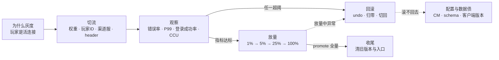
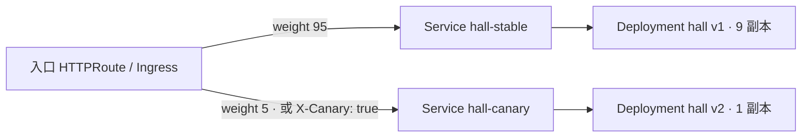
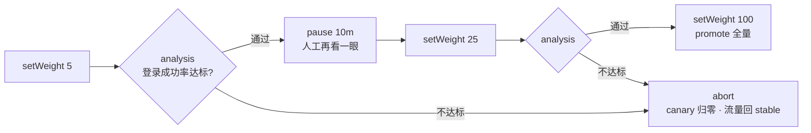
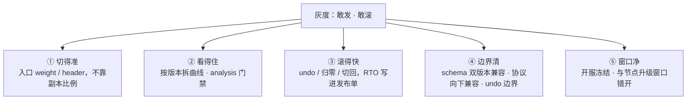
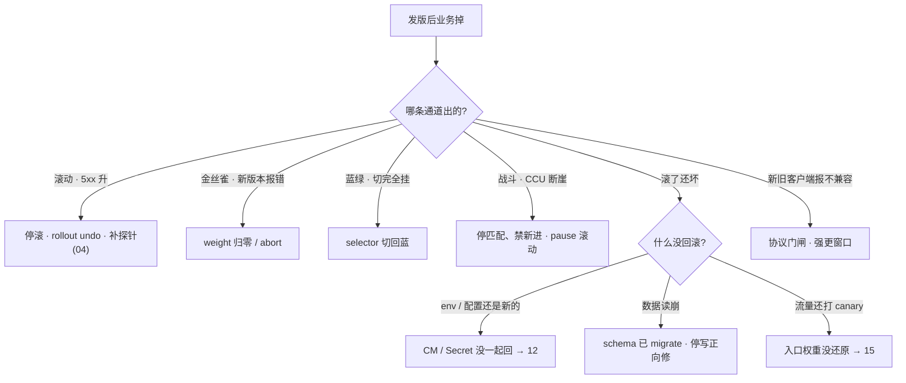

# 灰度与回滚

> 活动当天新版本灰度 5%，Grafana 错误率爬坡，有人喊「再观察 10 分钟」；战斗 Deployment 跟着 `set image` 滚，对局还在内存里、CCU 断崖；道具表已 migrate，有人伸手 `rollout undo`——三步全错。
> **本章回答**：一次灰度的一生——切给谁、看什么、怎么放、坏了怎么滚；以及战斗服、协议、客户端三个游戏特例。
> **不讲**：探针 / preStop / 优雅退出 → [04](../04-Pod生命周期/)；Deployment 滚动字段与 PDB → [05](../05-工作负载控制器/)；HPA → [07](../07-弹性伸缩/)；Ingress / Gateway weight 实现 → [15](../15-Ingress与流量管理/)；ConfigMap 不热更 → [12](../12-配置与密钥/)；热更与开服合服 → [07-05](../../07-游戏运维专题/05-热更新与版本发布/)、[07-06](../../07-游戏运维专题/06-开服合服/)；节点 drain → [17](../17-节点运行时与升级/)；GitOps 流水线 → [23](../23-GitOps-ArgoCD与Tekton/)。

**标记**：🎯重点 · 🔥难点 · ⭐常考 · 🔧实操

---

## 一、一张图：一次灰度的一生

> 🎯 **一句话**：一次灰度走「切流 → 观察 → 放量 → 全量」；任一档异常都拐进回滚——先问「卡在哪一段」。口诀：⭐ **选灰度方式，就是在选回滚方式**。



- 📖 **读图**
  - 🛤️ 主线从左到右：先定「切给谁」，再看指标决定「继续还是拐回去」；每个节点对应后面一节
  - 🔄 回滚是**常驻出口**，不是失败分支——观察和放量每一步旁边都站着它，所以回滚方式要在发版前选好（六节）
  - 💀 最下面虚线最贵：代码滚回去了，配置和数据没跟着回（六节「滚不回去」）

本节对应练习题 Q1。

---

## 二、为什么灰度：玩家是活连接

> 🎯 **一句话**：Web 可以一刀切，游戏不行——玩家是挂在进程上的活连接，发版先管**爆炸半径（blast radius）**。

### 💥 一刀切的三个后果 ⭐

- 🔌 **活连接**：长连接挂在具体进程上；一刀切替换 = 全体掉线，重连洪峰同一秒砸网关 / 登录服
- 🧠 **状态在内存**：对局、房间、匹配结果在进程里；进程死状态没了——Web「重试到另一台」对战斗服不存在
- 📱 **协议有两端**：客户端在玩家手里；服务端升级带不动客户端，协议不兼容时全量 = 逼全体同时更新

> 💡 **打个比方**：全量像高峰期把全城红绿灯一次性换掉；灰度是先换一个路口看两天。玩家是已经在路上的车，没法先全下线再换灯。

#### ❓ 为什么游戏必须管爆炸半径，不能「发完再看」？

- ❌ 「先全量、坏了再 undo」——活连接一断就是全服事故；重连洪峰可能打穿容量，undo 救不回那一波掉线
- ✅ 灰度本质是**坏了会波及多大范围**的管理，不是部署姿势偏好
- 🧭 所以第一刀永远是「切给谁、切多少」，不是「镜像打完再上」

### 🛤️ 四种切流方式 🎯⭐

| 方式 | 怎么切 | 回滚 | 代价 |
|------|--------|------|------|
| **滚动 Rolling** | 同一 Deployment 逐步换副本 | `rollout undo`，分钟级 | 省资源；切换期新旧混跑 |
| **蓝绿 Blue-Green** | 两套齐活，切 Service / Ingress selector | selector 切回，**秒级** | 双倍副本；schema 须双版本兼容 |
| **金丝雀 Canary** | 入口按权重或 header 先切小比例 | 权重归零 / abort | 要观察窗口与指标门禁 |
| **流量镜像 Mirror** | 拷一份请求到影子，**响应丢弃** | 停镜像即可 | 不验证真实用户；写路径双写 |

- 🏷️ **滚动**：默认路径；资源最省；回滚靠 `rollout undo`（六节）
- 🏷️ **蓝绿**：两条平行高架，改指示牌切流——最贵也回得最快
- 🏷️ **金丝雀**：本章主角；先切一小撮试错，达标再放量
- 🏷️ **镜像**：入口 RequestMirror 拷请求到影子 Deployment，响应丢弃、用户无感；适合预验读流量。影子无真实会话时，对战斗服镜像无意义。常先镜像压读、再金丝雀上真流量

#### ❓ 为什么镜像 ≠ 金丝雀？

- 🪞 **镜像**：响应被丢弃，用户永远吃旧版返回——验证不了真实用户路径
- 🐤 **金丝雀**：真玩家流量，会真出错也真挨骂
- ☠️ 更危险：镜像写路径（支付 / 发货）= **双写**，出事只能数据修复，与切流无关

- 🧭 **选型一口回**
  - 要秒级回切且有预算 → 蓝绿
  - 资源紧、要小流量验证 → 金丝雀
  - 默认省资源 → 滚动
  - 只看新版本扛不扛读、不碰用户 → 镜像（只读路径）
  - 新旧根本不能共存（协议硬断、独占 RWO）→ **Recreate**：先杀光再起，接受停服窗口；回滚是再 Recreate 一次，玩家断两次

- ⏱️ **RTO（Recovery Time Objective）**先写进发布单：无状态目标 **2–5 分钟**；有状态按「能否不停服」定，定不了就别高峰发。⭐ **选方式 = 选回滚**，不是选部署美学。

### 🛞 滚动四件套：一切灰度的底座 🔥⭐🔧

> 🎯 **一句话**：零停机 = 先起后杀 + 不 Ready 不接流量 + 抽干再死 + Ready 后稳一下，缺一件就 502。

> 💡 **打个比方**：换轮胎先把备胎顶起来（先起新）、确认能承重（readiness）、再卸旧胎（preStop 抽干）——直接卸旧胎，车当场塌。

- ① **`maxUnavailable=0`**：先起新再杀旧；多出来的由 `maxSurge` 提供。surge 拉满 → 新 Pod 全 Pending，像滚动卡死（调度 → [06](../06-调度机制/)）。副本少时还要和 PDB 一起看（[05](../05-工作负载控制器/)）
- ② **readiness**：不 Ready 不进 Endpoints（[04](../04-Pod生命周期/)）。没有它，K8s 把 `Running` 当可接流量 → 滚动期一片 502
- ③ **preStop + 足够 grace**：移出 Endpoints 后先抽干存量连接再退出（[04](../04-Pod生命周期/)）
- ④ **`minReadySeconds`**：Ready 后再稳几秒才算可用，防「Ready 了立刻挂」
- 🔪 **暗刀**：liveness 过严会在滚动中杀掉初始化中的新 Pod，永远滚不完（[04](../04-Pod生命周期/)）

> 🔍 **现场**：滚动期大厅 502，先看滚动状态和 Endpoints。

```bash
kubectl rollout status deploy/hall -n prod
# Waiting for deployment "hall" rollout to finish: 3 out of 10 new replicas have been updated...
kubectl get pods -n prod -l app=hall -o wide
# 新 Pod 已 Running 但业务报 502 → 查它是不是太早进了 Endpoints
kubectl get endpoints hall -n prod
kubectl describe pod hall-xxxxx -n prod | grep -A5 Readiness
# 典型根因：没有 readiness，Running 被当成可接流量   ← 止血：kubectl rollout undo deploy/hall
```

- 🩹 **滚动卡住认三种**
  - 新 Pod 永不 Ready（探针 / 依赖 / liveness 过严）→ `rollout status` + describe
  - 新 Pod Pending（surge 吃满资源）→ 查调度
  - Ready 满但业务掉（发布完成 ≠ 发布成功）→ 立刻 undo，去看 Grafana（四节）
- ✋ **手工挡一手**：`kubectl rollout pause` 停在当前比例观察 → 有问题 `undo`、没问题 `resume` = **手工金丝雀**；入口没切权重时比例仍粗（三节）

> 📝 **面试**：「滚动四件套：maxUnavailable=0、readiness、preStop、minReadySeconds；没有 readiness 不能零停机；成功看业务指标，不看 `rollout status`。」

本节对应练习题 Q1、Q2。

---

## 三、切流：灰度的四个维度

> 🎯 **一句话**：灰度准不准在入口决定——权重切比例、玩家 ID 切人、渠道服切服、header 切标记。

### 🎯 切给谁：四个维度 ⭐

| 维度 | 怎么切 | 适用 |
|------|--------|------|
| **按权重 weight** | 入口权重 95/5，请求随机抽样 | 无状态 HTTP 默认 |
| **按玩家 ID** | `hash(uid) % 100 < 5` 走新版 | 同一玩家体验一致；内部号精准圈定 |
| **按渠道服** | 只发某渠道 / 某区服 | 爆炸半径按服隔离（游戏特有） |
| **按 header** | 请求头匹配（内部号 / 客户端版本） | 内部验证、非比例灰度 |

- ⚖️ **权重**：最简单；同一玩家两次请求可能打中新旧——无状态无所谓，有状态会串
- 🆔 **玩家 ID**：哈希分桶保证「要么一直新、要么一直旧」；内部号白名单永远走新版——游戏第一个 1% 通常是内部号。这一层在网关 / 登录实现，入口权重做不到
- 🌏 **渠道服**：先发测试服或低活跃服，整服新版本；还能躲开匹配池分裂（七节）。代价：样本可能不典型（鬼服测不出大 R 充值）
- 🏷️ **header 路由**：Ingress canary-by-header / HTTPRoute header 匹配（[15](../15-Ingress与流量管理/)）。常叠用：**header 先验内部 → 权重再扩外部**

> ⚠️ **别混**：灰度要切在**原入口**上。换成新域名 / 新入口，服务端以为是 10% 金丝雀，客户端其实 100% 打到新门——切的是同一条入口的分流规则，不是换个门。

### 🧩 原生手段：双 Deployment + 双 Service 🔧

灰度不是装出来的，是**发布通道先存在**。不装发布组件，两个 Deployment + 两个 Service + 入口权重就是一次金丝雀：



- 📖 **读图**
  - 🚪 开关在**入口**，不在副本数——两个 Service 各自 Endpoints（[08](../08-Service与kube-proxy/)）只含新旧 Pod
  - 🔧 改一行 weight 就改分流；回滚 = weight 归零

```yaml
apiVersion: gateway.networking.k8s.io/v1
kind: HTTPRoute
spec:
  rules:
  - backendRefs:
    - { name: hall-stable, weight: 90 }
    - { name: hall-canary, weight: 10 }      # ← 金丝雀：改的是用户流量
    filters:
    - type: RequestMirror
      requestMirror:
        backendRef: { name: hall-v2-shadow }  # ← 镜像：另拷一份，丢响应；写路径整段删掉
```

- 🧱 **各通道最小前提**
  - 滚动 = RollingUpdate + 探针 + PDB
  - 蓝绿 = 两套 Deployment + 可改的 Service / Ingress
  - 金丝雀 = 入口权重或注解 + 指标门禁
  - 镜像 = RequestMirror + 影子不挂正式 Service
  - 战斗 = 独立节点池 + 停匹配开关 + 客户端门闸
- 托管集群只给你 Deployment，通道要自己拼——控制台点「发布」仍要自己选通道，厂商不会替你停匹配

> 🔍 **现场**：看当前权重；5% 已坏，立刻归零，不必等 100%。

```bash
kubectl get httproute hall -n prod -o yaml | grep -A6 backendRefs
#     backendRefs:
#     - name: hall-stable
#       weight: 95
#     - name: hall-canary
#       weight: 5                # ← 金丝雀比例写在这里，不在副本数里
kubectl edit httproute hall -n prod
# canary weight 改 0、stable 改 100，保存即止血
```

### ⚖️ 入口权重 vs 副本比例 ⭐

> 💡 **打个比方**：入口权重像收费站指定「每十辆放一辆走新路」；副本比例像新旧两条路自然混流——没人指挥，长连接的老车还赖在旧路上。

| | 入口权重（准） | 副本比例（粗） |
|--|-----------|----------------|
| 手段 | Ingress / HTTPRoute weight | 两个 Deployment 共用一个 Service selector |
| 例 | v1 90% / v2 10% | 9 副本 / 1 副本 ≈ 不稳的 10% |
| 长连接 | 新登录才慢慢挪 | 旧连接粘在旧 Pod，更偏 |

#### ❓ 为什么 1 个 canary 副本 ≠ 10% 流量？

- 📐 副本比例靠 kube-proxy 近似均分（[08](../08-Service与kube-proxy/)），**不是**入口抽样
- 🔗 **长连接粘旧 Pod**——连接活得越久偏得越狠；游戏全是长连接，「1 canary = 10%」必错
- 🚪 没有入口权重能力（NodePort / LB 直连）时只能退回副本比例 + pause，精度大打折扣——这是原生手段的边界

> 📝 **面试**：「1 个 canary 副本不等于 10%；入口 weight 才是准的。5% 坏了立刻归零，不要等 100%。」

口诀：⭐ **入口权重准，副本比例粗**。

本节对应练习题 Q3、Q4、Q6。

---

## 四、观察：指标才是门禁

> 🎯 **一句话**：发布成功与否只看业务指标——错误率、P99、登录成功率、CCU；Ready 全绿只是前提，不是结论。

### 📊 观察窗口看四样 ⭐

- **Ready** 是调度 + 探针的结果（[04](../04-Pod生命周期/)）：只证明进程起来了、端口开了、探针过了——**证明不了版本是对的**
- 🔴 **错误率**：HTTP 5xx 或游戏协议错误码占比——最灵敏，第一眼看它
- 🐢 **延迟**：看 **P99** 不看均值——锁竞争 / GC / 慢调用藏在尾部
- 🔑 **登录成功率**：游戏黄金指标；登录掉则一切都掉
- 👥 **CCU（Concurrent Users）**：断崖 = 玩家用脚投票；滞后，但是最终裁决。充值成功率掉了，不等其他，直接滚

#### ❓ 为什么 Ready 全绿还不能宣布成功？

- ✅ Ready = 「发布**完成**」——调度和探针过了
- ❌ 不是「发布**成功**」——成功只能由业务指标裁决
- 🛑 「Ready 全绿但登录掉」的唯一正确动作是立刻回滚，不是「再观察 10 分钟」

> 🔍 **现场**：`rollout status` 只看一眼，别信它。

```bash
kubectl rollout status deploy/hall -n prod
# deployment "hall" successfully rolled out   ← 只证明「滚完了」，不证明「业务好」
```

- 📉 **按版本拆曲线**：金丝雀只有 5% 时，**聚合指标会把问题稀释**——5% 全错，聚合错误率也只抬一点点。必须按版本维度（stable / canary）拆两条对比；Prometheus 打版本标签（[09-02](../../09-可观测性与SRE方法论/02-Prometheus与PromQL/)）
- ⏳ **观察多久**：每档至少盖住一个业务节律（一次登录高峰 / 一次匹配高峰），通常 **10–30 分钟**一档。高峰不做长窗口灰度；开服、活动夜根本不灰度（七节）

> 📝 **面试**：「Ready 是调度和探针，不是业务。发版看 5xx、P99、登录成功率、CCU，按版本拆开对比，不看聚合值。」

本节对应练习题 Q7。

---

## 五、放量：canary steps 与 Argo Rollouts

> 🎯 **一句话**：放量一档一档走，每档 = 改权重 + 过门禁；Argo Rollouts 把这套写成声明式对象。

### 🪜 手动挡与自动挡 ⭐

- **手动**：编辑入口权重 5 → 看指标 → 25 → 看 → 100。台阶按 **1%（内部号）→ 5% → 25% → 100%**；每档权重、观察时长、回滚阈值提前写进发布单
- **自动**：**Argo Rollouts** = K8s 发布控制器，提供 **Rollout** CRD——接管 Deployment 管 ReplicaSet 的活，并加 canary / blue-green 策略。把 Deployment 换成 Rollout，Service、入口、探针不变

```yaml
apiVersion: argoproj.io/v1alpha1
kind: Rollout
spec:
  replicas: 10
  strategy:
    canary:
      stableService: hall-stable      # ← 旧版本 Service
      canaryService: hall-canary      # ← 新版本 Service
      steps:                          # ← canary steps：放量剧本
      - setWeight: 5
      - pause: { duration: 10m }
      - analysis:
          templates: [{ templateName: hall-login-success }]
      - setWeight: 25
      - pause: { duration: 30m }
      - setWeight: 100
```

- **analysis** = 某一步跑预定义指标检查；查询和阈值写在 **AnalysisTemplate** 里，不达标自动 **abort**

```yaml
apiVersion: argoproj.io/v1alpha1
kind: AnalysisTemplate
metadata: { name: hall-login-success }
spec:
  metrics:
  - name: login-success
    interval: 5m
    successCondition: "result[0] >= 0.995"   # ← 登录成功率低于 99.5% 判不通过
    provider:
      prometheus:
        query: |
          sum(rate(game_login_total{version="canary",code="ok"}[5m]))
            / sum(rate(game_login_total{version="canary"}[5m]))
```



- 📖 **读图**
  - 🔷 每个菱形是一次门禁，过了才许进下一档权重；任何一档不过都走同一条下道——abort
  - ⏸️ `pause: {}` 不写时长 = 纯手动确认，等人 `promote`

- 🚪 **两个出口**
  - **abort（中止）**：canary 流量归零、全部回 stable——回滚在 Rollouts 里的名字
  - **promote（晋级全量）**：跳过剩余步骤到 100%——「人点头」的动作

#### ❓ 为什么 abort 不是发布失败？

- ✅ 门禁不过就 abort **正是灰度存在的意义**——正常动作，不是丢人
- ❌ 把 abort 当「发布失败」→ 现场会犹豫、硬撑到 100%
- 🔁 **promote ≠ 重启**：只推进步骤，不碰 Pod
- ⚠️ `kubectl rollout undo` 对 Rollout **不生效**——走 abort / `kubectl argo rollouts undo`

> 🔍 **现场**：看一条 Rollout 走到哪一步。

```bash
kubectl argo rollouts get rollout hall -n prod
# Name: hall    Status: ॰ Paused    Strategy: Canary    Step: 2/6
# Replicas:  Desired: 10   Updated: 1        ← Updated=1 就是 canary 副本
#   ├──⧉ hall-6c9f8b7d5b   ReplicaSet  stable   9 副本
#   └──⧉ hall-7d8f9c6e4a   ReplicaSet  canary   1 副本
# ← Step 2/6 = 停在第二个 pause 上；analysis 挂了这里会变 Degraded

kubectl argo rollouts abort rollout/hall -n prod    # 回滚：归零，流量回 stable
kubectl argo rollouts promote rollout/hall -n prod  # 全量：跳过剩余步骤
```

- 🔵 Rollout 也能做蓝绿：`strategy.blueGreen` 声明 `activeService` / `previewService`；`autoPromotionEnabled: false` 停在 promote 前等人点头。金丝雀和蓝绿是同一对象、两种策略，回滚出口都是 abort / undo
- 🧩 **分工**：权重由**入口**执行（[15](../15-Ingress与流量管理/)）；Rollout 对象可由 GitOps 管理（如 Argo CD，[23](../23-GitOps-ArgoCD与Tekton/)）；指标来自 Prometheus（[09-02](../../09-可观测性与SRE方法论/02-Prometheus与PromQL/)）——Argo Rollouts 不替代入口，它是**自动改权重 + 自动过门禁**的那只手

> 🔍 **现场**：analysis 挂了——看 AnalysisRun 的 status 和 Rollout conditions。

```bash
kubectl get rollout hall -n prod -o jsonpath='{.status.conditions}' | jq .
# [{"type":"Healthy","status":"False","reason":"AnalysisRunFailed",
#   "message":"Metric 'login-success' failed: 0.989 < 0.995"}]   ← 门禁没过

kubectl get analysisrun -n prod -l rollouts.argoproj.io/rollout=hall
# hall-5f8b9c-2                   Failed       8m    # ← Failed = 指标没达标

kubectl get analysisrun hall-5f8b9c-2 -n prod -o jsonpath='{.status.metrics}' | jq .
# [{"name":"login-success","phase":"Failed","measurements":
#   [{"value":"0.989","phase":"Failed"}]}]   ← 0.989 < 0.995，abort 的直接证据

kubectl argo rollouts get rollout hall -n prod --history
# REVISION   STATUS      TIME         STRATEGY
# 1          Healthy     2d ago       Canary
# 2          Failed      5m ago       Canary   ← undo 回 revision 1
```

> 📝 **面试**：「canary steps 把放量和门禁声明成步骤；analysis 挂了自动 abort，全量是 promote。和手写脚本的区别：门禁声明式、自动执行、有审计，不靠人盯屏。」

本节对应练习题 Q5。

---

## 六、回滚：什么时候滚、怎么滚、滚不回去怎么办

> 🎯 **一句话**：什么时候滚看阈值，怎么滚看通道，滚不回去多半是配置和数据没跟着回。

### ⏰ 什么时候滚 ⭐

- 🚨 **立刻滚，不要「再观察 10 分钟」**：错误率超阈、登录掉、CCU 断崖、充值掉、战斗异常——任一命中就动手。「再观察」只允许指标**没超阈**但存疑时
- 🐤 **金丝雀 5% 已坏**：权重立刻归零——灰度价值就是在 5% 发现问题
- ⏸️ **只需停滚**：新版本 Pod Pending（镜像 / 调度）而流量还没切过去——停滚修镜像，业务仍在旧版，无需回滚
- 🔥 **开服日 CCU 跌 50%**：按 P0——切流 / 停匹配，不走普通灰度节奏

### 🔧 怎么滚

| 回滚动作 | 对应通道 | 命令 | RTO |
|----------|----------|------|-----|
| `rollout undo` | 滚动 | `kubectl rollout undo deploy/hall` | 分钟级 |
| 权重归零 / abort | 金丝雀 | `kubectl edit httproute` / `argo rollouts abort` | 秒～分钟级 |
| selector 切回 | 蓝绿 | `kubectl patch svc` 改回 selector | **秒级** |

> 🔍 **现场**：蓝绿切流只动一个 selector，回滚就是 patch 回去。

```bash
kubectl get svc hall -n prod -o jsonpath='{.spec.selector}'
# {"app":"hall","color":"blue"}                     # ← 当前接流量的是蓝
kubectl patch svc hall -n prod -p '{"spec":{"selector":{"app":"hall","color":"green"}}}'
kubectl get endpoints hall -n prod
# Endpoints 换成绿的 Pod IP = 切生效   ← 绿全 Ready 但 Endpoints 还全是蓝 = 没切过去
```

```bash
kubectl rollout history deploy/hall -n prod
# REVISION   CHANGE-CAUSE
# 8          image: hall:v3.1.0
# 9          image: hall:v3.2.0        ← 少于两行，undo 无路可走
kubectl rollout undo deploy/hall -n prod --to-revision=8
```

> ⚠️ **别混**：**undo ≠ 切流**。「rollout undo」不是通用回滚键——对蓝绿和入口权重都无效。滚动 → undo；蓝绿 → selector 切回；金丝雀 → 权重归零 / abort。

### 🧱 undo 的边界 🔥⭐

#### ❓ 为什么 `rollout undo` 滚不回 ConfigMap / schema？

- 📦 `rollout undo` **只回工作负载的 revision**（ReplicaSet / 镜像等）
- 🚫 **不在里面的**：ConfigMap / Secret / 其它 CR / **DB schema** / 客户端版本 / 入口权重
- 🪖 军纪两条：`revisionHistoryLimit` 生产 **≥5**（设 0 = 拆掉 undo）；镜像用 **digest 或不可变 tag**（`latest` 会漂移）
- 👀 发版窗口还要看一眼 HPA（[07](../07-弹性伸缩/)）：它可能把 undo 后的 replicas 又改回去

- 🔍 **undo 完还坏，查三处**
  1. `exec` 进 Pod 看 env / 配置——CM 是不是还是新版（env 型不热更，CM 回了还要重建 Pod，[12](../12-配置与密钥/)）
  2. 问 DBA：表是不是已经 migrate
  3. 入口权重是不是还指着 canary

### 💀 滚不回去怎么办 🔥

- 最难：**数据已经用新 schema 写过**。绿用新 schema 写了部分订单，切回蓝 = 旧代码读新数据 → 读崩
- 流程：**先停写** → 评估正向修或回档备份（[07-09](../../07-游戏运维专题/09-玩家数据备份与回档/)）→ **禁止盲 undo 代码**。代码回滚秒级，数据回滚是另一个工程
- 🛡️ **expand-contract（先加后删）**：先加列 → 发代码双读双写 → 确认旧列无人读 → 再删旧列。加列不用回；双写代码回旧版仍读旧列；只有删列后才真正不可逆
- 📱 客户端侧「滚不回去」：服务端滚回了，新协议客户端已发出——靠版本门闸或热更包收场（七节）

### 收束：一次灰度凭什么敢发敢滚 🎯⭐



- 📖 **读图**
  - ①②管「发得对」——切给谁、看什么
  - ③④管「滚得回」——动作要快、边界要清
  - ⑤管「别在不该发的时候发」；五件缺一件，灰度就从风险管理退化成碰运气

- 背法：**切、看、滚、界、窗**
  - ① 切得准：入口 weight / header，不靠副本比例；切在原入口
  - ② 看得住：错误率 / P99 / 登录 / CCU 按版本拆；门禁固化成 AnalysisTemplate
  - ③ 滚得快：undo / 归零 / abort / 切回 selector；RTO 写进发布单
  - ④ 边界清：schema 双版本、协议向下兼容；undo 不含 CM / DB / 入口 / 客户端
  - ⑤ 窗口净：开服冻结只留 hotfix；发版与节点升级错开

> ⚠️ **别混**：灰度**不保证零损失**——观察窗口那 5% 就是代价，只保证损失不扩大；也**不保证数据能回滚**——代码回滚 ≠ 数据库回滚。

> 📝 **面试**：五件套按「切、看、滚、界、窗」分组背，最后补「灰度不保证零损失，只保证爆炸半径可控」。

本节对应练习题 Q8、Q9。

---

## 七、游戏特例：战斗服、协议、强更窗口

> 🎯 **一句话**：游戏灰度比 Web 多三道墙——对局在内存、协议有两端、客户端有版本。

### ⚔️ 战斗服：有状态灰度 🔥⭐

对局在内存里，**滚动 = 杀进程 = 杀对局**，新副本不会接手旧房间。看到 **CCU 断崖**，第一反应先问「是不是滚了战斗服」。

```text
① 停匹配、禁新进房间（运营侧开关，不是 kubectl）
② 新房间调度到新版本实例
③ 旧实例等对局自然排空再下线
④ 高峰前排不空 → 排进维护窗口（07-07）
```

#### ❓ 为什么战斗服不能 `rollout undo`？

- ☠️ undo 会重建 Pod = 杀掉还在打的对局——比「再观察」更狠
- ✅ 正确动作：`rollout pause` 保住还没滚的旧实例 + 运营侧停匹配
- 🧠 根因：有状态灰度 ≠ Web 滚动语义；止血顺序是**保对局**，不是**回镜像**

> 🔍 **现场**：发现战斗 Deployment 在滚，先 pause，别 undo。

```bash
kubectl rollout pause deploy/battle -n prod
# ← pause 保住还没滚的旧实例；运营侧同时停匹配
# 不要 rollout undo——undo 会重建 Pod，等于杀掉还在打的对局
```

- 🔥 **匹配池分裂**：双版本并存时协议 / 战斗逻辑不一致 → 玩家互相匹配不上，一个池劈成两半，匹配时长翻倍
  - 解法：匹配按版本号优先同版本，或按渠道服整服灰度（三节）
  - > 💡 **打个比方**：两个版本规则不同却排同一个队——要么互相看不懂，要么各开各桌，每桌更难凑齐人

### 📡 协议兼容 ⭐

- 服务端灰度 = 新旧共存：**新服必须懂旧客户端**（向下兼容）；旧服最好也能懂新客户端（向上兼容）
- 匹配服最敏感——两套逻辑跑出不一致结果就没法合并
- **协议不兼容时不要「小比例金丝雀互打」**——那是把分裂常态化；要么 Recreate 接受窗口，要么客户端强更

### 📱 客户端强更窗口 ⭐

- 服务端协议改了、旧客户端不懂 → **强制更新** = 全体掉线 → 下包 → 重连（人为流量洪峰）
- 挑低峰、避开活动当天；包体提前推 CDN（[07-08](../../07-游戏运维专题/08-CDN与资源更新/)）
- **版本门闸**：服务端记最低允许版本；低于它的客户端被引导更新。开门闸 = 强更开始；门闸回旧包体 = 强更回滚

### 🔥 热更 ≠ 滚动

- 热更 = 进程内加载脚本 / 配置（[07-05](../../07-游戏运维专题/05-热更新与版本发布/)），不杀进程
- 滚动杀进程。「热更都过了，这次滚动应该无感」是错的——两条通道互相独立，同一张发布单分别管理

### 🧊 开服冻结与发前检查单 ⭐

- 开服 / 大活动 / 合服当晚**冻结**普通灰度，只留 hotfix 审批；发布单写清通道和审批人——没有名单 = 谁都能滚
- 发版窗口与节点升级（[17](../17-节点运行时与升级/)）错开：不要同一晚既滚战斗服又 drain 战斗节点

**发前检查单**（缺一项不点发布）：

1. 镜像 digest（不是 latest）
2. readiness / PDB / grace 齐
3. HPA 会不会把副本打回去
4. ConfigMap / Secret 与镜像同版本
5. 有状态服是否已停匹配
6. 回滚命令谁执行、看哪块 Grafana
7. schema 是否双版本兼容

开服日缺第 5 条直接不点；缺第 7 条 = 没有回滚；客户端协议不兼容再加门闸检查。

### 各负载：发与回

| 负载 | 发 | 回 |
|------|----|----|
| 大厅 HTTP | 滚动四件套 / 金丝雀 weight | undo 或 weight 归零，连着 CM 一起回 |
| 支付 HTTP | 蓝绿 / 金丝雀 | 切回蓝；**先问 schema** |
| 匹配 | 小比例金丝雀 + 协议必须兼容 | 停新匹配，摘 canary |
| 战斗 / 房间 | 空服接新房间；维护窗口 | **停匹配、禁新进** |
| 热更脚本 | 进程内加载 | 热更通道回退，不是 `rollout undo` |
| 客户端协议 | 版本门闸 | 门闸回旧包体 |

本节对应练习题 Q10、Q11、Q12、Q13。

---

## 八、作战：定责

> 🎯 **一句话**：先缩爆炸半径（undo / 归零 / 切回 / 停匹配），再查新版本根因——顺序反了就是把事故当故障排查。

三问定先后：**对局进程还在不在**？**还能不能变更**？**已有流量还通不通**？发版出问题永远先止血、后查新 Pod。



- 📖 **读图**
  - 第一问永远是「哪条通道」——四条通道的回滚动作互不通用
  - 第二问是「回滚生效了吗」——滚了还坏走右下三分支，根因在代码之外

| 现象 | 先做 | 别做 |
|------|------|------|
| Ready 全绿但登录掉 | undo / 切流，看 Grafana | 「再观察 10 分钟」 |
| 滚动 502 | 补 readiness / undo | 继续滚 |
| 金丝雀 5xx | weight 归零 | 等到 100% 再看 |
| 战斗 CCU 断崖 | 停匹配、pause 滚动 | `rollout undo` 杀对局 |
| undo 后还坏 | 查 CM / DB / 入口 | 再滚一次 |
| 开服日 CCU 跌 50% | P0 切流 / 停匹配 | 走普通灰度节奏 |

### 60 秒剧本 🔧

```text
① 0–10s   哪条通道、走到哪一步？  kubectl rollout status / kubectl argo rollouts get rollout
② 10–30s  先止血：滚动→undo · 金丝雀→归零/abort · 蓝绿→切回 · 战斗→停匹配
③ 30–45s  确认回滚生效：Endpoints / weight 还原 + Grafana 曲线出现拐点
④ 45–60s  还坏？查没回滚的东西：CM / Secret / DB schema / 客户端版本
```

本节对应练习题 Q14。

---

## 九、收口

### 命令速查 🔧

```bash
kubectl rollout status deploy/<n>                    # 滚完没；成功 ≠ 业务成功
kubectl rollout history deploy/<n>                   # 几个 revision，决定能不能 undo
kubectl rollout undo deploy/<n> --to-revision=<r>    # 滚动回滚，只回工作负载
kubectl rollout pause / resume deploy/<n>            # 手工金丝雀 / 继续滚
kubectl argo rollouts get rollout <n>                # 走到第几步、stable/canary 各多少
kubectl argo rollouts abort rollout/<n>              # 金丝雀回滚：归零回 stable
kubectl argo rollouts promote rollout/<n>            # 全量：跳过剩余步骤
kubectl get httproute <n> -o yaml                    # 当前权重是多少
kubectl patch svc <n> -p '{"spec":{"selector":…}}'   # 蓝绿切流 / 切回
```

### 面试锚点

| 问 | 30 秒答 |
|----|---------|
| 游戏为什么要灰度？ | 玩家是活连接：一刀切 = 全体掉线、对局被杀、强更全体；灰度是爆炸半径管理。 |
| 四种发布方式区别？ | 滚动原地换副本、分钟级 undo；蓝绿两套切 selector、秒级切回、双倍资源；金丝雀小比例先行；镜像丢响应只验读。 |
| 滚动四件套？ | maxUnavailable=0、readiness、preStop、minReadySeconds；没有 readiness 不能零停机。 |
| 灰度怎么圈人？ | 权重随机、玩家 ID 哈希保一致、渠道服整服、header 圈内部；切在原入口上。 |
| 1 个 canary 副本 = 10%？ | 不等于；入口权重准，副本比例粗，长连接粘旧 Pod 更偏。 |
| Argo Rollouts 是什么？ | Rollout CRD 接管 Deployment；canary steps 声明放量，analysis 挂了自动 abort，全量是 promote。 |
| analysis 和人工盯盘区别？ | AnalysisTemplate 把指标查询与阈值写成对象，不达标自动 abort，有审计。 |
| 发版看哪些指标？ | 错误率、P99、登录成功率、CCU；Ready 全绿只是前提；按版本拆开对比。 |
| 什么时候回滚？ | 错误率 / 登录 / CCU 任一超阈立刻滚；5% 已坏立刻归零；只 Pending 停滚即可。 |
| 怎么回滚？ | 滚动 undo、金丝雀归零 / abort、蓝绿 selector 切回；RTO 写进发布单。 |
| `rollout undo` 不含什么？ | CM / Secret / DB / 客户端 / 入口权重；historyLimit ≥5，镜像用 digest。 |
| undo 完还坏查什么？ | 三处：CM 没一起回、数据已迁移、入口还指 canary。 |
| schema 已 migrate 怎么回？ | 停写、正向修或回档，禁止盲 undo 代码；平时按加列 → 双写 → 删列拆步。 |
| 战斗服怎么灰度？ | 停匹配禁新进 → 新房间进新实例 → 旧实例排空；不杀对局；匹配池按版本隔离。 |
| 协议不兼容怎么发？ | 不做双版本互打金丝雀；Recreate 窗口或客户端强更 + 版本门闸。 |
| 开服当天能灰度吗？ | 冻结；hotfix 走审批通道；发布单写审批人。 |
| 镜像和金丝雀区别？ | 镜像丢响应、不验证真实用户、写路径双写；金丝雀是真实流量。 |
| Rollout 的回滚怎么回？ | `kubectl argo rollouts abort` 或 `kubectl argo rollouts undo`；`kubectl rollout undo` 对 Rollout 不生效。 |
| analysis 挂了怎么查？ | `kubectl get analysisrun -l rollouts.argoproj.io/rollout=<n>`，看 status.metric 的 phase 和 value。 |

### 易错一句话对照

- Ready 全绿就能宣布成功 → 看错误率、P99、登录、CCU
- 1 个 canary 副本 = 10% → 入口权重准，副本比例粗
- 流量镜像等于金丝雀 → 镜像丢响应，只验读路径
- 蓝绿回滚是 `rollout undo` → 是切 selector，秒级
- `rollout undo` 回一切 → 不含 CM / DB / 入口 / 客户端
- `revisionHistoryLimit=0` 省 etcd → 拆掉了 undo，生产 ≥5
- latest 镜像也能 undo → 回不到确定版本，用 digest
- 5% 坏了等 100% 看完 → 立刻归零
- 战斗服按大厅一样滚 → 对局在内存，滚 = 杀对局
- 热更过了这次滚动无感 → 滚动杀进程，两条通道
- schema 不兼容蓝绿也能救 → 切流只解决进程版本，不解决数据
- Recreate 是分钟级 undo → 等于停服窗口
- 回滚 = 代码回滚 → 数据可能已写脏，先停写正向修
- abort 是发布失败 → 门禁不过就 abort 是正常动作
- 开服当天小修复随便滚 → 冻结，hotfix 走审批
- 灰度没有代价 → 观察窗口的流量就是代价，只保证损失不扩大
- `kubectl rollout undo` 对 Rollout 也生效 → 不生效，走 `argo rollouts abort` / `undo`
- analysis 挂了要翻 Rollout 日志 → 看 `kubectl get analysisrun` 的 status.metric value

### 数字墙

> 金丝雀台阶 **1% → 5% → 25% → 100%** · 无状态回滚 RTO **2–5 分钟** · 蓝绿切回 **秒级** · `revisionHistoryLimit` **≥5** · `maxUnavailable` **0** · 每档观察 **10–30 分钟** · 发前检查单 **7 项** · 战斗服发布 **先停匹配** · 别「再观察 **10 分钟**」

---

## 合上书

1. **默画一节主图**：切流 → 观察 → 放量 → 全量 / 回滚，以及「滚不回去」债线；说出问题先问「卡在哪一段」。（Q1）
2. **口述为什么灰度**：活连接三个后果；滚动 / 蓝绿 / 金丝雀 / 镜像的切法、回滚、代价；为什么选方式就是选回滚。（Q1）
3. **口述滚动四件套**：maxUnavailable=0 / readiness / preStop / minReadySeconds 各挡什么；滚动卡住认哪三种。（Q2）
4. **口述切流**：权重 / 玩家 ID / 渠道服 / header；为什么入口权重准、副本比例粗；双 Deployment + 双 Service 怎么拼。（Q3、Q4、Q6）
5. **口述观察**：四个指标、为什么 Ready 全绿不能宣布成功、为什么按版本拆开对比。（Q7）
6. **默画放量**：canary steps（setWeight → analysis → pause → 升档），何时 abort / promote；AnalysisTemplate 写了什么。（Q5）
7. **口述回滚**：什么时候滚；三种回滚动作各对应哪条通道；「滚不回去」查哪三处。（Q8）
8. **口述 undo 边界**：不含什么；`revisionHistoryLimit` 与 digest；schema 为何按「加列 → 双写 → 删列」。（Q8、Q9）
9. **口述游戏特例**：战斗服为何不能按 Web 滚、匹配池分裂、协议与强更、热更≠滚动、开服冻结与发前七项。（Q10–Q13）
10. **定责**：决策树第一刀问什么；现象·先做·别做里战斗与「滚了还坏」两行；60 秒剧本四步。（Q14）

十条都能不看稿讲下来，这一章就过了。终极测试：拦住开篇那三个误操作——「再观察 10 分钟」、战斗服跟着 `set image` 滚、伸手 undo。下一章：[17 节点、运行时与升级](../17-节点运行时与升级/)。底座：[05](../05-工作负载控制器/) · 入口：[15](../15-Ingress与流量管理/)。
