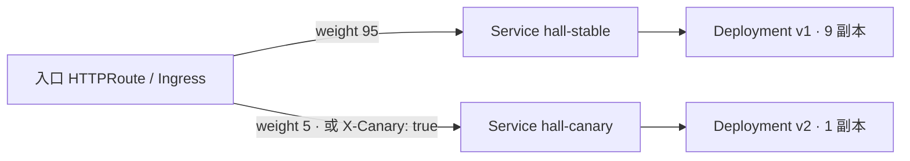
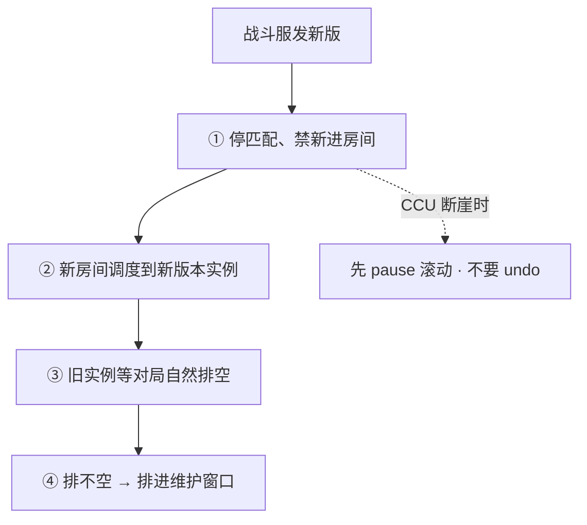

# 16｜灰度与回滚 · 练习题

开始做题前：合上知识点，对着**第一节的主图**，把「一次灰度的一生」口述一遍——为什么灰度 → 切流 → 观察 → 放量 → 全量 / 回滚，任何一段异常都拐进回滚。讲得出来再做题。

每道题先看场景自己答，再对完整解答。

题目顺序：Q1～Q2 为什么灰度与滚动底座；Q3～Q7 切流观察放量；Q8～Q9 回滚边界；Q10～Q14 游戏特例与定责。

| 标记 | 含义 |
|------|------|
| **核心** | 不懂整章就没建立起来 |
| **必会** | 值班和面试都要能讲 |
| **常用** | 线上会反复碰到 |
| **常考** | 白板和追问的高频口径 |

## 本题目录

- [Q1 游戏为什么要灰度](#q1)
- [Q2 滚动四件套](#q2)
- [Q3 灰度圈人四维度](#q3)
- [Q4 原生手段拼金丝雀](#q4)
- [Q5 Argo Rollouts 与 analysis](#q5)
- [Q6 入口权重 vs 副本比例](#q6)
- [Q7 发布成功看什么指标](#q7)
- [Q8 undo 够不够](#q8)
- [Q9 蓝绿切回与 schema](#q9)
- [Q10 Recreate 什么时候用](#q10)
- [Q11 战斗服灰度与匹配池分裂](#q11)
- [Q12 协议兼容与强更窗口](#q12)
- [Q13 开服冻结与发前检查单](#q13)
- [Q14 60 秒灰度定责](#q14)
- [合上书](#合上书)

---

## Q1

**★★★★★｜游戏发新版本，你会直接全量吗？滚动、蓝绿、金丝雀、流量镜像怎么选？回滚 RTO 差在哪？**

**覆盖**：核心 · 必会 · 常考 ｜ **对应**：知识点 [二、为什么灰度：玩家是活连接](知识点.md)

### 场景

支付要秒级回切，大厅想先 5% 看登录成功率。有人说「全量滚就完事，省事」；还有人拿流量镜像代替金丝雀，说「影子跑过了就等于玩家跑过了」。

先自己试试：不看下面，先口述一遍你的答案，再往下对。

### 完整解答

> 🎯 **一句话**：不能全量——玩家是活连接；蓝绿秒级切回、金丝雀小流量、滚动默认、镜像只验读，选方式就是选回滚。

游戏一刀切的三个后果：① 长连接挂在进程上，全量替换 = 全体掉线，重连洪峰砸穿网关和登录服；② 对局、房间在内存里，进程死状态就没了，没有「重试到另一台」；③ 协议有两端，不兼容时全量 = 逼全体玩家同时更新。所以灰度是爆炸半径管理。

四种方式的切法与回滚：

| 方式 | 怎么切 | 回滚 | 代价 |
|------|--------|------|------|
| **滚动** | 同一 Deployment 逐步换副本 | `rollout undo`，分钟级 | 省资源；新旧混跑 |
| **蓝绿** | 两套齐活，切 Service selector | 切回 selector，**秒级** | 双倍副本；schema 双版本兼容 |
| **金丝雀** | 入口权重 / header 先切小比例 | 权重归零 / abort | 要观察窗口与门禁 |
| **镜像** | 拷请求到影子，**响应丢弃** | 停镜像即可 | 不验证真实用户；写路径双写 |

选型一口回：要秒级回切且有预算 → 蓝绿（支付）；资源紧、要小流量验证 → 金丝雀（大厅）；默认省资源 → 滚动；只想看新版本扛不扛读、不碰用户 → 镜像（只读路径）。**回滚 RTO 写进发布单**：无状态目标 2–5 分钟，有状态按「能否不停服」定，定不了就不要在高峰发。

> ⚠️ **别混**：镜像 ≠ 金丝雀。镜像的响应被丢弃，用户全程吃旧版本——「影子跑过」只证明读路径扛得住，证明不了真实玩家路径；镜像写路径还会双写。

> 📝 **面试**：「切流方式决定回滚速度：蓝绿秒级切回、金丝雀归零、滚动 undo 分钟级。游戏玩家是活连接，全量 = 全体掉线 + 对局被杀，所以必须先管爆炸半径。」

### 再追问

**入口权重、Argo Rollouts、GitOps 各管什么？**——入口（Ingress / HTTPRoute）提供分流能力，Argo Rollouts 按 canary steps 自动改权重、过门禁，ArgoCD 这类 GitOps 管 Rollout 对象的声明与同步。不要把它们当同一个东西：不要只说「用 Argo 做灰度」而不说清权重是谁执行的（15）、步骤是谁声明的（23）。

---

## Q2

Q1 选完通道；这道题钉死滚动四件套——一切灰度的底座。


**★★★★★｜滚动更新怎样接近零停机？readiness 探针配错会怎样？**

**覆盖**：核心 · 必会 · 常考 ｜ **对应**：知识点 [二、为什么灰度：玩家是活连接](知识点.md)

### 场景

大厅滚动，`maxUnavailable` 用默认值，没有 readiness。发版窗口 502 一片，有人在群里喊「Ingress 坏了」，准备重启网关。

先自己试试：不看下面，先口述一遍你的答案，再往下对。

### 完整解答

> 🎯 **一句话**：零停机靠四件套：maxUnavailable=0、readiness、preStop+grace、minReadySeconds；没 readiness，Running 就被当可接流量。

- **`maxUnavailable=0`**：先起新再杀旧，副本数不减少；多出的副本由 `maxSurge` 给。资源紧时别把 surge 拉满，新 Pod 全 Pending 看起来像滚动卡死。
- **readiness**：不 Ready 不进 Endpoints。没有它，K8s 把 `Running` 当可接流量——进程刚起、数据没加载完就接请求，滚动期一片 502。
- **preStop + 足够的 grace**：被移出 Endpoints 后先抽干存量连接再退出，否则 in-flight 请求直接断。
- **`minReadySeconds`**：Ready 后稳几秒再算可用，防「Ready 了立刻挂」。

另一把暗刀：**liveness 过严**会在滚动中把初始化中的新 Pod 杀掉，滚动永远滚不完。

> 🔍 **现场**：

```bash
kubectl rollout status deploy/hall -n prod
# Waiting for deployment "hall" rollout to finish: 3 out of 10 new replicas have been updated...
kubectl get endpoints hall -n prod
# 新 Pod IP 已在里面、业务却 502 → 它太早进了 Endpoints
kubectl describe pod hall-xxxxx -n prod | grep -A5 Readiness
# 没有 readiness 配置   ← 止血：kubectl rollout undo deploy/hall
```

滚动卡住认三种：新 Pod 永不 Ready（探针 / 依赖 / liveness 过严）；新 Pod Pending（surge 吃满资源）；Ready 满但业务掉（立刻 undo，去看 Grafana，不要「再观察」）。

### 再追问

**`rollout pause` 是干什么的？**——停在当前比例观察，有问题 `undo`、没问题 `resume`，是手工金丝雀。不要 pause 之后忘了它——长期挂起的滚动既不能扩也不能回，交接时最容易变成无主状态；入口没切权重时，这个「比例」也只是副本数的粗近似（Q6）。

---

## Q3

底座有了；接下来问「切给谁」——四个维度。


**★★★★☆｜灰度的第一个 5% 怎么圈？按权重、按玩家 ID、按渠道服、按 header 各适合什么？**

**覆盖**：必会 · 常考 ｜ **对应**：知识点 [三、切流：灰度的四个维度](知识点.md)

### 场景

实习生把入口权重切成 95/5，说「内部灰度开始了」；QA 抱怨复现不了玩家报的 bug——内部号是被随机抽样的；另有人提议开个新域名当「灰度入口」。

先自己试试：不看下面，先口述一遍你的答案，再往下对。

### 完整解答

> 🎯 **一句话**：权重切比例、玩家 ID 切人、渠道服切服、header 切标记；内部验证永远用后三者之一，不用随机权重。

- **按权重**：入口随机抽样，无状态 HTTP 的默认选择；但同一玩家两次请求可能分别打中新旧版本。
- **按玩家 ID**：`hash(uid) % 100 < 5`，同一玩家体验一致不劈叉；内部号用 uid 白名单永远走新版——游戏灰度的第一个 1% 通常是内部号，不是随机玩家。这一层在网关 / 登录层实现，入口权重做不到。
- **按渠道服**：先发测试服或低活跃服，整服新版本，爆炸半径按服隔离，还能躲开匹配池分裂（Q11）；代价是样本不典型——鬼服测不出大 R 充值路径。
- **按 header 路由**：登录请求带版本号或内部标记，入口按请求头分流（Ingress canary-by-header / HTTPRoute header 匹配）。内部验证、非比例灰度用它。

常叠着用：**header 先验内部 → 权重再扩外部**。新域名不是灰度——切流要切在**原入口**上，换新入口等于客户端 100% 打新版本。

### 再追问

**内部号灰度和按权重灰度能只选一个吗？**——不能互相替代：内部号验证的是「功能对不对」（可复现、能看日志），权重灰度验证的是「比例大了扛不扛得住」（真实分布、真实压力）。不要拿内部号通过就上 100%——内部环境没有真实玩家的连接数、付费和脏数据。

---

## Q4

这是 Q3 的落地版：不装组件，双 Deployment + 双 Service 怎么拼。


**★★★★☆｜不装 Argo Rollouts，原生 K8s 怎么搭一次金丝雀？**

**覆盖**：必会 · 常用 ｜ **对应**：知识点 [三、切流：灰度的四个维度](知识点.md)

### 场景

集群只有 Deployment + Ingress，领导明天就要灰度。有人提议把新版本副本数改成 1、和旧版共用一个 Service，「1:9 就是 10%」。

先自己试试：不看下面，先口述一遍你的答案，再往下对。

### 完整解答

> 🎯 **一句话**：双 Deployment + 双 Service + 入口权重，开关在入口不在副本数；灰度不是装组件，是通道先存在。



两个 Deployment 各自挂一个 Service，入口按 weight 分流；两个 Service 的 Endpoints 分别只含新旧 Pod。回滚就是 canary weight 改 0，一行配置。没有 Rollouts 时，`kubectl rollout pause / resume` 挡在中间当人工门禁。

各通道的最小前提：滚动 = RollingUpdate + 探针 + PDB；蓝绿 = 两套 Deployment + 可改的 Service；金丝雀 = 入口权重或注解 + 指标门禁；镜像 = RequestMirror + 影子不挂正式 Service。托管集群点「发布」仍要自己选通道，厂商不会替你停匹配。

> ⚠️ **别混**：共用一个 Service 拼副本比例是粗的——长连接粘旧 Pod，1:9 不等于 10%（Q6）。

### 再追问

**镜像的影子 Deployment 要挂正式 Service 吗？**——不要。影子只接 RequestMirror 拷来的请求，响应直接丢弃，一旦挂进正式 Service 就会真接用户流量。影子出问题也不需要 `rollout undo`——停掉 RequestMirror 即可，用户从头到尾没吃过影子的响应。

---

## Q5

**★★★★★｜Argo Rollouts 的 canary steps 讲讲？analysis、abort、promote 是什么？**

**覆盖**：核心 · 常考 ｜ **对应**：知识点 [五、放量：canary steps 与 Argo Rollouts](知识点.md)

### 场景

金丝雀全程要人盯：改权重、看 Grafana、再改权重。凌晨 2 点没人盯屏幕，5% 的错误率爬了半小时才被发现。有人问：「灰度是不是要装什么东西？」

先自己试试：不看下面，先口述一遍你的答案，再往下对。

### 完整解答

> 🎯 **一句话**：Rollout CRD 把「改权重 + 过门禁」声明成 steps；analysis 挂了自动 abort，全量是 promote。

**Argo Rollouts** 是 K8s 发布控制器，提供 **Rollout** CRD：接管 Deployment 管 ReplicaSet 的活，加上策略与步骤。steps 是放量剧本：

```yaml
strategy:
  canary:
    stableService: hall-stable
    canaryService: hall-canary
    steps:
    - setWeight: 5
    - pause: { duration: 10m }
    - analysis:
        templates: [{ templateName: hall-login-success }]
    - setWeight: 25
    - pause: { duration: 30m }
    - setWeight: 100
```

**analysis** = 在某一步跑预定义的指标检查，查询和阈值写在 **AnalysisTemplate**（CRD）里，例如「Prometheus 查登录成功率 ≥ 99.5%，`interval: 5m` 反复采」；不达标自动 **abort**——canary 流量归零、回到 stable，不需要有人盯屏幕。**promote** 是反方向：跳过剩余步骤直接全量，`pause: {}` 不写时长时就是等人点头。

> 🔍 **现场**：

```bash
kubectl argo rollouts get rollout hall -n prod
# Name: hall    Status: ॰ Paused    Strategy: Canary    Step: 2/6
# Replicas:  Desired: 10   Updated: 1     ← Updated=1 是 canary 副本
#   ├──⧉ hall-6c9f8b7d5b   stable   9 副本
#   └──⧉ hall-7d8f9c6e4a   canary   1 副本

kubectl argo rollouts abort rollout/hall -n prod    # 回滚
kubectl argo rollouts promote rollout/hall -n prod  # 全量
```

和手写脚本的区别：门禁是声明式、自动执行、有审计记录——谁在哪一步被什么指标拦住，事后查得到。

### 再追问

**abort 是不是说明发布失败了？**——不是。门禁不过就 abort 正是灰度存在的意义，它是正常动作，值班不该为 abort 写事故报告；反过来该警惕的是「门禁形同虚设、从不 abort」。另外不要手工去删 canary 的 ReplicaSet——让控制器收场，手工删会让 Rollout 状态和现实对不上。

**`kubectl rollout undo` 能回滚一条 Rollout 吗？**——不能，那是给原生 Deployment 的；Rollout 用 `kubectl argo rollouts abort`（金丝雀）或 `kubectl argo rollouts undo`。不要混用这两套命令。

---

## Q6

就是高频错答：入口权重准、副本比例粗——和 Q4 原生手段呼应。


**★★★★☆｜Ingress 权重和 Deploy 副本比例，哪种金丝雀更准？长连接在这里起什么作用？**

**覆盖**：必会 · 常用 · 常考 ｜ **对应**：知识点 [三、切流：灰度的四个维度](知识点.md)

### 场景

用 1 个 canary 副本对 9 个稳定副本「当 10%」。结果长连接老玩家几乎没人打到 canary，新登录的玩家却打得偏多；值班看着「才 10%」放松警惕，错误率其实集中在某个渠道。

先自己试试：不看下面，先口述一遍你的答案，再往下对。

### 完整解答

> 🎯 **一句话**：入口 weight 是准的 10%；副本 1:9 只是粗近似——长连接粘旧 Pod，越久越偏。

| | 入口权重（准） | 副本比例（粗） |
|--|-----------|----------------|
| 手段 | Ingress / HTTPRoute weight | 两个 Deployment 共用一个 Service selector |
| 例 | v1 90% / v2 10% | 9 副本 / 1 副本 ≈ 不稳的 10% |
| 长连接 | 新登录才慢慢挪 | 旧连接粘在旧 Pod，更偏 |

副本比例靠 kube-proxy 近似均分，只对**新建连接**生效；游戏全是长连接，老连接一直粘在旧 Pod 上，「1 个 canary 副本」实际接到的流量可能远低于 10%，而且分布不均。内部号要用 header / 玩家 ID 圈（Q3），不要只滚服务端就以为外网只有 10% 在吃新版本。

> 🔍 **现场**：

```bash
kubectl get httproute hall -n prod -o yaml | grep -A6 backendRefs
#     - name: hall-canary
#       weight: 5        # ← 金丝雀比例写在这里，不在副本数里
kubectl edit httproute hall -n prod
# 5% 已坏：canary weight 改 0，不必等 100%
```

### 再追问

**和流量镜像怎么配合？**——先镜像压读（影子扛不扛得住真实读流量），再小流量金丝雀上真实用户。不要镜像写路径——支付、发货被拷到影子等于双写，出了问题只能数据修复，和金丝雀归零不是同一条回滚路。

---

## Q7

切流放量会了；观察窗口看什么——开篇「再观察 10 分钟」那位同学的坑。


**★★★★☆｜回滚看哪些指标？Ready 全绿能不能宣布发布成功？**

**覆盖**：必会 · 常用 · 常考 ｜ **对应**：知识点 [四、观察：指标才是门禁](知识点.md)

### 场景

金丝雀放到 10%，新 Pod 全 Ready，`rollout status` 显示成功。但登录成功率已经掉了两个点，CCU 开始滑。有人说「再观察 10 分钟」。

先自己试试：不看下面，先口述一遍你的答案，再往下对。

### 完整解答

> 🎯 **一句话**：发布门禁看错误率、P99、登录成功率、CCU；Ready 全绿只是「发布完成」，不是「发布成功」。

Ready 是调度 + 探针的结果，证明「进程起来了、端口开了」，证明不了「这个版本是对的」。观察窗口看四样：**错误率**（5xx / 协议错误码，最灵敏）、**P99 延迟**（看尾部不看均值）、**登录成功率**（游戏黄金指标）、**CCU**（滞后但最终裁决）；充值掉了不等其他指标，直接滚。

两个关键动作：① 指标**按版本标签拆开对比**（stable / canary 两条曲线）——金丝雀只有 5% 时聚合值会把问题稀释掉；② 每档至少观察一个业务节律（一次登录高峰、一次匹配高峰），通常 10–30 分钟。

本场景登录已经掉、CCU 在滑——「再观察 10 分钟」是错的，立刻把金丝雀权重归零。开服日 CCU 跌 50% 则直接按 P0 切流 / 停匹配，不走普通灰度节奏。

### 再追问

**发版出问题先问哪三问？**——对局进程还在不在（有状态先保对局）？还能不能变更（控制面没坏吧）？已有流量还通不通（登录 / 战斗）？先缩爆炸半径（undo / 归零 / 切回 / 停匹配）再查新 Pod——不要反着来，把事故当故障排查，一边流血一边查根因。

---

## Q8

开篇有人伸手 `rollout undo`——这道题专门讲 undo 的边界。


**★★★★★｜`rollout undo` 够不够？什么时候不够？真滚不回去怎么办？**

**覆盖**：核心 · 必会 · 常用 ｜ **对应**：知识点 [六、回滚：什么时候滚、怎么滚、滚不回去怎么办](知识点.md)

### 场景

undo 之后大厅还是坏的：ConfigMap 里的开关是新的，入口权重还指着 canary，HPA 把副本数又打回去了。另一边，道具表上周已经加了新列并写了数据，有人已经在敲 `rollout undo`。

先自己试试：不看下面，先口述一遍你的答案，再往下对。

### 完整解答

> 🎯 **一句话**：undo 只回工作负载 revision，不含 CM / Secret / DB / 入口权重；数据已写新 schema 时禁止盲 undo，先停写正向修。

**什么时候滚**：错误率 / 登录 / CCU / 充值任一超阈立刻滚；金丝雀 5% 已坏立刻归零，不等 100%；只有新版本 Pending 而流量没切过去——停滚修镜像 / 调度即可，无需回滚业务。

**undo 的边界**：`rollout undo` 只回工作负载的 revision。不在里面的：ConfigMap / Secret / 其它 CR / DB schema / 客户端版本 / 入口权重。两条军纪：`revisionHistoryLimit` 生产 ≥5（0 = 拆掉 undo）；镜像用 digest 或不可变 tag（latest 回不到确定版本）。发版窗口还要看 HPA——它可能把 undo 后的 replicas 又改回去。

**undo 完还坏，查三处**：① `exec` 进 Pod 看 env / 配置——CM 是不是还是新版（env 型配置不热更，CM 回了还要重建 Pod）；② 问 DBA 表是不是已经 migrate；③ 入口权重是不是还指着 canary。

**数据已写新 schema**：绿环境写了新列的订单，回旧代码 = 旧代码读新数据，读崩。流程是**先停写**，评估正向修还是回档备份，禁止盲 undo 代码——代码回滚是秒级动作，数据回滚是另一个工程。防它靠 expand-contract：先加列 → 发代码双读双写 → 确认旧列无人读 → 再删旧列，任何一步都能回。

### 再追问

**蓝绿回滚也用 `rollout undo` 吗？**——不用。蓝绿回滚是把 Service selector 切回蓝（`kubectl patch svc`），秒级；对蓝绿敲 `rollout undo` 只是把绿 Deployment 自己滚了个版本，流量还在绿的 Service 上。镜像影子更不需要 undo——停 RequestMirror 即可。

---

## Q9

**★★★☆☆｜蓝绿切完全挂，selector 怎么回？绿已经写了新 schema，为什么蓝绿也救不了？**

**覆盖**：常用 · 常考 ｜ **对应**：知识点 [六、回滚：什么时候滚、怎么滚、滚不回去怎么办](知识点.md)

### 场景

绿环境刚切上，5xx 立刻起。蓝还在、副本没删。糟糕的是绿这几分钟已经用新 schema 写了一部分订单，有人提议「切回蓝就没事了」。

先自己试试：不看下面，先口述一遍你的答案，再往下对。

### 完整解答

> 🎯 **一句话**：切回 selector 秒级止血；但绿写过新 schema，切回蓝只是救进程，救不了数据。

蓝绿的切与切回是同一条命令的两个方向：

```bash
kubectl get svc hall -n prod -o jsonpath='{.spec.selector}'
# {"app":"hall","color":"blue"}        # ← 当前接流量的是蓝
kubectl patch svc hall -n prod -p '{"spec":{"selector":{"app":"hall","color":"green"}}}'
kubectl get endpoints hall -n prod
# Endpoints 换成绿的 Pod IP = 切生效   ← 绿全 Ready 但 Endpoints 还全是蓝 = 没切过去
```

回滚就是再 patch 回 blue，秒级。前提是两套都 Ready、schema 双版本兼容。

若绿已经用新 schema 写了数据：切回蓝 = 旧代码读新数据，照样崩。蓝绿解决的是**进程版本**，不是**数据兼容**——先停写，评估正向修数据还是用备份回档。这就是「schema 双版本兼容」必须写进蓝绿前提的原因；任何 schema 变更按「加列 → 双读双写 → 删旧列」拆步，删列之前都有回头路。

### 再追问

**镜像流量不小心写了订单怎么办？**——所以写路径禁止镜像。已经双写了，只能停 RequestMirror + 数据修复，这和金丝雀「权重归零」不是同一条回滚路——流量停了，脏数据还在。不要在写路径上抱「镜像反正不接用户」的侥幸。

---

## Q10

**★★★☆☆｜Recreate 适合什么场景？和滚动怎么选？**

**覆盖**：常用 · 常考 ｜ **对应**：知识点 [二、为什么灰度：玩家是活连接](知识点.md)

### 场景

协议硬断，新旧版本不能共存。有人仍用 RollingUpdate，双版本互打把匹配打崩；也有人走另一个极端，什么服务都用 Recreate，「反正简单」。

先自己试试：不看下面，先口述一遍你的答案，再往下对。

### 完整解答

> 🎯 **一句话**：不能双版本共存（协议硬断、独占 RWO 盘）才用 Recreate 接受停服窗口；能共存就用滚动 / 蓝绿 / 金丝雀。

判断标准只有一个：**新旧版本能不能同时在线**。能共存 → 滚动（默认）、蓝绿（要秒级回切）、金丝雀（要小流量验证）。不能共存——协议硬断、一块 RWO 独占盘只能挂一边——用 Recreate：先杀光再起，接受中断，提前公告。

战斗协议不兼容时尤其不要「小比例金丝雀互打」——那是把匹配池分裂常态化（Q11）。**Recreate 的 RTO 等于停服窗口**，不是「分钟级 undo」：它的回滚是再 Recreate 一次旧版本，玩家要断两次。

### 再追问

**独占盘的服务能做蓝绿吗？**——往往不能，两套都要那块盘时挂不上去。要么先做数据迁移改造，要么接受 Recreate 窗口并写进发布单。不要硬上「假蓝绿」——两套抢一块盘，切过去的瞬间就是事故。

---

## Q11

开篇战斗 Deployment 跟着 `set image` 滚、CCU 断崖——战斗服特例从这里展开。


**★★★★★｜战斗服怎么做灰度？双版本并存时匹配池分裂怎么办？**

**覆盖**：核心 · 必会 · 常考 ｜ **对应**：知识点 [七、游戏特例：战斗服、协议、强更窗口](知识点.md)

### 场景

战斗 Deployment 按大厅的方式 `set image` 滚动，对局中的玩家集体掉线，CCU 断崖。值班第一反应是 `rollout undo`。与此同时，双版本并存后，玩家抱怨匹配时间变长了。

先自己试试：不看下面，先口述一遍你的答案，再往下对。

### 完整解答

> 🎯 **一句话**：对局在内存，滚 = 杀对局；正确路径是停匹配 → 新房间进新实例 → 旧实例排空，匹配按版本隔离。



滚动 = 杀进程 = 杀对局，新副本不会接手旧房间。发现战斗在滚、CCU 断崖：`kubectl rollout pause deploy/battle` 保住还没滚的旧实例，运营侧停匹配——**不要 `rollout undo`**，undo 会重建 Pod，等于杀掉还在打的对局。

**匹配池分裂**：双版本并存、协议或战斗逻辑不一致时，新旧玩家互相匹配不上，一个池子劈成两半，两边都凑不齐人。解法：匹配按版本号优先同版本匹配；或干脆按渠道服维度整服灰度（Q3），别让两个版本在同一个池子里混。

> ⚠️ **别混**：大厅、支付这类无状态负载可以照常滚动 / 金丝雀；只有对局在内存的负载才需要这套「排空」流程——不要反过来把停匹配泛化到所有服务。

### 再追问

**节点升级窗口能和战斗发版放同一晚吗？**——不要。drain 战斗节点同样会杀对局，两件事错开窗口做；同一晚既滚战斗服又 drain 节点，等于把爆炸半径叠了两层，出事都分不清是谁干的。

---

## Q12

**★★★★☆｜协议不兼容怎么办？客户端强更窗口怎么挑？热更和滚动是一回事吗？**

**覆盖**：必会 · 常考 ｜ **对应**：知识点 [七、游戏特例：战斗服、协议、强更窗口](知识点.md)

### 场景

服务端改了协议，直接金丝雀 10%。旧客户端连上新版本就一直报错；值班说「没事，上周热更都过了，这次滚动应该也无感」，准备继续放量。

先自己试试：不看下面，先口述一遍你的答案，再往下对。

### 完整解答

> 🎯 **一句话**：协议必须向下兼容才能双版本共存；不兼容就走强更窗口或 Recreate；热更是进程内加载，滚动杀进程，两条通道。

服务端灰度 = 新旧共存：**新服必须能懂旧客户端的消息**（向下兼容），旧服最好也懂新客户端的消息（向上兼容）。匹配服最敏感——两版匹配逻辑跑出不一致的结果就没法合并。协议不兼容时不要「小比例金丝雀互打」，要么 Recreate 接受窗口，要么走客户端强更。

**强更窗口**：强更 = 全体掉线 → 下包 → 重连，是人为的流量洪峰。挑低峰、避开活动当天，包体提前推 CDN。服务端用**版本门闸**控制：记录最低允许版本号，低于的客户端被引导更新——开门闸 = 强更开始，门闸回旧包体 = 强更回滚。

**热更 ≠ 滚动**：热更是进程内加载脚本 / 配置，不杀进程；滚动杀进程。「热更都过了，这次滚动应该无感」是错的——两条通道独立，写在同一张发布单上分别管理。

### 再追问

**服务端回滚了，但新协议客户端已经发出去了怎么办？**——服务端单方面回不去：要么版本门闸拦住新客户端、要么发客户端热更包修正协议。不要假设「客户端会跟着服务端回滚」——客户端版本分布在玩家手里，你改不了。

---

## Q13

**★★★★☆｜开服当天能不能灰度？发前检查单有哪些，缺一项为什么不要点？**

**覆盖**：必会 · 常用 ｜ **对应**：知识点 [七、游戏特例：战斗服、协议、强更窗口](知识点.md)

### 场景

开服高峰，现场有人想推一个「小修复」滚动；镜像用的 latest，没人知道回滚命令谁执行、看哪块 Grafana 板，也没人确认过道具表的双版本兼容。

先自己试试：不看下面，先口述一遍你的答案，再往下对。

### 完整解答

> 🎯 **一句话**：开服 / 大活动 / 合服当晚冻结普通灰度，只留 hotfix 审批通道；发前七项缺一不点。

开服、大活动、合服当晚默认**冻结**——容量靠预案，不靠现场新版本。必须热修走审批通道；破窗管理：发布单写清 hotfix 通道和审批人，没有名单就等于谁都能滚。战斗中出异常：停匹配、禁新进，不要继续滚。

**发前检查单**，缺一项就不要点：

1. 镜像 digest（不是 latest）
2. readiness / PDB / grace 齐
3. HPA 会不会把副本打回去
4. ConfigMap / Secret 与镜像同版本
5. 有状态服是否已停匹配
6. 回滚命令谁执行、看哪块 Grafana
7. schema 是否双版本兼容

开服日缺第 5 条直接不点；缺第 7 条等于没有回滚；客户端协议不兼容再加一条门闸检查。发版窗口和节点升级窗口错开：不要同一晚既滚战斗服又 drain 战斗节点。

### 再追问

**战斗异常时能边修边继续滚吗？**——不能。先停匹配、禁新进、`pause` 滚动，止血之后再谈灰度；不要「一边观察一边继续」，匹配异常每多滚一分钟，分裂的匹配池就多一分。也不要指望 HPA 替发布兜底——弹副本解决不了版本错误，只会把坏版本弹得更多。

---

## Q14

把前面灰度/回滚收成 60 秒剧本——拦住开篇那三个误操作。


**★★★★★｜灰度指标红了、undo 不够、战斗池分裂，60 秒你怎么收场？**

**覆盖**：核心 · 必会 ｜ **对应**：知识点 [八、作战：定责](知识点.md)

### 场景

金丝雀 10% 错误率翻倍；`rollout undo` 后客户端仍连新版本；战斗匹配池一半新一半旧。

先自己试试：不看下面，先口述一遍你的答案，再往下对。

### 完整解答

> 🎯 **一句话**：指标红→暂停/回滚入口权重；undo 不够→schema/缓存；战斗池→协议版本+强更窗口。

```text
0–10s   暂停发布：kubectl argo rollouts pause / Ingress 权重 0
10–30s  看 SLI：5xx、延迟、匹配失败率
30–60s  undo 镜像 + 入口切回；战斗服查协议兼容（Q11、Q12）
```

> ⚠️ **别混**：**不要**活动高峰为了「预防」全量 restart（类比 14-Q13）。

### 再追问

入口权重灰度和副本比例灰度差在哪？——长连接游戏常控入口权重；副本比例对无状态更有效（Q6）。

---

## 合上书

- [ ] 默画一节的主图：切流 → 观察 → 放量 → 全量 / 回滚，说出问题先问「卡在哪一段」（对应知识点合上书 1；Q1）
- [ ] 口述为什么灰度：活连接三后果、四方式切法与回滚、选方式就是选回滚（合上书 2；Q1）
- [ ] 口述滚动四件套各挡什么、缺一件会怎样、滚动卡住认哪三种（合上书 3；Q2）
- [ ] 口述切流四维度与适用；为什么入口权重准、副本比例粗；原生双 Deployment + 双 Service 怎么拼（合上书 4；Q3、Q4、Q6）
- [ ] 口述观察四指标、为什么 Ready 全绿不能宣布成功、为什么按版本拆开对比（合上书 5；Q7）
- [ ] 默画放量：setWeight → analysis → pause → 升档，什么时候 abort、什么时候 promote（合上书 6；Q5）
- [ ] 口述回滚：什么时候滚四种情况、三种回滚动作、滚不回去查哪三处（合上书 7；Q8）
- [ ] 口述 undo 边界：不含什么、historyLimit 与 digest 军纪、schema 加列 → 双写 → 删列（合上书 8；Q8、Q9）
- [ ] 口述游戏特例：战斗服排空路径、匹配池分裂、协议兼容与强更窗口、热更≠滚动、开服冻结与发前七项（合上书 9；Q10–Q13）
- [ ] 定责：决策树第一刀问什么、现象·先做·别做表、60 秒剧本四步（合上书 10；Q14）

十条都能不看稿讲下来，这一章就过了。终极测试：拦住开篇那三个误操作。
