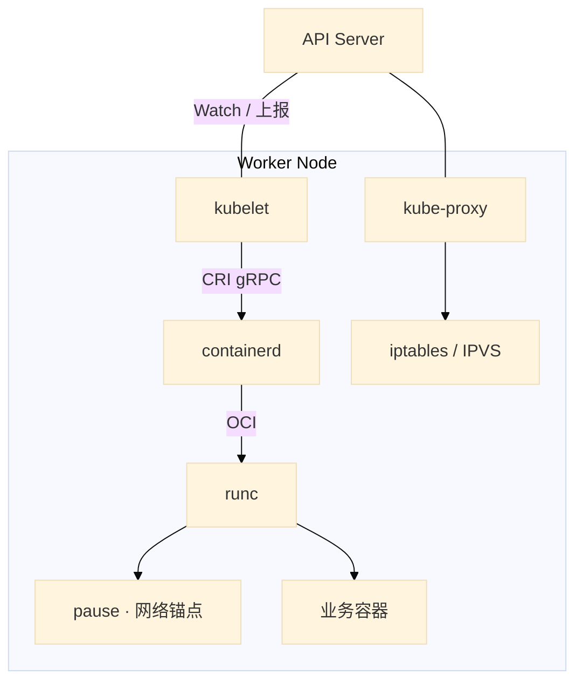
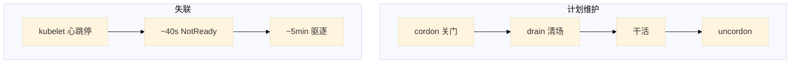
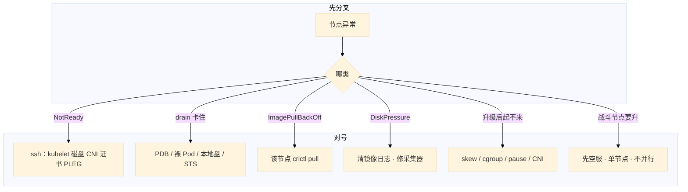

# 节点、运行时与升级

> 大家好。上一章讲完灰度怎么发；这一章落到**节点侧**——kubelet 怎么起容器、维护怎么迁、升级谁先谁后。
> 开讲之前，先带大家回到几个现场：活动前要给战斗服节点换盘，有人准备直接 `reboot`；另一边要把 1.28 升到 1.29，有人想先把节点 kubelet 升完「少停机」；kubelet 卡死，群里要删该节点所有逻辑服「对齐状态」——其实进程多半还在，删了才是事故。手都别动。
> 这一章讲完，你会知道这几个人各自错在哪——cordon 只关门 drain 才迁走、kubelet 不能比 API 新、kubelet 挂了先救 kubelet 别杀业务。
> **本章回答的问题**：节点上容器怎么真正跑起来；维护一台节点怎么走；集群怎么安全升级；NotReady 时间线与 Allocatable 怎么算。
> **本章不讲**：kubelet 挂了对业务的影响面总图 → [01](../01-集群架构/)；探针、QoS、OOMKilled vs Evicted → [04](../04-Pod生命周期/)、[18](../18-典型故障剧本/)；预选优选、污点、资源不足 Pending → [06](../06-调度机制/)；Pod CIDR、CNI sandbox 失败 → [10](../10-CNI与网络策略/)；本地盘、RWO 跟着节点走 → [11](../11-存储/)；容器日志轮转、采集器把盘写满 → [20](../20-日志管理/)。

**标记**：🎯重点 · 🔥难点 · ⭐常考 · 🔧实操

**怎么听这场分享**：先认主线三步——① 认链（kubelet → CRI → containerd → runc）；② 维护（cordon 只关门，drain 才迁走）；③ 升级（先控制面后节点，战斗池单独窗口）。口诀先埋一句：⭐ **kubelet 不能比 API Server 新**。下面按节展开，骨架仍是概念 → 架构 → 原理 → 部署 → 配置 → 命令 → 排障 → 常考。


**本章主线（维护就按这三步想）：**

1. **认链**：kubelet → CRI → containerd → runc；kubelet 不能比 API Server 新。
2. **维护**：cordon 只关门，drain 才迁走；裸 reboot 不要。
3. **升级**：先控制面后节点；战斗池单独窗口。

**读完你能：** 画出 kubelet → CRI → containerd → runc；cordon 只关门、drain 才迁走；约 40s NotReady、约 5min 驱逐；kubeadm 先控制面后节点；战斗服单独升级窗口。

## 本章目录

- [1. 基本概念](#1-基本概念)
- [2. 架构图](#2-架构图)
- [3. 原理](#3-原理)
- [4. 安装部署](#4-安装部署)
- [5. 核心配置](#5-核心配置)
- [6. 命令与操作](#6-命令与操作)
- [7. 生产排障](#7-生产排障)
- [8. 必会 · 常考](#8-必会--常考)
- [合上书](#合上书问自己)

---

## 1. 基本概念

控制面把期望写进 etcd，真正把 Pod 变成进程的是 **kubelet + 容器运行时**。kubelet 不自己 fork 容器，它走 **CRI** 调 containerd，containerd 再调 runc 落 cgroup 和 namespace。1.24 起 dockershim 没了，节点上看容器用 **crictl**，不是 docker。

开篇有人要删该节点所有逻辑服——大家想想：kubelet 卡死了，容器进程还在吗？多半还在。先把现象对表：

**值班里怎么认现象**（先听群里说什么，再对表）：

| 群里说的 | 技术含义 | 你的第一刀 |
|----------|----------|------------|
| 「节点红了」 | NotReady / SchedulingDisabled | `describe node` Conditions |
| 「drain 卡住了」 | PDB / 裸 Pod / 本地盘 | `get pdb -A`，别 `--force` |
| 「起不来 sandbox」 | pause / CNI / maxPods | 该节点 `crictl pull` pause |
| 「升级后全红」 | skew / cgroup / CNI | skew → cgroup → pause → CNI |

读节点时记住三句：

1. **Scheduler 写 nodeName 不等于容器起来**——后面全是本节点 kubelet 和运行时的事（01）。
2. **pause 是 Pod 的网络锚点**，业务容器共享它的 netns；pause 拉不下来，sandbox 全失败。
3. **kubelet 挂了，已经起来的进程通常还在**——先救 kubelet，不要为了「对齐状态」去杀游戏服。

托管集群（ACK / EKS）节点组仍是你的责任：厂商升控制面，drain 节奏、PDB、有状态盘还是你排。**厂商不会 drain 你的战斗服。**

> **记住**：节点上 kubelet 调 CRI 起进程；kubelet 挂了先救它，别杀游戏服。kubelet 不能比 API Server 新。

**面试怎么说**：「节点维护我 cordon → drain → 干活 → uncordon；NotReady 先救 kubelet 和盘，不删业务 Pod；升级先控制面后节点，战斗池单独窗口。」

好，现象对表了。接下来看架构——谁跟谁说话。

本节对应练习题 Q4、Q11。

---

## 2. 架构图

后面 CRI、drain、NotReady 都对着这张图。咱们先把认链装进脑子里：


**读图三句话：**

1. **从 API 往下查**：Pod 绑了 nodeName 但起不来，责任在 kubelet → CRI → containerd，不是 Scheduler。
2. **pause 先起**：sandbox 失败先查 pause 镜像和 CNI，不要先怀疑业务镜像。
3. **维护和失联是两条线**：cordon/drain 是计划维护；心跳停是失联时间线，别混成「drain 会自动 NotReady」。



好，空间图和时间线都有了。原理节把 CRI、drain、NotReady、Allocatable、升级 skew 五块讲透。

本节对应练习题 Q1、Q2。

---

## 3. 原理

### 3.1 CRI 与 containerd

**一句话：** kubelet 通过 CRI 先起 pause 沙箱，再起业务容器；排障用 crictl，不是 docker。

🔥 很多人会答「用 docker ps 看容器」——⭐ 这是高频错答。1.24+ 节点排障用 crictl。

**打个比方**：kubelet 是「楼层管家」，containerd 是「装修队」，runc 是真正干活的工人。管家不自己砌墙，只按图纸（Pod spec）下单给装修队。

**现场走一遍**（大厅 Pod 绑到节点但 ContainerCreating）：
1. SSH 到该节点，看 kubelet 日志：

```bash
journalctl -u kubelet --since "10 min ago" | tail -30
```

2. 屏幕常见：

```text
RunPodSandbox from runtime service failed: ... failed to pull image pause:3.9
```

3. 同一节点复现拉镜像：

```bash
crictl pull registry.aliyuncs.com/google_containers/pause:3.9
crictl pods
crictl ps -a
```

4. pull 失败 → 仓库/网络/磁盘；pull 成功但 pods 空 → 看 cgroup driver 是否一致：

```bash
crictl info | grep -i cgroup
```

5. 两边必须都是 `systemd`，否则 `CreateContainerError`。

**输出解读**：

| 输出 | 含义 | 下一步 |
|------|------|--------|
| `failed to pull pause` | sandbox 镜像不可达 | 同步 pause 到专有仓 |
| `cgroupDriver: systemd` vs `cgroupfs` | kubelet/containerd 不一致 | 改 containerd toml 两边对齐 |
| `PLEG is not healthy` | kubelet 看不见容器 | 重启 kubelet/containerd |
| `crictl ps` 有容器、`kubectl` 看不到 | 脏对象/绕过控制器 | 别 `crictl rm`，先救 kubelet |

CRI 顺序：`RunPodSandbox`（pause + CNI）→ `CreateContainer` → `StartContainer` → runc 落进程。镜像 GC：磁盘超 `imageGCHighThreshold`（默认约 85%）清未用镜像。`ImagePullBackOff` 要在**出问题节点**上 `crictl pull` 复现。`IfNotPresent` + 可变 tag 会「改了镜像节点不拉」——生产钉 digest。

containerd 要点：`/etc/containerd/config.toml` 里 `SystemdCgroup = true`；`sandbox_image` 指向能拉到的 pause；socket `unix:///run/containerd/containerd.sock`。`/etc/crictl.yaml` 指同一 socket。

**面试怎么说**：「1.24+ 节点排障用 crictl，namespace 是 k8s.io；起容器顺序是先 pause 沙箱再业务容器；CreateContainerError 我先对 cgroup driver 和 pause 镜像。」

好，认链清楚了。开篇有人要直接 reboot——维护该怎么走？

### 3.2 cordon / drain / uncordon

**一句话：** cordon 只关门不接新 Pod；drain 才清走业务；维护完 uncordon。

⭐ 这是面试必考，也是值班天天见。口诀：⭐ **cordon 关门，drain 清场，uncordon 开门**。

**打个比方**：cordon 像商场挂「暂停营业」——里面顾客还在逛；drain 是清场疏散；uncordon 是重新开门迎客。

**现场走一遍**（Worker 要换盘）：
1. 关门：

```bash
kubectl cordon worker-03
kubectl get node worker-03
```

2. 屏幕：

```text
NAME        STATUS                     ROLES    AGE   VERSION
worker-03   Ready,SchedulingDisabled   <none>   90d   v1.28.6
```

3. 清场（给足 grace）：

```bash
kubectl drain worker-03 \
  --ignore-daemonsets \
  --delete-emptydir-data \
  --grace-period=60 \
  --timeout=300s
```

4. drain 卡住——看 Events：

```text
error when evicting pods/... - Cannot evict pod as it would violate the pod's disruption budget
```

5. 查 PDB：`kubectl get pdb -A`，扩副本或改窗口，**不要** `--disable-eviction` 赶工。

**输出解读**：

| drain 卡住原因 | Events 关键词 | 处理 |
|----------------|---------------|------|
| PDB | `violate ... disruption budget` | 扩副本 / 改窗口 |
| 裸 Pod | `cannot evict ... not managed` | `--force` 或先删裸 Pod |
| emptyDir / local PV | `local data` | `--delete-emptydir-data` 或确认可丢 |
| STS + RWO | 卷绑在旧节点 | 目标节点能挂同盘（11） |

DaemonSet 通常留下：本节点还要 CNI、日志采集、kube-proxy。游戏单进程区服：drain 前先迁玩家、停匹配——PDB 救的是「别一次赶光」，救不了「对局里的人」。

**面试怎么说**：「cordon 不迁 Pod，drain 才清场；卡住我先查 PDB，不是 --force。战斗节点 drain 前先空服。」

开篇 kubelet 卡死、群里要删逻辑服——下一小节讲时间线，你会知道为什么别删。

### 3.3 NotReady 时间线

**一句话：** kubelet 心跳停约 40s 标 NotReady，默认约 5min 才开始驱逐；进程通常还在。

🔥 很多人会答「节点红了立刻杀 Pod」——⭐ 这是高频错答。进程多半还在。

**打个比方**：像员工失联——先打两次电话（40s），再按规章办离职手续（5min 驱逐）；人可能还在工位干活，别先把电脑砸了。

**现场走一遍**（节点突然 NotReady，群里要杀游戏服）：
1. 先看节点：

```bash
kubectl describe node worker-05 | grep -A8 Conditions
```

2. 屏幕：

```text
Ready   False   KubeletNotReady   ...   container runtime is down
```

3. SSH 该节点：

```bash
systemctl status kubelet
df -h /var/lib/containerd
journalctl -u kubelet -u containerd --since "20 min ago" | tail -20
```

4. 游戏进程还在不在：

```bash
crictl ps | grep battle
```

5. 先 `systemctl restart containerd kubelet`，**不要** `kubectl delete pod` 对齐。

**输出解读**：

| 时间 | 控制面行为 | 现场含义 |
|------|------------|----------|
| 0s | kubelet 心跳停 | 进程通常还在 |
| ~40s | `Ready=False`，打 not-ready 污点 | 新 Pod 不调度上来 |
| ~300s | 不容忍的 Pod 被驱逐 | 长连接可能还活着 |
| 并行 | MemoryPressure/DiskPressure | **立刻**按 QoS 赶人，不等 5min |

PLEG unhealthy、证书过期（`kubeadm certs check-expiration`）也会 NotReady。kubelet 压力驱逐 ≠ 容器超 memory limit 被 OOMKilled（17）。

**面试怎么说**：「NotReady 约 40s，驱逐约 5min；kubelet 挂了我先救 kubelet 和盘，不删业务 Pod。压力驱逐是另一条路，DiskPressure 立刻赶人。」

### 3.4 Allocatable

**一句话：** Scheduler 只看 Allocatable，不看 top；不预留 kubelet 会 OOM，节点集体 NotReady。

**打个比方**：Capacity 是餐厅总座位，Allocatable 是留给客人的——厨房、过道、消防通道（kubeReserved、systemReserved、eviction-hard）不能卖。

**现场走一遍**（top 还空，新 Pod Insufficient cpu）：

1. 看节点资源：

```bash
kubectl describe node worker-02 | grep -A15 "Allocated resources"
```

2. 屏幕：

```text
Capacity:
  cpu:                16
Allocatable:
  cpu:                15800m
Allocated resources:
  cpu Requests:       15750m (99%)
```

3. 算差：15800 − 15750 = **50m** 空闲 request 槽——再要 100m 就 Pending。

4. `top` 显示 CPU 30%——那是**实际用量**，调度看 **request**。

**输出解读**：

```
Capacity（整机）
  − kubeReserved（kubelet / 运行时）
  − systemReserved（sshd / journald）
  − eviction-hard（如 memory.available < 100Mi）
  = Allocatable  ← Scheduler 只看这个
```

不预留：业务打满 → kubelet OOM → 维护窗口里最冤的集体 NotReady。

**面试怎么说**：「调度看 Allocatable 和 request，不是 top。Insufficient 我先 describe node 看 Allocated，再决定加节点还是降 request。」

### 3.5 升级顺序与 skew

**一句话：** 先控制面后节点；一次一小版本；kubelet 可旧不可新，最多落后约 2 个小版本。

**打个比方**：像公司系统升级——先升总部服务器（控制面），再升各分店终端（kubelet）；分店不能比总部新，否则新功能总部不认。

**现场走一遍**（要从 1.28 升到 1.29）：

1. 第一台控制面：

```bash
kubeadm upgrade plan
kubeadm upgrade apply v1.29.4
```

2. plan 输出关键行：

```text
COMPONENT           CURRENT   TARGET
kube-apiserver      v1.28.6   v1.29.4
kubelet             v1.28.6   v1.29.4
```

3. Worker 逐台（**先 drain**）：

```bash
kubectl drain worker-01 --ignore-daemonsets --delete-emptydir-data
# 节点上：
kubeadm upgrade node
apt-get install -y kubelet=1.29.4-00 kubectl=1.29.4-00
systemctl daemon-reload && systemctl restart kubelet
kubectl uncordon worker-01
```

4. 验证：`kubectl get nodes`——控制面新、节点暂时旧，**允许的 skew**。

5. 战斗池：**单独窗口**，先空服再升，不和网关池并行 drain。

**输出解读**：

| 顺序错了 | 现象 | 修法 |
|----------|------|------|
| 节点 kubelet 先升 | API 报未知字段/endpoint | 回退 kubelet 或先升 API |
| 跳小版本 | 组件不兼容 | 逐级升，不跳 |
| 并行 drain 多台 | PDB 救不了 | 逐台，观察 15–30min |
| pause 没同步 | sandbox 全失败 | 升前确认 pause 可拉 |

etcd 随控制面走时先 snapshot（02）。升完再升 CNI、CoreDNS、metrics-server。

**面试怎么说**：「kubeadm 先控制面后节点；kubelet 不能比 API 新；Worker 先 drain 再升；战斗池单独窗口，先空服。」

原理五块齐了。下面是落地：节点上你看到什么、kubeadm 升级怎么走。

本节对应练习题 Q1、Q2、Q3、Q5、Q6、Q7。

---

## 4. 安装部署

### 4.1 节点上你实际看到什么

| 路径 / 单元 | 内容 |
|-------------|------|
| kubelet systemd | 拉静态 Pod、调 CRI |
| `/etc/containerd/config.toml` | SystemdCgroup、sandbox_image（pause） |
| `unix:///run/containerd/containerd.sock` | CRI 口 |
| `/var/lib/containerd` | 镜像和可写层 |
| `/var/log/containers` | 容器日志；打满 → DiskPressure |

验收：节点 Ready、`crictl info` cgroup driver 一致、pause 能 pull、CNI Pod Running。不要只看 kubelet active。

### 4.2 kubeadm 升级怎么走

`kubeadm upgrade plan` 给出目标版本和组件兼容。不要跳小版本。etcd 随控制面走时先 snapshot（02）。

控制面第一台：`kubeadm upgrade apply v1.29.4`。其它控制面与 Worker：`kubeadm upgrade node` + 包管理器升 kubelet/kubectl + 重启 kubelet。

Worker 必须 **先 drain 再升 kubelet**。升完：Ready、CNI、pause 能拉，再 uncordon。再升核心插件：CNI、CoreDNS、metrics-server。

云上常用加新机、drain 旧机、删旧机，比原地升 runtime 好回滚。有状态本地盘只能原地或先迁盘。

好，部署路径清楚了。核心配置哪些不能乱改？

本节对应练习题 Q3、Q10。

---

## 5. 核心配置

| 参数 | 生产怎么用 | 改错会怎样 |
|------|------------|------------|
| cgroupDriver | kubelet 与 containerd 都 **systemd** | CreateContainerError |
| sandbox_image | 专有仓可拉的 pause | 升级后 sandbox 全失败 |
| imageGCHighThreshold | 默认约 85% | 过低狂 GC；过高 DiskPressure |
| maxPods | 与每节点 CIDR / ENI **同一张变更单** | FailedCreatePodSandBox |
| kubeReserved / systemReserved | 按规格留足 | kubelet OOM，节点 NotReady |
| eviction-hard | 留赶人空间 | 打满才赶，来不及 |
| rotateCertificates | 保持开 | 心跳失败像网络挂了 |

```toml
[plugins."io.containerd.grpc.v1.cri".containerd.runtimes.runc.options]
  SystemdCgroup = true
[plugins."io.containerd.grpc.v1.cri"]
  sandbox_image = "registry.aliyuncs.com/google_containers/pause:3.9"
```

> **记住**：调度看 Allocatable 和 request，不看 top。只改 maxPods 不改 CIDR 会 sandbox 失败。

好，参数红线钉了。值班到底敲什么命令？战斗池怎么升？

本节对应练习题 Q5、Q9。

---

## 6. 命令与操作

### 6.1 命令速查

```bash
kubectl cordon <node>
kubectl drain <node> --ignore-daemonsets --delete-emptydir-data --grace-period=60 --timeout=300s
kubectl uncordon <node>
kubectl describe node <n>
kubectl get pdb -A
crictl info && crictl ps -a && crictl pods
journalctl -u kubelet -u containerd --since "20 min ago"
kubeadm upgrade plan
kubeadm certs check-expiration
```

| 目的 | 命令 | 看什么 |
|------|------|--------|
| 关门 / 开门 | `cordon` / `uncordon` | SchedulingDisabled |
| 清场 | `drain` 如上 | 卡住先 pdb，不是 --force |
| 节点 | `describe node` | Conditions、Allocated、Taints |
| PDB | `get pdb -A` | drain 挡在谁 |
| 运行时 | `crictl info` | cgroup driver |
| 复现拉镜像 | `crictl pull ...` | 在出问题的节点上 |
| 升级规划 | `kubeadm upgrade plan` | 顺序和版本 |

### 6.2 维护一台节点

标准序：cordon → drain（给足 grace）→ 换盘 / 升 runtime → 健康检查 → uncordon。游戏单进程区服：drain 前迁玩家、停匹配。

### 6.3 kubeadm 滚动升级

1. 读发行说明：CNI / CSI / Operator 兼容矩阵。
2. 备份 etcd（自建）/ 确认托管备份。
3. `upgrade plan` → 第一台 `upgrade apply`。
4. `kubectl get nodes`：控制面新了，节点暂时旧，允许的 skew。
5. 先升 **1 台非战斗节点**，观察 15–30 分钟。
6. 逐节点：drain → 升 containerd（如需要）→ `kubeadm upgrade node` → 升 kubelet 包 → 检查 → uncordon。
7. 再升 CNI、CoreDNS、metrics-server。

回滚节点：换回旧 kubelet 包，或用未升的新节点顶上。

### 6.4 战斗节点升级窗口

```
无状态网关池：可按 PDB 滚动 drain，surge 节点顶上
战斗服池：
  1. 独立节点池、独立窗口（与 15 发版窗口错开）
  2. 先空服 / 迁玩家 / 停匹配
  3. 单节点 drain → 升 runtime/kubelet → 验证 CCU
  4. 再下一台
```

不能和网关池并行 drain。托管 ACK 升节点组，厂商不会帮你空战斗服。

### 6.5 换节点 vs 原地升

云上常用加新机、drain 旧机、删旧机，比原地升 runtime 好回滚。有状态本地盘节点只能原地或先迁盘。升级后起不来：skew → cgroup → pause → CNI。

好，操作手册齐了。出了问题怎么定责？回到开篇那几个误操作。

本节对应练习题 Q8、Q12、Q13。

---

## 7. 生产排障

三问：进程还在不在（游戏服）？还能不能变更（调度 / drain）？已有流量还通不通（长连接）？NotReady：**先救 kubelet，别杀业务。**

群里有人要直接 reboot、删该节点所有逻辑服——咱们用决策树把他们拦住。



| 现象 | 先做什么 | 不要做什么 |
|------|----------|------------|
| NotReady | 救 kubelet / 盘 / CNI / 证书 | 删业务 Pod 对齐 |
| PLEG unhealthy | 重启 kubelet/containerd | 重启游戏进程 |
| drain 等 PDB | 扩副本或改窗口 | --disable-eviction 赶工 |
| CreateContainerError | 两边 cgroup systemd | 只改 kubelet |
| ImagePull 单节点 | 该节点 pull | 当仓库全挂 |
| maxPods 调大 sandbox 失败 | CIDR / ENI 一起改 | 先怀疑业务镜像 |
| 升级后 NotReady | skew → cgroup → pause → CNI | 从业务镜像查起 |
| DiskPressure | overlay / 日志 / emptyDir | 只重建被赶的 Pod |

镜像盘：节点级日志轮转（19）、imageGC、禁止容器内写无上限 emptyDir。

现在再看开篇那几句——「直接 reboot」「先升节点 kubelet」「删该节点所有逻辑服」——你知道该怎么拦住他们了。

本节对应练习题 Q14。

---

## 8. 必会 · 常考

遮住「口径」列自问自答，卡壳的行回去重读对应小节——能讲出来才算会，看着答案点头不算。

| 说法 | 对错 | 口径 |
|------|:----:|------|
| 生产用 docker ps 看 K8s 容器 | 错 | 1.24+ crictl，ns k8s.io |
| kubelet 挂了游戏服立刻没了 | 错 | 进程还在；约 5min 才驱逐 |
| cordon 会把 Pod 迁走 | 错 | 只关门；drain 才清场 |
| drain 卡住就 --force | 错 | 先 PDB / 裸 Pod / 盘 |
| DaemonSet 要一起赶走 | 错 | 本节点还要 CNI / 日志 |
| 先升节点 kubelet 少停机 | 错 | kubelet 不能比 API 新 |
| 4 台控制面和节点一起并行 drain | 错 | 自己做故障演练 |
| 战斗池和网关池同一批升 | 错 | 单独窗口，先空服 |
| 调度看 top 还有空闲 | 错 | 看 Allocatable 和 request |
| 只改 maxPods 就能密布 | 错 | CIDR 不够 sandbox 失败 |
| 只改 kubelet cgroupDriver | 错 | containerd 必须一起 systemd |
| 托管升级会空战斗服 | 错 | surge / PDB / 盘是你的 |
| DiskPressure 要等 5 分钟 | 错 | 那是失联时间线；压力驱逐立刻赶 |
| OOMKilled 就是节点 Evicted | 错 | 容器 limit vs 节点 Pressure（17） |

数字：NotReady **~40s**，驱逐 **~5min**；imageGC **~85%**；先观察非战斗节点 **15–30 分钟**；skew kubelet 落后最多约 **2** 个小版本。

易混：cordon vs drain；失联 5min vs 压力驱逐；Capacity vs Allocatable；docker vs crictl；原地升 vs 换节点。

---

## 合上书，问自己

合上书自检（题号对齐练习题）：

- [ ] kubelet → CRI → containerd → runc 谁起 pause？排障为什么用 crictl？（Q4、Q11）
- [ ] cordon 和 drain 差在哪？卡住四件事是什么？（Q1、Q6）
- [ ] NotReady 时间线？kubelet 挂了先救谁？（Q2）
- [ ] Allocatable 怎么算？不预留会怎样？（Q5）
- [ ] kubeadm 升级顺序？kubelet 能不能比 API 新？（Q3）
- [ ] 战斗服节点怎么升？和发版窗口为什么要错开？（Q8）
- [ ] 升级后 NotReady：skew / cgroup / pause / CNI；maxPods vs CIDR；运行时矩阵；镜像预热；60 秒定责（Q7、Q9、Q10、Q12、Q13、Q14）

七条都能口述，这一章就过了。终极测试：拦住开篇那几个误操作——直接 reboot、先升节点 kubelet、删该节点所有逻辑服。下一章把排障串成决策树：三问定域，Events 第一刀，重启是最后一刀。