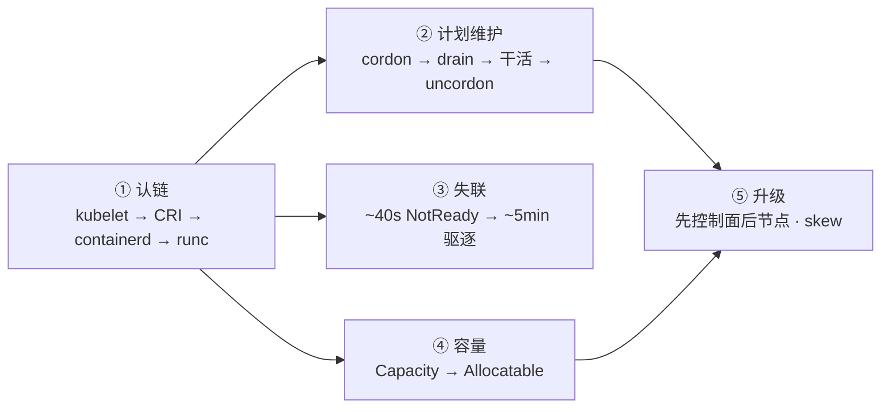
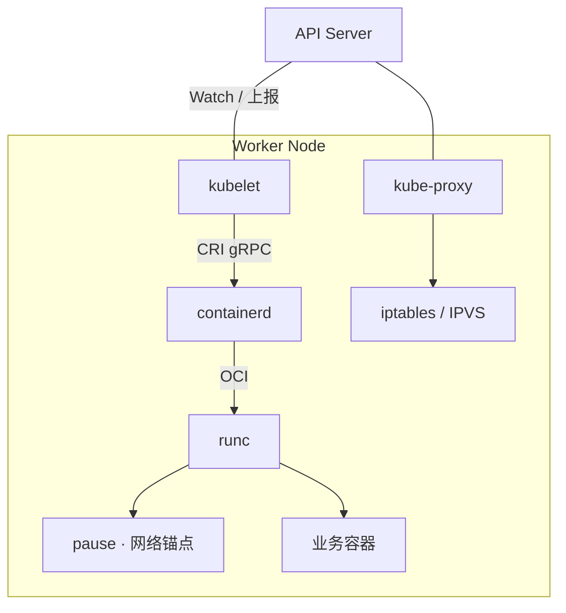
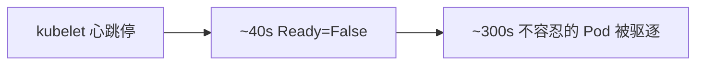
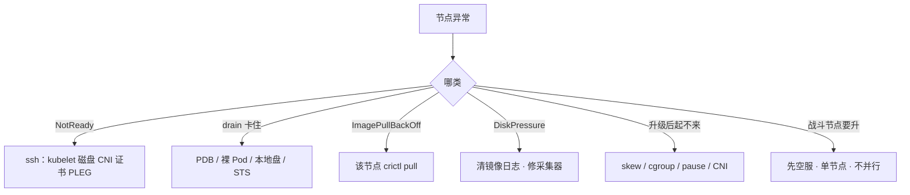

# 节点、运行时与升级

> 活动前要给战斗服节点换盘，有人准备直接 `reboot`；另一边要把 1.28 升到 1.29，有人想先把节点 kubelet 升完「少停机」；kubelet 卡死，群里要删该节点所有逻辑服「对齐状态」——其实进程多半还在，删了才是事故。手都别动。
> **本章回答**：节点上容器怎么真正跑起来；维护一台节点怎么走；集群怎么安全升级；NotReady 时间线与 Allocatable 怎么算。
> **不讲**：kubelet 挂了对业务的影响面总图 → [01](../01-集群架构/)；探针、QoS、OOMKilled vs Evicted → [04](../04-Pod生命周期/)、[18](../18-典型故障剧本/)；预选优选、污点、资源不足 Pending → [06](../06-调度机制/)；Pod CIDR、CNI sandbox 失败 → [10](../10-CNI与网络策略/)；本地盘、RWO 跟着节点走 → [11](../11-存储/)；容器日志轮转、采集器把盘写满 → [20](../20-日志管理/)。

**标记**：🎯重点 · 🔥难点 · ⭐常考 · 🔧实操

---

## 一、一张图：节点上的一生 ⭐

> 🎯 **一句话**：控制面写期望，真正把 Pod 变成进程的是本机 kubelet → CRI → containerd → runc；维护走计划线，失联走时间线，别混成一条。



- 📖 **读图**
  - 🔗 ① 认链：Pod 绑了 `nodeName` 但起不来，责任在本节点，不是 Scheduler（→ [01](../01-集群架构/)）
  - 🛠️ ② 与 ③ 是两条线：cordon/drain 是计划维护；心跳停才是失联——**drain 不会自动 NotReady**
  - 📦 ④⑤ 挂在认链之上：调度看 Allocatable；升级口诀 ⭐ **kubelet 不能比 API Server 新**

值班里先对现象再动手：

- 「节点红了」→ NotReady / SchedulingDisabled → `describe node` Conditions
- 「drain 卡住了」→ PDB / 裸 Pod / 本地盘 → `get pdb -A`，别 `--force`
- 「起不来 sandbox」→ pause / CNI / maxPods → 该节点 `crictl pull` pause
- 「升级后全红」→ skew → cgroup → pause → CNI

托管集群（ACK / EKS）节点组仍是你的责任：厂商升控制面，drain 节奏、PDB、有状态盘还是你排——**厂商不会 drain 你的战斗服**。

本节对应练习题 Q1、Q2、Q4、Q11。

---

## 二、认链：kubelet → CRI → 进程 🎯⭐🔥

> 🎯 **一句话**：kubelet 不自己 fork 容器；经 CRI 先起 pause 沙箱，再起业务容器；1.24+ 节点排障用 crictl，不是 docker。

> 💡 **打个比方**：kubelet 是楼层管家，containerd 是装修队，runc 是真正砌墙的工人——管家只按图纸（Pod spec）下单，不自己砌墙。

### 🏗️ 谁跟谁说话



- 📖 **读图**
  - 📡 从 API 往下查：绑了 `nodeName` 起不来 → kubelet → CRI → containerd，不是 Scheduler
  - ⚓ **pause 先起**：sandbox 失败先查 pause 镜像和 CNI，不要先怀疑业务镜像
  - 🔁 kube-proxy 改内核转发；玩家包不经过它的进程（→ [01](../01-集群架构/)、[08](../08-Service与kube-proxy/)）

CRI 顺序：

1. `RunPodSandbox`（pause + CNI 配网）
2. `CreateContainer` → `StartContainer`
3. runc 落 cgroup / namespace 进程

- **Scheduler 写 `nodeName` ≠ 容器起来**——后面全是本节点的事
- **pause 是 Pod 的网络锚点**，业务容器共享它的 netns；pause 拉不下来，sandbox 全失败
- **kubelet 挂了，已经起来的进程通常还在**——先救 kubelet，不要为了「对齐状态」去杀游戏服

#### ❓ 为什么不用 docker ps？

- 🔥 1.24 起 **dockershim 已移除**；节点上 CRI 默认走 containerd
- ✅ 排障用 **crictl**，namespace 是 `k8s.io`；`docker ps` 看不到（或看到的不是这条链）
- 🧰 socket：`unix:///run/containerd/containerd.sock`；`/etc/crictl.yaml` 必须指同一口

### 🔧 现场：ContainerCreating 卡住 🔧

> 🔍 **现场**：大厅 Pod 绑到节点但一直 ContainerCreating。

```bash
journalctl -u kubelet --since "10 min ago" | tail -30
# RunPodSandbox ... failed to pull image pause:3.9   ← sandbox 镜像不可达
```

同一节点复现：

```bash
crictl pull registry.aliyuncs.com/google_containers/pause:3.9
crictl pods
crictl ps -a
crictl info | grep -i cgroup
# cgroupDriver: systemd   ← 必须与 kubelet 一致；一边 systemd 一边 cgroupfs → CreateContainerError
```

- pull 失败 → 仓库 / 网络 / 磁盘
- pull 成功但 pods 空 → 对 **cgroup driver**（两边都 `systemd`）
- `PLEG is not healthy` → kubelet 看不见容器 → 重启 kubelet/containerd
- `crictl ps` 有容器、`kubectl` 看不到 → 脏对象或绕过控制器——**别 `crictl rm`**，先救 kubelet

节点上常摸的路径：

- kubelet systemd：拉静态 Pod、调 CRI
- `/etc/containerd/config.toml`：`SystemdCgroup`、`sandbox_image`（pause）
- `/var/lib/containerd`：镜像和可写层
- `/var/log/containers`：容器日志；打满 → DiskPressure（→ [20](../20-日志管理/)）

镜像 GC：磁盘超 `imageGCHighThreshold`（默认约 **85%**）清未用镜像。`ImagePullBackOff` 要在**出问题节点**上 `crictl pull` 复现。`IfNotPresent` + 可变 tag 会「改了镜像节点不拉」——生产钉 digest。

> ⚠️ **别混**：`docker` 命令能用 ≠ 这条链路还走 Docker；值班认 CRI socket 和 crictl。

> 📝 **面试**：1.24+ 节点排障用 crictl，ns 是 k8s.io；起容器先 pause 沙箱再业务；CreateContainerError 先对 cgroup driver 和 pause 镜像。⭐（Q4、Q11）

开篇有人要直接 reboot——维护该怎么走？

---

## 三、计划维护：cordon → drain → uncordon 🎯⭐

> 🎯 **一句话**：cordon 只关门不接新 Pod；drain 才清走业务；维护完 uncordon。

> 💡 **打个比方**：cordon 像商场挂「暂停营业」——里面顾客还在逛；drain 是清场疏散；uncordon 是重新开门迎客。

口诀：⭐ **cordon 关门，drain 清场，uncordon 开门**。


- 📖 **读图**：四步顺序不能跳——裸 `reboot` 等于没清场就停电。

#### ❓ 为什么 cordon 不迁走 Pod？

- 🚪 cordon 只打 **SchedulingDisabled**，Scheduler 不再派新 Pod 上来
- 🏃 **已在跑的 Pod 不动**——迁走是 eviction / drain 的活
- 🎮 游戏单进程区服：drain 前先迁玩家、停匹配——PDB 救的是「别一次赶光」，救不了「对局里的人」

### 🔧 现场：Worker 换盘 🔧

> 🔍 **现场**：

```bash
kubectl cordon worker-03
kubectl get node worker-03
# worker-03   Ready,SchedulingDisabled   ...   ← 已关门，业务还在跑
```

```bash
kubectl drain worker-03 \
  --ignore-daemonsets \
  --delete-emptydir-data \
  --grace-period=60 \
  --timeout=300s
# error ... violate the pod's disruption budget   ← 先查 PDB，不是 --force
kubectl get pdb -A
```

drain 卡住常见四件事：

| 卡住原因 | Events 关键词 | 处理 |
|----------|---------------|------|
| PDB | `violate ... disruption budget` | 扩副本 / 改窗口 |
| 裸 Pod | `cannot evict ... not managed` | `--force` 或先删裸 Pod |
| emptyDir / local PV | `local data` | `--delete-emptydir-data` 或确认可丢 |
| STS + RWO | 卷绑在旧节点 | 目标节点能挂同盘（→ [11](../11-存储/)） |

DaemonSet 通常留下：本节点还要 CNI、日志采集、kube-proxy。

> ⚠️ **别混**：cordon ≠ drain；`--disable-eviction` / 乱 `--force` 赶工 = 自己做故障演练。

> 📝 **面试**：维护走 cordon → drain → 干活 → uncordon；卡住先查 PDB，不是 --force；战斗节点 drain 前先空服。⭐（Q1、Q6）

开篇 kubelet 卡死、群里要删逻辑服——下一节讲时间线。

本节对应练习题 Q1、Q6。

---

## 四、失联：NotReady 时间线 🔥⭐

> 🎯 **一句话**：kubelet 心跳停约 40s 标 NotReady，默认约 5min 才开始驱逐；进程通常还在。

> 💡 **打个比方**：像员工失联——先打两次电话（~40s），再按规章办离职手续（~5min 驱逐）；人可能还在工位干活，别先把电脑砸了。



- 📖 **读图**
  - 0s：心跳停，**进程通常还在**
  - ~40s：`Ready=False`，打 not-ready 污点，新 Pod 不调度上来
  - ~300s：不容忍的 Pod 被驱逐；长连接可能还活着
  - 并行：MemoryPressure / DiskPressure → **立刻**按 QoS 赶人，**不等 5min**

#### ❓ 为什么节点红了不能立刻删业务 Pod？

- 🔥 很多人答「立刻杀 Pod 对齐」——⭐ 高频错答
- ✅ kubelet 挂了，容器进程多半还在；删 Pod = 主动打断还活着的对局
- 🩹 第一刀：救 kubelet / containerd / 盘 / CNI / 证书，不是 `kubectl delete pod`

#### ❓ 为什么有的立刻赶人、有的要等约 5 分钟？

- ⏱️ **失联驱逐**：心跳断了，控制面等默认约 **5min** 才赶不容忍的 Pod
- 💨 **压力驱逐**：DiskPressure / MemoryPressure 是节点本地立刻赶人——与失联时间线无关
- ⚠️ **别混**：DiskPressure 要等 5 分钟 → 错；那是失联口径。OOMKilled（容器超 limit）≠ 节点 Evicted（→ [04](../04-Pod生命周期/)、[18](../18-典型故障剧本/)）

### 🔧 现场：节点突然 NotReady 🔧

> 🔍 **现场**：群里要杀游戏服。

```bash
kubectl describe node worker-05 | grep -A8 Conditions
# Ready   False   KubeletNotReady   ...   container runtime is down
```

```bash
systemctl status kubelet
df -h /var/lib/containerd
journalctl -u kubelet -u containerd --since "20 min ago" | tail -20
crictl ps | grep battle
# 进程还在 → systemctl restart containerd kubelet，不要 delete pod 对齐
```

PLEG unhealthy、证书过期（`kubeadm certs check-expiration`）也会 NotReady。

> 📝 **面试**：NotReady 约 40s，驱逐约 5min；kubelet 挂了先救 kubelet 和盘，不删业务 Pod；压力驱逐是另一条路，DiskPressure 立刻赶人。⭐（Q2）

本节对应练习题 Q2。

---

## 五、容量：Allocatable 怎么算 ⭐

> 🎯 **一句话**：Scheduler 只看 Allocatable 和 request，不看 `top`；不预留 kubelet 会 OOM，节点集体 NotReady。

> 💡 **打个比方**：Capacity 是餐厅总座位，Allocatable 是留给客人的——厨房、过道、消防通道（`kubeReserved`、`systemReserved`、`eviction-hard`）不能卖。

```text
Capacity（整机）
  − kubeReserved（kubelet / 运行时）
  − systemReserved（sshd / journald）
  − eviction-hard（如 memory.available < 100Mi）
  = Allocatable  ← Scheduler 只看这个
```

- 📖 **读图**：调度槽 = Allocatable − 已分配 request；`top` 是实际用量，两套账。

#### ❓ 为什么 top 还有空、Pod 却 Insufficient？

- 📊 `top` 显示 CPU 30% = **实际用量**；调度看 **request 槽**
- 🧮 `describe node` 里 Allocatable 15800m、已分配 15750m → 只剩 **50m**——再要 100m 就 Pending
- 💥 不预留：业务打满 → kubelet OOM → 维护窗口里最冤的集体 NotReady

> 🔍 **现场**：

```bash
kubectl describe node worker-02 | grep -A15 "Allocated resources"
# Allocatable cpu: 15800m
# cpu Requests:    15750m (99%)   ← 槽满了，不是 top 满了
```

> ⚠️ **别混**：Capacity vs Allocatable；request 调度 vs usage 监控（→ [06](../06-调度机制/)）。

> 📝 **面试**：调度看 Allocatable 和 request，不是 top。Insufficient 先 describe node 看 Allocated，再决定加节点还是降 request。⭐（Q5）

本节对应练习题 Q5。

---

## 六、红线配置：改错就起不来 🔧

> 🎯 **一句话**：cgroup / pause / 预留 / maxPods 是节点侧红线；只改一半必炸。

生产怎么钉：

- **cgroupDriver**：kubelet 与 containerd 都 **systemd**——只改一边 → `CreateContainerError`
- **sandbox_image**：专有仓可拉的 pause——升版后旧 pause 拉不到 → sandbox 全失败
- **imageGCHighThreshold**：默认约 85%——过低狂 GC，过高 DiskPressure
- **maxPods**：与每节点 CIDR / ENI **同一张变更单**——只改 maxPods → `FailedCreatePodSandBox`（→ [10](../10-CNI与网络策略/)）
- **kubeReserved / systemReserved**：按规格留足——不留 → kubelet OOM
- **eviction-hard**：留赶人空间——打满才赶，来不及
- **rotateCertificates**：保持开——关了心跳失败像网络挂了

```toml
[plugins."io.containerd.grpc.v1.cri".containerd.runtimes.runc.options]
  SystemdCgroup = true
[plugins."io.containerd.grpc.v1.cri"]
  sandbox_image = "registry.aliyuncs.com/google_containers/pause:3.9"
```

验收：节点 Ready、`crictl info` cgroup 一致、pause 能 pull、CNI Pod Running——不要只看 kubelet active。

本节对应练习题 Q5、Q9。

---

## 七、升级：先控制面后节点 · skew 🎯⭐🔥

> 🎯 **一句话**：先控制面后节点；一次一小版本；kubelet 可旧不可新，最多落后约 2 个小版本。

> 💡 **打个比方**：像公司系统升级——先升总部服务器（控制面），再升各分店终端（kubelet）；分店不能比总部新，否则新功能总部不认。

#### ❓ 为什么不能先升节点 kubelet「少停机」？

- ⭐ **skew 规则**：kubelet **不能比** kube-apiserver **新**；可旧，落后最多约 **2** 个小版本
- 🚫 节点先升：API 报未知字段 / endpoint 异常——回退 kubelet 或先升 API
- ✅ 正确：`upgrade plan` → 第一台控制面 `upgrade apply` → Worker **先 drain** 再升

### 🔧 现场：1.28 → 1.29 🔧

> 🔍 **现场**：

```bash
kubeadm upgrade plan
kubeadm upgrade apply v1.29.4
# COMPONENT        CURRENT   TARGET
# kube-apiserver   v1.28.6   v1.29.4   ← 先把控制面钉到目标
```

Worker 逐台：

```bash
kubectl drain worker-01 --ignore-daemonsets --delete-emptydir-data
# 节点上：
kubeadm upgrade node
apt-get install -y kubelet=1.29.4-00 kubectl=1.29.4-00
systemctl daemon-reload && systemctl restart kubelet
kubectl uncordon worker-01
# get nodes：控制面新、节点暂时旧 = 允许的 skew
```

滚动清单：

1. 读发行说明：CNI / CSI / Operator 兼容矩阵
2. 备份 etcd（自建）/ 确认托管备份（→ [02](../02-etcd/)）
3. `upgrade plan` → 第一台 `upgrade apply`
4. 先升 **1 台非战斗节点**，观察 **15–30 分钟**
5. 逐节点：drain → 升 containerd（如需要）→ `kubeadm upgrade node` → 升 kubelet 包 → 检查 → uncordon
6. 再升 CNI、CoreDNS、metrics-server

顺序错了会怎样：

- 跳小版本 → 组件不兼容 → 逐级升
- 并行 drain 多台 → PDB 救不了 → 逐台
- pause 没同步 → sandbox 全失败 → 升前确认 pause 可拉

云上常用加新机、drain 旧机、删旧机，比原地升 runtime 好回滚。有状态本地盘只能原地或先迁盘（→ [11](../11-存储/)）。升级后起不来：skew → cgroup → pause → CNI。

> ⚠️ **别混**：控制面新、节点暂时旧 = 合法 skew；节点新、控制面旧 = 违规。

> 📝 **面试**：kubeadm 先控制面后节点；kubelet 不能比 API 新；Worker 先 drain 再升；战斗池单独窗口，先空服。⭐（Q3、Q7、Q10）

本节对应练习题 Q3、Q7、Q10。

---

## 八、战斗池：单独窗口 ⭐🔧

> 🎯 **一句话**：无状态网关可按 PDB 滚动；战斗服独立节点池、独立窗口，先空服再单节点升，不和网关并行 drain。

```text
无状态网关池：可按 PDB 滚动 drain，surge 节点顶上
战斗服池：
  1. 独立节点池、独立窗口（与灰度/发版窗口错开 → [16](../16-灰度与回滚/)）
  2. 先空服 / 迁玩家 / 停匹配
  3. 单节点 drain → 升 runtime/kubelet → 验证 CCU
  4. 再下一台
```

#### ❓ 为什么战斗池不能和网关同一批升？

- 🎮 战斗服单进程对局：并行 drain = 同时打断多局；PDB 挡不住「对局里的人」
- 📦 网关可 surge 顶上；战斗池往往绑本地盘 / 有状态，回滚路径更窄
- ☁️ 托管 ACK 升节点组，**厂商不会帮你空战斗服**——surge / PDB / 盘节奏是你的

> 📝 **面试**：战斗服独立窗口，先空服再单节点；不和网关池并行；托管升级不会替你空战斗服。（Q8）

本节对应练习题 Q8、Q12、Q13。

---

## 九、作战：定责 🔧

> 🎯 **一句话**：三问——进程还在不在？还能不能变更？已有流量还通不通？NotReady：**先救 kubelet，别杀业务。**



- 📖 **读图**：先分叉现象，再对号入座；开篇「直接 reboot / 先升 kubelet / 删逻辑服」都能在树上拦住。

| 现象 | 先做什么 | 不要做什么 |
|------|----------|------------|
| NotReady | 救 kubelet / 盘 / CNI / 证书 | 删业务 Pod 对齐 |
| PLEG unhealthy | 重启 kubelet/containerd | 重启游戏进程 |
| drain 等 PDB | 扩副本或改窗口 | `--disable-eviction` 赶工 |
| CreateContainerError | 两边 cgroup systemd | 只改 kubelet |
| ImagePull 单节点 | 该节点 pull | 当仓库全挂 |
| maxPods 调大 sandbox 失败 | CIDR / ENI 一起改 | 先怀疑业务镜像 |
| 升级后 NotReady | skew → cgroup → pause → CNI | 从业务镜像查起 |
| DiskPressure | overlay / 日志 / emptyDir | 只重建被赶的 Pod |

### 60 秒剧本 🔧

> 🔍 **现场**：接到「节点红了 / drain 卡 / 升完起不来」。

```text
① 0–10s   get nodes / describe Conditions   ← NotReady 还是 SchedulingDisabled？
② 10–30s  NotReady → ssh 看 kubelet/盘/crictl ps；drain 卡 → get pdb -A
③ 30–45s  升级后红 → 对 skew / cgroup / pause / CNI；ImagePull → 该节点 crictl pull
④ 45–60s  定责：救运行时，不删业务；卡住不 --force；战斗池先空服
```

回到开篇：「直接 reboot」「先升节点 kubelet」「删该节点所有逻辑服」——现在该能拦住。

本节对应练习题 Q14（及 Q7、Q9、Q12、Q13）。

---

## 十、收口

### 命令速查 🔧

```bash
# 维护
kubectl cordon <node>
kubectl drain <node> --ignore-daemonsets --delete-emptydir-data --grace-period=60 --timeout=300s
kubectl uncordon <node>
kubectl get pdb -A
# 节点与资源
kubectl describe node <n>                 # Conditions · Allocated · Taints
# 运行时（出问题节点上）
crictl info && crictl ps -a && crictl pods
crictl pull <pause-or-image>
journalctl -u kubelet -u containerd --since "20 min ago"
# 升级与证书
kubeadm upgrade plan
kubeadm certs check-expiration
```

### 面试锚点

| 问 | 30 秒答 |
|----|---------|
| 节点上容器怎么起来？ | kubelet 经 CRI 调 containerd，先 pause 沙箱再业务；1.24+ 用 crictl，ns k8s.io。 |
| cordon vs drain？ | cordon 只关门不接新 Pod；drain 才清场；卡住先查 PDB。 |
| NotReady 时间线？ | ~40s 标 NotReady，~5min 才驱逐；进程通常还在，先救 kubelet。 |
| 压力驱逐 vs 失联？ | DiskPressure/MemoryPressure 立刻赶人；失联才等约 5min。 |
| Allocatable？ | Capacity − 预留 − eviction-hard；调度看它和 request，不看 top。 |
| 升级顺序 / skew？ | 先控制面后节点；kubelet 可旧不可新，落后最多约 2 小版本。 |
| 战斗池怎么升？ | 独立窗口，先空服，单节点 drain；不和网关并行；托管不会替你空服。 |
| 升级后起不来？ | skew → cgroup → pause → CNI；别先从业务镜像查起。 |
| CreateContainerError？ | kubelet 与 containerd cgroup driver 都要对齐 systemd。 |
| maxPods 调大为何 sandbox 失败？ | CIDR/ENI 没一起改。 |

### 易错一句话对照

- 生产用 `docker ps` 看 K8s 容器 → 1.24+ 用 crictl，ns `k8s.io`
- kubelet 挂了游戏服立刻没了 → 进程还在；约 5min 才驱逐
- cordon 会把 Pod 迁走 → 只关门；drain 才清场
- drain 卡住就 `--force` → 先 PDB / 裸 Pod / 盘
- DaemonSet 要一起赶走 → 本节点还要 CNI / 日志 / kube-proxy
- 先升节点 kubelet 少停机 → kubelet 不能比 API 新
- 多台控制面和节点一起并行 drain → 自己做故障演练
- 战斗池和网关池同一批升 → 单独窗口，先空服
- 调度看 top 还有空闲 → 看 Allocatable 和 request
- 只改 maxPods 就能密布 → CIDR 不够 sandbox 失败
- 只改 kubelet cgroupDriver → containerd 必须一起 systemd
- 托管升级会空战斗服 → surge / PDB / 盘是你的
- DiskPressure 要等 5 分钟 → 那是失联时间线；压力驱逐立刻赶
- OOMKilled 就是节点 Evicted → 容器 limit vs 节点 Pressure（→ [18](../18-典型故障剧本/)）
- 直接 reboot 换盘 → 先 cordon → drain → 干活 → uncordon

### 数字墙

> NotReady **~40s** · 失联驱逐 **~5min** · imageGC **~85%** · 先观察非战斗节点 **15–30 分钟** · kubelet 落后最多约 **2** 个小版本 · drain 常用 `--grace-period=60` / `--timeout=300s` · CRI socket `unix:///run/containerd/containerd.sock`

---

## 合上书

对着第一节主图口述一遍，卡住就回对应小节。开头那个现场——直接 reboot、先升节点 kubelet、删该节点所有逻辑服——三个人各自错在哪，现在该能说清了。

- [ ] **默画主图**：认链 → 计划维护 / 失联两条线 → Allocatable → 升级 skew；口诀「kubelet 不能比 API 新」。（Q1、Q2、Q4）
- [ ] **口述认链**：kubelet → CRI → containerd → runc；谁起 pause；为何用 crictl 不用 docker；CreateContainerError 先对什么。（Q4、Q11）
- [ ] **口述维护**：cordon vs drain；卡住四件事；为何 DaemonSet 常留下；战斗节点 drain 前先空服。（Q1、Q6）
- [ ] **口述失联**：~40s / ~5min；为何不删业务 Pod；压力驱逐为何立刻赶。（Q2）
- [ ] **口述容量**：Allocatable 怎么算；为何 top 空仍 Insufficient；不预留会怎样。（Q5）
- [ ] **口述升级**：kubeadm 顺序；skew；Worker 先 drain；升级后 NotReady 四步；换节点 vs 原地升。（Q3、Q7、Q10）
- [ ] **口述战斗池**：独立窗口；与发版错开；托管不会替你空服。（Q8、Q12、Q13）
- [ ] **默画决策树 + 60 秒**：NotReady / drain 卡 / ImagePull / DiskPressure / 升级后红；拦住开篇三个误操作。（Q9、Q14）

七条都能口述，这一章就过了。下一章把排障串成决策树：三问定域，Events 第一刀，重启是最后一刀 → [18](../18-典型故障剧本/)。
