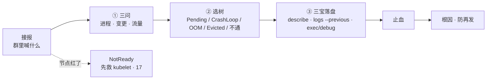
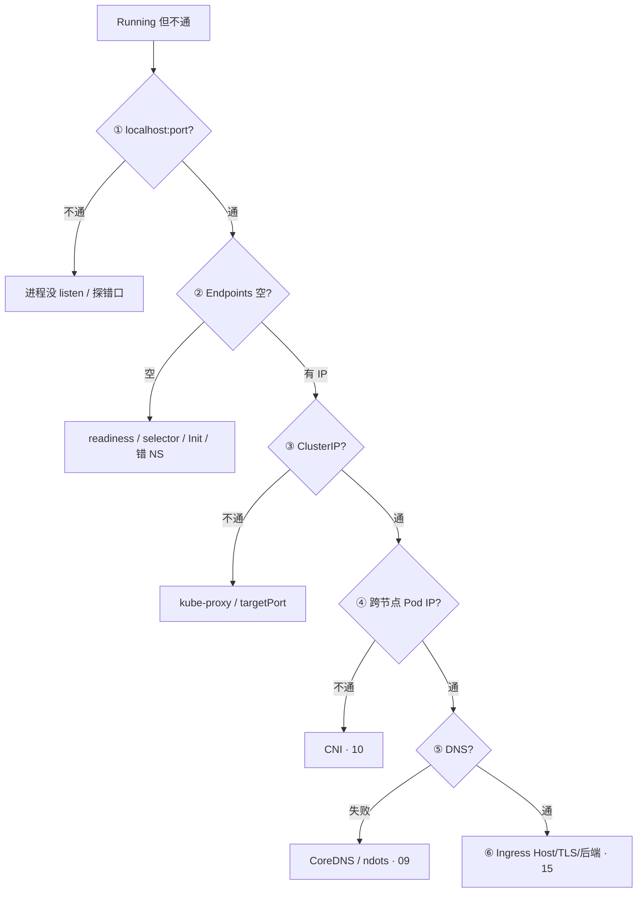
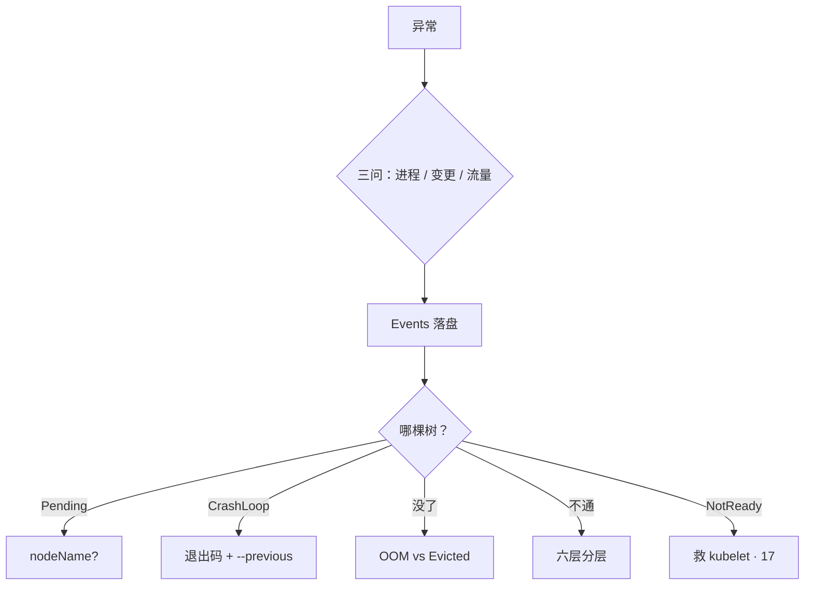

# 典型故障剧本

> 夜班大厅 CrashLoop，群里有人已经准备 `kubectl delete pod --all`，Events 还没人看过；另一边节点 NotReady，有人要杀该节点逻辑服「对齐状态」——重启会丢掉 `logs --previous`，有状态还会踢玩家。手都别动。
> **本章回答**：接到报障怎么三问定影响面；Pending / CrashLoop / OOM / Evicted / 不通 五棵树怎么分流；三宝怎么取证；有状态怎么止血。
> **不讲**：探针、grace、QoS → [04](../04-Pod生命周期/)；调度 Pending → [06](../06-调度机制/)；Endpoints / kube-proxy → [08](../08-Service与kube-proxy/)；DNS → [09](../09-CoreDNS/)；CNI / NP → [10](../10-CNI与网络策略/)；PVC / CSI → [11](../11-存储/)；403 / SA / PSS → [13](../13-RBAC与安全/)；502 / Ingress → [15](../15-Ingress与流量管理/)；滚动回滚 → [16](../16-灰度与回滚/)；NotReady / crictl / drain → [17](../17-节点运行时与升级/)。本章把它们串成决策树。

**标记**：🎯重点 · 🔥难点 · ⭐常考 · 🔧实操

---

## 一、一张图：一次报障的一生

> 🎯 **一句话**：报障和人一样——先问伤在哪、再选科室、动刀前先留证；⭐ **重启是最后一刀，不是第一刀**。



- 📖 **读图**
  - 🛤️ 主线：接报 → 三问定爆炸半径 → 进互斥的一棵树 → Events/上一轮日志落盘 → 止血 → 根因
  - ⚔️ 虚线：节点 NotReady **不进五棵树**——先救 kubelet（[17](../17-节点运行时与升级/)），别删业务「对齐状态」
  - 🔦 定域顺序永远是 **Events → 对象 spec/status → 节点 / CNI / CSI → 应用日志**；80% 线索在 Events

- 🗺️ **群里话 → 进哪棵树**
  - 「一直 Pending」→ 树 A（调度没完成 **或** kubelet 起不来——先看 nodeName）
  - 「反复重启」→ 树 B（CrashLoopBackOff）
  - 「OOM 了」→ 先分清 OOMKilled vs Evicted → 树 C / D（最易混）
  - 「能 Running 但访问不通」→ 树 E（分层测，别一上来重启 proxy）
  - 「节点红了」→ 不在五棵树里，走 [17](../17-节点运行时与升级/)

- 🧰 **三宝是什么**（动手前落盘，不是修法本身）
  - `describe` / `get events` → 时间线与 Reason
  - `logs --previous` → 上一轮退出证据
  - `exec` / `debug` → 进容器或共享 netns 验证

本节对应练习题 Q1、Q10。

---

## 二、定域：三问

> 🎯 **一句话**：先定影响面（进程还在？还能变更？流量通不通？），再选树。

> 💡 **打个比方**：像火警先问「哪栋楼、多少人、火还在不在蔓延」——不是先泼水再说。

- 🔑 **三问落到值班语言**
  - **进程还在不在？** → 容器 / 游戏服是否还在跑；CrashLoop、OOM、被 Evict、被人 delete
  - **还能不能变更？** → apply / 发版 / 自愈 / 调度；控制面、Webhook、RBAC、Pending
  - **已有流量还通不通？** → 长连接、ClusterIP、Ingress；树 E、NP、Endpoints

#### ❓ 为什么不能一上来重启？

- 🧾 Events 默认只留 **约 1 小时**量级——P0 先把 `describe` / `get events` 落盘，再动刀
- 📜 CrashLoop 的根因在**上一轮**退出日志；重启后 `--previous` 可能被顶掉
- 🎮 有状态重启 = 踢玩家、毁对局；正确第一刀是停匹配、禁新进，不是 delete

> 🔍 **现场**：活动开始 CCU 掉了一截——先口述三问，再落盘。

- 1️⃣ **进程**：对局还在打吗？战斗服容器还在不在（`crictl ps`，[17](../17-节点运行时与升级/)）？
- 2️⃣ **变更**：还能 `kubectl apply` / HPA 扩吗？Webhook 焊死了就别再滚动（[03](../03-API-Server/)）
- 3️⃣ **流量**：大厅 HTTP 502 还是战斗 TCP 断了？HTTP 走树 E / [15](../15-Ingress与流量管理/)；长连接断了先问有没有 drain（[16](../16-灰度与回滚/)、[17](../17-节点运行时与升级/)）
- 4️⃣ **落盘**：

```bash
kubectl describe pod hall-7f8b9 -n game > /tmp/hall-describe.txt
kubectl get events -n game --sort-by='.lastTimestamp' > /tmp/hall-events.txt
# ← 不加 --sort-by 按创建时间乱排，看不出因果链
```

- 🧭 **三问答案 → 下一步**
  - 进程还在、变更能、流量断 → 转发面 / 探针 / Endpoints → 树 E
  - 进程没了、CrashLoop → 应用或探针 → 树 B
  - 变更不能、全员 Pending → 控制面 / Webhook → [01](../01-集群架构/)、[03](../03-API-Server/)
  - 节点 NotReady、进程还在 → kubelet 失联 → [17](../17-节点运行时与升级/)，不删业务

> 📝 **面试**：排障我先三问定影响面，再选五棵树之一；第一刀 describe Events 落盘，CrashLoop 看 `logs --previous` 和退出码，不通按 localhost → EP → ClusterIP 分层测。⭐（Q1、Q14）

- 🎤 **复盘口述骨架**：现象 → 影响面 → 最近变更 → 三宝结论 → 止血 → 根因 → 怎么防
  - 没有数字就说「分钟级恢复」「异常 Pod 从两位数降到个位数」，不要编
  - Metrics 发现层、日志对时间线、网络抓包是辅助——**决策树仍是本章五棵**

本节对应练习题 Q1、Q14。

---

## 三、树 A：Pending

> 🎯 **一句话**：没 `nodeName` 是调度/PVC；有 `nodeName` 是 kubelet/镜像/CNI。

> 💡 **打个比方**：Pending 像快递没出库——要么仓库没货（调度资源不够），要么货车到了门口卸不下来（kubelet 起不来）。

🔥 很多人一听 Pending 就答「调度坏了」——⭐ 这是高频错答。正确第一问是：**有没有 `nodeName`？**

#### ❓ 为什么 Pending 不总是调度坏了？

- 📭 **还没有 nodeName**：调度没完成——Insufficient cpu/memory、affinity、taint、unbound PVC、scheduler 挂了
- 📦 **已有 nodeName**：调度完了——ImagePull、FailedCreatePodSandBox、挂卷超时；刀在该节点 kubelet / CNI / CSI
- 🧩 **WFFC PVC**：要等 Pod 定节点才绑卷——Pod 和 PVC 一起 describe，别只盯业务镜像

> 🔍 **现场**：新大厅 Pod 一直 Pending。

```bash
kubectl get pod hall-new -n game -o wide
kubectl describe pod hall-new -n game | tail -20
```

- **情况 A**——NODE 列为空，Events：

```text
0/12 nodes are available: 3 Insufficient cpu, 2 node(s) had taint {node-role: battle}
# ← Insufficient 看 Allocatable 和 request，不是 top；污点/亲和 → 06
```

- **情况 B**——NODE 已有 `worker-03`，Events：

```text
Failed to pull image "registry/hall:v2.3": rpc error: code = NotFound
# ← 该节点 crictl pull（17），不是改业务代码
```

```text
Pending
  +-- 还没有 nodeName（调度没完成）
  |     Insufficient cpu/memory → Allocatable，不是 top
  |     affinity / taint / unbound PVC → 06、11
  |     全体 Pending → scheduler 在不在（01）
  +-- 已有 nodeName（调度完了）
        ImagePull / BackOff → 17
        FailedCreatePodSandBox → CNI、pause、maxPods vs CIDR
        挂卷超时 → CSI
```

- 📖 **读图**：先看有没有绑节点，再决定查控制面还是查该节点；卡住先看 Events，不要先改业务镜像。

> ⚠️ **别混**：**节点 CPU 高**（`top`）和 **Insufficient cpu Pending**（Allocated vs request）是两套域——一次重启修不了，还会踢玩家（Q9）。

> 📝 **面试**：Pending 我先看有没有 nodeName：没有是调度，有是 kubelet；Insufficient 看 Allocatable 和 request，不是 top。⭐（Q2）

本节对应练习题 Q2。

---

## 四、树 B：CrashLoopBackOff

> 🎯 **一句话**：CrashLoop 是起来过、反复退出；第一刀 `logs --previous` + 退出码。

> 💡 **打个比方**：像员工上班打卡后立刻辞职又被 HR 叫回来——得看离职信（上一轮日志）和离职原因码（exitCode）。

#### ❓ 为什么必须看 `--previous`？

- 📜 当前轮日志往往只是「又启动了」；根因在**退出前最后几行**
- 不加 `--previous` = 只看到这一轮启动日志，把事故证据当面错过
- distroless 没 shell 时用 `kubectl debug --copy-to` 改命令，**不要**把生产镜像改成 busybox

> 🔍 **现场**：大厅 CrashLoop。

```bash
kubectl logs hall-7f8b9 -n game -c hall --previous --tail=50
kubectl describe pod hall-7f8b9 -n game | grep -A5 "Last State"
# ← --tail=50 避免刷屏；根因在退出前最后几行
```

```text
Last State:     Terminated
  Reason:       Error
  Exit Code:    1
...
Error: dial tcp 10.0.1.5:6379: connect: connection refused
# ← exitCode 1 = 应用自己退出（Redis 没起来），不是 OOM
```

若是：

```text
Exit Code:    137
Reason:       OOMKilled
# ← 走树 C
```

#### ❓ 为什么 137 不一定是 OOM？

| 退出码 / Events | 含义 | 处理 |
|-----------------|------|------|
| 137 + OOMKilled | 超 memory limit | 树 C |
| 137 无 OOMKilled | grace 用尽 SIGKILL | preStop / terminationGracePeriodSeconds（[04](../04-Pod生命周期/)） |
| 1 / 2 | 应用退出 | 配置、依赖、命令 |
| 139 | 段错误 | 二进制/库 |
| Unhealthy | liveness 误杀 | startupProbe（[04](../04-Pod生命周期/)） |
| 143 | SIGTERM 正常停 | 不是 OOM |

口诀：⭐ **137 先看 Reason 有没有 OOMKilled**——有才是超 limit，没有可能是 grace 强杀。

> ⚠️ **别混**：**liveness 失败** = 重启容器（像 CrashLoop）；**readiness 失败** = 摘 Endpoints（像「不通」）——加内存治不了误杀探针。

> 📝 **面试**：CrashLoop 第一刀 `logs --previous` 和退出码；137 先分清 OOMKilled 还是被强杀；liveness 误杀看起来像 CrashLoop。⭐（Q3）

本节对应练习题 Q3。

---

## 五、树 C / D：OOMKilled vs Evicted

> 🎯 **一句话**：OOMKilled 是容器超 memory limit；Evicted 是节点压力 kubelet 赶人。

> 💡 **打个比方**：OOM 像个人信用卡刷爆了；Evict 像商场消防疏散——整栋楼的问题，换一家店开门还会被赶。

🔥 这是全章最容易混的一对。

#### ❓ 为什么只重建 Evicted 的 Pod 不够？

- 🏪 节点 **MemoryPressure / DiskPressure / PIDPressure** 还在，新 Pod 还会被赶
- ✅ Evicted → 先救节点（加节点、清盘、调 request），不是 `kubectl delete` 再等自愈
- 💳 OOMKilled → 刀在**这个容器的 limit / 泄漏 / 堆外**，不是整节点疏散

> 🔍 **现场**：Pod 没了，Reason 不同。

```bash
kubectl get pod battle-abc -n game -o jsonpath='{.status.containerStatuses[0].lastState.terminated.reason}{"\n"}'
kubectl describe node worker-05 | grep -A6 Conditions
```

- **OOMKilled**：看 limit 和监控 RSS **趋势**（`kubectl top` 只是瞬时值）
- **Evicted** 节点侧常见：

```text
MemoryPressure   True
DiskPressure     False
# ← 先救节点；只重建会再被赶
```

| 类型 | 谁杀的 | 先看什么 | 修法 |
|------|--------|----------|------|
| OOMKilled | cgroup limit | 容器 limit、RSS 曲线 | 限缓存 / 调 limit / 查泄漏 |
| Evicted MemoryPressure | kubelet | 节点 Conditions、QoS | 加节点、降 request |
| Evicted DiskPressure | kubelet | overlay、日志、emptyDir | `crictl rmi`、清日志（[17](../17-节点运行时与升级/)、[20](../20-日志管理/)） |
| Evicted PIDPressure | kubelet | 进程数 | fork 炸弹、僵尸 |
| NotReady 驱逐 | 控制面 ~5min | kubelet（[17](../17-节点运行时与升级/)） | 先救 kubelet |

- 🧠 **调 limit 的常见坑**
  - Java/Go 堆外留 **30–50%**——堆设满 limit 仍可能 OOMKilled
  - `kubectl top` 是瞬时值，要看 RSS **趋势**才分得清泄漏 vs 配置不够
  - 🔥 OOM 先加内存不治本；确认不是泄漏再调 limit
  - 节点 CPU 高 + 新 Pod Pending = 两套域（`top` vs Allocated），一次重启修不了（见树 A）

> ⚠️ **别混**：OOMKilled ≠ Evicted；失联约 **5min** 驱逐 ≠ DiskPressure 赶人——一个先救 kubelet，一个先清节点压力。

> 📝 **面试**：OOM 是容器自己的 limit，Evict 是节点 Pressure；被 Evict 先看 `describe node`，重建解决不了节点满。⭐（Q4）

本节对应练习题 Q4、Q9。

---

## 六、树 E：Running 但访问不通

> 🎯 **一句话**：通不通分层测——localhost → Endpoints → ClusterIP → 跨节点 → DNS → Ingress。

> 💡 **打个比方**：像查外卖为什么没到——先问厨房做好没（localhost），再查骑手名单有没有你（Endpoints），再查小区门禁（NP/CNI）。

#### ❓ 为什么空 Endpoints 不要重启 kube-proxy？

- 📋 **空名单** = readiness 没过或 selector 对不上——业务没进名单，重启 proxy 名单还是空
- 🔌 **proxy 挂了**的签名是「旧通新不通」：存量 conntrack 还在，新连接/滚动同步失效（[08](../08-Service与kube-proxy/)）
- ⭐ **空 EP 先查 readiness / selector**，不先重启 kube-proxy



- 📖 **读图**：测到哪层断就停在哪层；别在 localhost 不通时去查 Service。

> 🔍 **现场**：大厅 Running 但 502。

```bash
kubectl exec hall-7f8b9 -n game -- curl -s -o /dev/null -w '%{http_code}\n' http://127.0.0.1:8080/health
# ← 200 = 进程 OK，再查名单
kubectl get ep hall -n game
```

```text
NAME   ENDPOINTS   AGE
hall   <none>      30d
# ← 空 EP：readiness/selector；不要重启 kube-proxy
```

有 IP 时，同 NS 临时探针：

```bash
kubectl run tmp --rm -it --image=nicolaka/netshoot -n game -- wget -qO- http://hall:8080/
# ← 必须同 NS，才碰到一样的 DNS / NetworkPolicy
```

- 🧭 **六层断点**
  - ① localhost 断 → 停这层，别查 Service
  - ② EP 空 → selector / readiness；③ ClusterIP → proxy / targetPort（[08](../08-Service与kube-proxy/)）
  - ④ 同节点通、跨节点 Pod IP 不通 → CNI（[10](../10-CNI与网络策略/)）
  - ⑤ IP 通、DNS 失败 → CoreDNS（[09](../09-CoreDNS/)）；⑥ Ingress → Host/TLS/后端 Ready（[15](../15-Ingress与流量管理/)）

> ⚠️ **别混**：临时 `kubectl run` **不**共享问题 Pod 的网络；要进**这个 Pod** 的 netns 用 `kubectl debug --target=`（七节）。403 → `kubectl auth can-i --as=`（[13](../13-RBAC与安全/)）；Webhook 全员不能 apply → [03](../03-API-Server/)。

> 📝 **面试**：不通我按六层测，测到哪层断就停在哪层；空 Endpoints 先查 readiness 和 selector，不重启 kube-proxy。⭐（Q5、Q13）

### 收束：五棵树凭什么互斥 🔥

一张脸对一棵树，别两棵一起砍：

1. **Pending** → 还没 Running：先问 nodeName
2. **CrashLoop** → 起来过又退出：先问退出码 + `--previous`
3. **OOMKilled** → Reason 钉死超 limit：先问容器内存
4. **Evicted** → Reason 钉死节点 Pressure：先问 node Conditions
5. **Running 不通** → 进程在、流量断：先分层测，别当 CrashLoop

> ⚠️ **别混**：NotReady **不是**第六棵——kubelet 失联时进程多半还在，先救节点侧（[17](../17-节点运行时与升级/)），删业务才是事故。

本节对应练习题 Q5、Q13。

---

## 七、取证与止血：三宝 · debug · 有状态

> 🎯 **一句话**：动手前三宝落盘；distroless 用 debug；有状态先停匹配。

### 🧰 三宝速查 🔧

```bash
kubectl describe pod <p> -n {ns}                    # Events 时间线，不要只看 Status
kubectl logs <p> -n {ns} -c <c> --previous          # 上一轮退出日志
kubectl exec -it <p> -n {ns} -- /bin/sh             # 进得去再 curl / ss
kubectl get events -n {ns} --sort-by='.lastTimestamp'
```

> 🔍 **现场**：CrashLoop 全流程取证（值班真敲）。

```bash
# 1) Events 按时间排，只看事故 Pod
kubectl get events -n game \
  --sort-by='.lastTimestamp' \
  --field-selector involvedObject.name=hall-7f8b9

# 2) 退出码和 Reason
kubectl describe pod hall-7f8b9 -n game | grep -A8 "Last State:"
# ← 137 + OOMKilled → 树 C；137 无 OOMKilled → grace 强杀

# 3) 上一轮日志
kubectl logs hall-7f8b9 -n game -c hall --previous --tail=50

# 4) distroless 没 sh：注入 ephemeral（共享 netns）
kubectl debug -it hall-7f8b9 -n game \
  --image=nicolaka/netshoot --target=hall
# ← 不加 --target 只在 Pod 级；不重建业务 Pod

# 5) 节点侧绕过 kubelet
crictl ps -a | grep hall                 # ← -a 含已停止
crictl logs <containerID> --tail=20
crictl inspect <containerID> | grep -A5 state
```

### 🪞 debug vs run ⭐🔥

#### ❓ 为什么 `kubectl run netshoot` 测不通「这个 Pod」的网络？

| 方式 | 优势 | 代价 |
|------|------|------|
| `kubectl exec` | 简单 | 镜像无 shell 就废 |
| Ephemeral Container（`debug --target=`） | 注入工具，不改业务 | 1.25+，要 RBAC；共享 netns |
| `kubectl run netshoot` | 通用 | **不**共享问题 Pod 网络；测 Service 才够用 |
| 节点 `nsenter` | 最底层 | 要 ssh，风险高 |

- 🎯 要进 **这个 Pod** 的网络 → `debug --target=`
- 🎯 只要测 Service / 同 NS DNS·NP → 同 NS 的 `run --rm`
- 🎯 容器起不来 → `debug --copy-to=`；节点内核/磁盘 → `debug node/` 或 ssh（[17](../17-节点运行时与升级/)）
- 🔐 生产谁都能 debug？——不能。受 RBAC 管，敏感环境当变更（[13](../13-RBAC与安全/)）；审计要能追谁 debug、谁 delete

- 🛠️ **生产事先要有**（排障组件不用「安装」，但缺了现场会废）
  - RBAC：describe / logs / exec / debug **分人授权**（[13](../13-RBAC与安全/)）
  - 镜像：节点能拉 `nicolaka/netshoot`——别事故时从外网现拉
  - EphemeralContainers：1.25+ 默认开；注入临时调试容器
  - 审计：谁 debug、谁 delete 要能追；敏感环境当变更
  - 托管：exec 走 API→kubelet，NP 和 RBAC 都能让你进不去

### 🛑 生产止血（含游戏）🔧

```text
1. 影响面：几个 NS、几条连接、CCU 掉了没
2. 最近变更：发版 / 配置 / NP / HPA → 能回滚先回滚
3. 最短恢复：undo、切蓝绿、扩节点、关错误 liveness、改 HPA min
4. 再查根因，补监控
5. 有状态：停匹配、禁新进，避免重启毁掉还活着的对局
```

- ⚙️ **配置易踩**
  - Events 先落盘——约一小时后证据没了
  - 多容器必须 `-c`，否则 logs 打错容器
  - Ephemeral 用完即走、**不受业务 limit**，能吃满节点
  - netshoot 必须与问题 **同 NS**，否则测错 DNS / NP
  - liveness vs readiness 分清杀与摘——误杀当 CrashLoop 加内存是错路

> ⚠️ **别混**：`debug --target=` 共享问题 Pod netns；`run` 只适合测 Service / 同 NS 策略；两者不是同一把刀。

> 📝 **面试**：distroless 用 `kubectl debug -it --image=netshoot --target=`；`run` 不共享问题 Pod netns；有状态先停匹配再谈重启。⭐（Q8、Q11）

本节对应练习题 Q1、Q3、Q7、Q8、Q11、Q12。

---

## 八、作战：定责

> 🎯 **一句话**：现场顺序固定——三问 → 选树 → 三宝落盘 → 止血 → 根因；NotReady 先救 kubelet。



- 📖 **读图**：从现象进，不从组件进；五棵树互斥，NotReady 单独出门。

### 现象 · 先做 · 别做 ⭐

| 现象 | 先做 | 别做 |
|------|------|------|
| CrashLoop | `logs --previous` + 退出码 | `delete --all` |
| Pending | nodeName + Events | 先改业务镜像 |
| OOMKilled | 容器 limit + RSS 趋势 | 只加内存 / 当节点满 |
| Evicted | `describe node` Pressure | 只重建 Pod |
| 空 Endpoints | selector / readiness | 先重启 kube-proxy |
| 同节点通跨节点不通 | CNI（[10](../10-CNI与网络策略/)） | 重启 proxy |
| 有的人 403 | `can-i --as=`（[13](../13-RBAC与安全/)） | 当 API 挂了 |
| 全员不能 apply | Webhook（[03](../03-API-Server/)） | 绑 cluster-admin |
| CPU 高 + Pending | top 与 Allocated 两套域 | 重启 kubelet 都修 |
| distroless 没 sh | `kubectl debug` | 改业务镜像 |
| 节点 NotReady | 救 kubelet / 盘（[17](../17-节点运行时与升级/)） | 删该节点逻辑服「对齐」 |

### 60 秒剧本 🔧

- **0-10s**：三问定影响面；有状态先停匹配、禁新进；同时 `describe` / `get events --sort-by` 落盘
- **10-30s**：定树——Pending 看 nodeName；CrashLoop 看 Last State + `--previous`；没了看 OOM vs Evicted；Running 不通从 localhost 起测
- **30-45s**：按树第一刀——Insufficient→Allocated；137→Reason；Evicted→node Conditions；空 EP→selector/readiness
- **45-60s**：止血（undo / 扩节点 / 关错 liveness / 救 kubelet），口述：现象 → 影响面 → 变更 → 三宝结论 → 止血 → 根因 → 怎么防

开篇那两句——「`delete pod --all`」「杀该节点逻辑服对齐状态」——拦住他们：先三问、选树、Events 落盘；有状态先停匹配。

本节对应练习题 Q6、Q7、Q9、Q10、Q12、Q14。

---

## 九、收口

### 命令速查 🔧

```bash
kubectl describe pod <p> -n {ns}                                 # Events 时间线
kubectl get events -n {ns} --sort-by='.lastTimestamp' \
  --field-selector involvedObject.name=<pod>
kubectl logs <p> -n {ns} -c <c> --previous --tail=50
kubectl get pod <p> -n {ns} -o wide                              # Pending：有没有 NODE
kubectl get ep,endpointslice -n {ns}                             # 空后端？
kubectl describe node <n> | grep -A6 Conditions                  # Evicted / NotReady
kubectl debug -it <pod> -n {ns} --image=nicolaka/netshoot --target=<c>
kubectl debug <pod> -n {ns} --copy-to=<pod>-debug --container=<c>
kubectl run tmp --rm -it --image=nicolaka/netshoot -n {ns} -- ...
kubectl auth can-i --as=<user> <verb> <resource> -n {ns}
crictl ps -a | grep <name>                                       # 含已停止
```

### 面试锚点

| 问 | 30 秒答 |
|----|---------|
| 排障第一刀？ | Events 落盘；重启丢 `--previous`，有状态踢玩家。 |
| 三问是什么？ | 进程还在？还能变更？已有流量通不通？ |
| Pending 怎么分？ | 有没有 nodeName：没有→调度/PVC；有→kubelet/镜像/CNI。 |
| CrashLoop 三步？ | describe 看 exitCode/Reason → `logs --previous` → 按码分流。 |
| 137 一定是 OOM？ | 有 OOMKilled 才是超 limit；无则可能 grace SIGKILL。 |
| OOM vs Evicted？ | 容器 limit vs 节点 Pressure；Evict 先救节点。 |
| 空 EP 怎么办？ | 查 readiness/selector，不重启 kube-proxy。 |
| 不通怎么测？ | localhost → EP → ClusterIP → 跨节点 → DNS → Ingress。 |
| distroless 怎么进？ | `debug --image=netshoot --target=`；`run` 不共享 netns。 |
| NotReady 怎么办？ | 先救 kubelet，不删业务「对齐状态」。 |
| 403 怎么办？ | `auth can-i --as=`，不是 API 挂了。 |
| events 怎么看因果？ | `--sort-by='.lastTimestamp'` + field-selector 限定事故对象。 |

### 易错一句话对照

- 排障第一刀是重启 → Events 落盘；重启丢 `--previous`
- 三问是「先 ping 通再看日志」 → 进程 / 变更 / 流量
- Pending 一定是调度坏了 → 有 nodeName 是 kubelet
- CrashLoop 先加内存 → 先退出码；liveness 误杀不是缺内存
- 137 一定是 OOM → 无 OOMKilled 可能是 grace 强杀
- OOMKilled 就是 Evicted → 容器 limit vs 节点 Pressure
- 只重建 Evicted 的 Pod → 节点仍满会再赶
- Endpoints 空先重启 proxy → selector / readiness
- 临时 netshoot 在 default 就能测游戏 NS → 同 NS 才碰到一样 DNS/NP
- debug 和 run netshoot 一样 → `debug --target=` 共享 netns，`run` 不共享
- Ready 失败和 liveness 失败一样 → 摘 EP vs 重启
- 一次重启能修 CPU 高和 Insufficient → 两套域，还会踢玩家
- `get events` 不加排序就能看因果 → 要 `--sort-by='.lastTimestamp'`

### 数字墙

> Events 保留约 **1 小时** · NotReady 心跳约 **40s** / 驱逐约 **5min**（[17](../17-节点运行时与升级/)）· Java/Go 堆外留 **30–50%** · EndpointSlice 默认每片约 **100** 端点（[08](../08-Service与kube-proxy/)）

---

## 合上书

- [ ] **口述**三问是哪三问？为什么不能一上来重启？（Q1、Q14）
- [ ] **默画** Pending 分叉：有没有 nodeName 分别查谁？（Q2）
- [ ] CrashLoop 第一刀？137 怎么分 OOM 与 grace？（Q3）
- [ ] OOMKilled 和 Evicted 差在哪？为什么只重建不够？（Q4）
- [ ] **默画**不通六层顺序；空 EP 能不能重启 proxy？（Q5、Q13）
- [ ] distroless 怎么进？debug 和 run 怎么选？有状态先做什么？（Q8、Q11）
- [ ] NotReady 为什么不杀游戏服？403 第一刀是什么？（Q6、Q7）
- [ ] **口述** 60 秒：现象 → 影响面 → 变更 → 三宝 → 止血 → 根因（Q10、Q12、Q14）

八条都能口述，这一章就过了。终极测试：拦住开篇那两个误操作——`delete pod --all`、杀该节点逻辑服「对齐状态」。下一章把指标从哪来、谁该被电话叫醒焊死。
