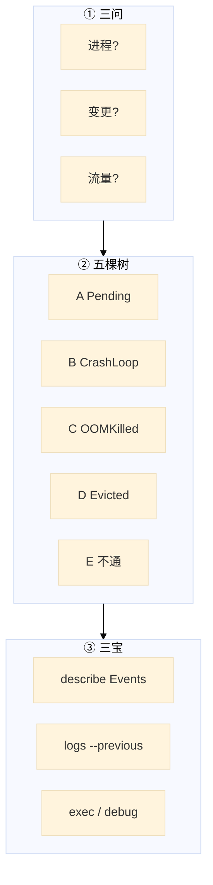
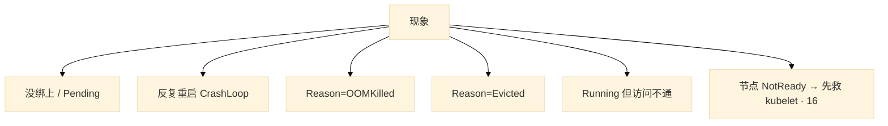
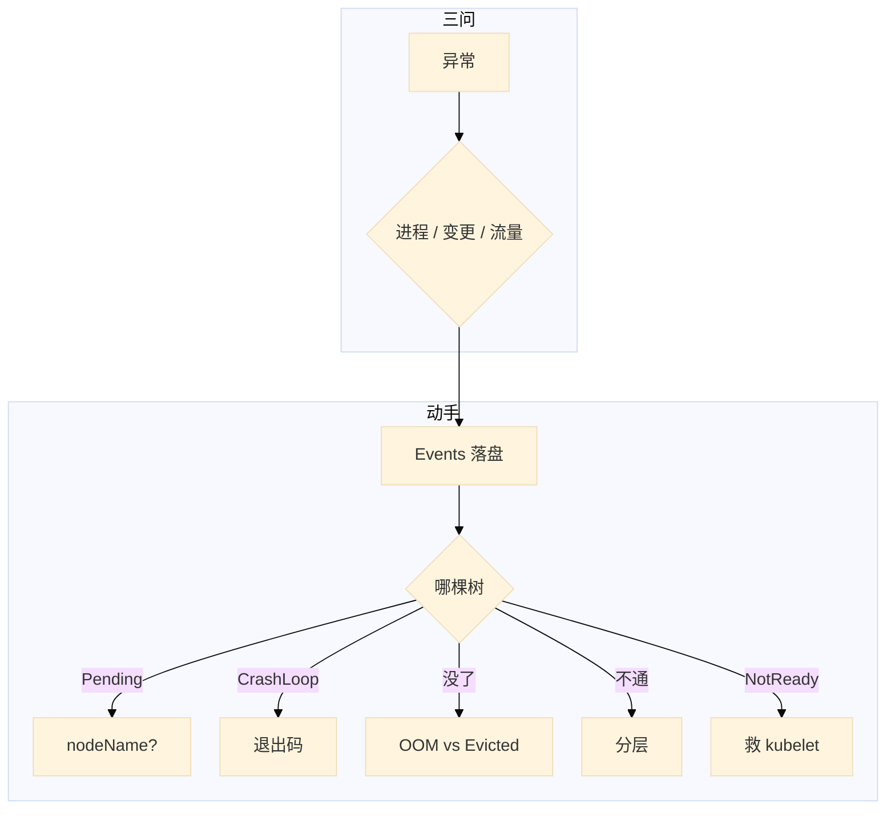

# 排障实战


夜班大厅 CrashLoop。群里有人已经准备 `kubectl delete pod --all`。Events 还没人看过。另一边节点 NotReady，有人要杀该节点逻辑服「对齐状态」——重启会丢掉 `logs --previous`，有状态还会踢玩家。

**本章主线（排障就按这三步想）：**

1. **三问**：进程还在？还能变更？已有流量还通不通？
2. **五棵树**：Pending / CrashLoop / OOM / Evicted / 不通 — 先定是哪棵。
3. **留证**：Events 落盘再重启；有状态先停匹配。

**读完你能：** 用三问定影响面；Pending / CrashLoop / OOM / Evicted / 不通 五棵树分流；先落盘再重启；有状态先停匹配。

## 本章目录

- [1. 基本概念](#1-基本概念)
- [2. 架构图](#2-架构图)
- [3. 原理](#3-原理)
- [4. 安装部署](#4-安装部署)
- [5. 核心配置](#5-核心配置)
- [6. 命令与操作](#6-命令与操作)
- [7. 生产排障](#7-生产排障)
- [8. 必会 · 常考](#8-必会--常考)
- [合上书](#合上书问自己)

**本章不讲：** 把某一层原理再讲一遍。探针、grace、QoS → [04](../04-Pod生命周期/)；调度 Pending → [06](../06-调度机制/)；Endpoints / kube-proxy → [08](../08-Service与kube-proxy/)；DNS → [09](../09-CoreDNS/)；CNI / NP → [10](../10-CNI与网络策略/)；PVC / CSI → [11](../11-存储/)；403 / SA / PSS → [13](../13-RBAC与安全/)；502 / Ingress → [15](../15-Ingress与流量管理/)；滚动回滚 → [16](../16-灰度与回滚/)；NotReady / crictl / drain → [17](../17-节点运行时与升级/)。本章是把它们串成决策树。

---

## 1. 基本概念

任何 Pod 异常，80% 的线索在 **Events**。定域顺序是 **Events → 对象 spec/status → 节点 / CNI / CSI → 应用日志**。重启会丢掉 `logs --previous`，有状态还会踢玩家。

**值班里怎么认现象**（先听告警/群里说什么，再对表）：

| 群里说的 | 技术含义 | 进哪棵树 |
|----------|----------|----------|
| 「一直 Pending」 | 调度没完成或 kubelet 没起 | 树 A |
| 「反复重启」 | CrashLoopBackOff | 树 B |
| 「OOM 了」 | 先分清 OOMKilled vs Evicted | 树 C / D |
| 「能 Running 但访问不通」 | 分层测 | 树 E |
| 「节点红了」 | NotReady → 先救 kubelet（16） | 不在五棵树里 |

和 01、02 同一套 **三问**：

| 问 | 在问什么 | 排障时落到 |
|----|----------|------------|
| **进程还在不在？** | 容器 / 游戏服是否还在跑 | CrashLoop、OOM、被 Evict、被人 delete |
| **还能不能变更？** | apply / 发版 / 自愈 / 调度 | 控制面、Webhook、RBAC、Pending |
| **已有流量还通不通？** | 长连接、ClusterIP、Ingress | 树 E、NP、Endpoints |

先定是哪棵树，再动手。Events 默认只留一小时量级。P0 先把 `describe` / `get events` 落盘，再重启。

> **记住**：先定域，再动手；重启是最后一刀，不是第一刀。三问比「先重启试试」先开口。

**面试怎么说**：「排障我先三问定影响面，再选五棵树之一；第一刀 describe Events 落盘，CrashLoop 看 logs --previous 和退出码，不通按 localhost → EP → ClusterIP 分层测。」

---

## 2. 架构图

后面三问、五棵树、三宝都对着这张图。



**读图三句话：**

1. **三问定爆炸半径**：有状态先停匹配、禁新进，再选树。
2. **五棵树互斥入口**：Pending 看有没有 nodeName；CrashLoop 看退出码；没了看 OOM vs Evict；Running 不通走分层。
3. **三宝在动手前落盘**：describe + logs --previous + exec/debug。



---

## 3. 原理

### 3.1 三问

**一句话：** 先定影响面（进程/变更/流量），再选树，重启是最后一刀。

**打个比方**：像火警先问「哪栋楼、多少人、火还在不在蔓延」——不是先泼水再说。

**现场走一遍**（活动开始 CCU 掉了一截）：

1. **进程**：对局还在打吗？战斗服 `crictl ps` 还在不在（16）？
2. **变更**：还能 `kubectl apply` / HPA 扩吗？Webhook 焊死了就别再滚动（03）。
3. **流量**：大厅 HTTP 502 还是战斗 TCP 断了？HTTP 走树 E / 14；长连接断了先问有没有 drain（15、16）。
4. 落盘：

```bash
kubectl describe pod hall-7f8b9 -n game > /tmp/hall-describe.txt
kubectl get events -n game --sort-by='.lastTimestamp' > /tmp/hall-events.txt
```

5. 口述结构：现象 → 影响面 → 最近变更 → 三宝结论 → 止血 → 根因 → 怎么防。

**输出解读**：

| 三问答案 | 说明 | 下一步 |
|----------|------|--------|
| 进程还在、变更能、流量断 | 转发面/探针/Endpoints | 树 E |
| 进程没了、CrashLoop | 应用或探针 | 树 B |
| 变更不能、全员 Pending | 控制面/Webhook | 01、03 |
| 节点 NotReady、进程还在 | kubelet 失联 | 16，不删业务 |

Metrics 发现层（18），日志对时间线（19），网络 Hubble/抓包（23、10）。决策树仍是本章五棵。

**面试怎么说**：「排障我先三问：进程还在不在、还能不能变更、流量通不通；答不全就先停匹配禁新进，Events 落盘后再动手。」

### 3.2 树 A：Pending

**一句话：** 没 nodeName 是调度/PVC；有 nodeName 是 kubelet/镜像/CNI。

**打个比方**：Pending 像快递没出库——要么仓库没货（调度资源不够），要么货车到了门口卸不下来（kubelet 起不来）。

**现场走一遍**（新大厅 Pod 一直 Pending）：

1. 看宽表：

```bash
kubectl get pod hall-new -n game -o wide
kubectl describe pod hall-new -n game | tail -20
```

2. **情况 A**——NODE 列为空，Events：

```text
0/12 nodes are available: 3 Insufficient cpu, 2 node(s) had taint {node-role: battle}
```

3. **情况 B**——NODE 已有 `worker-03`，Events：

```text
Failed to pull image "registry/hall:v2.3": rpc error: code = NotFound
```

4. 分别处理：A → Allocatable/request/污点；B → 该节点 `crictl pull`（16）。

**输出解读**：

```
Pending
  +-- 还没有 nodeName（调度没完成）
  |     Insufficient cpu/memory → Allocatable，不是 top
  |     affinity / taint / unbound PVC → 06、11
  |     全体 Pending → scheduler 在不在（01）
  +-- 已有 nodeName（调度完了）
        ImagePull / BackOff → 16
        FailedCreatePodSandBox → CNI、pause、maxPods vs CIDR
        挂卷超时 → CSI
```

WFFC PVC 要等 Pod 定节点才绑卷——Pod 和 PVC 一起 describe。卡住先看 Events，不要先改业务镜像。

**面试怎么说**：「Pending 我先看有没有 nodeName：没有是调度，有是 kubelet；Insufficient 看 Allocatable 和 request，不是 top。」

### 3.3 树 B：CrashLoopBackOff

**一句话：** CrashLoop 是起来过、反复退出；第一刀 `logs --previous` + 退出码。

**打个比方**：像员工上班打卡后立刻辞职又被 HR 叫回来——得看离职信（上一轮日志）和离职原因码（exitCode）。

**现场走一遍**（大厅 CrashLoop）：

1. 落盘后看上一轮：

```bash
kubectl logs hall-7f8b9 -n game -c hall --previous
kubectl describe pod hall-7f8b9 -n game | grep -A5 "Last State"
```

2. 屏幕：

```text
Last State:     Terminated
  Reason:       Error
  Exit Code:    1
...
Error: dial tcp 10.0.1.5:6379: connect: connection refused
```

3. 结论：exitCode **1**，应用自己退出——Redis 没起来，不是 OOM。

4. 若是：

```text
Exit Code:    137
Reason:       OOMKilled
```

→ 走树 C。

**输出解读**：

| 退出码 / Events | 含义 | 处理 |
|-----------------|------|------|
| 137 + OOMKilled | 超 memory limit | 树 C |
| 137 无 OOMKilled | grace 用尽 SIGKILL | preStop / terminationGracePeriodSeconds |
| 1 / 2 | 应用退出 | 配置、依赖、命令 |
| 139 | 段错误 | 二进制/库 |
| Unhealthy | liveness 误杀 | startupProbe（04） |
| 143 | SIGTERM 正常停 | 不是 OOM |

没 shell 时用 `kubectl debug --copy-to` 复制改命令，不要把生产镜像改成 busybox。

**面试怎么说**：「CrashLoop 第一刀 logs --previous 和退出码；137 先分清 OOMKilled 还是被强杀；liveness 误杀看起来像 CrashLoop。」

### 3.4 树 C OOMKilled · 树 D Evicted

**一句话：** OOMKilled 是容器超 memory limit；Evicted 是节点压力 kubelet 赶人。

**打个比方**：OOM 像个人信用卡刷爆了；Evict 像商场消防疏散——整栋楼的问题，换一家店开门还会被赶。

**现场走一遍**（Pod 没了，Reason 不同）：

1. 看 Pod：

```bash
kubectl get pod battle-abc -n game -o jsonpath='{.status.containerStatuses[0].lastState.terminated.reason}'
kubectl describe node worker-05 | grep -A6 Conditions
```

2. **OOMKilled** 输出：`OOMKilled`。看 limit 和监控 RSS 曲线。

3. **Evicted** 输出：`Evicted`，节点：

```text
MemoryPressure   True
DiskPressure     False
```

4. Evicted → 先救节点（加节点、清盘、调 request），只重建 Pod 会再被赶。

**输出解读**：

| 类型 | 谁杀的 | 先看什么 | 修法 |
|------|--------|----------|------|
| OOMKilled | cgroup limit | 容器 limit、RSS 曲线 | 限缓存/调 limit/查泄漏 |
| Evicted MemoryPressure | kubelet | 节点 Conditions、QoS | 加节点、降 request |
| Evicted DiskPressure | kubelet | overlay、日志、emptyDir | crictl rmi、清日志（16、19） |
| Evicted PIDPressure | kubelet | 进程数 | fork 炸弹、僵尸 |
| NotReady 驱逐 | 控制面 ~5min | kubelet（16） | 先救 kubelet |

Java/Go 堆外留 30–50%。`kubectl top` 是瞬时值，要看 RSS 趋势。节点 CPU 高 + Pending 是两套域，不要一次重启都修。

**面试怎么说**：「OOM 是容器自己的 limit，Evict 是节点 Pressure；被 Evict 先看 describe node，重建解决不了节点满。」

### 3.5 树 E：Running 但访问不通

**一句话：** 通不通分层测——localhost → Endpoints → ClusterIP → 跨节点 → DNS → Ingress。

**打个比方**：像查外卖为什么没到——先问厨房做好没（localhost），再查骑手名单有没有你（Endpoints），再查小区门禁（NP/CNI）。

**现场走一遍**（大厅 Running 但 502）：

1. 进容器测本机：

```bash
kubectl exec hall-7f8b9 -n game -- curl -s -o /dev/null -w '%{http_code}\n' http://127.0.0.1:8080/health
```

2. 输出 `200` → 进程 OK。看 Endpoints：

```bash
kubectl get ep hall -n game
```

3. 若 **空**：

```text
NAME   ENDPOINTS   AGE
hall   <none>      30d
```

→ readiness 没过或 selector 对不上（01）。

4. 若有 IP，同 NS 临时探针：

```bash
kubectl run tmp --rm -it --image=nicolaka/netshoot -n game -- wget -qO- http://hall:8080/
```

5. 同节点通、跨节点 Pod IP 不通 → CNI（10）。IP 通、DNS 失败 → CoreDNS（09）。

**输出解读**：

| 层 | 测什么 | 断了说明 |
|----|--------|----------|
| 1 localhost | 进程 listen | 停在这层，别查 Service |
| 2 Endpoints | readiness/selector | 空 EP 不重启 proxy |
| 3 ClusterIP | kube-proxy/端口 | targetPort 对不上（08） |
| 4 跨节点 Pod IP | CNI | 不是 proxy 问题 |
| 5 DNS | nslookup svc | ndots（09） |
| 6 Ingress | Host/TLS/后端 Ready | 502（14） |

临时 `kubectl run` **不**共享问题 Pod 的网络。403 → `kubectl auth can-i --as=`（13）。Webhook 全员不能 apply → 03。

**面试怎么说**：「不通我按六层测，测到哪层断就停在哪层；空 Endpoints 先查 readiness 和 selector，不重启 kube-proxy。」

---

## 4. 安装部署

排障不「安装排障组件」，但生产要事先有：

| 项 | 要有 |
|----|------|
| RBAC | describe / logs / exec / debug 分人授权（13） |
| 镜像 | 节点能拉 `nicolaka/netshoot`；不要现场从外网现拉 |
| EphemeralContainers | 1.25+ 默认开；debug 注入 |
| 审计 | 谁 debug、谁 delete 要能追 |

托管：exec 走 API→kubelet，NP 和 RBAC 都能让你进不去。

---

## 5. 核心配置

| 项 | 生产怎么用 | 改错会怎样 |
|----|------------|------------|
| Events 保留 | 先落盘 | 一小时后证据没了 |
| 多容器 `-c` | 必须指定 | logs 打错容器 |
| Ephemeral 资源 | 用完即走 | 不受业务 limit，能吃满节点 |
| netshoot NS | 与问题 Pod 同 NS | 测错 DNS / NP |
| liveness vs readiness | 分清杀与摘 | 误杀当 CrashLoop 加内存 |

---

## 6. 命令与操作

### 6.1 三宝速查

```bash
kubectl describe pod <p> -n {ns}
kubectl logs <p> -n {ns} -c <c> --previous
kubectl exec -it <p> -n {ns} -- /bin/sh
kubectl get events -n {ns} --sort-by='.lastTimestamp'
```

| 目的 | 命令 | 看什么 |
|------|------|--------|
| 调度失败 | `describe pod` Events | 从 Events 往后看 |
| 空后端 | `get ep,endpointslice -n <ns>` | selector/readiness |
| 同 NS 探测 | `run tmp --image=nicolaka/netshoot -n <ns>` | 同 NS 才测到一样 DNS/NP |
| 注入 | `kubectl debug -it <pod> --image=netshoot --target=<c>` | 共享 netns |
| 节点 | `kubectl debug node/<node> -it --image=ubuntu` | 内核/磁盘 |
| CrashLoop 改命令 | `debug <pod> --copy-to=<pod>-debug --container=<c>` | 不覆盖生产镜像 |
| 权限 | `kubectl auth can-i --as=` | 403 不是 API 挂了 |
| 节点压力 | `describe node` Conditions | Evicted 先看这个 |

`describe` 看 **Events 时间线**，不要只看 Status。`exec` 走 API Server（03）。辅助：`get -o wide`、`top`、节点 `crictl`（16）。

### 6.2 🔍 现场命令块：CrashLoop 全流程取证

⭐ 值班真敲的命令——从 Events 落盘到退出码分流，一条龙：

```bash
# 1) Events 按 lastTimestamp 排序，只看事故 Pod
kubectl get events -n game \
  --sort-by='.lastTimestamp' \
  --field-selector involvedObject.name=hall-7f8b9
# ← 不加 --sort-by 的话 Events 按创建时间乱排，看不出因果链

# 2) 看上一轮退出码和 Reason
kubectl describe pod hall-7f8b9 -n game | grep -A8 "Last State:"
# ← Exit Code 137 + Reason OOMKilled → 树 C；137 无 OOMKilled → grace 强杀

# 3) 取上一轮容器日志（不加 --previous 只看到当前轮启动日志）
kubectl logs hall-7f8b9 -n game -c hall --previous --tail=50
# ← --tail=50 避免日志刷屏；CrashLoop 的根因在退出前最后几行

# 4) distroless 没 sh，注入 ephemeral container 调试
kubectl debug -it hall-7f8b9 -n game \
  --image=nicolaka/netshoot --target=hall
# ← --target 共享目标容器 netns；不加 --target 只在 Pod 级别

# 5) 节点侧 crictl 看容器实际状态（绕过 kubelet）
crictl ps -a | grep hall               # ← -a 包含已停止的，STATE=Exited 的就是问题容器
crictl logs <containerID> --tail=20     # ← 直接从 runtime 读日志，kubelet 挂了也能看
crictl inspect <containerID> | grep -A5 state  # ← 看 OOMKilled 在 runtime 层的标注
```

🔧 关键参数记忆：`--sort-by` 按时间排序看因果链；`--previous` 看上一轮退出日志；`--target` 共享 netns；`crictl -a` 含已停止容器。

### 6.3 生产止血（含游戏）

```
1. 影响面：几个 NS、几条连接、CCU 掉了没
2. 最近变更：发版 / 配置 / NP / HPA → 能回滚先回滚
3. 最短恢复：undo、切蓝绿、扩节点、关错误 liveness、改 HPA min
4. 再查根因，补监控
5. 有状态：停匹配、禁新进，避免重启毁掉还活着的对局
```

口述：现象 → 影响面 → 最近变更 → 三宝结论 → 止血 → 根因 → 怎么防。没有数字就说「分钟级恢复」「异常 Pod 从两位数降到个位数」，不要编。

### 6.4 kubectl debug

大厅是 distroless，`exec` 没有 sh。1.25+ Ephemeral Container 注入临时调试容器，共享 netns/存储，**不重建 Pod**。

| 方式 | 优势 | 代价 |
|------|------|------|
| `kubectl exec` | 简单 | 镜像无 shell 就废 |
| Ephemeral Container | 注入工具，不改业务 | 1.25+，要 RBAC |
| `kubectl run netshoot` | 通用 | **不**共享问题 Pod 网络 |
| 节点 `nsenter` | 最底层 | 要 ssh，风险高 |

要进 **这个 Pod** 的网络：`--target=`。只要测 Service：同 NS 的 `run --rm`。容器起不来：`--copy-to`。节点内核/磁盘：`debug node/` 或 ssh（16）。

---

## 7. 生产排障

总树就是本章正文。现场顺序：三问 → 选树 → 三宝落盘 → 止血 → 根因。



| 现象 | 先做什么 | 不要做什么 |
|------|----------|------------|
| CrashLoop | logs --previous + 退出码 | delete --all |
| Pending | nodeName + Events | 先改业务镜像 |
| OOMKilled | 容器 limit + RSS | 只加内存 / 当节点满 |
| Evicted | describe node Pressure | 只重建 Pod |
| 空 Endpoints | selector / readiness | 先重启 kube-proxy |
| 同节点通跨节点不通 | CNI（10） | 重启 proxy |
| 有的人 403 | can-i --as=（13） | 当 API 挂了 |
| 全员不能 apply | Webhook（03） | 绑 cluster-admin |
| CPU 高 + Pending | top 与 Allocated 两套域 | 重启 kubelet 都修 |
| distroless 没 sh | kubectl debug | 改业务镜像 |

---

## 8. 必会 · 常考

| 说法 | 对错 | 口径 |
|------|:----:|------|
| 排障第一刀是重启 | 错 | Events；重启丢 --previous |
| 三问是「先 ping 通再看日志」 | 错 | 进程 / 变更 / 流量 |
| Pending 一定是调度坏了 | 错 | 有 nodeName 是 kubelet |
| CrashLoop 先加内存 | 错 | 先退出码 |
| 137 一定是 OOM | 错 | 无 OOMKilled 可能是 grace 强杀 |
| OOMKilled 就是 Evicted | 错 | 容器 limit vs 节点 Pressure |
| 只重建 Evicted 的 Pod | 错 | 节点仍满会再赶 |
| Endpoints 空先重启 proxy | 错 | selector / readiness |
| 临时 netshoot 在 default 就能测游戏 NS | 错 | 同 NS 才碰到一样的 DNS/NP |
| debug 和 run netshoot 一样 | 错 | run 不共享问题 Pod netns |
| 谁都能生产 debug | 错 | RBAC + 审计；当变更 |
| Ready 失败和 liveness 失败一样 | 错 | 摘 EP vs 重启 |
| 一次重启能修 CPU 高和 Insufficient | 错 | 两套域，还会踢玩家 |

### 8.1 易错一句话对照

⭐ 值班和面试里高频混淆的说法，对照纠正：

- 🔥 `kubectl get events` 不加排序就能看因果链 → 加 `--sort-by='.lastTimestamp'` 才按时间排，否则按创建顺序乱排
- 🔥 CrashLoop 直接 `kubectl logs` → 要加 `--previous`，不加只看到当前轮启动日志，看不到退出前的根因
- 🔧 OOMKilled 就加内存 limit → 先看 RSS 趋势曲线，区分是内存泄漏还是配置不够；加 limit 不治本
- 🔧 `kubectl debug` 和 `kubectl run netshoot` 一样 → `debug --target=` 共享问题 Pod 的 netns，`run` 不共享
- ⭐ 137 一定是 OOM → 无 OOMKilled 的 137 可能是 grace 用尽被 SIGKILL，不是超 memory limit

### 8.2 面试锚点

🔥 高频追问，准备好一句话口径：

| 锚点 | 回答要点 |
|------|----------|
| `kubectl get events` 怎么用才有效？ | 加 `--sort-by='.lastTimestamp'` 按时间排因果链，加 `--field-selector involvedObject.name=<pod>` 限定只看事故 Pod |
| CrashLoopBackOff 排障三步？ | ① `describe` 看 exitCode/Reason ② `logs --previous` 看上一轮退出日志 ③ 按退出码分流：137+OOM→树C，1/2→应用，139→段错误 |
| distroless 镜像怎么调试？ | `kubectl debug -it <pod> --image=nicolaka/netshoot --target=<container>` 注入 ephemeral container，共享 netns 不重建 Pod |
| crictl 和 kubectl logs 什么关系？ | crictl 直接从 container runtime 读日志，绕过 kubelet；kubelet 挂了或 Pod 被 GC 了 kubectl logs 会 404，crictl 仍能看 |

数字：Events **约 1 小时**；NotReady **40s / 5min**（16）；Java 堆外 **30–50%**。

易混：OOM vs Evict；liveness vs readiness；空 EP vs 有 EP 不通；失联 5min vs DiskPressure；403 vs 401 vs Webhook。

---

## 合上书，问自己

- [ ] 三问是哪三问？为什么不能一上来重启？
- [ ] Pending 有没有 nodeName 分别查谁？
- [ ] CrashLoop 第一刀？137 怎么分？
- [ ] OOMKilled 和 Evicted 差在哪？
- [ ] 不通六层顺序？空 EP 能不能重启 proxy？
- [ ] distroless 怎么进？debug 和 run 怎么选？有状态先做什么？

六题都能口述，这一章就过了。下一章把指标从哪来、谁该被电话叫醒、SLO 怎么管发版节奏焊死。
