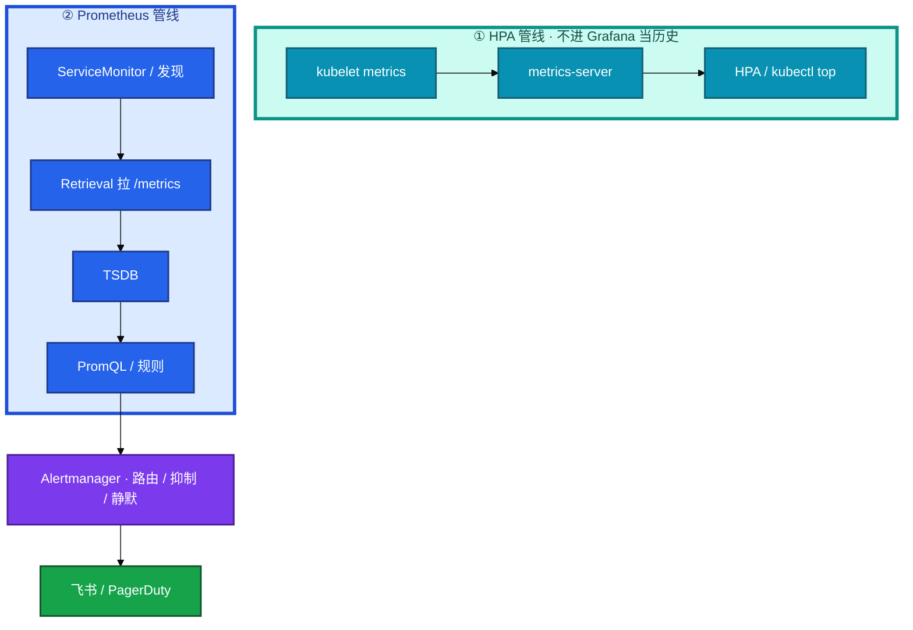
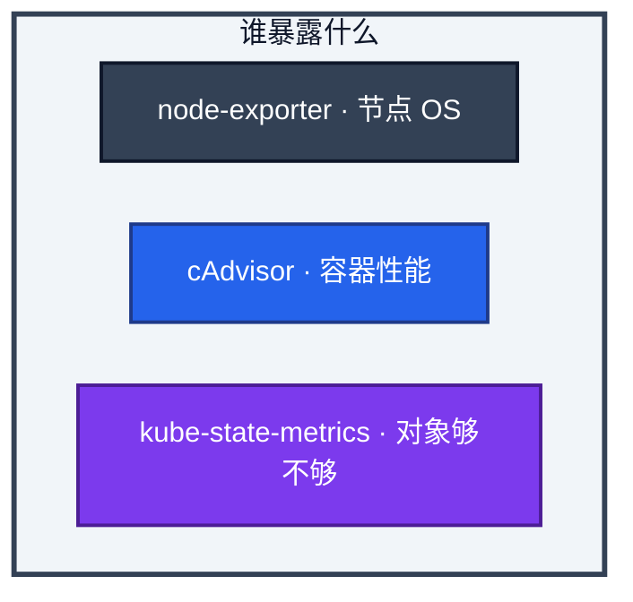
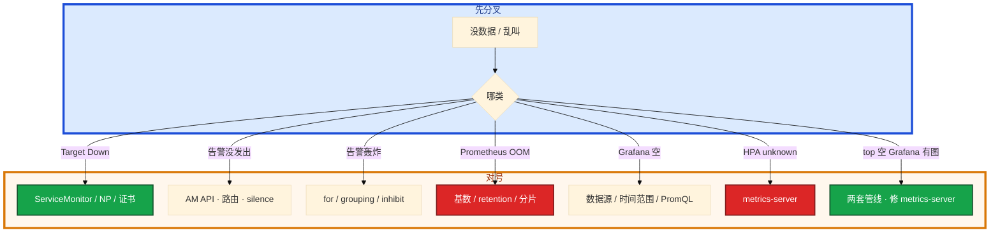

# 监控与可观测性


活动开始，网关 P99 从 50ms 跳到 800ms。`kubectl top` 没数据，有人去重启 Prometheus。支付 5xx 到 8%，磁盘 82%，测试 NS 一个 Pod 在重启，三条一起响。产品要把可用性写成 99.99%。

**本章主线（告警就按这三步想）：**

1. **分两套**：metrics-server 给 HPA / `kubectl top`；Prometheus 给人看、告警、长期存。
2. **四金信号**：Latency / Traffic / Errors / Saturation — 先定是哪一格。
3. **管发布**：SLO + Error Budget 决定能不能发版；高基数先停错误 label。

**读完你能：** 画出 Pull → TSDB → Alertmanager；分清 metrics-server 与 Prometheus；四金信号 + P0–P3；SLO 管发布节奏；高基数先停错误 label。

## 本章目录

- [1. 基本概念](#1-基本概念)
- [2. 架构图](#2-架构图)
- [3. 原理](#3-原理)
- [4. 安装部署](#4-安装部署)
- [5. 核心配置](#5-核心配置)
- [6. 命令与操作](#6-命令与操作)
- [7. 生产排障](#7-生产排障)
- [8. 必会 · 常考](#8-必会--常考)
- [合上书](#合上书问自己)

**本章不讲：** 主机层 CPU/磁盘/logrotate → [01-22](../../01-基础底座/22-监控与告警/)、[01-23](../../01-基础底座/23-日志运维/)；日志采集、EFK vs Loki → [19](../19-日志管理/)；HPA 指标细节 → [07](../07-弹性伸缩/)；Hubble / eBPF → [23](../23-eBPF与Cilium/)；游戏 SLO 定级故事 → [07-09](../../07-游戏运维专题/09-游戏SRE稳定性/)。Thanos 全组件 / 错误预算政策点到为止，不单开模块。

---

## 1. 基本概念

可观测三支柱：Metrics 回答「现在怎样」，Logs 回答「发生了什么」，Traces 回答「慢在哪一跳」。K8s 里 Metrics 的主干是 **Prometheus 拉 `/metrics`**。拉不到 = 这个 target 对采集器来说就是挂了，不会因为业务忘了 push 而静默。

**值班里怎么认现象**（先听告警/看板说什么，再对表）：

| 告警/现象 | 技术含义 | 你的第一刀 |
|-----------|----------|------------|
| `kubectl top` 空 | metrics-server 管线 | 不是重启 Prometheus |
| Grafana 空、target Down | scrape 失败 | ServiceMonitor / NP |
| P99 飙、CPU 不高 | 应用/GC，不是机器热 | 四金信号 RED |
| 一夜两百条告警 | 阈值/for/inhibit | 不是无限 silence |
| HPA unknown | metrics-server 或没 request | 07 |

两套管线不要混：

| | metrics-server | Prometheus |
|--|----------------|------------|
| 目的 | `kubectl top`、**HPA CPU/内存** | 给人看、告警、长期存 |
| 存历史 | **不存** | TSDB |
| 发现 | kubelet metrics API | ServiceMonitor / 注解 |
| 挂了的现象 | top 空、HPA unknown | Grafana 空、告警静默 |

> **记住**：Prometheus 负责拉和算，Alertmanager 负责叫人。HPA 不吃 Prometheus 的历史。没有 SLO 只是更贵的监控。

**面试怎么说**：「metrics-server 喂 HPA 和 top，不存历史；Prometheus 拉 scrape、存 TSDB、规则算完交给 Alertmanager 叫人——两套管线别混。」

---

## 2. 架构图

后面两套管线、四金信号、告警都对着这张图。



**读图三句话：**

1. **HPA 走 metrics-server**，不读 TSDB；`top` 空先修左边，不是重启 Prometheus。
2. **Prometheus Pull**：ServiceMonitor 发现 → scrape → TSDB → PromQL 规则 → Alertmanager。
3. **组件分工**：node-exporter 看 OS；cAdvisor 看容器；kube-state-metrics 看对象够不够——不重叠。



---

## 3. 原理

### 3.1 Pull 与两套管线

**一句话：** Prometheus 主动拉；metrics-server 只聚合 kubelet 给 HPA/top，不存历史。

**打个比方**：Prometheus 像巡检员定期抄表；metrics-server 像物业大屏只显示当前读数，不做年报。

**现场走一遍**（`kubectl top` 空，Grafana 有图）：

1. 查 metrics-server：

```bash
kubectl -n kube-system get deploy metrics-server
kubectl top nodes
```

2. 屏幕：

```text
error: Metrics API not available
```

3. 看 metrics-server 日志：

```bash
kubectl -n kube-system logs deploy/metrics-server --tail=30
```

4. 常见：

```text
unable to fetch metrics from node: x509: certificate signed by unknown authority
```

5. 修 kubelet metrics 证书信任——**不要**重启 Prometheus。

**输出解读**：

| 现象 | 哪套管线 | 修法 |
|------|----------|------|
| top 空、HPA unknown | metrics-server | 证书、kubelet 10250、Pod request |
| Grafana 空、target Down | Prometheus scrape | ServiceMonitor、NP |
| 两套都空 | kubelet / 网络 | 节点级 |
| top 有、无历史曲线 | 正常 | 历史去 Prometheus |

target Down：标签对不上、NP 没放行 scrape、证书不被信。短 Job 才用 Pushgateway，用完清理。重启 Prometheus 修不好 top。

**面试怎么说**：「top 空我先修 metrics-server，不是 Prometheus；两套管线目的不同，HPA 默认不吃 TSDB。」

### 3.2 四层与四金信号

**一句话：** 四层定看什么工具；四金信号定用户有感——别用节点 CPU 当业务告警。

**打个比方**：四层像体检科室（业务/应用/中间件/基础设施）；四金信号像急诊四项（慢/多/错/满）——发烧要先看是不是肺炎，不是先量室温。

**现场走一遍**（网关 P99 50ms→800ms，CPU 不高）：

1. Grafana 看 RED：

```promql
histogram_quantile(0.99, rate(http_request_duration_seconds_bucket{service="gateway"}[5m]))
sum(rate(http_requests_total{service="gateway",status=~"5.."}[5m]))
  / sum(rate(http_requests_total{service="gateway"}[5m]))
```

2. P99 **0.8s**，5xx **0.2%**——用户有感，Errors 还不致命，**Latency** 是主信号。

3. 下钻 JVM：

```promql
rate(jvm_gc_collection_seconds_sum{service="gateway"}[5m])
container_memory_working_set_bytes{pod=~"gateway.*",container!=""}
```

4. Heap 512Mi、RSS 1.5Gi、GC 时间飙——**应用层** Full GC，不是节点 CPU。

**输出解读**：

| 层 | 看什么 | 工具 |
|----|--------|------|
| 业务 | CCU/支付成功率/匹配 | 自定义 metrics |
| 应用 | QPS/P99/5xx/GC | 埋点/exporter |
| 中间件 | 连接数/命中率/堆积 | mysql/redis exporter |
| 基础设施 | 节点 CPU/盘/网 | node-exporter |

USE 看资源（节点/Redis/DB）；RED 看 HTTP 服务。战斗长连接看 CCU、心跳、非自愿断线，不要硬套 HTTP 5xx。延迟看 P50/P90/P99，不看平均。

**面试怎么说**：「告警我先四金信号定用户有感哪格；P99 高 CPU 不高，我下钻应用 GC 和 RSS，不用节点 CPU 当 P0。」

### 3.3 告警分级

**一句话：** 叫人看症状（5xx、登录失败），不是看原因（单机 CPU 90%）。

**打个比方**：P0 像「大楼着火」——有人受伤、要疏散；P2 像「灭火器下个月过期」——工作时间处理。

**现场走一遍**（半夜三条告警一起响）：

1. 读 Alertmanager：

```bash
curl -s http://alertmanager:9093/api/v2/alerts | jq '.[].labels'
```

2. 三条：

```text
alertname=HighErrorRate service=payment severity=critical
alertname=NodeDiskAlmostFull node=worker-03 severity=warning
alertname=PodRestarting namespace=test severity=warning
```

3. **先接 payment 5xx**（P0/P1 症状）——磁盘 82% 是 P2 工作时间；test NS 重启是 P3。

4. 检查 inhibit：NodeDown 应压制该节点 PodDown。

**输出解读**：

| 级 | 定义 | 响应 | 例 |
|----|------|------|-----|
| P0 | 核心中断 | 5min，电话+IM | 支付挂、etcd 不可达 |
| P1 | 核心受损可降级 | 15min，IM | 某服务 5xx、批量 NotReady |
| P2 | 有风险不影响用户 | 工作时间 | 磁盘>80%、证书30天 |
| P3 | 趋势 | 周巡检 | 没设 request |

叫人三条件：用户受损、可执行动作、不是回声。`for: 5m` 防抖。维护用 silence，结束要解开。燃烧率：短窗口高燃烧立刻叫；28d 慢烧工作日处理。双 Prometheus + AM 去重，不会打两通电话。

**面试怎么说**：「P0/P1 基于症状叫人；登录 SLO 健康时节点 CPU 90% 不当 P0。inhibit 压回声，silence 只用于维护窗口。」

### 3.4 SLO / Error Budget

**一句话：** SLO 定目标，Error Budget 管发布节奏——预算耗尽就冻变更。

**打个比方**：Error Budget 像本月请假额度——用完了就不能再安排大活动（高风险发版）。

**现场走一遍**（合服窗口，产品要 99.99%）：

1. 先量三个月登录成功率，假设 **99.92%**——拍 99.99% 没依据。

2. 定 SLO **99.9%** → 月预算 **43.2 分钟**可停（30×24×60×0.001）。

3. 本周已烧 **28 分钟**（一次滚动踢玩家 + 一次网关故障）——高风险变更应冻结。

4. 发版看板（给 15 用）：

| 窗口 | 看什么 | 超阈动作 |
|------|--------|----------|
| 金丝雀每档 | 5xx、P99、登录、CCU | weight 归零 |
| 大活动 | 短窗口燃烧率 | 停普通灰度 |
| 节点升级 | API P99、NotReady | 与业务发版错开（16） |

**输出解读**：

| 概念 | 是什么 | 例子 |
|------|--------|------|
| SLI | 测量什么 | 成功请求/总请求 |
| SLO | SLI 目标 | 99.9% 成功 |
| SLA | 合同带赔偿 | 对外 99.5% |
| Error Budget | 1−SLO | 99.9%→月约43.2min |

滚动踢玩家、drain 战斗节点计入非自愿断线（15、16）。活动高峰用独立短窗口燃烧率。

**面试怎么说**：「SLO 先量再定；Error Budget 管发版——耗尽冻高风险变更。滚动踢玩家要记账，不能开除 SLO。」

### 3.5 高基数与长期存储

**一句话：** 高基数 label 先打死 Prometheus；远程存储不解决 ingest 乱打。

**打个比方**：series 像图书馆书架——按「书名+分类」还行；给每本书贴「读者身份证号」当分类，图书馆先塌。

**现场走一遍**（Prometheus OOM，head series 暴涨）：

1. 查基数：

```bash
curl -s http://prometheus:9090/api/v1/status/tsdb | jq '.data.headStats'
```

2. 屏幕：

```text
"numSeries": 2847391,
"chunkCount": ...
```

3. 找罪魁祸首：

```promql
topk(10, count by (__name__) ({__name__=~".+"}))
```

4. 发现 `http_requests_total{user_id="..."}`——**立刻停这条指标**，加 relabel drop。

**输出解读**：

| 项 | 数字/原则 | 说明 |
|----|-----------|------|
| 单 Prometheus 软上限 | ~200万 series | 超了分片/remote-write |
| 留存 | 15–50天 单机 | 长期 Thanos/VM |
| label | 低基数枚举 | user_id 进日志/Trace |
| HA | 双副本+AM去重 | 不是双写同盘 |
| Thanos/VM | 解决留存/全局查 | 不解决乱打 label |

Recording rule 降查询负载，不降已炸的 ingest。OpenTelemetry：一份 SDK，Collector 采样脱敏再 Export。

**面试怎么说**：「Prometheus OOM 我先查 head series 和高基数 label，停错误指标再谈加内存；Thanos 解决留存，不解决 user_id 当 label。」

---

## 4. 安装部署

### 4.1 kube-prometheus-stack

常见落地：Prometheus Operator + STS 本地盘 + Alertmanager 多副本 + Grafana + node-exporter DS + kube-state-metrics。ServiceMonitor 管发现。

```yaml
apiVersion: monitoring.coreos.com/v1
kind: ServiceMonitor
metadata:
  name: hall
  labels: { release: kube-prometheus-stack }
spec:
  selector:
    matchLabels: { app: hall }
  endpoints:
  - port: http-metrics
    interval: 15s
    path: /metrics
```

标签对不上 = target 永远不出现。NP 没放行 = target Down。验收：Prometheus UI target 全 UP。

| 项 | 选 | 不选 |
|----|----|------|
| Prometheus | STS + 独立盘；双副本 HA | 单盘当唯一真相 |
| Alertmanager | 多副本 + inhibit | 无限期 silence |
| 采集 | ServiceMonitor | 手改 yml 当唯一手段 |
| series | 容量告警 200 万 | 只加内存 |

### 4.2 metrics-server

轻量 Deployment，聚合 kubelet metrics，给 HPA / top。验收：`kubectl top nodes` 有数。

| 现象 | 先看 |
|------|------|
| top 空、HPA unknown | metrics-server Running；kubelet 证书 |
| 部分节点没数 | 那些节点 kubelet/防火墙 |
| 有 top 无历史 | 正常，历史去 Prometheus |
| 利用率对不上 | Metrics API 瞬时 vs scrape rate 窗口 |

发版夜两套都要探活：`kubectl top nodes` + Prometheus `/targets`。缺任一，HPA 或告警盲飞。

---

## 5. 核心配置

Alertmanager 路由示意：

```yaml
route:
  group_by: ['alertname', 'cluster', 'severity']
  group_wait: 30s
  group_interval: 5m
  repeat_interval: 4h
  routes:
    - matchers: ['severity="critical"']
      receiver: 'pager'
inhibit_rules:
  - source_matchers: ['alertname="NodeDown"']
    target_matchers: ['alertname=~"PodDown|ServiceDown"']
    equal: ['node']
```

| 项 | 生产怎么用 | 改错会怎样 |
|----|------------|------------|
| rate vs irate | 告警用 rate；看板突发用 irate | irate 告警半夜抖 |
| histogram_quantile | 只对 Histogram/Summary | 对 Counter 无意义 |
| `container!=""` | 滤 pause | CPU 分母搅脏 |
| `for:` | 防抖 | 瞬时毛刺打电话 |
| Pushgateway | 只给短 Job | 长服务推进去假活 |
| label | 低基数 | user_id→OOM |

---

## 6. 命令与操作

### 6.1 PromQL 速查

```promql
100 - (avg by(instance)(rate(node_cpu_seconds_total{mode="idle"}[1m])) * 100)
histogram_quantile(0.99, rate(http_request_duration_seconds_bucket[5m]))
sum(rate(http_requests_total{status=~"5.."}[5m])) / sum(rate(http_requests_total[5m])) * 100
kube_deployment_status_replicas_available < kube_deployment_spec_replicas
```

| 目的 | 命令 | 看什么 |
|------|------|--------|
| 配置自检 | `promtool check config` | 规则先过关 |
| 当前告警 | `curl AM /api/v2/alerts` | 路由/silence |
| 基数 | `curl Prom /api/v1/status/tsdb` | head series |
| top | `kubectl top nodes/pods` | metrics-server |
| target | Prometheus UI /targets | Down 先看这里 |

### 6.2 看板与 Recording

按服务做 Dashboard，核心服务四金信号必上，定期删废弃 target。Recording 写成 `job:http_qps:rate5m` 降查询负载。没有 limit 的 Pod，相对 limit 的规则分母没有——另做配置缺失告警（P3）。

### 6.3 HA 与远程存储

双副本 + Alertmanager/Query 去重。长期 Thanos 或 VM。高基数先 drop relabel、停错误指标，加内存只是缓冲。

### 6.4 发版窗口用燃烧率

预算尽了冻结高风险变更（15）。活动高峰单独看短窗口。节点升级 drain 战斗服同样记账（16）。登录 SLO 健康时不要把节点 CPU 90% 当 P0。

---

## 7. 生产排障

三问：采集进程还在不在？还能不能算出告警？用户有感指标还看不看得懂？



| 现象 | 先做什么 | 不要做什么 |
|------|----------|------------|
| Grafana 空、target Down | ServiceMonitor、NP、证书 | 先重启业务 |
| top 不工作、Grafana 有图 | metrics-server | 重启 Prometheus |
| 告警没发出 | AM API、silence | 先改 PromQL |
| 一夜两百条 | for、inhibit、阈值 | 无限期 silence |
| Prometheus OOM | drop 高基数 label | 只加内存 |
| P99 算不出 | 指标是不是 Histogram | 对 Counter 硬套 |
| 支付5xx+磁盘82%+测试重启 | 先接支付 | 三条一起当 P0 |

---

## 8. 必会 · 常考

| 说法 | 对错 | 口径 |
|------|:----:|------|
| metrics-server 和 Prometheus 都是历史库 | 错 | 前者不存历史，喂 HPA |
| top 没数据重启 Prometheus | 错 | 修 metrics-server |
| Prometheus 该改成 Push 为主 | 错 | Pull；短 Job 才 Pushgateway |
| P0 = CPU >90% | 错 | 症状：5xx、登录失败 |
| 延迟看平均值就行 | 错 | 分位数；长尾被淹 |
| 99.99% 随便拍 | 错 | 先量三个月；预算管发布 |
| 滚动踢玩家不计入 SLO | 错 | 非自愿断线要记账 |
| user_id 当 label 方便下钻 | 错 | 高基数打死采集 |
| Thanos 可以随便打高基数 | 错 | 远程存储不解决 ingest |
| 双 Prometheus 会打两通电话 | 错 | AM 去重 |
| 告警用 irate | 错 | 告警 rate，看板 irate |
| 没有 SLO 有三套后端也够 | 错 | 只是更贵的监控 |

数字：99.9%≈月 **43.2 分钟**；99.95%≈**21.6 分钟**；series **200 万**；证书 **30d/7d**；P0 **5 分钟**；留存 **15–50 天**；核心重启 **>3/小时**。

易混：metrics-server vs Prometheus；rate vs irate；USE vs RED；P0 症状 vs 机器热；短燃烧 vs 28 天。

---

## 合上书，问自己

1. Prometheus 在图里哪一段？谁叫人？metrics-server 干什么？
2. 四层指标 + 四金信号？延迟为什么不看平均？
3. 什么情况半夜打电话？inhibit 和 silence 差在哪？
4. SLI / SLO / Error Budget？登录和滚动踢玩家怎么记账？
5. 高基数第一刀？Thanos / VM 解决什么、不解决什么？
6. top 空但 Grafana 有图走哪条？HPA unknown 先看谁？

六题都能口述，这一章就过了。下一章把日志采集和与 Trace 的关联剖开：指标发现层，日志对时间线。
