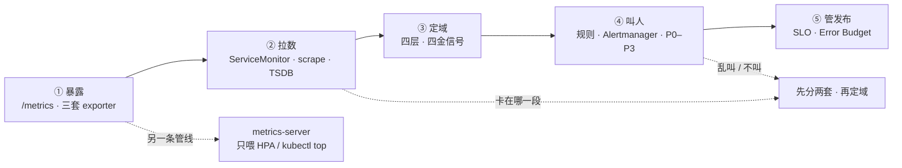
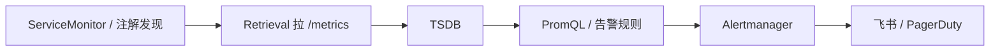
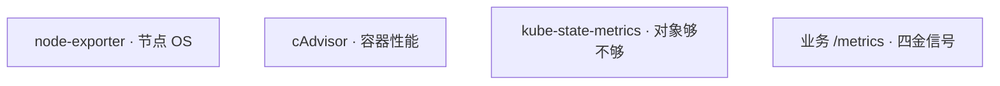
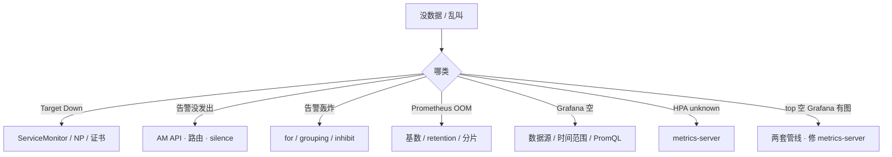

# 监控与可观测性

> 网关 P99 从 50ms 跳到 800ms，`kubectl top` 没数据，有人去重启 Prometheus；支付 5xx 到 8%、磁盘 82%、测试 NS 一个 Pod 在重启，三条一起响；产品要把可用性写成 99.99%。手都别动。
> **本章回答**：一次信号从暴露到叫醒人会经历什么——两套管线怎么分、四金信号怎么定域、谁半夜响、SLO 怎么管发版、高基数第一刀是什么。
> **不讲**：主机层 CPU/磁盘/logrotate → [01-22](../../01-基础底座/22-监控与告警/)、[01-23](../../01-基础底座/23-日志运维/)；日志采集、EFK vs Loki → [20](../20-日志管理/)；HPA 指标细节 → [07](../07-弹性伸缩/)；Hubble / eBPF → [25](../25-eBPF与Cilium/)；游戏 SLO 定级故事 → [07-13](../../07-游戏运维专题/13-游戏SRE稳定性/)。Thanos 全组件 / 错误预算政策点到为止。

**标记**：🎯重点 · 🔥难点 · ⭐常考 · 🔧实操

---

## 一、一张图：一次信号的一生

> 🎯 **一句话**：信号只走五段——暴露、拉数、定域、叫人、管发布；卡在哪一段，刀就动哪一段。口诀先钉：⭐ **top 空先修 metrics-server，不是重启 Prometheus**。



- 📖 **读图**
  - 🛤️ 主线：暴露 → Pull 进 TSDB → 四金信号定用户有感哪格 → Alertmanager 叫人 → Error Budget 管发版
  - 🔀 虚线是**另一套管线**：metrics-server 只聚合 kubelet 给 HPA / `top`，**不进 Grafana 当历史**。排障先问「缺的是 top 还是曲线」

- 🔑 **可观测三支柱**（本章主讲 Metrics；Logs → [20](../20-日志管理/)）
  - **Metrics**：现在怎样——Prometheus 拉 `/metrics`
  - **Logs**：发生了什么
  - **Traces**：慢在哪一跳
  - 🎯 拉不到 = 这个 target 对采集器来说就是挂了，不会因为业务忘了 push 而静默

- 🧭 **值班里怎么认现象**（先听告警/看板，再对管线）
  - `kubectl top` 空 → metrics-server，不是重启 Prometheus
  - Grafana 空、target Down → scrape 失败（ServiceMonitor / NP）
  - P99 飙、CPU 不高 → 四金信号定域，别先骂机器热
  - 一夜两百条 → 阈值 / `for` / inhibit，不是无限 silence
  - HPA unknown → metrics-server 或没 request → [07](../07-弹性伸缩/)

本节对应练习题 Q1、Q11。

---

## 二、分叉：两套管线

> 🎯 **一句话**：metrics-server 喂 HPA 和 `kubectl top`、不存历史；Prometheus 拉 scrape、存 TSDB、规则算完交给 Alertmanager 叫人——目的不同，别混。

> 💡 **打个比方**：metrics-server 像物业大屏——只显示当前读数，不做年报；Prometheus 像巡检员定期抄表、建档、超阈打电话。大屏黑了去修物业，别砸巡检员的档案柜。

| | metrics-server | Prometheus |
|--|----------------|------------|
| 目的 | `kubectl top`、**HPA CPU/内存** | 给人看、告警、长期存 |
| 存历史 | **不存** | TSDB |
| 发现 | kubelet metrics API | ServiceMonitor / 注解 |
| 挂了的现象 | top 空、HPA unknown | Grafana 空、告警静默 |

#### ❓ 为什么 top 空不能重启 Prometheus？

- ❌ top / HPA 默认**不读** Prometheus TSDB——重启一百遍也填不满 `kubectl top`
- ✅ 空了先查 metrics-server Deployment、kubelet 证书信任、10250 可达性
- ✅ 有 top 无历史曲线 = **正常**，历史去 Prometheus / Grafana
- 🧩 metrics-server 是轻量 Deployment：聚合各节点 kubelet metrics，经 Metrics API 给 `kubectl top` 与 HPA；**不做年报、不喂 Alertmanager**

- 🔍 **现场**（top 空、Grafana 有图）

```bash
kubectl -n kube-system get deploy metrics-server
kubectl top nodes
# error: Metrics API not available          # ← 刀在左边管线
kubectl -n kube-system logs deploy/metrics-server --tail=30
# unable to fetch metrics from node: x509: certificate signed by unknown authority
# ← 修 kubelet metrics 证书信任，不要重启 Prometheus
```

- 🧭 **现象对管线**
  - top 空、HPA unknown → metrics-server（证书 / kubelet 10250 / Pod 没 request → [07](../07-弹性伸缩/)）
  - Grafana 空、target Down → Prometheus scrape（ServiceMonitor / NP / 证书）
  - 两套都空 → kubelet / 节点网络
  - top 有、无历史曲线 → 正常
  - 部分节点没数 → 那些节点的 kubelet / 防火墙，不是「Prometheus 漏了」

> ⚠️ **别混**：Prometheus 负责拉和算，**Alertmanager** 负责叫人。HPA 不吃 Prometheus 的历史。没有 SLO 只是更贵的监控（六节）。

> 📝 **面试**：metrics-server 喂 HPA 和 top，不存历史；Prometheus 拉 scrape、存 TSDB、规则交给 Alertmanager——两套管线别混。⭐（Q2）

本节对应练习题 Q2、Q14。

---

## 三、拉数：Pull、发现、三套 exporter

> 🎯 **一句话**：Prometheus 主动拉；谁暴露什么要分清——node-exporter 看 OS，cAdvisor 看容器，kube-state-metrics 看对象够不够。

### 🧲 为什么默认 Pull ⭐🔥

#### ❓ 为什么不是业务 Push 为主？

- ✅ **Pull**：采集器按间隔去敲 `/metrics`——target 挂了立刻 Down，不会「业务忘了 push」静默
- 📦 **Pushgateway**：只给**短生命周期 Job**（跑完就没进程可拉）；用完要清理，长服务推进去 = 假活
- 🔥 面试答「Prometheus 该改成 Push 为主」直接减分



- 📖 **读图**
  - 🛤️ 发现 → scrape → 落盘 → 规则算 → 叫人
  - 👀 Grafana 读的是 TSDB（或远程存储），**不参与叫人链路**——看板空了先查数据源/时间范围/PromQL，别先改 Alertmanager

### 📡 谁暴露什么 ⭐



- 📖 **读图**
  - 三套 + 业务埋点**不重叠**：OS / 容器 / K8s 对象 / 用户有感，各管一摊（Q6）
  - 对象「够不够」看 kube-state-metrics（副本、Ready）；容器「吃多少」看 cAdvisor——别用节点 CPU 代替业务 Latency

### 🏗️ 落地：kube-prometheus-stack 🔧

- 🏷️ **常见组合**：Prometheus Operator + STS 本地盘 + Alertmanager 多副本 + Grafana + node-exporter DS + kube-state-metrics；发现靠 **ServiceMonitor**（注解发现是兼容路径，新集群优先 CR）

```yaml
apiVersion: monitoring.coreos.com/v1
kind: ServiceMonitor
metadata:
  name: hall
  labels: { release: kube-prometheus-stack }   # ← 必须被 Prometheus 的 selector 命中
spec:
  selector:
    matchLabels: { app: hall }
  endpoints:
  - port: http-metrics
    interval: 15s
    path: /metrics
```

- 🔧 **翻车点**
  - 标签对不上 = target **永远不出现**（UI 里连 Down 都没有）
  - NP 没放行 scrape = target **Down**
  - 证书不被信 = Down / 间歇 scrape 失败
  - 验收：Prometheus UI `/targets` 全 UP；metrics-server 验收：`kubectl top nodes` 有数
- 🩺 发版夜两套都要探活：`kubectl top nodes` + `/targets`——缺任一，HPA 或告警盲飞
- 📐 **选型口诀**：Prometheus STS + 独立盘、双副本 HA；Alertmanager 多副本 + inhibit；series 容量告警盯 200 万——**不要**单盘当唯一真相、不要无限期 silence、不要只靠加内存撑 series

> ⚠️ **别混**：有 top 无历史 = 正常；利用率对不上常见于 Metrics API **瞬时值** vs scrape **rate 窗口**——不是两套「谁对谁错」。

本节对应练习题 Q1、Q5、Q6、Q7。

---

## 四、定域：四层与四金信号

> 🎯 **一句话**：四层定看什么工具；四金信号定用户有感——别用节点 CPU 当业务告警。

> 💡 **打个比方**：四层像体检科室（业务/应用/中间件/基础设施）；四金信号像急诊四项（慢/多/错/满）——发烧先查是不是肺炎，不是先量室温。

- 🏢 **四层**
  - **业务**：CCU / 支付成功率 / 匹配 —— 自定义 metrics
  - **应用**：QPS / P99 / 5xx / GC —— 埋点 / exporter
  - **中间件**：连接数 / 命中率 / 堆积 —— mysql/redis exporter
  - **基础设施**：节点 CPU / 盘 / 网 —— node-exporter

- 🥇 **四金信号（Golden Signals）** ⭐🔥
  - **Latency** 慢 · **Traffic** 多 · **Errors** 错 · **Saturation** 满
  - **USE** 看资源（Utilization / Saturation / Errors）——节点、Redis、DB
  - **RED** 看 HTTP 服务（Rate / Errors / Duration）——网关、大厅、支付 HTTP
  - 🎮 战斗长连接看 CCU、心跳、非自愿断线——不要硬套 HTTP 5xx
  - 延迟看 **P50 / P90 / P99**，不看平均（长尾被淹）

#### ❓ 为什么 P99 飙、CPU 不高，不能当「机器热」？

- ❌ 节点 CPU 是基础设施层；用户有感可能在 **应用层 GC / 锁 / 下游**
- ✅ 先四金信号定主格，再下钻那一层——CPU 不高仍可是 Latency P0
- 🗺️ **定域顺序**：用户有感哪格 → 哪一层工具 → 哪条 PromQL，禁止从 node-exporter 倒推业务

```promql
histogram_quantile(0.99, rate(http_request_duration_seconds_bucket{service="gateway"}[5m]))
sum(rate(http_requests_total{service="gateway",status=~"5.."}[5m]))
  / sum(rate(http_requests_total{service="gateway"}[5m]))
# ← P99 0.8s、5xx 0.2% → 主信号是 Latency，不是 Errors 致命
rate(jvm_gc_collection_seconds_sum{service="gateway"}[5m])
container_memory_working_set_bytes{pod=~"gateway.*",container!=""}
# ← Heap 512Mi、RSS 1.5Gi、GC 飙 → Full GC，不是节点 CPU
```

- 📊 **看板最小集**：按服务一张 Dashboard；核心服务四金信号必上；定期删废弃 target
- 📝 Recording 写成 `job:http_qps:rate5m` 降查询负载——**不降**已炸的 ingest（七节）
- ⚠️ 没有 limit 的 Pod，相对 limit 的规则分母没有——另做「配置缺失」P3，别假装利用率 0

> 📝 **面试**：告警先四金信号定用户有感哪格；P99 高 CPU 不高，下钻应用 GC 和 RSS，不用节点 CPU 当 P0。⭐（Q9）

本节对应练习题 Q6、Q9。

---

## 五、叫人：分级、降噪、燃烧率

> 🎯 **一句话**：叫人看症状（5xx、登录失败），不是看原因（单机 CPU 90%）。

> 💡 **打个比方**：P0 像大楼着火——有人受伤要疏散；P2 像灭火器下个月过期——工作时间处理。

### 📞 P0–P3 ⭐

| 级 | 定义 | 响应 | 例 |
|----|------|------|-----|
| P0 | 核心中断 | 5min，电话+IM | 支付挂、etcd 不可达 |
| P1 | 核心受损可降级 | 15min，IM | 某服务 5xx、批量 NotReady |
| P2 | 有风险不影响用户 | 工作时间 | 磁盘>80%、证书30天 |
| P3 | 趋势 | 周巡检 | 没设 request |

#### ❓ 为什么登录 SLO 健康时，节点 CPU 90% 不当 P0？

- ❌ CPU 是**原因候选**，不是用户症状——可能被 HPA / 限流消化
- ✅ 叫人三条件：**用户受损**、**可执行动作**、**不是回声**
- 🧯 `for: 5m` 防抖；维护用 **silence**，结束要解开；**inhibit**：NodeDown 应压制该节点 PodDown

```yaml
route:
  group_by: ['alertname', 'cluster', 'severity']
  group_wait: 30s
  group_interval: 5m
  repeat_interval: 4h
  routes:
    - matchers: ['severity="critical"']
      receiver: 'pager'
inhibit_rules:
  - source_matchers: ['alertname="NodeDown"']
    target_matchers: ['alertname=~"PodDown|ServiceDown"']
    equal: ['node']
```

- 🔍 **现场**（半夜三条一起响）

```bash
curl -s http://alertmanager:9093/api/v2/alerts | jq '.[].labels'
# alertname=HighErrorRate service=payment severity=critical   ← 先接这条（P0/P1 症状）
# alertname=NodeDiskAlmostFull node=worker-03 severity=warning  ← P2 工作时间
# alertname=PodRestarting namespace=test severity=warning         ← P3
```

> ⚠️ **别混**：**inhibit** 是「父告警压子告警」自动降噪；**silence** 是维护窗口人工静默。无限期 silence = 把自己致盲。双 Prometheus + AM **去重**，不会打两通电话。

#### ❓ 为什么告警用 rate 不用 irate？

- `rate`：窗口内平均速率，适合告警，配 `for` 防抖
- `irate`：最近两点瞬时，适合看板看突发——当告警会半夜毛刺打电话
- `histogram_quantile` **只对** Histogram / Summary；对 Counter 硬套无意义；必须 `by (le)` 分桶
- PromQL 写看板时 `container!=""` 滤 pause，否则 CPU 分母搅脏

```promql
# 告警用 rate（配 for: 5m）
sum(rate(http_requests_total{status=~"5.."}[5m])) / sum(rate(http_requests_total[5m])) > 0.01
# 分位数：必须 by (le)
histogram_quantile(0.99, sum(rate(http_request_duration_seconds_bucket[5m])) by (le))
```

> 📝 **面试**：P0/P1 基于症状叫人；inhibit 压回声，silence 只用于维护窗口。⭐（Q3、Q12）

- 🔥 **燃烧率**：短窗口高燃烧立刻叫；28d 慢烧工作日处理——和六节 Error Budget 同一语言
- 🧯 告警风暴第一刀是**降噪**（阈值、`for`、grouping、inhibit），不是无限 silence 把自己致盲

本节对应练习题 Q3、Q8、Q12。

---

## 六、管发布：SLO 与 Error Budget

> 🎯 **一句话**：SLO 定目标，Error Budget 管发布节奏——预算耗尽就冻高风险变更。

> 💡 **打个比方**：Error Budget 像本月请假额度——用完了就不能再安排大活动（高风险发版）。

🔥 **Error Budget（错误预算）** = 「允许坏多久」= `1 − SLO`。没烧完才能发高风险变更，烧完冻发版。

| 概念 | 是什么 | 例子 |
|------|--------|------|
| SLI | 测量什么 | 成功请求 / 总请求 |
| SLO | SLI 目标 | 99.9% 成功 |
| SLA | 合同带赔偿 | 对外 99.5% |
| Error Budget | 1−SLO | 99.9% → 月约 **43.2 min** |

#### ❓ 为什么 99.99% 不能拍脑袋写进合同？

- ❌ 先量三个月真实登录成功率，再定 SLO——假设现状 **99.92%**，拍 99.99% 没工程依据，只会天天冻发版或天天违约
- ✅ 定 **99.9%** → 月预算 `30×24×60×0.001 = 43.2` 分钟；本周已烧 28 分钟（滚动踢玩家 + 网关故障）→ 高风险变更应冻结
- 📒 滚动踢玩家、drain 战斗节点计入**非自愿断线**，不能开除 SLO → [16](../16-灰度与回滚/)、[17](../17-节点运行时与升级/)
- 🎮 活动高峰用**独立短窗口**燃烧率；金丝雀每档看 5xx / P99 / 登录 / CCU，超阈 weight 归零

- 🚢 **发版窗口怎么用预算**（给灰度 / 节点升级用）
  - 金丝雀每档：5xx、P99、登录、CCU —— 超阈 weight 归零
  - 大活动：短窗口燃烧率 —— 停普通灰度
  - 节点升级：API P99、NotReady —— 与业务发版错开
  - 登录 SLO 健康时，**不要**把节点 CPU 90% 当 P0（五节）

> 📝 **面试**：SLO 先量再定；Error Budget 管发版——耗尽冻高风险变更。滚动踢玩家要记账。⭐（Q4）

本节对应练习题 Q4、Q13。

---

## 七、别把自己打死：高基数、HA、远程存储

> 🎯 **一句话**：高基数 label 先打死 Prometheus；远程存储不解决 ingest 乱打；加内存只是缓冲。

> 💡 **打个比方**：series 像图书馆书架——按「书名+分类」还行；给每本书贴「读者身份证号」当分类，图书馆先塌。

#### ❓ 为什么加内存治不好 Prometheus OOM？

- 根因多半是 **高基数 label**（`user_id` / `request_id` 当标签）→ series 爆炸
- 第一刀：**停错误指标** + relabel drop，不是加机器
- 加内存只是给止血留窗口——不砍 label，过几天还是 OOM

```bash
curl -s http://prometheus:9090/api/v1/status/tsdb | jq '.data.headStats'
# "numSeries": 2847391, ...                 # ← 软上限约 200 万，超了分片或 drop
curl -s 'http://prometheus:9090/api/v1/series?match[]={__name__=~"http_requests_total"}' | jq '.data | length'
# ← 单指标 series 数；user_id / request_id 在 label 里会指数膨胀
```

```promql
topk(10, count by (__name__) ({__name__=~".+"}))
# ← 发现 http_requests_total{user_id="..."} → 立刻停这条，user_id 进日志/Trace
```

#### ❓ 为什么 Thanos / VM 解决不了高基数？

- Thanos / VictoriaMetrics 解决的是**留存与全局查询**（跨 Prometheus、长期看）
- ingest 端每个错误 label 组合仍会生成 series——远程写只是把爆炸搬到更大的仓库
- ✅ 顺序：停错误指标 → relabel drop → 再谈分片 / remote-write / 加内存

- 📐 **容量与形态**
  - 单 Prometheus 软上限 ~**200 万** series；留存单机常见 **15–50 天**，长期 Thanos / VM
  - label 只用低基数枚举（service / status / method）；身份类进日志 / Trace
  - Recording rule 降**查询**负载，不降已炸的 ingest
  - HA：双副本 + Alertmanager / Query **去重**——不是双写同盘
  - OpenTelemetry：一份 SDK，Collector 采样脱敏再 Export

> ⚠️ **别混**：Recording rule ≠ 止血高基数；「上了 Thanos 就能随便打 user_id」= 把留存方案当成 ingest 解药。

> 📝 **面试**：Prometheus OOM 先查 head series 和高基数 label，停错误指标再谈加内存；Thanos 解决留存，不解决 user_id 当 label。⭐（Q7、Q10）

### 收束：可观测凭什么「叫得准」

把本章散落的机制收成一张清单——合上书能背：

```text
① 两套管线分清     metrics-server ≠ Prometheus
② Pull 发现可验     ServiceMonitor → /targets UP
③ 四金信号定域     先用户有感，再下钻层
④ 症状叫人         P0/P1 ≠ 机器热；inhibit 压回声
⑤ Error Budget     先量再定 SLO；烧完冻变更
⑥ 高基数第一刀     停错误 label，不是加内存
⑦ HA 去重          双副本 + AM，不打两通电话
```

- 📖 **读图**
  - ①② 是采集能不能看见；③④ 是看见了会不会瞎叫
  - ⑤ 管发版节奏；⑥⑦ 保证监控系统自己不先死

> ⚠️ **别混**：七件套齐了 ≠ 一定稳——没有 SLO 的监控只是更贵的监控；有三套后端却没有预算，发版仍靠吵架。

> 📝 **面试**：背「分管线 → 定域 → 症状叫人 → 预算管发布 → 高基数先停」，再补一个现场命令各一段。⭐

本节对应练习题 Q7、Q10。

---

## 八、作战：定责

> 🎯 **一句话**：先分叉「缺数据还是乱叫」，再对号进两套管线或 Alertmanager——别一上来重启业务或 Prometheus。

### 🌳 决策树 🔥



- 📖 **读图**
  - 从现象进，不从组件进
  - top 空与 Grafana 空是**两把刀**；OOM 先砍 label，不先加内存

### 现象 · 先做 · 别做 ⭐

| 现象 | 先做 | 别做 |
|------|------|------|
| Grafana 空、target Down | ServiceMonitor、NP、证书 | 先重启业务 |
| top 不工作、Grafana 有图 | metrics-server | 重启 Prometheus |
| 告警没发出 | AM API、silence | 先改 PromQL |
| 一夜两百条 | for、inhibit、阈值 | 无限期 silence |
| Prometheus OOM | drop 高基数 label | 只加内存 |
| P99 算不出 | 指标是不是 Histogram | 对 Counter 硬套 |
| 支付5xx+磁盘82%+测试重启 | 先接支付 | 三条一起当 P0 |
| HPA unknown | metrics-server / request | 当成 Prometheus 挂了 |

### 60 秒剧本 🔧

- **0-10s**：问清——top 空还是 Grafana 空？告警不叫还是乱叫？同时 `kubectl top nodes` + 打开 `/targets`
- **10-30s**：top 空 → metrics-server logs / 证书；target Down → ServiceMonitor label、NP、证书；乱叫 → AM API 看 severity 与 silence
- **30-45s**：多条一起响 → 只接用户症状（支付 5xx），磁盘/测试 NS 降级；OOM → `status/tsdb` + `topk` 找高基数
- **45-60s**：定责——管线修采集；叫人层改 for/inhibit；预算层看燃烧率是否该冻发版；高基数停指标 + relabel

开篇三个人——重启 Prometheus、三条一起当 P0、拍 99.99%——该怎么拦住，你已经知道了。

本节对应练习题 Q11、Q12、Q14。

---

## 九、收口

### 命令速查 🔧

```bash
kubectl top nodes && kubectl top pods -n game --sort-by=cpu   # metrics-server 管线
# ← --sort-by=cpu 降序；top 空 = metrics-server，不是 Prometheus
kubectl -n kube-system get deploy metrics-server
kubectl -n kube-system logs deploy/metrics-server --tail=50
# Prometheus UI /targets                                      # scrape 是否 UP
curl -s 'http://prometheus:9090/api/v1/query?query=histogram_quantile(0.99,sum(rate(http_request_duration_seconds_bucket{service="gateway"}[5m]))by(le))' | jq '.data.result[0].value'
curl -s http://prometheus:9090/api/v1/status/tsdb | jq '.data.headStats'
curl -s http://alertmanager:9093/api/v2/alerts | jq '.[].labels'
promtool check config /etc/prometheus/prometheus.yml
```

```promql
100 - (avg by(instance)(rate(node_cpu_seconds_total{mode="idle"}[1m])) * 100)
histogram_quantile(0.99, sum(rate(http_request_duration_seconds_bucket[5m])) by (le))
sum(rate(http_requests_total{status=~"5.."}[5m])) / sum(rate(http_requests_total[5m])) * 100
kube_deployment_status_replicas_available < kube_deployment_spec_replicas
topk(10, count by (__name__) ({__name__=~".+"}))
```

### 面试锚点

| 问 | 30 秒答 |
|----|---------|
| 两套管线差在哪？ | metrics-server 喂 top/HPA 不存历史；Prometheus 拉存算、AM 叫人。 |
| top 空第一步？ | 修 metrics-server / kubelet 证书，不重启 Prometheus。 |
| Prometheus 为什么 Pull？ | target 挂了立刻 Down；短 Job 才 Pushgateway。 |
| 四金信号？ | Latency / Traffic / Errors / Saturation；延迟看分位数。 |
| P0 怎么定？ | 用户症状（5xx、登录失败），不是单机 CPU 90%。 |
| inhibit vs silence？ | 父压子自动降噪 vs 维护窗口人工静默。 |
| rate vs irate？ | 告警 rate；看板突发 irate。 |
| SLO / Budget？ | 先量再定；预算耗尽冻高风险变更；滚动踢玩家要记账。 |
| 高基数第一刀？ | `status/tsdb` → topk 按指标名 → 停错误 label + relabel drop。 |
| Thanos 解决什么？ | 留存与全局查；不解决 ingest 高基数。 |
| `histogram_quantile`？ | 只对 Histogram/Summary，且要 `by (le)`。 |
| 双 Prometheus 打两通电话？ | AM 去重，不会。 |

### 易错一句话对照

- `kubectl top` 没数据就重启 Prometheus → top 走 metrics-server，不读 TSDB
- metrics-server 和 Prometheus 都是历史库 → 前者不存历史，喂 HPA
- Prometheus 该改成 Push 为主 → Pull；短 Job 才 Pushgateway
- P0 = CPU >90% → 症状：5xx、登录失败
- 延迟看平均值就行 → 分位数；长尾被淹
- 99.99% 随便拍 → 先量三个月；预算管发布
- 滚动踢玩家不计入 SLO → 非自愿断线要记账
- user_id 当 label 方便下钻 → 高基数打死采集；进日志/Trace
- Thanos 加了就能随便打高基数 → 远程存储不解决 ingest
- 双 Prometheus 会打两通电话 → AM 去重
- 告警用 irate → 告警 rate，看板 irate
- 没有 SLO 有三套后端也够 → 只是更贵的监控
- 一夜两百条就无限 silence → for / inhibit / 阈值，silence 只给维护窗
- histogram_quantile 对 Counter 也行 → 只对 Histogram/Summary

### 数字墙

> 99.9% ≈ 月 **43.2 分钟** · 99.95% ≈ **21.6 分钟** · series 软上限 **~200 万** · 单机留存常见 **15–50 天** · 证书告警 **30d / 7d** · P0 响应 **5 分钟** · P1 **15 分钟** · 核心重启 **>3/小时** 该看 · `for` 常见 **5m** · scrape 常见 **15s**

---

## 合上书

- [ ] **默画**一节主图：暴露 → Pull → 定域 → 叫人 → 管发布；标出 metrics-server 虚线；说出 top 空与 Grafana 空各照哪段。（Q1、Q2）
- [ ] 口述两套管线：目的、存不存历史、挂了的现象；为什么重启 Prometheus 修不好 top。（Q2、Q14）
- [ ] 口述 Pull 与三套 exporter：为什么默认不 Push；ServiceMonitor 标签对不上会怎样；发版夜两套怎么探活。（Q5、Q6）
- [ ] 口述四层 + 四金信号：USE vs RED；为什么延迟不看平均；P99 高 CPU 不高怎么下钻。（Q6、Q9）
- [ ] 口述叫人：P0–P3；叫人三条件；inhibit vs silence；为什么告警用 rate。（Q3、Q8、Q12）
- [ ] 口述 SLO：SLI / SLO / SLA / Budget；99.9% 月预算怎么算；滚动踢玩家怎么记账。（Q4、Q13）
- [ ] 口述高基数：第一刀；200 万；为什么 Thanos 解决不了 user_id 当 label。（Q7、Q10）
- [ ] **背**七节收束七件套：分管线 → 可验 Pull → 定域 → 症状叫人 → Budget → 高基数停 → HA 去重。
- [ ] 口述定责：60 秒剧本；支付5xx+磁盘+测试重启先接谁。（Q11、Q12、Q14）

九条都能不看稿讲下来，这一章就过了。终极测试：拦住开篇那三个误操作——重启 Prometheus、无限 silence、拍脑袋写 99.99%。下一章：[20](../20-日志管理/) —— 日志采集怎么和 Trace 对上。
