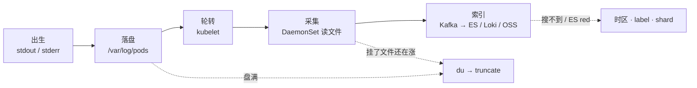
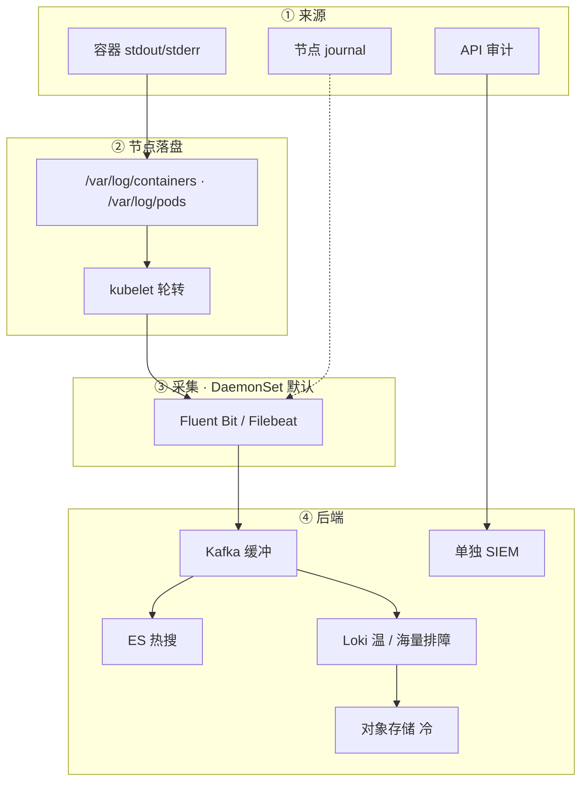
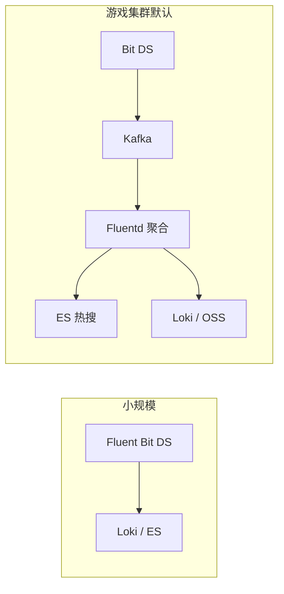
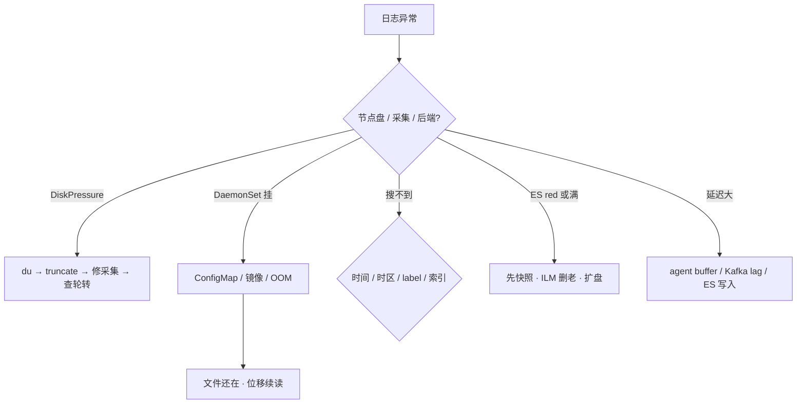

# 日志管理

> 大厅刚崩，群里喊「日志呢」——有人 `kubectl logs` 是空的，有人节点已 DiskPressure、匹配服开始 Evict，还有人去改 `/etc/logrotate.d`。三刀都可能砍错对象。
> **本章回答**：一条日志从 stdout 落到能搜到的一生——节点文件、kubelet 轮转、采集器、索引；盘满与 ES red 怎么止血。
> **不讲**：本机 journald / rsyslog / **logrotate** → [01-23](../../01-基础底座/23-日志运维/)；Prometheus / SLO / exemplar → [19](../19-监控与可观测性/)；Events 排障先落盘 → [18](../18-典型故障剧本/)；API 审计策略字段 → [03](../03-API-Server/)；节点 DiskPressure 驱逐机制 → [17](../17-节点运行时与升级/)。

**标记**：🎯重点 · 🔥难点 · ⭐常考 · 🔧实操

---

## 一、一张图：一条日志的一生

> 🎯 **一句话**：能搜到之前，日志先是**节点上的文件**；出了问题先问「卡在出生 / 采集 / 索引 / 盘满哪一段」。



- 📖 **读图**
  - 🛤️ 主线：stdout → 节点文件 → kubelet 轮转 → DaemonSet 采集 → 后端索引
  - 🔪 定责分叉：盘满照节点文件；采集挂了文件还在涨；搜不到先问文件在不在，再问后端

- 🗺️ **值班三步**（后面每节都挂在这上面）
  - **认链**：`kubectl logs` 读的是节点文件，不是魔法通道
  - **分对象**：kubelet 管容器路径；`/etc/logrotate.d` 管主机——⭐ **改错轮转对象，救不了 DiskPressure**
  - **止血**：盘满先清节点；ES red 看主分片 / 水位，不要先重启业务

- 📦 **四类日志别塞进同一个 index**
  - **容器**：stdout/stderr → 业务排障，kubelet 轮转
  - **节点**：journalctl → kubelet / containerd，主机 logrotate（→ [01-23](../../01-基础底座/23-日志运维/)）
  - **审计**：API Server → 谁动过什么，单独存、单独权限（→ [03](../03-API-Server/)）
  - **Events**：调度失败 / 拉镜像 → 易过期，P0 先落盘（→ [18](../18-典型故障剧本/)）

- 🎭 **开篇三人各自错在哪**（读完应能拦住）
  - `kubectl logs` 空就骂业务 → 先上节点 `ls`，可能轮转 / 路径错
  - 盘满改 `/etc/logrotate.d` → 改的是主机，救不了 `/var/log/containers`
  - 采集挂了说「日志没了」 → 文件还在涨；真丢发生在盘满 Evict 之后

本节对应练习题 Q1、Q8。

---

## 二、出生：stdout 落到节点文件

> 🎯 **一句话**：容器进程写 stdout/stderr，containerd 落节点，kubelet 按大小轮转；`kubectl logs` 读的就是这些文件。

> 💡 **打个比方**：stdout 像员工往收发室扔纸条——先堆在柜子（节点文件），kubelet 定期清旧柜；快递员（采集器）来取走，不是员工直接寄到总部。

### 📂 路径怎么认 ⭐

```text
/var/log/containers/*.log          ← 软链风格入口（值班常先 ls 这里）
/var/log/pods/<ns>_<pod>/<c>/      ← 实体文件在这
*.log.1 / *.log.2                  ← kubelet 轮转走的上一轮、上上轮
```

- 📖 **读图**
  - `kubectl logs` 读当前 `.log`；`--previous` 空 ≠ 日志没了——可能进了 `.log.1`
  - 采集器挂载的也是同一批文件；位移丢了会重放或缺一段——**盘上的 ≠ 一定进了 ES**

#### ❓ 为什么 `kubectl logs` 不是独立通道？

- 🔗 API Server / kubelet 只是**读文件的代理**，没有另一份「魔法日志库」
- 📭 `--previous` 只覆盖**上一轮容器**；轮转把上一轮清出 MaxFiles 窗口 → 空
- 🧯 kubelet 挂了 → logs 404；改用 `crictl logs <containerID>` 直读 runtime
- ✅ 空了第一反应是上节点 `ls`，不是先骂业务没打日志

### 🔧 CrashLoop 后 logs 空：上节点 ls 🔧

```bash
kubectl logs battle-abc -n game -c battle --previous --tail=50
# ← 不加 --previous 只看到当前轮启动日志；轮转清了会空，不等于没了

kubectl get pod battle-abc -n game -o wide   # ← 找到 NODE
ssh worker-03
ls -lh /var/log/containers/*battle*
ls -lh /var/log/pods/game_battle-abc*/
```

```text
-rw-r----- 1 root root  52M  ...  battle-abc_battle-xxx.log
-rw-r----- 1 root root  48M  ...  battle-abc_battle-xxx.log.1
# ← .log 当前；.log.1 上一轮；kubectl logs 只盯当前这份
```

- 🔍 **现场怎么读**
  - 文件在 → `kubectl logs` 读的就是它；要对时间窗对照 `.log.1` 或后端
  - kubelet 挂 → `crictl ps -a | grep battle` 找 Exited 的 ID，再 `crictl logs`
  - 主机组件另路：`journalctl -u kubelet -u containerd`——**不是**容器 stdout

```bash
# kubelet 挂了 / logs 404 时绕过
crictl ps -a | grep battle                # ← 找 containerID，STATE=Exited 的那行
crictl logs <containerID> --tail=50       # ← 直读 runtime，不经 kubelet

# 主机组件（别在这找容器 stdout）
journalctl -u kubelet --since "10 min ago" --no-pager | tail -30
journalctl -u containerd --since "10 min ago" --no-pager | tail -30
```

> ⚠️ **别混**：`journalctl -u kubelet` 看节点组件；容器路径永远是 `/var/log/pods`。两套日志、两套轮转，别串台。

> 📝 **面试**：`kubectl logs` 读 `/var/log/pods`；`--previous` 空先上节点 `ls` 看实体和 `.log.1`。⭐（Q1）

本节对应练习题 Q1。出生落盘了，谁来取走？

---

## 三、采集：DaemonSet 默认，Sidecar 例外

> 🎯 **一句话**：默认每节点一个 DaemonSet 只读挂载 `/var/log/containers`；Sidecar 只给写不了 stdout 的老应用。

> 💡 **打个比方**：DaemonSet 像每栋楼一个邮差；Sidecar 像每个住户门口再雇专递——1000 户就是 1000 份工资。

### 🏗️ 架构：谁读文件、谁写后端 🎯



- 📖 **读图**
  - 📥 采集器**只读**挂载节点文件，**不代替** kubelet 轮转
  - 📦 活动高峰中间加 Kafka：堆积在队列，ES/Loki 按能力拉；Bit 直打 ES 会把写入打满
  - 🔒 审计不进业务 index；Events 另路，P0 先落盘



- 📖 **读图**：小规模可直写；游戏默认 Kafka 双写——热搜 ES（7–14 天），长期 Loki/OSS。

#### ❓ 为什么不是每个游戏 Pod 默认挂日志 Sidecar？

- ❌ **每 Pod Sidecar**：1000 Pod ≈ 1000×50–100Mi；和业务同 cgroup，OOM 可能拖垮战斗服
- ✅ **节点 DaemonSet**：一份资源读整机容器日志；一节点暂时不采，**文件还在涨**
- 🧯 **例外才 Sidecar**：老 Java 只写 `game.log`、改不动 stdout——先逼 stdout，逼不动再给**该工作负载** Sidecar
- 🧩 multiline / 解析能配在 DS 上就不要上 Sidecar
  - 边缘：Fluent Bit（C，常小于 **5Mi**）
  - Kafka 后聚合：Fluentd（Ruby）——别在每个 Worker 上满配 Fluentd

### 📮 采集挂了：文件还在不在？🔥

```bash
kubectl -n logging get ds fluent-bit -o wide
# ← desired == ready？某节点 0/1 先盯那台

kubectl -n logging logs ds/fluent-bit --tail=20
```

```text
[info] [input:tail:tail.0] inotify_fs_add(): inode=... watch=/var/log/containers/hall-xxx.log
[info] [output:loki:loki.0] HTTP status=204
# ← watch 到文件 + 204 / records_out 在涨 → 采集正常
```

- 🔍 **现场**
  - DS 全挂 → 查 ConfigMap / 镜像 / OOM；**别说日志全没了**
  - 位移文件还在 → 修好后从断点续读；丢了可能重放或缺一段
  - 长时间不采 → 盘继续涨 → DiskPressure → Evict：采集器挂是 **P1**
  - 滚动升级采集器：短窗口可能漏采，靠位移与 Kafka 缓冲扛；别为此重启游戏服（Q12）

> ⚠️ **别混**：采集挂了 ≠ 日志没了。文件继续写盘；真丢发生在盘满 / truncate / Evict 之后。别重启还活着的战斗服「找日志」。

> 📝 **面试**：默认 DaemonSet 只读挂载；Sidecar 只给写不了 stdout 的例外；挂了文件还在涨。⭐（Q2、Q7、Q12）

### ✅ 落地验收（装完怎么算活）

- DaemonSet `desired == ready`，每节点一个 agent
- agent `records_out` / 下游 204 在涨；抽一条已知日志能在 Grafana/Kibana 搜到
- 战斗节点日志量远大于控制面——容量按战斗节点估，别按 master 估
- 日志分区独立盘；和 etcd / 容器可写层同盘 = 满盘拖垮控制面

本节对应练习题 Q2、Q7、Q12。文件采走了，后端怎么查？

---

## 四、索引：EFK 全文 vs Loki label

> 🎯 **一句话**：ES 全文倒排任意搜；Loki **只索引 label**，正文 grep 必须先收窄。

> 💡 **打个比方**：ES 像图书馆全文检索——慢但什么都能搜；Loki 像按书架号找书再翻页——书架号（label）不对，翻全书会超时。

| 维度 | EFK（ES） | Loki |
|------|-----------|------|
| 索引什么 | 全文倒排 | **只索引 label** |
| 怎么查 | KQL 任意搜 | label 收窄 + grep 正文 |
| 成本 | JVM、分片运维税 | 轻、压缩高 |
| 适合 | 复杂全文、已有 ES 团队 | 海量排障、Grafana 一把 |
| 游戏常见 | Kafka 双写：热搜 ES，长期 Loki/OSS | |

### 🔎 充值失败怎么搜 ⭐

- **排障 grep**（99% 大厅/战斗）→ Loki：

```logql
{app="hall", namespace="game"} |= "user_login" |= "traceId=abc123"
```

- 先 label 收到 `app=hall`，再 grep `traceId`
- **全库** `|= "ORD-..."` 没 label → 慢/超时，**不是坏了**
- **复杂全文**（支付报文对账）→ ES KQL：

```text
index:payment-* AND orderId:"ORD-20240828-001"
```

#### ❓ 为什么 `userId` / `traceId` 不能当 Loki label？

- 📈 label 基数和 Prometheus 一样：**高基数打爆索引内存与写入**
- ✅ `userId`、`traceId`、`pod_ip` 放**正文**或 structured metadata
- 🏷️ label 只留低基数：`app` / `namespace` / `level`（偶尔 `pod`，慎用）
- 🌐 Nginx access：**先 Prometheus 指标**，再对 5xx 抽日志——别全量灌 ES

- 🎮 **活动日配额**：保 ERROR，可丢 DEBUG；热搜走 ES，长期进 Loki/OSS，别所有行进同一个 index

### 📬 Kafka 双写时卡在哪 🔥

- Bit 读节点文件 → 投 Kafka → Fluentd 聚合 → 热搜 ES + 长期 Loki/OSS
- 🔍 **lag 涨、ES 还绿** → 瓶颈在聚合 / 消费，不是节点盘；**先别 truncate**
- 🔍 **lag 涨、节点盘也顶** → 两边一起治：救盘 + 扩消费，分清因果
- ⚠️ Bit 直打 ES：活动写入把 ES 打满 → 429 / 堆积回压到节点缓冲 → 更容易 DiskPressure

> 📝 **面试**：排障 grep 用 Loki（先 label 再正文）；复杂全文用 ES；label 基数不能乱打。⭐（Q3、Q11）

本节对应练习题 Q3、Q11。能搜到了，怎么和指标、链路串成一条故事？

---

## 五、串线：JSON + traceId 把三支柱焊死

> 🎯 **一句话**：JSON 结构化 + 统一 `traceId`，才能把 Metrics → Logs → Traces 串成一条故事。

> 💡 **打个比方**：三支柱像破案——监控发现「案发时间」（Metrics），日志是「证人证词」（Logs），Trace 是「监控录像」（Traces）；没有 traceId 就像证人说不清几点几分。


- 📖 **读图**：exemplar / RED 尖刺 → 日志带同一 `traceId` → Tempo/Jaeger 看慢在哪一跳。三套后端没有统一 ID = 三份账单。

### 🔑 字段与传播 ⭐

- **最小集**：`timestamp` · `level` · `msg`
- **建议**：`service` / `pod` / `namespace` / **`traceId`**
- 🚫 禁止密码、token、手机号进日志（合规；战斗服日志同样）
- 🧵 `traceId` 在 Ingress/网关生成，HTTP header / gRPC metadata 往下传（→ [15](../15-Ingress与流量管理/)、[19](../19-监控与可观测性/)）
- 🧰 应用用 zap / structlog / Logback JSON；别指望采集器把纯文本解析完美

```json
{"timestamp":"2024-01-17T10:30:15Z","level":"WARN","msg":"slow_query","traceId":"abc123","duration_ms":820}
```

#### ❓ 为什么装了三套后端还不算「可观测」？

- 📦 Metrics / Logs / Traces 各存各的，**没有统一 ID 对不上同一请求**
- ✅ 同一 `traceId` 贯穿：面板尖刺 → 日志一行 → Trace 一跳
- ❌ 「三套都装了」只是三份账单；值班仍只能按时间窗碰运气

> 📝 **面试**：三支柱靠 traceId 串；没 ID 只能按时间碰运气。⭐（Q5、Q10）

本节对应练习题 Q5、Q10。链认清了，轮转和盘怎么配才不 Evict？

---

## 六、轮转与容量：kubelet 管容器，logrotate 管主机

> 🎯 **一句话**：容器日志轮转看 kubelet `containerLogMaxSize` / `MaxFiles`；主机 logrotate 救不了 `/var/log/containers`。

### ⚙️ 生产旋钮 ⭐🔧

```yaml
# kubelet config（常见生产）
containerLogMaxSize: 50Mi    # ← 默认 ~10Mi 太小，崩溃现场易被转没
containerLogMaxFiles: 5      # ← 默认 3；再大也扛不住 DEBUG / CrashLoop 刷屏
```

| 项 | 常见默认 / 错法 | 生产口径 |
|----|-----------------|----------|
| 轮转大小 × 份数 | 10Mi × 3 | **50Mi × 5** |
| 日志盘 | 跟根盘 / 跟 etcd 同盘 | **独立分区或独立盘** |
| Loki label | 随便贴 userId | 低基数 app/ns/level |
| ES 单 shard | 随手 50 个小片 | 目标 **10–50GB**/shard |
| ES 堆 | 机器一半乱给 | **≤32Gi**（超了压缩指针失效） |
| flood watermark | 不管 | **85% / 90% / 95%**；超 85% 写入 429 |
| 热保留 | 无限 | **7–14 天**；温 30–90；冷 6–12 月 OSS |

- 🧊 **热温冷**：ES ILM hot→warm→cold→delete；交易常 90 天热 + 1 年归档；审计 6–12 月**单独库**
- 📑 日志副本排障通常 **1** 够用；审计另说
- 🏗️ **落地选型**
  - 采集：节点 DaemonSet + Fluent Bit 边缘
  - 高峰：Kafka（或云队列）；别 Bit 直打 ES
  - 后端：Loki 排障 + 按需 ES 热搜；别所有行进同一个 ES index

#### ❓ 为什么改 `/etc/logrotate.d` 救不了 DiskPressure？

- 📁 **容器路径** `/var/log/containers` · `/var/log/pods` → **kubelet** 按 `MaxSize`/`MaxFiles` 轮转
- 🖥️ **主机路径** journald / rsyslog → **logrotate**（→ [01-23](../../01-基础底座/23-日志运维/)）
- 🔥 活动夜盘满 80% 是容器日志或 overlay——改主机规则，容器文件继续涨
- ✅ 止血看六节数字 + 七节 truncate；根治看应用级别与采集器存活

```bash
kubectl -n kube-system get cm kubelet-config -o yaml | grep -A2 containerLog
# ← 确认 MaxSize / MaxFiles；太小崩溃现场会被转没
```

> ⚠️ **别混**：轮转再大也扛不住生产 DEBUG 和 CrashLoop 刷屏。口诀：⭐ **容器路径找 kubelet，主机路径找 logrotate**。

本节对应练习题 Q5、Q6、Q11。配置对了，值班真刀怎么砍？

---

## 七、作战：盘满、采集挂、后端红

> 🎯 **一句话**：先分叉「节点盘 / 采集 / 后端」，再动手；Evict 已发生时**先救节点**，日志可以后补。

### 🧭 定责树



- 📖 **读图**
  - 三条止血线互不替代：盘满清文件；采集修 DS；ES red 保主分片
  - Kafka lag 涨、ES 还绿 → 瓶颈在聚合层，**不要先 truncate 节点**

| 现象 | 先做什么 | 不要做什么 |
|------|----------|------------|
| DiskPressure / Evict | truncate 救节点，再修采集 | 先改主机 logrotate |
| 采集器全挂 | 配/镜像/OOM；文件还在 | 说「日志全没了」；重启游戏服 |
| ES red | 先快照，再看主分片 | 手删可能还有主分片的数据 |
| ES yellow | 副本没分配 / 水位 | 当搜不到去重建集群 |
| 写入 429 | flood 85% 或线程池 | 当 Kibana 坏了 |
| Loki 超时 | 先收窄 label | 全库 grep 当故障 |
| Kafka lag 涨 ES 绿 | 查聚合层 | 先 truncate 节点 |
| 查不到支付失败 | 时区、索引、label、采样 | 先删索引 |

### 🔧 DiskPressure 止血 🔧

盘满四条常见根因：应用狂打、CrashLoop 刷屏、采集器挂只写不采、Events 爆炸。

```bash
df -h /var/log
du -sh /var/log/containers/* | sort -rh | head
truncate -s 0 /var/log/containers/xxx.log   # ← 丢未采部分；先救节点再补日志
kubectl -n logging logs ds/fluent-bit --tail=50
kubectl describe node <n> | grep -A5 Conditions
```

#### ❓ 为什么 Evict 时要先 truncate，而不是先修采集？

- 🚨 节点已 DiskPressure / Evict → **保节点、保调度**优先；日志可后补
- ⏱️ 先修采集也要几分钟；这几分钟里盘可能继续顶满、更多 Pod 被赶走
- 💸 `truncate` **会丢未采部分**——知情代价；事后靠后端已入库段 + 应用侧补打
- ✅ 救完立刻修 DS / 降日志级别 / 查 CrashLoop，避免再满

#### ❓ 为什么 ES yellow 不能当 red 治？

- 🟡 **yellow**：主分片在，副本没配齐 / 水位——通常**还能搜**
- 🔴 **red**：有主分片丢了 → **P0**；先快照，再看 `_cat/shards`，别手删「腾空间」
- 💧 写入 429 → 多半 flood **85%** 或线程池，不是 Kibana 坏了
- 🧹 ILM 删老索引 / 扩盘 / 降副本；活动日有人删主分片「腾空间」= 造 red

### ⏱️ 60 秒剧本 🔧

> 🔍 **现场**：接到「logs 空 / 盘满 / 搜不到」，60 秒走完再下结论。

```text
① 0–10s   现象分叉：DiskPressure？采集 DS 不 ready？还是只是搜不到？
② 10–30s  节点：df + du 找最大文件；logging NS：get ds / logs fluent-bit
③ 30–45s  文件在不在？ls /var/log/pods/... ；--previous 空对照 .log.1
④ 45–60s  后端：ES _cat/health（red→快照）· Loki 先收窄 label · Kafka lag 对照 ES 是否仍绿
```

### 📡 告警门槛（和 [19](../19-监控与可观测性/) 对齐）

- DaemonSet ready ≠ desired → **P1**
- agent `records_in >> out` 持续 → P1
- Kafka consumer lag 活动飙升 → P1
- `/var/log` **>80%** → P1
- ES cluster **red** → **P0**；磁盘 **>85%** → flood 429

- 🔒 **审计**：`--audit-log-path` + policy → 单独 SIEM（→ [03](../03-API-Server/)）；权限、保留、ILM 都和业务冲突——**不能一个 index**（Q8）
- 📋 **Events**：P0 先落盘（→ [18](../18-典型故障剧本/)），别指望一周后还能在 API 里翻到

### 收束：一条日志凭什么「还能搜到」

把本章散落的机制收成可背清单——少一件，现场就会「文件在却搜不到」或「搜得到却盘炸了」：

1. **落盘**：stdout → `/var/log/pods`（`kubectl logs` 读这里）
2. **轮转**：kubelet `MaxSize`/`MaxFiles`（不是主机 logrotate）
3. **采集**：DaemonSet 只读挂载（默认）；Sidecar 例外
4. **缓冲**：活动高峰 Kafka，别 Bit 直打 ES
5. **索引**：排障 Loki（先 label）· 全文 ES · 冷 OSS
6. **串线**：JSON + 统一 `traceId`
7. **止血**：盘满 truncate 救节点 · ES red 先快照 · 采集挂了文件还在

> ⚠️ **别混**：这条清单保证的是「链路上能找到」——**不保证**不丢未采段、不保证全量永久热搜、不保证没 traceId 也能对上请求。

> 📝 **面试**：画链 + 说清「kubelet vs logrotate」「DaemonSet vs Sidecar」「Loki label vs ES 全文」「red vs yellow」四对，基本过关。⭐

本节对应练习题 Q4、Q7、Q8、Q9、Q13、Q14。

---

## 八、收口

### 命令速查 🔧

```bash
# 容器上一轮 / 当前
kubectl logs {pod} -n {ns} -c <c> --previous --tail=50
# 节点实体
ls -lh /var/log/containers/*{name}*
ls -lh /var/log/pods/{ns}_{pod}*/
# kubelet 挂了绕过
crictl ps -a | grep {name}
crictl logs <containerID> --tail=50
# 主机组件（不是容器 stdout）
journalctl -u kubelet -u containerd --since "10 min ago" --no-pager | tail -30
# 采集器
kubectl -n logging get ds,po -o wide
kubectl -n logging logs ds/fluent-bit --tail=50
# 盘满
df -h /var/log && du -sh /var/log/containers/* | sort -rh | head
truncate -s 0 /var/log/containers/xxx.log
# 轮转配置
kubectl -n kube-system get cm kubelet-config -o yaml | grep -A2 containerLog
# Loki（先 label）
# {app="hall",namespace="game"} |= "traceId=abc123"
# ES
# GET _cat/health?v    GET _cat/shards?v
```

### 面试锚点

| 问 | 30 秒答 |
|----|---------|
| `kubectl logs` 读什么？ | 节点 `/var/log/pods` 实体文件；不是独立通道。kubelet 挂了用 `crictl logs`。 |
| `--previous` 空怎么办？ | 可能轮转清了；上节点 `ls` 看 `.log` / `.log.1`；再查后端。 |
| kubelet 轮转 vs logrotate？ | `containerLogMaxSize/Files` 管容器路径；`/etc/logrotate.d` 管主机。改错对象救不了 DiskPressure。 |
| 默认 Sidecar 吗？ | 否。默认 DaemonSet；Sidecar 只给写不了 stdout 的例外。 |
| 采集器挂了丢不丢？ | 文件还在涨；长时间不采才盘满真丢。修 DS，别重启游戏服。 |
| EFK vs Loki？ | ES 全文；Loki 只索引 label，先收窄再 grep。游戏常见 Kafka 双写。 |
| label 能贴 userId 吗？ | 不能，高基数；放正文。 |
| DiskPressure 第一刀？ | `du` 找大文件 → `truncate` 救节点 → 再修采集 / 轮转 / 应用刷屏。 |
| ES red vs yellow？ | red=主分片没了 P0，先快照；yellow 多半副本/水位，别当搜不到重建集群。 |
| 三支柱怎么串？ | 统一 `traceId`：Metrics 发现 → 日志搜 ID → Trace 看慢跳。 |
| 审计能和业务混 index 吗？ | 不能：权限、保留、ILM 都冲突；单独 SIEM。 |

### 易错一句话对照

- `kubectl logs` 是独立通道 → 读的就是 `/var/log/pods`；kubelet 挂了会 404
- 容器日志满了改 `/etc/logrotate.d` → kubelet 管容器轮转；改错对象救不了 DiskPressure
- `--previous` 能看所有历史 → 只上一轮容器；更早看节点文件或后端
- 每个游戏 Pod 默认日志 Sidecar → 默认 DaemonSet；Sidecar 是例外
- Loki 不能搜正文 → 能 grep，但必须先 label 收窄
- 全文一定要 ES → 排障 grep 用 Loki 更便宜
- 采集器挂了日志立刻没了 → 文件还在；盘满才真丢
- 盘满先修采集再 truncate → Evict 已发生时先救节点
- Nginx access 全量进 ES → 先指标，5xx 再抽日志
- 审计和业务一个 index → 权限、保留、ILM 都冲突
- ES red 先删索引腾空间 → 先快照；red=主分片没了
- ES yellow = 搜不到 → 主分片还在，多半副本/水位
- 三套后端装了就是可观测 → 没有统一 traceId 只是三份账单
- truncate 不丢数据 → 丢未采部分
- 日志要 3 副本 → 排障通常 1；审计另说
- `userId` 当 Loki label → 高基数；放正文
- Kafka lag 涨就 truncate 节点 → ES 还绿时瓶颈在聚合层

### 数字墙

> 轮转生产常见 **50Mi × 5**（默认常 10Mi×3）· Fluent Bit 边缘常 **小于 5Mi** · Sidecar **50–100Mi**/Pod · 热保留 **7–14 天** · 温 **30–90 天** · 冷 **6–12 月** OSS · ES shard 目标 **10–50GB** · 堆 **≤32Gi** · flood **85%** 起拒写 · `/var/log` **>80%** 告警 · 采集器挂 **P1** · ES red **P0** · 日志副本排障常见 **1**

本节对应练习题 Q1～Q14。

---

## 合上书

对着第一节主图口述一遍。开篇那几人——改 logrotate、骂业务 logs 空、说采集挂了日志没了——各自错在哪，现在该能拦住。

- [ ] **默画主图**：stdout → 文件 → kubelet 轮转 → DaemonSet → Kafka/ES/Loki；盘满与搜不到各照哪一段。（→ Q1、Q14）
- [ ] **口述出生**：`kubectl logs` 读什么；为何不是独立通道；`--previous` 空上节点看哪两个路径。（→ Q1）
- [ ] **口述采集**：为何默认 DaemonSet；何时才 Sidecar；挂了文件丢不丢。（→ Q2、Q7、Q12）
- [ ] **口述索引**：EFK vs Loki；为何先 label；为何不能 `userId` 当 label。（→ Q3、Q11）
- [ ] **口述串线**：JSON 最小字段 + traceId；为何三套后端不等于可观测。（→ Q5、Q10）
- [ ] **口述轮转**：为何改 logrotate 救不了 DiskPressure；50Mi×5；独立盘；热温冷数字。（→ Q4、Q6）
- [ ] **定责**：为何 Evict 先 truncate；ES red vs yellow；Kafka lag 涨 ES 绿时动哪一层；60 秒剧本。（→ Q4、Q9、Q13、Q14）
- [ ] **审计**：为何不能和业务一个 index。（→ Q8）

八条都能口述，这一章就过了。终极测试：拦住开篇那位改 `/etc/logrotate.d` 的人。下一章讲 Operator——CRD 只登记，控制器才干活。
