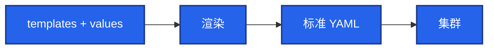
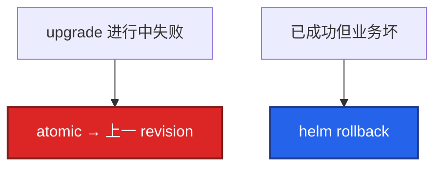

# 21｜Helm 与 Kustomize · 练习题

先对照 [知识点](知识点.md) **本章主线** 自己口述，再对答案。每题标了覆盖范围：

| 标记 | 含义 |
|------|------|
| **核心** | 不懂整章就没建立起来 |
| **必会** | 值班和面试都要能讲 |
| **常用** | 线上会反复碰到 |
| **常考** | 白板和追问的高频口径 |

## 本题目录

- [Q1 Helm 是什么](#q1)
- [Q2 多环境与 Secret](#q2)
- [Q3 atomic vs rollback](#q3)
- [Q4 Helm vs Kustomize](#q4)
- [Q5 upgrade --install](#q5)
- [Q6 hook / 合服](#q6)
- [Q7 所有权怎么分工](#q7)
- [Q8 uninstall 丢盘](#q8)
- [Q9 generator 与 6902](#q9)
- [合上书](#合上书)

---

## Q1

**★★★★★｜Helm 是什么？渲染出来的还是标准资源吗？**

**覆盖**：核心 · 必会 · 常考
**对应**：知识点 §3.1

### 场景

「你们 YAML 怎么管？」有人说 Helm 是一种新的工作负载类型。

### 完整解答

**一句话**：Helm 是包管理+模板引擎，渲染成标准 Deployment/Service，不发明新 kind。

Helm 是包管理器 + 模板引擎。Chart = 模板 + 默认 values，按环境参数渲染成 Deployment/Service 再 apply。不发明新 kind。和手写 YAML 比：参数化复用、release 历史、子 Chart 依赖。

Release = 一次安装实例，可多份、可 rollback。Kustomize 同样输出标准 YAML，只是没有这份集群内历史。

### 再追问

CRD 是不是 Helm 发明的？——不是。Chart 可以带 CRD 文件，kind 仍由 API / Operator 定义（20）。Helm 只负责提交那份 YAML。

---

## Q2

**★★★★★｜多环境怎么管？生产 Secret 能写进 values-prod.yaml 吗？**

**覆盖**：核心 · 必会 · 常考
**对应**：知识点 §7.1 · §7.2

### 场景

同一套网关 Chart，测试 3 副本、生产 10 副本。有人把数据库密码写进 `values-prod.yaml` 提交了。

### 完整解答

**一句话**：多环境一套 Chart 多份 values；生产 Secret 不进 Git，用 external-secrets/Vault 注入。

一套 Chart，values.yaml 默认，values-prod / staging 覆盖。`helm upgrade -f values-prod.yaml --set image.tag=1.2.0`。密码不进 Git：values 只引 Secret 名；内容用 external-secrets / sealed-secrets / CI 从 Vault 注入。

三个环境 values 各改各的会漂移：共享一份基础，环境文件只放差异。差异过大拆 Chart 或改成 overlay。

### 再追问

Pod 起不来，Events 写 secret 不存在？——不要把密码填回 values。先看 ExternalSecret status，同步 Operator 还没拉下来。

---

## Q3

**★★★★★｜`--atomic` 和手动 `helm rollback` 差在哪？**

**覆盖**：核心 · 必会 · 常用
**对应**：知识点 §3.2

### 场景

CI 升级超时，集群里一半新 Pod 没 Ready。另一天升级「成功了」但支付 5xx，要退回。Argo 也在管这个 Chart。

### 完整解答

**一句话**：`--atomic` 是升级过程失败自动回上一 revision；业务已成功但坏了要手动 rollback 或 Git revert。

`--atomic` 是 **这次部署过程中** 失败/超时，自动回到上一成功 revision，避免半残。手动 rollback 是 **已经标成功** 之后发现业务不对。CI 优先 atomic + timeout。两者都依赖 Helm 历史还在。

Argo 是 FieldManager 时，集群里可能没有 Helm Secret。回滚走 Git revert（22）。Helm 历史 ≠ Argo 历史。

### 再追问

`uninstall` 不 keep-history？——没得回。keep-history 只留记录，不留盘。

---

## Q4

**★★★★★｜Kustomize 和 Helm 怎么选？patch 有哪几种？**

**覆盖**：核心 · 必会 · 常考
**对应**：知识点 §3.4

### 场景

自有大厅 YAML 很简单，却被写成 Helm 模板；Kafka 又有人用 Kustomize 从零抄。

### 完整解答

**一句话**：Helm 参数化+社区 Chart；Kustomize 纯 YAML overlay；生产常混用但所有权唯一。

Helm：参数化、社区 Chart、要 release 序号。Kustomize：纯 YAML、环境 overlay、不想养模板、Git 里打开就可审。生产混用：社区用 Helm，自有用 overlay；或 Helm 出基础再 Kustomize post-render。

四种 patch：strategic merge、JSON 6902、images 换 tag、configMapGenerator（改内容改名触发滚动）。CD 最常用 images + merge 改副本/资源。

Kustomize 没有 helm history。回滚 = Git revert 再 apply，或交给 Argo。

### 再追问

为什么不全用一种？——全 Helm 把简单 YAML 模板化，难审。全 Kustomize 享受不到 Kafka 官方 Chart。取长补短，流程收敛，所有权不能三家同时写。

---

## Q5

**★★★★☆｜`upgrade --install` 为什么适合 CI？image.tag 仍是 latest 为什么不动？**

**覆盖**：必会 · 常用
**对应**：知识点 §6 · §7

### 场景

流水线先判断 release 在不在，不在就 install，在就 upgrade，脚本经常写错。另一次 tag 还是 latest，升级没拉镜像。

### 完整解答

**一句话**：`upgrade --install` CI 幂等；latest 不变 kubelet IfNotPresent 不拉新镜像。

一条 `helm upgrade --install` 覆盖两种状态，幂等。再加 `--atomic --timeout`。先 `helm template` + `lint` 再动手。不要生产 reinstall（先卸再装会丢 PVC 默认行为）。

digest 没变，kubelet IfNotPresent 不拉。钉不可变 tag / digest（16）。`randAlpha` 禁止，GitOps 会永远 OutOfSync。

### 再追问

滚动中途再 upgrade 一次？——不要。新 revision 已记下，等 Ready，不要叠。

---

## Q6

**★★★★☆｜Helm hook 跑 migration 失败了会怎样？合服能当 hook 吗？**

**覆盖**：必会 · 常用
**对应**：知识点 §7.3

### 场景

pre-upgrade Job 改表失败，主 Deployment 已经开始滚动，新旧代码同时打库。有人要把合服脚本也塞进 gateway 的 pre-hook。

### 完整解答

**一句话**：pre-upgrade hook 失败应 atomic 回滚；合服是长任务放 Job/流水线，不要塞 gateway hook。

hook 失败应按「这次 upgrade 失败」处理；配 `--atomic` 不要把半成品留线上。migration 必须向后兼容（expand/contract），因为滚动期间两份代码并存（15）。post-upgrade 冒烟失败同样应挡住「成功」。

合服是长任务、要人工确认，放 Job/流水线（20、22），不要塞进每次 gateway upgrade 的 pre-hook。

### 再追问

游戏存档能写 emptyDir 在 values 里吗？——不能。drain 和卸载都会丢（16）。走 PVC（11）。

---

## Q7

**★★★★☆｜整个公司 YAML 怎么分工才不打架？**

**覆盖**：必会 · 常用 · 常考
**对应**：知识点 §3.4 · §7

### 场景

有人全 Helm，有人全 Kustomize，CI 两套，Argo 再 apply 第三份。

### 完整解答

**一句话**：社区组件 Helm+values，自有应用 Kustomize overlay，CD 只让一方 apply。

社区组件：Helm chart + values。自有应用：Kustomize base/overlay。全部进 Git，CD 只让 Argo 或只让 Helm 其中一方 apply（22）。CI 只渲染校验。Secret 统一 external-secrets。混用可以，所有权不能三家同时写。

游戏落地：网关/大厅 overlay；Redis/Kafka/Ingress 官方 Chart。战斗服 PVC 不要放进默认删除路径。

### 再追问

Argo 的 Helm 模式加 Kustomize 可以吗？——可以当混用路径。仍然只有 Argo 一个 FieldManager。

---

## Q8

**★★★★☆｜uninstall 之后数据没了，Chart 哪错了？**

**覆盖**：必会 · 常用
**对应**：知识点 §8

### 场景

测服用 `helm uninstall` 清环境，STS 的 PVC 一起没了。有人说 Helm 有 bug。生产有人差点同样操作。

### 完整解答

**一句话**：helm uninstall 默认级联删 PVC；数据卷要 persist/keep 策略，卸载前看 manifest。

默认级联删除。数据卷要 `persist` / `keep` 策略，或 PVC 不放进这个 release 的删除路径。生产卸载前看 `helm get manifest` 里有哪些 PVC。`--keep-history` 只留历史记录，不留盘。

### 再追问

timeout 到了 release 自己回到上一版，要不要关 atomic 硬推？——不要。去看为什么没 Ready：探针、镜像、资源（17）。

---

## Q9

**★★★★☆｜configMapGenerator 改了配置为什么滚动？6902 和 merge 怎么选？**

**覆盖**：必会 · 常用
**对应**：知识点 §3.3

### 场景

改了 game.json，没改镜像 tag，却滚动了。有人以为被攻击。另一次要改第 0 个容器的 memory，merge 一份整 Deployment 总被别人的副本数覆盖。

### 完整解答

**一句话**：configMapGenerator 改内容加 hash 触发滚动；改明确路径用 JSON 6902 replace。

generator 给 ConfigMap 名字加 hash。引用名变了，Deployment 的 volume 变了，于是滚动。这是故意的。Helm 要用 checksum 注解达到类似效果。kustomization 里 secret files 仍可能进 Git，敏感内容还是 vault（12）。

改一两个明确路径用 6902 `replace`。改一整块结构、和原 YAML 长得像，用 merge。images 指令专门换镜像。`containers/0` 下标在加 sidecar 之后会指错。patch 要小，环境 overlay 保持薄。patch 的 name/kind 对不上会静默不生效，先 `kustomize build`。

### 再追问

生产钉死哪些版本？——Chart `version` 和 `appVersion` 都钉死，CI 推进私有 Harbor，不用 latest。

---

## 合上书

- [ ] 能画出 Chart/overlay → 标准 YAML，并说明不发明 kind
- [ ] 能管多环境 values，且 Secret 不进 Git
- [ ] 能区分 atomic 与手动 rollback，以及 Argo 下走 Git
- [ ] 能说出 Helm vs Kustomize 怎么选、怎么混、所有权唯一
- [ ] 能用 upgrade --install --atomic，并解释 latest 为什么不动
- [ ] 能处理 hook 失败、uninstall PVC、generator 滚动、6902 下标
