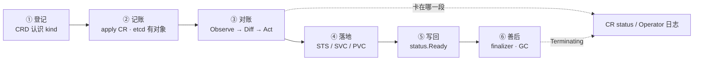
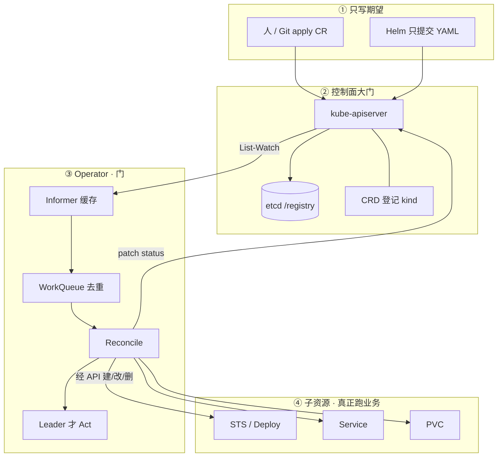
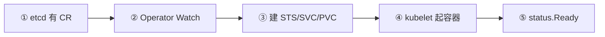
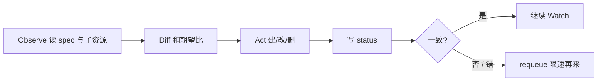
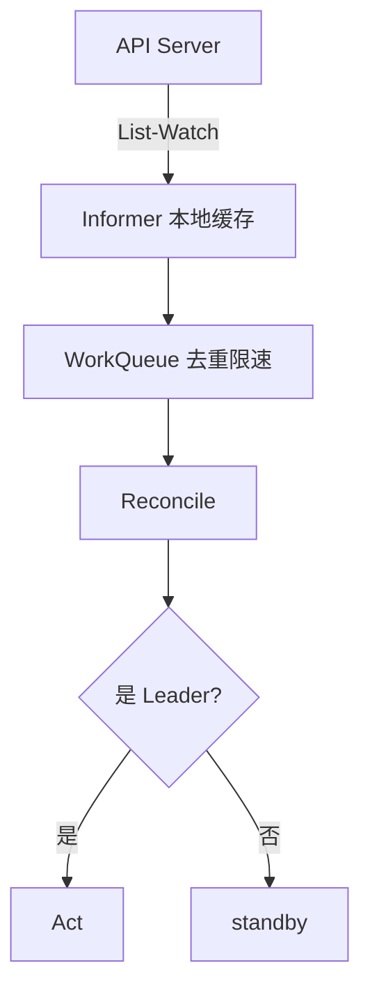
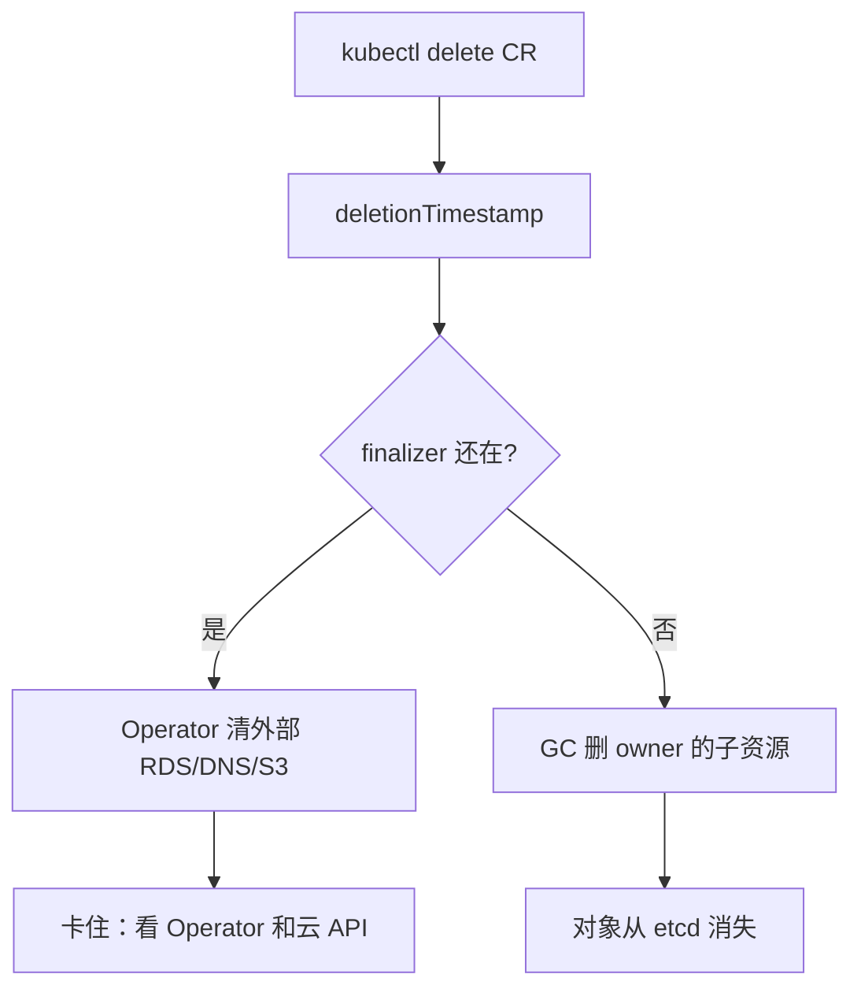
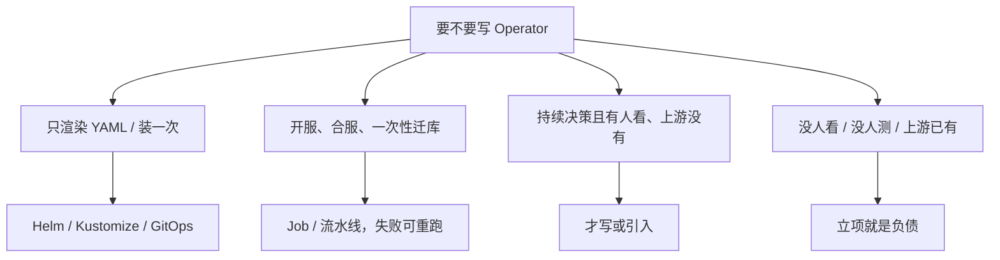
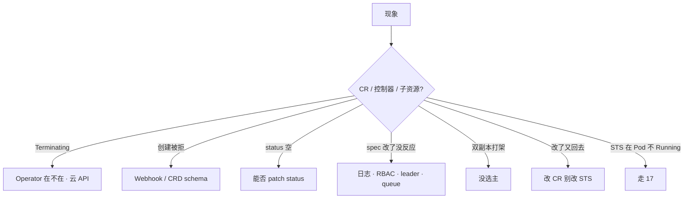

# Operator 与 CRD

> 集群里能 `kubectl get gameserver`，改 spec 毫无反应；有人要把开服脚本「云原生化」成 15s 调和一次的 Operator；另有人删了管云上 RDS 的 CR，十分钟还在 Terminating，准备手抠 finalizer。手都别动。
> **本章回答**：CRD 与 Operator 两件套；Observe → Diff → Act；Terminating / conversion / 升 CRD；Operator 挂了影响面。
> **不讲**：声明式控制循环的通用纪律 → [01](../01-集群架构/)；准入 Webhook 焊死写路径 → [03](../03-API-Server/)；Chart / release → [22](../22-Helm与Kustomize/)；Git 当期望、Argo 调和 → [23](../23-GitOps-ArgoCD与Tekton/)；工作负载选 Deploy/STS → [05](../05-工作负载控制器/)。不背 kubebuilder 脚手架，不讲 OpenAPI schema 全集。

**标记**：🎯重点 · 🔥难点 · ⭐常考 · 🔧实操
---

## 一、一张图：一条 CR 的一生

> 🎯 **一句话**：CRD 只让 API 认识一种 kind；真正干活的是 Operator 的持续对账。卡了先问「卡在登记、对账、子资源，还是善后」。



- 📖 **读图**
  - 🛤️ 主线「登记 → 记账 → 对账 → 落地 → 写回 → 善后」；`get` 通只证明到了 ①②
  - ⚔️ 第一刀：`get <kind> -o wide` 看 status，再看 Operator 日志 / lease——不是先 scale STS（Q1、Q6）

主线清楚了。先把两件套钉死——混了就会在「能 get」和「在干活」之间翻车。

本节对应练习题 Q1。

---

## 二、两件套：CRD 登记，Operator 执行 🎯⭐

> 🎯 **一句话**：CRD 登记类型；没有控制器，etcd 里那坨 JSON **谁也不会去执行**。

人不能一直 `kubectl`。扩分片、修主从、续证书，漏一次就是事故。Operator 把这份 runbook 变成和 Deployment 同一类东西：**持续 Reconcile**。

- 📦 **CRD（CustomResourceDefinition）** = 让 API Server 认识一种新 kind，对象进 etcd
  - 没有它：`kubectl get` 都不认识这个类型
  - 有它：只说明「执照办好了」，不说明店里有人在干活
- 🚪 **Operator / 控制器** = Watch spec，对比集群实际，Act，写 status
  - 没有它：YAML 躺在 etcd 里，改 spec 毫无反应
  - 有它：下一轮对账才会建 STS、写 Ready

```yaml
apiVersion: game.example.com/v1
kind: GameShard
metadata:
  name: battle-1001
spec:
  replicas: 2
  version: "1.2.1"
status:
  conditions:
    - type: Ready
      status: "True"
      message: "STS battle-1001 ready"
```

- 📒 **期望在 spec，结果在 status**
  - `kubectl get gameshard -o wide` 能扫 Ready/Failed，比翻 Operator 日志快
  - status 条件学内置 Deploy 的 Available/Progressing，不要发明一套只有作者懂的字段
  - 状态不要只放 Operator 内存——重启就丢，别人也看不见

> 💡 **打个比方**：CRD 是工商登记「允许你开这类店」；Operator 是店长每天对账——货架（STS）和账本（spec）不一致就改回去。只有执照没有店长，店里永远空着。

#### ❓ 为什么能 `kubectl get gameserver` 不等于 Operator 在干活？

- ❌ **幻觉**：自定义 kind 能列出来 = 控制器正常
- ✅ **真相**：get 通只说明 **CRD 注册了**；改 spec 子资源不动，才是控制器挂了或根本没装
- 🔍 **现场怎么认**：先 `kubectl get crd | grep game`，再改一次 spec 看 STS 跟不跟——不跟就去看 Operator Deployment / 日志

> ⚠️ **别混**：业务、kubelet、Controller **禁止直连 etcd**（绕过 RBAC、准入、审计；写坏的对象会被当成期望执行 → [01](../01-集群架构/)、[03](../03-API-Server/)）。Informer 缓存仍从 API List-Watch，写入仍走 API，不算绕过。

> 📝 **面试**：CRD 登记 kind，Operator 持续 Reconcile；期望在 spec，结果写 status；没有控制器改 spec 没反应。⭐（Q1、Q2）

---

## 三、循环：Observe → Diff → Act 🔥⭐

> 🎯 **一句话**：和解是持续对账，不是 apply 一次就结束；手改子资源下一轮会被改回去——这是特性，不是 bug。



- 📖 **读图**
  - 🚫 **没有箭头从 Operator 指向 etcd**——只连 API；apply CR 只是记账，真正建 STS 是下一轮 Reconcile
  - 🧱 Operator **不起容器**——Scheduler 写 nodeName，kubelet 调 CRI，和内置 Deployment 控制器同一条分界（[01](../01-集群架构/)）
  - 🧭 排障从 CR status 列进：卡在 ①② 看 CRD/Operator；卡在 ④ 走节点/调度排障（[17](../17-节点运行时与升级/)），不是改 Operator

一次 apply 到 Ready，眼睛看到的站：



- 📖 **读图**：① 只有 CR、无 STS → Operator 在不在；②③ Act 失败 → RBAC / queue / leader；④ STS 在、Pod 不 Running → 走 17；⑤ 子资源好了 READY 空白 → 能不能 patch status



- 📖 **读图**：Level-triggered——丢一次 Watch 不可怕，下一轮还会对；Act 必须**幂等**；requeue 要限速，否则 bug 按调和频率放大

#### ❓ 为什么手改 STS 会被改回去？

- ❌ **幻觉**：「我 scale STS 是调参，过一会儿变回 2 是 bug」
- ✅ **真相**：期望在 **CR 的 spec**；下一轮 Diff 发现不一致就会 Act 回去——**这是特性**
- 🛠️ 要扩容：改 CR（`kubectl patch gameshard ... -p '{"spec":{"replicas":3}}'`），不是 `kubectl scale sts`

> 💡 **打个比方**：像银行自动对账——你手工改了一笔账，系统每十几秒又把账本拉回到 CR 写的数。

> 🔍 **现场**：改 spec 后 STS 没动

```bash
kubectl patch gameshard battle-1001 --type merge -p '{"spec":{"replicas":3}}'
kubectl get sts -l app=battle-1001          # 仍是 2 → 别先 scale STS
kubectl -n op-system logs deploy/game-operator --tail=50
# forbidden: cannot patch statefulsets     ← RBAC 缺权限，不是 kubelet 坏了
```

```text
NAME          READY   VERSION   AGE
battle-1001   True    1.2.1     2d
# READY=False/空 → 看 status.conditions 或 Operator 日志
```

- ⚠️ **别把「开服脚本」硬写成 15s 调和**：半成功状态上反复 Act，合服要人工确认的步骤会被自己循环 → 这类任务用 Job / 流水线（选型见七节）
- 🐛 **bug 以调和频率放大**：某次写副本 0，15s 一次能把所有区服缩没

> 📝 **面试**：和解是 Observe-Diff-Act 持续循环，level-triggered 必须幂等；手改 STS 会被改回去，要改 CR spec。⭐（Q3）

本节对应练习题 Q1、Q3。

---

## 四、选主与队列：Informer · WorkQueue · Leader 🔥⭐

> 🎯 **一句话**：多副本 Operator 必须选主，否则两个 Reconcile 同时 Act，子资源抖。



- 📖 **读图**
  - Informer **不是直连 etcd**，仍从 API List-Watch
  - WorkQueue 把同 key 多次变更收成一次，再限速 requeue
  - 只有 Leader Act；standby 只 Watch——和 kube-controller-manager 同类（[01](../01-集群架构/)）

#### ❓ 为什么多副本不能「双活同时 Reconcile」更稳？

- ❌ **幻觉**：两个 Pod 都写 = 更高可用
- ✅ **真相**：两个店长同时改货架——副本数来回跳；**HA 靠选主切换，不是双活写**
- 🔍 **现场**

```bash
kubectl -n op-system get deploy game-operator   # replicas: 2
kubectl -n op-system get lease
```

```text
NAME              HOLDER          AGE
game-operator     pod-abc-xyz     3d
# 两个 Pod 日志都在 Act → 没开 leader election
# 开选主后只有一个 HOLDER；STS 副本稳定
```

- 🧯 **单副本挂了**：调和停，**已有 STS 还在**——和 Controller Manager 挂了同类；不要人肉改它管的子资源，也不要重启还活着的战斗服

> 📝 **面试**：Informer 缓存走 API List-Watch；多副本必须 leader election，不能双活同时 Reconcile。⭐

本节对应练习题 Q3、Q10。

---

## 五、版本：storage · served · conversion 🔥⭐

> 🎯 **一句话**：storage 版本只能一个；改结构必须 Webhook 或一次性迁完，不能顺手删旧字段。

> 💡 **打个比方**：图书馆只存一种装订版（storage），读者可以借旧版封面（served），借还时柜台做翻译（conversion）。

| 字段 | 含义 |
|------|------|
| `served: true` | 这个版本的 API 路径能用 |
| `storage: true` | **只能一个**；etcd 里存的形态 |
| `deprecated: true` | 客户端该迁走 |
| conversion `None` | 多版本只许改注解/label 这类兼容字段 |
| conversion `Webhook` | v1alpha1 ↔ v1 字段对不上时必须 |

#### ❓ 为什么升 CRD 不能「顺手删旧字段」？

- ❌ **幻觉**：旧字段没人用了，删掉清爽；多个 storage 一起写更灵活
- ✅ **真相**：新 schema 加必填 / 删旧字段 → **已有对象变非法** → 调和全停；storage **只能一个**
- 🛤️ **正确路径**：先上 conversion webhook（或双写）→ 新版本 served、storage 仍先留旧 → CRD 与 Operator 镜像**同窗口**升级 → 对象都按新 storage 写回后再切 storage → 最后 `served: false` 旧版本
- 🧯 `storedVersions` 里还有旧版本时，不要立刻从 CRD 删那个版本；conversion webhook 挂了 → 旧版本读写会失败

> 🔍 **现场**：升 CRD 后创建被拒

```text
Error from server: error when creating "gameshard.yaml":
gameshards.game.example.com "battle-1001" is invalid:
spec.shardId: Required value
# ← 新 schema 加了必填，存量也变非法
```

```bash
kubectl get crd gameshards.game.example.com -o jsonpath='{.spec.versions[*].name}{"\n"}'
kubectl get crd gameshards.game.example.com -o yaml   # served / storage / conversion
```

- 🔄 **回滚**：conversion 还在时可以再 served 旧版本；已经删字段、已有对象非法，回滚 CRD YAML 也不一定救得回来——升级前要有 CR 清单备份
- 🧱 卡住创建 CR：先看校验 Webhook 和 CRD schema（[03](../03-API-Server/)），不要先改业务镜像

> 📝 **面试**：served 能读几个版本，storage 只有一个写 etcd；改结构要上 conversion webhook；升 CRD 删字段会把存量 CR 打成非法。⭐（Q4、Q12）

本节对应练习题 Q4、Q12。

---

## 六、善后：finalizer 与 owner 🔥⭐

> 🎯 **一句话**：Terminating 先看 Operator 清外部资源；第一刀不要抠 finalizer。



- 📖 **读图**
  - finalizer 还在 → 对象不会从 etcd 消失；卡在「清外部」这一步
  - finalizer 摘掉后 → ownerReferences 触发集群内 GC（STS / PVC / Service）

| 机制 | 管什么 | 缺了 / 乱抠会怎样 |
|------|--------|-------------------|
| **finalizer** | 集群外（云 DNS、S3、RDS） | 手抠 → **云上孤儿继续计费** |
| **ownerReferences** | 集群内 STS / PVC / Service | 缺 → CR 没了 STS 还在；配错 → GC 删错 |

#### ❓ 为什么 Terminating 第一刀不该抠 finalizer？

- ❌ **幻觉**：对象删不掉 = 抠掉 finalizer 就干净了
- ✅ **真相**：finalizer 是「退房还钥匙」；硬把登记删了，云上的 RDS 还在计费
- 🛠️ **正确顺序**：先拉起 Operator → 看日志是云 API 403 还是正在删实例 → 外部确认已清、业务允许 → Operator 自己摘 finalizer

> 💡 **打个比方**：退房要还钥匙——你硬把登记删了，门锁还锁着，房东账单还在跳。

> 🔍 **现场**：删 CR 十分钟还在 Terminating

```bash
kubectl get gameshard rds-cluster-01 -o yaml | grep -A5 finalizers
kubectl -n op-system get po -l app=game-operator   # CrashLoop → 先拉起
```

```text
finalizers:
  - rds.example.com/cleanup
# ← 别第一刀 kubectl edit 抠掉；先让 Operator 清完外部
```

- 🔐 **RBAC**：禁止 `*`；最小是本 CR 的 get/list/watch/update/patch/status，外加它创建的那几类子资源；能建 STS 不能写 Ready 列 → 常是 status 的 patch 没拆开
- 🏠 Namespace 一直 Terminating：往往 NS 里还有带 finalizer 的 CR——先列出来

> 📝 **面试**：Terminating 看 finalizer 和 Operator；finalizer 管集群外，owner 管集群内 GC；手抠 finalizer 会留云孤儿。⭐（Q5）

本节对应练习题 Q5、Q10。

---

## 七、选型：何时写、何时不要写 ⭐

> 🎯 **一句话**：安装形态用 Helm/GitOps；**运行中持续决策**才配 Operator。不是银弹。



- 📖 **读图**：四个出口——装一次走 Helm；批任务走 Job；持续决策且有人 oncall 才写；没人看就别立

| 项 | 选 | 不选 |
|----|----|------|
| 要不要写 | 持续决策 + 有人 oncall + 上游没有 | 装一次 YAML、开合服批任务 |
| 形态 | 上游成熟 Operator，或自研有人测 CRD 升级 | 没人看的「云原生化脚本」 |
| 副本 | ≥2 + **leader election** + PDB | 双活同时写；单副本无 PDB |
| 权限 | 本 CR + 几类子资源 | cluster-admin / `*` |
| 安装 | Helm/GitOps 装 Operator；运行中决策才是它的活 | 和 Argo 同时手改子资源（[22](../22-Helm与Kustomize/)、[23](../23-GitOps-ArgoCD与Tekton/)） |

- 🎮 **游戏集群**：日批开服 / 合服用 Job + 工作流，不要 15s 调和；区服扩分片、证书续期、有状态中间件 failover，才配 Operator。硬把 Ansible 翻译成 Go，收益为负
- 🧪 **引入上游前三问**：它会创建哪些 STS/PVC/Job？失败日志在哪？CRD 升级谁测？答不出就不要把生产数据库交给它
- 🔧 **只动有证据的项**：leader election；外部 API 用 `RequeueAfter` 别死循环 15s；校验 Webhook 可 Fail，升级窗口 conversion 必须活；GitOps 下别和 Argo 抢 FieldManager

> ⚠️ **别混**：Helm 装的 Redis 起不来 → 看 release 和渲染 YAML（[22](../22-Helm与Kustomize/)）；Operator 管的 Redis 起不来 → 先看 CR status 和 Operator 日志。安装 vs 运行中决策，所有权只能有一个。

> 📝 **面试**：装一次用 Helm/GitOps；持续决策且有人看才写 Operator；开服合服用 Job，bug 会按调和频率放大。（Q2、Q8、Q11）

本节对应练习题 Q2、Q8、Q11、Q13。

---

## 八、作战：定责 🔧

> 🎯 **一句话**：先分「CR / 控制器 / 子资源」三叉，再动手；Operator 挂了 = 停止调和，不是业务立刻蒸发。



- 📖 **读图**：左边三条是 CR 侧；中间两条是控制器；右边两条是子资源/归属——第一刀别混叉

| 现象 | 先做什么 | 不要做什么 |
|------|----------|------------|
| 只有 CR 没有 STS | Operator 在不在 | 当 kubelet 坏了 |
| spec 改了没反应 | 日志、RBAC、leader | 先 scale STS |
| Terminating | 控制器和外部资源 | 第一刀抠 finalizer |
| 创建被拒 | Webhook / schema | 换业务镜像 |
| 子资源乱、改了又回去 | 改 CR | 关 Operator 硬推 |
| status 一直空 | patch status RBAC | 只翻业务日志 |
| 双副本打架 | 开选主 | 再加副本「更 HA」 |
| Operator 挂了 | 拉起控制器 | 重启游戏进程 |
| CRD 升级后全停 | conversion / 非法字段 | 再删一轮字段 |

### 60 秒剧本 🔧

> 🔍 **现场**：接到「改 spec 没反应 / Terminating / 创建被拒」

```text
① 0–10s   kubectl get crd | grep <group>；get <kind> -A -o wide 看 Ready / message
② 10–30s  Operator Deployment Running？logs --tail=100；get lease 谁是 HOLDER
③ 30–45s  get sts,svc,pvc -l ...；有 STS 无 Ready → 走 17；无 STS → 盯 RBAC/forbidden
④ 45–60s  Terminating → finalizers + 云 API；创建被拒 → validatingwebhook + CRD schema
```

- ✅ Operator 挂了：**已有子资源还在，只是不再调和**——和 01 里 Controller Manager 挂了同类
- ❌ 不要人肉改它管的 STS（下一轮会改回去）；不要重启还活着的战斗服
- 🛡️ 给 Operator 自己配 PDB 和反亲和；Webhook 是写路径依赖（[03](../03-API-Server/)）

本节对应练习题 Q5、Q6、Q9、Q12、Q14。

开篇那三个人——「改 spec 没反应就重装」「开服脚本全写成 Operator」「手抠 finalizer」——现在该能拦住了：先确认控制器在不在、先问该不该写、Terminating 先看 finalizer 别硬抠。

---

## 九、收口

### 命令速查 🔧

```bash
kubectl get crd | grep game
kubectl get gameshard -A -o wide                              # 先看 status 列
kubectl -n op-system logs deploy/game-operator --tail=100     # forbidden / panic / queue
kubectl -n op-system get lease                                # 谁是 leader
kubectl get sts,svc,pvc -l app=battle-1001
kubectl get gameshard battle-1001 -o yaml | grep -A20 finalizers
kubectl get validatingwebhookconfiguration
kubectl get crd gameshards.game.example.com -o yaml           # served / storage / conversion
```

### 面试锚点

| 问 | 30 秒答 |
|----|---------|
| CRD 和 Operator 什么关系？ | CRD 登记 kind；Operator 持续 Reconcile。没有控制器，etcd 里 JSON 没人执行。 |
| 和解循环怎么转？ | Observe → Diff → Act → 写 status；level-triggered、Act 必须幂等；手改 STS 会被改回去，改 CR spec。 |
| 能 get 自定义 kind 就说明 Operator 在干活？ | 不一定。get 通只说明 CRD 注册了；改 spec 无反应才查控制器。 |
| 多副本怎么 HA？ | leader election；双活同时 Act 会抖。单副本挂了：子资源还在，停止调和。 |
| Operator 挂了业务立刻没了？ | 不会。已有 STS/Pod 还在；只是不再对账、不再滚动。 |
| 升 CRD 注意什么？ | storage 只能一个；改结构上 conversion webhook；别删正在用的字段；CRD 与 Operator 同窗口。 |
| Terminating 怎么办？ | 先看 Operator 和云 API；finalizer 管集群外，owner 管集群内 GC；别第一刀抠 finalizer。 |
| 什么时候写 Operator？ | 持续决策 + 有人 oncall + 上游没有。装一次用 Helm；开服合服用 Job。 |
| Informer 等于直连 etcd？ | 否。仍走 API List-Watch；写入也走 API。 |
| Helm 装的和 Operator 管的怎么排障？ | 前者看 release/渲染 YAML；后者看 CR status 和 Operator 日志。 |

### 易错一句话对照

- 有 CRD 就能自愈 → 没有控制器只是 etcd 里的 JSON
- 能 `get` 自定义 kind = Operator 在干活 → 只说明 CRD 注册了
- Operator 挂了游戏服立刻没了 → 子资源还在；停止调和
- Operator 直接起容器 → 只改 API 对象；kubelet 起容器
- 多副本双活同时 Reconcile 更稳 → 必须选主
- 开服脚本都该写成 Operator → 批任务用 Job；bug 按 15s 放大
- 装一次 Redis 也该写 Operator → Helm/GitOps
- 手改 STS 是调参 → 下一轮改回去；改 CR
- Terminating 先抠 finalizer → 先看控制器和外部；抠了留云孤儿
- Informer 缓存等于直连 etcd → 仍走 API List-Watch
- 升 CRD 可以顺手删旧字段 → 已有对象变非法，调和全停
- 多个 storage 版本同时写 etcd → storage 只能一个
- conversion 可有可无 → 改结构必须 Webhook 或一次性迁完
- RBAC 先 `*` 跑起来再说 → 爆炸半径全集群
- status 放内存就行 → 重启丢失，kubectl 看不见
- Helm 装的和 Operator 管的排障一样 → 前者看 release，后者看 CR status

### 数字墙

> 选主 **必须** · 调和常见 **秒～十几秒** 级 · CRD 版本常见 `v1alpha1 → v1` · storage **1 个** · Operator 副本生产 **≥2 + leader election + PDB** · 审计/Webhook 失败策略见 [03](../03-API-Server/) · finalizer 管**集群外**、owner 管**集群内**

---

## 合上书

对着第一节主图口述一遍，卡住就回对应小节。开头那个现场——改 spec 没反应、开服脚本全写 Operator、手抠 finalizer——三个人各自错在哪，现在该能说清了。

- [ ] **默画主图**：登记 → 记账 → 对账 → 落地 → 写回 → 善后；第一刀照 CR status / Operator 日志。（→ Q1）
- [ ] **口述两件套**：CRD vs Operator；能 get 为什么不等于在干活；spec / status 各放什么。（→ Q1 · Q2）
- [ ] **口述循环**：Observe → Diff → Act；为什么手改 STS 会被改回去；level-triggered 与幂等。（→ Q3）
- [ ] **口述选主**：Informer / WorkQueue / Leader；双活为什么抖；Operator 挂了影响面。（→ Q3 · Q10）
- [ ] **口述升 CRD**：served vs storage；为什么不能顺手删字段；conversion 何时必须。（→ Q4 · Q12）
- [ ] **口述善后**：Terminating 顺序；finalizer vs owner；为什么不能第一刀抠。（→ Q5）
- [ ] **口述选型**：何时写 / 何时 Job / 何时 Helm；和 GitOps 的所有权分界。（→ Q2 · Q8 · Q11）
- [ ] **定责**：60 秒剧本四步；现象表里「先做 / 别做」各说清一条。（→ Q6 · Q9 · Q14）

八条都能口述，这一章就过了。终极测试：拦住开篇那位要手抠 finalizer 的人。下一章讲 Helm / Kustomize——最后都变成普通 YAML。
