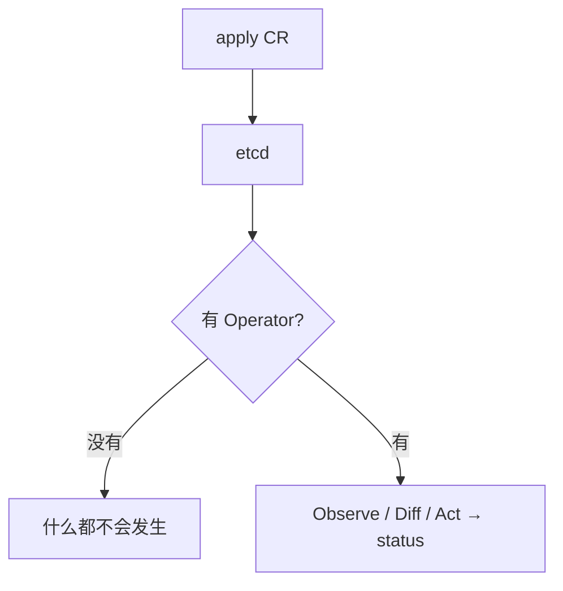
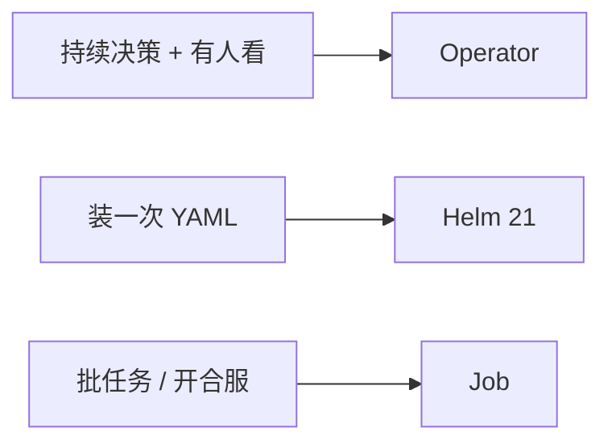
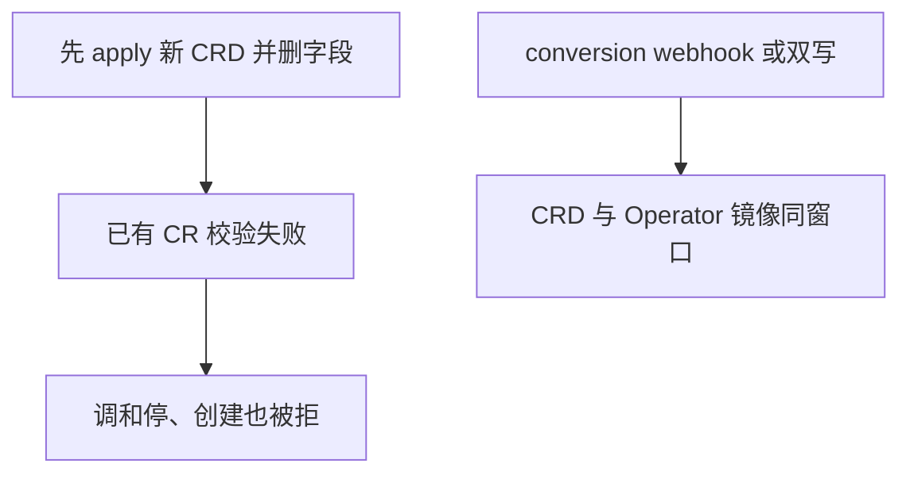
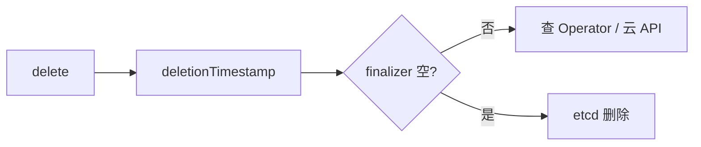
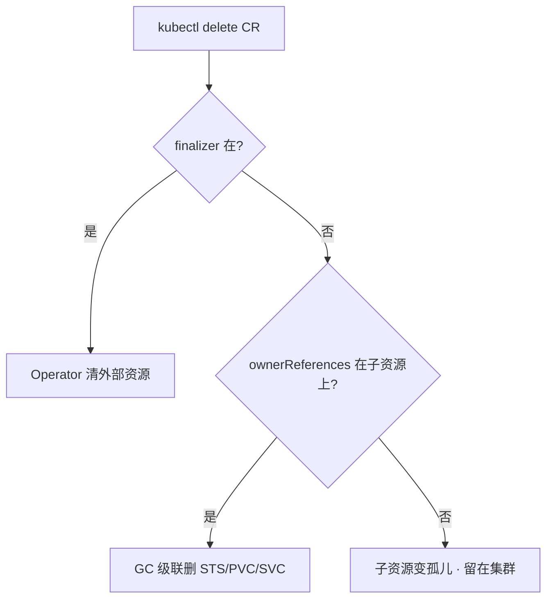

# 21｜Operator 与 CRD · 练习题

先对照 [知识点](知识点.md) **本章主线** 自己口述，再对答案。每题标了覆盖范围：

| 标记 | 含义 |
|------|------|
| **核心** | 不懂整章就没建立起来 |
| **必会** | 值班和面试都要能讲 |
| **常用** | 线上会反复碰到 |
| **常考** | 白板和追问的高频口径 |

## 本题目录

- [Q1 CRD 和 Operator](#q1)
- [Q2 何时写、不是银弹](#q2)
- [Q3 和解循环](#q3)
- [Q4 CRD 版本与 conversion](#q4)
- [Q5 Terminating / finalizer](#q5)
- [Q6 spec 没反应 / status 空](#q6)
- [Q7 选主、直连 etcd、RBAC](#q7)
- [Q8 Helm 装的 vs Operator 管的](#q8)
- [Q9 影响面：Operator 挂了](#q9)
- [Q10 ownerReferences 与 GC](#q10)
- [Q11 生产部署 checklist](#q11)
- [Q12 webhook 与 CRD 升级](#q12)
- [Q13 多 Operator 冲突](#q13)
- [Q14 60 秒 Operator 定责](#q14)
- [合上书](#合上书)

---

## Q1

**★★★★★｜CRD 和 Operator 是什么关系？只有 CRD 会怎样？**

**覆盖**：核心 · 必会 · 常考
**对应**：知识点 [1. 基本概念](知识点.md) · [2. 架构图](知识点.md)


### 场景

集群里能 `kubectl get gameserver`，但改 spec 毫无反应。CRD 是装过的，没有对应 Deployment。

### 完整解答

**一句话**：CRD 让 API 认识新 kind；Operator watch 并调和，只有 CRD 改了 spec 毫无反应。

CRD 让 API 认识新 kind，对象进 etcd。Operator 是 watch 这种资源并调和的控制器。只有 CRD，对象就是数据，没有人去建 STS。



和 Deployment 一样：你改 spec，控制器对齐。差别是对齐逻辑是领域写的。不直连 etcd，走 API（01、03）。

### 再追问

Scheduler 和 Operator 谁起容器？——都不直接起。Operator 只改 API 对象；kubelet 起容器。和内置控制器同一条分界。

---

## Q2

**★★★★★｜什么场景该写 Operator？为什么不是银弹？**

**覆盖**：核心 · 必会 · 常考
**对应**：知识点 [7. 生产排障](知识点.md)


### 场景

要把开服脚本「云原生化」，有人提议写 GameServer Operator，15s reconcile 一次。另一边 Redis 只是部署一份，也有人想写 Operator。

### 完整解答

**一句话**：持续运维知识+有人 oncall 才写 Operator；只部署用 Helm，批任务用 Job，不是银弹。

该写：持续运维知识——成员变更、备份、failover、证书续期、扩分片；并且有人 oncall、CRD 升级有人测、上游没有能用的。

不该：只部署无状态三件套 → Helm/GitOps；开服合服一次性任务 → Job/流水线，失败可重跑，不必 15s 调和。



不是银弹：runbook 变成代码后，bug 以 reconcile 频率放大。某次把副本写成 0，15s 一次把所有区服缩没。三个「没有」（没人看、没人测、上游已有）就不要立项。

### 再追问

没人 oncall 这个 Operator 会怎样？——Reconcile 报错没人看，CR Terminating 没人摘，比偶尔跑 Ansible 更危险。

---

## Q3

**★★★★★｜和解循环怎么转？手改 STS 为什么会被改回去？**

**覆盖**：核心 · 必会 · 常用
**对应**：知识点 [3.1 和解循环：Observe → Diff → Act](知识点.md)


### 场景

STS 起来了，你手改副本从 2 改到 5，过一会儿又变回 2。有人当 bug 去关 Operator。

### 完整解答

**一句话**：Level-triggered 和解：Observe→Diff→Act→写 status；手改 STS 下一轮会被改回 spec。

Level-triggered：Observe spec 与子资源 → Diff → Act → 写 status。丢一次事件不可怕，下一轮还会拉回 spec。所以 Act 必须幂等。外部失败 `requeue`，WorkQueue 限速。

手改 STS 是改「实际」；期望在 CR spec。下一轮 Act 改回去——这是特性。要扩容改 CR。

status 是 API 字段，不要只放内存。Ready 列空白先看能不能 patch status。

### 再追问

合服步骤也放进 Reconcile？——不要。半成功状态上反复 Act。失败应停在那一步，用 Job。

---

## Q4

**★★★★★｜升 CRD 删字段为什么危险？conversion 什么时候必须有？**

**覆盖**：核心 · 必会 · 常考
**对应**：知识点 [3.3 CRD 版本与 conversion](知识点.md) · [7. 生产排障](知识点.md)


### 场景

要把 CRD 从 v1alpha1 升到 v1，顺手删了两个旧字段。已有 CR 变成非法对象，调和全停。有人说「再 apply 一次新 CRD」。

### 完整解答

**一句话**：升 CRD 删字段会让已有 CR 非法；多版本必须 conversion webhook 或双写后一次性迁完。

storage 版本 **只能一个**，真正写入 etcd。served 可以多个。改结构必须 conversion webhook，或双写后一次性迁完。strategy `None` 只允许兼容字段。



新字段旧 Operator 看不见 = 期望写了没人执行。`storedVersions` 还有旧版时不要从 CRD 里删那个版本。Webhook 挂了且 Fail，写路径一起死（03）。

### 再追问

没有 webhook 能不能两个 served 版本？——字段必须能直接存进同一个 storage。对不上就必须 Webhook 或迁完再关旧版本。

---

## Q5

**★★★★☆｜CR 一直 Terminating，能不能手抠 finalizer？**

**覆盖**：必会 · 常用 · 常考
**对应**：知识点 [3.4 Finalizer、owner、RBAC](知识点.md) · [7. 生产排障](知识点.md)


### 场景

删了一个 RDS 的 CR 十分钟还在。有人准备 patch 掉 finalizers。云上实例还在。

### 完整解答

**一句话**：Terminating 先看 Operator 清外部资源；手抠 finalizer 会留云孤儿。

先看 Operator 是否在清外部、云 API 是否失败、控制器是否挂了。手抠 = 告诉 API 外部已清完，RDS 会留孤儿。确认外部已无、业务允许，再补救，留变更记录。不要当第一刀（01）。



集群内孤儿 STS 是缺 ownerReferences，不是 finalizer 能解决的。owner 管集群内，finalizer 管集群外。

### 再追问

Namespace 一直 Terminating？——往往 NS 里还有带 finalizer 的 CR。先列这个 NS 里卡死的资源，不要先删 NS。

---

## Q6

**★★★★☆｜spec 改了没反应，status 一直空，按什么顺序查？**

**覆盖**：必会 · 常用
**对应**：知识点 [8. 必会 · 常考](知识点.md)


### 场景

把副本期望从 3 改到 5，STS 还是 3。`kubectl get xxx` 的 STATUS 列空白。

### 完整解答

**一句话**：spec 没反应：status→Operator logs/lease→子资源→RBAC patch status。

1. get crd / get kind 看 status 和 message
2. Operator Deployment 是否 Running、lease 是否选到 leader
3. Operator 日志：RBAC forbidden、queue、panic
4. 能不能 patch status（单独的 RBAC）
5. 有没有人肉改过 STS（下一轮可能改回，或冲突）

创建 CR 直接被拒：校验 Webhook 或 CRD schema。Webhook 挂了且 Fail，写路径一起死（03）。

### 再追问

apply 之后立刻 get gameshard 有了、get sts 还是空——正常吗？——正常。账本里先有 CR。一直没有 STS 才去看 Operator。

---

## Q7

**★★★★☆｜为什么不能直连 etcd？双副本不选主会怎样？RBAC 写成 `*`？**

**覆盖**：必会 · 常考
**对应**：知识点 [3.2 Informer、队列、选主](知识点.md) · [3.4 Finalizer、owner、RBAC](知识点.md)

### 场景

有人觉得 List-Watch 慢，想让 Operator 读 etcd。另一次为了 HA 把副本改成 2，没开 leader election。为了「先跑起来」绑了 cluster-admin。

### 完整解答

**一句话**：Operator 只连 API 不直连 etcd；双副本必须选主；RBAC 最小权限禁 `*`。

走 API：认证、鉴权、准入、审计、限流。直连会绕过这些，脏数据会被当成期望去执行（01）。Informer 缓存不算绕过——仍从 API List-Watch，写入仍走 API。

两个 Reconcile 同时 Act，子资源和 status 打架。必须选主。单副本没有 PDB：调和停、已有 STS 还在。给 Operator 配 PDB 和反亲和，但不要靠双活同时写当 HA。

最小权限：本 CR 的 get/list/watch/update/patch/status，以及它创建的那几类。能删全集群 PVC 的控制器，一次 bug 比业务故障更大。ownerReferences 配错：GC 可能删错，或删 CR 后 STS 成孤儿。

### 再追问

status 只放内存行不行？——不行。重启丢失，kubectl 也看不见。

---

## Q8

**★★★★☆｜Helm 装的中间件和 Operator 管的中间件，排障有何不同？**

**覆盖**：必会 · 常用
**对应**：知识点 [7. 生产排障](知识点.md) · [8. 必会 · 常考](知识点.md)


### 场景

一套 Redis 是 Helm chart，一套是 redis-operator。都是「起不来」。

### 完整解答

**一句话**：Helm 中间件看 release/manifest；Operator 中间件先看 CR status 和控制器日志。

Helm：看 release 状态、渲染出的 YAML、事件（21）。Operator：先看 CR status 和 Operator 日志，再看它建的 STS。不要只盯业务容器。GitOps 环境下谁是 FieldManager 也要分清（22），别和 Argo 同时手改。

引入上游 Operator 前三问：创建哪些对象？失败日志在哪？CRD 升级谁测？

### 再追问

Chart 可以带 CRD 文件，kind 是 Helm 发明的吗？——不是。kind 仍由 API / Operator 定义。Helm 只负责提交那份 YAML（21）。

---

## Q9

**★★★★☆｜Operator 挂了，游戏服还在吗？给出现象走哪条路？**

**覆盖**：必会 · 常用 · 常考
**对应**：知识点 [8. 必会 · 常考](知识点.md)


### 场景

活动中 Operator CrashLoop。有人要重启逻辑服。四个工单：① 只有 CR ② Terminating ③ 创建被拒 ④ 改了 STS 又回去。

### 完整解答

**一句话**：Operator 挂了已有 STS/Pod 通常还在，停的是自愈和变更；不要重启还活着的战斗服。

三问：进程？变更？流量？已有 STS/Pod 通常还在；停的是自愈和变更。不要重启还活着的战斗服。

| # | 走哪条 | 不要做 |
|---|--------|--------|
| ① | Operator 在不在、CRD 是否装过 | 当 kubelet 坏了 |
| ② | 控制器和外部资源 | 第一刀抠 finalizer |
| ③ | Webhook / schema | 换业务镜像 |
| ④ | 改 CR | 关 Operator 硬推 |

现场：`get crd` → `get kind -o wide` → Operator logs / lease → 子资源。

### 再追问

托管了这章能跳过吗？——不能。你引入的 CRD、finalizer、Webhook 仍是你的写路径和删除路径。

---

## Q10

**★★★★☆｜删了 CR 之后 STS 还在，为什么？ownerReferences 配错会怎样？**

**覆盖**：必会 · 常用 · 常考
**对应**：知识点 [3.4 Finalizer、owner、RBAC](知识点.md)

### 场景

删了一个 GameShard CR，etcd 里 CR 没了，但它建的 STS / PVC / Service 还在跑。另一次配错 ownerReferences 后删 CR，GC 把另一个 CR 管的 STS 删了。

### 完整解答

**一句话**：ownerReferences 管集群内 GC——删 CR 时子资源认不认、删不删全看它；配错会留孤儿或删错。

finalizer 管集群外（云 RDS / DNS / S3），ownerReferences 管集群内（STS / PVC / Service）。两者各管一边：



删 CR 后 STS 还在 = 子资源上缺 `ownerReferences`，GC 认不出来。修法：给 STS 加上指向 CR 的 owner reference，下一轮删除就会级联。

配错更危险——owner reference 指向了**另一个 CR**，删这个 CR 时 GC 把别人的 STS 删了。controller-runtime / operator-sdk 框架默认会自动写 owner reference，手写 controller 容易漏。

> ⚠️ **别混**：finalizer 是告诉 API「别删我，等我清完外部」；ownerReferences 是告诉 GC「我爹没了，我也该走」。一个拦删除，一个级联删除，完全不同机制。

### 再追问

**Namespace 一直 Terminating 和 owner 有关吗？**——有。NS 里还有带 finalizer 的 CR 没清完，NS 删除会卡住等子资源。先列这个 NS 里卡死的资源，不要先删 NS。

---

## Q11

**★★★★☆｜生产部署 Operator 要配什么？PDB 和反亲和为什么必须给 Operator 自己？**

**覆盖**：必会 · 常用
**对应**：知识点 [4. 安装部署](知识点.md) · [5. 核心配置](知识点.md)

### 场景

新 Operator 上线，副本 1、没有 PDB、和业务 Pod 混在同一批节点。节点 drain 时调和全停。有人要加到 3 副本「更 HA」但不开选主。

### 完整解答

**一句话**：Operator 部署 ≥2 副本 + leader election + PDB + 反亲和；单副本无 PDB 时 drain 一台调和就停。

生产部署五项：

| 项 | 生产怎么做 | 不做会怎样 |
|----|------------|------------|
| 副本 | ≥2 | 单副本挂了调和停 |
| leader election | 必须开 | 双副本同时 Act 子资源打架 |
| PDB | 给 Operator 自己 | drain 节点时调和全停 |
| 反亲和 | Operator Pod 不挤同一节点 | 一台挂两副本都没了 |
| RBAC | 本 CR + 几类子资源，拆 status patch | `cluster-admin` 一次 bug 全集群 |

```yaml
# PDB 给 Operator 自己
apiVersion: policy/v1
kind: PodDisruptionBudget
metadata:
  name: game-operator-pdb
spec:
  minAvailable: 1
  selector:
    matchLabels:
      app: game-operator
```

加到 3 副本不开选主 = 三个 Reconcile 同时 Act，子资源和 status 来回跳，比单副本更危险。HA 的来源是选主 + PDB + 反亲和，不是堆副本数。

安装形态用 Helm / GitOps 装进去（22）；运行中持续决策才是 Operator 的活。安装和运行两件事不能混。

> ⚠️ **别混**：给 Operator 加副本 ≠ 提升写吞吐——写仍过 Leader 一个入口，多副本只多了读端点和容错，HA 靠选主 + PDB + 反亲和，不靠堆副本。

### 再追问

**Operator 也需要 readiness/liveness probe 吗？**——需要，但和业务 Pod 不同：liveness 探的是控制器进程活着，readiness 决定 Service 是否引流。Operator 通常不接业务流量，readiness 可以只探 API 连通性。不要让 liveness 把正在做长 Reconcile 的 Pod 杀掉。

---

## Q12

**★★★★☆｜CRD conversion webhook 挂了，老版本对象会怎样？**

**覆盖**：必会 · 常考 ｜ **对应**：知识点 [4. CRD 版本与 conversion](知识点.md)

### 场景

升级 CRD 加了 v2，conversion webhook Pod CrashLoop。

### 完整解答

> 🎯 **一句话**：多版本存储时 conversion 失败 = API 读写该 GVK 失败；先修 webhook 或 temporarily 降版本。

```bash
kubectl get crd battles.example.com -o yaml | grep -A5 versions
kubectl logs -n operators deploy/battle-operator
```

### 再追问

storage version 和 served version 差在哪？——stored 是 etcd 里格式（03）。

---

## Q13

**★★★☆☆｜Helm 装的 Redis Operator 和自研 Operator 同时管同名 CR，怎么治？**

**覆盖**：常用 ｜ **对应**：知识点 [8. Helm 装的 vs Operator 管的](知识点.md)

### 场景

两个 controller 抢同一 CR，status 来回改。

### 完整解答

> 🎯 **一句话**：单一 owner：label/annotation 选主；或 uninstall 其一；RBAC 限制谁可写 status。

见 Q8 ownership。

### 再追问

Operator 挂了存量 CR 会死吗？——通常不会，除非要 reconcile 删资源（Q9）。

---

## Q14

**★★★★★｜CR 不 reconcile、Terminating 卡住、status 空，60 秒排查**

**覆盖**：核心 · 必会 ｜ **对应**：知识点 [6. spec 没反应 / status 空](知识点.md)

### 场景

新建 BattleServer CR spec 改了没 Pod；删不掉；status 一直空。

### 完整解答

> 🎯 **一句话**：不 reconcile→operator 日志/RBAC/选主；Terminating→finalizer；status 空→controller 没写。

```bash
kubectl describe battleserver xxx
kubectl logs -n operators deploy/battle-operator --tail=50
```

### 再追问

Operator 需要直连 etcd 吗？——**不要**，走 API（Q7）。

---

## 合上书

- [ ] 能画出「CRD 登记、Operator 和解、只连 API」
- [ ] 能说出何时写 Operator、何时 Helm/Job，以及 15s 放大 bug
- [ ] 能把和解讲到幂等、requeue、手改 STS 会被改回
- [ ] 能讲 served / storage / conversion，升 CRD 不删在用字段
- [ ] 能区分 finalizer vs owner，Terminating 不手抠当第一刀
- [ ] 能按 status → 控制器日志 → 子资源排障；挂了不等于杀游戏
- [ ] 能区分 finalizer vs ownerReferences，删 CR 后 STS 留下是什么缺了
- [ ] 能说出 Operator 部署 checklist：副本、选主、PDB、反亲和、RBAC 最小权限
