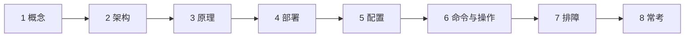
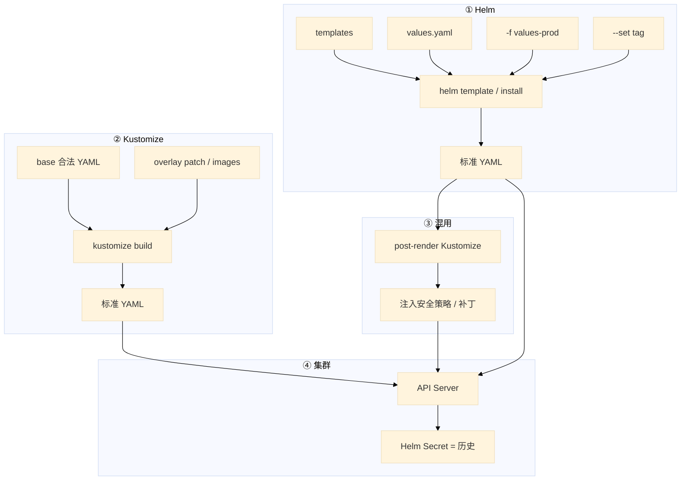
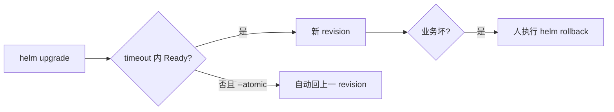
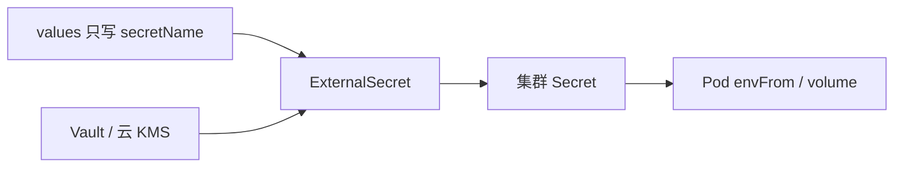
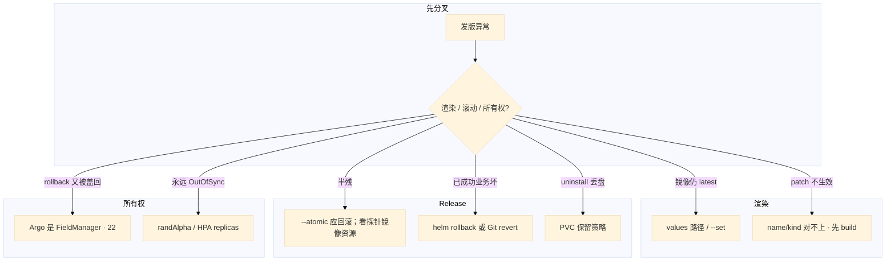

# Helm 与 Kustomize

> 大家好。上一章讲完 Operator；这一章讲**打包与多环境**——Helm / Kustomize 最后都变成普通 YAML，集群只认标准 kind。
> 开讲之前，先带大家回到几个现场：同一套游戏网关，测试 3 副本、生产 10 副本，镜像 tag 还不一样；有人说 Helm 是一种新的工作负载类型；另有人把数据库密码写进 `values-prod.yaml` 提交了；CI 升级超时，一半新 Pod 没 Ready；另一天「成功了」但支付 5xx。手都别动。
> 这一章讲完，你会知道这几个人各自错在哪——Helm 不发明新 kind、Secret 不进 values、`--atomic` 只管部署过程失败、业务坏了还得手动 rollback。
> **本章回答的问题**：Chart 怎么渲染；release 升级/回滚/原子性；Kustomize overlay；两者怎么选、怎么混；密钥放哪。
> **本章不讲**：持续调和、自研控制器 → [21](../21-Operator与CRD/)；Argo 同步、self-heal、Git 回滚 → [23](../23-GitOps-ArgoCD与Tekton/)；滚动/金丝雀本身 → [16](../16-灰度与回滚/)；Secret 不是保险箱 → [12](../12-配置与密钥/)。不考 Go template 语法全集。

**标记**：🎯重点 · 🔥难点 · ⭐常考 · 🔧实操

**怎么听这场分享**：先认主线三步——① 都变 YAML；② 历史（Helm Secret vs Git）；③ 密钥不进仓库。口诀先埋一句：⭐ **集群认的还是 Deployment / Service，不是 Chart**。下面按节展开。




**本章主线（打包就按这三步想）：**

1. **都变 YAML**：Helm 模板渲染；Kustomize base + overlay patch — 集群只认标准 kind。
2. **历史**：Helm release 在集群 Secret；Kustomize 回滚靠 Git，没有 release 快照。
3. **密钥**：不进 values / Git；`upgrade --atomic` 防半成功。

**读完你能：** 白板上画出 Chart → 标准 YAML；会 `upgrade --install --atomic` 和 overlay patch；能讲清 Helm vs Kustomize；发坏了知道回 Helm 快照还是 Git；密钥不进仓库。

## 本章目录

- [1. 基本概念](#1-基本概念)
- [2. 架构图](#2-架构图)
- [3. 原理](#3-原理)
- [4. 安装部署](#4-安装部署)
- [5. 核心配置](#5-核心配置)
- [6. 命令与操作](#6-命令与操作)
- [7. 生产排障](#7-生产排障)
- [8. 必会 · 常考](#8-必会--常考)
- [合上书](#合上书问自己)

---

## 1. 基本概念

🎯 Helm 和 Kustomize 都不发明新 kind，最终落地的仍是标准 Deployment / Service / STS。

Helm 和 Kustomize **都不发明新 kind**。最终落地的仍是标准 Deployment / Service / STS。集群认的是 API 对象，不是 Chart。

口诀：⭐ **Chart 是说明书，落盘才是真相**——面试问「Helm 是不是一种工作负载」，答「不是」。

**值班里什么时候碰到**：发版前 `helm template`；多环境副本/tag 不同；`helm upgrade` 超时一半 Pod 没 Ready；Argo 管了 Chart 后 `helm rollback` 不管用。

| | Helm | Kustomize |
|--|------|-----------|
| 是什么 | 包管理器 + 模板引擎 | YAML 叠加器 |
| 输入 | Chart（模板 + values） | 合法 YAML + patch |
| 输出 | 标准 K8s YAML | 标准 K8s YAML |
| 历史 | Release 存在集群（Secret/CM） | **没有**；回滚靠 Git |

Release = 某 Chart 的一次安装实例，同一 Chart 可装多份，靠 release 名区分。`helm rollback` 靠这份历史。Kustomize 没有这份历史。

Chart 可以带 CRD 文件，kind 仍由 API Server / Operator 定义（20）。Helm 只负责提交那份 YAML。

**打个比方**：Helm 像菜谱模板——同一道菜换调料（values）出不同口味；Kustomize 像已有成品菜上加料——base 是完整菜，overlay 只改盐量和配菜。

> **记住**：Helm 和 Kustomize 最后都变成普通 YAML；集群认的还是 Deployment / Service。

**面试怎么说**：「两者都不发明新 kind，最终都是标准 YAML；Helm 有 release 历史在集群 Secret，Kustomize 回滚靠 Git。」

---

本节对应练习题 Q1、Q4。

## 2. 架构图

好，概念有了。接下来看架构——后面的内容都对着这张图。

🎯 先把架构图钉住——Helm 模板渲染、Kustomize YAML 叠加、post-render 混用，最后都交给 API Server。

先把整张图钉住。后面命令、回滚、排障都对着这张图说话。



**读图三句话：**

1. **CI 先 lint / template / build，再交给 CD**——不要到生产才发现括号没闭合。
2. **所有权只能有一个**——Argo 管 Helm 时，集群里往往没有 Helm Secret，`helm rollback` 对不上（22）。
3. **混用可以：Helm 打出基础，Kustomize post-render 注入策略**——不能三家同时 apply。

---

本节对应练习题 Q1。

## 3. 原理

带着这张图，咱们进原理——难点放慢讲。

### 3.1 Chart 与渲染

🎯 Chart 是模板加 values，渲染出来仍是标准 Deployment；CI 必须先 template 看镜像和副本。

**一句话：** Chart 是模板 + values，渲染出来仍是标准 Deployment，不是新 kind。

**打个比方**：像填表格——Chart 是空白表，values 是你填的数字，印出来（template）才是交给学校的正式文件。

**现场走一遍**（发版前 CI 校验）：

1. CI 机器执行：

```bash
helm lint ./my-chart
helm template gw ./my-chart -f values-prod.yaml --set image.tag=1.2.1
```

2. 屏幕出现完整 YAML，检查关键行：

```yaml
spec:
  replicas: 10
  template:
    spec:
      containers:
      - image: registry/game-gateway:1.2.1
```

3. 若仍是 `image: ...:latest` → values 路径没覆盖到或 `--set` 写错
4. `helm lint` 报 `template: ...: function "randAlpha" not defined` → 模板里有随机函数，GitOps 会永远 drift（22）

**输出解读**（Chart.yaml 两个版本号）：

```yaml
version: 1.2.0      # 包版本 — Chart 本身变了才升
appVersion: "1.2.0"  # 应用版本 — 镜像变了要钉
```

| 字段 | 什么时候改 | 忘了会怎样 |
|------|------------|------------|
| `version` | Chart 模板结构变了 | 回滚时对不上包 |
| `appVersion` | 业务发版 | 审计对不上镜像 |
| `image.tag` | 每次发版 | latest → digest 不变不拉（16） |

`randAlpha` 每次渲染不同 → **禁止**。模板套太深就抽 `_helpers`。

⭐ **面试锚点**：helm template 输出的 YAML 和 kubectl apply 的 YAML 有什么区别？——没区别，helm template 只是渲染，apply 才提交。

🔍 **现场命令块：helm template 调试渲染结果**

```bash
# 渲染生产 values，检查镜像 tag 是否覆盖到位
helm template gw ./my-chart -f values-prod.yaml --set image.tag=1.2.1 | grep image:
  image: registry/game-gateway:1.2.1    # ← 覆盖成功
  # image: registry/game-gateway:latest  ← 说明 --set 或 values 路径没命中

# 渲染后直接管道给 kubectl（紧急手动，不要在 CI 用）
helm template gw ./my-chart -f values-prod.yaml | kubectl apply -f -

# 检查模板有没有随机函数（GitOps 禁用）
helm template gw ./my-chart | grep -c 'randAlpha\|randNumeric\|uuidv4'
  0    # ← 干净，可以进 GitOps
```

🔧 **易错对照**：
- `错讲法 → template 就是部署` → `对讲法 → template 只渲染 YAML 不提交集群，apply/install 才部署`
- `错讲法 → --set image.tag 覆盖不了就是 Helm bug` → `对讲法 → 先 grep 渲染输出确认路径，常见 values.yaml 里有同名 key 优先级更高`

**面试怎么说**：「Helm 是模板引擎，输出标准 YAML；CI 必须先 template 看镜像和副本；两个 version 都要钉死，禁止 randAlpha。」

### 3.2 Release：升级、回滚、原子性

🎯 `--atomic` 只覆盖这次部署过程中的失败；已 deployed 但业务坏了要手动 rollback 或 Git revert。

🔥 大家想想：`--atomic` 失败会回滚，那支付 5xx、「升级成功了」还要不要 rollback？——要。atomic 只管**部署过程**失败；**业务坏了**仍要手动 rollback。

**一句话：** `--atomic` 管这次部署失败自动回；业务坏了要人 `helm rollback` 或 Git revert。

**打个比方**：atomic 像「上菜超时整桌撤掉换上一桌」；手动 rollback 像「菜已经端上桌、客人咬了一口发现咸了再换」。

**现场走一遍**（CI 升级超时）：

1. 执行：

```bash
helm upgrade --install gw ./my-chart -n game -f values-prod.yaml \
  --set image.tag=1.2.1 --atomic --timeout 5m
```

2. 新 Pod ImagePullBackOff，5 分钟后屏幕：

```text
Error: UPGRADE FAILED: release gw failed, and has been rolled back to previous release
```

3. `helm history gw -n game`：

```text
REVISION  STATUS      CHART           DESCRIPTION
5         superseded  game-gateway-1.2.0  Upgrade complete
6         deployed    game-gateway-1.2.0  Rollback to 5
7         failed      game-gateway-1.2.1  Upgrade "gw" failed: timed out
```

4. revision 7 failed、当前 deployed 仍是 5 → **atomic 在干活**，查探针/镜像，不要关 atomic 硬推
5. 若 revision 7 deployed 成功但玩家 5xx → 业务回滚：`helm rollback gw 5` 或 Argo 改 Git（22）



**输出解读**：

| | `--atomic` | 手动 `rollback` |
|--|----------|-----------------|
| 何时 | **这次部署过程中** 失败/超时 | **已经标成功** 之后业务不对 |
| 谁触发 | Helm 自己 | 人 |
| 回到哪 | 上一成功 revision | 指定序号（`helm history`） |

`uninstall` 不 `--keep-history` 就没得回。`--keep-history` 只留历史记录，不留盘。

**面试怎么说**：「atomic 覆盖部署过程失败；业务坏了要手动 rollback 或 git revert；Argo 管 Chart 时往往没有 Helm Secret。」

⭐ **面试锚点**：`helm rollback gw 5` 回滚后 ArgoCD 立刻又 sync 回新版本——为什么？因为 Argo 是 FieldManager，Git 仓库还是新 tag，self-heal 把 rollback 盖回去了。

🔍 **现场命令块：helm rollback 工作流与 PVC 检查**

```bash
# 先看历史，找到要回滚的 revision
helm history gw -n game
  REVISION  STATUS     CHART              DESCRIPTION
  5         deployed   game-gateway-1.2.0 Install complete
  6         failed     game-gateway-1.2.1 Upgrade timed out

# 回滚到 5
helm rollback gw 5 -n game
  Rollback was a success! Happy Helming!

# 回滚后确认实际 manifest 里的镜像
helm get manifest gw -n game | grep image:
  image: registry/game-gateway:1.2.0   # ← 确认回退到旧 tag

# uninstall 前先看 manifest 里有哪些 PVC（防止删盘）
helm get manifest gw -n game | grep -A3 'kind: PersistentVolumeClaim'
  kind: PersistentVolumeClaim
  metadata:
    name: gw-data
  # ← 如果有 PVC，uninstall 会级联删，需加 --keep-history 或提前 patch

# 安全卸载：保留历史记录
helm uninstall gw -n game --keep-history
```

🔧 **易错对照**：
- `错讲法 → helm uninstall 不会删 PVC` → `对讲法 → 默认级联删除 PVC，必须配 keep-resources 或预先 patch deletion policy`
- `错讲法 → --keep-history 会保留 PVC` → `对讲法 → --keep-history 只保留 release 记录，不保留任何资源`


### 3.3 Kustomize：base + overlay

🎯 无模板，YAML 始终合法；patch 的 name/kind 对不上静默不生效，必须先 build 确认。

**一句话：** 无模板，YAML 始终合法；patch 的 name/kind 对不上会静默不生效。

**打个比方**：base 是标准户型图，overlay 是「这间房墙刷成蓝色、这间加一张床」——改哪标哪，不用重写整栋楼。

**现场走一遍**（生产 overlay 副本没生效）：

1. `kustomize build overlays/prod/` 看输出
2. 若 replicas 仍是 3 而不是 10 → 打开 `replica-patch.yaml`：

```yaml
apiVersion: apps/v1
kind: Deployment
metadata:
  name: game-gateway-wrong   # ← 和 base 对不上
spec:
  replicas: 10
```

3. patch 的 `metadata.name` 必须和 base 完全一致，否则 **静默不生效**
4. 改对后 build 输出 `replicas: 10`，再 `kubectl apply -k overlays/prod/`

四种改法：

| 手法 | 干什么 | 注意 |
|------|--------|------|
| **strategic merge** | 整份 Deployment 只写要改的 replicas | 最直观 |
| **JSON Patch 6902** | 精确 `replace` 某个 path | `containers/0` 加 sidecar 后会指错 |
| **images** | CD 最常用，只换 tag | 别用 6902 改 image 除非必要 |
| **configMapGenerator** | 内容变则改名，触发滚动 | 故意的；Helm 用 checksum 注解类似 |

**输出解读**（`kustomize build` 片段）：

```yaml
metadata:
  name: game-gateway-7f8k2ht9gk   # generator 加了 hash
```

CM 名字变了 → Deployment volume 引用变了 → 触发滚动——避免「CM 改了 Pod 还用旧文件」。

**面试怎么说**：「Kustomize 是合法 YAML 叠加；四种 patch 里 images 最常用；patch name 对不上静默失败，必须先 build 确认。」

🔍 **现场命令块：kustomize build 验证 patch 生效**

```bash
# 渲染生产 overlay，检查副本数是否被 patch 覆盖
kustomize build overlays/prod/ | grep replicas:
  replicas: 10    # ← patch 生效
  # replicas: 3     ← 说明 patch 没命中，检查 metadata.name 是否和 base 一致

# 检查 images 是否被正确替换
kustomize build overlays/prod/ | grep image:
  image: registry/game-gateway:1.2.1   # ← images 覆盖成功

# 检查 post-renderer 链路（Helm 渲染后接 Kustomize 补丁）
helm template gw ./my-chart -f values-prod.yaml | \
  kustomize build /path/to/post-renderer/ | grep -A2 NetworkPolicy
  kind: NetworkPolicy            # ← post-renderer 注入了策略
```

⭐ **面试锚点**：kustomize build 输出的 YAML 和 kubectl apply -k 提交的 YAML 有没有区别？——没有，apply -k 内部先 build 再 apply。

🔧 **易错对照**：
- `错讲法 → patch 不生效是 Kustomize bug` → `对讲法 → patch 的 metadata.name/namespace 和 base 对不上，静默跳过`
- `错讲法 → JSON Patch 改 image 最精确` → `对讲法 → 用 images transformer，6902 的 containers/0 索引加 sidecar 后会错位`

### 3.4 Helm vs Kustomize：怎么选、怎么混

🎯 社区 Chart 用 Helm，自有多环境用 Kustomize；生产常混用，所有权只能有一个。

**一句话：** 社区 Chart 用 Helm，自有多环境用 Kustomize；生产常混用，所有权只能有一个。

**打个比方**：买现成家具（社区 Redis Chart）用 Helm；自己装修（游戏网关）用 Kustomize 叠差量——别用模板把三行 YAML 写成三百行。

**现场走一遍**（选型决策）：

1. 要装 Bitnami Kafka → `helm search repo bitnami/kafka`，有成熟 Chart → **Helm + values**
2. 自有游戏网关，测试 3 副本生产 10 → base 一份 + `overlays/prod` → **Kustomize**
3. 需要在上游 Chart 上统一加 NetworkPolicy → Helm `--post-renderer` 接 Kustomize
4. 若 CI、Helm、Argo 三家都 apply → FieldManager 打架，**停到只剩一家**

| | Helm | Kustomize |
|--|------|-----------|
| 机制 | 模板 + values | YAML 叠加 |
| 参数化 | 强 | 靠 patch |
| 生态 | 海量社区 Chart | kubectl 内置 |
| 审阅 | 渲染后才是真相 | Git 里打开就是合法 YAML |
| 历史回滚 | `helm history` | Git |
| GitOps | `randAlpha` 会永远 drift | overlay 更稳 |
| 适合 | 社区 Redis/Kafka/Ingress | 自有游戏网关多环境 |

游戏落地：大厅/网关自有镜像走 Kustomize overlay；Redis/Kafka/Ingress 走官方 Chart + values。战斗服有状态 PVC 不要放进 Chart 默认删除路径。合服脚本不要塞进每次 gateway upgrade 的 pre-hook（20、22）。

**面试怎么说**：「社区组件 Helm，自有应用 Kustomize overlay；可以 post-render 混用；所有权只能有一个，不能三家同时 apply。」

> **记住**：社区 Chart 用 Helm，自有多环境用 Kustomize；生产常混用，所有权只能有一个。

---

本节对应练习题 Q1、Q3、Q4、Q9、Q10。

## 4. 安装部署

🎯 Chart 与 appVersion 钉死，CI 先 lint 再 template/build，生产开 `--atomic`，密钥不进 Git。

生产怎么选：

| 项 | 选 | 不选 |
|----|----|------|
| 社区组件 | Helm + 钉死 Chart version | 手抄 Kafka YAML |
| 自有游戏服 | Kustomize base/overlay | 为 3 个文件养一套模板 |
| CI | `lint` + `template` / `build` 过了再 CD | 生产现场才渲染 |
| 镜像 | 不可变 tag / digest | latest |
| 密钥 | values 只写名字；Vault / external-secrets | 明文进 values-prod |
| 所有权 | 只让 Argo 或只让 Helm 一方 apply | CI、Helm、Argo 三家写 |

Chart 与 appVersion 钉死，推进私有 Harbor。`--atomic`。生产 `--set image.tag=`。

验收：`helm template` / `kustomize build` 的 YAML 过策略扫描；装完 `helm history` 或 Git 能指回这一版；Secret 不在 Git diff 里。

---

本节对应练习题 Q5。

## 5. 核心配置

🎯 CI 默认 `--atomic --timeout`，PVC 保留策略别忘，randAlpha 禁止，post-renderer 注入策略可以但所有权别变模糊。

| 项 | 生产怎么用 | 改错会怎样 |
|----|------------|------------|
| `--atomic --timeout` | CI 默认开 | 半残留线上 |
| `--install` | CI 一条命令 | 脚本先判断在不在，经常写错 |
| `revisionHistoryLimit` | Deploy ≥5 | undo 无历史（15） |
| PVC 保留 | persist / keep | `uninstall` 把测服盘带走，生产同样危险 |
| Helm hook | pre-upgrade 迁库须向后兼容 | 滚动期两份代码打库（15） |
| `randAlpha` | 禁止 | Argo 永远 OutOfSync |
| post-renderer | 注入策略可以 | 所有权变模糊时不要再叠第三家 apply |
| images.newTag | CD 只换 tag | 6902 改 image 易碎 |

values 里只放 Secret **名字**。内容用 external-secrets（从 Vault/云 KMS 拉，Operator 写 K8s Secret）、sealed-secrets，或 CI 从 Vault 注入。Secret 不是保险箱（12），进 Git 更不是。

> **记住**：CI 用 `upgrade --install --atomic`；回滚只回到 Helm 快照，不是撤销云盘。

---

本节对应练习题 Q2、Q12。

## 6. 命令与操作

好，配置记住了。接下来是值班真敲的命令。

### 6.1 命令速查

🎯 先看渲染结果，再看 release 状态或 Git；滚动中途不要叠加 upgrade。

```bash
helm lint ./my-chart
helm template gw ./my-chart -f values-prod.yaml --set image.tag=1.2.1
helm upgrade --install gw ./my-chart -n game -f values-prod.yaml \
  --set image.tag=1.2.1 --atomic --timeout 5m
helm history gw -n game
helm rollback gw 5 -n game
helm get values gw -n game
helm get manifest gw -n game
helm uninstall gw -n game --keep-history
kustomize build overlays/prod/
kubectl apply -k overlays/prod/
```

| 目的 | 命令 | 看什么 |
|------|------|--------|
| 渲染 | `helm template` / `kustomize build` | 镜像、副本、有没有 latest |
| 装/升 | `upgrade --install --atomic` | 失败自动回 |
| 历史 | `helm history` | 回滚看序号 |
| 现值 | `helm get values` | 生产实际覆盖 |
| 将删什么 | `helm get manifest` | uninstall 前看 PVC |
| overlay | `apply -k` | 先 build 确认 patch 生效 |

值班：先看渲染结果，再看 release 状态或 Git。不要滚动中途再 upgrade 一次。

### 6.2 多环境 values / overlay

🎯 一套 Chart 加 values 覆盖，或 base 加 overlay 只叠差量；差异过大就拆。

一套 Chart，values.yaml 默认，values-prod / staging 覆盖。`helm upgrade -f values-prod.yaml --set image.tag=1.2.0`。Kustomize：base 一份合法 YAML，overlay 只叠差量。

CD 最常用：Kustomize `images` + merge 改副本/资源；Helm `--set image.tag`。

三个环境 values 各改各的漂移了：共享一份基础，环境文件只放差异；差异过大说明该拆 Chart 或改成 overlay。

### 6.3 Secret 不进 Git

🎯 values 只写 Secret 名字，内容由 ExternalSecret 从 Vault/云 KMS 拉到集群。



卡住：Pod 起不来，Events 写 secret 不存在——同步 Operator 还没把内容拉下来。先看 ExternalSecret 的 status，不要把密码填回 values。权限走 RBAC + 云 IAM。

### 6.4 hook 与 migration

🎯 pre-upgrade 跑 migration 必须向后兼容；长任务走 Job，不塞 Helm hook。

`pre-upgrade` 跑 DB migration Job，失败则不要升主负载；`post-upgrade` 冒烟。`--atomic` + hook 失败 = 不把半成品留线上。滚动期间新旧代码并存，migration 走 expand/contract（15）。

合服是长任务、要人工确认，放 Job/流水线（20、22），不要塞进每次 gateway upgrade 的 pre-hook。

emptyDir 在 values 里不能当数据盘。drain 和卸载都会丢（16）。游戏存档走 PVC（11）。

---

本节对应练习题 Q2、Q5、Q6、Q8。

## 7. 生产排障

好，命令会了。接下来按现象定责——先做什么、别做什么。

🎯 渲染对不对、历史还在不在、谁在 apply——三个方向定位问题。

和 01 同一套三问。这里再加：渲染对不对、历史还在不在、谁在 apply。



| 现象 | 先做什么 | 不要做什么 |
|------|----------|------------|
| 渲染里还是 latest | 对 values 路径 | 直接装到生产 |
| timeout，release 自己回上一版 | `--atomic` 在干活；查探针 | 关 atomic 硬推 |
| Ready 但玩家进不去 | 业务回滚；Argo 则改 Git | 只点 helm rollback（若 Argo 管） |
| patch 静默无效 | `kustomize build` | 再叠一份整 Deployment |
| 6902 改错容器 | sidecar 把 0 顶走了 | 用 images / merge |
| uninstall PVC 没了 | 保留策略 / 别放进删除路径 | 当 Helm bug |
| CM 改了却滚动 | generator hash，故意的 | 当被攻击 |
| 滚动中再 upgrade | 等这次结束 | 叠 revision |

游戏：活动窗口不要升级网关 Chart；战斗服 PVC 卸载策略先看 manifest。CI 只渲染校验，真正 apply 交给唯一的 CD。

🔥 **易错对照**：
- `错讲法 → 滚动中再 upgrade 一次加速` → `对讲法 → 等当前 revision 结束，叠加 upgrade 会产生半残状态`
- `错讲法 → Argo 管 Chart 用 helm rollback 回滚` → `对讲法 → Argo 是 FieldManager，rollback 后 self-heal 会盖回，要改 Git`
- `错讲法 → configMapGenerator 改名是 bug` → `对讲法 → hash 改名是故意的，触发滚动让 Pod 读新配置`
- `错讲法 → post-renderer 可以随便叠` → `对讲法 → post-renderer 叠完后所有权变模糊，不要再让第三家 apply`

---

本节对应练习题 Q7、Q11、Q14。

现在再看开篇那几句——「Helm 是新 kind」「密码写进 values」「成功了但 5xx 怪 Helm」——你知道该怎么拦住他们了：先 template 看渲染、密钥外置、atomic 只管过程失败。

## 8. 必会 · 常考

遮住「口径」列自问自答，卡壳的行回去重读对应小节——能讲出来才算会，看着答案点头不算。

🎯 白板和追问高频题，能一口回——Helm 不是新 kind，atomic 不等于业务回滚，uninstall 默认删盘。

白板和追问高频，能一口回：

| 说法 | 对错 | 口径 |
|------|:----:|------|
| Helm 是一种新工作负载 | 错 | 包管理器；输出仍是标准 YAML |
| CRD 是 Helm 发明的 | 错 | Helm 只提交 YAML；kind 在 20 |
| 密码可以进 values-prod | 错 | 只引名字；Vault / external-secrets |
| `--atomic` 等于业务回滚 | 错 | 只覆盖「这次部署失败」 |
| Argo 管 Chart 时 helm rollback 一定灵 | 错 | 往往没有 Helm Secret |
| Kustomize 有 helm history | 错 | 回滚靠 Git |
| 全公司必须只用 Helm | 错 | 社区 Helm，自有 overlay |
| 全公司必须只用 Kustomize | 错 | 享受不到 Kafka 官方 Chart |
| latest 也能升级 | 错 | digest 不变不拉 |
| uninstall 不删盘 | 错 | 默认级联；PVC 要 keep |
| `--keep-history` 留盘 | 错 | 只留记录 |
| `randAlpha` 方便生成密码 | 错 | GitOps 永远 drift |
| configMapGenerator 滚动是 bug | 错 | hash 改名，故意触发 |
| 三家同时 apply 更稳 | 错 | 所有权只能一个 |
| emptyDir 当游戏存档 | 错 | drain/卸载都丢 |
| 合服脚本当 Helm hook | 错 | 长任务走 Job |

数字：`--timeout` 常见 **5m**；Deploy `revisionHistoryLimit ≥ 5`；生产钉 Chart version + appVersion。

⭐ **面试锚点速记**：
- ⭐ Helm release 历史存在哪里？——集群 Secret（v2 默认），namespace 级别，uninstall 不加 --keep-history 就清空。
- ⭐ Helm vs Kustomize 一句话区别？——Helm 有 release 历史在集群，Kustomize 回滚靠 Git；都输出标准 YAML。
- ⥤ post-renderer 解决什么？——在不改上游 Chart 的前提下，用 Kustomize 注入 NetworkPolicy / SecurityContext，但所有权要清晰。

🔥 **高频翻车点**：
- 🔥 Argo 管 Helm Chart → 集群里没有 Helm Secret → `helm rollback` 报 release not found → 要改 Git 或 Argo 界面 sync。
- 🔥 `helm upgrade --set image.tag=1.2.1` 但 Chart 里 values.yaml 的 image.repository 写了不同路径 → `--set` 不命中 → 渲染仍是旧 tag。
- 🔥 Kustomize JSON Patch `containers/0/image` → 加了 sidecar 后索引变成 `containers/1` → patch 静默指向 sidecar 不是业务容器。
- 🔥 PVC 配 `helm.sh/hook-delete-policy: before-hook-creation` → uninstall 把战斗服存档盘级联删了 → 必须 `helm uninstall --keep-history` + PVC 配 `persistentVolumeClaimRetentionPolicy: retain`。

易混：atomic vs 手动 rollback；Helm 历史 vs Argo 历史；merge vs 6902 vs images；values 覆盖 vs overlay；install vs upgrade --install；keep-history vs 留 PVC。

---

本节对应练习题 Q1～Q14。

---

## 合上书，问自己

合上书自检（题号对齐练习题）：

- [ ] Helm 渲染出来还是标准资源吗？两个 version 怎么钉？（Q1、Q10）
- [ ] 多环境怎么管？Secret 能进 values 吗？（Q2、Q12）
- [ ] `--atomic` 和手动 rollback 差在哪？Argo 管了还有 Helm Secret 吗？（Q3）
- [ ] Kustomize 和 Helm 怎么选？patch name 对不上会怎样？（Q4、Q9）
- [ ] hook 跑 migration 失败会怎样？合服能当 hook 吗？（Q6）
- [ ] uninstall 删了盘？和 Argo 打架 60 秒怎么分？（Q8、Q11、Q14）

六题都能口述，这一章就过了。终极测试：拦住开篇那位把密码写进 values 的人。下一章讲 GitOps——Git 是唯一真相，CI 不拿生产 kubeconfig。
