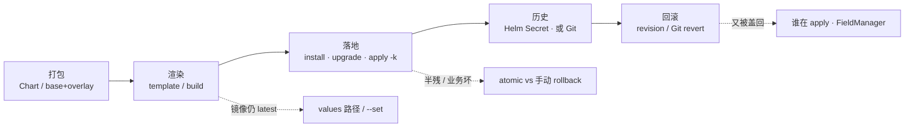
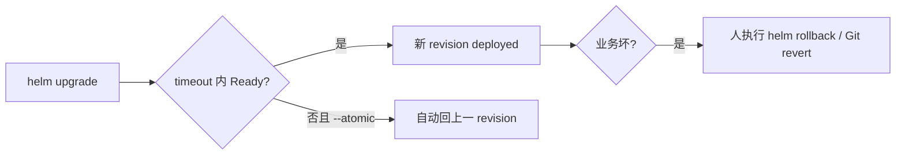
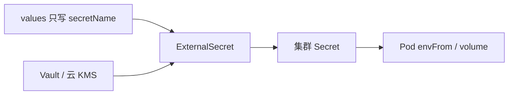
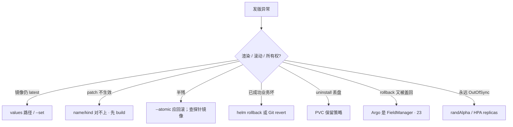

# Helm 与 Kustomize

> 同一套游戏网关：测试 3 副本、生产 10 副本，镜像 tag 还不一样；有人喊「Helm 是一种新工作负载」；另有人把库密码写进 `values-prod.yaml` 提交了；CI 升级超时一半新 Pod 没 Ready；另一天「成功了」但支付 5xx——手都别动。
> **本章回答**：一次打包发版的一生——渲染 → 落地 → 历史 → 回滚；Helm / Kustomize 怎么选、怎么混；密钥放哪。
> **不讲**：持续调和、自研控制器 → [21](../21-Operator与CRD/)；Argo 同步、self-heal、Git 回滚 → [23](../23-GitOps-ArgoCD与Tekton/)；滚动/金丝雀本身 → [16](../16-灰度与回滚/)；Secret 不是保险箱 → [12](../12-配置与密钥/)。不考 Go template 语法全集。

**标记**：🎯重点 · 🔥难点 · ⭐常考 · 🔧实操

---

## 一、一张图：一次打包发版的一生

> 🎯 **一句话**：Helm / Kustomize 最后都变成普通 YAML；集群只认标准 kind。出了问题先问「卡在渲染、落地、历史还是所有权」。



- 📖 **读图**
  - 🛤️ 主线「打包 → 渲染 → 落地 → 历史 → 回滚」；二到七节各挂一段
  - 🚨 三条虚线是值班入口：渲染不对先 template/build；落地半残看 atomic；回滚被盖回先认所有权（练习题 Q1、Q3、Q11）

口诀：⭐ **集群认的还是 Deployment / Service，不是 Chart**。

本节对应练习题 Q1。

---

## 二、入口：两者都不发明新 kind

> 🎯 **一句话**：Chart / overlay 是说明书；落盘的标准 YAML 才是真相。

| | Helm | Kustomize |
|--|------|-----------|
| 是什么 | 包管理器 + 模板引擎 | YAML 叠加器 |
| 输入 | Chart（模板 + values） | 合法 YAML + patch |
| 输出 | 标准 K8s YAML | 标准 K8s YAML |
| 历史 | Release 在集群（Secret/CM） | **没有**；回滚靠 Git |

- 📦 **Release** = 某 Chart 的一次安装实例；同一 Chart 可装多份，靠 release 名区分；`helm rollback` 靠这份历史
- 📁 **Kustomize** 没有 release 快照——回滚 = 改 Git 再 apply / sync
- 🧩 Chart 可带 CRD 文件，**kind 仍由 API Server / Operator 定义**（[21](../21-Operator与CRD/)）；Helm 只负责提交那份 YAML

> 💡 **打个比方**：Helm 像菜谱模板——同一道菜换调料（values）出不同口味；Kustomize 像成品菜上加料——base 是完整菜，overlay 只改盐量和配菜。

#### ❓ 为什么「Helm 是一种工作负载」是错的？

- ❌ 面试答「Helm 也是一种 Controller / 新 kind」——扣分
- ✅ Helm / Kustomize **都不发明新 kind**；落地的仍是 Deployment / Service / STS
- 🔍 白板上画：`Chart/values → 标准 YAML → API Server`；中间没有「Helm 对象」给调度器用

> 📝 **面试**：「两者都不发明新 kind，最终都是标准 YAML；Helm 有 release 历史在集群 Secret，Kustomize 回滚靠 Git。」⭐（练习题 Q1、Q4）

本节对应练习题 Q1、Q4。

---

## 三、渲染：Chart 怎么变成 YAML

> 🎯 **一句话**：Chart = 模板 + values；`helm template` 只渲染不提交，CI 必须先看镜像和副本。

### 📝 Chart 与两个 version ⭐

```yaml
# Chart.yaml
version: 1.2.0      # 包版本 — Chart 模板结构变了才升
appVersion: "1.2.0"  # 应用版本 — 镜像变了要钉（审计对镜像）
```

- 🏷️ **`version`**：包本身变了才升；忘了 → 回滚时对不上包
- 🏷️ **`appVersion`**：业务发版要对齐镜像；忘了 → 审计对不上
- 🏷️ **`image.tag`**：每次发版钉死；`latest` → digest 不变不拉（[16](../16-灰度与回滚/)）

### 🔧 发版前先 template 🔧

```bash
helm lint ./my-chart
helm template gw ./my-chart -f values-prod.yaml --set image.tag=1.2.1 | grep image:
#   image: registry/game-gateway:1.2.1    # ← 覆盖成功
#   # image: registry/game-gateway:latest  ← --set 或 values 路径没命中
```

- 👀 关键行要能指出来：`replicas`、`image`、有没有 `latest`
- 🎲 **禁止**模板里 `randAlpha` / `randNumeric` / `uuidv4`——每次渲染不同，GitOps 会永远 drift（[23](../23-GitOps-ArgoCD与Tekton/)）
- 🧱 模板套太深 → 抽 `_helpers.tpl`，别把三行 YAML 写成三百行

### 🌍 多环境：一套 Chart，差量覆盖

- 📁 **Helm**：`values.yaml` 默认 + `values-prod.yaml` / `values-staging.yaml` 覆盖；发版 `helm upgrade -f values-prod.yaml --set image.tag=1.2.0`
- 📁 **Kustomize**：base 一份合法 YAML，`overlays/prod` 只叠差量（副本、资源、images）
- 🧭 CD 最常用：Kustomize `images` + merge 改副本；Helm `--set image.tag`
- ⚠️ 三个环境 values 各改各的漂了 → 共享一份基础，环境文件**只放差异**；差异过大说明该拆 Chart 或改成 overlay

- 🔑 **覆盖没命中时先查路径**（不是 Helm bug）
  - Chart 里是 `image.repository` / `image.tag`，你 `--set tag=...` → 写错树
  - 同名 key 在 `-f` 文件与 `--set` 之间：后写的覆盖先写的；先 `template | grep` 再争论

#### ❓ 为什么 template ≠ 部署？

- ❌ 「跑过 `helm template` 就等于上线了」
- ✅ template **只渲染**；`install` / `upgrade` / `kubectl apply` 才提交集群
- 🧪 CI 用 template/build 当门禁；紧急才 `helm template ... | kubectl apply -f -`（不要当常规 CD）

> 🔍 **现场**：渲染后确认干净、无随机函数。

```bash
helm template gw ./my-chart | grep -c 'randAlpha\|randNumeric\|uuidv4'
# 0    # ← 干净，可以进 GitOps
```

> ⚠️ **别混**：`helm template` 输出的 YAML 和 `kubectl apply` 提交的 YAML **没有区别**——前者只是还没提交。⭐

> 📝 **面试**：「Helm 是模板引擎，输出标准 YAML；CI 必须先 template 看镜像和副本；两个 version 都要钉死，禁止 randAlpha。」

本节对应练习题 Q1、Q10。

---

## 四、落地与历史：升级、回滚、原子性 🔥⭐

> 🎯 **一句话**：`--atomic` 只覆盖**这次部署过程**失败；已 deployed 但业务坏了，要人 `helm rollback` 或改 Git。

### ⚛️ atomic 管什么

> 💡 **打个比方**：atomic 像「上菜超时整桌撤掉换上一桌」；手动 rollback 像「菜已端上桌、客人咬了一口发现咸了再换」。

```bash
helm upgrade --install gw ./my-chart -n game -f values-prod.yaml \
  --set image.tag=1.2.1 --atomic --timeout 5m
# Error: UPGRADE FAILED: release gw failed, and has been rolled back to previous release
```

```text
REVISION  STATUS      CHART                 DESCRIPTION
5         superseded  game-gateway-1.2.0    Upgrade complete
6         deployed    game-gateway-1.2.0    Rollback to 5
7         failed      game-gateway-1.2.1    Upgrade "gw" failed: timed out
```

- ✅ revision 7 failed、当前 deployed 仍是 5 → **atomic 在干活**；查探针/镜像，不要关 atomic 硬推
- 🔥 revision 7 **deployed 成功**但玩家 5xx → atomic **不会**自动回；业务回滚：`helm rollback gw 5` 或改 Git（[23](../23-GitOps-ArgoCD与Tekton/)）



- 📖 **读图**
  - 左分叉：部署过程失败 → atomic 自己回
  - 右分叉：已标成功 → 必须人动手；别指望 atomic「顺便」救业务

| | `--atomic` | 手动 `rollback` |
|--|----------|-----------------|
| 何时 | **这次部署过程中** 失败/超时 | **已经标成功** 之后业务不对 |
| 谁触发 | Helm 自己 | 人 |
| 回到哪 | 上一成功 revision | 指定序号（`helm history`） |

#### ❓ 为什么「成功了但 5xx」还要 rollback？

- ❌ 「开了 `--atomic` 就不会有坏版本留线上」——atomic 看的是 **Ready/超时**，不是支付成功率
- ✅ 部署成功 ≠ 发布成功；业务指标坏了仍要回 revision 或 Git
- 🧭 和灰度章同一口径：成功看业务，不看工具绿灯（[16](../16-灰度与回滚/)）

### 📜 历史在哪、uninstall 会怎样

```bash
helm history gw -n game
helm rollback gw 5 -n game
helm get manifest gw -n game | grep image:
#   image: registry/game-gateway:1.2.0   # ← 确认回退到旧 tag

# uninstall 前先看有没有 PVC
helm get manifest gw -n game | grep -A3 'kind: PersistentVolumeClaim'
helm uninstall gw -n game --keep-history   # 只留记录，不留盘
```

- 🗂️ **Helm v3 默认**：release 历史在集群 **Secret**（同 namespace）；`uninstall` 不加 `--keep-history` 就清空 → 没得 rollback
- 💾 **`--keep-history` 只留记录，不保留任何资源**——别当成「留 PVC」
- 🗑️ 默认 uninstall **级联删 PVC**；战斗服存档盘必须先看 manifest / 配保留策略（[11](../11-存储/)）

#### ❓ 为什么 `--keep-history` ≠ 留盘？

- ❌ 「加了 keep-history，存档盘就还在」
- ✅ keep-history = 保留 release **元数据**；PVC/Pod 照样按删除策略走
- 🛡️ 要留盘：PVC retention / 别把有状态盘放进默认删除路径；uninstall 前 `get manifest` 对一遍

> ⚠️ **别混**：`helm rollback` 回到的是 **Helm 快照里的 manifest**，不是「撤销云盘快照」；也不是撤销已执行的 DB migration。

> 📝 **面试**：「atomic 覆盖部署过程失败；业务坏了要手动 rollback 或 git revert；uninstall 默认级联删盘，keep-history 只留记录。」⭐（练习题 Q3、Q8）

本节对应练习题 Q3、Q8。

---

## 五、叠加：Kustomize base + overlay ⭐🔧

> 🎯 **一句话**：无模板，YAML 始终合法；patch 的 name/kind 对不上会**静默不生效**，必须先 `build` 确认。

### 🏠 base 与 overlay

> 💡 **打个比方**：base 是标准户型图，overlay 是「这间墙刷蓝、那间加一张床」——改哪标哪，不用重写整栋楼。

```bash
kustomize build overlays/prod/ | grep replicas:
#   replicas: 10    # ← patch 生效
#   # replicas: 3     ← patch 没命中，查 metadata.name 是否和 base 一致
```

```yaml
# replica-patch.yaml — name 必须和 base 完全一致
apiVersion: apps/v1
kind: Deployment
metadata:
  name: game-gateway-wrong   # ← 写错就静默跳过
spec:
  replicas: 10
```

#### ❓ 为什么 patch「没报错」却没生效？

- ❌ 「Kustomize bug / 要再叠一份整 Deployment」
- ✅ patch 按 **name + kind（+ namespace）** 定位；对不上就**静默跳过**，不报错
- 🧪 唯一诚实的门禁：`kustomize build` 看输出，再 `kubectl apply -k`

### 🛠️ 四种改法（生产常用前两种 + images）

| 手法 | 干什么 | 注意 |
|------|--------|------|
| **strategic merge** | 整份对象只写要改的字段 | 最直观 |
| **images** | CD 最常用，只换 tag | 别用 6902 改 image 除非必要 |
| **JSON Patch 6902** | 精确 `replace` 某个 path | `containers/0` 加 sidecar 后会指错 |
| **configMapGenerator** | 内容变则改名，触发滚动 | **故意的**；Helm 用 checksum 注解类似 |

```bash
kustomize build overlays/prod/ | grep image:
#   image: registry/game-gateway:1.2.1   # ← images 覆盖成功
```

- 🔁 **generator 加 hash**：`game-gateway-7f8k2ht9gk` → Deployment 引用变了 → 触发滚动——避免「CM 改了 Pod 还用旧文件」（[12](../12-配置与密钥/)）
- ⚠️ **6902 易碎**：sidecar 把 `containers/0` 顶走 → patch 静默打到 sidecar

#### ❓ 为什么换镜像优先用 `images`，而不是 JSON Patch？

- ❌ 「`replace /spec/template/spec/containers/0/image` 最精确」——索引是假设，不是契约
- ✅ `images` transformer 按**镜像名**匹配换 tag，加 sidecar 也不错位
- 🧪 6902 留给「必须改某个精确 path、且结构稳定」的补丁；日常换 tag 别用

#### ❓ 为什么 configMapGenerator 改名不是 bug？

- ❌ 「名字带 hash 是被攻击 / 配置坏了」
- ✅ 内容变 → 名字变 → 引用变 → **故意滚动**，让 Pod 读到新文件
- 🔗 Helm 侧同类手段：模板给 Deployment 加 checksum 注解，CM 变就滚

> ⚠️ **别混**：`kustomize build` 输出和 `kubectl apply -k` 提交的 YAML **没有区别**——apply -k 内部先 build 再 apply。

> 📝 **面试**：「Kustomize 是合法 YAML 叠加；images 最常用；patch name 对不上静默失败，必须先 build。」⭐（练习题 Q4、Q9）

本节对应练习题 Q4、Q9。

---

## 六、选型与混用：所有权只能有一个 🎯⭐

> 🎯 **一句话**：社区 Chart 用 Helm，自有多环境用 Kustomize；可以 post-render 混用，**不能三家同时 apply**。

### 🧭 怎么选

> 💡 **打个比方**：买现成家具（社区 Redis Chart）用 Helm；自己装修（游戏网关）用 Kustomize 叠差量。

| | Helm | Kustomize |
|--|------|-----------|
| 机制 | 模板 + values | YAML 叠加 |
| 参数化 | 强 | 靠 patch |
| 生态 | 海量社区 Chart | kubectl 内置 |
| 审阅 | 渲染后才是真相 | Git 里打开就是合法 YAML |
| 历史回滚 | `helm history` | Git |
| GitOps | `randAlpha` 会 drift | overlay 更稳 |
| 适合 | 社区 Redis/Kafka/Ingress | 自有游戏网关多环境 |

- 🎮 **游戏落地**：大厅/网关自有镜像 → Kustomize overlay；Redis/Kafka/Ingress → 官方 Chart + values
- 💾 战斗服有状态 PVC **不要**放进 Chart 默认删除路径
- 🧾 合服脚本不要塞进每次 gateway upgrade 的 pre-hook（长任务走 Job，见七节）

### 🔗 混用：Helm 打底 + Kustomize 补丁

```bash
helm template gw ./my-chart -f values-prod.yaml | \
  kustomize build /path/to/post-renderer/ | grep -A2 NetworkPolicy
# kind: NetworkPolicy            # ← post-renderer 注入了策略
```

- ✅ 上游 Chart 不便改 → `--post-renderer` 接 Kustomize，统一注入 NetworkPolicy / SecurityContext
- ❌ CI、Helm CLI、Argo **三家都 apply** → FieldManager 打架；停到只剩一家

#### ❓ 为什么 Argo 管 Chart 时 `helm rollback` 常不管用？

- 先交代链路：把 YAML 放 Git、用同步工具自动 apply——叫 **GitOps**（如 Argo CD，[23](../23-GitOps-ArgoCD与Tekton/)）
- Argo 管 Helm 时，集群里往往**没有**你本地那份 Helm Secret / 不是你以为的 FieldManager
- `helm rollback` 改完，仓库仍是新 tag → 下一次 sync / self-heal **盖回去**
- ✅ 正解：改 Git（或走 Argo 界面回到旧 revision），不是只点 `helm rollback`

> 📝 **面试**：「社区组件 Helm，自有应用 Kustomize；可 post-render；所有权只能一个。Argo 管了就改 Git。」⭐（练习题 Q3、Q11）

本节对应练习题 Q1、Q3、Q4、Q10、Q11。

---

## 七、密钥、hook 与生产硬规矩 🔧

> 🎯 **一句话**：values 只写 Secret **名字**；CI 默认 `upgrade --install --atomic`；长任务别塞 hook。

### 🔐 Secret 不进 Git



- 📖 **读图**
  - 仓库只声明「去哪取」；值在 KMS/Vault
  - Operator 写进集群 Secret 再给 Pod（细节 → [12](../12-配置与密钥/)）
- 🚫 密码写进 `values-prod.yaml` 提交 = 把密码本推进 Git
- 🩹 Pod Events「secret 不存在」→ 先看 ExternalSecret status，**不要**把密码填回 values

### 🪝 hook 与 migration

- `pre-upgrade` 跑 DB migration Job：失败则不要升主负载；`--atomic` + hook 失败 = 不把半成品留线上
- 滚动期新旧代码并存 → migration 走 expand/contract（[16](../16-灰度与回滚/)）
- 合服是长任务、要人工确认 → Job/流水线，**不要**塞进每次 gateway upgrade 的 pre-hook
- `emptyDir` 不能当游戏存档；drain/卸载都会丢 → 存档走 PVC（[11](../11-存储/)）

### ✅ 生产怎么选（一张表够用）

| 项 | 选 | 不选 |
|----|----|------|
| 社区组件 | Helm + 钉死 Chart version | 手抄 Kafka YAML |
| 自有游戏服 | Kustomize base/overlay | 为 3 个文件养一套模板 |
| CI | lint + template/build 过了再 CD | 生产现场才渲染 |
| 镜像 | 不可变 tag / digest | latest |
| 密钥 | values 只写名字；Vault / external-secrets | 明文进 values-prod |
| 升级 | `--install --atomic --timeout`（常见 5m） | 半残硬推 |
| 所有权 | 只让 Argo **或**只让 Helm 一方 apply | CI、Helm、Argo 三家写 |
| PVC | persist / keep | uninstall 把测服盘带走 |

- 📎 **其它硬规矩**
  - Deploy `revisionHistoryLimit` ≥ 5，否则 `rollout undo` 无历史（[16](../16-灰度与回滚/)）
  - Helm hook 失败配合 `--atomic`：不把半成品留线上
  - post-renderer 可以注入策略，但**不要**再叠第三家 apply 把所有权弄糊

验收：`helm template` / `kustomize build` 过策略扫描；装完 `helm history` 或 Git 能指回这一版；Secret 不在 Git diff 里。

> 📝 **面试**：「CI 用 `upgrade --install --atomic`；回滚只回到 Helm 快照或 Git，不是撤销云盘；密钥只引名字。」

本节对应练习题 Q2、Q5、Q6、Q12。

---

## 八、作战：定责 🔧

> 🎯 **一句话**：渲染对不对、历史还在不在、谁在 apply——三个方向定位。



- 📖 **读图**
  - 先分「渲染 / 过程失败 / 业务失败 / 所有权」四类，再动刀
  - 别一上来关 atomic 硬推

| 现象 | 先做什么 | 不要做什么 |
|------|----------|------------|
| 渲染里还是 latest | 对 values 路径 / `--set` | 直接装到生产 |
| timeout，release 自己回上一版 | atomic 在干活；查探针 | 关 atomic 硬推 |
| Ready 但玩家进不去 | 业务回滚；Argo 则改 Git | 只点 helm rollback（若 Argo 管） |
| patch 静默无效 | `kustomize build` | 再叠一份整 Deployment |
| 6902 改错容器 | sidecar 把 0 顶走了 | 用 images / merge |
| uninstall PVC 没了 | 保留策略 / 别放进删除路径 | 当 Helm bug |
| CM 改了却滚动 | generator hash，故意的 | 当被攻击 |
| 滚动中再 upgrade | 等这次结束 | 叠 revision |

### 60 秒剧本 🔧

> 🔍 **现场**：接到「升级挂了 / 成功了但 5xx / patch 没生效」，60 秒走完再下结论。

```text
① 0–10s   先问：渲染错？过程失败？业务坏？回滚被盖回？
② 10–30s  helm template / kustomize build 看镜像·副本；helm history 看 STATUS
③ 30–45s  定型：A 路径没命中 · B atomic 已回 · C 需手动 rollback/Git · D FieldManager 打架
④ 45–60s  止血：B 查探针别关 atomic；C 回 revision 或改 Git；D 停到只剩一家 apply
```

- 🎮 活动窗口不要升级网关 Chart；战斗服 PVC 卸载前先看 manifest
- CI 只渲染校验，真正 apply 交给**唯一**的 CD

本节对应练习题 Q7、Q11、Q14。

---

## 九、收口

### 命令速查 🔧

```bash
# 渲染门禁
helm lint ./my-chart
helm template gw ./my-chart -f values-prod.yaml --set image.tag=1.2.1
kustomize build overlays/prod/

# 装 / 升 / 历史
helm upgrade --install gw ./my-chart -n game -f values-prod.yaml \
  --set image.tag=1.2.1 --atomic --timeout 5m
helm history gw -n game
helm rollback gw 5 -n game
helm get values gw -n game
helm get manifest gw -n game          # uninstall 前看 PVC
helm uninstall gw -n game --keep-history

# overlay 落地
kubectl apply -k overlays/prod/
```

### 面试锚点

| 问 | 30 秒答 |
|----|---------|
| Helm 是新工作负载吗？ | 不是。包管理器 + 模板；输出仍是标准 YAML，集群认 Deployment/Service。 |
| Helm vs Kustomize？ | 都输出标准 YAML；Helm 有 release 历史在集群 Secret，Kustomize 回滚靠 Git。社区 Chart 用 Helm，自有多环境用 overlay。 |
| template 和 apply 的 YAML 有区别吗？ | 没区别；template 只渲染，apply/install 才提交。 |
| `--atomic` 等于业务回滚吗？ | 不等于。只覆盖这次部署过程失败/超时；已成功但业务坏要人手 rollback 或改 Git。 |
| Argo 管 Chart 时 rollback？ | 往往没有可用的 Helm Secret / self-heal 会盖回；改 Git。 |
| patch 不生效？ | name/kind 对不上静默跳过；先 `kustomize build`。 |
| 密码能进 values-prod 吗？ | 不能。只引名字；Vault / external-secrets。 |
| uninstall 删盘吗？ | 默认级联删 PVC；`--keep-history` 只留记录不留盘。 |
| `randAlpha` 行不行？ | 不行。每次渲染不同 → GitOps 永远 drift。 |
| post-renderer 干什么？ | 不改上游 Chart 时注入策略；叠完后所有权仍只能一家。 |

### 易错一句话对照

- Helm 是新 kind → 只是包管理器；落地仍是标准资源
- template 就是部署 → 只渲染；install/upgrade/apply 才落地
- `--set` 不生效怪 Helm → 先 grep 渲染输出，多半 values 路径没命中
- `--atomic` = 业务回滚 → 只管部署过程失败；5xx 要人手回
- Argo 管 Chart 用 helm rollback → 常被 sync 盖回，改 Git
- Kustomize 有 helm history → 没有；回滚靠 Git
- patch 不生效是 bug → name/kind 对不上静默跳过
- JSON Patch 改 image 最精确 → 用 images；`containers/0` 加 sidecar 会错位
- configMapGenerator 滚动是 bug → hash 改名故意触发滚动
- `--keep-history` 留盘 → 只留 release 记录
- uninstall 不删盘 → 默认级联；PVC 要 keep
- 三家同时 apply 更稳 → 所有权只能一个
- 密码进 values-prod → 只引名字；值在 Vault/KMS
- `randAlpha` 方便生成密码 → GitOps 永远 OutOfSync
- emptyDir 当游戏存档 → drain/卸载都丢
- 合服脚本当 Helm hook → 长任务走 Job
- 滚动中再 upgrade 加速 → 等当前 revision 结束，叠升级出半残

### 数字墙

> 除特别说明外都是**常见生产口径**。CI `--timeout` 常见 **5m** · Deploy `revisionHistoryLimit` ≥ **5** · 生产钉死 **Chart `version` + `appVersion` + 镜像 tag/digest** · Helm v3 release 历史默认在同 NS **Secret** · 单对象配置上限见 [12](../12-配置与密钥/)（1MiB）· 灰度与滚动字段见 [16](../16-灰度与回滚/)

---

## 合上书

对着第一节主图口述一遍：打包 → 渲染 → 落地 → 历史 → 回滚；开篇那几个人各自错在哪，现在该能说清。

- [ ] **默画主图**：Chart/overlay → 标准 YAML → API Server；Helm Secret 历史 vs Git；三条值班虚线各照哪。（→ Q1）
- [ ] **口述入口**：为什么不是新 kind；Release 是什么；Kustomize 为什么没有 history。（→ Q1、Q4）
- [ ] **口述渲染**：两个 version 怎么钉；template ≠ 部署；为何禁 randAlpha。（→ Q1、Q10）
- [ ] **口述 atomic**：过程失败 vs 业务坏；history 怎么读；keep-history ≠ 留盘；uninstall 与 PVC。（→ Q3、Q8）
- [ ] **口述 overlay**：四种改法；patch 静默失败；images vs 6902；generator hash 故意滚。（→ Q4、Q9）
- [ ] **口述选型**：社区 Helm / 自有 Kustomize；post-render；为何 Argo 下 helm rollback 常失效。（→ Q3、Q11）
- [ ] **口述密钥与 hook**：values 只写名字；migration 向后兼容；合服不进 pre-hook。（→ Q2、Q6、Q12）
- [ ] **定责 60 秒**：渲染 / atomic / 业务回滚 / FieldManager 四型各先做什么。（→ Q7、Q11、Q14）

下一章：[GitOps · Argo CD 与 Tekton](../23-GitOps-ArgoCD与Tekton/)。密钥真相：[12](../12-配置与密钥/) · 灰度回滚：[16](../16-灰度与回滚/) · Operator：[21](../21-Operator与CRD/)。
